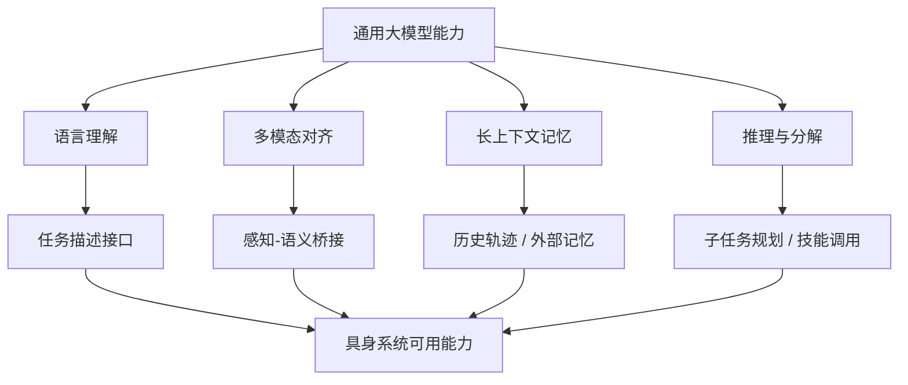

# 第七部分 对具身系统真正有用的大模型基础

第五部分和第六部分分别说明了具身系统不能绕开的物理约束，以及学习型机器人为何天然走向训练闭环。本部分则要把问题进一步收紧：并不是所有在纯文本或通用多模态任务中成功的大模型能力，都能等价迁移到机器人系统中。真正重要的问题，是哪些能力会进入具身主链路，哪些能力在物理世界中会被重新解释，哪些能力虽然在公开叙事中十分耀眼，却在机器人场景里暂时不应被高估。

因此，本部分不写一章通用大模型综述，而只聚焦那些会直接决定后续 VLA、规划推理和系统架构写法的要素：序列建模、跨模态对齐、语言作为任务接口、高层推理能力，以及这些能力在动作空间与实时闭环中暴露出的新问题。Transformer 之所以成为后续一切统一路线的基础，并不只因为它“模型大”，而是因为它提供了一个足够一般的序列接口，使状态、语言、图像、动作甚至回报都能够被放在同一上下文中处理。[Attention Is All You Need](https://arxiv.org/abs/1706.03762)

但具身系统真正需要的大模型能力，与互联网任务中的“能力排行榜”并不一致。机器人更关心的是：模型是否能把历史观测压缩为可执行上下文、是否能把语言映射成任务结构、是否能在多模态条件下保留物理可执行性、以及是否能在不稳定环境中持续纠错。PaLM-E、RT-2、OpenVLA 等工作的重要性，更多在于它们探索了这些接口如何建立，而不是已经证明了“通用机器人大脑”成熟。[PaLM-E](https://arxiv.org/abs/2303.03378)、[RT-2](https://arxiv.org/abs/2307.15818)、[OpenVLA](https://arxiv.org/abs/2406.09246)

## 32. Transformer 与序列建模

### 32.1 序列建模为何适合机器人数据

序列建模之所以对机器人有吸引力，是因为机器人从来不是静态分类问题，而总是一个随时间展开的闭环过程。观测是时间序列，动作是时间序列，奖励和失败恢复同样是时间序列。Transformer 提供的并不是“更强语言能力”这一单点优势，而是一种把不同时间步信息放到统一上下文中建模的能力。对机器人而言，这意味着系统不必再严格把“感知”“规划”“控制”拆成完全独立的学习模块，而可以尝试在更长时间范围内联合建模它们之间的依赖关系。

一个标准的自注意力形式可写为：

\[
\mathrm{Attention}(Q,K,V)=\mathrm{softmax}\left(\frac{QK^T}{\sqrt{d_k}}\right)V
\]

这个公式的重要意义，不在于它已经足够解释所有机器人序列问题，而在于它提供了一种可扩展的上下文聚合机制：系统可以根据当前 token 与历史 token 的相关性，选择性地调取过去观测、动作或语义信息。这为长时程任务分解、历史轨迹利用和多步纠错提供了统一接口。

### 32.2 自回归策略学习与条件似然
自回归策略学习可以被理解为“把动作序列当成条件序列建模问题”。给定观测、历史状态和任务上下文，模型不一次性输出整条控制轨迹，而是像语言模型那样，按时间顺序一步一步预测下一个动作 token 或动作向量。它的基本训练目标与语言建模高度相似，本质上是在最大化条件似然：

```math
\max_\theta \sum_t \log p_\theta(a_t \mid o_{\le t}, a_{<t}, g)
```

其中 \(o_{\le t}\) 表示截至当前的观测上下文，\(a_{<t}\) 表示历史动作，\(g\) 表示语言目标或任务条件。这个形式的关键价值，在于它天然适合多模态时序数据，也便于把动作预测、语言条件和历史上下文统一进同一序列接口。

一个极简推理过程可以写成：

```python
context = encode(observation, history, goal)
next_action = autoregressive_policy.sample(context)
execute(next_action)
```

一旦把机器人控制写成序列问题，就可以把策略训练重写为条件似然最大化问题。对于离散动作 token 或 chunk token，常见目标为：

\[
\max_\theta \sum_{t=1}^{T}\log p_\theta(a_t \mid o_{\le t}, a_{<t}, l)
\]

其中 \(o_{\le t}\) 表示截至时刻 \(t\) 的观测历史，\(a_{<t}\) 表示历史动作，\(l\) 表示任务语言。这个目标与语言模型表面上很相似，但在机器人里多了两个关键差异：第一，动作错误会通过物理系统放大；第二，历史观测不仅是语义上下文，还是控制可行性的状态依据。因此，机器人中的条件似然优化永远不是“把动作当句子生成”那么简单。

### 32.3 token 化在动作建模中的含义

一旦把机器人问题写成序列建模，就自然会触及动作 token 化问题：动作到底应被视为连续控制量、离散 token、chunked action，还是更高层技能 token？这不是一个纯实现细节，而是决定系统怎样理解动作空间的根本选择。连续动作表示保留了物理精度，但难以直接复用语言模型接口；离散 token 便于统一建模，却可能粗化控制语义；action chunking 则试图在短期控制平滑性与长时程规划之间做折中。

如果把长度为 \(H\) 的动作块写成：

\[
A_t = [a_t, a_{t+1}, \dots, a_{t+H-1}]
\]

那么模型输出的就不再是单步动作，而是一个局部时间窗口中的动作计划。这种写法在机器人中的吸引力在于，它能减轻逐步 autoregressive 生成造成的抖动和误差累积，也更接近很多现实控制器按小时间段执行参考轨迹的方式。ACT、Diffusion Policy 与多种 chunk-based policy 都体现了这一路线的工程合理性。[ACT](https://arxiv.org/abs/2304.13705)、[Diffusion Policy](https://arxiv.org/abs/2303.04137)

### 32.4 上下文窗口与长期任务问题

在具身系统里，上下文窗口的含义比文本任务更具体。文本模型里，窗口不足常表现为“前文忘了”；机器人系统里，窗口不足会直接表现为状态摘要丢失、子任务切换错误、恢复历史丢失和环境变化被误解释。一个抓取失败后的第二次尝试之所以可能更好，并不只是因为“模型又想了一次”，而是因为系统若能保留刚才失败时的位姿、接触状态、遮挡关系和人工纠错信息，就能在下一轮动作生成中避免重复犯错。

因此，长时程机器人任务通常不会把所有历史都原样塞进模型，而会做分层压缩。最常见的做法是把历史拆成三层：

1. 高频控制历史：最近若干步的状态、动作和观测，用于局部闭环。
2. 技能级摘要：上一段技能做了什么、成功还是失败、失败类型是什么。
3. 任务级记忆：当前任务目标、已完成子目标、环境中的关键对象和人为约束。

从系统实现角度看，这意味着“上下文窗口”很少只是一个 tokenizer 长度问题，而更像一个记忆体系设计问题。后文之所以反复出现外部记忆、检索增强、技能日志和失败回流，原因都在这里。

因此，长上下文真正有价值的地方，不在于“窗口更长”本身，而在于系统是否知道哪些历史应被压缩保留、哪些应被丢弃、哪些必须转写到外部记忆中。对具身系统而言，记忆从来不是越多越好，而是越有决策价值越好。一个机器人若把全部视觉帧与全部交互历史无差别塞进上下文，通常只会同时损失时延预算与状态新鲜度；更合理的做法是把关键事件、失败节点、已完成子任务和环境变化摘要化，再把高频控制交给更低层闭环。

语言模型的上下文窗口扩展，在机器人里并不只是“能记住更多文本”这么简单。它对应的是系统能否把更长时间跨度的任务历史、交互历史、失败恢复历史和环境状态变化纳入决策。然而，这里也存在一个根本差异：文本上下文的时间代价通常不直接作用于物理执行，而机器人中的长上下文必须与实时性、状态新鲜度和控制稳定性同时兼容。一个模型即使能回忆几十步之前的任务意图，也不意味着它能在毫秒级控制环上稳定工作。

更严格地说，机器人中的上下文管理问题可以写成一个受资源约束的历史压缩问题。若把历史摘要记为 \(m_t\)，则系统并不是简单保留全部历史 \(h_t\)，而是在带宽、显存、时延和任务价值约束下学习一个压缩映射：

\[
m_t = c_\psi(h_t), \qquad \pi(a_t \mid o_t, m_t, g)
\]

这里真正困难的不是“压缩得更短”，而是“在压缩后仍保留对下一步决策最有价值的信息”。这也是为什么检索增强、事件记忆和任务摘要在机器人里往往比盲目扩窗口更现实。[SayCan](https://say-can.github.io/)、[Code as Policies](https://code-as-policies.github.io/)

进一步说，机器人里的长期任务并不是单一时间尺度的问题，而是至少同时包含三层记忆：毫秒到百毫秒级的控制状态、秒级到分钟级的子任务上下文、分钟级以上的任务与环境历史。把这三层都塞进同一个 transformer 上下文，通常既不经济，也不稳定。更合理的系统做法是把“短环控制状态”留给局部控制器，把“近期任务历史”留给策略模型，把“可检索的关键事件”写入外部记忆或任务日志。

从工程实现角度看，一个更接近可部署系统的上下文更新流程往往类似如下伪代码：

```python
obs_t = read_observation()
local_state = controller_state.update(obs_t)
event_t = detect_key_event(obs_t, local_state)

if event_t is not None:
    memory_bank.write(summarize(event_t))

recent_context = rollout_buffer.last_k_steps()
retrieved_memory = memory_bank.retrieve(task_goal, obs_t)
policy_input = compose(recent_context, retrieved_memory, task_goal)
action = policy(policy_input)
```

这个流程说明，具身系统真正需要的不是“无限窗口”，而是“可筛选、可压缩、可检索、可回退”的历史管理。也因此，后续很多所谓长上下文机器人工作，真正值得看的不是窗口长度数字，而是它如何定义关键事件、如何做记忆读写、以及是否证明这些机制对长期成功率与恢复能力确有贡献。

### 32.5 为什么动作序列与文本序列不能简单类比

这是机器人领域对大模型最重要的纠偏之一。文本 token 的错误，通常表现为语义偏差或事实错误；动作 token 的错误，可能直接导致碰撞、跌倒、抓取失败或对环境造成损伤。文本序列的“近似正确”在物理世界里往往并不够用。因此，把动作建模成序列当然有价值，但动作序列永远带有比文本序列更强的可执行性约束、连续性约束与安全约束。这一差异将直接延伸到后文的 VLA 路线争议。

进一步说，文本允许局部近似正确，因为后续上下文常常还有机会修补前文误差；动作则不同，单步误差会经由接触、摩擦、惯性和机构弹性被迅速放大，并改变后续观测分布。也因此，机器人里的序列建模最终不能只停留在“下一个 token 是否合理”，而必须回到控制意义上的稳定性、可执行性和安全性评价。

如果把文本生成写成离散序列建模：

\[
p(x_{1:T}) = \prod_{t=1}^{T} p(x_t \mid x_{<t})
\]

那么动作建模虽然也常写成类似因子分解，但其真实执行代价更接近：

\[
J = \sum_{t=1}^{T} \ell(x_t, a_t) + \lambda_1 \, \mathrm{Risk}(a_t) + \lambda_2 \, \mathrm{Smooth}(a_{t-1}, a_t) + \lambda_3 \, \mathrm{DynMismatch}(a_t)
\]

这里多出来的 \(\mathrm{Risk}\)、\(\mathrm{Smooth}\) 与 \(\mathrm{DynMismatch}\) 项，恰恰对应物理系统中的碰撞风险、动作连续性与动力学可实现性。文本模型可以主要以似然或偏好建模为目标，但机器人动作若不显式或隐式满足这些约束，就会在真实执行里迅速失效。

这也是为什么很多看起来“像语言模型一样生成动作”的路线，最后仍不得不引入 action chunk、低层控制器、动作滤波器、安全监视器甚至 MPC 后端。它们不是对基础模型路线的背离，而是在承认一个事实：动作 token 只是接口形式上的 token，背后仍然连着连续时间、连续状态和接触动力学约束。

从学习角度看，文本 token 的语义边界往往由离散词表天然给出；动作 token 的边界却常常是人为设计的。我们到底是直接预测关节增量、末端位姿、力控目标、技能标签，还是 latent action code，本身就会改写问题难度。因此，动作序列与文本序列最容易被误类比的地方，不是都能“自回归”，而是忽略了动作表示、执行器、控制频率和安全闭环共同构成了真正的问题定义。

## 33. 多模态表示学习

### 33.1 图像、文本、动作的对齐问题

对具身系统而言，多模态并不是“多放几种输入”而已，而是在回答一个更本质的问题：如何让视觉观测、语言指令、状态量和动作结构进入同一可比较空间。CLIP 的成功说明，大规模对比学习可以让图像与文本在共享语义空间中对齐。[CLIP](https://arxiv.org/abs/2103.00020) 但机器人系统需要进一步回答的问题是：动作应如何进入这套空间？状态量与接触信息如何在其中占据位置？以及共享语义空间究竟应更多承载“理解”还是“可执行性”？

典型的对比学习目标可以写为：

\[
\mathcal{L}_{\mathrm{InfoNCE}} = -\log \frac{\exp(\mathrm{sim}(z_i, z_j)/\tau)}{\sum_k \exp(\mathrm{sim}(z_i, z_k)/\tau)}
\]

这个目标之所以关键，是因为它把“哪些模态片段应被拉近，哪些应被推远”转化为可优化问题。机器人中的多模态表示学习，实质上是在不断回答：什么才算“同一任务语义”的跨模态对应物。

### 33.2 对比学习与生成式建模
对比学习与生成式建模常被并列提及，是因为它们分别代表了两种不同的表征形成逻辑。对比学习更关心“哪些样本应该在语义空间里靠近，哪些应该远离”；生成式建模则更关心“给定部分上下文后，模型能否补全缺失内容”。前者倾向于学到判别性语义结构，后者倾向于学到可条件生成与预测能力。

若写成最小形式，对比学习常见目标可表示为：

```math
\mathcal{L}_{contrast} = - \log \frac{\exp(\mathrm{sim}(z_i, z_i^+)/\tau)}{\sum_j \exp(\mathrm{sim}(z_i, z_j)/\tau)}
```

生成式建模则更像：

```math
\max_\theta \log p_\theta(x_{\text{target}} \mid x_{\text{context}})
```

对机器人来说，这两条路线并不是互斥的。对比学习更适合稳定对齐图像、语言、动作的共享语义空间；生成式建模更适合补全未来动作、视频帧或任务描述。很多现代表征系统其实是在二者之间折中，而不是纯选一边。

从工程角度看，这意味着不能把“表示学得好”和“系统就能用”画上等号。很多对比表示非常适合做召回、聚类和语义匹配，但一旦进入接触级动作生成，系统仍需要额外的动态约束和控制接口；反过来，很多生成模型虽然能重建更丰富的未来，但若无法被规划与执行模块消费，其部署价值仍然有限。因此，在具身系统里，对比路线常常承担“把什么与什么对齐”的职责，生成路线则承担“在对齐之后还能否形成动作条件分布”的职责，二者并不是简单替代关系。

对比学习擅长构造语义分离结构，生成式建模则擅长保留更丰富的条件分布信息。二者在机器人中的分工并不固定：前者更适合表示检索、匹配与对齐，后者更适合视频预测、动作生成和未来状态想象。问题在于，生成得逼真并不自动意味着生成得可执行；对齐得好也不自动意味着动作接口足够稳定。因此，多模态模型在具身系统里的价值，必须始终与可执行性链路一起被检验。
如果从系统职责角度看，两条路线更像不同部件而不是彼此替代。对比学习更适合承担“把什么和什么组织到一起”的职责，生成式模型更适合承担“在这些条件之下可能会发生什么”的职责。前者天然适合检索、路由、聚类与共享坐标系构建，后者更适合未来状态分布、动作分布和多步展开；真正成熟的具身系统往往会把两者组合使用，而不是押注单一路线。

更进一步，如果把对比表示和生成表示分别记作 \(z^{disc}\) 与 \(z^{gen}\)，那么更现实的系统目标往往不是二选一，而是同时满足：

\[
z^{disc} \text{ 便于检索与任务匹配}, \qquad
z^{gen} \text{ 便于预测与动作条件化}
\]

这解释了为什么很多具身系统不会直接把单一 embedding 当成万能接口，而是保留多种中间状态：检索用一种，规划用一种，动作条件化再用另一种。所谓“统一模型”，现实里经常只是“共享一部分 backbone”，而非所有中间表示完全同构。

### 33.3 跨模态共享语义空间

跨模态共享语义空间之所以诱人，是因为它似乎让“看到杯子”“读到 cup”“做出 grasp action”这三件事都能在同一语义坐标中相遇。对机器人来说，这种统一确实有三个直接价值：

1. 可把自然语言指令更自然地投射到视觉对象与任务条件上。
2. 可让跨任务迁移更多依赖共享概念，而不只是共享像素统计。
3. 可让同一对象在“描述、检索、规划、执行”几个阶段使用相近表示。

但共享空间真正困难的地方，在于“语义相近”并不等于“动作可替换”。例如 mug 和 bowl 在视觉语言空间中可能都接近“容器”，但抓取点、重心、摩擦、可堆叠性、是否有把手等性质会让动作空间非常不同。也就是说，跨模态共享语义空间更适合作为任务理解和对象检索接口，而不是直接当作低层控制等价类。

共享语义空间之所以诱人，是因为它为跨平台、跨任务和跨场景复用提供了统一坐标系。但它也会制造一个常见误区：语义上靠近，并不等于控制上可交换。一个“杯子”的图文语义表示可以高度稳定，但不同机械臂、不同抓手和不同场景下的可行动作分布仍可能截然不同。因此，真正有用的共享空间往往不是把所有模态彻底压平，而是在共享语义之上保留足够多的本体与动作条件信息。

这意味着共享空间既要统一，又不能过度抹平执行关键差异。如果统一表示丢失了接触条件、可达性边界、抓取稳定性或时序依赖，那么所谓“统一”就只是表面统一。更合理的目标不是让所有模态都压成同一种抽象，而是在共享语义坐标上保留足够的执行结构残差，使模型既能共享任务意义，又不会误把不同本体上的动作后果视为同一件事。

PaLM-E 的代表性意义之一，在于它尝试把语言、视觉和连续状态信号统一接入到 embodied multimodal language model 中。[PaLM-E](https://arxiv.org/abs/2303.03378) 这类路线说明，机器人领域对多模态的期待已经不再只是“图像辅助语言理解”，而是希望不同模态能够共享一套足够稳定的中间语义结构，使任务理解、环境解释和动作条件化可以在同一模型族中协同发生。

但这里要持续保留一个判断：共享空间只有在“不损失执行关键差异”的前提下才真正有价值。若共享只是把所有模态压扁成统一 embedding，却无法保留本体、接触和时序约束，那它对机器人更像表面统一，而不是可执行统一。

### 33.4 多模态统一接口为何重要但也危险

多模态统一接口之所以重要，是因为它为视觉、语言、动作、状态和记忆提供了共享交换层，使得系统更容易把不同模块组织到同一模型或同一训练范式中。没有统一接口时，每条链路都可能依赖独立数据格式、独立时间轴和独立监督方式，系统很难形成真正可扩展的共用底座。

但它的危险也同样明显。若统一接口是在过于激进的抽象层上建立的，系统就可能把本该保留的物理细节、时间结构和控制约束一并压扁，最终换来表面统一、实则难以执行的表示。因此，接口统一不是越早越好，也不是越彻底越好，而是必须围绕真实可执行性谨慎设计。

统一接口的重要性在于，它确实能够降低模块边界过硬带来的信息损失，也能够提高跨任务迁移能力。但其危险性同样清楚：如果统一接口优先编码的是互联网语义而不是物理可执行性，那么系统看起来可能更懂任务，却未必更会做事。也就是说，统一模态空间越强，越需要持续追问：这个空间究竟在为哪种下游目标服务？

更危险的是，统一接口有时会掩盖真实的跨层不匹配。团队可能因为“图像、语言、状态都已经进了同一个模型”而误以为高层语义对齐已经自动解决了低层执行问题，但实际没有被统一的是时延预算、接触不确定性和安全边界。因此在评估统一接口时，必须明确追问它究竟统一到了哪一层，是仅统一任务描述，还是已经统一到了可执行动作条件。

这也是为什么后文在讨论 VLA、世界模型和大小脑分层时，会反复回到“接口统一到了哪一层”这个问题。统一接口不是目的本身，而是为了降低系统真实复杂性；若它只是把复杂性藏起来，就不应被高估。

## 34. 从 VLM 到 VLA

### 34.1 感知理解能力如何迁移到机器人
感知理解能力迁移到机器人，最大的误区是把“能看懂图像”直接等同于“能支持动作闭环”。对机器人真正有用的迁移，不只是对象识别、场景描述或视觉问答，而是要把感知输出重新压缩成与动作相关的变量，例如可抓取区域、可通行空间、对象关系、阶段性子目标与异常线索。也就是说，迁移不是把 perception 结果原样搬过来，而是重写它的用途。

因此，衡量感知迁移是否成功，更好的问题不是“模型是否更聪明”，而是“它是否减少了后续规划与控制的不确定性”。很多通用视觉语言能力在机器人里依旧有价值，但只有当它们被稳定映射到任务约束与动作接口上时，这种价值才真正成立。

但“迁移”真正成立的前提，是感知模型输出能够被机器人系统转换成带约束的任务对象，而不是停留在开放语义描述层。换句话说，VLM 给机器人带来的最大价值通常不是替代所有感知模块，而是为任务相关对象、关系和场景状态提供更灵活的高层解释接口。例如“哪个是我要拿的杯子”“这个抽屉是否半开”“桌面是否已清空”这类问题，VLM 确实能提供更自然的语义入口；但一旦进入抓取点、接近方向和接触时机，系统仍需回到更具体的几何、状态估计和控制链路。

视觉语言模型的重要性，在于它们为机器人提供了一种更通用的感知理解前端。系统不必再完全依赖任务专用检测器或手工标签规则，而可以借助更一般的视觉-语言对齐能力进行对象识别、场景解释和语义条件化。这正是 RT-2 和 PaLM-E 等工作引发具身智能重新升温的重要原因之一。[RT-2](https://arxiv.org/abs/2307.15818)、[PaLM-E](https://arxiv.org/abs/2303.03378)

更准确地说，VLM 真正迁移过来的不是“控制能力”，而是更强的任务相关场景解释能力。它们让机器人更容易知道该看哪里、该把哪些对象关系送给后续模块，但还不能自动替代几何、状态估计和控制链路。

### 34.2 语言作为任务接口的优势与代价

这意味着语言更适合作为“任务压缩接口”，而不是“执行细节接口”。它擅长表达目标、约束和优先级，却不适合直接承载所有接触细节、时间预算和安全边界。因此，成熟系统往往需要把自然语言进一步转写为更结构化的中间目标与技能调用条件，再由技能层和控制层继续向下展开。若缺少这一层转写，语言接口的灵活性反而会变成执行层的不确定性来源。

语言作为任务接口的最大优势，是它天然适合作为高层任务描述、用户交互和技能调度入口。相较于为每个任务手写状态机和程序模板，语言确实能提供更灵活的人机接口与更自然的任务组合方式。但其代价也同样明显：语言本身是模糊的、不完整的、上下文依赖的，而且往往缺少控制层真正需要的精确执行约束。

如果把语言接口真正下推到系统中，它通常要经历如下转写链：

```python
instruction = "把易碎的杯子放到右边托盘，不要碰倒旁边瓶子"
task_spec = parse_language(instruction)
constraints = ground_constraints(task_spec, scene_state)
skill_plan = bind_to_skills(task_spec, constraints, skill_library)
```

这里 `task_spec`、`constraints` 和 `skill_plan` 往往分别属于不同抽象层。大模型在第一步和第二步最有优势，但第三步开始就要显著依赖本体、技能库和现场状态。也正因此，语言接口的真实价值更像“把人类意图接入系统”，而不是“替代执行接口本身”。

### 34.3 动作输出是最难补上的一环

动作输出之所以比文本输出难得多，可以把它拆成四个工程原因：

1. 文本 token 的错误通常是离散且可延后纠正的，动作错误常常会立刻造成碰撞、滑移或任务失败。
2. 文本生成对时延较宽容，动作生成必须满足控制周期和安全预算。
3. 文本空间天然离散，动作空间往往连续、多峰且与 embodiment 强绑定。
4. 文本结果常常只需“语义大致对”，动作结果则要同时满足几何、动力学和时序约束。

因此，把 VLM 变成 VLA，从系统角度看并不是“多加一个 action head”那么简单，而是要重新回答：动作是连续回归、离散 token、chunk 还是技能调用；错误由谁兜底；模型更新频率和控制器更新频率如何分层；遇到超出分布的状态时系统先停、先问人还是先回退技能。

一个更接近真实系统的抽象接口通常更像：

```python
obs = multimodal_encoder(camera, proprio, history, instruction)
proposal = action_model.sample(obs)
checked = safety_layer.filter(proposal, state_estimate)
command = low_level_controller.track(checked)
```

这里真正决定可部署性的，并不是 `sample()` 这一行，而是后面两层是否存在且是否可靠。
动作输出之所以最难，不是因为它只是“多一个 head”，而是因为它必须把语义理解重新映射回受物理约束的控制接口。图像与文本的对齐主要发生在语义空间中，而动作输出则必须面对执行频率、关节限制、接触稳定性、时延、控制噪声和安全边界。

若把 VLM 到机器人策略的落差写成映射问题，它更像：

\[
(\text{vision}, \text{language}) \rightarrow \text{intent} \rightarrow \text{feasible action}
\]

其中最后一步并不是简单线性投影，而往往需要额外动作表示、技能层或控制层承接。也正因为如此，很多“看懂了任务”的模型，最后仍会在“做对动作”这一环失败。

动作输出难，不只是因为输出维度高，而是因为它一旦出错，代价会立刻通过物理链路放大。文本错误可能只是答案不准，动作错误却可能直接导致碰撞、跌倒、夹持失败或环境损伤。因此，这一层天然需要比纯文本生成更强的约束、过滤与回退机制。这也是为什么很多“从 VLM 到 VLA”的进展，真正困难的部分不在视觉编码器或语言主干，而在动作表示、低时延推理和闭环修正接口。

从 VLM 走向 VLA，看起来只是“再加一个动作头”，但实际上这是整个系统里最难的一步。因为视觉与语言理解主要解决的是语义问题，而动作输出必须同时满足控制频率、连续性、物理可实现性和安全约束。这也是为什么许多看似成功的多模态机器人路线，一旦走到真实动作生成与长期闭环执行时，性能和可靠性会迅速掉下来。

### 34.4 从“看懂”到“做对”中间缺了什么
从“看懂”到“做对”之间缺的，通常不是再多一个识别模块，而是整条从语义理解到可执行约束的转译链。系统必须把“桌上有一个杯子”这种描述变成“杯口朝向、可抓区域、接近路径、碰撞边界、动作后验收条件”等可以驱动执行的结构。如果这条转译链缺失，大模型即使理解正确，也很难稳定地做对。

这也是为什么具身智能中的关键问题常常不在“看不看得懂”，而在“怎么把看懂变成一个可验证、可恢复、可重试的动作计划”。理解能力真正进入机器人，靠的不是名词对齐，而是接口对齐。

从“看懂”到“做对”中间真正缺失的，不只是一个动作解码器，而是一整条把语义理解压缩为可执行闭环的中间链路。系统需要把高层语言目标映射到对象指代、空间约束、时间顺序、技能调用、异常检测与恢复策略，而这些环节任何一处失配，都可能让“理解正确”最终变成“执行失败”。

这也是为什么很多看起来已经具备很强视觉问答或场景理解能力的模型，一旦进入真实机器人闭环后表现会大幅下降。它们缺少的往往不是知识本身，而是把知识嵌入动作、反馈和环境变化中的能力。对具身系统来说，真正稀缺的不是“知道答案”，而是“把答案变成可重复兑现的身体行为”。

中间缺的并不是一个小模块，而是整条可执行性链路：状态估计、动作表示、低层控制、接触建模、异常恢复和安全回退。这一差距解释了为什么“更会看、更会说”的机器人不必然“更会做”，也解释了后文为什么必须单独讨论系统架构、技能层、数据工程和部署约束。

换句话说，很多系统不是只差一个动作头，而是缺整条桥接链：把感知结果变成可用状态、把语义目标变成中层约束、把动作表示接到闭环控制、把失败处理接到恢复与回退。只要这条链上任何一个环节空缺，高层模型即使“理解得更像人”，也很难真正转化为物理世界里的稳定执行。

这一定义几乎可以看作后文 08、11、15 三章的总入口。因为后续很多章节，实际都在拆这条桥接链上的某一个关键缺口。

## 35. 大模型推理能力与机器人规划

### 35.1 指令分解
指令分解可以理解为“把高层自然语言目标重写为一串带约束的可执行子目标”。其关键不是把一句话拆成更多句子，而是让每个子目标都能对应到某个技能、状态检查或资源约束。对具身系统而言，真正有用的分解往往要同时保留顺序依赖、前置条件和失败回退点。

一个最小分解流程通常是：

```python
goal = "把桌面整理干净"
subgoals = decompose(goal, scene_state, skill_library)
for g in subgoals:
    verify_preconditions(g)
```

但好的分解并不是越细越好，而是要与技能层和执行层的真实接口相匹配。若分解粒度与系统可调用技能不一致，模型就会给出“语义上合理、工程上无从执行”的计划。反过来，如果任务分解过粗，系统又会把大量异常恢复压力下压到低层控制，导致执行阶段频繁失稳。因此，具身系统里的指令分解更像“围绕技能接口组织计划”，而不是单纯把一段语言拆成更多句子。

大模型最自然能迁移到机器人的一类能力，是高层指令分解：把“把桌面收拾干净”这类模糊目标拆成对象识别、优先级排序、技能调用和子目标序列。这种能力对于开放场景任务尤其重要，因为机器人系统过去最脆弱的部分之一，正是高层任务接口过窄、组合任务过难手工编排。

### 35.2 常识与世界知识

但常识在具身系统里永远只能作为先验，不能直接当作事实使用。因为真实场景中的对象摆放、可达关系和约束条件常常违背互联网统计常识，机器人若无法用实时观测去覆盖这些先验，就会把“通常如此”误当成“当前如此”。因此，世界知识更适合帮助系统缩小候选解释空间，而不是直接替代状态估计和现场验证。

互联网预训练提供的常识知识，对机器人不是没有价值。它可以帮助系统理解杯子通常放在哪、抽屉通常如何被打开、哪些物体可能易碎、哪些任务步骤通常先后发生。这类知识在 zero-shot 和 few-shot 任务描述理解中确实可能显著提高系统表现。
从系统视角看，常识更像先验排序器，而不是事实数据库。它最适合做的，是在多种解释或多种操作路径之间提供初始偏置，例如优先猜测杯子在桌面而不是天花板上，或优先考虑拉开抽屉而不是抬起整张桌子；但一旦现场观测与先验冲突，具身系统必须允许观测覆盖常识，而不是反过来用常识压制现场状态。

这一点也可写成一个更明确的贝叶斯式视角：语言模型提供的常识更接近先验 \(p(h)\)，而感知系统提供的是现场证据 \(p(o \mid h)\)。机器人真正需要的是后验判断

\[
p(h \mid o) \propto p(o \mid h)p(h)
\]

而不是让常识直接替代观测。换句话说，常识价值在于帮助排序候选假设，却不能越过 grounded perception 直接宣布世界是什么样子。这也是为什么“知识很多”与“现场可靠”是两件必须分开的能力。

### 35.3 错误累积与幻觉在物理世界中的表现
在纯文本或软件环境中，幻觉往往表现为说错、编错或推断错；在物理世界里，它会进一步变成错误接近、错误抓取、错误操作时机或错误恢复策略。更麻烦的是，这类错误会在时序中累积。一次轻微状态误判，经过几步动作传递后，可能变成碰撞、掉落或整段任务失败。

因此，具身系统对“幻觉”的敏感性不是抽象安全问题，而是执行稳定性问题。判断一个系统是否真的把大模型用好，关键不只看它会不会犯错，而要看它犯错后是否会被局部约束、校正机制与人类接管及时吸收，而不是沿着动作链条放大成事故。

在物理世界里，错误累积与幻觉的代价通常远高于纯文本环境。文本模型中的幻觉可能表现为一句错误回答，而机器人中的幻觉则可能表现为误认对象、误估可达性、忽视障碍、错误假设工具状态，最终直接转化为动作失败、节拍中断甚至安全风险。

更棘手的是，这类错误往往不是一次性爆发，而是在长时程任务中逐步积累。前一步的微小误解会成为后一步的错误前提，使系统越来越自信地沿着错误路径继续执行。因此，具身系统中的抗幻觉设计，不只是提高识别准确率，更是要建立持续校验、局部重规划和可接管机制。

但在机器人里，推理错误并不会停留在文字层面。高层任务分解一步出错，后面每个动作都可能建立在错误前提之上；一个看似“合理”的幻觉对象属性，可能导致抓取失败或风险操作。因此，物理世界把原本已经存在于语言模型中的 hallucination 与 error propagation 问题显著放大了。

更棘手的是，错误不只是传播，还会主动改变后续观测分布。一次误判可能把机器人带进训练中很少见的姿态、接触状态或遮挡布局，使后续每一步决策都建立在更陌生的状态空间中。所以具身系统真正关键的能力不是“永不犯错”，而是尽快识别错误、暂停高风险动作、请求澄清并进行局部回退。

这也是为什么具身系统比纯文本系统更需要外部校验、状态监控和可接管机制。因为这里的错误不是只会污染下一句，而是会污染下一段物理历史。

### 35.4 为什么高层推理能力必须重新映射到控制闭环
高层推理能力之所以必须重新映射到控制闭环，是因为机器人执行不是一次性求解，而是持续与世界交换状态的过程。高层模型可以给出目标、阶段划分和异常解释，但若这些结果不能被低层系统消化成时序一致、受约束、可回滚的控制命令，那么再强的推理也只会停留在“会想不会做”。

更现实的架构通常是：高层推理负责改变任务状态与策略分支，控制闭环负责保证局部稳定与快速修正。只有这两层接口被写清楚，大模型能力才会真正变成具身能力，而不是附在机器人上的解释层。

高层推理能力只有重新映射到控制闭环，才会成为真实世界中的有效能力。否则，推理再强也可能只停留在符号层或语言层，对执行器和物理环境没有直接约束力。机器人系统最终面对的不是“是否讲得通”，而是“在噪声、延迟、接触和扰动下是否仍能把目标做成”。

因此，推理层与控制层之间一定需要中间桥接：技能接口、状态机、动作模板、约束求解器、低层控制器或者安全裁剪模块都可能承担这项职责。很多研究叙事之所以容易高估大模型能力，正是因为它们默认这段桥接会自动存在；而现实里，这往往恰恰是最难补齐、最影响部署上限的部分。

这正是后文大小脑分层和程序化中间表示的重要背景。高层推理可以提供任务结构与策略候选，但必须经过某种中间接口，才能进入低层执行链路。若没有这一步映射，推理能力就仍然只是任务建议系统，而不是可靠机器人控制系统。
这一步“重新映射”之所以不可省略，是因为高层推理天然工作在语义一致性目标下，而控制闭环工作在时延、稳定性和安全约束目标下。两者即使都正确，也不是同一种正确。因此，系统必须显式设计把高层子目标翻译成技能调用、约束集合、局部控制参考轨迹或回退条件的中层接口，否则高层智能越强，低层失配风险反而越大。

对后续报告维护来说，这一节也可以作为识别“只会讲高层故事”的过滤器。凡是没有明确说明高层推理如何进入闭环控制的路线，都应默认其距离真实系统还有一段桥接成本。

### 35.5 检索增强与外部记忆为何比“纯靠参数记住一切”更现实

对具身系统来说，纯靠参数记住一切之所以不现实，是因为机器人面对的知识并不只是语言常识，还包括对象位置、近期交互历史、场景局部规则、客户流程约束和当前任务上下文。这些信息大量是局部的、临时的、版本化的，并不适合被永久压进参数。

检索增强与外部记忆因此更接近现实系统需求。它们允许模型把长期通用知识与短期现场知识分开管理，让系统在需要时调取当前环境最相关的状态、文档或历史记录。对机器人而言，这种结构通常比盲目扩充参数量更可维护，也更利于版本更新与现场调试。

在机器人系统中，更现实的方案通常不是让模型参数隐式记住所有任务历史，而是把对象属性、场景拓扑、失败案例和用户偏好外置成可检索记忆。因为这类信息经常随部署场景变化而更新，其新鲜度和可审计性都比参数记忆更重要。也正因为如此，真正对具身系统有价值的大模型能力，往往不是“想得更长”，而是“能在合适的时候读到正确的外部状态”。

外部记忆的现实优势还在于它可更新、可局部修补、可按场景隔离、也更容易做权限和安全治理。对长期运行的机器人而言，这些属性往往比“把一切都压进更大参数量里”更重要，因为现场知识本来就是时变的、局部化的、带上下文边界的。

也正因此，具身系统中的外部记忆应更多被理解为“运行时基础设施”，而不是附属增强项。它直接决定系统能否在多场景、多客户和多版本条件下持续维护知识新鲜度。

## 36. 对具身系统真正有价值的大模型能力清单

### 36.1 任务描述理解
任务描述理解在具身系统里远不只是把一句话解析成标签。系统通常需要从自然语言中抽出目标对象、目标状态、约束条件、优先级、阶段顺序与失败后的修正规则。例如“把桌上的脏杯子放进洗碗池，但不要碰倒旁边的玻璃瓶”包含的不只是主任务，还包含对象筛选、避障约束与风险优先级。

因此，任务理解能力更接近“把语言编译成可执行任务结构”。对机器人有价值的，不是语言模型能复述指令，而是它能否把指令转成后续规划、感知与控制都能共用的中间表示。

任务描述理解在机器人中并不只是“把一句话翻译成语义向量”，而是要识别其中哪些信息对应目标，哪些信息对应约束，哪些信息对应执行顺序，哪些又必须通过环境观察进一步补全。人类一句自然语言指令常常省略了大量默认前提，而机器人若不能显式恢复这些前提，就很容易在早期步骤上偏航。

因此，一个真正有用的任务理解模块，至少应具备三种能力：解析目标对象与关系、推断未明说的操作前提、以及在歧义较高时主动触发澄清或保守执行。否则，语言接口虽然看起来灵活，但系统很容易因为早期误解而在后续动作中放大错误。

这一能力之所以重要，是因为它降低了人与系统之间的接口摩擦。很多过去必须靠菜单、状态机或固定流程配置的任务，现在可以更自然地被表达、澄清和重组，这为后续技能调度与计划修正提供了更高层的公共语义入口。对于长期运行系统而言，这类入口的意义不只是“更方便”，而是它使系统有机会积累跨任务共享的任务描述模板和用户偏好记忆。

因此，任务描述理解并不是一个轻量附属能力，而是很多具身大模型路线最早也最稳定的真实增益来源。它未必直接让机器人动作更稳，但会显著改善任务接口与后续系统组织方式。

能够将自然语言、示范、视觉上下文和历史记忆整合为任务意图，是当前大模型对机器人最现实也最直接的贡献之一。

### 36.2 语义检索与记忆
语义检索与记忆的作用，不是让模型“显得更博学”，而是让机器人在当前控制窗口之外仍能访问长期有效上下文。检索对象可以是任务说明、历史失败样本、对象属性、地图区域说明、工具使用记录或用户偏好。它让系统不必把一切都压进一次前向传播里。

一个最小检索链路可以写成：

```python
query = build_query(goal, observation)
memory = semantic_retriever.search(query)
context = fuse(observation, memory)
action = policy(context)
```

检索增强对具身系统尤其现实，因为很多关键知识其实是局部、时变且现场特有的。例如门把手阻尼、货架布局、用户偏好或近期故障记录，都不应被假定为参数内稳定常识，而应被看作需要持续刷新和可审计调用的外部状态。这也是为什么对机器人而言，外部记忆常常不是锦上添花，而是让系统长期稳定运行的必要组成部分。

与其让模型每次都从头推理，不如让它在历史任务、对象属性、环境拓扑和过往失败案例中做检索增强。这对长期运行系统尤其重要。
机器人记忆真正应该检索的，不只是“知识”，而是带执行后果的经验，例如上次抓同类物体为什么滑脱、哪条接近路径在当前货架布局下更稳定、某个用户偏好是否影响任务优先级。因此，外部记忆在具身系统中天然是多模态、情境化、带时间衰减的，而不是普通问答系统那种静态知识库。

### 36.3 长时程规划

长时程规划的难点，不在于把步骤写得更长，而在于跨时间尺度地维持目标一致性、资源约束和异常恢复逻辑。一个任务持续几十秒乃至几分钟后，环境状态、对象位置、工具可用性和系统内部记忆都可能发生变化，任何早期的小偏差都可能在长链路中积累成整体失败。

对具身系统来说，长时程规划往往必须依赖分层结构：高层负责阶段目标与顺序，中层负责技能选择与重规划，低层负责局部稳定执行。若没有这种分工，单一模型即便能生成很长的计划文本，也未必能在物理世界里稳定穿越多阶段任务。

长时程规划在机器人里本质上是一个“边执行边重规划”的问题，而不是一次性生成完美脚本的问题。越是开放环境，越不可能预先写死所有分支，因此高层模型真正有价值的是维持目标结构与重规划节奏，而不是承诺从一开始就给出完整正确答案。也正因为如此，报告后文在讨论系统架构时，必须把监控、重规划触发器和异常恢复接口视为长时程规划的一部分。

真正有价值的不是“能讲一串步骤”，而是能在执行过程中根据反馈持续修正长时程计划。这一点将直接连接后文的系统架构和安全回退机制。

一个更接近真实系统的最小闭环可写为：

```python
plan = planner(goal, state_summary, memory)
while not goal_done(plan):
    subgoal = plan.current()
    outcome = execute_subgoal(subgoal, state_estimate)
    if outcome.deviation > threshold:
        plan = planner.replan(goal, latest_state(), memory, outcome)
```

这里 `replan` 不是异常分支，而是长期任务的常态组成部分。具身系统中的长时程能力，本质上不是“第一次就规划正确”，而是“在环境变化与局部失败后仍能维持总体任务方向”。

### 36.4 交互式纠错与解释
交互式纠错与解释之所以重要，是因为具身系统长期运行时不可能完全避免误解、误抓或错误阶段判断。系统若能够在失败后解释自己当前理解的任务状态、询问用户要修正哪一部分、并据此更新子目标，那么它就不只是一个自动执行器，而开始具备协作系统的属性。

从工程角度看，解释能力的价值在于降低调试和接管成本。一个能把“我以为你要拿左边杯子，但它被遮挡了”明确说出来的系统，往往比一个只是沉默失败的系统更容易被现场使用者接受，也更容易形成高质量纠错数据。

交互式纠错之所以重要，是因为真实机器人系统几乎不可能一开始就拥有足够完备的场景知识与执行鲁棒性。允许用户、操作者或上层系统在执行过程中插入修正，实际上是在为模型不足预留现实缓冲层。一个能被纠错、会解释、能局部重规划的系统，往往比一个看似更“自主”但一错到底的系统更适合真实部署。

解释能力在这里也不是可有可无的附属能力。它至少应让系统能够暴露当前假设、说明失败原因、指出下一步计划或请求额外信息。只有这样，外部人类或监控模块才有可能高效接管并形成真正的闭环协作。

机器人系统不像纯自动化系统那样总能完全自主运行。能够与人类澄清指令、解释失败原因、请求补充信息和接受中途纠偏，是大模型路线真正可能带来结构性改进的部分。

从部署角度看，这类能力的重要性甚至可能早于完全自主。因为一个会解释、会求助、会局部改写计划的系统，通常比一个沉默但偶尔出错的系统更容易被真实组织接受。

这类能力不只是“体验更自然”，而是直接改善安全与闭环效率。执行前澄清歧义、失败后请求补充观测、动作前解释当前不确定点，都能显著降低高风险错误直接进入控制链的概率。因此，交互式纠错应被视为具身系统的安全和恢复接口，而不仅是对话能力附属品。

### 36.5 哪些流行大模型能力暂时还不应被高估

当前最不应被高估的，至少包括：

1. 长链条文本推理自动等价为长时程物理执行。
2. 通用多模态理解自动等价为高成功率动作生成。
3. 更长上下文自动等价为更稳定闭环控制。
4. 更流畅的人机对话自动等价为更强真实部署能力。

下面给出一个极简伪代码，用来说明“看起来像语言模型推理”的部分，如何被约束到机器人可执行接口上：

```python
prompt = build_prompt(history, visual_summary, task_instruction)
plan = high_level_model.generate_plan(prompt)

for subgoal in parse_plan(plan):
    if not world_state_checker.is_grounded(subgoal):
        subgoal = clarification_or_retrieval(subgoal)

    skill = skill_library.bind(subgoal)
    rollout = skill.execute(state_estimate)

    if not rollout.safe:
        rollback_and_replan(subgoal, rollout.error)
```

这个片段强调的不是某个具体实现，而是一个研究判断：对具身系统真正重要的大模型能力，不是把整条控制链路吞掉，而是把高层语义、外部记忆、任务结构和中层技能接口可靠地接起来。

本部分的结论因此非常明确：大模型确实为具身系统提供了新的高层接口、共享表示和任务推理能力，但这些能力只有在被重新映射到动作表示、技能层、状态估计和控制回路之后，才会转化为真实的机器人能力。后文的系统架构、VLA、规划推理和数据工程章节，实质上都在处理这一步映射问题。

## 图表与接口补充
本章最需要的配图，并不是“大模型能力越来越强”的一般性趋势图，而是“哪些能力经过接口映射后对机器人真正有用”的过滤图。因为对具身系统而言，最关键的不是语言模型会不会解释，而是解释能否落到动作表示、技能库、状态估计和记忆接口上。

同样，`VLM -> VLA` 的差异也不宜只用一句“多了动作输出”带过。更合适的做法，是在后续版本中把两者放进一张接口表里，明确比较输入上下文、输出对象、实时性要求、错误代价和部署方式。这样读者就不会把“视觉语言理解增强”误读为“机器人动作能力自然继承”。

## 图 7-1 大模型能力到具身能力的过滤图

源文件：`assets/diagrams/07-大模型能力过滤图.mmd`



在当前版本中，`图 7-1 大模型能力到具身能力的过滤图` 已承担“文本大模型能力如何被压缩成具身系统可用能力”的主过滤图职责；`表 7-1 VLM 到 VLA 的接口差异表` 则把两者在输入上下文、输出对象、实时性、错误代价与部署方式上的差异正式固定下来。

## 表 7-1 VLM 到 VLA 的接口差异表

见：[07-VLM到VLA接口差异表](D:/Projects/embodied-intelligence-report/docs/report/current/tables/07-VLM到VLA接口差异表.md)
