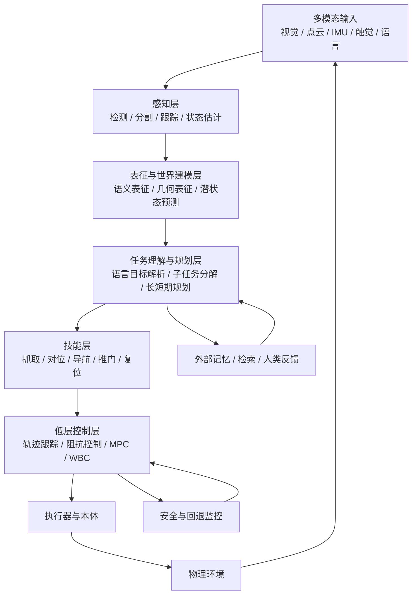

# 第八部分 具身智能系统架构与分层接口

到目前为止，报告已经分别从问题定义、历史主线、分类坐标、物理基础、学习基础和大模型基础几个方向建立了分析框架。本部分的任务，是把这些内容压缩成一套可复用的系统架构图景。它不是简单再列一次“感知层、规划层、控制层”，而是要解释：为什么现实具身系统几乎总要采用某种形式的分层；这些层的边界由什么决定；哪些接口在 foundation model 时代被重新定义；以及为什么所谓“统一系统”最终仍常表现为“多个时间尺度不同的子系统协同工作”。

从已有代表性系统看，这种分层并非保守习惯，而是工程现实。Google 的 RT-1/RT-2 更强调从视觉语言输入到动作标记的高层策略接口，但底层仍依赖机器人执行栈与动作约束；PaLM-E 通过把机器人状态、视觉与语言统一进同一个多模态模型来增强高层语义推理，但并未消除真实控制栈的分层；而 NVIDIA GR00T、Isaac 系列则更明确地把基础模型、仿真、技能与部署基础设施组织成一套多层系统。相关代表性系统可参见 [RT-1](https://robotics-transformer1.github.io/)、[RT-2](https://robotics-transformer2.github.io/)、[PaLM-E](https://arxiv.org/abs/2303.03378) 与 [GR00T N1](https://developer.nvidia.com/blog/introducing-nvidia-isaac-gr00t-n1-an-open-foundation-model-for-humanoid-robot-development/)。这些路线共同说明了一个核心事实：即便“端到端”成为主流叙事，现实系统依然离不开显式或隐式的分层接口。

## 37. 感知层

### 37.1 原始传感输入

原始传感输入之所以值得单列，是因为它决定了后续整条表征链路能看到什么、忽略什么以及以什么时间尺度看到。视觉、深度、力觉、触觉、关节状态、IMU、语言指令和环境日志并不是简单并列的数据流，它们在采样频率、噪声结构、延迟特性和语义密度上差异极大。

对具身系统而言，输入层设计从来不是“多接几个传感器就更强”。输入模态越多，时间同步、带宽管理、融合接口、异常检测和部署成本往往也越复杂。真正有价值的输入组织，通常不是追求模态数量最大化，而是围绕任务边界构造一套能稳定支撑后续状态估计、表征学习和动作生成的观测结构。

具身系统的感知层首先面对的是原始输入的异质性：RGB 图像、深度图、点云、IMU、关节编码器、力觉、触觉和语音等信号具有完全不同的时间尺度、噪声特征和信息密度。因此，感知层的职责并不是“把一切都喂给模型”，而是先把这些信号转化为能被后续系统稳定利用的观测结构。

若把多源观测写成

\[
o_t = \{o_t^{rgb}, o_t^{depth}, o_t^{prop}, o_t^{force}, o_t^{lang}\}
\]

那么架构层的第一件事不是直接学习 \(a_t = \pi(o_t)\)，而是先定义哪些模态必须同步、哪些模态可以异步缓存、哪些模态只在特定技能触发时才读取。也就是说，输入层首先是一个信息调度问题，其次才是模型吞吐问题。

### 37.2 状态估计与环境感知
从系统接口角度看，这一层最重要的不是“感知模型精度有多高”，而是它输出的状态是否足够稳定、足够低延迟、且与后续模块的决策变量同构。规划器并不直接消费分割 mask 本身，而是消费“可达目标位姿、障碍位置、接触候选区域、目标阶段标签”等被组织好的状态变量。也正因如此，同样一个视觉模型，在离线 benchmark 上精度相近，放进两套不同系统里可能表现完全不同，关键差异常常不在 backbone，而在状态组织接口是否贴近执行链条。
状态估计与环境感知的职责，不是简单“把传感器数据处理一下”，而是把原始观测转换成后续模块真正可消费的状态变量与环境摘要。前者更偏向“机器人自己现在在哪里、姿态怎样、速度怎样”，后者更偏向“外部世界里有哪些对象、障碍、可达区域和交互机会”。

可以把这一层抽象成：

\[
\hat{x}_t, \hat{m}_t = f_{\text{perception}}(o_t)
\]

其中 \(\hat{x}_t\) 表示机器人自身状态估计，\(\hat{m}_t\) 表示环境模型或场景摘要。这个分解提醒我们：很多系统失败并不是后面的规划器不够聪明，而是前面提供给它的世界状态本身已经偏了。

感知层和第五部分的状态估计基础直接相连。对于机器人而言，感知从来不只是识别对象，更包括估计身体姿态、目标位姿、环境几何结构、动态障碍和接触状态。也正因为此，感知层的输出往往不是单一标签，而是一组可供规划和控制消费的状态估计变量。

### 37.3 多模态融合
多模态融合的核心问题，不是“把更多传感器堆在一起”，而是如何把相机、深度、IMU、力觉、触觉、本体状态等不同时间尺度、不同噪声特性的信号，整合成一个一致的内部状态。一个常见架构是各模态先独立编码，再通过注意力、拼接、门控或图结构做跨模态融合。

一个极简流程可以写成：

```python
vision = vision_encoder(rgbd)
proprio = state_encoder(joint_state)
tactile = tactile_encoder(tactile_signal)
fusion = multimodal_fuser(vision, proprio, tactile)
```

对具身系统而言，多模态融合真正困难的地方，通常在时间对齐、缺失模态处理和冲突信息仲裁，而不是单纯的“模型层数不够深”。

多模态融合在系统架构中的意义，不是“提高指标”这么简单，而是决定不同下游模块能否共享同一时刻、同一环境、同一任务阶段的统一表征。如果融合失败，后续所有层都可能建立在不同步、不一致或失真的内部世界上。PaLM-E 与 RT-2 之所以重要，不只是因为它们把语言和视觉放在一起，而是因为它们提供了一种把异构观测映射到统一任务接口的范式。[PaLM-E](https://arxiv.org/abs/2303.03378)、[RT-2](https://arxiv.org/abs/2307.15818)

若把这一层写得更贴近系统接口，多模态融合真正面对的不是“特征拼接”，而是“不同时间戳下的状态一致化”。一种更有工程意义的抽象是：

```math
z_t = \mathrm{Fuse}\bigl(
e_v(o^v_{t-\delta_v}),
e_p(x_{t-\delta_p}),
e_f(f_{t-\delta_f}),
e_l(l_t)
\bigr)
```

其中 \(\delta_v,\delta_p,\delta_f\) 分别表示视觉、本体与力觉信号相对任务时钟的有效时延。这个公式提醒我们，多模态融合层本质上是在构造“同一决策时刻下的统一内部状态”；如果某个模态延迟太大、噪声太重或临时缺失，融合器不仅要知道如何补，还要知道该在多大程度上降低对它的信任。也因此，具身系统里的融合模块通常需要同时输出融合状态与置信度，而不仅是一个单纯 embedding。

### 37.4 感知层与后续感知专题章节的接口

本章中的感知层讨论，重点不是重复后续感知专题章节的全部技术细节，而是明确系统架构视角下感知层究竟向后续模块提供什么样的接口。也就是说，感知层在这里更像“系统输入组织器”，其核心问题是输出何种状态、何种语义粒度、何种时序同步结果，供记忆、规划、技能调用和控制模块继续使用。

因此，后续第 09 章会更深入讨论视觉、三维感知、触觉、跨模态对齐和状态估计本身；而本章只关心这些能力在系统中如何被封装成稳定接口。把这两层分开，能避免感知章节沦为算法罗列，也能避免系统章节陷入实现细节泥潭。
但这里需要先强调一个总原则：后文所有感知专题，不应被理解为彼此独立的模型目录，而应被理解为对本章感知层接口的拆解。也就是说，第九部分讨论某种视觉 backbone、三维重建方法或触觉阵列时，评价标准不只是“单模块指标是否更高”，还包括它是否改善了状态估计稳定性、时序一致性、与规划层的可对接性，以及在真实部署中的延迟与鲁棒性。这一接口意识会贯穿全书，否则章节很容易重新退化为“按技术名词罗列组件”的写法。

本节只建立架构职责，不展开具体模型路线。更细的视觉、三维感知、触觉和本体感觉问题，将在第九部分具体展开。

这一分工之所以重要，是为了让后文所有感知方法都能回到“它改善了什么接口”这个问题上被评价，而不是只看单模块精度。这样整本书的系统视角才不会在技术细节中被冲散。

## 38. 表征与世界建模层

### 38.1 语义表征

语义表征在具身系统中的作用，不只是把图像或文本压缩成可供检索的 embedding，而是把环境中与任务相关的对象、关系、可供性和阶段信息提炼成可被后续模块反复消费的中间表示。若这一层过弱，高层推理就会频繁回退到原始观测；若这一层过强但过度抽象，又可能遮蔽真正关键的执行细节。

因此，语义表征的关键不在“是否足够像语言模型的 token”，而在它能否稳定承载具身任务真正需要的内容：对象是谁、处于什么关系、当前可做什么、下一步最相关的变化可能发生在哪里。它是系统理解世界的中间骨架，而不是单纯的压缩结果。
对于具身系统而言，语义表征的价值不在于让模型“会描述场景”，而在于让下游决策层能在压缩后的状态空间中直接表达任务约束。例如，语言目标“把红杯子放到托盘上”在系统内部通常要落到对象身份、目标位置、可达性关系和当前任务阶段等状态变量上。若语义表征只保留了视觉分类信息，却没有把“哪一个杯子正在被操作”“哪个支撑面是当前目标”“哪条路径会与人手冲突”这样的任务语义压到内部状态中，那么它对执行层的帮助会很有限。

这一层处理的问题，是如何把原始观测压缩为任务相关的内部状态。语义表征强调对象、属性、关系、功能和任务可读性，使系统能够回答“这里有什么、它们是什么、我能拿它做什么”。

但本章更关心的不是具体表征算法，而是这类表征在系统中承担的职责边界。只要这一层没有把任务相关对象和关系稳定组织出来，后续高层规划就很难真正摆脱原始观测噪声。

### 38.2 物理表征
物理表征可以理解为“对后续动作结果真正有约束力的世界状态压缩”。它通常不止包括对象类别，还包括位姿、接触状态、可抓取性、可达性、关节约束、支撑关系、摩擦条件和动态可变性。换句话说，语义表征回答“这是什么”，物理表征回答“它能怎样被作用、会怎样反作用”。

这类表征常被组织成对象中心或关系中心结构，例如：

\[
z^{phys} = \{(o_i, pose_i, affordance_i, relation_{ij})\}
\]

对机器人而言，这层表征比纯语义标签更接近行动接口，因为策略真正关心的不是“杯子”这个词，而是“这个杯子是否可见、可达、可抓、会不会打翻旁边物体”。
这也是为什么很多在纯视觉问答中表现很强的多模态模型，一旦放到真实机器人任务中就暴露出明显断裂。它们也许能正确回答“桌上有什么”，但无法稳定判断“夹爪是否已经进入安全抓取姿态”“这个盒盖是否仍在接触边缘卡住”“推门时力矩方向是否已经改变”。物理表征的本质，是把环境看作可作用、会反作用、且其状态演化受约束的系统，而不是静态语义集合。对机器人来说，缺失这一层常常不是性能略差，而是根本无法闭环。

但语义表征并不够。具身系统还需要物理表征：几何结构、接触可行性、运动约束、动力学可预测性和环境变化机制。这些对象若没有以某种方式进入内部表示，系统就会更像一个会描述场景的观察者，而不是一个能稳定作用于环境的行动者。

### 38.3 可预测表征
因此，可预测表征的价值不在于“未来重建得多像”，而在于它是否为下游模块保留了决策真正需要的结构稳定性。若一个 latent 在视觉上可重建，却无法稳定区分“即将碰撞”和“仍可安全推进”的候选动作，那么它对机器人规划价值有限。反过来，一个在图像细节上并不完美的表征，只要能稳定承载任务阶段、接触后果和对象关系变化，就可能比更华丽的生成式表征更适合嵌入闭环系统。

世界模型路线之所以重要，正是因为它试图把内部表征进一步组织成可预测结构。若以潜变量状态 \(z_t\) 表示内部世界，则一个典型抽象可写为：

\[
z_{t+1} = f_\theta(z_t, a_t), \qquad \hat{o}_{t+1} = g_\phi(z_{t+1})
\]

其中 \(f_\theta\) 负责潜状态转移，\(g_\phi\) 负责观测重建或任务相关预测。这个写法并不等价于具体实现，但清楚说明了表征层如何开始直接参与预测、规划与策略学习。Dreamer、JEPA 及相关世界模型工作都可被视为这一抽象的不同实现路径。[Dreamer](https://arxiv.org/abs/1912.01603)、[JEPA](https://arxiv.org/abs/2301.08243)

系统意义上的关键点在于：一旦某种内部状态开始承担“预测未来观测、未来奖励、未来可达性或未来接触结果”的职责，它就不再只是压缩表示，而成为后续规划与策略评估的工作空间。于是架构争论也会随之转变成“应该预测什么、在什么抽象层预测、预测结果由谁消费”的问题。

### 38.4 为什么表征层是当前架构分歧的核心之一

当前很多架构分歧，表面看是在争论是不是要用 VLM、world model 或端到端 VLA，实质上却是在争论“系统应该在什么抽象层面组织世界”。如果表征层主要保留像素级细节，系统更容易保真，但推理与规划成本更高；如果表征层过早抽象成高层语义 token，又可能丢失接触、几何和时序上的关键信息。

也正因此，表征层往往是不同路线真正的分水岭。它一方面决定高层模型能否共享统一接口，另一方面也决定低层控制是否还能拿到足够可执行的信息。很多路线之争，归根到底并不是“模型名字不同”，而是“愿意把世界压缩到什么程度、又愿意保留多少可执行细节”的分歧。

当前很多路线之争，本质上都不是在争“是否要表征层”，而是在争表征层应该更靠近互联网语义、更靠近物理状态，还是同时兼顾二者。这一层的设计几乎直接决定后文 VLA、世界模型和规划架构如何组织。

也正因此，表征层可以看作当前很多路线分歧的真正总开关。系统想把世界压到哪里，往往比它用了哪个模型名字，更能解释后续能力边界。

## 39. 任务理解与规划层

### 39.1 指令理解

在系统架构层面，指令理解并不是一个独立的 NLP 小模块，而是高层任务接口的入口关口。它需要把自然语言中的目标、约束、优先级、默认前提和可能的歧义显式化，再交给规划、记忆或技能层继续处理。若这一层做不好，后面所有模块都可能在错误前提上工作。

因此，指令理解真正重要的不是“语句解析是否优雅”，而是系统是否能把一条模糊人类命令转换成可继续验证、可继续分解、必要时可请求澄清的结构化任务描述。只有这样，语言接口才会成为稳定入口，而不是漂亮但脆弱的外壳。
这一转化过程往往包含歧义消解、缺省补全和执行条件绑定。现实中的人类指令并不总是形式化的，例如“把这里收拾一下”“把那个拿给我”“先把危险的东西移开”都需要系统结合当前环境、用户历史意图和可用技能集进行解释。因此，指令理解并不是简单的 prompt parsing，而是把开放语义映射为受约束任务对象的过程。很多系统在 demo 中看起来理解了语言，其实只是命中了高度模板化的数据分布；真正可部署的系统必须把语言理解输出落成显式目标、约束条件和可检查完成标准。

任务理解层处理的是“系统到底被要求做什么”。输入可能来自自然语言、示范、程序模板、任务图或历史记忆。它的职责不是直接产生低层动作，而是把这些高层输入转化为可执行目标结构。

从架构角度看，指令理解最重要的不是语言本身，而是它如何生成后续模块可验证、可回退、可澄清的任务对象。否则语言接口越灵活，系统整体反而越脆弱。

### 39.2 任务分解
架构层里的任务分解，不等于完整规划算法本身，而是规定“高层意图应该以什么中间形式传给技能层”。一个成熟系统往往不会把一句原始自然语言直接下发给控制器，而是先把它改写成阶段化目标、任务图、行为树节点或技能序列。

这一层真正承担的，不只是把任务“拆开”，而是把不确定性重新分配到不同层级。若分解结果仍然保留大量语义歧义，例如“整理桌面”“把东西摆整齐”，那么不确定性就会被推迟到技能执行阶段暴露，最终表现为策略切换频繁、回退条件模糊、失败后难以定位责任层。相反，若高层能够把任务改写成可验证的阶段条件，例如“识别并抓取散落物体”“将同类物体放入指定容器”“确认桌面无遮挡关键区域”，那么每个阶段都拥有更清晰的输入、输出和失败信号。

从系统工程角度看，任务分解最值得关注的是“中间合同”是否清楚。这里的合同不是法律意义的约束，而是层与层之间关于目标表示、前置条件、终止条件和异常处理边界的共同约定。一个好的任务分解接口，应该允许下游模块明确回答四个问题：我现在该做什么；做到什么程度算完成；出现哪些偏差可以局部修正；出现哪些偏差必须回退给上层重规划。没有这类中间合同，系统虽然表面上也能运行，但会在长任务链里快速积累隐性耦合。

一个最小任务分解接口可以写成：

```python
goal = "把桌面整理好"
subtasks = decompose(goal, world_state, skill_catalog)
```

它的关键价值在于，让系统显式区分“理解目标”和“执行目标”两个阶段，从而为后续验证、回退和人工干预留出接口。
从系统工程角度看，任务分解的核心不是“拆得越细越好”，而是拆到恰好能与现有技能层和反馈监控层对接。拆得过粗，下游技能层难以承接，高层推理就会直接面对连续控制细节；拆得过细，则会导致规划器承担大量本应由技能内部处理的执行微结构，使计划冗长、脆弱且难以重规划。因此，任务分解实际上决定了整个系统的责任边界：哪些不确定性由高层承担，哪些由技能内部吸收，哪些必须显式上报给异常恢复模块。

对于复杂任务，系统通常需要把一个目标拆成子任务、子目标、技能调用顺序和异常恢复分支。大模型在这里的价值最为直接，因为它们的长处恰好是高层结构化组织与语义组合。行为树、HTN、程序化技能图等结构之所以重新受到关注，也正是因为它们提供了可检查、可回退、可插入约束的中间层，而不是把一切都压缩为一次性推理输出，相关综述可参见 [《Behavior Trees in Robotics and AI》](https://arxiv.org/abs/1709.00084)。

### 39.3 短期/长期规划

短期规划与长期规划在系统中之所以要分层讨论，是因为它们处理的是不同时间尺度上的不确定性。短期规划更关注当前状态下几步之内的可执行动作选择、碰撞避免和即时恢复；长期规划则更关注多阶段目标安排、资源使用顺序、记忆调用和阶段切换逻辑。

一个实用的架构理解是：长期规划主要回答“接下来该先做哪一类事”，短期规划回答“为了把这件事做成，下一小段动作应如何组织”。如果把长期计划 \(P^{long}\) 记成子任务图，把短期计划 \(P^{short}\) 记成局部动作或技能序列，则更贴近系统现实的关系往往是：

\[
P^{long} = \mathrm{Plan}_{high}(g, m_t, s_t), \qquad
P^{short} = \mathrm{Plan}_{local}(s_t, \text{subgoal}(P^{long}))
\]

真正困难的地方不在于写出这两个符号，而在于两层之间何时重同步。若长期规划长时间不更新，系统会对局部异常迟钝；若长期规划过于频繁地重算，又会把大量预算浪费在重复解释高层目标上。因此，分层的核心不是“分成两层就够了”，而是为不同时间尺度建立合理的重规划节律。

若这两者混在同一层统一处理，系统很容易要么被短期细节淹没、缺乏全局目标感，要么过度停留在高层计划、缺少局部可执行性。因此，很多具身系统即便采用统一模型，也仍会在功能上保留某种短长时程分工。
更进一步说，长短期规划的分离并不只是为了效率，而是为了让系统能够在不同不确定性层级上做出不同形式的承诺。长期规划可以接受一定抽象和可修正性，例如先整理桌面再收纳工具；短期规划则要面对即时几何、接触和动态避障约束，必须对当前局部运动负责。很多“高层 reasoning 很强但机器人执行仍不稳定”的案例，本质上并不是 reasoning 不够，而是高层输出没有被转换为适合短时程控制器消费的目标形式，导致跨时间尺度接口失真。

长期规划决定“接下来若干阶段要完成什么”，短期规划决定“当前这一段动作该如何走”。在系统架构中，二者往往不能由同一个时间尺度的模块统一承担，否则就会在推理带宽与控制实时性之间发生冲突。

### 39.4 高层推理与低层执行之间的接口问题

高层推理与低层执行之间最棘手的问题，不是“如何连接两个模块”，而是“它们之间到底交换什么信息才不会彼此误解”。高层通常描述目标、顺序和约束，低层则关心姿态、力、接触、时序和可达性。如果接口设计得过于抽象，低层无法稳定兑现；若接口设计得过于细碎，高层又失去统筹价值。

因此，这里真正需要的是中间语义层，例如技能目标、子任务状态、参数化动作模板、约束集合或可验证阶段标记。很多系统表面上看是模型能力不足，实质上问题出在这一层接口语义没有被定义清楚。

这是现代具身架构最关键的断点之一。高层系统可以输出子任务序列、目标位姿、技能索引或程序片段，但这些对象必须通过明确接口进入技能层和控制层，否则高层推理再强，也无法转化为可靠执行。一个常见的接口抽象是：

\[
\pi_{\text{high}}: (o_{1:t}, g) \mapsto s_k, \qquad
\pi_{\text{skill}}: (x_t, s_k, \theta_k) \mapsto a_{t:t+H}
\]

其中高层策略选择技能 \(s_k\)，中层技能策略再结合当前状态与参数 \(\theta_k\) 生成一段动作序列。很多所谓“端到端系统”的实际落地，仍可被解释为这一接口的隐式实现。

如果进一步从时间尺度上看，高层与低层接口至少要同时解决三件事：目标压缩、状态接地和失败回报。也就是说，高层不能只说“做什么”，还必须以某种形式告诉下层“在什么状态下开始、以什么条件判断完成、失败后把什么信号回送给谁”。很多系统之所以在 demo 中看起来很强、在长期运行中却频繁失稳，根源就在于这三类接口变量没有被明确定义。

把这件事写成更明确的“接口合同”，高层交给中层的对象往往不应只是一个子任务名字，而更应接近：

```math
c_k = \{\text{subgoal},\ \text{precondition},\ \text{success test},\ \text{timeout},\ \text{safety envelope}\}
```

其中 `subgoal` 说明要做什么，`precondition` 说明何时可以开始，`success test` 说明什么算完成，`timeout` 规定多长时间内必须结束，`safety envelope` 则约束允许的速度、工作空间、接触模式或风险上界。只有当这些字段被显式化，高层与低层之间才不是“把一句话往下扔”，而是真正在交换可验证、可拒绝、可回退的任务契约。

**工程案例：从语言任务到受约束执行的多时间尺度接口。** 以“把指定物品放入容器并在必要时复位”的语言任务为例，高层模型的职责不应是连续地产生关节命令，而是把任务条件、对象约束和完成判据转换为可验证的技能请求，例如 `locate`、`approach`、`grasp`、`place` 与 `recover`。技能层再把请求展开为目标位姿、允许接触区、速度上限和终止条件；低层控制器只接收已经落到本体坐标系与安全约束中的局部参考。Open X-Embodiment 的公开资料将跨本体动作表示显式组织为与夹爪参考系相关的动作向量，这提醒我们：所谓“统一动作接口”仍需说明参考系、维度、控制频率和本体条件，而不能只写成抽象 token。[Open X-Embodiment 项目页](https://robotic-transformer-x.github.io/) 和其 [开源实现](https://github.com/google-deepmind/open_x_embodiment) 都提供了这一类接口设计的具体材料。

一个可供跨层检查的状态包可以写成：

```math
b_t = \bigl(g,\ \hat{s}_t,\ \Sigma_t,\ \Delta t_{\mathrm{obs}},\ \mathcal{C}_t,\ z_t\bigr)
```

其中，`g` 是任务目标，`\hat{s}_t` 与 `\Sigma_t` 分别是状态估计与不确定性，`\Delta t_obs` 是观测有效年龄，`\mathcal{C}_t` 是当前约束集合，`z_t` 是正在执行的技能。高层若只看到 `g` 与图像，技能层若不知道观测是否过时，控制层若拿不到约束与终止条件，就会形成“每层看起来正确、组合后不可执行”的典型断裂。

```python
if observation_age > max_age or covariance > max_uncertainty:
    pause_skill_and_reobserve()
elif violates_constraint(skill_command, constraints):
    request_replan_or_recovery()
else:
    low_level_controller.track(skill_command)
```

这段伪代码刻意把“过时观测”和“违反约束”放在生成动作之前处理。ROS 2 的 [Executor 文档](https://docs.ros.org/en/ros2_documentation/rolling/Concepts/Intermediate/About-Executors.html) 说明了消息回调与执行管理本身就是运行时对象，因此时间预算不能只在控制理论中假设存在，也必须在中间件、队列和调度层显式检查。

该案例的边界同样重要：分层架构并不自动保证模块间语义无损，也不说明所有端到端策略都应被拆开。它要说明的是，只要系统需要异步感知、可中断技能与安全回退，就必须为“谁能发布命令、何时命令过期、谁有权抢占”写下可检验契约；这些契约可以是显式接口，也可以部分由模型学习，但不能完全不被定义。

## 40. 技能与控制层

### 40.1 技能库与技能调用
技能库可以理解为“把高层语义目标和低层控制器之间的大量常用中间能力封装起来”。一个技能可能是“接近目标”“抓取指定物体”“打开抽屉”“导航到工作区”，它既可以是学习得到的策略，也可以是传统规划器加控制器组合。

最小技能调用过程通常是：

```python
skill = skill_registry.bind(subgoal, world_state)
result = executor.run(skill)
```

从架构角度看，技能层最大的作用不是让系统更模块化这么简单，而是把“通用模型的开放语义能力”重新约束到“有限但可执行的动作原语集合”上。
从知识组织角度看，技能库实际上是机器人系统的“可执行词汇表”。它一方面压缩了低层控制复杂度，另一方面也为高层推理提供了可组合对象。若系统没有明确技能层，那么所谓“高层理解任务”的价值会被大幅削弱，因为它缺乏足够稳定的执行落点。当前很多 VLA 或 foundation model 路线，在真实落地时往往并不是彻底取消技能，而是把技能从手工程序块重写为可学习、可参数化、可由语义条件触发的执行单元。

技能层存在的根本原因，是很多机器人系统无法也不应每一时刻都由高层模型直接输出所有连续控制量。技能层把抓取、对位、推门、导航、复位、避障等行为组织为更稳定的中层原语，并允许高层按条件调用。

### 40.2 低层控制接口
这一“最后翻译层”之所以关键，是因为很多高层目标在此处会暴露出它们是否足够可执行。例如“轻拿轻放”如果没有被映射成速度、加速度、接触力、阻抗参数或停止条件，它在控制层面就只是一个空泛语义标签。另一方面，控制接口也会反向塑造高层系统能力：如果底层只接受末端位姿命令，那么高层就倾向于输出几何目标；如果底层支持参数化技能或约束优化接口，高层就能输出更丰富的结构化控制意图。因此，接口形式本身就是架构设计的一部分，而不只是实现细节。

更进一步说，低层控制接口不只是动作通道，也是约束通道。成熟的接口设计通常会同时编码目标变量、容许误差、执行时限、接触或碰撞阈值、以及对环境反馈的订阅方式。只有这样，上层才不至于把“执行”误解为一个黑箱函数调用，而能明确知道底层在什么条件下会减速、停止、换模态或拒绝执行。若接口只暴露动作而不暴露约束，那么系统就会在高层不断生成“理论上正确、工程上危险”的命令。

对具身系统而言，这里还有一个常被忽视的判断标准：接口是否保留了动作语义的可审计性。比如同样是“向前移动 10 cm”，如果底层记录了执行时的目标轨迹、力控状态、异常触发原因与终止模式，那么后续回放、故障诊断和数据再训练都会容易得多。相反，若接口只留下最终成败标签，就很难判断错误究竟来自感知偏差、规划失真、控制震荡还是安全保护过早触发。

因此，低层接口设计时至少要明确四件事：命令变量是什么、刷新频率是多少、允许的约束类型有哪些、执行反馈以什么形式回传。很多看似“模型理解错了”的问题，最后都会追溯到这四项没有被定义清楚。高层如果输出的是末端目标位姿，而低层却缺乏足够稳定的轨迹跟踪与接触补偿，那么系统表面上的高层错误，实则是接口承诺过强。

技能层以下，系统才真正进入控制问题：轨迹生成、阻抗控制、MPC、全身控制、夹爪驱动等都在这里发生。也就是说，低层控制接口是高层语义与真实物理行为之间的最后翻译层。

一个极简控制接口可写成：

\[
u_t = \kappa(x_t, r_t, \mathcal{C})
\]

其中 \(x_t\) 是当前状态估计，\(r_t\) 是上层传来的参考轨迹或技能目标，\(\mathcal{C}\) 是安全、碰撞、关节、接触等约束集合。这个公式的重点不是控制器形式本身，而是提醒我们：低层接口的基本任务是“在约束下兑现目标”，而不是抽象理解任务。

从系统时序角度看，这一层还必须显式承认不同模块运行在不同刷新频率下。一个更现实的关系通常是：

```math
\Delta t_{\text{brain}} \gg \Delta t_{\text{skill}} \gg \Delta t_{\text{control}}
```

也就是说，高层语义决策可能按秒级刷新，技能层按几十到几百毫秒刷新，而控制层按毫秒到十毫秒级刷新。接口设计若忽略这组时间常数，就会把“高层偶尔给目标”误写成“高层持续接管控制”，最终在时延、抖动和安全边界上全部失真。对具身系统而言，多频率接口不是实现细节，而是架构正确性的必要条件。

### 40.3 安全约束与恢复策略
更重要的是，安全约束不应仅被理解为上线前外挂的保护壳，而应是执行图的一部分。系统若只在最外层放一个 `emergency stop`，就只能在严重错误发生后粗暴中断；而成熟系统往往会在多个层级上设置不同粒度的保护，包括动作裁剪、速度限制、工作空间屏蔽、接触阈值监测、技能级超时、任务级回退和人类接管接口。这样系统不是在“成功/灾难”之间二元跳变，而是在多层保护下逐步退化。

恢复策略的重要性与安全约束同级，因为真实部署中的大量失败并不是灾难性碰撞，而是“可恢复的小错”反复出现，例如抓取偏心、接触丢失、局部遮挡、路径被临时阻断或用户指令改变。若系统缺乏恢复策略，就会把这些本可局部修正的问题升级成整任务失败；若恢复链路设计合理，系统则可以在不重启全局任务的前提下尝试重新定位、重新抓取、换路径或回退到上一步状态。

因此，更成熟的评估口径不应只统计“是否发生危险”，还应统计系统在扰动下的退化方式。它是平滑降级、可追踪回退，还是突然冻结、状态丢失、需要人工完全重置？这一差异直接决定了同一模型能力在实验室和生产现场之间的可迁移程度，也决定了一个架构是否真正为长期自主运行做了准备。

恢复策略也不只意味着“失败后重试一次”。更关键的是决定回退到哪一层重新规划，以及哪些失败应被视为能力边界而不是暂时噪声。例如抓取失败后，是重新选抓点、重新定位对象、切换夹具，还是直接请求人工介入，这些对应的是完全不同的系统设计哲学。对长期部署而言，恢复策略的质量往往比单次成功率更能解释系统是否成熟。

控制层不能只负责“完成动作”，还必须负责失败检测、约束满足和回退执行。一个可部署系统通常需要在这里处理关节极限、碰撞监控、接触异常、任务超时和紧急停止等现实问题。

从架构上看，恢复策略至少分三层：局部控制恢复、技能级恢复和任务级重规划。前两者解决短时扰动与局部失败，最后一层才回到高层推理或人工接管。若一切异常都直接上抛到大模型规划器，系统会过慢且不稳定；若所有异常都压在低层，本体又会反复在错误任务前提下挣扎。因此，恢复路径本身也是分层架构必须显式设计的接口。

一个更接近真实系统的异常上抛逻辑，通常不是布尔意义上的“失败/未失败”，而是带层级的恢复决策：

```python
if controller.can_stabilize(error):
    controller.recover(error)
elif skill.can_retry(error):
    skill.retry(error)
else:
    planner.replan(error, state_snapshot)
```

这段伪代码的意义在于说明：恢复并不是统一交给某个万能模块，而是要求系统首先判断“这个偏差属于哪一层的责任边界”。只有把这一判断写进接口，后文关于安全、部署和长期自治的讨论才真正有依托。

这也是为什么恢复策略不应被视为“失败后附加功能”，而应被视为架构主路径的一部分。真实可部署系统几乎都在围绕恢复路径设计，而不是围绕理想成功路径设计。

### 40.4 为什么技能层常是“通用模型”落地的真实中介

当前很多基础模型路线真正成功落地的位置，并不是它们直接学会了完整连续控制，而是它们更擅长选择技能、参数化技能、解释技能切换条件。换言之，技能层常常是“通用语义能力”转化为“可部署动作能力”的真实中介。

下面给出一个极简伪代码，说明高层规划器与技能层接口的典型形态：

```python
goal = "pick the red cup and place it on the tray"
plan = planner.generate_subtasks(observation, goal)

for subtask in plan:
    skill_name, skill_args = skill_router.resolve(subtask)
    result = skill_library[skill_name].run(state_estimate, **skill_args)
    if not result.success:
        recovery = planner.repair(subtask, result.error)
        plan = recovery + plan.next_remaining()
```

这个代码片段并不对应某个具体系统，但很好地揭示了现代具身架构的典型现实：高层负责提出结构，中层负责把结构绑定到可执行技能，失败恢复则重新回到规划器。
从工程治理角度看，技能层还有一个常被低估的价值：它天然提供了能力边界的可计数接口。系统到底“会多少事”，并不只取决于大模型的表述能力，也取决于它能稳定调动多少个被验证过的技能单元。若没有技能层，团队往往只能以 demo 感受描述能力；有了技能层之后，就可以按技能覆盖率、技能成功率、技能恢复率和技能调用歧义度等维度做版本化跟踪。
技能层也是多团队协同的组织接口。感知、规划、控制、数据和安全团队往往不可能围绕同一个端到端参数空间高频协作，但可以围绕技能契约协作：谁负责给出技能触发条件，谁负责定义成功判据，谁负责监控超时和异常，谁负责把失败片段回流成训练样本。很多看似“通用模型已经成功落地”的案例，真正支撑其可维护性的恰恰不是模型本身，而是技能层把系统切成了可分工、可测试、可灰度发布的单元。

## 41. 大脑-小脑-脊髓分层范式

### 41.1 语言/推理大脑
更严格地说，“大脑”层不应被神化为一个能吞并所有子系统的统一智能体，而应被理解为高语义密度、低刷新频率的任务组织器。它真正擅长的是整合指令、记忆、工具调用、阶段判断与异常解释，而不擅长毫秒级闭环控制。把这层放对位置非常关键：一旦它被误用为高频控制器，系统会出现明显的延迟、抖动与语义-动作错配；一旦它被约束为“只负责解释与改写高层目标”，反而更容易与技能层、控制层和安全监控层形成稳定分工。
“大脑”这一层更准确的理解，不是单个超大模型，而是承担长期目标理解、上下文整合、任务规划、异常解释和外部记忆调用的高层决策模块。它通常运行频率较低，但每次决策语义密度较高，负责回答“现在整体上应该做什么”。

一个最小接口可以写成：

\[
g_t = \pi_{\text{brain}}(o_t, m_t, u)
\]

其中 \(u\) 是用户目标，\(m_t\) 是记忆或任务历史，\(g_t\) 则是高层子目标或阶段意图。理解这一点很重要，因为它说明“大脑”层输出的通常不是控制量，而是语义化决策变量。
在当前具身热潮中，这一层最容易获得关注，因为它最接近“大模型进入机器人”的直观叙事。但从系统角度看，大脑层并不是因为参数多才重要，而是因为它承担了跨任务语义整合、开放环境解释和与人协作接口这几项传统机器人系统最弱的能力。它能显著提升系统在开放语言、异常对话和任务重说明情境下的适应性，但也天然带来幻觉、目标漂移、接口不确定和高延迟等问题，因此必须被放在一个有边界的分层架构中，而不是被神化为足以替代全部系统模块的单体智能体。

大脑层处理高层任务理解、语义规划、记忆检索和交互式纠错，典型实现可以是大语言模型、视觉语言模型或更复杂的多模态 foundation model。

### 41.2 运动/技能小脑
“小脑”层负责把高层子目标转成更连续、更频繁、更贴近执行器的运动或技能输出。它通常承担技能实例化、局部轨迹生成、误差修正和短时程闭环稳定等职责。若说大脑关心“应该去拿杯子”，小脑更关心“以哪条局部路径接近、怎样闭合夹爪、遇到轻微扰动如何微调”。

把这一层称作“小脑”是有帮助的，因为它提醒我们：这里真正重要的不是语义最强，而是反馈最快、误差吸收能力最强。很多 today 的基础模型路线之所以还离不开技能层，不是因为语义模型不够聪明，而是因为局部误差修正、接触稳定和执行节奏保持，本来就更适合放在高频闭环模块中处理。

一个极简形式可以写成：

\[
a_t = \pi_{\text{cerebellum}}(\hat{x}_t, g_t)
\]

也正因如此，小脑层经常是传统控制、模仿学习策略、diffusion action head 和技能库真正汇合的地方。
如果说大脑层擅长“解释任务”，那么小脑层擅长“把解释过的任务压成可稳定执行的局部行动”。这里的关键不是名称类比本身，而是它强调了一个系统事实：机器人能力要真正落地，往往需要一个既理解上层语义、又尊重本体约束和控制时序的中介层。很多系统失败不是因为没有大模型，而是因为没有一个足够强的中间层把高层意图翻译为局部稳定执行策略。

小脑层负责把高层目标变成可执行的技能计划、局部轨迹或运动原语调用。它通常比大脑更高频、更贴近控制，也更依赖任务和本体特定知识。

### 41.3 反射与稳定控制脊髓
这一层的重要性在双足、人形、移动操作和高接触任务中尤为突出。现实世界不会等待高层模型重新推理之后再决定是否跌倒、是否过流、是否打滑或是否产生危险接触，因此最底层必须保留一套几乎不依赖高层语义的快速稳定机制。它们往往表现为阻抗控制、姿态稳定器、碰撞撤离、限流/限力保护、足底接触切换或快速刹停逻辑。

也正因为如此，许多表面上“端到端”的系统，在工程实现里依然保留了大量硬编码或经典控制形式的安全与稳定回路。这并不是技术落后，而是时间尺度与物理约束共同决定的结果。高层模型决定做什么，底层稳定层负责保证“来不及想的时候不要出事”，两者分工越清楚，整机越可部署。
这一层的重要性在双足、人形、移动操作和高接触任务中尤为突出。现实世界不会等待高层模型重新推理之后再决定是否跌倒、是否过流、是否打滑或是否产生危险接触，因此最底层必须保留一套几乎不依赖高层语义的快速稳定机制。也正因如此，许多表面上“端到端”的系统，实际工程实现中依然保留了大量硬编码或经典控制形式的安全与稳定回路。这并不是技术落后，而是时序与物理约束共同决定的结果。

脊髓层则对应最快、最局部、最不可中断的控制反射：平衡维持、接触稳定、执行器保护、局部回退和安全停机等。它的时间尺度通常远快于高层推理，且更接近经典控制系统。

这一层的存在，本质上说明具身系统永远要为“来不及思考时怎么办”保留答案。只要机器人还处在真实物理环境中，这一层就不会因为高层模型更强而消失，只会随着系统复杂度一起被重新封装。

### 41.4 这种分层方案的优势与局限

分层方案最大的优势，在于它允许不同时间尺度、不同误差容忍度和不同工程职责的模块各自优化。高层负责目标、任务与语义，中层负责技能组合与状态桥接，低层负责稳定执行与安全控制，这种结构通常更容易调试、替换和版本化维护。

但它的局限同样明确。分层越清晰，接口错配的风险就越高：高层可能给出语义上正确但物理上不可执行的目标，中层可能在抽象过程中丢失关键状态，低层则可能因为无法准确理解高层意图而只能做保守补偿。因此，分层并不是天然更先进，而是一种用模块边界换取可维护性的工程选择。

优势在于：

1. 不同时间尺度问题可以分治。
2. 高层大模型不必直接承担毫秒级控制。
3. 低层控制可以保持稳定、可验证、可回退。

局限则在于：

1. 层间接口设计困难。
2. 高层语义可能在中层被过度压缩。
3. 故障责任边界容易模糊。

### 41.5 本部分如何作为后续技术层总接口
这也意味着后文任何具体技术路线，无论是某个视觉 backbone、某个世界模型训练法、某个 VLA 结构，还是某种部署工具链，都不应孤立评价，而应回到本章提出的接口问题上重新审视：它改变的是哪一层的能力边界，减轻了哪一种跨层错配，又把哪些风险转移到了别的层级。只有这样，这份报告才能避免变成“技术名录”，而真正形成一套可持续更新的系统分析框架。

本部分的真正功能，是为后续章节提供公共接口图：

1. 第九部分进一步展开感知层。
2. 第十部分进一步展开世界建模层。
3. 第十一和第十二部分进一步展开 VLA 与规划推理层。
4. 第十三到第十六部分继续展开数据、仿真、硬件与安全基础设施。

也就是说，后续技术层虽然章节众多，但都应被理解为对这里这张分层接口图的逐步放大。

为了让这张接口图真的可复用，后续章节在写作时应默认回到三个问题上重新定位自己：它改变了哪一层、改善了哪一类跨层接口、又把哪些复杂性转移到了别的层级。只有这样，全书才不会在章节增多后重新碎片化。

## 图 8-1 系统分层接口图

源文件：`assets/diagrams/08-系统分层接口图.mmd`



## 图 8-2 多时间尺度任务执行与安全监督

源文件：`assets/diagrams/08-多时间尺度受约束执行图.mmd`

`图 8-2` 把同一任务在语义规划、技能执行、状态估计、低层控制和安全抢占中的责任拆开。图中的“安全监督”并不等于一个额外告警页面，而是需要能直接暂停或降级技能的抢占接口。

## 表 8-1 分层执行接口与时间预算表

见：[08-分层执行接口与时间预算表](D:/Projects/embodied-intelligence-report/docs/report/current/tables/08-分层执行接口与时间预算表.md)

## 图表补充说明
本章的图表不应只是示意图，而应承担“全书公共接口地图”的职责。尤其是“感知 - 表征 - 规划 - 技能 - 控制”的总结构图，最好被反复跨章节引用，用来标明某一技术路线究竟改变了哪一层、减轻了哪一类跨层错配，又把哪些压力转移给了别的层级。

同理，“大脑 - 小脑 - 脊髓分层与时间尺度”的对照图也不是比喻性装饰，而是说明语义推理、技能执行与局部稳定控制为何天然受不同时间常数约束。只有把这个时间尺度差异画出来，后文关于 VLA、世界模型、端侧部署和安全兜底的许多争论才会显得更可解释。

在当前版本中，`图 8-1 系统分层接口图` 已承担第一项职责：它把 `感知 - 表征 - 规划 - 技能 - 控制` 的跨层依赖显式画成一张公共接口图，可作为后续章节统一引用的结构坐标。

`图 8-1` 的第二项核心作用，是把时间尺度差异和跨层反馈链条显式化。它提醒读者：语义推理、技能执行与局部稳定控制并不处在同一频率上，也不应该被同一种接口逻辑统一处理。正因为这些子系统的时间常数不同，具身智能架构才必须强调跨层合同、异步反馈与局部恢复，而不能把“统一模型”误解成“统一执行节奏”。
