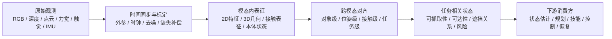

# 第九部分 感知与表示学习

在具身系统中，感知从来不是孤立视觉任务的集合，而是行动系统形成内部世界的入口。一个机器人是否“看见了世界”，并不由它能否输出漂亮的分类标签决定，而由它能否形成足以支持抓取、移动、接触、规划和恢复的状态结构决定。因此，本部分的重点不只是罗列 2D、3D、触觉和多模态模型，而是解释：什么样的感知表征才真正对行动有用，哪些感知成功在部署时会失效，以及为什么表示学习最终会成为感知与后续决策系统之间的真正桥梁。

一个对机器人更贴切的表述是：感知模块输出的不是“标签”，而是状态估计器、规划器和控制器能够消费的内部变量。也就是说，感知的优劣不只体现在感知 benchmark 上，还体现在它是否能提供稳定的位姿、对象边界、接触迹象、遮挡关系和任务相关可供性。Segment Anything、DINOv2、MAE、PointNet、GelSight 等路线之所以值得放在同一章讨论，正是因为它们分别代表了对象级视觉、通用视觉表征、自监督预训练、三维几何表示和接触表征的不同切面。[Segment Anything](https://arxiv.org/abs/2304.02643)、[DINOv2](https://arxiv.org/abs/2304.07193)、[MAE](https://arxiv.org/abs/2111.06377)、[PointNet](https://arxiv.org/abs/1612.00593)、[GelSight](https://arxiv.org/abs/1706.09942)

## 42. 视觉感知

### 42.1 2D 感知任务

检测、分割、跟踪和关键点估计仍然是大量机器人任务的直接入口，因为系统首先需要从图像中定位对象、边界、可抓取区域和动态变化。问题在于，机器人中的视觉感知成功标准并不完全等于 benchmark 精度，而更关心：目标位姿够不够准、遮挡下还能不能工作、视角变化后是否稳定、输出能不能直接服务于下游控制链路。

如果把 2D 感知仅理解为“图像分类和检测任务的机器人翻版”，就会低估其在闭环系统中的真实职责。对抓取任务而言，检测结果最关键的往往不是论文表上的 `mAP`，而是能否稳定提供抓取候选区域、能否在视角变化与局部遮挡后继续完成重定位、能否把对象状态绑定到机器人坐标系；对导航与移动操作而言，分割图也不是为了“看懂图片”本身，而是为了把可通行区域、风险区域和可交互对象结构化地交给局部规划器。也就是说，2D 感知在具身系统里首先是动作前的状态构造器，而不是独立竞赛任务。
这也是为什么开放词汇感知、提示式分割和通用视觉 backbone 会在具身智能语境中重新变得重要。它们不只是提高了视觉模型的泛化性，更重要的是降低了在新对象和新任务上重新搭建对象级接口的成本。但这些路线是否真正有用，仍然要回到机器人标准上检验：跨视角是否稳、与位姿估计是否能闭合、时序上是否足够一致、失败后是否易于重定位，而不是只看静态基准分数。[Segment Anything](https://arxiv.org/abs/2304.02643) [DINOv2](https://arxiv.org/abs/2304.07193)

### 42.2 语义分割、检测与跟踪
这三类任务常被并列提及，但它们为机器人提供的信息层级并不相同。检测回答“哪里有什么”，语义分割回答“每个像素属于什么”，跟踪则回答“同一个对象随时间如何连续存在”。对具身系统而言，很多后续动作并不只需要看到物体，还需要在时间上持续知道“还是不是同一个物体、是不是已经被抓住、是不是离开了原位置”。

一个极简感知链路可以写成：

```python
boxes = detector(image)
masks = segmentor(image)
tracks = tracker(boxes, masks, prev_state)
```

这说明感知输出不只是静态标签集合，而往往是带时间连续性的对象状态接口。
如果进一步从执行接口角度看，检测、分割与跟踪其实对应三种不同粒度的状态承诺。检测告诉系统“对象大概在哪里”，分割告诉系统“边界与可交互区域在哪里”，跟踪则告诉系统“这个对象还是不是刚才那个对象、它是否保持了同一任务身份”。在整理、抓取、递送和装配任务中，这三层信息往往分别对应候选生成、接触准备和闭环重定位。也正因如此，机器人视觉里的“跟踪失败”常常不只是 identity switch 这么简单，而是会直接导致技能层把后续动作施加到错误对象或过时位姿上。

语义分割与检测的意义，在于把场景从像素组织成对象级结构；跟踪则把这一结构延伸到时间维度。对机器人而言，时间连续性尤为关键，因为行动系统通常不是在单帧上决策，而是在持续观测中更新任务状态。Segment Anything 之类通用分割模型当然提高了可迁移性，但其价值在机器人里仍要看能否在实时性、视角变化和下游动作约束下持续工作。[Segment Anything](https://arxiv.org/abs/2304.02643)

### 42.3 第一视角与第三视角差异
第一视角的困难还在于，感知器本身会被动作不断扰动。相机随着机械臂、底盘或头部运动而移动，意味着观测分布和行动分布天然耦合，系统必须在“正在动作导致视角变化”的情形下维持表征稳定。这和互联网视觉中常见的静态观察者假设差异很大。很多模型离线看图很强，但一到真实机器人上就出现“运动中失去目标”“接近后目标被自身末端遮挡”“触碰前最后关键几帧最不稳定”的问题，本质上都和第一视角闭环特征有关。

机器人视觉和互联网视觉一个重要差异在于视角。大量机器人数据来自 egocentric first-person view，而不少互联网视觉模型更多在第三视角数据上训练。二者对遮挡、尺度变化、交互物体可见性和动作上下文的编码方式并不相同。因此，直接把通用视觉模型迁移到机器人上时，第一人称视角偏移常常是一个被低估的问题。

### 42.4 自监督视觉表征为何重要
但“有一个强视觉 backbone”并不自动等于“有了可用的机器人感知层”。真正关键的是这些预训练特征能否在小样本微调、跨相机迁移、弱标注适配和下游几何任务中保持稳定；换句话说，要看它们是不是能成为状态估计、抓取候选评估和任务切换判断的底座，而不只是分类或分割头的好初始化。这也是为什么很多机器人系统会把大规模自监督特征与少量任务特定标注、时序一致性损失和几何约束联合使用，而不是直接端上一个互联网视觉 backbone 就期待闭环成立。

机器人感知的一个长期瓶颈，是标注太贵、场景太多变、部署分布与训练分布差异太大。因此，自监督视觉表征在具身系统里比在标准视觉任务中更有现实意义。MAE 通过遮挡重建学习 patch 级结构，DINOv2 则更强调可迁移的通用视觉特征；前者更偏表征学习机制，后者更偏大规模稳定预训练产物。对机器人而言，这类基础视觉表征的真正价值，是减少每个新场景都要从头收集密集标注的负担。[MAE](https://arxiv.org/abs/2111.06377)、[DINOv2](https://arxiv.org/abs/2304.07193)

## 43. 三维感知

### 43.1 深度估计
深度估计的最小目标，是为系统补上“场景中各点离相机有多远”这一维信息，从而把 2D 视觉重新锚定到 3D 行动空间。它可以来自双目、结构光、ToF、单目学习模型或多视角重建，不同路线的核心差别在于精度、噪声模式、时延和对环境条件的敏感性。

若写成最简单形式，深度估计就是：

\[
D_t = f_\theta(I_t)
\]

其中 \(I_t\) 是当前图像，\(D_t\) 是深度图。对机器人来说，这个量的真正价值在于后续可被用于抓取位姿估计、障碍距离判断、空间重建和接触前减速，而不只是“把画面变成了三维感”。

二维图像足以支持部分语义理解，但对抓取、避障、操作和导航而言，系统还必须理解空间结构。深度估计是最直接的入口，因为它把像素层面信息转化为几何层面信息。然而，机器人真正关心的不只是“深度图看起来是否合理”，而是这些深度信息是否足够支持可执行的空间推理。

从相机模型角度看，一个像素 \((u,v)\) 对应深度 \(d\) 时，可恢复相机坐标系中的三维点：

\[
X = \frac{(u-c_x)d}{f_x}, \qquad
Y = \frac{(v-c_y)d}{f_y}, \qquad
Z = d
\]

这一关系看似基础，却决定了视觉结果能否进入抓取位姿估计、点云重建与碰撞检测链路。

### 43.2 点云与体素表示
点云与体素表示是把深度信息组织成可计算三维结构的两条典型路线。点云更接近原始几何采样，适合保留细节但不规则；体素则把空间划分成规则网格，便于卷积或占据推理，但会带来分辨率与内存代价。

一个最小转换过程可以写成：

```python
point_cloud = backproject(depth, intrinsics)
voxel_grid = voxelize(point_cloud, resolution)
```

对学习者来说，这一节最重要的不是记住两种表示名词，而是理解：表示选择会直接影响后续抓取、重建、避障和对象级推理的计算方式。

PointNet 及其后续工作说明，点云可以被直接作为集合结构处理，而不必强行投影回二维图像。[PointNet](https://arxiv.org/abs/1612.00593) 对机器人而言，点云、体素和 TSDF 之类表示的意义，在于它们更直接编码了空间邻接、表面结构和碰撞几何，因此常在抓取、建图和局部规划中发挥核心作用。

但从工程角度看，三维表示的难点远不止“如何把点云送进网络”。点云是稀疏且不规则的，局部密度受视角、距离和反射特性强烈影响；多帧拼接又会把时间同步误差、外参误差和运动畸变叠加进表示里。更重要的是，抓取与接触操作真正需要的常常不是抽象的“三维理解”，而是对象表面法向、边缘、间隙、遮挡背后的不确定性以及碰撞几何。于是，一个三维表示是否好用，最终要看它如何进入抓取姿态采样、碰撞检测、接近轨迹生成和接触前可达性筛选。
因此，图像、点云和体素在真实系统里往往形成层次化流水线而非彼此替代：图像负责快速给出对象级候选和语义先验，点云/体素负责提供可执行几何，状态估计器再把这些信息绑定到机器人动作坐标系上。很多表面上“端到端”的三维系统，在部署时仍保留显式几何模块，本质原因就在于碰撞、接近和接触可行性这些问题仍然很难被完全隐式吸收。

### 43.3 场景重建与对象级理解
这里的关键不只是“能不能重建出地图”，而是重建结果是否以任务可消费的方式组织。对于移动机器人，地图需要回答可通行性、占据关系和目标检索；对于操作机器人，场景重建还要支持对象可达性、遮挡关系和未来接触空间判断。也就是说，场景重建一旦进入具身语境，就必须从几何完成度转向任务结构完成度。很多研究论文展示出漂亮的三维重建，但若这些结果无法稳定进入抓取候选筛选、基座停靠选择或操作前视点规划，那么它对系统主链条的价值就仍然有限。

当系统从瞬时感知走向长期操作，就需要把多帧观测整合成更稳定的场景表示。对象级重建、局部场景图和语义地图于是开始变得重要。这一步会自然连接到后文的世界模型与环境记忆：三维感知若不能形成可累积结构，就很难支持长时程任务。

### 43.4 三维感知的真实难点
进一步说，三维感知的难点常常集中在那些对执行最关键、却在数据集中最少被认真覆盖的角落条件上。例如，玻璃杯边缘、塑料袋、柔性包装、餐具堆叠、反光金属件、部分嵌套零件，这些对象往往恰恰出现在真实抓取和装配场景里。它们会同时破坏深度估计、点云完整性和接触可行性判断，因此系统级应对方式通常不是寄希望于单一三维模型一次解决，而是通过多视角观察、动作诱导重观察、触觉补偿和失败后重定位来形成鲁棒闭环。

机器人中的三维感知难点并不只在“网络结构不够强”，而在于透明体、镜面反射、细长物体、局部遮挡、接触后物体姿态变化与近距离视角退化。这意味着三维感知系统若只在干净点云 benchmark 上表现出色，并不能自动说明其适合部署在真实操纵系统中。

## 44. 触觉、力觉与本体感觉

### 44.1 触觉传感器路线
从系统设计角度看，触觉传感器路线的分化也很重要。有的路线强调高分辨率表面形变成像，适合精细接触几何推断；有的强调阵列式压力分布，适合低成本接触检测与滑移趋势判断；有的则嵌入灵巧手或末端夹爪内，用于把抓取稳定性反馈更早送回控制环。不同触觉路线并不存在简单的“一种更先进”，而是对应不同时间尺度和接口需求。对具身系统来说，真正关键的是触觉信号能否足够快、足够稳地参与动作修正。

视觉擅长远距离观测，却难以在接触发生后持续提供局部精确信息。触觉路线因此重新受到重视，因为许多最困难的操作问题恰恰发生在视觉已经不够用的接触阶段。GelSight 一类高分辨率视觉触觉传感器的价值，就在于它能把局部接触形变转化为可学习的丰富信号。[GelSight](https://arxiv.org/abs/1706.09942)

### 44.2 力反馈与稳定抓取
力反馈之所以重要，是因为抓取成功并不只取决于“夹爪碰到了物体”，还取决于接触力是否分布合理、是否出现滑移、是否已经过压、是否需要重新调整姿态。视觉常能告诉系统“抓到了哪里”，但力反馈更能告诉系统“现在抓得稳不稳”。

一个极简闭环可以写成：

```python
while grasping:
    force = read_force_sensor()
    grip = grip_controller(force, slip_estimate)
    apply(grip)
```

这也是为什么许多精细操控任务会重新强调力觉与触觉，而不是继续只靠视觉外推接触状态。

力觉不仅用于“感知接触到了什么”，更用于判断当前抓取是否稳定、接触是否滑移、装配是否卡滞。很多高精度操作的真正难点，并不是看不见对象，而是在看见之后仍然难以在接触中维持合适作用力。

如果说视觉更擅长回答“我应该从哪里接近”，那么力觉更擅长回答“我现在是否已经稳定接触上了”。插孔、旋拧、卡扣、柔性物体整理、半遮挡抓取等任务的真正难点往往并不是感知对象类别，而是接触一旦发生之后，系统如何根据受力变化及时修正位置、姿态与作用力。没有这一层反馈，机器人常会表现出一种典型失败模式：接近阶段看起来都正确，真正接触之后却迅速滑脱、卡滞或过载。
在系统接口上，力觉的重要性通常通过阻抗控制、混合力位控制、接触事件检测和局部回退状态机进入控制层。也因此，力觉不应被理解为“视觉之外多加一条传感器”，而应被理解为接触任务中的主导反馈模态之一。

### 44.3 本体状态估计与闭环控制
这一点在大模型叙事中经常被低估，因为本体感觉看起来不如视觉语言输入那样“智能”。但从控制闭环角度看，本体状态往往是最硬、最即时、最不可替代的状态来源。双足行走中的重心转移、机械臂奇异位姿附近的速度放大、末端执行器过流、驱动温升与接触前振动，很多都是先在本体信号里出现，再晚一步才在外部世界中表现出来。因此，真正稳健的具身系统往往不是“用视觉替代本体”，而是用本体状态构成底层稳定骨架，再把外部感知叠加到更高层决策上。

本体感觉包括关节位置、速度、电流、姿态、触地信息和执行器内部状态等。对足式运动、全身控制和动态操作而言，本体感觉常常比外部视觉更直接决定短时稳定性。也就是说，机器人“知道自己现在在做什么”的方式，不完全来自看世界，也来自感知自身。

### 44.4 为什么接触感知在具身智能里会重新升温

接触感知重新升温的直接原因，是大模型和视觉表征虽然显著提升了“看”的能力，却没有自动解决“碰”的问题。大量真实任务的成败，恰恰发生在视觉难以完全观测的局部接触瞬间，例如抓取时的滑移、插接时的微小对位误差、柔性物体受力后的形变以及工具与物体之间的隐式约束关系。

因此，触觉与力觉并不是旧路线的残余，而是在更高层语义能力增强之后重新暴露出来的基础短板。系统越想从“会看懂任务”迈向“会稳定做成任务”，就越需要把接触相关信息重新纳入观测与控制闭环中。

从大模型叙事回看机器人，很容易高估视觉语言能力、低估接触感知的重要性。但真正困难的操作任务往往都在接触瞬间暴露边界：插孔、旋盖、理线、布料整理、半遮挡抓取、精细装配几乎都离不开力觉与触觉。也正因为如此，触觉并不是“额外模态”，而是某些任务里决定成功上限的主模态。

## 45. 多模态表示学习的关键问题

### 45.1 跨模态时间对齐
跨模态时间对齐的本质，是保证图像、关节状态、力觉、触觉和动作指令描述的是“同一个时刻附近的同一系统状态”。如果相机帧比控制命令慢了 100 毫秒，或者触觉数据与动作日志错位，模型学到的就可能不是因果关系，而只是错误相关性。

最小对齐问题可以写成：

\[
(o_t^{vision}, o_t^{proprio}, o_t^{tactile}, a_t)
\]

这里关键不是符号本身，而是这些量是否真对应于同一时间窗。很多多模态模型效果不稳，根因并不在架构，而在数据时间轴已经先错了。

机器人中的多模态不是静态拼接问题，而是时间对齐问题。视觉帧率、IMU 频率、关节反馈频率、触觉采样率和语言交互频率完全不同，若这些信息在时间轴上对不齐，下游模型学到的往往不是跨模态一致结构，而是噪声相关性。

若以观测缓存 \(\{o_t^{(m)}\}\) 表示模态 \(m\) 的时间序列，一个常见融合目标可以抽象为：

\[
z_t = f_\theta\left(o_{t-\Delta_1:t}^{(1)}, o_{t-\Delta_2:t}^{(2)}, \dots, o_{t-\Delta_M:t}^{(M)}\right)
\]

关键不在于把所有模态喂进一个编码器，而在于每个时间窗口 \(\Delta_m\) 是否与该模态对任务的有效时间尺度匹配。

### 45.2 稀疏监督与弱监督

很多机器人任务没有精细标注，或者标注成本极高，因此表示学习必须更多依赖自监督、弱监督、时序一致性和任务结构。这里的关键不在于“能不能少标注”，而在于系统是否能在稀疏监督下仍然学出对行动有用的表征。

机器人语境中的“监督稀缺”不只是人工标签少，更关键的是很多真正重要的标签本来就很难显式定义。例如，“这次接近为何会在未来两步后失败”“这个对象当前是否处于可装配姿态”“该接触在未来是否会滑移”都很难由静态标签穷尽描述。于是，未来一致性、动作条件预测、失败后果、可达性变化和对比式状态区分，都会成为替代性监督信号。
这解释了为什么具身系统中的表征学习往往不是单一损失问题，而是面向任务闭环组织的多目标优化：既希望保留语义可迁移性，又希望保留与动力学和动作后果相关的结构，还希望在传感器缺失、场景变化和噪声扰动下保持稳定。所谓“好特征”，在机器人里最终不是由图像语义本身定义，而是由它能否稳健服务后续行动定义。

### 45.3 数据缺失、噪声与传感器漂移

具身系统中的感知问题，很少发生在“理想输入完全错误”的极端情况，更常见的是数据间歇缺失、模态不同步、标定逐步漂移以及局部噪声长期累积。单次看似很小的偏差，在长时运行和多模态融合中会不断传递，最终影响状态估计、抓取定位和策略稳定性。

这也是为什么很多实验室里表现不错的感知模型，一旦进入长时程现场运行后就会显著掉线。真正成熟的感知系统不仅需要高精度模型，还需要监测传感器健康、识别漂移、触发重标定和在信息不完整时做保守退化运行的机制。
因此，具身感知系统的鲁棒性不应只靠训练时“加点噪声增强”来理解，更应被看作一套跨层工程策略：传感器层的校准与健康监测、表征层的缺失补偿与不确定性估计、规划层的保守决策边界，以及执行层的失败恢复机制共同决定了感知噪声最终会不会演化为系统错误。换句话说，噪声不是感知模块自己的问题，而是整个具身闭环如何吸收不确定性的试金石。

真实机器人系统中的感知链路从来不是干净数据集：遮挡、反光、模糊、失焦、IMU 漂移、力觉噪声、触觉磨损和通信延迟都会长期存在。因此，表示学习若只在理想化数据条件下成立，就很难支撑长期部署。

### 45.4 感知输出究竟应该长什么样
这其实是整个具身系统设计中的根问题之一。感知输出可以是像素级特征图、对象列表、场景图、潜空间向量、占据网格、抓取候选集合，或者它们的组合。不同选择决定了后续规划器和控制器“看见的世界”长什么样。

一个实用判断框架是：

1. 若后续需要精细操控，输出应保留几何与接触相关信息。
2. 若后续需要长时程任务组织，输出应保留对象级与关系级语义。
3. 若后续需要端到端训练，输出还要兼顾可微与可学习接口。

因此，感知输出形式本身就是架构设计，而不是感知模块做完以后再随手封装的附属品。
把这一点说得更明确一些，机器人感知输出更接近“可执行状态接口”，而不是“高维特征本身”。一个真正好用的输出往往要同时满足几件事：能被下游规划或控制直接消费，含有必要的不确定性或置信度信息，能在多帧间保持身份与几何一致性，并能在失败后支持重定位与重解释。因此，报告后文在讨论 VLA、世界模型或技能库时，都应反过来问一句：这些上层能力到底消耗的是什么感知接口，如果接口定义不清，上层能力很容易只是表面统一。

这也是具身感知与通用视觉最大的分歧之一。对互联网视觉而言，一个全局语义 embedding 往往已经足够；对机器人而言，更有用的输出通常是对象级、位姿级、可供性级或接触风险级的结构化变量。也就是说，“好的视觉特征”与“好的机器人感知输出”并不完全等价。

下面给出一个极简代码片段，示意如何把深度图转为点云并送入下游估计器：

```python
def depth_to_pointcloud(depth, fx, fy, cx, cy):
    points = []
    h, w = depth.shape
    for v in range(h):
        for u in range(w):
            d = depth[v, u]
            if d <= 0:
                continue
            x = (u - cx) * d / fx
            y = (v - cy) * d / fy
            z = d
            points.append((x, y, z))
    return points
```

这段代码当然过于简化，但它很好地说明了一个事实：机器人感知永远要从“图像被解释”走向“几何被计算”，再走向“动作被约束”。

本部分的结论是：感知与表示学习在具身系统中的价值，根本上取决于它能否生成对行动有用、对时序稳定、对多模态一致、对部署扰动有韧性的内部状态结构。也正因为此，第十部分关于世界模型和第十一部分关于 VLA 的讨论，都应被视为在这些表示之上继续构造更高层能力，而不是替代感知问题本身。

## 图表补充说明
本章后续配图最有价值的方向，不是再补一张泛泛的感知模块堆叠图，而是把 `2D / 3D / 触觉 / 本体感觉` 的多模态接口关系画清楚，尤其强调它们在时间同步、对象级对齐和动作约束中的不同作用。这样读者更容易理解为什么机器人感知不是“多加几个传感器”这么简单。

另一个值得正式纳入正文的比较，是“机器人感知成功标准”与“通用视觉 benchmark 成功标准”的差异。前者更关心可执行状态是否被正确提取，后者更关心识别或预测精度本身。把这两个口径放进同一张对照表，会直接帮助读者理解为什么通用视觉高分并不自动等于机器人可部署感知。

1. 图 9-A：`2D/3D/触觉/本体感觉` 的多模态接口图。
2. 表 9-B：`机器人感知成功标准 vs 通用视觉 benchmark 成功标准` 对照表。
## 图 9-1 感知到动作的状态漏斗图
源文件：`assets/diagrams/09-感知到动作的状态漏斗图.mmd`


