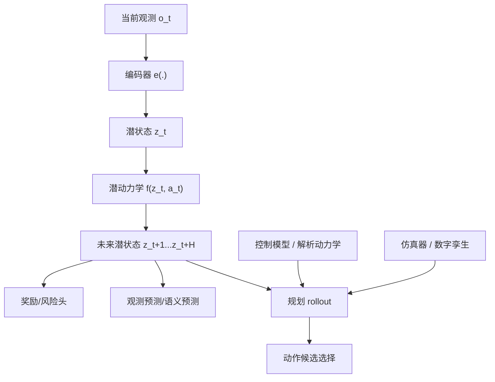

# 第十部分 世界模型、环境建模与可预测表征

在学习型机器人和多模态基础模型之间，世界模型路线扮演着一个非常微妙的角色。它既不像传统控制模型那样完全显式，也不像纯感知模型那样只负责当前观测解释，而是试图让系统形成一种能压缩环境、预测未来、支持规划的内部状态结构。也正因为这个位置特殊，世界模型在当前具身智能叙事中既被寄予厚望，也被广泛误读。

本部分的目标，不是把“世界模型”当作一个新口号，而是澄清三个问题：它到底在建模什么，它与控制模型、仿真器和 VLA 有什么区别，它在哪些地方真正有价值，又在哪些地方暂时还不应被高估。

从谱系上看，世界模型并不是今天才出现的概念。Ha 与 Schmidhuber 的 World Models 通过潜空间与梦境 rollout 强化了“内部环境”这一想法；Dreamer 则进一步把潜动态模型和策略学习耦合；JEPA 路线则把重点从像素重建转向抽象表征预测。[World Models](https://arxiv.org/abs/1803.10122)、[Dreamer](https://arxiv.org/abs/1912.01603)、[JEPA](https://arxiv.org/abs/2301.08243) 这些工作共同说明，世界模型真正关心的不是“看起来像世界”，而是“是否保留了足以支持决策和规划的可预测结构”。

## 46. 世界模型的基本定义

### 46.1 什么是“世界模型”
在本报告语境里，世界模型可以先用一个朴素定义把握：它是机器人对“如果我这样动作，世界接下来大概率会怎样变化”的内部可计算近似。这个近似既可以在像素空间里预测未来，也可以在潜空间、语义空间或接触状态空间里预测未来。关键不在表示形式，而在它是否为后续规划、控制或数据生成提供了可用的因果近似。

一个最小抽象可以写成：

\[
\hat{s}_{t+1}, \hat{r}_t = f_\theta(s_t, a_t)
\]

如果状态 \(s_t\) 不直接可得，则往往先引入编码器，把观测 \(o_t\) 映射为潜状态 \(z_t\)，再在潜状态中预测转移。
这一定义之所以值得反复强调，是因为近两年“世界模型”一词被过度扩张，几乎任何能做未来建模、视频生成、隐状态更新或序列预测的系统都可能自称世界模型。但对机器人来说，真正有意义的判据始终是：它是否帮助系统减少真实试错、提高候选动作评估质量，或者增强对环境演化的结构化掌握。若做不到这些，只能说明模型具有某种预测能力，还不能说明它已经进入具身主链条。

对具身系统而言，世界模型最朴素的含义，是系统内部存在某种可预测环境和状态演化的模型，使它不仅知道“现在看到什么”，还能够在一定程度上回答“接下来可能发生什么”。这一定义比“能生成视频”更宽，也比“有隐藏状态”更严格，因为关键不在于压缩本身，而在于这种压缩是否支持未来预测和行动决策。

### 46.2 世界模型与控制模型、仿真器的区别
世界模型、控制模型和仿真器看起来都在“预测未来”，但职责并不相同。控制模型更偏向低层局部动力学近似，常服务于 MPC、轨迹优化或解析控制器；仿真器则是更完整的环境生成与交互平台，需要负责物理、传感器、对象和任务脚本；世界模型通常处在二者之间，它不一定要求全物理保真，但要求对决策真正相关的未来结构做出紧凑、可学习、可调用的预测。

对学习者来说，可以先把三者粗略区分为：

1. `控制模型`：偏低层、局部、服务控制器。
2. `仿真器`：偏完整环境、可交互、服务训练与评测。
3. `世界模型`：偏可学习内部预测器、服务规划与表征。

控制模型通常更关注局部动力学和可控性；仿真器更关注完整环境重现；世界模型则往往更强调任务相关压缩和内部可预测性。三者当然可以重叠，但不能混同。一个模型可以生成看似逼真的未来视频，却未必适合控制；一个高保真仿真器可以很准确，却未必适合作为学习型内部状态表示。

从接口角度区分，控制模型最关心的是“给定当前状态与控制输入，短时局部动力学如何演化”；仿真器最关心的是“机器人与环境在更完整物理约束下如何共同演化”；世界模型则更像折中体，它不追求重建一切细节，而追求把对任务与规划最关键的未来结构压缩到一个可以快速推演的内部表示里。目标函数不同，评价标准也不同：控制模型看可辨识性与稳定性，仿真器看保真度与覆盖率，世界模型看规划可用性与分布外泛化下的结构是否仍可靠。
这一点在阅读文献时尤其重要。某些“video world model”本质上更像生成式未来观察器，某些 latent dynamics model 更像策略学习辅助器，某些数字孪生系统虽也预测未来，却主要服务于测试和验证而非内嵌闭环策略。若不先问清一个模型最终服务于控制、评测、数据生成还是内部规划，就很容易把不同问题设定下的结果误放到同一比较坐标系。

### 46.3 世界模型在机器人中的主要用途
这四种用途虽然常被放在一起讨论，但它们对模型质量的要求并不相同。若只作为训练期辅助环境，模型可以容忍更强的近似误差，只要它能提供有用梯度或额外样本；若直接参与在线规划，误差容忍度就会急剧收紧，因为错误会立即转化为错误动作评估。若作为失败恢复分析工具，模型则需要对异常后果和可回退分支更敏感，而不一定追求逼真重建。因此，阅读相关论文时，先识别“世界模型到底打算被用在哪个环节”，几乎是理解其价值的前提。

主要用途至少包括：

1. 作为策略学习的辅助内部环境。
2. 作为规划 rollout 的未来近似器。
3. 作为观测压缩与任务相关状态表示。
4. 作为数据增广或失败恢复分析工具。

如果再往系统职责上细分，可以把它们理解为四种不同的消费方式：训练期消费、规划期消费、诊断期消费和记忆期消费。训练期消费更看重样本效率和表征质量，规划期消费更看重候选动作排序是否稳定，诊断期消费更看重失败后果与风险解释，记忆期消费则更看重长期状态压缩和任务阶段跟踪。这个区分有助于避免把所有“能预测未来”的模型都用同一把尺子评价。

## 47. 动力学建模与潜空间预测

### 47.1 观测空间与潜空间
观测空间与潜空间的差别，决定了模型是在“直接看原始世界”，还是先“压缩出一个更适合预测与决策的内部世界”。观测空间里的变量往往是高维、冗余、含噪的，例如图像、点云和多传感器原始流；潜空间则是编码器学习出来的低维内部状态，目标是保留与控制相关的信息，同时丢弃大量无关细节。

一个最小映射关系可以写成：

\[
z_t = e_\theta(o_t), \qquad \hat{z}_{t+1} = f_\phi(z_t, a_t)
\]

这里最重要的不是“压缩得小”，而是“压缩后是否仍保留可达性、接触、对象关系和任务阶段等对决策重要的结构”。

在高维视觉和多模态观测下，直接在原始空间预测未来往往既昂贵又脆弱，因此世界模型常常先把观测映射到潜空间 \(z_t\)，再在潜空间中建模时间演化：

\[
z_t = e(o_t), \qquad z_{t+1} \sim p_{\theta}(z_{t+1}\mid z_t, a_t)
\]

这个结构的意义，在于它试图把“什么对未来最关键”压缩进内部状态，而不要求像素级重建一切细节。

### 47.2 一步预测、多步预测与 rollout
一步预测关注“下一步会怎样”，多步预测与 rollout 关注“如果我连续做一串动作，未来一段时间会怎样演化”。前者通常更容易训练，因为误差只跨一个时间步；后者更贴近规划需求，因为真实机器人决策往往关心一整段动作后果。

其最小 rollout 过程可以写成：

```python
latent = encoder(obs)
for action in candidate_actions:
    latent = dynamics(latent, action)
    imagined_states.append(latent)
```

也正因此，很多世界模型论文虽然首先报告一步预测误差，但真正决定系统能否用于规划的，往往是多步 rollout 是否稳定。
这里还隐含着一个常被忽略的接口问题：rollout 不是为了把未来完整演一遍，而是为了给某个决策变量提供比较依据。也就是说，多步预测是否有价值，取决于它是否改善了动作排序、风险筛选或计划修复，而不取决于它是否生成了“更长更像真的未来”。这一区分很重要，因为许多生成式模型在视觉上极具说服力，却未必在决策排序上比简单短视估计更可靠。

一步预测往往较容易，但世界模型真正有吸引力的地方在于多步 rollout：系统可以在不真实执行的情况下，对未来若干步结果做内部想象。这一点对高代价机器人任务尤其诱人，因为真实试错很慢，内部 rollout 看似提供了一条更廉价的规划路径。

若在潜空间中做 \(H\) 步 rollout，则可写为：

\[
\hat{z}_{t+k+1} = f_\theta(\hat{z}_{t+k}, a_{t+k}), \qquad k=0,\dots,H-1
\]

并通过某个任务头 \(r_\phi(\hat{z}_{t+k})\) 评估回报、风险或任务进展。

这段公式真正想表达的，不是“世界模型会自己产生价值”，而是它只有在后面接上决策评价头时才有系统意义。也就是说，rollout 的目的并不是做未来电影，而是比较候选动作的后果差异。若模型无法稳定区分“这个动作会撞上障碍”和“那个动作更可能顺利接触目标”，那么即便它能生成长而连贯的未来片段，也未必值得在机器人系统中承担核心职责。

### 47.3 长时程误差累积问题

但多步 rollout 的根本问题同样明显：每一步小误差都会继续传递，最终使远期预测迅速失真。也就是说，世界模型越被用作长时程推演工具，就越必须面对累积误差和分布外偏移。

在机器人里，这个问题比纯视觉预测更严重，因为系统不会只“看着模型出错”，而会真的按照错误预测去行动。短期偏差可能只影响下一帧重建，但闭环执行会把这种偏差进一步放大，并把机器人推向训练中更少见的新状态分布，随后模型又在这个更偏的分布上继续预测，于是形成典型的 closed-loop compounding error。
这也是为什么真实系统中的世界模型通常不会被当作“远期全知模拟器”，而更像带不确定性边界的有限视距评估器。工程上常见的缓解策略包括短视重规划、风险头估计、模型集成、保守候选筛选与不确定性触发回退，而不是盲目拉长 rollout 长度。

若把单步预测误差记为 \(\epsilon_t\)，那么多步 rollout 的有效误差通常会近似呈累加甚至放大趋势：

\[
\|\hat{z}_{t+H} - z_{t+H}\| \lesssim \sum_{k=0}^{H-1} L^{H-1-k}\epsilon_{t+k}
\]

这里的 \(L\) 可以被粗略理解为动力学映射对误差的放大系数。即使单步误差不大，只要系统对偏差敏感、或 rollout 足够长，整体误差就会迅速劣化。这也是为什么很多机器人世界模型最终更适合承担短视重排序、局部风险筛选或训练期辅助角色，而不是直接接管很长时域的在线控制。

\[
\|\hat{z}_{t+H} - z_{t+H}\| \not\approx \epsilon_t,
\qquad
\text{often grows with } H
\]

这不是形式化上必须线性增长，而是提醒我们：哪怕单步模型“还不错”，也不能直接推断长时程规划就可靠。对机器人而言，关键不是把 rollout 做得尽可能长，而是找到在当前误差水平下仍具决策价值的预测视距。

### 47.4 隐状态是否真的学到了“物理”
更严格地说，我们更关心的是“是否学到了对行动后果稳定有用的物理”，而不是“是否长得像物理”。一个潜状态不需要显式长成质量、摩擦系数、法向力这样的可解释变量才可能有用；但如果它在动作改变、接触发生、外界扰动出现时无法保持结构稳定，那么它再难解释也很难用于可靠控制。因此，对具身系统而言，物理性的判据最终是干预下的预测稳定性与任务可用性，而不是视觉可解释性本身。

这是世界模型争论中最关键的问题之一。一个潜状态可能非常有利于短期预测，却并不等于它编码了可解释的物理变量；它也可能只是“对当前训练分布足够有效”的压缩表示。因此，世界模型是否真的学到了与对象、接触、动力学因果机制相关的结构，必须依靠泛化表现、规划效果和干预鲁棒性来判断，而不能只凭重建或预测视觉效果下结论。

更可操作的判断方式是看这种隐状态在动作干预下是否保持结构稳定。例如，当接近路径改变、抓取方向改变、接触是否发生发生变化时，模型内部状态是否还能维持对后续结果的可区分性。若内部状态只在被动视频延续条件下稳定，而一旦动作改变就迅速崩塌，那么它更可能是视觉统计压缩，而不是行动相关结构表示。

这也意味着，对世界模型的评价不能只停留在“预测误差小不小”，而要追问“在动作改变时内部结构是否仍然有用”。对具身系统来说，真正稀缺的是行动相关稳定性，而不是被动观察下的压缩优雅性。

## 48. 视频预测与生成式环境建模

### 48.1 视频生成作为世界建模的路径

视频生成路线吸引人的地方，在于它看起来提供了一种统一表述环境变化的方法：只要系统能预测未来帧，就似乎同时掌握了对象运动、遮挡变化、交互结果和任务后果。这种统一性对研究者极具诱惑，因为它让世界建模问题被重新包装成了大规模视觉生成问题。

但从机器人角度看，视频生成真正有价值的前提，是它生成的变化必须与动作条件、接触约束和因果后果有稳定对应关系。否则，模型学到的更可能是“视觉上像未来的画面”，而不是“行动后真的会发生的未来”。因此，视频生成是世界建模的一条路径，但不是世界建模本身。
这条路线的真正吸引力，在于它天然承接了互联网规模视频预训练与生成模型基础设施，使世界建模不再完全依赖机器人专属数据。也就是说，它为“先在开放世界学未来变化结构，再向具身任务迁移”提供了看似可行的桥梁。问题在于，这座桥梁往往更擅长迁移视觉统计规律，而不是迁移可执行交互规律，因此必须特别警惕“开放世界未来感”与“机器人可执行未来”之间的错位。

随着生成模型能力上升，视频预测开始被视为世界建模的一条自然路径。原因很直观：如果模型能根据当前观测和动作生成未来视频，那么它似乎就“知道世界会怎样变化”。

### 48.2 diffusion/video model 的优势与代价

生成式视频模型的优势，在于它们能表达更丰富、更高维、更不确定的未来分布；代价则在于训练昂贵、推理昂贵，而且生成逼真并不自动意味着预测对控制有用。对机器人来说，最关键的问题不是生成视频看起来是否自然，而是这些未来是否保留了任务相关的物理可执行结构。

扩散与视频生成路线之所以极具吸引力，是因为它们似乎天然拥有开放世界建模能力。面对复杂背景、多对象交互和长尾视觉变化，它们确实往往比简单重建式 latent model 更有表达力。但机器人规划并不消费“像真度”本身，而消费与动作后果相关的结构变量，例如可抓取性、碰撞风险、接触后稳定性与局部几何一致性。只要这些变量没有被稳定编码进去，再漂亮的未来视频也可能只是视觉幻觉。
因此，更严格的评价问题是：这种生成模型能否被压缩成低时延、可条件控制、可被策略反复查询的规划接口。如果不能，它更可能是一种研究资产、数据生成器或分析工具，而不是立即可落地的闭环核心。

从系统工程角度看，它们的主要代价至少包括三类：第一是训练与推理成本高，难以进入高频在线环；第二是预测对象往往过于“视觉化”，与控制变量之间还隔着一层接口翻译；第三是评价口径容易被视觉说服力误导。也就是说，视频生成模型最容易赢得演示效果，却最需要在规划价值和控制可消费性上被额外严格审查。

这一定义对后续阅读很多“world model + video”路线特别重要。只要没有回答它如何进入规划接口、是否满足时延预算、以及是否优于更简单的结构化预测，那么它就仍更像研究资产，而不是系统核心部件。

### 48.3 生成逼真不等于物理正确

生成逼真不等于物理正确，这是世界模型研究里最容易被忽略的基本事实。一个视频可以在视觉上非常连贯、纹理细节丰富、对象外观自然，却仍然违反接触约束、质量守恒、刚体运动规律或任务逻辑顺序。对旁观者来说它“像真的”，对机器人来说它却可能没有足够的决策价值。

也正因为如此，世界模型不能只按人类主观观感来评价。真正关键的问题是：它的预测是否保留了对动作后果最关键的可验证结构，是否能支撑规划、筛选候选动作和评估风险，而不是仅仅生成一段漂亮的未来片段。
对于操作任务，这种错位尤其严重，因为很多成败恰恰由肉眼不显著的局部物理决定。例如，夹爪与物体边缘的相对姿态差几毫米、摩擦方向略有变化、插孔对位误差在视觉上几乎看不出，但它们足以让一个任务从成功变成卡住或滑脱。视频生成模型若只在宏观视觉连贯性上成功，却不能稳定表达这些微观结构，对机器人规划的帮助就会十分有限。

这是世界模型讨论中最容易被忽视的一点。一个模型可以生成肉眼看来“合理”的对象运动，却在接触细节、动力学约束、可抓取性和时间同步上全部失真。于是，生成美观的未来与提供可用于控制的未来，常常是两件不同的事。

对学习者而言，一个很实用的区分方法是：先问这个模型是否在“控制相关变量”上正确。所谓控制相关变量，可能是接触是否发生、可达区域是否改变、对象是否被稳定抓住、障碍物是否进入危险区，而不一定是整段视频看起来多自然。只有把评价口径从“像不像”改成“能不能支持动作判断”，世界模型章节才不会退化为生成模型章节的附庸。

### 48.4 为什么视频预测在开放世界里诱人

视频预测在开放世界里之所以诱人，是因为它似乎绕开了显式状态设计的痛苦。面对开放环境、长尾物体和复杂场景时，研究者很难手工定义一套完备状态变量；而视频作为统一观测表述，看起来天然能覆盖所有变化。这使得它在开放世界中具备很强的“接口统一”吸引力。

不过，这种诱惑也伴随风险。视频预测越通用，越容易把真正重要的可执行结构淹没在大量视觉细节中。对于机器人而言，开放世界不只需要“预测更多”，还需要在预测中保留那些与行动选择直接相关的因果骨架。

尽管问题很多，视频预测仍然有吸引力，因为它天然适合容纳开放环境中的对象变化、背景变化和多种可能未来。在互联网时代训练出来的大规模生成模型，也让“未来想象”这件事在技术上更可行。但对具身系统来说，这条路线能否成立，最终仍要看它是否能被压缩成规划可用、时延可接受、可与动作接口闭合的内部结构。

换句话说，视频预测真正迷人的地方，在于它提供了一种看似统一的世界接口；而它真正危险的地方，也在于这种统一过于诱人，容易让人忽视“统一到了视觉层，不等于统一到了行动层”。这也是本章坚持把视频生成和抽象预测分开讨论的原因。

## 49. JEPA 与抽象预测路线

### 49.1 不重构像素而预测语义
这一类方法的核心出发点，是承认“像素级重建并不一定等于控制相关预测”。如果任务真正关心的是对象是否可达、是否被遮挡、是否发生接触、是否进入危险区域，那么直接要求模型重建每一个像素，可能把大量容量浪费在与决策无关的细枝末节上。

因此，JEPA 一类方法更强调预测抽象表征而非原始像素，即：

\[
\hat{z}_{t+k} = f_\theta(z_t, a_{t:t+k-1})
\]

其中 \(z\) 表示抽象语义状态。对机器人而言，这一路线的吸引力在于它可能更容易保留任务结构，而不是被纹理细节牵着走。
如果把这一路线放回具身系统接口中理解，其价值就在于主动声明“预测目标应该为决策服务，而不是为视觉还原服务”。也就是说，模型可以不去还原每一个纹理细节，而把容量优先分配给对象关系、状态变化、动作后果与任务阶段这样的高价值变量。这种取舍与机器人系统的需求是更一致的，因为执行系统最终消费的是可执行结构，而不是美观视频。

JEPA 路线的重要性，在于它试图绕开像素级重建这一高成本目标，转而预测更抽象的表征结构。[JEPA](https://arxiv.org/abs/2301.08243) 这对于机器人尤其有吸引力，因为机器人真正需要的往往不是像素复刻，而是对行动相关语义与结构的稳定预测。

### 49.2 抽象预测与因果结构

如果世界模型只学习表面共现模式，它在环境变化和分布外场景中往往非常脆弱。抽象预测路线的潜台词是：系统应尽量学习那些更接近对象、关系、交互机制和任务结构的内部对象，而不是沉迷于重建所有可见细节。

但“抽象”并不自动等于“因果”。一个 latent state 也可能只是更紧凑地压缩统计相关性，而没有真正分离出稳定机制变量。对具身系统而言，真正重要的是这些内部变量能否支持干预式推理：当动作改变、接触方式改变或环境配置改变时，模型是否能给出结构上合理的未来分支，而不是仅仅延续训练集中最常见的视觉惯性。
因此，世界模型若想从“预测器”进化为“规划器”，最终必须在某种程度上面向干预、反事实与任务相关因果结构。哪怕做不到严格可解释，它也至少应在动作改变后表现出稳定的结构响应，而不仅在被动观察条件下维持高分。

对机器人来说，这个“因果结构”最务实的检验方式往往不是哲学意义上的因果发现，而是工程意义上的干预一致性：同一对象在不同接近方向下是否呈现不同但合理的接触后果，同一技能在不同环境约束下是否能预测不同失败模式。只要模型能在这些关键干预维度上给出稳定差异，它就比只会延续视频表面的模型更接近真正可用的世界模型。

### 49.3 JEPA 路线对机器人世界建模的启发

JEPA 路线的重要启发，在于它提醒机器人研究者：未必要把所有未来都重构成像素，才能获得有用的预测能力。若系统能在抽象空间中预测那些真正决定后续决策的结构变量，例如对象关系、可达状态、任务阶段和潜在风险，那么它也许能用更低成本获得更稳定的长时程表征。

这一路线对机器人尤其有意义，因为真实控制常常并不需要照片级未来，而需要“什么东西会变、什么约束还成立、什么动作更可能成功”这样的结构信息。JEPA 类方法因此更接近把世界模型做成决策基础设施，而不是做成视觉特效引擎。
这也提示我们，未来很多真正有工程价值的世界模型可能既不像纯视频生成器，也不像传统显式动力学模型，而更像“任务结构优先的预测表征器”。它们会优先保留接触前后状态切换、对象可达性变化、局部风险上升、技能成功前提是否满足等执行层真正关心的变量。这样的模型即便在视觉演示上不够惊艳，也可能比华丽生成路线更有部署价值。

对机器人而言，这一路线的真正启发在于：一个好的内部模型不一定重构得最精细，而可能是那个最能保留可预测、可规划、可控制结构的模型。也就是说，世界模型的目标不应由“生成得像不像”单独决定。

### 49.4 抽象预测与表征学习的边界

抽象预测与表征学习之间的边界并不总是清晰。很多时候，一个模型说自己在学“可预测表征”，但实际得到的也许只是对下游任务有用的压缩特征；反过来，一个看似只做表征学习的方法，若其表示中已经隐含足够的时间与因果结构，也可能具备某种弱世界模型性质。

因此，更有意义的问题不是机械区分它们属于哪一类，而是追问：这个表示究竟保留了哪些跨时间稳定的结构，能否支持规划、异常检测、动作选择和策略迁移。只有当这些用途被明确时，抽象预测才真正从“好看的表示学习概念”变成具身系统里的可用部件。

JEPA 也提醒我们，世界模型与表征学习并非泾渭分明。两者之间的边界，经常取决于模型是否被要求显式推演未来、是否被用于规划、以及其内部状态是否承担可验证的任务结构预测功能。因此，在机器人文献里看到“predictive representation”“latent dynamics”“world model”等词时，必须区分其是用作策略辅助表征，还是用作真正的内部环境近似器。

## 50. 当前世界模型路线的评价

### 50.1 适合解决什么问题
当前世界模型最适合承担的，通常不是“直接接管整个机器人系统”，而是以下几类职责：

1. 候选动作或计划的内部重排序。
2. 训练时的表征学习与想象数据增强。
3. 长时程任务中的状态摘要与未来风险提示。
4. 在高成本真机试错前做内部筛选。

这说明世界模型更像一个中间能力放大器，而不是天然完整控制器。
这些适用边界本身也说明，世界模型当前更像“系统增益器”而不是“系统吞并器”。它能在若干关键位置提升样本效率、候选评估质量和训练闭环质量，但通常还不足以独自承担全栈闭环责任。把它放在正确的职责位置，往往比夸大它的统一能力更重要。

目前更适合的问题包括：

1. 作为训练阶段的辅助内部环境。
2. 作为潜空间表征学习器。
3. 作为局部规划和数据增广工具。
4. 作为长时程任务中的任务相关记忆结构。

从系统架构角度看，这几类职责有一个共同点：它们都不要求世界模型单独拥有最终执行权。它更像在高成本真机动作之前提供一层内部筛选、排序或摘要能力。也正因此，当前阶段更稳健的研究思路往往不是“让世界模型取代一切”，而是判断它在哪个接口位置能真正降低试错成本、提升恢复能力或缩短训练闭环。

### 50.2 暂时不适合解决什么问题
相反，当前世界模型通常还不适合直接承担高频闭环控制、严格接触操作和强安全约束场景中的唯一决策者角色。原因很直接：多步误差积累、接触动力学难建模、状态分布漂移以及开放世界中的组合长尾，都会让内部预测在关键时刻失真。

对学习者来说，可以先建立一个保守判断：越是高频、接触敏感、时延敏感、黑天鹅代价高的任务，就越不应把世界模型单独视为最终控制闭环。
如果把这些“不适合”说得更直白一些，就是：世界模型今天还不足以成为机器人系统中的全知导演。它更适合作为顾问、评估器、训练助手和候选未来的筛选器，而不是唯一控制中枢。许多研究叙事的问题，不在于提出了错误方向，而在于把局部有效能力过快外推成全局可部署能力。

当前不应高估其在以下方面的能力：

1. 直接替代全部低层控制模型。
2. 在复杂接触下提供高可信长时程可执行预测。
3. 仅靠生成未来就解决安全与部署可靠性问题。

### 50.3 与 VLA 路线的关系与分工

从系统角度看，VLA 更偏向“把感知、语言和动作接口统一起来”，世界模型更偏向“把环境与未来结构压缩为可预测内部状态”。二者并非天然竞争，也可能协同：VLA 负责高层条件化和动作接口，世界模型负责未来结构与环境演化近似。但这类协同是否成立，仍然取决于它们能否在真实机器人闭环中共享同一套可执行约束。

更具体地说，VLA 往往回答“基于当前观测与任务描述，我下一段动作应该如何组织”，世界模型更适合回答“如果这样组织，接下来若干步大概率会发生什么”。前者更像条件策略，后者更像内部评估器或预测性记忆。只有当二者共享足够一致的状态定义、动作接口和时间尺度时，协同才会带来稳定收益；否则，它们可能只是两个各自很强、却难以可靠串接的子系统。
从当前文献与工程信号看，更可信的近中期图景不是“世界模型替代 VLA”或“VLA 吞并世界模型”，而是二者分工：VLA 负责语义条件化、技能调用与交互解释，世界模型负责候选动作评估、异常后果预估和训练期数据增强。这种分工式协同也更符合实际时延预算与验证需求。

也正因为如此，本报告后续会始终把二者放在“分工关系”而不是“谁吞掉谁”的框架里理解。这样更有助于避免被单一路线叙事重置判断坐标。

### 50.4 最小 rollout 伪代码

下面给出一个最小化的潜空间 rollout 代码片段，用来说明世界模型在规划中的典型接口：

```python
z = encoder(observation)
predictions = []

for action in candidate_action_sequence:
    z = latent_dynamics(z, action)
    reward = reward_head(z)
    risk = safety_head(z)
    predictions.append((reward, risk))
```

真实系统当然会更复杂，但这个片段准确揭示了世界模型的工程位置：它不是直接执行动作，而是在执行之前为候选动作序列提供一个内部评估空间。

本部分的最终结论是：世界模型确实可能成为具身系统的重要组成，但它的真实价值主要体现在“压缩、预测、辅助规划和增强训练闭环”上，而不应被轻易夸大为一个能直接吞并控制、部署和安全问题的终极统一模块。

## 图表补充说明
本章后续最值得固定下来的两张图，其实已经隐含在正文结构里。第一张应是“控制模型 - 世界模型 - 仿真器 - VLA”的区分图，用来帮助读者避免把所有“预测未来”的东西混成同一类模块；第二张应是“像素重建路径 vs 抽象预测路径”的对照图，用来展示不同世界建模路线到底在优化什么。

这两张图之所以重要，是因为世界模型讨论最容易陷入概念扩张。只要把职责边界和预测对象画清楚，很多看似抽象的争论就会重新落回具体问题：模型预测的是像素、语义、潜状态还是动作后果，它服务的是控制、评估、训练增强还是规划筛选。

1. 图 10-A：`控制模型 - 世界模型 - 仿真器 - VLA` 的区别图。
2. 图 10-B：`像素重建路径 vs 抽象预测路径` 对照图。

如果后续要持续扩这部分，建议先回看 [世界模型论文清单](D:/Projects/embodied-intelligence-report/research/papers/世界模型-论文清单-v0.0.md)，确认新增工作到底落在哪条主线，再决定是否补单篇论文卡或正文分析。
## 图 10-1 世界模型在具身系统中的关系图
源文件：`assets/diagrams/10-世界模型关系图.mmd`


