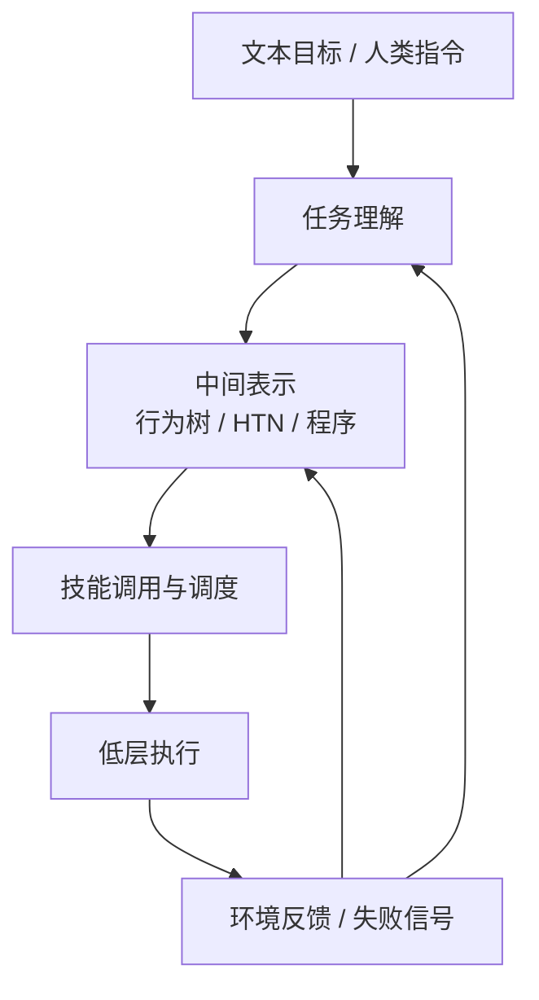

# 第十二部分 规划、推理与决策的新路线

如果说第十一部分讨论的是如何把视觉、语言与动作统一成基础模型接口，那么本部分要回答的就是：这些模型如何真正承担任务结构化、长期决策和复杂场景下的推理责任。因为机器人并不只需要“输出动作”，还需要决定先做什么、后做什么、何时放弃、何时请求帮助、何时切换技能。于是，语言规划器、任务树、行为树、程序化中间表示、检索增强和多智能体协同等路线开始重新升温。

值得注意的是，规划问题在具身智能里从未消失，只是接口发生了变化。经典规划关注状态空间、动作集合与约束；foundation model 时代则把自然语言、常识知识与长程结构化推理重新接入规划器。因此，这一章不应被理解为“旧规划 vs 新模型”的对立，而应被理解为“规划载体和规划接口的迁移”。这一迁移在 SayCan、Code as Policies、Voyager、RT 系列以及大量神经符号机器人工作中都有不同体现。[SayCan](https://arxiv.org/abs/2204.01691)、[Code as Policies](https://arxiv.org/abs/2209.07753)、[Voyager](https://arxiv.org/abs/2305.16291)

## 57. 语言规划与任务分解

### 57.1 高层语言规划器
高层语言规划器的最小职责，是把自然语言目标翻译成“可被下游技能层消费的任务结构”，而不是直接输出电机级动作。它通常接收三类输入：用户目标 \(g\)、当前环境观测 \(o_t\)、以及外部记忆或技能库描述 \(m\)。输出则往往是一组阶段化子任务、技能调用建议或带前置条件的候选计划。

若写成抽象形式，高层规划器更像是在估计：

\[
p(\tau \mid g, o_t, m)
\]

其中 \(\tau = (u_1, u_2, \dots, u_K)\) 表示高层子任务序列。这个公式强调，高层规划本质上不是凭空“想步骤”，而是在目标、场景状态和可用技能约束下生成结构化任务图。

一个最小工作流通常可以写成：

```python
goal = parse_user_goal(text_instruction)
scene = summarize_world_state(observation, memory)
skills = retrieve_available_skills(skill_registry, scene)
plan = llm_planner(goal=goal, state=scene, skills=skills)
```
但高层语言规划器真正困难的地方，不在于生成一串看起来合理的步骤，而在于这些步骤是否与系统真实能力边界一致。很多大模型在文本层面能够给出漂亮计划，却默认了隐含技能存在、对象状态可观测、执行顺序可行、失败可以无代价回滚等前提。机器人规划器若不能把这些隐含前提显式化，就会在真实执行时不断把“语义上合理”转化为“工程上不可执行”。

高层语言规划器的核心作用，是把自然语言目标转化为结构化子任务序列。例如，“整理桌面”可能被分解为识别对象、分类、抓取、放置和异常处理。大模型在这里的优势，在于它们天然擅长处理长文本目标、常识知识和任务组合关系。

### 57.2 子任务序列生成
对子任务序列生成而言，最重要的不是“分解得多细”，而是分解出的每个节点是否具有明确输入、输出、前置条件和失败后的修复路径。一个好的子任务节点，往往至少要回答四个问题：做什么、依赖什么、成功如何判定、失败后如何回退或改写。

若把一个子任务节点记为 \(u_i\)，则更有操作性的表示不是一句自然语言，而是：

\[
u_i = (\text{name}, \text{precondition}, \text{resource}, \text{success}, \text{fallback})
\]

这种写法的重要性在于，它把“计划”从叙述文本改写成了可执行结构。很多高层规划失败，并不是因为模型不会分解，而是因为它输出的节点缺乏可消费字段，导致执行层既不知道何时开始，也不知道何时宣布成功，更不知道失败后应该退到哪一步。

因此，实际系统中的子任务生成常不是一次性文本生成，而是“生成 - 检查 - 修复 - 重排”的循环。其最小工作流可以写成：

```python
plan = planner.generate(goal, state)
for subtask in plan:
    if not precondition_checker(subtask, world_state):
        subtask = planner.repair(subtask, world_state)
    if not skill_registry.supports(subtask):
        plan = planner.rewrite(plan, missing_skill=subtask)
```
因此，子任务序列生成应被理解为一个受约束的搜索问题，而不是单纯自然语言续写。一个好序列不仅要覆盖目标完成路径，还要包含前置条件、资源占用、互斥关系、超时处理和失败后可修复性。也正因如此，很多系统会在大模型生成后叠加技能可用性检查、状态谓词校验、行为树编译或候选计划重排序，而不是直接把文本计划下发给执行器。

但生成子任务序列并不自动意味着这些子任务可执行。真正关键的问题是：这些子任务是否与现有技能库匹配，是否保留必要的前置条件，是否考虑执行中断和失败恢复。也就是说，语言规划器若没有与技能层和状态估计层对接，就仍然更像一个任务建议器。

### 57.3 指令歧义消解

机器人中的规划器必须频繁处理不完整指令。所谓“把那个杯子放回去”在纯文本中看似简单，到了真实场景却涉及对象指代、目标位置、省略步骤和历史上下文。规划器的价值因此不仅在于能输出计划，也在于能识别自己理解中的不确定性，并主动发起澄清。

若以 \(g\) 表示用户目标、\(m\) 表示外部记忆、\(o_t\) 表示当前观测，则高层规划器可抽象为：

\[
p(\tau \mid g, o_t, m)
\]

其中 \(\tau = (u_1, u_2, \dots, u_K)\) 表示高层子任务序列。这个形式强调了现代规划器与经典 symbolic planner 的一个差异：它不再只依赖人工定义的状态谓词，也把语言上下文和记忆结构纳入了输入。

但真正的难点在于，歧义消解并不是单独的语言问题，而是“语言 - 场景 - 历史 - 技能库”四者的联合约束问题。同一句“把它放回原位”，在不同工作流、不同用户习惯和不同场景记忆下，可能对应完全不同的可执行计划。因此，一个成熟规划器不是更会猜，而是更会在不确定性过高时请求额外信息、调用外部记忆或回退到更保守的子任务。

## 58. 结构化决策中间表示

### 58.1 行为树
行为树之所以在机器人里长期流行，是因为它提供了一种介于脚本和规划器之间的结构化执行语义。它最常见的节点类型包括顺序节点、选择节点、条件节点和动作节点。系统在每个 tick 周期内从根节点向下传播执行请求，不同节点根据子节点返回的 `Success / Failure / Running` 状态决定是否继续、切换或回退。

一个最小行为树可以抽象为：

```text
Sequence
|- Condition: object_detected
|- Action: approach_object
|- Action: grasp_object
|- Fallback
   |- Action: place_in_bin
   |- Action: request_human_help
```

行为树在机器人和游戏 AI 中长期流行，并不是因为它最前沿，而是因为它在表达可回退、可条件切换、可并行调度的行为结构上非常实用。对具身系统而言，行为树仍然是把高层任务结构显式化的重要工具。[Behavior Trees in Robotics and AI](https://arxiv.org/abs/1709.00084)

### 58.2 任务树与 HTN
HTN（Hierarchical Task Network）可以理解为“把一个抽象任务通过一组分解规则逐步改写成可执行任务网络”。与行为树更强调运行时控制流不同，HTN 更强调规划时的任务展开过程。它通常包含抽象任务、原子任务以及分解方法。

一个极简 HTN 风格分解示意可以写成：

```text
Task: clean_table
-> Method A:
   detect_objects
   sort_by_category
   move_category_items
   verify_surface
```
HTN 之所以在今天依然有价值，恰恰因为它能把“语言生成出来的模糊层级结构”压缩成带有明确父子依赖、分解规则和可验证前置条件的图结构。对于具身系统，这意味着高层规划不必一次性承担全部细节，而可以把任务分解过程稳定绑定到一组可复用模板上。这样做虽然牺牲了一部分开放性，却往往换来了更强的可调试性、可回退性和跨团队协作可维护性。

层级任务网络（HTN）及类似结构的价值，在于它们能把复杂任务表示为多层目标分解图。这类方法非常适合和语言规划器结合：大模型负责提出候选高层结构，HTN 或任务树负责把它约束成更可执行的形式。

### 58.3 程序化中间语言
程序化中间语言的核心思想，是让大模型输出的不是“自由文本计划”，而是一个带类型约束、参数槽位和可调用 API 的半结构化程序。它既保留语言模型对开放语义的表达能力，又通过语法和工具接口把行为限制在可解释、可验证的执行边界内。

一个最小示意可以写成：

```python
plan = [
    Pick(object="red_cup", grasp="top"),
    MoveTo(location="right_tray"),
    Place(object="red_cup", tolerance="fragile")
]
```

与自由文本相比，这种中间语言至少带来三点价值：第一，参数槽位可以被感知模块重新绑定；第二，动作类型可以被白名单与安全规则约束；第三，执行日志更容易被回放和审计。它的代价则在于表达空间被收紧，因此必须设计得既足够结构化，又不能过早把开放任务压扁。

一个极简 DSL 片段可以写成：

```python
if detect("mug", table="left"):
    grasp("mug")
    place("mug", target="sink")
else:
    ask_human("Where is the mug?")
```

程序化中间语言的出现，反映的是一种很现实的架构需求：直接从文本到动作太脆弱，而纯符号系统又太僵硬，因此需要一种既保留语义结构、又便于执行验证的中间形式。机器人编排 DSL、技能脚本和 callable API 风格接口都可视为这一路线的不同变体。Code as Policies 的代表性恰恰在于，它把语言模型输出约束到可执行代码接口，使“推理”更容易经过解释器、类型约束和工具调用链路。[Code as Policies](https://arxiv.org/abs/2209.07753)

### 58.4 神经符号混合方案
神经符号混合方案之所以反复出现，是因为它试图把两类互补能力放在一起：神经模型擅长从复杂感知输入中提取柔性的表征与启发式，符号规划擅长维护显式约束、长时程结构和可验证的状态转移。对机器人而言，这种混合路线的核心吸引力，不是理论优雅，而是它更容易在开放感知与受约束执行之间建立桥梁。

但这条路线也并不轻松。最大难点通常不是“如何把神经网络接上规划器”，而是状态抽象是否足够稳定，能否让高层符号变量真正对应到现场可观测、可执行、可恢复的对象与关系。若抽象层不稳，神经符号混合就会退化成接口复杂但并不可靠的双系统叠加。
从系统实现角度看，神经符号混合通常可以被写成三层闭环：先用神经感知模块把视觉、语言和状态历史压缩成任务相关表征；再由符号层执行约束检查、技能选择和顺序编排；最后由执行层把失败信号、状态偏差和资源冲突反向返回给上层。真正有用的不是“符号味更重”或“神经味更重”，而是这三层之间是否形成了可追责的接口。如果研究工作只展示了神经模块很强、或符号结构很漂亮，但没有解释失败如何回传、约束如何触发、技能如何重写，那么它对部署的帮助仍然有限。

神经符号混合方案持续有吸引力，是因为它试图同时保留两类优势：神经方法对感知噪声、模糊模式和高维输入的适应能力，以及符号方法对约束表达、组合泛化和可解释推理的优势。对具身系统而言，这种混合并不是理论上的折中，而往往是现实系统里最自然的分工方式。

但这类方案真正困难的地方并不在于“把两个模块接起来”，而在于定义两者之间稳定且不过度脆弱的接口。若感知输出无法支撑符号层需要的确定性，或者符号层给出的计划无法被低层连续动作执行，混合方案就会在接口处失效。
从工程现实看，神经符号混合方案的吸引力还在于责任切分更清楚。神经模型负责处理开放词义、长尾语境和模糊常识，符号或程序结构负责处理类型约束、顺序约束、权限边界和失败分支。这种分工并不总能获得最惊艳的 demo，但更容易形成可测试接口和问题归因路径，因此尤其适合那些需要长期维护、要通过审计或要进入高风险场景的机器人系统。

神经符号路线的真正意义，不在于“把老符号 AI 重新包装”，而在于它提供了一种可能：让语义理解依赖神经模型，让可验证结构依赖显式程序或逻辑结构。对需要长期可靠部署的机器人系统而言，这种混合路线往往比纯端到端推理更有工程吸引力。

更进一步说，神经符号混合最值得重视的不是理论姿态，而是它往往天然提供了更清楚的责任切分。神经部分负责吸收开放语义、长尾环境和感知噪声，符号或程序部分负责约束顺序、权限、前置条件和异常分支。对于需要长期维护、要通过审计或要进入高责任场景的系统，这种可切分性本身就是工程价值。

## 59. 大小脑协同范式

### 59.1 语义级决策与运动级执行的接口
这一接口的本质，是把“高层说什么”和“低层怎么把它做出来”分开描述。语义级决策通常输出的是技能名、子目标、目标对象或目标区域；运动级执行则需要这些抽象变量被具体绑定成轨迹、末端位姿、接触约束和控制频率。因此，一个真正可用的接口必须至少完成四件事：目标绑定、状态对齐、可达性检查、执行中反馈回传。

可以把这个接口抽象为：

\[
u_t = \mathrm{Bind}(g_t, \hat{x}_t, \mathcal{K})
\]

其中 \(g_t\) 是高层语义目标，\(\hat{x}_t\) 是当前估计状态，\(\mathcal{K}\) 是技能库或控制器集合，\(u_t\) 则是可交给执行层的具体技能或控制命令。

大小脑分层的核心不是一个比喻，而是架构现实：高层决策频率低、语义密度高；低层执行频率高、连续性强。二者若不分层，系统难以同时满足长期任务理解和短时稳定控制的要求。

### 59.2 调度频率与时间尺度问题
这也是为什么“统一模型每一步都重新思考一切”的设想在真实系统里往往并不划算。高层推理一旦太频繁，就会把计算预算浪费在重复解释任务上；太稀疏，则会让计划对局部异常反应迟缓。调度频率设计本质上是在决定：哪些问题值得重新思考，哪些问题应交给局部控制器自动吸收。这个问题没有通用最优解，只能结合任务节奏、硬件时延、传感刷新频率和安全约束做系统级折中。

更具体地说，规划系统通常至少有三种时钟：感知刷新时钟、局部控制时钟和高层重规划时钟。三者若没有被清楚区分，系统就会出现一种常见错觉，即“模型总在忙，但系统并不更稳”。真正成熟的调度设计，往往不是让所有模块同步全速运转，而是让每一层只在自己真正需要更新的时候工作。

很多看似“模型能力不够”的问题，本质上其实是时间尺度错配：高层推理太慢，低层反馈太快；高层生成的计划太粗，低层执行需要更细；高层上下文太长，低层状态新鲜度要求更高。因此，调度频率本身就是系统设计变量。

若高层每 \(\Delta T_H\) 秒更新一次计划，低层每 \(\Delta T_L\) 秒闭环一次控制，通常需要满足：

\[
\Delta T_H \gg \Delta T_L
\]

并且高层计划误差不能在 \(\Delta T_H\) 时间窗口内失控地积累。这也是为什么许多系统宁愿牺牲一点“统一性”，也要保留局部反射与中层技能缓存。

### 59.3 现实系统中的工程折中
现实系统中的工程折中，往往意味着规划与推理不会以最纯粹的论文形式出现。为了满足时延、稳定性和可维护性要求，企业系统常常会保留大量启发式规则、预定义技能、状态机和本地恢复逻辑，再在部分环节引入学习型规划或大模型推理。表面上看这不够“统一”，但往往更可交付。

因此，理解规划路线时不应只问“是否端到端”，而应问“哪些层必须保留折中，为什么”。很多看似不够优雅的工程设计，恰恰是在系统真实进入现场后才被证明必要的部分。
更进一步说，工程折中并不是“学术不纯粹”的副产品，而是具身系统从研究走向交付时必须显式回答的架构问题。一个规划器若只能在理想状态下输出全局优解，但无法在传感掉帧、技能不可用或人为插入任务时快速降级，那么它在真实系统里反而不如一个次优但可回退的方案有价值。也正因此，本章讨论的规划与推理路线，最终都应该被放回 15、16 两章中的部署与安全约束下再评价。

现实系统中的工程折中，常常体现在研究论文最不愿展开的地方：是选择更高性能但更不稳定的规划器，还是选择更保守但更可验证的方案；是让模型更自主，还是保留更多手工规则与安全裁剪；是追求端到端统一，还是接受分层带来的复杂性。真正上线的系统几乎都在这些地方做过妥协。

也正因此，判断一条路线是否成熟，不能只看它最强时能做到什么，更要看它在资源有限、时延受限、安全约束存在、维护压力真实存在时，最终选择了怎样的工程边界。很多看似“不够优雅”的折中，恰恰是现实可交付性的来源。
因此，现实系统里的“规划器”往往不是单个模块，而是一条多层责任链。高层决定意图与阶段，中层维护技能切换与条件恢复，底层保证轨迹与接触稳定，外层再由安全监督器监控越界行为。看起来不够优雅，但这正是大量真实机器人产品能够工作的原因。评价论文或企业方案时，若只看最上层模型而忽略这条责任链，很容易高估其统一程度、低估其工程支撑。

现实中的大小脑系统常常不是严格两层，而是多层：高层语义规划、中层技能调度、低层闭环控制再加安全监控。这种复杂性并不意味着设计失败，而恰恰说明真实机器人系统很难被单一时间尺度统一吞并。

## 60. 连续推理与外部记忆

### 60.1 推理 token 在机器人中的局限
把更多推理 token 投入机器人，并不自动等于更好的行为，因为机器人决策不是纯文本推理，而是受状态新鲜度约束的实时闭环。每多做一轮长链推理，环境都可能已经变化：人移动了、物体被遮挡了、夹爪姿态漂了、目标已经不在原处。因此，机器人中的“多想一步”始终要与“是否来得及执行”一起评价。

若用一个很简单的时延模型表达，可以把总决策延迟写成：

\[
T_{\text{decision}} = T_{\text{perception}} + T_{\text{reason}} + T_{\text{actuation}}
\]

推理 token 可以帮助高层任务思考，但机器人系统不能无代价地无限推理。原因并不神秘：推理消耗时间、时间会导致状态陈旧、状态陈旧会削弱动作可执行性。因此，机器人中的“更会想”必须始终和“还能够及时做”一起被评价。

### 60.2 外部记忆与检索增强
外部记忆可以理解为“把不适合塞进当前上下文窗口、但又会反复影响任务成败的状态与经验结构化存放起来”。它通常至少包含三类对象：环境记忆、任务记忆和人机交互记忆。

如果把记忆系统设计成研究对象而不是附属缓存，就会发现它至少要回答三个问题：写入什么、何时失效、如何检索。环境记忆更像地图与对象历史，任务记忆更像阶段日志与失败片段，人机交互记忆则更像约束、偏好与澄清记录。三者在时间有效性和可信度上都不同，因此不能简单混在一条文本上下文里。

一个最小检索增强工作流可以写成：

```python
query = build_context_query(goal, observation)
memory_items = retrieve(memory_store, query)
augmented_state = fuse(observation, memory_items)
plan = planner(goal, augmented_state)
```
对机器人来说，外部记忆的价值尤其体现在“让系统不必每次都重新从零理解现场”。相同房间布局、重复出现的工具、用户偏好、历史失败点、危险区域和常用收纳位置，都更适合以显式可检索结构保存，而不是期待大模型在隐式参数里长期稳定记住。这样做不仅提升长期任务连续性，也使得记忆本身能够被审计、修订和按场景权限管理。

与其让模型在参数中隐式记住一切，不如将环境历史、任务历史、对象属性和用户偏好外置为检索结构。这对长期任务特别重要，因为机器人系统会持续遇到相似场景、相似对象和相似失败模式。

### 60.3 历史轨迹、场景状态与人类反馈的融合
如果要把这种融合写成一个可操作的工程对象，可以把每条记忆至少拆成四个字段：`what happened`、`when`、`confidence`、`usable by which skill`。前两个字段解决时间顺序和新鲜度问题，第三个字段决定是否可以直接驱动决策，第四个字段决定这条记忆究竟服务于导航、抓取、重规划还是人机交互。否则，所谓“长时记忆”很容易变成没有边界的日志堆积，而不是能够提升闭环质量的决策基础设施。
真正困难的部分，则在于这些异构记忆如何被统一索引和可信消费。文本反馈、轨迹片段、对象状态快照和视频回放往往有不同时间粒度、不同置信度和不同用途，系统若简单拼接，很容易导致检索污染或过时记忆误导当前决策。因此，外部记忆不是“存得越多越好”，而是要围绕任务阶段、时间有效性、来源可信度和与当前技能接口的相关性来做结构化管理。

真正实用的机器人记忆通常不是纯文本记忆，而是多模态任务记忆：轨迹片段、地图状态、对象位置、失败案例和人类纠正记录共同构成可检索上下文。SayCan 的技能可供性评分、Voyager 的代码技能库积累、以及长程代理系统中的 memory buffer，本质上都属于把“推理”嵌入外部结构而不是完全内化在一次前向传播里。[SayCan](https://arxiv.org/abs/2204.01691)、[Voyager](https://arxiv.org/abs/2305.16291)

更实用的理解方式，是把机器人系统拆成至少三种时间尺度。第一层是毫秒到数十毫秒级的稳定控制层，负责阻抗、跟踪、接触稳定和安全停机；第二层是数百毫秒到数秒级的技能层，负责抓取、开门、对位、避障等可复用技能；第三层才是秒级到分钟级的语义规划层，负责“先做什么、后做什么、是否换策略”。如果把本应在前两层解决的问题一股脑上推给高层大模型，就会出现“推理上很聪明、动作上总是慢半拍”的典型失配。

这也意味着，“大脑-小脑-脊髓”并不是修辞，而是不同更新频率、不同可验证性和不同失败代价的真实分层。一个可部署系统通常需要显式规定每层的预算，例如：

```text
high-level planner:   0.5-2 Hz
skill scheduler:      2-10 Hz
feedback controller:  100-1000 Hz
safety monitor:       event-triggered
```

如果这套频率预算没有在系统设计早期被固定下来，后续很多争论都会变得含混不清。研究者会误以为自己在比较模型优劣，实际上比较的常常是不同时间尺度上的职责分配。

如果进一步把外部记忆写成工程对象，最小记忆条目至少应包含：`key`、`type`、`timestamp`、`source`、`confidence`、`ttl`、`payload` 和 `usable_by`。这里 `ttl` 用来限制记忆新鲜度，`usable_by` 用来避免高层偏好记忆误喂给低层控制器，`source` 与 `confidence` 则决定这条记忆究竟是“可直接执行的事实”，还是“仅供规划参考的弱线索”。

从系统风险角度看，外部记忆至少有三种常见失效模式。第一种是过时记忆污染当前决策，例如对象已经被人移动，系统却仍按照历史位置规划；第二种是错误抽象，把一次偶然成功的局部策略写成通用规则；第三种是权限越界，例如把用户偏好日志和场景危险区域记录混在同一检索空间中。真正成熟的记忆增强系统，通常会把“能否写入”“谁能读取”“什么条件下失效”设计得和模型本体同样严肃，而不把记忆当作随手加上的缓存层。[SayCan](https://arxiv.org/abs/2204.01691) 与 [Voyager](https://arxiv.org/abs/2305.16291) 分别从技能可供性和技能积累角度，展示了外部结构对长期决策的重要性。

## 61. 多机器人与多智能体协同

### 61.1 分工与通信
多体协作中的分工与通信，不能只理解成多台机器人互相发消息。更核心的问题是：谁负责全局任务拆分，谁负责局部执行，哪些状态必须共享，哪些状态只需要本地维护，以及一旦通信延迟或局部失败出现，系统如何退化运行。没有这些设计，协作系统很容易在规模扩大后迅速失稳。

因此，多机器人协作的难点不只是算法复杂度增加，而是组织复杂度上升。它要求我们把原本单机内部的规划、调度、资源分配和异常恢复问题，提升到跨主体层面重新设计。
这里很适合引入一个最小通信契约的视角。对于多机器人或多模块系统而言，真正必须共享的往往不是全部观测，而是少量高价值变量，例如任务占用、空间占用、资源锁、异常状态和阶段完成信号。凡是能通过局部闭环解决的问题，最好不要升级成全局通信问题；凡是会引发级联冲突的问题，则必须被提升为全局可见状态。这个原则比单纯强调“大模型负责协调一切”更贴近真实工程。

多智能体或多模块系统中的“分工与通信”并不是一个附属问题，而是决定系统复杂性是否真正可控的核心问题。只要任务被拆到多个执行体、技能模块或推理层次之间，就必须回答谁负责全局目标、谁处理局部异常、哪些状态需要共享、哪些决策可以局部独立完成。

通信设计过少，会让各模块各自最优却整体失调；通信设计过多，则会迅速抬高系统延迟、协调成本和调试难度。对具身系统来说，更现实的方向通常不是追求完全自由通信，而是围绕任务结构设计稀疏、稳定、语义明确的交互协议，让系统在必要时共享关键状态，而不是在所有时刻交换所有信息。

多机器人协同把单体系统的问题放大成协调问题：谁先做、谁等待、谁搬运、谁观察、谁承担共享地图维护。语言模型与多智能体规划看起来在这里很有吸引力，但真正难的是通信延迟、信息不一致和角色切换的可验证性。

因此，多智能体规划的核心并不是“让多个智能体都更聪明”，而是让它们在信息不完全同步的情况下仍维持足够稳定的组织秩序。现实部署中，协作失败往往不是因为单体不会做事，而是因为局部错误状态被广播、放大并演化成系统性失调。

### 61.2 协作任务的规划难点
从算法视角看，这意味着协作规划往往隐含一个带约束的联合优化问题：每个体的局部最优行动，必须接受全局资源和时序一致性的裁剪。很多看起来“单机上已经成熟”的技能，一旦进入多机协同，就必须增加资源仲裁、超时重分配和状态对账机制。读这一节时，最好把“多机协同”理解为把单体闭环复制多份之后，再额外叠加一层组织系统，而不是把单体技能简单并联。

协作任务的规划难点，在于系统不再只需预测环境和自身，还需要预测其他主体的时序、意图、误差与反应方式。无论对方是人类操作者、另一台机器人还是上位调度系统，只要它们的行为不完全可控，规划问题就会从单体优化迅速变成带有不完全信息和动态博弈色彩的协调问题。

这意味着协作规划往往比单体任务更依赖显式协议、角色分工、冲突消解与可解释状态交换。若这些机制缺失，即使单个执行体能力很强，整体系统也可能因为协调代价过高而失去效率与稳定性。
更麻烦的是，协作系统中的失败往往不是独立失败，而是耦合失败。一个机器人迟到一步、误占一个工位、误判一件对象状态，都可能让其他机器人基于错误前提继续执行，从而把局部偏差快速放大成系统性冲突。因此，多机器人规划不能只看平均效率，还必须看冲突检测、重同步、资源重新分配和异常广播机制是否足够健壮。

协作任务并不只是多个单体任务叠加，而是需要考虑共享资源冲突、空间占用、时序协调和失败传播。也正因为此，多机器人规划往往比单体规划更需要显式结构。

### 61.3 模拟环境与现实部署的差异
这也是为什么很多多智能体或多机器人成果在仿真中极具说服力，但一到现实系统就迅速显露脆弱性。仿真里默认稳定的时钟、干净的通信、统一的地图和可重复的动作执行，在现实里都会出现漂移、丢包、延迟和局部感知不一致。因而评价这类系统时，不能只看协作是否“表面成功”，还要看底层是否具备在部分信息失配下维持组织秩序的机制。

仿真中的多智能体协同很容易显得流畅，但现实系统中的通信、定位误差和执行器偏差会迅速放大协调难度。这一节的意义，在于为后文企业与应用章节保留一个判断标准：多智能体 demo 不能只看表面合作效果，还要看底层调度与失败恢复链路。

下面给出一个面向技能级规划器的极简伪代码，用于说明“语言目标 -> 结构化中间表示 -> 技能调用”的常见链路：

```python
task_graph = planner.parse(goal_text, memory=episodic_memory)

for node in task_graph.topological_order():
    if not precondition_checker(node, world_state):
        repair(node, world_state)
        continue

    action = skill_registry.bind(node.skill, node.arguments)
    outcome = executor.run(action)
    world_state = state_updater(world_state, outcome)
```

在研究与工程实践中，真正难的并不是把语言转成树，而是让树中的每个节点都与可执行技能、前置条件检查和失败恢复机制形成闭环。

如果把协作问题压缩成一个最小协议，可以把每个参与体周期性暴露为：

\[
m_i = (\text{role}, \text{claim}, \text{resource}, \text{status}, \text{deadline})
\]

其中 `role` 表示当前职责，`claim` 表示它准备执行的阶段目标，`resource` 表示占用的空间或工具，`status` 表示运行态，`deadline` 则约束其他体是否应等待或接管。这个表示看似朴素，却比“共享全部状态”更接近可维护的工业协作方式，因为它直接围绕冲突和接管而不是围绕全知视角设计。

从形式上说，协作规划更像一个带资源约束的联合调度问题，而不仅是多个局部 planner 的并联。若令 \(a_i(t)\) 表示第 \(i\) 个执行体在时刻 \(t\) 的动作，\(r(a_i)\) 表示其占用资源，则至少需要满足：

\[
r(a_i(t)) \cap r(a_j(t)) = \varnothing,\quad i \neq j
\]

这类约束解释了为什么很多单机上看似简单的技能，一旦进入多体协作，立刻需要增加锁、仲裁、让行和超时重分配机制。也就是说，协作复杂性不是额外叠加在任务之后的边角问题，而是任务定义被多执行体重写后的主问题。

因此，在阅读多机器人或多智能体论文时，一个更有区分度的判断标准不是“它协作成功了几次”，而是“它如何处理资源冲突、通信缺失和角色切换”。如果这些问题只在附录里以工程技巧略过，那么该路线距离可部署系统往往仍有相当距离。

## 图表与比较补充
如果本章后续还要继续加图，不应该优先加更多模型名，而应优先加“接口图”和“比较表”。因为这两类材料最能沉淀成长期可复用的阅读支架，能直接服务于后面 VLA、系统架构、企业分析和商业化章节的复审。
本章非常适合正式保留两类结构化补充。第一类是“文本目标 -> 中间表示 -> 技能调用 -> 执行反馈”的流程图，它能把语言规划、任务图、技能绑定和执行回路连接成单一可视链路，避免读者把高层推理误解为脱离执行的纯文本过程。

第二类是“行为树 / HTN / 程序化中间表示”的比较表。这类表格最有价值的地方，在于它能稳定比较三者的表达能力、可验证性、回退机制、运行时灵活性和工程维护成本。对长期学习者而言，这种横向比较往往比单独记住每个名词的定义更有用。

## 图 12-1 规划到执行的接口图

源文件：`assets/diagrams/12-规划执行接口图.mmd`



在当前版本中，`图 12-1 规划到执行的接口图` 已承担“文本目标 -> 中间表示 -> 技能调用 -> 执行反馈”的主流程说明；`表 12-1 行为树 / HTN / 程序化中间表示比较表` 则把三类中间表示的表达能力、可验证性、回退机制与工程维护成本稳定为正式对照口径。

## 表 12-1 行为树 / HTN / 程序化中间表示比较表

见：[12-行为树HTN程序化中间表示比较表](D:/Projects/embodied-intelligence-report/docs/report/current/tables/12-行为树HTN程序化中间表示比较表.md)

从后续维护方法上看，新增规划类工作时，建议先查 [规划与具身推理论文清单](D:/Projects/embodied-intelligence-report/research/papers/规划与具身推理-论文清单-v0.0.md)，再进入对应单篇论文卡或正文补写。
