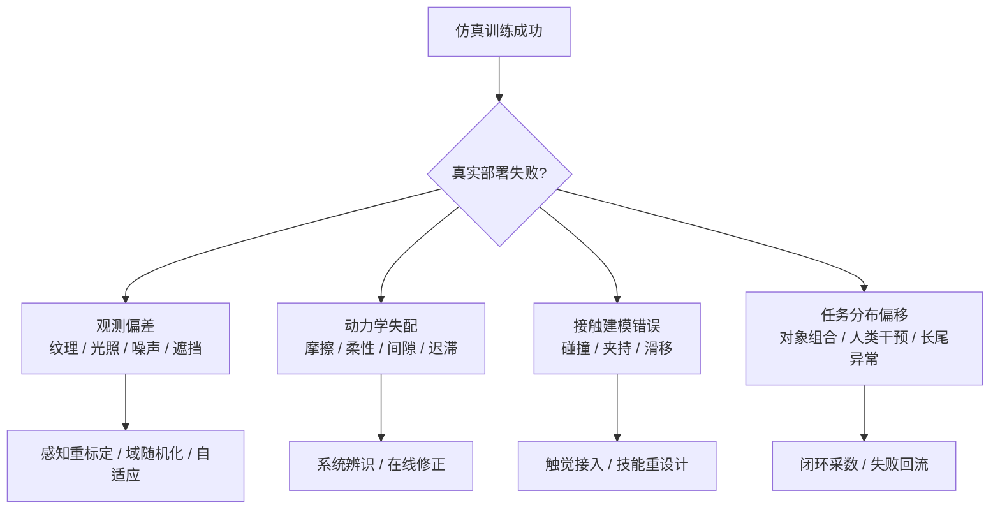

# 第十四部分 仿真、数字孪生与评测基础设施

具身系统之所以比很多纯软件 AI 更难做大规模实验，一个根本原因就在于真实试错代价极高。于是，仿真平台、数字孪生环境和 benchmark 基础设施几乎成为现代机器人研究不可或缺的一部分。问题在于，仿真并不是天然中性的：你用什么物理引擎、构造什么场景、定义什么任务脚本、用什么评测协议，都会直接影响你最后得到的“能力”。因此，本部分不仅比较工具，更要回答：为什么仿真如此重要，又为什么它经常被高估。

近年的趋势尤其值得强调。Isaac Sim 正在把物理仿真、传感器建模、合成数据与机器人 AI 工作流整合进统一平台；Habitat 系列把 embodied AI 中的导航与场景交互问题标准化；BEHAVIOR 等基准试图把长程家庭任务转化为更系统的评测环境。这说明仿真已不再只是“先练再上真机”的配角，而逐步成为数据生成、模型预训练、回归测试和评测标准化的基础设施。[Isaac Sim](https://developer.nvidia.com/isaac/sim)、[Habitat](https://aihabitat.org/)、[BEHAVIOR-1K](https://behavior.stanford.edu/behavior-1k)

## 67. 主流仿真平台

### 67.1 Isaac Sim
Isaac Sim 值得重点关注，不仅因为它是热门平台，更因为它把仿真、合成数据、数字孪生与部署栈尽量放进了同一生态叙事里。对具身智能而言，这种平台化价值在于降低“仿真工具只是离线演示器”的概率，而更有机会把它变成训练、评测、数据生成和系统联调的共用基础设施。

但也正因为它平台属性强，使用者必须警惕把生态完整性误读成方法正确性。Isaac Sim 的强项在于整合，不等于它对所有研究问题都是最优解。更合理的做法，是先判断自己在解决数据生成、系统联调、视觉合成还是真机前验证中的哪一环，再决定如何使用它。

Isaac Sim 的代表性在于它把高保真仿真、数字孪生、传感器模拟和机器人 AI 工作流紧密结合起来，并与更广泛的 GPU、基础模型和仿真基础设施叙事相连。它尤其适合强调大规模场景合成、合成数据和与工业工作流整合的路线，相关平台介绍可参见 [Isaac Sim](https://developer.nvidia.com/isaac/sim)。

更进一步看，Isaac Sim 的重要性不只在“画面更真”，而在它试图把数据生成、策略训练、传感器仿真、场景脚本化、回放验证和部署前回归测试连接成一个更完整的基础设施层。这种平台化价值，也与其后续围绕 Isaac Lab、GR00T 和合成数据工作流的布局一致：目标不是单独提供一个仿真器，而是提供一套围绕机器人训练闭环的系统性研发环境。[Isaac Lab](https://isaac-sim.github.io/IsaacLab/)

### 67.2 Gazebo / ROS 生态
这条生态的长期价值还在于它把“系统问题”暴露得足够明显。节点之间如何通信、状态如何回放、坐标系如何维护、感知与控制如何同步，这些在论文里常被隐藏的工程问题，在 ROS/Gazebo 工作流中往往必须被显式回答。也正因为如此，它们即便未必总是最前沿的学习平台，却持续扮演着具身系统公共接口层的角色，帮助研究者把算法放回真实系统组织语境中理解。

Gazebo 和 ROS 生态长期重要，并不是因为它们“最先进”，而是因为它们构成了大量机器人研究与工程系统的通用接口层。其优势是开放、可扩展、生态丰富；劣势则在于高保真与统一工作流能力相较新一代平台未必最强。[Gazebo](https://gazebosim.org/home)、[ROS](https://www.ros.org/)

对学习者而言，这条生态的价值尤其在于它把“系统集成”显式暴露出来。消息接口、坐标系、控制话题、日志回放、仿真插件、节点调度和模型可替换性，都被清晰地组织在一个可检查框架里。即便很多新系统的视觉与策略模型已经完全不同，底层的工程组织经验仍然大量继承自这条路线。

### 67.3 MuJoCo / PyBullet / Habitat 等
这几类平台之所以常被并列讨论，并不是因为它们彼此可互换，而是因为它们分别代表了不同研究重点。MuJoCo 更偏向精细动力学、连续控制和接触研究；PyBullet 更偏向轻量、易部署、原型验证与教学；Habitat 则更偏向导航、场景级 embodied AI 与长时程交互任务。对学习者来说，最重要的不是记住名称，而是先问清“我要研究的能力落在哪一层”。

若用更工程化的方式粗分，可以把它们理解成：

1. `MuJoCo`：擅长控制、操控、接触、locomotion 等需要细粒度动力学的研究。
2. `PyBullet`：适合快速试验、教学原型和中等复杂度操作任务验证。
3. `Habitat`：适合视觉导航、场景记忆、长时程任务与 embodied AI benchmark。

MuJoCo 擅长精细动力学和控制研究，PyBullet 轻量易用，Habitat 更偏向导航与具身智能环境。这些平台的重要性在于，它们各自把“什么才是重要问题”编码进了环境设计里；相关入口可参见 [MuJoCo 官网](https://mujoco.org/)、[PyBullet 快速入门](https://pybullet.org/wordpress/) 与 [Habitat 项目页](https://aihabitat.org/)。

### 67.4 不同平台的能力边界

把仿真平台放在一起比较时，最常见的误区是只看“画面真不真”或“能不能跑起来”。更稳妥的比较维度至少应有四个：

1. 物理建模侧重点：更偏刚体动力学、接触、导航还是多主体场景。
2. 传感器与场景能力：是否支持相机、深度、激光雷达、触觉或语义场景标签。
3. 训练工作流接口：是否容易接 RL、模仿学习、回放测试和批量脚本任务。
4. 工程集成能力：是否便于和 ROS、部署栈、数据生成流水线或企业内部工具链打通。

也因此，没有所谓“最好的统一仿真器”，只有“对某类问题更合适的仿真器”。MuJoCo 适合很多接触和控制研究，Habitat 更适合导航与室内 embodied AI，Isaac Sim 更强调平台化、合成数据和工业工作流，Gazebo/ROS 生态更强调可接工程系统。把它们混成同一类工具，会直接破坏后续对实验结果的理解。

不同平台的差异，不能只用“画质更真实”或“物理更准确”来概括。更重要的问题是：它到底更适合解决哪一类研究与工程问题。Isaac Sim 更强在工业级资产、传感器仿真、与 NVIDIA 训练部署栈的耦合；Gazebo / ROS 生态更强在中间件一致性、系统集成和工程可迁移性；MuJoCo、PyBullet 与 Habitat 则更常用于控制、强化学习、导航和研究型 benchmark 的快速迭代。

因此，平台选择本身就隐含研究假设。若团队主要验证接触控制与动力学策略，一个轻量级、可快速批量跑实验的平台可能比重资产数字孪生平台更合适；若团队目标是还原真实工位、传感器布局和部署流程，那么系统一致性与数字资产管理能力就会变得比单步物理精度更重要。也就是说，没有“最好的仿真平台”，只有“与当前问题最匹配的平台边界”。

没有一个平台天然适合所有任务。操纵、移动导航、全身运动、长时程家庭任务和工业孪生任务所需的环境能力完全不同，因此“仿真结果强”必须始终与“在哪类平台、哪些假设下强”一起看。

## 68. 数字孪生与场景构建

### 68.1 场景复刻
场景复刻的真正价值，不是把现实空间“做得像”，而是把与任务相关的约束保留下来。这意味着并非所有细节都同样重要。对抓取任务而言，接触面、支撑面、可达空间与遮挡关系可能比装饰纹理更关键；对导航任务而言，通路拓扑、门与障碍布局可能比材质更关键。

因此，数字孪生的核心不是最大化还原，而是选择性高保真。谁能识别哪些场景变量对任务成败真正敏感，谁就更能把有限建模成本用在最关键的位置。
场景复刻可以理解为“把真实部署场地在几何、拓扑、对象布局和传感视角上重新搬进仿真环境”。它并不要求所有物理细节都百分之百一致，但至少要让任务执行时真正决定成败的结构被保留下来，例如货架间距、桌面高度、常见遮挡关系、相机外参、通道宽度和常驻障碍物位置。

一个最小复刻流程通常包含四步：

1. 采集环境几何与对象清单。
2. 重建静态场景与关键可动物体。
3. 标定传感器视角、坐标系和机器人初始位姿。
4. 用典型任务脚本验证仿真场景与现实流程是否同构。

数字孪生的直觉目标，是尽量让仿真环境在几何、对象布局、工作流和传感结构上贴近真实场景。其价值在于能把真实部署前的大量验证前移。

### 68.2 参数化环境生成
参数化环境生成的意义，在于它让仿真从“复刻一个世界”转向“生成一族世界”。这对泛化研究尤其重要，因为系统真正需要面对的不是单个环境，而是一系列带有结构性变化的任务分布。通过参数化障碍物、光照、对象布局、材质、摩擦或传感器外参，研究者可以更系统地暴露模型的脆弱边界。

但参数化生成的价值，不在于把随机变量越堆越多，而在于能否把变化维度组织成可解释、可复查的实验设计。若所有参数同时随机化，最终虽然看起来“更真实”，却很难回答系统究竟怕什么。更有效的做法通常是把场景生成拆成若干相对独立的维度，例如几何布局、视觉外观、物理接触、传感器误差和动态干扰，并分别设置扫描区间。这样，当成功率下降时，研究者才能追溯是摩擦估计出问题、遮挡导致感知崩溃，还是布局变化破坏了高层策略先验。

从工程实践看，参数化环境还承担一种“先行暴露成本”的作用。真实部署里最昂贵的往往不是算法本身，而是到现场后才发现某些变化维度从未进入训练或测试分布，例如托盘高度偏差、地面反光、工件公差波动或机械臂安装外参变化。若仿真阶段已经把这些变量显式纳入参数空间，就能更早知道系统的脆弱边界在哪里，也更容易为数据采集和安全策略制定优先级。

但参数化也有代价。若参数空间设计得过于方便生成而脱离真实部署分布，模型学到的可能只是对合成变化的适应，而不是对现实变化的适应。因此，参数化环境生成必须与真实场景统计特征持续对照，而不是闭门自洽。

但仅做静态复刻并不足够。为了覆盖扰动和变化，系统还需要参数化环境生成，使布局、对象、纹理、照明、噪声和任务条件可以系统变化。

参数化生成的真正价值，在于把“偶然见过几个场景”转成“系统性扫过一类变化空间”。如果把环境参数记成 \(\theta\)，则仿真训练不再只是反复跑同一场景，而是从某个分布 \(p(\theta)\) 中采样不同布局、材质、光照和干扰条件。这样得到的不是单一复刻，而是围绕真实场景展开的受控变化簇。

参数化环境生成的真正意义，在于把“变化”从偶然性变成设计对象。机器人训练最怕的是研究者只在少数手工搭建、过于干净的场景里取得高分，然后把这个高分误判为泛化能力。若把对象位置、形状、材质、摩擦系数、光照方向、遮挡模式、相机外参和干扰者行为显式参数化，就能系统评估策略到底对哪些变化敏感、对哪些变化相对稳健。
也正因如此，程序化场景生成、域随机化和任务脚本自动合成，并不只是为了“多造点数据”，而是在主动塑造策略面对不确定性的能力边界。

更进一步说，参数化环境生成还能帮助团队把“哪些变化最危险”显式化。例如，同样是场景变化，光照变化可能主要冲击感知，摩擦变化可能主要冲击接触控制，而障碍布局变化则会同时冲击规划与恢复。把这些变化维度分开参数化，能够让评测不再只是看总成功率，而是看系统究竟对哪一类扰动最脆弱。

### 68.3 任务脚本与自动评测

没有任务脚本和评测协议，数字孪生很容易沦为“看起来很真实的 3D 场景”。真正有研究价值的环境，不只是能渲染和碰撞，还必须支持大规模、可重复、可自动化任务执行与结果统计。对研究项目而言，场景资产只是底座，任务脚本才把它变成实验系统。

更严格地说，一个最小任务协议至少应显式写出六类字段：初始状态分布、目标条件、允许动作接口、成功判定、异常注入方式和日志结构。若把单个 episode 记作

\[
e = (x_0,\ g,\ \mathcal{P},\ \mathcal{S},\ T,\ \mathcal{M})
\]

其中 \(x_0\) 是初始状态分布，\(g\) 是任务目标，\(\mathcal{P}\) 是策略允许访问的感知与控制接口，\(\mathcal{S}\) 是成功/失败判定集合，\(T\) 是超时和重试规则，\(\mathcal{M}\) 是日志与指标字段，那么“数字孪生是否成熟”就不再只是看场景美观度，而是看这些协议是否被固定为可复测资产。

若把场景参数记为 \(\xi\)，机器人策略记为 \(\pi\)，则仿真评测本质上是在估计

\[
J(\pi) = \mathbb{E}_{\xi \sim p(\xi)} \left[ R(\pi; \xi) \right]
\]

这个公式的关键不在形式，而在提醒我们：若场景分布 \(p(\xi)\) 与真实部署分布严重偏离，那么得到的 \(J(\pi)\) 再高，也可能只是“对仿真分布的高分”。

对长期维护项目而言，更值得保留的不是某次评测结果，而是一套任务卡。一个极简任务卡可以写成：

```yaml
task_name: bin_picking_with_occlusion
reset_distribution: randomized
goal_condition: grasp_and_place_target_object
allowed_retries: 1
perturbations:
  - camera_exposure_shift
  - object_pose_noise
  - distractor_motion
metrics:
  - success
  - recovery_count
  - safety_violations
  - completion_time
```

这种结构化定义的真正价值，在于让“换模型”“换控制器”“换场景参数”之后仍能回到同一实验接口上比较，而不是每次评测都连成功含义一起改变。

## 69. sim2real 关键问题

### 69.1 观测偏差

观测偏差是 sim-to-real 中最常见、也最容易被低估的问题之一。仿真里的图像通常更干净、时钟更同步、外参更稳定，而真实系统则持续面对曝光变化、镜头污渍、模糊、遮挡、标定漂移、滚动快门和多传感器不同步。即便物理引擎本身足够强，只要观测层分布错位，策略就可能迅速失效。

统计上，这种问题可以先被写成输入分布偏移：

\[
p_{\text{sim}}(o) \neq p_{\text{real}}(o)
\]

但对机器人来说，真正麻烦的不只是“图像长得不一样”，而是这个偏移会直接污染状态估计、目标定位、接触时机判断和恢复触发条件。也就是说，观测偏差不是感知模块自己的误差，而会沿着整条闭环向后传播。

一个更适合工程排查的写法，是把观测偏差拆成三层：

1. 感知表面层：纹理、光照、遮挡、噪声、分辨率。
2. 传感器系统层：曝光、自校准、深度失真、时钟同步、丢帧。
3. 决策接口层：状态估计是否稳定，检测阈值是否误触发，恢复逻辑是否被错误激活。

很多 sim-to-real 失败并不是控制规律完全错误，而是模型学会了依赖仿真里过于理想的观测接口。把观测偏差显式纳入场景生成、传感器建模和 benchmark 日志，是让仿真结果真正具备现实意义的前提。

### 69.2 动力学失配
动力学失配是 sim-to-real 中最经典也最顽固的问题之一。它不仅来自质量、惯量、阻尼或摩擦参数估计不准，也来自执行器迟滞、装配公差、结构柔顺性、时延链路、温升和控制器内部未建模逻辑。越是接触密集、时延敏感、力学耦合强的任务，失配影响越大。

如果把真实系统动力学记为 \(f_{\text{real}}\)，仿真动力学记为 \(f_{\text{sim}}\)，则部署问题的本质不是“仿真是否优雅”，而是

\[
\| f_{\text{sim}} - f_{\text{real}} \|
\]

是否已经小到不会破坏闭环稳定与任务成功。对机器人而言，这个距离并不只由牛顿方程决定，还由控制频率、通信抖动、执行器饱和和底层补偿器共同决定。

这也是为什么很多在仿真里“看起来很稳”的策略，一上真机就变得犹豫、抖动甚至失控。真实电机的温升、减速器回差、材料微小形变、地面材质变化和负载波动，都会让仿真里学到的动作序列在真实系统中出现连锁偏差。一个策略如果只在理想动力学中稳定，那么它在真实世界中往往只是“平均看起来差不多，关键时刻不可靠”。

因此，成熟团队通常不会把希望全部压在“把仿真一次性调真”上，而会同时使用四类手段：系统辨识、参数随机化、在线残差补偿，以及低层解析控制器兜底。换句话说，sim2real 的核心不是消灭误差，而是共同管理模型误差、策略脆弱性和部署回退机制。

### 69.3 接触与摩擦建模误差
对操作任务来说，接触与摩擦误差之所以特别致命，是因为很多动作成败并不取决于“有没有碰到物体”，而取决于“碰到之后接触模式如何演化”。抓取时的滑移、插接时的卡滞、推动时的旋转偏移、柔性物体的局部形变，都对接触参数极其敏感。

若把最小接触判断写得足够抽象，系统真正关心的通常是

\[
(f_t,\ \mu_t,\ c_t,\ \tau_t) \rightarrow \text{stable contact or failure}
\]

其中 \(f_t\) 表示接触力，\(\mu_t\) 表示局部摩擦条件，\(c_t\) 表示接触模式，\(\tau_t\) 表示与控制时序相关的作用结果。真正困难的地方在于，这个映射往往是混合系统：接触建立与断开会导致动力学方程切换，而微小误差就可能把“插入成功”推成“卡死”或“弹飞”。

这也是为什么许多仿真路线在导航或大范围运动上表现不错，一进入精细操作就迅速暴露短板。因为精细操作真正依赖的是接触后的局部物理，而这恰恰最难靠统一参数近似稳定建模。对这类任务，仿真更适合作为候选策略预筛、失败模式覆盖和控制器调参平台，而不是对真实接触结果的完全替代。

### 69.4 现实部署中的黑天鹅问题
黑天鹅问题之所以值得单列，是因为许多系统并不是在平均场景下失败，而是在极少见但后果严重的边缘条件下失败。比如异常反光、罕见遮挡、工位被临时改动、网络短时抖动或意外人类介入。这些因素在离线评测里可能出现频率极低，却足以决定系统是否可被允许长期部署。

因此，仿真与评测若只服务于平均性能优化，就会系统性低估真实部署风险。更成熟的基础设施应当有意识地制造和记录这类低频高后果情境，而不是把它们当成噪声剔除。

即使平均条件吻合，现实部署仍会出现仿真从未覆盖的组合条件：奇异反光、局部遮挡、传感器暂时失灵、地面材质变化、对象磨损、人的突然介入。这些黑天鹅条件正是仿真最难提前穷尽的部分。域随机化、系统辨识与离线到在线适配，是三类典型缓解思路，但它们解决的是不同层面的问题，相关代表性论文可参见 [《Domain Randomization》](https://arxiv.org/abs/1703.06907)。

## 70. Benchmark 与评测体系

### 70.1 数据集 benchmark
对研究型读者而言，读取 benchmark 的正确顺序通常不是先看排行榜，而是先看协议卡：任务初始化怎么做、允许几次重试、成功判定阈值多大、是否有人为重摆物体、是否记录恢复和安全事件。只有这些条件被看清，分数才有解释力。否则，所谓“提升”很可能只是更匹配某一套隐藏协议，而不是更接近真实部署能力。

数据集 benchmark 可以理解为“固定数据、固定协议下比较模型拟合与泛化能力的离线试验台”。它的优势是便宜、可快速复现、便于大规模横向比较；它的局限则在于模型不需要承担真实闭环交互成本，因此很多部署时才暴露的问题会被遮蔽。Habitat 及其后续挑战体系的长期价值，就在于它们把环境、任务和评测协议共同固定成研究共同体接口，而不只是提供一批静态样本 [Habitat](https://arxiv.org/abs/1904.01201), [Habitat 2.0](https://arxiv.org/abs/2106.14405)。

一个最小离线评测流程通常是：

```python
dataset = load_benchmark_split()
for batch in dataset:
    pred = policy(batch["obs"])
    metrics.update(compare(pred, batch["action_or_label"]))
report(metrics)
```

离线数据集 benchmark 便于快速比较模型，但其局限也明显：它们更擅长评估拟合和泛化到相似分布的能力，而不一定能评估真实闭环执行。尤其当数据由单一操作员、单一末端执行器或单一 reset 逻辑生成时，高分更可能说明“对这套行为分布拟合得很好”，而不一定说明“在真实闭环里更可靠”。

### 70.2 真机 benchmark
真机 benchmark 的真正价值，正在于它让很多仿真和离线评测中被平均掉的问题重新浮出水面，例如执行延迟、夹具偏差、传感器漂移、人为重置成本和恢复时间。也正因此，真机评测更像系统完整性测试，而不只是算法性能测试。它往往给不出像仿真一样整洁的大样本结论，却更能揭示系统的真实交付边界。

真机 benchmark 的本质，是把策略放回真实传感、真实时延、真实接触和真实故障条件下接受检验。它的价值不只是“更真实”，更在于它能把仿真和离线评测中经常被忽略的系统误差重新带回来，例如夹爪重复定位误差、相机外参漂移、控制抖动、线缆干扰和现场人员介入。

一个极简真机评测循环通常是：

```python
for task in real_robot_suite:
    reset_hardware(task)
    outcome = run_policy_on_robot(policy, task)
    log_result(outcome)
```

真机 benchmark 更接近现实，但成本高、可复现性差、平台差异大。因此，它们往往更能揭示真实能力边界，却也更难形成行业统一标尺。一个更成熟的做法，是给每次真机评测配一张“真机评测卡”：本体型号、传感器栈、控制频率、人工重置规则、失败后恢复逻辑、是否允许人工口头补充、以及是否统计接管成本。没有这张卡，真机评测很容易重新滑回“高质量演示样片”而非“可比较证据”。

### 70.3 任务成功率、泛化率、恢复率、安全指标

这几个指标表面上都像“结果指标”，但它们实际奖励的是不同研究取向：

1. 成功率偏向主路径优化，容易鼓励把系统调到一组典型条件下尽量稳。
2. 泛化率偏向跨对象、跨场景和跨任务迁移，鼓励共享表示和数据覆盖。
3. 恢复率偏向异常处理和闭环重试，鼓励系统显式建模失败模式。
4. 安全指标偏向约束满足与保守控制，鼓励加入监视器、回退和人为接管接口。

对学习者而言，最值得建立的习惯是：看到任何“我们方法更强”的结论时，先问它到底在哪个指标上更强，以及那个指标到底在奖励什么。如果某个 benchmark 基本不记录恢复次数、安全违例和长时任务稳定性，那么它更适合比较算法主路径，而不适合直接外推为“更接近真实部署”。

机器人评测不应只看成功率。泛化率、失败恢复率、接触稳定性、执行时延、安全约束满足度和长时运行稳定性同样关键。很多系统正是在这些指标上暴露出与 demo 视频完全不同的真实能力。

若把评测设计成更接近部署判断，就应把指标至少分成四类：结果指标、过程指标、恢复指标和安全指标。结果指标回答“做成没有”，过程指标回答“怎么做成的”，恢复指标回答“偏了能不能回来”，安全指标回答“在此过程中是否越界”。只有四类一起看，benchmark 才不至于奖励那些只在理想条件下偶然命中的系统。

若进一步细分，至少可以把指标分成四层。第一层是结果层，例如成功率、完成时间、吞吐与路径长度；第二层是鲁棒层，例如对象变化、场景变化和扰动注入下的性能保持；第三层是恢复层，例如失败后重试次数、恢复成功率和人工接管频度；第四层是安全层，例如碰撞次数、约束违例和紧急停止触发率。只有这四层合并，评测才接近真实部署关心的问题。
这也解释了为什么离线 benchmark 与客户现场之间常有巨大落差。前者通常只覆盖第一层和部分第二层，而真正决定能否进入现场的，往往是第三层与第四层。

这部分现在也可与 [14-评测指标分层表](D:/Projects/embodied-intelligence-report/docs/report/current/tables/14-评测指标分层表.md) 联动阅读。正文负责解释为什么要分层，表格负责把这些层真正固定成后续复审口径。

如果把评测进一步抽象成部署相关的多目标优化问题，则可以写成：

\[
\max_{\pi} \ \alpha s(\pi) + \beta g(\pi) + \gamma r(\pi) - \delta v(\pi)
\]

其中 \(s\) 表示成功率，\(g\) 表示泛化能力，\(r\) 表示恢复能力，\(v\) 表示安全违例或约束越界代价。这里最重要的不是公式本身，而是它揭示了一个现实：不同 benchmark 实际上在用不同权重 \((\alpha,\beta,\gamma,\delta)\) 定义“好系统”。如果不先看清这些隐含权重，跨论文、跨平台、跨公司比较就很容易把“评价函数不同”误判成“能力高下已定”。

也因此，本章对后文最关键的贡献之一，是把“评测指标是价值编码”这一点固定下来。后续无论看 VLA、世界模型、开源项目还是企业 demo，只要结果只在单一成功率口径上显著占优，而没有同时说明恢复、长时稳定和安全代价，就都不应被直接上推为“更接近真实部署”的证据。

### 70.4 复现性与评测可比性问题
评测体系真正难的地方，并不是有没有 benchmark，而是不同论文、不同公司和不同 demo 所宣称的“成功”是否可被放在同一口径下比较。一个系统可能在固定场景里有很高成功率，却没有统计恢复代价；另一个系统可能展示跨场景泛化，却没有披露失败样本筛选规则。于是，看似相同的指标名称背后，常常对应完全不同的评测边界。

这类不可比性至少可以拆成三层。第一层是平台不可比：不同本体、传感器、末端执行器和算力预算下的结果，本来就不应被简单横向比较。第二层是协议不可比：是否允许多次重试、是否有人类口头补充、是否筛除了极端失败、是否在任务前人工摆正物体，这些实验规则会深刻改变成功率含义。第三层是统计不可比：样本量是否足够、方差是否披露、失败类型是否细分、是否报告长尾行为和恢复代价。若这三层没有交代清楚，“SOTA”结论就常常缺乏坚实基础。

因此，报告在引用相关结果时，更合适的做法不是只摘录数字，而是同步记录测试边界与干预条件。对研究者而言，这种看似繁琐的注释工作其实很关键，因为它决定了后来者究竟是在复现能力、复现宣传，还是复现某种被精心裁剪过的演示环境。

更工程化的做法，是把复现性拆成三张卡：

1. 环境卡：任务初始条件、对象集合、传感器配置、随机种子、重试规则。
2. 系统卡：训练数据范围、模型版本、提示模板、技能库、回退逻辑、控制频率。
3. 结论卡：样本量、方差、失败类型、接管条件、成功阈值、统计汇总方式。

当前具身智能一个很严重的问题，是平台、数据、环境和任务协议差异巨大，导致论文结果横向比较困难。这意味着 benchmark 本身也是研究对象，而不是天然客观的裁判。后续阅读任何 benchmark 结果时，都应先记下四件事：本体是什么、起始条件如何采样、允许哪些恢复动作、成功判定阈值是什么。很多横向比较之所以失真，不是模型本身不可比，而是这些前提条件根本没有被放到同一张表上。

一个简短的评测脚本雏形可以写成：

```python
scores = []
for seed in eval_seeds:
    env.reset(seed=seed)
    done = False
    while not done:
        obs = env.observe()
        action = policy(obs)
        done, reward, info = env.step(action)
    scores.append({
        "success": info["success"],
        "recovery_count": info["recovery_count"],
        "safety_violations": info["safety_violations"],
    })
```

但真正困难的并不是写出这段脚本，而是确保 `eval_seeds`、`reset` 规则、允许重试次数、人工接管条件和成功阈值在不同团队之间足够一致。许多所谓“复现失败”，实际并不是模型完全无效，而是这些协议层细节发生了漂移。对具身系统来说，协议漂移本身就是实验误差的重要组成部分。

因此，更严格的复现性要求至少应包含一张“评测协议卡”：本体型号、场景来源、对象集合、起始状态采样规则、是否允许多次尝试、接管如何处理、超时如何记分、失败是否进入恢复流程。若这些条件不透明，那么很多 benchmark 分数最多只能说明“在作者自己的实验宇宙里表现更好”，而不能稳定支持跨团队、跨平台的长期判断。

从研究维护角度看，这一节还有一个非常实用的作用：它要求我们在后续版本中记录 benchmark 变化时，不只记“又出现了哪个新榜单”，而要同步记录“比较口径变了什么”。只要这一步做得扎实，后文对路线升降级的判断就更不容易被形式统一、实则协议异构的结果牵着走。

对研究型读者来说，更重要的结论是：benchmark 不是被动接受的裁判，而是主动塑造研究方向的装置。一个 benchmark 若主要奖励单次成功率，研究者就会更倾向优化主路径表现；若同时奖励恢复率、长时稳定性和安全违例控制，方法路线也会随之变化。因此，在阅读任何具身系统结果时，都应先问“这个 benchmark 在鼓励什么能力”，再看模型排名。

本部分的结论很明确：仿真、数字孪生与 benchmark 对现代具身系统至关重要，但它们更像能力放大镜，而不是能力替代物。谁若忽视它们，就很难规模化研究；谁若过度相信它们，就容易把仿真优势误判为现实可交付能力。

进一步说，仿真器选择本身就是一种“研究假设选择”。如果团队优先选择高保真刚体与接触仿真平台，它通常默认接触细节是首要瓶颈；如果团队优先选择大规模场景生成平台，它通常默认数据覆盖与任务多样性才是主要瓶颈。也就是说，仿真平台并不只是中立工具，而是在无形中规定“哪些误差先被看见、哪些问题先被优化、哪些能力先被量化”。因此，本章之后凡涉及“某路线在仿真里进展很快”的表述，都应追问其背后的仿真假设：它究竟放大了哪类能力，又弱化了哪类现实摩擦。

用一个抽象式子表示，很多仿真评测其实都在估计如下量：

\[
\mathbb{E}_{e \sim p_{\phi}(E),\, t \sim p_{\phi}(T)} [m(\pi, e, t)]
\]

其中 \(E\) 表示环境分布，\(T\) 表示任务分布，\(p_{\phi}\) 则是由设计者参数化出来的采样机制。问题在于，\(\phi\) 从来不是自然给定的，而是由研究者手工决定的。这意味着 benchmark 数值的可解释性，永远依赖于环境参数化是否接近真实部署关心的分布。很多“仿真里泛化很好、现实里泛化很差”的现象，本质上不是模型忽然失灵，而是 \(p_{\phi}\) 与真实任务分布之间早就存在系统错位。

从工程组织角度看，数字孪生还有一个容易被忽视的作用：它不仅服务训练，也服务责任定位。现实系统一旦失败，团队往往需要区分问题来自感知漂移、接触失配、执行器老化、任务脚本错误，还是运维配置变化。若没有一套可回放、可局部替换、可参数扫描的数字孪生环境，故障分析就会退化成经验争论。反过来，成熟的数字孪生基础设施能够把“失败”拆回受控变量空间，使得后续的数据回流、模型修补与流程修订有明确锚点。

## 图表与比较补充
与其继续增加零散 benchmark 名称，不如把这一章作为后文的“评测语法层”固定下来。后续凡是出现“泛化强”“恢复好”“部署成熟”之类判断，都应能回指到本章的失效模式与指标表，否则这些判断就容易重新退化成描述性印象。
本章后续最值得正式保留的，一是主流仿真平台能力边界比较表，二是 `sim2real` 失效模式流程图。前者用于明确 MuJoCo、Isaac、Gazebo、Habitat 等平台究竟各擅长什么问题；后者则用于把现实部署失败重新拆回到观测偏差、动力学失配、接触建模误差和任务分布偏移等可归因层级。

这样的补充并不是附属材料，而是本章“为什么仿真既必要又危险”这一核心判断的可视化表达。

在当前版本中，`图 14-1 sim2real 失效模式图` 已承担失效链条可视化职责，用于把观测偏差、动力学失配、接触模型误差、策略过拟合与部署恢复难题串成单一分析流程，而不是零散罗列风险点。

“主流仿真平台能力边界”则已整理为 `表 14-1 主流仿真平台能力边界比较表`，用来稳定承接本章关于 Isaac Sim/Lab、Gazebo/ROS、MuJoCo、PyBullet、Habitat 等平台分工与局限的比较口径。

从维护方法上看，后续新增相关工作时，建议先查 [仿真、评测与基础设施论文清单](D:/Projects/embodied-intelligence-report/research/papers/仿真、评测与基础设施-论文清单-v0.0.md)，再决定是补正文判断、补单篇论文卡，还是同步更新 `评测指标框架` 这类结构化资产。
## 图 14-1 sim2real 失效模式图
源文件：`assets/diagrams/14-sim2real失效模式图.mmd`



## 表 14-1 主流仿真平台能力边界比较表

见 [14-主流仿真平台能力边界表](D:/Projects/embodied-intelligence-report/docs/report/current/tables/14-主流仿真平台能力边界表.md)。
