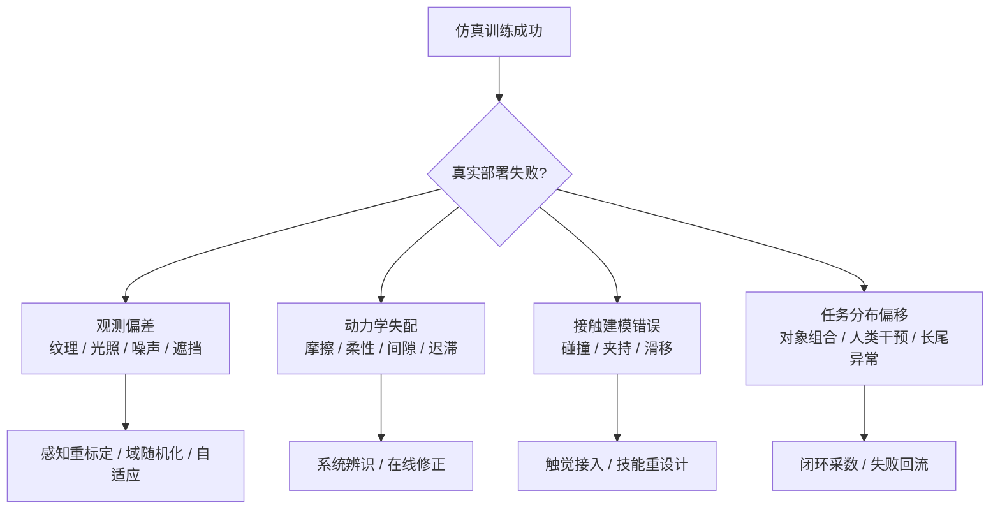

# 第十四部分 仿真、数字孪生与评测基础设施

具身系统之所以比很多纯软件 AI 更难做大规模实验，一个根本原因就在于真实试错代价极高。于是，仿真平台、数字孪生环境和 benchmark 基础设施几乎成为现代机器人研究不可或缺的一部分。问题在于，仿真并不是天然中性的：你用什么物理引擎、构造什么场景、定义什么任务脚本、用什么评测协议，都会直接影响你最后得到的“能力”。因此，本部分不仅比较工具，更要回答：为什么仿真如此重要，又为什么它经常被高估。

近年的趋势尤其值得强调。Isaac Sim 正在把物理仿真、传感器建模、合成数据与机器人 AI 工作流整合进统一平台；Habitat 系列把 embodied AI 中的导航与场景交互问题标准化；BEHAVIOR 等基准试图把长程家庭任务转化为更系统的评测环境。这说明仿真已不再只是“先练再上真机”的配角，而逐步成为数据生成、模型预训练、回归测试和评测标准化的基础设施。[Isaac Sim](https://developer.nvidia.com/isaac/sim)、[Habitat](https://aihabitat.org/)、[BEHAVIOR-1K](https://behavior.stanford.edu/behavior-1k)

## 67. 主流仿真平台

### 67.1 Isaac Sim

Isaac Sim 的代表性在于它把高保真仿真、数字孪生、传感器模拟和机器人 AI 工作流紧密结合起来，并与更广泛的 GPU / foundation model / 仿真基础设施叙事相连。它尤其适合强调大规模场景合成、synthetic data 和与工业工作流整合的路线。[Isaac Sim](https://developer.nvidia.com/isaac/sim)

更进一步看，Isaac Sim 的重要性不只在“画面更真”，而在它试图把数据生成、策略训练、传感器仿真、场景脚本化、回放验证和部署前回归测试连接成一个更完整的基础设施层。这种平台化价值，也与其后续围绕 Isaac Lab、GR00T 和合成数据工作流的布局一致：目标不是单独提供一个仿真器，而是提供一套围绕机器人训练闭环的系统性研发环境。[Isaac Lab](https://isaac-sim.github.io/IsaacLab/)

### 67.2 Gazebo / ROS 生态

Gazebo 和 ROS 生态长期重要，并不是因为它们“最先进”，而是因为它们构成了大量机器人研究与工程系统的通用接口层。其优势是开放、可扩展、生态丰富；劣势则在于高保真与统一工作流能力相较新一代平台未必最强。[Gazebo](https://gazebosim.org/home)、[ROS](https://www.ros.org/)

对学习者而言，这条生态的价值尤其在于它把“系统集成”显式暴露出来。消息接口、坐标系、控制话题、日志回放、仿真插件、节点调度和模型可替换性，都被清晰地组织在一个可检查框架里。即便很多新系统的视觉与策略模型已经完全不同，底层的工程组织经验仍然大量继承自这条路线。

### 67.3 MuJoCo / PyBullet / Habitat 等
这几类平台之所以常被并列讨论，并不是因为它们彼此可互换，而是因为它们分别代表了不同研究重点。MuJoCo 更偏向精细动力学、连续控制和接触研究；PyBullet 更偏向轻量、易部署、原型验证与教学；Habitat 则更偏向导航、场景级 embodied AI 与长时程交互任务。对学习者来说，最重要的不是记住名称，而是先问清“我要研究的能力落在哪一层”。

若用更工程化的方式粗分，可以把它们理解成：

1. `MuJoCo`：擅长控制、操控、接触、locomotion 等需要细粒度动力学的研究。
2. `PyBullet`：适合快速试验、教学原型和中等复杂度操作任务验证。
3. `Habitat`：适合视觉导航、场景记忆、长时程任务与 embodied AI benchmark。

MuJoCo 擅长精细动力学和控制研究，PyBullet 轻量易用，Habitat 更偏向导航与 embodied AI 环境。这些平台的重要性在于，它们各自把“什么才是重要问题”编码进了环境设计里。[MuJoCo](https://mujoco.org/)、[PyBullet Quickstart Guide](https://pybullet.org/wordpress/)、[Habitat](https://aihabitat.org/)

### 67.4 不同平台的能力边界

不同平台的差异，不能只用“画质更真实”或“物理更准确”来概括。更重要的问题是：它到底更适合解决哪一类研究与工程问题。Isaac Sim 更强在工业级资产、传感器仿真、与 NVIDIA 训练部署栈的耦合；Gazebo / ROS 生态更强在中间件一致性、系统集成和工程可迁移性；MuJoCo、PyBullet 与 Habitat 则更常用于控制、强化学习、导航和研究型 benchmark 的快速迭代。

因此，平台选择本身就隐含研究假设。若团队主要验证接触控制与动力学策略，一个轻量级、可快速批量跑实验的平台可能比重资产数字孪生平台更合适；若团队目标是还原真实工位、传感器布局和部署流程，那么系统一致性与数字资产管理能力就会变得比单步物理精度更重要。也就是说，没有“最好的仿真平台”，只有“与当前问题最匹配的平台边界”。

没有一个平台天然适合所有任务。操纵、移动导航、全身运动、长时程家庭任务和工业孪生任务所需的环境能力完全不同，因此“仿真结果强”必须始终与“在哪类平台、哪些假设下强”一起看。

## 68. 数字孪生与场景构建

### 68.1 场景复刻
场景复刻可以理解为“把真实部署场地在几何、拓扑、对象布局和传感视角上重新搬进仿真环境”。它并不要求所有物理细节都百分之百一致，但至少要让任务执行时真正决定成败的结构被保留下来，例如货架间距、桌面高度、常见遮挡关系、相机外参、通道宽度和常驻障碍物位置。

一个最小复刻流程通常包含四步：

1. 采集环境几何与对象清单。
2. 重建静态场景与关键可动物体。
3. 标定传感器视角、坐标系和机器人初始位姿。
4. 用典型任务脚本验证仿真场景与现实流程是否同构。

数字孪生的直觉目标，是尽量让仿真环境在几何、对象布局、工作流和传感结构上贴近真实场景。其价值在于能把真实部署前的大量验证前移。

### 68.2 参数化环境生成

但仅做静态复刻并不足够。为了覆盖扰动和变化，系统还需要参数化环境生成，使布局、对象、纹理、照明、噪声和任务条件可以系统变化。

参数化环境生成的真正意义，在于把“变化”从偶然性变成设计对象。机器人训练最怕的是研究者只在少数手工搭建、过于干净的场景里取得高分，然后把这个高分误判为泛化能力。若把对象位置、形状、材质、摩擦系数、光照方向、遮挡模式、相机外参和干扰者行为显式参数化，就能系统评估策略到底对哪些变化敏感、对哪些变化相对稳健。
也正因如此，程序化场景生成、域随机化和任务脚本自动合成，并不只是为了“多造点数据”，而是在主动塑造策略面对不确定性的能力边界。

### 68.3 任务脚本与自动评测

没有任务脚本和评测协议，数字孪生很容易沦为“看起来很真实的 3D 场景”。真正有研究价值的环境，还必须支持大规模、可重复、可自动化任务执行与结果统计。

若把场景参数记为 \(\xi\)，机器人策略记为 \(\pi\)，则仿真评测本质上是在估计：

\[
J(\pi) = \mathbb{E}_{\xi \sim p(\xi)} \left[ R(\pi; \xi) \right]
\]

这个公式看似简单，但它直接揭示了数字孪生质量的关键：如果场景分布 \(p(\xi)\) 与现实部署分布严重偏离，那么得到的 \(J(\pi)\) 再高，也可能只是“对仿真分布的高分”。

## 69. sim2real 关键问题

### 69.1 观测偏差
观测偏差可以理解为“策略在仿真里看到的世界，和真机传感器真正输出的世界，并不是同一个分布”。这种偏差既可能来自图像纹理、光照、噪声和遮挡，也可能来自深度相机失真、标定漂移、镜头污渍、滚动快门、曝光变化和多传感器时间不同步。

若用统计角度写，仿真与现实的差别本质上是输入分布偏移：

\[
p_{\text{sim}}(o) \neq p_{\text{real}}(o)
\]

仿真中的图像、深度、噪声和遮挡分布与现实总有差异，这直接影响视觉表征与策略输入。

### 69.2 动力学失配

真实执行器摩擦、弹性、迟滞和接触行为往往比仿真复杂得多，因此动力学失配会直接破坏策略部署。

在 locomotion、动态平衡和接触装配中，这一点尤其突出。真实电机的温升、减速器回差、材料微小形变、地面材质变化和负载波动，都会让仿真里学到的动作序列在真实系统里出现连锁偏差。一个策略如果只在理想动力学中稳定，那么它在真实世界中常常会表现为“平均看起来差不多，但关键时刻不可靠”。
缓解这一问题的路径并不只有“让仿真更真”一条。系统辨识、在线残差补偿、动力学随机化、低层解析控制器兜底和真实系统上的小步安全校正，往往需要组合使用。也就是说，sim2real 的核心是共同管理模型误差、策略脆弱性和部署回退机制。

### 69.3 接触与摩擦建模误差
对操作任务来说，接触与摩擦误差之所以特别致命，是因为很多动作成败并不取决于“有没有碰到物体”，而取决于“碰到之后接触模式如何演化”。抓取时的滑移、插接时的卡滞、推动时的旋转偏移、柔性物体的局部形变，往往都对接触参数极其敏感。

若把最小接触判断写得足够简单，系统真正关心的通常是：

\[
f_t, \mu_t, c_t \rightarrow \text{stable contact or failure}
\]

高精度操作、装配和柔性对象处理尤其依赖接触建模。一旦接触模型失真，仿真里学到的策略很可能在现实里完全失效。

### 69.4 现实部署中的黑天鹅问题

即使平均条件吻合，现实部署仍会出现仿真从未覆盖的组合条件：奇异反光、局部遮挡、传感器暂时失灵、地面材质变化、对象磨损、人的突然介入。这些黑天鹅条件正是仿真最难提前穷尽的部分。Domain randomization、system identification 与 offline-to-online adaptation 是三类典型缓解思路，但它们解决的是不同层面的问题。[Domain Randomization](https://arxiv.org/abs/1703.06907)

## 70. Benchmark 与评测体系

### 70.1 数据集 benchmark
数据集 benchmark 可以理解为“固定数据、固定协议下比较模型拟合与泛化能力的离线试验台”。它的优势是便宜、可快速复现、便于大规模横向比较；它的局限则在于，模型不需要承担真实闭环交互成本，因此很多部署时才暴露的问题会被遮蔽。

一个最小离线评测流程通常是：

```python
dataset = load_benchmark_split()
for batch in dataset:
    pred = policy(batch["obs"])
    metrics.update(compare(pred, batch["action_or_label"]))
report(metrics)
```

离线数据集 benchmark 便于快速比较模型，但其局限也明显：它们更擅长评估拟合和泛化到相似分布的能力，而不一定能评估真实闭环执行。

### 70.2 真机 benchmark
真机 benchmark 的本质，是把策略放回真实传感、真实时延、真实接触和真实故障条件下接受检验。它的价值不只是“更真实”，更在于它能把仿真和离线评测中经常被忽略的系统误差重新带回来，例如夹爪重复定位误差、相机外参漂移、控制抖动、线缆干扰和现场人员介入。

一个极简真机评测循环通常是：

```python
for task in real_robot_suite:
    reset_hardware(task)
    outcome = run_policy_on_robot(policy, task)
    log_result(outcome)
```

真机 benchmark 更接近现实，但成本高、可复现性差、平台差异大。因此，它们往往更能揭示真实能力上限，却也更难形成行业统一标尺。

### 70.3 任务成功率、泛化率、恢复率、安全指标

机器人评测不应只看成功率。泛化率、失败恢复率、接触稳定性、执行时延、安全约束满足度和长时运行稳定性同样关键。很多系统正是在这些指标上暴露出与 demo 视频完全不同的真实能力。

若进一步细分，至少可以把指标分成四层。第一层是结果层，例如成功率、完成时间、吞吐与路径长度；第二层是鲁棒层，例如对象变化、场景变化和扰动注入下的性能保持；第三层是恢复层，例如失败后重试次数、恢复成功率和人工接管频度；第四层是安全层，例如碰撞次数、约束违例和紧急停止触发率。只有这四层合并，评测才接近真实部署关心的问题。
这也解释了为什么离线 benchmark 与客户现场之间常有巨大落差。前者通常只覆盖第一层和部分第二层，而真正决定能否进入现场的，往往是第三层与第四层。

### 70.4 复现性与评测可比性问题

当前具身智能一个很严重的问题，是平台、数据、环境和任务协议差异巨大，导致论文结果横向比较困难。这意味着 benchmark 本身也是研究对象，而不是天然客观的裁判。

一个简短的评测脚本雏形可以写成：

```python
scores = []
for seed in eval_seeds:
    env.reset(seed=seed)
    done = False
    while not done:
        obs = env.observe()
        action = policy(obs)
        done, reward, info = env.step(action)
    scores.append({
        "success": info["success"],
        "recovery_count": info["recovery_count"],
        "safety_violations": info["safety_violations"],
    })
```

这类代码的意义在于提醒我们：benchmark 从来不只是“算成功率”，而是要把恢复次数、安全违规、耗时与泛化条件一起记录下来。

本部分的结论很明确：仿真、数字孪生与 benchmark 对现代具身系统至关重要，但它们更像能力放大镜，而不是能力替代物。谁若忽视它们，就很难规模化研究；谁若过度相信它们，就容易把仿真优势误判为现实可交付能力。

## 图表与比较补充
本章后续最值得正式保留的，一是主流仿真平台能力边界比较表，二是 `sim2real` 失效模式流程图。前者用于明确 MuJoCo、Isaac、Gazebo、Habitat 等平台究竟各擅长什么问题；后者则用于把现实部署失败重新拆回到观测偏差、动力学失配、接触建模误差和任务分布偏移等可归因层级。

这样的补充并不是附属材料，而是本章“为什么仿真既必要又危险”这一核心判断的可视化表达。

1. 表 14-A：`主流仿真平台能力边界` 比较表。
2. 图 14-B：`sim2real 失效模式` 流程图。
## 图 14-1 sim2real 失效模式图
源文件：`assets/diagrams/14-sim2real失效模式图.mmd`


