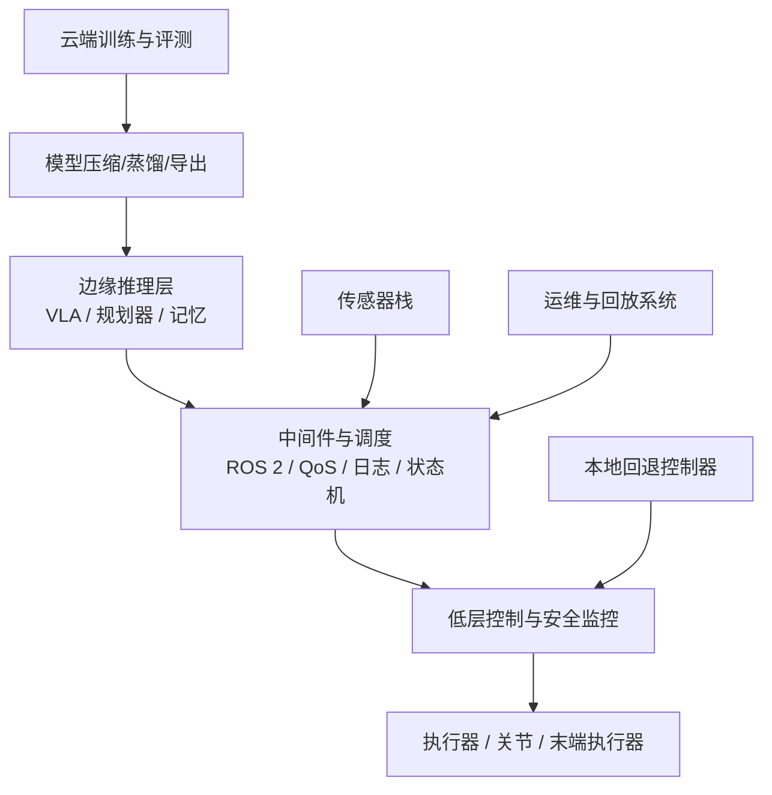

# 第十五部分 机器人硬件、系统集成与部署约束

具身智能最容易被低估的一件事，是模型能力与可部署系统之间还隔着一整层硬件和系统工程现实。许多公开演示看起来讨论的是“大脑是否足够聪明”，但真正决定系统是否能进入工厂、仓库、楼宇、医院或家庭的，往往是机械结构是否可制造、执行器是否可靠、传感器链路是否稳定、算力与散热是否可承受、软件中间件是否易于维护、现场运维是否可持续。因此，本部分讨论的不是“机器人硬件简介”，而是为什么硬件路线与系统集成方式会直接决定现代具身系统的上限。

一个有代表性的现实信号是：近年的具身系统越来越不是“单模型论文”，而是“本体 + 端侧算力 + 传感器栈 + 中间件 + 运维链路”的整体方案。NVIDIA Jetson/Isaac 体系明确把嵌入式算力、ROS 加速栈、仿真、训练和部署放在同一产品叙事中；Figure Helix 也明确公开了其双系统、双嵌入式 GPU 的机载部署结构。这些材料说明，到了具身系统落地层，模型能力从来不能脱离硬件预算和系统集成方式独立讨论。[Jetson Orin](https://www.nvidia.com/en-us/autonomous-machines/embedded-systems/jetson-orin/)、[Figure Helix](https://www.figure.ai/news/helix)

## 71. 机器人本体硬件路线

### 71.1 机械结构设计
机械结构设计不只是工业设计问题，而是算法路线的前提条件。连杆布局、自由度分配、刚度、重量分布和可达工作空间，会直接决定感知盲区、控制难度、动作库设计和可执行任务集合。很多所谓“通用智能”在换一个本体后失效，根源并不在模型，而在原先默认的机械条件消失了。

因此，本体结构不应被视作算法之外的外部变量，而应被视作具身系统共同定义问题空间的一部分。谁忽略这一点，谁就会系统性高估模型迁移能力。

同样的“任务成功率”在不同本体上往往并不具有可比性，因为本体结构本身决定了感知盲区、可达姿态集合、接触方式和稳定性边界。也正因此，算法评测若脱离本体约束，很容易夸大跨平台结论。对长期跟踪行业的人来说，阅读系统进展时必须先问“这个能力建立在哪种本体假设上”，再问“这个能力是否可迁移”。

机械结构不是“承载模型的壳”，而是决定可达空间、负载边界、刚柔特性、维护难度和制造成本的第一性对象。人形、双臂、四足、移动操作平台和固定机械臂之所以在系统能力与商业路径上差异巨大，根本上就是因为机械结构决定了问题空间本身。

这也意味着机械结构不是中性容器，而是问题定义器。自由度数目、连杆长度、底盘形式、重心布局和工作空间会直接改变感知、规划与控制的难度分布，因此“算法能力”永远是在具体本体上成立的局部结论，而不是漂浮在硬件之外的抽象属性。

### 71.2 执行器与关节设计
执行器与关节设计决定的，不只是最大速度和最大力矩，还决定控制带宽、柔顺性、热管理、噪声、寿命与维护周期。这些因素会反过来限制高层策略能否被稳定兑现。例如一个在仿真里看起来简单的快速纠偏动作，在真实执行器上可能因为延迟、背隙或热限制而不可行。

因此，执行器选择本质上也是智能设计。它决定了系统可以在哪种时间尺度上做闭环，能否承受高频微调，以及错误发生后有多大恢复余地。

执行器路线决定了功率密度、背驱性、控制带宽、热管理和能耗。一个“会规划”的系统，如果执行器热崩溃、减速器寿命不足或关节响应过慢，就不可能稳定部署。

对具身系统尤其要强调一点：算法往往默认动作空间可以被可靠执行，但真实执行器并不会无条件满足这种假设。带宽不够时，高层输出再合理也会在低层变成滞后动作；背驱性差时，接触操作与人机协作的安全性会显著下降；热管理差时，系统在短时演示中可以工作，却无法支撑长时运行。执行器并不是被动“把动作做出来”的末端元件，而是在反向定义算法究竟能假设怎样的控制世界。
从系统弹性角度看，执行器也决定了模型误差可被吸收多少。高带宽、低回差、热余量足够的执行器，能够容忍上层策略一定程度的粗糙性；反之，任何一点动作抖动或时延都会迅速转化为振荡、打滑或能耗异常。因此，执行器选型常常直接决定系统对大模型不确定性的容忍边界。

这也是为什么很多“算法换代”最终会回到执行器现实：如果硬件本身无法稳定兑现高层动作意图，那么更复杂的策略往往只是在把误差更快地下传。对具身系统而言，执行器能力不是背景常量，而是高层智能能否真正落地的增益上限。

### 71.3 末端执行器与灵巧手
末端执行器与灵巧手决定的，不只是“能不能抓”，而是“以什么方式抓、允许多大误差抓、抓错后能否恢复”。两指夹爪、吸盘、软夹爪、多指灵巧手和专用工装并不是同一问题上的不同参数，而是不同操作哲学。前者更强调低成本、强约束和高可靠，后者更强调姿态自由度、接触调节和潜在通用性，但也伴随更高控制与维护复杂度。

因此，末端执行器的选择本质上是在决定算法要面对什么难度等级。很多看起来“智能更强”的系统，只是因为它被允许使用更简单、更强结构化的末端工具；反过来，一旦换成通用灵巧手，感知、接触建模和控制难度都会同步上升。这也是为什么本报告始终把“本体工具链”与“算法路线”放在一起讨论。

末端执行器之所以关键，是因为它是语义计划第一次真正接触物理世界的地方。高层模型可以正确判断“应该拿起杯子”，但如果抓手开合范围、接触材料、指尖摩擦和力控精度不匹配，整个系统仍会在最后一厘米失败。很多所谓“模型问题”最终其实是末端执行器适配不足的问题，只是这个问题在论文叙事里常被高层模型光环掩盖。

很多具身系统最终卡住的地方，并不是“不会理解任务”，而是末端执行器不够适配、灵巧手不够稳、抓取策略无法覆盖长尾对象。也就是说，硬件接口和动作能力边界在末端最直接暴露出来。
灵巧手尤其体现这种张力。它一方面显著提升了操作上限，使旋拧、重抓、双指拨动、复杂接触调整等任务成为可能；另一方面也把控制、校准、磨损、故障诊断和数据采集复杂度大幅抬高。灵巧手因此常常是“能力上限”和“工程复杂度”之间最剧烈的摇摆点。

### 71.4 本体差异为什么会反过来改写算法路线
本体差异会改写算法路线，是因为智能从来不是悬浮在身体之上的。不同本体拥有不同的观测方式、接触模式、约束集合和失败后果，因此同一种学习与规划方法在不同本体上往往对应完全不同的有效性边界。轮式移动平台、人形、固定臂和双臂系统并不是在同一问题上做同一件事。

这意味着算法比较若不注明本体条件，就很容易失真。很多路线看似“更强”，只是因为它依赖了更友好的身体假设。报告后续比较企业和论文时，应持续保留这种本体敏感性。

这也是为什么很多真正成熟的系统路线，最后都会回到“平台定制化通用性”而非抽象的一体化通用性。也就是说，模型可以共享上层语义与部分技能结构，但很少能完全无视本体差异地共享整条执行链。谁忽视这一点，谁就容易高估跨平台预训练或通用策略接口的直接可迁移性。

同一套算法在固定臂、移动操作平台和人形上往往表现完全不同，根源并不只是数据集差异，而是动作空间维度、视角耦合、稳定性边界和接触几何都被本体改写了。因此，“通用具身模型”如果不把本体差异纳入设计变量，就容易把平台间迁移难度说得过于轻松。
因此，不存在脱离本体的“最佳算法”。同样的数据组织方式、动作表示和接口抽象，在不同本体上可能需要完全不同的技能切分、安全边界和评估指标；真正成熟的系统路线通常不是忽略本体，而是显式承认本体会反过来重写算法问题本身。

## 72. 传感器与板载计算

### 72.1 相机、IMU、力觉、触觉
这些传感器之所以必须并列讨论，是因为它们分别对应不同时间尺度和不同类型的不确定性。相机更擅长提供远距离、全局、语义化信息；IMU 更适合快速姿态与加速度估计；力觉与触觉则在接触发生后提供视觉难以替代的局部状态反馈。系统是否真正具备闭环韧性，很大程度上就取决于它能否在这些信号之间完成有效分工。

更进一步说，传感器选择并不是“越多越好”。每增加一种模态，就会增加标定、同步、带宽、噪声建模和维护成本。真正成熟的系统会围绕任务需要决定最关键的观测变量，而不是无差别堆叠传感器。对学习者而言，这一点很重要，因为它能避免把多模态误读为天然先进。

传感器栈设计不是越多越好，而是必须围绕任务链路决定：哪些状态必须高频可见，哪些观测必须低延迟，哪些冗余是为了安全，哪些信号只是为了离线调试。

在很多失败部署中，问题并不出在传感器“数量不足”，而出在职责不清。例如，相机同时承担高层识别、局部避障、接触前精定位和失败诊断，结果任何一个链路的时延或失焦都会拖垮整条系统。更合理的传感器分工通常是：视觉负责较丰富但相对慢的远距语义，IMU 与编码器负责高频本体状态，力觉和触觉在接触阶段接管关键反馈。
成熟传感栈的标志，不是堆更多模态，而是职责边界清楚。相机负责远距语义和几何，IMU 与编码器承担高频状态估计，力觉与触觉服务接触闭环，日志与回放系统负责事后诊断；只有在这种明确分工下，多模态融合才会从“信息更多”变成“系统更稳”。

### 72.2 算力、功耗与散热
算力、功耗与散热之所以要放在同一个小节，是因为它们在真实机器人上几乎从来不是彼此独立的变量。更大的模型往往意味着更高的推理吞吐需求，更高吞吐又意味着更高功耗，而更高功耗最终会转化为散热、续航、体积和结构设计压力。于是，“能不能部署某个模型”常常首先不是算法问题，而是热设计与能源预算问题。

若把这层约束写得足够朴素，可以近似理解为：

\[
\text{deployable model} \subseteq \{\text{latency}, \text{power}, \text{thermal budget}\}
\]

也就是说，一个模型即便精度更高，只要超过现场功耗或散热预算，就未必是更优系统选择。

大模型进入机器人之后，算力与能耗问题被显著放大。端侧算力不够，推理时延会上升；算力太强，散热和电源设计又成为瓶颈。于是，“模型能不能跑”在机器人里从来不是软件问题，而是功耗-体积-续航-散热共同约束的问题。Jetson Orin 官方页面给出的产品线信息就很能说明这种现实：同一代模块需要在 10W 到 60W 甚至更高的性能-功耗区间内做取舍，而不同部署平台能接受的热设计空间完全不同。[Jetson Orin](https://www.nvidia.com/en-us/autonomous-machines/embedded-systems/jetson-orin/)
算力、功耗与散热因此不是部署后的收尾工作，而是模型设计阶段就必须前置考虑的约束。一个在实验台上依靠高风量散热、外接供电和短时推理才能工作的模型，往往并不自动等价于可机载、可移动、可长时运行的系统能力；很多“模型选型”实际上都是热预算与续航预算上的系统取舍。

### 72.3 通信与同步
通信与同步看起来像中间件细节，实际上是很多具身系统成败的隐性分水岭。感知、状态估计、规划、控制和日志记录若不在同一时间轴上对齐，系统就会在高层看似合理、底层却持续失配。尤其在多相机、多关节、多计算节点和远程监控同时存在时，毫秒级偏差都可能被接触任务放大成失败。

因此，同步不是后台工程问题，而是控制正确性的一部分。一个模型若在离线回放里表现很好，真机却总在接触前后出错，根源有时不是策略不行，而是数据与控制链路时钟不一致。后续报告涉及系统案例时，应持续注意这一类“看不见但决定闭环”的因素。

从系统工程角度看，很多“模型偶发失灵”最后都会被追溯为通信拥塞、消息延迟抖动、同步漂移或队列堆积问题。机器人系统之所以难维护，正是因为这些问题在短演示中不一定出现，却会在长时运行中积累成结构性故障。也因此，时间同步和通信质量不应被视为基础设施细节，而应被视为闭环能力的一部分。

多传感器、多控制器和云边端协同时，通信链路与时间同步本身就是能力边界。一个感知模型再强，如果跨模块时间戳混乱，闭环控制仍然会出问题。
这类问题之所以危险，在于它们经常以“偶发不稳”“难以复现”“看似像模型退化”的形式出现。实际上一旦观测、状态和动作流的时间基准错位，任何高层智能都会被底层不一致性侵蚀。因此，同步与通信不是底层洁癖，而是系统可诊断性、可维护性和可验证性的基础。

从部署视角看，同步问题最糟糕的地方在于它往往不会立刻表现为彻底失效，而是表现为难以定位的概率性退化。也正因此，成熟系统通常会把时间戳一致性、消息延迟统计、队列积压监控和回放一致性检查纳入默认运维工具链，而不是等故障出现后再临时排查。

### 72.4 端侧算力预算如何约束模型
端侧算力预算的约束方式非常直接：它会同时决定可接受的模型规模、上下文长度、感知刷新频率和安全冗余策略。若算力预算不足，系统往往必须在“更高精度的单次推理”和“更高刷新率、更低时延的连续闭环”之间做取舍。

一个最小预算判断可以写成：

```python
if model_latency > control_deadline:
    use_smaller_model_or_chunked_policy()
```

这说明端侧算力预算不是部署后才考虑的小问题，而是会反过来塑造动作表示、架构分层和推理频率设计。

因此，端侧模型选择本质上是系统级预算分配问题，而不是单独的算法偏好问题。更大的模型可能提升语义理解，却也可能挤压续航、散热和执行稳定性预算；很多时候，部署上的最优解并不是“最准的模型”，而是“在预算内整体效果最稳的模型”。

若把部署预算极简化地写成：

\[
P_{\text{total}} = P_{\text{compute}} + P_{\text{actuation}} + P_{\text{sensing}} + P_{\text{cooling}}
\]

那么很多“为什么不用更大的模型”的答案其实都藏在这个等式里。对机器人而言，\(P_{\text{actuation}}\) 与 \(P_{\text{sensing}}\) 经常已经占用很大份额，留给 \(P_{\text{compute}}\) 与 \(P_{\text{cooling}}\) 的空间远比数据中心推理小得多。

## 73. 软件栈与中间件

### 73.1 ROS/ROS 2
ROS/ROS 2 的意义，不只在于提供通信中间件，更在于它们长期充当了机器人系统模块化组织的事实标准。消息接口、节点划分、工具链生态和调试方式，都会通过这套框架影响团队如何设计系统边界。即使某些商业系统不会完整沿用 ROS，也常常在概念与工程习惯上受到它深刻影响。

因此，理解 ROS/ROS 2 的价值，不应只停留在“会不会用工具”，而要看到它们如何塑造了机器人系统的组织方式，以及为什么具身系统即便引入更强学习模块，也依旧需要稳定中间件层。

对报告读者而言，理解 ROS/ROS 2 的价值不应停留在“会不会用工具”，而应上升到“为什么机器人需要稳定的软件总线”。一旦感知、规划、控制、日志、监控和运维都要长期协作，中间件就不再只是开发便利性问题，而是系统可维护性问题。很多企业路线看似在“卷模型”，实则大量工程差异都积累在消息流、状态机和调试链路中。

ROS/ROS 2 的长期重要性，并不在于它们是“最新框架”，而在于它们提供了模块通信、消息抽象、调试和生态整合的事实标准接口。很多系统即使高层模型完全不同，底层工程仍然会在某种程度上依赖类似中间件结构。
更准确地说，ROS/ROS 2 的价值不仅在工具生态，而在于它们为“模块如何通信、状态如何暴露、日志如何回放、问题如何定位”提供了公共回答。对长期演进的具身系统而言，这种公共回答会直接影响团队协作效率、故障排查成本和后续模型替换的摩擦。

### 73.2 实时控制系统
实时控制系统的核心不是“运行得快”，而是“在确定的时间预算内稳定运行”。机器人控制最怕的并不是平均时延略高，而是抖动过大、最坏情况不可控。一次偶发的调度延迟、缓存阻塞或线程抢占，就可能让本来稳定的接触与平衡任务突然失效。

因此，实时控制系统应被理解为对时间一致性的工程承诺。它要求软件架构、操作系统、线程调度、总线通信和安全机制共同围绕最坏情况约束设计，而不只是围绕平均性能优化。这一点也是很多 AI 团队进入机器人后最容易低估的现实门槛。

机器人一旦进入毫秒级控制，就必须面对一般 AI 软件系统很少处理的实时性要求。调度抖动、线程优先级、控制器循环时间和硬件驱动稳定性，都会直接决定系统是否可用。

这里的困难在于，大模型与现代推理栈天然不是为硬实时设计的。它们喜欢批处理、容忍推理波动、追求平均吞吐；而机器人控制往往宁可牺牲一点平均性能，也要保障最坏时延上界。因此，真实系统通常不得不把高层推理、技能执行、控制环和安全监控拆到不同频率域和不同优先级上运行。
这也是 ROS 2、DDS QoS、实时 Linux 与本地 watchdog 机制在具身系统中长期重要的原因。它们并不是“老派工程细节”，而是把概率性 AI 输出装进确定性控制系统的必要胶水。[ROS 2 Documentation](https://docs.ros.org/en/rolling/index.html)

### 73.3 感知、规划、控制的模块协同

感知、规划、控制的模块协同问题，表面上看像系统集成细节，实际上往往决定整机是否能稳定工作。感知输出若延迟或不稳定，规划层就会建立在过时状态之上；规划层若给出的目标不可执行，控制层就只能不断做保守补偿；控制层若无法把异常及时反馈回来，高层又会持续基于错误假设做后续决策。

因此，系统协同的关键不只是模块都“各自够强”，而是模块之间是否在时间尺度、接口语义和异常处理上形成闭环。很多部署失败并不是由单个算法模块能力不足造成，而是由模块之间的弱错配长期积累出来的。

模块协同难，不只是因为模块多，而是因为每个模块都在不同时间尺度上工作且互相依赖。感知误差会改变规划可行域，规划延迟会改变控制稳定区间，控制抖动又会反过来污染感知输入，这种闭环耦合是软件系统里少见而在机器人里极常见的复杂性来源。真正的系统集成能力，往往体现在能否把这些耦合控制在可诊断、可回退的边界内。

系统集成真正困难的地方，是这些模块不是串行调用关系，而是一个持续相互影响的闭环。很多实验室系统之所以难以转为产品，并不是因为单模块不够强，而是跨模块耦合、异常传播和调试成本过高。

### 73.4 “模型接 ROS”并不等于系统集成完成
把模型接进 ROS 或 ROS 2，只意味着它进入了消息总线，并不意味着它已经成为可用系统的一部分。真正的系统集成还需要解决消息频率匹配、时间同步、异常处理、节点重启、状态回传、权限边界和安全回退策略。也就是说，“能收到图像、能发出动作”只是集成的起点，而不是终点。

一个最小集成链路通常至少包含：

1. 感知消息订阅与时间戳对齐。
2. 模型推理服务或节点封装。
3. 动作输出与控制接口适配。
4. 失败监控、回退策略与日志记录。

这是具身系统里非常常见的误解。把一个视觉模型或策略模型挂到 ROS topic 上，只说明接口打通了；但真正的系统集成还包括时间同步、故障传播控制、日志回放、状态机回退、安全栅栏与现场维护工具。也正因为如此，工程团队常常把大量时间花在“模型之外”的中间件调试上。

如果把系统集成理解成“把 AI 模型挂到现有机器人软件上”，就会系统性低估大量非算法工作。真正让系统可交付的，往往是那些不显眼但决定稳定性的细节：例如图像与本体状态是否严格对齐、多个节点之间的 QoS 配置是否合理、推理超时是否触发安全停机、上游感知缺帧时下游控制是否继续输出旧命令、模型升级后回归测试是否覆盖历史失败案例。

因此，这一节最应该建立的观念是：模型只占系统中的一个节点，而产品级机器人需要的是一条“可观测、可诊断、可回退、可恢复”的执行链。很多 demo 能跑，是因为操作者在旁边手动兜底；很多产品跑不稳，则是因为系统把人的临场判断误当成了软件架构的一部分。

## 74. 部署约束

### 74.1 实时性
实时性在机器人语境里不是泛泛的“响应更快”，而是系统不同层在各自时间尺度上都必须满足可预测的更新周期。高层任务规划可以秒级刷新，局部动作策略可能需要几十毫秒，平衡与接触稳定则常常要求更高频率。若把这些层混在一起统一追求“更强模型”，就很容易牺牲掉真正关键的快回路。

所以，讨论实时性时最该追问的不是模型峰值能力，而是能力被放在了什么时间层里执行。谁能把快慢回路清楚分层，谁就更接近可部署系统；谁把一切都压进单一慢模型，谁就更容易在现实中失稳。

实时性之所以必须单列，是因为具身系统里很多失败并不是“决策错误”，而是“决策来晚了”。同样一个动作命令，早 50 毫秒和晚 50 毫秒抵达控制层，物理后果可能完全不同。因此，机器人里的性能优化不能只看平均吞吐与平均延时，更要看最坏时延上界与时延抖动。

闭环控制、障碍回避和接触调节都要求严格的时间预算。现实部署中，时延不只是性能下降源，更可能是安全风险源。
因此，实时性本质上也是资源伦理问题：哪些能力值得占用多少时间预算，哪些推理必须在超时后被硬切断，哪些判断必须让位给本地回退。一个模型的真正价值，不是离线精度有多高，而是在严格时间预算下还能保留多少有效能力。

### 74.2 可靠性
在机器人语境里，可靠性并不只是“平均成功率高”，而是“长时间运行时是否仍保持可预测行为”。这通常要求系统在传感器掉帧、网络抖动、对象轻微漂移、局部碰撞、模块重启和偶发异常下仍然不会迅速失控。

因此，可靠性更适合被看作多层属性：

1. 模块可靠性：单个组件是否稳定。
2. 闭环可靠性：模块耦合后是否稳定。
3. 运维可靠性：长时间现场运行是否可恢复、可监控。

机器人部署看的不是某次最好的成功率，而是长时间运行中的平均稳定性、故障间隔、可恢复性和维护可预测性。

在现场语境里，可靠性至少包含三层含义。第一层是动作可靠性，即单次操作是否稳定；第二层是系统可靠性，即连续运行数小时或数天后是否仍保持可接受表现；第三层是运维可靠性，即故障发生后是否能被快速诊断、回放、定位并恢复。很多研究系统在第一层表现不错，却在第二层和第三层几乎没有准备，因此无法真正跨过“研究演示”与“交付系统”之间的门槛。

### 74.3 成本与制造可行性
成本与制造可行性不是商业附录，而是技术路线的筛选器。一个系统若只能依赖高价执行器、复杂装配、高频人工校准和稀缺零部件，即使功能成立，也很难进入大规模复制阶段。很多研究路线的真正分水岭，不在实验室能否跑通，而在成本结构能否随着迭代收敛。

因此，本章更强调把 BOM、装配良率、标定工时、备件策略和维护周期一起纳入系统评价。谁能持续把这些变量压低，谁的技术路线才更可能成为产业路线，而不只是实验路线。

制造可行性会反过来塑造技术路线。若某类传感器、减速器或算力模组无法稳定供货，系统即使技术上可行，也难以形成持续交付能力，因此产业判断不能只看单台样机表现。很多路线之所以最终难以商业化，不是因为实验失败，而是因为无法跨过可制造性与供应链一致性这道门槛。

一个实验室系统即使能力强，如果 BOM 成本过高、制造良率不足、供应链不稳定，就很难形成大规模部署路径。
这里要看的也不只是 BOM。批量化要求一致性、工装夹具、校准流程、备件体系和维护培训一并可复制，否则样机成功并不能自然推导出规模化交付可行。因此，可制造性不是附加考量，而是从一开始就会重写系统设计的核心约束。

### 74.4 维护、升级与现场运维
维护、升级与现场运维经常被低估，因为它们在 demo 中几乎不可见，却在真实部署中持续吞噬成本。传感器清洁、关节磨损、线束老化、版本回滚、日志回收、备件更换和现场重新标定，都会随着部署规模扩大而迅速放大。一个短期能跑的系统，不等于一个长期可维护的系统。

因此，升级能力必须与回退能力同时设计，现场运维能力也必须被当作产品定义的一部分。谁只会“发布新版本”，却没有低风险升级和快速回滚机制，谁的部署规模越大，风险反而越高。

这意味着“可更新性”本身就是架构设计目标。日志能否回收、模型能否灰度升级、异常能否远程诊断、控制参数能否安全回滚，这些问题都会决定系统是不是只适合演示，而不是适合长期运行。对于具身系统而言，运维不是售后附属流程，而是能力闭环的一部分。

机器人不是一次性交付软件。传感器会老化、执行器会磨损、环境会变化、模型会过时，因此现场运维是能力的一部分，而不是售后附属品。
进入商业期后，运维往往会从“支持功能”变成主导变量。能否远程诊断、快速替换故障模块、灰度发布模型、回放历史异常、隔离问题版本，决定了系统究竟能不能活过大规模部署后的维护周期。

### 74.5 成本模型与系统取舍

如果把单机交付成本粗略写成：

\[
C = C_{\text{body}} + C_{\text{compute}} + C_{\text{sensors}} + C_{\text{integration}} + C_{\text{service}}
\]

那么最容易被低估的，往往不是本体材料费，而是 \(C_{\text{integration}}\) 与 \(C_{\text{service}}\)。后两项分别对应系统打通、现场调试、维护、升级、故障响应和模型回归测试，是 demo 系统与产品系统之间最常见的差距来源。

这一定义之所以重要，是因为许多路线判断只盯着 \(C_{\text{body}}\) 或 \(C_{\text{compute}}\)，却忽略了交付后长期运营的隐性成本。对很多行业客户而言，真正敏感的不是单次采购价，而是单位任务成功所需的总拥有成本，即是否需要高频人工值守、是否经常返场调试、是否一升级模型就要重新做大规模验证。

也因此，系统取舍不只是“更强模型”与“更便宜硬件”之间的权衡，而是要看哪种方案能持续压低 \(C_{\text{integration}}\) 与 \(C_{\text{service}}\)。若一个系统理论能力更强，但每次场景迁移都需要资深工程师长时间重新校准，那么它在商业上未必优于能力稍弱但部署流程高度标准化的方案。

## 75. 云边端协同架构

### 75.1 云端训练
云端训练之所以关键，是因为具身系统的模型训练、日志分析、数据回放和批量评测通常离不开集中式算力与存储。但这并不意味着系统智能天然属于云端。更准确的说法是：云端负责加速学习、比较与版本管理，端侧负责承担时延敏感、风险敏感的执行闭环。

因此，云端训练的价值主要体现在缩短迭代回路，而不是取代现场系统。一个成熟团队更应关注的是：云端如何更快吸收现场问题，并把改进安全地回写到端侧。

云端训练之所以重要，是因为具身模型越来越依赖大规模多模态数据和较长训练周期，本地单机很难承担全部实验负载。云端提供了弹性算力、集中式实验管理、分布式训练和版本化协作能力，使得数据、模型和日志更容易被组织为长期基础设施。

但云端训练并不等于问题解决。对机器人团队而言，真正困难的往往在于如何把云端训练成果稳定压缩回端侧部署约束中，以及如何保持云端数据资产、模拟实验和真实现场日志之间的一致性。也就是说，云端训练解决的是规模问题，不会自动消除部署鸿沟。

云端之所以重要，不仅因为算力集中，更因为它承担着版本管理、数据治理、评测回归和模型分发等基础设施职责。对长期维护的机器人系统而言，训练云端往往就是“能力演进后台”。没有这个后台，模型更新很容易退化为零散试验，而无法形成可追踪的能力版本体系。

大规模训练、模型更新、数据回流和跨平台联合优化通常更适合在云端进行。
从更高一层看，云端训练也是能力治理设施，而不只是算力汇聚点。它决定了数据如何入库、版本如何追踪、回归如何验证、模型如何批准发布，因此直接关系到后续每次报告更新时我们如何判断“能力提升”究竟来自哪里。

### 75.2 边缘推理
边缘推理的本质，是把模型能力放到距离传感器和执行器更近的位置，以换取更低时延、更高可控性和更少网络依赖。它通常不是简单“把云上模型搬到本地”，而是需要重做模型裁剪、运行时优化、内存与线程调度，甚至重新设计高低层分工。

一个极简边缘推理循环可以写成：

```python
obs = sensor_buffer.read_latest()
action = edge_model.infer(obs)
controller.send(action)
```

它看似简单，但背后真正决定可用性的，是推理时延是否稳定、峰值负载时是否退化可控，以及异常时能否快速切回本地保底策略。

为了降低时延和提升隐私控制，越来越多推理会下沉到边缘节点或本地控制计算单元。

但“边缘推理”并不是简单把云端模型搬到机身上。它意味着重新面对显存、功耗、散热、供电波动、振动环境和现场升级困难等一整套约束。也因此，边缘部署通常伴随模型蒸馏、量化、裁剪、动作接口收缩和多级回退策略设计。真正值得关注的不是某个模型“理论上能跑在边缘”，而是它能否在边缘稳定、持续、可维护地运行。
换句话说，难点不是“能塞进去”，而是“能长时间跑下去”。一旦考虑电源波动、热积累、机械振动、网络断连、版本不一致和现场维护受限，很多在实验室里勉强可跑的边缘方案都会暴露出真实脆弱性。

把边缘推理放在具身系统里看，其核心不只是“本地更快”，而是“本地是否更可控”。一旦模型部署到端侧，团队就必须重新面对显存预算、热设计、功耗峰值、线程竞争、实时调度和驱动兼容性等问题。很多在服务器上表现良好的模型，到了边缘设备上，真正的瓶颈并不是 FLOPs，而是内存搬运、算子支持和推理抖动。

因此，边缘推理设计通常会伴随一轮系统重构：把高频控制和安全监视尽量留在最靠近执行器的位置，把复杂语义理解或非实时规划放在更慢层，必要时再由云端或后台系统提供低频更新。真正成熟的部署，不是单纯把“大模型下放”，而是重新划分哪部分能力必须实时、哪部分能力可以延迟、哪部分能力根本不应在机器人本体上执行。

### 75.3 端侧安全约束与本地回退策略
端侧安全约束之所以要单列，是因为真正危险的情形往往来不及等待云端判断。网络抖动、远程推理延迟、模型短时异常或现场突发干扰出现时，本地系统必须立即决定限速、刹停、退出接触或回退到保守模式。这些策略若没有在端侧固化，系统就会把最坏时刻交给最不可靠的链路。

本地回退策略也不应只是“停机”。更成熟的做法是区分多级退化模式，例如降速继续、切换到保守技能、冻结高层命令、请求人工接管或安全停车。这样系统面对异常时才有机会保持可控，而不是只能全有或全无。

本地回退策略之所以关键，是因为网络延迟、模型抖动和传感异常都不允许依赖远端来做最后决策。真正可部署的系统，通常都会把急停、限幅、碰撞保护和最小可行控制保留在本地硬实时链路中。换言之，云边端协同的成熟标志，不是把一切都上云，而是明确哪些能力绝不能离开本地。

无论云端和边缘多强，涉及安全和快速回退的控制逻辑往往仍必须保留在端侧。这也是为什么具身系统的云边端分工，和纯软件 AI 的分工模式不会完全相同。
从可部署性角度看，本地回退成熟度几乎直接决定系统能否进入真实环境。任何涉及安全的最终责任都必须留在最靠近执行器的一层，因为只有那里拥有最低时延、最高确定性和最完整的故障隔离能力。

这也解释了为什么很多看似“云上更聪明”的能力最终只能以建议器身份存在，而不能直接拥有执行权限。对真实系统而言，最靠近执行器的一层必须掌握最终否决权，否则任何网络抖动、推理超时或高层误判都可能被放大成不可接受的物理风险。

### 75.4 极简部署伪代码

下面给出一个非常简化的部署层伪代码，用来说明“高层模型 - 边缘执行 - 端侧回退”三者的关系：

```python
observation = sensors.read()
command = edge_policy.infer(observation, task)

if watchdog.latency_ms(command) > latency_budget:
    command = local_fallback_controller.step(robot_state)

if safety_monitor.violated(robot_state, command):
    command = emergency_stop()

actuators.apply(command)
```

这段代码的重点不在复杂性，而在结构含义：真正可部署的系统一定会把“模型输出”放在更大的硬件与安全执行框架中理解。

若把它翻译成部署审查语言，这段伪代码实际上对应四个必须检查的系统问题：第一，谁负责定义时延预算；第二，回退控制器是否覆盖关键工况；第三，安全监视器基于哪些观测与阈值触发；第四，触发后系统是进入“停机”“保持姿态”还是“退回上一安全状态”。这些问题如果没有在设计时被明确回答，很多所谓部署方案其实还停留在实验系统阶段。

本部分的结论是：机器人系统真正部署时，硬件路线、系统集成方式与运维约束并不是“模型外部条件”，而是定义模型是否有现实价值的一部分。也正因为此，后文讨论企业与商业化时，不能只看模型发布，还必须看本体、硬件栈与交付能力。

如果把这一章压缩成一句话，那么最值得反复记住的是：本体不是算法的容器，而是算法假设的改写器。不同执行器带宽、减速器回差、关节刚度、传感器时延、线束与供电结构，会直接改变策略能够依赖的状态信息、动作粒度和恢复方式。也正因如此，很多在仿真中看似“只差一点点”的算法改进，落到不同本体上时会表现为完全不同的系统边界。对具身系统而言，“换硬件”通常不只是部署变化，而是问题定义变化。

为了更系统地理解部署约束，可以把整机资源预算粗略写成：

\[
B = (B_{\text{power}}, B_{\text{thermal}}, B_{\text{compute}}, B_{\text{network}}, B_{\text{maintenance}})
\]

任何新增模型能力，实质上都在消耗这五类预算中的至少一项。一个策略若需要更高频视觉输入，就会推高 \(B_{\text{compute}}\) 与 \(B_{\text{thermal}}\)；若依赖远程推理与频繁日志上传，就会推高 \(B_{\text{network}}\)；若推理不稳定导致人工接管增多，则会推高 \(B_{\text{maintenance}}\)。因此，所谓“端侧部署”不应被理解为简单模型压缩，而应理解为能力在多预算约束下的重新分配问题。成熟团队真正擅长的，往往不是把单点精度做高，而是在固定预算里做最有价值的能力排序。

从长期维护视角看，这也意味着运维体系本身就是模型能力的一部分。若一套系统只能在首发版本表现良好，却无法支持现场日志回放、回归测试、灰度升级、失效根因定位和参数回滚，那么它并没有真正形成“可持续学习的机器人产品”，而更像一次性的工程交付。后续版本维护时，应特别关注哪些公司只是发布了更强模型，哪些公司则同时降低了校准成本、替换成本和故障恢复时间；后者更接近真正的系统成熟信号。

## 图表与比较补充
本章最有价值的补充，不是再追加零散硬件术语，而是把 `模型层 - 中间件层 - 控制层 - 硬件层` 的部署栈固定成一张长期引用图。这样后文无论讨论端侧推理、企业产品还是商业化部署，都能回到同一张系统栈图里解释问题出现在哪一层。

另一项值得正式保留的，是“人形 / 固定臂 / 移动操作平台”的硬件约束比较表。它能帮助读者更系统地理解：不同本体形态不是外壳差异，而是在传感、控制、功耗、维护和任务接口上共同塑造了不同的技术与商业路线。

1. 图 15-A：`模型层 - 中间件层 - 控制层 - 硬件层` 部署栈图。
2. 表 15-B：`人形 / 固定臂 / 移动操作平台` 的硬件约束比较表。

因此，后续若新增更偏工程侧的论文、技术报告或平台材料，建议先回看 [硬件、部署与系统工程论文清单](D:/Projects/embodied-intelligence-report/research/papers/硬件、部署与系统工程-论文清单-v0.0.md)，确认它改变的是哪一层约束，再回写正文。
## 图 15-1 部署系统栈图
源文件：`assets/diagrams/15-部署系统栈图.mmd`


