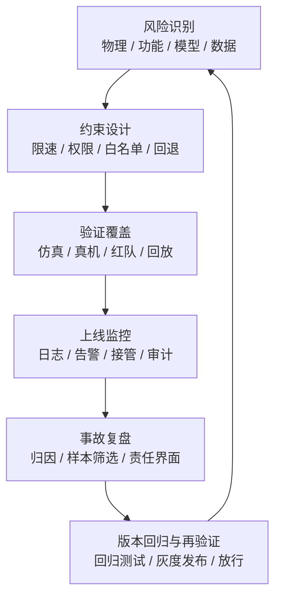

# 第十六部分 安全、对齐、验证与治理

具身系统与纯软件 AI 最本质的不同之一，就是错误不再只停留在信息层，而会转化为直接的物理后果。一次错误抓取可能损坏工件，一次错误导航可能撞到人，一次错误交互可能导致危险动作被执行。因此，安全、验证与治理在机器人系统里不是最后附加的一章，而是贯穿全链路的一级问题。

随着基础模型进入机器人控制栈，这一问题进一步复杂化。传统机器人安全更强调机械风险、功能安全与工作单元隔离；大模型时代则还必须处理误解指令、错误工具调用、远程运维链路、数据治理与模型责任边界。工业机器人安全标准与 AI 风险治理框架正在逐步汇合，相关框架与标准可参见 [NIST AI 风险管理框架](https://www.nist.gov/itl/ai-risk-management-framework)、[ISO 10218 机器人安全标准](https://www.iso.org/standard/59820.html) 与 [ISO 13482 个人护理机器人安全标准](https://www.iso.org/standard/53820.html)。

## 76. 具身安全为何是一级问题

### 76.1 物理世界中的损害与责任
如果把这一节再说得更具体一点，具身系统里的“损害”至少应分成四层：对人的直接伤害、对设备与工件的损害、对生产或服务流程的中断、以及事故后的责任追溯成本。这四层损害并不会等价出现，但任意一层过高，都足以改变系统是否允许上线、允许在什么速度下运行、允许由谁签字放行。因此，责任不是部署后的法律附件，而是系统设计阶段就会反向塑造动作权限和运行边界的内生变量。

也正因为如此，具身系统的很多“保守”设计并不是技术不够先进，而是责任结构的自然产物。限速、限力、工作空间裁剪、特定动作必须二次确认、异常时优先停机而非继续尝试，这些看起来降低了系统上限，却往往是把不可接受的责任暴露控制在可运营范围内的必要代价。对于学习者而言，这一点非常重要，因为它解释了为什么现实系统经常不会沿着“只要更聪明就行”的方向自然演化。
具身系统进入物理世界后，损害与责任不再只是“模型输出错了”，而是会具体落到人身伤害、设备损坏、现场停工、财产损失和责任归属争议。也正因如此，机器人安全讨论从一开始就带有更强的工程、法律和组织属性。对具身系统而言，责任不是部署后才讨论的外部问题，而是会反过来塑造权限边界、动作范围和接管策略的内部设计变量。

只要一个错误动作可能造成夹伤、跌落、流程中断或设备破坏，那么风险偏好、最大速度、接触阈值和人工接管机制就必须在架构阶段写进去。换句话说，责任不是后补文档，而是决定“哪些能力可以开放、哪些必须受限”的前置条件。
具身系统进入物理世界后，损害与责任不再只是“模型输出错了”，而是会具体落到人身伤害、设备损坏、现场停工、财产损失和责任归属争议。也正因如此，机器人安全讨论从一开始就带有更强的工程、法律和组织属性。
对具身系统而言，这种责任并不是抽象法务问题，而是直接塑造系统设计边界的工程事实。只要一个错误动作可能造成夹伤、跌落、财产破坏或流程中断，那么风险偏好、动作权限、最大速度、接触阈值和人工接管策略都必须在架构阶段被写进去。也就是说，责任不是部署后才讨论的外部问题，而是设计时就决定“哪些能力可以开放、哪些能力必须受限”的内部变量。

软件模型的错误通常造成错误信息、错误推荐或错误分类；具身系统的错误则可能造成物理伤害、财产损失和责任事故。这使得机器人安全天然比许多纯软件 AI 场景具有更高后果风险。

### 76.2 与纯软件 AI 风险的差异
纯软件 AI 风险与具身风险的根本差异，还体现在反馈时间尺度上。很多软件系统的错误可以通过人工复核、延迟执行、内容下架或版本回滚在事后缓解；而具身系统的错误常常在毫秒到秒级内完成并造成不可逆后果。也就是说，机器人安全更依赖前置限制、在线拦截和失效安全，而不是事后解释。

这会直接改变评价标准。一个在聊天系统里“整体准确率更高”的模型，迁移到具身闭环中时，未必比一个略保守但尾部风险更低的模型更安全。对机器人来说，灾难性偶发错误的代价常常远高于平均表现的微弱提升，因此后续所有性能讨论都应默认接受这一风险偏好差异。
与纯软件 AI 相比，机器人风险有两个额外维度。第一，错误会通过执行器直接作用于外部世界；第二，很多后果不可撤销。一个语言模型答错一句话，与一个移动平台在错误时机启动，不属于同一数量级风险。这意味着纯软件领域常用的平均性能口径，不能直接平移到具身系统。

因此，具身安全更强调尾部风险、最坏情况边界和可恢复性，而不仅仅是平均正确率。一个“整体准确率更高”但偶发灾难性错误的系统，未必比一个略保守但风险边界清楚的系统更可接受。
与纯软件 AI 相比，机器人风险有两个额外维度：第一，错误会通过执行器直接作用于外部世界；第二，很多损害不是可撤销的信息错误，而是不可逆的物理后果。这也是为什么具身系统的安全治理不能只停留在内容审核或输出过滤层面。
这类差异还意味着很多纯软件领域常见的评估口径不能直接平移过来。一个语言模型回答错一句话，和一个移动底盘在错误时间启动并不是同数量级风险；同样，传统 AI 中“平均性能更高”也未必能抵消具身系统中极低频灾难事件的不可接受性。因此，具身安全评估更强调尾部风险、最坏情况边界和可恢复性，而不仅是平均正确率。

纯软件 AI 更容易集中在信息真实性、偏见、隐私和误导风险上；具身系统则还要额外面对碰撞、跌倒、夹伤、误触发、失控移动和执行器失效等风险。

### 76.3 安全与商业化之间的关系
从商业角度看，安全还会直接影响客户接受方式。客户真正购买的并不只是“机器人会做事”，而是“机器人会在多大责任边界内稳定做事”。一旦系统无法清晰回答接管规则、停机条件、事故追溯、权限分层和版本回滚，很多高价值场景即使技术上可做，也很难进入正式采购流程。换言之，安全不是在商业化之后才被补上的成本项，而是商业化成立本身的组成条件。

这也解释了为什么一些看起来更慢的路线反而更容易进入真实场景。它们也许不追求最高自治率，但更早把安全约束组织成可运营条件，因而能更快跨过客户和监管的心理门槛。对研究型报告而言，这比抽象争论“安全是否阻碍创新”更有解释力。
安全与商业化并不是天然对立，而是共同决定系统是否能进入真实运营闭环。若一个系统只有在大幅压低速度、收紧工作空间和频繁人工接管下才安全，那么它的商业价值很可能也会被显著削弱；反过来，若为了追求节拍和成本而牺牲安全边界，系统又难以获得长期部署许可。两者实际上共享同一组现实约束。

因此，更成熟的商业路线并不是“先商业化、后补安全”，而是从一开始就把安全条件写进产品定义和服务模型。谁能把安全约束组织成可运营条件，谁的商业路径才更稳。

安全与商业化之间并不是简单对立关系。短期看，更严格的安全机制确实会增加开发和部署成本；但中长期看，谁能更早把安全、验证、责任追踪和异常恢复制度化，谁反而更有机会进入高价值、高责任、高复购的真实场景。也就是说，安全不只是约束，也可能是进入更高等级市场的门票。

对具身行业尤其如此。很多场景之所以迟迟难以规模化，不是因为市场没有需求，而是因为系统尚未在安全与责任层面达到可接受阈值。因此，把安全仅仅理解为“拖慢创新”的外部负担，会低估它作为商业化前提条件的地位。
安全与商业化不是彼此独立的两条线。很多机器人产品能否真正落地，决定性因素并不是 demo 里最强能力，而是系统是否能在可接受责任边界内稳定运行。换句话说，安全不是商业化之后再补的约束，而是决定哪些场景根本可以卖、可以部署、可以长期运维的前提。

也正因为如此，很多表面上看起来“进展慢”的安全要求，实际是在帮助行业区分“可展示能力”和“可签约交付能力”。对研究报告而言，把这层关系说清楚很重要，否则很容易高估炫目 demo 的产业成熟度。

对机器人而言，安全不是阻碍商业化的额外负担，而是商业化成立的前提。没有安全保证的系统，无法进入高价值真实场景。

## 77. 安全问题分类

### 77.1 物理安全
物理安全若要真正进入系统设计，不能只停留在“不要撞人”这一口号层面，而需要明确进入动作接口。更实用的做法，是把每一类动作都绑定到可验证的速度、力、距离、接触持续时间和工作空间边界上，再通过在线监测器持续检查是否越界。这样一来，模型给出的高层意图与底层可执行安全边界之间，才真正建立起工程接口。

这一点也意味着，物理安全并不只属于控制器或机械工程师。高层策略若经常把系统推向未验证姿态、狭窄空间或高不确定接触区，底层再稳也会不断被动兜底。因此，物理安全是典型的跨层问题，必须贯穿高层任务规划、中层技能调用与底层控制闭环。
物理安全关注的是“机器人动作本身会不会直接伤人、伤设备、伤环境”。它通常涉及速度、力、碰撞能量、可达区域、急停机制、隔离边界和人机接触条件。与纯软件系统不同，这里的错误不是输出错一句话，而可能是夹伤、撞击、跌落或设备损坏。

一个最小物理安全约束可以抽象为：

\[
a_t \in \mathcal{A}_{safe}(x_t, e_t)
\]

其中 \(\mathcal{A}_{safe}\) 表示在当前机器人状态 \(x_t\) 与环境状态 \(e_t\) 下允许执行的安全动作集合。
物理安全看似最传统，但在基础模型进入机器人后反而更需要重新审视。原因在于，高层策略的开放性增强后，机器人更可能进入过去没有显式编排过的姿态、路径和交互模式，从而触发底层原本不常见的碰撞或过载风险。因此，物理安全不只是底层控制器的事情，也取决于高层是否把系统推进了未经充分验证的状态区域。

涉及碰撞、力过载、稳定性失控、危险接触和环境破坏。

### 77.2 功能安全
功能安全的核心，不在于“平时性能高不高”，而在于“出现异常时系统是否还能退回到定义清楚的安全模式”。这一点对具身系统极其关键，因为很多危险并不是来自模型胡来，而是来自传感器掉线、节点卡死、时钟不同步、控制回路超时、执行器失配或软件版本不兼容。系统若没有明确的降级逻辑，就会在这些局部异常下以不可预测方式继续动作。

因此，一个成熟的功能安全设计通常需要显式定义状态机：正常运行、受限运行、等待确认、人工接管、安全停机、故障锁定等状态如何切换，触发条件是什么，谁有权恢复。只有这些内容被写成系统行为的一部分，功能安全才不是口头承诺。
功能安全更关心“系统在部件失效、输入异常或状态不一致时，是否仍能进入可控状态”。它不只讨论机器人平时做得对不对，而更关注传感器丢失、节点重启、通信中断、控制器卡死时，系统是否会失控或是否能够优雅降级。

一个极简功能安全思路可以写成：

```python
if sensor_fault or controller_timeout:
    enter_safe_mode()
    notify_operator()
```
功能安全更关心“系统在部件失效、输入异常或状态不一致时，是否仍能进入可控状态”。它不只讨论机器人平时做得对不对，而更关注传感器丢失、节点重启、通信中断、控制器卡死时，系统是否会失控或是否能够优雅降级。

对学习者来说，可以把它理解为：物理安全更像“不要撞”，功能安全更像“出了错也不要以不可控方式撞”。

涉及故障检测、异常停机、冗余设计、控制回退和失效安全机制。很多风险不来自“模型胡来”，而来自系统在局部异常下没有及时进入安全模式。

### 77.3 网络与数据安全
网络与数据安全在具身系统里还有一个经常被低估的特点：攻击不一定要直接命中控制接口，也可能通过污染感知流、篡改任务配置、劫持更新链路、注入伪造日志或窃取环境布局数据间接造成严重后果。这意味着机器人系统的攻击面往往比看上去更宽，因为任何能影响观测、策略、更新或接管流程的入口，都可能变成行动风险入口。

所以更合理的安全设计，不是简单把机器人接上企业网络，而是按最小权限原则重新切分数据面、控制面和运维面。谁能看、谁能写、谁能下发任务、谁能更新版本、谁能远程接管，都应有明确分层。这种分层看似“IT 化”，实际是具身系统运行安全的组成部分。
网络与数据安全在机器人里尤其敏感，因为很多系统会同时暴露远程控制接口、现场视频流、内部地图、任务日志和设备身份信息。一旦这些链路被入侵，不只是数据泄露，还可能直接引发错误动作、远程操控或安全停机失效。对于联网机器人来说，这已经不是传统 IT 附属议题，而是运行安全的一部分。

更进一步看，远程更新、云端推理、遥操作接管和日志回传都在扩大攻击面。攻击者甚至未必需要直接控制执行器，只要能污染感知输入、篡改任务配置或劫持更新链路，就可能制造严重事故。因此，网络与数据安全必须进入具身系统的主架构讨论，而不能留在部署末端补救。
网络与数据安全在机器人里尤其敏感，因为很多系统会同时暴露远程控制接口、现场视频流、内部地图、任务日志和设备身份信息。一旦这些链路被入侵，不只是数据泄露，还可能直接引发错误动作、远程操纵或安全停机失效。
对于联网机器人，这一类风险的重要性正在快速上升。远程更新、云端推理、遥操作接管、日志回传和多设备协同都在扩展攻击面。攻击者未必需要直接控制执行器，只要能够污染感知输入、篡改任务配置、劫持更新链路或读取高价值环境数据，就可能造成安全事故或隐私事件。因此，网络与数据安全在具身系统中不应被视为 IT 附属议题，而是运行安全的一部分。

机器人越来越联网、越来越依赖远程更新和云端协同，这意味着攻击面也显著扩大。感知数据、控制接口和远程运维链路都可能成为安全漏洞。

### 77.4 模型行为安全
模型行为安全最棘手的地方，在于它往往发生在系统“看起来还在正常工作”的时候。模型可能没有明显崩溃，也没有输出完全荒谬的动作，但它可能误解禁止条件、跳过关键前置步骤、对异常状态过度自信，或在模糊指令下选择不安全默认动作。相比底层控制失稳，这类错误更难被第一时间察觉，因为它们首先表现为“决策合理性”失真，而不是“机械系统明显坏掉”。

因此，模型行为安全更像决策权限管理问题，而不是单纯“让模型更聪明”问题。一个更适合工程实现的抽象是：

\[
a_t = \Pi_{\text{safe}}\!\left(\pi_\theta(h_t), x_t\right)
\]

其中 \(\pi_\theta\) 负责给出高层动作建议，\(\Pi_{\text{safe}}\) 负责把动作投影回安全可行集，\(x_t\) 则包含本体状态、工作空间约束、权限边界与监视器信号。若系统里根本没有 \(\Pi_{\text{safe}}\) 这一层，那么再高分的基础模型也只是把高风险决策直接暴露给执行器。

从风险形态看，模型行为安全至少包括四类问题：

1. 语义失配：把“拿起蓝杯”错听成“移动左侧全部物体”。
2. 阶段失配：没有先建立约束或接触条件，就直接进入执行阶段。
3. 恢复失配：系统已经偏航，却把“继续尝试”误当成安全恢复。
4. 置信失配：对分布外输入仍高置信输出具体动作。

因此，行为安全必须依赖多层机制，而不能只靠训练时对齐。动作裁剪、工作空间约束、接触阈值监测、技能白名单、任务级回退逻辑和人在回路审批，往往需要与模型本体共同组成联合安全系统。对高责任场景而言，最危险的从来不是“模型完全不会”，而是“模型多数时候看起来会，因此偶发越界更难被人类及时察觉”。

## 78. 验证与测试框架

### 78.1 仿真验证
仿真验证最常见的误区，是把它理解成“只要仿真里跑通，就算安全被验证了”。更准确的理解应该是：仿真主要负责以更低成本扩大覆盖范围，帮助团队系统性穷举边界条件、稀有工况和危险组合，而不是代替真实世界认证。它擅长发现明显问题、构造危险场景和形成大规模回归集，却无法自动保证接触细节、传感器噪声和现场组织行为与现实完全一致。

因此，一个更成熟的仿真验证策略通常不是追求“仿真等于现实”，而是明确划分三件事：仿真负责发现什么，真机负责确认什么，事故回放负责追什么。只有这三者被协同组织起来，仿真验证才真正成为安全基础设施，而不是论文附图。

一个最小验证流程通常是：

```python
for scenario in adversarial_or_random_scenarios:
    result = run_policy_in_sim(policy, scenario)
    log_safety_metrics(result)
```
仿真验证最有价值的地方，不只是“省成本”，而是它能系统性覆盖现实里不便频繁制造的危险条件，例如极端障碍布局、罕见接触失稳、执行器迟滞放大、传感器失配和异常人类介入。对安全工程来说，仿真更像风险放大镜，帮助团队在真实上线前主动寻找脆弱点，而不是只验证系统在理想流程中是否能通关。

从证据结构看，仿真验证至少应该沉淀三类资产：场景模板、扰动模板和失效判据。前两者决定“你是否系统性地找边界”，后者决定“系统究竟是在什么条件下被判失败”。没有这三类资产，仿真结果再多也很难变成可重复利用的安全证据。

### 78.2 真机验证
真机验证的独特价值，在于它能揭示所有“只有放到真实硬件和真实现场才会出现”的耦合问题。包括轻微机械偏差、夹爪磨损、热漂移、地面摩擦差异、传感器脏污、通信抖动、操作员习惯和现场临时变化，这些问题往往不会完整出现在仿真中，却会在长期运行中不断积累成事故风险。

因此，真机验证不应只追求“再做几次成功 demo”，而应刻意组织重复、疲劳、扰动和恢复测试。真正高价值的真机验证，不是证明系统可以成功一次，而是识别它在第十次、第一百次、不同班次和不同轻微偏差下是否还能保持受控。

更严谨的做法，是把真机验证组织成分阶段放行：

1. 台架/空载阶段：检查急停、限速、关节限位、接管链路。
2. 封闭工位阶段：检查代表性任务、低风险异常和恢复策略。
3. 影子运行阶段：真实流程旁路观察，不直接控制最终结果。
4. 扩容阶段：在限定权限下逐步扩大场景与班次覆盖。

这样真机验证才是系统工程，而不只是展示环节。它的目标，是确认那些在仿真与离线分析中看起来成立的安全机制，在真实传感器、真实时延和真实机械误差下是否仍然成立。它通常规模更小、成本更高，但证据强度也更高，因为很多关键风险只会在真实本体上暴露出来。

一个极简真机验证流程可以写成：

1. 选定受控场景和风险边界。
2. 逐项测试急停、限速、接管、异常恢复。
3. 记录碰撞、误停、迟滞和误报情况。
4. 审核是否满足继续扩大测试范围的条件。
真机验证更接近真实风险，因此对安全论证至关重要。但它昂贵、慢，且本身也可能带来测试风险，所以必须和仿真回归、事故回放、版本审计一起形成闭环。

### 78.3 红队测试与异常工况测试
红队测试最有价值的地方，不只是找 bug，而是建立一张“系统在何种组合条件下失去可控性”的风险地图。对具身系统来说，真正危险的场景往往不是单一异常，而是多种轻微异常叠加，例如模糊指令叠加遮挡、网络延迟叠加执行器失准、物体替换叠加接触滑移。正常测试流程很难系统覆盖这些组合，而红队测试恰恰应以构造这些组合为目标。

这意味着红队结果不应只留下一个失败清单，更应沉淀成可复测资产：危险场景模板、异常输入集、回放脚本、接管记录与版本回归集。只有这样，红队测试才会从一次性审查动作变成持续的安全生产力。

一个更成熟的异常工况库通常至少包括四类扰动：

1. 语义扰动：模糊指令、冲突指令、越权请求。
2. 感知扰动：遮挡、反光、错检、标定偏移、时间不同步。
3. 执行扰动：迟滞、掉帧、轻微失准、抓取对象替换。
4. 组织扰动：人类临时介入、工位改造、网络抖动、远程接管延迟。

异常工况测试的价值，还在于把低频问题显式纳入版本回归。若每次系统升级只看平均成功率，而不复测历史上最危险的异常案例，那么能力提升很可能伴随风险回归。真正成熟的验证体系，应把这些异常样本当作核心资产。

### 78.4 人在回路与人工接管机制
人在回路的成熟度，关键不在“有没有人工接管”，而在“接管是否设计成了一套稳定接口”。这包括接管条件是否明确、操作员能否快速理解当前上下文、接管后系统是否会进入一致状态，以及接管记录是否能回流到后续训练和验证链路。若这些内容没有设计清楚，人工接管就会变成临时补丁，而不是正式安全机制。

一个成熟的接管设计通常会把人工角色拆成至少三层：

1. 批准层：确认高风险动作是否被允许执行。
2. 监督层：观察系统退化，必要时要求降级或暂停。
3. 执行层：在系统已经越界或失效时直接接管。

这样做的意义，不是让人类替机器人做完所有事，而是把最稀缺的人类判断留给最关键节点。从产品形态看，共享自治之所以经常是现实最优解，并不是因为企业放弃了自治，而是因为它把“高价值判断”与“高频执行”做了更稳妥的分工。

若把系统风险写成条件风险函数，则可以抽象记为：

\[
\mathcal{R} = \mathbb{E}_{x \sim p(x)}[\text{loss}(x)] + \lambda \, \mathbb{P}(\text{catastrophic event})
\]

这里第一项对应一般性能退化，第二项对应灾难性事件风险。对具身系统而言，后一项的权重 \(\lambda\) 往往远高于纯软件任务。

### 78.5 从“测试很多次”到“证据链足够”的跃迁
具身系统最容易出现的一种幻觉，是把“已经测了很多次”误当成“已经有足够证据可部署”。前者是样本数量概念，后者是证据结构概念。真正可用于放行的证据，至少要覆盖四类问题：系统在正常工况下是否稳定，系统在边界工况下如何退化，系统在异常工况下如何进入安全状态，以及版本更新后历史风险是否会重新出现。若这四类问题没有被分别回答，那么测试次数再多，也仍可能只是重复验证容易成功的主路径。

更工程化地看，安全证据链可以被抽象成一个矩阵：纵轴是工况类型，横轴是系统层级。工况类型至少包括正常、边界、异常和恢复后复测；系统层级至少包括硬件、控制、感知、模型、任务编排和运维接口。所谓“闭环”，本质上就是要求团队不要只在矩阵的某一行或某一列堆证据，而要覆盖那些最可能在跨层耦合处失真的区域。

若用一个粗略记号来表达证据覆盖度，可写成：

\[
\text{Coverage} = \sum_{c \in \mathcal{C}} \sum_{l \in \mathcal{L}} w_{c,l} \cdot \mathbf{1}[\text{tested}(c,l)]
\]

其中 \(\mathcal{C}\) 表示工况集合，\(\mathcal{L}\) 表示系统层级集合，\(w_{c,l}\) 表示不同组合的重要性权重。它不是审计公式本身，但足以提醒我们：安全验证的关键不只是“做了多少测试”，而是“关键组合有没有被碰到”。

若把版本放行再写得更明确，可近似表达为：

\[
\text{Gate}(v)=\mathbf{1}\!\left[
C_{\text{normal}}\!\ge\!\tau_1 \land
C_{\text{edge}}\!\ge\!\tau_2 \land
C_{\text{recovery}}\!\ge\!\tau_3 \land
C_{\text{regression}}\!\ge\!\tau_4
\right]
\]

其中 \(C_{\text{normal}}\)、\(C_{\text{edge}}\)、\(C_{\text{recovery}}\)、\(C_{\text{regression}}\) 分别表示正常工况、边界工况、异常恢复和历史风险回归的证据覆盖度。真正成熟的放行口径不应是“主流程成功率上升了”，而应是“关键风险组合的未解释空白在收缩”。

## 79. 标准、认证与治理

### 79.1 机器人安全标准
安全标准的真正作用，不只是给出一张合规检查表，而是提供一种跨组织可共享的安全语言。它帮助供应商、客户、集成商、认证方和监管方在同一套术语下讨论风险来源、测试范围、责任分工和验收条件。没有这种公共语言，再强的技术能力也很难转化成可规模化采购的产品能力。

因此，本节最值得读者把握的不是标准编号本身，而是标准如何反向要求系统留下证据链：哪些风险被识别了、哪些约束被实施了、哪些工况被测试了、哪些异常会触发停机、哪些版本更新需要重新认证。这些要求会直接改变系统工程方式。

工业机器人、协作机器人与服务机器人各自有不同标准框架，[ISO 10218](https://www.iso.org/standard/59820.html) 与 [ISO 13482](https://www.iso.org/standard/53820.html) 仍是理解产业安全边界的两个基础入口。更值得注意的是，2026 年一篇对 ISO 10218:2011 与 ISO 10218:2025 的比较分析，把新增重点概括为功能安全与网络安全要求的增强，这说明标准口径正在从“机械本体防护”继续扩展到“联网系统与软件行为”层，参见 [《工业机器人安全要求演进比较分析》](https://arxiv.org/abs/2602.17822)。

因此，标准不是技术之外的文书负担，而是工程系统的上游约束。谁忽视这一点，谁就会在从实验室走向现实部署时突然发现整条验证链都需要重建。

### 79.2 AI 治理与责任边界
责任边界之所以在大模型进入具身系统后变得更复杂，是因为最终行为往往由多方共同塑造：底座模型提供先验，系统集成商定义接口，场景运营方决定流程和权限，客户又拥有最终使用环境。这样一来，很多事故不再能简单归因于某一段代码或某一台硬件，而是必须放回整条权责链上理解。

因此，治理问题的重点不只是追责，更是预先设计谁能审计什么、谁能修改什么、谁有暂停权限、谁负责事故复盘、谁触发重新验证。权责链若设计得模糊，技术系统越复杂，部署风险反而越高。

一个更实用的治理视角，是把责任边界固定到四类问题上：

1. 谁声明能力边界。
2. 谁批准风险接受水平。
3. 谁持有运行期日志与接管权限。
4. 谁在更新后负有再验证义务。

这与近年的 AI 风险管理研究是一致的：可审计性、可追踪性和版本化责任分工，不是附属治理层，而是高风险 AI 系统的工程前提，参见 [《AI 风险管理的演化》](https://arxiv.org/abs/2401.15229)。对行业跟踪来说，这一节最重要的观察口径是：谁在主动建设可审计链路，谁就在为大规模部署铺路。

### 79.3 数据与场景合规
数据与场景合规在具身系统中比纯内容系统更复杂，因为机器人采到的不只是“数据内容”，而是常常连同空间布局、操作流程、人员活动、设备配置和组织节奏一起被记录和回放。这意味着很多数据即使不包含明显敏感文本，也可能仍然包含高价值、高敏感的现场知识。

因此，合规问题不能被压缩成一条数据免责声明。它应被写进采集流程、数据分级、访问权限、场景准入和后续训练复用规则中。更准确地说，具身系统的合规对象至少有两层：一层是数据对象，另一层是场景对象。前者回答“能不能存、能不能训、能不能共享”，后者回答“机器人能不能进入这里、能不能在这里持续回放与学习”。如果只做第一层而忽略第二层，现场合规风险仍然会不断泄漏。

### 79.4 安全基础设施的新趋势
一个越来越清楚的趋势是，安全正在从“单点算法能力”转向“平台化工程能力”。真正有长期价值的，不再只是某个碰撞检测器或某个风险分类器，而是围绕版本审计、影子测试、异常回放、权限分层、远程停机、灰度发布和事故复盘建立起来的一整套持续运行体系。谁能把这些机制做成默认基础设施，谁就更接近大规模部署门槛。

这也是本章与后文企业、商业化和政策章节的接口所在。后续评估一家公司或一条路线时，不应只问“有没有安全模块”，而应问“有没有安全基础设施”。前者只是组件，后者才是组织化能力：能否在模型更新后自动回归、能否在事故后快速复盘、能否在多现场部署中保持统一权限与日志口径。

从运行栈角度看，安全基础设施至少应覆盖七个动作：版本追踪、影子运行、异常回放、灰度放量、远程停机、权限审计和事故归档。任何一项长期缺位，最后都会以某种“系统明明变强了却更难运营”的形式反噬部署节奏。

下面给出一个极简安全监控伪代码，用于说明部署阶段的分层拦截思路：

```python
action = policy(observation, goal)

if not safety_filter.within_limits(action, robot_state):
    action = safety_filter.project_to_safe_set(action)

if anomaly_detector.triggered(robot_state, observation):
    supervisor.request_handover()
    action = emergency_controller.stop()
```

### 79.5 一个更可执行的治理操作模型
如果把“治理”从抽象原则翻译成日常运转机制，一个更可执行的做法是明确四个固定角色：能力提供者、部署批准者、现场运营者与事故复盘者。能力提供者负责声明模型、技能和本体的已验证边界；部署批准者负责决定哪些边界在当前场景下被接受；现场运营者负责运行中监控、接管与日志留存；事故复盘者则负责在事后判断问题属于能力缺陷、流程缺陷还是边界设置失误。

这种分工之所以重要，是因为很多具身事故并不是“谁犯了单一错误”，而是“多个角色都以为某件事由别人负责”。例如模型方认为某种长尾情形应由系统层兜底，系统层认为该动作在现场根本不该开放，现场方又误以为既然演示过就意味着已被默认放行。只要权责没有被结构化写清，安全问题就会在组织边界上反复泄漏。

因此，本章对治理的最强主张并不是“增加更多文书”，而是把部署前、运行中、事故后这三类决策都绑定到明确责任人上。谁批准过边界，谁保存了什么证据，谁有权暂停，谁负责重新验证，这些内容一旦清楚，很多看似复杂的治理问题就会转化为可管理的工程接口问题。

### 79.6 版本更新后的再验证门槛
大模型进入机器人系统之后，一个极易被低估的风险是“轻微更新也可能改变整体行为边界”。纯控制系统中，很多修改可以通过局部分析判断影响范围；但在带有基础模型、策略蒸馏、检索记忆或任务编排器的系统里，一次看似不大的模型更新、提示模板更新、工具调用顺序调整，甚至都可能让系统在旧场景里表现得像一个新系统。因此，再验证不应只在“大版本升级”时启动，而应围绕“行为边界是否可能改变”来触发。

一个更实用的再验证分类方法，是先问这次更新属于哪一层：

1. 参数层更新：仅改权重或阈值，但不改接口。
2. 接口层更新：改变感知输入、动作输出、工具调用或权限分层。
3. 场景层更新：进入新的客户流程、新的工位或新的运维链路。
4. 治理层更新：改变接管权限、日志留存、放行规则或回滚策略。

只要更新触及后面三层中的任一层，就不应把它视为纯粹的低风险维护更新，而应触发历史异常样本回归、关键场景复测与放行记录更新。对研究与产业跟踪而言，这一节的含义非常直接：谁已经形成了“更新即回归、回归即审计”的机制，谁才更接近真正可运营的基础模型机器人体系。

本部分的结论是：具身系统的安全不应被理解为“控制器够稳就行”，而是一整套从高层行为边界到底层失效安全、从仿真测试到真机验证、从模型责任到部署治理的系统工程问题。也因此，本章最适合充当全书的“否决层”：很多路线在模型能力、数据规模和商业故事上都可能越来越强，但只要其接管边界、日志可追溯性、异常回退、红队覆盖和版本回滚能力没有同步成熟，就不应轻易上修整体判断。

## 图 16-1 安全、验证与治理闭环图

源文件：`assets/diagrams/16-安全验证治理闭环图.mmd`



## 图表与验证补充
进一步说，本章最应该服务于后文的地方，是把“安全成熟度”从抽象口号改写成可检查的结构。以后无论评估企业、产品还是论文，只要能够沿着“风险识别、约束设计、验证覆盖、上线监控、事故恢复”五步链条去问问题，就能避免把安全理解成单一合规模块。
本章后续最应被固定为正式内容的，是“物理安全 / 功能安全 / 模型安全 / 数据安全”的分类图，以及“仿真验证 - 真机验证 - 红队测试 - 现场监控”的验证闭环图。前者用于防止安全讨论沦为泛泛而谈，后者则强调安全不是单次测试，而是贯穿模型生命周期的持续验证过程。

对全书而言，这两张图也承担公共框架作用，因为它们会在企业分析、商业化、政策与部署章节中被反复引用。

`图 16-1 安全、验证与治理闭环图` 的关键作用，是把“风险类型分层”与“验证运营流程分层”放到同一闭环里统一观察。这样读者就不会把安全只理解成事故清单，也不会把验证只理解成上线前测试，而能看到风险识别、验证执行、版本回归、现场监测与治理反馈之间的连续关系。对具身系统而言，这种闭环视角比单独罗列安全术语更接近真实部署逻辑。
