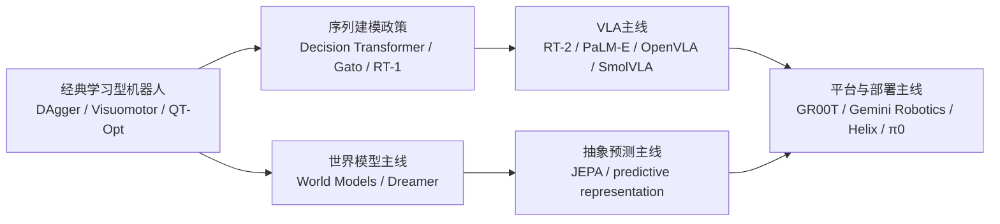

# 第十八部分 代表性论文与模型谱系梳理

长篇报告如果只在各章局部引用论文，很容易缺少全局脉络。因此，本部分的作用不是重复前文，而是建立一张可长期维护的谱系图：哪些路线从经典模仿学习和 RL 演化而来，哪些路线推动了 Transformer policy 与 VLA，哪些路线把世界模型与抽象预测推上前台，哪些是 2025-2026 年值得持续跟踪的新分支。

本章的一个核心目的，是把“论文列表”变成“研究地图”。也就是说，重要的不只是记住某篇论文做了什么，而是理解它在一条主线上的位置：它解决了哪个旧瓶颈，引入了什么新接口，又把问题重新推向了哪里。只有这样，这份报告后续每次增量更新时，新增论文才有机会被放回结构之中，而不是不断堆叠零散新名词。

## 85. 经典起点与过渡阶段

### 85.1 传统模仿学习与 RL 代表工作
如果从今天回看，这一节最重要的价值并不只是列出若干“早期经典”，而是把具身学习最顽固的底层约束重新摆到台面上。模仿学习与 RL 时代已经把几个问题暴露得非常清楚：示教分布与闭环执行分布天然错位，真实世界试错昂贵，奖励设计脆弱，恢复能力难学，失败样本往往比成功样本更能决定系统上限。后来的 VLA、通用策略和机器人基础模型并没有让这些问题消失，而只是用更大规模的数据工程、模型参数和训练基础设施重新包装了它们。

也因此，本节不应被当成“背景材料”读过就算。更准确的理解是：这一批工作定义了后续所有路线都绕不开的共用问题空间。若不先理解这些老问题，读者就很容易把今天某些模型的阶段性成功误判成结构性突破，而忽略它们仍然在和同一组约束持续搏斗。
把这组工作放在谱系起点，最重要的不是怀旧，而是提醒后文所有“新路线”都没有脱离这些早期问题设定：示教如何进入策略、回报如何驱动优化、真实世界试错为何昂贵、恢复能力为何难学。这一谱系奠定的是问题语言，而不只是若干旧算法名称。

这一段的关键意义，在于为后来的 foundation model 路线保留“学习型机器人原点”：视觉运动策略、QT-Opt、DAgger 等工作说明，具身学习的真正难点从一开始就包含闭环控制、数据稀缺和分布偏移。[DAgger](https://proceedings.mlr.press/v15/ross11a.html)、[End-to-End Training of Deep Visuomotor Policies](https://arxiv.org/abs/1504.00702)、[QT-Opt](https://arxiv.org/abs/1806.10293)

传统模仿学习与 RL 代表工作的意义，在今天并不只是“历史背景”。它们实际上定义了很多后续路线始终没有绕开的基本矛盾：示教分布依赖、闭环偏移、真实样本昂贵、恢复能力缺失与训练不稳定。后来的 foundation model 路线若不重新面对这些老问题，就很容易只是在更大参数规模上重演旧瓶颈。
因此，在谱系里保留这一段非常重要。它提醒我们：具身智能并不是从大模型时代凭空诞生的新学科，而是经典机器人学习问题在新表示和新数据条件下的重组。

### 85.2 Transformer policy 的早期路线
这一谱系的重要意义，不只是“Transformer 也能做机器人”，而是它把机器人策略学习重新组织成统一序列接口问题。状态、图像、动作、回报乃至任务条件，都开始可以被放入同一时序建模框架中比较。这样一来，模仿学习、离线 RL 和多任务策略建模之间原本较分散的接口开始被重新统一。

Transformer 进入机器人后，重点不是简单替代 RNN，而是把状态、动作和历史上下文放进更一般的序列接口中。Decision Transformer、Gato、RT-1 等工作虽然设定各异，但共同推动了“机器人控制可以被重新组织为序列建模问题”这一观念。[Decision Transformer](https://arxiv.org/abs/2106.01345)、[Gato](https://arxiv.org/abs/2205.06175)、[RT-1](https://arxiv.org/abs/2212.06817)

Transformer policy 的早期路线之所以关键，在于它首次把“机器人控制可以被组织成通用序列建模问题”明确推到台前。Decision Transformer、Gato、RT-1 这些工作虽然目标不同，但都把状态、动作和历史上下文放进了更统一的 token 或序列接口里。这一变化不只带来模型结构更新，更改写了研究者看待机器人策略的方式：控制不再只是控制理论对象，也成为了大规模序列学习对象。
这条线的真正后果，是为 VLA 与 generalist policy 奠定了接口基础。没有这一步，后来的多模态机器人基础模型很难自然接上语言、视觉和动作的统一建模叙事。

### 85.3 世界模型与生成控制早期路线
这一条谱系真正值得强调的，不只是它在历史上更早提出了 latent dynamics、imagined rollout 或 model-based 学习，而是它系统性地反驳了一个偷懒想法：机器人不可能永远只靠 observation-to-action 的直接映射去解决所有问题。只要任务存在多步后果、昂贵试错、接触不确定性或长时程依赖，系统就会不断被迫引入某种“内部对未来的表示”。早期世界模型路线的重要性，正在于它把这种内部表示重新变成正当研究对象。

不过，早期世界模型工作的启发不应被误读为“后来的视频世界模型已经被早早证明可行”。更准确的说法是：它们证明了学习内部环境模型有潜在高回报，但也同时暴露了模型偏差、rollout 漂移和真实接触任务中误差快速累积的问题。后来的所有世界模型热潮，都是在继承同一个愿望，也在继承同一个老难题。
这一路线的早期工作之所以值得单列，是因为它较早回答了一个今天仍然关键的问题：机器人是否可以先学一个内部环境模型，再借此做策略优化或规划，而不必每次都在真实世界中昂贵试错。后来的视频世界模型、抽象预测与可控生成路线，很多都可以回溯到这里的思想源头。

从 latent dynamics 到 imagination rollout，这条线说明“内部预测结构”并不是后来的附属支线，而是持续存在的主线之一。World Models 与 Dreamer 可被视作这条线的两个关键节点。[World Models](https://arxiv.org/abs/1803.10122)、[Dreamer](https://arxiv.org/abs/1912.01603)
这条早期路线的意义，在于提醒我们具身主线从来不只是一条“更好的 policy”路线。后来围绕视频预测、抽象表征、rollout 和可控生成的许多讨论，其实都能回接到这里；如果不把这条线保留在谱系图中，就很容易把后来的世界模型热潮误判成完全断裂的新叙事。

更重要的是，这条谱系还提供了一个持续有效的反例：只要真实试错仍然昂贵、接触结果仍然难预测，机器人就会不断被迫引入某种内部未来表示。也就是说，世界模型路线之所以反复归来，并不只是因为研究热点轮转，而是因为问题本身一直存在。

## 86. VLA 谱系

### 86.1 RT-1 / RT-2 / RT-X
这一组工作最好不要只当作三篇论文，而应被视为同一条研究主线的连续推进：从单体多任务机器人 Transformer，到更强语言与视觉知识注入，再到跨平台、更大规模的数据组织与接口扩展。它们共同回答的是：机器人动作建模能否像大模型那样，走向更统一的多任务规模化训练接口。

RT 系列的重要性在于连续推动机器人策略从任务专用模型走向多任务视觉-语言-动作统一接口。RT-1 重点在于多任务 Transformer policy，RT-2 重点在于把互联网语义知识更明确地迁移到机器人动作接口，RT-X / Open X-Embodiment 则更强调跨机构数据汇聚与 generalist policy 训练基础设施。[RT-1](https://arxiv.org/abs/2212.06817)、[RT-2](https://arxiv.org/abs/2307.15818)、[Open X-Embodiment](https://arxiv.org/abs/2310.08864)

RT 系列的重要性，不只在于性能数字，而在于它形成了一条连续可观察的接口演化链：从多任务视觉策略，到把互联网语义知识迁移进机器人动作接口，再到更大规模的跨平台数据组织。它们共同推动了“机器人基础模型”从概念逐步变成可比较对象。
因此，在长期维护这条谱系时，RT 系列不应只被当成若干篇单独论文，而应被看成一条持续推动输入输出接口重构的主线。

### 86.2 PaLM-E
PaLM-E 的标志性价值，在于它更明确地展示了“把通用多模态语言模型接入具身感知与任务执行接口”的路线。它不是最纯粹的机器人 policy 模型，而更像一个把语言、视觉和机器人状态共同塞进大模型上下文中的桥梁型系统，因此在谱系中承担的是“接口扩张者”的角色。

PaLM-E 把 embodied multimodal language model 明确为一个问题设定，是 foundation model 进入具身系统的重要节点。它的重要性不只是性能，而在于它重新定义了“机器人状态也可以被接入大模型上下文”这一接口。[PaLM-E](https://arxiv.org/abs/2303.03378)

PaLM-E 的谱系地位，在于它明确提出“机器人状态也可以成为大模型上下文的一部分”。这不是简单把一个 VLM 接到机器人上，而是重新定义了具身多模态模型的边界：文本、图像、状态和任务条件都可以进入同一上下文窗口，被统一地消费和组织。它在理论叙事上的影响，甚至不弱于单篇性能提升。
也因此，PaLM-E 的关键不只是“把更多模态塞进模型”，而是把“机器人状态进入大模型上下文”写成了一个明确的问题设定。这种写法改变了后续很多研究者对具身多模态模型边界的想象，使得状态、任务和感知不再被默认拆成彼此孤立的系统部件。

### 86.3 OpenVLA
在谱系里，OpenVLA 的价值主要体现在“把 VLA 从概念与演示，推进到更可审视的开放接口”。它让研究者更容易看清：训练样本长什么样、动作表示怎么定义、推理流程如何组织、评测口径如何设置。换句话说，它的重要性既在模型，也在方法学透明度。

OpenVLA 为研究社区提供了更开放的 VLA 对照对象，使开源路线得以形成自己的比较坐标。[OpenVLA](https://arxiv.org/abs/2406.09246)

OpenVLA 的意义，则更偏向研究共同体层面。它让 VLA 路线不再只由少数闭源系统定义，而开始拥有更可复现、可拆解、可二次开发的开源对照对象。对报告维护者而言，它的价值不仅在于模型本身，还在于它建立了后续比较的公共参考面。
从谱系维护角度看，OpenVLA 的价值还在于它把闭源系统里很多只能被间接猜测的设计问题重新拉回公共比较空间。开源实现、数据接口与训练组织方式的公开，使它更适合被当作研究路线拆解和复审的公共参照物。

这也是为什么在长期维护谱系时，OpenVLA 这一节点的重要性并不只来自模型本身，而来自它提供了一个对社区可见、可修改、可复审的坐标点。很多后续工作未必直接继承其全部设计，但会借它重新定义“一个 VLA 系统至少应公开哪些接口”。

### 86.4 SmolVLA 与轻量路线

SmolVLA 与轻量路线值得单列，不只是因为参数更小，而是因为它把一个常被后置的问题提前到了研究主线里：若具身系统最终必须跑在功耗、时延和维护预算都受限的端侧环境，那么“缩小模型并尽量保住关键能力”就不是部署优化，而是模型路线本身的一部分。

这类路线通常同时压缩三个维度。第一是参数规模与推理路径长度，避免每次动作生成都依赖高昂前向计算；第二是输入输出接口复杂度，例如更紧凑地表达动作 chunk 或减少不必要的高分辨率模态；第三是训练与蒸馏方式，让小模型继承大模型学到的语义先验，而不是要求它从头吸收全部能力。轻量化若只做第一层而忽略后两层，往往会得到一个“更小但仍然不适合部署”的模型。

把轻量路线纳入谱系十分必要，因为它代表了与“更大模型”并行发展的另一条主线。若未来机器人系统必须面对边缘算力、热设计功耗和成本约束，那么轻量模型并不是次优妥协，而会是大量真实系统的默认选择。

轻量路线的重要性在于：它们更贴近未来可部署系统对时延、功耗和成本的真实要求。SmolVLA 的研究价值不只在于“小”，而在于它把轻量部署、社区数据和异步推理栈一起纳入设计目标。[SmolVLA](https://arxiv.org/abs/2506.01844)
因此，轻量路线不是“大模型路线的附属优化”，而是与“更大模型”并行存在的一条主线。只要真实部署持续受到端侧算力、热设计功耗和维护成本约束，轻量 VLA 就不会只是妥协方案，而会长期是大规模可部署系统的核心候选。

## 87. 世界模型与 JEPA 谱系

### 87.1 视频世界模型
视频世界模型路线之所以在近两年如此醒目，一个核心原因是它把“预测未来”重新做成了高度可视化、跨学科都能直观看懂的研究对象。对机器人而言，这种表达有明显吸引力：如果模型能够根据当前观察、动作历史和任务条件生成未来视频，那么它似乎就有机会同时承担前瞻感知、风险评估、候选轨迹筛选和失败预警等多个角色。

但恰恰因为它可视化很强，也更容易掩盖真正的控制需求。机器人并不需要“看起来像真的未来”，而更需要“对行动成败有用的未来”。一个模型如果能生成连贯的视觉画面，却不能稳定区分抓取是否真正建立接触、障碍物是否会形成碰撞、或者某次移动是否会让后续操作空间消失，那么它在具身闭环中的价值依然有限。因此，本节讨论视频世界模型时，重点不应放在生成质量本身，而应放在它是否进入了真实决策接口。
视频世界模型路线之所以醒目，是因为它把“预测未来”重新做成了可视化极强、语义上很直观的研究对象。它的吸引力在于人很容易从预测视频中形成直觉，但它的陷阱也在于：视觉上逼真并不自动等于对控制有用。

这一路线强调高维未来生成能力，价值在于未来结构表达丰富，问题在于可执行性难保证。

视频世界模型之所以值得单列，并不是因为“视频生成很火”，而是因为它代表了一种强表达力路线：希望通过高维未来生成，保留环境演化的丰富可能性。问题也同样鲜明，这类模型离真正可执行规划接口之间往往还有巨大鸿沟。因此，它们在谱系中的位置更像“开放世界表达能力的推进器”，而不是已完成闭环落地的控制替代物。
它们的谱系价值，在于把“开放世界未来表达能力”重新推到了机器人讨论前台。即使今天还未必足够可部署，这类路线也已经改变了很多人对“世界模型应该输出什么”这一问题的表述边界。

### 87.2 抽象预测路线
抽象预测路线的重要性，在于它改变了“什么才值得预测”的答案。与逐像素重建不同，这一路线更强调预测对任务真正有用的结构，例如对象关系、接触阶段、拓扑变化、潜在状态迁移或高层语义约束。对机器人而言，这种转向尤其关键，因为机器人最终消费的不是好看的画面，而是足以支撑规划、约束检查和技能调用的可执行结构。

从工程视角看，抽象预测的优势也更明显。它更容易与任务规划器、技能库、约束求解器、安全监测器和状态机对接，因为这些模块本来就偏好结构化变量而不是原始像素。但其挑战同样不小：什么样的抽象才足够通用，如何保证抽象变量对真实接触后果敏感，以及如何避免学到“看似稳定却对控制无用”的潜空间，都是仍未解决的问题。
抽象预测路线的核心，不是预测更漂亮的视频，而是尝试预测对决策更有意义的中间状态或语义结构。它在谱系中的价值，在于代表了世界模型并不必须走像素重建道路，也可以走“更抽象、可能更适合控制”的表征方向。

JEPA 及相关路线强调不必重建全部像素，只需预测足够有用的抽象结构。[JEPA](https://arxiv.org/abs/2301.08243)

抽象预测路线的重要性，在于它明确反对“必须重建所有像素细节才能学到世界结构”的默认假设。JEPA 及相关工作把注意力转向更任务相关、更结构化的内部表示，这条线对机器人尤为关键，因为机器人最终要消费的是可执行结构，而不是视觉逼真度。
从谱系立场看，这条路线系统性地反驳了像素重建中心主义。它强调对具身系统真正重要的，未必是把未来画得更真，而是把对任务、控制和预测有用的结构保留下来；这使其与世界模型、规划接口和状态抽象问题形成了比表面上更深的联系。

### 87.3 可控生成与规划结合路线
这一节最值得补充的一点是：可控生成真正改变的，不是生成模型“会不会画未来”，而是它开始尝试承担行动候选提议器的角色。系统不再只做一次前向传播直接给出动作，而更像是先生成若干可选轨迹、子目标或技能序列，再由约束检查、价值评估、碰撞检测或外部规则进行筛选。这种组织方式比纯端到端策略更接近许多真实机器人系统的工作逻辑。

当然，生成与筛选的组合并不会自动带来可靠性。候选过多会导致搜索成本上升，候选过少又失去规划收益；而一旦筛选器本身带有偏差，系统还可能稳定偏好“看似分高、现实会失败”的解。也因此，这条谱系的长期潜力不只取决于生成模型本身，还取决于生成接口与评估接口能否同步成熟。
这一路线的核心问题是：生成模型能否不只负责“画出可能未来”，而是进入行动选择环节，对候选计划进行筛选、重排序或引导搜索。它因此位于生成模型与决策系统的交界处，也是世界模型是否真能进入控制闭环的关键检验点之一。

从谱系判断看，这条路线的关键分歧点是生成模型是否愿意向“可决策接口”靠拢。若生成系统只优化感知真实感，它更接近内容生成路线；若它开始输出可搜索、可约束、可回滚的中间结构，它才真正与机器人规划谱系发生合流。

这一路线真正有前景的地方，不在“生成好看视频”，而在是否能和控制、规划与技能层形成闭环。
也因此，这条谱系更像是生成模型开始向决策接口靠拢的信号。一旦生成系统能够输出可搜索、可约束、可回滚的中间结构，它就可能成为视频生成、世界模型与技能规划之间的桥梁节点，而不再只是内容生成技术的外溢。

### 87.4 谱系分歧的根本问题
这些谱系持续分歧，根本不只是因为研究者偏好不同模型结构，而是因为它们默认的“主问题”并不相同。有的路线把核心难点定义为语义对齐，认为只要互联网级视觉语言知识能成功接到机器人动作接口上，能力上限就会迅速上升；有的路线把关键问题定义为接触与恢复，认为真正限制部署的是物理交互中的长尾异常；还有的路线把焦点放在系统组织，认为数据采集、仿真、评测与运维闭环才是决定谁能长期迭代的关键。

换言之，谱系分歧本质上对应不同目标函数。粗略地写，可以把它表示成：

\[
\min_\theta \mathcal{L}=
\lambda_1 \mathcal{L}_{\text{semantic}}
+ \lambda_2 \mathcal{L}_{\text{control}}
+ \lambda_3 \mathcal{L}_{\text{recovery}}
+ \lambda_4 \mathcal{L}_{\text{deployment}}
\]

不同路线之间并不是只在求解器或 backbone 上不同，而是连 \(\lambda_i\) 的权重都不同。这也是为什么很多路线很难在单一 benchmark 上得出“谁统一胜出”的结论。

对整本报告的维护来说，这一节很关键，因为它提醒我们后续版本更新时不应把所有新工作机械塞进同一条时间轴里。更好的做法，是先判断新工作究竟强化了哪一类目标函数，再把它放回对应谱系。这样行业叙事变化时，报告的核心判断框架才不会频繁被推翻。

因此，本章维护谱系时不应只记录论文名称和年份，更应记录其目标接口。只有把“它是为表达、为预测、为规划还是为控制服务”写清楚，后续版本更新时才能避免把本不属于同一问题设定的工作堆在一起比较。

世界模型谱系内部的根本分歧，并不是“是否生成”，而是“为谁生成”：是为视觉逼真度服务，还是为规划可用性服务；是为开放世界语义压缩服务，还是为接触级局部动力学服务。后续跟踪世界模型论文时，应优先用这个问题定位其在谱系中的位置。
所以，真正要比较的不是哪篇工作“更火”，而是它们优化的目标接口是否一致。只要表达目标、可执行性目标、开放世界语义泛化目标和部署成本目标并不在同一层上，把它们混在一起比较就会持续制造谱系错位。

## 88. 2025-2026 关键增量工作

### 88.1 GR00T N1
在谱系梳理里，GR00T N1 更适合被放在“平台化机器人基础模型”坐标中理解，而不是只看作某个单点模型。它背后通常捆绑了仿真、合成数据、机器人本体接口与后续部署叙事，因此其研究意义不仅来自模型能力，也来自它试图重新组织整条开发链路。

因此，评价 GR00T N1 时，至少要同时问三个问题。第一，它的输入输出接口是否真的适合跨本体复用，而不是仍隐含大量特定机器人先验。第二，它是否建立了足够可迁移的数据与评测语言，使更多团队可以围绕同一栈协作。第三，它在端侧部署、恢复和监控上究竟回答了多少问题，而不是只在训练与演示层面给出愿景。对这三个问题的回答，决定了它究竟是“一个模型”，还是“一个试图成为默认工作流节点的平台部件”。

其重要性在于把 humanoid/generalist autonomy、数据基础设施和仿真平台放进同一叙事。[GR00T N1](https://arxiv.org/abs/2503.14734)

GR00T N1 值得被放进 2025-2026 增量主线，不只是因为它来自 NVIDIA，而是因为它把 humanoid、本体平台、仿真基础设施、数据管线和 foundation model 明确组织成统一产品叙事。这说明平台型公司开始更主动地定义“机器人基础设施层”的边界，而不只是发布单点模型。[GR00T N1](https://arxiv.org/abs/2503.14734)

### 88.2 Gemini Robotics / On-Device
把 Gemini Robotics / On-Device 单列出来很重要，因为它代表的不只是“更强模型”，还代表另一条趋势：高能力模型是否能够进一步压缩、拆层或重组，进入更贴近端侧与现场的运行模式。这条路线与纯云端大模型叙事并不完全相同。

其值得关注之处在于更强通用多模态能力如何与机器人接口结合，以及端侧约束如何迫使模型重新组织。Google DeepMind 2025 年公开 Gemini Robotics / Robotics-ER，也说明闭源通用多模态大模型阵营正在更直接地进入机器人问题设定。[Gemini Robotics](https://deepmind.google/blog/gemini-robotics-brings-ai-into-the-physical-world/)

Gemini Robotics / On-Device 路线的谱系意义，在于它把通用多模态模型阵营与机器人问题设定更直接连接起来，同时把端侧约束显式提到前台。这意味着“通用模型进入物理世界”不再只是概念叙事，而开始变成具体接口与部署问题。[Gemini Robotics](https://deepmind.google/blog/gemini-robotics-brings-ai-into-the-physical-world/)

### 88.3 Figure Helix
Figure Helix 在谱系中的意义，更适合理解为“企业级系统整合路线的公开化片段”。它提供的往往不是完整开源方法，而是一个观察窗口，让我们看到企业如何把语言、规划、技能执行和本体系统耦合到一起。

在谱系上，Helix 的价值不只来自企业身份，而来自它把高低频分层这件事公开讲清楚了。这让它成为连接“通用多模态模型叙事”与“真实机器人控制栈约束”的重要样本。

其意义在于展示企业路线如何尝试将基础模型、任务泛化和本体耦合放在同一产品叙事中。Helix 尤其值得注意的，是其公开给出了 7-9 Hz 的高层 VLM 与 200 Hz 低层控制之间的双系统结构，这使其不只是“公司新闻”，而是一个很明确的系统架构样本。[Figure Helix](https://www.figure.ai/news/helix)
从谱系位置上看，Helix 的关键价值在于公开了高频低层控制与低频高层语义双系统结构。这使它成为观察“高低频分层是否会成为产业主流组织方式”的重要样本，而不只是又一个企业演示案例。

### 88.4 Physical Intelligence π0 路线
Physical Intelligence π0 路线值得单列，是因为它代表了另一类更强调机器人基础模型化、数据组织和系统路线整合的方向。其价值不只在单篇结果，而在于它试图重新回答“通用机器人能力应如何被组织成可扩展训练对象”。

这类路线在谱系中的意义，是它们可能重新组织问题陈述方式。即使技术内核仍与既有路线有连续性，新的命名和系统切分方法也会影响产业叙事、研究注意力与资本配置。

其价值在于把“物理世界 intelligence”作为独立对象来定义，而不只是传统机器人或纯大模型的附属延伸。对报告维护者而言，π0 这类路线值得持续跟踪，因为它们经常会重新命名旧问题，也可能引入真正新的系统组合方式。[π0](https://www.pi.website/blog/pi0)
这类路线的谱系作用，还在于它们会重新命名问题并重组注意力。命名方式一旦变化，研究资源配置、企业叙事和资本理解问题的框架也会随之变化，因此它们即使技术内核延续既有路线，也仍值得单独跟踪。

从报告维护角度看，这类“重新命名问题”的工作尤其值得额外标注，因为它们往往会影响后续行业讨论框架。哪怕技术内核与既有路线连续，命名、系统切分与叙事重点的变化，也可能改变外界如何理解同一类能力边界。

### 88.5 2026 年细分场景 VLA 论文
把 2026 年大量细分场景 VLA 工作单独列出很有必要，因为它们共同说明了一点：行业并没有简单收敛到“一个通用 VLA 吞掉一切”，而是在仓储、装配、移动操作、端侧部署、低成本平台等子场景上继续分化出很多更务实的路线。谱系梳理若不把这些分支写出来，就会高估统一范式的收敛程度。

从谱系维护角度看，细分场景论文的作用类似“压力测试节点”。它们会迫使通用叙事接受具体场景约束，也会暴露不同路线在时延、恢复、数据规模和本体适配上的真实差异。

真正需要持续关注的，很可能不是又一个“全能大模型”，而是越来越多在移动操作、长时程任务、特定本体和现场部署中更细分、更可交付的 VLA 路线。它们往往更少宣传“通用性神话”，却更能提供可复用的系统经验。
从谱系维护角度看，这些细分场景论文就像压力测试节点。它们不断把“通用叙事”拉回具体本体、任务、时延和部署限制，使我们能够更早看清不同路线在真实系统条件下的边界究竟在哪里。

这些细分场景工作在谱系里还有一个重要功能：它们帮助我们识别“哪些能力是真正可组合的，哪些能力仍然强依赖场景特化”。若一篇工作只在某个固定末端执行器、固定控制频率和固定对象族上成立，它更像局部优化节点；若它在约束显式变化后仍保留主要结构优势，就更接近主线节点。后续新增论文时，正是这种区分能防止谱系图无节制膨胀成“所有工作都像主线”的错觉。

## 89. 谱系比较框架

### 89.1 输入输出范式
做跨论文比较时，输入输出范式应该首先被拉出来，因为它决定了“这些模型到底是不是在解决同一类问题”。有的模型输入图像加语言、输出单步动作；有的输入长上下文视频和状态，输出 action chunk；有的输入潜状态与目标，输出规划候选。若不先统一这个维度，后续比较训练规模和成功率往往没有意义。

看它处理的是图像到动作、语言到动作，还是多模态历史到动作。

输入输出范式是维护谱系时最该优先记录的字段之一，因为它往往比论文名字更能解释路线亲缘关系。一个系统到底是 image-to-action、language-conditioned action，还是 multimodal history-to-action，决定了它与哪条主线更接近，也决定了它可能继承哪些优点与哪些瓶颈。

因此，做文献比较时，最好不要只写“输入是图像和语言，输出是动作”这种笼统描述，而要进一步拆成至少四个层次：输入是否包含历史窗口、输入中是否有本体状态、输出是单步还是 chunk、输出是低层控制量还是中层技能表示。只有把这些接口细节记清楚，后续才有可能判断两篇论文究竟是在同一问题上竞争，还是仅仅表面形式相似。

本章后续维护时，建议直接配合 [18-论文谱系字段表](D:/Projects/embodied-intelligence-report/docs/report/current/tables/18-论文谱系字段表.md) 使用。先填字段，再写评价，比先写印象式评论更能保持跨版本口径稳定。

### 89.2 数据来源
数据来源必须单独比较，因为它直接决定结论能说明什么。示教数据、遥操作数据、互联网视频、仿真数据、跨平台混合数据和企业闭源现场数据，背后对应的是完全不同的接口假设与泛化边界。若不把这些差异写出来，很多横向对比都会失真。

数据来源之所以必须单列，是因为它几乎决定了该工作的能力边界与偏差来源。主要依赖示教的数据更容易在短期内获得可执行策略，依赖互联网语义的数据更容易获得任务表达泛化，依赖仿真数据的工作更容易扩展覆盖范围。

看它依赖示教、真机交互、互联网语义、仿真合成，还是多者混合。
很多论文之间最大的差异，其实未必在模型结构，而在数据来源的组织方式。若不把数据源单独记清楚，就很难解释为什么某些路线长于语义泛化，另一些路线长于接触执行，还有一些路线长于仿真扩展却弱于真实部署。

因此，数据来源这一列不应只是背景信息，而应被视为解释变量。很多“模型 A 比模型 B 强”的结论，若不放回数据来源与采数组织方式里看，往往会被高估甚至误读。

一个更实用的做法，是把数据来源拆成“来源类型”和“组织方式”两层。来源类型回答数据来自真机、遥操作、仿真还是互联网；组织方式则回答这些数据是单平台专用、跨平台对齐、带失败样本回流，还是经过强人工清洗。很多论文表面上都写“多源数据训练”，但决定能力边界的，常常正是第二层。

### 89.3 泛化目标
泛化目标同样必须单列，因为不同论文口中的“泛化”常常不是同一件事。有的指新物体，有的指新语言描述，有的指新布局，有的指新任务组合，有的甚至指新机器人本体。报告若不把这些目标拆开，就很容易把不同强度的结论混为一谈。

不同泛化目标之间不能简单横向替代。一个强调语言任务迁移的模型，未必在新材质物体上稳定；一个擅长环境变化的系统，也未必能处理长时程异常恢复。

看它追求语义泛化、对象泛化、环境泛化还是长时程恢复能力。
因此，在谱系表中最好把任务、对象、环境、长时程恢复乃至跨本体迁移拆开记录。只有这样，才不会把所有 generalization 混成一个模糊词，进而高估某条路线的真实外推能力。

这一点对阅读机器人论文尤其关键，因为“泛化”在该领域常常被过度口号化。对读者而言，更有价值的做法不是记住某篇论文声称 achieved generalization，而是追问它究竟在哪个变量上外推：是换了未见物体但仍在相同桌面与相同夹爪上，还是换了相机布局、换了任务组合、甚至换了机器人本体。前者说明的是局部鲁棒性，后者才更接近平台级迁移。

为了让这类比较在后续版本中不失真，一个更实用的办法是把泛化目标固定拆成五列：语义泛化、对象泛化、环境泛化、时序/恢复泛化、跨本体泛化。这样即便不同论文都使用了同一个 `generalization` 术语，我们也仍能看清它们到底是在同一维度上竞争，还是只是在共享一个容易被高估的口号。

### 89.4 开源程度
开源程度在机器人领域之所以应被单独列为比较维度，不只是因为“能不能复现”重要，更因为它直接决定一条路线能否形成公共接口。论文级公开只能帮助外界理解主张，权重级公开只能帮助感知能力边界，而训练代码、数据协议、评测脚本、部署接口和社区维护机制的开放，才真正有机会把单篇工作变成后续研究和工程的共同底座。

更严格地说，开源程度至少可以拆成五层。第一层是论文与项目页公开，解决“外界能否知道你做了什么”；第二层是模型权重公开，解决“外界能否直接试用能力边界”；第三层是训练与推理代码公开，解决“外界能否重建方法”；第四层是数据协议、评测脚本和环境配置公开，解决“外界能否公平比较”；第五层是维护机制和 issue 响应，解决“这条路线是否真的在形成公共生态”。很多工作在前两层非常开放，却在后三层保持强封闭，这意味着它更接近展示性开放，而不是平台性开放。

从长期维护角度看，建议把开源程度至少分成四层记录：论文公开、推理公开、训练公开、生态公开。只有后两层较完整时，读者才应把某条路线视为“真正可进入社区循环”的研究对象，而不是一次性的结果展示。
开源程度不是“开源/闭源”二元判断，而更适合理解为一个分层变量：是否开代码、是否开权重、是否开数据接口、是否开评测脚本、是否开复现文档。对学习与研究来说，这些层级的重要性并不相同。

在机器人领域，开源程度还会进一步影响数据格式、评测协议与工具链接口是否能形成事实标准。某些工作即使单点性能并非最强，只要其开源充分、可复现性高，也可能对后续社区演进产生更大结构性影响。

开源程度直接影响研究扩散、复现可比性和社区路线竞争。
它影响的不只是“别人能不能跑起来”，还影响路线扩散速度、社区塑形能力以及事实标准的形成方式。半公开强系统和充分开源系统都可能有重大影响，但两者影响社区的方法并不相同，因此应在谱系比较中单独标注。

### 89.5 工程可部署性
工程可部署性之所以要单列，是因为很多论文方法在研究口径下成立，但并没有回答时延、恢复、监控、接管、安全冗余和运维这些部署问题。谱系梳理若不把这一维度显式写出来，就很容易把“研究亮点”误读成“可交付能力”。

一个实用比较框架可以至少看四点：

1. 推理时延与部署形态。
2. 是否显式讨论恢复与安全。
3. 是否依赖高度理想化本体或场景。
4. 是否公开足够接口供外界检验。

工程可部署性之所以是谱系比较的最后一列，是因为它把所有研究判断重新映射到现实约束下。推理时延、控制闭环、硬件兼容性、安全过滤、日志审计和异常恢复接口，都决定一篇工作究竟更接近学术演示，还是更接近真正可落地的系统部件。

最终仍要回到一个现实问题：这个谱系中的工作更接近演示模型，还是更接近可部署系统。
把这一列保留在谱系框架里，能防止整张图退化成论文时间线。它提醒我们持续把研究地图重新接回系统地图，避免在更新报告时只记录“谁提出了什么”，却忽略“谁更接近真实部署条件”。

这里尤其需要警惕一种常见误读：论文只要“碰了真机”，就被自动上修为更接近部署。事实上，真机演示只是进入问题空间的开始，而不是可部署性的充分证据。真正更接近系统部件的工作，通常会开始显式回答时延预算、恢复逻辑、安全冗余、日志接口和部署边界；若这些问题仍被放在系统外部，那么它即使有精彩真机视频，也仍更适合被理解为研究部件而不是部署部件。

也因此，本章最重要的不是给出一次性胜负判断，而是沉淀一套以后仍能复用的“论文入图规则”。只要新增工作都被迫回答输入输出接口、数据来源、泛化目标、开源程度与部署假设这几项问题，谱系章节就不会随着版本增长而失控。

如果要把这一维写得更可操作，一个很简单的判断顺序是：

1. 该方法推理是在环还是离线。
2. 是否显式讨论失败恢复或异常回退。
3. 是否默认高成本本体、固定场景或强人工预处理。
4. 是否给出足够接口让外界判断其真实时延与运行栈位置。

这四个问题不需要所有论文都答得完美，但只要长期坚持问，就能显著降低“把研究型亮点误判成交付型路线”的概率。

### 89.6 一个建议的长期维护方法

对论文谱系的长期维护，最忌讳的不是漏掉几篇新论文，而是随着时间推移失去统一比较口径。若每次更新只补一串新名字，最终读者只会得到越来越长的清单，而无法判断哪些变化真正改写了路线格局，哪些只是对既有范式的局部增强。

更稳妥的维护方法，是强制每篇新增代表工作都回到同一组问题上被记录：输入输出接口是否变化、数据来源是否变化、训练范式是否变化、目标泛化口径是否变化、部署可行性是否变化、以及它究竟加强了哪条主线。这样后续版本更新时，论文谱系章节才不会退化为新闻时间线，而会保持分析框架的连续性。

后续每次更新这一章时，建议新增工作至少记录五个字段：`所属主线`、`关键接口创新`、`数据来源`、`部署假设`、`仍未解决的问题`。只有这样，谱系图才不会逐渐退化为新闻时间线。

本部分的目标不是给出最终胜负判断，而是建立一张持续更新的研究地图。后续任何新增论文、模型或企业路线，都应优先被放回这张谱系图中，而不是孤立解读。

如果把这一维护方法进一步制度化，可以把每篇新增代表工作的记录模板固定成六问：它改写了什么输入输出接口；它依赖了什么新数据来源；它相较前代减少了哪类人工结构；它把哪些困难留在系统外部；它的评测口径与前人是否可比；它到底让哪条主线更强、而不是只是更大。这样做的好处，是后续版本即使新增几十篇工作，章节结构也不会失控扩张，而仍能保持分析主轴清晰。

如果把这章的长期价值再往前推进一步，那么最需要固定下来的其实不是“又补进了哪些论文”，而是“新论文进入谱系图时必须回答哪些同构问题”。我更建议把每篇代表性工作都强制压回六个字段：它改写了什么输入输出接口、依赖了什么数据来源、追求的泛化目标是什么、部署假设是什么、仍然把哪些困难留在系统外部、以及它更像在加强哪条主线而不是单点提分。只要坚持这套进入规则，论文章节就能持续扩容而不失控。

进一步看，论文谱系梳理的真正难点也不在“有没有看得足够多”，而在“能否防止不同目标函数的工作被错看成同一条线性升级路线”。例如，某些工作在语义对齐和指令泛化上前进很大，另一些工作则主要推进接触执行、恢复机制或端侧部署；若不把这些差异显式写进谱系，就会让读者误以为所有工作都在一条单轴排行榜上竞争。也因此，本章本质上应是一张研究问题地图，而不是热门论文年表。

从报告工作流角度看，这一章还承担一个“章节间路由器”的职责。后续新论文一旦进入谱系，就不应停留在 18 章本身，而应继续判断它是否需要回写到 07、10、11、12、13、14、15 或 17 章。也就是说，谱系章节不是终点，而是一个把新工作重新分发到技术主干各章的中转层。只要这个角色被固定下来，整本书后续更新时就更不容易出现“论文已经补了，但主干判断没有同步”的结构脱节。

## 图 18-1 论文谱系时间线图

源文件：`assets/diagrams/18-论文谱系时间线图.mmd`

## 谱系维护补充
本章后续最值得固定成正式资产的，是完整论文谱系时间线与 `VLA / 世界模型 / 轻量部署` 三条谱系对照表。前者帮助读者追踪主线演化，后者帮助读者避免把不同目标函数、不同部署假设、不同研究对象误读成同一条线性升级路径。

这类补充之所以重要，是因为论文谱系章节的价值不在“列全”，而在“持续提供稳定比较框架”。

在当前版本中，`图 18-1 论文谱系时间线图` 已承担主时间线职责；`表 18-1 论文谱系字段表` 与 [18-论文谱系时间线表](D:/Projects/embodied-intelligence-report/docs/report/current/tables/18-论文谱系时间线表.md) 则共同承担结构化记录与时间轴维护职责。

`VLA / 世界模型 / 轻量部署` 三条主线之所以值得并行梳理，是因为它们分别对应“统一接口能力”“未来后果建模能力”与“真实部署约束吸收能力”三种不同的系统目标。把这些论文放回同一谱系里比较，可以减少“模型名字不同就像是不同代际”的错觉，也能帮助读者识别哪些工作只是改进单点性能，哪些工作真正推动了系统结构变化。

如果后续要做更严格的增量维护，本章建议优先同时配合两张结构化表来读：一张是字段表 [18-论文谱系字段表](D:/Projects/embodied-intelligence-report/docs/report/current/tables/18-论文谱系字段表.md)，用于固定“怎么记录一篇论文”；另一张是 [18-论文谱系时间线表](D:/Projects/embodied-intelligence-report/docs/report/current/tables/18-论文谱系时间线表.md)，用于固定“怎么把论文放回年份与主线里”。前者解决记录口径，后者解决时间结构；两者合在一起，才能真正支撑后续季度增量更新。

为了维持这一章的长期可更新性，新增高价值论文更适合先沉淀为 `research/papers/` 下的论文卡，再回写正文判断。这样做的意义，不只是资料整理方便，更在于先把方法、实验边界、贡献与局限拆解清楚，再决定它应被放回哪条技术主线中。目前可直接复用的首批卡片包括：

1. [RT-1 论文卡](D:/Projects/embodied-intelligence-report/research/papers/RT-1-论文卡-v0.0.md)
2. [RT-2 论文卡](D:/Projects/embodied-intelligence-report/research/papers/RT-2-论文卡-v0.0.md)
3. [PaLM-E 论文卡](D:/Projects/embodied-intelligence-report/research/papers/PaLM-E-论文卡-v0.0.md)
4. [OpenVLA 论文卡](D:/Projects/embodied-intelligence-report/research/papers/OpenVLA-论文卡-v0.0.md)
5. [SayCan 论文卡](D:/Projects/embodied-intelligence-report/research/papers/SayCan-论文卡-v0.0.md)
6. [Code as Policies 论文卡](D:/Projects/embodied-intelligence-report/research/papers/Code-as-Policies-论文卡-v0.0.md)
7. [DreamerV3 论文卡](D:/Projects/embodied-intelligence-report/research/papers/DreamerV3-论文卡-v0.0.md)
8. [Diffusion Policy 论文卡](D:/Projects/embodied-intelligence-report/research/papers/Diffusion-Policy-论文卡-v0.0.md)
9. [V-JEPA 论文卡](D:/Projects/embodied-intelligence-report/research/papers/V-JEPA-论文卡-v0.0.md)
10. [GR00T N1 论文卡](D:/Projects/embodied-intelligence-report/research/papers/GR00T-N1-论文卡-v0.0.md)

如果后续更新已经不再是“补一两篇论文”，而是需要批量判断整条路线的变化，则建议先读路线清单，再回到单篇卡：

1. [VLA 论文清单](D:/Projects/embodied-intelligence-report/research/papers/VLA-论文清单-v0.0.md)
2. [世界模型论文清单](D:/Projects/embodied-intelligence-report/research/papers/世界模型-论文清单-v0.0.md)
3. [规划与具身推理论文清单](D:/Projects/embodied-intelligence-report/research/papers/规划与具身推理-论文清单-v0.0.md)
4. [生成式动作与策略论文清单](D:/Projects/embodied-intelligence-report/research/papers/生成式动作与策略-论文清单-v0.0.md)
5. [硬件、部署与系统工程论文清单](D:/Projects/embodied-intelligence-report/research/papers/硬件、部署与系统工程-论文清单-v0.0.md)
6. [仿真、评测与基础设施论文清单](D:/Projects/embodied-intelligence-report/research/papers/仿真、评测与基础设施-论文清单-v0.0.md)
7. [开源生态与工具链论文清单](D:/Projects/embodied-intelligence-report/research/papers/开源生态与工具链-论文清单-v0.0.md)
## 表 18-1 论文谱系字段表

见：[18-论文谱系字段表](D:/Projects/embodied-intelligence-report/docs/report/current/tables/18-论文谱系字段表.md)

## 表 18-2 论文谱系时间线表

见：[18-论文谱系时间线表](D:/Projects/embodied-intelligence-report/docs/report/current/tables/18-论文谱系时间线表.md)

这两张表分别解决“怎么记一篇论文”和“怎么把它放回主线时间结构”两个问题，是本章后续版本维护时比单纯补段落更重要的稳定资产。
