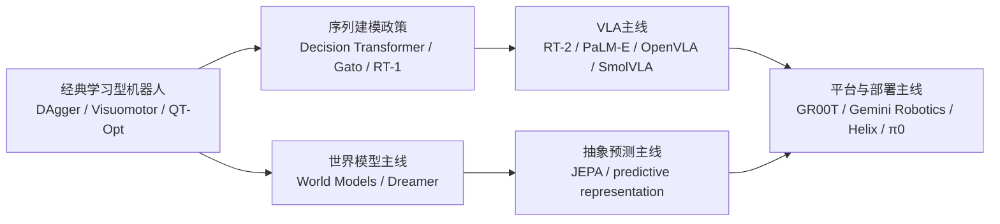

# 第十八部分 代表性论文与模型谱系梳理

长篇报告如果只在各章局部引用论文，很容易缺少全局脉络。因此，本部分的作用不是重复前文，而是建立一张可长期维护的谱系图：哪些路线从经典模仿学习和 RL 演化而来，哪些路线推动了 Transformer policy 与 VLA，哪些路线把世界模型与抽象预测推上前台，哪些是 2025-2026 年值得持续跟踪的新分支。

本章的一个核心目的，是把“论文列表”变成“研究地图”。也就是说，重要的不只是记住某篇论文做了什么，而是理解它在一条主线上的位置：它解决了哪个旧瓶颈，引入了什么新接口，又把问题重新推向了哪里。只有这样，这份报告后续每次增量更新时，新增论文才有机会被放回结构之中，而不是不断堆叠零散新名词。

## 85. 经典起点与过渡阶段

### 85.1 传统模仿学习与 RL 代表工作
如果从今天回看，这一节最重要的价值并不只是列出若干“早期经典”，而是把具身学习最顽固的底层约束重新摆到台面上。模仿学习与 RL 时代已经把几个问题暴露得非常清楚：示教分布与闭环执行分布天然错位，真实世界试错昂贵，奖励设计脆弱，恢复能力难学，失败样本往往比成功样本更能决定系统上限。后来的 VLA、通用策略和机器人基础模型并没有让这些问题消失，而只是用更大规模的数据工程、模型参数和训练基础设施重新包装了它们。

也因此，本节不应被当成“背景材料”读过就算。更准确的理解是：这一批工作定义了后续所有路线都绕不开的共用问题空间。若不先理解这些老问题，读者就很容易把今天某些模型的阶段性成功误判成结构性突破，而忽略它们仍然在和同一组约束持续搏斗。

把这组工作放在谱系起点，最重要的不是怀旧，而是提醒后文所有“新路线”都没有脱离这些早期问题设定：示教如何进入策略、回报如何驱动优化、真实世界试错为何昂贵、恢复能力为何难学。这一谱系奠定的是问题语言，而不只是若干旧算法名称。相关代表性论文可参见 [DAgger](https://proceedings.mlr.press/v15/ross11a.html)、[《End-to-End Training of Deep Visuomotor Policies》](https://arxiv.org/abs/1504.00702) 与 [QT-Opt](https://arxiv.org/abs/1806.10293)。

### 85.2 Transformer policy 的早期路线
这一谱系的重要意义，不只是“Transformer 也能做机器人”，而是它把机器人策略学习重新组织成统一序列接口问题。状态、图像、动作、回报乃至任务条件，都开始可以被放入同一时序建模框架中比较。这样一来，模仿学习、离线 RL 和多任务策略建模之间原本较分散的接口开始被重新统一。

Transformer 进入机器人后，重点不是简单替代循环网络，而是把状态、动作和历史上下文放进更一般的序列接口中。这条线的代表节点包括 [Decision Transformer：回报条件序列决策](https://arxiv.org/abs/2106.01345)、[Gato：通用多任务智能体](https://arxiv.org/abs/2205.06175) 与 [RT-1：机器人 Transformer 策略](https://arxiv.org/abs/2212.06817)。

这条线的真正后果，是为 VLA 与通用策略奠定了接口基础。没有这一步，后来的多模态机器人基础模型很难自然接上语言、视觉和动作的统一建模叙事。

### 85.3 世界模型与生成控制早期路线
这一条谱系真正值得强调的，不只是它在历史上更早提出了潜在动力学、想象式轨迹展开或基于模型的学习，而是它系统性地反驳了一个偷懒想法：机器人不可能永远只靠“观测到动作”的直接映射去解决所有问题。只要任务存在多步后果、昂贵试错、接触不确定性或长时程依赖，系统就会不断被迫引入某种“内部对未来的表示”。早期世界模型路线的重要性，正在于它把这种内部表示重新变成正当研究对象。

不过，早期世界模型工作的启发不应被误读为“后来的视频世界模型已经被早早证明可行”。更准确的说法是：它们证明了学习内部环境模型有潜在高回报，但也同时暴露了模型偏差、rollout 漂移和真实接触任务中误差快速累积的问题。后来的所有世界模型热潮，都是在继承同一个愿望，也在继承同一个老难题。

这一路线的早期工作之所以值得单列，是因为它较早回答了一个今天仍然关键的问题：机器人是否可以先学一个内部环境模型，再借此做策略优化或规划，而不必每次都在真实世界中昂贵试错。后来的视频世界模型、抽象预测与可控生成路线，很多都可以回溯到这里的思想源头。相关代表性论文可参见 [World Models](https://arxiv.org/abs/1803.10122) 与 [Dreamer](https://arxiv.org/abs/1912.01603)。

## 86. VLA 谱系

### 86.1 RT-1 / RT-2 / RT-X
这一组工作不应只被当作三篇论文，而应被视为同一条研究主线的连续推进：从多任务机器人 Transformer，到把互联网级视觉语言知识显式迁移到动作接口，再到跨平台数据组织与通才策略训练基础设施。它们共同回答的是一个核心问题：机器人动作建模能否像大模型那样，走向统一的多任务规模化训练接口。

若把这条路线的最小训练目标写出来，可以粗略表示为：

\[
\max_{\theta} \sum_t \log p_{\theta}(a_t \mid o_{\le t}, x_{\le t}, l)
\]

其中 \(o_{\le t}\) 是感知历史，\(x_{\le t}\) 是机器人状态历史，\(l\) 是语言或任务条件，\(a_t\) 则可能是离散动作标记、动作块或低层控制接口。这一写法的关键，在于它把“机器人策略学习”重写成了条件序列建模问题。

沿这条主线看，[RT-1：多任务机器人策略](https://arxiv.org/abs/2212.06817) 的贡献主要在于证明多任务 Transformer 可以在统一动作词表上吸收多任务真机示教；[RT-2：语义知识迁移到动作接口](https://arxiv.org/abs/2307.15818) 则进一步把互联网语义知识显式接入机器人动作接口，使“看懂世界”与“在世界里行动”开始共享一部分表征基础；到了 [Open X-Embodiment：跨机构多本体数据协作](https://arxiv.org/abs/2310.08864)，焦点又被推向数据层与平台层，即跨机构、跨本体的数据是否可以被组织成训练通才策略的公共基座。

这条谱系最值得保留的，不是某篇论文的性能数字，而是一条连续可观察的接口演化链：从单本体多任务，到语义知识迁移，再到多本体、多机构数据汇聚。后文凡是出现“通用 VLA”“基础模型机器人”“跨本体迁移”等叙事，几乎都能回接到这条链条。

### 86.2 PaLM-E
PaLM-E 的标志性价值，在于它更明确地展示了“把通用多模态语言模型接入具身感知与任务执行接口”的路线。它不是最纯粹的机器人策略模型，而更像一个把语言、视觉和机器人状态共同塞进大模型上下文中的桥梁型系统，因此在谱系中承担的是“接口扩张者”的角色。

如果用极简形式表达，它所推动的问题设定更接近：

\[
h_t = \mathrm{LM}_{\theta}\!\left([x^{\text{text}};\ x^{\text{vision}};\ x^{\text{state}}]\right)
\]

也就是说，机器人状态不再被看成必须由传统控制模块单独消化的内部变量，而是被纳入统一上下文，与文本和视觉一起交给大模型处理。[PaLM-E](https://arxiv.org/abs/2303.03378) 的历史意义，正在于它明确把“机器人状态进入大模型上下文”写成了一个正式问题，而不是工程拼接技巧。

从谱系角度看，这个改变的重要性甚至不亚于一次性能提升。它改变了后续研究者对具身多模态模型边界的想象，使得状态、任务和感知不再被默认拆成彼此孤立的系统部件。后来的许多 VLA、世界模型和任务规划接口工作，本质上都在继续回答 PaLM-E 打开的那个问题：哪些状态应该被语言模型消费，哪些又必须留在低层控制闭环里。

### 86.3 OpenVLA
在谱系里，OpenVLA 的价值主要体现在“把 VLA 从概念与演示，推进到更可审视的开放接口”。按照其论文表述，OpenVLA 采用约 7B 参数规模，并建立在接近 97 万条真实机器人示教轨迹之上，同时强调可以在消费级 GPU 上通过 LoRA 微调并复现主要实验 [OpenVLA](https://arxiv.org/abs/2406.09246)。这使它的重要性既在模型，也在方法学透明度。

对研究共同体而言，OpenVLA 的关键贡献并不是简单“做出一个开源 VLA”，而是把若干原本只存在于闭源系统中的核心问题重新拉回公共空间：训练样本长什么样、动作表示怎么定义、推理流程如何组织、评测口径如何设置、部署时需要暴露哪些接口。换句话说，它建立了后续路线比较的公共参考面。

因此，在长期维护谱系时，OpenVLA 这一节点的重要性不只来自模型本身，而来自它提供了一个对社区可见、可修改、可复审的坐标点。很多后续工作未必直接继承其全部设计，但会借它重新定义“一个 VLA 系统至少应公开哪些接口”，这对开源生态和研究复核都极其关键。

### 86.4 SmolVLA 与轻量路线
SmolVLA 与轻量路线值得单列，不只是因为参数更小，而是因为它把一个常被后置的问题提前到了研究主线里：若具身系统最终必须跑在功耗、时延和维护预算都受限的端侧环境，那么“缩小模型并尽量保住关键能力”就不是部署优化，而是模型路线本身的一部分。

这类路线通常同时压缩三个维度。第一是参数规模与推理路径长度，避免每次动作生成都依赖高昂前向计算；第二是输入输出接口复杂度，例如更紧凑地表达动作块或减少不必要的高分辨率模态；第三是训练与蒸馏方式，让小模型继承大模型学到的语义先验，而不是要求它从头吸收全部能力。轻量化若只做第一层而忽略后两层，往往会得到一个“更小但仍然不适合部署”的模型。

[SmolVLA](https://arxiv.org/abs/2506.01844) 的价值正在于此。它不是单纯把大模型裁小，而是把轻量部署、社区数据、异步推理栈和 Hugging Face 生态一起纳入设计目标。这说明“轻量化”已经从后处理技巧，变成了路线级问题设定。

因此，轻量路线不是“大模型路线的附属优化”，而是与“更大模型”并行存在的一条主线。只要真实部署持续受到端侧算力、热设计功耗和维护成本约束，轻量 VLA 就不会只是妥协方案，而会长期成为大规模可部署系统的核心候选。

## 87. 世界模型与 JEPA 谱系

### 87.1 视频世界模型
视频世界模型路线之所以在近两年如此醒目，一个核心原因是它把“预测未来”重新做成了高度可视化、跨学科都能直观看懂的研究对象。对机器人而言，这种表达有明显吸引力：如果模型能够根据当前观察、动作历史和任务条件生成未来视频，那么它似乎就有机会同时承担前瞻感知、风险评估、候选轨迹筛选和失败预警等多个角色。

但恰恰因为它可视化很强，也更容易掩盖真正的控制需求。机器人并不需要“看起来像真的未来”，而更需要“对行动成败有用的未来”。一个更接近机器人使用方式的抽象是：

\[
z_{t+1:t+H} = f_{\phi}(z_t,\ a_{t:t+H-1},\ g)
\]

这里 \(z\) 不一定是像素，也可以是潜状态、对象关系或可规划结构。关键问题不在于视频是否逼真，而在于这些未来表示能否帮助系统判断接触是否建立、碰撞是否会发生、动作是否会破坏后续操作空间。若回答不了这些问题，视频世界模型在具身闭环中的价值依然有限。

因此，本节讨论视频世界模型时，重点不应放在生成质量本身，而应放在它是否进入了真实决策接口。它在谱系中的位置，更像“开放世界未来表达能力的推进器”，而不是已经完成闭环落地的控制替代物。

### 87.2 抽象预测路线
抽象预测路线的重要性，在于它改变了“什么才值得预测”的答案。与逐像素重建不同，这一路线更强调预测对任务真正有用的结构，例如对象关系、接触阶段、拓扑变化、潜在状态迁移或高层语义约束。对机器人而言，这种转向尤其关键，因为机器人最终消费的不是好看的画面，而是足以支撑规划、约束检查和技能调用的可执行结构。

JEPA 及相关路线的核心思想，是不必重建全部像素，只需预测足够有用的抽象结构 [JEPA](https://arxiv.org/abs/2301.08243)。若写成极简形式，可以表示为：

\[
\hat z_{\text{target}} = g_{\phi}(z_{\text{context}})
\]

其中被预测的是“对任务有意义的表征”，而不是像素级未来。需要强调的是，JEPA 本身并不是机器人专用方法；这里把它纳入谱系，主要是因为它提供了一种方法论立场：对具身系统真正重要的，未必是把未来画得更真，而是把对任务、控制和预测有用的结构保留下来。

从工程视角看，抽象预测的优势也更明显。它更容易与任务规划器、技能库、约束求解器、安全监测器和状态机对接，因为这些模块本来就偏好结构化变量而不是原始像素。但其挑战同样不小：什么样的抽象才足够通用，如何保证抽象变量对真实接触后果敏感，以及如何避免学到“看似稳定却对控制无用”的潜空间，仍然是未解决的问题。

### 87.3 可控生成与规划结合路线
这一节最值得强调的一点是：可控生成真正改变的，不是生成模型“会不会画未来”，而是它开始尝试承担行动候选提议器的角色。系统不再只做一次前向传播直接给出动作，而更像是先生成若干可选轨迹、子目标或技能序列，再由约束检查、价值评估、碰撞检测或外部规则进行筛选。这种组织方式比纯端到端策略更接近许多真实机器人系统的工作逻辑。

若写成统一的选择形式，可以表示为：

\[
a^{*}_{t:t+H-1} =
\arg\max_{a_{t:t+H-1}}
U\!\left(f_{\phi}(z_t, a_{t:t+H-1}),\ g,\ \mathcal{C}\right)
\]

其中 \(f_{\phi}\) 给出未来表征或候选轨迹展开，\(U\) 则综合任务目标 \(g\) 与约束集合 \(\mathcal{C}\) 来做筛选。关键不在于生成本身，而在于生成接口是否能被价值函数、约束检查器和恢复逻辑稳定消费。

当然，生成与筛选的组合并不会自动带来可靠性。候选过多会导致搜索成本上升，候选过少又失去规划收益；而一旦筛选器本身带有偏差，系统还可能稳定偏好“看似分高、现实会失败”的解。也因此，这条谱系的长期潜力不只取决于生成模型本身，还取决于生成接口与评估接口能否同步成熟。

### 87.4 谱系分歧的根本问题
这些谱系持续分歧，根本不只是因为研究者偏好不同模型结构，而是因为它们默认的“主问题”并不相同。有的路线把核心难点定义为语义对齐，认为只要互联网级视觉语言知识能成功接到机器人动作接口上，能力上限就会迅速上升；有的路线把关键问题定义为接触与恢复，认为真正限制部署的是物理交互中的长尾异常；还有的路线把焦点放在系统组织，认为数据采集、仿真、评测与运维闭环才是决定谁能长期迭代的关键。

换言之，谱系分歧本质上对应不同目标函数。粗略地写，可以表示成：

\[
\min_\theta \mathcal{L}=
\lambda_1 \mathcal{L}_{\text{semantic}}
+ \lambda_2 \mathcal{L}_{\text{control}}
+ \lambda_3 \mathcal{L}_{\text{recovery}}
+ \lambda_4 \mathcal{L}_{\text{deployment}}
\]

不同路线之间并不是只在求解器或骨干结构上不同，而是连 \(\lambda_i\) 的权重都不同。这也是为什么很多路线很难在单一 benchmark 上得出“谁统一胜出”的结论。

对整本报告的维护来说，这一节很关键，因为它提醒我们后续版本更新时不应把所有新工作机械塞进同一条时间轴里。更好的做法，是先判断新工作究竟强化了哪一类目标函数，再把它放回对应谱系。只有把“它是为表达、为预测、为规划还是为控制服务”写清楚，谱系章节才不会随着新论文累积而失控。

## 88. 2025-2026 关键增量工作

### 88.1 GR00T N1
在谱系梳理里，GR00T N1 更适合被放在“平台化机器人基础模型”坐标中理解，而不是只看作某个单点模型。它背后捆绑了仿真、合成数据、机器人本体接口与后续部署叙事，因此其研究意义不仅来自模型能力，也来自它试图重新组织整条开发链路。[GR00T N1](https://arxiv.org/abs/2503.14734) 于 2025-03-19 在 arXiv 发布，其论文摘要就明确强调了异构数据整合、双系统架构和面向人形的通用自治。

对这条路线，更值得追问的不是“它是不是又一个大模型”，而是三件事。第一，它的输入输出接口是否真的适合跨本体复用，而不是仍隐含大量特定机器人先验。第二，它是否建立了足够可迁移的数据与评测语言，使更多团队可以围绕同一栈协作。第三，它在端侧部署、恢复和监控上究竟回答了多少问题，而不是只在训练与演示层面给出愿景。

因此，GR00T N1 的谱系意义在于：平台型公司开始更主动地定义“机器人基础设施层”的边界，而不只是发布单点模型。对行业分析来说，这通常意味着竞争重心正在从“谁有更强单点模型”，转向“谁能把模型、数据、仿真与本体接口组织成默认工作流节点”。

### 88.2 Gemini Robotics / On-Device
把 Gemini Robotics / On-Device 单列出来很重要，因为它代表的不只是“更强模型”，还代表另一条趋势：高能力模型是否能够进一步压缩、拆层或重组，进入更贴近端侧与现场的运行模式。这条路线与纯云端大模型叙事并不完全相同。

Google DeepMind 在 2025-03-12 发布 [《Gemini Robotics》官方博客](https://deepmind.google/discover/blog/gemini-robotics-brings-ai-into-the-physical-world/)，把其机器人能力概括为通用性、交互性与灵巧性；又在 2025-06-24 发布 [《Gemini Robotics On-Device》官方博客](https://deepmind.google/discover/blog/gemini-robotics-on-device-brings-ai-to-local-robotic-devices/)，明确把本地运行、低时延与少量样本适配提到前台。这个时间顺序本身就很关键：先证明“通用多模态模型能进入物理世界”，再证明“这种能力必须被重新组织成现场可运行形态”。

从谱系意义看，这条路线把通用多模态模型阵营与机器人问题设定更直接连接起来，同时把端侧约束显式提到前台。这意味着“通用模型进入物理世界”不再只是概念叙事，而开始变成接口与部署问题：哪些语义能力该留在高层，哪些动作接口必须局部执行，哪些能力必须为低时延牺牲通用性。

### 88.3 Figure Helix
Figure Helix 在谱系中的意义，更适合理解为“企业级系统整合路线的公开化片段”。它提供的往往不是完整开源方法，而是一个观察窗口，让我们看到企业如何把语言、规划、技能执行和本体系统耦合到一起。

[Figure Helix](https://www.figure.ai/news/helix) 于 2025-02-20 公布，其最值得记录的不是营销叙事，而是公开给出了高低频双系统结构：高层视觉语言模型以约 7-9 Hz 运行，低层本体控制以 200 Hz 闭环运行，并且强调使用少量车载 GPU、整身上半身控制和数百小时高质量遥操作数据。这使 Helix 不只是“公司新闻”，而是一个很明确的系统架构样本。

从谱系位置上看，Helix 的关键价值在于：它把高层语义推理与低层快速闭环之间的接口公开讲清楚了。这使它成为观察“高低频分层是否会成为产业主流组织方式”的重要样本，而不只是又一个企业演示案例。

### 88.4 Physical Intelligence π0 路线
Physical Intelligence 的 π0 路线值得单列，是因为它代表了另一类更强调机器人基础模型化、数据组织和系统路线整合的方向。其价值不只在单篇结果，而在于它试图重新回答“通用机器人能力应如何被组织成可扩展训练对象”。[π0](https://www.pi.website/blog/pi0) 于 2024-10-31 发布，虽然时间早于本节聚焦的 2025-2026，但它到 2025-2026 仍持续影响行业对“机器人基础模型”叙事的组织方式，因此这里必须保留它作为关键参照点。

从技术接口看，这类路线更愿意把机器人控制写成统一的条件动作建模对象：

\[
a_{t:t+H} \sim p_{\theta}(\cdot \mid o_{\le t}, x_{\le t}, l)
\]

不同之处在于，它更强调跨任务、跨本体和跨数据形态的统一组织，而不只是某个单场景最优控制器。

这类路线在谱系中的作用，还在于它们会重新命名问题并重组注意力。命名方式一旦变化，研究资源配置、企业叙事和资本理解问题的框架也会随之变化。因此，哪怕技术内核与既有路线连续，这类“重新命名问题”的工作也值得额外标注，因为它们会影响后续行业如何理解同一类能力边界。

### 88.5 2026 年细分场景 VLA 论文
把 2026 年大量细分场景 VLA 工作单独列出很有必要，因为它们共同说明了一点：行业并没有简单收敛到“一个通用 VLA 吞掉一切”，而是在动态场景、移动操作、可变形操作、端侧运行时与低成本平台上继续分化出更务实的路线。谱系梳理若不把这些分支写出来，就会高估统一范式的收敛程度。

到 2026 年上半年，这类工作至少已经沿四个方向明确分叉：

1. 动态场景与连续控制方向，例如 [DynamicVLA](https://arxiv.org/abs/2605.31286)，重点解决动态物体、流式动作生成与长时连续推理。
2. 移动操作与规划耦合方向，例如 [UniPlan](https://arxiv.org/abs/2604.15049)，显式把符号规划、VLM 与 VLA 组合到移动操作工作流里。
3. 可变形与复杂接触方向，例如 [DeMaVLA](https://arxiv.org/abs/2602.19201)，把可变形物体操作与 DAgger 式持续纠偏显式拉回主线。
4. 推理运行时与部署系统方向，例如 [Embodied.cpp](https://arxiv.org/abs/2607.00556)，重点不在再造新模型，而在把具身基础模型真正跑进受限硬件与统一运行时。

这些细分场景工作在谱系里像“压力测试节点”。它们不断把“通用叙事”拉回具体本体、任务、时延和部署限制，使我们能够更早看清不同路线在真实系统条件下的边界究竟在哪里。后续新增论文时，最关键的不是它是不是又用了 VLA 名词，而是它到底在解决哪类真实约束。

## 89. 谱系比较框架

### 89.1 输入输出范式
做跨论文比较时，输入输出范式应该首先被拉出来，因为它决定了“这些模型到底是不是在解决同一类问题”。有的模型输入图像加语言、输出单步动作；有的输入长上下文视频和状态，输出动作块；有的输入潜状态与目标，输出规划候选。若不先统一这个维度，后续比较训练规模和成功率往往没有意义。

一个更适合长期维护的做法，是把“输入输出卡”固定写成五元组：

\[
\text{IOCard}=(\text{obs window},\ \text{state},\ \text{language},\ \text{action granularity},\ \text{control rate})
\]

这样做的价值在于，它迫使维护者回答：输入是否包含历史窗口、是否包含本体状态、输出是单步还是动作块、输出是低层控制量还是中层技能表示、系统默认部署在什么控制频率上。只有把这些接口细节记清楚，后续才有可能判断两篇论文究竟是在同一问题上竞争，还是仅仅表面形式相似。

本章后续维护时，建议直接配合 [18-论文谱系字段表](D:/Projects/embodied-intelligence-report/docs/report/current/tables/18-论文谱系字段表.md) 使用。先填字段，再写评价，比先写印象式评论更能保持跨版本口径稳定。

### 89.2 数据来源
数据来源必须单独比较，因为它直接决定结论能说明什么。示教数据、遥操作数据、互联网视频、仿真数据、跨平台混合数据和企业闭源现场数据，背后对应的是完全不同的接口假设与泛化边界。若不把这些差异写出来，很多横向对比都会失真。

一个更实用的做法，是把数据来源拆成“来源类型”和“组织方式”两层。来源类型回答数据来自真机、遥操作、仿真还是互联网；组织方式则回答这些数据是单平台专用、跨平台对齐、带失败样本回流，还是经过强人工清洗。很多论文表面上都写“多源数据训练”，但决定能力边界的，常常正是第二层。

因此，数据来源这一列不应只是背景信息，而应被视为解释变量。很多“模型 A 比模型 B 强”的结论，若不放回数据来源与采数组织方式里看，往往会被高估甚至误读。对具身系统而言，数据组织方式本身往往就是系统设计的一部分。

### 89.3 泛化目标
泛化目标同样必须单列，因为不同论文口中的“泛化”常常不是同一件事。有的指新物体，有的指新语言描述，有的指新布局，有的指新任务组合，有的甚至指新机器人本体。报告若不把这些目标拆开，就很容易把不同强度的结论混为一谈。

为了让这类比较在后续版本中不失真，一个更实用的办法是把泛化目标固定拆成五列：语义泛化、对象泛化、环境泛化、时序/恢复泛化、跨本体泛化。这样即便不同论文都使用了同一个 `generalization` 术语，我们也仍能看清它们到底是在同一维度上竞争，还是只是在共享一个容易被高估的口号。

这一点对阅读机器人论文尤其关键，因为“泛化”在该领域常常被过度口号化。对读者而言，更有价值的做法不是记住某篇论文声称“实现了泛化”，而是追问它究竟在哪个变量上外推：是换了未见物体但仍在相同桌面与相同夹爪上，还是换了相机布局、换了任务组合、甚至换了机器人本体。前者说明的是局部鲁棒性，后者才更接近平台级迁移。

### 89.4 开源程度
开源程度在机器人领域之所以应被单独列为比较维度，不只是因为“能不能复现”重要，更因为它直接决定一条路线能否形成公共接口。论文级公开只能帮助外界理解主张，权重级公开只能帮助感知能力边界，而训练代码、数据协议、评测脚本、部署接口和社区维护机制的开放，才真正有机会把单篇工作变成后续研究和工程的共同底座。

更严格地说，开源程度至少可以拆成五层。第一层是论文与项目页公开，解决“外界能否知道你做了什么”；第二层是模型权重公开，解决“外界能否直接试用能力边界”；第三层是训练与推理代码公开，解决“外界能否重建方法”；第四层是数据协议、评测脚本和环境配置公开，解决“外界能否公平比较”；第五层是维护机制和 issue 响应，解决“这条路线是否真的在形成公共生态”。

因此，开源程度不是“开源/闭源”二元判断，而更适合理解为一个分层变量。对学习与研究来说，真正能塑造社区演进的，往往不是单一权重是否开出，而是能否形成一套被后来者继续调用和修改的公共工作流。

### 89.5 工程可部署性
工程可部署性之所以要单列，是因为很多论文方法在研究口径下成立，但并没有回答时延、恢复、监控、接管、安全冗余和运维这些部署问题。谱系梳理若不把这一维度显式写出来，就很容易把“研究亮点”误读成“可交付能力”。

一个实用比较框架可以至少看四点：

1. 推理时延与部署形态。
2. 是否显式讨论恢复与安全。
3. 是否依赖高度理想化本体或场景。
4. 是否公开足够接口供外界检验。

若把这一维写得更抽象一些，可以表示成：

\[
\text{Deployability}=f(\text{latency},\ \text{recoverability},\ \text{observability},\ \text{safety margin},\ \text{operator dependence})
\]

这当然不是论文里的真实打分公式，但它提醒我们：工程可部署性并不等于“碰过真机”。真机演示只是进入问题空间的开始，而不是可部署性的充分证据。真正更接近系统部件的工作，通常会开始显式回答时延预算、恢复逻辑、安全冗余、日志接口和部署边界；若这些问题仍被放在系统外部，那么它即使有精彩真机视频，也仍更适合被理解为研究部件而不是部署部件。

### 89.6 一个建议的长期维护方法
对论文谱系的长期维护，最忌讳的不是漏掉几篇新论文，而是随着时间推移失去统一比较口径。若每次更新只补一串新名字，最终读者只会得到越来越长的清单，而无法判断哪些变化真正改写了路线格局，哪些只是对既有范式的局部增强。

因此，后续版本更新时，建议固定采用“先填卡、再写判断”的顺序：

1. 先填输入输出卡、数据来源卡、泛化目标卡、开源层级卡、部署假设卡。
2. 再判断该工作更接近 VLA、世界模型、规划接口、运行时系统还是平台化基础设施。
3. 最后才给出“主线增强”“局部优化”或“叙事重命名节点”的章节级判断。

只要长期坚持这个顺序，谱系章节就不会随着新增论文而重新退化成新闻清单。它会持续保留一条更重要的主线：不是“谁又发了什么”，而是“哪些问题设定、接口和组织方式正在稳定下来”。

## 图 18-1 论文谱系时间线图

源文件：`assets/diagrams/18-论文谱系时间线图.mmd`

## 谱系维护补充
本章后续最值得固定成正式资产的，是完整论文谱系时间线与 `VLA / 世界模型 / 轻量部署` 三条谱系对照表。前者帮助读者追踪主线演化，后者帮助读者避免把不同目标函数、不同部署假设、不同研究对象误读成同一条线性升级路径。

这类补充之所以重要，是因为论文谱系章节的价值不在“列全”，而在“持续提供稳定比较框架”。

在当前版本中，`图 18-1 论文谱系时间线图` 已承担主时间线职责；`表 18-1 论文谱系字段表` 与 [18-论文谱系时间线表](D:/Projects/embodied-intelligence-report/docs/report/current/tables/18-论文谱系时间线表.md) 则共同承担结构化记录与时间轴维护职责。

`VLA / 世界模型 / 轻量部署` 三条主线之所以值得并行梳理，是因为它们分别对应“统一接口能力”“未来后果建模能力”与“真实部署约束吸收能力”三种不同的系统目标。把这些论文放回同一谱系里比较，可以减少“模型名字不同就像是不同代际”的错觉，也能帮助读者识别哪些工作只是改进单点性能，哪些工作真正推动了系统结构变化。

如果后续要做更严格的增量维护，本章建议优先同时配合两张结构化表来读：一张是字段表 [18-论文谱系字段表](D:/Projects/embodied-intelligence-report/docs/report/current/tables/18-论文谱系字段表.md)，用于固定“怎么记录一篇论文”；另一张是 [18-论文谱系时间线表](D:/Projects/embodied-intelligence-report/docs/report/current/tables/18-论文谱系时间线表.md)，用于固定“怎么把论文放回年份与主线里”。前者解决记录口径，后者解决时间结构；两者合在一起，才能真正支撑后续季度增量更新。

为了维持这一章的长期可更新性，新增高价值论文更适合先沉淀为 `research/papers/` 下的论文卡，再回写正文判断。这样做的意义，不只是资料整理方便，更在于先把方法、实验边界、贡献与局限拆解清楚，再决定它应被放回哪条技术主线中。目前可直接复用的首批卡片包括：

1. [RT-1 论文卡](D:/Projects/embodied-intelligence-report/research/papers/RT-1-论文卡-v0.0.md)
2. [RT-2 论文卡](D:/Projects/embodied-intelligence-report/research/papers/RT-2-论文卡-v0.0.md)
3. [PaLM-E 论文卡](D:/Projects/embodied-intelligence-report/research/papers/PaLM-E-论文卡-v0.0.md)
4. [OpenVLA 论文卡](D:/Projects/embodied-intelligence-report/research/papers/OpenVLA-论文卡-v0.0.md)
5. [SayCan 论文卡](D:/Projects/embodied-intelligence-report/research/papers/SayCan-论文卡-v0.0.md)
6. [Code as Policies 论文卡](D:/Projects/embodied-intelligence-report/research/papers/Code-as-Policies-论文卡-v0.0.md)
7. [DreamerV3 论文卡](D:/Projects/embodied-intelligence-report/research/papers/DreamerV3-论文卡-v0.0.md)
8. [Diffusion Policy 论文卡](D:/Projects/embodied-intelligence-report/research/papers/Diffusion-Policy-论文卡-v0.0.md)
9. [V-JEPA 论文卡](D:/Projects/embodied-intelligence-report/research/papers/V-JEPA-论文卡-v0.0.md)
10. [GR00T N1 论文卡](D:/Projects/embodied-intelligence-report/research/papers/GR00T-N1-论文卡-v0.0.md)

如果后续更新已经不再是“补一两篇论文”，而是需要批量判断整条路线的变化，则建议先读路线清单，再回到单篇卡：

1. [VLA 论文清单](D:/Projects/embodied-intelligence-report/research/papers/VLA-论文清单-v0.0.md)
2. [世界模型论文清单](D:/Projects/embodied-intelligence-report/research/papers/世界模型-论文清单-v0.0.md)
3. [规划与具身推理论文清单](D:/Projects/embodied-intelligence-report/research/papers/规划与具身推理-论文清单-v0.0.md)
4. [生成式动作与策略论文清单](D:/Projects/embodied-intelligence-report/research/papers/生成式动作与策略-论文清单-v0.0.md)
5. [硬件、部署与系统工程论文清单](D:/Projects/embodied-intelligence-report/research/papers/硬件、部署与系统工程-论文清单-v0.0.md)
6. [仿真、评测与基础设施论文清单](D:/Projects/embodied-intelligence-report/research/papers/仿真、评测与基础设施-论文清单-v0.0.md)
7. [开源生态与工具链论文清单](D:/Projects/embodied-intelligence-report/research/papers/开源生态与工具链-论文清单-v0.0.md)

## 表 18-1 论文谱系字段表

见：[18-论文谱系字段表](D:/Projects/embodied-intelligence-report/docs/report/current/tables/18-论文谱系字段表.md)

## 表 18-2 论文谱系时间线表

见：[18-论文谱系时间线表](D:/Projects/embodied-intelligence-report/docs/report/current/tables/18-论文谱系时间线表.md)

这两张表分别解决“怎么记一篇论文”和“怎么把它放回主线时间结构”两个问题，是本章后续版本维护时比单纯补段落更重要的稳定资产。
