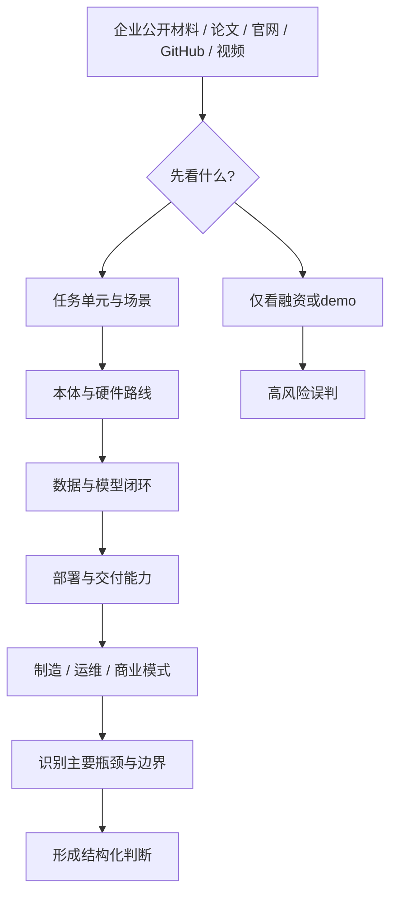

# 第二十部分 企业分析框架

在具身智能领域，企业信息极易沦为新闻流和 demo 流。如果没有统一分析模板，就很容易被融资额、宣传片和单次演示带偏，而忽略真正决定长期价值的技术与交付变量。因此，本部分的职责，是先建立一个稳定的企业分析框架，再在后文具体公司章节中重复使用。

这一框架的必要性在 2024-2026 年尤为突出。Figure、Physical Intelligence、Apptronik、Agility、1X、Sanctuary AI、特斯拉 Optimus、优必选、宇树、智元等公司分别站在“通用本体”“VLA/基础模型”“工业交付”“物流场景”“人形平台”“远程接管”和“中国制造链协同”等不同位置上。若没有统一模板，很容易把风格完全不同的公司放在同一维度上比较，最后只剩下谁更会讲故事、谁视频更好看，而看不见底层变量。[Figure](https://www.figure.ai/)、[Physical Intelligence](https://www.physicalintelligence.company/)、[Agility Robotics](https://agilityrobotics.com/)、[UBTECH](https://www.ubtrobot.com/)

更进一步说，企业分析框架的真正意义不是“做成一张表”，而是把企业研究从新闻消费转成结构化判断。报告后续任何一版更新，只要能坚持使用同一套问题集，就能够积累跨时间、跨公司、跨路线的比较能力，而不是每次都重新被新的品牌叙事带走。

## 94. 为什么企业需要统一分析模板

### 94.1 防止沦为新闻罗列

企业分析最常见的失效方式，就是把连续发生的融资、发布会、合作新闻和 demo 视频顺次堆进报告，最后得到一份“信息很多但判断很弱”的时间流。之所以需要专门强调这一点，是因为具身行业本身就处在高波动、高叙事密度阶段，如果没有稳定框架，研究者很容易在更新过程中被最新事件牵着走，而丢失对企业长期能力结构的判断。

更稳健的做法，是把任何新增新闻都强制回写到既定分析维度中，例如它究竟改变了数据获取、系统集成、制造交付、客户进入还是资本耐心。只有当事件真正改变其中某一条能力链条时，它才值得进入正文判断；否则，它更适合作为跟踪日志而不是结构性结论。这个规则看似保守，但正是防止企业章节退化成“资讯摘要”的关键。
企业分析框架首先要解决的，就是避免把研究写成“按时间顺序堆新闻”。新闻罗列最大的问题不只是冗长，而是它会把高频曝光误当作高价值进展，把单次演示误当作能力跃迁。一个稳定框架的意义，在于无论企业发了多少视频、融资稿和发布会材料，我们都始终用同一组问题去过滤信息。

更具体地说，每条企业信息至少都应被追问三件事：它说明的是能力、接口、落地还是资本信号；它是一次性展示还是可重复趋势；它对应的证据强度来自论文、开源、客户部署还是市场宣传。只有把这三层拆开，企业研究才不会被节奏带着走。
企业分析之所以极易滑向新闻罗列，是因为外部公开信息天然偏向“融资、合作、发布、演示”这些传播友好事件，而真正决定公司位置的底层变量反而更难直接被看见，例如数据闭环是否真实建立、现场部署是否持续、失败恢复是否被系统性吸收、供应链是否开始收敛。统一模板的价值，就在于强迫分析从传播事件退回到系统变量，而不是被舆论节奏牵着走。

没有统一框架，企业章节往往会退化为时间线式材料堆叠，难以横向比较。

因此，这一章最重要的产出并不是“这次列了哪些公司”，而是留下了一套之后每个季度都能继续用的问题集。后续企业更新若偏离这套问题集，章节质量就会迅速回落到新闻摘要层。

### 94.2 便于横向比较
横向比较的关键，不是给所有企业排一个简单名次，而是让不同企业在相同维度下可被并列阅读。例如同样做人形机器人，有的公司强在本体与控制，有的强在数据与模型，有的强在场景集成与交付，有的强在融资与生态绑定。如果没有统一维度，报告很容易退化成“每家公司都看起来很厉害，但彼此很难比较”。

因此，框架至少应固定住若干横向维度：团队背景、技术路线、数据与模型、本体与系统能力、目标场景、商业路径、资本与合作、风险与局限。之后每个公司都沿这几条轴展开，才能真正形成可比较材料。
横向比较真正困难的地方，在于不同公司往往根本不在同一问题设定里竞争。有的公司卖的是平台叙事，有的卖的是场景交付，有的卖的是模型接口能力，有的卖的是本体制造与供应链组织。如果不先拆成共同维度，比较就会沦为“谁讲得更大、谁看起来更通用”。统一模板的作用，不是消除差异，而是把差异压回可以被解释的位置。

同一分析模板可以迫使报告不断问相同问题：本体是什么、数据从哪里来、模型如何训练、部署在哪些场景、交付能力如何。

目前这套模板已经落成表格版本，见 [20-企业统一分析模板](D:/Projects/embodied-intelligence-report/docs/report/current/tables/20-企业统一分析模板.md)。后续版本若要做季度更新，可直接配合 [20-企业季度跟踪表模板](D:/Projects/embodied-intelligence-report/docs/report/current/tables/20-企业季度跟踪表模板.md) 使用。

### 94.3 便于后续版本更新
企业分析框架若不能服务后续版本更新，它就只是一份一次性阅读提纲，而不是长期研究工具。一个合格的模板，必须让我们在数月后面对新增论文、融资、客户、事故、合作与产品发布时，能够把新信息直接插回既有维度，而不是整章重写。换句话说，模板的价值不仅在于当下读起来整齐，更在于未来是否支持增量维护。

这要求框架把“长期稳定维度”和“短期变动信号”明确分开。前者包括技术路线、本体形态、主要场景、组织出身和商业模式；后者包括新版本模型、客户试点、季度融资、关键人变动与新演示。只有把两类信息分层存放，后续版本才可能回答三个更重要的问题：哪些事实变了，哪些判断没变，哪些判断需要修正。

因此，本章模板本质上也是版本控制模板。它让企业研究从“每次重写一篇简介”转成“沿同一问题集持续积累判断”。这对本项目尤其关键，因为后续企业章节数量会持续增长，若没有稳定模板，整书很快会被新资讯冲散结构。
企业章节还必须服务于后续版本维护。一个好的结构不是只对当前阅读顺手，而是能在几个月后行业变化时，快速把新增论文、产品、客户、融资和事故插回原有框架中，而不必整章重写。

也就是说，企业框架不仅是阅读工具，还是版本化维护工具。它要求我们把“长期稳定维度”和“短期变化信号”分开放置：前者例如技术路线、本体形态、主要场景；后者例如最新产品发布、合作进展、融资事件和关键人才变动。
从版本维护角度看，这一点尤其关键。只要模板稳定，后续更新就可以把“哪些事实变了、哪些判断没变、哪些判断需要修正”分开记录，而不是每次新开一轮研究都把企业重新写成一篇简介。这使报告能够逐渐积累一种跨时间的判断连续性，而不是不断被新一轮宣传材料刷新记忆。

有模板，后续版本就能按相同结构增量更新，而不是每次重写企业画像。从版本维护角度看，企业分析框架也是报告长期可更新性的关键支点。它允许后续版本只替换“事实层”和“判断层”中的局部内容，而保留相同问题集，从而实现跨版本对照。

## 95. 企业统一分析维度

### 95.1 团队背景

团队背景之所以应被列为第一层，不是因为创始人履历天然决定成败，而是因为它往往提前暴露了公司最可能形成优势和最可能忽视的问题。来自自动驾驶、控制和机器人学背景的团队，通常更重系统安全、闭环与工程纪律；来自大模型或互联网 AI 背景的团队，往往更擅长统一接口、数据组织和平台叙事；来自制造或工业自动化背景的团队，则更可能在交付、成本和现场适配上走得更稳。

因此，阅读团队背景时最不该做的，是停留在“名校、名企、明星履历”的表层印象。真正值得追问的是：这支团队过去成功解决过哪一类复杂问题；它的知识结构是否覆盖了本体、数据、模型、部署与交付之间的关键断点；以及它是否存在明显的结构性盲区。例如强模型团队是否低估硬件与现场维护，强本体团队是否低估数据工程与持续学习。这些问题比头衔本身更接近企业未来路径。
团队背景不应只写创始人履历，而应回答“这家公司最初是从什么能力起家的”。控制、自动驾驶、计算机视觉、硬件制造、工业自动化、云平台或消费电子出身，会直接影响其早期技术路径、数据获取方式和商业切入点。

一个实用的读法是：团队背景往往不是花边信息，而是企业早期能力边界的线索。例如自动驾驶背景更容易延伸到感知栈和数据闭环，工业自动化背景更容易延伸到场景集成与客户交付，消费电子背景则更可能在成本工程和量产链条上占优。
团队背景之所以重要，不是为了满足公司介绍的完整性，而是因为它往往预示了路线的初始偏置。来自自动驾驶、工业自动化、消费电子、通用大模型、学术实验室或互联网平台的团队，会天然带着不同的问题拆解方式、风险偏好和工程优先级。理解这个出发点，往往能更早解释公司为何强调某类能力、忽略某类约束，以及其后续能否顺利跨越原有能力圈。

看创始人与核心团队是来自学术、工业自动化、自动驾驶、大模型公司还是消费电子，这往往会直接影响其技术与产品路径。

这一维度的重要性还在于，它通常能解释企业为何会优先解决某些问题、忽略另一些问题。团队背景不是花边信息，而往往是路线偏置最早也最稳定的来源之一。

### 95.2 技术路线

技术路线这一项的核心，不是给公司贴上“做 VLA”“做人形”“做世界模型”之类标签，而是判断它把哪一层能力当作主抓手。有人把通用模型与接口视为第一性问题，有人把本体与执行器视为瓶颈，有人把数据闭环与部署回流视为真正壁垒。表面上都在做具身智能，实质上是在押注完全不同的主矛盾。

因此，技术路线分析应该至少回答三个问题。第一，公司把系统上限主要押在哪一层。第二，这条路线最依赖哪些外部条件，例如大算力、海量示教、特定本体或特定场景。第三，一旦这些条件不成立，路线会以什么方式失效。只有把路线与依赖条件、失效方式一起写出来，技术分析才不会退化成口号归类。

技术路线这一栏最容易被企业材料中的高频词误导。很多公司都会说自己在做人形、VLA、世界模型、端到端或基础模型，但这些标签本身并不足以说明系统究竟如何组织输入、动作接口、数据闭环和部署逻辑。若不继续追问技术结构，路线描述就会停留在宣传层。

因此，这一维度真正该记录的，不是公司用了哪些热词，而是它到底把智能放在系统的哪一层：高层任务接口、中层技能拼接、低层动作生成，还是横跨多层的统一模型。只有把这些位置写清，路线比较才真正有意义。
技术路线章节应至少回答四个问题：该公司是否强调端到端还是模块化；是否把大模型放在高层还是直接放在动作层；是否强调仿真、遥操作、世界模型或 VLA；其系统更像研究原型、平台型基础设施，还是面向固定场景的产品栈。

如果把企业路线抽象成接口图，常见差异主要出现在三处：输入是什么，动作接口是什么，低层是否保留强技能或控制器。把这几点写清楚，往往比泛泛说“公司采用大模型路线”更有信息量。

看其更偏人形、本体平台、VLA、系统集成、仿真基础设施还是场景专用解决方案。

### 95.3 数据与模型能力
企业的数据与模型能力，不能只停留在“有没有 foundation model”“有没有数据闭环”这类口号式描述，而要继续追问两者之间是否形成了可放大的耦合关系。公司究竟依赖公开多模态先验、遥操作示教、真实部署回流、仿真合成，还是多源混合；模型究竟服务于高层任务接口、技能调度、低层动作生成，还是更多停留在演示层。

更细一点，可以把所谓“数据与模型能力”拆成四个层次来判断。第一层是数据获取能力，即企业是否能够以可持续成本采集到高价值样本，而不是只靠一次性 demo 数据。第二层是数据组织能力，即是否具备标注规范、失败回放、质量筛选和跨任务复用机制。第三层是模型吸收能力，即这些数据究竟能否转化为更强的泛化、恢复或效率表现，而不是仅提升同分布指标。第四层是部署回流能力，即模型上线后产生的新数据是否还能重新进入训练与验证闭环。

只有当这四层形成正反馈时，数据与模型才真正构成企业壁垒。否则就会出现两种常见错觉：一种是“有很多机器人在跑，所以一定有数据优势”，但这些数据并未被结构化整理；另一种是“发布了大模型，所以模型能力一定领先”，但模型并未深度嵌入执行链路。报告在评估企业时，应当特别警惕这两类叙事捷径。

真正值得识别的是：企业是否具备把数据持续转化为模型改进、再把模型改进稳定反馈回部署表现的能力。若没有这条闭环，所谓“模型能力强”很可能只是阶段性亮点，而不是持续优势。反过来，即使模型名词不够响亮，只要数据回流、失败吸收和任务重训机制足够扎实，也可能形成更耐久的竞争力。

因此，这一维度在后续企业分析里建议至少记录五项：数据来源结构、数据回流频率、训练对象层级、是否覆盖失败样本、模型更新是否进入真实执行链路。只有这几项被写清楚，“数据与模型能力”才不是抽象标签，而是可比较变量。

企业的数据与模型能力，不应只看“有没有大模型”或“有没有数据闭环”这类口号式表述，而应继续追问这两者之间是否形成了真正可放大的耦合关系。公司究竟是依赖公开视频先验、遥操作示教、真实部署回流、仿真合成，还是多源混合？模型究竟服务于高层任务接口、技能调用、低层动作生成，还是更多停留在展示层？

也就是说，这一维度真正想识别的是：企业是否具备把数据持续转化为模型改进、再把模型改进持续反馈回部署表现的能力。若没有这条闭环，所谓“模型能力强”很可能只是一时亮点，而不是持续优势。
这一维度要看的，不只是“有没有模型”，而是数据闭环是否真实存在。具体可以追问：公司靠什么采数据，是真机日志、遥操作示教、仿真合成还是外部多模态数据；训练对象是技能策略、VLA、世界模型还是混合系统；模型更新是否看得出和部署反馈形成闭环。
这一维度不应只看“有没有大模型”或“有没有数据”，而要看两者是否形成闭环。公司是依赖公开数据、遥操作示教、现场日志回流，还是仿真合成与人工标注混合？模型是作为宣传层能力展示，还是已经进入真实执行链条？很多企业在这一维度最容易出现错觉：看起来模型很强，但没有足够真实闭环数据支撑；或者有不少现场数据，却缺乏统一表示层把数据资产真正放大。

看其是否掌握大规模真机数据、遥操作体系、仿真数据生成能力、foundation model 能力或特定任务闭环。

### 95.4 硬件与系统能力
硬件与系统能力必须单列，是因为具身企业最终交付的不是一个孤立模型，而是带本体、执行器、传感器、控制栈、中间件与运维边界的完整系统。若企业只在高层智能上发力，却无法控制本体一致性、执行器表现、现场标定和版本回滚，它的能力上限就很难在真实场景里兑现。

更有意义的追问不是“它有没有自己的机器人”，而是“它掌握了身体与智能之间哪些关键耦合位置”。哪些部件自研，哪些接口可控，哪些系统性风险由自己承担，哪些仍依赖外部平台，这些才决定企业究竟是展示型团队、集成型团队，还是具备系统主导权的产品团队。

这也是区分“模型公司借机器人做展示”和“真正具身公司”的关键维度之一。只要企业开始认真承担本体一致性、维护便利性、控制可靠性和现场部署摩擦，它面对的问题就从单点算法问题跃迁为系统工程问题。虽然这会拖慢节奏、增加成本，但也更接近真实交付能力。

硬件与系统能力之所以必须单列，是因为具身企业最终不只是交付一个模型，而是在交付一个带身体、带传感器、带控制栈、带运维边界的完整系统。若公司只在高层智能上用力，却无法控制本体一致性、执行器表现、中间件稳定性和现场部署摩擦，它的能力上限就很难真正兑现。

因此，看硬件与系统能力时，更有意义的不是问“它有没有自己造机器人”，而是问它是否真正掌握了身体与智能之间的关键耦合位置：哪些部件自己定义，哪些接口自己控制，哪些系统风险自己承担。只有这样，这一维度才不会退化成“有无本体”的表面判断。
硬件与系统能力这一栏的重点，是判断企业到底是在“借用通用平台堆模型”，还是确实掌握了本体设计、执行器、传感、控制和系统集成能力。很多企业看起来都能做演示，但真正决定持续交付能力的，往往是本体一致性、维护便利性、控制可靠性和现场适配能力。
这也是区分“模型公司借机器人做展示”和“真正具身公司”的关键维度之一。只要企业开始控制本体、执行器、传感配置、系统中间件、运行时监控与现场调度，它面对的问题就从单点算法跃迁为系统工程问题。虽然这会显著拖慢节奏、增加成本，却也更接近真实交付能力。很多公司真正的分水岭，不在 demo 有多亮眼，而在是否愿意承担这部分复杂性。

看其是否只是发布模型或 demo，还是已经控制本体、执行器、感知栈、中间件与运维链路。

### 95.5 产品与落地
本节在企业分析里尤其重要，因为很多公司表面上“技术相似”，实际却在卖完全不同的东西。有的卖本体，有的卖整站解决方案，有的卖持续运维服务，有的卖数据与训练基础设施，还有的卖高层接口与生态位置。若不先把产品边界写清楚，后面的技术判断和商业判断很容易混线。

因此，记录产品与落地时，不应只写公司“做什么”，而应写客户“到底买到了什么”。客户买到的是设备、任务完成能力、持续升级承诺，还是一个可接入现有流程的中间平台？不同答案对应不同的销售周期、责任边界、实施难度与毛利结构，这些差异往往比模型名词本身更能解释企业走向。

产品与落地这一维度真正想回答的，不是企业“有没有产品名”，而是它到底卖的是什么交付单元。是本体平台、整套解决方案、按场景收费的服务，还是仍主要停留在技术验证和试点合作阶段。只有把交付单元定义清楚，后续关于客户、收入、部署规模和扩张性的判断才有意义。

这也是为什么企业分析中最容易被忽视的，并不是技术细节，而是产品边界。很多看起来都在“做机器人”的公司，实际上卖的是完全不同的东西；若不先把这一层拆开，横向比较就容易失真。
产品与落地不能只看“有没有发布产品名”，而要看它究竟对应什么交付单元。是卖硬件本体、卖整套解决方案、卖服务合同，还是先以试点项目形式进入客户现场？研究报告里，这一节最重要的是判断落地是否进入了重复部署阶段，而不只是单次合作展示阶段。
产品与落地维度的核心问题，是公司究竟卖什么。如果卖的是平台，本体、SDK、开发接口与生态协同就重要；如果卖的是场景方案，任务边界、部署稳定性和维护效率更重要；如果还停留在技术验证阶段，那么再漂亮的能力展示也不能直接外推为可规模化产品。把“卖什么”问清楚，很多表面相似的企业会立刻分流到完全不同的比较赛道上。

看其究竟在卖平台、整机、场景方案还是尚处于技术验证阶段。

### 95.6 资本与合作
资本与合作信息之所以值得单列，不是因为它们能直接证明技术先进，而是因为它们会放大或暴露企业最核心的组织约束。一个合作若只是联合发布和品牌站台，信息含量并不高；若它开始改变数据来源、量产节拍、客户触达、零部件获取或场景试点能力，它才真正进入了企业能力层。

因此，资本与合作更适合作为“能力放大器”来读，而不是“结果证明”。后续版本维护时，建议持续区分融资结构、合作深度和对核心约束的穿透程度，否则企业研究很容易被金额和名单牵着走。

资本与合作更适合作为辅助证据，而不是主证据，因为它们更多反映的是市场预期、产业站位和资源流向，而非系统已经兑现的能力。一个合作公告可能表明公司打开了渠道，一个大额融资可能表明市场愿意为远期叙事付费，但它们并不自动等价于数据闭环成熟、本体稳定或部署网络已经成形。

更稳妥的读法是追问这些资本与合作究竟增强了哪一层能力。若它们帮助企业获得真实场景、供应链掌控力、运维网络或数据回流入口，那么信号含金量会更高；若主要停留在品牌放大或概念对齐层，其长期意义就应更保守解读。
资本与合作要看的也不只是金额大小，而是资本背后站着哪些产业资源、客户资源和供应链资源。不同投资人与合作方，往往隐含了公司未来最可能先进入的场景和最可能形成的护城河。
资本与合作更适合作为辅助证据，而不是主证据。它们能揭示市场预期、产业站位和资源协同方向，但不能自动证明技术已成熟或交付已成型。真正有用的问法是：这些资本与合作究竟增强了哪一层能力，是让公司更有机会扩大采数闭环、切入客户现场、优化供应链，还是主要停留在叙事放大层。

资本和合作伙伴能反映产业预期，但不能替代技术与交付能力本身。

### 95.7 风险与局限
这一项其实是企业分析里最不能省的一项。因为具身领域最常见的误判，就是只看公司最亮的一面，却不追问它最脆的一面。每家公司都至少有一个核心瓶颈会在未来 1-3 年持续限制其上限，例如本体成本、采数效率、部署稳定性、运维网络、客户场景泛化或商业闭环。只有把这个瓶颈明确写出来，企业分析才真正具备判断力。

更进一步说，风险与局限不应只写成泛泛的“行业仍早期、商业化仍有挑战”。真正有用的写法应当尽量具体到哪一类约束最可能先成为拐点，例如示教成本是否会先压垮扩张速度，端侧算力是否会先限制模型升级，现场运维是否会先吞噬毛利，还是责任边界不清会先阻断客户放量。风险写得越具体，后续版本更新时就越容易验证它是否正在变成现实。

每家公司都应被追问其最脆弱的一点：是本体成本、数据规模、通用性不足、部署困难，还是商业模式尚未闭环。

为了让这一框架更可操作，可以把企业评分抽象为一个多维向量：

\[
\mathbf{s} = [s_{\text{body}}, s_{\text{data}}, s_{\text{model}}, s_{\text{deployment}}, s_{\text{manufacturing}}, s_{\text{business}}]
\]

这里的目的不是制造伪精确分数，而是提醒读者不要只看单一维度。一个公司可能在模型叙事上极强，但在制造与部署上明显偏弱；也可能在场景交付上扎实，但缺乏通用模型能力。只有把这些维度拆开，横向比较才有意义。

风险与局限这一栏还应尽量写成“主导瓶颈”，而不是泛泛列一串缺点。真正有用的写法不是“公司也有挑战”，而是明确指出：如果未来 12-24 个月里它仍然无法解决哪一个问题，其整体路线最可能在什么地方失速。这样企业分析才不是礼貌式平衡，而会真正形成判断力。

### 95.8 五个最容易被忽视的维度

这五个维度之所以容易被忽视，恰恰因为它们往往不在企业最愿意主动展示的层面。真实部署频率、失败恢复链路、本体迭代节奏、客户约束强度以及供应链与维护能力，看上去都没有新模型、新视频或新融资那样“好讲故事”，但它们更接近企业的真实生命线。

从长期版本维护看，这些维度还有一个额外价值：它们比热点新闻更稳定，更适合作为跨版本对照指标。谁在这些地方持续改善，谁的进步往往更接近系统性进步；谁只在声量上增加，却在这些维度上长期空白，其真实位置就应更谨慎判断。
这五个维度之所以高价值，是因为它们更接近企业真实生命线，而不是外部最容易看到的表演层。真实部署频率反映系统是否在现场反复被使用，失败恢复链路反映系统是否有闭环韧性，本体迭代节奏反映硬件路线是否在收敛，客户约束强度反映场景是不是高价值真需求，供应链与维护能力则反映公司能否从 prototype 过渡到 product。很多企业的真实位置，恰恰隐藏在这些不那么“好讲故事”的信号里。

在实际比较中，还建议额外长期跟踪五类常被忽视的信息：

1. 真实部署频率，而非单次展示频率。
2. 失败恢复链路，而非平均成功率。
3. 本体迭代节奏，而非只看模型迭代节奏。
4. 客户场景约束强度，而非泛泛“行业合作”口径。
5. 供应链与维护能力，而非单纯融资速度。

这五项经常比“新模型名字”更能解释一家企业的中期位置。

若进一步制度化，这五个维度其实可以直接变成企业季度跟踪卡中的固定字段。这样后续每次更新时，不必重新凭印象判断“这家公司最近有没有进步”，而可以直接看部署频率、恢复链路、本体节奏、客户约束和维护能力是否出现连续改善。对长期项目而言，这种字段化比任何一次性的企业长评都更有复用价值。

## 96. 如何识别“炫技 demo”与“可交付能力”

### 96.1 视频展示常见误导
视频最大的风险不在于一定造假，而在于它天然会省略对判断最重要的背景信息。常见被省略的内容包括：总尝试次数、失败率、人工摆放与复位、远程接管、灯光与障碍物条件、异常恢复过程以及单位时间产出。也就是说，视频最容易展示的是“能力上界片段”，而不是“能力分布样本”。

因此，阅读 demo 的更好习惯不是先赞叹动作是否流畅，而是先写下几个反向问题：这里被筛掉了哪些失败，这里的人类劳动被转移到哪里去了，这里的环境条件有多受控，这里的成功一次究竟花了多少时间。只有把这些问题固定下来，视频材料才会从宣传内容变成研究证据。

视频展示最强的地方，是它能快速传递能力上限；最弱的地方，是它几乎总会隐藏能力分布。观众往往能看到一个系统“最好时刻能做到什么”，却看不到它失败了多少次、重试了多少轮、是否存在人工介入、环境是否经过专门准备，以及这一能力是否能在其他场景稳定复现。

因此，视频不是没价值，而是必须被放在更严格的证据层级下使用。它可以作为线索，但不应直接当作结论。真正高质量的企业判断，必须继续追问视频背后看不见的那些变量。
企业视频常见误导至少包括四类：只展示最优片段、不展示失败率；通过剪辑弱化等待、重试与人工介入；隐藏环境约束与任务预处理；用自然语言叙述夸大系统自主程度。报告在解读视频时，必须先把这些可能性放到前台，而不是先接受视频叙事。
公开视频最大的误导，不在于它一定造假，而在于它天然选择性呈现。视频几乎从不展示失败率、重复试验次数、场景准备成本、人工介入比例、远程接管强度和异常恢复过程。也就是说，视频更像能力上界片段，而不是能力分布样本。若不主动补问这些缺失信息，就很容易把“最优一次”误读为“平均水平”。

公开视频通常天然筛掉失败案例、场景准备成本和重复试验次数，因此绝不能直接等同于真实平均能力。

### 96.2 真正值得看的技术与商业指标

真正值得看的指标，往往都比宣传口径更“无聊”，却也更接近系统现实。例如任务成功率之外的恢复率、部署后持续运行时间、异常接管频率、单位场景复制成本、客户续约情况、维护工时和本体迭代节奏，这些指标往往比一句“模型更强了”更能揭示成熟度。

这些指标之所以重要，是因为它们更难通过剪辑或措辞掩盖。谁能在这些维度上持续改善，谁就更可能在中期竞争中建立真正优势；反过来，若这些指标长期空缺，再亮眼的 demo 也应被更谨慎地解读。
真正值得看的指标通常比宣传文案更朴素：成功率之外的恢复率、时延、任务节拍、异常接管频率、单场景复制成本、客户续约、部署数量、维护负担、单位产能提升幅度。越接近这些指标，越接近企业真实成熟度。
我更建议优先看那些会穿透宣传层的指标：单个任务是否能连续运行、失误后是如何恢复的、同一系统能否在相近客户间复制、是否已经形成明确维护接口、是否存在长期客户反馈回流。这些指标之所以重要，是因为它们更接近“系统是不是活在现实里”，而不是“系统是不是会做一次惊艳表演”。

更值得关注的，是任务覆盖面、失败恢复方式、远程接管机制、单位时间产出、长时程稳定性和现场部署条件。

一个更实用的做法，是把这些指标再区分为“演示友好指标”和“交付友好指标”。前者更容易在公开视频里被感知，例如动作是否顺滑、任务是否完成；后者则更接近真实企业质量，例如连续运行时间、接管率、维护工时、单位场景复制成本。企业研究若长期只盯前者，判断就会系统性偏乐观。

### 96.3 从工程稳定性判断成熟度

从工程稳定性判断成熟度的核心逻辑，是把“最亮眼的一次表现”降权，把“在更长时间、更大样本、更复杂条件下持续成立的能力”升权。系统是否能连续运行、是否能在干扰下恢复、是否能在不同客户现场重复部署，这些都比一次视频中的高光时刻更接近成熟度。

进一步说，工程稳定性最值得看的不是单个指标，而是一组彼此关联的运维信号：异常是否可分类、接管边界是否明确、部署脚本是否标准化、硬件替换后是否需要大规模重新标定、回归测试是否能覆盖典型任务、版本升级是否会引入新型现场故障。一个系统即便在研究演示中很强，如果这些基础信号长期缺位，其成熟度判断也应显著保守。

这也是为什么一些公司看起来“技术味”没那么浓，却可能更接近商业成熟。因为它们在故障处置、现场服务、备件体系、软件发布节奏和客户成功机制上建立了稳定流程。具身智能作为系统产品，最终竞争的不只是算法峰值，而是谁更能把复杂能力压缩成可复制交付的工程组织能力。

这并不是否认单次技术突破的意义，而是强调具身行业里真正昂贵的往往不是能力峰值，而是能力分布。一个成熟系统未必最惊艳，但通常更克制、更稳定、也更可预测。
工程稳定性往往比“单次能力峰值”更能代表企业成熟度。一个系统若只能在高度筛选的场景里偶尔表现惊艳，而无法在连续运行、边缘案例和维护约束下稳定工作，其商业价值通常仍然有限。

因此，成熟度判断应更多追问连续运行时长、失败恢复链路、现场运维机制、版本更新频率和场景复制成本，而不是只问“它能不能做出这个动作”。
成熟系统的一个典型特征，是它在视频里往往显得克制。动作更保守，节奏更均匀，异常处理更明确，系统行为更像围绕可持续运行优化，而不是围绕一次展示最优效果优化。很多时候，正是这种“不炫”才说明系统已经开始认真面对现场约束，而不再只是追求视觉冲击。

一个真正成熟的机器人系统，往往在视频里看起来不一定最“惊艳”，但在结构、动作、节奏和异常处理上会表现出更强的工程克制感。

从分析训练角度看，这一点非常值得刻意练习。对同一段企业视频，最好强迫自己额外写下几条“看不见的信息需求”：是否经过多次重试、是否有人远程介入、是否限定了对象与环境、是否有任务失败后恢复、是否有长时运行证据。只要长期保持这种逆向提问，企业章节的判断质量会比单纯追新闻显著更稳。

### 96.4 一个更实用的判断顺序

与其先问“这家公司是不是在做 AGI for robotics”，不如先按以下顺序判断：

1. 它解决的是哪一类任务单元。
2. 这些任务单元是否有稳定价值密度。
3. 它是否建立了真实数据与失败回流。
4. 它是否能把能力交付到客户现场。
5. 它的长期平台潜力是否有证据支持。

这个顺序的好处在于，它能先压住想象空间，再讨论上限空间。

可以用一个非常朴素的伪代码表达这一章想要沉淀的分析动作：

```python
def evaluate_company(company):
    return {
        "body": assess_body_route(company),
        "data": assess_data_loop(company),
        "model": assess_model_depth(company),
        "deployment": assess_real_world_delivery(company),
        "manufacturing": assess_supply_chain(company),
        "business": assess_business_model(company),
        "risk": identify_primary_bottleneck(company),
    }
```

本部分的结论是：企业章节最重要的不是“介绍公司”，而是用统一问题迫使每家公司暴露其真实路径和真实边界。后文企业专题将按这一模板展开。

若把这一顺序真正落实成操作流程，企业研究最稳妥的工作方式通常是：

```text
1. 先看任务入口与目标场景。
2. 再看本体与系统控制权。
3. 再看数据与模型闭环是否真实。
4. 再看交付、维护与复制能力。
5. 最后才看平台想象与长期上限。
```

这套顺序的价值，在于它先压住想象空间，再讨论上限空间。许多企业之所以容易被高估，并不是因为其故事一定错误，而是因为分析顺序倒了过来：先被宏大平台叙事吸引，再回头补看任务入口和部署现实。只要顺序固定，企业章节的判断稳定性就会显著提高。

这套企业分析框架若要长期稳定使用，还需要再加一条纪律：先按固定问题拆公司，再决定是否值得写长评，而不是反过来先被热点公司吸引再补框架。换言之，本章不是为了帮助我们“更会写公司简介”，而是为了让后续任何公司专题都先暴露其任务入口、数据闭环、交付能力、制造条件与主要风险，再决定叙事重心。只要这条纪律成立，企业章的更新节奏就会从“跟热点跑”转成“按同一把尺子复测”。

另一个很关键的点是，企业分析模板本身也应被视作一种“研究接口”。后续如果某类企业反复无法被当前模板解释，例如平台公司、基础设施公司、shared-autonomy 服务型公司频繁落在模板缝隙里，就说明需要回调的不是单家公司判断，而是模板本身。也因此，本章与大纲维护之间天然连通，它不是静态附录，而是后续企业章节能否长期保持可比性的前置条件。

## 图 20-1 企业分析流程图

源文件：`assets/diagrams/20-企业分析流程图.mmd`



## 表 20-1 企业统一分析模板

见 [20-企业统一分析模板](D:/Projects/embodied-intelligence-report/docs/report/current/tables/20-企业统一分析模板.md)。

## 图表与表格补充

这一章末尾之所以需要专门收束为模板、流程图和版本对照样例，是因为它的目标并不是“介绍企业”，而是建立一把可重复使用的分析尺子。没有统一模板时，不同企业极容易被各自的材料口径牵着走；只有先把问题集固定下来，后续企业章节才有可能在相同维度下比较本体、数据、部署、交付和风险。

从版本维护角度看，这组补充材料同样是后续更新工作的关键支点。以后更新企业章节时，最重要的不是重写公司简介，而是沿着同一模板替换事实层、修正判断层，并保留跨版本可对照性。

在当前版本中，`图 20-1 企业分析流程图` 已承担“从外部信号进入可交付判断”的流程锚点职责；`表 20-1 企业统一分析模板` 则把“本体 / 模型 / 数据 / 部署 / 制造 / 商业模式 / 主要风险”等横向比较维度固定下来。

“同一企业多轮版本更新如何回写判断层”这一问题，本质上要求报告具备跨时间的结构化记忆能力。单靠正文叙述很难稳定维护，因此更适合通过 [20-企业季度跟踪表模板](D:/Projects/embodied-intelligence-report/docs/report/current/tables/20-企业季度跟踪表模板.md) 与企业长期跟踪卡来承载。正文负责输出阶段性判断，结构化资产负责记录新增信号、口径变化和判断回调依据，两者结合后，企业研究才不会退化成一次性的公司简介。

为了让这一章真正变成后续维护的工作台，而不是只作为阅读框架存在，建议后续企业更新统一依赖两张表：一张是 [20-企业统一分析模板](D:/Projects/embodied-intelligence-report/docs/report/current/tables/20-企业统一分析模板.md)，负责稳定横向比较维度；另一张是 [20-企业季度跟踪表模板](D:/Projects/embodied-intelligence-report/docs/report/current/tables/20-企业季度跟踪表模板.md)，负责记录季度新增信号与是否需要回调专题。这样做后，企业章节的更新路径就会从“重写公司简介”转变成“先补信号，再修判断”。

如果需要进一步降低后续维护成本，也可以直接优先使用脚本导出版：[20-企业统一分析模板-脚本生成版](D:/Projects/embodied-intelligence-report/docs/report/current/tables/20-企业统一分析模板-脚本生成版.md) 与 [20-企业季度跟踪表模板-脚本生成版](D:/Projects/embodied-intelligence-report/docs/report/current/tables/20-企业季度跟踪表模板-脚本生成版.md)。其底层字段源位于 `data/processed/`，便于后续先改结构化字段，再统一导出到正文表格。

作为首批可复用研究资产，后续企业章节还应优先复用以下长期跟踪卡，而不是每次重新从新闻和视频开始：

1. [Google DeepMind 长期跟踪卡](D:/Projects/embodied-intelligence-report/research/companies/Google-DeepMind-长期跟踪卡-v0.0.md)
2. [NVIDIA 长期跟踪卡](D:/Projects/embodied-intelligence-report/research/companies/NVIDIA-长期跟踪卡-v0.0.md)
3. [Figure 长期跟踪卡](D:/Projects/embodied-intelligence-report/research/companies/Figure-长期跟踪卡-v0.0.md)
4. [优必选 长期跟踪卡](D:/Projects/embodied-intelligence-report/research/companies/优必选-长期跟踪卡-v0.0.md)

对于高频变化信号，后续不应直接在长期卡或正文里堆新闻，而应优先记入季度更新日志。当前已建立的样板包括：

1. [企业季度更新日志模板](D:/Projects/embodied-intelligence-report/research/companies/企业季度更新日志-模板-v0.0.md)
2. [Google DeepMind 季度更新日志](D:/Projects/embodied-intelligence-report/research/companies/Google-DeepMind-季度更新日志-v0.0.md)
3. [NVIDIA 季度更新日志](D:/Projects/embodied-intelligence-report/research/companies/NVIDIA-季度更新日志-v0.0.md)
4. [Figure 季度更新日志](D:/Projects/embodied-intelligence-report/research/companies/Figure-季度更新日志-v0.0.md)
5. [优必选 季度更新日志](D:/Projects/embodied-intelligence-report/research/companies/优必选-季度更新日志-v0.0.md)
6. [Agility 季度更新日志](D:/Projects/embodied-intelligence-report/research/companies/Agility-季度更新日志-v0.0.md)
7. [Apptronik 季度更新日志](D:/Projects/embodied-intelligence-report/research/companies/Apptronik-季度更新日志-v0.0.md)
8. [智元 季度更新日志](D:/Projects/embodied-intelligence-report/research/companies/智元-季度更新日志-v0.0.md)
9. [宇树 季度更新日志](D:/Projects/embodied-intelligence-report/research/companies/宇树-季度更新日志-v0.0.md)

如果后续要把季度信号沉淀到统一结构化表中，则应同步更新 [20-企业季度跟踪表模板-脚本生成版](D:/Projects/embodied-intelligence-report/docs/report/current/tables/20-企业季度跟踪表模板-脚本生成版.md) 对应的底层 csv，而不是只在正文里补一句“本季度有变化”。
