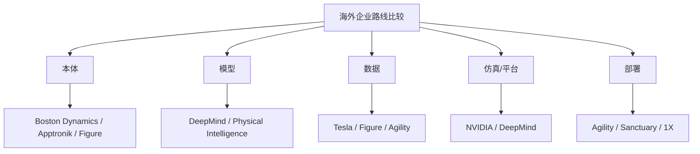

# 第二十一部分 海外重点企业专题

本部分不试图穷尽所有海外公司，而是选择那些最能代表不同路线分化的主体。分析重点不是企业“热度”，而是它们分别站在产业链的哪个位置：是平台型公司、数据与仿真基础设施公司、本体驱动公司，还是通用机器人操作与部署公司。为避免企业章节退化为新闻摘要，这里采用第二十部分给出的统一模板，只保留那些真正影响长期判断的变量：技术路线上究竟押注了什么、本体与模型如何耦合、数据与仿真基础设施是否形成闭环、产品形态是否开始接近真实交付。

海外企业最值得注意的不是“谁最像未来”，而是它们在五条关键链路上的不同取舍：本体、模型、数据、部署、平台。也正因为如此，海外专题与其说是在比较“谁更先进”，不如说是在比较不同押注组合各自如何试图闭环。

## 97. Google DeepMind

Google DeepMind 的核心价值，在于它长期推动了 RT 系列、PaLM-E 和通用 embodied multimodal 路线，使机器人 foundation model 获得了最强的学术叙事之一。[RT-1](https://arxiv.org/abs/2212.06817)、[RT-2](https://arxiv.org/abs/2307.15818)、[PaLM-E](https://arxiv.org/abs/2303.03378)

其 2025 年进一步公开 Gemini Robotics，也说明其研究方向正在从“为机器人提供更强通用多模态接口”进一步走向“把机器人直接作为模型能力边界的测试场”。这一变化值得持续跟踪，因为它意味着大模型公司对机器人问题的投入不再只是论文原型级别。[Gemini Robotics](https://deepmind.google/blog/gemini-robotics-brings-ai-into-the-physical-world/)

其优势在于模型、算法和研究深度；局限则在于距离大规模现实机器人交付仍有明显距离。它更像“定义问题与上限”的力量，而不是最先证明产品闭环的力量。若从第二十部分的企业框架看，DeepMind 最强的维度是模型路线定义权与研究影响力，最弱的维度则是本体制造与长期现场交付控制力。

### 97.1 DeepMind 路线的真正价值
若进一步拆解，DeepMind 路线的价值至少体现在三个层面。第一是问题设定层，它经常率先把原本分散的方向重新组织成统一问题，例如 generalist policy、跨本体数据组织与语言动作接口统一。第二是中间资产层，它推动的不只是单篇论文，还包括评测协议、数据接口和上游表征资产。第三是行业扩散层，许多后续团队即使不复现其系统，也仍然沿着其设定的接口语言继续推进。对长期跟踪者来说，这种“议程塑形能力”往往比一次分数领先更重要。
DeepMind 路线真正值得高看的地方，不只是它发布了若干有话题性的模型，而是它持续把“通用模型接口”与“物理系统接口”放在同一研究框架里处理。很多团队会做很强的机器人 demo，很多平台公司会做很强的多模态模型，但能长期把语言、视觉、动作、仿真、世界建模和评测协议一并组织起来的团队并不多。DeepMind 的价值，恰恰在于它反复尝试把这些层统一成可延展的问题设定。

这条路线的影响还不止于单篇论文。更重要的是，它持续塑造了行业讨论语言，例如 generalist policy、跨平台数据组织、多模态输入统一接口、视频/世界模型与机器人决策的关系等。也就是说，DeepMind 往往不只是“做了一个系统”，而是在帮助行业决定“应该如何定义系统”。

当然，这并不意味着它天然最接近大规模商业交付。相反，它更像上游接口与研究议程的塑形者。因此在本报告里，对 DeepMind 的判断重点不应落在短期客户案例数量，而应落在其是否继续定义未来几年最重要的公共问题与公共接口。
DeepMind 路线最值得高看的地方，并不只是论文数量或模型名声，而是它持续扮演了“上游接口定义者”的角色。无论是 RT 系列、PaLM-E、Gemini Robotics，还是更广义的多模态基础模型向物理世界延伸，其核心影响都在于提前定义了行业如何讨论“语言-视觉-动作接口”这一问题。很多后来者即便不直接沿用其模型，也仍在沿用它提出的接口语法与问题设定。

更进一步说，DeepMind 的真正价值在于它把机器人问题嵌回了大模型与多模态学习主线，使具身智能不再只是机器人子社区的封闭命题，而成为通用 AI 路线的一部分。这会显著改变人才流向、算力配置、评估口径和资本关注方向。对于整本报告而言，DeepMind 不是普通企业案例，而更像“行业叙事方向盘”。

更具体地说，DeepMind 路线的高价值体现在三个层面。第一，它持续把语言、多模态理解、规划与机器人动作接口放进同一研究叙事里，从而改变了社区提出问题的方式。第二，它反复证明“机器人问题不必只在低层控制层表述”，而可以借助高层语义接口重新组织技能学习、任务泛化与跨任务迁移。第三，它的论文与演示往往会迅速影响后续开源复现、企业宣传口径以及学术界对“下一代基础模型”边界的想象。

但也正因为如此，DeepMind 路线最容易被误读。它的强项是把研究前沿推到更高抽象层，而不是证明某条路线已经跨过了真实交付门槛。对于本报告的读者而言，更稳妥的看法是：把 DeepMind 当成“上限定义器”和“接口方向指示器”，而不要把它直接等同于现实产业成熟度的领先者。

DeepMind 的价值不在于它一定会直接成为最大的机器人交付者，而在于它经常率先定义下一代研究接口。也就是说，它更像问题设定者和路线放大器，而不是最先把某类机器人规模化铺开的公司。
这也意味着，对 DeepMind 的跟踪方法不应与对本体公司或系统集成公司的跟踪方法混为一谈。真正值得持续记录的，不是它是否马上拿出更完整的商业机器人产品，而是它有没有再次把任务接口、动作表示、跨模态推理或训练组织方式向前推一步。只要它持续扮演“问题设定者”和“接口方向指示器”的角色，它对行业的影响就可能长期大于其直接交付规模本身。

换句话说，DeepMind 这类主体更适合作为“研究主线观察窗”来跟踪，而不是作为“季度交付榜单”来跟踪。它告诉我们的首要信息，通常不是哪类客户已经买单，而是哪类接口正在被证明值得继续投入。对这份报告后续版本而言，这种公司更像上游风向标，而不是下游成熟度标尺。

## 98. NVIDIA

NVIDIA 在具身智能中的特殊地位，不仅来自 GR00T，也来自 Isaac、仿真、加速计算和整条平台基础设施。[GR00T N1](https://arxiv.org/abs/2503.14734)、[NVIDIA Isaac](https://developer.nvidia.com/isaac)

其最重要的产业角色并不是“做一个机器人公司”，而是试图成为机器人基础模型、仿真与部署生态的底座提供者。与其说 NVIDIA 在争“谁家机器人最强”，不如说它在争“未来多数机器人项目是否都会在它的算力、仿真和模型基础设施上生长”。这是一种平台型护城河逻辑，而不是单体产品逻辑。

### 98.1 为什么平台型公司要单独看
平台型公司还承担一个特殊角色：它们往往是行业默认入口最早发生变化的地方。新的仿真框架、训练接口、端侧 runtime、数据 schema 或芯片栈支持，一旦在平台层成熟，就会迅速外溢到多家下游团队。因此，跟踪平台公司时最值得记录的，未必是短期客户数，而是它到底重写了多少下游工作流的默认起点。
平台型公司之所以必须单独成类，是因为它们创造价值的方式与“卖一个机器人产品”的公司根本不同。它们往往并不直接占有终端场景，却通过仿真平台、训练基础设施、芯片栈、部署工具链、数据协议和生态接口，影响大量下游公司的研发节奏和技术选择。换句话说，平台型公司的真正产品，常常不是一个具体机器人，而是别人构建机器人的默认工作台。

这类公司的判断口径也因此必须改变。若仍用“单一场景成功率”或“本体销量”去评估平台公司，就会系统性低估其行业位置。更合适的问题是：它是否定义了事实标准接口，是否降低了开发者进入门槛，是否锁定了关键运行时栈，是否把训练、仿真和部署连成了统一链路。

也正因为如此，平台型公司的影响往往比表面收入结构更长尾。它们可能短期不拥有最炫目的终端演示，却能通过开发者生态和基础设施嵌入，在中长期反过来决定哪一类机器人路线更容易被放大。
平台型公司需要单独看，是因为它们未必直接拥有最多终端机器人，却可能通过芯片、云、仿真、训练框架、数据协议与部署栈，决定整个行业的技术接口和资源分配方式。NVIDIA、Google、微软、亚马逊这类公司影响行业的方式，往往不是“自己把某个单一场景先跑通”，而是降低大量参与者进入某条技术路线的门槛，同时抬高其他路线的切换成本。

因此，对平台型公司最重要的分析对象不是单一 demo，而是其接口控制力：它掌握了哪些开发者入口，定义了哪些数据/模型/部署标准，绑定了哪些硬件与仿真环境，以及是否把自己的生态优势转化成了事实标准。平台一旦成势，其影响往往比单个机器人整机公司的阶段性领先更持久。

这种差异意味着，平台公司最重要的指标往往不是某一代机器人是否最好，而是它是否控制了开发接口、仿真入口、训练栈、部署运行时和生态兼容层。若一个平台能够让越来越多团队在数据格式、训练流程、仿真环境、模型部署和算力采购上默认依赖它，那么它即使不是终端产品公司，也可能在价值链中占据更稳定的位置。

对研究者来说，单独看平台型公司还有一个原因：它们更容易通过工具链改变整个社区的研究方向。某个本体公司的 demo 可能只影响外界对单一路线的看法，而一个平台公司的 SDK、仿真器、数据协议或端侧推理栈一旦成为事实标准，就会反过来塑造哪些研究更容易被做、被复现、被部署。

平台型公司的胜负标准与本体公司不同。它们不必自己交付最多机器人，只要能成为大多数项目的默认基础设施，就可能建立更强长期护城河。因此，NVIDIA 这样的公司需要按“生态渗透率”而不是“单机产品能力”来评价。
换句话说，平台公司的关键不在于展示一台“最强机器人”，而在于让越来越多团队在仿真、训练、部署、数据组织和端侧推理上形成对其生态的路径依赖。只要默认接口、默认工具链和默认算力采购路径逐渐收敛到同一平台上，这种公司即使不拥有最强终端产品，也依然可能控制具身行业最稳定的一段价值链。

因此，后续跟踪 NVIDIA 这类公司时，更有信息量的信号通常不是单一模型分数，而是：新的 SDK 是否改变默认工作流、仿真平台是否更深进入企业训练闭环、端侧算力与 runtime 是否降低部署门槛、以及生态伙伴是否越来越难绕开其基础设施。只要这些信号持续增强，它的平台地位就可能比单个机器人产品成败更关键。

进一步说，平台型公司还会反向塑造“什么样的研究更容易被做出来”。若某个仿真器、数据接口或部署 runtime 被大规模采用，那么围绕它开展的任务定义、评测方式和系统结构就更容易变成事实主流。这意味着平台公司不只是服务既有路线，还会影响未来几年哪些路线更容易获得开发者注意力、融资支持和复现资源。对研究型报告而言，这种“议程放大能力”本身就应被计入平台护城河。

## 99. Figure、Physical Intelligence、Tesla、Boston Dynamics

Figure 代表的是“人形 + foundation model + 商业叙事”高度耦合的路径；Physical Intelligence 更强调“物理世界 intelligence”作为独立研究和产品对象；Tesla Optimus 的独特性在于其尝试复用自动驾驶、制造和大规模工程体系；Boston Dynamics 则更多代表高动态本体和长期工程系统积累。[Figure](https://www.figure.ai/)、[Physical Intelligence](https://www.physicalintelligence.company/)、[Boston Dynamics](https://bostondynamics.com/)、[Tesla AI](https://www.tesla.com/AI)

Figure Helix 特别值得单独关注，因为它比多数公司更明确地公开了“高层 VLM + 低层快速控制 + 本体机载推理”的系统结构，这使其不仅是企业新闻，也是一份具身系统分层实现样本。[Figure Helix](https://www.figure.ai/news/helix)

这四类主体最大的区别，并不在“谁更像通用智能”，而在于它们分别优先押注本体、模型、数据、工程还是平台。Figure 更强调把通用叙事尽快压到具体产品化路径上；Physical Intelligence 更像在争夺通用 physical foundation layer 的定义权；Tesla 的独特性在于它若成功，则可能把制造、供应链和自动驾驶数据工程能力外溢到机器人；Boston Dynamics 则提醒我们，长期稳定的动态本体工程本身就是稀缺壁垒，不应被大模型叙事轻易淹没。

### 99.1 这四类公司最该分别盯什么
这套分类的另一个价值，是能减少一种常见误判：把最会讲平台故事的公司误判成最接近交付的公司，或把最会做交付的公司误判成最有机会定义行业接口的公司。四类公司都可能重要，但重要的机制不同。只要这一前提保持清楚，后续企业更新就更容易保留分析精度，而不是被热度重新拉平。
如果把海外重点企业按研究平台、模型公司、本体公司和场景交付公司粗分，那么后续跟踪时最重要的是避免用同一把尺子乱量。研究平台型团队最该盯的是接口定义与公共工具链；模型公司最该盯的是数据闭环、训练范式和高层能力是否真正进入动作接口；本体公司最该盯的是制造、执行器、可靠性与系统协同；场景交付公司最该盯的是客户复制、运维能力与单位经济性。

一旦这四类公司的观察指标混在一起，结论就会迅速失真。例如，一个平台公司可能没有很多真实客户部署，但仍然极其重要；一个本体公司可能没有最强的模型叙事，但凭借可制造性和供应链控制依然拥有核心位置。把它们分开跟，恰恰是为了保留判断的物理意义。

因此，本节的真正作用不是简单分类，而是为后续持续跟踪建立“各看各的关键变量”的纪律。只有这样，后续企业专题才不会退化成热门名字的并排罗列。
这四类公司不能用同一把尺子看。基础模型/研究型公司最该盯的是接口定义权和语义能力是否真的下探到动作闭环；平台型公司最该盯的是生态绑定力与事实标准形成速度；整机/本体公司最该盯的是本体一致性、制造与维护能力；场景集成型公司最该盯的则是客户复制效率、运维负担与单位经济性。若不分组观察，很多横向比较都会天然失真。

对后续版本更新尤其重要的是，把“最该盯什么”转成稳定字段。也就是说，更新企业信息时，不是简单补新闻，而是优先补最能解释其长期位置的那几个变量。这样即便公司宣传口径变化很大，报告仍能保持判断连续性。

若进一步细化，这四类主体分别对应四种完全不同的风险结构。Figure 的关键风险在于是否会长期停留在高叙事强度的人形通用故事，而难以把模型能力压缩进稳定交付链路；Physical Intelligence 的关键风险在于“physical foundation layer”是否能被做成真正可复用的中间层，而不只是概念上很美的研究方向；Tesla 的关键风险则在于既有制造与自动驾驶优势是否真的能迁移到完全不同的接触任务、执行器体系和现场运维结构；Boston Dynamics 的风险则更多在于其深厚本体能力如何与新一代 foundation model 接口耦合，否则它可能继续强于身体、弱于通用高层语义。

因此，本节真正想强调的不是“谁更强”，而是看不同公司时必须盯住不同证据。若观察对象不同，所需要的验证材料也应不同：有的更该看模型接口，有的更该看交付现场，有的更该看制造链条，有的更该看本体与高层智能之间的重新耦合速度。

1. Figure：看其高层模型与真实交付是否持续靠近。
2. Physical Intelligence：看其是否能把“物理智能”从概念变成系统接口。
3. Tesla：看其制造和自动驾驶体系能否真的外溢到机器人闭环。
4. Boston Dynamics：看其高动态本体如何与更强的高层智能接口重新结合。

如果把这四类公司放在同一张研究图里，它们其实分别回答了不同问题：Figure 回答“人形叙事能否尽快压成系统产品”，Physical Intelligence 回答“physical foundation layer 能否成为独立中间层”，Tesla 回答“超大制造与数据组织能力能否迁移到机器人”，Boston Dynamics 回答“强身体是否能重新接上新一代高层智能”。理解这一点后，比较它们时就不该再用单一评分逻辑硬压平。

若继续往下拆，这四类公司最值得被长期记录的证据也完全不同。Figure 更应重点看：其分层系统是否继续明确、端侧约束是否被压缩、以及客户现场证据是否逐步替代公开视频。Physical Intelligence 更应重点看：其“通用物理智能层”到底是以模型、数据协议、训练框架还是系统接口的形式落地。Tesla 更应重点看：自动驾驶积累究竟迁移了哪些能力，是采数组织、端侧推理、制造节拍，还是仅停留在叙事层。Boston Dynamics 则应重点看：其强本体是否真的与 foundation model 式高层接口重构发生深层耦合，而不是继续维持“身体强、语义接口弱”的老结构。

把这组证据拆开有一个很重要的好处：它可以避免我们在后续版本里被同一套宣传口径误导。因为这些公司的真实竞争位置并不在同一个层级上，强行用“谁更像通用智能公司”去量它们，只会把企业专题重新拉回叙事比较，而不是结构比较。

## 100. Agility、Apptronik、1X、Sanctuary 等

这些公司通常更能体现第二梯队路线分化：

1. Agility 更接近场景落地与物流操作叙事。
2. Apptronik 更强调人形平台工程成熟度。
3. 1X 更强调人机协作与服务场景探索。
4. Sanctuary 更强调通用操作与遥操作/共享自治结合。

它们分别可以对应到不同风险偏好：

1. Agility Robotics 更像“先找现实场景、再逐步扩展能力”的路线。[Agility Robotics](https://agilityrobotics.com/)
2. Apptronik 更强调通用本体平台与工程成熟度之间的平衡。[Apptronik](https://apptronik.com/)
3. 1X 更值得从人机共处、远程接入和家庭/服务路径角度观察。[1X](https://www.1x.tech/)
4. Sanctuary AI 则长期提醒行业：shared autonomy 与 teleoperation 不只是过渡工具，也可能是长期商业组织方式的重要组成部分。[Sanctuary AI](https://www.sanctuary.ai/)

### 100.1 第二梯队公司为什么很重要
第二梯队还有一个非常重要的研究价值：它们更像行业广义可行性的测试集。头部公司往往拥有额外算力、资本、品牌和工程兜底，很多能力可以被资源暂时覆盖；而第二梯队若仍能跑出成绩，往往说明这条路线在更一般条件下也具备可持续性。也因此，第二梯队常常比头部样本更适合用来观察行业真实分布。
第二梯队公司的重要性常常被低估，因为舆论更偏爱头部明星公司。但对研究型跟踪而言，第二梯队往往更能暴露行业真实分布。头部公司拥有更多资源、媒体聚光和工程兜底，而第二梯队更容易把约束直接暴露出来：它们在本体、算力、数据、场景、资本和运维上的取舍，更接近未来大量普通公司的现实。

同时，第二梯队公司也经常是路线分化最清楚的地方。头部公司容易讲“大而全”的平台故事，而第二梯队往往被迫更早明确自己押注什么，是轻量端侧、垂类场景、远程接管、低成本本体，还是某种差异化的数据采集方式。正因为资源没有那么充裕，它们反而更早显露出真正的优化函数。

所以，在本报告的长期维护里，第二梯队并不是“头部公司之外的补充材料”，而是观察产业真实约束和路线分岔的重要样本池。
第二梯队公司重要，不是因为它们一定会最终胜出，而是因为它们更容易暴露行业中真正可复制的中等强度路径。头部公司常常同时拥有资本、人才、算力与叙事优势，容易把“资源优势”与“方法优势”混在一起；第二梯队公司则更像压力测试样本，它们是否能在较弱资源条件下做出稳定交付，更能说明某条路线到底是不是普适。

此外，很多后来成为关键节点的企业，早期都处在所谓第二梯队。它们可能暂时没有最强声量，却在供应链、场景、成本控制或组织执行上积累了更务实的能力。对学习者和研究者而言，盯住这些公司，往往比只盯头部叙事更能看清行业真实演化。

第二梯队公司的价值，在于它们通常没有那么强的“概念光环”可以遮蔽问题，因此路线中的真实摩擦会更快显露出来。比如，某家公司是否真的能把人形平台推进到稳定场景、是否能把 shared autonomy 组织成可运营业务、是否能在客户现场建立维护网络，这些信息常常会先在第二梯队身上出现，而不是先在头部愿景公司那里清晰出现。
也正因为如此，第二梯队公司更像现实世界的“温度计”。它们往往更早暴露真实成本、部署阻力、客户接受边界和运维难度，因此对研究者而言信息含量反而更高。很多最终被行业证明可行或不可行的路径，最先并不是在最耀眼的头部叙事中被看清，而是在这些更贴近交付压力的公司身上被慢慢看清。

也正因为如此，第二梯队公司不应被看作“头部公司的低配版”。相反，它们更像现实约束的压力测试器。很多后来被证明有效的商业模式、交付路径和组织方式，往往正是在这些公司身上先以不那么耀眼、但更接近真实世界的方式出现。

从研究跟踪角度，它们常常比头部叙事公司更有信息量。因为它们更早暴露出真实约束：物流现场能不能接住、平台成本能不能压住、遥操作是否真的能持续作为业务组织方式存在。这些问题往往比头部公司的宏大叙事更接近产业真相。

也因此，这一组公司在后续版本中应被当作“现实信号放大器”长期保留。头部公司更容易定义愿景边界，第二梯队公司更容易定义现实边界；前者帮助我们看上限，后者帮助我们看摩擦。只有两者并读，海外企业章节才不会长期漂向单边乐观或单边悲观。

更进一步说，第二梯队公司的意义还在于它们更容易揭示“行业到底能否被中等资源条件复制”。如果某条路线只有在极高算力、极强资本和极大媒体势能下才看起来成立，那么它未必代表行业普遍可行；而如果第二梯队也开始在类似接口、类似部署模式或类似组织方式上取得进展，就说明该路线可能正在从明星样本走向可复制样本。对于研究型报告来说，这类信号往往比头部公司再多一个概念视频更有判断价值。

因此，海外章节在后续维护时，不应只把第二梯队公司当作补充名单，而应把它们视为检验行业真实扩散度的对照组。头部公司告诉我们“上限长什么样”，第二梯队公司告诉我们“上限是否开始向行业中位数外溢”；这两种信息缺一不可。

本部分的结论是：海外公司并不存在单一主线。更现实的理解方式，是把它们看作围绕“本体、模型、数据、仿真、部署”五个支点作出的不同押注。对后续持续跟踪最重要的问题不是“谁现在更热”，而是：哪一类押注正在逐步形成闭环，哪一类押注仍主要停留在高估值叙事阶段。

为了避免企业比较退化成“故事强弱比较”，后续跟踪时更适合先把海外公司分成四类角色：问题定义者、平台底座构建者、本体工程推进者、交付组织探索者。DeepMind、Physical Intelligence 更接近前两类中的研究接口塑造者；NVIDIA 更接近平台底座构建者；Figure、Tesla、Boston Dynamics、Apptronik 更偏本体与系统工程推进者；Agility、1X、Sanctuary 等则更像在真实交付组织方式上做压力测试。不同角色的证据类型根本不同，若用同一把尺子比较，只会把平台渗透率误写成产品能力，或把热视频热度误写成交付成熟度。

因此，本章最关键的阅读纪律并不是“给每家公司一个总分”，而是先问其主要护城河候选究竟是什么。若公司核心价值在于定义接口与基础设施，那么最重要的证据是生态采用、开发者依赖和默认工作流渗透；若核心价值在于本体工程，那么最重要的证据是稳定运行小时数、接触任务边界、维护频率与成本下降速度；若核心价值在于交付，则应重点看客户场景、回退组织方式和复制节奏。只有把证据与角色绑定，企业专题才不会沦为“把不同物种装进同一个排行榜”的误导性比较。

## 图 21-1 海外企业五支点比较图

源文件：`assets/diagrams/21-海外企业五支点图.mmd`

## 表 21-1 海外重点企业路线对照表

见 [21-海外重点企业路线对照表](D:/Projects/embodied-intelligence-report/docs/report/current/tables/21-海外重点企业路线对照表.md)。

## 图表与案例补充
如果把这一章作为后续季度更新的模板来使用，那么最重要的并不是不断增加公司名单，而是保证每次更新都沿着同一组字段记录变化：是否新增了自有本体、是否公开了更清晰的模型接口、是否展示了数据回流机制、是否披露了更接近真实客户现场的部署证据、是否暴露出新的工程短板。只有在这种统一框架下，企业专题才不会退化成新闻流摘要。

海外企业专题中的图表与案例，最重要的作用不是补材料丰富度，而是把平台公司、研究公司、本体公司和交付公司重新放回同一比较坐标中。否则，读者很容易把公司声量、论文影响力或视频热度误读为全链条能力领先。

因此，这里的表格、比较图和案例对照，都应服务于一个目标：让读者看清不同企业究竟在本体、模型、数据、仿真和部署五个支点上各自押注了什么，以及这些押注如何共同决定其中期上限与现实边界。

1. 表 21-A：`海外重点企业路线对照表`
   说明：建议按“本体 / 模型 / 数据 / 平台 / 部署 / 当前主要场景 / 主要风险”列出 DeepMind、NVIDIA、Figure、Physical Intelligence、Tesla、Boston Dynamics、Agility、Apptronik、1X、Sanctuary。
2. 图 21-B：`海外企业五支点押注雷达图`
   说明：把“本体、模型、数据、仿真、部署”五支点画成统一比较坐标。
3. 案例 21-C：`Figure Helix 与 Agility Digit 的两类落地路径对照`
   说明：前者偏通用人形加模型耦合叙事，后者偏先场景落地再扩展能力。

为避免这一章未来继续退化成新闻流摘要，后续更新时建议先阅读并维护以下研究卡，再回写正文判断：

1. [Google DeepMind 长期跟踪卡](D:/Projects/embodied-intelligence-report/research/companies/Google-DeepMind-长期跟踪卡-v0.0.md)
2. [NVIDIA 长期跟踪卡](D:/Projects/embodied-intelligence-report/research/companies/NVIDIA-长期跟踪卡-v0.0.md)
3. [Figure 长期跟踪卡](D:/Projects/embodied-intelligence-report/research/companies/Figure-长期跟踪卡-v0.0.md)
4. [Agility 长期跟踪卡](D:/Projects/embodied-intelligence-report/research/companies/Agility-长期跟踪卡-v0.0.md)
5. [Apptronik 长期跟踪卡](D:/Projects/embodied-intelligence-report/research/companies/Apptronik-长期跟踪卡-v0.0.md)
