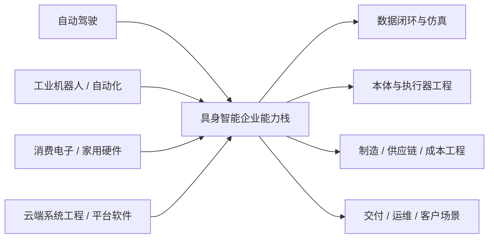

# 第二十二部分 国内重点企业专题

国内具身智能企业生态与海外并不完全同构。其独特性主要来自三点：制造业与供应链基础更强，自动驾驶与工业机器人能力更容易外溢，地方产业政策和场景资源在企业成长中扮演更直接的角色。因此，分析国内公司时，不能只用海外基础模型叙事做镜像套用，还必须持续观察“工程交付能力是否真的转化为机器人能力”。

相比海外“模型公司 + 创业资本 + 平台叙事”更强的路径，国内公司往往更早被拉回本体工程、供应链、制造、成本和场景交付现实中。这不是说国内企业更保守，而是说它们更容易在更早阶段就面对“能不能造、能不能交、能不能维护”的问题。因此，评价国内企业时，一个常见误区是只看是否追上海外 narrative；更重要的问题其实是，它们是否把国内特有的制造与场景优势真正转化成具身系统能力。

## 102. 优必选、智元、宇树

优必选的重要性在于其长期人形与教育/工业机器人积累；智元代表新一代国内具身创业潮中较典型的人形与通用操作路线；宇树则展示了国内在高性价比四足和人形平台工程上的快速推进能力。[UBTECH](https://www.ubtrobot.com/)、[AgiBot](https://www.agibot.com/)、[Unitree](https://www.unitree.com/)

这三者最值得比较的，不是“谁更火”，而是它们在本体工程、量产路径、成本结构和场景切入上的差异。优必选更适合从“长期本体路线与产业合作深度”去看；智元更适合从“新创业公司如何搭建人形 + 通用操作叙事”去看；宇树则提醒我们，不应低估高性价比本体平台对行业扩散速度的影响。

进一步看，三者在平台定位上也并不相同：优必选更容易被放在“长期产业化机器人公司”语境中理解；智元更接近“新一代通用人形叙事”的代表；宇树则常常先以平台可得性和工程效率影响社区，再逐步外溢到更完整的具身系统叙事。

### 102.1 这三家最不该被用同一把尺子比较
优必选、智元和宇树放在同一节里，不是因为它们是同构公司，而是因为它们恰好构成了国内具身赛道三种不同的样本类型。优必选更像“长期本体与产业协同积累”的样本，其官网长期把 humanoid、商用服务与教育机器人并列呈现，说明它的优势并不只是单点模型，而是较长周期的产品线与合作网络组织能力。[UBTECH](https://www.ubtrobot.com/) 智元更像“通用具身平台快速搭架构”的样本，其官网同时强调 humanoid、本体平台、开发平台、数据服务和开源入口，说明它押注的是更完整的系统平台叙事。[AGIBOT](https://www.agibot.com/) 宇树则更像“高性价比平台供给 + 生态扩散”的样本，其官网同时展示人形、四足、机械臂、组件与文档/服务体系，这意味着它的竞争点更接近平台可得性与标准化供给，而不是只靠单一 flagship 机器人讲故事。[Unitree Robotics](https://www.unitree.com/)

因此，这三家公司最不该被放进一张“统一排行榜”里，而应被放回不同的角色坐标系。若粗略把企业比较写成

\[
\text{Role Fit} = (\text{ontology}, \text{platform reach}, \text{delivery proof}, \text{cost control}, \text{data loop}),
\]

那么三家公司的高权重坐标并不相同。优必选更该看 `delivery proof` 与 `ontology` 是否持续强化；智元更该看 `data loop` 与 `platform reach` 是否真能落到系统接口和开发生态；宇树则更该看 `cost control` 与 `platform reach` 是否进一步外溢为生态控制力。若忽略这组权重差异，比较结果就会天然偏向“谁最近声量更大”，而不是“谁在自己的角色上更接近建立壁垒”。

也因此，跟踪证据必须与角色绑定。优必选应重点看产业合作是否继续沉淀为稳定交付、本体工程和客户复用能力；智元应重点看数据平台、开发平台、遥操作/采数体系与真实场景证据是否同步增强，而不是只有更大的通用叙事；宇树则应重点看平台出货、组件标准化、支持体系和二次开发生态是否继续扩大。只有先承认“回答的问题不同”，后续国内企业专题才不会退化成把异构公司硬塞进同一评分表的误判。

### 102.2 宇树式平台可得性为什么值得高权重跟踪
国内语境里，一个容易被低估的变量是“本体平台可得性”本身。若某家公司能以较高性价比、更短交付周期和更广可获取性把平台本体扩散到研究机构、开发者、企业实验室和二次开发团队手中，那么它对行业的影响不只体现在自身产品销量上，还体现在它是否改变了整个生态做实验、做复现、做应用验证的门槛结构。宇树这类公司之所以值得高权重跟踪，正是因为它们可能以平台扩散而非单一场景闭环的方式改变行业底座。

平台可得性的真正价值，在于它会重塑谁有资格参与创新。若更多团队能更低成本拿到稳定本体并开展二次开发，那么算法验证、数据采集、工具链建设和应用试验的样本池都会被放大。长期看，这种“先扩大实验人口、再外溢能力路线”的影响，可能比少数头部公司独占高端样机更深远。也正因此，宇树式平台路线不应只按本体毛利或单次 demo 来判断，而应纳入“是否在改写行业创新门槛”的视角。

这类平台可得性会产生一个重要的二阶效应：更多团队拥有可用本体之后，数据、技能库、部署经验和二次开发工具也更容易围绕该平台堆积。久而久之，平台本身就不只是硬件，而会逐渐变成一个轻量生态入口。对长期版本维护来说，这一类信号的意义常常大于单次演示成功，因为它更接近行业扩散速度的变化。

## 103. 星动纪元、非夕、达闼、追觅及相关链条

这一组公司说明，国内具身生态不应只被理解成人形赛道：

1. 星动纪元更偏学术驱动的新型机器人路线。
2. 非夕长期代表柔顺控制与高端操作工程。
3. 达闼更强调云端机器人与网络化系统概念。
4. 追觅及家用链条则代表消费级服务机器人与家居设备能力外溢。

这一组之所以重要，是因为它们分别把不同产业能力外溢到具身系统：学术与实验平台、工业柔顺控制、云端系统工程和家用服务设备链条。也就是说，国内具身生态并不是“统一冲向人形”，而是多条既有能力链向机器人主体重新汇合。

### 103.1 工业路线为何值得高看一眼
工业路线还值得高看的一点，是它最容易留下可审计证据。客户工位、节拍要求、质量指标、维护频率和异常恢复方式，都比泛化愿景更容易被验证。这使它成为判断“公司是否真正拥有交付能力”的最佳观测窗口之一，也让相关企业更适合作为研究型报告中的硬样本。
工业路线之所以值得高看，不是因为它“保守”，而是因为它更早接受了系统交付的现实约束。与追逐通用叙事相比，工业路线往往更快把问题压回节拍、良率、维护、责任边界和客户 ROI 这些硬约束上。谁更早在这些约束下工作，谁就更早积累真实部署资产。

这条路线的另一个优势，是它更容易把具身能力嵌入既有自动化体系。工位、夹具、传送、质检和 MES/调度接口本身就是现成的工程外骨骼，能帮助机器人系统在技术尚不完美时仍然创造价值。也正因如此，工业路线经常不是最“像 AGI”的，但却可能是最早沉淀出交付能力的。

对国内公司而言，这一点尤其关键，因为制造场景密度高、成本工程压力大、客户更关心稳定运行而不是概念展示。工业路线能否持续跑通，很大程度上决定了国内具身公司是否能把技术势能转化成产业势能。
工业路线值得高看，不是因为它“更传统”，而是因为它更早面对真实交付约束。凡是能在工厂、仓储、巡检或固定工位场景持续运行的系统，通常都必须回答节拍、可靠性、维护、异常恢复和 ROI 这些硬问题。相比之下，很多更炫目的开放场景叙事反而可以较长时间停留在展示层。

因此，国内企业若能在工业路线中建立稳定案例，其意义常常超过一次更吸引眼球的通用演示。它说明公司不仅能做能力展示，还能把能力压缩进客户愿意长期付费的运营结构里。这一逻辑与中国制造环境的高密度场景条件也是一致的。
从研究视角看，这也意味着工业路线常常更能提前暴露“哪些能力是真正难交付的”，因为它比消费级愿景更早面对客户 KPI、连续运行与成本回收周期。
工业路线值得高看一眼，不是因为它最“性感”，而是因为它往往更早满足了真实交付的三个条件：任务定义相对清晰、客户付费意愿明确、部署后价值可度量。也正因为如此，很多真正有积累的能力，例如现场集成、维护闭环、工艺适配和节拍优化，都会先在工业体系里沉淀下来。
从长期研究判断看，工业路线的意义还不只是“先赚到钱”，而是它更容易把交付知识固化成可复用工程资产。哪些感知链路容易失效、哪些执行器寿命会压缩维护周期、哪些数据真正值得回流训练，这些信息往往都是在工业现场里首先沉淀清楚的。也就是说，工业路线首先提供的不是更漂亮的叙事，而是更早成形的交付方法论。

从长期看，非夕等强调柔顺控制、工业操作和系统集成的路线，可能比某些更热闹的人形 demo 更接近稳定商业价值。因为很多工业场景对“局部高可靠操作”的需求，早于对“通用 humanoid narrative”的需求。

这类路线对整本报告还有一个更深的提醒作用：不是所有高价值路线都会先以“通用具身”名义出现。很多真正可沉淀的能力，恰恰先以柔顺控制、局部自动化、工业操作可靠性和场景集成经验的形式出现。若只按最热的人形叙事来筛选信息，就很容易错过这些更接近现金流和交付方法论的长期资产。

如果把工业路线进一步拆解，它的高价值通常不在“是否最像通用智能”，而在于它更容易把能力压到五个可审计变量上：

1. 节拍是否达标。
2. 良率是否稳定。
3. 异常是否可恢复。
4. 维护是否可组织。
5. ROI 是否可计算。

这五个变量一旦被持续记录，工业路线就会天然比许多开放场景叙事更接近真实商业证据。也正因为如此，后续在比较国内企业时，谁能在工业体系中留下更清晰的连续运行与客户使用证据，谁就应被优先上修，而不应被“故事没有那么宏大”所低估。

### 103.2 消费电子与家用链条为何也值得跟踪
这条链路还有一个重要作用，是它会强迫行业直面用户体验问题，而不只是技术可行性问题。噪声、发热、维护、外观、升级方式、售后响应与交互负担，在消费级和家用场景里都无法长期依赖工程师兜底。谁能在这些维度上形成成熟方法，谁就可能对整个行业的产品化标准产生更强外溢影响。
消费电子与家用链条值得跟踪，并不是因为它们已经最适合具身系统大规模落地，而是因为它们对成本、体积、能耗、可靠性和量产节拍的要求，会反向塑造整个行业的系统工程标准。很多今天在研究里显得“可以接受”的复杂方案，一旦放入消费级或家用链条，就会立刻暴露出无法承受的 BOM、维护和安全问题。

因此，这条链路的价值往往更像压力测试。它迫使行业正视轻量化、低功耗、端侧推理、安静运行、交互安全与长期维护这些问题。即使家用场景短期仍难全面跑通，其对本体、小模型和产品工程的牵引力也会持续外溢到其他领域。

对国内企业尤其如此。因为消费电子制造、供应链协同和大规模产品化经验，本来就是中国企业的强项之一。一旦有公司真正把家用链条与具身系统打通，其影响就未必只体现在单一场景营收上，更可能体现在成本工程、轻量部署、售后体系和产品化节奏这几项长期决定行业扩张上限的能力上。
消费电子与家用链条值得跟踪，不是因为它们短期最容易落地，而是因为它们往往代表成本工程、供应链整合、产品化体验和量产节奏能力的另一条上限。很多机器人路线最终若想进入更大规模市场，就必须面对类似消费电子行业的问题：BOM 成本、可靠性、一致性、售后、外观、交互与快速迭代。

因此，即使家用或消费级机器人短期未必最先形成大规模闭环，相关链条上的公司仍值得持续观察。它们可能不会最先定义“最强具身模型”，却可能更早积累“如何把复杂系统做成大规模产品”的关键能力。

消费电子与家用链条值得跟踪，并不是因为它们会立刻产出成熟的家用具身系统，而是因为它们带来了另一类产业能力：低成本硬件设计、量产工程、用户体验迭代、售后网络、端侧算力组织和外观工业设计。这些能力未必直接等于机器人智能，但一旦行业进入更大规模消费化阶段，它们会迅速从“外围能力”变成“决定胜负的核心能力”。

从研究视角看，这也意味着不应只把家用链条理解为“离工业落地更远的想象空间”。相反，它提供了另一套完全不同的约束体系：成本更敏感、可靠性门槛更高、交互体验要求更细、售后容错空间更小。谁能更早理解这套约束，谁未来就更可能在服务机器人或消费级具身设备上建立真正差异化。
消费电子与家用链条值得跟踪，则是因为它们更容易把低成本硬件、量产工程、供应链控制和人机交互体验带回机器人系统设计。即使短期内家用具身机器人未必先大规模落地，这条链路积累的成本工程、交付标准和规模制造经验，仍可能强烈影响后续行业格局。

家用设备与消费硬件链条带来的，不只是低成本制造能力，还包括传感器集成、外观工程、售后体系和端侧算力组织经验。这些能力未必直接等于具身智能，但在未来走向消费级服务机器人时很可能重新变得关键。
因此，这条链路可以被理解为一种“延迟释放的产业能力”。在行业仍主要停留于工业和半工业场景时，这些能力看起来不像决定性变量；但一旦具身设备开始要求更高出货量、更低 BOM、更稳定用户体验和更成熟售后体系，消费电子式组织能力就会突然变得极其关键。对后续版本维护而言，这类企业不应只按当前机器人能力打分，还应按其未来规模化潜力单独观察。

换句话说，消费电子链条当前最值得关注的，并不是它是否马上拿出最强机器人，而是它是否开始积累那些将来最难补课的能力：低成本传感器堆叠、端侧算力压缩、用户体验调优、售后闭环和大批量品控。这些能力在今天看似“外围”，但在未来消费级具身阶段很可能变成真正的主战场。

从研究方法上看，这条链路还提供了一种与工业路线截然不同的压力测试。工业路线更强调“系统是否能稳定接住场景价值”，消费电子路线则更强调“系统是否能被压缩到用户愿意长期持有的产品形态”。前者优先暴露的是交付与维护难题，后者优先暴露的是成本、功耗、外观、噪声、可靠性和售后难题。两者共同存在，恰好帮助我们避免把具身行业误看成只有一种优化目标。

## 104. 国内企业分析的特别维度

### 104.1 政策与地方产业支持
国内企业分析里，政策与地方产业支持不能被当成背景噪声，因为它们经常直接决定企业最早能进入什么场景、拿到什么测试资源、获得怎样的试点订单，以及能否形成早期数据回流闭环。工业和信息化部近年持续把机器人、智能制造和相关基础设施纳入产业推进框架，[工业和信息化部](https://www.miit.gov.cn/) 但对企业判断而言，真正重要的并不是“政策利好”这四个字，而是政策到底改变了哪一段现实约束。

更稳妥的分析方式，是把政策作用拆成一个能力增益向量：

\[
\text{Policy Gain} =
(\text{scene access}, \text{testing access}, \text{funding support}, \text{supply coordination}, \text{standard pilot}).
\]

如果地方支持主要增强的是 `scene access` 和 `testing access`，那么它更像帮助企业更快进入真实部署与验证阶段；如果主要增强的是 `funding support`，却没有同步带来客户、试点和供应链协同，那么它更像阶段性资源缓冲，而不是长期能力形成。也就是说，政策不是竞争力本身，而是影响“能力形成速度”和“协同摩擦成本”的外部变量。

因此，后续版本维护里最值得记录的不是“某地支持力度大”，而是三类转换是否发生。第一，政策是否真的开放了高价值场景和更稳定的试点通道。第二，地方资源是否被转化成了企业自己的交付模板、客户网络和版本迭代数据。第三，支持是否推动了测试认证、标准试点或供应链协同，使企业后续扩张摩擦下降。只有当这些转换发生，政策信息才真正进入企业竞争力层；否则，它仍然只是资源层信号，而不是能力层证据。

### 104.2 制造与交付能力
如果把具身系统理解成一种“重本体、重部署、重维护”的产品，那么制造与交付能力就不是研发之后才讨论的附属问题，而是产品定义本身的一部分。很多国内公司之间真正的差异，不在“能不能训练出一个模型”，而在“能不能把本体、零部件、装配、标定、部署、售后和版本回滚组织成可复制流程”。原型机、展会 demo 与客户现场交付之间，隔着的是一整条系统工程链，而不是几次额外调参。

这一维度可以粗略写成：

\[
\text{Delivery Maturity} \approx f(\text{yield}, \text{calibration speed}, \text{MTTR}^{-1}, \text{spare coverage}, \text{rollout repeatability}),
\]

其中良率、标定速度、平均修复时间、备件覆盖率和跨客户复制能力，共同决定一条技术路线是否真的进入可交付状态。这个表达式不是为了给企业打精确分，而是提醒读者: 交付成熟度本质上是一个综合系统变量。只看模型能力，无法回答“这家公司究竟是在做研究样机，还是在做可以持续复制的产品”。

国内语境下，这一项权重尤其高。原因不是中国企业“更商业化”，而是制造链密度、客户场景压力和成本约束会更早把系统拉回现实检验。谁能更快把装配公差、测试流程、客户培训、远程诊断和版本发布收敛成模板，谁就更可能获得稳定的部署反馈与数据回流；谁长期依赖高人工介入和个案调试，谁就更难跨过从样机到产品的那条门槛。也因此，后续观察国内企业时，比起继续追问“是不是又讲出一个更大的故事”，更应追问“交付组织是否在收敛”。

更具体地说，国内企业的交付成熟度至少可以拆成四级。第一级是“研究样机”，其核心证据是能跑通局部动作或 demo，但装配一致性和现场恢复能力仍不稳定。第二级是“试点样机”，开始进入真实客户现场，但每个点位仍高度依赖人工跟场、频繁现场标定和高频版本热修。第三级是“模板化交付单元”，意味着部署步骤、维护步骤和回退步骤已被写成可复用 SOP，不同客户点位之间出现了可比较的复制节奏。第四级才是“服务网络阶段”，也就是备件、远程诊断、升级、培训和责任边界被组织成持续运行体系。很多企业对外传播时会把二级说成三级，把三级说成四级；报告真正要做的，就是把这几级重新拆开。

因此，本章更建议固定维护一组比“模型是否更强”更有判断力的现场字段：

1. 出厂一致性：同一批次本体是否仍需大量逐台补偿与个性化调参。
2. 现场标定时间：部署到可运行状态需要多少小时、多少轮工程师介入。
3. 异常恢复组织：故障后是人工救火，还是已有明确回退脚本与权限边界。
4. 维护节奏：MTTR、备件周转、现场巡检频率是否在收敛。
5. 复制能力：从第一个试点到第 `n` 个试点，部署时间与人工负担是否在下降。

只有当这些字段逐步收敛，制造与交付能力才真正从“企业介绍里的优势”变成“可以跨场景复用的系统能力”。这也是为什么对 [优必选](https://www.ubtrobot.com/)、[智元](https://www.agibot.com/) 与 [宇树](https://www.unitree.com/) 这类国内代表公司，后续最值得长期跟踪的不是又出现了什么新动作视频，而是它们是否正在把交付组织压缩成模板。

### 104.3 自动驾驶 / 工业机器人能力外溢
自动驾驶与工业机器人能力向具身系统外溢，是国内路线里非常关键的一条解释线索。前者通常带来感知融合、数据闭环、仿真验证、远程接管和大规模软件工程经验；后者通常带来控制、执行器、工艺适配、系统集成和客户现场部署经验。很多公司看起来像是在“突然做出了机器人能力”，实际往往不是从零起跳，而是把相邻产业里已经成熟的工程资产迁移到了新的系统闭环中。

这类外溢最值得被显式写出来，是因为它会直接塑造组织的先验强项和盲区。自动驾驶背景团队更容易优先搭建数据采集、回放、仿真和远程运维体系，但未必天然擅长本体、末端执行器与现场工艺；工业机器人背景团队更容易优先把控制、节拍、可靠性和客户交付做扎实，但未必最擅长高层模型叙事和大规模语义数据组织。也就是说，团队谱系本身就是一类高解释力证据，它经常比单次 demo 或单次论文更能说明一家公司为什么在某一侧突然领先、在另一侧却推进较慢。

若把“外溢”写成一个更像工程问题的形式，可以粗略表示为：

\[
\text{Transfer Gain} \approx g(\text{software reuse}, \text{actuation reuse}, \text{ops reuse}) - c(\text{contact gap}, \text{scene gap}, \text{safety gap}),
\]

其中前半部分是可直接复用的软件、执行器、运维与组织资产，后半部分则是迁移摩擦：自动驾驶转到操作任务时会遇到接触与末端执行鸿沟，工业机器人转到开放环境时会遇到开放语义、移动性与长尾感知鸿沟。也就是说，组织履历本身并不是能力；只有当复用收益大于迁移摩擦，这条“外溢”才真正成立。

因此，分析国内公司时，与其反复追问“有没有采用某个最热模型”，不如先问三个更根本的问题。第一，它把哪一类既有工业能力带进了机器人闭环。第二，这类能力是否真的已经迁移成功，而不是停留在组织履历表上。第三，迁移之后留下的系统短板是什么。只要这三个问题被问清，很多路线差异都会更容易解释：有的公司强在数据与软件闭环，有的强在本体与交付组织，有的则试图把两种外溢能力重新耦合成新的系统平台。

从长期维护角度，最值得固定记录的不是“这家公司来自哪个赛道”，而是它具体复用了哪些资产、在哪一层开始失效。例如，自动驾驶背景团队若把仿真、回放、远程接管、数据治理与异常复盘迁入具身系统，这些都是高质量正迁移信号；但如果它迟迟无法在接触、操作、夹具、工具链和现场维修上建立同等强度，那就说明“软件资产外溢成功，但物理执行资产仍偏弱”。工业机器人背景团队则正好相反：若它能很快把节拍、控制、维护和安全责任边界写扎实，却始终难以回答开放语义任务、远程数据闭环和策略泛化问题，那就说明其长板更多仍停在结构化场景。把这些长短板明确写出来，比泛泛说“来自自动驾驶/工业机器人”更有研究价值。

### 104.4 供应链与成本工程
供应链与成本工程在国内专题里必须单列，是因为它会直接决定“看起来可行的方案”能否跨过规模化门槛。具身系统最终要落到执行器、减速器、传感器、结构件、线束、算力模组、装配工艺和维护件管理上。只要其中任何一段长期不稳定，系统就很难从试点走向模板化交付。也因此，这一维度不应被视为商业附属物，而应被视为技术路线真实边界的一部分。

若把系统总拥有成本写成

\[
\text{TCO} =
\text{BOM} + \text{assembly labor} + \text{calibration} + \text{maintenance} + \text{downtime} + \text{field service},
\]

那么“成本工程”真正做的事情，不是单纯压低某个零件价格，而是同时压缩这几项成本的合成值。模型推理成本即使下降很快，如果散热、功耗、维护件更换频率和现场调试工时降不下来，系统总成本仍然可能没有本质改善。反过来，若企业能通过模块标准化、替代料管理、装配一致性和远程诊断把维护与停机成本压下来，它即使没有最激进的模型叙事，也可能更早建立现实护城河。

这一点对国内路线尤其重要，因为中国企业最可能形成差异化的位置，恰恰不在“谁先讲出最响亮的通用智能故事”，而在“谁更快把模型、本体、供应链和售后网络一起压进可复制交付流程”。因此，后续比较企业时，最值得长期保留的阅读习惯是：先看哪些公司正在更快把试点成功转成模板化交付，再看哪些公司能把成本下降曲线真正延伸到维护、停机和替代件层面。成本工程在这里不是后处理，而是路线是否可持续的先验判据。

如果进一步拆分，国内企业最值得长期追踪的成本工程抓手主要有五类。第一是模块标准化，也就是执行器、传感器、算力模组和结构件能否在多个产品代际之间复用。第二是替代料和双供应商策略，决定企业能否在供应波动时保持交付节奏。第三是工装与测试自动化，决定装配一致性和校准效率。第四是远程诊断与软件升级，决定维护成本是否能被压缩到可管理范围。第五是备件与维修网络，决定停机时间究竟由“技术能力”还是由“服务组织能力”主导。只看 BOM，而不看这五类抓手，很容易高估实验室里的成本下降，低估真实交付中的总拥有成本。

对研究报告而言，这一节最重要的结论不是“国内企业成本更低”，而是“国内企业更早被迫把成本工程写进技术路线本身”。谁能把本体、供应链、售后和版本发布一起做成闭环，谁就更有可能把一次性样机优势沉淀成中长期能力。也因此，后续比较国内公司时，成本工程不应被留到商业化章节才讨论，而应始终作为技术路线能否成立的同步变量。

### 104.5 需要警惕的误判
国内专题尤其需要警惕“把高密度试点误判成已完成规模化”的倾向。试点很多、园区很多、展示很多，并不自动等于形成了可复制的商业与工程闭环。只有当试点反复转化为标准化交付单元，外部热度才开始真正沉淀为产业能力。
国内具身公司最常见的误判之一，是把政策热度、融资热度或公开演示热度直接等同于交付成熟度。另一个常见误判，则是把“制造能力强”自动等同于“通用智能能力会自然补齐”。前者容易高估短期进展，后者容易低估高层模型、数据闭环和系统软件的重要性。

更稳妥的做法，是始终把国内公司放回同一问题集里看：本体做到什么程度、数据从哪里来、模型是否真正进入闭环、交付是否可复制、成本是否在下降、政策支持是否转化成了真实能力。只要这几项同时追问，误判概率就会显著下降。
国内企业研究最容易出现的误判之一，是把“试点多、合作多、政策热”直接等同于“长期护城河深”。试点可能是场景验证，也可能只是低门槛尝试；政策支持可能是能力增强，也可能只是短期热度；合作公告可能意味着真实交付，也可能只是品牌共振。若不把这些信号拆开，判断很容易系统性偏乐观。

另一个常见误判，是用海外平台型叙事的尺子去直接衡量国内公司，或反过来只用交付尺度否定所有上游模型探索。更稳妥的做法，是承认不同公司可能站在不同位置上竞争，再用各自最关键的变量去评估，而不是强行用同一叙事模板压平差异。

分析国内企业时，最需要警惕的误判之一，是把“叙事上更像海外公司”当成更先进的证据。国内路线的价值未必体现在叙事一致，而更可能体现在制造、场景、供应链、交付和成本工程上的不同组合方式。若只按海外话语体系打分，很容易看漏真正具有本土优势的路线。

另一类常见误判，则是把“会做本体”与“已经形成系统壁垒”混为一谈。能造出本体当然重要，但真正决定中长期竞争力的，往往是本体是否与数据闭环、交付组织、运维网络和场景复制能力一起形成系统性优势。只有把这些维度一起看，国内企业专题的判断才不会失焦。

分析国内公司时，最需要避免的有两种误判：

1. 只看是否“讲出了海外同款故事”，忽视其真实场景和制造路径。
2. 只看是否“能造本体”，忽视其高层数据闭环和系统智能化能力。

真正值得高看的公司，通常是能同时打通本体、场景、数据与交付链条，而不是在某一个维度上特别会宣传的公司。

再补充一个国内语境下尤其需要警惕的误判：把高密度试点、园区合作和大量“战略签约”直接等同于规模化前夜。对具身行业而言，试点很多时候只是进入问题空间，而不是已经完成商业闭环。真正值得上修的信号，通常应当是试点之后出现了重复采购、模板化部署、运维组织收敛和成本曲线改善。若这些没有出现，那么外部热度更适合作为资源条件增强来记录，而不应直接改写产业成熟度判断。

### 104.6 国内企业更值得建立“从资源到能力”的二段式判断
国内企业专题尤其适合采用一种二段式判断结构。第一段看资源层：地方政策、园区资源、试点资格、供应链协同、相邻产业能力外溢是否到位。第二段看能力层：这些资源是否已经被转化为可复制交付模板、数据回流机制、制造一致性与版本迭代速度。前一段决定企业能否更快起跑，后一段才决定企业能否长期领跑。

之所以需要这套二段式判断，是因为国内市场常常会同时出现“资源极强但产品未成形”和“资源一般但执行效率很高”的两类公司。若只看融资规模、政策支持和媒体声量，很容易高估前者；若只看单点交付案例，又可能低估后者的长期扩张能力。把资源层与能力层拆开，能够迫使分析者分别回答两个问题：企业是否具备放大机会的条件；企业是否已经把这些条件转化为真正的组织能力。

对阅读者而言，这也是一种防止叙事混淆的方法。因为很多公司对外传播时会自然把“拿到资源”表述为“已经形成能力”，而报告需要做的恰恰是把这两者重新拆开，判断中间是否存在真实的转化链路与时间滞后。

这种结构很重要，因为国内环境里“资源很强但能力尚未固化”的情况相对常见。若不把两段分开，报告就容易在资源高峰时过度乐观，在资源退潮时又过度悲观。更稳定的做法是始终追问：公司当前拿到的资源，到底在变成订单、变成数据、变成制造节拍，还是仍停留在展示与试点层。只要把这个问题问清楚，很多国内企业的真实位置就会更容易看见。

也因此，国内企业章节后续更新时最值得固定维护的一类字段，不是“又获得了哪些支持”，而是“这些支持到底沉淀成了什么内部能力”。这类写法会让企业专题更像研究型档案，而不是外部生态新闻汇总。更具体地说，资源层应固定记录 `scene_access / policy_access / supply_coordination / upstream_spillover`，能力层则应固定记录 `pilot_conversion / manufacturing_yield / data_return_cycle / service_radius / rollback_quality / cost_down_slope`。如果前者持续增加、后者长期不动，就说明公司更可能处于“资源强、能力未固化”状态；反之，若后者持续改善，即使前者没有最夸张，也值得重新上修。

这一判断方式还能帮助我们把国内企业从“宣传语言”重新拉回“组织能力语言”。例如，某家公司获得了大量园区合作与试点资格，这在资源层当然重要；但若试点无法转化为重复采购、版本回流、维护模板和制造一致性，它就还不应被视为能力层突破。反过来，某家公司即使没有最大声量，却能把交付半径、维修节奏、现场培训和回滚机制快速收敛，它往往更接近真实护城河。

因此，国内路线更适合使用一种“先判资源，再判转化，再判复制”的三步阅读纪律：

1. 资源是否真实存在，且是否对应高价值场景，而不是仅停留在公告层。
2. 资源是否已经转化为订单、数据、节拍、维护经验和组织模板。
3. 这些模板是否跨客户、跨项目、跨季度地持续复用。

只有当三步都被满足，报告才应把外部势能上修为内部能力。也只有沿着这条线长期维护，[优必选长期跟踪卡](D:/Projects/embodied-intelligence-report/research/companies/优必选-长期跟踪卡-v0.0.md)、[智元长期跟踪卡](D:/Projects/embodied-intelligence-report/research/companies/智元-长期跟踪卡-v0.0.md)、[宇树长期跟踪卡](D:/Projects/embodied-intelligence-report/research/companies/宇树-长期跟踪卡-v0.0.md) 这类资产才会真正服务于跨版本判断，而不是沦为企业新闻摘录。

本部分的结论是：国内企业最值得关注的，不只是是否追上某条海外叙事，而是能否把供应链、制造、自动驾驶和工业机器人积累真正转化为具身系统的可交付能力。对未来跟踪而言，最该盯的不是“又发布了什么视频”，而是“哪些公司正在把场景部署、交付和维护网络建立起来”。

如果要用一句话概括国内路线的独特性，我更倾向于写成：它不是海外路线的低配镜像，而是更早被制造、交付、成本与场景现实强制校正的另一套优化问题。很多国内公司即使同样谈 foundation model、VLA、人形平台，其真正生存约束也往往来自零部件可得性、试点进入路径、客户付款逻辑、地方场景资源与售后组织能力。因此，对国内企业最重要的判断问题常常不是“有没有讲出全球最先进的故事”，而是“有没有把中国制造体系与场景体系中的优势转成可复用系统能力”。

进一步说，国内企业专题尤其适合长期观察“能力外溢链”。自动驾驶、工业自动化、消费电子、云端系统工程这几条上游能力链，未必会以同样速度流入具身系统，但它们一旦开始外溢，通常会直接改写某些公司的迭代速度。例如，有的公司会在数据闭环与仿真验证上突然变快，有的公司会在末端执行器、整机成本与批量交付上突然显露优势。后续维护时，应把这类“上游能力迁移是否显性化”作为和模型进展同权重的观测变量，否则容易把真正的结构优势误读成短期执行波动。

如果把本节再形式化一点，可以把“资源层”和“能力层”的关系写成两级映射：

\[
C = f(R, A, U, O), \qquad D = g(C, P, Y, S, G)
\]

其中，\(R\) 表示政策与园区资源，\(A\) 表示场景入口与客户可达性，\(U\) 表示上游能力外溢，\(O\) 表示组织执行与系统工程能力；\(C\) 是由资源转化出的真实能力，\(P\) 是流程适配度，\(Y\) 是制造一致性与良率，\(S\) 是服务/运维网络，\(G\) 是安全治理与版本控制。换句话说，资源层解决“能不能更快起步”，交付层解决“能不能稳定跑下去”。

这套二段式判断对国内企业尤其重要，因为国内公司经常同时拥有更强的政策场景协同和更快的工程执行节奏。若只看前者，容易高估资源禀赋；若只看后者，又容易低估谁真正具备放大规模后的持续领先。更稳健的更新方法，是把每家企业的新信号都强制归类到“资源增强”“能力增强”“交付增强”或“仅叙事增强”四类，再决定是否需要回写本章判断。

若写成操作层面的跟踪伪代码，就是：

```python
def evaluate_cn_firm(firm):
    capability = f(firm.policy_access, firm.scenario_access,
                   firm.upstream_spillover, firm.org_speed)
    deliverability = g(capability, firm.process_fit,
                       firm.manufacturing_yield,
                       firm.service_network, firm.safety_governance)
    return capability, deliverability
```

它的意义不是替代正文判断，而是提醒后续版本维护时，国内企业最值得看的从来不只是“有没有资源”，而是“资源是否真的被翻译成了可复制能力与可持续交付”。

## 图表与案例补充
国内企业专题的图表和案例补充，不应只是“多列几家公司”，而应把地方政策、制造资源、供应链整合、场景入口和模型路线统一纳入同一张分析表。与海外公司相比，国内公司的差异经常不只体现在模型或本体设计上，更体现在它们能否借助已有产业带、工厂体系、服务网络和上下游客户关系快速形成试点闭环。

因此，这一章后续最值得持续维护的结构化补充，应包括两类内容。第一类是企业路线对照表，按“本体、场景、模型来源、制造资源、交付方式、主要风险”这些字段稳定记录。第二类是案例对照，重点比较“展示型样机”“试点型部署”“规模化交付”三种不同成熟度阶段，防止把同名的‘落地’混为一谈。这样处理后，国内企业专题才能真正服务于产业判断，而不是停留在公司罗列层。

国内企业专题的补充材料，重点不在于把公司名单继续拉长，而在于解释国内路线与海外路线的真实差异来自哪里。对这一章而言，最重要的问题不是“谁最像海外同类公司”，而是哪些能力来自自动驾驶、工业自动化、消费电子和制造体系的外溢，哪些能力已经开始沉淀为本土交付优势。

也因此，本章图表不应只服务于企业介绍，而应服务于“能力来源 - 路线选择 - 交付边界”的分析链条。只有把这些关系画清楚，后续版本在更新企业时才不会再次退化成新闻式公司快照。

## 图 22-1 国内能力外溢来源图

源文件：`assets/diagrams/22-国内能力外溢来源图.mmd`



在当前版本中，`图 22-1 国内能力外溢来源图` 已承担“能力来源 - 路线选择 - 交付边界”的结构说明；`表 22-1 国内重点企业路线对照表` 则把优必选、智元、宇树、非夕、达闼、追觅等公司放入统一比较口径下，便于后续季度更新直接复用。

“从 demo 到交付”的阶段差异，不应停留在抽象判断层，而应落实到代表企业的长期跟踪中。因为只有把同一家公司在不同时点的产品发布、客户结构、部署节奏、制造一致性与回款模式放在一起观察，才能真正看清它是在向交付型公司演化，还是仍停留在叙事驱动的样机阶段。

目前这一章已经可以先配合 [22-国内重点企业路线对照表](D:/Projects/embodied-intelligence-report/docs/report/current/tables/22-国内重点企业路线对照表.md) 一起使用。正文负责解释为什么国内企业不能只按海外叙事镜像比较，表格则负责把“本体、场景、模型来源、制造、交付、风险”这些维度稳定下来，供后续季度更新直接复用。

## 表 22-1 国内重点企业路线对照表

见 [22-国内重点企业路线对照表](D:/Projects/embodied-intelligence-report/docs/report/current/tables/22-国内重点企业路线对照表.md)。

同样地，后续更新这部分时，建议优先从企业长期跟踪卡回看，而不是直接从外部新闻流起笔。当前可直接复用的国内资产包括 [优必选 长期跟踪卡](D:/Projects/embodied-intelligence-report/research/companies/优必选-长期跟踪卡-v0.0.md)、[智元 长期跟踪卡](D:/Projects/embodied-intelligence-report/research/companies/智元-长期跟踪卡-v0.0.md) 和 [宇树 长期跟踪卡](D:/Projects/embodied-intelligence-report/research/companies/宇树-长期跟踪卡-v0.0.md)。后续应继续按同一模板扩到非夕、达闼等公司。
