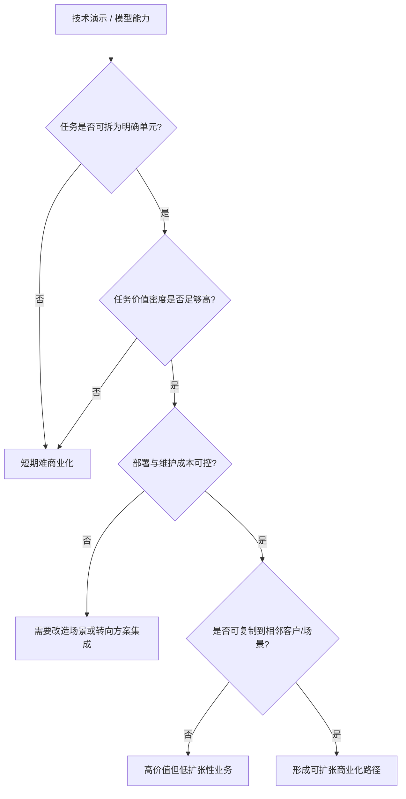

# 第二十三部分 应用落地与商业化

技术路线能否成立，最终要回到场景。很多具身系统在实验室中都能展示能力，但只有少数能在特定场景中把能力、成本、稳定性和维护约束同时平衡出来。因此，本部分的重点不是重复场景分类，而是解释为什么某些场景更容易先跑通，以及商业化究竟被什么约束。这里最关键的判断标准不是“场景是否听起来足够宏大”，而是“场景是否允许局部结构化、是否能容忍有限失误、是否有足够高的价值密度去覆盖机器人系统成本”。

如果把应用落地问题抽象化，可以把单场景可行性理解为以下多因素函数：

\[
\text{Viability} \approx f(\text{task structure}, \text{error tolerance}, \text{labor value}, \text{integration cost}, \text{maintenance burden})
\]

这个表达式虽然不是严格商业模型，但足以说明一个现实：很多“技术上更炫”的场景，反而因为价值密度不足、误差容忍度太低或维护成本过高，而并不适合作为第一波商业化入口。

## 104. 制造业与仓储物流

这仍然是当前最现实的落地方向之一。原因不是技术最简单，而是流程更容易局部结构化、ROI 更可量化、任务价值密度更高、现场维护体系更容易建立。也正因为如此，许多看起来“不够通用”的系统，反而更可能率先在这里形成真实价值。真正先跑出来的，通常不是“会做所有事”的机器人，而是能稳定接管某一类高频、高价值、可重复但又尚未被完全自动化的任务单元。仓储、分拣、搬运与工位协作也是 Agility、Amazon 等案例反复出现的主线。[Agility Robotics](https://agilityrobotics.com/)、[Amazon Robotics](https://www.aboutamazon.com/news/operations/amazon-tests-digit-humanoid-robot)

### 104.1 为什么这类场景总是反复领先
制造、仓储、分拣与搬运场景之所以总是反复领先，并不是因为技术在这里最“先进”，而是因为它们最早满足了一组适合被交付的条件: 任务可分解、价值密度高、收益可核算、失败可兜底、部署环境可被部分改造。也就是说，这类场景的优势不在于问题已经被彻底解决，而在于企业可以通过夹具、动线、工位约束、人工兜底和流程重组，把开放问题先压缩成一个可运营问题。

如果把场景落地能力抽象成一个粗略筛选式：

\[
\text{Deployability} \propto
\frac{\text{task repetition} \times \text{value density} \times \text{verifiability}}
{\text{integration burden} \times \text{failure cost}},
\]

那么制造与仓储的核心优势，通常不是分子绝对最大，而是分母更可控。它们允许企业逐步把复杂任务拆成高频、局部结构化的任务单元，只要系统能稳定接管其中一个高价值片段，就可能先形成真实商业收益。对商业化早期而言，这比一次性追求开放世界通用能力更重要。

因此，本节最值得强调的判断不是“这些场景天然优质”，而是“这些场景最适合沉淀交付能力”。企业在这里真正建立的，往往不只是某个仓储或制造案例，而是一套如何把机器人变成客户可持续使用资产的组织方法: 如何定义任务单元、如何设计人工兜底、如何度量 ROI、如何把异常恢复流程写进运维模板。这些能力一旦形成，才有可能外溢到更复杂场景。

### 104.2 典型任务单元的判断标准

任务单元判断之所以必须细到单元级，而不能停留在“行业/场景”级，是因为真正决定可商业化的往往不是整个行业是否需要机器人，而是某个具体工作片段是否足够结构化、是否容易度量收益、是否允许局部自动化先切入。仓储、制造、巡检、农业这些大类内部，往往同时包含适合早落地和暂不适合落地的子任务。

因此，任务单元的判断必须压到比“行业/场景”更细的层级。真正决定可商业化的，往往不是整个行业是否需要机器人，而是某个具体工作片段是否足够结构化、是否容易度量收益、是否允许局部自动化先切入。对制造与仓储场景，更有意义的不是泛泛说“机器人进工厂/仓库”，而是拆到搬运、上下料、分拣、包装、质检、巡检、工位协作这些最小闭环，再分别问它们需要什么感知、接触、时延与恢复能力。

把这套判断压缩成一个更工程化的筛选式，可以写成：

\[
\text{TaskScore} =
w_1 \cdot \text{observability}
+ w_2 \cdot \text{repeatability}
+ w_3 \cdot \text{value density}
- w_4 \cdot \text{failure cost}
- w_5 \cdot \text{integration burden}
\]

这当然不是为了制造一个可以机械打分的商业公式，而是提醒我们：一个任务单元之所以适合作为具身切入口，几乎从来都不是因为“模型已经足够强”这一条，而是因为观测、恢复、验收、付费和集成五个维度形成了相对有利的组合。很多演示看起来能做的任务，最后死在高失败代价和高集成摩擦；很多看起来不够性感的任务，则因为重复度高、收益明确而率先变成现实业务。

因此，后续评估任何任务单元时，最值得固定记录的问题只有五个：任务输入是否可感知，目标状态是否可验收，失败后是否存在低成本恢复路径，接入现有流程是否需要大规模改造，以及客户是否已经为该环节持续付钱。只有拆到这一层，本章才会真正成为商业判断工具，而不是对几个大行业的宏观赞美。

## 105. 家庭、消费级服务与医疗康复

家庭和消费场景最接近“通用具身终局”，但短期最难规模化；医疗和康复则价值明确，但监管、责任和验证门槛极高。这两类场景都值得长期关注，但不应轻易被视为短期爆发主线。家庭场景最难的不是单个任务，而是开放度极高、语义模糊、对象多样、且任何失误都直接面向终端用户；医疗场景则最难在于即便技术能力不错，也必须先通过责任、流程和合规边界。

### 105.1 这两类场景为什么常被高估
家庭与医疗康复场景之所以常被高估，不是因为它们不重要，而是因为它们同时具备“高可见度”和“高终局想象力”。家庭直接连接大众生活，医疗康复直接连接高价值需求与社会善意，这使它们天然适合承载“未来生活方式改变”的叙事。但从部署角度看，这恰恰是两类最难被快速工程化的场景。

家庭场景的困难，在于开放环境、长尾物体、家庭成员干扰、儿童与宠物共处、长期售后和日常维护条件都远比工业现场复杂。医疗康复的困难，则在于责任链、伦理约束、流程嵌入、设备认证与人工接管边界必须同时成立。也就是说，这两类场景都不是“单次动作做出来”就能成立的场景，而是“整套责任体系和长期运维体系”必须共同成立的场景。

因此，本章对它们采用“长期高价值、短期慢兑现”的判断口径。未来若出现声称在家庭或医疗康复场景取得突破的新系统，最值得优先核查的不是演示视频的流畅度，而是四类证据: 开放环境鲁棒性、长期维护可行性、责任边界清晰度，以及真实用户条件下的长周期使用记录。只要这些证据还薄弱，就不应把它们直接写成短期主线。叙事强度在这里往往与短期可交付性反向相关，这是阅读相关新闻时最需要刻意校正的偏差。

## 106. 农业、建筑、巡检与危险环境

这些场景的共同点，是环境复杂、人工成本高或危险性强，因此即使系统能力不完美，只要显著降低风险或节省成本，就可能具备商业价值。它们也经常更能容纳 shared autonomy 与远程接管路线。也就是说，这些场景对“完全自律”的执念反而更弱，对“显著降低风险”的要求更强。

### 106.1 为什么“半自主”在这些场景里更现实
“半自主”更现实，并不是因为企业不想做全自主，而是因为农业、建筑、巡检和危险环境这类场景同时要求安全、责任可控、客户可接受和逐步上线。系统不一定要在所有条件下 100% 独立完成任务，只要它能稳定接管最危险、最脏累、最耗时或最重复的那部分工作，就已经可能显著改善效率与安全。因此，shared autonomy 在很多时候不是过渡方案，而是商业最优方案。

如果把商业价值粗略写成

\[
\text{Value} \approx
\text{autonomous coverage} \times \text{task value density}
- \text{handoff cost}
- \text{failure cost},
\]

那么高风险复杂场景的关键，往往不是把 `autonomous coverage` 推到 100%，而是把高价值片段稳定接管，并把 `handoff cost` 与 `failure cost` 压到客户可以接受的范围内。Skydio 的工业巡检与公共安全产品线、以及 Boston Dynamics 的 Spot 方案，都长期把远程任务组织、现场运维和任务级自治作为产品形态的一部分，而不是把“完全无人化”当作唯一卖点。[Skydio](https://www.skydio.com/) [Spot](https://bostondynamics.com/spot/)

从系统组织方式看，半自主路线通常可以拆成三层责任分配。机器负责高频、危险或高体力负担片段；人类负责模糊决策、异常确认与责任兜底；运维系统负责监控、远程接入、任务切换和故障恢复。它的价值不在于“将就着只做一半”，而在于重新分配最稀缺的人类注意力，让人不再被迫持续占据低价值、高风险或高疲劳负担环节。

这类系统的最小调度逻辑甚至可以非常朴素：

```python
while mission_active:
    state = robot.observe()
    if policy.confident(state):
        robot.execute(policy.act(state))
    else:
        handoff = remote_operator.resolve(state)
        robot.execute(handoff.action)
    logger.record(state, outcome)
```

真正决定商业成立与否的，不是这段逻辑是否优雅，而是 `policy.confident` 的阈值如何设定、远程接管时延是否可控、单个操作员能覆盖多少台设备、异常恢复成本能否持续下降。也正因如此，分析这类场景时不应迷信“自主率越高越好”，而应优先看任务价值、接管成本与责任边界是否被组织成一个稳定闭环。

## 107. 商业模式

### 107.1 硬件销售
硬件销售模式最容易被误读的一点，在于它表面上卖的是一台机器，实质上卖的是一整套可持续使用能力。只要系统仍然需要频繁校准、复杂维护、远程支持和异常兜底，那么“卖出去一台设备”背后就已经隐含了持续的服务责任。这意味着很多公司以为自己在走轻资产硬件路线，实际上却已经被运维和版本管理重新拖回系统公司逻辑。

因此，判断硬件销售是否成立，不能只看客户是否愿意为本体付费，更要看设备交付后的真实组织负担。若客户必须长期依赖原厂工程师驻场、每次升级都显著影响稳定性、或关键零部件替换成本过高，那么所谓硬件销售很可能只是把后续服务成本隐藏到了合同之外。真正成熟的硬件销售，往往意味着设备、维护和升级边界已经足够清晰，以至于客户可以把它视为一类“可管理资产”，而不是“持续求助的实验系统”。
硬件销售看起来路径最直接，但对具身系统来说，客户实际购买的从来不只是本体，而是围绕本体的一整套可持续使用能力。只要系统还需要频繁校准、复杂维护、版本兼容处理、远程支持和异常兜底，那么“卖一台机器”背后就已经隐含了大量后续服务责任。因此，硬件销售模式真正难的往往不是第一次卖出去，而是卖出去之后能否稳定支撑客户持续使用。

这也是为什么很多具身公司即使起点是卖本体，后续也往往不得不补上软件更新、运维合同、场景适配或数据回流能力。因为在这个行业里，硬件本身通常很难单独构成完整价值闭环。

硬件销售模式最容易被理解，也最容易被高估。它看起来像一条清晰的收入路径，但前提是企业不仅能造出本体，还能持续保障可靠性、维护便利性、备件供应、软件升级和客户培训。若这些后端能力不足，单纯卖硬件往往只会把复杂性推迟，而不会真正消失。

因此，对具身企业而言，硬件销售更像是一种“组织能力充分成熟后才更稳”的模式。若企业尚未建立稳定交付和运维闭环，过早把商业模式压在一次性售卖上，反而可能放大售后压力与客户失望。
硬件销售模式最直接，但也最容易被高估。它看起来简单清晰，实际上却要求企业在本体稳定性、成本结构、交付能力和售后服务上都足够成熟。若没有持续软件更新、维护网络与场景适配能力支撑，单纯卖硬件往往很难形成长期壁垒。
单纯硬件销售的优势，在于路径清晰、客户采购习惯成熟、收入确认直接；弱点则在于毛利和后续持续收益往往受限，而且容易把公司锁定在一次性交付逻辑里。对于具身公司来说，如果没有持续软件升级、维护服务或平台接口能力配套，硬件销售很难单独承载长期高估值逻辑。

适合本体平台型公司，但往往毛利和持续收入结构受限。

更进一步说，硬件销售模式真正考验的，不只是“能否把第一批货卖出去”，而是企业是否已经把售后复杂度前置消化。若每卖出一台机器，背后都隐含大量手工校准、远程支持、现场回访和兼容性修复，那么表面上的一次性收入很可能只是把问题推迟到财务确认之后。因此，研究型报告在看硬件销售时，不应只盯 ASP 或出货量，更应看安装周期、备件消耗、维护频次与版本兼容成本。

这也解释了为什么很多具身公司最终很难停留在“纯卖硬件”。只要系统智能还在快速演化，客户购买的就不可能只是一个静态物件，而更像是一套不断被维护、升级和约束的能力包。也就是说，硬件销售模式在具身行业里天然带有“服务尾巴”，区别只在于这条尾巴是被公司主动设计出来，还是被现实被动拖出来。

### 107.2 解决方案集成
解决方案集成模式之所以在具身领域反复出现，是因为它最适合吸收早期技术的不稳定性。与其要求机器人直接成为标准化产品，不如先把本体、工位改造、感知布局、夹具设计、软件接口和人工兜底一起打包成可交付方案。这样做虽然牺牲了部分标准化程度，却更容易在高价值客户现场率先形成闭环。

但解决方案集成的风险也很明显：它容易把企业推入项目制泥潭。若每拿下一个客户都要重做大量定制开发、重新调夹具、重写接口和重建异常处理流程，那么收入虽然可以增长，能力却不一定真正沉淀。判断这一模式是否健康，关键要看公司是否在每轮项目交付中不断提炼出可复用模块、可复制流程和更稳定的任务模板，而不是只靠项目堆人。
解决方案集成模式的核心优势，在于它允许企业通过工位改造、夹具设计、流程重构、异常回退和人工协同，把“不够通用”的技术能力转化为“足够可交付”的场景能力。也正因为如此，很多没有最强模型叙事的公司，反而更早跑出真实收入，因为它们先学会了如何把局部能力嵌入客户流程。

但这一路线能否走远，取决于项目经验是否持续沉淀为公共模块。若每一个客户项目都要重新定义接口、重新改造现场、重新制定恢复机制，企业就会被困在工程外包形态里，很难形成规模杠杆。

解决方案集成之所以在具身行业里格外常见，是因为它允许企业绕开“先做出通用平台”这一高门槛，直接围绕具体客户、具体流程和具体任务边界提供可交付能力。对很多早期团队来说，这比直接卖通用机器人或押注远期平台化更现实。

但这条路线的风险也很明确：若项目经验始终停留在一次性集成，无法抽象成复用模块和标准接口，公司就可能长期停留在工程项目制，而难以真正进入平台化或规模化产品阶段。因此，判断这条路线时，关键不只是看它能不能交付，而是看交付经验是否正在被沉淀成可复用资产。
解决方案集成模式的本质，是不单卖机器人，而是卖“让某类任务在客户现场跑起来”的完整能力包。它通常包括本体、软件、场景改造、流程接入、运维服务与性能承诺。对很多具身公司而言，这反而是比纯硬件销售更现实的早期商业路径。
解决方案集成往往是早期最现实的商业化路径，因为它允许企业围绕特定客户、特定工艺和特定任务边界做强约束交付。缺点则是扩张速度受限，项目化特征强，容易在不同客户之间重复消耗工程资源。能否把集成经验逐步沉淀为可复用模块，往往决定企业是停留在工程公司，还是有机会进化为平台型公司。

对早期企业更现实，因为它允许围绕特定场景做强约束交付。

解决方案集成路线还有一个经常被低估的价值：它是把隐性场景知识重新编码进系统接口的最快方式。客户现场的夹具位置、物料来向、人工协作节拍、异常重试规则、维护窗口和责任边界，本来都很难直接写进论文；但在解决方案集成过程中，这些知识会被强制翻译成脚本、配置、 SOP、回退逻辑与部署模板。谁更快完成这种翻译，谁就更快拥有把能力压缩成可交付产品的方法论。

因此，评价解决方案公司时，不能只看项目数量，还应看其是否把项目经验沉淀成以下几类公共资产：

1. 可复用工位模板。
2. 统一异常处理流程。
3. 可复用部署检查清单。
4. 跨客户可迁移的数据字段与日志 schema。

如果把解决方案集成路线压缩成一个更工程化的判定问题，可以写成：

\[
\text{集成杠杆率} = \frac{\text{可复用模块数}}{\text{新增客户定制工作量}}
\]

这个写法当然是启发式的，但它抓住了集成路线最关键的现实分水岭：每新增一个客户，企业究竟是在重复从零做项目，还是在复用越来越多的既有资产。前者说明公司仍停留在工程公司形态，后者才意味着它开始把项目知识沉淀成平台能力。

因此，解决方案集成最值得跟踪的，不只是合同数量，而是项目之间的相似性是否在提高、部署 checklist 是否在收敛、异常处理 SOP 是否在模板化。只要这些迹象开始出现，这条路线的商业质量就会与“纯项目制外包”逐步拉开。
5. 可标准化报价与 SLA 结构。

若这些资产持续增加，那么项目制公司就可能逐步向平台化公司演化；若没有，则即使收入存在，也容易长期陷在高人力密度的工程外包结构中。

### 107.3 RaaS
RaaS 最值得被认真看待的地方，不是它听起来“更先进”，而是它把客户侧的不确定性重新分配到了提供方资产负债表里。客户按月或按任务付费，确实降低了前期 `CAPEX` 门槛；但相应地，设备利用率、停机率、远程运维、备件周转、升级窗口和 `SLA` 违约风险，就不再是后台运营细节，而是直接进入单位经济性。这意味着 `RaaS` 不是一句商业包装，而是一种对系统稳定性和服务组织能力要求更高的承诺。

从单位经济性看，RaaS 是否成立，至少要同时满足：

\[
\text{Monthly revenue} >
\text{depreciation} + \text{maintenance} + \text{remote ops} + \text{failure recovery} + \text{customer success}.
\]

这条不等式提醒我们，RaaS 真正考验的不是客户是否愿意听“订阅化”故事，而是提供方是否已经掌握了现场运营。若设备在线率不稳定、故障恢复成本过高、客户现场差异过大，或版本回滚机制不成熟，RaaS 反而会把原本属于客户的风险提前压回企业自身。也就是说，它不是“更轻”的商业模式，而是把系统不稳定性的代价更充分内化。

因此，判断 RaaS 时最值得问的，不是“这个模式听起来先进不先进”，而是企业是否已经形成可度量的 SLA 文化。能否承诺在线率、恢复时间、升级窗口和责任边界；是否具备日志回放、远程维护、故障分级与备件网络；是否能控制场景定制化蔓延，这些都比销售话术更能说明模式是否真的成立。从失败模式看，RaaS 最常见的风险通常有四类: 设备利用率不足、维护成本失控、客户定制化吞噬标准化、资产负债表承受持续扩张压力。只要其中两三项同时恶化，RaaS 就会从“降低客户门槛”的优势，迅速转化为“企业自己背运维与财务压力”的负担。

### 107.4 数据服务与平台模式
平台模式的真正价值，不在于抽象地“做中间层”，而在于是否掌握了能力演进接口。谁能让别人更低成本采数据、做训练、做评测、做部署，谁就可能在价值链上获得比单一整机更持久的杠杆。示教采集平台、仿真生成平台、评测平台、技能商店、模型训练服务和端侧 `runtime`，都可能成为独立商业节点；若成立，它们的壁垒往往比单一硬件 SKU 更耐久，因为它们会持续吸收生态参与者的数据和工作流。

不过，平台模式只有在接口逐步稳定时才成立。当前行业仍高度碎片化，不同本体、动作空间和部署约束差异很大，因此所谓“通用平台”很容易沦为空泛口号。更现实的路线通常不是一开始就覆盖所有机器人，而是先在若干高密度场景中成为事实标准，再向更大范围扩张。Open X-Embodiment 与 NVIDIA Isaac 之所以值得关注，正是因为它们都在尝试把数据协议、训练基础设施和部署工具链组织成可复用底座。相关资料可参见：[Open X-Embodiment 论文](https://arxiv.org/abs/2310.08864)、[NVIDIA Isaac 平台](https://developer.nvidia.com/isaac)。

但平台模式并不等于抽象的云服务口号。对具身行业来说，真正有价值的平台通常至少会在以下一层形成不可轻易替代的黏性：

1. 采数平台：让示教、遥操作、失败回放与质量审计更低成本。
2. 训练平台：让多机器人、多任务、多模态训练更可复现。
3. 评测平台：让 benchmark、回放、红队测试和版本比对更标准化。
4. 部署平台：让边缘推理、监控、回滚和远程诊断更可运营。

若一个所谓“平台”不能显著降低这些环节的摩擦，它就很难在具身行业中形成真正护城河。反过来，只要它在其中任意一层形成事实标准，就可能比某一代具体整机产品拥有更长尾的战略位置。平台模式的本质不是“更抽象”，而是“更贴近能力演进接口”；真正能跑出来的平台，通常不是“理论上最通用”的平台，而是“在一段价值链上最先被大家默认离不开”的平台。

### 107.5 一个更实用的商业化判断顺序
这套判断顺序的关键，不是先问“技术是否足够酷”，而是先问“价值闭环是否已经存在”。一条更稳健的分析顺序通常是：先识别任务单元，再看谁在付费、人工当前成本有多高、部署和维护会不会吃掉价值、最后才问这条路线有没有平台延展空间。这样做可以避免很多典型误判，例如先被宏大平台叙事说服，最后才发现局部任务根本没有稳定付费意愿。

从研究型报告角度看，这一顺序还有一个重要作用：它把技术可行性重新翻译成组织可运营性。哪怕系统已经能完成任务，只要异常恢复需要高强度人工值守、版本升级频繁破坏旧场景稳定性、或停机损失足以吞掉全部收益，它就很难成为可扩张商业模式。也正因此，本章更应把商业化理解为“能力、流程、责任和经济性四者共同闭环”，而不是单看功能演示是否成立。

对任何具身公司，更实用的判断顺序通常是：

1. 它解决了哪个明确任务单元。
2. 这个任务单元的人工替代价值是否足够高。
3. 部署与维护成本是否会吃掉大部分价值。
4. 是否存在可重复扩张到相邻场景的路径。
5. 最终是形成产品、解决方案，还是平台。

这个顺序的价值，在于它先判断“有没有价值闭环”，再讨论“有没有平台上限”。很多具身叙事最容易倒过来思考：先谈终极通用平台，再补想局部场景怎么赚钱；现实通常正好相反，先跑通高价值任务单元，才有机会谈平台延展。也正因为如此，在商业化讨论里必须刻意区分三种经常被混写在一起的“成功”：技术演示成功、客户试点成功、单位经济性成功。很多行业叙事止步于前两层，却被包装成第三层。

shared autonomy 也应在本章被明确视为正式产品形态，而不是只能短暂停留的“过渡方案”。在许多高风险、低频、异常代价高的场景里，客户真正购买的并不是“完全无人”，而是“把最脏、最累、最危险、最不稳定的一部分工作稳定转移给机器，同时保留人在关键节点上的否决权”。若这类组织方式已经能稳定产生价值，它就应被认真计入商业模式，而不应因为自主率不够高就被从商业化视野中剔除。

如果把这一顺序继续写成更可执行的审查表，后续无论看哪家公司或哪类场景，都可以先问：

```text
1. 任务单元是什么？
2. 谁在为该单元付钱？
3. 当前人工方案的真实成本是多少？
4. 机器人方案的部署、维护、接管和停机成本是多少？
5. 客户是否愿意把该环节长期纳入运营流程？
6. 这个单元能否复制到相邻客户或相邻流程？
```

只有当这六个问题都有相对清晰答案时，商业化叙事才值得上修。否则，即使技术演示已经很强，也更适合被归类为“高潜力路线”，而不应直接写成“即将大规模落地”的结论。

若把商业化判断进一步压缩成一个最小可行不等式，则单个任务单元至少要满足：

\[
\Pi_{\text{unit}} = V_{\text{out}} - (C_{\text{robot}} + C_{\text{integration}} + C_{\text{ops}} + C_{\text{failure}}) > 0
\]

其中，\(V_{\text{out}}\) 是吞吐、质量、安全或用工替代带来的净收益，后四项分别对应机器人本体与摊销成本、集成改造成本、持续运维成本和失败恢复/停机代价。很多路线不是死在“做不出来”，而是死在 \(C_{\text{failure}}\) 与 \(C_{\text{ops}}\) 长期高得出乎预期。因此，后续评估应用案例时，最值得固定记录的不是“行业有多大”，而是人工基线成本、系统介入后的净收益、异常接管频率和跨站点复制成本这四类数字。只要这些数字能持续被更新，商业化章节就能逐步从场景罗列转向真正的单位经济性研究。

可以把这套顺序写成一个极简审查器：

```python
def commercial_gate(task):
    if task.value_density <= 0:
        return "no business case"
    if task.recovery_cost > task.margin:
        return "ops risk"
    if task.copy_cost > task.expected_expansion_value:
        return "scaling risk"
    return "worth pilot expansion"
```

## 图 23-1 商业化筛选流程图

源文件：`assets/diagrams/23-商业化筛选流程图.mmd`



## 表 23-1 典型场景任务单元对照表

见 [23-典型场景任务单元对照表](D:/Projects/embodied-intelligence-report/docs/report/current/tables/23-典型场景任务单元对照表.md)。

## 图表与案例补充
本章的图表与案例补充，最重要的不是把场景列得更多，而是把“任务单元 - 约束条件 - 自动化边界 - 商业模式适配”之间的关系固定下来。这样后续新增场景时，就可以直接判断它究竟更接近制造、物流、家庭服务还是高风险环境，而不是每次重新发明一套分类语言。

在长期版本维护中，这一章尤其适合沉淀三类案例。第一类是“先在狭窄场景成功，再逐步扩边界”的正例；第二类是“演示很强但单位经济性始终不闭合”的反例；第三类是“通过人在回路或远程接管先形成业务，再逐步提高自主度”的过渡型案例。只有三类案例并列，商业化章节才不会被单边叙事带偏。

应用落地章节中的图表补充，核心目标是把“商业化判断”从泛泛叙事变成结构化筛选。对具身智能而言，真正决定一个场景能否先跑通的，往往不是展示是否震撼，而是任务结构化程度、误差后果、维护负担和价值密度是否同时满足部署条件。

因此，本章图表不应只是总结性的可视化，而应服务于一个更实用的问题：面对一个新场景时，研究者或分析者应怎样快速判断它更接近“值得进入的商业入口”，还是“更适合作为长期研发目标”。这也是后续版本继续增补行业案例时最值得复用的分析骨架。

在当前版本中，`图 23-1 商业化筛选流程图` 已承担“从能力演示到可复制部署”的主流程表达；`表 23-1 典型场景任务单元对照表` 则把制造、仓储、巡检、农业、家庭、医疗等场景的误差容忍度、维护难度、监管强度与 ROI 可见性放入统一比较口径。

“值不值得先做”的问题，最终需要被转译成半结构化的 ROI 判断，而不是只停留在定性描述上。[23-场景ROI粗估模板](D:/Projects/embodied-intelligence-report/docs/report/current/tables/23-场景ROI粗估模板.md) 的作用，正是在“人工成本替代、部署改造成本、维护负担、责任风险和复制难度”之间建立统一口径，使场景优先级讨论具备跨版本可更新性。

后续如果要把这一章真正用作季度判断工具，建议同时配合 [23-典型场景任务单元对照表](D:/Projects/embodied-intelligence-report/docs/report/current/tables/23-典型场景任务单元对照表.md) 和 [23-场景ROI粗估模板](D:/Projects/embodied-intelligence-report/docs/report/current/tables/23-场景ROI粗估模板.md) 使用。前者负责拆任务单元，后者负责把“值不值得先做”写成统一粗估口径。

若后续更偏向结构化维护，则可以优先使用 [23-场景ROI粗估模板-脚本生成版](D:/Projects/embodied-intelligence-report/docs/report/current/tables/23-场景ROI粗估模板-脚本生成版.md)。这样场景字段可以先在 `data/processed/场景ROI粗估模板-v0.0.csv` 中修改，再统一导出，避免正文表格和底层字段长期分叉。
