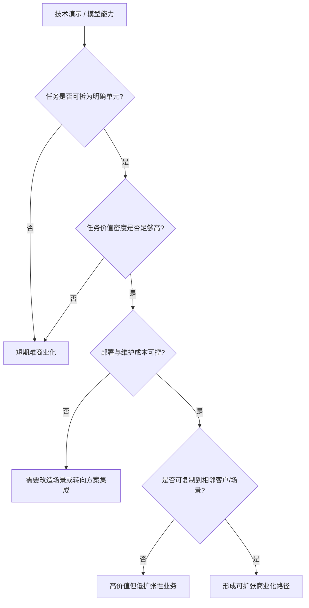

# 第二十三部分 应用落地与商业化

技术路线能否成立，最终要回到场景。很多具身系统在实验室中都能展示能力，但只有少数能在特定场景中把能力、成本、稳定性和维护约束同时平衡出来。因此，本部分的重点不是重复场景分类，而是解释为什么某些场景更容易先跑通，以及商业化究竟被什么约束。这里最关键的判断标准不是“场景是否听起来足够宏大”，而是“场景是否允许局部结构化、是否能容忍有限失误、是否有足够高的价值密度去覆盖机器人系统成本”。

如果把应用落地问题抽象化，可以把单场景可行性理解为以下多因素函数：

\[
\text{Viability} \approx f(\text{task structure}, \text{error tolerance}, \text{labor value}, \text{integration cost}, \text{maintenance burden})
\]

这个表达式虽然不是严格商业模型，但足以说明一个现实：很多“技术上更炫”的场景，反而因为价值密度不足、误差容忍度太低或维护成本过高，而并不适合作为第一波商业化入口。

## 104. 制造业与仓储物流

这仍然是当前最现实的落地方向之一。原因不是技术最简单，而是流程更容易局部结构化、ROI 更可量化、任务价值密度更高、现场维护体系更容易建立。也正因为如此，许多看起来“不够通用”的系统，反而更可能率先在这里形成真实价值。真正先跑出来的，通常不是“会做所有事”的机器人，而是能稳定接管某一类高频、高价值、可重复但又尚未被完全自动化的任务单元。仓储、分拣、搬运与工位协作也是 Agility、Amazon 等案例反复出现的主线。[Agility Robotics](https://agilityrobotics.com/)、[Amazon Robotics](https://www.aboutamazon.com/news/operations/amazon-tests-digit-humanoid-robot)

### 104.1 为什么这类场景总是反复领先
这些场景反复领先，根本原因并不是技术在这里最简单，而是它们最早满足了“局部结构化 + 价值密度高 + 失败可管控 + ROI 可计算”这组商业化条件。制造、仓储、分拣与搬运任务虽然看似不够“终极”，但其输入边界、节拍要求、验收标准与人工替代成本往往都比家庭或开放服务场景更清晰，因此更适合把技术能力转化成稳定交付。

如果把场景落地能力抽象成一个粗略筛选式：

\[
\text{Deployability} \propto
\frac{\text{task repetition} \times \text{value density} \times \text{verifiability}}
{\text{integration burden} \times \text{failure cost}}
\]

那么制造与仓储往往不是分子绝对最大，而是分母更可控。它们允许企业通过工位改造、夹具设计、动线约束和人工兜底，把复杂开放问题压缩成可运营问题。这一点在现实里常常比单次模型精度提升更决定落地先后。

因此，本节最重要的不是把这些场景神化成“天然优质赛道”，而是把它们理解为最适合沉淀交付能力的训练场。很多企业真正建立的，不只是一个仓储或制造案例，而是一套“如何把具身系统变成客户可持续使用资产”的组织能力。
这些场景之所以反复领先，通常不是因为技术在这里最先进，而是因为它们同时满足几个现实条件：任务重复度高、收益指标清晰、环境可部分结构化、错误成本可管理、客户有明确 ROI 口径。也就是说，领先场景首先是“适合被交付”的场景，而不是“最能展示未来愿景”的场景。
这些场景之所以反复领先，并不是因为技术问题已经被解决，而是因为它们更容易把任务切成高频、局部结构化、价值可计量的单元。只要一个系统能稳定接管其中一个单元，就可能在局部流程中创造足够价值，而不必一开始就完成通用智能愿景。这使制造与仓储更像具身商业化的“局部突破市场”，而不是终局形态，却恰好最适合早期系统沉淀部署经验。

其根本原因并不是“机器人更容易做”，而是这里的任务边界、收益计算、部署环境与维护流程相对更可工程化。也就是说，这些场景先跑通，更像是约束条件更友好，而不是技术问题已经被根治。

### 104.2 典型任务单元的判断标准

任务单元判断之所以必须细到单元级，而不能停留在“行业/场景”级，是因为真正决定可商业化的往往不是整个行业是否需要机器人，而是某个具体工作片段是否足够结构化、是否容易度量收益、是否允许局部自动化先切入。仓储、制造、巡检、农业这些大类内部，往往同时包含适合早落地和暂不适合落地的子任务。

因此，评估时更应问的是：该任务的输入是否稳定、动作后果是否可验证、错误是否可控、接管是否容易、收益是否可量化。只有拆到这一层，商业化分析才真正具备工程可操作性，而不会停留在“看起来这个行业很大”的宏观判断。
判断一个任务单元是否适合先落地，核心要看五件事：输入是否相对可感知、动作后果是否相对可验证、失败代价是否可控、人工当前成本是否足够高、以及部署后是否能形成稳定重复。只要其中几项明显不成立，再强的技术演示也很难转化为商业闭环。反过来，哪怕系统并不通用，只要在这些条件上占优，就可能构成优先落地入口。

对制造与仓储场景，更有意义的不是泛泛说“机器人进工厂/仓库”，而是拆到任务单元层：搬运、上下料、分拣、包装、质检、巡检、工位协作分别需要什么感知、接触、时延与恢复能力。只有这样，商业化分析才不会停留在口号层。

如果把任务单元进一步抽象，一个具身任务要成为早期商业入口，通常至少满足：输入边界相对清晰、输出成功条件可被验证、失败不会立刻造成不可接受损失、以及人工当前确实昂贵或危险。这个判断法之所以重要，是因为它能帮助我们避免把“行业很大”误写成“任务适合先自动化”。

把这套判断再压缩成一个更工程化的筛选式，可以写成：

\[
\text{TaskScore} =
w_1 \cdot \text{observability}
+ w_2 \cdot \text{repeatability}
+ w_3 \cdot \text{value density}
- w_4 \cdot \text{failure cost}
- w_5 \cdot \text{integration burden}
\]

这当然不是为了制造一个可以机械打分的商业公式，而是提醒我们：一个任务单元之所以适合作为具身切入口，几乎从来都不是因为“模型已经足够强”这一条，而是因为观测、恢复、验收、付费和集成五个维度形成了相对有利的组合。很多演示看起来能做的任务，最后死在高失败代价和高集成摩擦；很多看起来不够性感的任务，则因为重复度高、收益明确而率先变成现实业务。

从部署角度，还应把任务单元继续拆成最小闭环问题：

1. 任务输入是否可感知。
2. 目标状态是否可验证。
3. 失败后是否存在低成本恢复路径。
4. 接入现有流程是否需要大规模改造。
5. 客户是否已经为该环节持续付钱。

只有拆到这一层，本章才会真正成为商业判断工具，而不是对几个大行业的宏观赞美。

## 105. 家庭、消费级服务与医疗康复

家庭和消费场景最接近“通用具身终局”，但短期最难规模化；医疗和康复则价值明确，但监管、责任和验证门槛极高。这两类场景都值得长期关注，但不应轻易被视为短期爆发主线。家庭场景最难的不是单个任务，而是开放度极高、语义模糊、对象多样、且任何失误都直接面向终端用户；医疗场景则最难在于即便技术能力不错，也必须先通过责任、流程和合规边界。

### 105.1 这两类场景为什么常被高估

家庭与医疗康复场景常被高估，一个根本原因在于它们天然承载了太多“终局想象”。家庭直接连接大众日常生活，医疗康复则直接连接高价值、高需求和社会善意，因此外界很容易把它们想象成具身系统最值得优先攻克的方向。

但从落地顺序看，这恰恰是最容易被叙事强度误导的地方。家庭场景的开放性、对象多样性和交互不确定性极高；医疗康复则在责任、伦理、监管和可验证性上门槛极高。它们当然重要，但重要不等于短期最适合率先形成大规模可复制交付。
被高估的根源，在于这两类场景太适合承载“终极想象”。家庭场景直接连接大众生活，医疗康复直接连接高价值需求，因此它们天然具有极强叙事吸引力。但从部署视角看，它们恰恰在开放性、责任界面、异常代价和个体差异上最棘手。也就是说，它们离“最值得做”很近，却离“最先做成”往往很远。

因为它们最容易承载“未来生活方式改变”的叙事想象，但最难满足部署所需的可验证性和责任可分配性。换言之，叙事强度与短期可落地性在这里往往反向相关。

这并不意味着这两类场景不重要，而是意味着阅读相关新闻时必须刻意切换口径。对家庭场景，应优先问系统是否在开放环境、儿童或宠物干扰、物体多样性和长期维护上给出证据；对医疗康复场景，则应优先问责任、流程嵌入、验证协议和人工接管边界。只要这些证据还薄弱，就不应把其直接写成短期主线。

更细一点说，家庭与医疗康复反复被高估，通常都伴随着三种叙事放大器：

1. 对普通人可见，因此 demo 的传播效率极高。
2. 与“通用智能终局”想象高度重叠，因此容易承载过高预期。
3. 用户价值直觉强，因此外界容易忽略异常代价、责任链和维护负担。

但恰恰因为这三点，分析时更需要反向冷处理。家庭场景最难的不是让机器人完成某个单次家务动作，而是让它在开放环境、复杂家庭成员互动、物体长尾分布和长期售后条件下稳定存在。医疗康复最难的也不是辅助动作能否做出，而是临床流程、认证责任、设备维护和人工接管边界能否共同接住系统风险。

因此，本章对这两类场景采用“长期高价值、短期慢兑现”的判断口径。未来若出现声称在家庭或医疗康复场景取得突破的新系统，最值得优先核查的也不是演示视频质量，而是其责任边界是否清楚、恢复机制是否完备、以及是否已经出现足够长周期的真实使用证据。

## 106. 农业、建筑、巡检与危险环境

这些场景的共同点，是环境复杂、人工成本高或危险性强，因此即使系统能力不完美，只要显著降低风险或节省成本，就可能具备商业价值。它们也经常更能容纳 shared autonomy 与远程接管路线。也就是说，这些场景对“完全自律”的执念反而更弱，对“显著降低风险”的要求更强。

### 106.1 为什么“半自主”在这些场景里更现实
“半自主”更现实，并不是因为企业不想做全自主，而是因为很多高价值场景都同时要求安全、责任可控、客户可接受和逐步上线。人在回路、远程接管、任务阶段确认和异常时人工决策，往往能显著降低部署门槛，使系统更早产生商业价值。

从商业化角度看，半自主不是退而求其次，而经常是从 0 到 1 的最优组织方式。
半自主更现实，不是因为它是退而求其次，而是因为它更符合价值生成结构。在高风险、低频、复杂环境里，系统不一定要 100% 自主才能创造价值；只要它能稳定接管最危险、最耗时、最重复或最脏累的那部分工作，就已经可能显著改善效率与安全。因此，把 shared autonomy 看成产品形态而不是过渡形态，往往更接近这些行业的真实采用逻辑。

因为这些场景很多时候不要求机器人在所有条件下独立完成全部流程，只要求它在高风险、高重复或高耗时片段上稳定创造价值。于是，shared autonomy、远程接管和人机协同就不再是“过渡方案”，而可能是商业最优方案。

对商业化判断而言，这一点很关键，因为它会直接改变我们看待“自主率”的方式。若一个系统把最贵、最危险或最耗时的 30% 工作稳定接管下来，它可能已经比一个理论上能做更多、但始终不稳的全自主系统更有商业价值。也就是说，商业最优解未必等于自主度最高解。

从系统组织方式看，半自主路线通常可以拆成三层责任分配：

1. 机器负责高频、重复、危险或高体力负担片段。
2. 人类负责模糊决策、异常确认和责任兜底。
3. 运维系统负责监控、任务切换、远程接入和故障恢复。

它的价值不在于“先将就着做一半”，而在于重新分配最稀缺的人类注意力。只要系统能稳定接管最危险、最脏累或最耗时的局部工作，客户就已经可能愿意为之付费。

这类系统的最小调度逻辑甚至可以非常朴素：

```python
while mission_active:
    state = robot.observe()
    if policy.confident(state):
        robot.execute(policy.act(state))
    else:
        handoff = remote_operator.resolve(state)
        robot.execute(handoff.action)
    logger.record(state, outcome)
```

真正决定商业成立与否的，不是这段逻辑是否优雅，而是 `policy.confident` 的阈值如何设定、远程接管时延是否可控、单个操作员能覆盖多少台设备、异常恢复成本能否持续下降。也正因如此，shared autonomy 在许多高风险场景里应被视为正式产品形态，而不是必须尽快淘汰的权宜之计。

## 107. 商业模式

### 107.1 硬件销售
硬件销售看起来路径最直接，但对具身系统来说，客户实际购买的从来不只是本体，而是围绕本体的一整套可持续使用能力。只要系统还需要频繁校准、复杂维护、版本兼容处理、远程支持和异常兜底，那么“卖一台机器”背后就已经隐含了大量后续服务责任。因此，硬件销售模式真正难的往往不是第一次卖出去，而是卖出去之后能否稳定支撑客户持续使用。

这也是为什么很多具身公司即使起点是卖本体，后续也往往不得不补上软件更新、运维合同、场景适配或数据回流能力。因为在这个行业里，硬件本身通常很难单独构成完整价值闭环。

硬件销售模式最容易被理解，也最容易被高估。它看起来像一条清晰的收入路径，但前提是企业不仅能造出本体，还能持续保障可靠性、维护便利性、备件供应、软件升级和客户培训。若这些后端能力不足，单纯卖硬件往往只会把复杂性推迟，而不会真正消失。

因此，对具身企业而言，硬件销售更像是一种“组织能力充分成熟后才更稳”的模式。若企业尚未建立稳定交付和运维闭环，过早把商业模式压在一次性售卖上，反而可能放大售后压力与客户失望。
硬件销售模式最直接，但也最容易被高估。它看起来简单清晰，实际上却要求企业在本体稳定性、成本结构、交付能力和售后服务上都足够成熟。若没有持续软件更新、维护网络与场景适配能力支撑，单纯卖硬件往往很难形成长期壁垒。
单纯硬件销售的优势，在于路径清晰、客户采购习惯成熟、收入确认直接；弱点则在于毛利和后续持续收益往往受限，而且容易把公司锁定在一次性交付逻辑里。对于具身公司来说，如果没有持续软件升级、维护服务或平台接口能力配套，硬件销售很难单独承载长期高估值逻辑。

适合本体平台型公司，但往往毛利和持续收入结构受限。

更进一步说，硬件销售模式真正考验的，不只是“能否把第一批货卖出去”，而是企业是否已经把售后复杂度前置消化。若每卖出一台机器，背后都隐含大量手工校准、远程支持、现场回访和兼容性修复，那么表面上的一次性收入很可能只是把问题推迟到财务确认之后。因此，研究型报告在看硬件销售时，不应只盯 ASP 或出货量，更应看安装周期、备件消耗、维护频次与版本兼容成本。

这也解释了为什么很多具身公司最终很难停留在“纯卖硬件”。只要系统智能还在快速演化，客户购买的就不可能只是一个静态物件，而更像是一套不断被维护、升级和约束的能力包。也就是说，硬件销售模式在具身行业里天然带有“服务尾巴”，区别只在于这条尾巴是被公司主动设计出来，还是被现实被动拖出来。

### 107.2 解决方案集成
解决方案集成模式的核心优势，在于它允许企业通过工位改造、夹具设计、流程重构、异常回退和人工协同，把“不够通用”的技术能力转化为“足够可交付”的场景能力。也正因为如此，很多没有最强模型叙事的公司，反而更早跑出真实收入，因为它们先学会了如何把局部能力嵌入客户流程。

但这一路线能否走远，取决于项目经验是否持续沉淀为公共模块。若每一个客户项目都要重新定义接口、重新改造现场、重新制定恢复机制，企业就会被困在工程外包形态里，很难形成规模杠杆。

解决方案集成之所以在具身行业里格外常见，是因为它允许企业绕开“先做出通用平台”这一高门槛，直接围绕具体客户、具体流程和具体任务边界提供可交付能力。对很多早期团队来说，这比直接卖通用机器人或押注远期平台化更现实。

但这条路线的风险也很明确：若项目经验始终停留在一次性集成，无法抽象成复用模块和标准接口，公司就可能长期停留在工程项目制，而难以真正进入平台化或规模化产品阶段。因此，判断这条路线时，关键不只是看它能不能交付，而是看交付经验是否正在被沉淀成可复用资产。
解决方案集成模式的本质，是不单卖机器人，而是卖“让某类任务在客户现场跑起来”的完整能力包。它通常包括本体、软件、场景改造、流程接入、运维服务与性能承诺。对很多具身公司而言，这反而是比纯硬件销售更现实的早期商业路径。
解决方案集成往往是早期最现实的商业化路径，因为它允许企业围绕特定客户、特定工艺和特定任务边界做强约束交付。缺点则是扩张速度受限，项目化特征强，容易在不同客户之间重复消耗工程资源。能否把集成经验逐步沉淀为可复用模块，往往决定企业是停留在工程公司，还是有机会进化为平台型公司。

对早期企业更现实，因为它允许围绕特定场景做强约束交付。

解决方案集成路线还有一个经常被低估的价值：它是把隐性场景知识重新编码进系统接口的最快方式。客户现场的夹具位置、物料来向、人工协作节拍、异常重试规则、维护窗口和责任边界，本来都很难直接写进论文；但在解决方案集成过程中，这些知识会被强制翻译成脚本、配置、 SOP、回退逻辑与部署模板。谁更快完成这种翻译，谁就更快拥有把能力压缩成可交付产品的方法论。

因此，评价解决方案公司时，不能只看项目数量，还应看其是否把项目经验沉淀成以下几类公共资产：

1. 可复用工位模板。
2. 统一异常处理流程。
3. 可复用部署检查清单。
4. 跨客户可迁移的数据字段与日志 schema。

如果把解决方案集成路线压缩成一个更工程化的判定问题，可以写成：

\[
\text{Integration leverage} = \frac{\text{可复用模块数}}{\text{新增客户定制工作量}}
\]

这个写法当然是启发式的，但它抓住了集成路线最关键的现实分水岭：每新增一个客户，企业究竟是在重复从零做项目，还是在复用越来越多的既有资产。前者说明公司仍停留在工程公司形态，后者才意味着它开始把项目知识沉淀成平台能力。

因此，解决方案集成最值得跟踪的，不只是合同数量，而是项目之间的相似性是否在提高、部署 checklist 是否在收敛、异常处理 SOP 是否在模板化。只要这些迹象开始出现，这条路线的商业质量就会与“纯项目制外包”逐步拉开。
5. 可标准化报价与 SLA 结构。

若这些资产持续增加，那么项目制公司就可能逐步向平台化公司演化；若没有，则即使收入存在，也容易长期陷在高人力密度的工程外包结构中。

### 107.3 RaaS
RaaS 的核心吸引力在于把客户购买逻辑从一次性采购转成持续服务付费，从而降低前期资本支出门槛，并让供应商保留升级、运维与数据回流接口。但这也意味着系统稳定性风险并没有消失，而是被重新分配给了提供方。谁承诺可用率，谁就必须承担更高的远程监控、维护响应、备件管理和版本回滚责任。

从单位经济性看，RaaS 是否成立，至少要同时满足：

\[
\text{Monthly revenue} >
\text{depreciation} + \text{maintenance} + \text{remote ops} + \text{failure recovery} + \text{customer success}
\]

很多公司会把 RaaS 说成更“轻”的商业模式，但它实际上要求企业更重地掌握现场运营。若没有足够高的设备在线率、足够低的故障恢复成本以及足够标准化的场景复制能力，RaaS 反而会把财务压力和服务压力前置到企业自己身上。

因此，判断 RaaS 时不能只看客户是否愿意订阅，更要看提供方是否已经具备服务化组织能力。真正成熟的 RaaS 公司，卖的不是一台机器人，而是“在约定 SLA 下持续交付某项任务能力”的能力包。这与单纯硬件销售在组织能力上几乎是两种公司。
RaaS（Robot-as-a-Service）之所以有吸引力，是因为它把客户的一次性资本支出转化为持续运营支出，也让机器人供应商有机会把维护、升级和数据回流留在自己手里。但它也意味着企业必须长期承担设备可用率、维护成本和服务能力压力，因此并不是简单把销售合同换成订阅合同。
RaaS 的吸引力在客户侧，但风险在提供方侧。客户更容易接受按服务付费、降低前期 CAPEX 的方案；而提供方则必须承担更高的运行稳定性压力、维护成本和服务水平承诺。换句话说，RaaS 不是“更轻”的模式，而是把系统不稳定性的代价更多内化到企业自身。只有当公司对运维、远程监控、异常回收和版本管理足够有把握时，RaaS 才可能真正成立。

机器人即服务的吸引力在于降低客户前期门槛，但前提是企业自己能承担运维和稳定性压力。RaaS 看起来是更轻的客户购买路径，实际上却把稳定性和维护复杂度压回到了提供方身上。

RaaS 路线最容易被忽视的一点，是它把“技术风险”直接转成了“资产负债表风险”。一旦客户按月付费，设备利用率、维修停机、现场回访与备件周转就不再只是运营细节，而会直接进入单位经济性。也正因为如此，RaaS 的难点常常不是客户愿不愿意听这个故事，而是公司是否已经足够了解自己系统的故障分布、维护节奏和远程诊断能力。

从研究型判断角度看，最值得问的并不是“RaaS 听起来是否先进”，而是这家公司是否已经拥有可度量的 SLA 文化。能否明确承诺在线率、恢复时间、升级窗口和责任边界，往往比商业包装本身更能说明 RaaS 是否真的成立。缺少这些条件时，RaaS 很容易只是把销售困难改写成服务压力，而不是创造更优商业结构。

### 107.4 数据服务与平台模式
数据服务与平台模式的吸引力，在于它有机会成为整个行业的中间层基础设施。谁掌握示教采集、仿真合成、训练调度、评测审计、端侧部署和日志回放这些能力，谁就可能比单一硬件供应商拥有更强的长期杠杆。对不准备直接卖整机的团队而言，“让别人更快训练、验证和部署具身系统”本身就可能是一条足够厚的商业路径。

不过，这条路成立的前提是接口逐步稳定。当前行业仍高度碎片化，不同本体、动作空间和部署约束差异很大，因此所谓“通用平台”很容易沦为空泛口号。更现实的路线通常是先在若干高密度场景中成为事实标准，再向更大范围扩张。
数据服务与平台模式的核心，不在于“把数据卖出去”，而在于企业是否建立起某种可复用的数据与开发基础设施，例如示教采集平台、仿真生成平台、评测平台、技能商店或模型训练服务。若成立，它的壁垒往往比单一硬件 SKU 更耐久，因为它会持续吸收生态参与者的数据和工作流。
这一路径之所以值得关注，是因为具身产业并不一定只会由卖机器人整机的公司主导。谁掌握数据协议、仿真基础设施、训练平台、评测工具链和端侧部署栈，谁也可能成为行业价值链上的关键节点。平台型公司未必直接拥有最多机器人，但可能拥有最多“让机器人持续进化的基础设施”。

随着 foundation model 和仿真生态发展，数据、训练与部署基础设施本身也可能成为商业模式。Open X-Embodiment、Isaac 平台以及各类数据引擎路线都说明，未来不只有“卖机器人”一条路。[Open X-Embodiment](https://arxiv.org/abs/2310.08864)、[NVIDIA Isaac](https://developer.nvidia.com/isaac)

这一路线尤其值得长期跟踪，因为它可能把行业价值中心从“谁卖出更多机器人”部分转向“谁掌握更多能力演进接口”。在这种格局里，掌握数据协议、训练流水线、评测平台和端侧部署栈的公司，即便并不直接拥有最多终端设备，也可能占据更高杠杆的位置。

但平台模式并不等于抽象的云服务口号。对具身行业来说，真正有价值的平台通常至少会在以下一层形成不可轻易替代的黏性：

1. 采数平台：让示教、遥操作、失败回放与质量审计更低成本。
2. 训练平台：让多机器人、多任务、多模态训练更可复现。
3. 评测平台：让 benchmark、回放、红队测试和版本比对更标准化。
4. 部署平台：让边缘推理、监控、回滚和远程诊断更可运营。

若一个所谓“平台”不能显著降低这些环节的摩擦，它就很难在具身行业中形成真正护城河。反过来，只要它在其中任意一层形成事实标准，就可能比某一代具体整机产品拥有更长尾的战略位置。

平台模式真正值得高看的地方，在于它一旦成立，常常会比单一 SKU 更能跨越技术代际变化。今天是某类 VLA、明天可能是另一类动作生成模型，但如果数据协议、回放工具、评测流水线和部署 runtime 仍掌握在同一批平台型主体手里，那么行业价值中心就会自然向中间层聚集。也就是说，平台模式的本质不是“更抽象”，而是“更贴近能力演进接口”。

不过，这也意味着平台路线必须比看起来更克制。它不应试图一开始就覆盖所有机器人类型、所有动作空间和所有客户流程，而应先在高密度主线中变成事实标准。对具身行业来说，真正能跑出来的平台，通常不是“理论上最通用”的平台，而是“在一段价值链上最先被大家默认离不开”的平台。

### 107.5 一个更实用的商业化判断顺序
更进一步说，这个顺序本质上是在把“技术可行性”重新翻译成“组织可运营性”。一个机器人方案即使在技术上能完成任务，只要异常恢复需要高强度人工值守、部署前校准成本过高、系统升级会频繁破坏旧场景稳定性，它就仍然很难形成可扩张商业模式。因此，商业化分析不能停在功能完成，而要继续追问单位经济性、交付摩擦和运维可复制性。
这个判断顺序的价值，在于它先压住了“平台幻想”，先问清是否存在真实价值闭环，再讨论能否外溢到更大平台空间。很多具身叙事最容易倒过来思考：先谈终极通用平台，再补想局部场景怎么赚钱。现实通常正好相反，先跑通高价值任务单元，才有机会谈平台延展。

对任何具身公司，更实用的判断顺序通常是：

1. 它解决了哪个明确任务单元。
2. 这个任务单元的人工替代价值是否足够高。
3. 部署与维护成本是否会吃掉大部分价值。
4. 是否存在可重复扩张到相邻场景的路径。
5. 最终是形成产品、解决方案，还是平台。

这个顺序的好处在于，它先判断“有没有价值闭环”，再讨论“有没有平台上限”。

本部分的结论是：具身智能的商业化不会沿单一路径爆发，而更可能是“若干高约束场景先落地、若干平台生态逐步成形、少数通用路线长期拉升上限”的并行演化。判断商业化最有效的问题也许不是“这家公司是不是在做通用智能”，而是“它究竟在哪个任务单元上已经建立起稳定价值”。

在商业化讨论里，还应刻意区分三种经常被混写在一起的“成功”：技术演示成功、客户试点成功、单位经济性成功。技术演示成功说明系统在受控条件下可完成任务；客户试点成功说明系统在特定现场可被流程接纳；单位经济性成功则要求系统在部署、维护、人工接管、折旧与升级成本全部计入后仍然成立。很多行业叙事止步于前两层，却被包装成第三层。后续阅读企业案例时，应始终追问它究竟处在哪一层，否则商业化判断会系统性偏乐观。

shared autonomy 也应在本章被明确视为正式产品形态，而不是只能短暂停留的“过渡方案”。在许多高风险、低频、异常代价高的场景里，客户真正购买的并不是“完全无人”，而是“把最脏、最累、最危险、最不稳定的一部分工作稳定转移给机器，同时保留人在关键节点上的否决权”。若这类组织方式已经能稳定产生价值，它就应被认真计入商业模式，而不应因为自主率不够高就被从商业化视野中剔除。

如果把这一顺序继续写成更可执行的审查表，后续无论看哪家公司或哪类场景，都可以先问：

```text
1. 任务单元是什么？
2. 谁在为该单元付钱？
3. 当前人工方案的真实成本是多少？
4. 机器人方案的部署、维护、接管和停机成本是多少？
5. 客户是否愿意把该环节长期纳入运营流程？
6. 这个单元能否复制到相邻客户或相邻流程？
```

只有当这六个问题都有相对清晰答案时，商业化叙事才值得上修。否则，即使技术演示已经很强，也更适合被归类为“高潜力路线”，而不应直接写成“即将大规模落地”的结论。

## 图 23-1 商业化筛选流程图

源文件：`assets/diagrams/23-商业化筛选流程图.mmd`



## 表 23-1 典型场景任务单元对照表

见 [23-典型场景任务单元对照表](D:/Projects/embodied-intelligence-report/docs/report/current/tables/23-典型场景任务单元对照表.md)。

## 图表与案例补充
本章的图表与案例补充，最重要的不是把场景列得更多，而是把“任务单元 - 约束条件 - 自动化边界 - 商业模式适配”之间的关系固定下来。这样后续新增场景时，就可以直接判断它究竟更接近制造、物流、家庭服务还是高风险环境，而不是每次重新发明一套分类语言。

在长期版本维护中，这一章尤其适合沉淀三类案例。第一类是“先在狭窄场景成功，再逐步扩边界”的正例；第二类是“演示很强但单位经济性始终不闭合”的反例；第三类是“通过人在回路或远程接管先形成业务，再逐步提高自主度”的过渡型案例。只有三类案例并列，商业化章节才不会被单边叙事带偏。

应用落地章节中的图表补充，核心目标是把“商业化判断”从泛泛叙事变成结构化筛选。对具身智能而言，真正决定一个场景能否先跑通的，往往不是展示是否震撼，而是任务结构化程度、误差后果、维护负担和价值密度是否同时满足部署条件。

因此，本章图表不应只是总结性的可视化，而应服务于一个更实用的问题：面对一个新场景时，研究者或分析者应怎样快速判断它更接近“值得进入的商业入口”，还是“更适合作为长期研发目标”。这也是后续版本继续增补行业案例时最值得复用的分析骨架。

在当前版本中，`图 23-1 商业化筛选流程图` 已承担“从能力演示到可复制部署”的主流程表达；`表 23-1 典型场景任务单元对照表` 则把制造、仓储、巡检、农业、家庭、医疗等场景的误差容忍度、维护难度、监管强度与 ROI 可见性放入统一比较口径。

“值不值得先做”的问题，最终需要被转译成半结构化的 ROI 判断，而不是只停留在定性描述上。[23-场景ROI粗估模板](D:/Projects/embodied-intelligence-report/docs/report/current/tables/23-场景ROI粗估模板.md) 的作用，正是在“人工成本替代、部署改造成本、维护负担、责任风险和复制难度”之间建立统一口径，使场景优先级讨论具备跨版本可更新性。

后续如果要把这一章真正用作季度判断工具，建议同时配合 [23-典型场景任务单元对照表](D:/Projects/embodied-intelligence-report/docs/report/current/tables/23-典型场景任务单元对照表.md) 和 [23-场景ROI粗估模板](D:/Projects/embodied-intelligence-report/docs/report/current/tables/23-场景ROI粗估模板.md) 使用。前者负责拆任务单元，后者负责把“值不值得先做”写成统一粗估口径。

若后续更偏向结构化维护，则可以优先使用 [23-场景ROI粗估模板-脚本生成版](D:/Projects/embodied-intelligence-report/docs/report/current/tables/23-场景ROI粗估模板-脚本生成版.md)。这样场景字段可以先在 `data/processed/场景ROI粗估模板-v0.0.csv` 中修改，再统一导出，避免正文表格和底层字段长期分叉。
