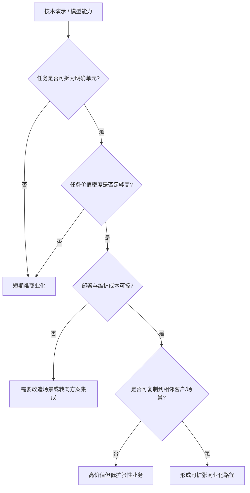

# 第二十三部分 应用落地与商业化

技术路线能否成立，最终要回到场景。很多具身系统在实验室中都能展示能力，但只有少数能在特定场景中把能力、成本、稳定性和维护约束同时平衡出来。因此，本部分的重点不是重复场景分类，而是解释为什么某些场景更容易先跑通，以及商业化究竟被什么约束。这里最关键的判断标准不是“场景是否听起来足够宏大”，而是“场景是否允许局部结构化、是否能容忍有限失误、是否有足够高的价值密度去覆盖机器人系统成本”。

如果把应用落地问题抽象化，可以把单场景可行性理解为以下多因素函数：

\[
\text{Viability} \approx f(\text{task structure}, \text{error tolerance}, \text{labor value}, \text{integration cost}, \text{maintenance burden})
\]

这个表达式虽然不是严格商业模型，但足以说明一个现实：很多“技术上更炫”的场景，反而因为价值密度不足、误差容忍度太低或维护成本过高，而并不适合作为第一波商业化入口。

## 104. 制造业与仓储物流

这仍然是当前最现实的落地方向之一。原因不是技术最简单，而是流程更容易局部结构化、ROI 更可量化、任务价值密度更高、现场维护体系更容易建立。也正因为如此，许多看起来“不够通用”的系统，反而更可能率先在这里形成真实价值。真正先跑出来的，通常不是“会做所有事”的机器人，而是能稳定接管某一类高频、高价值、可重复但又尚未被完全自动化的任务单元。仓储、分拣、搬运与工位协作也是 Agility、Amazon 等案例反复出现的主线。[Agility Robotics](https://agilityrobotics.com/)、[Amazon Robotics](https://www.aboutamazon.com/news/operations/amazon-tests-digit-humanoid-robot)

### 104.1 为什么这类场景总是反复领先
这些场景之所以反复领先，通常不是因为技术在这里最先进，而是因为它们同时满足几个现实条件：任务重复度高、收益指标清晰、环境可部分结构化、错误成本可管理、客户有明确 ROI 口径。也就是说，领先场景首先是“适合被交付”的场景，而不是“最能展示未来愿景”的场景。
这些场景之所以反复领先，并不是因为技术问题已经被解决，而是因为它们更容易把任务切成高频、局部结构化、价值可计量的单元。只要一个系统能稳定接管其中一个单元，就可能在局部流程中创造足够价值，而不必一开始就完成通用智能愿景。这使制造与仓储更像具身商业化的“局部突破市场”，而不是终局形态，却恰好最适合早期系统沉淀部署经验。

其根本原因并不是“机器人更容易做”，而是这里的任务边界、收益计算、部署环境与维护流程相对更可工程化。也就是说，这些场景先跑通，更像是约束条件更友好，而不是技术问题已经被根治。

### 104.2 典型任务单元的判断标准

任务单元判断之所以必须细到单元级，而不能停留在“行业/场景”级，是因为真正决定可商业化的往往不是整个行业是否需要机器人，而是某个具体工作片段是否足够结构化、是否容易度量收益、是否允许局部自动化先切入。仓储、制造、巡检、农业这些大类内部，往往同时包含适合早落地和暂不适合落地的子任务。

因此，评估时更应问的是：该任务的输入是否稳定、动作后果是否可验证、错误是否可控、接管是否容易、收益是否可量化。只有拆到这一层，商业化分析才真正具备工程可操作性，而不会停留在“看起来这个行业很大”的宏观判断。
判断一个任务单元是否适合先落地，核心要看五件事：输入是否相对可感知、动作后果是否相对可验证、失败代价是否可控、人工当前成本是否足够高、以及部署后是否能形成稳定重复。只要其中几项明显不成立，再强的技术演示也很难转化为商业闭环。反过来，哪怕系统并不通用，只要在这些条件上占优，就可能构成优先落地入口。

对制造与仓储场景，更有意义的不是泛泛说“机器人进工厂/仓库”，而是拆到任务单元层：搬运、上下料、分拣、包装、质检、巡检、工位协作分别需要什么感知、接触、时延与恢复能力。只有这样，商业化分析才不会停留在口号层。

如果把任务单元进一步抽象，一个具身任务要成为早期商业入口，通常至少满足：输入边界相对清晰、输出成功条件可被验证、失败不会立刻造成不可接受损失、以及人工当前确实昂贵或危险。这个判断法之所以重要，是因为它能帮助我们避免把“行业很大”误写成“任务适合先自动化”。

## 105. 家庭、消费级服务与医疗康复

家庭和消费场景最接近“通用具身终局”，但短期最难规模化；医疗和康复则价值明确，但监管、责任和验证门槛极高。这两类场景都值得长期关注，但不应轻易被视为短期爆发主线。家庭场景最难的不是单个任务，而是开放度极高、语义模糊、对象多样、且任何失误都直接面向终端用户；医疗场景则最难在于即便技术能力不错，也必须先通过责任、流程和合规边界。

### 105.1 这两类场景为什么常被高估

家庭与医疗康复场景常被高估，一个根本原因在于它们天然承载了太多“终局想象”。家庭直接连接大众日常生活，医疗康复则直接连接高价值、高需求和社会善意，因此外界很容易把它们想象成具身系统最值得优先攻克的方向。

但从落地顺序看，这恰恰是最容易被叙事强度误导的地方。家庭场景的开放性、对象多样性和交互不确定性极高；医疗康复则在责任、伦理、监管和可验证性上门槛极高。它们当然重要，但重要不等于短期最适合率先形成大规模可复制交付。
被高估的根源，在于这两类场景太适合承载“终极想象”。家庭场景直接连接大众生活，医疗康复直接连接高价值需求，因此它们天然具有极强叙事吸引力。但从部署视角看，它们恰恰在开放性、责任界面、异常代价和个体差异上最棘手。也就是说，它们离“最值得做”很近，却离“最先做成”往往很远。

因为它们最容易承载“未来生活方式改变”的叙事想象，但最难满足部署所需的可验证性和责任可分配性。换言之，叙事强度与短期可落地性在这里往往反向相关。

这并不意味着这两类场景不重要，而是意味着阅读相关新闻时必须刻意切换口径。对家庭场景，应优先问系统是否在开放环境、儿童或宠物干扰、物体多样性和长期维护上给出证据；对医疗康复场景，则应优先问责任、流程嵌入、验证协议和人工接管边界。只要这些证据还薄弱，就不应把其直接写成短期主线。

## 106. 农业、建筑、巡检与危险环境

这些场景的共同点，是环境复杂、人工成本高或危险性强，因此即使系统能力不完美，只要显著降低风险或节省成本，就可能具备商业价值。它们也经常更能容纳 shared autonomy 与远程接管路线。也就是说，这些场景对“完全自律”的执念反而更弱，对“显著降低风险”的要求更强。

### 106.1 为什么“半自主”在这些场景里更现实
“半自主”更现实，并不是因为企业不想做全自主，而是因为很多高价值场景都同时要求安全、责任可控、客户可接受和逐步上线。人在回路、远程接管、任务阶段确认和异常时人工决策，往往能显著降低部署门槛，使系统更早产生商业价值。

从商业化角度看，半自主不是退而求其次，而经常是从 0 到 1 的最优组织方式。
半自主更现实，不是因为它是退而求其次，而是因为它更符合价值生成结构。在高风险、低频、复杂环境里，系统不一定要 100% 自主才能创造价值；只要它能稳定接管最危险、最耗时、最重复或最脏累的那部分工作，就已经可能显著改善效率与安全。因此，把 shared autonomy 看成产品形态而不是过渡形态，往往更接近这些行业的真实采用逻辑。

因为这些场景很多时候不要求机器人在所有条件下独立完成全部流程，只要求它在高风险、高重复或高耗时片段上稳定创造价值。于是，shared autonomy、远程接管和人机协同就不再是“过渡方案”，而可能是商业最优方案。

对商业化判断而言，这一点很关键，因为它会直接改变我们看待“自主率”的方式。若一个系统把最贵、最危险或最耗时的 30% 工作稳定接管下来，它可能已经比一个理论上能做更多、但始终不稳的全自主系统更有商业价值。也就是说，商业最优解未必等于自主度最高解。

## 107. 商业模式

### 107.1 硬件销售

硬件销售模式最容易被理解，也最容易被高估。它看起来像一条清晰的收入路径，但前提是企业不仅能造出本体，还能持续保障可靠性、维护便利性、备件供应、软件升级和客户培训。若这些后端能力不足，单纯卖硬件往往只会把复杂性推迟，而不会真正消失。

因此，对具身企业而言，硬件销售更像是一种“组织能力充分成熟后才更稳”的模式。若企业尚未建立稳定交付和运维闭环，过早把商业模式压在一次性售卖上，反而可能放大售后压力与客户失望。
硬件销售模式最直接，但也最容易被高估。它看起来简单清晰，实际上却要求企业在本体稳定性、成本结构、交付能力和售后服务上都足够成熟。若没有持续软件更新、维护网络与场景适配能力支撑，单纯卖硬件往往很难形成长期壁垒。
单纯硬件销售的优势，在于路径清晰、客户采购习惯成熟、收入确认直接；弱点则在于毛利和后续持续收益往往受限，而且容易把公司锁定在一次性交付逻辑里。对于具身公司来说，如果没有持续软件升级、维护服务或平台接口能力配套，硬件销售很难单独承载长期高估值逻辑。

适合本体平台型公司，但往往毛利和持续收入结构受限。

### 107.2 解决方案集成

解决方案集成之所以在具身行业里格外常见，是因为它允许企业绕开“先做出通用平台”这一高门槛，直接围绕具体客户、具体流程和具体任务边界提供可交付能力。对很多早期团队来说，这比直接卖通用机器人或押注远期平台化更现实。

但这条路线的风险也很明确：若项目经验始终停留在一次性集成，无法抽象成复用模块和标准接口，公司就可能长期停留在工程项目制，而难以真正进入平台化或规模化产品阶段。因此，判断这条路线时，关键不只是看它能不能交付，而是看交付经验是否正在被沉淀成可复用资产。
解决方案集成模式的本质，是不单卖机器人，而是卖“让某类任务在客户现场跑起来”的完整能力包。它通常包括本体、软件、场景改造、流程接入、运维服务与性能承诺。对很多具身公司而言，这反而是比纯硬件销售更现实的早期商业路径。
解决方案集成往往是早期最现实的商业化路径，因为它允许企业围绕特定客户、特定工艺和特定任务边界做强约束交付。缺点则是扩张速度受限，项目化特征强，容易在不同客户之间重复消耗工程资源。能否把集成经验逐步沉淀为可复用模块，往往决定企业是停留在工程公司，还是有机会进化为平台型公司。

对早期企业更现实，因为它允许围绕特定场景做强约束交付。

### 107.3 RaaS
RaaS（Robot-as-a-Service）之所以有吸引力，是因为它把客户的一次性资本支出转化为持续运营支出，也让机器人供应商有机会把维护、升级和数据回流留在自己手里。但它也意味着企业必须长期承担设备可用率、维护成本和服务能力压力，因此并不是简单把销售合同换成订阅合同。
RaaS 的吸引力在客户侧，但风险在提供方侧。客户更容易接受按服务付费、降低前期 CAPEX 的方案；而提供方则必须承担更高的运行稳定性压力、维护成本和服务水平承诺。换句话说，RaaS 不是“更轻”的模式，而是把系统不稳定性的代价更多内化到企业自身。只有当公司对运维、远程监控、异常回收和版本管理足够有把握时，RaaS 才可能真正成立。

机器人即服务的吸引力在于降低客户前期门槛，但前提是企业自己能承担运维和稳定性压力。RaaS 看起来是更轻的客户购买路径，实际上却把稳定性和维护复杂度压回到了提供方身上。

### 107.4 数据服务与平台模式
数据服务与平台模式的核心，不在于“把数据卖出去”，而在于企业是否建立起某种可复用的数据与开发基础设施，例如示教采集平台、仿真生成平台、评测平台、技能商店或模型训练服务。若成立，它的壁垒往往比单一硬件 SKU 更耐久，因为它会持续吸收生态参与者的数据和工作流。
这一路径之所以值得关注，是因为具身产业并不一定只会由卖机器人整机的公司主导。谁掌握数据协议、仿真基础设施、训练平台、评测工具链和端侧部署栈，谁也可能成为行业价值链上的关键节点。平台型公司未必直接拥有最多机器人，但可能拥有最多“让机器人持续进化的基础设施”。

随着 foundation model 和仿真生态发展，数据、训练与部署基础设施本身也可能成为商业模式。Open X-Embodiment、Isaac 平台以及各类数据引擎路线都说明，未来不只有“卖机器人”一条路。[Open X-Embodiment](https://arxiv.org/abs/2310.08864)、[NVIDIA Isaac](https://developer.nvidia.com/isaac)

这一路线尤其值得长期跟踪，因为它可能把行业价值中心从“谁卖出更多机器人”部分转向“谁掌握更多能力演进接口”。在这种格局里，掌握数据协议、训练流水线、评测平台和端侧部署栈的公司，即便并不直接拥有最多终端设备，也可能占据更高杠杆的位置。

### 107.5 一个更实用的商业化判断顺序
这个判断顺序的价值，在于它先压住了“平台幻想”，先问清是否存在真实价值闭环，再讨论能否外溢到更大平台空间。很多具身叙事最容易倒过来思考：先谈终极通用平台，再补想局部场景怎么赚钱。现实通常正好相反，先跑通高价值任务单元，才有机会谈平台延展。

对任何具身公司，更实用的判断顺序通常是：

1. 它解决了哪个明确任务单元。
2. 这个任务单元的人工替代价值是否足够高。
3. 部署与维护成本是否会吃掉大部分价值。
4. 是否存在可重复扩张到相邻场景的路径。
5. 最终是形成产品、解决方案，还是平台。

这个顺序的好处在于，它先判断“有没有价值闭环”，再讨论“有没有平台上限”。

本部分的结论是：具身智能的商业化不会沿单一路径爆发，而更可能是“若干高约束场景先落地、若干平台生态逐步成形、少数通用路线长期拉升上限”的并行演化。判断商业化最有效的问题也许不是“这家公司是不是在做通用智能”，而是“它究竟在哪个任务单元上已经建立起稳定价值”。

## 图 23-1 商业化筛选流程图

源文件：`assets/diagrams/23-商业化筛选流程图.mmd`

## 表 23-1 典型场景任务单元对照表

见 [23-典型场景任务单元对照表](D:/Projects/embodied-intelligence-report/docs/report/current/tables/23-典型场景任务单元对照表.md)。

## 图表与案例补充

应用落地章节中的图表补充，核心目标是把“商业化判断”从泛泛叙事变成结构化筛选。对具身智能而言，真正决定一个场景能否先跑通的，往往不是展示是否震撼，而是任务结构化程度、误差后果、维护负担和价值密度是否同时满足部署条件。

因此，本章图表不应只是总结性的可视化，而应服务于一个更实用的问题：面对一个新场景时，研究者或分析者应怎样快速判断它更接近“值得进入的商业入口”，还是“更适合作为长期研发目标”。这也是后续版本继续增补行业案例时最值得复用的分析骨架。

1. 图 23-A：`场景可商业化判断矩阵`
   说明：横轴可设为任务结构化程度，纵轴可设为价值密度，气泡大小可表示部署复杂度。
2. 表 23-B：`典型场景任务单元对照表`
   说明：建议列出制造、仓储、巡检、农业、家庭、医疗六类场景，比较误差容忍度、维护难度、监管强度与 ROI 可见性。
3. 流程图 23-C：`从 demo 到商业化闭环的筛选流程`
   说明：从能力演示、场景试点、价值验证、维护体系、复制扩张五阶段展开。
