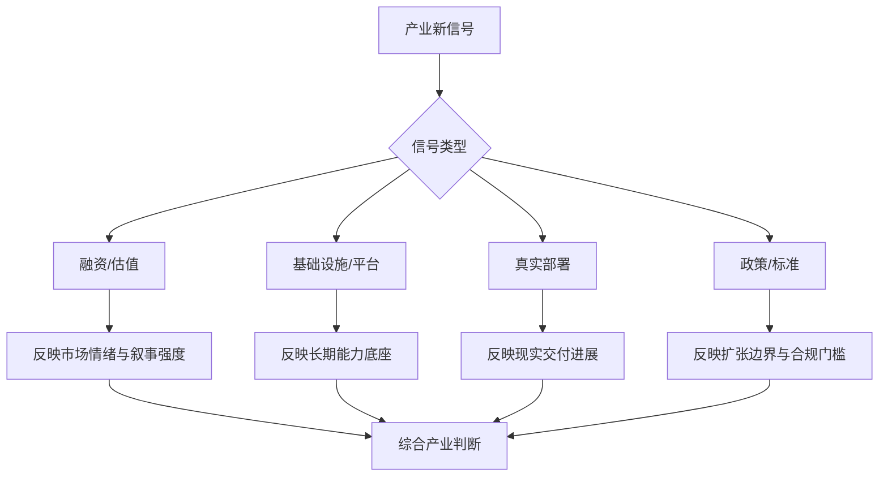

# 第二十四部分 产业格局、资本与政策

具身智能已不再只是学术问题，它同时是资本叙事、制造业升级叙事、AI 基础设施竞争叙事和国家产业政策叙事的一部分。因此，要理解当前行业温度，就必须把技术判断放回更大的产业格局中看。

这一章的难点在于，产业层面的信号天然比单篇论文更噪声化。融资新闻、演示视频、政策口号、产业园规划与平台发布会往往同时出现，但它们的含义并不相同。相对稳健的做法，是优先关注三类较硬的信号：第一，产业统计与行业报告；第二，平台级基础设施投入；第三，标准、监管与可部署场景的制度变化。国际机器人联合会 IFR 持续发布工业机器人与服务机器人统计，NVIDIA、Google 等平台公司持续把基础模型叙事推向实体系统；中国也在“人工智能+”“智能制造”“机器人+”等政策语境下推动场景开放与产业投资。[IFR World Robotics](https://ifr.org/worldrobotics/)、[NVIDIA Isaac/GR00T](https://developer.nvidia.com/isaac/gr00t)、[工业和信息化部](https://www.miit.gov.cn/)

更进一步说，产业判断最怕两种极端：一种是把所有热度都看成泡沫，从而忽视基础设施正在真实堆积；另一种是把所有热度都看成趋势，从而忽视工程现实的长期滞后。报告后续的产业分析，应始终在这两种极端之间保持张力。

## 108. 全球竞争格局

### 108.1 北美
北美的特点通常在于上游模型、云基础设施、资本网络和高端研发生态较强，因此更容易率先形成“通用模型 + 机器人平台 + 资本叙事”联动。它的优势并不自动等于最快规模交付，但会显著影响行业叙事、人才流向和上游技术接口标准。
北美优势的核心并不只是“有很多明星公司”，而是它更容易把模型、算力、资本和研究共同体放进同一增长飞轮。基础模型公司、芯片平台、云厂商、顶尖实验室和高风险资本之间的耦合，使很多高不确定性方向在较早阶段就获得大规模试错机会。这种生态更适合孕育平台型叙事和前沿接口实验，但其弱点也在于容易把远期统一想象提前资本化，从而阶段性高估短期可交付能力。

北美优势主要在基础模型、顶级研究机构、平台公司和高风险资本。其竞争力并不只来自单个机器人公司，而来自“模型公司 - 芯片平台 - 云基础设施 - 研究机构 - 创业资本”之间的耦合。这意味着北美路线更容易率先推动高层 foundation model 与实体部署接口的实验。

### 108.2 中国
中国的特点则更体现在制造链、场景多样性、成本工程、地方产业推动和大规模交付组织能力上。对具身行业而言，这意味着中国企业在把机器人系统推向更低成本、更快迭代和更多真实场景方面，可能拥有不同于北美的优势结构。
中国路线的独特之处，则在于它更容易把“能否交付”提前压回技术判断中心。大规模制造、密集工业场景、自动驾驶能力外溢、较强供应链组织能力和地方政策牵引，使很多问题会更早暴露在成本、可靠性、节拍和维护这几个硬约束下。因此，中国语境中的具身智能判断，往往天然更强调系统集成、部署节奏和 ROI，而不是单次模型发布所能带来的想象空间。

中国优势主要在制造、供应链、工业场景、自动驾驶能力外溢和政策牵引。与北美相比，中国在“真机场景密度、系统集成速度、成本工程与量产约束”上往往更具现实牵引力，尤其适合把具身智能放回工业自动化、物流、巡检与服务机器人链条中理解。

### 108.3 欧洲、日本、韩国
欧洲、日本、韩国在机器人产业中的位置，往往更适合从精密制造、零部件、工业自动化、标准体系和长期工程积累角度理解。它们未必总在具身智能叙事最热的位置，但在执行器、传感器、制造体系和高可靠工程文化上常具有深厚基础。
这些区域的价值，常常被“大模型叙事声量”所遮蔽。事实上，它们在精密制造、工业自动化、零部件工程、可靠性控制和本体设计上的深厚积累，决定了其仍然是具身产业不可忽视的能力极。即便它们不一定率先定义最热的 foundation model 叙事，也可能在执行器、减速器、工艺自动化、质量体系和特定垂类系统集成上持续提供决定性样板。

这些地区在工业自动化、精密制造和部分本体工程方面仍有深厚积累，但在 foundation model 主叙事上通常声量较弱。需要注意的是，“声量较弱”并不等于“能力较弱”，而可能意味着它们更倾向于以工业产品、系统集成和垂直场景能力呈现。

### 108.4 区域比较框架

区域比较框架最怕落入“谁新闻更多谁更强”的误区。对具身智能而言，更有效的比较方式应当沿模型、数据、场景、制造与交付五条链路展开，因为不同地区往往不是在同一条链路上同时领先，而是在不同位置形成互补或错位优势。

这样的框架有两个好处。第一，它能防止把上游模型能力误写为下游交付优势，或把制造优势误写为通用智能优势。第二，它能帮助后续版本更新时更稳定地比较区域变化，因为新增信号可以被放回五链路中的明确位置，而不是被媒体叙事带着漂移。

真正应该比较的，不是“谁新闻更多”，而是模型、数据、场景、制造和交付五条链路是否能闭环。

也可以把区域竞争力粗略表示为：

\[
\text{Competitiveness} \approx f(\text{models}, \text{data}, \text{scenes}, \text{manufacturing}, \text{delivery})
\]

这不是严格经济学模型，而是提醒我们：单看模型强弱或单看制造能力，都不足以判断具身智能产业位置。

### 108.5 区域差异会如何影响技术路线
区域差异之所以重要，是因为它会反过来塑造企业最优技术路线。上游模型强的地区，更容易押注通用接口和平台化基础模型；制造和场景强的地区，更容易押注成本优化、系统集成和垂直场景落地；标准与零部件强的地区，则更可能在高可靠组件和中长期产业配套上形成影响力。
从更长周期看，区域差异甚至会持续塑造“什么问题值得被优先解决”。若一个地区更容易拿到大算力和研究资本，它就更可能押注统一大模型与平台接口；若一个地区更容易获得真实客户场景和制造配套，它就更可能押注成本工程、垂直场景和半自主闭环。这意味着技术路线并不只是科学问题，也深受产业土壤约束。后续比较企业时，必须把公司路线放回所属区域生态中理解。

北美更容易首先推动高层 foundation model 与通用平台叙事，中国更容易更早把路线拉回成本工程和场景交付，欧洲、日本、韩国则更可能在精密制造、工业自动化与本体工程上持续提供强样本。也就是说，区域差异不会只影响产业格局，还会持续反向塑造技术研究重点。

## 109. 资本市场与融资逻辑

### 109.1 资本追逐哪些叙事
资本追逐的往往不是单一技术事实，而是可放大的叙事组合。例如“人形是通用执行器”“VLA 是机器人大模型入口”“世界模型会降低真机数据成本”“低成本平台将打开海量开发者生态”等。这些叙事有时抓住了真实方向，有时则把长期命题压缩成短期故事。
资本偏好某些叙事，并不只是因为它们“听起来大”，而是因为它们同时满足高 TAM、平台想象、技术稀缺性和故事可传播性这几个条件。人形机器人、通用基础模型、数据飞轮和劳动力替代之所以经常捆绑出现，正是因为它们构成了一组相互强化的资本语言。问题在于，这套语言对长期上限的表达能力很强，对短中期交付难度的表达能力却偏弱。

当前资本最容易被“通用机器人 + foundation model + 人形 + 大市场”叙事吸引。这种叙事的吸引力来自 TAM 想象空间和平台型回报预期，而不一定来自短期现金流成熟度。

### 109.2 什么是短期泡沫，什么是长期壁垒
短期泡沫和长期壁垒的区别，往往不在估值高低，而在支撑估值的资产是否具备累积性。一次爆款演示、单轮融资热度、短期媒体曝光通常更接近泡沫成分；而真实数据闭环、客户部署网络、供应链控制、工具链平台和长期运维能力，则更接近壁垒成分。
一个比较实用的区分方式是看资源是否沉淀为可复用能力。若热度主要体现在估值抬升、演示传播和概念外溢，而没有同步沉淀为数据闭环、硬件良率、供应链掌控、现场部署网络或平台级开发工具，那么它更接近泡沫；反之，若热度背后伴随着基础设施、交付组织和真实场景资产的持续堆积，那么即便阶段性估值过热，也可能仍在为长期壁垒买单。

短期泡沫通常集中在 demo 想象空间；长期壁垒则更可能来自真实数据闭环、本体工程、制造能力和部署基础设施。

### 109.3 人形机器人融资热的结构性原因
人形机器人融资热并不只是媒体偏好，它有更深的结构性原因：人形形态天然承接通用劳动力叙事；视频展示更有传播性；资本更容易把其映射到超大市场空间；同时它还能与具身大模型、人机协作和未来通用平台愿景绑定。这些因素共同放大了融资热度。
人形热并不只是“被科幻审美带动”，更深层原因在于它恰好承接了多个宏大叙事交叉点：通用平台、统一环境适配、可规模化数据采集、制造升级、劳动力替代以及 AI 物理化落地。也正因为它承载了如此多的象征意义，资本往往愿意容忍其在短中期商业化上明显慢于宣传节奏。对研究者而言，这意味着既不能简单把其视为虚火，也不能把融资热直接翻译成工程成熟度。

人形融资热并不只是情绪，它反映了资本对“同一平台覆盖人类环境”的想象。但想象空间不应被误写为短期商业成熟度。资本之所以愿意为其买单，往往是因为人形被视为兼具平台叙事、数据叙事、制造升级叙事和劳动力替代叙事的交叉点。

### 109.4 资本真正该如何被解读
资本信号最有用的读法，不是“谁融得多谁就赢”，而是看资金和资源将企业推向什么位置：是推动它继续做研究展示，还是逼它更快交付；是帮助它建立上游模型能力，还是锁定下游客户渠道；是补强制造体系，还是支撑长期烧钱换数据。
更稳健的读法，是把资本当作“风险偏好揭示器”而不是“技术真相证明器”。融资越大，往往说明市场越愿意为某种远期叙事预付成本，但并不等于该路线已经赢得物理现实。真正值得跟踪的是融资之后资金被用在哪里：是堆 demo、买流量、扩研究团队，还是进入制造、运维、采数、仿真和安全基础设施。如果后者占比持续提升，资本信号的可信度才会更高。

融资额本身不是结论，而更像一个信号：它说明某种叙事暂时获得了更大市场共识，但并不证明对应技术路线已经最优。更稳健的读法是把资本信号和部署、数据闭环、本体迭代节奏一起看，而不是把融资规模直接等同于能力领先。

## 110. 供应链、制造与规模化

### 110.1 核心零部件
核心零部件之所以要单列，是因为很多“具身智能”上层叙事最终都要落回执行器、减速器、传感器、电池、算力模组、灵巧手与控制器这些具体成本和性能约束。零部件能力不只是供应链问题，也是上层技术路线是否可落地的边界条件。
对具身系统而言，零部件并不是“硬件部门自己的问题”，而是会反过来定义算法上限。执行器响应特性、减速器回差、传感器可靠性、灵巧手自由度与耐久性、边缘算力与散热边界，都会直接决定哪些控制策略、感知频率和技能接口在现实里可行。因此，真正理解产业格局，必须把零部件能力看作技术路线的一部分，而不是与智能算法相分离的供应链背景。

执行器、减速器、传感器、算力模块、灵巧手和电源系统都会决定成本与良率。

### 110.2 成本下降路径

成本下降路径最容易被误读成“等关键零部件便宜了就行”，但真实情况要复杂得多。具身系统的总成本同时受本体设计、执行器方案、传感器配置、算力架构、装配流程、调试工时、维护频率和软件支持负担共同影响。某一项成本下降，并不自动意味着系统总成本同步下降。

因此，更重要的问题不是单点部件价格变化，而是整条系统是否在朝“更少件数、更高一致性、更低维护、更可替代料、更低部署摩擦”的方向演化。只有当这些变化同时发生，成本下降才会真正转化为规模化条件。
成本下降通常不会只来自单一元件降价，而是来自设计简化、规模采购、装配标准化、维护件减少、传感方案优化和部署流程成熟等一整套系统性变化。因此，真正可持续的成本下降，更像工程组织能力的结果，而不是短期市场波动。
成本下降也往往不是单线条发生的。模型推理成本可能下降得很快，但若灵巧手、执行器、标定工时、现场集成与售后维护成本降不下来，整体系统仍难规模化。反过来，即便本体制造逐渐成熟，若端侧算力和软件维护成本持续高企，也会抬高部署门槛。因此，观察成本路径时，最怕只盯住其中一个看得见的子项，而忽略系统总成本的重心是否真的被压低。

模型成本下降一条线，本体制造与零部件成熟度又是一条线，二者并不总是同步。

### 110.3 量产与交付风险
量产风险的本质，是系统从“被工程师照顾的原型”转变为“必须在更多现场独立工作”的过程。这个过程中，良率、标定一致性、备件体系、售后响应、软件版本控制、客户培训和安全责任界面都会同时抬头。很多公司原型期看起来进展很快，一进入批量交付就显著放缓，本质上并非突然失去技术能力，而是开始面对系统公司与产品公司的真正门槛。

真正的挑战往往出现在从几十台原型到数百、数千台交付之间。

如果把单机交付成本写成：

\[
C = C_{\text{body}} + C_{\text{compute}} + C_{\text{sensors}} + C_{\text{integration}} + C_{\text{service}}
\]

那么资本市场最容易低估的，通常不是 \(C_{\text{compute}}\)，而是 \(C_{\text{integration}}\) 与 \(C_{\text{service}}\)。后两者直接对应现场部署、维护、回访、模型更新和故障恢复，是“demo 公司”和“交付公司”之间最常见的分水岭。

### 110.4 规模化的真正门槛

规模化的真正门槛，从来不只是“多生产几台机器”。更难的部分在于，企业是否能把部署流程、维护接口、远程诊断、版本升级、备件体系和客户现场适配一并复制出去。只要这些能力没有标准化，产量增加往往只会同步放大组织摩擦与质量风险。

这也是为什么很多系统在原型和小批量阶段进展很快，一到规模化交付就明显放缓。真正卡住它们的，常常不是核心算法不够强，而是整条系统在组织层面还没有学会被复制。
因此，规模化更准确地说是一种组织能力问题，而不仅是技术复制问题。它要求企业不仅能生产设备，还能复制部署流程、维护流程、数据回流流程和客户成功流程。具身智能公司若没有形成这套组织闭环，就很容易停留在“每个项目都像定制工程”的状态，难以跨过真正意义上的产业化门槛。

在具身系统里，规模化从来不只是“能多生产几台”，而是“能否在更多现场、更多运维条件、更多客户流程中保持可复制交付”。这一点解释了为什么很多路线 demo 很快，真正规模化却慢得多。

## 111. 政策、标准与监管趋势

### 111.1 机器人产业政策

机器人产业政策最值得关注的，不是政策文本里有没有出现“人形”“智能”“具身”等关键词，而是它是否真正改变了场景准入、试点资源、采购机制、园区协同和示范项目组织方式。对企业而言，最有价值的政策往往不是最响亮的政策，而是最能降低真实部署摩擦的政策。

因此，在后续版本跟踪中，政策分析不应只停留在文件摘要，而应继续追问其执行效果：有没有带来更多测试场地、更多可持续订单、更多园区协同和更清晰的责任边界。只有这些变化出现，政策信号才真正进入产业能力层。
机器人产业政策的作用，不只是提供补贴或口号，而是决定测试示范场景、地方产业集聚、标准推进、试点采购和人才政策如何协同。对企业而言，这些政策会直接影响其最初在哪些地方落地、拿什么订单、如何形成早期规模。
产业政策的真正影响，通常不在口号本身，而在于它是否改变了试点准入、场景开放、资金配置和采购机制。只要政策开始把机器人或具身系统纳入重点示范场景、制造升级计划或地方试点工程，就会直接改变企业验证路线和客户接受节奏。因而阅读政策时，最重要的是识别它究竟改变了“能不能进场”还是只是改变了“叙事热度”。

产业政策会影响场景开放、试点速度和资本配置。

### 111.2 AI 治理政策
AI 治理政策对具身系统的重要性在于，它会逐渐把模型能力、数据采集、责任分配和部署审查纳入更明确的制度框架。具身系统并不是纯 AI，也不是纯机器人，因此它往往会同时受到两类政策体系的叠加影响。
随着高层 foundation model 进入物理系统，AI 治理政策的边界也会从纯信息风险逐步延展到执行风险。模型透明度、数据治理、远程更新、日志留存、责任追踪与安全审计，都会逐步与机器人监管逻辑交叉。谁能更早适应这种交叉，谁在后续高价值场景落地时就更可能占据先机，因为合规摩擦本身也会成为竞争壁垒的一部分。

高层 foundation model 进入实体系统之后，AI 治理政策与机器人政策会逐渐交叉。

### 111.3 未来标准化与认证方向

标准化与认证之所以重要，是因为它们会逐步把原本模糊的系统风险、责任边界和采购门槛显式化。短期看，这似乎会增加企业负担；长期看，它却可能反而帮助行业扩大市场，因为一旦能力边界可被标准语言描述，客户、监管者和供应链之间的协作成本就会下降。

对具身行业而言，未来最关键的并不是某一条标准是否马上统一全球，而是哪些能力开始被纳入明确认证框架：远程运维、安全停机、人机协作、日志可追溯、端侧更新和模型行为审计等。一旦这些维度被制度化，行业竞争会明显从“讲故事”转向“拼可验证能力”。
从产业角度看，标准与认证的意义并不只是增加门槛，它们也在创造市场。只要某类能力边界被标准化，客户采购和责任划分就更容易进行，供应链也更容易形成分工。因此，具身行业里那些看似“保守”的认证和标准基础设施，长期反而可能是放大市场的必要条件，而不是单纯抑制创新的阻力。

长期看，标准与认证基础设施很可能成为行业走向规模化的关键门槛之一。

从政策与治理角度看，未来最值得持续跟踪的不是单一法规，而是三类变化：场景准入规则是否放松，安全认证体系是否细化，以及数据与远程运维合规边界是否清晰。这三类变化往往比短期融资新闻更能决定某条路线能否持续扩张。

### 111.4 对后续版本最实用的产业跟踪法

对后续版本最实用的产业跟踪法，不是把所有新事件都平铺记录，而是先判断它属于哪类信号，再决定它是否足以改变原有判断。融资消息、平台发布、标准进展、真实交付案例和事故事件，本质上对应不同层级的问题，若不先分层，就很容易把情绪层波动误写成结构性变化。

因此，后续维护时最应坚持的原则是：先分类，再解释，最后才决定是否回调章节判断。这样做虽然看上去更慢，但能显著提高跨版本分析的一致性，避免报告随着热点切换而不断失焦。

建议后续更新时，把所有产业新信号优先分成三类记录：

1. 估值与融资信号。
2. 基础设施与平台信号。
3. 监管、标准与场景开放信号。

第一类解释市场情绪，第二类解释能力底座，第三类解释扩张边界。三者必须分开看，混在一起就容易误判。

本部分的结论是：具身智能行业短期内会继续同时包含高热融资叙事与缓慢工程现实，两者并不矛盾。真正重要的是识别哪些热度在堆估值，哪些热度正在堆基础设施。

## 图 24-1 产业信号过滤图

源文件：`assets/diagrams/24-产业信号过滤图.mmd`

## 表 24-1 产业信号分类表

见 [24-产业信号分类表](D:/Projects/embodied-intelligence-report/docs/report/current/tables/24-产业信号分类表.md)。

## 图表与表格补充

产业格局章节需要图表，不是因为这一章更适合“做宏观图”，而是因为资本、政策、平台、真实部署这几类信号如果不被强制分层，极易在阅读时彼此污染。融资热度、基础设施进展、场景开放和监管变化，反映的是完全不同性质的问题；把它们混在一起，会直接削弱跨版本研判的稳定性。

因此，本章图表与表格最重要的职责，是建立一套面向长期跟踪的信号过滤框架。后续更新版本时，真正应新增的不是更多新闻摘录，而是把新信号放入同一分类体系下，再判断它影响的是情绪层、能力底座层、交付层还是制度边界层。

1. 图 24-A：`全球具身智能竞争五链路框架图`
   说明：把模型、数据、场景、制造、交付五链路画成区域比较图。
2. 表 24-B：`产业信号分类表`
   说明：建议把后续更新中的信号分为“融资/估值、基础设施、监管/标准、真实部署”四类。
3. 流程图 24-C：`从资本热度到产业判断的过滤流程`
   说明：展示如何把融资新闻过滤为可用于长期判断的产业信号。
