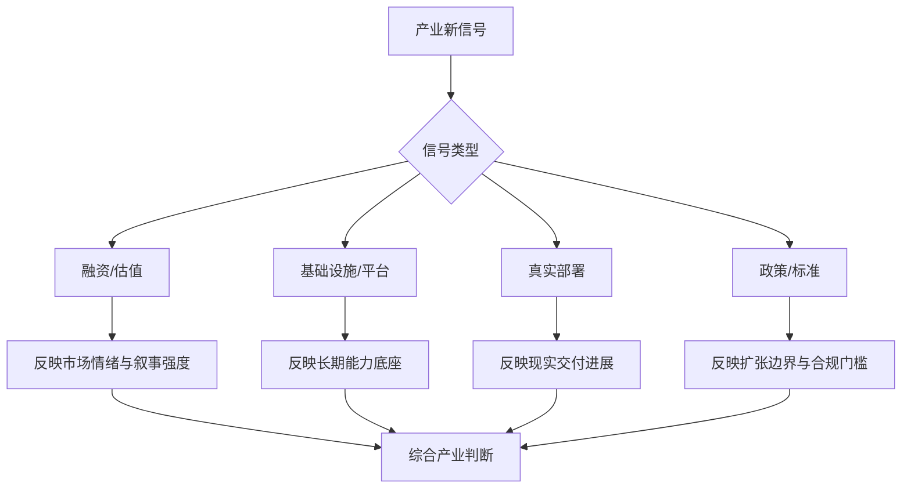

# 第二十四部分 产业格局、资本与政策

具身智能已不再只是学术问题，它同时是资本叙事、制造业升级叙事、AI 基础设施竞争叙事和国家产业政策叙事的一部分。因此，要理解当前行业温度，就必须把技术判断放回更大的产业格局中看。

这一章的难点在于，产业层面的信号天然比单篇论文更噪声化。融资新闻、演示视频、政策口号、产业园规划与平台发布会往往同时出现，但它们的含义并不相同。相对稳健的做法，是优先关注三类较硬的信号：第一，产业统计与行业报告；第二，平台级基础设施投入；第三，标准、监管与可部署场景的制度变化。国际机器人联合会 IFR 持续发布工业机器人与服务机器人统计，NVIDIA、Google 等平台公司持续把基础模型叙事推向实体系统；中国也在“人工智能+”“智能制造”“机器人+”等政策语境下推动场景开放与产业投资。[IFR World Robotics](https://ifr.org/worldrobotics/)、[NVIDIA Isaac/GR00T](https://developer.nvidia.com/isaac/gr00t)、[工业和信息化部](https://www.miit.gov.cn/)

更进一步说，产业判断最怕两种极端：一种是把所有热度都看成泡沫，从而忽视基础设施正在真实堆积；另一种是把所有热度都看成趋势，从而忽视工程现实的长期滞后。报告后续的产业分析，应始终在这两种极端之间保持张力。

## 108. 全球竞争格局

### 108.1 北美
北美路线的真正优势，不只是拥有几家明星机器人公司，而是更容易把基础模型、芯片平台、云基础设施、顶级实验室与风险资本组织成同一叙事飞轮。这使得很多高不确定性方向可以更早获得大规模试错机会，也使“平台级接口”“通用机器人基础模型”“物理世界 foundation model”这类命题更容易被迅速资本化和生态化。[NVIDIA Isaac GR00T](https://developer.nvidia.com/isaac/gr00t)

但北美优势并不天然等于最快形成大规模交付。它的强项更集中在上游接口定义、基础模型叙事、开发者生态和高端研究资源聚集，而不是所有下游场景都同步领先。换句话说，北美更擅长先决定“行业讨论什么问题、用什么接口描述问题”，至于大规模低成本部署是否能同步跟上，仍受制造、场景与运维现实约束。

因此在本报告里，更好的理解方式是把北美视作“定义接口与聚合资源的高地”。它对全球路线的影响，往往首先体现在模型 API、数据协议、开发框架与资本注意力上，而不是立刻体现在每一个具体行业都已跑出最成熟商业闭环。
北美的特点通常在于上游模型、云基础设施、资本网络和高端研发生态较强，因此更容易率先形成“通用模型 + 机器人平台 + 资本叙事”联动。它的优势并不自动等于最快规模交付，但会显著影响行业叙事、人才流向和上游技术接口标准。
北美优势的核心并不只是“有很多明星公司”，而是它更容易把模型、算力、资本和研究共同体放进同一增长飞轮。基础模型公司、芯片平台、云厂商、顶尖实验室和高风险资本之间的耦合，使很多高不确定性方向在较早阶段就获得大规模试错机会。这种生态更适合孕育平台型叙事和前沿接口实验，但其弱点也在于容易把远期统一想象提前资本化，从而阶段性高估短期可交付能力。

北美优势主要在基础模型、顶级研究机构、平台公司和高风险资本。其竞争力并不只来自单个机器人公司，而来自“模型公司 - 芯片平台 - 云基础设施 - 研究机构 - 创业资本”之间的耦合。这意味着北美路线更容易率先推动高层 foundation model 与实体部署接口的实验。

### 108.2 中国
中国路线的独特性，则更多体现在制造链密度、真实场景丰富度、成本工程压力、系统集成速度与地方产业组织能力上。这意味着很多技术路线会更早被拉回“能否交付、能否降本、能否形成 ROI”这几个硬约束上检验，而不是长期停留在高层叙事竞争。[工业和信息化部](https://www.miit.gov.cn/)

中国并不只是“把海外路线本地化复制”，更可能在系统工程与场景落地层形成自己的优化函数。大规模制造、自动驾驶外溢能力、工业自动化基础、较快的产品迭代节奏，以及对部署效率的持续压力，使很多公司天然更重视本体成本、供应链可得性、节拍、维护和客户现场改造。这些因素会反过来塑造模型接口、数据采集方式和任务选择策略。

因此，把中国优势理解为“真机验证和工程闭环的加速器”比单纯理解为“市场大”更准确。它未必在每一轮基础模型叙事上都最先发声，但很可能更早逼迫路线回答成本、可靠性、节拍和交付问题。这种结构性压力，本身就是技术演化的一部分。
中国的特点则更体现在制造链、场景多样性、成本工程、地方产业推动和大规模交付组织能力上。对具身行业而言，这意味着中国企业在把机器人系统推向更低成本、更快迭代和更多真实场景方面，可能拥有不同于北美的优势结构。
中国路线的独特之处，则在于它更容易把“能否交付”提前压回技术判断中心。大规模制造、密集工业场景、自动驾驶能力外溢、较强供应链组织能力和地方政策牵引，使很多问题会更早暴露在成本、可靠性、节拍和维护这几个硬约束下。因此，中国语境中的具身智能判断，往往天然更强调系统集成、部署节奏和 ROI，而不是单次模型发布所能带来的想象空间。

中国优势主要在制造、供应链、工业场景、自动驾驶能力外溢和政策牵引。与北美相比，中国在“真机场景密度、系统集成速度、成本工程与量产约束”上往往更具现实牵引力，尤其适合把具身智能放回工业自动化、物流、巡检与服务机器人链条中理解。

### 108.3 欧洲、日本、韩国
这些区域在本报告里最值得被看到的，不只是它们有没有最响亮的人形叙事，而是它们如何以精密制造、工业自动化、零部件工程和可靠性文化持续影响具身产业底盘。很多决定行业真实节奏的能力，并不来自最热闹的平台叙事，而来自高质量执行器、控制器、制造工艺、认证体系和工业客户协同。

因此，把这些地区仅仅理解成“在大模型叙事中声量较弱”是不够的。更准确的理解是：它们常常代表另一条产业逻辑，即当一个地区不一定主导最大的软件平台时，仍可能通过部件、制造、标准与系统工程在产业链中占据关键位置。
欧洲、日本、韩国在机器人产业中的位置，往往更适合从精密制造、零部件、工业自动化、标准体系和长期工程积累角度理解。它们未必总在具身智能叙事最热的位置，但在执行器、传感器、制造体系和高可靠工程文化上常具有深厚基础。
这些区域的价值，常常被“大模型叙事声量”所遮蔽。事实上，它们在精密制造、工业自动化、零部件工程、可靠性控制和本体设计上的深厚积累，决定了其仍然是具身产业不可忽视的能力极。即便它们不一定率先定义最热的 foundation model 叙事，也可能在执行器、减速器、工艺自动化、质量体系和特定垂类系统集成上持续提供决定性样板。

这些地区在工业自动化、精密制造和部分本体工程方面仍有深厚积累，但在 foundation model 主叙事上通常声量较弱。需要注意的是，“声量较弱”并不等于“能力较弱”，而可能意味着它们更倾向于以工业产品、系统集成和垂直场景能力呈现。

### 108.4 区域比较框架

区域比较框架最怕落入“谁新闻更多谁更强”的误区。对具身智能而言，更有效的比较方式应当沿模型、数据、场景、制造与交付五条链路展开，因为不同地区往往不是在同一条链路上同时领先，而是在不同位置形成互补或错位优势。

也就是说，区域比较不应被理解成单轴排名，而应被理解成异构价值链控制力的比较。有些地区可能在模型和算力生态上强势，有些地区则在工业场景、供应链密度或系统集成经验上更深。若忽略这种错位结构，就会错误地把“媒体最热的地区”当成“全链条最强的地区”，进而低估后来者通过特定环节切入并建立优势的可能性。

对本报告后续跟踪而言，更实用的办法是把区域分析做成一张动态矩阵：每个地区分别记录其在模型研发、数据获取、场景开放、制造配套、融资环境与政策执行上的相对强弱。这样后续更新版本时，关注点就不只是“谁又融资了”，而是某个地区是否在关键短板上发生了结构性改善。

这样的框架有两个好处。第一，它能防止把上游模型能力误写为下游交付优势，或把制造优势误写为通用智能优势。第二，它能帮助后续版本更新时更稳定地比较区域变化，因为新增信号可以被放回五链路中的明确位置，而不是被媒体叙事带着漂移。

真正应该比较的，不是“谁新闻更多”，而是模型、数据、场景、制造和交付五条链路是否能闭环。

也可以把区域竞争力粗略表示为：

\[
\text{Competitiveness} \approx f(\text{models}, \text{data}, \text{scenes}, \text{manufacturing}, \text{delivery})
\]

这不是严格经济学模型，而是提醒我们：单看模型强弱或单看制造能力，都不足以判断具身智能产业位置。

### 108.5 区域差异会如何影响技术路线
区域差异之所以重要，是因为它会反过来塑造企业最优技术路线。上游模型强的地区，更容易押注通用接口和平台化基础模型；制造和场景强的地区，更容易押注成本优化、系统集成和垂直场景落地；标准与零部件强的地区，则更可能在高可靠组件和中长期产业配套上形成影响力。

可以把这种关系粗略理解为一种“区域约束到路线选择”的映射：企业并不是在真空中选路线，而是在各自可获得的算力、场景、供应链、监管摩擦和资本偏好约束下，寻找当下最优解。一个在北美看起来自然的“先做通用平台和基础模型”路径，搬到制造与交付压力更高的环境未必仍然最优；反过来，一个更强调垂直场景和成本工程的路径，也不应被简单评价为“技术不够前沿”。

这意味着跨区域比较时必须特别警惕误读。很多表面上的技术差异，实质上是对不同产业土壤的理性响应；而很多看似先进的路线，则只是因为暂时还没有被量产、认证或客户交付的真实约束完全检验。
从更长周期看，区域差异甚至会持续塑造“什么问题值得被优先解决”。若一个地区更容易拿到大算力和研究资本，它就更可能押注统一大模型与平台接口；若一个地区更容易获得真实客户场景和制造配套，它就更可能押注成本工程、垂直场景和半自主闭环。这意味着技术路线并不只是科学问题，也深受产业土壤约束。后续比较企业时，必须把公司路线放回所属区域生态中理解。

这一点对后续企业章节尤其关键，因为很多“为什么海外更爱讲平台、国内更早被拉回交付”之类的差异，本质上不是谁更懂技术，而是所处产业土壤对最优解的塑形不同。

北美更容易首先推动高层 foundation model 与通用平台叙事，中国更容易更早把路线拉回成本工程和场景交付，欧洲、日本、韩国则更可能在精密制造、工业自动化与本体工程上持续提供强样本。也就是说，区域差异不会只影响产业格局，还会持续反向塑造技术研究重点。

## 109. 资本市场与融资逻辑

### 109.1 资本追逐哪些叙事
资本追逐的往往不是单个技术事实，而是一组可相互强化的增长故事。例如“人形 + 通用模型 + 劳动力替代”同时承诺大市场、平台性和媒体传播性；“数据工厂 + 世界模型 + 更少真机数据”则同时承诺技术壁垒与规模收益。它们之所以有效，不是因为每个环节都已被证明，而是因为这些环节能被压缩成一个看似连贯的长期故事。

因此，本节最重要的工作不是评价资本乐观或悲观，而是拆开看它究竟在押哪一段链路。不同押注方向对应完全不同的兑现周期与失败方式，这比单看融资热度更有分析价值。

资本之所以反复追逐某些叙事，并不只是因为它们“听起来先进”，而是因为这些叙事往往同时承载了超大市场空间、平台化想象、技术稀缺性和可传播性。人形、通用基础模型、物理世界智能、数据飞轮和劳动替代之所以经常被绑定出现，正是因为它们可以共同构成一套能支持高估值的连贯故事。

但对研究型报告而言，更重要的不是复述这套故事，而是拆解它到底押注了哪些尚未被验证的前提。只有把叙事拆回能力链条，资本信号才会从情绪信息转化为分析信息。
资本追逐的往往不是单一技术事实，而是可放大的叙事组合。例如“人形是通用执行器”“VLA 是机器人大模型入口”“世界模型会降低真机数据成本”“低成本平台将打开海量开发者生态”等。这些叙事有时抓住了真实方向，有时则把长期命题压缩成短期故事。
资本偏好某些叙事，并不只是因为它们“听起来大”，而是因为它们同时满足高 TAM、平台想象、技术稀缺性和故事可传播性这几个条件。人形机器人、通用基础模型、数据飞轮和劳动力替代之所以经常捆绑出现，正是因为它们构成了一组相互强化的资本语言。问题在于，这套语言对长期上限的表达能力很强，对短中期交付难度的表达能力却偏弱。

当前资本最容易被“通用机器人 + foundation model + 人形 + 大市场”叙事吸引。这种叙事的吸引力来自 TAM 想象空间和平台型回报预期，而不一定来自短期现金流成熟度。

因此，在报告里解读资本热度时，最重要的不是判断“热不热”，而是把热度拆回未验证前提。一个融资高涨的方向，究竟押注的是数据飞轮终会形成、制造成本终会下降、还是客户最终会接受更高部署复杂度？只有把这些前提摊开，资本章节才真正服务于技术与产业判断，而不是重复市场情绪。

### 109.2 什么是短期泡沫，什么是长期壁垒

短期泡沫与长期壁垒的差别，关键不在热度高低，而在热度背后是否有可沉淀的基础设施和可复用能力。若资源主要堆在估值、宣传和一次性展示上，那么热度再高也更接近泡沫；若热度同时推动了数据采集体系、部署网络、供应链控制、评测工具链和运维组织建设，那么即便阶段性过热，也可能在为长期壁垒买单。

因此，判断泡沫与壁垒时最需要看的不是“是不是火”，而是“火完之后留下些什么”。这个视角比单纯争论估值是否合理更适合长期行业跟踪。
短期泡沫和长期壁垒的区别，往往不在估值高低，而在支撑估值的资产是否具备累积性。一次爆款演示、单轮融资热度、短期媒体曝光通常更接近泡沫成分；而真实数据闭环、客户部署网络、供应链控制、工具链平台和长期运维能力，则更接近壁垒成分。
一个比较实用的区分方式是看资源是否沉淀为可复用能力。若热度主要体现在估值抬升、演示传播和概念外溢，而没有同步沉淀为数据闭环、硬件良率、供应链掌控、现场部署网络或平台级开发工具，那么它更接近泡沫；反之，若热度背后伴随着基础设施、交付组织和真实场景资产的持续堆积，那么即便阶段性估值过热，也可能仍在为长期壁垒买单。

短期泡沫通常集中在 demo 想象空间；长期壁垒则更可能来自真实数据闭环、本体工程、制造能力和部署基础设施。

这一节对后续版本维护尤其有用，因为它提供了一种“热度事件处理规则”：凡是只增加叙事声量、不增加可复用资产的事件，应谨慎记录；凡是虽然不够吸睛、却明显增强了采数网络、制造一致性、运维组织或标准接口的事件，反而应被高权重跟踪。

### 109.3 人形机器人融资热的结构性原因
人形机器人融资热并不只是媒体偏好，它有更深的结构性原因：人形形态天然承接通用劳动力叙事；视频展示更有传播性；资本更容易把其映射到超大市场空间；同时它还能与具身大模型、人机协作和未来通用平台愿景绑定。这些因素共同放大了融资热度。

另一个经常被忽视的结构性原因，是人形路线在资本组合里同时满足了“可讲长故事”和“可做短展示”两种需求。长故事来自对未来通用劳动平台的想象，短展示则来自步行、抓取、对话和任务演示天然更容易被拍成可传播资产。资本并不总是在为当前交付能力定价，它也在为“未来是否可能成为默认平台”购买期权，而人形恰好最适合作为这种期权载体。

因此，分析人形融资热时，真正有价值的问题不是“为什么大家都投”，而是“这轮资金在押注哪一种未来”。是在押注本体制造与供应链规模化，还是在押注通用模型接口，还是在押注某个场景先形成交付闭环？只有把这些赌注拆开，融资信号才不会被粗暴误读成同一种产业结论。
人形热并不只是“被科幻审美带动”，更深层原因在于它恰好承接了多个宏大叙事交叉点：通用平台、统一环境适配、可规模化数据采集、制造升级、劳动力替代以及 AI 物理化落地。也正因为它承载了如此多的象征意义，资本往往愿意容忍其在短中期商业化上明显慢于宣传节奏。对研究者而言，这意味着既不能简单把其视为虚火，也不能把融资热直接翻译成工程成熟度。

人形融资热并不只是情绪，它反映了资本对“同一平台覆盖人类环境”的想象。但想象空间不应被误写为短期商业成熟度。资本之所以愿意为其买单，往往是因为人形被视为兼具平台叙事、数据叙事、制造升级叙事和劳动力替代叙事的交叉点。

也正因为它同时承载这么多叙事，人形章节在全书里必须始终采用“双重读法”：一方面承认其资源聚集与平台实验价值，另一方面严格区分视频吸引力、资本吸引力与真实交付成熟度。否则，这条路线最容易把长期潜力误写成短期确定性。

这也是为什么后续每次出现人形融资或 demo 热点时，都应先回到本章，而不是直接修改企业结论。资本热度首先是产业信号，其次才可能是技术信号。

### 109.4 资本真正该如何被解读

资本最有价值的地方，不在于告诉我们谁已经赢了，而在于揭示市场此刻愿意为哪类远期可能性支付成本。融资规模、投资方结构和合作对象会暴露资本偏好、产业联盟方向和叙事焦点，但它们始终只是间接信号，不是技术真相本身。

因此，对资本的更稳妥解读方式，是把它当作“哪一类故事暂时获得了更多资源试错权”的指标，而不是“哪一类路线已经被现实证成”的指标。只有这样，资本分析才不会误伤整个报告的判断稳健性。
资本信号最有用的读法，不是“谁融得多谁就赢”，而是看资金和资源将企业推向什么位置：是推动它继续做研究展示，还是逼它更快交付；是帮助它建立上游模型能力，还是锁定下游客户渠道；是补强制造体系，还是支撑长期烧钱换数据。
更稳健的读法，是把资本当作“风险偏好揭示器”而不是“技术真相证明器”。融资越大，往往说明市场越愿意为某种远期叙事预付成本，但并不等于该路线已经赢得物理现实。真正值得跟踪的是融资之后资金被用在哪里：是堆 demo、买流量、扩研究团队，还是进入制造、运维、采数、仿真和安全基础设施。如果后者占比持续提升，资本信号的可信度才会更高。

融资额本身不是结论，而更像一个信号：它说明某种叙事暂时获得了更大市场共识，但并不证明对应技术路线已经最优。更稳健的读法是把资本信号和部署、数据闭环、本体迭代节奏一起看，而不是把融资规模直接等同于能力领先。

对这份报告的长期维护来说，一个更实用的做法是把资本事件固定归类为三种：增加试错资源、增加产业绑定、增加交付压力。前两种可能增强路线生命力，后一种则会反过来迫使公司更快面对现实约束。这样记录资本事件，比简单写“某公司又融了多少”更有分析价值。

### 109.5 资本事件的四步拆解法
为了避免资本章节沦为新闻摘要，一个更稳定的方法是把每条资本事件都强制拆成四步。第一步，判断资金究竟流向本体、模型、数据、制造、交付还是组织扩张；第二步，判断投资人是财务资本主导、产业资本主导，还是平台生态资本主导；第三步，判断这轮融资之后企业面临的是更宽松的试错空间，还是更高强度的交付倒逼；第四步，再决定这条信息影响的是哪一章的长期判断。只有完成这四步，资本信息才真正具有研究意义。

这个方法的价值，在于它能把“融资热”拆成若干不同性质的结构信号。同样是大额融资，若资金主要用于补强制造体系、部署网络和售后组织，它更接近交付能力强化；若资金主要用于扩大研究团队和维持长期高风险试验，它更接近前沿试错资源；若资金来自关键供应链或平台公司，则还意味着产业联盟边界在变化。它们不应在报告里被写成同一种利好。

也可以把一条资本事件的分析口径压缩为一句问法：这笔钱到底让企业更接近“会展示”、更接近“会研发”，还是更接近“会交付”。这三者都重要，但对应的产业含义完全不同。后续季度更新时，资本章节最值得保留的，就是这种可重复使用的拆解纪律。

## 110. 供应链、制造与规模化

### 110.1 核心零部件
零部件之所以应被放在产业章节的核心位置，是因为它们从一开始就在定义系统可学性与可控性的边界。关节背隙、驱动带宽、热稳定性、触觉分辨率、相机同步精度和供电能力，都会直接决定上层模型能否稳定复用。很多时候，所谓“模型上限”并不是一个纯软件问题，而是被底层部件质量与一致性强烈夹住。

这也是为什么产业分析不能只看整机品牌。谁在关键模组和部件层拥有真实供给能力、成本爬坡能力与质量控制能力，谁就可能比表面上更接近产业主导权。

核心零部件之所以需要单列，是因为很多上层技术路线的现实上限最后都会落在这里。执行器、减速器、编码器、灵巧手、触觉传感器、电池、边缘算力模组和高可靠连接件，并不只是“硬件采购项”，而是直接决定控制性能、维护频率、BOM 结构和量产良率的基础变量。

也因此，零部件能力不应被视为与智能路线分离的背景条件。谁掌握了更好的关键器件与替代方案，谁往往也更容易在系统设计、成本路径和部署韧性上形成优势。
核心零部件之所以要单列，是因为很多“具身智能”上层叙事最终都要落回执行器、减速器、传感器、电池、算力模组、灵巧手与控制器这些具体成本和性能约束。零部件能力不只是供应链问题，也是上层技术路线是否可落地的边界条件。
对具身系统而言，零部件并不是“硬件部门自己的问题”，而是会反过来定义算法上限。执行器响应特性、减速器回差、传感器可靠性、灵巧手自由度与耐久性、边缘算力与散热边界，都会直接决定哪些控制策略、感知频率和技能接口在现实里可行。因此，真正理解产业格局，必须把零部件能力看作技术路线的一部分，而不是与智能算法相分离的供应链背景。

执行器、减速器、传感器、算力模块、灵巧手和电源系统都会决定成本与良率。

这也是为什么产业分析不能只沿“模型公司”视角展开。若某地区或某企业在核心器件、制造工艺和装配一致性上明显领先，它即便在模型叙事上不最抢眼，也依然可能在下一阶段竞争中占据更强位置。具身行业的真实格局，往往是算法、器件和交付共同塑造，而不是由任何单一环节独占。

### 110.2 成本下降路径

成本下降路径最容易被误读成“等关键零部件便宜了就行”，但真实情况要复杂得多。具身系统的总成本同时受本体设计、执行器方案、传感器配置、算力架构、装配流程、调试工时、维护频率和软件支持负担共同影响。某一项成本下降，并不自动意味着系统总成本同步下降。

因此，更重要的问题不是单点部件价格变化，而是整条系统是否在朝“更少件数、更高一致性、更低维护、更可替代料、更低部署摩擦”的方向演化。只有当这些变化同时发生，成本下降才会真正转化为规模化条件。
成本下降通常不会只来自单一元件降价，而是来自设计简化、规模采购、装配标准化、维护件减少、传感方案优化和部署流程成熟等一整套系统性变化。因此，真正可持续的成本下降，更像工程组织能力的结果，而不是短期市场波动。
成本下降也往往不是单线条发生的。模型推理成本可能下降得很快，但若灵巧手、执行器、标定工时、现场集成与售后维护成本降不下来，整体系统仍难规模化。反过来，即便本体制造逐渐成熟，若端侧算力和软件维护成本持续高企，也会抬高部署门槛。因此，观察成本路径时，最怕只盯住其中一个看得见的子项，而忽略系统总成本的重心是否真的被压低。

模型成本下降一条线，本体制造与零部件成熟度又是一条线，二者并不总是同步。

因此，后续观察成本拐点时，最应警惕“只看算力成本下降”的单边乐观。若模型推理更便宜，但维护、标定、装配和现场服务并未同步改善，系统总拥有成本仍可能没有本质变化。真正的规模化窗口，通常出现在多条成本曲线同时向下的时候。

### 110.3 量产与交付风险
量产风险的本质，是系统从“被工程师照顾的原型”转变为“必须在更多现场独立工作”的过程。这个过程中，良率、标定一致性、备件体系、售后响应、软件版本控制、客户培训和安全责任界面都会同时抬头。很多公司原型期看起来进展很快，一进入批量交付就显著放缓，本质上并非突然失去技术能力，而是开始面对系统公司与产品公司的真正门槛。

资本市场往往更容易为原型期叙事定价，因为这一阶段的故事集中在功能可行性和技术想象空间上；而量产期真正决定公司命运的，却是流程纪律、供应链韧性和组织执行力。这也是为什么有些公司技术演示极具吸引力，却在进入交付阶段后暴露出成本结构失控、现场维护过重或版本演化过慢等问题。对投资和产业判断而言，量产风险因此不是附属议题，而是最应该提前穿透的问题之一。

更严格一点说，交付风险也是检验企业是否真正理解场景的试金石。若一家公司对客户流程、运维边界和安全责任分配缺乏清晰认识，那么即便模型表现出色，也可能在合同执行、售后服务和现场责任上迅速遇阻。对具身智能这类强场景系统来说，量产不是技术路线的收尾，而是对前面所有技术判断的一次集中复核。

真正的挑战往往出现在从几十台原型到数百、数千台交付之间。

如果把单机交付成本写成：

\[
C = C_{\text{body}} + C_{\text{compute}} + C_{\text{sensors}} + C_{\text{integration}} + C_{\text{service}}
\]

那么资本市场最容易低估的，通常不是 \(C_{\text{compute}}\)，而是 \(C_{\text{integration}}\) 与 \(C_{\text{service}}\)。后两者直接对应现场部署、维护、回访、模型更新和故障恢复，是“demo 公司”和“交付公司”之间最常见的分水岭。

### 110.4 规模化的真正门槛

规模化的真正门槛，从来不只是“多生产几台机器”。更难的部分在于，企业是否能把部署流程、维护接口、远程诊断、版本升级、备件体系和客户现场适配一并复制出去。只要这些能力没有标准化，产量增加往往只会同步放大组织摩擦与质量风险。

这也是为什么很多系统在原型和小批量阶段进展很快，一到规模化交付就明显放缓。真正卡住它们的，常常不是核心算法不够强，而是整条系统在组织层面还没有学会被复制。
因此，规模化更准确地说是一种组织能力问题，而不仅是技术复制问题。它要求企业不仅能生产设备，还能复制部署流程、维护流程、数据回流流程和客户成功流程。具身智能公司若没有形成这套组织闭环，就很容易停留在“每个项目都像定制工程”的状态，难以跨过真正意义上的产业化门槛。

在具身系统里，规模化从来不只是“能多生产几台”，而是“能否在更多现场、更多运维条件、更多客户流程中保持可复制交付”。这一点解释了为什么很多路线 demo 很快，真正规模化却慢得多。

这一定义和第 20 章的企业判断、以及第 23 章的商业化判断应被联动阅读。只要交付复制性还没有被证明，再强的模型与本体叙事都应保留折扣。

### 110.5 哪些产业链控制点最值得长期跟踪
若要把供应链分析从“零部件清单”提升到“产业控制点分析”，一个很重要的转变是追问哪些环节不仅影响成本，还影响路线自主性。对具身系统而言，关键控制点通常包括高性能执行器与减速器、灵巧手与触觉器件、边缘算力与电源热管理、标定与测试工装、系统集成软件栈，以及现场运维与备件网络。前几类决定技术上限与 BOM 结构，后几类决定交付韧性与规模化效率。两者缺一不可。

更进一步说，产业控制点并不总是最显眼的那一层。有时一家公司看起来并不控制基础模型，也不控制整机品牌，但若它控制了某类关键模组、一套难以替代的标定工艺，或一个高密度现场运维网络，那么它仍可能在行业中拥有高于表面估值的话语权。研究报告后续在跟踪企业时，若只看发布会上的平台叙事，而忽略这些控制点，会系统性高估“概念主导者”而低估“底盘主导者”。

因此，本章最值得长期沉淀的判断框架之一，是把企业与区域优势分别映射到控制点上：谁控制了器件，谁控制了制造，谁控制了场景入口，谁控制了部署与维护，谁控制了模型与软件接口。只有把这些控制点拆开，产业格局才不会被单一媒体叙事压扁。

## 111. 政策、标准与监管趋势

### 111.1 机器人产业政策
从长期视角看，最值得跟踪的政策变化通常不是口号，而是部署摩擦是否真的下降。是否开放更多试点场景、是否有更清晰的采购与验收方式、是否推动了标准和责任边界明确化、是否对零部件、数据与验证基础设施形成公共支持，这些变化比宏大愿景词更能决定行业速度。

因此，后续版本维护时，本节应优先记录“政策改变了什么现实约束”，而不是只记录“政策文本说了什么”。这样产业章节才会真正服务于长期判断，而不是变成政策新闻摘录。

机器人产业政策最值得关注的，不是政策文本里有没有出现“人形”“智能”“具身”等关键词，而是它是否真正改变了场景准入、试点资源、采购机制、园区协同和示范项目组织方式。对企业而言，最有价值的政策往往不是最响亮的政策，而是最能降低真实部署摩擦的政策。

因此，在后续版本跟踪中，政策分析不应只停留在文件摘要，而应继续追问其执行效果：有没有带来更多测试场地、更多可持续订单、更多园区协同和更清晰的责任边界。只有这些变化出现，政策信号才真正进入产业能力层。
机器人产业政策的作用，不只是提供补贴或口号，而是决定测试示范场景、地方产业集聚、标准推进、试点采购和人才政策如何协同。对企业而言，这些政策会直接影响其最初在哪些地方落地、拿什么订单、如何形成早期规模。
产业政策的真正影响，通常不在口号本身，而在于它是否改变了试点准入、场景开放、资金配置和采购机制。只要政策开始把机器人或具身系统纳入重点示范场景、制造升级计划或地方试点工程，就会直接改变企业验证路线和客户接受节奏。因而阅读政策时，最重要的是识别它究竟改变了“能不能进场”还是只是改变了“叙事热度”。

产业政策会影响场景开放、试点速度和资本配置。

### 111.2 AI 治理政策
AI 治理进入具身系统后，一个直接后果是：更容易落地的系统，未必只是性能最高的系统，而往往是那些更容易审计、回滚、留痕、接管和分权的系统。因为一旦进入高价值场景，模型能力只是准入条件之一，可治理性会逐步变成与性能并列的产品属性。

也因此，治理不只是限制企业能做什么，更会反向塑造企业选择什么样的架构、保留什么样的接口、放弃什么样的高风险表达方式。对后续章节来说，这是一条必须持续回看的长期约束线。

AI 治理政策进入具身系统后，复杂性会明显上升，因为它不再只是处理文本、图像和信息内容风险，而要开始处理模型如何影响真实动作、现场责任、远程更新和日志追责。也就是说，AI 治理一旦进入实体系统，就会和机器人安全、行业监管及运维合规发生叠加。

这意味着后续版本跟踪时，不能把 AI 治理仅当作上游通用大模型的外部背景。随着 foundation model 更深地进入机器人接口，它会逐渐变成决定哪些功能能上线、哪些日志必须保留、哪些行为必须可审计的现实约束。
AI 治理政策对具身系统的重要性在于，它会逐渐把模型能力、数据采集、责任分配和部署审查纳入更明确的制度框架。具身系统并不是纯 AI，也不是纯机器人，因此它往往会同时受到两类政策体系的叠加影响。
随着高层 foundation model 进入物理系统，AI 治理政策的边界也会从纯信息风险逐步延展到执行风险。模型透明度、数据治理、远程更新、日志留存、责任追踪与安全审计，都会逐步与机器人监管逻辑交叉。谁能更早适应这种交叉，谁在后续高价值场景落地时就更可能占据先机，因为合规摩擦本身也会成为竞争壁垒的一部分。

高层 foundation model 进入实体系统之后，AI 治理政策与机器人政策会逐渐交叉。

### 111.3 未来标准化与认证方向

标准化与认证之所以重要，是因为它们会逐步把原本模糊的系统风险、责任边界和采购门槛显式化。短期看，这似乎会增加企业负担；长期看，它却可能反而帮助行业扩大市场，因为一旦能力边界可被标准语言描述，客户、监管者和供应链之间的协作成本就会下降。

对具身行业而言，未来最关键的并不是某一条标准是否马上统一全球，而是哪些能力开始被纳入明确认证框架：远程运维、安全停机、人机协作、日志可追溯、端侧更新和模型行为审计等。一旦这些维度被制度化，行业竞争会明显从“讲故事”转向“拼可验证能力”。
从产业角度看，标准与认证的意义并不只是增加门槛，它们也在创造市场。只要某类能力边界被标准化，客户采购和责任划分就更容易进行，供应链也更容易形成分工。因此，具身行业里那些看似“保守”的认证和标准基础设施，长期反而可能是放大市场的必要条件，而不是单纯抑制创新的阻力。

长期看，标准与认证基础设施很可能成为行业走向规模化的关键门槛之一。

从政策与治理角度看，未来最值得持续跟踪的不是单一法规，而是三类变化：场景准入规则是否放松，安全认证体系是否细化，以及数据与远程运维合规边界是否清晰。这三类变化往往比短期融资新闻更能决定某条路线能否持续扩张。

也就是说，政策章节真正应该成为“部署摩擦雷达”，而不是新闻摘要区。凡是能降低试点准入、明确责任边界、提高可审计性或推动认证可复制化的政策变化，都比单次发布会上的口号更值得高权重记录。

### 111.4 对后续版本最实用的产业跟踪法

对后续版本最实用的产业跟踪法，不是把所有新事件都平铺记录，而是先判断它属于哪类信号，再决定它是否足以改变原有判断。融资消息、平台发布、标准进展、真实交付案例和事故事件，本质上对应不同层级的问题，若不先分层，就很容易把情绪层波动误写成结构性变化。

因此，后续维护时最应坚持的原则是：先分类，再解释，最后才决定是否回调章节判断。这样做虽然看上去更慢，但能显著提高跨版本分析的一致性，避免报告随着热点切换而不断失焦。

建议后续更新时，把所有产业新信号优先分成三类记录：

1. 估值与融资信号。
2. 基础设施与平台信号。
3. 监管、标准与场景开放信号。

第一类解释市场情绪，第二类解释能力底座，第三类解释扩张边界。三者必须分开看，混在一起就容易误判。

本部分的结论是：具身智能行业短期内会继续同时包含高热融资叙事与缓慢工程现实，两者并不矛盾。真正重要的是识别哪些热度在堆估值，哪些热度正在堆基础设施。

把这一章放在全书后半段的真正意义，并不是为了补几段宏观评论，而是为了建立一套“产业信号过滤器”。资本、政策、平台、真实部署、标准推进这几类信号彼此并不等价，甚至常常朝相反方向移动。融资可以很热而部署很慢，标准可以趋严而客户反而更愿意下单，平台生态可以走强而单体产品公司承压。若不把它们强制分层阅读，产业判断就会长期被最响亮的声音牵着走。

因此，本章对后续版本维护最有用的地方，是要求每条产业新信息都先回答两个问题：它改变的是情绪层、能力底座层、交付层还是制度边界层；它是局部事件，还是已经足以改变若干章节共享的长期判断。只有先做这层过滤，后续资本与政策动态才不会侵蚀正文的研究型结构，而会反过来帮助我们更快识别哪些变化真的值得触发跨章节回写。

### 111.5 一个更稳健的政策更新判断顺序
政策与监管最容易带来的误判，是把“文本重要性”直接等同于“产业影响强度”。更稳健的判断顺序，应先看它是否改变了准入，再看是否改变了责任边界，再看是否改变了成本结构，最后才看它是否改变了市场情绪。因为对具身行业而言，真正稀缺的往往不是再多一个口号，而是更明确的测试资格、更清晰的验收规则、更低的合规摩擦和更稳定的采购接口。

把这一顺序展开，其实对应四个层次的问题。第一层是“能不能做”，即是否影响测试资格、试点范围、采购条件和认证准入。第二层是“出了问题谁负责”，即责任划分、审计义务、数据留存和人工接管边界是否更清楚。第三层是“做这件事贵不贵”，即是否改变了合规流程、认证周期、基础设施建设和现场运维成本。第四层才是“市场会不会更兴奋”，也就是融资和估值层面的情绪变化。

若一项政策主要只改变第四层，而前三层几乎没有实质变化，那么它对行业节奏的影响往往会被高估；反过来，一些新闻热度不高的细则更新，只要显著降低测试摩擦或明确责任边界，就可能比宏大纲领性文件更值得长期跟踪。这套顺序也适合作为后续版本更新时的政策信号筛选框架。

具体来说，后续遇到一条新政策时，可以按以下顺序处理：

1. 它是否新增或放宽了某类场景试点、示范或采购资格。
2. 它是否细化了安全、日志、接管、责任追溯等可执行要求。
3. 它是否会影响零部件、平台、算力、数据或本地化部署成本。
4. 它是否只是提升了市场关注度，而尚未形成真实操作变化。

这种顺序的好处在于，能把“政策热闹程度”重新压回“部署摩擦变化程度”。对版本维护来说，只有在前两项或前三项出现明确变化时，才值得较大幅度回写正文判断；若只是情绪层放大，则更适合记入产业日志而非修改核心结论。这样一来，本章就不只是产业评论，而是全书后续更新时的重要过滤阀门。

## 图 24-1 产业信号过滤图

源文件：`assets/diagrams/24-产业信号过滤图.mmd`

## 表 24-1 产业信号分类表

见 [24-产业信号分类表](D:/Projects/embodied-intelligence-report/docs/report/current/tables/24-产业信号分类表.md)。

## 图表与表格补充

产业格局章节需要图表，不是因为这一章更适合“做宏观图”，而是因为资本、政策、平台、真实部署这几类信号如果不被强制分层，极易在阅读时彼此污染。融资热度、基础设施进展、场景开放和监管变化，反映的是完全不同性质的问题；把它们混在一起，会直接削弱跨版本研判的稳定性。

因此，本章图表与表格最重要的职责，是建立一套面向长期跟踪的信号过滤框架。后续更新版本时，真正应新增的不是更多新闻摘录，而是把新信号放入同一分类体系下，再判断它影响的是情绪层、能力底座层、交付层还是制度边界层。

在当前版本中，`图 24-1 产业信号过滤图` 已承担“从资本热度到产业判断”的主过滤流程职责；`表 24-1 产业信号分类表` 则把融资/估值、基础设施、监管/标准、真实部署等信号类别稳定为统一记录语言。

区域竞争若要被真正讲清，最终必须回到“模型、数据、场景、制造、交付”五条链路的差异化比较上。当前正文已经先把信号过滤框架与更新日志机制固定下来，后续所有区域判断都应沿这五条链路回写，这样产业讨论才不会重新退化成融资热度、媒体声量或单点政策新闻的堆叠。

为了让这章真正服务后续更新，而不只是提供分析口径，建议后续产业跟踪统一同时维护 [24-产业信号分类表](D:/Projects/embodied-intelligence-report/docs/report/current/tables/24-产业信号分类表.md) 和 [24-产业信号日志模板](D:/Projects/embodied-intelligence-report/docs/report/current/tables/24-产业信号日志模板.md)。前者负责分类语言，后者负责把新增事件按“时间 - 类型 - 影响层 - 影响章节 - 判断动作”记录下来，供季度回调直接使用。
