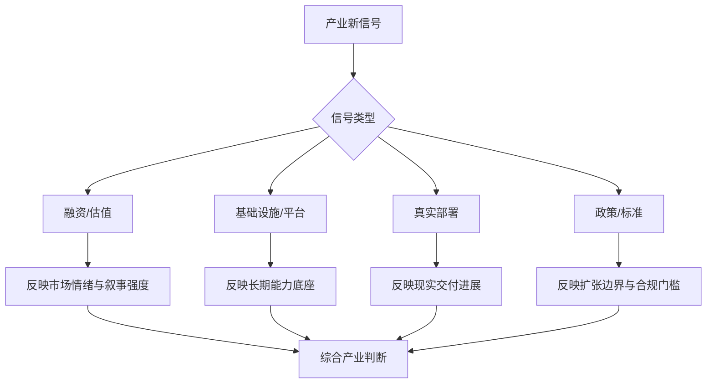

# 第二十四部分 产业格局、资本与政策

具身智能已不再只是学术问题，它同时是资本叙事、制造业升级叙事、AI 基础设施竞争叙事和国家产业政策叙事的一部分。因此，要理解当前行业温度，就必须把技术判断放回更大的产业格局中看。

这一章的难点在于，产业层面的信号天然比单篇论文更噪声化。融资新闻、演示视频、政策口号、产业园规划与平台发布会往往同时出现，但它们的含义并不相同。相对稳健的做法，是优先关注三类较硬的信号：第一，产业统计与行业报告；第二，平台级基础设施投入；第三，标准、监管与可部署场景的制度变化。国际机器人联合会 IFR 持续发布工业机器人与服务机器人统计，NVIDIA、Google 等平台公司持续把基础模型叙事推向实体系统；中国也在“人工智能+”“智能制造”“机器人+”等政策语境下推动场景开放与产业投资。相关入口可参见 [IFR 世界机器人统计](https://ifr.org/worldrobotics/)、[NVIDIA Isaac GR00T 页面](https://developer.nvidia.com/isaac/gr00t) 与 [工业和信息化部](https://www.miit.gov.cn/)。

更进一步说，产业判断最怕两种极端：一种是把所有热度都看成泡沫，从而忽视基础设施正在真实堆积；另一种是把所有热度都看成趋势，从而忽视工程现实的长期滞后。报告后续的产业分析，应始终在这两种极端之间保持张力。

## 108. 全球竞争格局

### 108.1 北美
北美路线的真正优势，不只是拥有几家明星机器人公司，而是更容易把基础模型、芯片平台、云基础设施、顶级实验室与高风险资本组织成同一试错飞轮。NVIDIA 的 Isaac GR00T 页面直接把模型、仿真、数据生成和部署工具放在同一平台叙事下，Tesla 也把 Optimus 放进统一 AI、芯片和制造体系来描述。相关资料可参见：[英伟达相关页面](https://developer.nvidia.com/isaac/gr00t)、[特斯拉相关页面](https://www.tesla.com/AI)。这说明北美的强项首先是“先定义行业讨论什么问题、用什么接口描述问题”，而不是每个下游场景都已同步跑出最成熟商业闭环。

因此，北美更适合被理解为“上游接口与资源聚合高地”。它最容易率先推动的是 foundation model、开发框架、开发者生态和资本注意力的集中，这会显著影响全球人才流向、数据协议、评测口径与开发工具链。很多高不确定性方向能在北美更快启动，不是因为它们更接近量产，而是因为这里更容易为高风险问题提前支付试错成本。

但这套优势并不自动等于最快形成大规模低成本交付。北美路线的弱点，恰恰在于它有时会把远期统一想象提前资本化。若制造、场景、维护和客户复制证据没有同步积累，那么“平台潜力”就很容易先于“现场闭环”被市场高估。因此，本报告把北美更多视作接口与叙事主导者，而不是默认意义上的全链条领先者。

### 108.2 中国
中国路线的独特性，主要体现在制造链密度、真实场景丰富度、成本工程压力、系统集成速度与地方产业组织能力上。这意味着很多技术路线会更早被拉回“能否交付、能否降本、能否形成 ROI”这几个硬约束上检验，而不是长期停留在高层叙事竞争。[工业和信息化部](https://www.miit.gov.cn/)

与其把中国理解成“把海外路线本地化复制”，不如把它理解成“把系统工程约束提前压回技术判断中心”。大规模制造、自动驾驶外溢能力、工业自动化基础、较快产品迭代节奏，以及对部署效率的持续压力，会迫使很多公司更早处理本体成本、供应链可得性、节拍、维护和客户现场改造。这些因素随后又会反向塑造模型接口、数据采集方式和任务选择策略。也就是说，中国优势不只是市场大，而是更容易形成“真机验证与工程闭环的加速器”。

因此，中国未必在每一轮基础模型叙事里都最先发声，但它很可能更早逼迫路线回答成本、可靠性、节拍和交付问题。对报告读者而言，这一点很重要: 在中国语境里，单次模型发布的象征意义往往低于真实部署节奏的解释力。谁能更快把路线压进客户现场、维护体系与量产约束，谁就更接近产业位置。

### 108.3 欧洲、日本、韩国
欧洲、日本、韩国在本报告里最值得被看到的，不是它们有没有最响亮的人形叙事，而是它们如何通过精密制造、工业自动化、零部件工程和可靠性文化持续影响具身产业底盘。KUKA 的官网把机器人系统、生产系统、服务、下载中心与客户案例并置呈现，[KUKA Global](https://www.kuka.com/) FANUC 则长期强调 “FA + ROBOT + ROBOMACHINE + SERVICE” 的统一体系与全球服务网络，[FANUC Global](https://www.fanuc.com/) 这类组织方式说明，这些地区在很多时候代表的是另一条产业逻辑: 不一定主导最热的软件平台，但持续主导部件、制造、质量体系和长期服务能力。

因此，把这些区域仅仅理解成“在 foundation model 叙事上声量较弱”是不够的。更准确的理解是，它们往往在执行器、控制器、工艺自动化、认证体系和工业客户协同上拥有深厚积累。很多决定行业真实节奏的能力，并不来自最热闹的平台叙事，而来自这些看起来更“慢”、却更难替代的工业底盘。

也就是说，“声量较弱”并不等于“能力较弱”，而可能意味着能力更多以工业产品、系统集成和垂直场景解决方案的方式呈现。对长期跟踪而言，这些地区的意义在于持续提供高可靠工程样板，并通过部件、制造和标准体系影响全球具身路线的可实现边界。

### 108.4 区域比较框架
区域比较最怕落入“谁新闻更多谁更强”的误区。对具身智能而言，更有效的比较方式应沿价值链展开，而不是沿媒体热度展开。一个实用的区域能力向量可以写成：

\[
\mathbf{R} =
(\text{models}, \text{compute}, \text{scenes}, \text{manufacturing}, \text{delivery}, \text{governance}),
\]

其中 `models` 与 `compute` 更接近上游接口定义能力，`scenes`、`manufacturing` 与 `delivery` 更接近下游闭环能力，`governance` 则决定部署摩擦与长期可复制性。不同地区往往不是在所有维度同时领先，而是在不同位置形成互补或错位优势。若忽略这种错位结构，就会把“媒体最热的地区”误写成“全链条最强的地区”。

因此，区域比较不应被理解成单轴排名，而应被理解成异构价值链控制力的比较。北美可能在 `models`、`compute` 和资本叙事上更强，中国可能在 `scenes`、`manufacturing` 与系统集成节奏上更强，欧洲、日本、韩国则可能在 `manufacturing`、`delivery` 与 `governance` 相关的工业底盘上更深。真正值得跟踪的，不是简单问“谁第一”，而是问“哪个地区在哪条链路上正在修补短板、扩张控制点”。

这也是后续版本维护最适合采用的矩阵框架。每次新增事件，都应被放回这组向量的明确维度，而不是只作为融资新闻或宣传新闻被记录。这样做能避免把上游模型能力误写为下游交付优势，也能避免把制造优势误写为通用智能优势。

### 108.5 区域差异会如何影响技术路线
区域差异之所以重要，是因为它会反过来塑造企业的最优技术路线。若一个地区更容易拿到大算力、研究资本和开发者生态，它就更可能押注统一模型接口和平台化基础模型；若一个地区更容易获得真实客户场景、制造配套和部署反馈，它就更可能押注成本工程、系统集成和垂直场景闭环；若一个地区长期积累的是零部件、质量体系和认证文化，它就更可能在高可靠组件、本体工程和工业级产品化上形成影响力。

可以把这种关系理解为一种“区域约束到路线选择”的映射。企业并不是在真空中选路线，而是在各自可获得的算力、场景、供应链、监管摩擦和资本偏好约束下，寻找局部最优解。一个在北美看起来自然的“先做通用平台和基础模型”路径，搬到制造与交付压力更高的环境未必仍然最优；反过来，一个更强调垂直场景、半自主闭环和成本工程的路径，也不应被简单评价为“技术不够前沿”。

这意味着跨区域比较时必须特别警惕误读。很多表面上的技术差异，实质上是对不同产业土壤的理性响应。后续企业章节里出现的“为什么海外更爱讲平台、国内更早被拉回交付、欧洲日本韩国更重工程底盘”这类差异，本质上都应先被理解为生态塑形，而不是单纯理解为谁更懂技术。

## 109. 资本市场与融资逻辑

### 109.1 资本追逐哪些叙事
资本追逐的，往往不是单个技术事实，而是一组可相互强化的增长故事。例如“人形 + 通用模型 + 劳动力替代”同时承诺超大市场、平台性和媒体传播性；“数据工厂 + 世界模型 + 更少真机数据”则同时承诺技术壁垒与规模收益。它们之所以有效，不是因为每个环节都已被证明，而是因为这些环节可以被压缩成一套看似连贯的长期故事。

因此，本节最重要的工作不是评价资本乐观或悲观，而是拆开看它究竟在押哪一段链路。资本偏好某些叙事，并不只是因为它们“听起来先进”，而是因为它们同时满足高 TAM、平台想象、技术稀缺性和故事可传播性这几个条件。问题在于，这套语言对长期上限的表达能力很强，对短中期交付难度的表达能力却偏弱。

对研究型报告而言，更重要的不是复述这套故事，而是拆解它到底押注了哪些尚未被验证的前提。一个融资高涨的方向，究竟押注的是数据飞轮终会形成、制造成本终会下降，还是客户最终会接受更高部署复杂度？只有把这些前提摊开，资本章节才真正服务于技术与产业判断，而不是重复市场情绪。

### 109.2 什么是短期泡沫，什么是长期壁垒
短期泡沫与长期壁垒的差别，关键不在热度高低，而在热度背后是否沉淀出可累积、可复用、可扩张的资产。一次爆款演示、单轮融资热度、媒体曝光和概念外溢，通常更接近泡沫成分；真实数据闭环、部署网络、供应链控制、工具链平台和长期运维能力，则更接近壁垒成分。

一个更实用的区分方式，是看资源是否进入了“基础设施账户”而不只是“叙事账户”。若热度主要转化为估值抬升、品牌传播和一次性展示，那么它即使短期极热，也更接近泡沫；若热度同步推动了采数体系、硬件良率、场景网络、制造一致性和标准接口建设，那么即便阶段性估值过热，也可能仍在为长期壁垒买单。

因此，后续版本维护里最值得采用的规则不是争论“火不火”，而是追问“火完之后留下了什么”。凡是只增加叙事声量、不增加可复用资产的事件，应谨慎记录；凡是虽然不够吸睛、却明显增强了部署基础设施、运维组织、工具链或供应链控制点的事件，反而应被高权重跟踪。

### 109.3 人形机器人融资热的结构性原因
人形机器人融资热并不只是媒体偏好，它有明确的结构性原因。首先，人形形态天然承接“同一平台覆盖人类环境”的想象，因此极易与通用劳动力替代叙事绑定。其次，步行、抓取、对话和任务演示天然更适合视频传播，使其同时满足“可讲长故事”和“可做短展示”两种资本需求。再次，人形还可以与具身大模型、制造升级、数据飞轮和通用平台愿景一起被打包成超大 TAM 故事，这会显著放大融资热度。

但正因为它同时承载这么多叙事，人形路线也最容易把长期潜力误写成短期确定性。资本愿意为其买单，往往是在为“未来是否可能成为默认平台”购买期权，而不是在为当下工程成熟度定价。因此，分析人形融资热时，真正有价值的问题不是“为什么大家都投”，而是“这轮资金究竟在押注哪一种未来”: 本体制造与供应链规模化、通用模型接口，还是某个场景先形成交付闭环。

这也是为什么后续每次出现人形融资或 demo 热点时，都应先回到本章，而不是直接修改企业结论。人形热首先是产业信号，其次才可能是技术信号；在没有连续交付、本体可靠性、维护成本和客户复用证据之前，它不能被直接翻译成工程成熟度。

### 109.4 资本真正该如何被解读
资本最有价值的地方，不在于告诉我们谁已经赢了，而在于揭示市场此刻愿意为哪类远期可能性支付试错成本。融资规模、投资方结构和合作对象会暴露资本偏好、产业联盟方向和叙事焦点，但它们始终只是间接信号，不是技术真相本身。

因此，对资本更稳妥的解读方式，是把它当作“风险偏好揭示器”，而不是“技术真相证明器”。融资越大，往往说明市场越愿意为某种远期叙事预付成本，但并不等于该路线已经赢得物理现实。真正值得跟踪的是钱被用在哪里: 是继续堆 demo、买流量、扩研究团队，还是进入制造、运维、采数、仿真、安全验证和客户部署网络。只有当后者占比持续提升，资本信号的可信度才会更高。

对这份报告的长期维护来说，一个更实用的记录方法，是把资本事件固定归类为三种: 增加试错资源、增加产业绑定、增加交付压力。前两种可能增强路线生命力，后一种则会迫使公司更快面对现实约束。这样记录资本事件，比简单写“某公司又融了多少”更有分析价值，也更不容易被估值叙事牵着走。

### 109.5 资本事件的四步拆解法
为了避免资本章节沦为新闻摘要，一个更稳定的方法是把每条资本事件都强制拆成四步。第一步，判断资金究竟流向本体、模型、数据、制造、交付还是组织扩张；第二步，判断投资人是财务资本主导、产业资本主导，还是平台生态资本主导；第三步，判断这轮融资之后企业面临的是更宽松的试错空间，还是更高强度的交付倒逼；第四步，再决定这条信息影响的是哪一章的长期判断。只有完成这四步，资本信息才真正具有研究意义。

这个方法的价值，在于它能把“融资热”拆成若干不同性质的结构信号。同样是大额融资，若资金主要用于补强制造体系、部署网络和售后组织，它更接近交付能力强化；若资金主要用于扩大研究团队和维持长期高风险试验，它更接近前沿试错资源；若资金来自关键供应链或平台公司，则还意味着产业联盟边界在变化。它们不应在报告里被写成同一种利好。

也可以把一条资本事件的分析口径压缩为一句问法：这笔钱到底让企业更接近“会展示”、更接近“会研发”，还是更接近“会交付”。这三者都重要，但对应的产业含义完全不同。后续季度更新时，资本章节最值得保留的，就是这种可重复使用的拆解纪律。

如果把“资本事件四步拆解”再形式化一点，可以写成：

\[
K_{\text{event}} = \Delta R + \Delta D + \Delta P + \Delta A - \Delta H
\]

其中，\(\Delta R\) 表示 runway 与试错窗口的变化，\(\Delta D\) 表示交付能力变化，\(\Delta P\) 表示平台/生态控制力变化，\(\Delta A\) 表示产业联盟边界变化，\(\Delta H\) 表示被叙事放大的噪声项。这个式子仍然不是为了精确打分，而是为了强制把“融资很多”拆成几种完全不同的产业含义。

若把它继续写成一个更新动作，后续每条融资新闻都至少应先过一遍如下流程：

```python
def parse_capital_event(event):
    classify_use_of_funds(event)
    classify_investor_type(event)
    estimate_delivery_pressure(event)
    map_back_to_long_term_judgment(event)
```

它的价值在于把“资本热度”重新翻译成“哪些能力边界可能因此改变”。只要这一步不做，资本章就很容易重新滑回新闻摘要；而一旦这一步稳定执行，融资信息才会真正成为跨章节修正判断的结构化信号。

## 110. 供应链、制造与规模化

### 110.1 核心零部件
零部件之所以应被放在产业章节的核心位置，是因为它们从一开始就在定义系统可学性与可控性的边界。关节背隙、驱动带宽、热稳定性、触觉分辨率、相机同步精度和供电能力，都会直接决定上层模型能否稳定复用。很多时候，所谓“模型上限”并不是一个纯软件问题，而是被底层部件质量与一致性强烈夹住。

也因此，核心零部件不只是“硬件采购项”，而是直接决定控制性能、维护频率、BOM 结构和量产良率的基础变量。执行器、减速器、编码器、灵巧手、触觉传感器、电池、边缘算力模组和高可靠连接件，都会反向定义哪些控制策略、感知频率和技能接口在现实里可行。理解产业格局，必须把零部件能力看作技术路线的一部分，而不是与智能算法相分离的供应链背景。

这也是为什么产业分析不能只沿“模型公司”视角展开。若某地区或某企业在核心器件、制造工艺和装配一致性上明显领先，它即便在模型叙事上不最抢眼，也依然可能在下一阶段竞争中占据更强位置。具身行业的真实格局，往往是算法、器件和交付共同塑造，而不是由任何单一环节独占。

### 110.2 成本下降路径
成本下降路径最容易被误读成“等关键零部件便宜了就行”，但真实情况要复杂得多。具身系统的总成本同时受本体设计、执行器方案、传感器配置、算力架构、装配流程、调试工时、维护频率和软件支持负担共同影响。某一项成本下降，并不自动意味着系统总成本同步下降。

真正可持续的成本下降，更像一个系统性收敛过程，而不是单一元件的市场波动。设计简化、规模采购、装配标准化、维护件减少、传感方案优化和部署流程成熟，往往要一起发生，才会让成本下降真正转化为规模化条件。模型推理成本可能下降得很快，但若灵巧手、执行器、标定工时、现场集成与售后维护成本降不下来，整体系统仍难规模化；反过来，即便本体制造逐渐成熟，若端侧算力和软件维护成本持续高企，也会抬高部署门槛。

因此，后续观察成本拐点时，最应警惕“只看算力成本下降”的单边乐观。真正的规模化窗口，通常出现在多条成本曲线同时向下的时候: 本体件数减少、装配一致性提升、维护频率下降、替代料可得性增强、现场部署摩擦下降。只有当系统总拥有成本的重心被真正压低，成本优势才会从财务报表上的想象，转化成客户采购与场景复制中的现实。

### 110.3 量产与交付风险
量产风险的本质，是系统从“被工程师照顾的原型”转变为“必须在更多现场独立工作”的过程。这个过程中，良率、标定一致性、备件体系、售后响应、软件版本控制、客户培训和安全责任界面都会同时抬头。很多公司原型期看起来进展很快，一进入批量交付就显著放缓，本质上并非突然失去技术能力，而是开始面对系统公司与产品公司的真正门槛。

资本市场往往更容易为原型期叙事定价，因为这一阶段的故事集中在功能可行性和技术想象空间上；而量产期真正决定公司命运的，却是流程纪律、供应链韧性和组织执行力。这也是为什么有些公司技术演示极具吸引力，却在进入交付阶段后暴露出成本结构失控、现场维护过重或版本演化过慢等问题。对投资和产业判断而言，量产风险因此不是附属议题，而是最应该提前穿透的问题之一。

更严格一点说，交付风险也是检验企业是否真正理解场景的试金石。若一家公司对客户流程、运维边界和安全责任分配缺乏清晰认识，那么即便模型表现出色，也可能在合同执行、售后服务和现场责任上迅速遇阻。对具身智能这类强场景系统来说，量产不是技术路线的收尾，而是对前面所有技术判断的一次集中复核。

真正的挑战往往出现在从几十台原型到数百、数千台交付之间。

如果把单机交付成本写成：

\[
C = C_{\text{body}} + C_{\text{compute}} + C_{\text{sensors}} + C_{\text{integration}} + C_{\text{service}}
\]

那么资本市场最容易低估的，通常不是 \(C_{\text{compute}}\)，而是 \(C_{\text{integration}}\) 与 \(C_{\text{service}}\)。后两者直接对应现场部署、维护、回访、模型更新和故障恢复，是“demo 公司”和“交付公司”之间最常见的分水岭。

### 110.4 规模化的真正门槛
规模化的真正门槛，从来不只是“多生产几台机器”。更难的部分在于，企业是否能把部署流程、维护接口、远程诊断、版本升级、备件体系和客户现场适配一并复制出去。只要这些能力没有标准化，产量增加往往只会同步放大组织摩擦与质量风险。

因此，规模化更准确地说是一种组织能力问题，而不仅是技术复制问题。它要求企业不仅能生产设备，还能复制部署流程、维护流程、数据回流流程和客户成功流程。具身公司若没有形成这套闭环，就很容易停留在“每个项目都像定制工程”的状态，demo 很快，真正规模化却慢得多。

这一定义应与第 20 章的企业判断和第 23 章的商业化判断联动阅读。只要交付复制性尚未被证明，再强的模型和本体叙事都应保留折扣。行业里很多路线真正卡住的，并不是算法是否足够前沿，而是组织是否已经学会把系统复制到更多现场、更多客户流程和更多运维条件之中。

### 110.5 哪些产业链控制点最值得长期跟踪
若要把供应链分析从“零部件清单”提升到“产业控制点分析”，一个很重要的转变是追问哪些环节不仅影响成本，还影响路线自主性。对具身系统而言，关键控制点通常包括高性能执行器与减速器、灵巧手与触觉器件、边缘算力与电源热管理、标定与测试工装、系统集成软件栈，以及现场运维与备件网络。前几类决定技术上限与 BOM 结构，后几类决定交付韧性与规模化效率。两者缺一不可。

更进一步说，产业控制点并不总是最显眼的那一层。有时一家公司看起来并不控制基础模型，也不控制整机品牌，但若它控制了某类关键模组、一套难以替代的标定工艺，或一个高密度现场运维网络，那么它仍可能在行业中拥有高于表面估值的话语权。研究报告后续在跟踪企业时，若只看发布会上的平台叙事，而忽略这些控制点，会系统性高估“概念主导者”而低估“底盘主导者”。

因此，本章最值得长期沉淀的判断框架之一，是把企业与区域优势分别映射到控制点上：谁控制了器件，谁控制了制造，谁控制了场景入口，谁控制了部署与维护，谁控制了模型与软件接口。只有把这些控制点拆开，产业格局才不会被单一媒体叙事压扁。

对于供应链章节，更适合长期维护的不是零部件名录，而是“控制点风险分数”：

\[
B_i = D_i \times Q_i \times S_i \times C_i
\]

其中，\(D_i\) 是对该节点的依赖度，\(Q_i\) 是替代资格切换时间，\(S_i\) 是安全/性能关键性，\(C_i\) 是供应集中度。执行器、减速器、灵巧手、触觉、边缘算力、电源与热管理、标定工装、现场服务网络，都可以按这一口径进入长期跟踪表。

这样做的价值在于，它把“谁控制了产业底盘”从概念问题变成可追踪问题。后续只要某一节点在集中度、替代周期或安全关键性上发生变化，就足以触发对企业章和资本章的回写，而不必等到媒体已经把变化包装成“行业拐点”才被动响应。

## 111. 政策、标准与监管趋势

### 111.1 机器人产业政策
机器人产业政策的作用，不只是提供补贴或口号，而是决定测试示范场景、地方产业集聚、试点采购、标准推进和人才政策如何协同。[工业和信息化部](https://www.miit.gov.cn/) 从长期视角看，最值得跟踪的政策变化通常不是关键词是否更热，而是部署摩擦是否真的下降: 是否开放更多试点场景，是否形成更清晰的采购与验收方式，是否推动了标准与责任边界明确化，是否对零部件、数据与验证基础设施形成公共支持。

因此，后续版本维护时，本节应优先记录“政策改变了什么现实约束”，而不是只记录“政策文本说了什么”。对企业而言，最有价值的政策往往不是最响亮的政策，而是最能降低真实部署摩擦的政策。只要政策开始把机器人或具身系统纳入重点示范场景、制造升级计划或地方试点工程，就会直接改变企业验证路线和客户接受节奏。

也正因如此，产业政策真正应被读成一张“进场条件变化表”。如果政策只是提高叙事热度，却没有改善试点准入、订单形成、园区协同或测试认证便利，它对长期竞争力的影响就应被谨慎折价；若政策确实降低了真实部署摩擦，它就会很快体现在企业节奏和区域竞争力上。

### 111.2 AI 治理政策
AI 治理政策进入具身系统后，一个直接后果是：更容易落地的系统，未必只是性能最高的系统，而往往是那些更容易审计、回滚、留痕、接管和分权的系统。随着 foundation model 更深地进入机器人接口，治理边界会从纯信息风险逐步延展到执行风险。模型透明度、数据治理、远程更新、日志留存、责任追踪与安全审计，都会逐步与机器人监管逻辑交叉。相关资料可参见：[中央网信办](https://www.cac.gov.cn/)、[EU AI Act 官方文本](https://data.europa.eu/eli/reg/2024/1689/oj)。

这意味着后续版本跟踪时，不能把 AI 治理只当作上游通用大模型的外部背景。对具身系统而言，治理会逐渐变成产品架构问题: 哪些日志必须保留，哪些模型输出必须可追溯，哪些高风险动作需要人工复核，哪些远程更新必须带回滚机制。换句话说，治理不只是限制企业能做什么，也会反向塑造企业选择什么样的接口、保留什么样的权限边界，以及放弃什么样的高风险表达方式。

从长期竞争看，这反而会让“可治理性”逐步变成与性能并列的产品属性。谁能更早适应这种 AI 治理与机器人治理的交叉，谁在高价值场景落地时就更可能占据先机，因为合规摩擦本身也会成为竞争壁垒的一部分。

### 111.3 未来标准化与认证方向
标准化与认证之所以重要，是因为它们会逐步把原本模糊的系统风险、责任边界和采购门槛显式化。短期看，这似乎增加了企业负担；长期看，它反而可能帮助行业扩大市场，因为一旦能力边界可被标准语言描述，客户、监管者和供应链之间的协作成本就会下降。相关资料可参见：[工业和信息化部](https://www.miit.gov.cn/)、[EU AI Act 官方文本](https://data.europa.eu/eli/reg/2024/1689/oj)。

对具身行业而言，未来最关键的并不是某一条标准是否马上统一全球，而是哪些能力开始被纳入明确认证框架: 远程运维、安全停机、人机协作、日志可追溯、端侧更新、模型行为审计与事故回放等。一旦这些维度被制度化，行业竞争就会明显从“讲故事”转向“拼可验证能力”。标准与认证在这里不只是增加门槛，它们也在创造市场，因为采购和责任划分只有在边界被明确后才更容易规模化展开。

因此，政策与标准章节真正应该成为一张“部署摩擦雷达”，而不是新闻摘要区。后续版本里最值得高权重记录的，不是单次会议口号，而是三类变化: 场景准入规则是否放松，安全认证体系是否细化，数据与远程运维的合规边界是否清晰。凡是能降低试点准入、明确责任边界、提高可审计性或推动认证可复制化的变化，都比短期融资新闻更能决定一条路线能否持续扩张。

### 111.4 对后续版本最实用的产业跟踪法
对后续版本最实用的产业跟踪法，不是把所有新事件都平铺记录，而是先判断它属于哪类信号，再决定它是否足以改变原有判断。融资消息、平台发布、标准进展、真实交付案例和事故事件，本质上对应不同层级的问题，若不先分层，就很容易把情绪层波动误写成结构性变化。

因此，后续维护时最应坚持的原则是：先分类，再解释，最后才决定是否回调章节判断。建议把所有产业新信号优先分成三类记录：估值与融资信号、基础设施与平台信号、监管/标准/场景开放信号。第一类解释市场情绪，第二类解释能力底座，第三类解释扩张边界。三者必须分开看，混在一起就容易误判。

更可执行的做法，是把后续每条产业新信号都先写成一行更新记录：

```text
{date, signal_type, layer, affected_chapters, confidence, delta_judgment}
```

其中，`signal_type` 可分为融资、交付、平台、标准、事故、供应链，`layer` 用来标注它改变的是情绪层、能力底座层、交付层还是制度边界层。只有当 `delta_judgment` 足以改变既有章节判断时，才触发跨章节回写；否则只进入跟踪卡，不打乱正文结构。这套方法看似保守，实际上是在保护研究正文的长期稳定性。

### 111.5 一个更稳健的政策更新判断顺序
政策与监管最容易带来的误判，是把“文本重要性”直接等同于“产业影响强度”。更稳健的判断顺序，应先看它是否改变了准入，再看是否改变了责任边界，再看是否改变了成本结构，最后才看它是否改变了市场情绪。因为对具身行业而言，真正稀缺的往往不是再多一个口号，而是更明确的测试资格、更清晰的验收规则、更低的合规摩擦和更稳定的采购接口。

把这一顺序展开，其实对应四个层次的问题。第一层是“能不能做”，即是否影响测试资格、试点范围、采购条件和认证准入。第二层是“出了问题谁负责”，即责任划分、审计义务、数据留存和人工接管边界是否更清楚。第三层是“做这件事贵不贵”，即是否改变了合规流程、认证周期、基础设施建设和现场运维成本。第四层才是“市场会不会更兴奋”，也就是融资和估值层面的情绪变化。

若一项政策主要只改变第四层，而前三层几乎没有实质变化，那么它对行业节奏的影响往往会被高估；反过来，一些新闻热度不高的细则更新，只要显著降低测试摩擦或明确责任边界，就可能比宏大纲领性文件更值得长期跟踪。这套顺序也适合作为后续版本更新时的政策信号筛选框架。

具体来说，后续遇到一条新政策时，可以按以下顺序处理：

1. 它是否新增或放宽了某类场景试点、示范或采购资格。
2. 它是否细化了安全、日志、接管、责任追溯等可执行要求。
3. 它是否会影响零部件、平台、算力、数据或本地化部署成本。
4. 它是否只是提升了市场关注度，而尚未形成真实操作变化。

这种顺序的好处在于，能把“政策热闹程度”重新压回“部署摩擦变化程度”。对版本维护来说，只有在前两项或前三项出现明确变化时，才值得较大幅度回写正文判断；若只是情绪层放大，则更适合记入产业日志而非修改核心结论。这样一来，本章就不只是产业评论，而是全书后续更新时的重要过滤阀门。

## 图 24-1 产业信号过滤图

源文件：`assets/diagrams/24-产业信号过滤图.mmd`



## 表 24-1 产业信号分类表

见 [24-产业信号分类表](D:/Projects/embodied-intelligence-report/docs/report/current/tables/24-产业信号分类表.md)。

## 图表与表格补充

产业格局章节需要图表，不是因为这一章更适合“做宏观图”，而是因为资本、政策、平台、真实部署这几类信号如果不被强制分层，极易在阅读时彼此污染。融资热度、基础设施进展、场景开放和监管变化，反映的是完全不同性质的问题；把它们混在一起，会直接削弱跨版本研判的稳定性。

因此，本章图表与表格最重要的职责，是建立一套面向长期跟踪的信号过滤框架。后续更新版本时，真正应新增的不是更多新闻摘录，而是把新信号放入同一分类体系下，再判断它影响的是情绪层、能力底座层、交付层还是制度边界层。

在当前版本中，`图 24-1 产业信号过滤图` 已承担“从资本热度到产业判断”的主过滤流程职责；`表 24-1 产业信号分类表` 则把融资/估值、基础设施、监管/标准、真实部署等信号类别稳定为统一记录语言。

区域竞争若要被真正讲清，最终必须回到“模型、数据、场景、制造、交付”五条链路的差异化比较上。当前正文已经先把信号过滤框架与更新日志机制固定下来，后续所有区域判断都应沿这五条链路回写，这样产业讨论才不会重新退化成融资热度、媒体声量或单点政策新闻的堆叠。

为了让这章真正服务后续更新，而不只是提供分析口径，建议后续产业跟踪统一同时维护 [24-产业信号分类表](D:/Projects/embodied-intelligence-report/docs/report/current/tables/24-产业信号分类表.md) 和 [24-产业信号日志模板](D:/Projects/embodied-intelligence-report/docs/report/current/tables/24-产业信号日志模板.md)。前者负责分类语言，后者负责把新增事件按“时间 - 类型 - 影响层 - 影响章节 - 判断动作”记录下来，供季度回调直接使用。
