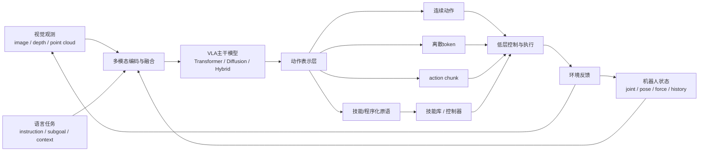

# 第十一部分 VLA 与机器人基础模型

如果说第七部分回答的是“大模型的哪些能力对具身系统有用”，那么本部分要讨论的就是当前最受关注的一条集成路线：视觉-语言-动作模型，即 VLA。VLA 的吸引力在于，它试图把视觉观测、语言任务接口和动作输出放到同一模型框架中，从而减少传统机器人系统中大量手工模块接口带来的信息损失与工程僵化。RT-1、RT-2、PaLM-E、OpenVLA 等工作之所以重要，不是因为它们已经解决了通用机器人问题，而是因为它们重新定义了“机器人基础模型”这一对象应如何组织。[RT-1](https://arxiv.org/abs/2212.06817)、[RT-2](https://arxiv.org/abs/2307.15818)、[PaLM-E](https://arxiv.org/abs/2303.03378)、[OpenVLA](https://arxiv.org/abs/2406.09246)

需要强调的是，VLA 不是一个单一模型类别，而是一类接口思想：把视觉、语言、状态、历史轨迹与动作输出放在统一条件策略框架中讨论。不同系统在“统一”二字上的含义差别极大。有的系统只在高层语义表征上统一，有的把状态与动作序列也纳入统一 token 流，有的则显式保留技能层和低层控制层。也正因为如此，评价 VLA 的关键不应只是“是不是大模型”，而应看它在系统内真正统一了哪一层。

## 51. VLA 的问题设定与系统结构

### 51.1 输入、输出与训练目标
VLA（Vision-Language-Action）模型的最小问题设定，可以先理解成“给定视觉观测、语言目标和必要的状态上下文，预测下一步或下一段动作”。它之所以不同于普通 VLM，在于输出不再是文本答案，而是机器人可执行的动作表示。于是，一个 VLA 至少要定义清楚三件事：输入窗口是什么、动作输出是什么、训练目标是什么。

若写成最小形式，可以表示为：

```math
\max_\theta \log p_\theta(a_{t:t+H} \mid o_{\le t}, x_{\le t}, g)
```

其中 \(o\) 是视觉观测，\(x\) 是状态或本体信息，\(g\) 是语言目标，\(a_{t:t+H}\) 则可以是单步动作、action chunk 或技能 token。这个形式有助于把 VLA 看成一种“条件动作建模器”，而不是神秘的新范式名词。

VLA 最核心的问题设定，是学习一个从多模态输入到动作输出的条件策略：

\[
\pi_\theta(a_{t:t+H-1}\mid o_{\le t}, x_{\le t}, l)
\]

其中，\(o\) 可以表示图像、点云或传感观测，\(x\) 可以表示机器人状态与历史轨迹，\(l\) 表示语言任务描述。这个形式的关键意义在于，它把“机器人策略”从单纯状态到动作的映射，扩展成了包含语义任务接口、历史上下文和多模态条件的统一条件生成问题。

这一定义之所以重要，是因为它把机器人策略学习从“单一控制器拟合”重新组织成了“统一接口设计”问题。VLA 的真正雄心并不只是把视觉和语言一起送进模型，而是试图把自然语言任务描述、视觉状态、机器人本体状态和动作序列组织成一个能够跨任务复用的条件决策接口。在这个接口里，训练目标通常不再只是最小化某个局部控制误差，而是让模型在多任务、多对象和多环境条件下都能输出结构上可执行的动作序列。
也因此，VLA 的输入输出定义会直接决定系统上限。若输入只保留图像和文本而忽视本体状态，模型就很容易在接触与姿态依赖任务中失真；若输出只是一段脱离闭环上下文的动作 token，系统又容易在真实执行时积累误差。VLA 的研究价值，本质上体现在它试图把“任务理解”和“动作组织”纳入同一模型视角，但其工程价值则取决于这些接口是否足够贴近真实机器人回路。[RT-2](https://arxiv.org/abs/2307.15818) [PaLM-E](https://arxiv.org/abs/2303.03378) [OpenVLA](https://arxiv.org/abs/2406.09246)

### 51.2 感知 backbone、语言 backbone、动作头的耦合
从架构上看，VLA 往往由三部分组成：感知 backbone 提取视觉或多模态特征，语言 backbone 表示任务条件和长程语义上下文，动作头则把融合后的内部表示映射到机器人动作空间。三者之间的关键，不在于是否物理上拆成三个网络，而在于系统是否显式承认“看见世界”“理解目标”“输出动作”属于不同职责。

一个极简结构可以写成：

```python
vision_feat = vision_backbone(images)
lang_feat = language_backbone(instruction)
joint = fusion_module(vision_feat, lang_feat, robot_state)
action = action_head(joint)
```

对学习者而言，这种分层理解很重要，因为它能帮助区分：某个系统的瓶颈到底出在感知、条件融合，还是动作接口。

现实系统往往不会从零开始训练一个完全统一模型，而更常采用某种组装结构：视觉主干网络提供场景表征，语言主干网络提供任务条件化，高层融合层负责跨模态对齐，动作头负责输出低层控制命令、动作标记或动作块。问题的关键从来不是“是否用了某个主干网络”，而是这些模块耦合得有多深：是仅在高层共享语义，还是已经共享到动作条件层；是冻结预训练编码器，还是全链路联合优化；是通过交叉注意力融合，还是通过更统一的标记序列组织。

VLA 的一个核心工程难点，就在于这三部分并不是可以松散拼接的独立模块。感知 backbone 决定模型看见了什么粒度的世界，语言 backbone 决定模型如何组织任务条件和语义记忆，动作头则决定最终这些条件被投影到什么样的可执行接口上。只要其中任何一层与机器人任务结构不匹配，整体系统都会表现出“看起来懂了，但动作落不下去”的典型失配。
很多论文在模型图里把它们画成三个盒子，但真实系统里最难的恰恰是盒子之间的耦合方式：视觉标记与语言标记是共享注意力还是分层交互；本体状态是直接串接还是单独编码；动作头是连续回归、离散标记还是动作块生成；高层语义是否能稳定传递到低层动作接口。这些设计选择看似像“架构细节”，实际上会直接决定模型是更像一个会描述任务的多模态模型，还是更像一个能组织动作的策略模型。

### 51.3 开环生成与闭环控制的差异
开环生成与闭环控制的差异，首先不在模型名字，而在系统是否会根据最新状态持续修正动作。开环生成更像“先规划出一段动作，再按段执行”；闭环控制则是在执行过程中不断读取新观测，对动作进行实时修正。对于机器人来说，这个差别非常关键，因为现实世界中的接触、遮挡、摩擦和外部干扰都会让先前看起来合理的动作序列在几步之后迅速失效。

可以把二者粗略写成：

\[
\text{open-loop: } a_{t:t+H} = \pi(o_t, g), \qquad
\text{closed-loop: } a_t = \pi(o_t, g),\; o_{t+1}\rightarrow \pi
\]

前者的优点是推理次数少、接口清晰，后者的优点是更能吸收实时误差。现实系统里常见的折中，是用 action chunk 或局部技能实现“短开环 + 高频闭环兜底”。

VLA 一旦进入真实机器人系统，最容易暴露的问题之一，就是开环动作生成与闭环控制之间的断裂。一个模型可以在离线数据集上顺滑生成动作序列，却在真实执行中因状态漂移、接触扰动和时延误差迅速失稳。因此，VLA 是否真正有效，不能只看离线动作预测质量，还必须看其是否嵌入了闭环状态修正、再规划和低层控制保障机制。

开环生成与闭环控制的差异，是理解 VLA 真实能力边界的关键。很多 VLA 在训练和评测中看起来像“根据观测输出一段动作”，这容易让人误以为系统已经具备完整控制能力。但在真实机器人里，动作不是被一次性写出后就自动正确执行，而是需要在执行过程中不断感知误差、重估状态、修正后续动作。因此，一个只擅长开环生成的 VLA，往往更像是动作草案生成器，而不是完整闭环控制器。
这也是为什么 action chunking 和滚动重规划会成为当前许多 VLA 系统的默认组织方式。模型不直接承担毫秒级稳定控制，而是在较低频率上给出一段短程动作建议，再由系统在下一轮观测到来时重新估计状态、重新生成后续动作。换言之，VLA 真正更擅长的是“在闭环系统里担任高层动作组织者”，而不是直接替代控制栈。

### 51.4 VLA 更像“策略接口”而非“完整系统”
把 VLA 看成“完整机器人系统”往往会高估它单独承担的职责。更准确的理解是：VLA 主要定义了一个从多模态上下文到动作表示的策略接口，而真实系统仍需额外具备状态估计、技能调度、安全约束、异常恢复、部署监控和人工接管机制。

因此，一个更贴近工程现实的系统抽象是：

```python
world_state = estimator(obs)
action_plan = vla_policy(world_state, instruction, memory)
safe_action = safety_filter(action_plan, world_state)
executor.run(safe_action)
```

这说明 VLA 通常是系统中的决策核心之一，但很少单独等于整个系统。

这是阅读相关文献时必须时刻提醒自己的一个点。大多数 VLA 工作真正学到的是高层或中层策略接口，而不是全部机器人系统。状态估计、碰撞监控、底层控制、安全回退与异常恢复常常仍在系统外部完成。因此，VLA 的合理定位，更接近“基础策略层”而不是“全部具身系统的代名词”。
这样定位的一个直接好处，是能够防止把系统外围模块的贡献误记到模型头上。很多看起来成功的 VLA，实际是由安全过滤、控制跟踪、状态估计、技能路由、故障恢复和任务监控共同托举起来的；若不把这些外部能力单独辨认出来，就很容易高估“统一模型本身”的成熟度。

## 52. 动作表示方式

### 52.1 连续动作
连续动作表示的最大优点，是它直接贴近机器人控制接口。关节角速度、末端位姿增量、力控指令和 base velocity 往往天然就是连续量，因此模型不必额外经历离散化再解码的误差链条。

最小形式可以写成：

\[
a_t \in \mathbb{R}^d
\]

其中 \(d\) 是动作维度。它的代价则在于，多峰动作分布较难表达，且对回归误差、尺度归一化和控制噪声更敏感。也正因此，很多连续动作路线后来会引入扩散模型、混合密度模型或动作块级生成来缓解“单峰回归过于保守”的问题。

连续动作最接近机器人控制接口，因为它天然对应关节速度、关节位置增量、末端位姿变化或 gripper command。其优势是物理语义明确、无需离散量化；缺点则在于更难直接复用语言模型式 token 生成框架，也更容易受到数值稳定性与损失函数设计影响。

连续动作输出的直觉优势在于它贴近机器人控制接口本身。关节速度、关节位置、末端位姿、夹爪开合量这些变量天然是连续的，因此连续回归式动作头看起来最“直接”。它的好处是避免额外量化误差，也更容易与传统控制接口对接；问题则在于连续动作空间通常高维、噪声敏感，而且对训练数据质量与时序对齐要求极高，一旦状态估计略有偏差，回归头就可能输出极不稳定的动作。
从系统角度看，连续动作更适合局部精细调节和与经典控制器联动，但不一定最适合作为高层通用接口。很多 VLA 路线之所以开始探索离散化或 chunk 化，并不是因为连续动作错误，而是因为纯连续接口在跨平台复用、长时程规划和多任务统一表达上代价过高。

### 52.2 离散动作 token
离散动作 token 的基本思想，是先把连续控制空间通过量化、聚类、VQ 编码或程序化技能词表离散化，再让模型像生成文本 token 一样生成动作 token 序列。这样做的优点是更容易复用语言模型式训练接口，也便于做自回归建模、上下文记忆和大规模序列训练。这也是 [OpenVLA](https://arxiv.org/abs/2406.09246) 这类路线能够较自然地复用视觉编码器、语言主干与序列损失的原因之一。

一个最小过程可以写成：

```python
token = action_tokenizer.encode(continuous_action)
pred_token = policy.predict(context)
action = action_tokenizer.decode(pred_token)
```

若把它写得更形式化一些，则是在学习：

\[
q_t = E(a_t), \qquad \hat{a}_t = D(q_t), \qquad
\epsilon_q = \|a_t - \hat{a}_t\|
\]

其中 \(E\) 是离散化编码器，\(D\) 是解码器，\(\epsilon_q\) 则是量化误差。这个写法的重要意义在于，它把动作 token 化的真实代价显式暴露出来了: 一旦量化过粗，\(\epsilon_q\) 就会在接触、微调与收尾阶段被放大；一旦量化过细，token 词表规模 \(K\) 和上下文长度又会迅速膨胀，训练和部署都会变重。

因此，动作 token 化不是简单工程技巧，而是直接影响控制分辨率、时间预算与可迁移性的表示设计问题。它的真正优势在于把动作重写成可组织的“动作语法”: 模型更容易在长上下文里维持阶段结构、重复模式和条件切换；它的真正风险则在于，很多关键接触行为不是“选对类别”即可，而是需要连续细调。也正因此，离散动作 token 最适合承担中高层动作组织职责，而很少单独承担全部底层闭环。

一个实用判断标准是同时看三件事：第一，平台动作空间是否足够低维、足够规则，适合稳定离散化；第二，任务是否更依赖阶段结构而不是毫秒级接触微调；第三，系统是否允许在 token 之下继续保留连续修正层。只要第三点不存在，单纯 token 化的路线就很容易在真实部署里表现出“高层很会说，末端不够细”的断裂。

### 52.3 action chunking
action chunking 可以理解为“模型一次不只输出一个动作，而是输出一小段未来动作块”。这样做的动机主要有两个：第一，减少每个控制周期都重新推理的计算负担；第二，让模型显式建模短时程动作片段内部的连续性与平滑性。

若令 chunk 长度为 \(H\)，则模型不再预测单个 \(a_t\)，而是预测：

\[
a_{t:t+H-1}
\]

其最小执行流程通常是：

```python
chunk = policy.predict_chunk(context)
for action in chunk:
    execute(action)
```

这条路线对真实部署很重要，因为它把“模型推理频率”和“控制执行频率”做了部分解耦。

动作分块是近年很重要的一类折中方案。模型并不每步只输出一个即时动作，而是输出一个小时间段的动作块。这样做的好处在于减轻标记级抖动、增强短时平滑性，并更贴近控制器按局部参考轨迹执行的工程方式。对机器人来说，这通常比纯单步自回归动作更稳定。ACT 明确把分块机制变成了一等设计对象，而不仅仅是实现技巧，相关论文可参见 [ACT](https://arxiv.org/abs/2304.13705)。

action chunking 的真正价值，不只是减少推理频率，而是显式承认“高层模型未必要逐控制周期输出动作”。通过一次生成一小段动作序列，系统可以把高层语义决策与低层执行频率解耦。这种结构在工程上很重要，因为它让高层模型得以在更合理的时延预算里工作，同时保留局部时间一致性。
但动作块长度本身就是关键设计变量。动作块太短，高层模型频繁重算，时延压力会上升；动作块太长，错误会在执行期间累积，系统恢复能力下降。因此，动作分块实际上是在“推理成本、稳定性与恢复性”之间做折中，而不是单纯的性能优化技巧。

### 52.4 技能 token 与程序化动作表示
技能 token 与程序化动作表示的共同出发点，是承认很多机器人行为并不适合始终在最底层连续控制空间里直接生成。相反，系统可以先输出“抓取”“打开”“导航到工作区”“收回机械臂”这类中层技能标记，再由技能执行器或脚本接口把它们展开为局部闭环控制。

可以把这一接口写成：

\[
z_t^{skill} = \pi(o_t, g), \qquad a_t = \mathrm{Exec}(z_t^{skill}, x_t)
\]

这类表示的好处是更易解释、更易插入安全约束，也更方便做跨平台迁移；代价则是技能词表与程序接口本身会构成新的建模边界。

更进一步的路线，则不是让模型直接输出低层动作，而是先输出技能 token、程序化中间表示或参数化原语，再由技能层或控制层继续展开。这使得 VLA 不再独自承担全部连续控制责任，而更像在“高层语义 - 技能接口 - 低层控制”之间搭桥。
这类表示的优势，在于它显式承认机器人系统内部本来就存在可复用的技能边界。抓取、开门、拉抽屉、推车、双臂协作搬运等行为，往往并不需要每次都由 foundation model 从毫秒级动作重新生成；更现实的做法，是由高层模型先决定“调用什么技能、在什么条件下调用、允许什么恢复策略”，再由技能控制器负责局部细节。
从研究视角看，这相当于把动作生成问题部分重述为动作组织问题。高层模型的容量因此更多用来承担任务分解、条件切换、异常修复和技能排序，而不是直接吃下所有连续控制细节；这也是为什么很多系统最终更像是在重写技能层接口语言，而不是彻底抹除技能层本身。

把技能 token 说得更具体一些，它实际上是在为策略学习引入一种“受控离散化”。原本连续而高维的动作空间，被先投影到较小的技能字典或程序接口集合中，例如 `pick(object)`、`place(target)`、`open(handle)` 或 `navigate(goal)`。这样做可以显著降低学习难度，也更方便把模型输出接到现有机器人软件栈上，但前提是这些技能接口本身覆盖了足够多的现实变化。

一个常见工作流是：高层模型先决定技能序列，中层执行器再根据当前状态参数化展开，低层控制器负责闭环稳定。写成层级形式可以表示为：

\[
z_{1:K} \sim \pi_{\text{high}}(o_{1:t}, g), \qquad
\theta_k \sim \pi_{\text{param}}(o_t, z_k, g), \qquad
a_t = \pi_{\text{low}}(x_t; z_k, \theta_k)
\]

这种层级拆分的优点，是可以把语言理解、任务分解和精细控制放在不同模块中分别优化；缺点则是接口一旦划错，系统就会表现出“高层很懂，底层做不出来”或者“底层很稳，但高层组合笨拙”的断裂。也因此，技能 token 不是简单加一个离散标签层，而是在重写整套系统的责任边界。

从工程上看，技能 token 路线最值得重视的不是“更像人类指令”，而是它天然适合插入三类系统约束：第一类是可中断性，系统可以在技能边界处安全暂停、重规划或请求人类确认；第二类是可验证性，每个技能都可以带前置条件、后置条件和失败码；第三类是可替换性，同一高层 token 可以在不同本体上绑定不同控制实现。这也是为什么 [GR00T N1](https://arxiv.org/abs/2503.14734)、[Figure Helix](https://www.figure.ai/news/helix) 这类代表路线虽然组织方式不同，却都在实际上保留了某种“高层语义与低层执行解耦”的责任结构。

但技能 token 的代价也必须说清。它会把原本隐藏在连续控制里的难题转移到“技能词表设计”和“技能执行契约设计”上：哪些行为应当被封装成技能，哪些仍应留给连续策略；技能失败后回退到哪里；技能参数是否足够表达真实长尾变化；不同技能之间是否共享可比较状态字段。若这些契约没有被提前定义清楚，所谓技能 token 往往只会把系统复杂性从动作头挪到技能层，而不会真正降低复杂性。

因此，更准确的说法不是“技能 token 让大模型更聪明”，而是“技能 token 让系统更容易把聪明限定在合适责任层里”。这也是它在复杂现场系统中长期存在的原因。

### 52.5 为什么动作表示决定系统上限
动作表示决定上限，是因为它直接规定了模型“到底被允许输出什么”。如果动作空间太粗，模型即使理解了任务也无法给出足够细致的控制；如果动作空间太细，训练和部署又会变得脆弱、昂贵、难泛化。因此，动作表示其实是“能力表达空间”的设计，而不只是输出层的小技巧。

一个很实用的判断是：动作表示同时影响三件事，第一是控制分辨率，第二是学习难度，第三是跨平台迁移成本。很多系统后续表现的差异，往往在动作表示层就已经埋下伏笔。

动作表示不是模型头部的小细节，而是决定系统能否兼顾“语言接口的统一性”和“控制链路的稳定性”的关键变量。若表示太低层，模型难以在长时程上保持一致；若表示太高层，又可能失去对真实动作细节的控制力。VLA 路线的一大核心矛盾，正是在这一点上不断来回摆动。
更本质地说，动作表示决定了模型究竟在哪一层与物理世界交互。表示太低层，通用化与跨平台复用会非常困难；表示太高层，接触细节、姿态修正和实时稳定性又会被迫外包给复杂外围系统。因此，动作表示其实是在为整套系统划定“基础模型负责到哪里”的边界。

可以把这个判断再压缩成一个很实用的设计三角：动作表示一端连着表达能力，一端连着学习可行性，一端连着部署可执行性。任何一种表示都不可能同时把三者做到极致。以关节位置增量为例，它部署最直接，但跨平台迁移性差；以末端目标位姿为例，语义稍强，但需要额外求解逆运动学与碰撞约束；以技能 token 为例，迁移与组合更容易，但对技能库和执行器依赖更重。

因此，评估一个动作表示时，不能只看训练损失或离线成功率，而应至少追问四个问题：第一，它把哪些困难留给了模型本身；第二，它把哪些困难转移给了控制器、规划器或技能库；第三，它是否隐含假设了某种特定硬件接口；第四，它在异常场景下是否仍有足够的修正自由度。很多所谓“模型能力差异”，本质上其实是动作表示把问题改写成了不同难度的任务。

## 53. 训练路线

### 53.1 行为克隆式训练
行为克隆式训练是 VLA 最直接、也最常见的起点。它把示教轨迹重新写成监督学习问题：给定观测、语言条件和状态历史，预测专家在该时刻的动作或动作块。对大规模多任务 VLA 来说，这一路线最大的优点是接口统一、训练稳定、易于扩展到海量离线数据。

其最小目标通常可以写成：

\[
\min_\theta \sum_t \ell(\pi_\theta(o_{\le t}, g), a_t^\ast)
\]

这也是为什么行为克隆在 VLA 里既基础又不充分。它非常适合承担“把多模态输入和动作接口先对齐起来”的角色，尤其适合大规模离线多任务训练的第一阶段；但一旦系统进入真实闭环，偏离示教分布、异常接触和局部恢复需求就会迅速暴露出来。因此，行为克隆更像是 VLA 路线的公共起点，而不是终点。

其中 \(a_t^\ast\) 为专家动作。它的局限也同样直接：一旦部署状态偏离示教分布，策略容易迅速累积误差，因此往往需要配合闭环纠偏、恢复数据或后续在线修正机制。

目前大量 VLA 系统，本质上仍然建立在多模态条件行为克隆之上。也就是说，VLA 首先是第六部分模仿学习思想在大模型接口下的扩展：专家轨迹与多模态观测被组织成更一般的条件序列，然后通过监督学习拟合。

行为克隆仍然是大多数 VLA 训练的起点，因为它直接、稳定且与示教数据天然兼容。其强项在于能快速把专家轨迹压缩成可复现策略，弱项则在于它对分布偏移极其敏感，且默认把示教分布当成“正确世界”。当机器人在真实环境里偏离这条分布时，单纯行为克隆式 VLA 往往缺乏自我恢复能力。
因此，理解行为克隆在 VLA 里的角色很重要：它通常不是终局，而是提供初始策略接口、视觉语义对齐和动作先验的第一阶段。真正要进入复杂部署，还需要后续的数据回流、失败样本补充、偏好修正或局部闭环增强机制。

### 53.2 diffusion policy
Diffusion Policy 的核心思想，是把动作生成写成“逐步去噪”的条件生成问题，而不是直接一次性回归出动作。模型从噪声动作序列出发，在观测与目标条件下逐步迭代，把噪声还原成合理动作轨迹或动作块。它的吸引力在于更擅长表示多峰动作分布，例如同一个抓取目标可能存在多条都可行的接近路径。

一个极简推理过程可以写成：

```python
action = sample_gaussian_noise()
for k in reversed(range(T)):
    action = denoise(action, condition=context, step=k)
execute(action)
```

对学习者来说，可以把它理解成“条件轨迹生成器”而不是传统意义上的一步回归策略。它的优势是表达力强，代价则是推理步骤更多、时延更敏感。

Diffusion Policy 路线的重要性，在于它把动作生成改写成条件去噪过程，从而更自然地表达多峰动作分布与局部轨迹生成问题。[Diffusion Policy](https://arxiv.org/abs/2303.04137) 对机器人来说，这条路线之所以值得关注，是因为许多任务存在多种可行动作方式，而单峰回归往往会把这些方式平均化，得到不可执行的“中间动作”。

若把动作轨迹视为随机变量 \(A\)，Diffusion Policy 的抽象形式可写为：

\[
\epsilon \sim \mathcal{N}(0, I), \qquad
A_0 \xrightarrow{\text{forward noise}} A_T, \qquad
\hat{A}_0 = f_\theta(A_t, o, l, t)
\]

它的核心不在于公式本身，而在于把动作建模从“预测唯一答案”转化为“学习条件动作分布”。

diffusion policy 路线的意义，在于它把动作生成视为从条件分布中逐步采样的过程，而不只是单点回归。这使得模型更容易表达多模态动作分布，尤其适用于同一观测下存在多种合理动作解的任务。对机器人而言，这很重要，因为许多抓取、接近和绕障路径本来就不是唯一解。[Diffusion Policy](https://arxiv.org/abs/2303.04137)
但 diffusion 路线的代价也非常现实：推理通常更慢，动作生成过程更长，对端侧部署不友好。因此它在研究上很有解释力，但在工程上常常需要被压缩、蒸馏，或者限制在高层动作规划阶段使用。

### 53.3 flow matching 与生成式动作建模
Flow matching 可以被理解为另一类连续生成建模路径。与扩散模型强调逐步去噪不同，流匹配更强调学习一个把简单分布连续运输到目标动作分布的速度场或向量场。它同样适合处理复杂、多峰动作分布，但常希望用更连续的生成轨迹或更高效的采样过程替代标准扩散链。

一个简化理解是学习：

\[
\frac{d a(\tau)}{d\tau} = v_\theta(a(\tau), \tau, c)
\]

其中 \(c\) 是观测和任务条件，\(\tau\) 是连续生成时间。对机器人研究者来说，重要的不只是数学形式，而是它代表了“动作生成不必局限于单点回归，也不必局限于标准 diffusion”的更广阔建模空间。

Flow matching 及其他更一般的生成式建模路线，进一步说明机器人动作学习正在从“点预测”走向“条件分布建模”。这在多任务、多对象和开放环境下尤为重要，因为机器人动作空间本来就不是单答案问题。
从研究逻辑上看，flow matching 的吸引力在于它通常能以更直接的路径学习从简单分布到目标动作分布的映射，从而在某些设定下缓解 diffusion 路线采样过慢的问题。对机器人而言，这意味着研究者开始不满足于“能生成多峰动作”本身，而是进一步追问“能否以更低时延、更少采样步数生成可执行动作”。
这条路线真正试图平衡的，是多样性表达能力与部署可用性。换句话说，问题不再只是“能否保留动作分布”，而是“能否在闭环预算内保留动作分布”；一旦这一点做不到，再漂亮的生成式建模也只能停留在离线表征优势，而难以成为真正的机器人策略接口。

如果用更直观的话说，diffusion 更像“先加噪，再学会一步步去噪”，而 flow matching 更像“直接学习从简单分布走向目标分布的连续路线图”。在机器人动作建模里，这种路线的吸引力在于：动作往往是连续变量，且常常需要多峰表示，一个任务可能同时存在多条可行运动轨迹，生成式方法能比单峰回归更自然地保留这种多解结构。

但这里仍要注意，生成质量并不自动等于执行质量。一个 flow matching 模型即使能生成多样且平滑的动作候选，也还要经过执行时延、动力学约束、碰撞检查和闭环修正的筛选。也因此，更值得关注的不是它是否“比 diffusion 更新”，而是它是否在采样效率、条件一致性与真实执行稳定性之间带来了可验证收益。

近两年这一方向开始真正进入“机器人部署口径”。例如，[arXiv:2403.10672](https://arxiv.org/abs/2403.10672) 明确强调多模态动作分布、较快推理和更平滑动作轨迹；[arXiv:2602.07322](https://arxiv.org/abs/2602.07322) 则进一步把生成起点从无信息高斯噪声改写成历史本体动作，目标就是把采样步数和推理延迟压低到更接近实时闭环可接受的范围；[arXiv:2606.23420](https://arxiv.org/abs/2606.23420) 又把潜在动作先验引入 flow matching，说明这条路线正在从“会不会生成”转向“如何给生成过程配更适合机器人动作空间的结构先验”。

这组工作背后的共同主题很明确：生成式动作建模真正要解决的，不只是回归平均动作的问题，而是如何在有限时延内保留动作分布、接触细节与恢复候选。也正因为如此，flow matching 是否值得继续追踪，不应只看离线成功率，而应重点看三个指标：采样步数是否下降、闭环抖动是否下降、异常扰动下是否仍能保留多候选恢复能力。若这三点不能同时改善，它就仍然更像一种训练时表征优势，而不是稳定部署接口。

### 53.4 语言监督与多任务联合训练
语言监督与多任务联合训练的核心价值，在于它把原本彼此割裂的任务数据重新组织到统一条件接口下。自然语言可以承担任务 ID、目标描述、对象约束和阶段提示的角色，从而让模型在一个共享参数空间里学习跨任务复用结构。

一个最小训练样本可以写成：

```python
sample = {
    "images": obs_window,
    "state": robot_state,
    "instruction": "把红色杯子放到水槽里",
    "action": expert_action,
}
```

这类训练的难点在于，不同任务的数据量、语言风格和动作空间往往严重不平衡，因此“多任务联合”本身就意味着额外的数据配比与采样策略设计。

VLA 路线最大的新增量之一，是语言监督可以参与策略训练。语言不再只是部署时的交互接口，也可能在训练中承担任务标签、语义条件、任务族归纳偏置甚至跨平台共享接口的作用。这使得多任务联合训练更自然，但也更容易引入语义条件与真实执行条件错配的问题。
语言监督之所以重要，不只是因为它让任务描述更自然，而是因为它为数据重组提供了统一语义轴。原本彼此分散的示教轨迹、平台数据和场景数据，可以借助自然语言标签被重新组织成“同类任务的不同实例”。
因此，语言监督在 VLA 中既是能力放大器，也是数据工程组织器。它一方面提高了任务描述与样本之间的共享组织能力，另一方面也把原本分散的数据源放进了共同的语义坐标系；很多多任务训练之所以能够成立，靠的不只是模型结构，更靠这种语言轴提供的数据重组能力。

### 53.5 跨平台预训练为何既诱人又危险

跨平台预训练之所以吸引人，是因为机器人单平台数据太少，必须通过多机构、多平台数据集获得规模收益。Open X-Embodiment 与 OpenVLA 路线都在不同程度上体现了这个方向，相关工作可参见 [《Open X-Embodiment》](https://arxiv.org/abs/2310.08864) 与 [OpenVLA](https://arxiv.org/abs/2406.09246)。但它的危险也很明显：不同平台的动作空间、控制频率和传感栈差异极大，统一训练并不等于统一可执行性。
更深一层地看，跨平台预训练诱人的地方，在于它似乎为机器人领域提供了类比互联网预训练的想象空间：只要把足够多的平台、足够多的场景和足够多的任务汇总到一起，就有机会训练出更具通用性的策略接口。这种想象并非没有根据，但它也极易遮蔽“平台差异不是噪声，而是结构变量”这一事实。
也因此，跨平台预训练真正的风险并不只是数据噪声，而是平台差异本身就是能力边界。若统一得太快，模型就可能在语义层学会“看起来都像拿杯子”，却在执行层忽略不同本体、不同抓手、不同频率和不同感知栈之间无法被压平的现实差异。

一个更严谨的理解是，跨平台预训练至少要同时回答“共享什么”和“保留什么”。共享的是视觉语义、任务描述、操作阶段结构、常见接触先验；保留的是机器人本体参数、控制频率、抓手几何、相机布局和执行器极限。如果这两部分没有被清楚地区分，所谓统一数据集就很容易把真正关键的结构差异平均掉。

因此，跨平台训练更合理的目标，不一定是学到一个可直接落到所有机器人上的单一策略，而可能是学到一个更好的初始化、更好的表示层、或更强的任务语义接口。把它理解为“所有差异都能被大数据吞掉”通常会高估路线成熟度；把它理解为“通过更大规模数据先学可共享部分，再在平台侧适配不可共享部分”，则更接近工程现实。

把这个问题再压实一点，可以把跨平台 VLA 写成“共享层 + 本体条件层 + 平台适配层”的组合，而不是一个完全同质的超级模型：

\[
\pi(a_t \mid o_t, l, e)
= \pi_{\text{shared}}(z_t \mid o_t, l)\;
\circ\;
\phi_{\text{embodiment}}(z_t, e)
\]

其中 \(e\) 表示本体、抓手、控制频率、相机布局等 embodiment 条件。这个表达式的价值在于提醒我们：所谓跨平台预训练真正成功的标志，不是共享层越大越好，而是 \(\phi_{\text{embodiment}}\) 是否被压缩到了一个足够窄、足够稳定的适配问题。若适配层依然巨大、昂贵、脆弱，那么“跨平台预训练”就更多只是共享了视觉语义，而没有共享可执行策略。

这也是为什么前述跨平台数据协议工作（[arXiv:2310.08864](https://arxiv.org/abs/2310.08864)）的价值在于先把异构数据组织成可对齐协议，开源 VLA 配方工作（[arXiv:2406.09246](https://arxiv.org/abs/2406.09246)）的价值在于把训练与微调链路公开化，而 Google DeepMind 的端侧机器人说明（[官方页面](https://deepmind.google/blog/gemini-robotics-on-device-brings-ai-to-local-robotic-devices/)）又强调“以 50-100 个示教快速适配新任务与新本体”。三者共同说明的一点是：跨平台预训练真正可行的前提，从来不是否认平台差异，而是把差异显式地留给一个更可管理的适配层。

如果把动作表示问题写得更形式化，可以把动作头理解成在不同表示空间中近似同一策略：

\[
\pi_\theta : (o_{\le t}, x_{\le t}, l) \rightarrow z_t \rightarrow a_t
\]

其中 \(z_t\) 可以是连续向量、离散 token、chunk 索引或技能调用结构。这个中间变量之所以关键，是因为它决定了模型究竟是在“直接拟合控制量”，还是在“先拟合一种较稳定的动作语法，再映射回控制接口”。很多路线之争表面上是在比较模型大小，实质上是在比较 \(z_t\) 的设计是否更适合长时程动作组织。

从工程角度看，动作表示至少要同时回答四个问题：第一，能否覆盖平台真实可执行的自由度；第二，能否稳定表达多峰决策而不是被平均化；第三，能否在训练和部署时控制时延；第四，能否跨任务、跨平台复用。连续动作通常在第一点上更直接，离散 token 和 chunking 通常在第二、第三点上更有组织性，技能 token 与程序化表示则更强调第四点。也因此，动作表示并不是动作头末端的小设计，而是 VLA 路线最核心的系统接口之一。

## 54. 泛化与鲁棒性

### 54.1 任务泛化
任务泛化首先回答的是：模型是否能把已经学会的技能结构迁移到新目标任务，而不是只在训练见过的固定任务标签上工作。这里的“新任务”未必是完全陌生动作，也可能只是已知技能的新组合、新顺序或新语言描述。

若把一个任务写得更严格一些，可以把它看成四元组：

\[
\tau = (\mathcal{G},\ \mathcal{C},\ \mathcal{S},\ \mathcal{R})
\]

其中，\(\mathcal{G}\) 表示目标，\(\mathcal{C}\) 表示约束，\(\mathcal{S}\) 表示技能图或阶段结构，\(\mathcal{R}\) 表示恢复与回退规则。这样一来，“任务泛化”就不再是一个模糊口号，而是在问：新任务相对旧任务究竟改了哪一项。若只改了 \(\mathcal{G}\) 的语言表达，很多系统都能表现得不错；若连 \(\mathcal{S}\) 和 \(\mathcal{R}\) 都被改写，真正的难度才刚开始出现。

一个更实用的判断框架，是把任务泛化拆成四问：

1. 新任务是否只是对旧技能的重新组合？
2. 新任务是否引入了新的时序依赖或更长的阶段链？
3. 新任务是否要求新的恢复逻辑与异常分支？
4. 新任务是否要求模型调用新的感知字段、动作接口或外部工具？

这样做的价值，在于避免把所有“泛化失败”都笼统归因为模型太小。很多所谓任务泛化失败，并不是模型没听懂语言，而是系统内部根本没有可重组的技能图、没有把失败恢复组织成可复用接口，或者没有为新任务暴露必要的状态字段。

任务泛化最容易被误读的地方，在于把“能听懂新的任务描述”当成“能稳定完成新的任务结构”。前者更接近语言与语义迁移问题，后者则要求系统能在动作组合、技能切换、异常恢复和时序约束上真正形成可重组能力。大模型确实显著改善了前者，但它对后者的帮助仍然强烈依赖动作表示、技能边界与闭环恢复设计。

因此，讨论任务泛化时必须区分语义泛化与具身层任务泛化。前者是同义表述、任务改写和指令组合的理解能力；后者则要求系统真的能够把技能重新编排、处理失败分支并维持执行稳定。很多亮眼结果实际上只充分证明了前者，而未真正覆盖后者。对后续版本维护而言，最值得记录的也不是“论文声称支持新任务”，而是它的新任务究竟改动了任务四元组中的哪一层。

### 54.2 物体泛化
物体泛化在机器人文献里经常被过度简化。更合理的拆法至少包括四层：视觉外观泛化，几何与尺度泛化，接触动力学泛化，以及功能语义泛化。前两层对应“看得见、抓得到”，后两层对应“接触后不失稳、换类别后仍理解用途”。很多工作其实只证明了前两层中的一部分，却容易在摘要里把结论写成笼统的“object generalization”。

对具身系统来说，真正的难点是误差在闭环里会累积。模型即使能识别新物体，也未必能在质量分布、摩擦系数、柔顺性或遮挡模式变化后保持同样稳定的接近、抓取和放置轨迹。因此更实用的追问不是“有没有泛化到新物体”，而是“失败最先出现在识别、接近、接触建立、姿态调整还是放置收尾阶段”。

从后续版本维护角度，本报告建议把物体泛化分字段记录，而不是只写单个成功率：`novel category`、`novel geometry`、`novel material/contact`、`novel functional use`。只有这样，后续比较 RT 系列、OpenVLA、GR00T 或企业闭源路线时，才不会把“能识别新物体”和“能稳定操控新物体”误写成同一种能力。
物体泛化回答的是：模型能否把已学到的动作结构迁移到新实例、新材质、新尺寸或新外观的对象上。对机器人来说，这通常比图像分类里的“识别新类别”更难，因为系统不仅要看懂对象，还要正确估计其可抓取性、可推动性、接触风险和任务角色。

很多系统能在见过的物体族上稳定工作，却在新形状、新材质、新尺度对象上迅速失效。物体泛化因此更接近感知、接触与动作接口共同作用的结果，而不是单纯的大模型语义能力。
物体泛化之所以困难，是因为“物体”在机器人里从来不是纯视觉概念。材质会影响摩擦，尺寸会影响抓取包络，几何会影响接近路径，透明与反光会破坏感知稳定性，柔性物体甚至会改变状态表示本身。
这也是为什么单纯的高层语义理解往往会美化物体泛化。真正有价值的物体泛化，要求语义识别、几何估计、动作接口和接触反馈同时成立；只要其中一环没有泛化，系统在新对象上就仍会迅速退化。

因此，物体泛化不应被只看成“看懂了新物体”，而应被看成“对新物体仍能稳定完成动作闭环”。这一定义比开放词汇识别要严格得多，也更接近真实部署语义。

### 54.3 环境泛化
环境泛化也不应只理解为“换个房间、换个桌面”。对机器人系统而言，环境变量同时包括相机外参、照明、背景杂波、支撑面高度、障碍物布局、可达空间、动态干扰、地面摩擦与定位漂移。互联网视觉预训练带来的鲁棒性，通常只覆盖其中一部分；一旦涉及机械臂基座误差、移动底盘定位偏移或人类随机进入场景，问题就从语义泛化变成系统恢复问题。

更贴近工程现实的表述是把环境泛化写成条件分布漂移：

\[
p(o_t, s_t, \xi_t) \neq p_{\mathrm{train}}(o, s, \xi)
\]

其中 \(o_t\) 是观测，\(s_t\) 是机器人内部状态，\(\xi_t\) 是场景约束与外部扰动。很多工作会大量增强 \(o_t\)，却没有显式处理 \(s_t\) 和 \(\xi_t\) 的漂移，因此系统在视觉上“看起来没问题”，执行上却并不稳。

因此，评价环境泛化时更应优先看三点：是否使用历史窗口或状态估计来对冲瞬时噪声；是否具备异常恢复，而不是把单次失败直接当作 episode 结束；是否允许通过工位轻改造、校准和约束重构把开放环境重新拉回可控区间。很多可交付系统的真实答案并不是“适应任意环境”，而是“把泛化能力与环境改造联合设计”。
环境泛化关注的是场景布局、光照、视角、工作台高度、障碍分布和背景干扰变化后，策略是否仍然可用。它之所以值得单列，是因为很多 VLA 在对象层看似能泛化，但一旦场景结构发生轻微变化，执行链路就会明显退化。

环境泛化涉及背景变化、照明变化、障碍分布变化、空间布局变化和视角变化。它比单一对象泛化更难，因为系统必须同时重组感知和行动结构。
对部署而言，环境泛化往往比任务泛化更关键。因为工业现场、仓储货位、家庭厨房、医院病房中的光照、遮挡、可达空间和安全边界会持续变化，而这类变化会同时冲击感知输入分布、规划可行域和控制稳定性。
从系统角度看，环境泛化其实是一场联合扰动考试，而不只是视觉域偏移。照明、背景、布局和动态障碍变化会同时作用于感知、规划、控制和安全监测，因此环境泛化的难点恰恰在于它会把多个模块的边界同时推向极限。

这也是为什么环境泛化在真实系统里常常比论文摘要里显得更难。因为它不是单一模块的 out-of-distribution，而是整条闭环同时被推出舒适区。

### 54.4 长尾失败与异常恢复

长尾失败之所以是 VLA 路线的核心难题，是因为大规模示教和统一模型虽然能覆盖大量常见任务模式，却很难自然覆盖那些低频但高影响的异常状态，例如物体滑落、抓取半成功、传感器短时异常、对象被遮挡、工具位置轻微偏移或人类临时改变流程。

因此，一个真正可部署的 VLA 系统，不能只在常规分布上表现顺滑，还必须具备识别异常、暂停执行、回退到安全动作、请求额外观测或切换到恢复技能的能力。许多系统的现实差距，并不体现在“会不会做标准任务”，而体现在“任务开始偏离标准轨迹后还能不能稳住”。
长尾失败与异常恢复是评估 VLA 是否接近真实系统能力的关键切口。很多 demo 只展示主路径成功，而真实部署更关心的是：遮挡出现了怎么办、抓歪了怎么办、目标不在原位怎么办、执行一半被人打断怎么办。

因此，异常恢复能力至少应被当作独立评测维度，而不是附属于总体成功率的小注释。

真正的部署差距往往不体现在平均成功率，而体现在长尾失败：抓取偏一点点、门没推开、夹爪被遮挡、地图延迟更新、语言指令有歧义。VLA 若不能与恢复策略、外部记忆或人类纠偏接口连接，其长尾失败通常会成为实际落地的主阻力。

因此，第 54 节真正应被看成“部署性判断入口”，而不只是泛化性扩展说明。VLA 是否接近真实系统，很大程度上要看它如何面对长尾失败，而不是如何在主路径上更漂亮地成功。

### 54.5 评价指标为什么必须超出成功率
仅用成功率评价 VLA，容易把“偶尔做对一次”和“长期稳定可部署”混为一谈。更合理的指标集合通常还包括恢复率、碰撞次数、约束违例、推理时延、对象/场景泛化强度和长时程任务完成质量。

一个更完整的评测记录可以写成：

```python
metrics = {
    "success": success_rate,
    "recovery": recovery_rate,
    "safety_violations": violations,
    "latency_ms": inference_latency,
}
```

只看任务成功率，容易掩盖大量部署关键问题。更有意义的指标往往包括恢复次数、重规划频率、时延预算违约率、接触异常率与跨场景衰减幅度。这一点在后续真实系统比较中非常重要，因为很多 demo 看起来都“会做”，但只有少数系统在异常条件下还能保持可恢复性。

从研究判断角度看，成功率更像结果指标，而恢复率、违例率与时延预算更像机制指标。前者告诉我们系统偶尔能不能做成，后者告诉我们它为什么做成、偏离后能不能回来、以及在真实时间约束下是否仍成立。对具身系统而言，真正决定部署质量的常常不是“最好的那次成功”，而是“最坏情况下系统会怎样退化”。

如果把泛化评估写成更严格的研究对象，则不应只问“成功率是否提升”，还应问“泛化发生在什么层”。一个实用的拆分方法是把泛化区分为语义层泛化、几何层泛化、接触层泛化和闭环恢复层泛化。前两者更多回答模型是否看懂了新的任务与对象，后两者才真正回答模型是否还能把任务做成。很多系统在前两层进展明显，但在接触扰动、遮挡恢复和异常接管上依旧脆弱。

这一点也解释了为什么 VLA 的评测必须超出单一成功率。对于研究型正文，更有信息量的一组指标通常包括：主任务成功率、首次成功率、平均恢复次数、安全违规率、重规划频率、推理时延预算违约率，以及在对象分布变化与环境分布变化下的退化斜率。只有把这些指标并列，才能分辨一个系统究竟是“偶尔能做成”，还是“在被扰动后依然能维持组织秩序”。后文企业章节判断技术成熟度时，也应沿用这一口径而不是只看演示视频的结果帧。

## 55. 开源与闭源代表路线

### 55.1 RT 系列
RT 系列之所以是 VLA 路线绕不过去的起点，不只是因为它们先做出来了大模型版机器人策略，而是因为它们系统性地把“语言条件 + 视觉观测 + 机器人动作”组织成统一学习接口。RT-1 强调大规模真实机器人示教上的 transformer policy 训练，[RT-1](https://robotics-transformer1.github.io/)；RT-2 则把更强的视觉语言知识蒸馏进机器人决策接口，[RT-2](https://robotics-transformer2.github.io/)。这条路线第一次明确推动了“互联网级语义能力如何下接到机器人动作”的主叙事。

若用统一抽象表示，RT 系列关注的是如下条件策略：

\[
\pi_\theta(a_{t:t+k}\mid o_{1:t}, q, r_{1:t})
\]

其中 \(o\) 是多模态观测，\(q\) 是语言任务条件，\(r\) 可视作机器人状态与历史上下文。它的关键变化不只是模型更大，而是语义先验开始实质性参与动作接口定义。这样一来，模型不再仅依赖逐任务示教模板，而有机会利用预训练语义知识处理组合式指令与部分未见任务描述。

但 RT 系列留下的核心问题同样清楚：语义能力提升并不会自动转化为接触能力提升。后续 VLA 工作大量围绕这些缺口展开，例如如何提升动作表示稳定性、如何提高长时程异常恢复、如何支持更多本体、以及如何在不依赖极大规模高质量示教的前提下保持泛化。
RT 系列之所以重要，不只是因为它“把 Transformer 用到了机器人”，而是因为它较早系统化展示了：机器人动作可以被写成大规模多任务序列建模问题，语言条件、视觉观测与动作输出能够进入统一接口。对学习者而言，RT 更像 VLA 路线的接口定义者之一，而不只是单篇论文结果。

RT 系列的重要性在于把机器人多任务控制明确写成 Transformer 条件策略问题，并通过互联网语义知识迁移提高任务理解能力。[RT-1](https://arxiv.org/abs/2212.06817)、[RT-2](https://arxiv.org/abs/2307.15818)
若从谱系角度看，RT 系列更像是一条“接口逐步重写”路线，而不是单点性能提升路线。RT-1 把多任务视觉策略组织成统一序列建模问题，RT-2 则进一步把外部语义知识显式灌入动作接口。
从整本报告的主线里看，RT 系列最重要的角色，是把传统视觉运动策略向 VLA 或“通才策略”过渡的桥梁明确摆到了台面上。它并非一开始就给出“机器人基础模型”的完整答案，但它定义了后续很多路线共同继承的输入输出组织方式。

### 55.2 OpenVLA
OpenVLA 的研究意义，在于它把 VLA 路线中原本很多只能通过论文描述理解的接口显式开放出来，包括训练设定、动作建模方式、数据接口和推理流程。对于学习者和复现者，这比单纯展示一个成功 demo 更重要，因为它能真正暴露方法依赖的工程假设。

OpenVLA 的重要性在于，它把 VLA 路线推向了更开放的研究生态，使研究者能够更明确地比较开源实现、数据接口和训练策略。[OpenVLA](https://arxiv.org/abs/2406.09246)
OpenVLA 的战略价值，不只是“开源了一个模型”，而是把若干此前只能在闭源系统里讨论的设计问题公开化了，包括数据配方、动作表示、训练目标和推理接口。

从学习路径看，OpenVLA 还承担了一个很实际的角色：它把“如何从数据接口一路走到推理接口”的链条暴露给研究者，使后续开源生态、工具链和教学资源有了可锚定的参照物。这类开放性并不自动带来最强性能，但非常有利于形成可复核、可修改、可演进的研究共同体。

对这份报告来说，OpenVLA 也因此是“开源生态章节”和“基础模型章节”的连接点。它不仅是一条技术路线，也是理解研究共同体如何形成公共接口的样本。

从当前公开实现看，OpenVLA 的价值已经不再只是“有一篇论文”。其 [GitHub 仓库](https://github.com/openvla/openvla) 公开给出了 `7B` 级 VLA 主干、基于 RLDS / Open-X 风格数据混合的训练接口、`29` 自由度与 `7` 自由度机器人的适配说明，以及面向后续部署和增量适配的 `OFT` / `FAST` 等微调路线。对研究者而言，这说明开源 VLA 已经开始从“可阅读论文代码”升级为“可继承训练-适配-部署链路”的公共资产。它未必在所有闭源系统面前都最强，但它把哪些环节必须被明确开放这件事说得更清楚了。

更重要的是，OpenVLA 让“VLA 不是单一 checkpoint，而是一整套问题协议”这件事第一次在开源社区中足够具体。只要一个研究者真正跑过它的数据配方、动作接口与推理链路，就会自然意识到：VLA 的难点并不只在主干网络规模，而在于多平台数据如何拼接、动作语义如何统一、部署时如何缩短从离线动作预测到在线闭环执行的距离。也正因为如此，OpenVLA 在本报告中的地位不只是代表模型，而更像代表“开源 VLA 方法论开始成形”的时间锚点。

### 55.3 GR00T
GR00T 更值得从“平台级路线”而不是“单模型名称”去理解。它背后的叙事通常同时耦合了合成数据、仿真平台、机器人基础模型和下游部署接口。因此，阅读这一路线时，不能只问模型结构是什么，还要问它如何连接数据生成、训练、评测与部署闭环。

GR00T 路线的代表意义，在于它更明确地把“人形通用自主”与基础模型、仿真和数据基础设施合并到同一平台叙事中。以 [GR00T N1](https://arxiv.org/abs/2503.14734) 为例，其典型组织方式并不是“一个端到端大模型吃掉一切”，而是由“系统 2”负责视觉-语言解释、由“系统 1”负责实时动作生成的双系统结构。这说明即便在最强调基础模型的人形路线里，责任分层也没有消失，只是被重新写进了平台协议。

GR00T 更值得关注的地方，在于它把“模型、仿真、数据和本体平台”重新打包成平台级系统叙事。这意味着产业界越来越少把机器人基础模型视为孤立算法，而越来越多把它视为要与仿真资产、合成数据、部署软件栈和硬件平台一起优化的系统层对象。

这一路线的真正观察重点，不是单看某一版模型参数或 benchmark，而是看平台整合是否真的降低了从数据生成到真机迭代的摩擦。如果平台能力主要停留在宣传叙事而没有转化为更短闭环、更快回归测试和更可控部署，那它就仍然只是“系统愿景”，还不是稳定基础设施。对后续版本维护而言，GR00T 最值得追踪的不是“又发布了什么权重”，而是它是否持续缩短了合成数据、端侧适配和真机回归之间的摩擦。

我更看重 GR00T 的一个原因，是它把“基础模型该如何进入机器人组织体系”这个问题前置了。无论是 [GR00T N1](https://arxiv.org/abs/2503.14734) 这类论文口径，还是 NVIDIA 在 [Jetson Orin / Isaac 生态页面](https://www.nvidia.com/en-us/autonomous-machines/embedded-systems/jetson-orin/) 中持续强调的 Jetson + Isaac + GR00T 组合，背后都在传达同一个判断：机器人基础模型的产业价值，不会只由离线性能决定，而会由它与仿真、合成数据、端侧算力和开发中间件是否共同构成一条缩短迭代周期的系统链路来决定。这个判断对后文企业章节也很关键，因为它意味着“平台耦合能力”将越来越成为路线比较中的显性变量。

### 55.4 Gemini Robotics
Gemini Robotics 更值得被理解为“接口哲学变化”的代表，而不是又一个单点 benchmark 名称。[Google DeepMind 官方介绍](https://deepmind.google/discover/blog/gemini-robotics-brings-ai-into-the-physical-world/) 强调的是：当原生多模态基础模型已经具备更强的视觉理解、长上下文处理与推理能力后，机器人系统能否把这些上游能力稳定翻译成低时延、可执行、可恢复的动作接口。

这类路线更接近“先有强通用多模态世界理解，再学习可靠动作接口”，而不是“先有机器人 policy，再向上吸收语义模块”。它的潜在优势在于更容易继承大模型在任务分解、开放语义理解、知识迁移和长上下文记忆上的进展；它的难点则在于如何把高层推理结果压缩成现场可验证、可回滚的执行表示。

因此，Gemini Robotics 的意义不应只与 RT-2 或 OpenVLA 做参数量对比，而应被放在“通用多模态底座向机器人下探”的大背景里理解。它提醒我们，后续比较 VLA 路线时必须区分两种方向：一种是以机器人数据为主、向上吸收语义；另一种是以通用多模态大模型为主、向下学习执行接口。这两条路在数据需求、系统边界与部署策略上都会给出不同答案。
在谱系中理解 Gemini Robotics，更重要的不是把它看成单点模型名称，而是把它放回“更强通用多模态模型如何下探到机器人接口”这条主线中。它代表的问题是：当语言、视觉和推理能力继续增强后，机器人系统能否把这些上游能力真正映射回低时延、可执行、可恢复的动作闭环。

Gemini Robotics 代表了更强大闭源多模态系统向机器人接口迁移的一种方向：更强调通用推理、跨模态理解和更大规模平台能力。但其真实具身上限仍取决于动作接口和部署闭环。[Gemini Robotics](https://deepmind.google/blog/gemini-robotics-brings-ai-into-the-physical-world/)
这一路线的重要性，在于它检验了通用多模态大模型阵营能否真正向物理世界延伸，而不只是停留在视觉问答或软件代理层。若其高层推理与机器人动作接口之间能够形成稳定映射，那么“通用模型进入机器人”的产业叙事会明显加强。

Gemini Robotics 还特别值得关注的一点，是它没有把“通用多模态能力下探到机器人”停留在云端演示层，而是很快补出了 [Google DeepMind 的端侧版本说明](https://deepmind.google/blog/gemini-robotics-on-device-brings-ai-to-local-robotic-devices/) 这条本地化分支。后者公开强调本地低时延、脱网运行、`50-100` 个示教即可快速适配，以及从教学型双臂平台扩展到更复杂固定臂与人形本体的适配能力。这说明 Google DeepMind 其实在用一组连贯动作回答两个问题：第一，通用底座是否能理解更开放的机器人任务；第二，这种能力是否可以被切分并压缩到真实硬件预算下。对研究判断而言，这比单一 benchmark 更重要，因为它把“上游大模型能力”和“下游部署责任”第一次连成了同一条产品化叙事。

### 55.5 Figure / Physical Intelligence 等企业路线
企业路线之所以值得单列，并不是因为它们一定已经在公开学术指标上最优，而是因为它们会更早暴露“研究系统压向产品系统”时的真实约束。Figure、Physical Intelligence、1X、Agility 等路线通常不会只谈单一模型，而会同时谈本体、数据闭环、遥操作、运维与现场恢复，相关入口可参见 [Figure 官网](https://www.figure.ai/) 与 [Physical Intelligence 官网](https://www.physicalintelligence.company/)。这说明它们判断 VLA 价值的标准更接近“能否组织成持续交付系统”，而不只是“能否在论文里展示更强泛化”。

这类路线通常共享三点特征。第一，数据闭环高度组织化，真实现场、遥操作、异常回放和策略更新形成紧耦合飞轮。第二，动作接口往往优先服务于部署稳定性，因此更可能采用 action chunk、技能层或受约束的中层表示，而不是完全无约束的原子控制输出。第三，系统边界会被明确画出来，包括何时由人接管、何时需要环境改造、何时需要更换夹具或工位设计。

因此在本报告里，企业路线不应被视作“论文路线的附属案例”，而应被当成研究路线可交付性的压力测试。一条路线如果很难吸纳异常恢复、远程运维、版本回滚和数据治理要求，即便学术上看起来很强，也未必能转化为企业主线。反过来，一些 benchmark 不一定最亮眼的系统，可能因为工程组织方式更成熟而更接近真实价值闭环。

这些企业路线的意义，不在于它们都证明了“通用 VLA 已成熟”，而在于它们正以不同方式试验本体耦合、数据策略、闭环控制和高层 foundation model 的分工边界。[Figure Helix](https://www.figure.ai/news/helix)、[π0](https://www.pi.website/blog/pi0)
企业路线最值得跟踪的，不是宣传口径里的“通用性”，而是它们如何具体切分高层模型、技能层、低层控制、数据采集与真机验证之间的职责。很多产业分歧恰恰不会首先体现在论文里，而会先体现在系统结构、部署节奏和产品化策略中。
因此，对这些企业路线最值得持续追踪的问题，不是谁先喊出“通用机器人大脑”，而是谁更清楚地分配了基础模型、本体、仿真、采数和部署节奏之间的责任。这类责任切分往往比单次 demo 更能解释一条路线究竟能否走向可扩展的系统能力。

以 [Figure Helix](https://www.figure.ai/news/helix) 为例，其最有研究意义的内容并不是“又一个企业模型名”，而是它公开了一个明确的责任切分：高层 `S2` 负责场景理解与语义潜变量更新，低层 `S1` 负责 `200 Hz` 的连续控制闭环，并部署在双嵌入式 GPU 上。也就是说，企业路线并没有真的相信“一个超大模型可以直接吞掉全部控制栈”；相反，它们越来越倾向于把基础模型放到一个更高、更慢、更可解释的责任层里，再用更快、更窄、更确定的执行层把它翻译成稳定动作。这个趋势与本报告在前文多次强调的“基础模型更像策略接口而非完整系统”是高度一致的。

## 56. VLA 路线的核心争议

### 56.1 语言是否一定要在环

语言并不一定必须始终在环，但它在很多系统中依然具有高价值，因为它提供了一个极强的人类可读接口：可以描述目标、约束、偏好、纠错信息和任务重设条件。问题不在于语言有没有用，而在于它是否处在系统中最合适的位置。

更准确地说，语言至少可能在系统里承担三种不同职责：

1. `goal interface`：在任务开始前给出目标、对象、约束与优先级。
2. `supervisory interface`：在阶段切换、异常解释和人机协作时提供中层监督。
3. `control interface`：在极少数低频、强语义任务中直接参与下一步动作决策。

若写成层级形式，可以把语言在系统中的角色近似表示为：

\[
z_t = f_{\text{task}}(o_{\le t}, x_{\le t}, l_{\text{goal}}, l_{\text{feedback}}), \qquad
a_t = \pi_{\text{exec}}(x_t, z_t)
\]

这里 \(l_{\text{goal}}\) 更像任务级语言条件，\(l_{\text{feedback}}\) 更像运行中的澄清、纠偏与协作信息。这个写法的重要意义，在于它明确区分了“语言决定高层语义目标”和“语言直接参与每个控制周期”并不是同一件事。

对某些高速、强接触、固定节拍任务，语言完全可以只在任务初始化或异常介入时出现，而不必进入每一步低层闭环；对多阶段、强语义、人与机器人协作密切的任务，语言则可能需要持续承担目标更新和解释接口。因此，“语言是否在环”更像架构选择问题，而不是信仰问题。

一个更实用的判断标准，是同时看三项变量：任务节拍是否允许语言解析时延；任务歧义是否高到需要持续语义澄清；人类是否需要在执行过程中动态改变目标。若三者都低，语言常常更适合作为离线标签或初始化条件；若后两者高而第一项仍可接受，语言就应保留在中高层监督环里；只有在低频决策本身就高度语义化的情况下，语言才适合更直接地进入动作决策。

也因此，“语言在环”本身不是先进性的代名词。对很多频繁重复的工业与物流任务而言，语言可能只是训练时的统一任务标签，而不是部署时的实时主接口；而对多阶段开放任务、共享自治与远程协作任务而言，语言又可能是维持人机对齐的关键接口。真正需要比较的，不是“有没有语言”，而是语言被安放在系统哪一层、承担什么责任、引入了多大时延与不确定性。

### 56.2 统一大模型是否优于技能组合

统一大模型的吸引力，在于它看起来能够减少模块拼接、共享参数和统一训练目标；技能组合的吸引力，则在于它更容易控制边界、单独调试和按场景逐步部署。两者并不天然对应先进与落后，而是在系统复杂度、泛化目标和交付约束上做不同取舍。

现实中更可能出现的，不是某一方彻底消灭另一方，而是两者长期混合存在：统一模型负责更高层的语义组织与泛化迁移，技能组合负责低层稳定性、异常恢复和可验证执行。对具身系统来说，这种混合式组织往往比纯粹立场更接近工程现实。
统一大模型与技能组合之间并不存在抽象层面的绝对优劣，真正问题是：当前数据规模、时延预算、安全要求和任务结构，是否支持把所有能力都压进单一模型中。统一模型的优势是参数共享和接口整洁，技能组合的优势是可控、可测、可替换和更容易做局部闭环兜底。

统一模型更优雅，也可能更具迁移潜力；技能组合更可控、更易验证、也更利于现场回退。现实系统很可能长期处在二者的混合区，而不会迅速收敛到某一极端。
因此，真正要比较的不是“统一”还是“模块化”哪个更先进，而是谁在当前数据、算力和部署约束下更能形成可维护的能力闭环。很多时候，最可行的答案并不是二选一，而是用统一模型重写技能组合的接口和组织方式。

若把这场争论压成一个更可执行的判断框架，可以直接比较四件事：

1. 统一模型是否真的减少了数据协议和动作接口的人工设计，而不是只是把它们藏进训练集。
2. 技能层是否仍承担异常恢复、权限边界和安全回退等“无法靠更大数据自然消失”的职责。
3. 模型更新之后，系统是更容易整体升级，还是更难做局部回归。
4. 出现长尾失败时，团队能否快速定位问题是在高层语义、技能参数化还是低层执行。

从这个口径看，[Figure Helix](https://www.figure.ai/news/helix) 用 `S2/S1` 分层公开承认“统一语义模型 + 独立实时执行层”是必要的；[GR00T N1](https://arxiv.org/abs/2503.14734) 则把双系统结构进一步放进平台叙事；[OpenVLA](https://arxiv.org/abs/2406.09246) 代表的则是尽可能把统一策略接口开源给研究社区。三者并没有在给同一个问题写同一个答案，而是在不同约束下回答“统一到哪一层最值得”。

这也是我在整本报告里对 VLA 路线采取的核心口径：观察它如何改写接口，而不是只观察它是否喊出了统一叙事。只要接口层没有被稳定改写，很多“统一”仍应被视为愿景而非现实。

### 56.3 数据规模与模型规模谁是主矛盾
“数据更重要”还是“模型更重要”，在机器人领域通常不是一个可静态回答的问题。真正应该问的是：当前瓶颈位于语义理解、接触操控，还是系统恢复与部署。如果语义对齐不足，扩大模型往往更快带来指令泛化与组合推理收益；如果限制因素是接触长尾、异常恢复和本体适配，那么继续放大参数量的边际收益就会很快下降，而更高质量、更贴近任务分布的数据会更关键。

更贴近现实的写法是：

\[
\text{Capability} \approx g(M, D_q, D_c, E)
\]

其中 \(M\) 表示模型规模，\(D_q\) 表示语义与任务知识数据，\(D_c\) 表示接触操控与真实交互数据，\(E\) 表示执行与恢复工程。很多公开讨论只盯着 \(M\) 和 \(D_q\)，却低估了 \(D_c\) 与 \(E\) 在具身场景中的决定性作用。

因此，“主矛盾”往往随阶段而变。研究早期，为了建立语言到动作的接口，单纯做大模型规模有时更有效；进入部署阶段后，数据质量、异常覆盖、任务拆分粒度和工具链成熟度常常才是更硬的瓶颈。后续阅读新工作时，最不该问的是“它更像单纯扩模型规模，还是扩数据规模”，而更该问“它究竟在缓解语义瓶颈、接触瓶颈，还是系统瓶颈”。
这不是一个静态答案问题，而是阶段性瓶颈判断问题。早期小数据阶段，模型再大也可能只是在过拟合接口噪声；而当多平台、多任务、多模态数据开始规模化之后，模型容量不足又会限制共享表征与长上下文利用。对机器人来说，更复杂的地方在于：数据规模不仅是“条数”，还包括平台多样性、失败覆盖、时间对齐质量和动作接口一致性。

当前很多公开讨论容易把问题表述成“模型再大一点就行”，但机器人领域更真实的矛盾往往是高质量动作数据极稀缺、失败恢复数据更稀缺、跨平台对齐更难。因此，数据规模、数据质量与模型规模之间谁是主矛盾，将在很长时间内继续是 VLA 路线的争议中心。
更具体地说，参数规模可以放大模式吸收能力，但前提是具身数据真的覆盖了关键状态空间。若缺的恰恰是失败样本、接触扰动、恢复过程和跨平台映射，那么单纯扩大模型只会更高效地拟合数据空洞，而不会自动填平系统短板。

这一争议在开源生态里其实已经有了非常具体的观察入口。[《Open X-Embodiment》](https://arxiv.org/abs/2310.08864) 把跨平台数据统一成较可比较的接口，说明社区已经开始把“数据规模”理解为“跨本体、跨任务、跨采集协议的可对齐规模”；而 [OpenVLA 开源仓库](https://github.com/openvla/openvla) 的公开链路又进一步暴露出另一个事实：即便模型足够大，若任务策略不一致、动作语义不稳定、或数据混合缺少明确配方，模型也很容易把异质数据学习成彼此冲突的行为偏好。因此，对 VLA 而言，真正的问题往往不是单纯“扩模型”还是“扩数据”，而是“如何把更大的模型放在更干净、更一致、更可继承的数据协议之上”。这也是我更倾向把主矛盾表述为“数据可组织性 + 模型容量 + 系统闭环”的联立问题，而不是经典深度学习里那种单轴度量。

### 56.4 VLA 会不会吞掉技能层

从理论上看，一个足够强的 VLA 似乎可以直接从多模态输入映射到动作输出；但从工程现实看，技能层仍然有助于控制约束、异常回退、任务复用与可验证性。因此，更可信的中期判断往往不是“VLA 消灭技能层”，而是“VLA 逐步改写技能层接口与组织方式”。

下面给出一个极简的 VLA 推理接口伪代码：

```python
tokens = tokenizer.encode(vision_obs, robot_state, language_goal)
action_chunk = vla_model.sample(tokens)

if not safety_filter.valid(action_chunk):
    action_chunk = fallback_skill.generate(robot_state)

controller.track(action_chunk)
```

这个伪代码真正想说明的，是技能层不会因为 VLA 出现就自动消失，而是会因为 VLA 的存在而重新定义职责。过去技能层更多像“手工写好的脚本库”；未来技能层更可能变成“受高层语义策略调用、带参数、带可中断性、带恢复条件的执行契约层”。因此，更准确的问题不是“VLA 会不会吞掉技能层”，而是“VLA 会把技能层从显式程序库改写成多大程度上可学习、可调度、可审计的中间层”。

判断一条路线是否真的在“吞技能层”，可以看四个信号：

1. 高层模型是否已经承担了技能选择，而不是只输出连续动作。
2. 中层是否仍保留显式的失败码、终止条件和恢复入口。
3. 低层控制是否仍是独立安全责任层。
4. 新任务接入时，团队是主要增补示教数据，还是仍需要新增大量程序化技能脚本。

只要后三项中有两项仍然成立，技能层就没有真正消失，只是被重新包装。对研究判断而言，这反而是更健康的信号，因为它说明系统没有把所有责任都粗暴压给一个不可解释的大模型。

这个片段再次强调：VLA 的价值并不是独占整条链路，而是在统一接口上提供更强条件策略，再与安全过滤器、技能层和控制器共同构成完整系统。

## 图 11-1 VLA 统一接口图

源文件：`assets/diagrams/11-VLA统一接口图.mmd`



## 图表与比较补充
本章非常适合正式保留两类结构化补充。第一类是 `RT-1 / RT-2 / OpenVLA / GR00T` 的路线对比表，用来稳定比较它们在数据规模、动作表示、部署方式、开放程度和系统定位上的差异。这样读者读到企业与产业章节时，能够更快把具体公司路线映射回技术谱系。

第二类是“连续动作 / token / chunk / 技能”这四类动作表示的比较图。它的价值不在于罗列名词，而在于把动作分辨率、时延预算、可解释性、跨平台迁移性和安全兜底难度这些关键工程变量并列展示出来。

在当前版本中，`表 11-1 RT-1 / RT-2 / OpenVLA / GR00T 路线对照表` 已承担主路线横向比较职责；`图 11-1 VLA 统一接口图` 则提供了统一接口骨架，用于解释这些路线差异究竟落在感知、语言、动作头还是系统耦合方式上。

“连续动作 / token / chunk / 技能”四类动作表示的差异，已经构成 VLA 工程判断中的核心分歧之一。它们分别对应不同的时间压缩方式、信用分配难度、控制可解释性与部署成本，因此不能只被理解成输出层实现细节。把动作表示问题与接口约束、恢复粒度和训练数据结构一起讨论，能够更准确地解释为什么不同 VLA 路线在实验效果相近时，工程表现却可能显著分化。

从维护方法上看，后续新增 VLA 工作时，建议先查 [VLA 论文清单](D:/Projects/embodied-intelligence-report/research/papers/VLA-论文清单-v0.0.md)，再进入对应单篇论文卡与结构化时间线，而不是直接把新论文拼接进正文。

如果新增工作主要改变的是动作头而不是高层语言接口，则应优先并行查看 [生成式动作与策略论文清单](D:/Projects/embodied-intelligence-report/research/papers/生成式动作与策略-论文清单-v0.0.md)，避免把动作建模变化误写成单纯 backbone 升级。
## 表 11-1 RT-1 / RT-2 / OpenVLA / GR00T 路线对照表

见：[11-VLA路线对照表](tables/11-VLA路线对照表.md)

这张表的作用不是替代正文判断，而是把路线比较固定到同一组字段里，避免后续增量更新时只追加模型名和宣传叙事。
