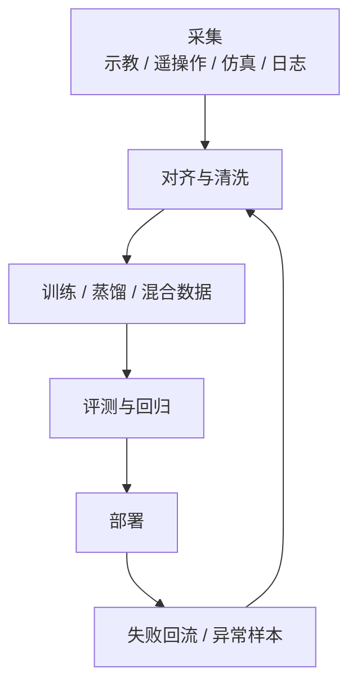

# 第十三部分 数据工程与训练闭环

如果说第六部分建立了“学习型机器人为何天然走向训练闭环”的理论前提，那么本部分讨论的就是这条闭环在现实中如何真正组织起来。到了这一层，问题已经不再是“模型架构选哪个”，而是数据如何采、如何切、如何对齐、如何混合、如何回流，以及如何让部署中的失败重新进入训练系统。对具身智能而言，数据工程不是模型训练前的准备工作，而是系统能力边界本身。

近两年机器人的一个关键变化，是数据问题开始被显式基础设施化。跨机构数据统一格式、跨环境多任务操纵数据集，以及开源训练部署工具链，正在共同把数据工作从“论文附属品”变成“长期平台能力”。
代表性工作可参见 [《Open X-Embodiment》](https://arxiv.org/abs/2310.08864)、[BridgeData V2：多环境操纵数据](https://arxiv.org/abs/2308.12952) 与 [LeRobot：开源机器人数据与训练工具链](https://arxiv.org/abs/2602.22818)。这些工作共同表明：机器人领域正在从“每篇论文自造一套小数据”转向“围绕长期可复用数据闭环搭建基础设施”。

## 62. 数据来源全景

### 62.1 真机操作数据

真机操作数据之所以始终是最有价值、也最昂贵的数据类型，是因为它直接包含了真实身体、真实传感器、真实延迟、真实扰动和真实失败模式共同作用下的交互痕迹。与仿真或公开视频不同，它记录的不是“看起来像操作”，而是“在这个具体系统上真实发生过的操作结果”。

也正因为如此，真机数据的价值并不只在量，而在闭环密度。谁能持续采到覆盖成功、失败、恢复和环境变化的高质量真机数据，谁就更可能建立长期可更新的具身能力资产。

真机数据之所以珍贵，是因为它天然携带真实动力学、真实接触、真实噪声与真实失败模式。但其缺点同样明显：采集贵、速度慢、设备磨损大、安全风险高。因此，真机数据在机器人领域通常扮演“高价值但稀缺”的角色。

真机数据之所以珍贵，不只是因为“更真实”，而是因为它包含了仿真和互联网视频很难完整给出的接触细节、执行器滞后、控制噪声、传感器漂移和失败后果。这些信号在论文表格中往往不可见，却恰恰定义了部署上限。也因此，真机数据常常不是拿来单独追求规模，而是拿来校正训练闭环最关键的现实偏差。
换言之，真机数据在整个数据体系中更像“高价值锚点”：它可以验证哪些仿真先验是有效的，哪些语言标注与动作标签是真正对齐的，哪些失败模式必须进入下一轮训练。谁如果只把真机数据当作“更贵的数据源”，就会低估它在闭环中的结构性作用。

### 62.2 遥操作与示教数据

遥操作和示教之所以重要，不只是因为它们能产出专家轨迹，更因为它们是把人类意图、技能结构和纠偏策略注入系统的主要方式。Mobile ALOHA 的意义正体现于此：其低成本全身遥操作方案，本质上是在降低高质量具身数据闭环的采集门槛，相关论文可参见 [Mobile ALOHA](https://arxiv.org/abs/2401.02117)。

从数据结构看，一条高价值遥操作样本通常不应只被理解为“机器人做了什么”，而应被理解为：

\[
d_i = \bigl(o_{1:T},\ x_{1:T},\ u^{\text{human}}_{1:T},\ a_{1:T},\ e_{1:T}\bigr)
\]

其中 \(u^{\text{human}}\) 是操作者输入，\(a_{1:T}\) 是最终执行到机器人上的动作，\(e_{1:T}\) 则可以记录接触、滑脱、重试、接管等关键事件。这个写法提醒我们：遥操作数据的价值不仅在动作标签，还在“人如何察觉偏差并纠正”的过程结构。

遥操作与示教的重要性，也不只在于产出“专家轨迹”。它们的真正作用，是把人类的任务意图、局部纠偏习惯、接触时机和恢复策略注入系统。很多机器人任务若只从成功结果倒推，很难复原中间那些关键但细碎的决策；示教数据恰恰能把这些隐性技能结构显式化。

但示教数据也有典型问题：人类操作分布与机器人可执行分布未必一致，操作者之间风格差异大，遥操作链路本身也会引入时延与抖动。更形式化地说，机器人真正执行的动作常常近似于：

\[
a_t \approx g\!\left(u^{\text{human}}_{t-\delta},\ x_t\right)
\]

其中 \(\delta\) 是人机链路时延，\(g\) 则代表设备映射、滤波和控制补偿。这意味着“人类输入”与“机器人执行”并不是同一对象。若训练时直接把两者混用，模型往往会学进操作者补偿延迟、克服抖动的痕迹，而不是学到机器人最稳妥的执行规律。

因此，示教不是“拿来即用”的标准答案，而是需要被重标定、重切片和重新组织成模型可消费的训练对象。更稳妥的做法通常是：先对齐操作者输入与机器人执行日志，再识别关键接触点与纠偏段，最后按任务阶段、恢复事件和动作接口重新打包为训练样本。谁若省略这一步，就会把“高质量示教”误写成“高质量训练数据”。

### 62.3 穿戴式采集与动作捕捉

穿戴式采集与动作捕捉路线的重要性，在于它们试图降低高质量示教数据的采集门槛，把人类动作、姿态、手部操作与视角信息更直接地映射到机器人学习流程中。相比传统遥操作，这类方案有机会记录更自然、更连续、也更贴近人类操作直觉的行为轨迹。

但它们也有显著局限：人类身体与机器人本体往往并不同构，动作捕捉得到的是“人是怎么做的”，而不是“这个机器人怎样最稳地做到”。因此，这类数据往往更适合提供先验、偏好和阶段结构，而不是被简单等同为最终动作真值。

穿戴式与 mocap 路线试图把人类动作更自然地映射到机器人本体或技能空间中。其潜力在于可以更高效捕捉复杂全身动作和双臂协调；其问题则在于本体差异、示教质量波动以及人类动作到机器人动作的结构失配。

穿戴式采集与 mocap 的魅力，在于它们更接近自然动作生成，可以高效率获取双臂协同、全身协调和连续动作调整等难以用键鼠或传统示教设备表达的行为。但它们的难点也非常典型：人类身体与机器人本体存在显著结构差异，关节范围、接触方式与力学约束都不相同，因此“捕捉到的人类动作”与“可执行的机器人动作”之间必须经历复杂映射。
因此，这类数据更适合作为技能先验、风格先验或高层动作组织参考，而不一定能直接成为低层控制监督。谁若忽视本体映射问题，就会高估动作捕捉数据的直接可用性。

### 62.4 仿真生成数据
仿真生成数据可以理解为“用可控环境批量制造训练样本”，其优势在于便宜、可重复、可注入扰动、可自动带标注；其局限则在于所有数据质量都受仿真假设约束。对机器人而言，这类数据往往更适合承担预训练、困难场景扩充、失败模式覆盖和感知标注增强等角色，而不应被直接等同于真实操作经验。

一个最小生成流程通常是：

```python
for scene in simulator.sample_scenes():
    for task in task_generator(scene):
        episode = rollout_policy_or_script(scene, task)
        dataset.write(episode)
```

仿真数据的价值在于规模、可控性和多样性，但其弱点是与现实分布错位。仿真并不只是便宜数据源，更是系统如何定义任务和环境结构的实验场。
仿真生成数据真正强大的地方，在于它允许研究者系统性操纵那些在真机上代价过高的变量，例如接触扰动、物体参数分布、传感器噪声、极端初始状态和失败恢复场景。它因此不仅是“补数据”的手段，更是“系统性发现模型脆弱点”的手段。

### 62.5 互联网视频与跨域迁移数据

互联网视频与跨域迁移数据之所以持续被讨论，是因为真实机器人数据昂贵，而公开视频与通用多模态数据看起来提供了几乎无限的补充来源。它们可以帮助模型学会对象外观、场景关系、动作意图和任务语义，为后续具身学习提供较广泛的先验。

但这类数据真正的限制也非常明确：它们通常缺少真实动作执行信号、接触反馈和可验证的控制后果。也就是说，它们更适合补高层理解和先验，而不适合直接替代真实闭环交互数据。跨域迁移的价值，更多在“先懂一些世界”，而不是“已经学会如何在这个身体里做事”。

互联网视频之所以受到关注，是因为它提供了海量动作先验和对象交互先验。但它的问题也非常直接：没有真实机器人状态，没有控制信号，没有精确时间对齐，也未必对应机器人本体可执行的动作语义。因此，跨域迁移价值存在，但通常更适合作为高层语义或表征预训练，而不是直接作为动作监督。
这类数据最有价值的部分，往往不是提供“可以直接模仿的动作”，而是提供场景共现、对象可供性、任务流程和人类操作顺序等弱结构先验。也就是说，互联网视频更适合告诉模型“世界里通常会发生什么”，而不太适合直接告诉控制器“下一步关节该怎么动”。

## 63. 数据清洗、对齐与标注

### 63.1 时间同步

时间同步看似是数据工程里的底层细节，实则直接决定多模态样本是否还有学习价值。图像、关节状态、力觉、语言指令、动作命令和环境事件只要在时间上错开到一定程度，模型就会把本不对应的原因和结果学成关联，最终表现为感知滞后、动作错位或恢复时机错误。

对具身数据来说，最危险的并不是完全没有同步，而是“看起来差不多”的轻微不同步，因为这种错误更隐蔽、更难在早期被发现，却会在训练后长期污染模型行为。因此，时间同步从来不是清洗后补救的小步骤，而是采集协议设计的核心。

机器人数据比很多机器学习数据更难处理的根源之一，就是所有信号都必须在时间上对齐。图像、状态、动作、触觉、语言和控制回路一旦时间戳错位，下游模型学到的就不是任务结构，而是跨模态噪声。

时间同步之所以关键，是因为机器人数据不像纯图像数据可以近似视为独立样本。图像、关节状态、力觉、触觉、动作命令和语言事件往往必须在同一任务时钟上对齐，模型才能学到“这个动作导致了这个结果”。一旦时钟错位，模型看到的就不再是因果序列，而是跨模态噪声拼贴。
也就是说，时间同步不是底层 housekeeping，而是因果结构是否能被学习的前提。很多所谓“模型不稳定”问题，最终并不是架构失败，而是训练样本内部时间语义已经被破坏。

若把时间同步写成更严格的数据条件，可以把各模态观测统一映射到任务时钟 \(t\) 上的同一窗口：

```math
\tilde{o}^{(m)}_t = o^{(m)}\bigl(t + \epsilon_m(t)\bigr), \qquad m \in \{\text{vision},\text{proprio},\text{force},\text{language}\}
```

其中 \(\epsilon_m(t)\) 表示第 \(m\) 个模态相对参考时钟的残余同步误差。对机器人来说，真正危险的不是 \(\epsilon_m(t)\) 明显大到肉眼可见，而是它在统计上持续偏向同一方向，使模型把“先发生的状态”错学成“后发生的结果”。更实用的判断口径通常不是只问平均同步误差，而是同时问三件事：最大偏移有多大、抖动分布如何、关键事件附近的误差是否显著放大。因为很多抓取、接触和恢复行为的可学习性，往往就毁在几十毫秒级的系统性错位上。

### 63.2 多模态切片

多模态切片的困难，在于机器人数据并不是天然按样本独立同分布组织的。图像、关节状态、力觉、语言、动作命令和任务事件之间具有强时序耦合关系，若切片窗口选得不合理，就可能把真正重要的因果链条截断，或者把无关上下文大量带入训练。

因此，切片策略本身就属于模型设计的一部分。窗口长度、重叠方式、对齐基准、是否保留失败前后片段、如何处理多阶段任务边界，都会直接影响模型学到的是局部反射式映射，还是能跨更长时间尺度维持目标一致性的策略。

若写成统一抽象，一个切片器可以被理解为：

\[
\mathcal{S}(E; H, K, b, r) \rightarrow (x_t, y_t)
\]

其中 \(E\) 是完整 episode，\(H\) 是历史窗口长度，\(K\) 是预测窗口长度，\(b\) 是边界策略，\(r\) 是重叠或重采样规则。这个表达式的意义在于强调：切片器本身就在定义“模型看见什么历史”“模型对未来负责多长”“任务边界如何被切开”。它不是无关痛痒的预处理脚本，而是隐式的任务建模器。

序列数据如何切片，会直接影响模型看到的任务因果结构。是按固定窗口切、按技能边界切、按成功/失败阶段切，还是按事件边界切，并不是中立选择。若按固定窗口切片，模型更容易学到局部共现模式；若按技能边界切片，模型更容易捕捉子任务结构；若按异常与恢复事件切片，模型则更容易形成失败感知与重试能力。

工程上至少可以区分三类典型切片器。第一类是吞吐优先的定长切片，适合大规模离线训练，但容易切断关键因果边界。第二类是技能边界切片，适合学习分阶段任务结构，但依赖可靠阶段标签。第三类是失败中心切片，专门围绕偏差、接触和恢复构造样本，最能提升韧性，却也最容易让训练分布偏离常规主路径。不同切片器服务的是不同能力目标，而不是不同“代码风格”。

这也是为什么许多看似相似的数据，在不同切片方式下会训练出完全不同的策略风格。切片不是中立的数据预处理，而是在告诉模型：什么叫一个完整决策单元，什么叫值得记住的上下文，什么又只是噪声。

### 63.3 指令标注与动作标注
指令标注与动作标注的关键区别，在于前者描述“这段行为在语义上想完成什么”，后者描述“这段行为在控制层到底做了什么”。具身数据若只有动作日志而缺少语义指令，就很难支持多任务语言条件训练；若只有语言描述而动作时间轴、控制接口和末端状态不清晰，又很难真正训练可执行策略。

更细地看，这其实对应两种不同层级的 supervision。指令标注回答的是任务层问题，例如“把红色杯子放到左侧托盘里”；动作标注回答的是执行层问题，例如末端位姿、夹爪开合、阻抗参数、速度限制和终止条件。若二者之间没有稳定映射，模型就容易学会“说得通但做不稳”的策略，也就是语言上像理解了任务，但在接触、微调和恢复阶段频繁失效。

高质量具身数据集通常还需要第三层中间监督，即阶段化语义锚点，如 `approach -> align -> contact -> lift -> place`。这些标签不一定需要逐帧人工精标，但至少应在技能切换点、失败点和恢复点形成结构化记录。因为系统后续是否能学会“做到哪一步了”“现在应不应该重试”“何时该请求人类澄清”，很大程度上取决于这些中间语义是否被显式编码进数据。

因此，完整样本通常至少要包含：

1. 任务目标或语言描述。
2. 对齐后的观测与状态序列。
3. 动作序列及其控制语义。
4. 成功/失败与关键事件标签。

语言标注的粒度会影响系统到底学到“对象描述”“子任务描述”还是“高层目标描述”；动作标注则决定动作空间被如何离散化、归一化或 chunk 化。数据组织方式因此直接进入模型假设。
指令标注与动作标注之所以重要，是因为它们决定了系统最终学到的是哪一层抽象。若语言标注过粗，模型可能只学到任务名词而学不到中间约束；若语言标注过细，又可能把本应由策略内化的结构硬编码进文本。

更进一步地说，具身数据的一个“训练单元”最好从一开始就被组织成显式 schema，而不是靠后续脚本猜字段含义。一个更接近可维护数据资产的最小记录对象可以写成：

```python
sample = {
    "episode_id": episode_id,
    "t_start": t0,
    "t_end": t1,
    "instruction": instruction_text,
    "observations": obs_window,
    "robot_state": state_window,
    "action": action_window,
    "skill_stage": stage_tag,
    "event_tags": ["contact", "slip", "recover"],
    "success": success_flag,
}
```

这类 schema 的意义，并不只是让训练代码更整洁，而是让“语言监督”“动作监督”“阶段监督”“异常监督”在数据层就被区分开来。否则后续模型一旦出问题，团队很难判断是语言粒度不对、动作语义不清、阶段边界没对齐，还是事件标签缺失。

### 63.4 失败样本与异常样本处理
失败样本处理不只是“把坏数据剔掉”，而是先判断这些失败到底是噪声、危险异常，还是对训练极有价值的恢复样本。对机器人而言，若训练集里只有成功演示，模型往往很难学会偏差修正、接触恢复和与人澄清等现实能力。

更实用的做法通常不是把失败样本统一归为负例，而是先给失败分型。例如可恢复失败、不可恢复危险失败、标注错误失败、设备故障失败、环境超边界失败，它们进入训练和评测的方式应当不同。否则系统很容易把“值得学习的恢复过程”和“根本不应模仿的危险轨迹”混在一起。

一个实用流程通常是：

```python
for episode in dataset:
    if is_corrupted(episode):
        discard(episode)
    elif is_recoverable_failure(episode):
        keep_for_recovery_training(episode)
    else:
        tag_as_hard_negative(episode)
```

失败样本的价值常常高于成功样本，因为它们更直接暴露系统边界与恢复需求。但现实中失败样本往往被过度清洗掉，导致模型在部署时严重缺乏异常恢复能力。
失败样本之所以珍贵，是因为它们为系统提供了“边界附近的数据”。成功样本往往集中于平稳执行区域，而真正决定部署韧性的，常常是抓取滑脱、路径阻塞、接触超调、目标丢失、语言歧义和传感器异常这类不稳定片段。

一个最简化的数据记录单元可以抽象为：

\[
\mathcal{D}_i = \{(o_t, x_t, a_t, r_t, \ell, m_t)\}_{t=1}^{T_i}
\]

其中 \(o_t\) 是观测，\(x_t\) 是机器人状态，\(a_t\) 是动作，\(r_t\) 可表示回报或事件标签，\(\ell\) 是语言任务，\(m_t\) 则可包含成功/失败、接触、异常等元数据。很多看似“模型效果不稳定”的问题，最终都可以追溯到 \(\mathcal{D}_i\) 内部的错位、缺失或标注语义不一致。

如果把切片问题形式化，可以把一个训练样本写成长度为 \(H\) 的条件窗口与长度为 \(K\) 的预测窗口：

\[
x_t = \{o_{t-H+1:t}, a_{t-H+1:t-1}, l_{t-H+1:t}\}, \quad
y_t = a_{t:t+K-1}
\]

其中 \(o\) 表示观测，\(a\) 表示动作，\(l\) 表示语言或任务标签。这里 \(H\) 决定模型看到多少历史，\(K\) 决定模型一次要承担多长的动作生成责任。所谓 action chunking、本体状态缓存和长程记忆，很多时候首先就是通过这两个窗口长度被编码进训练样本的，而不是先在模型结构里显式声明。

工程上至少有三种常见切片策略。其一是固定时间窗，优点是实现简单、吞吐高，缺点是容易切断技能边界；其二是事件边界切片，例如以抓取开始、接触建立、放置完成等事件作为边界，优点是更贴近技能结构，缺点是需要可靠事件标注；其三是失败中心切片，专门围绕碰撞、滑脱、遮挡和恢复过程构造样本，优点是能提高系统的异常处理能力，缺点是分布会偏离常规成功轨迹。不同策略对应的不是不同“数据清洗口味”，而是不同的能力目标。

更细一点看，失败样本至少应区分四类。第一类是“数据坏了”，如传感器掉帧、时间戳错乱、控制日志损坏；第二类是“任务失败但过程有价值”，例如抓空、滑脱、放歪后又恢复；第三类是“高风险失败”，例如撞人、过载、夹手、越界；第四类是“标注失败”，即真实执行正确但语义标签或动作对齐错误。只有分开这四类，后续训练、回放和审计才不会把完全不同性质的样本混为一谈。

对训练系统而言，真正有价值的通常不是把所有失败都加大权重，而是围绕“可恢复失败”构建局部课程。因为这类样本最能告诉模型：当主路径被打断时，什么样的观察变化意味着应该重抓、重定位、请求人类接管或直接终止。相反，高风险失败更适合作为安全边界数据、离线审计样本或规则层的反例，而不应未经处理就并入普通行为克隆数据中。

## 64. 数据混合与 curriculum

### 64.1 通用数据与专用数据混合

通用数据与专用数据混合的意义，在于把广覆盖先验与任务特化能力同时带入训练。通用数据通常有助于模型学习对象、场景、语言和基础行为模式的宽泛分布，而专用数据则提供某一平台、某一场景、某一任务边界下真正可执行的闭环知识。两者缺一，系统都容易偏。

真正困难的不是“要不要混合”，而是如何决定混合比例和训练顺序。通用数据过多，系统可能更会理解却不够会做；专用数据过多，系统可能做得很熟却缺泛化余量。混合策略实际上是在定义模型应把什么看作普遍规律，什么看作平台特定技能。

若写成训练目标，这一过程更接近：

\[
\mathcal{L}_{\text{mix}} = \sum_{d \in \mathcal{D}_{\text{general}} \cup \mathcal{D}_{\text{special}}} \lambda_d(s)\,\mathbb{E}_{(x,a)\sim d}[\ell_\theta(x,a)]
\]

其中 \(\lambda_d(s)\) 允许随训练阶段 \(s\) 变化。这个写法强调了一点：数据混合不是“把所有数据拼在一起”这么简单，而是在通过动态权重设计模型的归纳偏置。

从工程实践看，至少存在三种典型混合策略。第一种是“先通用、后专用”，适合先吸收广义视觉语言先验，再用平台专有数据把动作接口压实；第二种是“全程交织混合”，适合维持泛化与专用能力的平衡，但更依赖细致的采样权重与 curriculum；第三种是“闭环再加权”，即部署后逐步提高失败恢复数据、现场回流数据和重点任务数据的占比，让模型的重心向真实问题慢慢移动。

通用数据与专用数据混合的困难，在于两者服务的目标不同。前者更利于形成广覆盖语义与对象先验，后者更利于特定任务精度与稳定性。如果不控制配比，系统要么学成“什么都见过但都做不精”，要么学成“某一场景很好用但迁移极差”。所以数据混合从来不是越多越好，而是要围绕目标能力边界设计。

从长期看，这一问题会越来越像模型架构设计的一部分：不同数据源的权重、采样节奏、课程顺序和损失配比，会共同决定模型偏向广义泛化还是窄域可交付。也因此，在比较两条路线时，只问“用了哪些数据”远远不够，更关键的是问“这些数据在训练中各自拥有多大话语权”。

### 64.2 多机器人平台联合训练
多机器人联合训练的目标，不只是“把更多数据拼起来”，而是让不同本体、不同控制频率和不同动作接口的数据进入某种可比较的共享表示。真正困难的地方在于：同一个“抓取”在不同机器人上可能对应完全不同的关节空间、视角布局和控制语义。

因此，多平台联合训练真正先要解决的是对齐协议，而不是模型容量。至少要明确哪些变量被抽象到共享空间，哪些变量必须保留为平台特有条件。若这一点没处理好，所谓联合训练就可能只是把不可比的数据放进同一 batch，而不是形成真正可迁移的跨平台先验。

因此，这类训练往往需要至少一种对齐机制：

1. 对齐到任务语义层。
2. 对齐到末端执行器或对象中心动作空间。
3. 对齐到共享技能 token 或程序化接口。

跨平台训练是具身基础模型的重要方向，因为单一机器人平台的数据规模永远有限。但本体差异、动作接口差异和传感器差异使这件事非常困难。Open X-Embodiment 的价值正在于，它把“跨平台联合训练”从概念讨论推进成了可操作的数据标准与实验对象，相关论文可参见 [《Open X-Embodiment》](https://arxiv.org/abs/2310.08864)。
更难的问题在于，不同平台之间共享的并不是完整策略，而往往只是部分结构。某些平台共享对象语义，某些共享技能拓扑，某些共享高层任务分解，但低层可行动作完全不同。

把这一点写得更形式化，可以把联合训练视为“共享表示 + 本体条件”的条件策略学习问题：

```math
\pi_\theta(a_t \mid o_t, l, e)
```

其中 \(e\) 表示 embodiment 条件，可包含机械臂类型、自由度、夹爪形式、控制频率、相机外参或动作归一化协议。若没有 \(e\)，模型就会被迫把本应显式建模的本体差异藏进参数噪声中；若只有 \(e\) 而没有共享表示，又会退回到“一机一模”的孤岛式训练。因此，多平台联合训练真正困难的不是多收几家数据，而是找到共享结构与本体特有结构之间的正确分界线。

### 64.3 从易到难的课程学习
课程学习在机器人里之所以有现实意义，是因为很多任务的探索空间本身就高度分层。系统若一开始就面对长时程、多阶段、强接触、开放环境任务，往往既学不到稳定技能，也难以分辨失败究竟来自感知、控制还是阶段切换。把任务按难度、时程、扰动强度或接触复杂度分层，能够显著提高训练信号密度。

一个常见思路是先在高成功率、短时程、强结构化子任务上收敛基础策略，再逐步扩大初始状态分布、增加扰动、延长 horizon、放松环境约束。这与人类训练机器人操作员的逻辑并不矛盾，本质上都是在控制学习曲线的斜率，而不是一次性把全部复杂性都暴露给系统。

但课程学习最容易出的问题是“课程泄漏”：模型在某一层课程上形成了对环境、节拍或初始化方式的依赖，导致一旦进入下一层就崩溃。因此课程设计不应只看难度递增，还要看阶段之间的接口是否连续、失败样本是否被保留、以及是否有机制防止系统只记住每一关的套路。好的课程学习不是把困难推迟，而是有组织地暴露困难。

课程学习在具身系统里尤其自然，因为真实任务本身就具有明显的难度梯度：从静态单物体、固定视角、少扰动任务，到多对象、动态遮挡、长时程、强接触和复杂恢复任务。若系统一开始就暴露在最复杂分布下，训练往往不仅效率低，还容易学不到稳定结构。

但课程设计并不是简单地把数据按“容易 - 困难”排序。更关键的是识别哪些难度维度应被逐步开放，例如对象多样性、动作自由度、扰动强度、接触复杂性和任务链长度。课程若设计得当，它会显著提高样本效率；若设计不当，也可能把模型锁死在过于狭窄的能力边界中。

课程学习在机器人里尤其自然，因为很多任务本就有明显分层：先抓取、再搬运、再装配；先单对象、再多对象、再动态环境。课程设计如果合理，能显著提高训练稳定性；若设计不当，也可能把模型锁死在过窄任务轨迹上。
课程学习真正有价值的地方，不是“按难度排序”这么简单，而是它帮助系统控制分布漂移速度。一个尚未形成稳定抓取能力的策略，若过早进入长时程装配和多体交互场景，训练噪声往往会淹没有效信号。

### 64.4 数据配比为什么是“模型设计的一部分”

数据配比之所以属于模型设计的一部分，是因为模型看到什么比例的成功样本、失败样本、遥操作示教、仿真数据、开放域先验和现场回流数据，实际上决定了它最终会把什么当作“正常世界”。很多看似属于结构设计的问题，最后往往是通过数据配比在训练中被隐式编码进去的。

可以把这一点写得更直接：数据配比其实是在决定模型的默认归纳偏置。若成功样本过多、失败恢复样本过少，模型会倾向于把世界想得过于干净；若仿真样本过多、真机样本过少，模型可能学会漂亮但脆弱的闭环；若开放域视频先验过强、可执行动作数据不足，则模型会更擅长“看懂任务”，却不一定更擅长“把任务做成”。

这也解释了为什么同一模型结构在不同团队手里会表现出完全不同的行为特征。若训练集中过度偏向干净成功样本，系统可能显得顺滑但脆弱；若失败恢复和异常样本比例更高，系统可能更保守，却更适合真实部署。配比从来不只是统计问题，而是行为边界设计问题。

在具身系统中，数据配比并不是训练前的 housekeeping，而经常决定模型最终学到的行为偏置。一个模型在语言覆盖上看似很强，可能只是因为语言标注更密；一个模型在失败恢复上很弱，可能只是因为失败样本权重极低。因此，数据混合策略应被视为隐式策略先验，而不只是数据工程细节。

把这一点说得更直接一些，很多“模型风格”其实是被数据配比塑造出来的。若训练集中过度偏向干净成功样本，策略往往更激进、更流畅，但也更脆弱；若困难样本、失败恢复样本和保守示教占比更高，系统则可能更慢、更谨慎，却也更适合高责任场景。配比因此不是纯统计问题，而是行为边界设计问题。

更正式地说，课程学习的目标不是让训练集看起来更整齐，而是控制模型所面对的状态分布演化速度。若记第 \(s\) 个阶段的数据分布为 \(p_s(x)\)，则一个理想课程并不追求相邻阶段完全不同，而更希望保持：

\[
D\bigl(p_s(x), p_{s+1}(x)\bigr) \text{ 有控制地增长}
\]

其中 \(D(\cdot,\cdot)\) 可理解为某种分布差异度量。这个写法的意义在于提醒我们：课程设计本质上是在管理训练时的分布跃迁，而不是机械地给任务排难度名次。

对具身系统更有用的课程维度通常包括：对象数量、对象多样性、遮挡强度、接触复杂度、动作自由度、恢复需求和任务链长度。也就是说，课程不是一条单轴，而更像一个多维开放阀门过程。很多系统之所以在论文里“看起来学会了”，到真实环境里却很快失稳，就是因为课程只控制了视觉难度，没有控制接触难度和恢复难度。

如果写成训练目标，可以把混合训练近似表达为：

\[
\mathcal{L} = \sum_{d \in \mathcal{D}} \lambda_d \, \mathbb{E}_{(x,a)\sim d}[\ell_\theta(x,a)]
\]

其中 \(\mathcal{D}\) 代表不同数据源集合，\(\lambda_d\) 代表每类数据的采样权重或损失权重。这个公式的重要性不在数学本身，而在它明确指出：所谓“用了哪些数据”并不足以描述训练设置，真正决定行为风格的是各类数据在优化目标里被赋予了多大话语权。

因此，数据配比表最好被当成模型卡的一部分而不是附录细节。对于研究型报告而言，一个更严谨的比较口径是同时问三件事：用了什么数据、切成什么样、按什么比例进入训练。只问第一件事，往往会把数据工程最关键的行为偏置隐藏起来。

## 65. 后训练与闭环更新

### 65.1 在线修正

在线修正的价值，在于它允许系统在不完全停机重训的情况下，把现场反馈快速引入执行闭环。对真实机器人来说，这一点非常关键，因为很多错误并不是离线训练时能预先穷尽的，而是在部署后才逐步暴露出来。

不过，在线修正也带来新的风险：系统可能把局部补丁误当成普适规律，或者在缺少足够审计与回放机制时引入不可控漂移。因此，在线修正真正可用的前提，不只是“能更新”，而是“更新后可回溯、可验证、可回滚”。

更稳妥的在线修正链路，通常不应是“现场自动学一点再直接上线”，而更接近下面这个受控流程：

```python
issue = detect_failure(run_log)
patch_data = collect_patch(issue)
candidate = adapt(policy, patch_data)
if passes_shadow_eval(candidate) and passes_safety_regression(candidate):
    deploy_canary(candidate)
else:
    rollback(candidate)
```

这段伪代码表达的不是某种特定算法，而是一条治理原则：在线修正必须经过影子评估、安全回归和灰度放行，而不是把现场当成无保护的在线优化环境。

若写成更抽象的放行条件，可以近似表示为：

\[
\Delta U_{\text{new}} > 0,\qquad \Delta Risk_{\text{new}} \le \epsilon
\]

也就是说，只有当新版本带来的效用增量为正，且风险增量被控制在可接受阈值 \(\epsilon\) 内，修正才值得进入生产系统。机器人与纯软件代理最大的不同，正在于这里的风险往往不是界面错误，而是碰撞、停机、误抓、误入危险区域或劳动流程中断。

在线修正的真正价值，在于把部署环境从“评测终点”变成“继续学习的信号源”。机器人若只能离线训练、上线执行，就会在现实扰动面前迅速失去适应性；而一旦允许有限、安全、受控的在线修正，系统就有机会逐步把长尾异常纳入能力边界。

但这件事的门槛很高，因为在线修正不仅是优化问题，更是安全问题。谁有权更新、何时回滚、哪些日志必须保留、哪些错误不能自动学习，都会决定这条闭环能否长期可用。对研究型报告而言，真正值得记录的从来不是“系统支持在线更新”这句口号，而是它是否明示了数据审计、影子验证、灰度放行和回滚接口。

### 65.2 人类反馈
在人类反馈进入训练闭环后，数据工程就不再只是被动记录，而开始包含“如何高效地从人类那里获取最有价值修正信号”。反馈可以是重做示教、口头纠错、偏好比较、接管恢复，或对失败原因的标签说明。

一个最小反馈回流流程可以写成：

```python
episode = rollout(policy)
feedback = human_review(episode)
dataset.append(align_feedback(episode, feedback))
retrain(policy, dataset)
```

很多现实系统并不会完全自动更新，而是通过人类纠正、偏好反馈和失败回放筛选做受控修正。这使训练闭环天然包含“人在回路”。
人类反馈在机器人里比在纯语言模型里更复杂，因为反馈对象不仅是文本输出，还可能是轨迹片段、接触策略、恢复动作和安全边界。也正因为如此，机器人中的“偏好学习”常常不是抽象偏好打分，而是与示教补采、异常重标注和操作员纠偏共同构成一个混合信号体系。
从数据工程角度看，人类反馈最难的地方并不是“收集到意见”，而是把意见对齐到可训练字段。操作者说“刚才太冒进”“这一步不稳”“应该先扶住再转”，这些反馈若不被映射到具体轨迹片段、状态窗口和动作决策点，就很难进入后续训练。也因此，成熟系统通常会为反馈附带时间戳、事件锚点、技能名、失败类型和操作者置信度，而不是只保留一条模糊文本评论。
这也解释了为什么高质量反馈比大规模低质打分更有价值。对机器人而言，一个准确指出“在哪个状态窗口里应该切换到保守恢复动作”的操作员标注，常常比几十条笼统的“做得不好”更有训练价值。后续若进入企业与部署分析，应特别关注团队是否建立了低摩擦的反馈采集界面、是否能把接管和纠偏自动切成训练单元，以及是否区分了结果级反馈、轨迹级反馈和策略级反馈；这些能力往往比单次模型效果更能决定训练闭环能否持续运转。

### 65.3 失败恢复数据回流
失败恢复数据回流的价值，在于它专门为系统补上“从偏差状态回到可执行轨道”的样本，而不是只增加更多标准成功轨迹。很多现实部署中的能力边界，不体现在理想起始状态能否成功，而体现在轻微偏差、错位接触、目标半遮挡和执行中断后能否恢复。

因此，恢复数据通常值得被当作单独数据类型管理，而不是和普通成功样本简单混在一起。

真正强的系统通常不是“从不失败”，而是“失败后能留下有价值数据”。DAgger、示教补采和困难样本回流都体现了这个思想。[DAgger](https://proceedings.mlr.press/v15/ross11a.html)
从工程视角看，失败恢复回流是把部署现场重新接回训练系统的核心接口。没有这一接口，部署与训练会重新分裂成两个世界：前者不断暴露新问题，后者却持续在旧分布上优化。

这一类回流数据尤其适合单独建立元数据字段，例如失败类型、恢复方式、人工介入点、最终是否恢复成功、是否触发安全接管等。只有把失败结构显式记录下来，后续训练与评测才有机会区分“主路径能力”与“恢复能力”，否则失败样本很容易再次被粗糙地合并回普通轨迹里，失去其最有价值的信息。

更稳妥的做法，是把恢复片段本身视为一种独立样本类型，而不是成功样本的附注。一个更贴近训练闭环的数据对象通常至少应包含：

```python
recovery_case = {
    "failure_type": failure_type,
    "pre_failure_window": pre_failure_obs,
    "trigger_action": trigger_action,
    "recovery_action": recovery_action,
    "human_takeover": takeover_flag,
    "resolved": resolved_flag,
}
```

这类结构使系统后续可以分别学习三件事：如何识别偏差即将发生、偏差已经发生后优先尝试哪种恢复、以及什么情况下应停止自动恢复并请求人工接管。对长期部署而言，这比单纯增加“失败过/没失败过”的标签价值高得多。

### 65.4 持续学习与灾难性遗忘

持续学习的吸引力很强，但机器人比纯软件系统更难承受遗忘代价：旧任务一旦退化，现实部署成本立即上升。因此，持续更新与能力保留之间的平衡是一个实际工程问题。

也因此，机器人里的持续学习不应只被理解为“模型继续训练”，而更像受约束版本迭代。每一轮新数据回流后，都应伴随历史能力回归、关键安全任务复测、旧场景抽样验证和必要时的灰度发布。否则“会学”很容易变成“越学越不稳”。
灾难性遗忘在机器人领域尤其敏感，因为遗忘的不只是 benchmark 分数，而可能是已上线技能的稳定性、安全裕量和操作员信任。一个模型如果在新场景学习后削弱了旧场景中的基础抓取或门把手操作能力，其代价往往直接表现为现场停机与重调试。

下面给出一个极简的失败样本回流伪代码：

```python
for episode in deployed_episodes:
    if episode.success:
        replay_buffer.add(episode, weight=1.0)
    else:
        repaired = relabel_or_reteach(episode)
        replay_buffer.add(repaired, weight=3.0)

train(policy, replay_buffer)
```

这段代码当然忽略了很多安全与治理细节，但它抓住了训练闭环的关键思想：失败不应只被统计为 KPI，而应被转化为下一轮训练的高价值样本。

对机器人而言，人类反馈至少有三种粒度。第一种是结果级反馈，即“这次是否做成”；第二种是轨迹级反馈，即“哪一段动作多余、太激进或不安全”；第三种是策略级反馈，即“以后遇到类似状态应优先采用哪类恢复动作”。三种反馈的采集成本、可训练性和可泛化性都不同，如果系统只把它们统一压成一个标量奖励，往往会损失掉最有价值的结构信息。

更现实的闭环做法通常是把人类反馈嵌入一条分层修正链：能靠口头纠正解决的，不必重做示教；能靠重标注解决的，不必重训整模型；只有当反馈稳定指向某类系统性偏差时，才值得把它升级成新的训练批次。这样做的核心不是节省算力，而是避免把稀疏的人类监督浪费在错误层级上。

如果把失败恢复看成训练资产，就不应只回收“发生了失败”这一事实，还要回收失败前状态、触发条件、第一次错误动作、恢复动作、人工接管点以及最终结果。也就是说，一条高价值恢复样本不是一个标签，而是一段完整的小型因果链。它告诉系统：偏差是如何形成的、什么时候已经不可逆、什么样的修正仍然有效。

这也是为什么许多成熟系统会单独维护恢复缓冲区，而不是把恢复样本直接混回普通 replay buffer。前者服务于“提高异常情境下的决策质量”，后者服务于“维持主路径性能”。如果两者不分离，模型要么会被正常轨迹淹没而学不会恢复，要么会被异常样本拖得过于保守。

从持续学习角度看，更关键的问题不是“能不能继续学”，而是“继续学之后怎样证明旧能力没有被破坏”。因此，机器人系统里的持续学习通常需要伴随一套回归基准：旧任务回放集、关键安全动作集、典型失败恢复集和部署前强制复测集。没有这套回归框架，所谓持续学习就很容易退化成不可控漂移。

对本报告后文的企业分析和部署分析而言，这一点非常关键。很多团队宣传“机器人会越用越聪明”，但真正值得追问的是：它通过什么机制保存旧技能、隔离新数据风险、回滚坏版本、验证安全边界没有退化。持续学习在机器人里不是单纯的模型能力问题，而是版本治理、数据治理和安全治理的交叉问题。

## 66. 数据治理与合规

### 66.1 数据版权

数据版权问题在具身智能里之所以复杂，是因为机器人训练数据往往同时混合了视频、动作轨迹、语言标注、环境日志、传感器读数和现场流程信息，不同部分的权属边界并不完全相同。公开网页视频、客户现场录像、遥操作示教数据和合作伙伴设备日志，既可能分别适用不同许可条件，也可能在混合后形成新的再分发限制。

对工程团队而言，更现实的问题不是抽象地问“能不能用数据”，而是问“能不能把这批数据稳定纳入可持续训练资产”。若来源不清、授权不明、再训练权利不确定，即便短期实验可做，长期也难以沉淀为版本化数据资产。因此，本章建议后续在资料库中同步记录每类数据的来源、授权方式、可训练范围、可再分发边界和版本变更记录。

一个更适合长期项目维护的数据权利卡，至少应包含：

```python
license_card = {
    "source_owner": owner,
    "collection_context": scene_type,
    "train_right": train_allowed,
    "redistribute_right": redistribute_allowed,
    "derivative_right": derivative_allowed,
    "expiry_or_revocation": expiry_rule,
    "evidence_file": contract_or_license_ref,
}
```

这类权利卡的意义，不只是方便法务审计，更是避免训练闭环在未来某次版本冻结时才突然发现：某批关键数据虽然能内部演示，却没有合法再训练权、微调权或再分发权。对长期维护的研究项目来说，不能复用的数据，本质上就不应被视为稳定资产。

机器人数据版权问题之所以复杂，是因为样本往往同时包含视觉内容、环境布局、用户行为、厂区流程和设备操作知识。它不像纯文本那样只问“来源可不可以抓”，还要问采集场地、设备接口、示教者身份和客户业务流程是否允许再训练与再分发。互联网视频、公开视频、企业示教视频和第三方数据集并不天然可以任意重用；尤其当训练开始涉及商业部署、外部合作或开源复现时，版权边界会迅速变得敏感。

因此，这一问题不应被留到导出报告或准备发布模型时才处理，而应在数据进入 `research/`、`data/` 和训练脚本之前就完成权属建档。谁如果把“先收再说”当成默认策略，后续很可能会在最关键的闭环阶段发现：模型能继续迭代，数据却不能继续合法使用。

### 66.2 隐私与现场采集合规
现场数据采集一旦进入真实工厂、仓储、门店、医院或家庭环境，隐私与合规就不再是附属问题。视频里可能包含员工面部、工牌、生产流程、客户信息、商业机密与空间布局；遥操作日志和语音指令还可能包含操作员身份信息、行为习惯或敏感业务过程。若没有前置的数据分级与权限控制，研究闭环很容易在组织层面被直接阻断。

因此，更稳妥的做法不是“先采再说”，而是在采集前就定义字段边界：什么可以原样保留，什么必须脱敏，什么只能保留派生特征，什么需要严格访问审计。对长期项目来说，最关键的不是一次性通过某个审批，而是建立一套可重复执行的数据治理流程，使新场景接入时不必每次从零讨论。

从工程角度讲，合规要求还会反过来塑造数据架构。很多时候应优先保留任务相关事件流、状态量、局部裁剪或匿名化元数据，而不是无差别全量录像。数据工程若从一开始就不考虑合规，后续训练闭环往往会因为“不能合法复用数据”而被迫重建。

现场采集合规的难点在于，机器人数据并不只是“看到了什么”，而往往同时记录了“谁做了什么、在什么位置做、失败了几次、如何被纠正”。这意味着许多看似普通的操作日志，实际上可能包含可识别个体行为模式、客户流程细节、设备布局信息甚至商业机密。

因此，合规工作不应只理解为打码或匿名化，而应前移到采集流程设计：哪些模态必须采、哪些模态可以降采样、哪些日志只保留统计量、哪些原始视频必须限权保存、哪些数据在出现场前就要被脱敏。对具身系统来说，合规本身就是数据工程的一部分，而不是训练结束后才补的一道法务手续。
现场采集合规的关键，不只是遮掉人脸，而是系统性识别样本里哪些信息会泄露个人、企业或场地敏感结构。例如家庭环境中的生活痕迹、工厂中的工艺流程、医院中的患者数据、仓储中的 SKU 与路径布局，都可能通过机器人日志被间接暴露。

家庭、医疗、办公和工厂现场数据都可能涉及隐私、商业机密和安全边界。机器人采集因此不仅是技术问题，也是现场治理问题。

### 66.3 真实场景数据的伦理边界
真实场景数据的伦理边界，往往比法律边界更早到来。即便某些采集在形式上合规，也未必意味着它在组织信任、劳动关系、用户知情和风险分配上就是合理的。具身系统如果长期依赖高强度一线操作员示教、隐性监控式现场采样或把失败成本外包给弱势岗位，那么即使技术上取得进展，这条路线也可能在社会可接受性上留下长期问题。

因此，这一节最重要的不是给出抽象口号，而是建立几个具体追问。数据采集对象是否充分知情，是否拥有退出机制；失败样本是否会被不公平地归咎于操作员；遥操作与示教劳动是否被当作可替代隐形成本；家庭、医疗或弱势群体场景中的采集是否存在额外保护要求。只有这些问题被明确写进流程，伦理才不会停留在附录层。

对研究型报告而言，伦理边界不是“政治正确补丁”，而是判断路线可持续性的必要条件。很多短期有效的数据策略，如果在劳动、隐私或责任结构上不可持续，最终也很难成为长期行业主线。

伦理边界与法律合规并不完全相同。即使一段数据在合同上可用，也不代表它在研究上就应被无限扩展使用。最典型的问题包括：是否在弱知情条件下记录了一线员工行为、是否把高风险失败样本用于超出原场景的训练、是否在带有人身风险的场所默许系统以“边跑边学”的方式试错。

对研究报告而言，更稳妥的立场是承认：真实场景数据越接近高价值交付，就越不可能是一块无摩擦、无限制的通用燃料。数据闭环能力如果建立在模糊的伦理边界之上，短期也许能提高训练效率，但长期会直接侵蚀系统可持续部署的正当性基础。

机器人可以更深入地进入现实空间，这使其数据采集行为本身就可能成为伦理问题。也正因为此，数据工程在具身系统里天然和治理问题相连。

### 66.4 工具链基础设施的重要性
工具链基础设施之所以需要单列，是因为数据工程的竞争力往往并不只体现在“有没有更多数据”，而体现在“能否把数据稳定变成可迭代资产”。同样是采集一万段示教，缺乏 schema 管理、版本控制、质量审计、回放工具和训练对接接口的团队，往往无法把这些数据持续转化为模型改进。

从长期闭环看，真正决定迭代速度的常常是这些看似不“前沿”的基础设施：采集端时间同步，episode 回放，失败片段检索，标注任务分发，数据版本 diff，训练配置可追踪，以及部署日志回流。它们共同决定了团队能否做到“发现问题 -> 定位片段 -> 修正数据/训练 -> 回归验证”的短闭环。

因此，后续版本评估企业或开源生态时，不应只比较模型名字，也应比较工具链成熟度。谁拥有更清晰的数据-训练-部署基础设施，谁就更可能在同样研究方向上形成持续优势。很多路线之所以看起来迭代更快，本质上并不只是模型更强，而是工具链让学习速度更快。

随着数据规模扩张，数据工程已经无法只靠零散脚本维持。数据版本管理、可视化、流式读取、跨平台格式统一、在线日志回收与训练数据审计，正在变成和模型本身同样重要的基础设施问题。LeRobot 之类工具的意义，不是单独提供某个算法实现，而是降低“采集 - 标准化 - 训练 - 回放 - 复现”整条链条的门槛。[LeRobot](https://arxiv.org/abs/2602.22818)

本部分的结论可以概括为：具身系统的训练闭环，本质上是一条“采集 - 清洗 - 对齐 - 训练 - 部署 - 失败回流 - 再训练”的持续工程链。模型架构当然重要，但若没有这条链条，所谓“基础模型能力”很难真正落地。

## 图表与表格补充
本章最适合沉淀为长期复用资产的，是训练闭环总流程图与数据来源比较表。前者应用来稳定展示“采集 - 对齐 - 清洗 - 训练 - 部署 - 回流 - 再训练”的循环结构，后者则应明确比较真机示教、遥操作、仿真生成、互联网视频和跨平台混合数据在价值、成本与风险上的差异。

这两类补充之所以重要，是因为数据工程章节的难点并不在名词本身，而在于帮助读者形成一套“如何判断某种数据资产真正有用”的框架。

## 图 13-1 训练闭环总流程图

源文件：`assets/diagrams/13-训练闭环总流程图.mmd`



在当前版本中，`图 13-1 训练闭环总流程图` 已承担主流程图职责；`表 13-1 不同数据来源的价值 / 成本 / 风险比较表` 则把真机采集、遥操作、穿戴采集、仿真生成与互联网迁移数据的差异固定为正式比较框架。

## 表 13-1 不同数据来源的价值 / 成本 / 风险比较表

见：[13-数据来源价值成本风险比较表](docs/report/versions/v0.1/tables/13-数据来源价值成本风险比较表.md)
