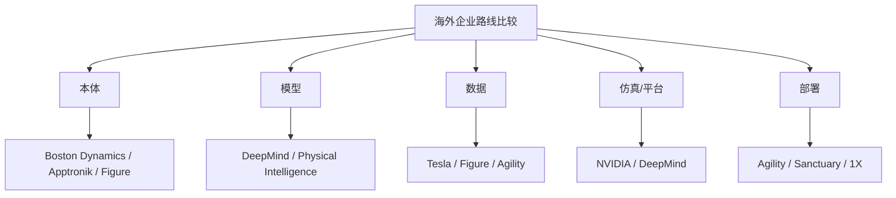

# 第二十一部分 海外重点企业专题

本部分不试图穷尽所有海外公司，而是选择那些最能代表不同路线分化的主体。分析重点不是企业“热度”，而是它们分别站在产业链的哪个位置：是平台型公司、数据与仿真基础设施公司、本体驱动公司，还是通用机器人操作与部署公司。为避免企业章节退化为新闻摘要，这里采用第二十部分给出的统一模板，只保留那些真正影响长期判断的变量：技术路线上究竟押注了什么、本体与模型如何耦合、数据与仿真基础设施是否形成闭环、产品形态是否开始接近真实交付。

海外企业最值得注意的不是“谁最像未来”，而是它们在五条关键链路上的不同取舍：本体、模型、数据、部署、平台。也正因为如此，海外专题与其说是在比较“谁更先进”，不如说是在比较不同押注组合各自如何试图闭环。

## 98. Google DeepMind

Google DeepMind 的核心价值，在于它长期推动了 RT 系列、PaLM-E 和更广义的具身多模态路线，使机器人基础模型获得了最强的学术叙事之一。代表性工作可参见 [RT-1](https://arxiv.org/abs/2212.06817)、[RT-2](https://arxiv.org/abs/2307.15818) 与 [PaLM-E](https://arxiv.org/abs/2303.03378)。

其 2025 年进一步公开 Gemini Robotics，也说明其研究方向正在从“为机器人提供更强通用多模态接口”进一步走向“把机器人直接作为模型能力边界的测试场”。这一变化值得持续跟踪，因为它意味着大模型公司对机器人问题的投入不再只是论文原型级别。[Gemini Robotics](https://deepmind.google/blog/gemini-robotics-brings-ai-into-the-physical-world/)

其优势在于模型、算法和研究深度；局限则在于距离大规模现实机器人交付仍有明显距离。它更像“定义问题与上限”的力量，而不是最先证明产品闭环的力量。若从第二十部分的企业框架看，DeepMind 最强的维度是模型路线定义权与研究影响力，最弱的维度则是本体制造与长期现场交付控制力。

### 98.1 DeepMind 路线的真正价值
DeepMind 路线真正值得高看的地方，不只是它发布了若干有话题性的模型，而是它持续扮演“上游接口定义者”的角色。无论是 RT 系列、PaLM-E，还是后来的 Gemini Robotics，它反复做的事情都是把原本分散在机器人子问题里的感知、语言、规划、动作接口重新组织成统一问题设定。很多后来者即便不直接复现其系统，也仍在沿用它提出的接口语言与研究语法。

若进一步拆解，DeepMind 的价值至少体现在三个层面。第一是问题设定层，它经常率先提出“generalist policy”“跨本体数据组织”“语言到动作统一接口”这类新问法。第二是中间资产层，它推动的不只是单篇论文，还包括评测协议、数据接口、多模态表征和可复用训练框架。第三是行业扩散层，它会把机器人问题重新嵌回更大的多模态基础模型主线，从而改变人才流向、算力投入与资本注意力。对长期跟踪者来说，这种“议程塑形能力”往往比一次 benchmark 领先更重要。

但这并不意味着 DeepMind 天然最接近大规模现实交付。恰恰相反，它更像“上限定义器”和“接口方向指示器”，而不是最先把某类机器人稳定铺进客户现场的公司。更稳妥的跟踪方法，不是看它是否马上拿出完整产品线，而是看它有没有再次把任务接口、动作表示、跨模态推理或训练组织方式向前推一步。只要它持续扮演这一角色，它对行业的实际影响就可能长期大于其直接交付规模本身。

### 98.2 跟踪 DeepMind 最该盯的不是“又发了模型”，而是接口是否继续下探

把 DeepMind 放进海外企业章，最容易犯的错误，就是把它简单理解为“又一家具身论文产出机构”。实际上，它对行业的真正影响，通常并不发生在“多了一篇漂亮论文”这一层，而发生在研究能力何时被重写成了更接近执行层的公共接口。2025 年 3 月发布的 [DeepMind 关于 Gemini Robotics / Gemini Robotics-ER 的官方博客](https://deepmind.google/blog/gemini-robotics-brings-ai-into-the-physical-world/) 已经把问题从一般性的多模态理解推进到“把物理动作作为输出模态”“把具身推理层接到既有低层控制器”这一层；同年 6 月发布的 [DeepMind 关于 Gemini Robotics On-Device 的官方博客](https://deepmind.google/blog/gemini-robotics-on-device-brings-ai-to-local-robotic-devices/) 又把问题进一步推进到“本地运行、低时延适配、跨本体微调、软件开发套件与可信测试者机制”。这两次发布合在一起，恰好给出了跟踪 DeepMind 的正确视角：不是看它又讲了什么大故事，而是看它是否持续把能力往机器人系统真正需要的接口层下压。

如果把这种“接口下探”写成一个更稳定的观察式，可以粗略表示为：

\[
\text{DeepMind Impact} \approx h(d_{\text{interface}}, s_{\text{embodiment}}, r_{\text{recovery}}, e_{\text{evaluation}}, \ell_{\text{local}}),
\]

其中，`d_{\text{interface}}` 表示模型输出是否从语义答案进一步下探到动作接口、控制前中间层或可编程具身推理；`s_{\text{embodiment}}` 表示同一接口能否在不同本体之间迁移；`r_{\text{recovery}}` 表示系统是否显式展示了重规划、失手恢复与环境变化后的继续执行能力；`e_{\text{evaluation}}` 表示是否同时给出可复查的评测协议、软件开发套件、可信测试者计划或 benchmark 入口；`l_{\text{local}}` 则表示部署是否进一步触及低时延、本地执行与脱网鲁棒性。真正值得高权重记录的，是这五个变量有没有同时增强，而不是“模型名是否再次升级”。

从这个框架看，DeepMind 的证据应至少分成五层。第一层是语义能力增强，即模型是否更懂任务、语言和视觉场景；这当然重要，但它对机器人行业的意义仍接近普通多模态模型升级。第二层是接口能力增强，也就是 [DeepMind 对 Gemini Robotics 的官方说明](https://deepmind.google/blog/gemini-robotics-brings-ai-into-the-physical-world/) 是否像官方描述那样，把物理动作作为新输出模态，并让 [DeepMind 对 Gemini Robotics-ER 的官方说明](https://deepmind.google/blog/gemini-robotics-brings-ai-into-the-physical-world/) 这类具身推理组件与既有低层控制器对接。第三层是跨本体证据，即同一套上层能力是否真的跨过了单一演示平台边界。第四层是部署证据，即它是否开始回答端侧、时延、带宽中断、微调样本数和本地运行预算这些真实系统问题。第五层才是生态证据，即软件开发套件、评测、可信测试者计划与合作本体是否开始把这套接口写成更广义的默认工作流。

2025 年的 DeepMind 路线之所以值得高看，恰恰在于它已经不只停在第一层。[DeepMind 对 Gemini Robotics 的官方页面](https://deepmind.google/blog/gemini-robotics-brings-ai-into-the-physical-world/) 明确把“通用性、交互性、灵巧性、多本体适配”作为核心属性，并展示了从桌面双臂平台、工业机械臂到人形本体的迁移线索；[On-Device 官方页面](https://deepmind.google/blog/gemini-robotics-on-device-brings-ai-to-local-robotic-devices/) 则进一步给出“50-100 条示教即可快速适配”“可继续迁移到双臂机械臂与人形本体”“与低层安全关键型控制器对接”的公开表述。这说明 DeepMind 已经开始同时回答“接口怎么定义”“本体如何迁移”“部署如何压到本地”“安全责任如何切层”这几类具身主线问题。

因此，对 DeepMind 的长期跟踪不应只记录“又发了什么模型”，而应固定记录以下字段：它是否继续改写语言到动作的中间接口；是否把具身推理写成可编程层，而不只是演示层；是否同时给出跨本体证据与低时延部署证据；是否开放新的软件开发套件、评测协议或可信测试者机制；以及这些变化是否足以回调后文关于 VLA、端侧部署和安全分层的判断。只有把这些字段长期稳定下来，企业章节才不会被上游大模型新闻节奏牵着走。

这也说明，DeepMind 在本章中的价值并不只是“一个明星案例”。它更像整个海外企业专题里的上游路由器：一旦其接口语言发生实质变化，后续对 NVIDIA、Figure、Physical Intelligence 甚至部分开源 VLA 项目的判断口径都可能需要联动调整。对它的最佳跟踪方式，不是追逐单点热度，而是把它视为“具身系统通用接口是否正在重写”的早期信号源。

## 99. NVIDIA

NVIDIA 在具身智能中的特殊地位，不仅来自 GR00T，也来自 Isaac、仿真、加速计算和整条平台基础设施。[GR00T N1](https://arxiv.org/abs/2503.14734)、[NVIDIA Isaac](https://developer.nvidia.com/isaac)

其最重要的产业角色并不是“做一个机器人公司”，而是试图成为机器人基础模型、仿真与部署生态的底座提供者。与其说 NVIDIA 在争“谁家机器人最强”，不如说它在争“未来多数机器人项目是否都会在它的算力、仿真和模型基础设施上生长”。这是一种平台型护城河逻辑，而不是单体产品逻辑。

### 99.1 为什么平台型公司要单独看
平台型公司之所以必须单独成类，是因为它们创造价值的方式与“卖一个机器人产品”的公司根本不同。它们往往并不直接占有终端场景，却通过仿真平台、训练基础设施、芯片栈、部署工具链、数据协议和生态接口，影响大量下游团队的研发节奏和技术选择。换句话说，平台型公司的真正产品，常常不是一个具体机器人，而是别人构建机器人的默认工作台。

因此，分析平台型公司时最重要的对象不是单一 demo，而是其接口控制力：它掌握了哪些开发者入口，定义了哪些数据/模型/部署标准，绑定了哪些硬件与仿真环境，以及是否把自己的生态优势转化成了事实标准。若仍用“单一场景成功率”或“本体销量”去评价平台公司，就会系统性低估其行业位置。更有信息量的问题是：新的 SDK 是否改变默认工作流，仿真平台是否更深进入企业训练闭环，端侧 runtime 是否降低部署门槛，生态伙伴是否越来越难绕开其基础设施。

平台型公司的胜负标准与本体公司不同。它们不必自己交付最多机器人，只要能成为大多数项目的默认基础设施，就可能建立更强长期护城河。对研究型报告而言，这类公司还具有“议程放大器”属性：一旦某个仿真器、数据接口或部署栈成为事实标准，围绕它开展的任务定义、评测方式和系统结构就更容易变成社区主流。因此，平台公司更适合按“生态渗透率”和“工作流重写能力”来评价，而不是按单机产品能力来评价。

### 99.2 NVIDIA 的真正赌注是把训练、仿真与部署做成同一条价值链
若把 NVIDIA 仅看成“GPU 提供者”，就会低估其在具身智能中的战略位置。它真正尝试争夺的，不只是训练算力，而是把训练、仿真、合成数据、模型发布、端侧推理与开发者生态缝成同一条价值链。只要越来越多团队默认在 Isaac 系列环境中做仿真、在其加速栈上训练或部署、在其定义的数据与 runtime 约束下组织系统，那么 NVIDIA 就不仅在卖芯片，而是在卖整个具身行业的默认工作流。

这种默认工作流一旦成形，其护城河将主要体现为迁移成本而不是单点性能优势。团队在同一生态中完成资产格式、仿真管线、训练脚本、部署 runtime 和性能调优后，后续每增加一个机器人项目，都更可能沿原链路扩展，而不是彻底更换基础设施。对 NVIDIA 而言，这意味着具身智能的价值捕获方式未必只是“单次卖卡”，更可能是通过持续绑定开发范式来提高整个行业的路径依赖。

因此，评价 NVIDIA 在具身智能中的位置，不能只看其是否发布了最惊艳的机器人 demo，而应看它是否成功把更多研究团队、创业公司和工业客户嵌入其统一栈。更适合长期记录的证据至少有五类：

1. `Isaac / Omniverse / Isaac Lab` 是否正在成为更多团队的默认仿真与数据回放入口。
2. `GR00T` 一类模型是否继续把上层策略、合成数据和下游部署写进同一套平台叙事。
3. `Jetson` 与边缘部署工具是否在更多真实项目里承担运行时角色。
4. 生态伙伴是否开始围绕其接口发布兼容资产。
5. 团队是否越来越难在不依赖其栈的情况下保持相同研发效率。

若这五类信号持续增强，NVIDIA 扮演的就更像“底层秩序提供者”；若它们停滞，其影响力就仍主要停留在算力基础设施层。

这条赌注的高明之处在于，它能跨越单个机器人路线的成败。无论未来胜出的更多是人形、移动操作、仓储机器人还是工业具身系统，只要训练与部署基础设施仍建立在相似的开发范式和算力路径上，平台方就能持续收租。对研究型报告而言，这比比较某一代 GR00T 模型本身更重要。

但这条路线也并非无风险。平台一旦过度绑定特定仿真假设、特定数据接口或特定模型分层方式，就可能在行业范式变化时暴露路径依赖；若下游客户最终更偏好轻量、异构或强本地化栈，平台统一性的吸引力也会受到挑战。也因此，跟踪 NVIDIA 的关键不是看它“有没有再发一套 SDK”，而是看这些 SDK 是否真的在重写行业默认流程，以及这种重写是否同时带来了更低的部署摩擦而不是仅仅更强的上游叙事。

## 100. Figure、Physical Intelligence、Tesla、Boston Dynamics

Figure 代表的是“人形 + 基础模型 + 商业叙事”高度耦合的路径；Physical Intelligence 更强调“物理世界智能”作为独立研究和产品对象；Tesla Optimus 的独特性在于其尝试复用自动驾驶、制造和大规模工程体系；Boston Dynamics 则更多代表高动态本体和长期工程系统积累。相关公司资料可参见 [Figure 官网](https://www.figure.ai/)、[Physical Intelligence 官网](https://www.physicalintelligence.company/)、[Boston Dynamics 官网](https://bostondynamics.com/) 与 [Tesla AI 页面](https://www.tesla.com/AI)。

Figure Helix 特别值得单独关注，因为它比多数公司更明确地公开了“高层 VLM + 低层快速控制 + 本体机载推理”的系统结构，这使其不仅是企业新闻，也是一份具身系统分层实现样本。[Figure Helix](https://www.figure.ai/news/helix)

这四类主体最大的区别，并不在“谁更像通用智能”，而在于它们分别优先押注本体、模型、数据、工程还是平台。Figure 更强调把通用叙事尽快压到具体产品化路径上；Physical Intelligence 更像在争夺“通用物理基础层”的定义权；Tesla 的独特性在于它若成功，则可能把制造、供应链和自动驾驶数据工程能力外溢到机器人；Boston Dynamics 则提醒我们，长期稳定的动态本体工程本身就是稀缺壁垒，不应被大模型叙事轻易淹没。

### 100.1 这四类公司最该分别盯什么
这套分类的真正价值，不是为了给企业贴标签，而是为了避免用同一把尺子乱量。研究平台型主体最该盯的是接口定义与公共工具链；模型公司最该盯的是数据闭环、训练范式和高层能力是否真正进入动作接口；本体公司最该盯的是制造、执行器、可靠性与系统协同；场景交付公司最该盯的则是客户复制、运维能力与单位经济性。只要这一前提保持清楚，后续企业更新就更容易保留分析精度，而不是被热度重新拉平。

若进一步细化，这四类主体分别对应四种不同的风险结构。Figure 的关键风险是能否把高叙事强度的人形故事压进稳定交付链路；Physical Intelligence 的关键风险是“通用物理基础层”能否成为真正可复用的系统中间层，而不只是概念上优雅的研究方向；Tesla 的关键风险是既有制造与自动驾驶优势能否迁移到完全不同的接触任务和现场运维结构；Boston Dynamics 的关键风险则是其深厚本体能力能否与新一代基础模型接口深度重构，而不是继续停留在“身体强、语义接口弱”的旧结构。

因此，本节真正想强调的不是“谁更强”，而是看不同公司时必须盯住不同证据。对后续版本更新尤其重要的是，把“最该盯什么”转成稳定字段。比如 Figure 更该看高层模型与真实交付是否持续靠近；Physical Intelligence 更该看其“物理智能层”到底以模型、数据协议、训练框架还是系统接口的形式落地；Tesla 更该看自动驾驶积累究竟迁移了采数组织、端侧推理还是制造节拍；Boston Dynamics 则更该看其强本体是否正在与更强的高层智能接口重新耦合。只有把这组证据拆开，海外企业专题才不会重新滑回叙事比较。

### 100.2 海外明星公司最常见的误判是什么
这一组企业最常见的误判，不是单纯“高估了某家公司”，而是把不同层级的证据混在一起阅读。Figure 官网强调家庭环境中的通用人形与 Helix 系统能力；Tesla 官网则把 Optimus 放进统一 AI、芯片、自动驾驶数据与推理硬件体系；Boston Dynamics 官网更突出长期服务、培训、开发文档与行业解决方案；Physical Intelligence 官网则把自己定位为面向物理世界的模型与接口层组织者。相关资料可参见：[Figure 官网](https://www.figure.ai/)、[Tesla AI 页面](https://www.tesla.com/AI)、[Boston Dynamics 官网](https://bostondynamics.com/)、[Physical Intelligence 官网](https://www.physicalintelligence.company/)。这四类材料描述的根本不是同一个竞争问题，因此不能用同一把尺子直接给出线性排名。

更稳妥的读法，是把误判拆成四类。第一类误判，是把“未来想象力”直接等同于“近期闭环能力”。Figure 和 Tesla 最容易承接这种误读，因为人形本体、通用智能和制造叙事一旦耦合，外界很自然会把长期潜力提前写成短期成熟度。第二类误判，是把“平台潜力”误写为“已经形成平台控制力”。Physical Intelligence 所在的位置很典型: 中间层接口一旦成立，确实可能拥有极高杠杆；但在接口真正稳定之前，它仍然只是一个高度诱人的候选权。第三类误判，是把“公开视频里的高能力密度”误写为“现场连续运行能力密度”。Boston Dynamics 长期提醒行业，真正稀缺的不只是动作难度，还包括维护、培训、开发者接口和客户成功组织。第四类误判，是把“融资与传播热度”误写为“价值链中最难替代的位置”。资本更愿意为远期统一叙事买单，但工程系统通常先奖励那些能把局部能力稳定交付的组织。

因此，对海外明星公司的正确读法不是问“谁最强”，而是问“谁在价值链的哪一段更难被替代”。若公司主要在本体与可靠性层构筑壁垒，就应重点看连续运行、维护与客户复制证据；若主要在模型或中间件层构筑壁垒，就应重点看接口是否被更多本体、更多场景和更多合作方复用；若主要在制造与系统组织层构筑壁垒，就应重点看它是否真的能把采数、训练、部署和售后串成一个闭环。只有把“壁垒位置”与“证据类型”绑定，海外企业章节才不会退化成一张热度榜单。

## 101. Agility、Apptronik、1X、Sanctuary 等

这些公司通常更能体现第二梯队路线分化：

1. Agility 更接近场景落地与物流操作叙事。
2. Apptronik 更强调人形平台工程成熟度。
3. 1X 更强调人机协作与服务场景探索。
4. Sanctuary 更强调通用操作与遥操作/共享自治结合。

它们分别可以对应到不同风险偏好：

1. Agility Robotics 更像“先找现实场景、再逐步扩展能力”的路线。[Agility Robotics](https://agilityrobotics.com/)
2. Apptronik 更强调通用本体平台与工程成熟度之间的平衡。[Apptronik](https://apptronik.com/)
3. 1X 更值得从人机共处、远程接入和家庭/服务路径角度观察。[1X](https://www.1x.tech/)
4. Sanctuary AI 则长期提醒行业：shared autonomy 与 teleoperation 不只是过渡工具，也可能是长期商业组织方式的重要组成部分。[Sanctuary AI](https://www.sanctuary.ai/)

### 101.1 第二梯队公司为什么很重要
第二梯队公司的研究价值，不在于“给头部公司补名单”，而在于它们更像行业广义可行性的测试集。头部公司往往同时拥有额外算力、资本、品牌和工程兜底，很多能力可以被资源暂时覆盖；第二梯队若在较弱资源条件下仍能跑出稳定部署、明确客户路径或可重复的 shared autonomy 组织方式，就说明这条路线开始具备更一般条件下的可持续性。换句话说，头部公司更容易定义愿景上限，第二梯队公司更容易定义现实边界。

如果把这件事写得更形式化一点，可以说第二梯队承担的是“头部叙事的样本外检验”职责。头部公司展示的是这条路线在最优资源条件下能走多远，第二梯队展示的则是同一路线在更普通资源条件下还能保留多少能力。因此，对第二梯队最值得问的问题不是“它有没有复制头部的全部野心”，而是“在更少资源、更少媒体势能和更强交付压力下，它究竟还能保留哪一段有效闭环”。这类证据往往比头部公司多一个概念视频更有信息量。

这也是为什么第二梯队常常比头部样本更能暴露真实摩擦。它们更早显露出本体成本能否压住、客户现场能否接住、维护网络能否建立、遥操作是否真能作为长期业务组织方式存在。很多后来被行业证明可行或不可行的路径，最先并不是在最耀眼的头部叙事中被看清，而是在这些更贴近交付压力的公司身上被慢慢看清。对研究者而言，这一类公司提供的并不是“更完整的愿景”，而是“更真实的约束显影”。

因此，在本报告的长期维护里，第二梯队不应被视为头部公司的低配版，而应被视为“现实信号放大器”。如果某条路线只有在极高算力、极强资本和极大媒体势能下才看起来成立，它未必代表行业普遍可行；而如果第二梯队也开始在类似接口、类似部署模式或类似组织方式上取得进展，就说明这条路线可能正在从明星样本走向可复制样本。这类信号往往比头部公司再多一个概念视频更有判断价值。

更可执行的做法，是把第二梯队公司的观察固定到几类字段上：`task_unit`、`embodiment`、`operator_load`、`deployment_site_count`、`maintenance_interval`、`rollback_rule`。其中 `task_unit` 与 `embodiment` 回答“系统究竟在解决什么任务、以什么本体承载”；`operator_load` 与 `rollback_rule` 回答“系统到底是在自动化，还是把大量不可见人工藏在幕后”；`deployment_site_count` 与 `maintenance_interval` 则回答“它到底是一次性样机，还是已经出现了可复制部署的雏形”。只要后续更新持续回填这些字段，第二梯队章节就会越来越像比较数据库，而不是新闻补录区。

### 101.2 第二梯队最值得提供的是“可复制性证据”
第二梯队最有价值的，不是“也讲了同一个大故事”，而是“是否在更普通的资源条件下证明了某段闭环可以被复现”。若头部公司的成功总伴随着超额算力、超额资本和超额媒体势能，那么它更像“明星样本”；若第二梯队在更有限条件下仍能把稳定部署、共享自治组织方式、低成本本体或特定场景闭环跑出来，这才更像“行业样本”。因此，本节真正要捕捉的是可复制性证据，而不是热度扩散。

对海外公司更现实的理解方式，是把它们看作围绕“本体、接口、数据、仿真、部署”五个支点作出的不同押注，而不是默认存在一条单一主线。为避免比较退化成“故事强弱比较”，更适合先把公司分成四类角色: 问题定义者、平台底座构建者、本体工程推进者、交付组织探索者。不同角色的证据类型根本不同，若用同一把尺子比较，只会把平台渗透率误写成产品能力，或把热视频热度误写成交付成熟度。

因此，本章最关键的阅读纪律并不是“给每家公司一个总分”，而是先问其主要护城河候选究竟是什么。若公司核心价值在于定义接口与基础设施，那么最重要的证据是生态采用、开发者依赖和默认工作流渗透；若核心价值在于本体工程，那么最重要的证据是稳定运行小时数、接触任务边界、维护频率与成本下降速度；若核心价值在于交付，则应重点看客户场景、回退组织方式和复制节奏。对第二梯队而言，最值得高权重记录的也正是这些“在较弱资源条件下仍然成立”的字段，而不是又多了一次高光演示。

可以把这套跟踪口径进一步压缩成一个最小字段表述：

```text
{task_unit, embodiment, interface_owner, data_loop, operator_load,
 deployment_site_count, maintenance_interval, rollback_rule}
```

这组字段之所以重要，是因为它们分别回答了第二梯队最关键的四类问题。`task_unit` 与 `embodiment` 回答“系统究竟在解决什么任务、以什么本体为载体”；`interface_owner` 与 `data_loop` 回答“真正控制系统责任边界的是模型公司、平台公司、集成商还是客户现场”；`operator_load` 与 `rollback_rule` 回答“系统到底是在自动化，还是把大量不可见人工藏在幕后”；`deployment_site_count` 与 `maintenance_interval` 则回答“它到底是一次性样机，还是已经出现了可复制部署的雏形”。凡是缺少其中任何一段，所谓“路线成立”都应暂时降权处理。

对后续季度维护来说，更实用的做法不是继续给第二梯队加主观印象分，而是把每家公司固定写进同一套角色-证据映射里：

1. 问题定义者：重点看接口文档、基准、开发者入口与默认问题设定是否被他人沿用。
2. 平台底座构建者：重点看 SDK、仿真、运行时与数据协议是否成为事实标准。
3. 本体工程推进者：重点看稳定运行时长、接触任务边界、维护节奏和成本下降速度。
4. 交付组织探索者：重点看场景复制、现场回退、人工负担、服务网络和客户复购迹象。

只要后续对海外企业的观察能持续回填这几个字段，并与 [Google DeepMind 长期跟踪卡](D:/Projects/embodied-intelligence-report/research/companies/Google-DeepMind-长期跟踪卡-v0.0.md)、[Figure 长期跟踪卡](D:/Projects/embodied-intelligence-report/research/companies/Figure-长期跟踪卡-v0.0.md)、[Agility 长期跟踪卡](D:/Projects/embodied-intelligence-report/research/companies/Agility-长期跟踪卡-v0.0.md)、[Apptronik 长期跟踪卡](D:/Projects/embodied-intelligence-report/research/companies/Apptronik-长期跟踪卡-v0.0.md) 这类资产联动，本章就不会退化为“明星公司剪报”，而会逐渐沉淀成一套可以跨季度复核的比较数据库。

## 图 21-1 海外企业五支点比较图

源文件：`assets/diagrams/21-海外企业五支点图.mmd`



## 表 21-1 海外重点企业路线对照表

见 [21-海外重点企业路线对照表](tables/21-海外重点企业路线对照表.md)。

## 图表与案例补充
如果把这一章作为后续季度更新的模板来使用，那么最重要的并不是不断增加公司名单，而是保证每次更新都沿着同一组字段记录变化：是否新增了自有本体、是否公开了更清晰的模型接口、是否展示了数据回流机制、是否披露了更接近真实客户现场的部署证据、是否暴露出新的工程短板。只有在这种统一框架下，企业专题才不会退化成新闻流摘要。

海外企业专题中的图表与案例，最重要的作用不是补材料丰富度，而是把平台公司、研究公司、本体公司和交付公司重新放回同一比较坐标中。否则，读者很容易把公司声量、论文影响力或视频热度误读为全链条能力领先。

因此，这里的表格、比较图和案例对照，都应服务于一个目标：让读者看清不同企业究竟在本体、模型、数据、仿真和部署五个支点上各自押注了什么，以及这些押注如何共同决定其中期上限与现实边界。

在当前版本中，`图 21-1 海外企业五支点比较图` 已承担统一比较坐标职责，`表 21-1 海外重点企业路线对照表` 则把 DeepMind、NVIDIA、Figure、Physical Intelligence、Tesla、Boston Dynamics、Agility、Apptronik、1X、Sanctuary 等公司的路线差异落成了可维护的横向对照表。

`Figure Helix` 与 `Agility Digit` 这类案例的价值，在于它们把两条不同企业路线并列摆到了同一坐标里：一条更强调通用人形与通用智能叙事的强耦合，另一条更强调先在清晰场景中建立部署能力，再逐步外扩任务边界。把这类差异直接写入企业长期跟踪卡与专题小节，比保留抽象占位更有价值，因为它能持续暴露路线分歧如何随着产品、客户和部署节奏变化而被重新验证。

为避免这一章未来继续退化成新闻流摘要，后续更新时建议先阅读并维护以下研究卡，再回写正文判断：

1. [Google DeepMind 长期跟踪卡](D:/Projects/embodied-intelligence-report/research/companies/Google-DeepMind-长期跟踪卡-v0.0.md)
2. [NVIDIA 长期跟踪卡](D:/Projects/embodied-intelligence-report/research/companies/NVIDIA-长期跟踪卡-v0.0.md)
3. [Figure 长期跟踪卡](D:/Projects/embodied-intelligence-report/research/companies/Figure-长期跟踪卡-v0.0.md)
4. [Agility 长期跟踪卡](D:/Projects/embodied-intelligence-report/research/companies/Agility-长期跟踪卡-v0.0.md)
5. [Apptronik 长期跟踪卡](D:/Projects/embodied-intelligence-report/research/companies/Apptronik-长期跟踪卡-v0.0.md)
