<!-- Generated by code/export/build_report_bundle.py -->

# 《具身智能行业和技术发展调研报告-v0.0》

## 版本说明

- 当前版本：`v0.0`
- 当前状态：`current/` 完整初稿，可继续迭代精修
- 工作目录：`docs/report/current/`
- 冻结目录：确认后归档到 `docs/report/versions/v0.0/`

## 结构说明

本入口文件只负责维护报告总索引，不承载完整正文。正文严格按《[具身智能报告-V0.0-详细大纲](D:/Projects/embodied-intelligence-report/docs/planning/具身智能报告-V0.0-详细大纲.md)》对应的“部分”拆分维护，即：

- 每个 `XX-*.md` 文件对应详细大纲中的一个“部分”
- 文件内部章节编号沿用大纲中的正式编号
- 后续图表、表格、代码片段与引用也应按这套编号体系挂接

## 章节索引

1. [01-研究目标、证据方法与版本化框架](D:/Projects/embodied-intelligence-report/docs/report/current/01-研究目标、证据方法与版本化框架.md)
2. [02-具身智能的问题定义、系统边界与核心矛盾](D:/Projects/embodied-intelligence-report/docs/report/current/02-具身智能的问题定义、系统边界与核心矛盾.md)
3. [03-从经典机器人学到具身智能的主线重构](D:/Projects/embodied-intelligence-report/docs/report/current/03-从经典机器人学到具身智能的主线重构.md)
4. [04-机器人分类、任务空间与比较坐标系](D:/Projects/embodied-intelligence-report/docs/report/current/04-机器人分类、任务空间与比较坐标系.md)
5. [05-机器人学的物理、控制与状态估计基础](D:/Projects/embodied-intelligence-report/docs/report/current/05-机器人学的物理、控制与状态估计基础.md)
6. [06-学习型机器人与训练闭环基础](D:/Projects/embodied-intelligence-report/docs/report/current/06-学习型机器人与训练闭环基础.md)
7. [07-对具身系统真正有用的大模型基础](D:/Projects/embodied-intelligence-report/docs/report/current/07-对具身系统真正有用的大模型基础.md)
8. [08-具身智能系统架构与分层接口](D:/Projects/embodied-intelligence-report/docs/report/current/08-具身智能系统架构与分层接口.md)
9. [09-感知与表示学习](D:/Projects/embodied-intelligence-report/docs/report/current/09-感知与表示学习.md)
10. [10-世界模型、环境建模与可预测表征](D:/Projects/embodied-intelligence-report/docs/report/current/10-世界模型、环境建模与可预测表征.md)
11. [11-VLA 与机器人基础模型](D:/Projects/embodied-intelligence-report/docs/report/current/11-VLA 与机器人基础模型.md)
12. [12-规划、推理与决策的新路线](D:/Projects/embodied-intelligence-report/docs/report/current/12-规划、推理与决策的新路线.md)
13. [13-数据工程与训练闭环](D:/Projects/embodied-intelligence-report/docs/report/current/13-数据工程与训练闭环.md)
14. [14-仿真、数字孪生与评测基础设施](D:/Projects/embodied-intelligence-report/docs/report/current/14-仿真、数字孪生与评测基础设施.md)
15. [15-机器人硬件、系统集成与部署约束](D:/Projects/embodied-intelligence-report/docs/report/current/15-机器人硬件、系统集成与部署约束.md)
16. [16-安全、对齐、验证与治理](D:/Projects/embodied-intelligence-report/docs/report/current/16-安全、对齐、验证与治理.md)
17. [17-学术前沿技术专题](D:/Projects/embodied-intelligence-report/docs/report/current/17-学术前沿技术专题.md)
18. [18-代表性论文与模型谱系梳理](D:/Projects/embodied-intelligence-report/docs/report/current/18-代表性论文与模型谱系梳理.md)
19. [19-开源生态、代码库与工具链](D:/Projects/embodied-intelligence-report/docs/report/current/19-开源生态、代码库与工具链.md)
20. [20-企业分析框架](D:/Projects/embodied-intelligence-report/docs/report/current/20-企业分析框架.md)
21. [21-海外重点企业专题](D:/Projects/embodied-intelligence-report/docs/report/current/21-海外重点企业专题.md)
22. [22-国内重点企业专题](D:/Projects/embodied-intelligence-report/docs/report/current/22-国内重点企业专题.md)
23. [23-应用落地与商业化](D:/Projects/embodied-intelligence-report/docs/report/current/23-应用落地与商业化.md)
24. [24-产业格局、资本与政策](D:/Projects/embodied-intelligence-report/docs/report/current/24-产业格局、资本与政策.md)
25. [25-关键争议与作者判断框架](D:/Projects/embodied-intelligence-report/docs/report/current/25-关键争议与作者判断框架.md)
26. [26-结论与后续跟踪清单](D:/Projects/embodied-intelligence-report/docs/report/current/26-结论与后续跟踪清单.md)

## 配套文件

- [当前工作版本说明](D:/Projects/embodied-intelligence-report/docs/report/current/README.md)
- [项目工作规范](D:/Projects/embodied-intelligence-report/docs/planning/项目工作规范.md)
- [详细大纲](D:/Projects/embodied-intelligence-report/docs/planning/具身智能报告-V0.0-详细大纲.md)
- [更新日志](D:/Projects/embodied-intelligence-report/CHANGELOG.md)

## 入口文件职责补充说明

这份入口文件虽然不直接承载完整正文，但它不只是导航页，而是整本报告的“装配界面”。它的作用是把大纲、正文、版本目录、工作规范和后续导出产物组织成一套可长期维护的研究工程结构。对一份目标页数在百页以上、并且要随着行业继续更新的报告来说，入口文件的价值不在于提供内容密度，而在于确保读者和后续写作者总能明确：当前工作版在哪里，正式冻结版将放在哪里，正文是按什么章节职责拆分的，以及图表、代码、研究卡片和后续版本如何回写到主报告。

因此，`00` 章不应被理解为普通导言，而应被理解为“整书使用说明 + 结构约束说明”。在后续版本中，如果大纲发生研究驱动的局部重构、章节文件重命名、图表路径调整或版本目录冻结，这里都应同步更新，以避免入口结构与正文结构再次脱节。也就是说，它承担的是全书级的一致性维护职责。

---

# 第一部分 研究目标、证据方法与版本化框架

## 1. 报告目标、读者背景与使用方式

这份报告的目标，不是输出一份面向大众传播的“具身智能科普”，也不是简单罗列近期最热的机器人公司、模型和融资新闻，而是建立一套适合长期迭代的个人研究框架。更准确地说，本部分并不只是整份报告的“导读”，而是全书的方法论入口：它负责说明这份报告试图回答什么问题、如何处理证据、如何组织后续内容，以及为什么这份报告必须被当作一个长期版本化维护的研究项目来书写。报告默认读者已经具备控制、自动化、机器人学、深度学习和计算机视觉方面的基础，因此本报告不会把篇幅过多消耗在最初级的概念扫盲上，而会把重点放在两个层面：第一，重新梳理机器人学从经典控制、感知与规划，到学习型机器人，再到大模型驱动具身智能的技术主线；第二，在这一主线之上，系统理解当前行业中最值得长期跟踪的模型路线、工程路径、企业格局和关键争议。

更具体地说，本报告试图解决的不是“我知不知道某个热门模型的名字”，而是“我是否重新建立了一个足够稳定的认知坐标系”。如果缺少这个坐标系，那么行业中的每一次新发布都容易被误读：新论文看起来像革命性突破，但可能只是特定数据设定下的局部改进；企业演示视频看起来像通用智能，但可能建立在严格脚本化场景和大量人工准备之上；某种新术语看起来像范式变更，但本质上可能只是对旧问题的重新命名。因此，本报告要优先建设的是判断框架，而不是热点清单。

从使用方式上看，本报告更接近一份“长期研究底稿”而不是一次性交付物。它既用于快速恢复对机器人学全局结构的把握，也用于持续跟踪具身智能与机器人产业中的新论文、新产品、新企业与新判断。因此，报告的价值不仅在于当前这一版写了多少内容，更在于是否建立起一套可持续更新的目录结构、证据组织方法与判断框架。对于一个中长期学习项目而言，真正重要的并不是“首版写得有多满”，而是“后续能否低摩擦地继续增量维护”。

如果换一个更严格的说法，本报告的目标是建立一个“研究型认知操作系统”。它至少要支持四类活动：其一，快速回忆某一方向的基本概念、代表路线和历史主线；其二，在看到新论文、新模型、新公司或新政策时，能够迅速定位其属于哪一层问题、补充了哪类证据、修正了哪类旧判断；其三，在不同技术路线之间做横向比较，而不是只跟着单一叙事摆动；其四，把“我当前的判断”与“支撑这一判断的证据”明确绑定起来，便于后续版本更新时进行修订。

从阅读策略上看，本报告并不假定读者必须顺序阅读所有章节。对于希望先建立全局框架的读者，建议先读第一部分、第二部分和第三部分；对于希望直接进入技术主干的读者，可以在读完第二部分后跳转到第八部分到第十五部分；对于更关注产业趋势和公司路线的读者，则可以在掌握第二部分的定义和分析框架后，转向第二十部分之后的企业与商业化章节。也就是说，这份报告既是一条主线叙事，也应当是一套可按问题检索的参考文档。

这一定位也意味着，本报告并不打算回避“解释框架”的主观性，而是要显式管理这种主观性。报告中的判断可以带有作者视角，但必须尽量让读者看清楚：哪些是公开事实，哪些是从事实出发的推断，哪些是带有取舍标准的评价。只有这样，这份报告才适合被长期更新，而不会在版本迭代中逐渐演化成一份难以校准的印象笔记。

## 2. 研究范围与边界

从工作方法上看，范围界定还承担另一个功能：它决定研究卡片、图表和版本更新的“纳入门槛”。例如，一篇关于通用多模态模型的新论文，只有当它能够清晰映射到机器人任务理解、动作生成、系统接口、数据闭环或部署约束时，才应被吸纳进主报告；否则更适合作为旁证材料留在 `research/` 中。对一个长期维护的报告项目来说，边界并不是为了排除有趣内容，而是为了避免注意力被高噪声的新概念不断牵引。

本报告的主轴是“机器人学在大模型时代如何被重新组织”。因此，报告覆盖范围明显广于单篇技术综述，但又不会无限扩张到“所有与智能有关的话题”。在技术层面，重点覆盖机器人学基础中的运动学、动力学、规划、控制、定位与建图，学习型机器人中的模仿学习、强化学习、表示学习与 sim2real，以及大模型与具身系统交叉区域中的 VLA、世界模型、任务规划、分层架构、端侧部署、数据工程与安全验证。

在对象层面，报告既关注固定机械臂、移动平台，也关注人形、四足、无人机、服务机器人和部分可穿戴/软体系统，但重点仍会放在最能体现“感知-决策-控制-环境耦合”完整链条的系统上。纯软件智能体、与实体机器人弱耦合的通用多模态应用、或过于局部且难以代表主线的算法增量，不会作为报告主轴展开。这样做不是因为这些方向不重要，而是因为本报告的核心问题始终是“物理世界中的智能系统如何被构建、训练、部署和评估”。

本报告对“机器人”“具身智能”“智能体”“自动驾驶”等概念也会主动划定边界。机器人是一个更宽泛的上位概念，其中既包括传统工业自动化设备，也包括移动机器人、服务机器人、人形机器人和各类智能执行系统。具身智能则不是所有机器人系统的同义词，它更强调系统在开放或半开放环境中，通过感知、表示、规划、控制与环境交互形成持续闭环行为的能力。自动驾驶可视为具身系统的重要子类，但由于其任务边界、规则体系和安全约束具有显著特化，不宜直接把自动驾驶中的结论原封不动迁移到通用机器人上。纯软件智能体则可视为“高层推理和任务编排能力的参考对象”，但其不直接承担物理执行约束。

从时间范围上看，本报告既不是纯历史回顾，也不是只覆盖最近两年的“短新闻纪要”。它的结构必须同时容纳三种时间尺度：一是机器人学过去数十年的基础理论与经典工程范式；二是深度学习、强化学习和大模型对机器人路线的重组过程；三是当前持续快速变化的企业、产品与政策动态。也正因为此，报告在写法上需要同时具有教材式主线、综述式对比和行业研究式更新接口。

本节最关键的作用，是把后文所有可能发生的概念漂移提前压住。若不在一开始就明确“本报告到底研究什么、不研究什么”，那么后续章节很容易在叙事上不断滑动：一会儿把具身智能写成机器人学的新名称，一会儿把它写成大模型智能体的物理延伸，一会儿又把自动驾驶、工业自动化、家庭机器人、通用多模态交互全部揉成同一个对象。边界不清，后续章节再详尽，也会在比较和判断时不断失真。

## 3. 资料来源与证据等级

如果借用 Toulmin 论证结构来理解本报告的写法，那么每个较强判断都应尽量隐含或显式包含五个部分：`claim`、`data`、`warrant`、`qualifier` 与 `rebuttal`。例如，“制造业将长期先于家庭场景成为具身智能主战场”不是一句孤立立场，而应由工业机器人存量基础、任务可结构化程度、ROI 可度量性、运维链条成熟度等 `data` 支撑；其 `warrant` 则是“在高价值、高频、可局部结构化场景中，系统部署门槛更容易被工程化消化”；同时还应加上 `qualifier`，承认这主要针对未来若干年而非永恒规律；再加入 `rebuttal`，说明一旦家用平台、端侧算力和安全验证路径出现明显突破，这一判断可能需要回调。这样写的好处是，版本更新时我们可以明确知道应该修哪一层，而不是只能整体改口径。

从实际执行角度看，证据等级还应反映到引用密度与语言强度上。对于主要建立在官方论文、项目主页与公开代码仓上的段落，可以使用更明确的判断句；对于主要来自行业访谈、媒体综述或投资观察的段落，则应更多采用“表明”“暗示”“值得跟踪”“尚待更多证据验证”等限制性表达。写作风格上的克制，不是为了保守，而是为了让后续修订成本更低。

本报告默认采取“论文与官方材料优先”的证据策略。对技术判断，优先使用论文、技术报告、项目主页、GitHub 仓库、数据集主页与 benchmark 页面；对产品与企业信息，优先使用公司官网、官方博客、开发者文档、技术发布与演示材料；对行业趋势、融资与市场判断，则将研究机构、咨询公司、券商或媒体材料视为次级证据，并明确其属性，避免与技术事实混同。

这样处理的原因在于，具身智能领域高度容易受到“演示偏差”和“叙事偏差”的影响。许多系统在演示视频中呈现出的能力，并不能直接推断为稳定、可重复、可扩展的系统能力；许多企业的公开叙事强调愿景与方向，而未必完整披露系统失效率、部署代价、数据规模、人工参与比例和任务边界。因此，在写作时必须默认对公开视频、宣传话术和二手媒体报道保持谨慎，把它们更多当作“线索”而非“结论”。

本报告将尽量区分三层内容。第一层是事实，例如某模型的输入输出形式、训练目标、实验设置、数据来源与公开结果。第二层是推断，即从多项事实出发，对技术方向、工程含义或能力边界做出的解释。第三层是评价，即在给定目标下对某条路线、某家企业或某种系统组织方式的优缺点判断。只有把这三层分开，后续版本修订时才容易知道应该更新哪些事实、哪些推断以及哪些评价。

在证据治理的思路上，本报告会借用系统综述与证据评估领域的若干基本原则，而不是把自己写成完全随意的长文。Cochrane Handbook 当前版本的目录明确把“界定研究问题与范围”“制定纳入标准”“检索与筛选研究”“考虑偏差与利益冲突”“综合证据并解释结果”等步骤组织为研究工作流的一部分，这说明严肃的研究写作并不是从“先写结论”开始，而是从“先定义问题、再处理证据”开始。[Cochrane Handbook current version, Version 6.5, 2024](https://www.cochrane.org/authors/handbooks-and-manuals/handbook/current)

同样，Oxford CEBM 的 evidence levels 体系虽然来自医学证据评价，但其最有启发性的部分并不是具体分级表本身，而是一个更普遍的原则：不同来源的证据强弱不同，系统综述、较高质量研究、单项研究、案例与专家意见不应被同权对待。[Oxford CEBM Levels of Evidence](https://www.cebm.ox.ac.uk/resources/levels-of-evidence/oxford-centre-for-evidence-based-medicine-levels-of-evidence-march-2009) 这一原则迁移到本报告时，意味着论文、官方技术文档、代码仓库、数据集主页、企业官网、演示视频和媒体报道必须被放在不同层级上使用，而不是统一写成“有来源所以都一样可信”。

在技术来源的优先级上，大致可以采用如下顺序：同行评审论文与权威技术报告优先于一般博客；项目主页、开源代码库与官方文档优先于二手摘要；真实实验设定、数据和 ablation 结果优先于口号化结论；跨来源一致的观察优先于单一来源的孤证。换言之，本报告不追求“每个判断都像定理一样被严格证明”，但会尽量避免把单点演示、孤立结果或未经核实的行业流言写成稳定结论。

此外，本报告虽不是 PRISMA 意义上的正式医学系统综述，但会尽量吸收其“透明报告检索、筛选与纳入逻辑”的精神。也就是说，本报告不一定为每一章都做严格的 PRISMA 流程图，但会尽量让读者看清：这一章主要基于哪类资料、哪些结论来自高强度一手材料、哪些部分仍然只是阶段性判断、哪些空白还需要后续版本补充。这种透明性对于快速变化的具身智能领域尤为重要。

## 4. 本报告的组织结构

进一步说，这一结构还刻意把“方法论”“技术主干”“产业映射”和“作者判断”分离开来。很多行业报告把结论直接埋在技术叙述里，结果读者很难判断哪些是作者价值取向，哪些是论文本身结论。这里的分层设计试图避免这种混淆：前部章节负责给出后文判断所依赖的比较坐标，中段章节负责尽可能完整地呈现技术路线与工程约束，后段章节才系统展开企业、商业化和争议分析。这样的安排会牺牲一些“从头到尾都很顺”的流畅感，却更利于长期复核和版本维护。

从整体结构上看，本报告分为四个递进层次。第一层是导读与问题框架，用于说明报告试图回答什么问题、采用什么证据标准以及如何组织后续内容。第二层是基础层，对应第二部分到第七部分，目标是把机器人学、大模型、多模态学习与学习型机器人之间的交叉基础重新搭起来。第三层是技术层，对应第八部分到第十九部分，围绕系统分层、感知、世界模型、VLA、规划、数据、仿真、硬件、安全与开源生态展开。第四层是产业与判断层，对应第二十部分以后，转向企业分析、应用落地、资本与政策、关键争议以及长期跟踪框架。

这种结构并不是为了追求形式整齐，而是为了降低后续维护成本。对一个长期更新的研究项目而言，最重要的不是第一次把所有内容写满，而是把问题结构稳定下来，使得后续新论文、新产品、新企业与新判断都能够自然挂接到既有骨架中。只有当结构是稳定的，版本之间的增量变化才具有可比性，读者也才容易判断“哪些地方是新增事实，哪些地方是修正旧判断，哪些地方是新增的解释框架”。

基础层之所以放在前面，是因为当前具身智能的许多讨论天然带有跨学科张力。仅从大模型视角出发，容易低估实时控制、接触动力学和硬件部署的困难；仅从传统机器人学视角出发，又容易低估语言接口、多模态预训练和统一表征所带来的新变化。因此，本报告必须先把这两条历史线索重新接上，再进入技术层和产业层，否则后面的很多评价都会缺少统一坐标。

技术层是整份报告的主干。这里的重点不是机械罗列术语，而是解释各个技术模块在整套系统中的位置与分工：感知层解决什么问题，表征和世界模型层解决什么问题，VLA 路线相比经典策略学习到底新增了什么，数据工程为什么常常比模型架构更决定系统上限，仿真与评测为何既必要又常被高估，安全和治理为何不是“最后补一章”而应贯穿全链路。

产业层与判断层的作用，则是把技术主干重新映射回真实世界。许多技术路线看起来都“有道理”，但在不同本体、不同场景、不同商业模式和不同供应链条件下，实际可行性差异极大。因此，企业分析、应用落地、资本与政策，并不是技术章节的附属材料，而是验证技术判断是否具有现实约束感的重要部分。

换句话说，整份报告的结构并不是“先讲基础，再随便展开”，而是一种有意设计的认知压缩方式。基础层负责建立共同坐标，技术层负责展开真正的复杂性，产业层负责把复杂性拉回现实约束，判断层则负责把这些内容重新压缩成可长期跟踪的观察框架。若缺少这一结构，长篇报告很容易变成信息堆叠；而一旦结构稳定，后续版本更新就可以明确知道某一条新信息究竟应该进入哪一层、修订哪一类判断。

## 5. 版本维护机制

与其说版本号是在管理文档，不如说是在管理判断的可追溯性。一个真正有用的 `v0.0` 不是“第一版终于写完”，而是“第一版终于建立了稳定的研究接口”。只要这一接口稳定，未来的 `v0.1`、`v0.2` 或更高版本就不必每次都从头重写，只需要沿着既有章节职责补充新证据、修正旧结论、替换图表与更新研究卡片。也正因如此，本报告后续若出现章节级重构，也应被看作研究推进中的正常现象，而不是结构失控；关键不是永远不改结构，而是每次改结构都要留下清晰的研究理由和回写路径。

`v0.0` 的目标并不是在首轮写作中穷尽所有论文、公司与技术细节，而是先建立一套长期稳定可扩展的写作骨架、章节接口、资料组织规范与判断框架。也就是说，`v0.0` 首先要解决的是“以后怎样持续更新”，其次才是“当前一次性写到多全”。这也是为什么本项目一开始就把大纲、正文、资产、研究笔记和版本目录分开组织，而不是先写出一份单体长文再回头整理。

后续版本原则上沿用同一主目录结构，在旧版本基础上增量修订。新增内容优先表现为四类：其一，补入新论文、新模型、新基准与新企业；其二，修正已经被后续证据推翻或削弱的旧判断；其三，补齐图表、代码片段、对比表和研究笔记之间的交叉引用；其四，把原本处于“暂定判断”的部分更新为更稳定的阶段性结论。版本更新不以“改得越多越好”为目标，而以“让判断框架更稳、证据链更扎实、后续维护成本更低”为目标。

这意味着版本迭代不应被理解为“不断堆新内容”。很多时候，更有价值的更新恰恰是缩窄判断边界、明确失效条件、承认某条路线并没有按照原先预期推进，或者把过去模糊的技术概念拆得更清楚。对于研究型报告而言，版本升级不仅是信息刷新，更是认知框架的持续校准。

在工程组织上，当前工作版本维护于 `docs/report/current/`，冻结版本归档到 `docs/report/versions/<version>/`。章节按《详细大纲》的“部分”逐文件拆分，每个文件内部继续沿用大纲中的正式章节编号，以确保大纲、正文、图表与后续版本可以持续一一对应。因此，`v0.0` 更准确的定位是：一份用于长期跟踪具身智能技术与产业演进的、可版本化维护的研究型总报告的首个正式工作版。

这也意味着，版本维护本身就是研究方法的一部分，而不是写作完成后的文档管理动作。采用 `current/` 与 `versions/` 的分离，不只是为了避免文件覆盖，更是为了在研究层面区分“当前工作性判断”和“某一时点冻结下来的阶段性认知”。前者允许不断修订、补证据、改表述；后者则作为时间切片，保留当时的证据状态与判断框架，供后续版本回溯与比较。对于一个需要持续跟踪快速演化行业的报告项目，这种结构比单一长文或单一版本覆盖式更新更适合长期维护。

---

# 第二部分 具身智能的问题定义、系统边界与核心矛盾

## 6. 什么是具身智能

为了让这一定义在工程上真正可用，还需要加上一条常被忽略的条件：具身智能讨论的不是“是否具有身体”这一静态事实，而是“身体是否构成问题结构的一部分”。一个相机支架也有物理形体，但如果它不承担自主感知、任务选择和动作后果，那么它并不进入本报告意义上的具身系统。相反，一个强依赖远程操作者、但仍须在局部时间尺度上独立完成接触控制和状态维持的遥操作平台，则已经部分落入具身系统的讨论范围。也就是说，“具身”不是二元标签，而更像一个系统责任划分问题。

“具身智能”最直观的含义，是智能不再仅仅表现为符号处理、文本生成或抽象决策，而是必须通过一个具有物理身体、传感通道和执行能力的系统，在真实或近真实环境中完成感知、判断、行动和反馈闭环。本部分的职责，不只是给出一个定义，而是把“具身智能”重新压回一个可操作的问题定义之中：哪些系统应被纳入讨论，哪些相关概念必须区分，后文将用什么分层框架分析系统，以及为什么当前这个领域会被几组核心矛盾持续牵引。换句话说，只有当一个系统在与环境持续耦合的过程中展现出稳定、可迁移、可纠偏的行为能力时，我们才有充分理由把它视为具身的智能系统，而不只是一个外挂到机器人上的计算模块。

这一概念之所以重要，是因为它把“智能”的评价标准从离线任务成绩，转向了动态环境中的行为表现。在文本任务里，一个模型回答错误，通常只是输出一段不准确的文字；在具身系统里，一个错误的感知、规划或动作，可能导致抓取失败、跌倒、碰撞、误伤、任务中断，甚至造成设备损坏。因此，具身智能不是简单把语言模型装进机器人，而是要求整个系统在物理世界约束下建立持续有效的闭环能力。

如果进一步拆解，“具身”至少包含三层含义。第一，系统具有载体，不论该载体是固定机械臂、移动平台、四足、人形还是无人机，它都必须承担真实物理执行。第二，系统与环境之间存在持续的信息流和作用流，也就是传感与控制的双向闭环。第三，系统行为必须受到时间、空间、接触、能耗、安全和任务目标等约束。这三层含义共同决定，具身智能讨论的并不是纯认知问题，而是“认知如何嵌入物理行动”这一系统问题。

因此，本报告中的“具身智能”不是一个营销口号，而是一种对问题结构的界定：一个系统是否具身，不取决于它是否使用了大模型，也不取决于它是否长得像人，而取决于它是否必须在物理世界中以闭环方式完成任务，并为自己的行动后果承担实时约束。

如果用论证结构来表达，本章在这里提出的核心 claim 是：具身智能首先是一个“系统问题定义”，而不是“模型类别名称”。支持这一 claim 的 data 来自三个方面。其一，物理载体与环境耦合决定了系统必须面对接触、延迟、噪声、失稳、失效恢复和安全等问题，这些问题在纯软件系统中要么不存在，要么代价完全不同。其二，真实任务的完成依赖感知、表征、规划、控制与执行之间的闭环协同，而不是单点推理能力。其三，当前行业中真正困难和昂贵的部分，往往并不出现在“理解一句指令”上，而出现在“把理解稳定转成可持续物理行为”上。

这一工作定义还有一个重要作用，是压低概念膨胀的风险。因为“具身智能”在公共叙事中很容易被同时拿来指代机器人学的新名字、类人机器人的愿景、大模型的物理延伸，甚至更宏大的通用智能未来。如果报告不先把这个概念重新压回“物理世界中的闭环行为系统”这一最小可操作定义，那么后文的比较对象就会不断变化，最后难以形成稳定判断。

## 7. 具身智能与相关概念的关系

这里还应补充一个阅读上的提醒：这些概念之间不是互斥集合，而更像若干相互穿插的投影面。自动驾驶、移动操作、家庭机器人、工业协作臂、人机协作系统都可能同时共享部分具身能力结构；区别不在于是否“属于具身智能阵营”，而在于它们分别把难度压在哪些层上。把这些对象强行放进单一概念桶里，往往会遮蔽真正重要的比较维度。

具身智能并不是凭空出现的新学科，而是建立在机器人学长期积累之上的一次重新组织。传统机器人学关心的运动学、动力学、规划、控制、定位、建图、抓取与系统集成，本质上都在回答“如何让机器在物理世界中行动”这一问题。具身智能之所以看起来像一个新范式，不是因为这些旧问题失效了，而是因为大模型、多模态学习和大规模数据驱动方法，把原本相对分散的能力模块重新拉回到了一个更统一的表征与决策框架之下。

它与传统自动化/控制之间既连续又不同。连续性在于，两者都处理真实物理系统，都要面对动态约束、误差累积与安全问题；差异在于，传统自动化通常工作在更强结构化、更弱语义需求的环境中，而具身智能更关心开放场景中的任务理解、环境泛化和多模态决策。换言之，具身智能不是“不要控制了”，而是在控制之上叠加了更复杂的感知与认知要求。

它与移动机器人、自动驾驶也存在重叠。移动机器人和自动驾驶本来就是具身系统的重要组成部分，因为它们同样具有身体、感知、规划和执行闭环。但自动驾驶的任务边界、监管约束、地图依赖和安全要求具有显著特化，因而不能简单代表“通用具身智能”的全部问题。自动驾驶更像是一个规则密集、场景复杂但任务定义相对集中化的具身子领域，而通用机器人则常常面临更加多样化的对象、任务和交互形式。

它与大模型智能体的关系同样需要厘清。纯软件智能体可以具备任务分解、工具调用、外部记忆和多步推理能力，但如果它不直接承担物理执行约束，那么它更适合作为具身系统的高层参考模块，而不能直接等同于具身系统本身。具身智能可以借用大模型智能体的高层能力，但必须把这些能力重新映射到实时控制、接触行为和环境风险可控的执行链路中。

最后，它与 AGI 叙事也有交集但不应混同。具身智能经常被纳入“通用智能走向真实世界”的宏大叙事中，但本报告会尽量避免把“具身智能”直接写成 AGI 的线性前置阶段。原因在于，具身智能首先是一个工程与系统问题，它的难点很大程度上来自物理约束、数据稀缺、部署复杂性和安全问题，而不是抽象推理能力本身。

本节最重要的意义，不是给出一张看似全面的概念关系图，而是建立一套足以支持后续比较的边界纪律。若不先厘清具身智能与传统自动化、移动机器人、自动驾驶、软件智能体和 AGI 叙事之间的关系，后文所有关于“哪些路线更重要”“哪些企业更值得跟踪”“哪些论文在解决核心问题”的判断都会失去统一标准。边界工作看似是导论工作，实则决定了后文比较能否成立。

## 8. 具身智能系统的分析框架

这套分层还隐含着一个很重要的写作原则：后文讨论任何“突破”时，都应尽量回答它究竟改善了哪一层、通过什么接口影响相邻层、又在哪些层面仍保留旧瓶颈。只有这样，报告才不会把局部提升误写成全栈突破。例如，一个新 VLA 可能显著提升任务描述理解与动作先验，却未必改写接触建模和低层稳定控制；一个强世界模型可能改善表征与预期评估，却未必直接解决真实部署中的计算预算和安全验证问题。

为了避免把具身智能误解为某个单点模型，本报告采用一个分层分析框架来组织后续内容。第一层是本体层，关心机器人的机械结构、自由度、执行器、末端执行器、传感器布局、算力和供能约束。第二层是感知层，关心系统如何从视觉、触觉、力觉、本体感觉与状态信号中构造对环境和自身状态的估计。第三层是表征与世界建模层，关心如何把离散观测组织成可用于预测、推理和规划的内部表示。第四层是决策与规划层，关心如何把任务目标转化为子任务、策略和行动计划。第五层是控制与执行层，关心动作如何在实时性、稳定性和安全约束下被真正落实到物理系统上。

这一框架的作用不只是“把问题列成五层”，更重要的是帮助区分不同论文、系统或企业究竟在解决哪一层的问题。许多讨论之所以混乱，原因之一就是不同人谈论的其实不是同一个层级：有人说的是高层语义任务理解，有人说的是动作表征和策略学习，有人说的是低层控制和硬件可靠性，却都使用“具身智能能力强弱”这一单一表述。采用分层框架，可以减少这种概念混淆。

本体层决定了系统的先天能力边界。不同形态、自由度、执行器路线和末端执行器设计，决定了系统能够接触什么对象、进入什么环境、承受多大载荷、实现多高速度以及以何种成本运行。感知层则负责把原始观测转化为对环境和自身状态的稳定估计，这一层直接受传感器类型、布置方式、时间同步和噪声水平影响。表征与世界建模层关心的是“系统在内部如何理解环境”，它决定了系统是否能够从表面观测中形成更稳健、更可迁移的任务相关状态表示。决策与规划层则决定系统如何把任务目标转化为行动结构。控制与执行层最终把这些上层意图落实为安全、稳定、实时的行为。

在这五层之外，还必须有一条横贯所有层级的安全与治理主线。因为具身系统的任何单层失效，都可能累积成真实物理风险。感知错判可能引发错误抓取，世界模型偏差可能导致不合理预期，规划错误可能让系统进入危险状态，控制失稳则可能直接造成物理损伤。因此，本报告后续关于 VLA、世界模型、大小脑分层和端到端路线的讨论，都会建立在这套分层框架上。

采用分层框架还有一个更现实的好处：它能帮助识别许多所谓“技术路线之争”其实是层级错位造成的伪争论。例如，当一条路线声称自己在做“具身基础模型”时，需要进一步追问：它究竟统一的是感知表示、任务理解，还是直接统一到动作生成？当另一条路线强调“大小脑解耦”时，也需要追问：它解决的是高层语义决策与低层实时控制的接口问题，还是仅仅出于工程调度便利？如果没有分层框架，这些路线很容易被放在同一个平面上争论，实际却并不在解决同一层问题。

从系统工程角度看，本章的五层划分并不是唯一正确的理论分法，但它有一个关键优点：它既足够贴近真实机器人系统的工程组织方式，又能容纳大模型时代新增的表征与高层推理能力。因此，这一框架不仅用于解释当前已有系统，也用于作为后文整理新模型、新企业和新架构时的公共挂载点。

## 9. 具身智能的核心难题

若把这五组矛盾视作一种“章节间公共问题清单”，那么它们的价值不在于一句话概括难点，而在于为后文提供复审标准。也就是说，无论后面讨论的是世界模型、扩散策略、OpenVLA、GR00T、灵巧手还是具身公司路线，最终都应能回到这些矛盾上回答：它主要缓解了什么，又把什么问题保留下来甚至放大了。这样全书才不至于在后半段变成平铺直叙的路线罗列。

当前具身智能之所以既令人兴奋，又明显处在早期阶段，是因为它同时受制于几组难以回避的矛盾。第一组矛盾，是高维感知与低时延控制之间的冲突。大模型、多模态模型擅长处理长上下文和复杂语义，但机器人的许多底层控制必须在严格时间预算下运行，这使得统一大模型很难无缝覆盖所有时间尺度。现实系统因此常常不可避免地采用分层设计：高层负责慢速语义决策，低层负责快速稳定控制。

第二组矛盾，是开放世界泛化与安全约束之间的冲突。系统越希望在陌生物体、陌生指令和陌生环境中保持有效行为，就越容易引入不可控失效模式。纯软件系统中的幻觉和误判已经是问题，但在具身系统中，这类错误会被放大为真实物理后果。因此，一个系统是否“更通用”，必须和它是否仍然“可约束、可恢复、可验证”一起被讨论。

第三组矛盾，是数据驱动需求与真实世界数据稀缺之间的冲突。[End-to-End Training of Deep Visuomotor Policies](https://arxiv.org/abs/1504.00702) 展示了从视觉直接学习控制策略的可能性，而 [QT-Opt](https://arxiv.org/abs/1806.10293) 进一步说明，大规模真实机器人交互数据能够显著提升闭环抓取能力；但这类数据的采集成本、设备成本和失败代价都远高于互联网文本或图像数据。具身系统不像语言模型那样能直接从海量廉价公开语料中获益，它必须面对“数据小、场景碎、标注难、失败贵”的现实。

第四组矛盾，是统一端到端与可解释模块化之间的权衡。端到端方法在统一表征和任务泛化上很有吸引力，但调试、验证和安全控制往往更难；模块化系统更可控，但容易牺牲部分通用性与表示共享。今天许多争论，如 VLA 是否应统一到一个超大模型、大小脑应否解耦、动作是否应该离散 token 化，本质上都围绕这一矛盾展开。

第五组矛盾，是研究演示与工程可交付之间的冲突。一个系统可以在论文 benchmark 或实验室演示里取得亮眼结果，但这不自动意味着它能在真实环境中长期、稳定、低维护成本地工作。很多工业化失败并不是败在“没有更强的模型”，而是败在数据采集闭环、硬件寿命、现场运维、安全验证、异常恢复和总拥有成本上。

如果用 Toulmin 式的论证分析来看，本节的每一组“矛盾”都不应被写成绝对断言，而应带有限定词与反驳空间。比如，“统一大模型难以覆盖所有时间尺度”并不是说统一路线一定失败，而是说在当前技术与部署约束下，它通常需要通过分层、技能调用或外部控制回路来弥补时延与稳定性问题。同样，“真实世界数据稀缺”也不是说数据驱动路线必然受阻，而是说其扩展成本显著高于互联网语料型系统。这种带 qualifier 的写法，对于研究型报告很重要，因为它能避免把阶段性工程判断误写成理论定理。

更进一步地说，本节的五组矛盾实际上预先定义了后续章节的主轴。高维感知与低时延控制的矛盾，会在系统分层、动作表征、控制接口和大小脑分工章节中反复出现；开放世界泛化与安全可控的矛盾，会延伸到评测、安全治理与部署约束章节；数据规模与真实世界稀缺性的矛盾，会贯穿数据工程、仿真和训练闭环；统一端到端与模块化可控的矛盾，则几乎是理解当前所有路线分歧的核心入口。

## 10. 为什么大模型兴起后具身智能再次升温

这一判断对后续全书还有一个方法论后果：评价“大模型是否真正改变了机器人”，不能只看是否出现了更会说话、会解释的机器人演示，而应看它是否在任务定义、数据复用、跨场景迁移、异常恢复和部署组织方式上改变了系统结构。如果没有这一层结构变化，那么很多“具身大模型进展”就仍然更接近局部能力增强，而不是研究范式的真正重排。

如果说机器人学过去数十年的主轴，是“如何让机器稳定地在物理世界中行动”，那么大模型时代带来的新增量，主要在于“如何把更高层的语义理解、世界知识和任务规划能力接入这个行动系统”。这也是为什么近几年具身智能重新升温。语言开始成为更自然的任务接口，多模态基础模型开始为机器人提供更统一的表示层，长上下文与推理能力则让复杂任务分解和跨任务知识迁移变得更可行。

[PaLM-E](https://arxiv.org/abs/2303.03378) 提出了 embodied multimodal language model 的思路，把视觉、状态和语言统一接入大模型体系；[RT-1](https://arxiv.org/abs/2212.06817) 和 [RT-2](https://arxiv.org/abs/2307.15818) 则把机器人控制组织成更可扩展的多任务视觉-语言-动作学习框架。这些工作并不意味着机器人问题已被解决，但它们确实重新定义了机器人感知、语义理解和动作生成之间的接口。

大模型带来的第一个变化，是高层任务接口的统一。过去机器人系统常常依赖硬编码任务模板、状态机和特定场景规则，而大模型让自然语言、开放指令和语义检索更容易成为统一的人机接口。这意味着机器人第一次有机会不再为每个任务单独设计上层入口，而是在更通用的语义空间中接收任务。

第二个变化，是多模态表征成为系统组织中心。传统系统往往把图像、状态、文本和动作分别交给不同模块处理，而大模型路线试图让它们进入同一个表示或至少共享接口体系。这种重组让跨任务知识迁移、长时程上下文利用和不同数据源的联合训练变得更现实，也解释了为什么 VLM 到 VLA 被看作一个自然延伸方向。

第三个变化，是“从会做单任务到会做任务分解”的期待被显著提高。大模型的推理、分解、记忆与交互式纠错能力，使机器人不再只被期待学会一条策略，而被期待能够理解目标、分解步骤、调用技能并在失败后重试。也正因为此，具身智能开始越来越多地与“技能库”“程序化中间表示”“大小脑协同”和“外部记忆”这些概念绑定。

更重要的是，大模型也让机器人领域的难题暴露得更清楚了。语言理解更强，并不自动意味着动作更稳；互联网知识更多，也不自动意味着真实物理交互更可靠；更大的上下文和更长的推理链，也不自动意味着部署时延、安全验证和失效恢复更可控。因此，大模型的价值不在于替代机器人学，而在于迫使整个领域重新思考：哪些能力应该统一，哪些能力必须分层，哪些环节仍需保留强工程约束。

从文献脉络上看，PaLM-E、RT-1 和 RT-2 的重要性，不只在于它们各自性能如何，而在于它们共同推动了一个新的 framing：机器人不再只是“控制器 + 感知模块”的组合，而是被越来越多地组织成视觉、语言、动作共同进入的具身多模态系统。[PaLM-E](https://arxiv.org/abs/2303.03378) 明确提出了 embodied multimodal language model 的概念；[RT-1](https://arxiv.org/abs/2212.06817) 说明多任务 Transformer 式控制模型能够在更统一的数据组织下扩展；[RT-2](https://arxiv.org/abs/2307.15818) 则进一步展示了互联网级视觉语言知识如何迁移到机器人任务理解中。它们共同支撑的不是“问题已解”，而是“问题被重新组织”这一判断。

因此，本节的结论不应写成“因为大模型出现，所以具身智能突然诞生”，而应写成：大模型为具身系统提供了新的高层任务接口、表征共享机制与语义迁移能力，同时也让旧问题以更清晰的方式暴露出来。正是在这一意义上，具身智能的重新升温不是一次简单热点循环，而是机器人学主线与大模型能力在同一问题框架中的重新会合。

---

# 第三部分 从经典机器人学到具身智能的主线重构

## 11. 工业自动化与示教再现时代

如果换一个角度看，这一阶段真正被“优化”的不是模型，而是问题本身。大量成功案例来自对工位、工装、物料姿态、节拍顺序和异常处理方式的前置结构化改造。这个观察对今天仍然重要，因为它提醒我们：许多号称由更强模型解决的问题，其实也可能通过重构作业流程、改善工站设计、增加传感器冗余或引入人机协作机制更低成本地解决。具身智能不是纯算法竞赛，任务重设计始终是系统能力的一部分。

现代机器人产业最早成熟的形态，并不是“聪明的机器人”，而是“可靠的自动机”。本部分的目标，也不只是做一轮历史回顾，而是解释当前具身智能究竟继承了机器人学的哪些主线、改写了哪些接口、又在哪些老问题上并未真正跨越。工业机器人长期服务于焊接、搬运、喷涂、装配等高度结构化任务，其核心价值在于重复精度、稳定节拍、可预测性和可维护性，而不是面对开放环境时的自主理解和泛化能力。系统通常运行在预先设计好的工位和流程中，对象、路径和动作序列高度固定，因此技术重点放在机械本体、执行器、控制器和工业工程流程上。

这一阶段的技术思想可以概括为“环境先被结构化，机器人再执行”。与其要求系统理解复杂世界，不如先通过夹具、工装、产线流程、视觉定位辅助和任务约束，把问题改造为可重复的确定性执行问题。这一思路并不“落后”，相反，它体现了一种非常成熟的工程认识：真正高价值的自动化系统，很多时候不是最聪明的，而是最稳定、最可维护、总成本最低的。

示教再现是这一时期的典型范式。人类操作员先教会机器人一个动作轨迹或动作序列，机器人再在高度相似的环境中重复执行。其优点是调试路径清晰、上线可控、风险较低；其缺点是对环境变化、对象变化和任务变化极其敏感。也就是说，这一时期的机器人“会做事”，但通常“不会理解为什么这样做，也不会在条件变化时自己重组做法”。

这一阶段的重要贡献，是为机器人真正进入产业系统建立了工程底座，包括可靠性、安全互锁、重复精度、节拍控制和运维体系。直到今天，任何希望进入真实产业链的具身智能方案，最终仍然要回到这些看似“传统”的问题上：是否稳定、是否可维护、是否与现有流程兼容、是否能在安全边界内长期运行。因此，工业自动化时代不是后来具身智能的“前史注脚”，而是其工程现实主义基础。

本节对后文最重要的启发，是不要把“结构化环境中的高可靠执行”误认为已经被历史淘汰。恰恰相反，后来的所有学习型或大模型路线，只要真的要进入工厂、仓库或服务系统，就必须重新回答这些老问题。换言之，工业自动化时代的核心遗产不是某种特定硬件，而是一套关于可靠性、节拍、安全与维护的判断标准。这套标准会在后文反复作为评估现实落地能力的隐性基准。

## 12. 感知与移动机器人时代

这一阶段还奠定了后来许多“开放世界”讨论的真实底色。所谓开放，并不是抽象地说对象更多、文本指令更多，而是意味着系统必须在局部可观测、传感器有偏差、地图会过时、动态障碍会出现、任务目标会变动的条件下保持任务连贯性。后面大模型时代关于长时程任务与外部记忆的许多讨论，若脱离这一层由移动机器人时代建立起来的不确定性处理框架，就容易显得过于概念化。

当机器人开始离开高度固定的工位、进入更复杂的室内外环境后，问题重心发生了明显变化。系统不再只需要按给定轨迹执行，而必须先回答“我在哪里”“环境是什么样”“下一步该往哪走”。这推动了移动机器人、服务机器人、无人机和自主导航系统的发展，也让感知、定位和环境建图成为机器人学的关键主线。

SLAM 的兴起是这一阶段的代表性标志。Durrant-Whyte 与 Bailey 对同步定位与建图问题做了系统总结，说明机器人在未知环境中必须同时估计自身位置并构建环境地图，这构成了移动机器人的核心问题之一。[A Tutorial on Simultaneous Localization and Mapping](https://ieeexplore.ieee.org/document/1638022) 可视为这一主线的重要入口。随后，视觉里程计、激光雷达、多传感器融合和图优化等方向的发展，使机器人逐步具备了在更复杂环境中稳定导航和建模的能力。

这一阶段带来的根本变化，是机器人开始需要显式处理外界不确定性。工位型工业机器人依赖预定义空间，而移动机器人则必须面对传感噪声、地图误差、障碍变化、照明变化、动态目标和部分可观测问题。也正因此，感知与状态估计成为系统成败的决定性因素之一。系统的智能性不再只体现在执行器控制精度上，而开始体现在“能否在不完整观测下形成足够可靠的世界判断”。

这一时期也催生了很多今天仍然重要的系统设计原则，例如多传感器融合、概率状态估计、地图层级表示和全局/局部规划分工。虽然近年来大模型和端到端路线大幅升温，但在任何真实部署的移动机器人系统中，这些原则仍然没有失效。相反，大模型越进入真实系统，越需要与这些成熟机制对接，而不是简单替代。

从今天回看，这一阶段真正改变的不是“机器人会不会走路”这样表面的能力，而是机器人第一次必须持续处理自身与环境之间的不确定性。这一点非常关键，因为当前很多具身智能系统讨论的本质，仍然是在不同层面上处理这种不确定性：有的是通过更强表示学习来吸收它，有的是通过更好规划来规避它，有的是通过更稳的控制来承受它。感知与移动机器人时代，实际上把“机器人是环境中的行动系统”这一问题第一次拉到了主舞台中央。

## 13. 规划与控制主导的经典范式

进一步说，经典范式的真正价值还在于它让“失败”可以被局部化。高层任务规划失败、局部轨迹求解失败、执行器跟踪失败和状态估计失败，往往可以通过不同诊断路径被定位和修复。这种可诊断性在研究演示里不总是显眼，但在真实部署里几乎决定了系统是否能持续维护。大模型路线若要进入生产，最终也必须回答如何恢复这种工程可诊断性。

在很长一段时间里，机器人学最成熟的系统架构是一种典型的分层结构：高层负责任务分解与路径规划，中层负责运动规划与轨迹生成，低层负责反馈控制与执行稳定性。这种系统的强项在于可解释性强、调试路径明确、各层可单独验证和替换，因此特别适合安全要求高、实时性强的工程环境。

这一路线的理论底座主要来自控制理论、最优控制、轨迹优化和规划算法。PID、状态反馈、LQR、MPC 等方法解决动态执行问题，A*、RRT、约束规划等方法解决动作与路径生成问题，而行为树、任务树和规则流程序列则承担更高层的任务组织职责。即使在今天，这套经典范式仍然大量存在于真实机器人系统中，尤其是在工业、移动操作和安全关键系统里。

这一范式的核心优势，在于把一个难以整体求解的复杂系统问题分解为多个边界清晰的问题。高层不必关心电机电流细节，低层也不必直接理解语义任务目标。这样做虽然牺牲了一部分“统一学习”的优雅性，却换来了工程上的可验证性、可解释性和可维护性。对于真实部署系统而言，这种折中往往是合理的。

其局限同样明显。首先，模块接口往往是手工定义的，难以自动适应更丰富的任务变化。其次，高层语义与低层物理之间容易产生信息损失和接口僵化。再次，系统面对开放环境、组合任务和非结构化对象时，规则与模块数量会迅速膨胀。也正因此，学习型方法后来并不是“推翻”这一范式，而是试图填补其在表示学习、泛化能力和任务适应性上的不足。

本节的关键结论是：分层规划与控制并不是一种保守遗留物，而是对“不同时间尺度、不同信息粒度、不同安全要求”必须分治的一种长期回答。今天很多关于“大小脑是否解耦”“统一大模型是否必要”的争论，如果不先理解经典分层范式为何长期存在，就很容易把工程折中误判为观念落后。事实上，后来的很多新路线并没有消灭分层，只是试图把原本硬编码的接口改写成可学习的接口。

## 14. 学习型机器人阶段

从历史位置上看，学习型机器人阶段并没有把经典规划控制路线清空，而是把“哪些接口值得手工定义、哪些接口值得交给数据学习”这个问题推到了前台。后来的 diffusion policy、VLA、世界模型和技能库路线，本质上都延续了这一阶段留下的接口再划分问题，只是使用了更强的表示学习和更大规模的数据组织能力。

学习型机器人的核心变化，是把部分原本依赖人工建模、规则编排或手工接口设计的能力，交给数据驱动方法学习。早期重要问题之一，是能否直接从观测学习动作策略，而不再为每个任务分别设计感知与控制的接口。[End-to-End Training of Deep Visuomotor Policies](https://arxiv.org/abs/1504.00702) 是标志性例子之一，它尝试从原始图像直接学习控制输出，展示了感知与控制联合训练的可行性。

随后，强化学习在机器人操作与运动控制中的作用逐渐增强。[QT-Opt](https://arxiv.org/abs/1806.10293) 展示了利用大规模真实抓取数据进行闭环视觉抓取学习的效果，说明当数据规模足够大时，机器人可以学到比固定模板更灵活的策略。与此相伴，模仿学习、离线 RL、多任务策略学习和自监督表示学习逐步进入机器人主线，使“策略是否可以通过数据积累跨任务迁移”成为越来越核心的问题。

这一阶段最重要的新增认识之一，是数据本身开始成为系统能力的关键组成部分。过去人们谈机器人，更多谈硬件、控制器和算法；到了学习型机器人阶段，数据来源、数据规模、数据覆盖、标注方式、成功失败比例和任务分布开始直接决定模型上限。换言之，系统性能不再只是模型设计问题，而是“数据工程 + 学习算法 + 仿真与现实迁移”的联合问题。

与此同时，sim2real 逐渐成为学习型机器人绕不开的主题。真实世界交互数据昂贵、采集慢、失败代价高，研究者必须越来越重视仿真训练、域随机化、迁移学习以及与之配套的数据工程。这也意味着，学习型路线并没有降低系统工程要求，反而把问题从“如何设计一个控制器”扩展成“如何设计一整条从数据采集到部署评测的训练闭环”。

这正是学习型机器人阶段对今天最重要的启发之一：它把机器人研究从“算法中心主义”推向了“系统闭环中心主义”。在这一阶段之后，谈任何模型能力都不能只看网络结构本身，还必须同时问：数据如何来？失败样本如何处理？仿真与现实如何对齐？部署后如何继续修正？这也是为什么后文关于数据工程、仿真基础设施和训练闭环的章节，不应被看作附属工程细节，而应被视为学习型机器人主线的自然延伸。

## 15. 大模型驱动的具身智能新范式

因此，“主线重构”并不意味着旧路线失效，而意味着我们需要用新的结构重新阅读旧知识。经典控制不再只是基础课背景，而是决定模型最终能否落地的执行边界；表示学习不再只是辅助模块，而是跨任务迁移的核心桥梁；语言模型不再只是额外接口，而是重新组织任务描述、外部知识和高层规划的新枢纽。把这几条线重新并到一起，才构成今天所说的具身智能主干。

大模型进入机器人领域后，变化并不只是“模型更大了”，而是系统组织方式被重新定义。代表性工作如 [RT-1](https://arxiv.org/abs/2212.06817)、[PaLM-E](https://arxiv.org/abs/2303.03378) 和 [RT-2](https://arxiv.org/abs/2307.15818) 说明，机器人开始被组织成更统一的视觉-语言-动作系统，而不再只是单任务控制器或单场景策略网络。这一变化把语言接口、跨任务语义迁移和统一多模态表征推到了主舞台，也让 VLA、世界模型、大小脑分层、端侧基础模型等路线快速升温。

这一阶段真正的范式变化，不是“把 LLM 接到机器人上”，而是开始把机器人重新理解为一种需要统一感知、语言、知识、推理、行动和反馈的基础模型系统。过去机器人研究更多围绕“学会一个策略”展开，而现在越来越多工作试图解决“如何建立可以在多任务、多对象、多场景之间迁移的通用行动接口”。这也是为什么当前讨论越来越频繁地涉及动作 token、技能库、程序化中间表示、世界模型和外部记忆。

然而，这一新范式并没有取消旧问题，只是把旧问题重新暴露在更大系统里。语义泛化不等于物理泛化，模型规模不等于系统可靠性，统一端到端也不等于可以省掉分层控制、安全约束与工程回退。一个系统可以更会理解指令，但未必更会稳定抓取；可以更会解释任务意图，但未必能在接触不确定、感知偏差和执行延迟下保持鲁棒。

更准确的说法是：今天的具身智能并不是对经典机器人学、学习型机器人和大模型路线三者之一的单独延伸，而是三条历史主线在同一阶段中的重新会合。理解这一点，才能避免把当前行业进展误读为某个单一技术口号的胜利。后续章节关于系统分层、VLA、世界模型、数据工程和企业路线的分析，都要在这三条线索交汇的背景下理解。

如果为本章收束出一个核心判断，那就是：当前具身智能并不是“机器人学 2.0”这种线性升级，也不是“大模型进入物理世界”这样单向度的叙述，而是经典控制与规划、环境感知与状态估计、数据驱动策略学习、以及大模型语义能力四条力量在同一阶段的重组。因此，后文任何对某一技术路线的评价，都应先问它主要继承和强化了哪条主线，又在哪些老问题上仍然无力给出新答案。

---

# 第四部分 机器人分类、任务空间与比较坐标系

## 16. 按本体形态分类

为了让这种比较更可操作，本报告默认用五个问题来评估一种本体：它能否进入目标环境，它能否稳定施力和接触，它的运动与姿态自由度是否与任务需求匹配，它的系统成本与维护复杂度是否可接受，以及它是否能与现有人类工作空间自然耦合。只要把这五个问题显式问出来，很多关于“某种本体是否更先进”的讨论就能从形象化争论回到任务适配分析。

在讨论具身智能时，最常见的误区之一，是把“智能能力”与“本体形态”割裂开来，仿佛模型能力可以不受身体结构影响而自由迁移。实际上，本部分的职责并不只是“罗列几种机器人分类法”，而是为后文所有技术路线、企业路线和商业化判断建立一套可反复调用的比较坐标系。机器人本体并不是可忽略的外壳，而是决定任务空间、观测空间、控制难度、能耗结构、成本上限和商业落地方向的第一性约束。因此，在进入更细的技术分析之前，先建立一套相对清晰的本体分类体系是必要的。

固定机械臂是最成熟、最工业化的机器人本体之一。其优势在于结构稳定、控制成熟、精度高、部署成本可预测，特别适合在相对受限空间内执行抓取、搬运、装配、打磨、焊接等任务。对具身智能而言，机械臂是许多 VLA、操作学习和灵巧手路线最常见的实验载体，因为它在控制复杂度与任务代表性之间提供了相对可控的平衡。

这一点也体现在当前最成熟的工业协作机械臂产品路线上。Universal Robots 的官方产品页把其 collaborative robotic arm solutions 明确组织为“安全、灵活、易部署、易编程、可扩展”的协作机械臂平台，并区分了更高性能的 UR Series 与强调 proven reliability 的 e-Series，这正体现了固定机械臂路线的成熟工业属性与部署逻辑。[Universal Robots Products](https://www.universal-robots.com/products/)

移动底盘则把系统从“固定工作站”扩展到“环境中自主移动的作业单元”。其能力重点不再只是末端操作，而是导航、避障、定位、任务调度和移动操作结合。移动底盘类系统在仓储、配送、巡检、楼宇服务和部分室内辅助场景中具有很强现实意义，也是“移动操作”这一中间路线的重要载体。

双足或人形机器人是当前最受关注、同时争议也最大的形态。它们的吸引力在于对人类环境的天然适配：楼梯、门把手、工具、工作台、通道尺度、操作习惯本就围绕人类身体构造。然而，这一路线的控制复杂度、能耗、稳定性、安全验证和制造成本也显著更高。换言之，人形并不天然意味着“更智能”，但它可能在某些高耦合人类环境中拥有更高的任务覆盖潜力。NVIDIA 在 [GR00T N1](https://arxiv.org/abs/2503.14734) 中就把 humanoid robots 明确视为“building generalist autonomy in the human world”的重要硬件平台，这种 framing 代表了当前人形路线在基础模型叙事中的典型位置。

四足机器人通常在地形适应性、越障能力和移动稳定性上相对占优，尤其适合复杂地面、室外巡检和部分危险环境应用。与双足相比，四足在动态平衡控制上通常更容易获得工程稳定性，但在与人类环境的精细操作接口上往往不如人形自然。Boston Dynamics 在 Spot 官方页面中把 Spot 定义为 agile mobile robot，并重点强调其在 sensing, inspection, hazardous response, autonomous missions, dynamic replanning 和 self-righting 等方面的能力，这正体现了四足路线在动态感知、工业巡检与危险环境进入方面的典型优势。[Spot | Boston Dynamics](https://bostondynamics.com/products/spot/)

无人机与空地协同平台则代表另一类具身系统，它们的主要优势在于空间可达性与快速覆盖能力，但同样受限于载荷、续航、感知可靠性和飞行安全要求。Skydio X10 的官方页面则展示了这一路线的典型价值主张：小型机体搭载高分辨率视觉/热成像传感器、360 度感知、 onboard AI、在 GPS-denied 环境中的自主飞行、夜间自主和自动化巡检任务，这说明无人机路线在“空间可达性 + 自动感知”维度上具有独特位置。[Skydio X10](https://www.skydio.com/x10/)

软体机器人与可穿戴辅助系统属于更特殊但不能忽视的类别。软体机器人强调柔顺接触和适应复杂形变对象，可穿戴系统则把“机器人身体”部分转移到人机耦合结构中。它们提醒我们，具身智能并不一定等于“独立自主的类人机器”，也可以表现为更紧密的人机共融系统。

本节最重要的判断，是本体形态不应被看成模型能力之外的“硬件包装”。不同形态不仅决定了系统能不能进入某类环境、能不能执行某类动作，也会反过来决定其最适合的数据收集方式、控制架构、训练目标与商业化路径。换言之，本体是问题空间的一部分，而不是问题空间之外的实现载体。后文关于控制、学习、VLA 和商业化的许多差异，都会以这里的本体差异为前提。

## 17. 按驱动与执行器路线分类

进一步说，执行器路线还决定了什么样的数据才真正“可迁移”。一个在双指夹爪上学到的抓取策略，不必然能无缝迁移到多指灵巧手；一个为刚性高速关节设计的动作平滑先验，也未必适用于柔顺执行器。也就是说，动作表示不只是算法接口，它同时还是硬件语法。忽略这层“硬件语法”，很多跨平台泛化判断都会被高估。

如果说本体形态决定了机器人“长什么样”，那么驱动与执行器路线决定的就是机器人“怎么发力、怎么运动、怎么接触世界”。这一路线对系统的动态性能、控制复杂度、噪声特性、可靠性、维护成本和部署环境都有深远影响，因此不能在具身智能讨论中被简单略过。

电驱路线是当前最广泛使用的主流方案之一。它通常具有控制精度高、响应快、系统相对整洁、维护便利和产业链成熟等优点，适合机械臂、移动平台、人形与部分四足系统。其局限在于高功率密度和爆发力相对受限，且在一些极端工况下对散热、减速器和功耗管理要求较高。

液压路线历史上在高爆发力、高载荷和强动态场景中具有明显优势，典型代表是早期高动态足式机器人和某些重载平台。其优点是功率密度高，但代价通常是系统更重、更复杂、维护更难、噪声更大，也更不利于消费级或轻量化场景部署。随着电驱路线持续改进，液压在部分新一代系统中的优势边界正在被重新评估。

气动与柔性驱动路线则更多出现在对顺应性、安全接触和轻量结构要求较高的系统中。它们在与人协作、软体执行和特殊抓取任务中可能更有潜力，但通常也面临控制精度、建模难度和系统一致性问题。对于具身智能而言，这些路线的重要意义不在于当前是否主流，而在于它们提醒我们：动作控制并不只是一串 token 的输出，而是深受执行器物理特性的约束。

末端执行器与灵巧手路线尤其关键。许多系统在移动、定位和高层任务理解上表现良好，但在真正接触物体时能力迅速下降，原因往往不在“不会理解任务”，而在“不会可靠接触和操纵对象”。从简单夹爪到多指灵巧手，从固定治具到可重构抓取器，末端执行器路线直接决定系统在抓取多样性、接触稳定性和操作精细度上的上限。

这也是为什么在讨论动作生成或 VLA 路线时，不能把“动作”抽象成完全脱离硬件的 token 序列。相同的高层动作意图，在不同驱动路线、不同关节结构和不同末端执行器上，其可执行性、稳定性和控制难度都会显著不同。把执行器路线显式写入分类体系，实际上是在提醒后文避免一种常见误区：把模型输出空间误当成真实物理能力空间。

## 18. 按任务类型分类

这也意味着，后文若出现“单个演示非常惊艳”的案例，第一步不应问它是不是用了更新的大模型，而应问它所对应的任务族是什么、失败模式主要来自哪一层、它对对象变化、环境变化和时间尺度变化的敏感性如何。只有把案例重新投回任务分类框架，才能判断它代表的是一类能力突破，还是某个被精细打磨的窄任务成功。

比起按模型名称或公司名称分类，更稳健的分析方法之一，是按任务类型观察系统能力。因为机器人系统最终不是为了“拥有某种架构”，而是为了在一类任务中稳定创造价值。任务分类也有助于识别哪些能力是通用的，哪些能力只是特定任务下的局部技巧。

Pick-and-place 与基础操作是最常见、也是最适合作为许多研究起点的任务类型。它们看似简单，但已经包含了目标识别、位姿估计、路径生成、抓取稳定性和执行纠偏等核心问题。因此，很多操作学习、VLA 和动作生成路线会首先在此类任务上展示能力。

导航、探索与移动操作构成第二类重要任务。它们要求系统不仅能移动，还要能在移动中感知环境、规划路径、与障碍互动，并在必要时把移动和操作组合起来。相比单站操作，这类任务更接近真实场景中的工作流，因此对系统整合能力要求更高。以 [Mobile ALOHA](https://arxiv.org/abs/2401.02117) 为例，其核心意义就在于把低成本 whole-body teleoperation、移动底盘与双臂操作合并到同一数据采集与学习平台中，从而把“移动操作”明确塑造成不同于静态桌面操作的一类独立任务集合。

双臂协同与复杂装配进一步提高了任务难度。此类任务不仅要求单臂精确控制，还要求多执行器间的时序配合、力位协调、接触状态感知和异常恢复能力。很多看似“会抓会放”的系统，一旦进入双臂装配、插接、拧紧或工具使用场景，能力边界就会明显暴露。像 Mobile ALOHA 这类系统之所以重要，也正因为其很多演示任务已明显超出单臂桌面 manipulation，而进入 whole-body、双臂、环境互动混合的问题域。

可变形物体操作是当前具身系统的重要难点之一。布料、绳索、软包装和其他非刚体对象会让视觉估计、状态表示和动作预测变得更加困难。这类任务通常不能依赖简单几何假设，因而对感知、表征和接触策略都提出了更高要求。相关综述工作已明确把 deformable object manipulation 视为涉及 perception, modeling, planning, control 与 hardware design 全链条挑战的独立问题族，而不是刚体操作的简单变体。[Challenges and Outlook in Robotic Manipulation of Deformable Objects](https://arxiv.org/abs/2105.01767); [A Survey on Robotic Manipulation of Deformable Objects](https://arxiv.org/abs/2312.10419)

人机交互与服务型任务则强调另一个维度，即系统不仅要处理对象，还要处理人类意图、语言歧义、协作节奏和安全边界。在许多服务场景中，机器人失败并不是因为动力学不够，而是因为无法把不完整的人类命令转化为可执行、可纠错、可解释的任务结构。

按任务分类的意义，在于它比按“模型名”或“公司名”分类更贴近能力本质。一个系统究竟擅长什么，不应首先由它采用了哪种热门架构来定义，而应由它能否在某类任务中稳定完成感知、规划、控制、接触与恢复来定义。后文在讨论数据集、benchmark、VLA 或具体企业时，如果脱离这里的任务分类，往往会把本该比较任务能力的问题误写成比较营销标签的问题。

## 19. 按落地场景分类

在研究型报告里，场景分类还承担一个“防止抽象空转”的职责。任何关于通用具身能力的强判断，最终都应能回答它先在哪些场景里兑现价值、需要跨过哪些合规或运维门槛、以及为什么这些门槛不会在短期内把系统挡在门外。若不能回答这些问题，那么判断很可能仍停留在技术愿景层，而不是产业可交付层。

如果只按技术类别讨论具身智能，很容易忽视一个事实：同一套技术在不同场景中的价值密度和可部署性差异极大。因此，按落地场景分类是理解行业现状和商业化前景的必要步骤。

制造业通常是最现实的落地方向之一。原因不只是自动化需求强，更在于制造场景虽然复杂，但往往比家庭环境更可控，任务价值密度更高，流程也更容易逐步结构化改造。很多今天被称为“具身智能”的能力，如果能够先在制造业中的半结构化任务上稳定落地，就已经具有很高产业意义。
这一判断也能从产业统计中得到支持。IFR 在《World Robotics 2025 - Industrial Robots》执行摘要中给出的数据表明，2024 年全球工业机器人新装机量达到 542,076 台，接近历史峰值；电子电气、汽车、金属与机械等行业仍然构成最核心的需求来源，制造业平均机器人密度达到每万名员工 177 台。[World Robotics 2025 - Industrial Robots](https://ifr.org/img/worldrobotics/Executive_Summary_WR_2025_Industrial_Robots.pdf) 这说明“先在制造中落地”并不是保守偏好，而是因为制造业已经形成了明确需求、集成生态、投资逻辑与可量化产出，适合作为更复杂具身能力的第一批承载场景。

仓储与物流也是重要场景。这里的核心问题常常不是单点动作多复杂，而是系统能否在长时间运行、任务调度、多位置作业和异常处理上保持稳定。移动底盘、机械臂、视觉分拣和调度系统在这里经常组合出现，因此物流场景特别能检验系统集成与运营稳定性。
IFR 在《World Robotics 2025 - Service Robots》执行摘要中则指出，2024 年 professional service robots 销量继续增长，其中 transportation and logistics 是销量最大的专业服务机器人应用组，超过一半的 professional service robots 都用于货物或载荷运输；报告同时指出 AMR for warehouse logistics 已经是较成熟的细分市场。[World Robotics 2025 - Service Robots](https://ifr.org/img/worldrobotics/Executive_Summary_WR_2025_Service_Robots.pdf) 这意味着物流场景的重要性并不只来自“自动化空间大”，更来自其已经被验证的高频需求、可持续运营模式与可扩展系统集成路径。

家庭与消费场景技术吸引力很强，但现实挑战也最大。环境开放度极高、对象多样性极强、任务描述高度模糊、安全要求极严、成本敏感度极高，使得家庭场景成为“最像通用具身智能终局”的方向之一，同时也是短期最难真正规模化的方向之一。
同样在 IFR 的 service robots 执行摘要中，consumer service robots 2024 年销量已接近 20.1 million units，但其中 97% 仍然是 domestic tasks 这一相对单一的大类；相比之下，care at home 仍是小众细分，报告特别强调这类系统需要面对更非结构化的人类环境、更高安全要求与更强可靠性约束。[World Robotics 2025 - Service Robots](https://ifr.org/img/worldrobotics/Executive_Summary_WR_2025_Service_Robots.pdf) 这恰好说明，消费级销量并不自动等价于“通用家庭具身智能已经成熟”，因为高销量很大程度上仍建立在任务边界收缩之后的产品化成功，而不是开放家庭环境中的广义操作成功。

医疗与康复场景对安全、可靠性、合规和责任边界要求极高。虽然一些辅助搬运、康复训练、手术辅助和护理支持方向具有明确价值，但其验证与落地周期往往远长于普通工业场景。农业、建筑、巡检和危险环境则体现了另一类价值逻辑：环境复杂、人工成本高或危险性强，使机器人即使能力不完美，只要在特定任务上显著降低风险或节省成本，就可能具备现实价值。像 Spot 和 Skydio X10 这类官方产品页面所强调的 inspection, hazardous response, digital twin capture, remote investigation 与 night operations，恰好说明“危险环境 / 巡检场景”并不依赖通用人形本体，也完全可以形成高价值、强约束、较早落地的具身路线。[Spot | Boston Dynamics](https://bostondynamics.com/products/spot/); [Skydio X10](https://www.skydio.com/x10/)
医疗侧同样体现出“价值明确但验证门槛极高”的特点。Intuitive 的 da Vinci 官方页面把其定位为 minimally invasive care 平台，并强调 surgeon control、3D 高清视觉与多器械精细操作能力，这类系统的价值并不来自完全自主，而是来自在严格人类主导和强监管框架下，把机器人能力嵌入到高价值临床流程中。[da Vinci Surgical Systems](https://www.intuitive.com/en-us/products-and-services/da-vinci) 这说明医疗场景中的“具身智能”经常不是追求最大开放性，而是追求在责任可界定、流程可验证的条件下逐步扩展机器系统可承担的任务范围。

场景分类的意义，正在于把“技术上可做”与“现实中值得做”区分开来。许多路线在实验室里都能展示能力，但不同场景对成本、可靠性、法规、维护和人机交互的要求完全不同，因此技术难度并不直接映射为商业化优先级。制造和物流之所以常被视为更现实的早期落地方向，并不是因为它们技术上最简单，而是因为其价值密度更高、流程更易局部结构化、容错空间相对更容易工程化管理。

## 20. 按自主等级与人机协作方式分类

从方法论上说，这一分类还提醒我们不要把“更高自主”直接等价为“更高成熟”。在很多高价值场景里，最成熟的系统恰恰是那些清楚界定人机职责边界、具备良好接管机制和异常回退策略的系统。具身智能的长期目标当然可能是更强自主，但现实中的可交付能力往往来自“恰当自主 + 明确协作”而不是“尽可能完全自主”。

讨论机器人能力时，另一个常被忽视的维度是自主等级与人机协作结构。很多系统并不是“全自动”或“纯手动”二选一，而是分布在一个从遥操作到长时程自主执行的连续谱上。理解这一谱系，有助于更准确评价系统成熟度，也有助于识别不同技术路线的数据来源和商业化逻辑。

遥操作是最基础也最现实的一类模式。系统的高层决策主要由人完成，机器人承担远程执行、感知延伸和局部控制稳定性。这一路线在危险环境、低频高价值任务和数据采集阶段尤其重要，因为它既能创造价值，也能为后续自主学习积累示教数据。
这一点在近年的具身数据路线中尤其明显。Mobile ALOHA 明确把 low-cost whole-body teleoperation 与移动操作数据采集绑定在一起，其价值并不只是“方便演示”，而在于把高质量示教、双臂协同和环境互动以较低成本组织成可复用的数据闭环。[Mobile ALOHA](https://arxiv.org/abs/2401.02117)

人在回路半自主是当前许多系统最现实的工作状态。机器人可以在部分子任务上自主执行，如导航、抓取、对位、搬运或简单装配，但在人类确认、异常处理、任务切换和高风险步骤上仍保留人工介入。这类系统虽然在营销话术上不如“完全自主”耀眼，却往往更符合真实部署逻辑。以 Mobile ALOHA 为代表的 whole-body teleoperation 数据采集系统，以及 [DexDeform](https://arxiv.org/abs/2304.03223) 这种以 human demonstrations 为核心的复杂操作路线，都说明人在回路并非只是“过渡阶段”，而是现实数据闭环和技能抽象的重要组成部分。
更进一步看，shared autonomy 本身已经逐渐成为独立研究主题，而不是单纯的工程折中。比如 [SAPS: Shared Autonomy for Policy Steering by Blending Teleoperation with a Pretrained VLA](https://arxiv.org/abs/2606.15568) 明确讨论如何把人类实时操控与 pretrained VLA policy 在动作层进行融合，以提升策略在分布外扰动与真实执行中的可恢复性；而 [A Shared Autonomy Reconfigurable Control Framework for Telemanipulation of Multi-arm Systems](https://arxiv.org/abs/2207.09813) 则从多臂遥操作控制框架角度说明，人在回路不仅是“补漏洞”，还直接决定系统如何在复杂任务阶段进行模式切换、阻抗调节和协同控制。换言之，半自主并不只是朝完全自主过渡的低级阶段，它也可能是长期存在、并且在很多高价值场景中最优的系统组织形态。

场景内受限自主指的是系统能在特定环境、明确任务边界和有限异常集合下长时间运行。许多工业、物流和巡检系统实际上处在这一层级。它们未必通用，但如果在给定场景中稳定可交付，就已经构成强商业价值。长时程自主执行则是更高阶目标，要求系统在更长时间尺度和更开放条件下持续完成任务、恢复失败并维护自身状态。像 [Adaptive Mobile Manipulation for Articulated Objects In the Open World](https://arxiv.org/abs/2401.14403) 这样面向真实门、柜、抽屉等对象的系统，也说明从受限自主走向更开放自主时，系统通常仍需要 online adaptation 与安全可控的增量学习，而不是一次训练后无限泛化。

这一自主等级谱系也直接影响数据与模型路线。遥操作和半自主系统更容易形成高质量示教数据闭环，而高自主系统则更依赖失败恢复、在线修正、异常样本回流和更强的安全约束。换言之，自主等级不是单纯的“能力标签”，而是决定系统训练方式、评测方式和商业部署方式的重要结构变量。

这部分对后文尤其重要，因为许多公司与项目在对外表述时会用模糊语言描述“自主能力”，但从研究和工程角度看，真正需要问的是：它究竟处在什么自主等级？人的角色在哪里？失败后由谁恢复？训练数据主要来自何种协作模式？只有把自主等级显式化，后文关于示教数据、在线学习、安全验证和商业模式的分析才有稳定基础。

---

# 第五部分 机器人学的物理、控制与状态估计基础

前四部分已经建立了本报告的问题定义、历史主线和比较坐标。本部分的任务，则是把这些讨论压回机器人系统最难绕开的底层事实上：具身系统最终仍然要在一个受几何、动力学、接触、实时性和不确定性共同约束的物理世界中运行。无论后续采用的是模块化架构、学习型策略、VLA，还是更激进的统一基础模型路线，只要系统要真正进入物理闭环，就必须面对这里讨论的对象。

因此，本部分并不试图把传统机器人学教材完整重讲一遍，而是只聚焦那些在大模型时代仍然直接决定能力上限的基础：几何与状态表示、动力学与接触、规划与控制接口，以及状态估计与环境表征。这些内容不是“旧知识背景板”，而是后续所有现代具身系统仍然必须借用、改写或显式绕开的底层接口语言。Modern Robotics 的课程结构至今仍把 rigid-body motions、kinematics、dynamics、trajectory generation、motion planning 与 control 组织成同一条系统链条，这本身就说明这些问题并未被新的模型范式取消，只是被重新嵌入了新的系统中。[Modern Robotics](https://modernrobotics.org/)

## 21. 刚体运动学与位姿表示

### 21.1 坐标系、齐次变换与旋转表示

机器人系统首先要回答的问题，并不是“如何推理”，而是“系统如何在数学上表达身体与世界的位置关系”。只要系统需要感知环境、规划动作、执行控制，就必然需要一种统一方式来表示刚体位姿、坐标变换和参考系关系。若这一步表述不清，那么后续关于目标位姿、误差、约束和运动接口的全部讨论都会失去可计算基础。

在现代机器人学中，最常用的位姿表达之一是齐次变换矩阵：

```math
T =
\begin{bmatrix}
R & p \\
0 & 1
\end{bmatrix}
\in SE(3)
```

其中，`R \in SO(3)` 表示旋转，`p \in \mathbb{R}^3` 表示平移。这个写法的重要性不在于形式优雅，而在于它允许我们用同一对象描述“一个坐标系相对于另一个坐标系的刚体变换”，从而把感知、规划和控制统一到同一套几何语言中。Modern Robotics 对 `SE(3)`、刚体运动和 configuration space 的系统组织，正说明位姿表示并不是预备知识，而是机器人系统接口的基础语言。[Modern Robotics](https://modernrobotics.org/)

对旋转本身，常见表示包括欧拉角、旋转矩阵和四元数。欧拉角的优点是直观，但存在奇异性；旋转矩阵无奇异性且便于组合，但参数冗余；四元数参数更紧凑，数值性质较好，因而在状态估计、轨迹插值和姿态控制中经常被优先使用。这里最重要的判断不是“哪一种表示绝对最好”，而是不同表示适合不同系统接口：例如，规划和推导时常用旋转矩阵或指数坐标，状态估计与插值时常用四元数，工程调试和可视化中则可能仍会回到欧拉角。

在具身智能讨论中，这一点经常被低估。因为当人们把系统能力主要表述为“语言到动作”或“图像到动作”时，很容易忽略动作输出最终仍然要投影到具体位姿、速度、关节状态和误差定义上。也就是说，高层表示可以更语义化，但底层物理接口并不会凭空消失。

### 21.2 欧拉角、旋转矩阵、四元数的比较

这三种表示的差异，不应只理解为“数学形式不同”，而应理解为它们分别在参数紧凑性、数值稳定性、几何直观性和计算便利性上做了不同取舍。欧拉角最直观，适合人类理解姿态与局部约束，但存在万向节锁与局部不连续问题；旋转矩阵表达冗余却全局一致，适合组合变换和刚体运动推导；四元数在插值、优化与姿态跟踪中常更稳定，但对初学者不够直观。

对现代具身系统而言，这种比较的价值不在于选择唯一“最先进”的表示，而在于理解不同模块为何偏爱不同形式。感知与状态估计模块可能更常在矩阵和四元数空间工作，界面展示或任务约束层可能仍使用欧拉角语言，而优化与控制层则更关注哪一种表示在迭代和约束处理中最稳。

从工程角度看，三种表示各有典型失效模式。欧拉角虽然直观，却容易在 pitch 接近特定角度时出现 gimbal lock；旋转矩阵保持了群结构和数值稳定性，但必须满足正交约束；四元数虽然适合连续姿态表示和球面插值，却需要保持单位范数，并且在符号上存在双覆盖问题。

如果把这些差异写成系统设计选择，那么它们本质上是在不同接口处做折中：

1. 人类可读性与控制可计算性之间的折中
2. 参数紧凑性与约束处理复杂度之间的折中
3. 局部线性化便利性与全局无奇异性之间的折中

这类折中在后文也会反复出现。许多现代模型之所以看起来“直接输出动作”，只是因为中间几何层被隐藏了，而不是因为几何问题不再存在。

### 21.3 速度、加速度与雅可比矩阵
如果把这一节只理解成“一个把关节速度映射到末端速度的矩阵工具”，会低估它在现代具身系统里的地位。雅可比矩阵本质上定义了局部可行动作空间的几何形状：哪些任务空间方向容易实现，哪些方向接近奇异，哪些方向会在关节空间中放大成高代价动作。也正因如此，很多看似属于高层策略的问题，最终都会在这一层暴露为可执行性问题。一个语言模型可以输出“向左轻推再抬起”的动作意图，但如果当前构型下该方向的雅可比条件数很差，低层系统就必须改写执行路径，甚至回退到重新选取抓取位姿。

位姿只描述“在哪里”，还不能描述“如何运动”。一旦系统进入轨迹跟踪、接触调节、视觉伺服或全身控制，就必须引入速度、加速度和任务空间与关节空间之间的映射关系。这里最关键的对象是雅可比矩阵：

```math
\dot{x} = J(q)\dot{q}
```

其中，`q` 是关节变量，`\dot{q}` 是关节速度，`\dot{x}` 是末端执行器在任务空间中的 twist 或速度表示。这个公式的重要性在于，它把“高层想让末端怎么动”和“低层各个关节需要怎么动”连接起来。几乎所有现代操作系统、视觉伺服系统、阻抗控制器和全身控制器，都会在某种形式上使用这一映射。

进一步地，二阶关系会引出：

```math
\ddot{x} = J(q)\ddot{q} + \dot{J}(q,\dot{q})\dot{q}
```

这说明任务空间加速度并不只是关节加速度的简单线性映射，系统还必须处理由姿态变化引入的耦合项。这也是为什么很多看似简单的“末端到目标点”动作，在高速、强接触或多自由度系统中会迅速变得复杂。

### 21.4 为什么这些表示仍然是现代具身系统的底层语言

在大模型时代，最容易出现的一种误读，是把几何表示看成“旧时代的手工特征”。但从系统角度看，`SE(3)`、雅可比、任务空间误差和配置空间根本不是可以被轻易替代的“表示选择”，而是具身系统对物理世界进行可计算交互的最小语言。Planning Algorithms 对 configuration spaces、geometric planning 与 kinodynamic constraints 的组织，进一步说明了几何语言并不只用于推导教科书例题，而是直接决定规划与控制问题怎样被表述。[Planning Algorithms](https://lavalle.pl/planning/)

本节对后文最重要的意义，在于把“表示”重新放回接口位置。后文无论讨论 VLA 的动作 token、技能调用接口，还是世界模型中的 latent state，都必须面对一个事实：只要系统最终要进入真实物理执行链路，就必须在某处与这些经典几何对象发生映射关系。

```python
# 示例：用任务空间速度目标通过雅可比伪逆求关节速度
import numpy as np

def joint_velocity_from_task_velocity(J, xdot, damping=1e-4):
    jj_t = J @ J.T
    damped_inv = np.linalg.inv(jj_t + damping * np.eye(jj_t.shape[0]))
    return J.T @ damped_inv @ xdot
```

上面的代码片段很简单，但它揭示了一个核心事实：即使高层目标来自语言或视觉模型，真正落到执行层时，系统仍然要通过类似这样的几何接口把任务空间目标映射到关节空间。

## 22. 机器人动力学与接触建模

### 22.1 正逆动力学
从求解角度看，正动力学与逆动力学服务的是两类不同的问题。逆动力学更接近“为了跟踪给定轨迹，需要施加多大力矩”；正动力学则更接近“在当前力矩与外力条件下，系统会实际如何演化”。前者常被用在计算力矩控制、前馈补偿和模型预测控制中，后者则更接近仿真器、可达性分析和接触后果评估的基础接口。对具身系统而言，这一区分很重要，因为很多高层模型默认自己在输出“目标动作”，但工程系统真正需要的往往是可被逆动力学兑现、且其结果能被正动力学稳定验证的动作命令。

如果运动学回答的是“几何上怎么动”，动力学回答的则是“物理上能不能这样动，以及代价是什么”。机器人动力学的典型形式可写为：

```math
M(q)\ddot{q} + C(q,\dot{q})\dot{q} + g(q) + \tau_{\mathrm{fric}} = \tau + J^T(q)F_{\mathrm{ext}}
```

其中，`M(q)` 是惯性矩阵，`C(q,\dot{q})` 表示科氏与离心项，`g(q)` 是重力项，`\tau` 是关节驱动力矩，`F_{\mathrm{ext}}` 是外部接触力。这个表达式之所以重要，是因为它把轨迹、控制输入、接触和系统响应统一放进了同一个物理约束框架中。

在真实系统中，动力学并不只是理论推导对象，而直接决定执行器选型、能耗上限、可实现加速度、负载边界和控制器设计空间。尤其当系统从桌面抓取走向双臂协同、全身运动、足式动态平衡和高动态操作时，忽略动力学代价通常会迅速转化为过热、失稳、振荡或接触失败。

### 22.2 刚柔耦合与接触动力学

具身系统真正困难的部分，往往不是自由空间中的移动，而是接触发生之后的行为。接触问题之所以棘手，在于系统一旦接触环境，就不再只是在低维轨迹空间中移动，而是在一个受摩擦、顺应性、接触不确定性和混合约束共同控制的系统中演化。Hogan 的阻抗控制工作之所以长期重要，正是因为它正面回答了“系统如何在接触时表现出合适的动态关系，而不只是死板地跟踪位置命令”这一问题。[Impedance Control: An Approach to Manipulation, Part I](https://locomotion.csail.mit.edu/elib.cgi?b=Hogan85b)

接触过程中的核心矛盾之一，是系统既要足够刚，以保证任务精度，又要足够柔顺，以吸收环境不确定性。位置控制如果过硬，在插接、装配、擦拭、推门或抓取柔性对象时很容易引发冲击与卡死；完全被动力量控制则又可能丧失任务几何精度。因此，很多现实系统采用的并不是简单的“位置控制”或“力控制”二选一，而是更丰富的混合力位控制、阻抗控制、顺应控制和 operational space control。

从系统建模角度看，接触之所以困难，还在于它通常把系统从单一光滑动力学切换成了带模式跳变的混合系统。未接触时是一套动力学，接触发生后约束集合与有效自由度都会改变，摩擦锥、接触法向和局部柔顺性也会立刻进入闭环。因此，很多在自由空间中表现稳定的轨迹与控制器，一旦进入接触阶段就会迅速暴露出过冲、振荡或卡滞问题。

### 22.3 力/位混合控制问题

力/位混合控制的基本思想是：沿某些方向精确约束位置，沿另一些方向调节力或阻抗。例如，在平面擦拭任务中，法向需要维持合适接触力，而切向则需要跟踪目标运动轨迹。Khatib 的 operational space formulation 和后续任务空间控制路线，都在试图把这种需求写成更自然的控制接口：系统不只是跟踪关节量，而是在任务空间中调节与环境交互的行为。[The Operational Space Formulation](https://khatib.stanford.edu/publications/pdfs/Khatib_1987_RA.pdf)

一个简单的阻抗控制形式可以写成：

```math
F = K(x_d - x) + D(\dot{x}_d - \dot{x}) + M(\ddot{x}_d - \ddot{x})
```

其中，`K`、`D`、`M` 分别控制期望的刚度、阻尼和惯性行为。这个式子之所以重要，不是因为它能概括所有接触控制，而是因为它体现了一种根本思想：在接触任务中，系统需要控制的往往不是单个位置误差，而是与环境相互作用时表现出的动态关系。

### 22.4 为什么接触问题不会被“更大模型”自动抹平

接触问题之所以不会被更大模型自动抹平，是因为它牵涉的不只是识别精度，而是高敏感、强非线性、局部突变且高度依赖具体身体结构的物理过程。接触一旦发生，力的传递、摩擦方向、材料顺应性、局部几何偏差和执行器延迟都会立刻进入闭环，而这些因素并不会因为模型“更懂语义”就自然变得可控。

更大的模型当然可以帮助系统更好地理解任务、对象和先验，但它并不能取消接触中的物理不连续性。真正有效的路径通常是把高层模型能力与触觉、力控、顺应控制、局部策略恢复和本体设计一同考虑，而不是期待参数规模单独解决执行现实。

当前很多具身智能演示主要聚焦视觉理解和高层任务接口，这容易让人产生一种错觉：只要模型更大、语义更强，接触问题迟早会自然解决。现实并非如此。越接近高精度装配、灵巧操作、全身接触和危险环境作业，系统越无法绕开执行器动态边界、末端顺应性、力反馈质量和接触不确定性。模型可以帮助系统更好地选择接触策略、预测任务阶段或调用技能，但它并不能取消接触本身的物理结构。

这也是为什么后文讨论 VLA、世界模型或技能调用时，不能把“动作”写成脱离物理语义的抽象 token 序列。动作如果最终不通过动力学与接触接口落地，那它仍然只是任务意图，而不是可稳定执行的机器人行为。

这一定义对后续章节特别重要，因为它提醒我们：具身系统的真正难点往往不在“理解任务”而在“任务最后一厘米的兑现”。语言、视觉和规划能力当然会不断增强，但只要任务核心仍然发生在接触、摩擦、顺应性和局部力学里，控制与本体层就不会自动退场。

## 23. 运动规划与轨迹优化

### 23.1 图搜索与采样规划

运动规划的核心问题，是在给定系统状态、目标和约束条件下，寻找一条从初始状态到目标状态的可行路径。Planning Algorithms 对这一领域的组织非常清楚：从 geometric planning 到 sampling-based planning，再到 planning under differential constraints，重点并不只是“找一条路”，而是如何在高维配置空间和复杂约束下构造可执行的动作序列。[Planning Algorithms](https://lavalle.pl/planning/)

图搜索方法如 A* 在离散结构环境中有很强可解释性，采样规划方法如 PRM、RRT 则更适合高维连续空间。LaValle 对 RRT 路线的系统化工作之所以影响深远，不在于它是某个“老算法”，而在于它提供了一种在复杂高维空间中快速探索可行解的工程思路。这条思路至今仍然在机械臂规划、移动导航和 kinodynamic planning 中占据重要位置。

对学习者来说，这里最值得建立的直觉是：规划方法的差异，不只是“算法风格不同”，而是对状态空间结构的不同假设。图搜索更依赖离散化后结构足够清晰，采样法则接受“空间太复杂、先快速找到可行路径再说”的现实。这种差别会一直延续到后文对语言规划、高层子任务和低层可执行性之间关系的讨论里。

### 23.2 轨迹平滑与时间参数化

轨迹规划得到一条几何上可行的路径，只是问题的一半；另一半是如何把它变成在速度、加速度、jerk、执行器能力和安全约束下真正可执行的时间过程。轨迹平滑与时间参数化的作用，正是把“能走过去”转化为“能稳定、可控、不过载地走过去”。

这一步对具身系统尤其关键，因为很多高层策略或学习模块输出的只是目标序列或关键状态，而不是直接满足机械与控制边界的连续轨迹。若没有良好的时间参数化，哪怕高层决策是对的，低层执行也可能表现为抖动、过冲、卡顿或不必要的能耗上升。

一条几何上可行的路径并不自动等于一条物理上可执行的轨迹。系统还必须考虑速度、加速度、jerk、关节极限、动力学约束和执行器负载。于是，规划问题会进一步从“找路径”转向“找满足时序和动力学约束的轨迹”。这也是为什么 trajectory generation 与 motion planning 在 Modern Robotics 中是相邻而不是互不相关的主题。[Modern Robotics](https://modernrobotics.org/)

很多现实系统因此采用两阶段结构：先生成粗可行路径，再做轨迹优化或时间参数化；而在更复杂任务中，这两步甚至会被联合求解。这已经在概念上把规划推向了控制接口的一侧。

从执行意义上看，时间参数化真正回答的是“什么时候到哪里、以多快速度、在多大加速度和 jerk 下到那里”。这一步之所以不能省略，是因为执行器、电源、机械结构和安全边界都工作在时间域里，而不只工作在几何域里。也就是说，规划若不进入时间参数化，很多看起来可行的路径其实仍然不可执行。

### 23.3 避障、约束与实时规划

真实系统面临的并不是静态障碍和固定场景，而是动态环境、局部观测不完整、接触约束变化和实时响应要求。Khatib 在实时避障与在线约束处理方面的工作意义重大，因为它说明规划并不总是离线求解一条完整路径然后交给控制器执行；在很多情况下，约束本身会持续进入在线动作生成过程。[Real-Time Obstacle Avoidance for Manipulators and Mobile Robots](https://khatib.stanford.edu/publications/pdfs/Khatib_1986_IJRR.pdf)

这正是现代具身系统中“规划”概念应被重新理解的原因。后文讨论语言规划、高层任务分解或 VLA 时，经常谈的是语义层面的“next step”；但在真实机器人系统中，规划还必须继续下沉到避障、约束满足、时序分配和在线修正层面。高层计划可以由模型生成，低层可执行性却仍然需要经典规划与控制链路来保证。

也正因此，后文如果出现“模型直接输出动作就够了”的叙事，都应回到这一节重新审视。只要机器人仍在动态环境中工作，障碍、接触约束与实时可达性就不会因为高层语义更强而自动消失，它们只是被压到了不同层级处理。

### 23.4 规划接口如何与现代学习策略耦合

规划接口与现代学习策略耦合的关键，不在于简单地把“学习模块接在规划模块后面”，而在于明确两者各自负责哪一类不确定性。传统规划更擅长处理可显式建模的几何约束、可达性和顺序结构；学习策略则更擅长处理接触细节、感知噪声和难以手工枚举的局部控制映射。若接口设计得当，两者并不是互斥关系，而是分别承担不同尺度上的决策职责。

真正困难的地方在于接口语义。高层规划输出若过于抽象，学习策略可能不知道如何稳定执行；若过于细碎，又会把学习部分退化为低价值的局部补丁。因此，现代系统越来越强调在技能、目标状态、约束集合或可验证子任务层建立中间接口，而不是在“纯符号计划”和“原始电机命令”之间做硬拼接。

从系统工程角度看，规划与学习并不是对立关系，而更像两种不同的信息组织方式。规划更擅长显式处理约束、几何和可解释结构；学习更擅长吸收复杂观测、任务分布和难以手工建模的局部策略。二者最现实的结合方式，通常不是“二选一”，而是通过接口耦合：

1. 学习模型生成目标、子目标或技能参数
2. 经典规划器保证几何可行性与约束满足
3. 低层控制器保证稳定执行与异常恢复

这也是后文讨论“大小脑分层”和“技能调用”时的重要背景。很多所谓的新架构，本质上只是把原本人工定义的规划接口改成了可学习接口，而不是彻底消灭规划问题本身。

## 24. 经典控制与最优控制

### 24.1 PID 与工程调参实践

PID 之所以在今天仍然值得专门讨论，不是因为它“古老而经典”，而是因为大量真实机器人系统直到今天仍靠一层又一层 PID 或 PI/PD 变体在关节、电机、电流、速度和姿态回路中维持稳定。很多看似由高层学习策略完成的动作，其可执行性边界其实仍然被底层回路带宽、积分饱和、摩擦补偿和延迟裕度所决定。

从工程实践看，PID 调参从来不是抽象地调三个参数，而是围绕噪声、延迟、执行器饱和、负载变化和安全冗余做折中。高比例增益可能带来更快响应，却也可能放大噪声和结构振动；积分项能消除静差，却容易在饱和或长延迟下积累风险；微分项能提供阻尼，但对传感器质量和滤波设计高度敏感。对具身系统而言，这些看似“底层”的现实约束，往往正是决定策略能否真正落地的第一道门槛。

PID 长期存在并非因为机器人领域“保守”，而是因为大量现场系统仍然需要一种简单、可解释、易调试、实时性好的反馈机制。对于大量执行器闭环、温控回路、速度回路和部分位置控制任务，PID 仍是非常现实的工程基线。它的局限当然明显：对强耦合、多变量、约束丰富和时变系统往往不够，但正因为它简单，所以常被作为更复杂控制结构中的基础环节保留下来。

从报告整体结构看，这一节的重要作用是提醒读者：现代具身系统并不是“经典控制被学习系统取代”的直线叙事。更准确的现实是，越高层越可能被学习重写，越低层越需要稳定、可验证、可维护的经典反馈机制兜底。

### 24.2 状态空间方法
把控制问题写成状态空间形式的真正价值，不只是数学上更紧凑，而是它天然适合与估计、约束和优化耦合。只要系统被写成 `x_{t+1}=f(x_t,u_t)` 或其线性近似，研究者就可以统一讨论可控性、可观测性、稳定域、扰动传播和约束下最优控制。这也是为什么从 LQR 到 MPC，再到很多学习控制接口，都会回到状态空间语言。它让我们在后文讨论世界模型、latent dynamics、skill transition 时，不至于把“内部状态”误解为纯粹的神经网络隐变量，而能始终追问：这个状态是否足以支撑预测、决策和闭环纠偏。

状态空间方法的重要性并不只在于它提供了漂亮的线性系统理论，而在于它给了我们一种系统化描述动态、观测和控制输入之间关系的语言。无论是经典 LQR、MPC，还是今天很多学习控制方法，它们都在不同程度上借用了状态空间思想来组织系统演化、误差传播和控制可达性问题。

对具身智能而言，状态空间视角尤其重要，因为它提醒我们：任何高层智能最终都必须在某种状态表示上落脚。即使这个状态不再是人工定义的低维物理量，而是学习得到的潜空间变量，系统仍然在某种“状态 - 演化 - 观测 - 控制”框架中运行。也因此，状态空间方法并不是旧时代遗产，而是理解现代学习系统内部结构的底层语言之一。

当系统从单回路调节走向多变量耦合和全系统分析时，状态空间方法提供了更统一的表达：

```math
\dot{x} = Ax + Bu,\qquad y = Cx + Du
```

这一框架的重要性在于，它把系统动力学、观测、可控性、可观测性和反馈设计放入同一数学语言中。后续无论是 LQR、Kalman filtering、MPC，还是更复杂的 output feedback，本质上都建立在这种系统级表达上。

### 24.3 LQR/LQG 与 MPC

LQR 给出了在线性系统和二次代价下的最优反馈控制解：

```math
u_t = -Kx_t
```

其最优增益矩阵 `K` 由 Riccati 方程求得。LQR 的意义不只在于“能解一个最优控制问题”，更在于它清晰展示了状态误差、控制代价和稳定性之间的结构关系。进一步结合状态估计后，就得到 LQG 这类更贴近现实的控制框架。

MPC 则把控制推进到“显式处理约束”的层面。Garcia、Prett、Morari 以及 Mayne 等工作之所以重要，是因为它们把未来有限时域优化、输入状态约束和滚动时域执行组织成了一个可部署的控制框架。[Model Predictive Control: Theory and Practice](https://authors.library.caltech.edu/records/cqy11-6np77); [Constrained Model Predictive Control: Stability and Optimality](https://doi.org/10.1016/S0005-1098(99)00214-9)

一个典型的 MPC 问题可写为：

```math
\min_{u_{0:T-1}} \sum_{t=0}^{T-1} (x_t^TQx_t + u_t^TRu_t) + x_T^TQ_fx_T
```

subject to:

```math
x_{t+1} = f(x_t, u_t),\quad x_t \in \mathcal{X},\quad u_t \in \mathcal{U}
```

这里最关键的并不是公式本身，而是它揭示了一种系统组织方式：机器人控制不是简单根据当前误差做局部响应，而是可以在显式约束下对未来一段时间的行为进行滚动优化。

### 24.4 稳定性、鲁棒性与实时性

这三个词常被并列提及，但它们并不是同义词。稳定性更关心系统是否会发散、是否能回到目标附近；鲁棒性更关心在建模误差、扰动、噪声和部件变化下性能是否还能保持；实时性则关心所有控制、感知和推理计算是否能在物理系统要求的时间预算内完成。一个系统可能理论上稳定，却因延迟过大而失去实时可用性；也可能在标称条件下稳定，却在轻微扰动下明显脆弱。

对具身智能而言，这三者被重新放到同一张桌面上讨论，恰恰说明“更强的智能”并没有绕开控制工程的基本约束。相反，模型越复杂、模块越多、推理越重，实时性和鲁棒性往往越容易重新成为上限瓶颈。

控制理论在现代具身系统中的持续价值，主要不在于某一类控制器“足够经典”，而在于它提供了系统稳定性、鲁棒性和实时性的分析语言。Underactuated Robotics 的课程组织就清楚显示出，从 Lyapunov 分析到 trajectory optimization，再到 feedback motion planning，控制并不是单一算法，而是处理动态系统可实现性的整套框架。[Underactuated Robotics](https://underactuated.mit.edu/)

这对具身智能尤其重要。因为高层模型可以生成更丰富的策略候选，但只要系统仍然需要在有限算力、有限时延和不确定环境下闭环运行，那么稳定性和鲁棒性就仍然是不可外包的系统属性。

### 24.5 为什么控制层仍然决定可部署性上限

控制层之所以仍然决定可部署性上限，是因为它负责把所有高层不确定性压缩进物理系统可承受的稳定边界内。无论上层是规则、强化学习、VLA 还是世界模型，只要最终动作输出进入真实执行器，就必须面对延迟、噪声、柔顺性、接触不确定性和故障恢复问题，而这些问题无法单靠更大的模型参数量自动消失。

换句话说，控制层不是“已经被智能层取代的旧部分”，而是所有智能层能否安全兑现的最后约束面。很多系统在实验室里看起来表现优异，但一进入长时运行、负载变化或复杂接触环境就迅速失稳，往往并不是因为高层理解错了任务，而是因为控制层没有足够好地处理执行现实。

许多演示系统的“智能性”主要体现在它能否理解指令、识别对象或生成动作序列，但真正决定它能否部署的，往往是控制层是否足够稳定、是否能处理延迟、是否有回退机制、是否能在扰动下维持任务完成度。换言之，控制层不是现代系统中的可替换尾部模块，而是把高层策略变成实际工业或服务能力的最后一道现实门槛。

## 25. 状态估计、定位与建图

### 25.1 状态估计与可观测性基础
可观测性之所以在具身系统里格外关键，是因为“看得见”与“可恢复”并不是一回事。某些变量虽然在某一帧观测中隐约出现，但并不足以在时间上稳定恢复；另一些变量即便单帧不可见，却可以通过动作激励与多步观测逐渐显现出来。因此，估计问题从来不是被动读数，而是主动设计“怎样运动、怎样融合、怎样重建内部状态”的闭环问题。后文凡是涉及主动感知、触觉补探、世界模型补全或失败恢复的章节，都可以回到这一点重新理解：很多所谓智能提升，本质上是在改善系统恢复关键状态的能力，而不只是提升单帧识别精度。

机器人从来不是直接“看到真实世界状态”的。传感器有噪声、时间不同步、视角受限、遮挡严重、尺度漂移明显，因此系统通常只能获得一系列不完整观测，再通过模型和滤波方法估计其内部状态。状态估计的本质，不是感知模块的附属细节，而是机器人闭环系统的中枢：控制器依赖估计状态工作，规划器依赖估计环境工作，上层策略也依赖估计出来的任务上下文工作。

状态空间视角下，一个最基本的递推结构是：

```math
x_{t+1} = f(x_t, u_t, w_t),\qquad z_t = h(x_t, v_t)
```

其中，`x_t` 是真实状态，`z_t` 是观测，`w_t`、`v_t` 分别是过程噪声和观测噪声。只要系统不能直接观测 `x_t`，它就必须依赖某种形式的估计器。于是，可观测性问题就成为根本问题：哪些状态能从观测中恢复，恢复精度如何，恢复时延多大，这些都会直接限制控制和规划性能。

### 25.2 视觉里程计、SLAM 与定位

视觉里程计、SLAM 与定位之所以仍是具身系统的重要基础，并不是因为所有机器人都必须做传统移动机器人式建图，而是因为任何需要跨时间整合观测、理解自身位置变化、在环境中保持一致参照系的系统，都在某种意义上依赖它们的思想。即使今天很多系统不再显式维护经典地图，它们仍然要解决“我在哪里、刚才看到了什么、现在相对于目标变了多少”这些问题。

因此，本节应被理解为具身系统时空一致性问题的一部分，而不只是老派导航技术回顾。现代具身系统中，高层语义记忆、对象追踪、长期任务执行和跨视角操作接口，往往都在复用 SLAM/定位时代留下的基本问题结构。

移动机器人与具身系统进入复杂环境之后，必须持续回答“我在哪里、环境是什么样、我是否还能信任自己的地图”。Durrant-Whyte 与 Bailey 对 SLAM 的经典总结清楚说明，同步定位与建图问题之所以成为主线，是因为机器人必须同时估计自身位置与环境结构，而两者又相互依赖。[A Tutorial on Simultaneous Localization and Mapping](https://ieeexplore.ieee.org/document/1638022)

从今天回看，SLAM 的重要性并不只在移动导航领域。只要具身系统需要长期与空间环境交互，无论是移动操作、巡检、仓储还是室内服务，都无法回避定位误差、局部地图构建、回环检测、动态环境更新和语义环境标注等问题。

这也是为什么即使后续章节会大量讨论世界模型、记忆和语义检索，本章仍需保留 SLAM/定位这一传统主线。因为很多“新记忆接口”若不能与空间一致性问题对接，最终仍然难以支撑真实机器人在长期任务中的稳定行为。

### 25.3 激光雷达与多传感器融合

单一传感器通常无法同时满足全部需求。视觉信息丰富但受光照和纹理影响大；激光雷达几何精度强但语义弱；IMU 高频但会漂移；力觉和触觉只在接触局部提供信息。因此，多传感器融合并不是“加更多传感器就更好”，而是需要明确每种信号在时间尺度、噪声模型和任务链路中的角色。

融合方法的意义，在于利用不同传感器的互补性提高状态估计的鲁棒性。但反过来说，融合也会引入时间同步、标定、带宽、延迟和计算负载问题。很多系统在实验室里表现良好，到了真实部署环境后失效，并不是因为单个模型不够强，而是因为多传感器时间链路和状态融合链路不稳定。

如果用最经典的线性高斯估计器来表达这种思想，则 Kalman filter 的预测与更新步骤可以写为：

```math
\hat{x}_{t|t-1} = A\hat{x}_{t-1|t-1} + Bu_t
```

```math
P_{t|t-1} = AP_{t-1|t-1}A^T + Q
```

```math
K_t = P_{t|t-1}H^T(HP_{t|t-1}H^T + R)^{-1}
```

```math
\hat{x}_{t|t} = \hat{x}_{t|t-1} + K_t(z_t - H\hat{x}_{t|t-1})
```

这个结构的重要意义在于，它把“模型预测”和“观测修正”显式组织成一个循环。即使现实系统最终采用的是 EKF、UKF、因子图优化或学习增强估计器，这个循环结构仍然是理解状态估计链路的基本入口。

### 25.4 地图表示与语义建图

地图表示早已不只是几何占据栅格的问题。随着具身系统越来越依赖高层语义接口，地图同时开始承担对象、功能区、可操作性和任务上下文的组织职责。换句话说，机器人需要的不只是“哪里能走”，还包括“哪里是什么、能对它做什么、它与当前任务有什么关系”。

语义建图的真正难点，在于如何把长期稳定的空间结构与短期变化的任务信息结合起来。若地图过于静态，系统难以适应对象移动和环境改造；若地图过于瞬态，又无法支持长期记忆与跨任务复用。对具身智能来说，地图正在从导航部件演化为更广义的环境记忆接口。

地图并不只是几何占据栅格，它也是系统对环境形成长期记忆和可检索结构的方式。随着具身系统越来越强调任务理解和语义规划，地图表示也从几何地图逐渐扩展到语义地图、对象地图和任务相关地图。这一趋势直接连接后文的世界模型、记忆与检索增强路线：高层系统当然可以使用语言和语义表示，但只要仍然需要在真实空间中执行，它就必须与某种形式的空间状态表示或环境记忆结构对接。

### 25.5 状态估计为什么是具身闭环的隐含中枢

在很多失败分析中，问题表面看像“控制不稳定”“规划不合理”或“策略泛化不足”，但追根溯源往往是状态估计错误、定位漂移、地图过时或多传感器不同步。状态估计因此并不是“感知章节里的一个知识点”，而是贯穿感知、规划、控制和执行的隐含中枢。后文讨论世界模型时，需要特别注意不要把 latent representation 与真实状态估计混为一谈；二者可以关联，但并不等价。

```python
# 示例：EKF 的最小预测-更新骨架
import numpy as np

def ekf_step(x, P, u, z, f, F_jac, h, H_jac, Q, R):
    x_pred = f(x, u)
    F = F_jac(x, u)
    P_pred = F @ P @ F.T + Q

    H = H_jac(x_pred)
    y = z - h(x_pred)
    S = H @ P_pred @ H.T + R
    K = P_pred @ H.T @ np.linalg.inv(S)

    x_next = x_pred + K @ y
    P_next = (np.eye(P.shape[0]) - K @ H) @ P_pred
    return x_next, P_next
```

这个代码片段并不是为了展示某个工业级实现，而是为了说明：状态估计本质上是一条持续循环的数据同化链路。后续即使换成更复杂的因子图、视觉惯性里程计或学习增强滤波，本质上也仍然在解决“预测-观测-修正”这一闭环问题。

## 26. 为什么这些基础仍然重要

### 26.1 大模型不能替代的部分

这里所谓“大模型不能替代”，并不是说大模型对机器人无用，而是说它不能单独承担那些必须依赖物理闭环、实时控制、身体结构和局部反馈才能成立的功能层。真正不能被替代的，是接触中瞬时受力调整、状态可观测性保障、执行器边界管理、控制带宽匹配与安全回退机制。

换句话说，大模型更多改变了“系统怎样表达目标、理解任务、调用知识和组织策略”，却没有取消“系统怎样稳定存在于物理世界里”这一层问题。对学习者来说，分清这两层尤为重要，否则很容易把高层能力提升误写成对整条机器人栈的全面替代。

大模型可以显著改变任务接口、语义理解和策略组织方式，但它不能替代那些直接由物理闭环决定的能力，例如高频稳定控制、接触瞬态调节、刚柔耦合下的安全裕度管理，以及对电机、减速器、传感器和结构振动边界的实时处理。模型可以帮助系统“知道该做什么”，却不能自动抹掉“身体到底做不做得到”这层约束。

因此，在具身智能里讨论大模型能力时，最需要避免的误判之一，就是把高层泛化能力误写为低层执行能力。一个系统即便已经具备较强语言跟随和任务迁移表现，也仍可能在抓取稳定性、受力调节、连续操作节拍和异常恢复上明显受限。

大模型可以增强语义理解、任务分解和知识迁移，但它并不能取消刚体几何、动力学约束、接触物理、稳定控制和状态估计这些问题本身。一个模型即使能更好地“知道应该做什么”，也仍然需要系统回答“如何在物理上做对、做稳、做得可持续”。

### 26.2 端到端方法仍然依赖的物理与控制先验

所谓端到端，并不意味着系统真的摆脱了物理与控制先验。大量端到端模型仍然默认存在某种稳定的动作接口、机械结构先验、采样频率设置、坐标系约定、执行器能力边界和安全裁剪机制。若这些条件不存在，模型学到的往往只是高度依赖平台偶然性的映射，而不是可迁移的操作规律。

这也是为什么真正成功的端到端系统，背后通常并不是“完全放弃建模”，而是把先验从显式公式移动到了系统接口、数据分布、动作表示和训练流程中。对学习者而言，看懂这一点非常重要：端到端并不等于没有先验，而是先验被重新安放了。

即使最激进的端到端路线，也往往在数据采样、动作表示、控制接口、奖励设计、仿真器、评测指标和安全约束中隐含地使用了这些经典基础。很多时候，端到端并不是完全摆脱先验，而是把先验从显式解析模块改写成了训练接口、数据组织方式和模型结构。

### 26.3 从基础理论到现代系统的映射关系

把基础理论映射到现代系统，最重要的不是逐条寻找“某个老公式今天还是否直接使用”，而是理解它们在系统中扮演的角色是否依然存在。坐标变换、动力学建模、状态估计、闭环控制、可达性分析和约束优化这些主题，并没有因为大模型出现而消失，它们只是越来越多地以接口、先验、损失函数、仿真器、动作空间和安全约束的形式重新进入现代系统。

也正因此，基础理论学习的价值并不在于与新范式竞争，而在于帮助我们识别现代系统究竟把哪些问题重新显式建模了、哪些问题转移给数据与表示学习了、哪些问题仍被物理约束牢牢钉住。只有建立这种映射关系，读者才不会把“技术名词更新”误读为“问题本质已经彻底更换”。

如果把本部分与后文映射起来，可以得到一条很清晰的关系链：

1. 几何与状态表示，对应后文的动作表示、技能接口和系统架构接口
2. 动力学与接触，对应后文的操作能力边界、硬件路线与部署约束
3. 规划与控制，对应后文的大小脑分层、技能调用与安全回退机制
4. 状态估计与建图，对应后文的环境表征、世界模型和长期任务执行

换言之，后文的新概念并不是替代这里的基础，而是在这里的基础上重新组织系统。

### 26.4 本部分与后续 VLA、世界模型、部署章节的接口

本部分之所以必须放在全书前部，不是因为它“基础所以先讲”，而是因为后文许多热点话题都会在不知不觉中借用这里的语言。例如：

1. VLA 的动作输出如果不与可执行的控制接口相连，就只是高层策略建议
2. 世界模型如果不能与真实状态估计和环境约束对齐，就容易变成生成上合理、物理上失真的内部表征
3. 大小脑分层如果不考虑时延、带宽与控制稳定性，就很难从架构图走向可部署系统
4. 现场部署如果不把定位、接触、控制回退和估计漂移写进系统设计，那么再强的高层模型也会在长期运行中暴露脆弱性

因此，本部分最关键的结论不是“经典机器人学仍然重要”这样空泛的话，而是更具体的判断：具身智能的现代路线并没有绕开物理、控制与状态估计，只是把它们从显式算法中心，迁移到了更复杂的表示、训练和系统集成接口之中。也正是在这一意义上，谁若忽视这些基础，谁就很容易高估现代具身系统的真实能力边界。

## 图表与代码补充
本章后续最值得固定下来的，不是再额外堆砌若干经典公式，而是把“几何表示 - 动力学 - 规划 - 控制 - 状态估计”之间的依赖关系画清楚。只有把这条链条画出来，读者才更容易理解为什么后文看似新颖的 VLA、世界模型和部署问题，最终仍会不断回到这里的物理与控制接口。

同样，若能把“经典机器人学基础”与后续 VLA、世界模型、系统部署章节做一张映射表，也会极大增强全书可读性。它能明确展示：哪些基础是被显式继承的，哪些是被重新编码进数据接口、动作表示和部署约束里的。代码层面，本章后续更适合保留少量具有代表性的伪代码，例如任务空间控制、阻抗控制或 EKF/因子图状态估计骨架，而不是展开为实现手册。

## 图 5-1 经典机器人学关系图

源文件：`assets/diagrams/05-经典机器人学关系图.mmd`

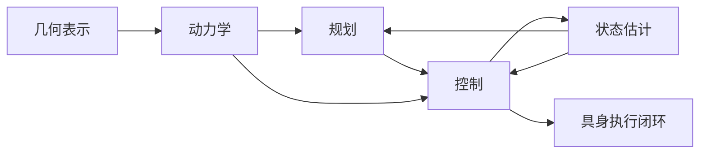

在当前版本中，`图 5-1 经典机器人学关系图` 已承担“几何表示 - 动力学 - 规划 - 控制 - 状态估计”主关系图的职责；`表 5-1 经典机器人学基础与后续章节映射表` 则把这些基础如何回流到 VLA、世界模型与部署章节正式固定下来。
本章的代码支撑重点放在两类最能代表后续具身系统接口的问题上：一类是“任务空间控制 / 阻抗控制”，用于说明高层意图如何落到可执行接触行为；另一类是 `EKF / 因子图状态估计`，用于说明不确定观测如何被组织成可用于控制与规划的状态变量。这样的取舍更符合本章作为基础层的职责，即用少量代表性骨架揭示核心机制，而不是把正文扩展成算法实现手册。

## 表 5-1 经典机器人学基础与后续章节映射表

见：[05-经典机器人学基础映射表](D:/Projects/embodied-intelligence-report/docs/report/current/tables/05-经典机器人学基础映射表.md)

## 代码 5-1 任务空间控制最小骨架

```python
import numpy as np

def task_space_pd(x, x_ref, J, dq, Kp, Kd):
    e = x_ref - x
    dx = J @ dq
    wrench = Kp @ e - Kd @ dx
    tau = J.T @ wrench
    return tau
```

上面的骨架只保留了一个最核心事实：高层规划最后必须通过 Jacobian、误差反馈和关节力矩映射，才能变成真实可执行的闭环命令。

---

# 第六部分 学习型机器人与训练闭环基础

如果说第五部分说明了机器人为何始终受制于物理、控制与状态估计，那么本部分要回答的则是另一个同样关键的问题：一旦机器人进入学习路线，系统的主要矛盾会如何变化。传统模块化机器人往往把重点放在显式建模、手工接口和结构化工程流程上；学习型机器人则试图把其中一部分能力交给数据驱动方法学习。但这并不意味着问题被简化，相反，它通常把问题重写为另一组更难的对象：数据从哪里来、训练目标如何定义、离线与在线如何衔接、失败样本如何回流、仿真与现实如何迁移，以及系统如何在闭环中持续修正。

因此，本部分并不把模仿学习、强化学习、表示学习和 sim2real 写成互不相干的算法词条，而是把它们统一放在“训练闭环”这一主线上理解。所谓学习型机器人，真正新增的并不只是某个网络结构，而是系统开始依赖一条持续的数据-训练-部署-反馈回流链路来积累能力。也正因为此，学习型机器人既带来了前所未有的泛化可能，也引入了新的脆弱性：covariate shift、数据分布偏移、探索成本、仿真失真、训练目标错配和部署中长尾失败。

## 27. 模仿学习

### 27.1 行为克隆

模仿学习之所以长期是机器人学习最现实的起点，不是因为它最“先进”，而是因为它最符合现实数据获取条件。对许多操作任务、移动任务和服务任务而言，最容易拿到的数据并不是大规模在线试错样本，而是人类示教、遥操作轨迹、脚本演示或专家控制记录。行为克隆的基本思想，就是把这些示教轨迹直接转化为监督学习问题：给定观测 `o_t`，学习一个策略 `\pi_\theta` 输出动作 `a_t`。

最基本的训练目标通常写为：

```math
\min_{\theta} \sum_{t=1}^{T} \lVert \pi_{\theta}(o_t) - a_t^\ast \rVert^2
```

其中，`a_t^\ast` 是专家动作。这种写法的优点在于简单直接：不需要显式奖励函数，不需要昂贵探索，也能快速建立一个“会做基本动作”的初始策略。因此，从早期视觉运动策略到今天的大量机器人示教学习系统，行为克隆一直是最自然的入口。[End-to-End Training of Deep Visuomotor Policies](https://arxiv.org/abs/1504.00702)

但行为克隆最核心的脆弱性也非常清楚：训练时看到的是专家状态分布，部署时却会逐步落入策略自己诱发的状态分布。一旦出现微小误差，系统就可能越来越偏离专家轨迹，并在后续时间步中累积放大。这就是学习型机器人里最基本也最重要的 covariate shift 问题。

### 27.2 逆强化学习与偏好学习
如果把行为克隆理解为“直接模仿专家做了什么”，那么逆强化学习与偏好学习更接近于“推断专家为什么偏好这样做”。二者都试图把人类标准从动作层抬升到目标层，但处理反馈的形式不同。逆强化学习通常假设存在某个隐含奖励函数 \(r_\phi(s, a)\)，专家轨迹之所以优于其他轨迹，是因为它们在该奖励下取得了更高累计回报；偏好学习则不要求先显式恢复完整奖励，而是允许人类只对两段候选行为表达“哪一段更好”，再从成对比较中学习一个可用于排序或训练的偏好模型。

若以轨迹 \(\tau\) 表示一段状态-动作序列，偏好学习常见的最小形式可以写成：

```math
P(\tau_i \succ \tau_j) = \sigma(f_\phi(\tau_i) - f_\phi(\tau_j))
```

其中 \(f_\phi(\tau)\) 可被视为轨迹奖励或质量评分器。逆强化学习则更强调从专家数据中恢复解释行为的奖励结构，而偏好学习更强调用低成本人类比较信号去拟合“什么叫更好”。对具身系统而言，这种差别很重要，因为很多高质量标准并不是单步动作正确，而是整段行为更平滑、更安全、更符合人类协作习惯。

从工程工作流看，一条典型链路通常是：策略先生成若干候选行为片段，再由人类、规则系统或高可信脚本对片段进行偏好比较，之后训练奖励/偏好模型，最后把它接到离线 RL、重排序器或在线微调回路里。其最小伪代码可以写成：

```python
segments = collect_candidate_trajectories(policy, env)
labels = query_human_preferences(segments)
reward_model = fit_preference_model(segments, labels)
policy = optimize_policy_with_reward_model(policy, reward_model)
```
从工程角度看，逆强化学习与偏好学习的真正价值，不在于它们能神奇地自动发现完美奖励，而在于它们提供了一种把“难以直接写成公式的人类标准”逐步转译进训练目标的机制。对于服务机器人、协作机器人和家庭场景系统，这一点尤其重要，因为很多高质量行为的评价依赖软约束而不是单一成功标签。与此同时，这条路线也有明显代价：偏好标注往往昂贵、主观且受上下文影响；恢复出来的奖励未必具有强可迁移性；一旦数据分布变化，原先学到的偏好结构可能迅速失效。

当人们发现“直接模仿动作”不足以表达复杂任务目标时，就会自然走向另一条思路：不一定模仿动作本身，而是试图恢复驱动这些动作的偏好、代价或奖励结构。逆强化学习的吸引力在于，它试图回答“专家为什么这么做”，而不仅仅是“专家做了什么”。对于同一个高层目标，可能存在多条行为轨迹；若只模仿表面动作，系统容易过拟合于演示细节，而不能抓住真正应优化的任务结构。

偏好学习则进一步把这一思想推向更灵活的人类反馈接口。人类未必总能给出完整专家轨迹，但可以在候选行为之间表达“哪个更好”“哪个更安全”“哪个更自然”。这类方法在具身系统中尤其有意义，因为很多任务的高质量标准并不完全等于“到达目标状态”，还包括接触稳定性、动作平滑性、人机共处安全性和符合现场习惯的执行风格。

### 27.3 DAgger 与闭环纠偏

Ross、Gordon 与 Bagnell 的 DAgger 工作之所以在模仿学习脉络中如此关键，是因为它清楚指出：如果只在离线专家分布上训练，那么策略在部署时引发的状态偏移会持续累积，因此必须让训练过程看到策略自己会走到的状态，并由专家对这些状态重新标注动作。[A Reduction of Imitation Learning and Structured Prediction to No-Regret Online Learning](https://proceedings.mlr.press/v15/ross11a.html)

如果把这个思想写成最朴素的流程，就是：

1. 用专家数据训练初始策略
2. 让当前策略自己运行
3. 在策略实际访问到的状态上收集专家纠正动作
4. 聚合新旧数据重新训练

这件事的重要性，不在于 DAgger 是某个必须逐字复现的算法，而在于它第一次把模仿学习明确推向了闭环训练思路。也就是说，学习型机器人不能只依赖“第一次录好的示教”，而必须把部署中的偏差重新回收到训练中。

```python
# 示例：DAgger 风格的数据聚合骨架
dataset = initial_expert_dataset()
policy = train_policy(dataset)

for _ in range(num_rounds):
    states = rollout(policy)
    corrections = [expert_action(s) for s in states]
    dataset.extend(zip(states, corrections))
    policy = train_policy(dataset)
```

这个片段当然省略了现实中的很多细节，例如部分人工标注、失败回放筛选和安全接管机制，但它说明了一条关键主线：模仿学习一旦认真做下去，就会自然演化成训练闭环问题，而不是静态监督学习问题。

### 27.4 示教数据如何塑造具身能力边界

示教数据并不只是给模型提供“正确答案”，它还在深层上塑造了系统认为哪些动作是正常的、哪些状态是常见的、哪些恢复路径是被允许的。若示教主要来自熟练操作者、固定场景和成功片段，模型学到的往往是干净、规范但覆盖面有限的行为分布；若示教包含更多失败修正、犹豫过程和边界案例，系统更可能获得现实环境中真正有用的恢复性能力。

也因此，示教数据的价值不应只按数量衡量，更应按覆盖的行为边界衡量。很多具身系统后续泛化上限，早在示教采集阶段就已经被决定了一大半。

模仿学习的真正上限，往往不由网络结构决定，而由示教数据的分布、覆盖和质量决定。系统若只见过桌面抓取，就很难自然具备移动操作能力；若只见过成功轨迹，就往往缺少失败恢复能力；若示教本身高度脚本化，则模型即使泛化也更可能泛化到脚本模式，而不是开放世界任务。因此，示教数据并不是“喂给模型的原料”那么简单，而是在很大程度上定义了系统可学会什么、学不会什么、在哪些边界最容易失败。

## 28. 强化学习

### 28.1 MDP 与策略学习基础
对机器人而言，MDP 的真正作用并不是把现实世界“简化成五元组”，而是强迫研究者明确哪些量被当作状态、哪些量被当作动作、奖励究竟偏向结果还是过程、以及策略更新究竟是在拟合什么行为因果链。很多路线争论表面看发生在算法层，实质上却是 MDP 设定不同：有的系统把恢复动作写进动作空间，有的把失败后重试外包给执行器；有的把安全作为硬约束，有的只把它当作奖励惩罚项。只要这层问题没说清，后续任何“算法更强”的比较都很容易失真。

强化学习之所以吸引机器人领域，是因为它看起来提供了一种比模仿学习更自主的能力形成机制：系统不必只复制专家，而可以通过与环境交互优化长期回报。其最经典的问题设定是马尔可夫决策过程：

```math
\mathcal{M} = (\mathcal{S}, \mathcal{A}, P, r, \gamma)
```

其中，状态 `s_t`、动作 `a_t`、转移概率 `P`、奖励 `r` 和折扣因子 `\gamma` 定义了一条长期决策问题。策略学习的目标通常写为最大化期望累计回报：

```math
J(\pi) = \mathbb{E}_{\pi}\left[\sum_{t=0}^{T} \gamma^t r_t \right]
```

这一目标的吸引力在于，它允许系统为了长期任务完成度而不是单步模仿精度去优化行为。对于抓取、步态稳定、动态控制和长时程任务，强化学习因此提供了比行为克隆更自然的闭环优化视角。

### 28.2 在线 RL 与离线 RL
在线 RL 与离线 RL 的区别，不只是“是否接触环境”，而是策略更新是否持续依赖新采样数据。在线 RL 假设策略 \(\pi_\theta\) 在训练过程中不断与环境交互，采样新轨迹、估计价值、再更新策略；离线 RL 则固定在一个已经记录好的数据集 \(\mathcal{D}\) 上学习，训练期间不再假设可以无限制获得新样本。对现实机器人而言，这个区别极其关键，因为真机交互昂贵、缓慢、易损且存在安全边界。

若把两者写成最小流程，在线 RL 更像：

```python
for step in range(K):
    trajectories = rollout(policy, env)
    critic = update_value_function(critic, trajectories)
    policy = improve_policy(policy, critic, trajectories)
```

离线 RL 则更像：

```python
dataset = load_logged_robot_data()
for step in range(K):
    batch = sample(dataset)
    critic = update_value_function(critic, batch)
    policy = conservative_policy_improvement(policy, critic, batch)
```

这两条路线面对的问题完全不同。在线 RL 的主要挑战是探索成本、样本效率与安全约束；离线 RL 的主要挑战是分布外动作带来的价值误估。也正因如此，机器人中的离线 RL 常常不会做“自由策略改进”，而会加入保守约束，要求策略不要偏离数据分布太远。现实系统因此普遍采用“离线预训练 + 有限在线校正”的折中流程。

但强化学习一进入真实机器人，就会立刻遭遇现实约束。在线 RL 的理想图景是系统自己在环境中反复试错，但真实机器人中的试错是昂贵的、慢的，而且可能造成磨损、碰撞或安全风险。因此，机器人领域长期非常依赖仿真环境、历史缓冲区、示教初始化和离线数据集。于是，RL 很快就分化为两条路线：一条强调直接在线交互优化，另一条强调在已有数据上做离线策略学习，再辅以有限在线修正。

这一分化本身就说明，机器人中的 RL 从来不是“让机器人自己学一切”那么简单，而是始终要在探索收益与现实代价之间做工程折中。

### 28.3 层级强化学习
层级强化学习可以被视作“把长时程控制问题拆成多个不同时间尺度上的决策器”。最经典的结构是高层管理器和低层执行器：高层每隔若干步产出一个子目标、技能索引或 option，低层则在更高频率上执行连续控制，努力把系统带到该子目标附近。

若把这一结构写成统一抽象，可以得到：

```math
g_t = \pi_H(s_t), \qquad a_t = \pi_L(s_t, g_t)
```

其中 \(g_t\) 是高层在慢时间尺度上给出的子目标或技能标签，\(\pi_L\) 是条件于子目标的低层策略。它们回答的是同一个问题：如何避免让单层策略同时承担“长时程意图规划”和“短时程稳定控制”两类职责。

一个极简工作流可以写成：

```python
goal = high_level_policy(state)
for _ in range(skill_horizon):
    action = low_level_policy(state, goal)
    state, reward = env.step(action)
    if reached(goal, state):
        break
```

这个结构之所以在具身系统里格外自然，是因为真实机器人本来就具有多层时间尺度。语言指令和任务阶段往往以秒级或十秒级变化，而关节控制、接触稳定和避障修正通常是毫秒级到百毫秒级问题。层级 RL 的意义，就是试图让学习系统也尊重这种物理时间结构，而不是把所有决策都塞进同一个平面里。
层级结构的关键收益，在于它把原本难以直接优化的长时程信用分配问题拆成多个较短决策链路。高层不必在每个控制周期都重新决定末端执行器如何运动，而可以在更慢时间尺度上决定当前应激活哪类技能、追求哪个局部目标。低层则专注于在受限上下文中完成局部控制最优化。对于具身任务，这种分离通常不仅提升样本效率，也更方便插入人类先验、安全约束和程序化结构，因此它在后来的 VLA、行为树、技能图谱和程序化规划中不断以不同形式重现。

随着任务变长、状态空间变大、动作结构变复杂，单层策略很难同时处理高层子目标分解与低层连续控制。因此，层级强化学习自然出现：高层策略选择子目标或技能，低层策略负责具体执行。这条路线对具身智能后续的“技能库”“大小脑分层”“程序化中间表示”极具启发性，因为它说明学习系统也会自然走向分层，而不是无限维持单一平面策略。

### 28.4 安全强化学习

安全强化学习之所以在机器人里必须单列，是因为传统 RL 默认的“多试错、多探索”在真实系统中成本极高。机器人每一次危险动作都可能对应硬件损伤、人身风险、现场停线或数据污染，因此安全不能只作为奖励函数里的一项惩罚项，而往往要进入约束、屏障、动作裁剪和人类接管机制中。

这也意味着，机器人中的安全 RL 更像是“在可接受风险边界内学习”，而不是“先任意学习、后再部署”。很多看似降低探索自由度的安全机制，恰恰是让真实学习能够持续进行的必要前提。
这一点之所以需要单独强调，是因为不少关于 RL 的乐观叙事默认了“只要探索足够多，策略总会变好”。但在真实机器人里，不安全探索不仅意味着训练成本增加，还可能直接损坏设备、破坏环境或伤及人员。因此，安全 RL 在具身场景中更像是一套训练制度，而非单一算法名词。它要求我们同时设计奖励、约束、监控、回退和人工接管机制，并承认某些状态区域根本不允许被自由探索。

机器人中的 RL 还必须面对一个纯软件智能体不那么尖锐的问题：探索本身可能带来真实物理风险。因此，安全强化学习并不是附属分支，而几乎是机器人 RL 的默认前提。很多现实系统不得不通过动作裁剪、约束优化、shielding、风险敏感回报和人类接管来限制探索空间，否则训练过程本身就会不可接受。

### 28.5 为什么 RL 在机器人里既重要又常被高估

RL 之所以重要，是因为它为机器人提供了一种超越纯示教模仿的路径，使系统能够通过交互优化长期回报、探索策略改进空间并在某些接触与顺序任务上学到人类示教之外的行为结构。尤其在仿真中，RL 仍是许多控制技能与策略优化工作的核心工具。

但 RL 又常被高估，是因为它在论文与视频里常常代表能力上限，而在真实部署中却很难单独承担整套系统能力。真实世界中的数据效率、探索风险、分布漂移、维护成本和奖励设计难题，都使得 RL 更适合作为系统中的一层能力来源，而不是总被浪漫化为万能学习范式。

强化学习在机器人中的真实价值，主要体现在它能够对闭环行为进行长期优化，尤其适合那些难以手工设计控制器、但又可以通过回报近似描述目标的任务。[QT-Opt](https://arxiv.org/abs/1806.10293) 的意义正在于此：它并不是证明“机器人会自己学一切”，而是说明当真实交互数据规模足够大时，闭环 RL 可以在抓取这类具体任务上显著提高鲁棒性与恢复能力。

但 RL 也经常被高估。原因并不神秘：奖励设计困难、探索代价高、样本效率低、真实世界训练慢、安全风险高。这意味着 RL 在机器人里更常扮演“局部行为优化器”或“特定子系统能力增强器”的角色，而不是一个能天然吞掉全部系统问题的统一方案。

## 29. 表示学习与多任务学习

### 29.1 自监督表示学习

自监督表示学习之所以在机器人中重要，是因为真实交互数据昂贵、标注稀缺，而系统却需要从海量未标注轨迹中先学到可压缩、可迁移、可预测的结构。相比直接端到端监督训练，自监督方法更像是在为后续控制、规划与跨任务迁移铺设共同底座。

不过，机器人里的自监督并不能简单照搬纯视觉领域经验。对具身系统而言，有用的表示不仅要“对图像变化敏感”，还要对动作后果、接触状态、对象可操作性和时序连续性敏感。否则，表示也许很适合分类或检索，却未必足够适合驱动决策。

一旦机器人不再只做单一任务，问题就不再只是“当前策略会不会做这件事”，而变成“系统能否从观测中学到跨任务可复用的结构”。这正是表示学习进入机器人主线的原因。自监督学习的吸引力在于，它允许系统在不依赖昂贵逐步标注的情况下，从多模态观测、时序结构和环境互动中学到对后续任务有用的内部表征。

从更长的脉络看，后来的多模态基础模型、VLA 和机器人 foundation models，本质上都建立在一个前提上：系统必须先学会形成比单任务监督标签更稳定、更可迁移的内部状态结构。

这也是为什么本章要把表示学习放在基础模型之前讲。它并不是附属预备知识，而是后续一切“统一接口”“多任务共享”“跨平台迁移”叙事能够成立的前置条件。

### 29.2 多任务共享表征
多任务共享表征的核心问题，不是“把所有任务放在一起训练”，而是“哪些表征应该共享，哪些表征必须保留任务特异性”。一个典型架构是共享编码器加条件化任务头：视觉、触觉或状态输入先经过共享 backbone 提取通用特征，再由任务 ID、语言指令或上下文变量进行条件化，最后输出不同任务所需的动作、价值或中间状态。

其最小架构可以写成：

```math
z = f_\theta(o), \qquad a = \pi_\psi(z, c)
```

其中 \(o\) 是观测，\(f_\theta\) 是跨任务共享的表征网络，\(c\) 是任务条件，\(\pi_\psi\) 则是条件策略头。若进一步拆开，还可以为不同任务保留不同 heads：

```python
features = encoder(obs)
action = task_head[task_id](features)
```

这类设计之所以重要，是因为机器人中大量任务共享底层结构。例如相机视角、几何约束、物体边界、抓取前的接近动作、接触前的减速策略，往往都可被多个任务复用。如果每个任务都从零训练一个独立表示，数据利用率会非常低；但如果一味强行共享，又会出现任务冲突、负迁移和梯度干扰。

如果每个任务都单独训练一个策略，那么机器人就仍然停留在“很多孤立技能拼接”的阶段。多任务学习的重要性，在于它尝试让多个任务共享一部分表示空间、技能结构和条件化接口。这样做的收益是明显的：样本可以跨任务复用，表征可以更稳定，系统也更容易在新任务上做迁移。

但代价同样明显：任务冲突、梯度干扰、表示坍塌和任务不平衡会迅速出现。因此，多任务共享并不是“任务越多越好”，而是要求系统明确哪些层应该共享、哪些层必须保留任务特异性。

### 29.3 通用技能库与技能迁移
因此，技能迁移真正困难的并不是把一个名字复用到另一台机器人，而是保持其前置条件、可观测状态和失败恢复逻辑也能迁移。一个“抓取”技能在双指夹爪、五指灵巧手和吸盘末端之间，表面任务相同，内部却可能依赖完全不同的接触判据与恢复动作。这也是为什么后续很多 foundation model 路线会强调 skill token、action chunk、callable API 或 program interface：它们试图把技能从纯轨迹片段提升为“带契约的中层能力对象”，从而让迁移问题变成接口重绑定，而不只是参数复制。
技能迁移的难点在于，一个看似相同的技能在不同本体、不同夹爪、不同摩擦条件和不同任务容错要求下，往往并不等价。也就是说，技能库不是静态的“动作函数仓库”，而更像一组带有适用前提、参数接口和失败模式描述的中层能力对象。后续很多基础模型路线之所以强调 skill token、action chunk 或 program-like interface，本质上都是在寻找一种既保留可学习性、又维持技能可迁移性的中间表示。

当多任务学习进一步发展，就会自然引出“技能库”思想：与其让高层每次都直接输出低层控制，不如先学习一组可复用技能，再由高层按任务调用。这个想法对后文理解 VLA、程序化中间表示和大小脑架构都非常关键，因为现代具身系统常常不是端到端地每次都从头生成所有动作，而是试图在更稳定的技能原语之上组织行为。

从系统角度看，技能库真正提供的是一种中层可复用性。它让系统既不必把一切写死成传统程序，也不必让每次执行都从原始动作开始重新生成，因此是很多现实路线在“可学习性”和“可部署性”之间取得平衡的关键中介。

### 29.4 表征学习如何成为后续基础模型的前置条件
更一般地说，基础模型之所以能够在机器人中成立，一个前提就是系统已经学会把不同任务、模态和时间尺度的信息压进某种共享表征空间。没有这一步，所谓“大模型统一一切”往往只会停留在输入输出层面的拼接，而无法形成真正可复用的内部结构。因此，把表示学习看成后续基础模型的前史，不只是历史梳理，更是在提醒我们：如果表征层设计得不对，后面再大的模型也可能只是把系统问题放大而不是解决。

Decision Transformer 的重要性，并不只在于它把 RL 重写成序列建模，而在于它表明：一旦系统开始把轨迹、回报、状态和动作放到统一序列接口中，传统策略学习与更一般的表示学习之间的边界会开始模糊。[Decision Transformer](https://arxiv.org/abs/2106.01345) 这为后来的 VLA、动作 token 化和多模态统一接口提供了认知上的桥梁。换言之，机器人基础模型并不是凭空出现的，它们依赖的正是此前这些跨任务表示与统一接口思路的持续积累。

## 30. sim2real 与域适应

### 30.1 仿真训练的价值

仿真训练的真正价值，并不只是“便宜地多跑实验”，而是在真实硬件成本过高、危险动作不可直接尝试、长尾扰动难以系统组织时，提供一个可控、可重复、可批量扩展的策略形成环境。它让很多本来在真机上难以系统比较的方案，能够先在统一条件下做初筛和快速迭代。

但仿真最有价值的地方，也恰恰要求研究者对其边界保持清醒。仿真不是现实替身，而更像现实前的训练场和过滤器。若把它当作直接等价的能力证明，就会高估策略的真实部署成熟度；若把它当作结构化筛选工具，其价值则非常高。
从研究方法论上看，仿真还承担着“解耦问题”的作用。真实系统中的失败常常由多种因素叠加导致，而在仿真环境中，研究者可以更系统地单独操纵视觉纹理、动力学参数、接触模型、控制延迟和任务扰动，从而辨识究竟是哪一层假设在失效。也正因如此，仿真不是廉价替代品，而是一种结构化实验平台。后续像 NVIDIA Isaac、MuJoCo、Omniverse、Habitat 这类基础设施的重要性，不仅在于“能跑更多实验”，更在于它们塑造了问题被提出和被验证的方式。

只要真实机器人训练成本高、速度慢、风险大，仿真就几乎不可避免。仿真最大的价值，并不是“替代现实”，而是提供一种可大规模、可并行、可控制、可重复的试验环境，使系统能够在其中学习基础行为、验证训练目标和提前暴露明显失效模式。

对这份报告来说，仿真章节的重要作用还在于建立一个判断习惯：凡是仿真结果，都应继续追问它究竟证明了“结构有效”还是“部署可行”。把这两者分开，后续解读很多论文时会稳得多。

### 30.2 域随机化与域自适应
更稳妥的理解方式是把二者看成两种互补策略。域随机化是在训练期主动扩大输入和动力学分布，让策略学会对变化不敏感；域自适应则是在部署前或部署中显式估计“我现在身处哪个域”，并对表征或参数做针对性修正。前者偏向保守覆盖，后者偏向定向补偿。对具身系统而言，很多成功方案并不是二选一，而是先用域随机化获得基础鲁棒性，再用少量真机数据或在线校准做末端收敛，这比单独押注某一条路线更符合现实工程。
域随机化的思想，是主动让训练分布比目标部署分布更“宽”，以换取策略对未见扰动的容忍度；域自适应则更强调学习如何桥接仿真与真实观测之间的表征差异。两者都不是银弹。随机化过弱，泛化无效；随机化过强，策略可能学不到任何稳定结构。自适应若只对视觉层有效，而真实失配主要来自接触动力学和控制延迟，也难以真正解决问题。因此，sim2real 的关键不是套用某个名词，而是识别系统究竟在哪一层发生了跨域断裂。

但仿真与现实之间从来不存在天然无缝映射。视觉纹理、光照、接触摩擦、执行器延迟、传感器噪声、对象分布和环境扰动都可能发生偏移。因此，sim2real 路线通常需要通过域随机化、域自适应、系统辨识和现实微调来缩小差距。

这里最重要的理解是：sim2real 并不是部署前最后做的一步“小修补”，而是一条贯穿训练早期设计的结构性问题。你在仿真中如何定义任务、如何选状态、如何建奖励、如何建动力学，都会直接影响后续现实部署是否还能成立。

也就是说，sim2real 成败往往早在“问题怎么被表述”这一层就埋下了种子，而不是只在最后迁移那一刻才出现。后文再谈世界模型、基础模型和部署时，都应保留这一视角。

### 30.3 现实部署中的失效模式

现实部署中的失效模式，往往并不是模型“完全不会做任务”，而是系统在长时程、弱扰动累积和异常边界条件下逐渐暴露脆弱性。例如感知偏移导致抓取点慢慢漂移、策略对某类照明特别敏感、恢复动作在少数边角状态下不可用、或上层计划在连续小误差后失去一致性。

这些失效模式之所以重要，是因为它们更接近真正的运维成本来源。很多系统不是败在第一次任务，而是败在第十次、第一百次和跨场景重复后。理解失效模式，比只关注平均成功率更接近真实部署质量。
从部署复盘角度看，失败模式分析应尽量落到可归责的系统层级。例如，抓取失败究竟是检测框飘移、深度估计偏差、抓取位姿候选错误、接触模型不准，还是末端执行器闭合延迟过大？如果没有这种分层归因，团队就容易把所有失败都模糊归结为“模型泛化不够”，从而错过真正的系统瓶颈。后续报告在评价企业 demo 或学术结果时，也应尽量用这种失效模式框架来判断其工程含金量。

现实中的失效往往不是单点误差，而是多种偏移叠加：视觉模型在新光照下变差，接触模型与真实摩擦失配，控制时延导致原本稳定的轨迹开始振荡，状态估计漂移让策略输入逐步失真。也正因为此，“仿真里会做”从来不能自动推出“现实里能稳定做”。

这类失效模式也说明，部署分析必须尽量落到分层归因，而不是笼统归因为“模型不够泛化”。只有这样，团队才可能知道应该补数据、换接口、加回退，还是重做本体与控制链路。

### 30.4 为什么“学得好”不等于“落得下去”

“学得好”与“落得下去”之间的差距，通常不在离线指标本身，而在系统是否能承受真实部署中的分布漂移、执行误差、延迟、异常恢复和维护负担。一个策略在干净数据集、固定起始条件和可控环境中取得高成功率，并不意味着它在连续值班、复杂照明、器件老化或混杂人机协作条件下还能保持稳定表现。

从工程角度看，能否落地更像是在问：模型是否具备足够的恢复能力、是否允许人类低成本接管、是否能通过日志回流形成再训练闭环、以及其错误是否以可管理方式暴露。也正因此，学习系统的真正成熟，往往不是体现在最优片段更惊艳，而是体现在平均运行更稳、失败模式更清晰、维护流程更可复制。

这一定义会贯穿后文对企业和商业化的判断。很多路线不是“不会做”，而是“做了但还不值得交付”；两者差别不在 demo，而在恢复、维护、接管和回流是否成体系。

这一节对全书最重要的意义，在于它提前建立一个判断纪律：学习指标的提升、仿真成绩的提升、离线验证的提升，都不自动等于真实部署能力的提升。后文无论写 VLA、世界模型还是企业 demo，都必须不断回到这一点上检验。

## 31. 世界模型思想的早期来源

### 31.1 model-based RL
从算法结构上看，model-based RL 至少包含三个部件：环境模型、规划或想象模块，以及策略/价值更新模块。环境模型试图学习从当前状态和动作到下一状态及奖励的转移关系；规划模块利用该模型在内部试探多个动作后果；策略模块再根据这些“想象经验”或规划结果更新行为。

若以 learned dynamics \( \hat{P}_\phi(s_{t+1}\mid s_t,a_t) \) 和 learned reward \( \hat{r}_\phi(s_t,a_t) \) 表示环境模型，则最小流程可以写成：

```python
model = fit_dynamics(real_transitions)
for state in sampled_states:
    imagined_rollouts = rollout_in_model(model, state, candidate_actions)
    score = evaluate(imagined_rollouts)
policy = improve_policy(policy, score)
```

这里真正的分水岭，不是“有没有模型”，而是模型在控制链中承担什么角色。有些系统只把模型用于生成辅助训练数据；有些把它用于候选动作排序；有些则把它直接嵌入 MPC 式在线规划。角色不同，对模型精度、稳定性和时延的要求也完全不同。
这一传统的重要性在于，它重新把“预测环境会怎样变化”放回了决策核心。与纯 model-free 路线相比，model-based RL 试图让系统通过内部推演减少真实试错需求，并在规划时显式利用未来状态结构。对于机器人而言，这一点尤其诱人，因为真实交互昂贵而危险；但也正因为如此，任何动力学建模误差都可能被规划过程放大，导致系统在内部想象中看似合理、在现实中却迅速偏离。

世界模型路线之所以值得单独讨论，不是因为它是近两年的新潮名词，而是因为它延续的是更早的 model-based RL 思想：系统不仅学策略，还学习环境动力学或潜在状态演化，再利用这些内部模型进行规划、想象 rollout 或策略优化。

### 31.2 潜空间动力学模型
潜空间动力学模型的标准工作流，通常分为“编码”“潜空间转移”“解码或读出”三步。系统先用编码器把高维观测 \(o_t\) 压缩为潜变量 \(z_t\)，再在潜空间学习转移关系 \(z_{t+1}=f(z_t,a_t)\)，最后按需要解码回观测、奖励、接触属性或价值信号。它与直接像素预测的根本区别在于：模型不再试图重建全部视觉细节，而是希望保留与控制相关的最小充分结构。

一个极简架构可以写成：

```math
z_t = e_\theta(o_t), \qquad \hat{z}_{t+1} = f_\phi(z_t, a_t), \qquad \hat{o}_{t+1} = d_\psi(\hat{z}_{t+1})
```

如果只关心控制而非重建，最后一步甚至不必显式解码成像素，而可以直接预测 reward、termination、contact mode 或 affordance。也正因为如此，潜空间模型常被进一步区分为“重建导向”和“控制导向”两类：前者更在意观测保真，后者更在意潜变量是否可用于规划、值函数估计和技能切换。
潜空间动力学模型的真正挑战，不只是压缩得足够小，而是要保留对决策真正重要的可控结构。若潜变量只对重建像素有利、却丢失了接触可行性、可达性或物体交互关系，那么它对机器人规划价值有限。反过来，如果潜空间过于任务特化，又会削弱跨任务复用和长期泛化能力。因此，这一层始终处在“表征压缩”与“控制充分性”之间的张力之中，这也是后续世界模型与具身基础模型路线不断分化的根本原因之一。

一旦观测空间变得高维，直接在像素或原始传感空间中做预测往往代价太高，于是研究者开始学习潜空间表示，并在潜空间中建模动力学。这一步非常关键，因为它把“世界模型”从简单的环境近似，推进成一种“可预测、可规划、可压缩”的内部状态结构。

### 31.3 想象 rollout 与规划接口
“想象 rollout”并不等于简单生成未来画面，它更像是在内部模型中展开一串假设动作，然后把结果交给某种决策接口消费。这个接口可以是动作重排序器、MPC 规划器、价值评估器，或者仅仅是训练时的辅助数据生成器。理解 rollout 的关键，不在于它能否看起来像未来，而在于它与下游控制器之间如何闭环。

最小的 imagination planning 过程可以写成：

```python
for action_seq in candidate_action_sequences:
    latent = encode(obs)
    returns = 0
    for action in action_seq:
        latent, reward = model.step(latent, action)
        returns += reward
    score[action_seq] = returns
best = argmax(score)
execute(best[0])
```

这里可以看出，rollout 的核心是“候选动作序列在模型内的相对排序”，而不是必须得到完美像素视频。对机器人而言，只要内部推演足够帮助区分“更可能成功”和“更可能碰撞或失稳”的候选行为，它就可能有实际价值。
因此，想象 rollout 真正需要回答的问题，不是“能不能生成未来”，而是“生成出来的未来如何以受控方式进入决策接口”。有的系统把它用于价值评估，有的用于动作筛选，有的用于候选计划排序，还有的仅用于离线表征学习。接口不同，世界模型承担的责任也不同。把这一点说清楚很重要，因为它直接决定了我们后文评价世界模型路线时，是把它看成控制器、规划器、数据生成器，还是训练辅助器。

[World Models](https://arxiv.org/abs/1803.10122) 与 [Dreamer](https://arxiv.org/abs/1912.01603) 之类工作的重要性，就在于它们明确展示了系统可以在内部模型中做想象 rollout，再据此学习策略或评估未来。对机器人来说，这一思想特别诱人，因为真实试错昂贵，而内部想象似乎提供了一种更高样本效率的替代路径。

但这里也埋下了后文世界模型章节必须正面处理的问题：生成看起来合理的未来，并不等于预测在物理上真实可执行的未来；内部模型可以帮助训练，却不自动保证部署中的稳定性与安全性。

### 31.4 为什么世界模型不是凭空冒出来的新潮名词

世界模型之所以看上去像一个近年流行的新词，更多是因为它在大模型与生成模型浪潮中重新获得了关注，而不是因为它在机器人与控制中毫无前史。其核心问题始终都在：系统能否通过内部模型预测环境演化、评估动作后果并在执行前进行某种形式的想象式试错。

从这个意义上说，今天的视频世界模型、潜空间 rollout、抽象预测和旧时代的模型预测控制、状态转移建模并不是彼此割裂的宇宙，而是共享同一问题核的不同技术表达。理解这一连续性，有助于避免把许多老问题仅仅因为名字更新就误判为“全新范式”。

因此，本节最重要的作用，是把世界模型重新接回学习型机器人主线。后文如果直接从生成视频或具身 foundation model 角度谈世界模型，很容易让它显得像一个突然冒出来的新范式；而放回这里看，它其实是 model-based RL、潜空间动力学和 imagination-based planning 的继续发展，只是在模型规模和表示能力上被重新放大了。

把这一连续性看清楚，有助于我们避免被术语更新反复带偏。很多今天看似崭新的路线，真正的新意未必在问题本身，而在表示能力、数据规模和接口组织方式上。

## 本部分小结

学习型机器人真正改变的，并不是“机器人开始用神经网络了”这么简单，而是系统能力开始依赖一条持续的训练闭环：示教、交互、反馈、回流、迁移和再训练共同决定系统上限。模仿学习提供现实起点，强化学习提供闭环优化机制，表示学习提供跨任务结构，sim2real 暴露部署断裂，世界模型则尝试把环境动力学重新引入学习链路。

也正因此，本部分与后文的接口非常明确：

1. 与第 07 部分的接口：表示学习、序列建模和统一接口为大模型进入机器人打基础
2. 与第 10 部分的接口：世界模型并非新概念，而是这里的继续展开
3. 与第 11、13、14 部分的接口：VLA、数据工程、仿真基础设施都建立在这里的训练闭环视角之上
4. 与第 15、16 部分的接口：学习系统的最终价值仍取决于部署约束与安全条件

## 图表与代码补充
本章真正值得反复回看的，不只是单个算法定义，而是它们在训练闭环中的位置关系。若把行为克隆、偏好学习、在线/离线 RL、sim2real 和世界模型放进同一张图里，会更容易看出它们并不是彼此替代的平行名词，而是在回答“数据从哪里来、目标如何定义、策略如何更新、部署偏差如何回流”这几类不同问题。

因此，后续版本中本章的图表应服务于两个稳定目标：第一，把“模仿学习 - RL - 表征学习 - 世界模型”的历史关系画清楚；第二，把“采集 - 训练 - 部署 - 失败回流”的工程闭环画清楚。与其把这些图当作装饰，不如把它们看成本章的结构索引，因为训练型机器人真正新增的就是这条长期数据与能力共演化链路。

代码层面，本章最值得保留的不是大段实现细节，而是几类最小骨架：行为克隆训练循环、离线 RL 的保守更新结构、以及 model rollout 的内部评估回路。它们能帮助读者把抽象术语重新压回到“数据如何进入优化器、优化器如何影响策略、策略又如何回到部署现场”这一条可执行链路上。

## 图 6-1 学习路线与训练闭环演化图

源文件：`assets/diagrams/06-训练闭环演化图.mmd`

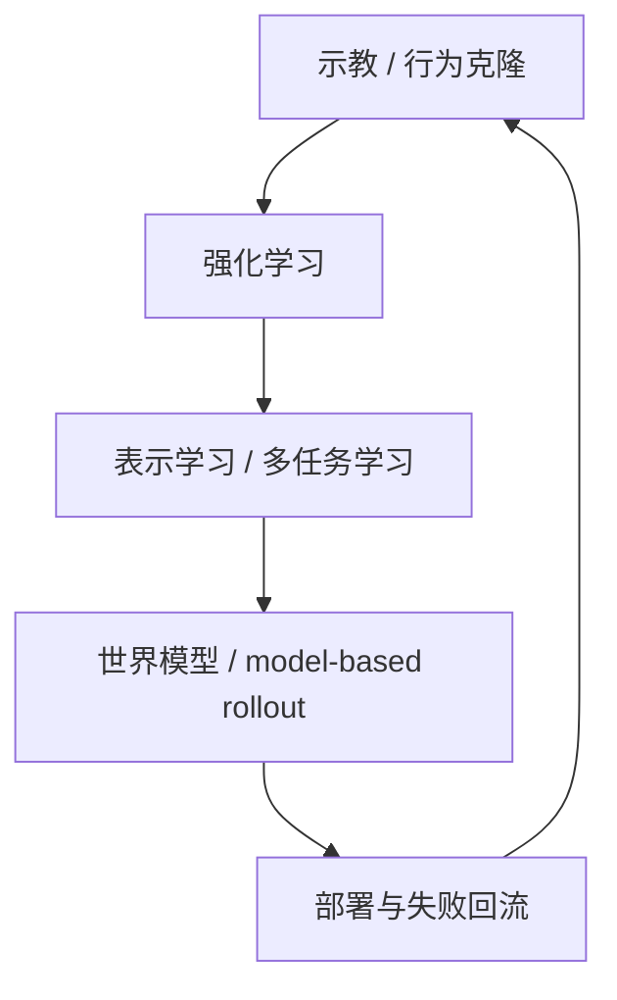

`图 6-1 学习路线与训练闭环演化图` 的意义，在于把两条经常被分开叙述的主线重新并到一起：一条是“模仿学习 - 强化学习 - 表示学习 - 世界模型”的能力演化主线，另一条是“数据采集 - 训练 - 部署 - 回流”的工程闭环主线。前者解释算法范式如何变化，后者解释这些范式为何会在真实机器人系统中表现出不同的可扩展性；只有把两者放在同一张图里，读者才更容易理解为什么某些训练路线在论文上成立，却在部署上成本极高。
3. 代码补充：`行为克隆训练骨架` 与 `value update / model rollout` 的最小伪代码。

## 代码 6-1 行为克隆训练骨架

```python
for obs, action_star in dataloader:
    action_pred = policy(obs)
    loss = mse(action_pred, action_star)

    optimizer.zero_grad()
    loss.backward()
    optimizer.step()
```

## 代码 6-2 value update / model rollout 的最小伪代码

```python
latent = encoder(obs)

for step in range(horizon):
    action = actor(latent)
    latent_next, reward = world_model(latent, action)
    target = reward + gamma * value(latent_next)
    value_loss = (value(latent) - target).pow(2).mean()
    latent = latent_next.detach()
```

这两段代码分别对应本章最重要的两条学习闭环直觉：一条是“直接模仿已有轨迹”，另一条是“在内部模型里先滚动未来，再反过来更新价值或策略”。

---

# 第七部分 对具身系统真正有用的大模型基础

第五部分和第六部分分别说明了具身系统不能绕开的物理约束，以及学习型机器人为何天然走向训练闭环。本部分则要把问题进一步收紧：并不是所有在纯文本或通用多模态任务中成功的大模型能力，都能等价迁移到机器人系统中。真正重要的问题，是哪些能力会进入具身主链路，哪些能力在物理世界中会被重新解释，哪些能力虽然在公开叙事中十分耀眼，却在机器人场景里暂时不应被高估。

因此，本部分不写一章通用大模型综述，而只聚焦那些会直接决定后续 VLA、规划推理和系统架构写法的要素：序列建模、跨模态对齐、语言作为任务接口、高层推理能力，以及这些能力在动作空间与实时闭环中暴露出的新问题。Transformer 之所以成为后续一切统一路线的基础，并不只因为它“模型大”，而是因为它提供了一个足够一般的序列接口，使状态、语言、图像、动作甚至回报都能够被放在同一上下文中处理。[Attention Is All You Need](https://arxiv.org/abs/1706.03762)

但具身系统真正需要的大模型能力，与互联网任务中的“能力排行榜”并不一致。机器人更关心的是：模型是否能把历史观测压缩为可执行上下文、是否能把语言映射成任务结构、是否能在多模态条件下保留物理可执行性、以及是否能在不稳定环境中持续纠错。PaLM-E、RT-2、OpenVLA 等工作的重要性，更多在于它们探索了这些接口如何建立，而不是已经证明了“通用机器人大脑”成熟。[PaLM-E](https://arxiv.org/abs/2303.03378)、[RT-2](https://arxiv.org/abs/2307.15818)、[OpenVLA](https://arxiv.org/abs/2406.09246)

## 32. Transformer 与序列建模

### 32.1 序列建模为何适合机器人数据

序列建模之所以对机器人有吸引力，是因为机器人从来不是静态分类问题，而总是一个随时间展开的闭环过程。观测是时间序列，动作是时间序列，奖励和失败恢复同样是时间序列。Transformer 提供的并不是“更强语言能力”这一单点优势，而是一种把不同时间步信息放到统一上下文中建模的能力。对机器人而言，这意味着系统不必再严格把“感知”“规划”“控制”拆成完全独立的学习模块，而可以尝试在更长时间范围内联合建模它们之间的依赖关系。

一个标准的自注意力形式可写为：

\[
\mathrm{Attention}(Q,K,V)=\mathrm{softmax}\left(\frac{QK^T}{\sqrt{d_k}}\right)V
\]

这个公式的重要意义，不在于它已经足够解释所有机器人序列问题，而在于它提供了一种可扩展的上下文聚合机制：系统可以根据当前 token 与历史 token 的相关性，选择性地调取过去观测、动作或语义信息。这为长时程任务分解、历史轨迹利用和多步纠错提供了统一接口。

### 32.2 自回归策略学习与条件似然
自回归策略学习可以被理解为“把动作序列当成条件序列建模问题”。给定观测、历史状态和任务上下文，模型不一次性输出整条控制轨迹，而是像语言模型那样，按时间顺序一步一步预测下一个动作 token 或动作向量。它的基本训练目标与语言建模高度相似，本质上是在最大化条件似然：

```math
\max_\theta \sum_t \log p_\theta(a_t \mid o_{\le t}, a_{<t}, g)
```

其中 \(o_{\le t}\) 表示截至当前的观测上下文，\(a_{<t}\) 表示历史动作，\(g\) 表示语言目标或任务条件。这个形式的关键价值，在于它天然适合多模态时序数据，也便于把动作预测、语言条件和历史上下文统一进同一序列接口。

一个极简推理过程可以写成：

```python
context = encode(observation, history, goal)
next_action = autoregressive_policy.sample(context)
execute(next_action)
```

一旦把机器人控制写成序列问题，就可以把策略训练重写为条件似然最大化问题。对于离散动作 token 或 chunk token，常见目标为：

\[
\max_\theta \sum_{t=1}^{T}\log p_\theta(a_t \mid o_{\le t}, a_{<t}, l)
\]

其中 \(o_{\le t}\) 表示截至时刻 \(t\) 的观测历史，\(a_{<t}\) 表示历史动作，\(l\) 表示任务语言。这个目标与语言模型表面上很相似，但在机器人里多了两个关键差异：第一，动作错误会通过物理系统放大；第二，历史观测不仅是语义上下文，还是控制可行性的状态依据。因此，机器人中的条件似然优化永远不是“把动作当句子生成”那么简单。

### 32.3 token 化在动作建模中的含义

一旦把机器人问题写成序列建模，就自然会触及动作 token 化问题：动作到底应被视为连续控制量、离散 token、chunked action，还是更高层技能 token？这不是一个纯实现细节，而是决定系统怎样理解动作空间的根本选择。连续动作表示保留了物理精度，但难以直接复用语言模型接口；离散 token 便于统一建模，却可能粗化控制语义；action chunking 则试图在短期控制平滑性与长时程规划之间做折中。

如果把长度为 \(H\) 的动作块写成：

\[
A_t = [a_t, a_{t+1}, \dots, a_{t+H-1}]
\]

那么模型输出的就不再是单步动作，而是一个局部时间窗口中的动作计划。这种写法在机器人中的吸引力在于，它能减轻逐步 autoregressive 生成造成的抖动和误差累积，也更接近很多现实控制器按小时间段执行参考轨迹的方式。ACT、Diffusion Policy 与多种 chunk-based policy 都体现了这一路线的工程合理性。[ACT](https://arxiv.org/abs/2304.13705)、[Diffusion Policy](https://arxiv.org/abs/2303.04137)

### 32.4 上下文窗口与长期任务问题

在具身系统里，上下文窗口的含义比文本任务更具体。文本模型里，窗口不足常表现为“前文忘了”；机器人系统里，窗口不足会直接表现为状态摘要丢失、子任务切换错误、恢复历史丢失和环境变化被误解释。一个抓取失败后的第二次尝试之所以可能更好，并不只是因为“模型又想了一次”，而是因为系统若能保留刚才失败时的位姿、接触状态、遮挡关系和人工纠错信息，就能在下一轮动作生成中避免重复犯错。

因此，长时程机器人任务通常不会把所有历史都原样塞进模型，而会做分层压缩。最常见的做法是把历史拆成三层：

1. 高频控制历史：最近若干步的状态、动作和观测，用于局部闭环。
2. 技能级摘要：上一段技能做了什么、成功还是失败、失败类型是什么。
3. 任务级记忆：当前任务目标、已完成子目标、环境中的关键对象和人为约束。

从系统实现角度看，这意味着“上下文窗口”很少只是一个 tokenizer 长度问题，而更像一个记忆体系设计问题。后文之所以反复出现外部记忆、检索增强、技能日志和失败回流，原因都在这里。

因此，长上下文真正有价值的地方，不在于“窗口更长”本身，而在于系统是否知道哪些历史应被压缩保留、哪些应被丢弃、哪些必须转写到外部记忆中。对具身系统而言，记忆从来不是越多越好，而是越有决策价值越好。一个机器人若把全部视觉帧与全部交互历史无差别塞进上下文，通常只会同时损失时延预算与状态新鲜度；更合理的做法是把关键事件、失败节点、已完成子任务和环境变化摘要化，再把高频控制交给更低层闭环。

语言模型的上下文窗口扩展，在机器人里并不只是“能记住更多文本”这么简单。它对应的是系统能否把更长时间跨度的任务历史、交互历史、失败恢复历史和环境状态变化纳入决策。然而，这里也存在一个根本差异：文本上下文的时间代价通常不直接作用于物理执行，而机器人中的长上下文必须与实时性、状态新鲜度和控制稳定性同时兼容。一个模型即使能回忆几十步之前的任务意图，也不意味着它能在毫秒级控制环上稳定工作。

更严格地说，机器人中的上下文管理问题可以写成一个受资源约束的历史压缩问题。若把历史摘要记为 \(m_t\)，则系统并不是简单保留全部历史 \(h_t\)，而是在带宽、显存、时延和任务价值约束下学习一个压缩映射：

\[
m_t = c_\psi(h_t), \qquad \pi(a_t \mid o_t, m_t, g)
\]

这里真正困难的不是“压缩得更短”，而是“在压缩后仍保留对下一步决策最有价值的信息”。这也是为什么检索增强、事件记忆和任务摘要在机器人里往往比盲目扩窗口更现实。[SayCan](https://say-can.github.io/)、[Code as Policies](https://code-as-policies.github.io/)

进一步说，机器人里的长期任务并不是单一时间尺度的问题，而是至少同时包含三层记忆：毫秒到百毫秒级的控制状态、秒级到分钟级的子任务上下文、分钟级以上的任务与环境历史。把这三层都塞进同一个 transformer 上下文，通常既不经济，也不稳定。更合理的系统做法是把“短环控制状态”留给局部控制器，把“近期任务历史”留给策略模型，把“可检索的关键事件”写入外部记忆或任务日志。

从工程实现角度看，一个更接近可部署系统的上下文更新流程往往类似如下伪代码：

```python
obs_t = read_observation()
local_state = controller_state.update(obs_t)
event_t = detect_key_event(obs_t, local_state)

if event_t is not None:
    memory_bank.write(summarize(event_t))

recent_context = rollout_buffer.last_k_steps()
retrieved_memory = memory_bank.retrieve(task_goal, obs_t)
policy_input = compose(recent_context, retrieved_memory, task_goal)
action = policy(policy_input)
```

这个流程说明，具身系统真正需要的不是“无限窗口”，而是“可筛选、可压缩、可检索、可回退”的历史管理。也因此，后续很多所谓长上下文机器人工作，真正值得看的不是窗口长度数字，而是它如何定义关键事件、如何做记忆读写、以及是否证明这些机制对长期成功率与恢复能力确有贡献。

### 32.5 为什么动作序列与文本序列不能简单类比

这是机器人领域对大模型最重要的纠偏之一。文本 token 的错误，通常表现为语义偏差或事实错误；动作 token 的错误，可能直接导致碰撞、跌倒、抓取失败或对环境造成损伤。文本序列的“近似正确”在物理世界里往往并不够用。因此，把动作建模成序列当然有价值，但动作序列永远带有比文本序列更强的可执行性约束、连续性约束与安全约束。这一差异将直接延伸到后文的 VLA 路线争议。

进一步说，文本允许局部近似正确，因为后续上下文常常还有机会修补前文误差；动作则不同，单步误差会经由接触、摩擦、惯性和机构弹性被迅速放大，并改变后续观测分布。也因此，机器人里的序列建模最终不能只停留在“下一个 token 是否合理”，而必须回到控制意义上的稳定性、可执行性和安全性评价。

如果把文本生成写成离散序列建模：

\[
p(x_{1:T}) = \prod_{t=1}^{T} p(x_t \mid x_{<t})
\]

那么动作建模虽然也常写成类似因子分解，但其真实执行代价更接近：

\[
J = \sum_{t=1}^{T} \ell(x_t, a_t) + \lambda_1 \, \mathrm{Risk}(a_t) + \lambda_2 \, \mathrm{Smooth}(a_{t-1}, a_t) + \lambda_3 \, \mathrm{DynMismatch}(a_t)
\]

这里多出来的 \(\mathrm{Risk}\)、\(\mathrm{Smooth}\) 与 \(\mathrm{DynMismatch}\) 项，恰恰对应物理系统中的碰撞风险、动作连续性与动力学可实现性。文本模型可以主要以似然或偏好建模为目标，但机器人动作若不显式或隐式满足这些约束，就会在真实执行里迅速失效。

这也是为什么很多看起来“像语言模型一样生成动作”的路线，最后仍不得不引入 action chunk、低层控制器、动作滤波器、安全监视器甚至 MPC 后端。它们不是对基础模型路线的背离，而是在承认一个事实：动作 token 只是接口形式上的 token，背后仍然连着连续时间、连续状态和接触动力学约束。

从学习角度看，文本 token 的语义边界往往由离散词表天然给出；动作 token 的边界却常常是人为设计的。我们到底是直接预测关节增量、末端位姿、力控目标、技能标签，还是 latent action code，本身就会改写问题难度。因此，动作序列与文本序列最容易被误类比的地方，不是都能“自回归”，而是忽略了动作表示、执行器、控制频率和安全闭环共同构成了真正的问题定义。

## 33. 多模态表示学习

### 33.1 图像、文本、动作的对齐问题

对具身系统而言，多模态并不是“多放几种输入”而已，而是在回答一个更本质的问题：如何让视觉观测、语言指令、状态量和动作结构进入同一可比较空间。CLIP 的成功说明，大规模对比学习可以让图像与文本在共享语义空间中对齐。[CLIP](https://arxiv.org/abs/2103.00020) 但机器人系统需要进一步回答的问题是：动作应如何进入这套空间？状态量与接触信息如何在其中占据位置？以及共享语义空间究竟应更多承载“理解”还是“可执行性”？

典型的对比学习目标可以写为：

\[
\mathcal{L}_{\mathrm{InfoNCE}} = -\log \frac{\exp(\mathrm{sim}(z_i, z_j)/\tau)}{\sum_k \exp(\mathrm{sim}(z_i, z_k)/\tau)}
\]

这个目标之所以关键，是因为它把“哪些模态片段应被拉近，哪些应被推远”转化为可优化问题。机器人中的多模态表示学习，实质上是在不断回答：什么才算“同一任务语义”的跨模态对应物。

### 33.2 对比学习与生成式建模
对比学习与生成式建模常被并列提及，是因为它们分别代表了两种不同的表征形成逻辑。对比学习更关心“哪些样本应该在语义空间里靠近，哪些应该远离”；生成式建模则更关心“给定部分上下文后，模型能否补全缺失内容”。前者倾向于学到判别性语义结构，后者倾向于学到可条件生成与预测能力。

若写成最小形式，对比学习常见目标可表示为：

```math
\mathcal{L}_{contrast} = - \log \frac{\exp(\mathrm{sim}(z_i, z_i^+)/\tau)}{\sum_j \exp(\mathrm{sim}(z_i, z_j)/\tau)}
```

生成式建模则更像：

```math
\max_\theta \log p_\theta(x_{\text{target}} \mid x_{\text{context}})
```

对机器人来说，这两条路线并不是互斥的。对比学习更适合稳定对齐图像、语言、动作的共享语义空间；生成式建模更适合补全未来动作、视频帧或任务描述。很多现代表征系统其实是在二者之间折中，而不是纯选一边。

从工程角度看，这意味着不能把“表示学得好”和“系统就能用”画上等号。很多对比表示非常适合做召回、聚类和语义匹配，但一旦进入接触级动作生成，系统仍需要额外的动态约束和控制接口；反过来，很多生成模型虽然能重建更丰富的未来，但若无法被规划与执行模块消费，其部署价值仍然有限。因此，在具身系统里，对比路线常常承担“把什么与什么对齐”的职责，生成路线则承担“在对齐之后还能否形成动作条件分布”的职责，二者并不是简单替代关系。

对比学习擅长构造语义分离结构，生成式建模则擅长保留更丰富的条件分布信息。二者在机器人中的分工并不固定：前者更适合表示检索、匹配与对齐，后者更适合视频预测、动作生成和未来状态想象。问题在于，生成得逼真并不自动意味着生成得可执行；对齐得好也不自动意味着动作接口足够稳定。因此，多模态模型在具身系统里的价值，必须始终与可执行性链路一起被检验。
如果从系统职责角度看，两条路线更像不同部件而不是彼此替代。对比学习更适合承担“把什么和什么组织到一起”的职责，生成式模型更适合承担“在这些条件之下可能会发生什么”的职责。前者天然适合检索、路由、聚类与共享坐标系构建，后者更适合未来状态分布、动作分布和多步展开；真正成熟的具身系统往往会把两者组合使用，而不是押注单一路线。

更进一步，如果把对比表示和生成表示分别记作 \(z^{disc}\) 与 \(z^{gen}\)，那么更现实的系统目标往往不是二选一，而是同时满足：

\[
z^{disc} \text{ 便于检索与任务匹配}, \qquad
z^{gen} \text{ 便于预测与动作条件化}
\]

这解释了为什么很多具身系统不会直接把单一 embedding 当成万能接口，而是保留多种中间状态：检索用一种，规划用一种，动作条件化再用另一种。所谓“统一模型”，现实里经常只是“共享一部分 backbone”，而非所有中间表示完全同构。

### 33.3 跨模态共享语义空间

跨模态共享语义空间之所以诱人，是因为它似乎让“看到杯子”“读到 cup”“做出 grasp action”这三件事都能在同一语义坐标中相遇。对机器人来说，这种统一确实有三个直接价值：

1. 可把自然语言指令更自然地投射到视觉对象与任务条件上。
2. 可让跨任务迁移更多依赖共享概念，而不只是共享像素统计。
3. 可让同一对象在“描述、检索、规划、执行”几个阶段使用相近表示。

但共享空间真正困难的地方，在于“语义相近”并不等于“动作可替换”。例如 mug 和 bowl 在视觉语言空间中可能都接近“容器”，但抓取点、重心、摩擦、可堆叠性、是否有把手等性质会让动作空间非常不同。也就是说，跨模态共享语义空间更适合作为任务理解和对象检索接口，而不是直接当作低层控制等价类。

共享语义空间之所以诱人，是因为它为跨平台、跨任务和跨场景复用提供了统一坐标系。但它也会制造一个常见误区：语义上靠近，并不等于控制上可交换。一个“杯子”的图文语义表示可以高度稳定，但不同机械臂、不同抓手和不同场景下的可行动作分布仍可能截然不同。因此，真正有用的共享空间往往不是把所有模态彻底压平，而是在共享语义之上保留足够多的本体与动作条件信息。

这意味着共享空间既要统一，又不能过度抹平执行关键差异。如果统一表示丢失了接触条件、可达性边界、抓取稳定性或时序依赖，那么所谓“统一”就只是表面统一。更合理的目标不是让所有模态都压成同一种抽象，而是在共享语义坐标上保留足够的执行结构残差，使模型既能共享任务意义，又不会误把不同本体上的动作后果视为同一件事。

PaLM-E 的代表性意义之一，在于它尝试把语言、视觉和连续状态信号统一接入到 embodied multimodal language model 中。[PaLM-E](https://arxiv.org/abs/2303.03378) 这类路线说明，机器人领域对多模态的期待已经不再只是“图像辅助语言理解”，而是希望不同模态能够共享一套足够稳定的中间语义结构，使任务理解、环境解释和动作条件化可以在同一模型族中协同发生。

但这里要持续保留一个判断：共享空间只有在“不损失执行关键差异”的前提下才真正有价值。若共享只是把所有模态压扁成统一 embedding，却无法保留本体、接触和时序约束，那它对机器人更像表面统一，而不是可执行统一。

### 33.4 多模态统一接口为何重要但也危险

多模态统一接口之所以重要，是因为它为视觉、语言、动作、状态和记忆提供了共享交换层，使得系统更容易把不同模块组织到同一模型或同一训练范式中。没有统一接口时，每条链路都可能依赖独立数据格式、独立时间轴和独立监督方式，系统很难形成真正可扩展的共用底座。

但它的危险也同样明显。若统一接口是在过于激进的抽象层上建立的，系统就可能把本该保留的物理细节、时间结构和控制约束一并压扁，最终换来表面统一、实则难以执行的表示。因此，接口统一不是越早越好，也不是越彻底越好，而是必须围绕真实可执行性谨慎设计。

统一接口的重要性在于，它确实能够降低模块边界过硬带来的信息损失，也能够提高跨任务迁移能力。但其危险性同样清楚：如果统一接口优先编码的是互联网语义而不是物理可执行性，那么系统看起来可能更懂任务，却未必更会做事。也就是说，统一模态空间越强，越需要持续追问：这个空间究竟在为哪种下游目标服务？

更危险的是，统一接口有时会掩盖真实的跨层不匹配。团队可能因为“图像、语言、状态都已经进了同一个模型”而误以为高层语义对齐已经自动解决了低层执行问题，但实际没有被统一的是时延预算、接触不确定性和安全边界。因此在评估统一接口时，必须明确追问它究竟统一到了哪一层，是仅统一任务描述，还是已经统一到了可执行动作条件。

这也是为什么后文在讨论 VLA、世界模型和大小脑分层时，会反复回到“接口统一到了哪一层”这个问题。统一接口不是目的本身，而是为了降低系统真实复杂性；若它只是把复杂性藏起来，就不应被高估。

## 34. 从 VLM 到 VLA

### 34.1 感知理解能力如何迁移到机器人
感知理解能力迁移到机器人，最大的误区是把“能看懂图像”直接等同于“能支持动作闭环”。对机器人真正有用的迁移，不只是对象识别、场景描述或视觉问答，而是要把感知输出重新压缩成与动作相关的变量，例如可抓取区域、可通行空间、对象关系、阶段性子目标与异常线索。也就是说，迁移不是把 perception 结果原样搬过来，而是重写它的用途。

因此，衡量感知迁移是否成功，更好的问题不是“模型是否更聪明”，而是“它是否减少了后续规划与控制的不确定性”。很多通用视觉语言能力在机器人里依旧有价值，但只有当它们被稳定映射到任务约束与动作接口上时，这种价值才真正成立。

但“迁移”真正成立的前提，是感知模型输出能够被机器人系统转换成带约束的任务对象，而不是停留在开放语义描述层。换句话说，VLM 给机器人带来的最大价值通常不是替代所有感知模块，而是为任务相关对象、关系和场景状态提供更灵活的高层解释接口。例如“哪个是我要拿的杯子”“这个抽屉是否半开”“桌面是否已清空”这类问题，VLM 确实能提供更自然的语义入口；但一旦进入抓取点、接近方向和接触时机，系统仍需回到更具体的几何、状态估计和控制链路。

视觉语言模型的重要性，在于它们为机器人提供了一种更通用的感知理解前端。系统不必再完全依赖任务专用检测器或手工标签规则，而可以借助更一般的视觉-语言对齐能力进行对象识别、场景解释和语义条件化。这正是 RT-2 和 PaLM-E 等工作引发具身智能重新升温的重要原因之一。[RT-2](https://arxiv.org/abs/2307.15818)、[PaLM-E](https://arxiv.org/abs/2303.03378)

更准确地说，VLM 真正迁移过来的不是“控制能力”，而是更强的任务相关场景解释能力。它们让机器人更容易知道该看哪里、该把哪些对象关系送给后续模块，但还不能自动替代几何、状态估计和控制链路。

### 34.2 语言作为任务接口的优势与代价

这意味着语言更适合作为“任务压缩接口”，而不是“执行细节接口”。它擅长表达目标、约束和优先级，却不适合直接承载所有接触细节、时间预算和安全边界。因此，成熟系统往往需要把自然语言进一步转写为更结构化的中间目标与技能调用条件，再由技能层和控制层继续向下展开。若缺少这一层转写，语言接口的灵活性反而会变成执行层的不确定性来源。

语言作为任务接口的最大优势，是它天然适合作为高层任务描述、用户交互和技能调度入口。相较于为每个任务手写状态机和程序模板，语言确实能提供更灵活的人机接口与更自然的任务组合方式。但其代价也同样明显：语言本身是模糊的、不完整的、上下文依赖的，而且往往缺少控制层真正需要的精确执行约束。

如果把语言接口真正下推到系统中，它通常要经历如下转写链：

```python
instruction = "把易碎的杯子放到右边托盘，不要碰倒旁边瓶子"
task_spec = parse_language(instruction)
constraints = ground_constraints(task_spec, scene_state)
skill_plan = bind_to_skills(task_spec, constraints, skill_library)
```

这里 `task_spec`、`constraints` 和 `skill_plan` 往往分别属于不同抽象层。大模型在第一步和第二步最有优势，但第三步开始就要显著依赖本体、技能库和现场状态。也正因此，语言接口的真实价值更像“把人类意图接入系统”，而不是“替代执行接口本身”。

### 34.3 动作输出是最难补上的一环

动作输出之所以比文本输出难得多，可以把它拆成四个工程原因：

1. 文本 token 的错误通常是离散且可延后纠正的，动作错误常常会立刻造成碰撞、滑移或任务失败。
2. 文本生成对时延较宽容，动作生成必须满足控制周期和安全预算。
3. 文本空间天然离散，动作空间往往连续、多峰且与 embodiment 强绑定。
4. 文本结果常常只需“语义大致对”，动作结果则要同时满足几何、动力学和时序约束。

因此，把 VLM 变成 VLA，从系统角度看并不是“多加一个 action head”那么简单，而是要重新回答：动作是连续回归、离散 token、chunk 还是技能调用；错误由谁兜底；模型更新频率和控制器更新频率如何分层；遇到超出分布的状态时系统先停、先问人还是先回退技能。

一个更接近真实系统的抽象接口通常更像：

```python
obs = multimodal_encoder(camera, proprio, history, instruction)
proposal = action_model.sample(obs)
checked = safety_layer.filter(proposal, state_estimate)
command = low_level_controller.track(checked)
```

这里真正决定可部署性的，并不是 `sample()` 这一行，而是后面两层是否存在且是否可靠。
动作输出之所以最难，不是因为它只是“多一个 head”，而是因为它必须把语义理解重新映射回受物理约束的控制接口。图像与文本的对齐主要发生在语义空间中，而动作输出则必须面对执行频率、关节限制、接触稳定性、时延、控制噪声和安全边界。

若把 VLM 到机器人策略的落差写成映射问题，它更像：

\[
(\text{vision}, \text{language}) \rightarrow \text{intent} \rightarrow \text{feasible action}
\]

其中最后一步并不是简单线性投影，而往往需要额外动作表示、技能层或控制层承接。也正因为如此，很多“看懂了任务”的模型，最后仍会在“做对动作”这一环失败。

动作输出难，不只是因为输出维度高，而是因为它一旦出错，代价会立刻通过物理链路放大。文本错误可能只是答案不准，动作错误却可能直接导致碰撞、跌倒、夹持失败或环境损伤。因此，这一层天然需要比纯文本生成更强的约束、过滤与回退机制。这也是为什么很多“从 VLM 到 VLA”的进展，真正困难的部分不在视觉编码器或语言主干，而在动作表示、低时延推理和闭环修正接口。

从 VLM 走向 VLA，看起来只是“再加一个动作头”，但实际上这是整个系统里最难的一步。因为视觉与语言理解主要解决的是语义问题，而动作输出必须同时满足控制频率、连续性、物理可实现性和安全约束。这也是为什么许多看似成功的多模态机器人路线，一旦走到真实动作生成与长期闭环执行时，性能和可靠性会迅速掉下来。

### 34.4 从“看懂”到“做对”中间缺了什么
从“看懂”到“做对”之间缺的，通常不是再多一个识别模块，而是整条从语义理解到可执行约束的转译链。系统必须把“桌上有一个杯子”这种描述变成“杯口朝向、可抓区域、接近路径、碰撞边界、动作后验收条件”等可以驱动执行的结构。如果这条转译链缺失，大模型即使理解正确，也很难稳定地做对。

这也是为什么具身智能中的关键问题常常不在“看不看得懂”，而在“怎么把看懂变成一个可验证、可恢复、可重试的动作计划”。理解能力真正进入机器人，靠的不是名词对齐，而是接口对齐。

从“看懂”到“做对”中间真正缺失的，不只是一个动作解码器，而是一整条把语义理解压缩为可执行闭环的中间链路。系统需要把高层语言目标映射到对象指代、空间约束、时间顺序、技能调用、异常检测与恢复策略，而这些环节任何一处失配，都可能让“理解正确”最终变成“执行失败”。

这也是为什么很多看起来已经具备很强视觉问答或场景理解能力的模型，一旦进入真实机器人闭环后表现会大幅下降。它们缺少的往往不是知识本身，而是把知识嵌入动作、反馈和环境变化中的能力。对具身系统来说，真正稀缺的不是“知道答案”，而是“把答案变成可重复兑现的身体行为”。

中间缺的并不是一个小模块，而是整条可执行性链路：状态估计、动作表示、低层控制、接触建模、异常恢复和安全回退。这一差距解释了为什么“更会看、更会说”的机器人不必然“更会做”，也解释了后文为什么必须单独讨论系统架构、技能层、数据工程和部署约束。

换句话说，很多系统不是只差一个动作头，而是缺整条桥接链：把感知结果变成可用状态、把语义目标变成中层约束、把动作表示接到闭环控制、把失败处理接到恢复与回退。只要这条链上任何一个环节空缺，高层模型即使“理解得更像人”，也很难真正转化为物理世界里的稳定执行。

这一定义几乎可以看作后文 08、11、15 三章的总入口。因为后续很多章节，实际都在拆这条桥接链上的某一个关键缺口。

## 35. 大模型推理能力与机器人规划

### 35.1 指令分解
指令分解可以理解为“把高层自然语言目标重写为一串带约束的可执行子目标”。其关键不是把一句话拆成更多句子，而是让每个子目标都能对应到某个技能、状态检查或资源约束。对具身系统而言，真正有用的分解往往要同时保留顺序依赖、前置条件和失败回退点。

一个最小分解流程通常是：

```python
goal = "把桌面整理干净"
subgoals = decompose(goal, scene_state, skill_library)
for g in subgoals:
    verify_preconditions(g)
```

但好的分解并不是越细越好，而是要与技能层和执行层的真实接口相匹配。若分解粒度与系统可调用技能不一致，模型就会给出“语义上合理、工程上无从执行”的计划。反过来，如果任务分解过粗，系统又会把大量异常恢复压力下压到低层控制，导致执行阶段频繁失稳。因此，具身系统里的指令分解更像“围绕技能接口组织计划”，而不是单纯把一段语言拆成更多句子。

大模型最自然能迁移到机器人的一类能力，是高层指令分解：把“把桌面收拾干净”这类模糊目标拆成对象识别、优先级排序、技能调用和子目标序列。这种能力对于开放场景任务尤其重要，因为机器人系统过去最脆弱的部分之一，正是高层任务接口过窄、组合任务过难手工编排。

### 35.2 常识与世界知识

但常识在具身系统里永远只能作为先验，不能直接当作事实使用。因为真实场景中的对象摆放、可达关系和约束条件常常违背互联网统计常识，机器人若无法用实时观测去覆盖这些先验，就会把“通常如此”误当成“当前如此”。因此，世界知识更适合帮助系统缩小候选解释空间，而不是直接替代状态估计和现场验证。

互联网预训练提供的常识知识，对机器人不是没有价值。它可以帮助系统理解杯子通常放在哪、抽屉通常如何被打开、哪些物体可能易碎、哪些任务步骤通常先后发生。这类知识在 zero-shot 和 few-shot 任务描述理解中确实可能显著提高系统表现。
从系统视角看，常识更像先验排序器，而不是事实数据库。它最适合做的，是在多种解释或多种操作路径之间提供初始偏置，例如优先猜测杯子在桌面而不是天花板上，或优先考虑拉开抽屉而不是抬起整张桌子；但一旦现场观测与先验冲突，具身系统必须允许观测覆盖常识，而不是反过来用常识压制现场状态。

这一点也可写成一个更明确的贝叶斯式视角：语言模型提供的常识更接近先验 \(p(h)\)，而感知系统提供的是现场证据 \(p(o \mid h)\)。机器人真正需要的是后验判断

\[
p(h \mid o) \propto p(o \mid h)p(h)
\]

而不是让常识直接替代观测。换句话说，常识价值在于帮助排序候选假设，却不能越过 grounded perception 直接宣布世界是什么样子。这也是为什么“知识很多”与“现场可靠”是两件必须分开的能力。

### 35.3 错误累积与幻觉在物理世界中的表现
在纯文本或软件环境中，幻觉往往表现为说错、编错或推断错；在物理世界里，它会进一步变成错误接近、错误抓取、错误操作时机或错误恢复策略。更麻烦的是，这类错误会在时序中累积。一次轻微状态误判，经过几步动作传递后，可能变成碰撞、掉落或整段任务失败。

因此，具身系统对“幻觉”的敏感性不是抽象安全问题，而是执行稳定性问题。判断一个系统是否真的把大模型用好，关键不只看它会不会犯错，而要看它犯错后是否会被局部约束、校正机制与人类接管及时吸收，而不是沿着动作链条放大成事故。

在物理世界里，错误累积与幻觉的代价通常远高于纯文本环境。文本模型中的幻觉可能表现为一句错误回答，而机器人中的幻觉则可能表现为误认对象、误估可达性、忽视障碍、错误假设工具状态，最终直接转化为动作失败、节拍中断甚至安全风险。

更棘手的是，这类错误往往不是一次性爆发，而是在长时程任务中逐步积累。前一步的微小误解会成为后一步的错误前提，使系统越来越自信地沿着错误路径继续执行。因此，具身系统中的抗幻觉设计，不只是提高识别准确率，更是要建立持续校验、局部重规划和可接管机制。

但在机器人里，推理错误并不会停留在文字层面。高层任务分解一步出错，后面每个动作都可能建立在错误前提之上；一个看似“合理”的幻觉对象属性，可能导致抓取失败或风险操作。因此，物理世界把原本已经存在于语言模型中的 hallucination 与 error propagation 问题显著放大了。

更棘手的是，错误不只是传播，还会主动改变后续观测分布。一次误判可能把机器人带进训练中很少见的姿态、接触状态或遮挡布局，使后续每一步决策都建立在更陌生的状态空间中。所以具身系统真正关键的能力不是“永不犯错”，而是尽快识别错误、暂停高风险动作、请求澄清并进行局部回退。

这也是为什么具身系统比纯文本系统更需要外部校验、状态监控和可接管机制。因为这里的错误不是只会污染下一句，而是会污染下一段物理历史。

### 35.4 为什么高层推理能力必须重新映射到控制闭环
高层推理能力之所以必须重新映射到控制闭环，是因为机器人执行不是一次性求解，而是持续与世界交换状态的过程。高层模型可以给出目标、阶段划分和异常解释，但若这些结果不能被低层系统消化成时序一致、受约束、可回滚的控制命令，那么再强的推理也只会停留在“会想不会做”。

更现实的架构通常是：高层推理负责改变任务状态与策略分支，控制闭环负责保证局部稳定与快速修正。只有这两层接口被写清楚，大模型能力才会真正变成具身能力，而不是附在机器人上的解释层。

高层推理能力只有重新映射到控制闭环，才会成为真实世界中的有效能力。否则，推理再强也可能只停留在符号层或语言层，对执行器和物理环境没有直接约束力。机器人系统最终面对的不是“是否讲得通”，而是“在噪声、延迟、接触和扰动下是否仍能把目标做成”。

因此，推理层与控制层之间一定需要中间桥接：技能接口、状态机、动作模板、约束求解器、低层控制器或者安全裁剪模块都可能承担这项职责。很多研究叙事之所以容易高估大模型能力，正是因为它们默认这段桥接会自动存在；而现实里，这往往恰恰是最难补齐、最影响部署上限的部分。

这正是后文大小脑分层和程序化中间表示的重要背景。高层推理可以提供任务结构与策略候选，但必须经过某种中间接口，才能进入低层执行链路。若没有这一步映射，推理能力就仍然只是任务建议系统，而不是可靠机器人控制系统。
这一步“重新映射”之所以不可省略，是因为高层推理天然工作在语义一致性目标下，而控制闭环工作在时延、稳定性和安全约束目标下。两者即使都正确，也不是同一种正确。因此，系统必须显式设计把高层子目标翻译成技能调用、约束集合、局部控制参考轨迹或回退条件的中层接口，否则高层智能越强，低层失配风险反而越大。

对后续报告维护来说，这一节也可以作为识别“只会讲高层故事”的过滤器。凡是没有明确说明高层推理如何进入闭环控制的路线，都应默认其距离真实系统还有一段桥接成本。

### 35.5 检索增强与外部记忆为何比“纯靠参数记住一切”更现实

对具身系统来说，纯靠参数记住一切之所以不现实，是因为机器人面对的知识并不只是语言常识，还包括对象位置、近期交互历史、场景局部规则、客户流程约束和当前任务上下文。这些信息大量是局部的、临时的、版本化的，并不适合被永久压进参数。

检索增强与外部记忆因此更接近现实系统需求。它们允许模型把长期通用知识与短期现场知识分开管理，让系统在需要时调取当前环境最相关的状态、文档或历史记录。对机器人而言，这种结构通常比盲目扩充参数量更可维护，也更利于版本更新与现场调试。

在机器人系统中，更现实的方案通常不是让模型参数隐式记住所有任务历史，而是把对象属性、场景拓扑、失败案例和用户偏好外置成可检索记忆。因为这类信息经常随部署场景变化而更新，其新鲜度和可审计性都比参数记忆更重要。也正因为如此，真正对具身系统有价值的大模型能力，往往不是“想得更长”，而是“能在合适的时候读到正确的外部状态”。

外部记忆的现实优势还在于它可更新、可局部修补、可按场景隔离、也更容易做权限和安全治理。对长期运行的机器人而言，这些属性往往比“把一切都压进更大参数量里”更重要，因为现场知识本来就是时变的、局部化的、带上下文边界的。

也正因此，具身系统中的外部记忆应更多被理解为“运行时基础设施”，而不是附属增强项。它直接决定系统能否在多场景、多客户和多版本条件下持续维护知识新鲜度。

## 36. 对具身系统真正有价值的大模型能力清单

### 36.1 任务描述理解
任务描述理解在具身系统里远不只是把一句话解析成标签。系统通常需要从自然语言中抽出目标对象、目标状态、约束条件、优先级、阶段顺序与失败后的修正规则。例如“把桌上的脏杯子放进洗碗池，但不要碰倒旁边的玻璃瓶”包含的不只是主任务，还包含对象筛选、避障约束与风险优先级。

因此，任务理解能力更接近“把语言编译成可执行任务结构”。对机器人有价值的，不是语言模型能复述指令，而是它能否把指令转成后续规划、感知与控制都能共用的中间表示。

任务描述理解在机器人中并不只是“把一句话翻译成语义向量”，而是要识别其中哪些信息对应目标，哪些信息对应约束，哪些信息对应执行顺序，哪些又必须通过环境观察进一步补全。人类一句自然语言指令常常省略了大量默认前提，而机器人若不能显式恢复这些前提，就很容易在早期步骤上偏航。

因此，一个真正有用的任务理解模块，至少应具备三种能力：解析目标对象与关系、推断未明说的操作前提、以及在歧义较高时主动触发澄清或保守执行。否则，语言接口虽然看起来灵活，但系统很容易因为早期误解而在后续动作中放大错误。

这一能力之所以重要，是因为它降低了人与系统之间的接口摩擦。很多过去必须靠菜单、状态机或固定流程配置的任务，现在可以更自然地被表达、澄清和重组，这为后续技能调度与计划修正提供了更高层的公共语义入口。对于长期运行系统而言，这类入口的意义不只是“更方便”，而是它使系统有机会积累跨任务共享的任务描述模板和用户偏好记忆。

因此，任务描述理解并不是一个轻量附属能力，而是很多具身大模型路线最早也最稳定的真实增益来源。它未必直接让机器人动作更稳，但会显著改善任务接口与后续系统组织方式。

能够将自然语言、示范、视觉上下文和历史记忆整合为任务意图，是当前大模型对机器人最现实也最直接的贡献之一。

### 36.2 语义检索与记忆
语义检索与记忆的作用，不是让模型“显得更博学”，而是让机器人在当前控制窗口之外仍能访问长期有效上下文。检索对象可以是任务说明、历史失败样本、对象属性、地图区域说明、工具使用记录或用户偏好。它让系统不必把一切都压进一次前向传播里。

一个最小检索链路可以写成：

```python
query = build_query(goal, observation)
memory = semantic_retriever.search(query)
context = fuse(observation, memory)
action = policy(context)
```

检索增强对具身系统尤其现实，因为很多关键知识其实是局部、时变且现场特有的。例如门把手阻尼、货架布局、用户偏好或近期故障记录，都不应被假定为参数内稳定常识，而应被看作需要持续刷新和可审计调用的外部状态。这也是为什么对机器人而言，外部记忆常常不是锦上添花，而是让系统长期稳定运行的必要组成部分。

与其让模型每次都从头推理，不如让它在历史任务、对象属性、环境拓扑和过往失败案例中做检索增强。这对长期运行系统尤其重要。
机器人记忆真正应该检索的，不只是“知识”，而是带执行后果的经验，例如上次抓同类物体为什么滑脱、哪条接近路径在当前货架布局下更稳定、某个用户偏好是否影响任务优先级。因此，外部记忆在具身系统中天然是多模态、情境化、带时间衰减的，而不是普通问答系统那种静态知识库。

### 36.3 长时程规划

长时程规划的难点，不在于把步骤写得更长，而在于跨时间尺度地维持目标一致性、资源约束和异常恢复逻辑。一个任务持续几十秒乃至几分钟后，环境状态、对象位置、工具可用性和系统内部记忆都可能发生变化，任何早期的小偏差都可能在长链路中积累成整体失败。

对具身系统来说，长时程规划往往必须依赖分层结构：高层负责阶段目标与顺序，中层负责技能选择与重规划，低层负责局部稳定执行。若没有这种分工，单一模型即便能生成很长的计划文本，也未必能在物理世界里稳定穿越多阶段任务。

长时程规划在机器人里本质上是一个“边执行边重规划”的问题，而不是一次性生成完美脚本的问题。越是开放环境，越不可能预先写死所有分支，因此高层模型真正有价值的是维持目标结构与重规划节奏，而不是承诺从一开始就给出完整正确答案。也正因为如此，报告后文在讨论系统架构时，必须把监控、重规划触发器和异常恢复接口视为长时程规划的一部分。

真正有价值的不是“能讲一串步骤”，而是能在执行过程中根据反馈持续修正长时程计划。这一点将直接连接后文的系统架构和安全回退机制。

一个更接近真实系统的最小闭环可写为：

```python
plan = planner(goal, state_summary, memory)
while not goal_done(plan):
    subgoal = plan.current()
    outcome = execute_subgoal(subgoal, state_estimate)
    if outcome.deviation > threshold:
        plan = planner.replan(goal, latest_state(), memory, outcome)
```

这里 `replan` 不是异常分支，而是长期任务的常态组成部分。具身系统中的长时程能力，本质上不是“第一次就规划正确”，而是“在环境变化与局部失败后仍能维持总体任务方向”。

### 36.4 交互式纠错与解释
交互式纠错与解释之所以重要，是因为具身系统长期运行时不可能完全避免误解、误抓或错误阶段判断。系统若能够在失败后解释自己当前理解的任务状态、询问用户要修正哪一部分、并据此更新子目标，那么它就不只是一个自动执行器，而开始具备协作系统的属性。

从工程角度看，解释能力的价值在于降低调试和接管成本。一个能把“我以为你要拿左边杯子，但它被遮挡了”明确说出来的系统，往往比一个只是沉默失败的系统更容易被现场使用者接受，也更容易形成高质量纠错数据。

交互式纠错之所以重要，是因为真实机器人系统几乎不可能一开始就拥有足够完备的场景知识与执行鲁棒性。允许用户、操作者或上层系统在执行过程中插入修正，实际上是在为模型不足预留现实缓冲层。一个能被纠错、会解释、能局部重规划的系统，往往比一个看似更“自主”但一错到底的系统更适合真实部署。

解释能力在这里也不是可有可无的附属能力。它至少应让系统能够暴露当前假设、说明失败原因、指出下一步计划或请求额外信息。只有这样，外部人类或监控模块才有可能高效接管并形成真正的闭环协作。

机器人系统不像纯自动化系统那样总能完全自主运行。能够与人类澄清指令、解释失败原因、请求补充信息和接受中途纠偏，是大模型路线真正可能带来结构性改进的部分。

从部署角度看，这类能力的重要性甚至可能早于完全自主。因为一个会解释、会求助、会局部改写计划的系统，通常比一个沉默但偶尔出错的系统更容易被真实组织接受。

这类能力不只是“体验更自然”，而是直接改善安全与闭环效率。执行前澄清歧义、失败后请求补充观测、动作前解释当前不确定点，都能显著降低高风险错误直接进入控制链的概率。因此，交互式纠错应被视为具身系统的安全和恢复接口，而不仅是对话能力附属品。

### 36.5 哪些流行大模型能力暂时还不应被高估

当前最不应被高估的，至少包括：

1. 长链条文本推理自动等价为长时程物理执行。
2. 通用多模态理解自动等价为高成功率动作生成。
3. 更长上下文自动等价为更稳定闭环控制。
4. 更流畅的人机对话自动等价为更强真实部署能力。

下面给出一个极简伪代码，用来说明“看起来像语言模型推理”的部分，如何被约束到机器人可执行接口上：

```python
prompt = build_prompt(history, visual_summary, task_instruction)
plan = high_level_model.generate_plan(prompt)

for subgoal in parse_plan(plan):
    if not world_state_checker.is_grounded(subgoal):
        subgoal = clarification_or_retrieval(subgoal)

    skill = skill_library.bind(subgoal)
    rollout = skill.execute(state_estimate)

    if not rollout.safe:
        rollback_and_replan(subgoal, rollout.error)
```

这个片段强调的不是某个具体实现，而是一个研究判断：对具身系统真正重要的大模型能力，不是把整条控制链路吞掉，而是把高层语义、外部记忆、任务结构和中层技能接口可靠地接起来。

本部分的结论因此非常明确：大模型确实为具身系统提供了新的高层接口、共享表示和任务推理能力，但这些能力只有在被重新映射到动作表示、技能层、状态估计和控制回路之后，才会转化为真实的机器人能力。后文的系统架构、VLA、规划推理和数据工程章节，实质上都在处理这一步映射问题。

## 图表与接口补充
本章最需要的配图，并不是“大模型能力越来越强”的一般性趋势图，而是“哪些能力经过接口映射后对机器人真正有用”的过滤图。因为对具身系统而言，最关键的不是语言模型会不会解释，而是解释能否落到动作表示、技能库、状态估计和记忆接口上。

同样，`VLM -> VLA` 的差异也不宜只用一句“多了动作输出”带过。更合适的做法，是在后续版本中把两者放进一张接口表里，明确比较输入上下文、输出对象、实时性要求、错误代价和部署方式。这样读者就不会把“视觉语言理解增强”误读为“机器人动作能力自然继承”。

## 图 7-1 大模型能力到具身能力的过滤图

源文件：`assets/diagrams/07-大模型能力过滤图.mmd`

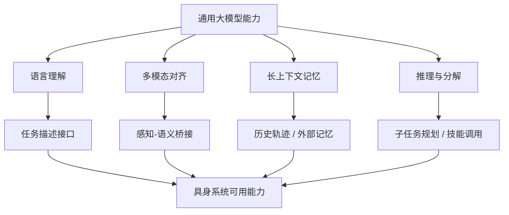

在当前版本中，`图 7-1 大模型能力到具身能力的过滤图` 已承担“文本大模型能力如何被压缩成具身系统可用能力”的主过滤图职责；`表 7-1 VLM 到 VLA 的接口差异表` 则把两者在输入上下文、输出对象、实时性、错误代价与部署方式上的差异正式固定下来。

## 表 7-1 VLM 到 VLA 的接口差异表

见：[07-VLM到VLA接口差异表](D:/Projects/embodied-intelligence-report/docs/report/current/tables/07-VLM到VLA接口差异表.md)

---

# 第八部分 具身智能系统架构与分层接口

到目前为止，报告已经分别从问题定义、历史主线、分类坐标、物理基础、学习基础和大模型基础几个方向建立了分析框架。本部分的任务，是把这些内容压缩成一套可复用的系统架构图景。它不是简单再列一次“感知层、规划层、控制层”，而是要解释：为什么现实具身系统几乎总要采用某种形式的分层；这些层的边界由什么决定；哪些接口在 foundation model 时代被重新定义；以及为什么所谓“统一系统”最终仍常表现为“多个时间尺度不同的子系统协同工作”。

从已有代表性系统看，这种分层并非保守习惯，而是工程现实。Google 的 RT-1/RT-2 更强调从视觉语言输入到动作 token 的高层策略接口，但底层仍依赖机器人执行栈与动作约束；PaLM-E 通过把机器人状态、视觉与语言统一进同一个多模态模型来增强高层语义推理，但并未消除真实控制栈的分层；而 NVIDIA GR00T、Isaac 系列则更明确地把基础模型、仿真、技能与部署基础设施组织成一套多层系统。[RT-1](https://robotics-transformer1.github.io/)、[RT-2](https://robotics-transformer2.github.io/)、[PaLM-E](https://arxiv.org/abs/2303.03378)、[GR00T N1](https://developer.nvidia.com/blog/introducing-nvidia-isaac-gr00t-n1-an-open-foundation-model-for-humanoid-robot-development/) 都说明了一个核心事实：即便“端到端”成为主流叙事，现实系统依然离不开显式或隐式的分层接口。

## 37. 感知层

### 37.1 原始传感输入

原始传感输入之所以值得单列，是因为它决定了后续整条表征链路能看到什么、忽略什么以及以什么时间尺度看到。视觉、深度、力觉、触觉、关节状态、IMU、语言指令和环境日志并不是简单并列的数据流，它们在采样频率、噪声结构、延迟特性和语义密度上差异极大。

对具身系统而言，输入层设计从来不是“多接几个传感器就更强”。输入模态越多，时间同步、带宽管理、融合接口、异常检测和部署成本往往也越复杂。真正有价值的输入组织，通常不是追求模态数量最大化，而是围绕任务边界构造一套能稳定支撑后续状态估计、表征学习和动作生成的观测结构。

具身系统的感知层首先面对的是原始输入的异质性：RGB 图像、深度图、点云、IMU、关节编码器、力觉、触觉和语音等信号具有完全不同的时间尺度、噪声特征和信息密度。因此，感知层的职责并不是“把一切都喂给模型”，而是先把这些信号转化为能被后续系统稳定利用的观测结构。

若把多源观测写成

\[
o_t = \{o_t^{rgb}, o_t^{depth}, o_t^{prop}, o_t^{force}, o_t^{lang}\}
\]

那么架构层的第一件事不是直接学习 \(a_t = \pi(o_t)\)，而是先定义哪些模态必须同步、哪些模态可以异步缓存、哪些模态只在特定技能触发时才读取。也就是说，输入层首先是一个信息调度问题，其次才是模型吞吐问题。

### 37.2 状态估计与环境感知
从系统接口角度看，这一层最重要的不是“感知模型精度有多高”，而是它输出的状态是否足够稳定、足够低延迟、且与后续模块的决策变量同构。规划器并不直接消费分割 mask 本身，而是消费“可达目标位姿、障碍位置、接触候选区域、目标阶段标签”等被组织好的状态变量。也正因如此，同样一个视觉模型，在离线 benchmark 上精度相近，放进两套不同系统里可能表现完全不同，关键差异常常不在 backbone，而在状态组织接口是否贴近执行链条。
状态估计与环境感知的职责，不是简单“把传感器数据处理一下”，而是把原始观测转换成后续模块真正可消费的状态变量与环境摘要。前者更偏向“机器人自己现在在哪里、姿态怎样、速度怎样”，后者更偏向“外部世界里有哪些对象、障碍、可达区域和交互机会”。

可以把这一层抽象成：

\[
\hat{x}_t, \hat{m}_t = f_{\text{perception}}(o_t)
\]

其中 \(\hat{x}_t\) 表示机器人自身状态估计，\(\hat{m}_t\) 表示环境模型或场景摘要。这个分解提醒我们：很多系统失败并不是后面的规划器不够聪明，而是前面提供给它的世界状态本身已经偏了。

感知层和第五部分的状态估计基础直接相连。对于机器人而言，感知从来不只是识别对象，更包括估计身体姿态、目标位姿、环境几何结构、动态障碍和接触状态。也正因为此，感知层的输出往往不是单一标签，而是一组可供规划和控制消费的状态估计变量。

### 37.3 多模态融合
多模态融合的核心问题，不是“把更多传感器堆在一起”，而是如何把相机、深度、IMU、力觉、触觉、本体状态等不同时间尺度、不同噪声特性的信号，整合成一个一致的内部状态。一个常见架构是各模态先独立编码，再通过注意力、拼接、门控或图结构做跨模态融合。

一个极简流程可以写成：

```python
vision = vision_encoder(rgbd)
proprio = state_encoder(joint_state)
tactile = tactile_encoder(tactile_signal)
fusion = multimodal_fuser(vision, proprio, tactile)
```

对具身系统而言，多模态融合真正困难的地方，通常在时间对齐、缺失模态处理和冲突信息仲裁，而不是单纯的“模型层数不够深”。

多模态融合在系统架构中的意义，不是“提高指标”这么简单，而是决定不同下游模块能否共享同一时刻、同一环境、同一任务阶段的统一表征。如果融合失败，后续所有层都可能建立在不同步、不一致或失真的内部世界上。PaLM-E 与 RT-2 之所以重要，不只是因为它们把语言和视觉放在一起，而是因为它们提供了一种把异构观测映射到统一任务接口的范式。[PaLM-E](https://arxiv.org/abs/2303.03378)、[RT-2](https://arxiv.org/abs/2307.15818)

### 37.4 感知层与后续感知专题章节的接口

本章中的感知层讨论，重点不是重复后续感知专题章节的全部技术细节，而是明确系统架构视角下感知层究竟向后续模块提供什么样的接口。也就是说，感知层在这里更像“系统输入组织器”，其核心问题是输出何种状态、何种语义粒度、何种时序同步结果，供记忆、规划、技能调用和控制模块继续使用。

因此，后续第 09 章会更深入讨论视觉、三维感知、触觉、跨模态对齐和状态估计本身；而本章只关心这些能力在系统中如何被封装成稳定接口。把这两层分开，能避免感知章节沦为算法罗列，也能避免系统章节陷入实现细节泥潭。
但这里需要先强调一个总原则：后文所有感知专题，不应被理解为彼此独立的模型目录，而应被理解为对本章感知层接口的拆解。也就是说，第九部分讨论某种视觉 backbone、三维重建方法或触觉阵列时，评价标准不只是“单模块指标是否更高”，还包括它是否改善了状态估计稳定性、时序一致性、与规划层的可对接性，以及在真实部署中的延迟与鲁棒性。这一接口意识会贯穿全书，否则章节很容易重新退化为“按技术名词罗列组件”的写法。

本节只建立架构职责，不展开具体模型路线。更细的视觉、三维感知、触觉和本体感觉问题，将在第九部分具体展开。

这一分工之所以重要，是为了让后文所有感知方法都能回到“它改善了什么接口”这个问题上被评价，而不是只看单模块精度。这样整本书的系统视角才不会在技术细节中被冲散。

## 38. 表征与世界建模层

### 38.1 语义表征

语义表征在具身系统中的作用，不只是把图像或文本压缩成可供检索的 embedding，而是把环境中与任务相关的对象、关系、可供性和阶段信息提炼成可被后续模块反复消费的中间表示。若这一层过弱，高层推理就会频繁回退到原始观测；若这一层过强但过度抽象，又可能遮蔽真正关键的执行细节。

因此，语义表征的关键不在“是否足够像语言模型的 token”，而在它能否稳定承载具身任务真正需要的内容：对象是谁、处于什么关系、当前可做什么、下一步最相关的变化可能发生在哪里。它是系统理解世界的中间骨架，而不是单纯的压缩结果。
对于具身系统而言，语义表征的价值不在于让模型“会描述场景”，而在于让下游决策层能在压缩后的状态空间中直接表达任务约束。例如，语言目标“把红杯子放到托盘上”在系统内部通常要落到对象身份、目标位置、可达性关系和当前任务阶段等状态变量上。若语义表征只保留了视觉分类信息，却没有把“哪一个杯子正在被操作”“哪个支撑面是当前目标”“哪条路径会与人手冲突”这样的任务语义压到内部状态中，那么它对执行层的帮助会很有限。

这一层处理的问题，是如何把原始观测压缩为任务相关的内部状态。语义表征强调对象、属性、关系、功能和任务可读性，使系统能够回答“这里有什么、它们是什么、我能拿它做什么”。

但本章更关心的不是具体表征算法，而是这类表征在系统中承担的职责边界。只要这一层没有把任务相关对象和关系稳定组织出来，后续高层规划就很难真正摆脱原始观测噪声。

### 38.2 物理表征
物理表征可以理解为“对后续动作结果真正有约束力的世界状态压缩”。它通常不止包括对象类别，还包括位姿、接触状态、可抓取性、可达性、关节约束、支撑关系、摩擦条件和动态可变性。换句话说，语义表征回答“这是什么”，物理表征回答“它能怎样被作用、会怎样反作用”。

这类表征常被组织成对象中心或关系中心结构，例如：

\[
z^{phys} = \{(o_i, pose_i, affordance_i, relation_{ij})\}
\]

对机器人而言，这层表征比纯语义标签更接近行动接口，因为策略真正关心的不是“杯子”这个词，而是“这个杯子是否可见、可达、可抓、会不会打翻旁边物体”。
这也是为什么很多在纯视觉问答中表现很强的多模态模型，一旦放到真实机器人任务中就暴露出明显断裂。它们也许能正确回答“桌上有什么”，但无法稳定判断“夹爪是否已经进入安全抓取姿态”“这个盒盖是否仍在接触边缘卡住”“推门时力矩方向是否已经改变”。物理表征的本质，是把环境看作可作用、会反作用、且其状态演化受约束的系统，而不是静态语义集合。对机器人来说，缺失这一层常常不是性能略差，而是根本无法闭环。

但语义表征并不够。具身系统还需要物理表征：几何结构、接触可行性、运动约束、动力学可预测性和环境变化机制。这些对象若没有以某种方式进入内部表示，系统就会更像一个会描述场景的观察者，而不是一个能稳定作用于环境的行动者。

### 38.3 可预测表征
因此，可预测表征的价值不在于“未来重建得多像”，而在于它是否为下游模块保留了决策真正需要的结构稳定性。若一个 latent 在视觉上可重建，却无法稳定区分“即将碰撞”和“仍可安全推进”的候选动作，那么它对机器人规划价值有限。反过来，一个在图像细节上并不完美的表征，只要能稳定承载任务阶段、接触后果和对象关系变化，就可能比更华丽的生成式表征更适合嵌入闭环系统。

世界模型路线之所以重要，正是因为它试图把内部表征进一步组织成可预测结构。若以潜变量状态 \(z_t\) 表示内部世界，则一个典型抽象可写为：

\[
z_{t+1} = f_\theta(z_t, a_t), \qquad \hat{o}_{t+1} = g_\phi(z_{t+1})
\]

其中 \(f_\theta\) 负责潜状态转移，\(g_\phi\) 负责观测重建或任务相关预测。这个写法并不等价于具体实现，但清楚说明了表征层如何开始直接参与预测、规划与策略学习。Dreamer、JEPA 及相关世界模型工作都可被视为这一抽象的不同实现路径。[Dreamer](https://arxiv.org/abs/1912.01603)、[JEPA](https://arxiv.org/abs/2301.08243)

系统意义上的关键点在于：一旦某种内部状态开始承担“预测未来观测、未来奖励、未来可达性或未来接触结果”的职责，它就不再只是压缩表示，而成为后续规划与策略评估的工作空间。于是架构争论也会随之转变成“应该预测什么、在什么抽象层预测、预测结果由谁消费”的问题。

### 38.4 为什么表征层是当前架构分歧的核心之一

当前很多架构分歧，表面看是在争论是不是要用 VLM、world model 或端到端 VLA，实质上却是在争论“系统应该在什么抽象层面组织世界”。如果表征层主要保留像素级细节，系统更容易保真，但推理与规划成本更高；如果表征层过早抽象成高层语义 token，又可能丢失接触、几何和时序上的关键信息。

也正因此，表征层往往是不同路线真正的分水岭。它一方面决定高层模型能否共享统一接口，另一方面也决定低层控制是否还能拿到足够可执行的信息。很多路线之争，归根到底并不是“模型名字不同”，而是“愿意把世界压缩到什么程度、又愿意保留多少可执行细节”的分歧。

当前很多路线之争，本质上都不是在争“是否要表征层”，而是在争表征层应该更靠近互联网语义、更靠近物理状态，还是同时兼顾二者。这一层的设计几乎直接决定后文 VLA、世界模型和规划架构如何组织。

也正因此，表征层可以看作当前很多路线分歧的真正总开关。系统想把世界压到哪里，往往比它用了哪个模型名字，更能解释后续能力边界。

## 39. 任务理解与规划层

### 39.1 指令理解

在系统架构层面，指令理解并不是一个独立的 NLP 小模块，而是高层任务接口的入口关口。它需要把自然语言中的目标、约束、优先级、默认前提和可能的歧义显式化，再交给规划、记忆或技能层继续处理。若这一层做不好，后面所有模块都可能在错误前提上工作。

因此，指令理解真正重要的不是“语句解析是否优雅”，而是系统是否能把一条模糊人类命令转换成可继续验证、可继续分解、必要时可请求澄清的结构化任务描述。只有这样，语言接口才会成为稳定入口，而不是漂亮但脆弱的外壳。
这一转化过程往往包含歧义消解、缺省补全和执行条件绑定。现实中的人类指令并不总是形式化的，例如“把这里收拾一下”“把那个拿给我”“先把危险的东西移开”都需要系统结合当前环境、用户历史意图和可用技能集进行解释。因此，指令理解并不是简单的 prompt parsing，而是把开放语义映射为受约束任务对象的过程。很多系统在 demo 中看起来理解了语言，其实只是命中了高度模板化的数据分布；真正可部署的系统必须把语言理解输出落成显式目标、约束条件和可检查完成标准。

任务理解层处理的是“系统到底被要求做什么”。输入可能来自自然语言、示范、程序模板、任务图或历史记忆。它的职责不是直接产生低层动作，而是把这些高层输入转化为可执行目标结构。

从架构角度看，指令理解最重要的不是语言本身，而是它如何生成后续模块可验证、可回退、可澄清的任务对象。否则语言接口越灵活，系统整体反而越脆弱。

### 39.2 任务分解
架构层里的任务分解，不等于完整规划算法本身，而是规定“高层意图应该以什么中间形式传给技能层”。一个成熟系统往往不会把一句原始自然语言直接下发给控制器，而是先把它改写成阶段化目标、任务图、行为树节点或技能序列。

这一层真正承担的，不只是把任务“拆开”，而是把不确定性重新分配到不同层级。若分解结果仍然保留大量语义歧义，例如“整理桌面”“把东西摆整齐”，那么不确定性就会被推迟到技能执行阶段暴露，最终表现为策略切换频繁、回退条件模糊、失败后难以定位责任层。相反，若高层能够把任务改写成可验证的阶段条件，例如“识别并抓取散落物体”“将同类物体放入指定容器”“确认桌面无遮挡关键区域”，那么每个阶段都拥有更清晰的输入、输出和失败信号。

从系统工程角度看，任务分解最值得关注的是“中间合同”是否清楚。这里的合同不是法律意义的约束，而是层与层之间关于目标表示、前置条件、终止条件和异常处理边界的共同约定。一个好的任务分解接口，应该允许下游模块明确回答四个问题：我现在该做什么；做到什么程度算完成；出现哪些偏差可以局部修正；出现哪些偏差必须回退给上层重规划。没有这类中间合同，系统虽然表面上也能运行，但会在长任务链里快速积累隐性耦合。

一个最小任务分解接口可以写成：

```python
goal = "把桌面整理好"
subtasks = decompose(goal, world_state, skill_catalog)
```

它的关键价值在于，让系统显式区分“理解目标”和“执行目标”两个阶段，从而为后续验证、回退和人工干预留出接口。
从系统工程角度看，任务分解的核心不是“拆得越细越好”，而是拆到恰好能与现有技能层和反馈监控层对接。拆得过粗，下游技能层难以承接，高层推理就会直接面对连续控制细节；拆得过细，则会导致规划器承担大量本应由技能内部处理的执行微结构，使计划冗长、脆弱且难以重规划。因此，任务分解实际上决定了整个系统的责任边界：哪些不确定性由高层承担，哪些由技能内部吸收，哪些必须显式上报给异常恢复模块。

对于复杂任务，系统通常需要把一个目标拆成子任务、子目标、技能调用顺序和异常恢复分支。大模型在这里的价值最为直接，因为它们的长处恰好是高层结构化组织与语义组合。行为树、HTN、程序化技能图等结构之所以重新受到关注，也正是因为它们提供了可检查、可回退、可插入约束的中间层，而不是把一切都压缩为一次性推理输出。[Behavior Trees in Robotics and AI](https://arxiv.org/abs/1709.00084)

### 39.3 短期/长期规划

短期规划与长期规划在系统中之所以要分层讨论，是因为它们处理的是不同时间尺度上的不确定性。短期规划更关注当前状态下几步之内的可执行动作选择、碰撞避免和即时恢复；长期规划则更关注多阶段目标安排、资源使用顺序、记忆调用和阶段切换逻辑。

一个实用的架构理解是：长期规划主要回答“接下来该先做哪一类事”，短期规划回答“为了把这件事做成，下一小段动作应如何组织”。如果把长期计划 \(P^{long}\) 记成子任务图，把短期计划 \(P^{short}\) 记成局部动作或技能序列，则更贴近系统现实的关系往往是：

\[
P^{long} = \mathrm{Plan}_{high}(g, m_t, s_t), \qquad
P^{short} = \mathrm{Plan}_{local}(s_t, \text{subgoal}(P^{long}))
\]

真正困难的地方不在于写出这两个符号，而在于两层之间何时重同步。若长期规划长时间不更新，系统会对局部异常迟钝；若长期规划过于频繁地重算，又会把大量预算浪费在重复解释高层目标上。因此，分层的核心不是“分成两层就够了”，而是为不同时间尺度建立合理的重规划节律。

若这两者混在同一层统一处理，系统很容易要么被短期细节淹没、缺乏全局目标感，要么过度停留在高层计划、缺少局部可执行性。因此，很多具身系统即便采用统一模型，也仍会在功能上保留某种短长时程分工。
更进一步说，长短期规划的分离并不只是为了效率，而是为了让系统能够在不同不确定性层级上做出不同形式的承诺。长期规划可以接受一定抽象和可修正性，例如先整理桌面再收纳工具；短期规划则要面对即时几何、接触和动态避障约束，必须对当前局部运动负责。很多“高层 reasoning 很强但机器人执行仍不稳定”的案例，本质上并不是 reasoning 不够，而是高层输出没有被转换为适合短时程控制器消费的目标形式，导致跨时间尺度接口失真。

长期规划决定“接下来若干阶段要完成什么”，短期规划决定“当前这一段动作该如何走”。在系统架构中，二者往往不能由同一个时间尺度的模块统一承担，否则就会在推理带宽与控制实时性之间发生冲突。

### 39.4 高层推理与低层执行之间的接口问题

高层推理与低层执行之间最棘手的问题，不是“如何连接两个模块”，而是“它们之间到底交换什么信息才不会彼此误解”。高层通常描述目标、顺序和约束，低层则关心姿态、力、接触、时序和可达性。如果接口设计得过于抽象，低层无法稳定兑现；若接口设计得过于细碎，高层又失去统筹价值。

因此，这里真正需要的是中间语义层，例如技能目标、子任务状态、参数化动作模板、约束集合或可验证阶段标记。很多系统表面上看是模型能力不足，实质上问题出在这一层接口语义没有被定义清楚。

这是现代具身架构最关键的断点之一。高层系统可以输出子任务序列、目标位姿、技能索引或程序片段，但这些对象必须通过明确接口进入技能层和控制层，否则高层推理再强，也无法转化为可靠执行。一个常见的接口抽象是：

\[
\pi_{\text{high}}: (o_{1:t}, g) \mapsto s_k, \qquad
\pi_{\text{skill}}: (x_t, s_k, \theta_k) \mapsto a_{t:t+H}
\]

其中高层策略选择技能 \(s_k\)，中层技能策略再结合当前状态与参数 \(\theta_k\) 生成一段动作序列。很多所谓“端到端系统”的实际落地，仍可被解释为这一接口的隐式实现。

如果进一步从时间尺度上看，高层与低层接口至少要同时解决三件事：目标压缩、状态接地和失败回报。也就是说，高层不能只说“做什么”，还必须以某种形式告诉下层“在什么状态下开始、以什么条件判断完成、失败后把什么信号回送给谁”。很多系统之所以在 demo 中看起来很强、在长期运行中却频繁失稳，根源就在于这三类接口变量没有被明确定义。

## 40. 技能与控制层

### 40.1 技能库与技能调用
技能库可以理解为“把高层语义目标和低层控制器之间的大量常用中间能力封装起来”。一个技能可能是“接近目标”“抓取指定物体”“打开抽屉”“导航到工作区”，它既可以是学习得到的策略，也可以是传统规划器加控制器组合。

最小技能调用过程通常是：

```python
skill = skill_registry.bind(subgoal, world_state)
result = executor.run(skill)
```

从架构角度看，技能层最大的作用不是让系统更模块化这么简单，而是把“通用模型的开放语义能力”重新约束到“有限但可执行的动作原语集合”上。
从知识组织角度看，技能库实际上是机器人系统的“可执行词汇表”。它一方面压缩了低层控制复杂度，另一方面也为高层推理提供了可组合对象。若系统没有明确技能层，那么所谓“高层理解任务”的价值会被大幅削弱，因为它缺乏足够稳定的执行落点。当前很多 VLA 或 foundation model 路线，在真实落地时往往并不是彻底取消技能，而是把技能从手工程序块重写为可学习、可参数化、可由语义条件触发的执行单元。

技能层存在的根本原因，是很多机器人系统无法也不应每一时刻都由高层模型直接输出所有连续控制量。技能层把抓取、对位、推门、导航、复位、避障等行为组织为更稳定的中层原语，并允许高层按条件调用。

### 40.2 低层控制接口
这一“最后翻译层”之所以关键，是因为很多高层目标在此处会暴露出它们是否足够可执行。例如“轻拿轻放”如果没有被映射成速度、加速度、接触力、阻抗参数或停止条件，它在控制层面就只是一个空泛语义标签。另一方面，控制接口也会反向塑造高层系统能力：如果底层只接受末端位姿命令，那么高层就倾向于输出几何目标；如果底层支持参数化技能或约束优化接口，高层就能输出更丰富的结构化控制意图。因此，接口形式本身就是架构设计的一部分，而不只是实现细节。

更进一步说，低层控制接口不只是动作通道，也是约束通道。成熟的接口设计通常会同时编码目标变量、容许误差、执行时限、接触或碰撞阈值、以及对环境反馈的订阅方式。只有这样，上层才不至于把“执行”误解为一个黑箱函数调用，而能明确知道底层在什么条件下会减速、停止、换模态或拒绝执行。若接口只暴露动作而不暴露约束，那么系统就会在高层不断生成“理论上正确、工程上危险”的命令。

对具身系统而言，这里还有一个常被忽视的判断标准：接口是否保留了动作语义的可审计性。比如同样是“向前移动 10 cm”，如果底层记录了执行时的目标轨迹、力控状态、异常触发原因与终止模式，那么后续回放、故障诊断和数据再训练都会容易得多。相反，若接口只留下最终成败标签，就很难判断错误究竟来自感知偏差、规划失真、控制震荡还是安全保护过早触发。

因此，低层接口设计时至少要明确四件事：命令变量是什么、刷新频率是多少、允许的约束类型有哪些、执行反馈以什么形式回传。很多看似“模型理解错了”的问题，最后都会追溯到这四项没有被定义清楚。高层如果输出的是末端目标位姿，而低层却缺乏足够稳定的轨迹跟踪与接触补偿，那么系统表面上的高层错误，实则是接口承诺过强。

技能层以下，系统才真正进入控制问题：轨迹生成、阻抗控制、MPC、whole-body control、gripper actuation 等都在这里发生。也就是说，低层控制接口是高层语义与真实物理行为之间的最后翻译层。

一个极简控制接口可写成：

\[
u_t = \kappa(x_t, r_t, \mathcal{C})
\]

其中 \(x_t\) 是当前状态估计，\(r_t\) 是上层传来的参考轨迹或技能目标，\(\mathcal{C}\) 是安全、碰撞、关节、接触等约束集合。这个公式的重点不是控制器形式本身，而是提醒我们：低层接口的基本任务是“在约束下兑现目标”，而不是抽象理解任务。

### 40.3 安全约束与恢复策略
更重要的是，安全约束不应仅被理解为上线前外挂的保护壳，而应是执行图的一部分。系统若只在最外层放一个 `emergency stop`，就只能在严重错误发生后粗暴中断；而成熟系统往往会在多个层级上设置不同粒度的保护，包括动作裁剪、速度限制、工作空间屏蔽、接触阈值监测、技能级超时、任务级回退和人类接管接口。这样系统不是在“成功/灾难”之间二元跳变，而是在多层保护下逐步退化。

恢复策略的重要性与安全约束同级，因为真实部署中的大量失败并不是灾难性碰撞，而是“可恢复的小错”反复出现，例如抓取偏心、接触丢失、局部遮挡、路径被临时阻断或用户指令改变。若系统缺乏恢复策略，就会把这些本可局部修正的问题升级成整任务失败；若恢复链路设计合理，系统则可以在不重启全局任务的前提下尝试重新定位、重新抓取、换路径或回退到上一步状态。

因此，更成熟的评估口径不应只统计“是否发生危险”，还应统计系统在扰动下的退化方式。它是平滑降级、可追踪回退，还是突然冻结、状态丢失、需要人工完全重置？这一差异直接决定了同一模型能力在实验室和生产现场之间的可迁移程度，也决定了一个架构是否真正为长期自主运行做了准备。

恢复策略也不只意味着“失败后重试一次”。更关键的是决定回退到哪一层重新规划，以及哪些失败应被视为能力边界而不是暂时噪声。例如抓取失败后，是重新选抓点、重新定位对象、切换夹具，还是直接请求人工介入，这些对应的是完全不同的系统设计哲学。对长期部署而言，恢复策略的质量往往比单次成功率更能解释系统是否成熟。

控制层不能只负责“完成动作”，还必须负责失败检测、约束满足和回退执行。一个可部署系统通常需要在这里处理关节极限、碰撞监控、接触异常、任务超时和紧急停止等现实问题。

从架构上看，恢复策略至少分三层：局部控制恢复、技能级恢复和任务级重规划。前两者解决短时扰动与局部失败，最后一层才回到高层推理或人工接管。若一切异常都直接上抛到大模型规划器，系统会过慢且不稳定；若所有异常都压在低层，本体又会反复在错误任务前提下挣扎。因此，恢复路径本身也是分层架构必须显式设计的接口。

这也是为什么恢复策略不应被视为“失败后附加功能”，而应被视为架构主路径的一部分。真实可部署系统几乎都在围绕恢复路径设计，而不是围绕理想成功路径设计。

### 40.4 为什么技能层常是“通用模型”落地的真实中介

当前很多基础模型路线真正成功落地的位置，并不是它们直接学会了完整连续控制，而是它们更擅长选择技能、参数化技能、解释技能切换条件。换言之，技能层常常是“通用语义能力”转化为“可部署动作能力”的真实中介。

下面给出一个极简伪代码，说明高层规划器与技能层接口的典型形态：

```python
goal = "pick the red cup and place it on the tray"
plan = planner.generate_subtasks(observation, goal)

for subtask in plan:
    skill_name, skill_args = skill_router.resolve(subtask)
    result = skill_library[skill_name].run(state_estimate, **skill_args)
    if not result.success:
        recovery = planner.repair(subtask, result.error)
        plan = recovery + plan.next_remaining()
```

这个代码片段并不对应某个具体系统，但很好地揭示了现代具身架构的典型现实：高层负责提出结构，中层负责把结构绑定到可执行技能，失败恢复则重新回到规划器。
从工程治理角度看，技能层还有一个常被低估的价值：它天然提供了能力边界的可计数接口。系统到底“会多少事”，并不只取决于大模型的表述能力，也取决于它能稳定调动多少个被验证过的技能单元。若没有技能层，团队往往只能以 demo 感受描述能力；有了技能层之后，就可以按技能覆盖率、技能成功率、技能恢复率和技能调用歧义度等维度做版本化跟踪。
技能层也是多团队协同的组织接口。感知、规划、控制、数据和安全团队往往不可能围绕同一个端到端参数空间高频协作，但可以围绕技能契约协作：谁负责给出技能触发条件，谁负责定义成功判据，谁负责监控超时和异常，谁负责把失败片段回流成训练样本。很多看似“通用模型已经成功落地”的案例，真正支撑其可维护性的恰恰不是模型本身，而是技能层把系统切成了可分工、可测试、可灰度发布的单元。

## 41. 大脑-小脑-脊髓分层范式

### 41.1 语言/推理大脑
更严格地说，“大脑”层不应被神化为一个能吞并所有子系统的统一智能体，而应被理解为高语义密度、低刷新频率的任务组织器。它真正擅长的是整合指令、记忆、工具调用、阶段判断与异常解释，而不擅长毫秒级闭环控制。把这层放对位置非常关键：一旦它被误用为高频控制器，系统会出现明显的延迟、抖动与语义-动作错配；一旦它被约束为“只负责解释与改写高层目标”，反而更容易与技能层、控制层和安全监控层形成稳定分工。
“大脑”这一层更准确的理解，不是单个超大模型，而是承担长期目标理解、上下文整合、任务规划、异常解释和外部记忆调用的高层决策模块。它通常运行频率较低，但每次决策语义密度较高，负责回答“现在整体上应该做什么”。

一个最小接口可以写成：

\[
g_t = \pi_{\text{brain}}(o_t, m_t, u)
\]

其中 \(u\) 是用户目标，\(m_t\) 是记忆或任务历史，\(g_t\) 则是高层子目标或阶段意图。理解这一点很重要，因为它说明“大脑”层输出的通常不是控制量，而是语义化决策变量。
在当前具身热潮中，这一层最容易获得关注，因为它最接近“大模型进入机器人”的直观叙事。但从系统角度看，大脑层并不是因为参数多才重要，而是因为它承担了跨任务语义整合、开放环境解释和与人协作接口这几项传统机器人系统最弱的能力。它能显著提升系统在开放语言、异常对话和任务重说明情境下的适应性，但也天然带来幻觉、目标漂移、接口不确定和高延迟等问题，因此必须被放在一个有边界的分层架构中，而不是被神化为足以替代全部系统模块的单体智能体。

大脑层处理高层任务理解、语义规划、记忆检索和交互式纠错，典型实现可以是大语言模型、视觉语言模型或更复杂的多模态 foundation model。

### 41.2 运动/技能小脑
“小脑”层负责把高层子目标转成更连续、更频繁、更贴近执行器的运动或技能输出。它通常承担技能实例化、局部轨迹生成、误差修正和短时程闭环稳定等职责。若说大脑关心“应该去拿杯子”，小脑更关心“以哪条局部路径接近、怎样闭合夹爪、遇到轻微扰动如何微调”。

把这一层称作“小脑”是有帮助的，因为它提醒我们：这里真正重要的不是语义最强，而是反馈最快、误差吸收能力最强。很多 today 的基础模型路线之所以还离不开技能层，不是因为语义模型不够聪明，而是因为局部误差修正、接触稳定和执行节奏保持，本来就更适合放在高频闭环模块中处理。

一个极简形式可以写成：

\[
a_t = \pi_{\text{cerebellum}}(\hat{x}_t, g_t)
\]

也正因如此，小脑层经常是传统控制、模仿学习策略、diffusion action head 和技能库真正汇合的地方。
如果说大脑层擅长“解释任务”，那么小脑层擅长“把解释过的任务压成可稳定执行的局部行动”。这里的关键不是名称类比本身，而是它强调了一个系统事实：机器人能力要真正落地，往往需要一个既理解上层语义、又尊重本体约束和控制时序的中介层。很多系统失败不是因为没有大模型，而是因为没有一个足够强的中间层把高层意图翻译为局部稳定执行策略。

小脑层负责把高层目标变成可执行的技能计划、局部轨迹或运动原语调用。它通常比大脑更高频、更贴近控制，也更依赖任务和本体特定知识。

### 41.3 反射与稳定控制脊髓
这一层的重要性在双足、人形、移动操作和高接触任务中尤为突出。现实世界不会等待高层模型重新推理之后再决定是否跌倒、是否过流、是否打滑或是否产生危险接触，因此最底层必须保留一套几乎不依赖高层语义的快速稳定机制。它们往往表现为阻抗控制、姿态稳定器、碰撞撤离、限流/限力保护、足底接触切换或快速刹停逻辑。

也正因为如此，许多表面上“端到端”的系统，在工程实现里依然保留了大量硬编码或经典控制形式的安全与稳定回路。这并不是技术落后，而是时间尺度与物理约束共同决定的结果。高层模型决定做什么，底层稳定层负责保证“来不及想的时候不要出事”，两者分工越清楚，整机越可部署。
这一层的重要性在双足、人形、移动操作和高接触任务中尤为突出。现实世界不会等待高层模型重新推理之后再决定是否跌倒、是否过流、是否打滑或是否产生危险接触，因此最底层必须保留一套几乎不依赖高层语义的快速稳定机制。也正因如此，许多表面上“端到端”的系统，实际工程实现中依然保留了大量硬编码或经典控制形式的安全与稳定回路。这并不是技术落后，而是时序与物理约束共同决定的结果。

脊髓层则对应最快、最局部、最不可中断的控制反射：平衡维持、接触稳定、执行器保护、局部回退和安全停机等。它的时间尺度通常远快于高层推理，且更接近经典控制系统。

这一层的存在，本质上说明具身系统永远要为“来不及思考时怎么办”保留答案。只要机器人还处在真实物理环境中，这一层就不会因为高层模型更强而消失，只会随着系统复杂度一起被重新封装。

### 41.4 这种分层方案的优势与局限

分层方案最大的优势，在于它允许不同时间尺度、不同误差容忍度和不同工程职责的模块各自优化。高层负责目标、任务与语义，中层负责技能组合与状态桥接，低层负责稳定执行与安全控制，这种结构通常更容易调试、替换和版本化维护。

但它的局限同样明确。分层越清晰，接口错配的风险就越高：高层可能给出语义上正确但物理上不可执行的目标，中层可能在抽象过程中丢失关键状态，低层则可能因为无法准确理解高层意图而只能做保守补偿。因此，分层并不是天然更先进，而是一种用模块边界换取可维护性的工程选择。

优势在于：

1. 不同时间尺度问题可以分治。
2. 高层大模型不必直接承担毫秒级控制。
3. 低层控制可以保持稳定、可验证、可回退。

局限则在于：

1. 层间接口设计困难。
2. 高层语义可能在中层被过度压缩。
3. 故障责任边界容易模糊。

### 41.5 本部分如何作为后续技术层总接口
这也意味着后文任何具体技术路线，无论是某个视觉 backbone、某个世界模型训练法、某个 VLA 结构，还是某种部署工具链，都不应孤立评价，而应回到本章提出的接口问题上重新审视：它改变的是哪一层的能力边界，减轻了哪一种跨层错配，又把哪些风险转移到了别的层级。只有这样，这份报告才能避免变成“技术名录”，而真正形成一套可持续更新的系统分析框架。

本部分的真正功能，是为后续章节提供公共接口图：

1. 第九部分进一步展开感知层。
2. 第十部分进一步展开世界建模层。
3. 第十一和第十二部分进一步展开 VLA 与规划推理层。
4. 第十三到第十六部分继续展开数据、仿真、硬件与安全基础设施。

也就是说，后续技术层虽然章节众多，但都应被理解为对这里这张分层接口图的逐步放大。

为了让这张接口图真的可复用，后续章节在写作时应默认回到三个问题上重新定位自己：它改变了哪一层、改善了哪一类跨层接口、又把哪些复杂性转移到了别的层级。只有这样，全书才不会在章节增多后重新碎片化。

## 图 8-1 系统分层接口图

源文件：`assets/diagrams/08-系统分层接口图.mmd`

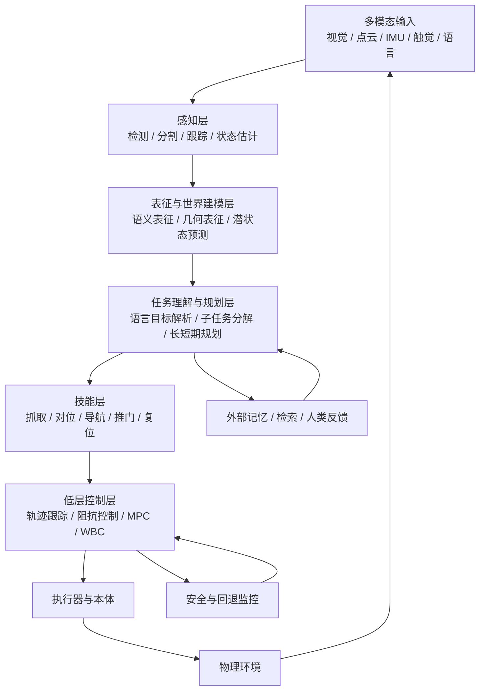

## 图表补充说明
本章的图表不应只是示意图，而应承担“全书公共接口地图”的职责。尤其是“感知 - 表征 - 规划 - 技能 - 控制”的总结构图，最好被反复跨章节引用，用来标明某一技术路线究竟改变了哪一层、减轻了哪一类跨层错配，又把哪些压力转移给了别的层级。

同理，“大脑 - 小脑 - 脊髓分层与时间尺度”的对照图也不是比喻性装饰，而是说明语义推理、技能执行与局部稳定控制为何天然受不同时间常数约束。只有把这个时间尺度差异画出来，后文关于 VLA、世界模型、端侧部署和安全兜底的许多争论才会显得更可解释。

在当前版本中，`图 8-1 系统分层接口图` 已承担第一项职责：它把 `感知 - 表征 - 规划 - 技能 - 控制` 的跨层依赖显式画成一张公共接口图，可作为后续章节统一引用的结构坐标。

`图 8-1` 的第二项核心作用，是把时间尺度差异和跨层反馈链条显式化。它提醒读者：语义推理、技能执行与局部稳定控制并不处在同一频率上，也不应该被同一种接口逻辑统一处理。正因为这些子系统的时间常数不同，具身智能架构才必须强调跨层合同、异步反馈与局部恢复，而不能把“统一模型”误解成“统一执行节奏”。

---

# 第九部分 感知与表示学习

在具身系统中，感知从来不是孤立视觉任务的集合，而是行动系统形成内部世界的入口。一个机器人是否“看见了世界”，并不由它能否输出漂亮的分类标签决定，而由它能否形成足以支持抓取、移动、接触、规划和恢复的状态结构决定。因此，本部分的重点不只是罗列 2D、3D、触觉和多模态模型，而是解释：什么样的感知表征才真正对行动有用，哪些感知成功在部署时会失效，以及为什么表示学习最终会成为感知与后续决策系统之间的真正桥梁。

一个对机器人更贴切的表述是：感知模块输出的不是“标签”，而是状态估计器、规划器和控制器能够消费的内部变量。也就是说，感知的优劣不只体现在感知 benchmark 上，还体现在它是否能提供稳定的位姿、对象边界、接触迹象、遮挡关系和任务相关可供性。Segment Anything、DINOv2、MAE、PointNet、GelSight 等路线之所以值得放在同一章讨论，正是因为它们分别代表了对象级视觉、通用视觉表征、自监督预训练、三维几何表示和接触表征的不同切面。[Segment Anything](https://arxiv.org/abs/2304.02643)、[DINOv2](https://arxiv.org/abs/2304.07193)、[MAE](https://arxiv.org/abs/2111.06377)、[PointNet](https://arxiv.org/abs/1612.00593)、[GelSight](https://arxiv.org/abs/1706.09942)

## 42. 视觉感知

### 42.1 2D 感知任务

检测、分割、跟踪和关键点估计仍然是大量机器人任务的直接入口，因为系统首先需要从图像中定位对象、边界、可抓取区域和动态变化。问题在于，机器人中的视觉感知成功标准并不完全等于 benchmark 精度，而更关心：目标位姿够不够准、遮挡下还能不能工作、视角变化后是否稳定、输出能不能直接服务于下游控制链路。

如果把 2D 感知仅理解为“图像分类和检测任务的机器人翻版”，就会低估其在闭环系统中的真实职责。对抓取任务而言，检测结果最关键的往往不是论文表上的 `mAP`，而是能否稳定提供抓取候选区域、能否在视角变化与局部遮挡后继续完成重定位、能否把对象状态绑定到机器人坐标系；对导航与移动操作而言，分割图也不是为了“看懂图片”本身，而是为了把可通行区域、风险区域和可交互对象结构化地交给局部规划器。也就是说，2D 感知在具身系统里首先是动作前的状态构造器，而不是独立竞赛任务。
这也是为什么开放词汇感知、提示式分割和通用视觉 backbone 会在具身智能语境中重新变得重要。它们不只是提高了视觉模型的泛化性，更重要的是降低了在新对象和新任务上重新搭建对象级接口的成本。但这些路线是否真正有用，仍然要回到机器人标准上检验：跨视角是否稳、与位姿估计是否能闭合、时序上是否足够一致、失败后是否易于重定位，而不是只看静态基准分数。[Segment Anything](https://arxiv.org/abs/2304.02643) [DINOv2](https://arxiv.org/abs/2304.07193)

### 42.2 语义分割、检测与跟踪
这三类任务常被并列提及，但它们为机器人提供的信息层级并不相同。检测回答“哪里有什么”，语义分割回答“每个像素属于什么”，跟踪则回答“同一个对象随时间如何连续存在”。对具身系统而言，很多后续动作并不只需要看到物体，还需要在时间上持续知道“还是不是同一个物体、是不是已经被抓住、是不是离开了原位置”。

一个极简感知链路可以写成：

```python
boxes = detector(image)
masks = segmentor(image)
tracks = tracker(boxes, masks, prev_state)
```

这说明感知输出不只是静态标签集合，而往往是带时间连续性的对象状态接口。
如果进一步从执行接口角度看，检测、分割与跟踪其实对应三种不同粒度的状态承诺。检测告诉系统“对象大概在哪里”，分割告诉系统“边界与可交互区域在哪里”，跟踪则告诉系统“这个对象还是不是刚才那个对象、它是否保持了同一任务身份”。在整理、抓取、递送和装配任务中，这三层信息往往分别对应候选生成、接触准备和闭环重定位。也正因如此，机器人视觉里的“跟踪失败”常常不只是 identity switch 这么简单，而是会直接导致技能层把后续动作施加到错误对象或过时位姿上。

从学习角度看，这三项任务之所以在机器人里必须一起看，是因为它们共同定义了“对象状态”而不是单张图像标签。若检测框太粗，接近轨迹和抓取候选就会受影响；若分割边界不稳，接触区域估计和遮挡推断都会抖动；若跟踪身份漂移，系统就可能在任务执行过程中把“刚才拿起的杯子”和“桌上另一只杯子”混为一谈。对具身系统来说，感知误差往往不是静态分类错误，而是状态接口在时间轴上的失真。

语义分割与检测的意义，在于把场景从像素组织成对象级结构；跟踪则把这一结构延伸到时间维度。对机器人而言，时间连续性尤为关键，因为行动系统通常不是在单帧上决策，而是在持续观测中更新任务状态。Segment Anything 之类通用分割模型当然提高了可迁移性，但其价值在机器人里仍要看能否在实时性、视角变化和下游动作约束下持续工作。[Segment Anything](https://arxiv.org/abs/2304.02643)

### 42.3 第一视角与第三视角差异
第一视角的困难还在于，感知器本身会被动作不断扰动。相机随着机械臂、底盘或头部运动而移动，意味着观测分布和行动分布天然耦合，系统必须在“正在动作导致视角变化”的情形下维持表征稳定。这和互联网视觉中常见的静态观察者假设差异很大。很多模型离线看图很强，但一到真实机器人上就出现“运动中失去目标”“接近后目标被自身末端遮挡”“触碰前最后关键几帧最不稳定”的问题，本质上都和第一视角闭环特征有关。

机器人视觉和互联网视觉一个重要差异在于视角。大量机器人数据来自 egocentric first-person view，而不少互联网视觉模型更多在第三视角数据上训练。二者对遮挡、尺度变化、交互物体可见性和动作上下文的编码方式并不相同。因此，直接把通用视觉模型迁移到机器人上时，第一人称视角偏移常常是一个被低估的问题。

更进一步看，第一视角不只是“相机装在机器人身上”，而是意味着观测过程本身成为控制过程的一部分。系统会为了看清目标而主动移动，会因为接近目标而失去原先视角，也会因为末端执行器进入画面而改变自身观测分布。因此，第一视角机器人感知天然更接近主动感知问题，而不是被动识别问题。也正因为如此，很多在静态数据集上表现很强的 backbone，迁移到真实机器人后仍要额外结合多帧跟踪、重观察策略和动作诱导视角调整，才能进入稳定闭环。

这一定义对后续系统设计也有直接影响。若系统承认第一视角是主动感知问题，那么“感知失败”就不再只对应换一个更强视觉模型，还可能对应改变接近策略、插入重观察动作、或在遮挡发生前主动调整视角。换句话说，感知能力的一部分，其实被写在动作策略里。

### 42.4 自监督视觉表征为何重要
但“有一个强视觉 backbone”并不自动等于“有了可用的机器人感知层”。真正关键的是这些预训练特征能否在小样本微调、跨相机迁移、弱标注适配和下游几何任务中保持稳定；换句话说，要看它们是不是能成为状态估计、抓取候选评估和任务切换判断的底座，而不只是分类或分割头的好初始化。这也是为什么很多机器人系统会把大规模自监督特征与少量任务特定标注、时序一致性损失和几何约束联合使用，而不是直接端上一个互联网视觉 backbone 就期待闭环成立。

更本质地说，自监督表征改变的是“机器人感知先验从哪里来”这一问题。传统路线往往把大量任务知识压在人工标签和专门检测头里，而自监督预训练试图先学习一个更通用的中间世界表示，再通过少量任务监督把它牵引到抓取、导航、状态估计或异常判断上。这样做的价值，不在于完全摆脱标签，而在于显著降低每个新任务都重新定义视觉语义的成本。

对具身系统而言，更重要的判断标准是这些表征是否具备时序稳定性与动作相关性。一个在静态图像 benchmark 上表现极强的 backbone，若在机械臂遮挡、运动模糊、视角变化和接触前后状态切换中频繁漂移，就未必适合作为闭环上游特征。因此，机器人需要的不是“单帧最会看图”的特征，而是“在系统正在行动时仍然可比较、可跟踪、可回放”的特征。这也是为什么视频预训练、跨视角一致性和动作条件表征在具身场景中会比单纯的图像分类迁移更有实际价值。

机器人感知的一个长期瓶颈，是标注太贵、场景太多变、部署分布与训练分布差异太大。因此，自监督视觉表征在具身系统里比在标准视觉任务中更有现实意义。MAE 通过遮挡重建学习 patch 级结构，DINOv2 则更强调可迁移的通用视觉特征；前者更偏表征学习机制，后者更偏大规模稳定预训练产物。对机器人而言，这类基础视觉表征的真正价值，是减少每个新场景都要从头收集密集标注的负担。[MAE](https://arxiv.org/abs/2111.06377)、[DINOv2](https://arxiv.org/abs/2304.07193)

## 43. 三维感知

### 43.1 深度估计
深度估计的最小目标，是为系统补上“场景中各点离相机有多远”这一维信息，从而把 2D 视觉重新锚定到 3D 行动空间。它可以来自双目、结构光、ToF、单目学习模型或多视角重建，不同路线的核心差别在于精度、噪声模式、时延和对环境条件的敏感性。

若写成最简单形式，深度估计就是：

\[
D_t = f_\theta(I_t)
\]

其中 \(I_t\) 是当前图像，\(D_t\) 是深度图。对机器人来说，这个量的真正价值在于后续可被用于抓取位姿估计、障碍距离判断、空间重建和接触前减速，而不只是“把画面变成了三维感”。

二维图像足以支持部分语义理解，但对抓取、避障、操作和导航而言，系统还必须理解空间结构。深度估计是最直接的入口，因为它把像素层面信息转化为几何层面信息。然而，机器人真正关心的不只是“深度图看起来是否合理”，而是这些深度信息是否足够支持可执行的空间推理。

从相机模型角度看，一个像素 \((u,v)\) 对应深度 \(d\) 时，可恢复相机坐标系中的三维点：

\[
X = \frac{(u-c_x)d}{f_x}, \qquad
Y = \frac{(v-c_y)d}{f_y}, \qquad
Z = d
\]

这一关系看似基础，却决定了视觉结果能否进入抓取位姿估计、点云重建与碰撞检测链路。

### 43.2 点云与体素表示
点云与体素表示是把深度信息组织成可计算三维结构的两条典型路线。点云更接近原始几何采样，适合保留细节但不规则；体素则把空间划分成规则网格，便于卷积或占据推理，但会带来分辨率与内存代价。

一个最小转换过程可以写成：

```python
point_cloud = backproject(depth, intrinsics)
voxel_grid = voxelize(point_cloud, resolution)
```

对学习者来说，这一节最重要的不是记住两种表示名词，而是理解：表示选择会直接影响后续抓取、重建、避障和对象级推理的计算方式。

PointNet 及其后续工作说明，点云可以被直接作为集合结构处理，而不必强行投影回二维图像。[PointNet](https://arxiv.org/abs/1612.00593) 对机器人而言，点云、体素和 TSDF 之类表示的意义，在于它们更直接编码了空间邻接、表面结构和碰撞几何，因此常在抓取、建图和局部规划中发挥核心作用。

但从工程角度看，三维表示的难点远不止“如何把点云送进网络”。点云是稀疏且不规则的，局部密度受视角、距离和反射特性强烈影响；多帧拼接又会把时间同步误差、外参误差和运动畸变叠加进表示里。更重要的是，抓取与接触操作真正需要的常常不是抽象的“三维理解”，而是对象表面法向、边缘、间隙、遮挡背后的不确定性以及碰撞几何。于是，一个三维表示是否好用，最终要看它如何进入抓取姿态采样、碰撞检测、接近轨迹生成和接触前可达性筛选。

若把三维表示真正放回执行链路中，它通常至少会流向四类下游模块：对象级姿态估计、局部可达性判断、抓取/放置候选生成，以及碰撞与空间约束检查。也因此，研究者不应只问“这个 3D backbone 在 benchmark 上多强”，而应继续追问它输出的几何结构是否足够稳定地支持这些下游步骤。对机器人来说，可执行性往往比可视化重建效果更重要。
因此，图像、点云和体素在真实系统里往往形成层次化流水线而非彼此替代：图像负责快速给出对象级候选和语义先验，点云/体素负责提供可执行几何，状态估计器再把这些信息绑定到机器人动作坐标系上。很多表面上“端到端”的三维系统，在部署时仍保留显式几何模块，本质原因就在于碰撞、接近和接触可行性这些问题仍然很难被完全隐式吸收。

### 43.3 场景重建与对象级理解

场景重建与对象级理解的价值，在于它把零散感知信号组织成可被操作和规划消费的结构化世界。单帧检测告诉系统“看到了什么”，而重建与对象级建模进一步回答“它们在哪里、相互什么关系、哪些部分可接触、哪些部分构成约束边界”。对具身任务来说，后者往往比前者更接近真正可执行的知识。

也因此，这一层问题不应只被理解为视觉几何研究，而应被理解为“为操作提供世界接口”。若系统无法把环境组织成对象、部件、支撑关系与可供性层次，它就很难稳定地把高层语义落到低层动作上。
这里的关键不只是“能不能重建出地图”，而是重建结果是否以任务可消费的方式组织。对于移动机器人，地图需要回答可通行性、占据关系和目标检索；对于操作机器人，场景重建还要支持对象可达性、遮挡关系和未来接触空间判断。也就是说，场景重建一旦进入具身语境，就必须从几何完成度转向任务结构完成度。很多研究论文展示出漂亮的三维重建，但若这些结果无法稳定进入抓取候选筛选、基座停靠选择或操作前视点规划，那么它对系统主链条的价值就仍然有限。

当系统从瞬时感知走向长期操作，就需要把多帧观测整合成更稳定的场景表示。对象级重建、局部场景图和语义地图于是开始变得重要。这一步会自然连接到后文的世界模型与环境记忆：三维感知若不能形成可累积结构，就很难支持长时程任务。

也就是说，场景重建在具身系统里最关键的价值，并不是把环境“看得更完整”，而是把后续规划、记忆和技能调用需要的空间结构稳定沉淀下来。只要这一沉淀做不好，机器人就仍会在每一步都重新从原始像素开始理解世界。

### 43.4 三维感知的真实难点
三维感知最容易被低估的地方，在于它并不只是“把二维识别升级成点云识别”。一旦进入机器人闭环，三维表征必须同时承担几何定位、遮挡推断、可抓取性判断、碰撞风险评估和接触前姿态规划等职责。也就是说，三维感知的输出不是纯粹为了“看懂场景”，而是为了后续动作决策提供可执行结构。

真实难点通常集中在四处。第一，传感器噪声与遮挡会使局部几何严重不完整，尤其在透明、反光、黑色或柔性物体上更明显。第二，不同传感器坐标系、刷新率和视场角不一致，导致多源融合远比静态 benchmark 复杂。第三，机器人真正关心的不是场景几何本身，而是与动作有关的那部分几何，例如接触面、可通行空隙、受力方向与支撑稳定性。第四，三维估计误差会被后续控制放大，因此“几厘米误差”在操作任务里常常已经不可接受。

因此，三维感知最重要的不是追求越来越复杂的表示名词，而是明确表征究竟服务于哪类动作接口。若后续控制需要的是接触前局部精几何，那么全局语义场景图未必是最紧迫的；若任务更偏导航与场景理解，则可通行拓扑和对象关系图反而更重要。三维感知的价值必须放回动作闭环里判断。

三维感知的难点远不只是“比二维更复杂”。它真正棘手的地方在于，深度缺失、遮挡、反光、透明材质、视角稀疏、传感器噪声和动态物体会同时作用，使得系统很难始终得到稳定、完整且可操作的三维结构。对许多任务来说，最关键的恰恰是那些最难被稳健观测的局部几何细节。

这也是为什么很多纯视觉演示在三维接触任务前会迅速暴露边界。三维感知不是给系统“多一个酷炫表示”，而是在为接触、对位、插接、抓取和避障这些真实动作提供必要的空间约束基础。
进一步说，三维感知的难点常常集中在那些对执行最关键、却在数据集中最少被认真覆盖的角落条件上。例如，玻璃杯边缘、塑料袋、柔性包装、餐具堆叠、反光金属件、部分嵌套零件，这些对象往往恰恰出现在真实抓取和装配场景里。它们会同时破坏深度估计、点云完整性和接触可行性判断，因此系统级应对方式通常不是寄希望于单一三维模型一次解决，而是通过多视角观察、动作诱导重观察、触觉补偿和失败后重定位来形成鲁棒闭环。

机器人中的三维感知难点并不只在“网络结构不够强”，而在于透明体、镜面反射、细长物体、局部遮挡、接触后物体姿态变化与近距离视角退化。这意味着三维感知系统若只在干净点云 benchmark 上表现出色，并不能自动说明其适合部署在真实操纵系统中。

## 44. 触觉、力觉与本体感觉

### 44.1 触觉传感器路线

触觉传感器路线之所以始终没有真正退出机器人主线，是因为它们承担的是视觉难以替代的那部分信息通道。无论是接触是否发生、局部受力方向、滑移趋势，还是物体表面微结构和材料变化，这些信号常常只有在接触之后才真正可见，而这正是许多操作任务的决定性阶段。

不同触觉路线在分辨率、带宽、耐久性、成本和集成复杂度上差异很大，因此问题从来不是“要不要触觉”，而是“在哪些任务上、以什么成本结构、接入怎样的控制闭环”。触觉路线的复兴，本质上是任务约束把它重新拉回了中心。
从系统设计角度看，触觉传感器路线的分化也很重要。有的路线强调高分辨率表面形变成像，适合精细接触几何推断；有的强调阵列式压力分布，适合低成本接触检测与滑移趋势判断；有的则嵌入灵巧手或末端夹爪内，用于把抓取稳定性反馈更早送回控制环。不同触觉路线并不存在简单的“一种更先进”，而是对应不同时间尺度和接口需求。对具身系统来说，真正关键的是触觉信号能否足够快、足够稳地参与动作修正。

视觉擅长远距离观测，却难以在接触发生后持续提供局部精确信息。触觉路线因此重新受到重视，因为许多最困难的操作问题恰恰发生在视觉已经不够用的接触阶段。GelSight 一类高分辨率视觉触觉传感器的价值，就在于它能把局部接触形变转化为可学习的丰富信号。[GelSight](https://arxiv.org/abs/1706.09942)

### 44.2 力反馈与稳定抓取
力反馈之所以重要，是因为抓取成功并不只取决于“夹爪碰到了物体”，还取决于接触力是否分布合理、是否出现滑移、是否已经过压、是否需要重新调整姿态。视觉常能告诉系统“抓到了哪里”，但力反馈更能告诉系统“现在抓得稳不稳”。

一个极简闭环可以写成：

```python
while grasping:
    force = read_force_sensor()
    grip = grip_controller(force, slip_estimate)
    apply(grip)
```

这也是为什么许多精细操控任务会重新强调力觉与触觉，而不是继续只靠视觉外推接触状态。

力觉不仅用于“感知接触到了什么”，更用于判断当前抓取是否稳定、接触是否滑移、装配是否卡滞。很多高精度操作的真正难点，并不是看不见对象，而是在看见之后仍然难以在接触中维持合适作用力。

如果说视觉更擅长回答“我应该从哪里接近”，那么力觉更擅长回答“我现在是否已经稳定接触上了”。插孔、旋拧、卡扣、柔性物体整理、半遮挡抓取等任务的真正难点往往并不是感知对象类别，而是接触一旦发生之后，系统如何根据受力变化及时修正位置、姿态与作用力。没有这一层反馈，机器人常会表现出一种典型失败模式：接近阶段看起来都正确，真正接触之后却迅速滑脱、卡滞或过载。
在系统接口上，力觉的重要性通常通过阻抗控制、混合力位控制、接触事件检测和局部回退状态机进入控制层。也因此，力觉不应被理解为“视觉之外多加一条传感器”，而应被理解为接触任务中的主导反馈模态之一。

### 44.3 本体状态估计与闭环控制

本体状态估计是感知和控制之间最容易被忽略、却最关键的中间层之一。机器人不仅要理解外部世界，也必须持续理解自身关节、速度、姿态、接触状态和执行器实际响应，否则外部感知再强，动作执行也可能建立在错误身体假设上。

因此，本体状态估计不只是低层工程细节，而是具身系统保持闭环稳定的身体自我感知机制。它越可靠，高层策略与外部感知提供的信息才越可能真正兑现为稳定行为。
这一点在大模型叙事中经常被低估，因为本体感觉看起来不如视觉语言输入那样“智能”。但从控制闭环角度看，本体状态往往是最硬、最即时、最不可替代的状态来源。双足行走中的重心转移、机械臂奇异位姿附近的速度放大、末端执行器过流、驱动温升与接触前振动，很多都是先在本体信号里出现，再晚一步才在外部世界中表现出来。因此，真正稳健的具身系统往往不是“用视觉替代本体”，而是用本体状态构成底层稳定骨架，再把外部感知叠加到更高层决策上。

本体感觉包括关节位置、速度、电流、姿态、触地信息和执行器内部状态等。对足式运动、全身控制和动态操作而言，本体感觉常常比外部视觉更直接决定短时稳定性。也就是说，机器人“知道自己现在在做什么”的方式，不完全来自看世界，也来自感知自身。

### 44.4 为什么接触感知在具身智能里会重新升温

接触感知重新升温的直接原因，是大模型和视觉表征虽然显著提升了“看”的能力，却没有自动解决“碰”的问题。大量真实任务的成败，恰恰发生在视觉难以完全观测的局部接触瞬间，例如抓取时的滑移、插接时的微小对位误差、柔性物体受力后的形变以及工具与物体之间的隐式约束关系。

因此，触觉与力觉并不是旧路线的残余，而是在更高层语义能力增强之后重新暴露出来的基础短板。系统越想从“会看懂任务”迈向“会稳定做成任务”，就越需要把接触相关信息重新纳入观测与控制闭环中。

从大模型叙事回看机器人，很容易高估视觉语言能力、低估接触感知的重要性。但真正困难的操作任务往往都在接触瞬间暴露边界：插孔、旋盖、理线、布料整理、半遮挡抓取、精细装配几乎都离不开力觉与触觉。也正因为如此，触觉并不是“额外模态”，而是某些任务里决定成功上限的主模态。

这股重新升温还有一个更现实的原因：随着 VLA、通用策略和开放任务接口变强，系统在“接近正确对象、到达大致正确位置”这一步上的能力正在改善，于是剩余瓶颈自然集中到最后几厘米、最后几牛顿、最后几度姿态误差上。换句话说，高层能力越强，接触阶段暴露出来的短板反而越明显。也因此，未来很多具身系统的竞争点可能不再只是“能不能看懂任务”，而是谁能在接触瞬间保留更高的反馈密度与恢复能力。

这一点也使触觉与力觉不再只是“补充模态”，而更像决定系统是否能跨过最后一段执行鸿沟的关键反馈层。对于很多高价值任务，这一层很可能比再增加一层语义理解更直接决定上限。

## 45. 多模态表示学习的关键问题

### 45.1 跨模态时间对齐
跨模态时间对齐的本质，是保证图像、关节状态、力觉、触觉和动作指令描述的是“同一个时刻附近的同一系统状态”。如果相机帧比控制命令慢了 100 毫秒，或者触觉数据与动作日志错位，模型学到的就可能不是因果关系，而只是错误相关性。

这个问题可以用一个极简但很有用的量来刻画：

```text
Δt_align = max_i |t_i - t_ref|
```

其中 `t_ref` 是参考时间轴，`t_i` 是第 `i` 个模态的有效时间戳。若 `Δt_align` 相对于控制周期、接触持续时间或关键状态切换窗口不可忽略，那么训练样本在语义上就已经被破坏。比如抓取接触只持续几十毫秒，而视觉与触觉错开上百毫秒时，模型看到的“图像 - 接触”关系可能根本不是同一次事件。

工程上，跨模态对齐不只是后处理里的重采样问题，还包括统一时钟、记录采样延迟、补偿通信抖动、标记 dropped frame，以及在回放系统中保留原始时间戳。因为真正有价值的失败分析，往往不是看“平均对齐后的数据好不好看”，而是定位“究竟哪个模态先漂了、漂了多久、是否足以改变动作决策”。

最小对齐问题可以写成：

\[
(o_t^{vision}, o_t^{proprio}, o_t^{tactile}, a_t)
\]

这里关键不是符号本身，而是这些量是否真对应于同一时间窗。很多多模态模型效果不稳，根因并不在架构，而在数据时间轴已经先错了。

机器人中的多模态不是静态拼接问题，而是时间对齐问题。视觉帧率、IMU 频率、关节反馈频率、触觉采样率和语言交互频率完全不同，若这些信息在时间轴上对不齐，下游模型学到的往往不是跨模态一致结构，而是噪声相关性。

若以观测缓存 \(\{o_t^{(m)}\}\) 表示模态 \(m\) 的时间序列，一个常见融合目标可以抽象为：

\[
z_t = f_\theta\left(o_{t-\Delta_1:t}^{(1)}, o_{t-\Delta_2:t}^{(2)}, \dots, o_{t-\Delta_M:t}^{(M)}\right)
\]

关键不在于把所有模态喂进一个编码器，而在于每个时间窗口 \(\Delta_m\) 是否与该模态对任务的有效时间尺度匹配。

### 45.2 稀疏监督与弱监督
稀疏监督与弱监督之所以在机器人感知里重要，是因为真实场景下高质量逐帧三维标注、像素级语义标注和跨模态精对齐标签的成本都极高。很多系统不可能像自动驾驶头部项目那样长期投入海量人工精标，因此必须依赖更廉价但噪声更大的监督信号，例如抓取成败、任务完成标签、语言描述、轨迹对齐或跨视角一致性。

从学习目标上看，弱监督的价值不在于“省标注”，而在于把监督重新设计成更接近任务结果的信号。例如，一个抓取系统未必需要每个接触点都有精确标签，却可能需要大量“这个姿态最终抓起/没抓起”的结果反馈。相应地，表示学习也会从纯重建式目标转向结果导向式目标，把表征质量与可执行性更紧密地绑定。

但弱监督并非免费午餐。监督越弱，模型越容易学到伪相关，例如背景纹理、固定工位偏置或某类物体的偶然共现模式。因此本章讨论感知方法时，必须同时追问监督稀疏之后用了什么结构性约束，例如时序一致性、多视角几何、自监督预测、接触结果回传或跨模态对比学习，否则“少标注也能学”很容易被高估。

很多机器人任务没有精细标注，或者标注成本极高，因此表示学习必须更多依赖自监督、弱监督、时序一致性和任务结构。这里的关键不在于“能不能少标注”，而在于系统是否能在稀疏监督下仍然学出对行动有用的表征。

机器人语境中的“监督稀缺”不只是人工标签少，更关键的是很多真正重要的标签本来就很难显式定义。例如，“这次接近为何会在未来两步后失败”“这个对象当前是否处于可装配姿态”“该接触在未来是否会滑移”都很难由静态标签穷尽描述。于是，未来一致性、动作条件预测、失败后果、可达性变化和对比式状态区分，都会成为替代性监督信号。
这解释了为什么具身系统中的表征学习往往不是单一损失问题，而是面向任务闭环组织的多目标优化：既希望保留语义可迁移性，又希望保留与动力学和动作后果相关的结构，还希望在传感器缺失、场景变化和噪声扰动下保持稳定。所谓“好特征”，在机器人里最终不是由图像语义本身定义，而是由它能否稳健服务后续行动定义。

从工程实现上看，这也意味着很多机器人表征学习不会依赖单一金标准标签，而会组合使用时序一致性、跨模态对齐、动作条件预测、失败对比样本和少量人工关键帧标注。真正的目标不是把监督做得“更省”，而是把监督预算投到最能改变闭环成败的地方。对长期维护型项目而言，这种弱监督体系还直接关系到数据闭环的可持续性，因为后续章节中的数据工程和失败回流都建立在这种监督现实之上。

### 45.3 数据缺失、噪声与传感器漂移
对机器人感知系统而言，数据问题通常不是“有噪声”这么简单，而是缺失、噪声和漂移会长期并存。缺失意味着某些关键信息根本观测不到，例如遮挡后的目标局部几何；噪声意味着观测值存在随机波动；漂移则意味着误差会随时间累积，例如相机外参轻微变化、深度尺度偏移或力传感器零点变化。三者对应的补救方式并不相同。

如果把观测写成
\[
\tilde{o}_t = h(o_t) + \epsilon_t + \delta_t
\]
那么 \(\epsilon_t\) 可理解为随机噪声，\(\delta_t\) 更接近慢变量漂移，而 \(h(\cdot)\) 本身还可能因为遮挡与缺测而不可逆。很多实验只在 \(\epsilon_t\) 上做数据增强，却忽略了 \(\delta_t\) 和缺测机制，因而在长时间部署后快速失稳。

因此，真正成熟的感知系统不能只依赖离线训练鲁棒性，而必须配套在线校准、健康监控、异常检测与多源冗余。对于具身智能而言，传感器漂移不是边角问题，而是长期运行中几乎必然出现的系统性约束。谁能把漂移纳入日常维护闭环，谁的感知能力才更接近可交付能力。

具身系统中的感知问题，很少发生在“理想输入完全错误”的极端情况，更常见的是数据间歇缺失、模态不同步、标定逐步漂移以及局部噪声长期累积。单次看似很小的偏差，在长时运行和多模态融合中会不断传递，最终影响状态估计、抓取定位和策略稳定性。

这也是为什么很多实验室里表现不错的感知模型，一旦进入长时程现场运行后就会显著掉线。真正成熟的感知系统不仅需要高精度模型，还需要监测传感器健康、识别漂移、触发重标定和在信息不完整时做保守退化运行的机制。
因此，具身感知系统的鲁棒性不应只靠训练时“加点噪声增强”来理解，更应被看作一套跨层工程策略：传感器层的校准与健康监测、表征层的缺失补偿与不确定性估计、规划层的保守决策边界，以及执行层的失败恢复机制共同决定了感知噪声最终会不会演化为系统错误。换句话说，噪声不是感知模块自己的问题，而是整个具身闭环如何吸收不确定性的试金石。

真实机器人系统中的感知链路从来不是干净数据集：遮挡、反光、模糊、失焦、IMU 漂移、力觉噪声、触觉磨损和通信延迟都会长期存在。因此，表示学习若只在理想化数据条件下成立，就很难支撑长期部署。

### 45.4 感知输出究竟应该长什么样
这其实是整个具身系统设计中的根问题之一。感知输出可以是像素级特征图、对象列表、场景图、潜空间向量、占据网格、抓取候选集合，或者它们的组合。不同选择决定了后续规划器和控制器“看见的世界”长什么样。

一个实用判断框架是：

1. 若后续需要精细操控，输出应保留几何与接触相关信息。
2. 若后续需要长时程规划，输出应保留对象身份、关系和历史摘要。
3. 若后续需要部署可诊断性，输出应尽量带置信度、时间戳与异常标记。

换句话说，感知输出不是单一最优格式问题，而是系统分层设计问题。很多路线争议表面上是在讨论 perception model，实则是在讨论“世界应该在系统里以什么形式被表示”。这也解释了为什么同样一套视觉 backbone，在不同机器人架构中会被包成截然不同的中间接口。
2. 若后续需要长时程任务组织，输出应保留对象级与关系级语义。
3. 若后续需要端到端训练，输出还要兼顾可微与可学习接口。

因此，感知输出形式本身就是架构设计，而不是感知模块做完以后再随手封装的附属品。
把这一点说得更明确一些，机器人感知输出更接近“可执行状态接口”，而不是“高维特征本身”。一个真正好用的输出往往要同时满足几件事：能被下游规划或控制直接消费，含有必要的不确定性或置信度信息，能在多帧间保持身份与几何一致性，并能在失败后支持重定位与重解释。因此，报告后文在讨论 VLA、世界模型或技能库时，都应反过来问一句：这些上层能力到底消耗的是什么感知接口，如果接口定义不清，上层能力很容易只是表面统一。

这也是具身感知与通用视觉最大的分歧之一。对互联网视觉而言，一个全局语义 embedding 往往已经足够；对机器人而言，更有用的输出通常是对象级、位姿级、可供性级或接触风险级的结构化变量。也就是说，“好的视觉特征”与“好的机器人感知输出”并不完全等价。

下面给出一个极简代码片段，示意如何把深度图转为点云并送入下游估计器：

```python
def depth_to_pointcloud(depth, fx, fy, cx, cy):
    points = []
    h, w = depth.shape
    for v in range(h):
        for u in range(w):
            d = depth[v, u]
            if d <= 0:
                continue
            x = (u - cx) * d / fx
            y = (v - cy) * d / fy
            z = d
            points.append((x, y, z))
    return points
```

这段代码当然过于简化，但它很好地说明了一个事实：机器人感知永远要从“图像被解释”走向“几何被计算”，再走向“动作被约束”。

本部分的结论是：感知与表示学习在具身系统中的价值，根本上取决于它能否生成对行动有用、对时序稳定、对多模态一致、对部署扰动有韧性的内部状态结构。也正因为此，第十部分关于世界模型和第十一部分关于 VLA 的讨论，都应被视为在这些表示之上继续构造更高层能力，而不是替代感知问题本身。

## 图表补充说明
本章后续配图最有价值的方向，不是再补一张泛泛的感知模块堆叠图，而是把 `2D / 3D / 触觉 / 本体感觉` 的多模态接口关系画清楚，尤其强调它们在时间同步、对象级对齐和动作约束中的不同作用。这样读者更容易理解为什么机器人感知不是“多加几个传感器”这么简单。

另一个值得正式纳入正文的比较，是“机器人感知成功标准”与“通用视觉 benchmark 成功标准”的差异。前者更关心可执行状态是否被正确提取，后者更关心识别或预测精度本身。把这两个口径放进同一张对照表，会直接帮助读者理解为什么通用视觉高分并不自动等于机器人可部署感知。

在当前版本中，`图 9-1 感知到动作的状态漏斗图` 已承担多模态接口图的正文职责：它并不只是罗列传感器种类，而是把原始观测、对象级状态、任务相关表示与可执行状态之间的压缩链条显式化，从而更贴近机器人系统真正关心的接口问题。

“机器人感知成功标准”与“通用视觉 benchmark 成功标准”的口径差异，则已整理为 `表 9-1 机器人感知成功标准 vs 通用视觉 Benchmark 成功标准对照表`，用于稳定支撑本章关于“高视觉分数不自动等于高部署价值”的核心判断。
## 图 9-1 感知到动作的状态漏斗图
源文件：`assets/diagrams/09-感知到动作的状态漏斗图.mmd`


## 表 9-1 机器人感知成功标准 vs 通用视觉 Benchmark 成功标准对照表

见 [09-机器人感知成功标准对照表](D:/Projects/embodied-intelligence-report/docs/report/current/tables/09-机器人感知成功标准对照表.md)。

---

# 第十部分 世界模型、环境建模与可预测表征

在学习型机器人和多模态基础模型之间，世界模型路线扮演着一个非常微妙的角色。它既不像传统控制模型那样完全显式，也不像纯感知模型那样只负责当前观测解释，而是试图让系统形成一种能压缩环境、预测未来、支持规划的内部状态结构。也正因为这个位置特殊，世界模型在当前具身智能叙事中既被寄予厚望，也被广泛误读。

本部分的目标，不是把“世界模型”当作一个新口号，而是澄清三个问题：它到底在建模什么，它与控制模型、仿真器和 VLA 有什么区别，它在哪些地方真正有价值，又在哪些地方暂时还不应被高估。

从谱系上看，世界模型并不是今天才出现的概念。Ha 与 Schmidhuber 的 World Models 通过潜空间与梦境 rollout 强化了“内部环境”这一想法；Dreamer 则进一步把潜动态模型和策略学习耦合；JEPA 路线则把重点从像素重建转向抽象表征预测。[World Models](https://arxiv.org/abs/1803.10122)、[Dreamer](https://arxiv.org/abs/1912.01603)、[JEPA](https://arxiv.org/abs/2301.08243) 这些工作共同说明，世界模型真正关心的不是“看起来像世界”，而是“是否保留了足以支持决策和规划的可预测结构”。

## 46. 世界模型的基本定义

### 46.1 什么是“世界模型”
这个定义里最关键的限定词其实是“对决策有用”。如果一个模型只能生成看起来合理的未来画面，却不能改变动作排序、风险筛选或训练数据价值评估，那么它更像生成器而不是机器人意义上的世界模型。相反，一个模型即便不产出漂亮视频，只要能稳定回答“哪一个候选动作更可能成功、哪一个更可能越界、哪一段 rollout 已经不可信”，它就更接近本报告讨论的具身世界模型。
在本报告语境里，世界模型可以先用一个朴素定义把握：它是机器人对“如果我这样动作，世界接下来大概率会怎样变化”的内部可计算近似。这个近似既可以在像素空间里预测未来，也可以在潜空间、语义空间或接触状态空间里预测未来。关键不在表示形式，而在它是否为后续规划、控制或数据生成提供了可用的因果近似。

一个最小抽象可以写成：

\[
\hat{s}_{t+1}, \hat{r}_t = f_\theta(s_t, a_t)
\]

如果状态 \(s_t\) 不直接可得，则往往先引入编码器，把观测 \(o_t\) 映射为潜状态 \(z_t\)，再在潜状态中预测转移。
这一定义之所以值得反复强调，是因为近两年“世界模型”一词被过度扩张，几乎任何能做未来建模、视频生成、隐状态更新或序列预测的系统都可能自称世界模型。但对机器人来说，真正有意义的判据始终是：它是否帮助系统减少真实试错、提高候选动作评估质量，或者增强对环境演化的结构化掌握。若做不到这些，只能说明模型具有某种预测能力，还不能说明它已经进入具身主链条。

对具身系统而言，世界模型最朴素的含义，是系统内部存在某种可预测环境和状态演化的模型，使它不仅知道“现在看到什么”，还能够在一定程度上回答“接下来可能发生什么”。这一定义比“能生成视频”更宽，也比“有隐藏状态”更严格，因为关键不在于压缩本身，而在于这种压缩是否支持未来预测和行动决策。

### 46.2 世界模型与控制模型、仿真器的区别
世界模型、控制模型和仿真器看起来都在“预测未来”，但职责并不相同。控制模型更偏向低层局部动力学近似，常服务于 MPC、轨迹优化或解析控制器；仿真器则是更完整的环境生成与交互平台，需要负责物理、传感器、对象和任务脚本；世界模型通常处在二者之间，它不一定要求全物理保真，但要求对决策真正相关的未来结构做出紧凑、可学习、可调用的预测。

对学习者来说，可以先把三者粗略区分为：

1. `控制模型`：偏低层、局部、服务控制器。
2. `仿真器`：偏完整环境、可交互、服务训练与评测。
3. `世界模型`：偏可学习内部预测器、服务规划与表征。

控制模型通常更关注局部动力学和可控性；仿真器更关注完整环境重现；世界模型则往往更强调任务相关压缩和内部可预测性。三者当然可以重叠，但不能混同。一个模型可以生成看似逼真的未来视频，却未必适合控制；一个高保真仿真器可以很准确，却未必适合作为学习型内部状态表示。

从接口角度区分，控制模型最关心的是“给定当前状态与控制输入，短时局部动力学如何演化”；仿真器最关心的是“机器人与环境在更完整物理约束下如何共同演化”；世界模型则更像折中体，它不追求重建一切细节，而追求把对任务与规划最关键的未来结构压缩到一个可以快速推演的内部表示里。目标函数不同，评价标准也不同：控制模型看可辨识性与稳定性，仿真器看保真度与覆盖率，世界模型看规划可用性与分布外泛化下的结构是否仍可靠。
这一点在阅读文献时尤其重要。某些“video world model”本质上更像生成式未来观察器，某些 latent dynamics model 更像策略学习辅助器，某些数字孪生系统虽也预测未来，却主要服务于测试和验证而非内嵌闭环策略。若不先问清一个模型最终服务于控制、评测、数据生成还是内部规划，就很容易把不同问题设定下的结果误放到同一比较坐标系。

### 46.3 世界模型在机器人中的主要用途
这四种用途虽然常被放在一起讨论，但它们对模型质量的要求并不相同。若只作为训练期辅助环境，模型可以容忍更强的近似误差，只要它能提供有用梯度或额外样本；若直接参与在线规划，误差容忍度就会急剧收紧，因为错误会立即转化为错误动作评估。若作为失败恢复分析工具，模型则需要对异常后果和可回退分支更敏感，而不一定追求逼真重建。因此，阅读相关论文时，先识别“世界模型到底打算被用在哪个环节”，几乎是理解其价值的前提。

主要用途至少包括：

1. 作为策略学习的辅助内部环境。
2. 作为规划 rollout 的未来近似器。
3. 作为观测压缩与任务相关状态表示。
4. 作为数据增广或失败恢复分析工具。

如果再往系统职责上细分，可以把它们理解为四种不同的消费方式：训练期消费、规划期消费、诊断期消费和记忆期消费。训练期消费更看重样本效率和表征质量，规划期消费更看重候选动作排序是否稳定，诊断期消费更看重失败后果与风险解释，记忆期消费则更看重长期状态压缩和任务阶段跟踪。这个区分有助于避免把所有“能预测未来”的模型都用同一把尺子评价。

## 47. 动力学建模与潜空间预测

### 47.1 观测空间与潜空间
因此，潜空间设计最需要追问的不是压缩率，而是“保留了哪些任务相关不变量”。对机器人来说，这些不变量往往不是纹理，而是对象身份、相对位姿、接触阶段、可达性关系、风险趋势和动作后果类别。潜变量若无法携带这些量，就算重建得再好，也很难服务规划；潜变量若只对当前任务过拟合，又会损害跨场景复用。这种张力解释了为什么后文很多路线会围绕 object-centric latent、predictive state representation、task-conditioned latent 展开分化。
观测空间与潜空间的差别，决定了模型是在“直接看原始世界”，还是先“压缩出一个更适合预测与决策的内部世界”。观测空间里的变量往往是高维、冗余、含噪的，例如图像、点云和多传感器原始流；潜空间则是编码器学习出来的低维内部状态，目标是保留与控制相关的信息，同时丢弃大量无关细节。

一个最小映射关系可以写成：

\[
z_t = e_\theta(o_t), \qquad \hat{z}_{t+1} = f_\phi(z_t, a_t)
\]

这里最重要的不是“压缩得小”，而是“压缩后是否仍保留可达性、接触、对象关系和任务阶段等对决策重要的结构”。

在高维视觉和多模态观测下，直接在原始空间预测未来往往既昂贵又脆弱，因此世界模型常常先把观测映射到潜空间 \(z_t\)，再在潜空间中建模时间演化：

\[
z_t = e(o_t), \qquad z_{t+1} \sim p_{\theta}(z_{t+1}\mid z_t, a_t)
\]

这个结构的意义，在于它试图把“什么对未来最关键”压缩进内部状态，而不要求像素级重建一切细节。

### 47.2 一步预测、多步预测与 rollout
一步预测关注“下一步会怎样”，多步预测与 rollout 关注“如果我连续做一串动作，未来一段时间会怎样演化”。前者通常更容易训练，因为误差只跨一个时间步；后者更贴近规划需求，因为真实机器人决策往往关心一整段动作后果。

其最小 rollout 过程可以写成：

```python
latent = encoder(obs)
for action in candidate_actions:
    latent = dynamics(latent, action)
    imagined_states.append(latent)
```

也正因此，很多世界模型论文虽然首先报告一步预测误差，但真正决定系统能否用于规划的，往往是多步 rollout 是否稳定。
这里还隐含着一个常被忽略的接口问题：rollout 不是为了把未来完整演一遍，而是为了给某个决策变量提供比较依据。也就是说，多步预测是否有价值，取决于它是否改善了动作排序、风险筛选或计划修复，而不取决于它是否生成了“更长更像真的未来”。这一区分很重要，因为许多生成式模型在视觉上极具说服力，却未必在决策排序上比简单短视估计更可靠。

一步预测往往较容易，但世界模型真正有吸引力的地方在于多步 rollout：系统可以在不真实执行的情况下，对未来若干步结果做内部想象。这一点对高代价机器人任务尤其诱人，因为真实试错很慢，内部 rollout 看似提供了一条更廉价的规划路径。

若在潜空间中做 \(H\) 步 rollout，则可写为：

\[
\hat{z}_{t+k+1} = f_\theta(\hat{z}_{t+k}, a_{t+k}), \qquad k=0,\dots,H-1
\]

并通过某个任务头 \(r_\phi(\hat{z}_{t+k})\) 评估回报、风险或任务进展。

这段公式真正想表达的，不是“世界模型会自己产生价值”，而是它只有在后面接上决策评价头时才有系统意义。也就是说，rollout 的目的并不是做未来电影，而是比较候选动作的后果差异。若模型无法稳定区分“这个动作会撞上障碍”和“那个动作更可能顺利接触目标”，那么即便它能生成长而连贯的未来片段，也未必值得在机器人系统中承担核心职责。

### 47.3 长时程误差累积问题

但多步 rollout 的根本问题同样明显：每一步小误差都会继续传递，最终使远期预测迅速失真。也就是说，世界模型越被用作长时程推演工具，就越必须面对累积误差和分布外偏移。

这里最容易产生的误解，是把“预测图像越清晰”与“决策支持越可靠”等同起来。对机器人而言，远期 rollout 的真正价值并不在于每一帧都像真实视频，而在于它能否保持关键决策顺序的稳定性，例如哪条路径更可能避开障碍、哪个接触策略更可能导致滑脱、哪个动作序列更容易把系统带入不可恢复状态。换言之，长时程预测的有效性首先体现在相对排序是否正确，而不是像素级还原是否精细。

工程上应对误差累积的思路，通常不是盲目把 rollout 拉得更长，而是限制模型承担的时间尺度，并让其与闭环校正机制耦合。例如只在若干关键决策节点做有限步 lookahead、在每次新观测到来后重置隐状态、或把世界模型用于候选动作筛选而不是端到端控制。这样做等于承认模型的远期可信度有限，但仍尽量保留其在局部后果评估上的系统价值。

因此，在阅读相关论文或产品宣称时，一个更稳健的判断问题是：该世界模型究竟被部署在什么时间尺度上，它的误差会如何被观测更新、控制反馈或安全约束吸收？若这些问题没有被回答，那么“支持长时程推演”的表述通常更接近一种研究愿景，而不是已经可交付的系统能力。

在机器人里，这个问题比纯视觉预测更严重，因为系统不会只“看着模型出错”，而会真的按照错误预测去行动。短期偏差可能只影响下一帧重建，但闭环执行会把这种偏差进一步放大，并把机器人推向训练中更少见的新状态分布，随后模型又在这个更偏的分布上继续预测，于是形成典型的 closed-loop compounding error。
这也是为什么真实系统中的世界模型通常不会被当作“远期全知模拟器”，而更像带不确定性边界的有限视距评估器。工程上常见的缓解策略包括短视重规划、风险头估计、模型集成、保守候选筛选与不确定性触发回退，而不是盲目拉长 rollout 长度。

若把单步预测误差记为 \(\epsilon_t\)，那么多步 rollout 的有效误差通常会近似呈累加甚至放大趋势：

\[
\|\hat{z}_{t+H} - z_{t+H}\| \lesssim \sum_{k=0}^{H-1} L^{H-1-k}\epsilon_{t+k}
\]

这里的 \(L\) 可以被粗略理解为动力学映射对误差的放大系数。即使单步误差不大，只要系统对偏差敏感、或 rollout 足够长，整体误差就会迅速劣化。这也是为什么很多机器人世界模型最终更适合承担短视重排序、局部风险筛选或训练期辅助角色，而不是直接接管很长时域的在线控制。

\[
\|\hat{z}_{t+H} - z_{t+H}\| \not\approx \epsilon_t,
\qquad
\text{often grows with } H
\]

这不是形式化上必须线性增长，而是提醒我们：哪怕单步模型“还不错”，也不能直接推断长时程规划就可靠。对机器人而言，关键不是把 rollout 做得尽可能长，而是找到在当前误差水平下仍具决策价值的预测视距。

### 47.4 隐状态是否真的学到了“物理”
更严格地说，我们更关心的是“是否学到了对行动后果稳定有用的物理”，而不是“是否长得像物理”。一个潜状态不需要显式长成质量、摩擦系数、法向力这样的可解释变量才可能有用；但如果它在动作改变、接触发生、外界扰动出现时无法保持结构稳定，那么它再难解释也很难用于可靠控制。因此，对具身系统而言，物理性的判据最终是干预下的预测稳定性与任务可用性，而不是视觉可解释性本身。

这是世界模型争论中最关键的问题之一。一个潜状态可能非常有利于短期预测，却并不等于它编码了可解释的物理变量；它也可能只是“对当前训练分布足够有效”的压缩表示。因此，世界模型是否真的学到了与对象、接触、动力学因果机制相关的结构，必须依靠泛化表现、规划效果和干预鲁棒性来判断，而不能只凭重建或预测视觉效果下结论。

更可操作的判断方式是看这种隐状态在动作干预下是否保持结构稳定。例如，当接近路径改变、抓取方向改变、接触是否发生发生变化时，模型内部状态是否还能维持对后续结果的可区分性。若内部状态只在被动视频延续条件下稳定，而一旦动作改变就迅速崩塌，那么它更可能是视觉统计压缩，而不是行动相关结构表示。

这也意味着，对世界模型的评价不能只停留在“预测误差小不小”，而要追问“在动作改变时内部结构是否仍然有用”。对具身系统来说，真正稀缺的是行动相关稳定性，而不是被动观察下的压缩优雅性。

## 48. 视频预测与生成式环境建模

### 48.1 视频生成作为世界建模的路径
把视频生成视为世界建模的一条路径，吸引力在于它提供了一个直观目标：让模型预测“下一步世界会长成什么样”。若模型能在长时间尺度上生成与动作条件一致的未来观测，人们自然会期待它内部已经学习到足够有用的动力学、因果与可供性结构。

但机器人场景中最大的风险是把“视觉上逼真的未来帧”误判成“对控制有用的世界模型”。对动作决策真正关键的，未必是像素级纹理细节，而是接触前后的状态转移、可达约束、碰撞边界和任务结果变量。一个模型即使能生成很像真的视频，也可能没有把最关键的动作可执行信息稳定编码出来。

因此，视频生成路线更适合作为世界建模的一个可观测代理，而不是充分定义。对机器人而言，最重要的追问永远是：这个生成模型能否支持规划、反事实评估、异常预判或数据合成，而不是它生成的视频是否“像电影”。如果不能反哺动作闭环，那么它更像通用视频建模，而不是真正服务具身系统的世界模型。

视频生成路线吸引人的地方，在于它看起来提供了一种统一表述环境变化的方法：只要系统能预测未来帧，就似乎同时掌握了对象运动、遮挡变化、交互结果和任务后果。这种统一性对研究者极具诱惑，因为它让世界建模问题被重新包装成了大规模视觉生成问题。

但从机器人角度看，视频生成真正有价值的前提，是它生成的变化必须与动作条件、接触约束和因果后果有稳定对应关系。否则，模型学到的更可能是“视觉上像未来的画面”，而不是“行动后真的会发生的未来”。因此，视频生成是世界建模的一条路径，但不是世界建模本身。
这条路线的真正吸引力，在于它天然承接了互联网规模视频预训练与生成模型基础设施，使世界建模不再完全依赖机器人专属数据。也就是说，它为“先在开放世界学未来变化结构，再向具身任务迁移”提供了看似可行的桥梁。问题在于，这座桥梁往往更擅长迁移视觉统计规律，而不是迁移可执行交互规律，因此必须特别警惕“开放世界未来感”与“机器人可执行未来”之间的错位。

随着生成模型能力上升，视频预测开始被视为世界建模的一条自然路径。原因很直观：如果模型能根据当前观测和动作生成未来视频，那么它似乎就“知道世界会怎样变化”。

### 48.2 diffusion/video model 的优势与代价

生成式视频模型的优势，在于它们能表达更丰富、更高维、更不确定的未来分布；代价则在于训练昂贵、推理昂贵，而且生成逼真并不自动意味着预测对控制有用。对机器人来说，最关键的问题不是生成视频看起来是否自然，而是这些未来是否保留了任务相关的物理可执行结构。

扩散与视频生成路线之所以极具吸引力，是因为它们似乎天然拥有开放世界建模能力。面对复杂背景、多对象交互和长尾视觉变化，它们确实往往比简单重建式 latent model 更有表达力。但机器人规划并不消费“像真度”本身，而消费与动作后果相关的结构变量，例如可抓取性、碰撞风险、接触后稳定性与局部几何一致性。只要这些变量没有被稳定编码进去，再漂亮的未来视频也可能只是视觉幻觉。
因此，更严格的评价问题是：这种生成模型能否被压缩成低时延、可条件控制、可被策略反复查询的规划接口。如果不能，它更可能是一种研究资产、数据生成器或分析工具，而不是立即可落地的闭环核心。

从系统工程角度看，它们的主要代价至少包括三类：第一是训练与推理成本高，难以进入高频在线环；第二是预测对象往往过于“视觉化”，与控制变量之间还隔着一层接口翻译；第三是评价口径容易被视觉说服力误导。也就是说，视频生成模型最容易赢得演示效果，却最需要在规划价值和控制可消费性上被额外严格审查。

这一定义对后续阅读很多“world model + video”路线特别重要。只要没有回答它如何进入规划接口、是否满足时延预算、以及是否优于更简单的结构化预测，那么它就仍更像研究资产，而不是系统核心部件。

### 48.3 生成逼真不等于物理正确

生成逼真不等于物理正确，这是世界模型研究里最容易被忽略的基本事实。一个视频可以在视觉上非常连贯、纹理细节丰富、对象外观自然，却仍然违反接触约束、质量守恒、刚体运动规律或任务逻辑顺序。对旁观者来说它“像真的”，对机器人来说它却可能没有足够的决策价值。

也正因为如此，世界模型不能只按人类主观观感来评价。真正关键的问题是：它的预测是否保留了对动作后果最关键的可验证结构，是否能支撑规划、筛选候选动作和评估风险，而不是仅仅生成一段漂亮的未来片段。
对于操作任务，这种错位尤其严重，因为很多成败恰恰由肉眼不显著的局部物理决定。例如，夹爪与物体边缘的相对姿态差几毫米、摩擦方向略有变化、插孔对位误差在视觉上几乎看不出，但它们足以让一个任务从成功变成卡住或滑脱。视频生成模型若只在宏观视觉连贯性上成功，却不能稳定表达这些微观结构，对机器人规划的帮助就会十分有限。

这是世界模型讨论中最容易被忽视的一点。一个模型可以生成肉眼看来“合理”的对象运动，却在接触细节、动力学约束、可抓取性和时间同步上全部失真。于是，生成美观的未来与提供可用于控制的未来，常常是两件不同的事。

对学习者而言，一个很实用的区分方法是：先问这个模型是否在“控制相关变量”上正确。所谓控制相关变量，可能是接触是否发生、可达区域是否改变、对象是否被稳定抓住、障碍物是否进入危险区，而不一定是整段视频看起来多自然。只有把评价口径从“像不像”改成“能不能支持动作判断”，世界模型章节才不会退化为生成模型章节的附庸。

### 48.4 为什么视频预测在开放世界里诱人

视频预测在开放世界里之所以诱人，是因为它似乎绕开了显式状态设计的痛苦。面对开放环境、长尾物体和复杂场景时，研究者很难手工定义一套完备状态变量；而视频作为统一观测表述，看起来天然能覆盖所有变化。这使得它在开放世界中具备很强的“接口统一”吸引力。

不过，这种诱惑也伴随风险。视频预测越通用，越容易把真正重要的可执行结构淹没在大量视觉细节中。对于机器人而言，开放世界不只需要“预测更多”，还需要在预测中保留那些与行动选择直接相关的因果骨架。

尽管问题很多，视频预测仍然有吸引力，因为它天然适合容纳开放环境中的对象变化、背景变化和多种可能未来。在互联网时代训练出来的大规模生成模型，也让“未来想象”这件事在技术上更可行。但对具身系统来说，这条路线能否成立，最终仍要看它是否能被压缩成规划可用、时延可接受、可与动作接口闭合的内部结构。

换句话说，视频预测真正迷人的地方，在于它提供了一种看似统一的世界接口；而它真正危险的地方，也在于这种统一过于诱人，容易让人忽视“统一到了视觉层，不等于统一到了行动层”。这也是本章坚持把视频生成和抽象预测分开讨论的原因。

## 49. JEPA 与抽象预测路线

### 49.1 不重构像素而预测语义
这一类方法的核心出发点，是承认“像素级重建并不一定等于控制相关预测”。如果任务真正关心的是对象是否可达、是否被遮挡、是否发生接触、是否进入危险区域，那么直接要求模型重建每一个像素，可能把大量容量浪费在与决策无关的细枝末节上。

因此，JEPA 一类方法更强调预测抽象表征而非原始像素，即：

\[
\hat{z}_{t+k} = f_\theta(z_t, a_{t:t+k-1})
\]

其中 \(z\) 表示抽象语义状态。对机器人而言，这一路线的吸引力在于它可能更容易保留任务结构，而不是被纹理细节牵着走。
如果把这一路线放回具身系统接口中理解，其价值就在于主动声明“预测目标应该为决策服务，而不是为视觉还原服务”。也就是说，模型可以不去还原每一个纹理细节，而把容量优先分配给对象关系、状态变化、动作后果与任务阶段这样的高价值变量。这种取舍与机器人系统的需求是更一致的，因为执行系统最终消费的是可执行结构，而不是美观视频。

JEPA 路线的重要性，在于它试图绕开像素级重建这一高成本目标，转而预测更抽象的表征结构。[JEPA](https://arxiv.org/abs/2301.08243) 这对于机器人尤其有吸引力，因为机器人真正需要的往往不是像素复刻，而是对行动相关语义与结构的稳定预测。

### 49.2 抽象预测与因果结构
抽象预测路线强调，不必强迫模型逐像素重建未来，而可以只预测对决策真正重要的潜变量、关系结构或任务相关状态。这一思路的核心不是偷懒，而是承认控制问题所需的信息远少于完整感官重建。对于机器人来说，未来的接触状态、物体关系、可通行拓扑或阶段性子目标，往往比精确纹理更重要。

从概念上看，抽象预测更接近学习
\[
z_{t+1} = f_\theta(z_t, a_t)
\]
而不是直接学习像素空间里的 \(o_{t+1}\)。若 \(z_t\) 真的保留了因果上关键的状态变量，那么模型就更可能在分布变化下维持有效预测，因为它抓住的是结构而不是表象。

但“抽象”二字也最容易被滥用。若潜变量只是压缩后的表面统计量，而没有与动作后果、对象关系或约束结构建立稳定对应，那么所谓抽象预测也可能只是另一种不透明压缩。因此，本章讨论因果结构时必须保持克制：重点不在宣称模型“学到了因果”，而在检验它是否学到了对干预、规划和异常恢复真正有用的稳定结构。

如果世界模型只学习表面共现模式，它在环境变化和分布外场景中往往非常脆弱。抽象预测路线的潜台词是：系统应尽量学习那些更接近对象、关系、交互机制和任务结构的内部对象，而不是沉迷于重建所有可见细节。

但“抽象”并不自动等于“因果”。一个 latent state 也可能只是更紧凑地压缩统计相关性，而没有真正分离出稳定机制变量。对具身系统而言，真正重要的是这些内部变量能否支持干预式推理：当动作改变、接触方式改变或环境配置改变时，模型是否能给出结构上合理的未来分支，而不是仅仅延续训练集中最常见的视觉惯性。
因此，世界模型若想从“预测器”进化为“规划器”，最终必须在某种程度上面向干预、反事实与任务相关因果结构。哪怕做不到严格可解释，它也至少应在动作改变后表现出稳定的结构响应，而不仅在被动观察条件下维持高分。

对机器人来说，这个“因果结构”最务实的检验方式往往不是哲学意义上的因果发现，而是工程意义上的干预一致性：同一对象在不同接近方向下是否呈现不同但合理的接触后果，同一技能在不同环境约束下是否能预测不同失败模式。只要模型能在这些关键干预维度上给出稳定差异，它就比只会延续视频表面的模型更接近真正可用的世界模型。

### 49.3 JEPA 路线对机器人世界建模的启发
JEPA 路线的重要启发，在于它试图把预测目标从低层细节重建转向高层一致性预测。对机器人来说，这很有吸引力，因为具身系统往往不需要准确预测每个像素，而更需要预测“在当前动作与上下文下，哪些高层结构将保持，哪些会变化”。这种训练目标有潜力减少模型把容量浪费在纹理与背景上，而把更多表示能力留给对象关系、动态结构与任务相关状态。

如果把 JEPA 式思想迁移到机器人，可以把它理解为：给定历史观测和动作条件，预测未来表征空间中那些稳定但又对任务有区分度的部分。这类目标尤其适合与时序一致性、多视角对齐、动作条件预测和本体状态联合建模结合，形成更贴近控制需求的世界表示。

但它的局限也必须说清楚。JEPA 风格目标并不会自动告诉我们“哪些抽象量最适合机器人控制”，更不会自动解决接触、稀有异常或跨本体映射问题。它提供的是一个值得重视的表示学习方向，而不是直接可部署的世界模型答案。真正的价值在于：它帮助我们重新界定“机器人到底需要预测什么”，而不只是继续在像素重建上堆资源。

JEPA 路线的重要启发，在于它提醒机器人研究者：未必要把所有未来都重构成像素，才能获得有用的预测能力。若系统能在抽象空间中预测那些真正决定后续决策的结构变量，例如对象关系、可达状态、任务阶段和潜在风险，那么它也许能用更低成本获得更稳定的长时程表征。

这一路线对机器人尤其有意义，因为真实控制常常并不需要照片级未来，而需要“什么东西会变、什么约束还成立、什么动作更可能成功”这样的结构信息。JEPA 类方法因此更接近把世界模型做成决策基础设施，而不是做成视觉特效引擎。
这也提示我们，未来很多真正有工程价值的世界模型可能既不像纯视频生成器，也不像传统显式动力学模型，而更像“任务结构优先的预测表征器”。它们会优先保留接触前后状态切换、对象可达性变化、局部风险上升、技能成功前提是否满足等执行层真正关心的变量。这样的模型即便在视觉演示上不够惊艳，也可能比华丽生成路线更有部署价值。

对机器人而言，这一路线的真正启发在于：一个好的内部模型不一定重构得最精细，而可能是那个最能保留可预测、可规划、可控制结构的模型。也就是说，世界模型的目标不应由“生成得像不像”单独决定。

### 49.4 抽象预测与表征学习的边界

抽象预测与表征学习之间的边界并不总是清晰。很多时候，一个模型说自己在学“可预测表征”，但实际得到的也许只是对下游任务有用的压缩特征；反过来，一个看似只做表征学习的方法，若其表示中已经隐含足够的时间与因果结构，也可能具备某种弱世界模型性质。

因此，更有意义的问题不是机械区分它们属于哪一类，而是追问：这个表示究竟保留了哪些跨时间稳定的结构，能否支持规划、异常检测、动作选择和策略迁移。只有当这些用途被明确时，抽象预测才真正从“好看的表示学习概念”变成具身系统里的可用部件。

JEPA 也提醒我们，世界模型与表征学习并非泾渭分明。两者之间的边界，经常取决于模型是否被要求显式推演未来、是否被用于规划、以及其内部状态是否承担可验证的任务结构预测功能。因此，在机器人文献里看到“predictive representation”“latent dynamics”“world model”等词时，必须区分其是用作策略辅助表征，还是用作真正的内部环境近似器。

## 50. 当前世界模型路线的评价

### 50.1 适合解决什么问题
当前世界模型最适合承担的，通常不是“直接接管整个机器人系统”，而是以下几类职责：

1. 候选动作或计划的内部重排序。
2. 训练时的表征学习与想象数据增强。
3. 长时程任务中的状态摘要与未来风险提示。
4. 在高成本真机试错前做内部筛选。

这说明世界模型更像一个中间能力放大器，而不是天然完整控制器。
这些适用边界本身也说明，世界模型当前更像“系统增益器”而不是“系统吞并器”。它能在若干关键位置提升样本效率、候选评估质量和训练闭环质量，但通常还不足以独自承担全栈闭环责任。把它放在正确的职责位置，往往比夸大它的统一能力更重要。

目前更适合的问题包括：

1. 作为训练阶段的辅助内部环境。
2. 作为潜空间表征学习器。
3. 作为局部规划和数据增广工具。
4. 作为长时程任务中的任务相关记忆结构。

从系统架构角度看，这几类职责有一个共同点：它们都不要求世界模型单独拥有最终执行权。它更像在高成本真机动作之前提供一层内部筛选、排序或摘要能力。也正因此，当前阶段更稳健的研究思路往往不是“让世界模型取代一切”，而是判断它在哪个接口位置能真正降低试错成本、提升恢复能力或缩短训练闭环。

### 50.2 暂时不适合解决什么问题
更具体地说，凡是高频、高接触、高安全责任的回路，都不应在当前阶段把世界模型当作唯一决策中枢。它可以参与候选筛选、局部 lookahead、风险提示和训练期想象扩增，但不适合直接取代稳定控制器、接触监测器和硬约束保护器。这不是对世界模型价值的否定，而是对其职责边界的澄清：它更像一层结构化前瞻能力，而不是一台全知全能的执行代理。
相反，当前世界模型通常还不适合直接承担高频闭环控制、严格接触操作和强安全约束场景中的唯一决策者角色。原因很直接：多步误差积累、接触动力学难建模、状态分布漂移以及开放世界中的组合长尾，都会让内部预测在关键时刻失真。

对学习者来说，可以先建立一个保守判断：越是高频、接触敏感、时延敏感、黑天鹅代价高的任务，就越不应把世界模型单独视为最终控制闭环。
如果把这些“不适合”说得更直白一些，就是：世界模型今天还不足以成为机器人系统中的全知导演。它更适合作为顾问、评估器、训练助手和候选未来的筛选器，而不是唯一控制中枢。许多研究叙事的问题，不在于提出了错误方向，而在于把局部有效能力过快外推成全局可部署能力。

当前不应高估其在以下方面的能力：

1. 直接替代全部低层控制模型。
2. 在复杂接触下提供高可信长时程可执行预测。
3. 仅靠生成未来就解决安全与部署可靠性问题。

### 50.3 与 VLA 路线的关系与分工

从系统角度看，VLA 更偏向“把感知、语言和动作接口统一起来”，世界模型更偏向“把环境与未来结构压缩为可预测内部状态”。二者并非天然竞争，也可能协同：VLA 负责高层条件化和动作接口，世界模型负责未来结构与环境演化近似。但这类协同是否成立，仍然取决于它们能否在真实机器人闭环中共享同一套可执行约束。

若进一步抽象，二者可以被看作回答不同问题的模块。VLA 更擅长回答“在当前观测和指令下，系统接下来应该做什么”；世界模型更擅长回答“如果这样做，未来大概率会发生什么”。前者偏条件策略，后者偏后果评估。只在离线数据上比较这两条路线，很容易制造出“谁会取代谁”的伪问题；而一旦放回闭环系统，就会发现它们更可能围绕不同瓶颈协作分工。

这种分工也解释了为什么一些系统即便拥有强 VLA，也仍然需要显式环境表征或可预测隐状态。因为动作生成并不自动等价于后果可解释，尤其当任务涉及长时程接触、动态障碍、多人协作或需要规避稀有高风险事件时，仅靠一步式动作输出往往缺少对未来代价的稳定估计。反过来，世界模型若不能与动作接口打通，也容易停留在“会想不会做”的分析组件。

因此，更合理的研究方向不是抽象比较 VLA 与世界模型谁更“先进”，而是明确二者在同一架构中的接口边界：谁负责生成候选动作，谁负责筛选和校验，谁在何种条件下触发重规划，谁持有安全约束的最终解释权。这种系统级分工，往往比模型命名本身更决定最终性能。

更具体地说，VLA 往往回答“基于当前观测与任务描述，我下一段动作应该如何组织”，世界模型更适合回答“如果这样组织，接下来若干步大概率会发生什么”。前者更像条件策略，后者更像内部评估器或预测性记忆。只有当二者共享足够一致的状态定义、动作接口和时间尺度时，协同才会带来稳定收益；否则，它们可能只是两个各自很强、却难以可靠串接的子系统。
从当前文献与工程信号看，更可信的近中期图景不是“世界模型替代 VLA”或“VLA 吞并世界模型”，而是二者分工：VLA 负责语义条件化、技能调用与交互解释，世界模型负责候选动作评估、异常后果预估和训练期数据增强。这种分工式协同也更符合实际时延预算与验证需求。

也正因为如此，本报告后续会始终把二者放在“分工关系”而不是“谁吞掉谁”的框架里理解。这样更有助于避免被单一路线叙事重置判断坐标。

### 50.4 最小 rollout 伪代码

下面给出一个最小化的潜空间 rollout 代码片段，用来说明世界模型在规划中的典型接口：

```python
z = encoder(observation)
predictions = []

for action in candidate_action_sequence:
    z = latent_dynamics(z, action)
    reward = reward_head(z)
    risk = safety_head(z)
    predictions.append((reward, risk))
```

真实系统当然会更复杂，但这个片段准确揭示了世界模型的工程位置：它不是直接执行动作，而是在执行之前为候选动作序列提供一个内部评估空间。

本部分的最终结论是：世界模型确实可能成为具身系统的重要组成，但它的真实价值主要体现在“压缩、预测、辅助规划和增强训练闭环”上，而不应被轻易夸大为一个能直接吞并控制、部署和安全问题的终极统一模块。

## 图表补充说明
本章后续最值得固定下来的两张图，其实已经隐含在正文结构里。第一张应是“控制模型 - 世界模型 - 仿真器 - VLA”的区分图，用来帮助读者避免把所有“预测未来”的东西混成同一类模块；第二张应是“像素重建路径 vs 抽象预测路径”的对照图，用来展示不同世界建模路线到底在优化什么。

这两张图之所以重要，是因为世界模型讨论最容易陷入概念扩张。只要把职责边界和预测对象画清楚，很多看似抽象的争论就会重新落回具体问题：模型预测的是像素、语义、潜状态还是动作后果，它服务的是控制、评估、训练增强还是规划筛选。

在当前版本中，`图 10-1 世界模型在具身系统中的关系图` 已把“控制模型 - 世界模型 - 仿真器 - VLA”的职责边界压缩进同一张关系图中，用于防止后续章节把不同预测模块重新混写为同一类能力。

“像素重建路径 vs 抽象预测路径”的分化，本质上对应两种不同的系统优先级。前者更强调对未来观测的可视化还原，因此更容易与视频预测、生成建模和人类直觉检查结合；后者更强调对决策有用的状态压缩，因此更容易与规划、代价评估和闭环控制接口对齐。把这条分歧明确写出来，有助于避免后续研究在“预测得像不像”与“对机器人有没有用”之间反复混淆评价标准。

如果后续要持续扩这部分，建议先回看 [世界模型论文清单](D:/Projects/embodied-intelligence-report/research/papers/世界模型-论文清单-v0.0.md)，确认新增工作到底落在哪条主线，再决定是否补单篇论文卡或正文分析。
## 图 10-1 世界模型在具身系统中的关系图
源文件：`assets/diagrams/10-世界模型关系图.mmd`

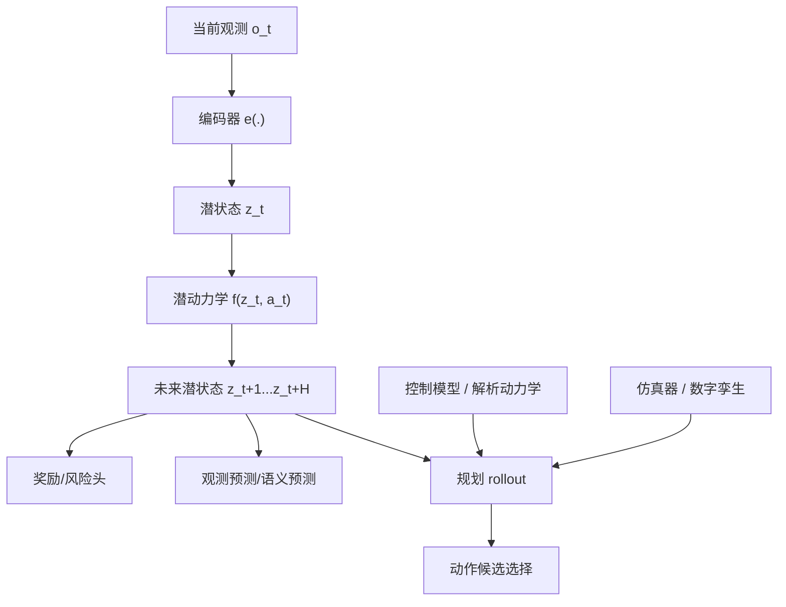

---

# 第十一部分 VLA 与机器人基础模型

如果说第七部分回答的是“大模型的哪些能力对具身系统有用”，那么本部分要讨论的就是当前最受关注的一条集成路线：视觉-语言-动作模型，即 VLA。VLA 的吸引力在于，它试图把视觉观测、语言任务接口和动作输出放到同一模型框架中，从而减少传统机器人系统中大量手工模块接口带来的信息损失与工程僵化。RT-1、RT-2、PaLM-E、OpenVLA 等工作之所以重要，不是因为它们已经解决了通用机器人问题，而是因为它们重新定义了“机器人基础模型”这一对象应如何组织。[RT-1](https://arxiv.org/abs/2212.06817)、[RT-2](https://arxiv.org/abs/2307.15818)、[PaLM-E](https://arxiv.org/abs/2303.03378)、[OpenVLA](https://arxiv.org/abs/2406.09246)

需要强调的是，VLA 不是一个单一模型类别，而是一类接口思想：把视觉、语言、状态、历史轨迹与动作输出放在统一条件策略框架中讨论。不同系统在“统一”二字上的含义差别极大。有的系统只在高层语义表征上统一，有的把状态与动作序列也纳入统一 token 流，有的则显式保留技能层和低层控制层。也正因为如此，评价 VLA 的关键不应只是“是不是大模型”，而应看它在系统内真正统一了哪一层。

## 51. VLA 的问题设定与系统结构

### 51.1 输入、输出与训练目标
VLA（Vision-Language-Action）模型的最小问题设定，可以先理解成“给定视觉观测、语言目标和必要的状态上下文，预测下一步或下一段动作”。它之所以不同于普通 VLM，在于输出不再是文本答案，而是机器人可执行的动作表示。于是，一个 VLA 至少要定义清楚三件事：输入窗口是什么、动作输出是什么、训练目标是什么。

若写成最小形式，可以表示为：

```math
\max_\theta \log p_\theta(a_{t:t+H} \mid o_{\le t}, x_{\le t}, g)
```

其中 \(o\) 是视觉观测，\(x\) 是状态或本体信息，\(g\) 是语言目标，\(a_{t:t+H}\) 则可以是单步动作、action chunk 或技能 token。这个形式有助于把 VLA 看成一种“条件动作建模器”，而不是神秘的新范式名词。

VLA 最核心的问题设定，是学习一个从多模态输入到动作输出的条件策略：

\[
\pi_\theta(a_{t:t+H-1}\mid o_{\le t}, x_{\le t}, l)
\]

其中，\(o\) 可以表示图像、点云或传感观测，\(x\) 可以表示机器人状态与历史轨迹，\(l\) 表示语言任务描述。这个形式的关键意义在于，它把“机器人策略”从单纯状态到动作的映射，扩展成了包含语义任务接口、历史上下文和多模态条件的统一条件生成问题。

这一定义之所以重要，是因为它把机器人策略学习从“单一控制器拟合”重新组织成了“统一接口设计”问题。VLA 的真正雄心并不只是把视觉和语言一起送进模型，而是试图把自然语言任务描述、视觉状态、机器人本体状态和动作序列组织成一个能够跨任务复用的条件决策接口。在这个接口里，训练目标通常不再只是最小化某个局部控制误差，而是让模型在多任务、多对象和多环境条件下都能输出结构上可执行的动作序列。
也因此，VLA 的输入输出定义会直接决定系统上限。若输入只保留图像和文本而忽视本体状态，模型就很容易在接触与姿态依赖任务中失真；若输出只是一段脱离闭环上下文的动作 token，系统又容易在真实执行时积累误差。VLA 的研究价值，本质上体现在它试图把“任务理解”和“动作组织”纳入同一模型视角，但其工程价值则取决于这些接口是否足够贴近真实机器人回路。[RT-2](https://arxiv.org/abs/2307.15818) [PaLM-E](https://arxiv.org/abs/2303.03378) [OpenVLA](https://arxiv.org/abs/2406.09246)

### 51.2 感知 backbone、语言 backbone、动作头的耦合
从架构上看，VLA 往往由三部分组成：感知 backbone 提取视觉或多模态特征，语言 backbone 表示任务条件和长程语义上下文，动作头则把融合后的内部表示映射到机器人动作空间。三者之间的关键，不在于是否物理上拆成三个网络，而在于系统是否显式承认“看见世界”“理解目标”“输出动作”属于不同职责。

一个极简结构可以写成：

```python
vision_feat = vision_backbone(images)
lang_feat = language_backbone(instruction)
joint = fusion_module(vision_feat, lang_feat, robot_state)
action = action_head(joint)
```

对学习者而言，这种分层理解很重要，因为它能帮助区分：某个系统的瓶颈到底出在感知、条件融合，还是动作接口。

现实系统往往不会从零开始训练一个完全统一模型，而更常采用某种组装结构：视觉 backbone 提供场景表征，语言 backbone 提供任务条件化，高层融合层负责跨模态对齐，动作头负责输出低层控制命令、动作 token 或 action chunk。问题的关键从来不是“是否用了某个 backbone”，而是这些模块耦合得有多深：是仅在高层共享语义，还是已经共享到动作条件层；是冻结预训练编码器，还是全链路联合优化；是通过 cross-attention 融合，还是通过更统一的 token 序列组织。

VLA 的一个核心工程难点，就在于这三部分并不是可以松散拼接的独立模块。感知 backbone 决定模型看见了什么粒度的世界，语言 backbone 决定模型如何组织任务条件和语义记忆，动作头则决定最终这些条件被投影到什么样的可执行接口上。只要其中任何一层与机器人任务结构不匹配，整体系统都会表现出“看起来懂了，但动作落不下去”的典型失配。
很多论文在模型图里把它们画成三个盒子，但真实系统里最难的恰恰是盒子之间的耦合方式：视觉 token 与语言 token 是共享注意力还是分层交互；本体状态是直接串接还是单独编码；动作头是连续回归、离散 token 还是 chunk 生成；高层语义是否能稳定传递到低层动作接口。这些设计选择看似像“架构细节”，实际上会直接决定模型是更像一个会描述任务的多模态模型，还是更像一个能组织动作的策略模型。

### 51.3 开环生成与闭环控制的差异
开环生成与闭环控制的差异，首先不在模型名字，而在系统是否会根据最新状态持续修正动作。开环生成更像“先规划出一段动作，再按段执行”；闭环控制则是在执行过程中不断读取新观测，对动作进行实时修正。对于机器人来说，这个差别非常关键，因为现实世界中的接触、遮挡、摩擦和外部干扰都会让先前看起来合理的动作序列在几步之后迅速失效。

可以把二者粗略写成：

\[
\text{open-loop: } a_{t:t+H} = \pi(o_t, g), \qquad
\text{closed-loop: } a_t = \pi(o_t, g),\; o_{t+1}\rightarrow \pi
\]

前者的优点是推理次数少、接口清晰，后者的优点是更能吸收实时误差。现实系统里常见的折中，是用 action chunk 或局部技能实现“短开环 + 高频闭环兜底”。

VLA 一旦进入真实机器人系统，最容易暴露的问题之一，就是开环动作生成与闭环控制之间的断裂。一个模型可以在离线数据集上顺滑生成动作序列，却在真实执行中因状态漂移、接触扰动和时延误差迅速失稳。因此，VLA 是否真正有效，不能只看离线动作预测质量，还必须看其是否嵌入了闭环状态修正、再规划和低层控制保障机制。

开环生成与闭环控制的差异，是理解 VLA 真实能力边界的关键。很多 VLA 在训练和评测中看起来像“根据观测输出一段动作”，这容易让人误以为系统已经具备完整控制能力。但在真实机器人里，动作不是被一次性写出后就自动正确执行，而是需要在执行过程中不断感知误差、重估状态、修正后续动作。因此，一个只擅长开环生成的 VLA，往往更像是动作草案生成器，而不是完整闭环控制器。
这也是为什么 action chunking 和滚动重规划会成为当前许多 VLA 系统的默认组织方式。模型不直接承担毫秒级稳定控制，而是在较低频率上给出一段短程动作建议，再由系统在下一轮观测到来时重新估计状态、重新生成后续动作。换言之，VLA 真正更擅长的是“在闭环系统里担任高层动作组织者”，而不是直接替代控制栈。

### 51.4 VLA 更像“策略接口”而非“完整系统”
把 VLA 看成“完整机器人系统”往往会高估它单独承担的职责。更准确的理解是：VLA 主要定义了一个从多模态上下文到动作表示的策略接口，而真实系统仍需额外具备状态估计、技能调度、安全约束、异常恢复、部署监控和人工接管机制。

因此，一个更贴近工程现实的系统抽象是：

```python
world_state = estimator(obs)
action_plan = vla_policy(world_state, instruction, memory)
safe_action = safety_filter(action_plan, world_state)
executor.run(safe_action)
```

这说明 VLA 通常是系统中的决策核心之一，但很少单独等于整个系统。

这是阅读相关文献时必须时刻提醒自己的一个点。大多数 VLA 工作真正学到的是高层或中层策略接口，而不是全部机器人系统。状态估计、碰撞监控、底层控制、安全回退与异常恢复常常仍在系统外部完成。因此，VLA 的合理定位，更接近“基础策略层”而不是“全部具身系统的代名词”。
这样定位的一个直接好处，是能够防止把系统外围模块的贡献误记到模型头上。很多看起来成功的 VLA，实际是由安全过滤、控制跟踪、状态估计、技能路由、故障恢复和任务监控共同托举起来的；若不把这些外部能力单独辨认出来，就很容易高估“统一模型本身”的成熟度。

## 52. 动作表示方式

### 52.1 连续动作
连续动作表示的最大优点，是它直接贴近机器人控制接口。关节角速度、末端位姿增量、力控指令和 base velocity 往往天然就是连续量，因此模型不必额外经历离散化再解码的误差链条。

最小形式可以写成：

\[
a_t \in \mathbb{R}^d
\]

其中 \(d\) 是动作维度。它的代价则在于，多峰动作分布较难表达，且对回归误差、尺度归一化和控制噪声更敏感。也正因此，很多连续动作路线后来会引入 diffusion、mixture density 或 chunk 级生成来缓解“单峰回归过于保守”的问题。

连续动作最接近机器人控制接口，因为它天然对应关节速度、关节位置增量、末端位姿变化或 gripper command。其优势是物理语义明确、无需离散量化；缺点则在于更难直接复用语言模型式 token 生成框架，也更容易受到数值稳定性与损失函数设计影响。

连续动作输出的直觉优势在于它贴近机器人控制接口本身。关节速度、关节位置、末端位姿、夹爪开合量这些变量天然是连续的，因此连续回归式动作头看起来最“直接”。它的好处是避免额外量化误差，也更容易与传统控制接口对接；问题则在于连续动作空间通常高维、噪声敏感，而且对训练数据质量与时序对齐要求极高，一旦状态估计略有偏差，回归头就可能输出极不稳定的动作。
从系统角度看，连续动作更适合局部精细调节和与经典控制器联动，但不一定最适合作为高层通用接口。很多 VLA 路线之所以开始探索离散化或 chunk 化，并不是因为连续动作错误，而是因为纯连续接口在跨平台复用、长时程规划和多任务统一表达上代价过高。

### 52.2 离散动作 token
离散动作 token 的基本思想，是先把连续控制空间通过量化、聚类、VQ 编码或程序化技能词表离散化，再让模型像生成文本 token 一样生成动作 token 序列。这样做的优点是更容易复用语言模型式训练接口，也便于做自回归建模、上下文记忆和大规模序列训练。

一个最小过程可以写成：

```python
token = action_tokenizer.encode(continuous_action)
pred_token = policy.predict(context)
action = action_tokenizer.decode(pred_token)
```

但这条路线的难点也很直接：一旦量化过粗，就会丢掉精细控制能力；量化过细，则 token 空间会过大、学习困难。因此，动作 token 化不是简单工程技巧，而是直接影响控制分辨率和可迁移性的表示设计问题。

把动作离散化为 token 的核心动机，是让动作接口更自然地进入 Transformer 序列建模框架。这条路线的优点在于能够直接借用成熟的 autoregressive 训练范式；问题在于，离散化是否会破坏控制精度、引入量化误差、抹平接触细节，以及如何保证 token 序列对应的动作仍然具有物理可执行性。

离散动作 token 的吸引力，在于它把机器人动作重新组织成与语言序列更相似的建模对象。这样一来，Transformer 类模型就更容易沿用已有的序列学习能力，把动作看成一个待生成的符号序列而不是高噪声连续值流。其潜在好处包括更稳定的训练、与语言 token 更统一的接口，以及更方便做多步条件生成。
但代价同样明显：量化本身就是先验，会把动作空间切分成某种人为网格。若网格太粗，精细控制能力会受损；若网格太细，token 空间又会膨胀，学习难度反而上升。更关键的是，很多接触任务的关键不是“动作类别选对了”，而是连续微调是否足够精细。因此，离散动作 token 在高层组织上很诱人，但几乎总要与低层连续修正机制共存。

### 52.3 action chunking
action chunking 可以理解为“模型一次不只输出一个动作，而是输出一小段未来动作块”。这样做的动机主要有两个：第一，减少每个控制周期都重新推理的计算负担；第二，让模型显式建模短时程动作片段内部的连续性与平滑性。

若令 chunk 长度为 \(H\)，则模型不再预测单个 \(a_t\)，而是预测：

\[
a_{t:t+H-1}
\]

其最小执行流程通常是：

```python
chunk = policy.predict_chunk(context)
for action in chunk:
    execute(action)
```

这条路线对真实部署很重要，因为它把“模型推理频率”和“控制执行频率”做了部分解耦。

action chunking 是近年很重要的一类折中方案。模型并不每步只输出一个即时动作，而是输出一个小时间段的动作块。这样做的好处在于减轻 token 级抖动、增强短时平滑性，并更贴近控制器按局部参考轨迹执行的工程方式。对机器人来说，这通常比纯单步 autoregressive 动作更稳定。ACT 明确把 chunking 变成了一等设计对象，而不仅仅是实现技巧。[ACT](https://arxiv.org/abs/2304.13705)

action chunking 的真正价值，不只是减少推理频率，而是显式承认“高层模型未必要逐控制周期输出动作”。通过一次生成一小段动作序列，系统可以把高层语义决策与低层执行频率解耦。这种结构在工程上很重要，因为它让高层模型得以在更合理的时延预算里工作，同时保留局部时间一致性。
但 chunk 长度本身就是关键设计变量。chunk 太短，高层模型频繁重算，时延压力会上升；chunk 太长，错误会在执行期间累积，系统恢复能力下降。因此，action chunking 实际上是在“推理成本、稳定性与恢复性”之间做折中，而不是单纯的性能优化技巧。[ACT](https://arxiv.org/abs/2304.13705)

### 52.4 技能 token 与程序化动作表示
技能 token 与程序化动作表示的共同出发点，是承认很多机器人行为并不适合始终在最底层连续控制空间里直接生成。相反，系统可以先输出“抓取”“打开”“导航到工作区”“收回机械臂”这类中层技能标记，再由技能执行器或脚本接口把它们展开为局部闭环控制。

可以把这一接口写成：

\[
z_t^{skill} = \pi(o_t, g), \qquad a_t = \mathrm{Exec}(z_t^{skill}, x_t)
\]

这类表示的好处是更易解释、更易插入安全约束，也更方便做跨平台迁移；代价则是技能词表与程序接口本身会构成新的建模边界。

更进一步的路线，则不是让模型直接输出低层动作，而是先输出技能 token、程序化中间表示或参数化原语，再由技能层或控制层继续展开。这使得 VLA 不再独自承担全部连续控制责任，而更像在“高层语义 - 技能接口 - 低层控制”之间搭桥。
这类表示的优势，在于它显式承认机器人系统内部本来就存在可复用的技能边界。抓取、开门、拉抽屉、推车、双臂协作搬运等行为，往往并不需要每次都由 foundation model 从毫秒级动作重新生成；更现实的做法，是由高层模型先决定“调用什么技能、在什么条件下调用、允许什么恢复策略”，再由技能控制器负责局部细节。
从研究视角看，这相当于把动作生成问题部分重述为动作组织问题。高层模型的容量因此更多用来承担任务分解、条件切换、异常修复和技能排序，而不是直接吃下所有连续控制细节；这也是为什么很多系统最终更像是在重写技能层接口语言，而不是彻底抹除技能层本身。

把技能 token 说得更具体一些，它实际上是在为策略学习引入一种“受控离散化”。原本连续而高维的动作空间，被先投影到较小的技能字典或程序接口集合中，例如 `pick(object)`、`place(target)`、`open(handle)` 或 `navigate(goal)`。这样做可以显著降低学习难度，也更方便把模型输出接到现有机器人软件栈上，但前提是这些技能接口本身覆盖了足够多的现实变化。

一个常见工作流是：高层模型先决定技能序列，中层执行器再根据当前状态参数化展开，低层控制器负责闭环稳定。写成层级形式可以表示为：

\[
z_{1:K} \sim \pi_{\text{high}}(o_{1:t}, g), \qquad
\theta_k \sim \pi_{\text{param}}(o_t, z_k, g), \qquad
a_t = \pi_{\text{low}}(x_t; z_k, \theta_k)
\]

这种层级拆分的优点，是可以把语言理解、任务分解和精细控制放在不同模块中分别优化；缺点则是接口一旦划错，系统就会表现出“高层很懂，底层做不出来”或者“底层很稳，但高层组合笨拙”的断裂。也因此，技能 token 不是简单加一个离散标签层，而是在重写整套系统的责任边界。

### 52.5 为什么动作表示决定系统上限
动作表示决定上限，是因为它直接规定了模型“到底被允许输出什么”。如果动作空间太粗，模型即使理解了任务也无法给出足够细致的控制；如果动作空间太细，训练和部署又会变得脆弱、昂贵、难泛化。因此，动作表示其实是“能力表达空间”的设计，而不只是输出层的小技巧。

一个很实用的判断是：动作表示同时影响三件事，第一是控制分辨率，第二是学习难度，第三是跨平台迁移成本。很多系统后续表现的差异，往往在动作表示层就已经埋下伏笔。

动作表示不是模型头部的小细节，而是决定系统能否兼顾“语言接口的统一性”和“控制链路的稳定性”的关键变量。若表示太低层，模型难以在长时程上保持一致；若表示太高层，又可能失去对真实动作细节的控制力。VLA 路线的一大核心矛盾，正是在这一点上不断来回摆动。
更本质地说，动作表示决定了模型究竟在哪一层与物理世界交互。表示太低层，通用化与跨平台复用会非常困难；表示太高层，接触细节、姿态修正和实时稳定性又会被迫外包给复杂外围系统。因此，动作表示其实是在为整套系统划定“基础模型负责到哪里”的边界。

可以把这个判断再压缩成一个很实用的设计三角：动作表示一端连着表达能力，一端连着学习可行性，一端连着部署可执行性。任何一种表示都不可能同时把三者做到极致。以关节位置增量为例，它部署最直接，但跨平台迁移性差；以末端目标位姿为例，语义稍强，但需要额外求解逆运动学与碰撞约束；以技能 token 为例，迁移与组合更容易，但对技能库和执行器依赖更重。

因此，评估一个动作表示时，不能只看训练损失或离线成功率，而应至少追问四个问题：第一，它把哪些困难留给了模型本身；第二，它把哪些困难转移给了控制器、规划器或技能库；第三，它是否隐含假设了某种特定硬件接口；第四，它在异常场景下是否仍有足够的修正自由度。很多所谓“模型能力差异”，本质上其实是动作表示把问题改写成了不同难度的任务。

## 53. 训练路线

### 53.1 行为克隆式训练
行为克隆式训练是 VLA 最直接、也最常见的起点。它把示教轨迹重新写成监督学习问题：给定观测、语言条件和状态历史，预测专家在该时刻的动作或动作块。对大规模多任务 VLA 来说，这一路线最大的优点是接口统一、训练稳定、易于扩展到海量离线数据。

其最小目标通常可以写成：

\[
\min_\theta \sum_t \ell(\pi_\theta(o_{\le t}, g), a_t^\ast)
\]

这也是为什么行为克隆在 VLA 里既基础又不充分。它非常适合承担“把多模态输入和动作接口先对齐起来”的角色，尤其适合大规模离线多任务训练的第一阶段；但一旦系统进入真实闭环，偏离示教分布、异常接触和局部恢复需求就会迅速暴露出来。因此，行为克隆更像是 VLA 路线的公共起点，而不是终点。

其中 \(a_t^\ast\) 为专家动作。它的局限也同样直接：一旦部署状态偏离示教分布，策略容易迅速累积误差，因此往往需要配合闭环纠偏、恢复数据或后续在线修正机制。

目前大量 VLA 系统，本质上仍然建立在多模态条件行为克隆之上。也就是说，VLA 首先是第六部分模仿学习思想在大模型接口下的扩展：专家轨迹与多模态观测被组织成更一般的条件序列，然后通过监督学习拟合。

行为克隆仍然是大多数 VLA 训练的起点，因为它直接、稳定且与示教数据天然兼容。其强项在于能快速把专家轨迹压缩成可复现策略，弱项则在于它对分布偏移极其敏感，且默认把示教分布当成“正确世界”。当机器人在真实环境里偏离这条分布时，单纯行为克隆式 VLA 往往缺乏自我恢复能力。
因此，理解行为克隆在 VLA 里的角色很重要：它通常不是终局，而是提供初始策略接口、视觉语义对齐和动作先验的第一阶段。真正要进入复杂部署，还需要后续的数据回流、失败样本补充、偏好修正或局部闭环增强机制。

### 53.2 diffusion policy
Diffusion Policy 的核心思想，是把动作生成写成“逐步去噪”的条件生成问题，而不是直接一次性回归出动作。模型从噪声动作序列出发，在观测与目标条件下逐步迭代，把噪声还原成合理动作轨迹或 action chunk。它的吸引力在于更擅长表示多峰动作分布，例如同一个抓取目标可能存在多条都可行的接近路径。

一个极简推理过程可以写成：

```python
action = sample_gaussian_noise()
for k in reversed(range(T)):
    action = denoise(action, condition=context, step=k)
execute(action)
```

对学习者来说，可以把它理解成“条件轨迹生成器”而不是传统意义上的一步回归策略。它的优势是表达力强，代价则是推理步骤更多、时延更敏感。

Diffusion Policy 路线的重要性，在于它把动作生成改写成条件去噪过程，从而更自然地表达多峰动作分布与局部轨迹生成问题。[Diffusion Policy](https://arxiv.org/abs/2303.04137) 对机器人来说，这条路线之所以值得关注，是因为许多任务存在多种可行动作方式，而单峰回归往往会把这些方式平均化，得到不可执行的“中间动作”。

若把动作轨迹视为随机变量 \(A\)，Diffusion Policy 的抽象形式可写为：

\[
\epsilon \sim \mathcal{N}(0, I), \qquad
A_0 \xrightarrow{\text{forward noise}} A_T, \qquad
\hat{A}_0 = f_\theta(A_t, o, l, t)
\]

它的核心不在于公式本身，而在于把动作建模从“预测唯一答案”转化为“学习条件动作分布”。

diffusion policy 路线的意义，在于它把动作生成视为从条件分布中逐步采样的过程，而不只是单点回归。这使得模型更容易表达多模态动作分布，尤其适用于同一观测下存在多种合理动作解的任务。对机器人而言，这很重要，因为许多抓取、接近和绕障路径本来就不是唯一解。[Diffusion Policy](https://arxiv.org/abs/2303.04137)
但 diffusion 路线的代价也非常现实：推理通常更慢，动作生成过程更长，对端侧部署不友好。因此它在研究上很有解释力，但在工程上常常需要被压缩、蒸馏，或者限制在高层动作规划阶段使用。

### 53.3 flow matching 与生成式动作建模
Flow matching 可以被理解为另一类连续生成建模路径。与 diffusion 强调逐步去噪不同，flow matching 更强调学习一个把简单分布连续运输到目标动作分布的速度场或向量场。它同样适合处理复杂、多峰动作分布，但常希望用更连续的生成轨迹或更高效的采样过程替代标准扩散链。

一个简化理解是学习：

\[
\frac{d a(\tau)}{d\tau} = v_\theta(a(\tau), \tau, c)
\]

其中 \(c\) 是观测和任务条件，\(\tau\) 是连续生成时间。对机器人研究者来说，重要的不只是数学形式，而是它代表了“动作生成不必局限于单点回归，也不必局限于标准 diffusion”的更广阔建模空间。

Flow matching 及其他更一般的生成式建模路线，进一步说明机器人动作学习正在从“点预测”走向“条件分布建模”。这在多任务、多对象和开放环境下尤为重要，因为机器人动作空间本来就不是单答案问题。
从研究逻辑上看，flow matching 的吸引力在于它通常能以更直接的路径学习从简单分布到目标动作分布的映射，从而在某些设定下缓解 diffusion 路线采样过慢的问题。对机器人而言，这意味着研究者开始不满足于“能生成多峰动作”本身，而是进一步追问“能否以更低时延、更少采样步数生成可执行动作”。
这条路线真正试图平衡的，是多样性表达能力与部署可用性。换句话说，问题不再只是“能否保留动作分布”，而是“能否在闭环预算内保留动作分布”；一旦这一点做不到，再漂亮的生成式建模也只能停留在离线表征优势，而难以成为真正的机器人策略接口。

如果用更直观的话说，diffusion 更像“先加噪，再学会一步步去噪”，而 flow matching 更像“直接学习从简单分布走向目标分布的连续路线图”。在机器人动作建模里，这种路线的吸引力在于：动作往往是连续变量，且常常需要多峰表示，一个任务可能同时存在多条可行运动轨迹，生成式方法能比单峰回归更自然地保留这种多解结构。

但这里仍要注意，生成质量并不自动等于执行质量。一个 flow matching 模型即使能生成多样且平滑的动作候选，也还要经过执行时延、动力学约束、碰撞检查和闭环修正的筛选。也因此，更值得关注的不是它是否“比 diffusion 更新”，而是它是否在采样效率、条件一致性与真实执行稳定性之间带来了可验证收益。

### 53.4 语言监督与多任务联合训练
语言监督与多任务联合训练的核心价值，在于它把原本彼此割裂的任务数据重新组织到统一条件接口下。自然语言可以承担任务 ID、目标描述、对象约束和阶段提示的角色，从而让模型在一个共享参数空间里学习跨任务复用结构。

一个最小训练样本可以写成：

```python
sample = {
    "images": obs_window,
    "state": robot_state,
    "instruction": "把红色杯子放到水槽里",
    "action": expert_action,
}
```

这类训练的难点在于，不同任务的数据量、语言风格和动作空间往往严重不平衡，因此“多任务联合”本身就意味着额外的数据配比与采样策略设计。

VLA 路线最大的新增量之一，是语言监督可以参与策略训练。语言不再只是部署时的交互接口，也可能在训练中承担任务标签、语义条件、任务族归纳偏置甚至跨平台共享接口的作用。这使得多任务联合训练更自然，但也更容易引入语义条件与真实执行条件错配的问题。
语言监督之所以重要，不只是因为它让任务描述更自然，而是因为它为数据重组提供了统一语义轴。原本彼此分散的示教轨迹、平台数据和场景数据，可以借助自然语言标签被重新组织成“同类任务的不同实例”。
因此，语言监督在 VLA 中既是能力放大器，也是数据工程组织器。它一方面提高了任务描述与样本之间的共享组织能力，另一方面也把原本分散的数据源放进了共同的语义坐标系；很多多任务训练之所以能够成立，靠的不只是模型结构，更靠这种语言轴提供的数据重组能力。

### 53.5 跨平台预训练为何既诱人又危险

跨平台预训练之所以吸引人，是因为机器人单平台数据太少，必须通过多机构、多平台数据集获得规模收益。Open X-Embodiment 与 OpenVLA 路线都在不同程度上体现了这个方向。[Open X-Embodiment](https://arxiv.org/abs/2310.08864)、[OpenVLA](https://arxiv.org/abs/2406.09246) 但它的危险也很明显：不同平台的动作空间、控制频率和传感栈差异极大，统一训练并不等于统一可执行性。
更深一层地看，跨平台预训练诱人的地方，在于它似乎为机器人领域提供了类比互联网预训练的想象空间：只要把足够多的平台、足够多的场景和足够多的任务汇总到一起，就有机会训练出更具通用性的策略接口。这种想象并非没有根据，但它也极易遮蔽“平台差异不是噪声，而是结构变量”这一事实。
也因此，跨平台预训练真正的风险并不只是数据噪声，而是平台差异本身就是能力边界。若统一得太快，模型就可能在语义层学会“看起来都像拿杯子”，却在执行层忽略不同本体、不同抓手、不同频率和不同感知栈之间无法被压平的现实差异。

一个更严谨的理解是，跨平台预训练至少要同时回答“共享什么”和“保留什么”。共享的是视觉语义、任务描述、操作阶段结构、常见接触先验；保留的是机器人本体参数、控制频率、抓手几何、相机布局和执行器极限。如果这两部分没有被清楚地区分，所谓统一数据集就很容易把真正关键的结构差异平均掉。

因此，跨平台训练更合理的目标，不一定是学到一个可直接落到所有机器人上的单一策略，而可能是学到一个更好的初始化、更好的表示层、或更强的任务语义接口。把它理解为“所有差异都能被大数据吞掉”通常会高估路线成熟度；把它理解为“通过更大规模数据先学可共享部分，再在平台侧适配不可共享部分”，则更接近工程现实。

如果把动作表示问题写得更形式化，可以把动作头理解成在不同表示空间中近似同一策略：

\[
\pi_\theta : (o_{\le t}, x_{\le t}, l) \rightarrow z_t \rightarrow a_t
\]

其中 \(z_t\) 可以是连续向量、离散 token、chunk 索引或技能调用结构。这个中间变量之所以关键，是因为它决定了模型究竟是在“直接拟合控制量”，还是在“先拟合一种较稳定的动作语法，再映射回控制接口”。很多路线之争表面上是在比较模型大小，实质上是在比较 \(z_t\) 的设计是否更适合长时程动作组织。

从工程角度看，动作表示至少要同时回答四个问题：第一，能否覆盖平台真实可执行的自由度；第二，能否稳定表达多峰决策而不是被平均化；第三，能否在训练和部署时控制时延；第四，能否跨任务、跨平台复用。连续动作通常在第一点上更直接，离散 token 和 chunking 通常在第二、第三点上更有组织性，技能 token 与程序化表示则更强调第四点。也因此，动作表示并不是动作头末端的小设计，而是 VLA 路线最核心的系统接口之一。

## 54. 泛化与鲁棒性

### 54.1 任务泛化
任务泛化首先回答的是：模型是否能把已经学会的技能结构迁移到新目标任务，而不是只在训练见过的固定任务标签上工作。这里的“新任务”未必是完全陌生动作，也可能只是已知技能的新组合、新顺序或新语言描述。

一个实用判断框架是把任务泛化拆成三问：

1. 新任务是否只重组了旧技能？
2. 新任务是否引入了新的时序依赖？
3. 新任务是否要求新的失败恢复逻辑？

这样可以避免把所有“泛化失败”都笼统归因为模型太小。

任务泛化回答的是：系统能否在没见过的任务组合或语言表达下仍然完成目标。大模型确实改善了这一点，但改善主要集中在语义接口层，而非自动覆盖真实动作执行层。
任务泛化最容易被误读的地方，在于把“能听懂新的任务描述”当成“能稳定完成新的任务结构”。前者更多是语言与语义迁移问题，后者则要求系统能在动作组合、技能切换、异常恢复和时序约束上真正形成可重组能力。
因此，讨论任务泛化时必须区分语义泛化与具身层任务泛化。前者是同义表述、任务改写和指令组合的理解能力，后者则要求系统真的能够把技能重新编排、处理失败分支并维持执行稳定；很多亮眼结果实际上只证明了前者，而未充分覆盖后者。

### 54.2 物体泛化
物体泛化在机器人文献里经常被过度简化。更合理的拆法至少包括四层：视觉外观泛化，几何与尺度泛化，接触动力学泛化，以及功能语义泛化。前两层对应“看得见、抓得到”，后两层对应“接触后不失稳、换类别后仍理解用途”。很多工作其实只证明了前两层中的一部分，却容易在摘要里把结论写成笼统的“object generalization”。

对具身系统来说，真正的难点是误差在闭环里会累积。模型即使能识别新物体，也未必能在质量分布、摩擦系数、柔顺性或遮挡模式变化后保持同样稳定的接近、抓取和放置轨迹。因此更实用的追问不是“有没有泛化到新物体”，而是“失败最先出现在识别、接近、接触建立、姿态调整还是放置收尾阶段”。

从后续版本维护角度，本报告建议把物体泛化分字段记录，而不是只写单个成功率：`novel category`、`novel geometry`、`novel material/contact`、`novel functional use`。只有这样，后续比较 RT 系列、OpenVLA、GR00T 或企业闭源路线时，才不会把“能识别新物体”和“能稳定操控新物体”误写成同一种能力。
物体泛化回答的是：模型能否把已学到的动作结构迁移到新实例、新材质、新尺寸或新外观的对象上。对机器人来说，这通常比图像分类里的“识别新类别”更难，因为系统不仅要看懂对象，还要正确估计其可抓取性、可推动性、接触风险和任务角色。

很多系统能在见过的物体族上稳定工作，却在新形状、新材质、新尺度对象上迅速失效。物体泛化因此更接近感知、接触与动作接口共同作用的结果，而不是单纯的大模型语义能力。
物体泛化之所以困难，是因为“物体”在机器人里从来不是纯视觉概念。材质会影响摩擦，尺寸会影响抓取包络，几何会影响接近路径，透明与反光会破坏感知稳定性，柔性物体甚至会改变状态表示本身。
这也是为什么单纯的高层语义理解往往会美化物体泛化。真正有价值的物体泛化，要求语义识别、几何估计、动作接口和接触反馈同时成立；只要其中一环没有泛化，系统在新对象上就仍会迅速退化。

因此，物体泛化不应被只看成“看懂了新物体”，而应被看成“对新物体仍能稳定完成动作闭环”。这一定义比开放词汇识别要严格得多，也更接近真实部署语义。

### 54.3 环境泛化
环境泛化也不应只理解为“换个房间、换个桌面”。对机器人系统而言，环境变量同时包括相机外参、照明、背景杂波、支撑面高度、障碍物布局、可达空间、动态干扰、地面摩擦与定位漂移。互联网视觉预训练带来的鲁棒性，通常只覆盖其中一部分；一旦涉及机械臂基座误差、移动底盘定位偏移或人类随机进入场景，问题就从语义泛化变成系统恢复问题。

更贴近工程现实的表述是把环境泛化写成条件分布漂移：

\[
p(o_t, s_t, \xi_t) \neq p_{\mathrm{train}}(o, s, \xi)
\]

其中 \(o_t\) 是观测，\(s_t\) 是机器人内部状态，\(\xi_t\) 是场景约束与外部扰动。很多工作会大量增强 \(o_t\)，却没有显式处理 \(s_t\) 和 \(\xi_t\) 的漂移，因此系统在视觉上“看起来没问题”，执行上却并不稳。

因此，评价环境泛化时更应优先看三点：是否使用历史窗口或状态估计来对冲瞬时噪声；是否具备异常恢复，而不是把单次失败直接当作 episode 结束；是否允许通过工位轻改造、校准和约束重构把开放环境重新拉回可控区间。很多可交付系统的真实答案并不是“适应任意环境”，而是“把泛化能力与环境改造联合设计”。
环境泛化关注的是场景布局、光照、视角、工作台高度、障碍分布和背景干扰变化后，策略是否仍然可用。它之所以值得单列，是因为很多 VLA 在对象层看似能泛化，但一旦场景结构发生轻微变化，执行链路就会明显退化。

环境泛化涉及背景变化、照明变化、障碍分布变化、空间布局变化和视角变化。它比单一对象泛化更难，因为系统必须同时重组感知和行动结构。
对部署而言，环境泛化往往比任务泛化更关键。因为工业现场、仓储货位、家庭厨房、医院病房中的光照、遮挡、可达空间和安全边界会持续变化，而这类变化会同时冲击感知输入分布、规划可行域和控制稳定性。
从系统角度看，环境泛化其实是一场联合扰动考试，而不只是视觉域偏移。照明、背景、布局和动态障碍变化会同时作用于感知、规划、控制和安全监测，因此环境泛化的难点恰恰在于它会把多个模块的边界同时推向极限。

这也是为什么环境泛化在真实系统里常常比论文摘要里显得更难。因为它不是单一模块的 out-of-distribution，而是整条闭环同时被推出舒适区。

### 54.4 长尾失败与异常恢复

长尾失败之所以是 VLA 路线的核心难题，是因为大规模示教和统一模型虽然能覆盖大量常见任务模式，却很难自然覆盖那些低频但高影响的异常状态，例如物体滑落、抓取半成功、传感器短时异常、对象被遮挡、工具位置轻微偏移或人类临时改变流程。

因此，一个真正可部署的 VLA 系统，不能只在常规分布上表现顺滑，还必须具备识别异常、暂停执行、回退到安全动作、请求额外观测或切换到恢复技能的能力。许多系统的现实差距，并不体现在“会不会做标准任务”，而体现在“任务开始偏离标准轨迹后还能不能稳住”。
长尾失败与异常恢复是评估 VLA 是否接近真实系统能力的关键切口。很多 demo 只展示主路径成功，而真实部署更关心的是：遮挡出现了怎么办、抓歪了怎么办、目标不在原位怎么办、执行一半被人打断怎么办。

因此，异常恢复能力至少应被当作独立评测维度，而不是附属于总体成功率的小注释。

真正的部署差距往往不体现在平均成功率，而体现在长尾失败：抓取偏一点点、门没推开、夹爪被遮挡、地图延迟更新、语言指令有歧义。VLA 若不能与恢复策略、外部记忆或人类纠偏接口连接，其长尾失败通常会成为实际落地的主阻力。

因此，第 54 节真正应被看成“部署性判断入口”，而不只是泛化性扩展说明。VLA 是否接近真实系统，很大程度上要看它如何面对长尾失败，而不是如何在主路径上更漂亮地成功。

### 54.5 评价指标为什么必须超出成功率
仅用成功率评价 VLA，容易把“偶尔做对一次”和“长期稳定可部署”混为一谈。更合理的指标集合通常还包括恢复率、碰撞次数、约束违例、推理时延、对象/场景泛化强度和长时程任务完成质量。

一个更完整的评测记录可以写成：

```python
metrics = {
    "success": success_rate,
    "recovery": recovery_rate,
    "safety_violations": violations,
    "latency_ms": inference_latency,
}
```

只看任务成功率，容易掩盖大量部署关键问题。更有意义的指标往往包括恢复次数、重规划频率、时延预算违约率、接触异常率与跨场景衰减幅度。这一点在后续真实系统比较中非常重要，因为很多 demo 看起来都“会做”，但只有少数系统在异常条件下还能保持可恢复性。

从研究判断角度看，成功率更像结果指标，而恢复率、违例率与时延预算更像机制指标。前者告诉我们系统偶尔能不能做成，后者告诉我们它为什么做成、偏离后能不能回来、以及在真实时间约束下是否仍成立。对具身系统而言，真正决定部署质量的常常不是“最好的那次成功”，而是“最坏情况下系统会怎样退化”。

如果把泛化评估写成更严格的研究对象，则不应只问“成功率是否提升”，还应问“泛化发生在什么层”。一个实用的拆分方法是把泛化区分为语义层泛化、几何层泛化、接触层泛化和闭环恢复层泛化。前两者更多回答模型是否看懂了新的任务与对象，后两者才真正回答模型是否还能把任务做成。很多系统在前两层进展明显，但在接触扰动、遮挡恢复和异常接管上依旧脆弱。

这一点也解释了为什么 VLA 的评测必须超出单一成功率。对于研究型正文，更有信息量的一组指标通常包括：主任务成功率、首次成功率、平均恢复次数、安全违规率、重规划频率、推理时延预算违约率，以及在对象分布变化与环境分布变化下的退化斜率。只有把这些指标并列，才能分辨一个系统究竟是“偶尔能做成”，还是“在被扰动后依然能维持组织秩序”。后文企业章节判断技术成熟度时，也应沿用这一口径而不是只看演示视频的结果帧。

## 55. 开源与闭源代表路线

### 55.1 RT 系列
RT 系列之所以是 VLA 路线绕不过去的起点，不只是因为它们先做出来了大模型版机器人策略，而是因为它们系统性地把“语言条件 + 视觉观测 + 机器人动作”组织成统一学习接口。RT-1 强调大规模真实机器人示教上的 transformer policy 训练，[RT-1](https://robotics-transformer1.github.io/)；RT-2 则把更强的视觉语言知识蒸馏进机器人决策接口，[RT-2](https://robotics-transformer2.github.io/)。这条路线第一次明确推动了“互联网级语义能力如何下接到机器人动作”的主叙事。

若用统一抽象表示，RT 系列关注的是如下条件策略：

\[
\pi_\theta(a_{t:t+k}\mid o_{1:t}, q, r_{1:t})
\]

其中 \(o\) 是多模态观测，\(q\) 是语言任务条件，\(r\) 可视作机器人状态与历史上下文。它的关键变化不只是模型更大，而是语义先验开始实质性参与动作接口定义。这样一来，模型不再仅依赖逐任务示教模板，而有机会利用预训练语义知识处理组合式指令与部分未见任务描述。

但 RT 系列留下的核心问题同样清楚：语义能力提升并不会自动转化为接触能力提升。后续 VLA 工作大量围绕这些缺口展开，例如如何提升动作表示稳定性、如何提高长时程异常恢复、如何支持更多本体、以及如何在不依赖极大规模高质量示教的前提下保持泛化。
RT 系列之所以重要，不只是因为它“把 Transformer 用到了机器人”，而是因为它较早系统化展示了：机器人动作可以被写成大规模多任务序列建模问题，语言条件、视觉观测与动作输出能够进入统一接口。对学习者而言，RT 更像 VLA 路线的接口定义者之一，而不只是单篇论文结果。

RT 系列的重要性在于把机器人多任务控制明确写成 Transformer 条件策略问题，并通过互联网语义知识迁移提高任务理解能力。[RT-1](https://arxiv.org/abs/2212.06817)、[RT-2](https://arxiv.org/abs/2307.15818)
若从谱系角度看，RT 系列更像是一条“接口逐步重写”路线，而不是单点性能提升路线。RT-1 把多任务视觉策略组织成统一序列建模问题，RT-2 则进一步把外部语义知识显式灌入动作接口。
从整本报告的主线里看，RT 系列最重要的角色，是把传统 visuomotor policy 向 VLA 或 generalist policy 过渡的桥梁明确摆到了台面上。它并非一开始就给出“机器人基础模型”的完整答案，但它定义了后续很多路线共同继承的输入输出组织方式。

### 55.2 OpenVLA
OpenVLA 的研究意义，在于它把 VLA 路线中原本很多只能通过论文描述理解的接口显式开放出来，包括训练设定、动作建模方式、数据接口和推理流程。对于学习者和复现者，这比单纯展示一个成功 demo 更重要，因为它能真正暴露方法依赖的工程假设。

OpenVLA 的重要性在于，它把 VLA 路线推向了更开放的研究生态，使研究者能够更明确地比较开源实现、数据接口和训练策略。[OpenVLA](https://arxiv.org/abs/2406.09246)
OpenVLA 的战略价值，不只是“开源了一个模型”，而是把若干此前只能在闭源系统里讨论的设计问题公开化了，包括数据配方、动作表示、训练目标和推理接口。

从学习路径看，OpenVLA 还承担了一个很实际的角色：它把“如何从数据接口一路走到推理接口”的链条暴露给研究者，使后续开源生态、工具链和教学资源有了可锚定的参照物。这类开放性并不自动带来最强性能，但非常有利于形成可复核、可修改、可演进的研究共同体。

对这份报告来说，OpenVLA 也因此是“开源生态章节”和“基础模型章节”的连接点。它不仅是一条技术路线，也是理解研究共同体如何形成公共接口的样本。

### 55.3 GR00T
GR00T 更值得从“平台级路线”而不是“单模型名称”去理解。它背后的叙事通常同时耦合了合成数据、仿真平台、机器人基础模型和下游部署接口。因此，阅读这一路线时，不能只问模型结构是什么，还要问它如何连接数据生成、训练、评测与部署闭环。

GR00T 路线的代表意义，在于它更明确地将 humanoid/generalist autonomy 与基础模型、仿真和数据基础设施合并到同一平台叙事中。[GR00T N1](https://arxiv.org/abs/2503.14734)
GR00T 更值得关注的地方，在于它把“模型、仿真、数据和本体平台”重新打包成平台级系统叙事。这意味着产业界越来越少把机器人基础模型视为孤立算法，而越来越多把它视为要与仿真资产、合成数据、部署软件栈和硬件平台一起优化的系统层对象。

这一路线的真正观察重点，不是单看某一版模型参数或 benchmark，而是看平台整合是否真的降低了从数据生成到真机迭代的摩擦。如果平台能力主要停留在宣传叙事而没有转化为更短闭环、更快回归测试和更可控部署，那它就仍然只是“系统愿景”，还不是稳定基础设施。

### 55.4 Gemini Robotics
Gemini Robotics 更值得被理解为“接口哲学变化”的代表，而不是又一个单点 benchmark 名称。[Google DeepMind 官方介绍](https://deepmind.google/discover/blog/gemini-robotics-brings-ai-into-the-physical-world/)强调的是：当原生多模态基础模型已经具备更强的视觉理解、长上下文处理与推理能力后，机器人系统能否把这些上游能力稳定翻译成低时延、可执行、可恢复的动作接口。

这类路线更接近“先有强通用多模态世界理解，再学习可靠动作接口”，而不是“先有机器人 policy，再向上吸收语义模块”。它的潜在优势在于更容易继承大模型在任务分解、开放语义理解、知识迁移和长上下文记忆上的进展；它的难点则在于如何把高层推理结果压缩成现场可验证、可回滚的执行表示。

因此，Gemini Robotics 的意义不应只与 RT-2 或 OpenVLA 做参数量对比，而应被放在“通用多模态底座向机器人下探”的大背景里理解。它提醒我们，后续比较 VLA 路线时必须区分两种方向：一种是以机器人数据为主、向上吸收语义；另一种是以通用多模态大模型为主、向下学习执行接口。这两条路在数据需求、系统边界与部署策略上都会给出不同答案。
在谱系中理解 Gemini Robotics，更重要的不是把它看成单点模型名称，而是把它放回“更强通用多模态模型如何下探到机器人接口”这条主线中。它代表的问题是：当语言、视觉和推理能力继续增强后，机器人系统能否把这些上游能力真正映射回低时延、可执行、可恢复的动作闭环。

Gemini Robotics 代表了更强大闭源多模态系统向机器人接口迁移的一种方向：更强调通用推理、跨模态理解和更大规模平台能力。但其真实具身上限仍取决于动作接口和部署闭环。[Gemini Robotics](https://deepmind.google/blog/gemini-robotics-brings-ai-into-the-physical-world/)
这一路线的重要性，在于它检验了通用多模态大模型阵营能否真正向物理世界延伸，而不只是停留在视觉问答或软件代理层。若其高层推理与机器人动作接口之间能够形成稳定映射，那么“通用模型进入机器人”的产业叙事会明显加强。

### 55.5 Figure / Physical Intelligence 等企业路线
企业路线之所以值得单列，并不是因为它们一定已经在公开学术指标上最优，而是因为它们会更早暴露“研究系统压向产品系统”时的真实约束。Figure、Physical Intelligence、1X、Agility 等路线通常不会只谈单一模型，而会同时谈本体、数据闭环、遥操作、运维与现场恢复。[Figure](https://www.figure.ai/)、[Physical Intelligence](https://www.physicalintelligence.company/)。这说明它们判断 VLA 价值的标准更接近“能否组织成持续交付系统”，而不只是“能否在论文里展示更强泛化”。

这类路线通常共享三点特征。第一，数据闭环高度组织化，真实现场、遥操作、异常回放和策略更新形成紧耦合飞轮。第二，动作接口往往优先服务于部署稳定性，因此更可能采用 action chunk、技能层或受约束的中层表示，而不是完全无约束的原子控制输出。第三，系统边界会被明确画出来，包括何时由人接管、何时需要环境改造、何时需要更换夹具或工位设计。

因此在本报告里，企业路线不应被视作“论文路线的附属案例”，而应被当成研究路线可交付性的压力测试。一条路线如果很难吸纳异常恢复、远程运维、版本回滚和数据治理要求，即便学术上看起来很强，也未必能转化为企业主线。反过来，一些 benchmark 不一定最亮眼的系统，可能因为工程组织方式更成熟而更接近真实价值闭环。

这些企业路线的意义，不在于它们都证明了“通用 VLA 已成熟”，而在于它们正以不同方式试验本体耦合、数据策略、闭环控制和高层 foundation model 的分工边界。[Figure Helix](https://www.figure.ai/news/helix)、[π0](https://www.pi.website/blog/pi0)
企业路线最值得跟踪的，不是宣传口径里的“通用性”，而是它们如何具体切分高层模型、技能层、低层控制、数据采集与真机验证之间的职责。很多产业分歧恰恰不会首先体现在论文里，而会先体现在系统结构、部署节奏和产品化策略中。
因此，对这些企业路线最值得持续追踪的问题，不是谁先喊出“通用机器人大脑”，而是谁更清楚地分配了基础模型、本体、仿真、采数和部署节奏之间的责任。这类责任切分往往比单次 demo 更能解释一条路线究竟能否走向可扩展的系统能力。

## 56. VLA 路线的核心争议

### 56.1 语言是否一定要在环

语言并不一定必须始终在环，但它在很多系统中依然具有高价值，因为它提供了一个极强的人类可读接口：可以描述目标、约束、偏好、纠错信息和任务重设条件。问题不在于语言有没有用，而在于它是否处在系统中最合适的位置。

对某些高速、强接触、固定节拍任务，语言完全可以只在任务初始化或异常介入时出现，而不必进入每一步低层闭环；对多阶段、强语义、人与机器人协作密切的任务，语言则可能需要持续承担目标更新和解释接口。因此，“语言是否在环”更像架构选择问题，而不是信仰问题。
语言不一定必须在每一个控制周期里都在环，但它通常在任务设定、阶段切换、异常解释和人机协作接口中非常有价值。更贴近现实的说法是：语言在很多系统里更适合作为高层条件与监督接口，而不是毫秒级控制回路本身。

语言当然能提供高层接口，但对很多频繁重复的工业与物流任务而言，语言也可能只是训练时的任务标签，而不是部署时的实时主接口。
这意味着“语言在环”本身不是信仰问题，而是系统分层选择问题。某些场景里语言适合承担人机交互和任务配置，某些场景里它只适合在训练阶段提供统一标签；如果把语言强行放进所有控制回路，反而可能引入不必要的不确定性与时延。

### 56.2 统一大模型是否优于技能组合

统一大模型的吸引力，在于它看起来能够减少模块拼接、共享参数和统一训练目标；技能组合的吸引力，则在于它更容易控制边界、单独调试和按场景逐步部署。两者并不天然对应先进与落后，而是在系统复杂度、泛化目标和交付约束上做不同取舍。

现实中更可能出现的，不是某一方彻底消灭另一方，而是两者长期混合存在：统一模型负责更高层的语义组织与泛化迁移，技能组合负责低层稳定性、异常恢复和可验证执行。对具身系统来说，这种混合式组织往往比纯粹立场更接近工程现实。
统一大模型与技能组合之间并不存在抽象层面的绝对优劣，真正问题是：当前数据规模、时延预算、安全要求和任务结构，是否支持把所有能力都压进单一模型中。统一模型的优势是参数共享和接口整洁，技能组合的优势是可控、可测、可替换和更容易做局部闭环兜底。

统一模型更优雅，也可能更具迁移潜力；技能组合更可控、更易验证、也更利于现场回退。现实系统很可能长期处在二者的混合区，而不会迅速收敛到某一极端。
因此，真正要比较的不是“统一”还是“模块化”哪个更先进，而是谁在当前数据、算力和部署约束下更能形成可维护的能力闭环。很多时候，最可行的答案并不是二选一，而是用统一模型重写技能组合的接口和组织方式。

这也是我在整本报告里对 VLA 路线采取的核心口径：观察它如何改写接口，而不是只观察它是否喊出了统一叙事。只要接口层没有被稳定改写，很多“统一”仍应被视为愿景而非现实。

### 56.3 数据规模与模型规模谁是主矛盾
“数据更重要”还是“模型更重要”，在机器人领域通常不是一个可静态回答的问题。真正应该问的是：当前瓶颈位于语义理解、接触操控，还是系统恢复与部署。如果语义对齐不足，扩大模型往往更快带来指令泛化与组合推理收益；如果限制因素是接触长尾、异常恢复和本体适配，那么继续放大参数量的边际收益就会很快下降，而更高质量、更贴近任务分布的数据会更关键。

更贴近现实的写法是：

\[
\text{Capability} \approx g(M, D_q, D_c, E)
\]

其中 \(M\) 表示模型规模，\(D_q\) 表示语义与任务知识数据，\(D_c\) 表示接触操控与真实交互数据，\(E\) 表示执行与恢复工程。很多公开讨论只盯着 \(M\) 和 \(D_q\)，却低估了 \(D_c\) 与 \(E\) 在具身场景中的决定性作用。

因此，“主矛盾”往往随阶段而变。研究早期，为了建立语言到动作的接口，scale model 可能更有效；进入部署阶段后，数据质量、异常覆盖、任务拆分粒度和工具链成熟度常常才是更硬的瓶颈。后续阅读新工作时，最不该问的是“它更像 scale-up 还是 scale-data”，而更该问“它究竟在缓解语义瓶颈、接触瓶颈，还是系统瓶颈”。
这不是一个静态答案问题，而是阶段性瓶颈判断问题。早期小数据阶段，模型再大也可能只是在过拟合接口噪声；而当多平台、多任务、多模态数据开始规模化之后，模型容量不足又会限制共享表征与长上下文利用。对机器人来说，更复杂的地方在于：数据规模不仅是“条数”，还包括平台多样性、失败覆盖、时间对齐质量和动作接口一致性。

当前很多公开讨论容易把问题表述成“模型再大一点就行”，但机器人领域更真实的矛盾往往是高质量动作数据极稀缺、失败恢复数据更稀缺、跨平台对齐更难。因此，数据规模、数据质量与模型规模之间谁是主矛盾，将在很长时间内继续是 VLA 路线的争议中心。
更具体地说，参数规模可以放大模式吸收能力，但前提是具身数据真的覆盖了关键状态空间。若缺的恰恰是失败样本、接触扰动、恢复过程和跨平台映射，那么单纯扩大模型只会更高效地拟合数据空洞，而不会自动填平系统短板。

### 56.4 VLA 会不会吞掉技能层

从理论上看，一个足够强的 VLA 似乎可以直接从多模态输入映射到动作输出；但从工程现实看，技能层仍然有助于控制约束、异常回退、任务复用与可验证性。因此，更可信的中期判断往往不是“VLA 消灭技能层”，而是“VLA 逐步改写技能层接口与组织方式”。

下面给出一个极简的 VLA 推理接口伪代码：

```python
tokens = tokenizer.encode(vision_obs, robot_state, language_goal)
action_chunk = vla_model.sample(tokens)

if not safety_filter.valid(action_chunk):
    action_chunk = fallback_skill.generate(robot_state)

controller.track(action_chunk)
```

这个片段再次强调：VLA 的价值并不是独占整条链路，而是在统一接口上提供更强条件策略，再与安全过滤器、技能层和控制器共同构成完整系统。

## 图 11-1 VLA 统一接口图

源文件：`assets/diagrams/11-VLA统一接口图.mmd`

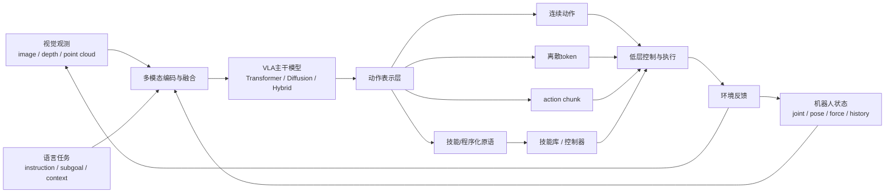

## 图表与比较补充
本章非常适合正式保留两类结构化补充。第一类是 `RT-1 / RT-2 / OpenVLA / GR00T` 的路线对比表，用来稳定比较它们在数据规模、动作表示、部署方式、开放程度和系统定位上的差异。这样读者读到企业与产业章节时，能够更快把具体公司路线映射回技术谱系。

第二类是“连续动作 / token / chunk / 技能”这四类动作表示的比较图。它的价值不在于罗列名词，而在于把动作分辨率、时延预算、可解释性、跨平台迁移性和安全兜底难度这些关键工程变量并列展示出来。

在当前版本中，`表 11-1 RT-1 / RT-2 / OpenVLA / GR00T 路线对照表` 已承担主路线横向比较职责；`图 11-1 VLA 统一接口图` 则提供了统一接口骨架，用于解释这些路线差异究竟落在感知、语言、动作头还是系统耦合方式上。

“连续动作 / token / chunk / 技能”四类动作表示的差异，已经构成 VLA 工程判断中的核心分歧之一。它们分别对应不同的时间压缩方式、信用分配难度、控制可解释性与部署成本，因此不能只被理解成输出层实现细节。把动作表示问题与接口约束、恢复粒度和训练数据结构一起讨论，能够更准确地解释为什么不同 VLA 路线在实验效果相近时，工程表现却可能显著分化。

从维护方法上看，后续新增 VLA 工作时，建议先查 [VLA 论文清单](D:/Projects/embodied-intelligence-report/research/papers/VLA-论文清单-v0.0.md)，再进入对应单篇论文卡与结构化时间线，而不是直接把新论文拼接进正文。

如果新增工作主要改变的是动作头而不是高层语言接口，则应优先并行查看 [生成式动作与策略论文清单](D:/Projects/embodied-intelligence-report/research/papers/生成式动作与策略-论文清单-v0.0.md)，避免把动作建模变化误写成单纯 backbone 升级。
## 表 11-1 RT-1 / RT-2 / OpenVLA / GR00T 路线对照表

见：[11-VLA路线对照表](D:/Projects/embodied-intelligence-report/docs/report/current/tables/11-VLA路线对照表.md)

这张表的作用不是替代正文判断，而是把路线比较固定到同一组字段里，避免后续增量更新时只追加模型名和宣传叙事。

---

# 第十二部分 规划、推理与决策的新路线

如果说第十一部分讨论的是如何把视觉、语言与动作统一成基础模型接口，那么本部分要回答的就是：这些模型如何真正承担任务结构化、长期决策和复杂场景下的推理责任。因为机器人并不只需要“输出动作”，还需要决定先做什么、后做什么、何时放弃、何时请求帮助、何时切换技能。于是，语言规划器、任务树、行为树、程序化中间表示、检索增强和多智能体协同等路线开始重新升温。

值得注意的是，规划问题在具身智能里从未消失，只是接口发生了变化。经典规划关注状态空间、动作集合与约束；foundation model 时代则把自然语言、常识知识与长程结构化推理重新接入规划器。因此，这一章不应被理解为“旧规划 vs 新模型”的对立，而应被理解为“规划载体和规划接口的迁移”。这一迁移在 SayCan、Code as Policies、Voyager、RT 系列以及大量神经符号机器人工作中都有不同体现。[SayCan](https://arxiv.org/abs/2204.01691)、[Code as Policies](https://arxiv.org/abs/2209.07753)、[Voyager](https://arxiv.org/abs/2305.16291)

## 57. 语言规划与任务分解

### 57.1 高层语言规划器
高层语言规划器的最小职责，是把自然语言目标翻译成“可被下游技能层消费的任务结构”，而不是直接输出电机级动作。它通常接收三类输入：用户目标 \(g\)、当前环境观测 \(o_t\)、以及外部记忆或技能库描述 \(m\)。输出则往往是一组阶段化子任务、技能调用建议或带前置条件的候选计划。

若写成抽象形式，高层规划器更像是在估计：

\[
p(\tau \mid g, o_t, m)
\]

其中 \(\tau = (u_1, u_2, \dots, u_K)\) 表示高层子任务序列。这个公式强调，高层规划本质上不是凭空“想步骤”，而是在目标、场景状态和可用技能约束下生成结构化任务图。

一个最小工作流通常可以写成：

```python
goal = parse_user_goal(text_instruction)
scene = summarize_world_state(observation, memory)
skills = retrieve_available_skills(skill_registry, scene)
plan = llm_planner(goal=goal, state=scene, skills=skills)
```
但高层语言规划器真正困难的地方，不在于生成一串看起来合理的步骤，而在于这些步骤是否与系统真实能力边界一致。很多大模型在文本层面能够给出漂亮计划，却默认了隐含技能存在、对象状态可观测、执行顺序可行、失败可以无代价回滚等前提。机器人规划器若不能把这些隐含前提显式化，就会在真实执行时不断把“语义上合理”转化为“工程上不可执行”。

高层语言规划器的核心作用，是把自然语言目标转化为结构化子任务序列。例如，“整理桌面”可能被分解为识别对象、分类、抓取、放置和异常处理。大模型在这里的优势，在于它们天然擅长处理长文本目标、常识知识和任务组合关系。

### 57.2 子任务序列生成
对子任务序列生成而言，最重要的不是“分解得多细”，而是分解出的每个节点是否具有明确输入、输出、前置条件和失败后的修复路径。一个好的子任务节点，往往至少要回答四个问题：做什么、依赖什么、成功如何判定、失败后如何回退或改写。

若把一个子任务节点记为 \(u_i\)，则更有操作性的表示不是一句自然语言，而是：

\[
u_i = (\text{name}, \text{precondition}, \text{resource}, \text{success}, \text{fallback})
\]

这种写法的重要性在于，它把“计划”从叙述文本改写成了可执行结构。很多高层规划失败，并不是因为模型不会分解，而是因为它输出的节点缺乏可消费字段，导致执行层既不知道何时开始，也不知道何时宣布成功，更不知道失败后应该退到哪一步。

因此，实际系统中的子任务生成常不是一次性文本生成，而是“生成 - 检查 - 修复 - 重排”的循环。其最小工作流可以写成：

```python
plan = planner.generate(goal, state)
for subtask in plan:
    if not precondition_checker(subtask, world_state):
        subtask = planner.repair(subtask, world_state)
    if not skill_registry.supports(subtask):
        plan = planner.rewrite(plan, missing_skill=subtask)
```
因此，子任务序列生成应被理解为一个受约束的搜索问题，而不是单纯自然语言续写。一个好序列不仅要覆盖目标完成路径，还要包含前置条件、资源占用、互斥关系、超时处理和失败后可修复性。也正因如此，很多系统会在大模型生成后叠加技能可用性检查、状态谓词校验、行为树编译或候选计划重排序，而不是直接把文本计划下发给执行器。

但生成子任务序列并不自动意味着这些子任务可执行。真正关键的问题是：这些子任务是否与现有技能库匹配，是否保留必要的前置条件，是否考虑执行中断和失败恢复。也就是说，语言规划器若没有与技能层和状态估计层对接，就仍然更像一个任务建议器。

### 57.3 指令歧义消解
歧义消解真正困难的地方，不在于模型是否“理解中文”，而在于系统必须把语言中的模糊指代、隐含约束和环境依赖条件转写为后续可验证的任务对象。很多真实指令并不缺少语义，而是缺少执行边界，例如“顺手整理一下”“先处理危险的”“把它放回去”。如果没有把这些语句绑定到场景状态、对象候选集和任务阶段约束上，系统看似在理解语言，实际上是在冒险猜测。

机器人中的规划器必须频繁处理不完整指令。所谓“把那个杯子放回去”在纯文本中看似简单，到了真实场景却涉及对象指代、目标位置、省略步骤和历史上下文。规划器的价值因此不仅在于能输出计划，也在于能识别自己理解中的不确定性，并主动发起澄清。

若以 \(g\) 表示用户目标、\(m\) 表示外部记忆、\(o_t\) 表示当前观测，则高层规划器可抽象为：

\[
p(\tau \mid g, o_t, m)
\]

其中 \(\tau = (u_1, u_2, \dots, u_K)\) 表示高层子任务序列。这个形式强调了现代规划器与经典 symbolic planner 的一个差异：它不再只依赖人工定义的状态谓词，也把语言上下文和记忆结构纳入了输入。

但真正的难点在于，歧义消解并不是单独的语言问题，而是“语言 - 场景 - 历史 - 技能库”四者的联合约束问题。同一句“把它放回原位”，在不同工作流、不同用户习惯和不同场景记忆下，可能对应完全不同的可执行计划。因此，一个成熟规划器不是更会猜，而是更会在不确定性过高时请求额外信息、调用外部记忆或回退到更保守的子任务。

## 58. 结构化决策中间表示

### 58.1 行为树
行为树之所以在机器人里长期流行，是因为它提供了一种介于脚本和规划器之间的结构化执行语义。它最常见的节点类型包括顺序节点、选择节点、条件节点和动作节点。系统在每个 tick 周期内从根节点向下传播执行请求，不同节点根据子节点返回的 `Success / Failure / Running` 状态决定是否继续、切换或回退。

一个最小行为树可以抽象为：

```text
Sequence
|- Condition: object_detected
|- Action: approach_object
|- Action: grasp_object
|- Fallback
   |- Action: place_in_bin
   |- Action: request_human_help
```

行为树在机器人和游戏 AI 中长期流行，并不是因为它最前沿，而是因为它在表达可回退、可条件切换、可并行调度的行为结构上非常实用。对具身系统而言，行为树仍然是把高层任务结构显式化的重要工具。[Behavior Trees in Robotics and AI](https://arxiv.org/abs/1709.00084)
如果把行为树放回具身系统的工程现实中，它的最大优点不是“优雅”，而是把失败传播规则写得非常明确。顺序节点意味着某一步失败会阻断整条链路，选择节点意味着系统在候选动作之间做退路切换，`Running` 状态则给执行层留下持续闭环的时间窗口。对于真实机器人，这种显式失败语义非常关键，因为很多高层计划并不是一次性成功，而是在“执行中等待”“局部失败切换备选”“条件满足后继续”之间循环前进。
行为树的局限也应当讲清楚。它擅长表达局部决策流和异常回退，但不擅长自动发明新结构，也不擅长在开放场景中自己扩展词汇表。也正因如此，它在当前架构里更适合扮演“规划结果的执行编译层”而不是“唯一智能体”。大模型或高层规划器负责提出候选结构，行为树负责把这些结构转成具备明确 tick 语义、失败传播规则和恢复分支的执行图，这才是两者更稳健的分工。

### 58.2 任务树与 HTN
HTN（Hierarchical Task Network）可以理解为“把一个抽象任务通过一组分解规则逐步改写成可执行任务网络”。与行为树更强调运行时控制流不同，HTN 更强调规划时的任务展开过程。它通常包含抽象任务、原子任务以及分解方法。

一个极简 HTN 风格分解示意可以写成：

```text
Task: clean_table
-> Method A:
   detect_objects
   sort_by_category
   move_category_items
   verify_surface
```
HTN 之所以在今天依然有价值，恰恰因为它能把“语言生成出来的模糊层级结构”压缩成带有明确父子依赖、分解规则和可验证前置条件的图结构。对于具身系统，这意味着高层规划不必一次性承担全部细节，而可以把任务分解过程稳定绑定到一组可复用模板上。这样做虽然牺牲了一部分开放性，却往往换来了更强的可调试性、可回退性和跨团队协作可维护性。

层级任务网络（HTN）及类似结构的价值，在于它们能把复杂任务表示为多层目标分解图。这类方法非常适合和语言规划器结合：大模型负责提出候选高层结构，HTN 或任务树负责把它约束成更可执行的形式。

### 58.3 程序化中间语言
程序化中间语言的核心思想，是让大模型输出的不是“自由文本计划”，而是一个带类型约束、参数槽位和可调用 API 的半结构化程序。它既保留语言模型对开放语义的表达能力，又通过语法和工具接口把行为限制在可解释、可验证的执行边界内。

一个最小示意可以写成：

```python
plan = [
    Pick(object="red_cup", grasp="top"),
    MoveTo(location="right_tray"),
    Place(object="red_cup", tolerance="fragile")
]
```

与自由文本相比，这种中间语言至少带来三点价值：第一，参数槽位可以被感知模块重新绑定；第二，动作类型可以被白名单与安全规则约束；第三，执行日志更容易被回放和审计。它的代价则在于表达空间被收紧，因此必须设计得既足够结构化，又不能过早把开放任务压扁。

一个极简 DSL 片段可以写成：

```python
if detect("mug", table="left"):
    grasp("mug")
    place("mug", target="sink")
else:
    ask_human("Where is the mug?")
```

程序化中间语言的出现，反映的是一种很现实的架构需求：直接从文本到动作太脆弱，而纯符号系统又太僵硬，因此需要一种既保留语义结构、又便于执行验证的中间形式。机器人编排 DSL、技能脚本和 callable API 风格接口都可视为这一路线的不同变体。Code as Policies 的代表性恰恰在于，它把语言模型输出约束到可执行代码接口，使“推理”更容易经过解释器、类型约束和工具调用链路。[Code as Policies](https://arxiv.org/abs/2209.07753)

### 58.4 神经符号混合方案
神经符号混合方案之所以反复出现，是因为它试图把两类互补能力放在一起：神经模型擅长从复杂感知输入中提取柔性的表征与启发式，符号规划擅长维护显式约束、长时程结构和可验证的状态转移。对机器人而言，这种混合路线的核心吸引力，不是理论优雅，而是它更容易在开放感知与受约束执行之间建立桥梁。

但这条路线也并不轻松。最大难点通常不是“如何把神经网络接上规划器”，而是状态抽象是否足够稳定，能否让高层符号变量真正对应到现场可观测、可执行、可恢复的对象与关系。若抽象层不稳，神经符号混合就会退化成接口复杂但并不可靠的双系统叠加。
从系统实现角度看，神经符号混合通常可以被写成三层闭环：先用神经感知模块把视觉、语言和状态历史压缩成任务相关表征；再由符号层执行约束检查、技能选择和顺序编排；最后由执行层把失败信号、状态偏差和资源冲突反向返回给上层。真正有用的不是“符号味更重”或“神经味更重”，而是这三层之间是否形成了可追责的接口。如果研究工作只展示了神经模块很强、或符号结构很漂亮，但没有解释失败如何回传、约束如何触发、技能如何重写，那么它对部署的帮助仍然有限。

神经符号混合方案持续有吸引力，是因为它试图同时保留两类优势：神经方法对感知噪声、模糊模式和高维输入的适应能力，以及符号方法对约束表达、组合泛化和可解释推理的优势。对具身系统而言，这种混合并不是理论上的折中，而往往是现实系统里最自然的分工方式。

但这类方案真正困难的地方并不在于“把两个模块接起来”，而在于定义两者之间稳定且不过度脆弱的接口。若感知输出无法支撑符号层需要的确定性，或者符号层给出的计划无法被低层连续动作执行，混合方案就会在接口处失效。
从工程现实看，神经符号混合方案的吸引力还在于责任切分更清楚。神经模型负责处理开放词义、长尾语境和模糊常识，符号或程序结构负责处理类型约束、顺序约束、权限边界和失败分支。这种分工并不总能获得最惊艳的 demo，但更容易形成可测试接口和问题归因路径，因此尤其适合那些需要长期维护、要通过审计或要进入高风险场景的机器人系统。

神经符号路线的真正意义，不在于“把老符号 AI 重新包装”，而在于它提供了一种可能：让语义理解依赖神经模型，让可验证结构依赖显式程序或逻辑结构。对需要长期可靠部署的机器人系统而言，这种混合路线往往比纯端到端推理更有工程吸引力。

更进一步说，神经符号混合最值得重视的不是理论姿态，而是它往往天然提供了更清楚的责任切分。神经部分负责吸收开放语义、长尾环境和感知噪声，符号或程序部分负责约束顺序、权限、前置条件和异常分支。对于需要长期维护、要通过审计或要进入高责任场景的系统，这种可切分性本身就是工程价值。

## 59. 大小脑协同范式

### 59.1 语义级决策与运动级执行的接口
这个接口最值得重视的地方，是它决定了高层错误会以何种方式传递到低层。若接口过粗，低层会被迫在信息不足的前提下猜测目标细节；若接口过细，高层又会把自己并不擅长的连续控制细节硬塞给执行器。成熟系统通常会在这一层显式写出中间契约：目标对象是谁、目标区域在哪里、允许的接近方式有哪些、失败后应该在本层修复还是上抛重规划。没有这层契约，语义规划和运动执行就很难形成稳定协作。
这一接口的本质，是把“高层说什么”和“低层怎么把它做出来”分开描述。语义级决策通常输出的是技能名、子目标、目标对象或目标区域；运动级执行则需要这些抽象变量被具体绑定成轨迹、末端位姿、接触约束和控制频率。因此，一个真正可用的接口必须至少完成四件事：目标绑定、状态对齐、可达性检查、执行中反馈回传。

可以把这个接口抽象为：

\[
u_t = \mathrm{Bind}(g_t, \hat{x}_t, \mathcal{K})
\]

其中 \(g_t\) 是高层语义目标，\(\hat{x}_t\) 是当前估计状态，\(\mathcal{K}\) 是技能库或控制器集合，\(u_t\) 则是可交给执行层的具体技能或控制命令。

大小脑分层的核心不是一个比喻，而是架构现实：高层决策频率低、语义密度高；低层执行频率高、连续性强。二者若不分层，系统难以同时满足长期任务理解和短时稳定控制的要求。

### 59.2 调度频率与时间尺度问题
这也是为什么“统一模型每一步都重新思考一切”的设想在真实系统里往往并不划算。高层推理一旦太频繁，就会把计算预算浪费在重复解释任务上；太稀疏，则会让计划对局部异常反应迟缓。调度频率设计本质上是在决定：哪些问题值得重新思考，哪些问题应交给局部控制器自动吸收。这个问题没有通用最优解，只能结合任务节奏、硬件时延、传感刷新频率和安全约束做系统级折中。

更具体地说，规划系统通常至少有三种时钟：感知刷新时钟、局部控制时钟和高层重规划时钟。三者若没有被清楚区分，系统就会出现一种常见错觉，即“模型总在忙，但系统并不更稳”。真正成熟的调度设计，往往不是让所有模块同步全速运转，而是让每一层只在自己真正需要更新的时候工作。

很多看似“模型能力不够”的问题，本质上其实是时间尺度错配：高层推理太慢，低层反馈太快；高层生成的计划太粗，低层执行需要更细；高层上下文太长，低层状态新鲜度要求更高。因此，调度频率本身就是系统设计变量。

若高层每 \(\Delta T_H\) 秒更新一次计划，低层每 \(\Delta T_L\) 秒闭环一次控制，通常需要满足：

\[
\Delta T_H \gg \Delta T_L
\]

并且高层计划误差不能在 \(\Delta T_H\) 时间窗口内失控地积累。这也是为什么许多系统宁愿牺牲一点“统一性”，也要保留局部反射与中层技能缓存。

### 59.3 现实系统中的工程折中
现实系统中的工程折中，往往意味着规划与推理不会以最纯粹的论文形式出现。为了满足时延、稳定性和可维护性要求，企业系统常常会保留大量启发式规则、预定义技能、状态机和本地恢复逻辑，再在部分环节引入学习型规划或大模型推理。表面上看这不够“统一”，但往往更可交付。

因此，理解规划路线时不应只问“是否端到端”，而应问“哪些层必须保留折中，为什么”。很多看似不够优雅的工程设计，恰恰是在系统真实进入现场后才被证明必要的部分。
更进一步说，工程折中并不是“学术不纯粹”的副产品，而是具身系统从研究走向交付时必须显式回答的架构问题。一个规划器若只能在理想状态下输出全局优解，但无法在传感掉帧、技能不可用或人为插入任务时快速降级，那么它在真实系统里反而不如一个次优但可回退的方案有价值。也正因此，本章讨论的规划与推理路线，最终都应该被放回 15、16 两章中的部署与安全约束下再评价。

现实系统中的工程折中，常常体现在研究论文最不愿展开的地方：是选择更高性能但更不稳定的规划器，还是选择更保守但更可验证的方案；是让模型更自主，还是保留更多手工规则与安全裁剪；是追求端到端统一，还是接受分层带来的复杂性。真正上线的系统几乎都在这些地方做过妥协。

也正因此，判断一条路线是否成熟，不能只看它最强时能做到什么，更要看它在资源有限、时延受限、安全约束存在、维护压力真实存在时，最终选择了怎样的工程边界。很多看似“不够优雅”的折中，恰恰是现实可交付性的来源。
因此，现实系统里的“规划器”往往不是单个模块，而是一条多层责任链。高层决定意图与阶段，中层维护技能切换与条件恢复，底层保证轨迹与接触稳定，外层再由安全监督器监控越界行为。看起来不够优雅，但这正是大量真实机器人产品能够工作的原因。评价论文或企业方案时，若只看最上层模型而忽略这条责任链，很容易高估其统一程度、低估其工程支撑。

现实中的大小脑系统常常不是严格两层，而是多层：高层语义规划、中层技能调度、低层闭环控制再加安全监控。这种复杂性并不意味着设计失败，而恰恰说明真实机器人系统很难被单一时间尺度统一吞并。

## 60. 连续推理与外部记忆

### 60.1 推理 token 在机器人中的局限
因此，机器人并不是“把更多思维链搬过来”就会自然变强。推理 token 的价值只在于它是否帮助系统减少了高代价错误、改善了阶段切换、增强了异常解释或提高了澄清提问质量。如果额外推理带来的只是更长的文本、更慢的响应和更过时的状态判断，那么它反而会恶化闭环质量。对具身系统而言，推理预算始终必须服从物理时钟，而不是反过来让物理世界等待语言模型思考。
把更多推理 token 投入机器人，并不自动等于更好的行为，因为机器人决策不是纯文本推理，而是受状态新鲜度约束的实时闭环。每多做一轮长链推理，环境都可能已经变化：人移动了、物体被遮挡了、夹爪姿态漂了、目标已经不在原处。因此，机器人中的“多想一步”始终要与“是否来得及执行”一起评价。

若用一个很简单的时延模型表达，可以把总决策延迟写成：

\[
T_{\text{decision}} = T_{\text{perception}} + T_{\text{reason}} + T_{\text{actuation}}
\]

推理 token 可以帮助高层任务思考，但机器人系统不能无代价地无限推理。原因并不神秘：推理消耗时间、时间会导致状态陈旧、状态陈旧会削弱动作可执行性。因此，机器人中的“更会想”必须始终和“还能够及时做”一起被评价。

### 60.2 外部记忆与检索增强
外部记忆可以理解为“把不适合塞进当前上下文窗口、但又会反复影响任务成败的状态与经验结构化存放起来”。它通常至少包含三类对象：环境记忆、任务记忆和人机交互记忆。

如果把记忆系统设计成研究对象而不是附属缓存，就会发现它至少要回答三个问题：写入什么、何时失效、如何检索。环境记忆更像地图与对象历史，任务记忆更像阶段日志与失败片段，人机交互记忆则更像约束、偏好与澄清记录。三者在时间有效性和可信度上都不同，因此不能简单混在一条文本上下文里。

一个最小检索增强工作流可以写成：

```python
query = build_context_query(goal, observation)
memory_items = retrieve(memory_store, query)
augmented_state = fuse(observation, memory_items)
plan = planner(goal, augmented_state)
```
对机器人来说，外部记忆的价值尤其体现在“让系统不必每次都重新从零理解现场”。相同房间布局、重复出现的工具、用户偏好、历史失败点、危险区域和常用收纳位置，都更适合以显式可检索结构保存，而不是期待大模型在隐式参数里长期稳定记住。这样做不仅提升长期任务连续性，也使得记忆本身能够被审计、修订和按场景权限管理。

与其让模型在参数中隐式记住一切，不如将环境历史、任务历史、对象属性和用户偏好外置为检索结构。这对长期任务特别重要，因为机器人系统会持续遇到相似场景、相似对象和相似失败模式。

### 60.3 历史轨迹、场景状态与人类反馈的融合
如果要把这种融合写成一个可操作的工程对象，可以把每条记忆至少拆成四个字段：`what happened`、`when`、`confidence`、`usable by which skill`。前两个字段解决时间顺序和新鲜度问题，第三个字段决定是否可以直接驱动决策，第四个字段决定这条记忆究竟服务于导航、抓取、重规划还是人机交互。否则，所谓“长时记忆”很容易变成没有边界的日志堆积，而不是能够提升闭环质量的决策基础设施。
真正困难的部分，则在于这些异构记忆如何被统一索引和可信消费。文本反馈、轨迹片段、对象状态快照和视频回放往往有不同时间粒度、不同置信度和不同用途，系统若简单拼接，很容易导致检索污染或过时记忆误导当前决策。因此，外部记忆不是“存得越多越好”，而是要围绕任务阶段、时间有效性、来源可信度和与当前技能接口的相关性来做结构化管理。

真正实用的机器人记忆通常不是纯文本记忆，而是多模态任务记忆：轨迹片段、地图状态、对象位置、失败案例和人类纠正记录共同构成可检索上下文。SayCan 的技能可供性评分、Voyager 的代码技能库积累、以及长程代理系统中的 memory buffer，本质上都属于把“推理”嵌入外部结构而不是完全内化在一次前向传播里。[SayCan](https://arxiv.org/abs/2204.01691)、[Voyager](https://arxiv.org/abs/2305.16291)

更实用的理解方式，是把机器人系统拆成至少三种时间尺度。第一层是毫秒到数十毫秒级的稳定控制层，负责阻抗、跟踪、接触稳定和安全停机；第二层是数百毫秒到数秒级的技能层，负责抓取、开门、对位、避障等可复用技能；第三层才是秒级到分钟级的语义规划层，负责“先做什么、后做什么、是否换策略”。如果把本应在前两层解决的问题一股脑上推给高层大模型，就会出现“推理上很聪明、动作上总是慢半拍”的典型失配。

这也意味着，“大脑-小脑-脊髓”并不是修辞，而是不同更新频率、不同可验证性和不同失败代价的真实分层。一个可部署系统通常需要显式规定每层的预算，例如：

```text
high-level planner:   0.5-2 Hz
skill scheduler:      2-10 Hz
feedback controller:  100-1000 Hz
safety monitor:       event-triggered
```

如果这套频率预算没有在系统设计早期被固定下来，后续很多争论都会变得含混不清。研究者会误以为自己在比较模型优劣，实际上比较的常常是不同时间尺度上的职责分配。

如果进一步把外部记忆写成工程对象，最小记忆条目至少应包含：`key`、`type`、`timestamp`、`source`、`confidence`、`ttl`、`payload` 和 `usable_by`。这里 `ttl` 用来限制记忆新鲜度，`usable_by` 用来避免高层偏好记忆误喂给低层控制器，`source` 与 `confidence` 则决定这条记忆究竟是“可直接执行的事实”，还是“仅供规划参考的弱线索”。

从系统风险角度看，外部记忆至少有三种常见失效模式。第一种是过时记忆污染当前决策，例如对象已经被人移动，系统却仍按照历史位置规划；第二种是错误抽象，把一次偶然成功的局部策略写成通用规则；第三种是权限越界，例如把用户偏好日志和场景危险区域记录混在同一检索空间中。真正成熟的记忆增强系统，通常会把“能否写入”“谁能读取”“什么条件下失效”设计得和模型本体同样严肃，而不把记忆当作随手加上的缓存层。[SayCan](https://arxiv.org/abs/2204.01691) 与 [Voyager](https://arxiv.org/abs/2305.16291) 分别从技能可供性和技能积累角度，展示了外部结构对长期决策的重要性。

## 61. 多机器人与多智能体协同

### 61.1 分工与通信
多体协作中的分工与通信，不能只理解成多台机器人互相发消息。更核心的问题是：谁负责全局任务拆分，谁负责局部执行，哪些状态必须共享，哪些状态只需要本地维护，以及一旦通信延迟或局部失败出现，系统如何退化运行。没有这些设计，协作系统很容易在规模扩大后迅速失稳。

因此，多机器人协作的难点不只是算法复杂度增加，而是组织复杂度上升。它要求我们把原本单机内部的规划、调度、资源分配和异常恢复问题，提升到跨主体层面重新设计。
这里很适合引入一个最小通信契约的视角。对于多机器人或多模块系统而言，真正必须共享的往往不是全部观测，而是少量高价值变量，例如任务占用、空间占用、资源锁、异常状态和阶段完成信号。凡是能通过局部闭环解决的问题，最好不要升级成全局通信问题；凡是会引发级联冲突的问题，则必须被提升为全局可见状态。这个原则比单纯强调“大模型负责协调一切”更贴近真实工程。

多智能体或多模块系统中的“分工与通信”并不是一个附属问题，而是决定系统复杂性是否真正可控的核心问题。只要任务被拆到多个执行体、技能模块或推理层次之间，就必须回答谁负责全局目标、谁处理局部异常、哪些状态需要共享、哪些决策可以局部独立完成。

通信设计过少，会让各模块各自最优却整体失调；通信设计过多，则会迅速抬高系统延迟、协调成本和调试难度。对具身系统来说，更现实的方向通常不是追求完全自由通信，而是围绕任务结构设计稀疏、稳定、语义明确的交互协议，让系统在必要时共享关键状态，而不是在所有时刻交换所有信息。

多机器人协同把单体系统的问题放大成协调问题：谁先做、谁等待、谁搬运、谁观察、谁承担共享地图维护。语言模型与多智能体规划看起来在这里很有吸引力，但真正难的是通信延迟、信息不一致和角色切换的可验证性。

因此，多智能体规划的核心并不是“让多个智能体都更聪明”，而是让它们在信息不完全同步的情况下仍维持足够稳定的组织秩序。现实部署中，协作失败往往不是因为单体不会做事，而是因为局部错误状态被广播、放大并演化成系统性失调。

### 61.2 协作任务的规划难点
从算法视角看，这意味着协作规划往往隐含一个带约束的联合优化问题：每个体的局部最优行动，必须接受全局资源和时序一致性的裁剪。很多看起来“单机上已经成熟”的技能，一旦进入多机协同，就必须增加资源仲裁、超时重分配和状态对账机制。读这一节时，最好把“多机协同”理解为把单体闭环复制多份之后，再额外叠加一层组织系统，而不是把单体技能简单并联。

协作任务的规划难点，在于系统不再只需预测环境和自身，还需要预测其他主体的时序、意图、误差与反应方式。无论对方是人类操作者、另一台机器人还是上位调度系统，只要它们的行为不完全可控，规划问题就会从单体优化迅速变成带有不完全信息和动态博弈色彩的协调问题。

这意味着协作规划往往比单体任务更依赖显式协议、角色分工、冲突消解与可解释状态交换。若这些机制缺失，即使单个执行体能力很强，整体系统也可能因为协调代价过高而失去效率与稳定性。
更麻烦的是，协作系统中的失败往往不是独立失败，而是耦合失败。一个机器人迟到一步、误占一个工位、误判一件对象状态，都可能让其他机器人基于错误前提继续执行，从而把局部偏差快速放大成系统性冲突。因此，多机器人规划不能只看平均效率，还必须看冲突检测、重同步、资源重新分配和异常广播机制是否足够健壮。

协作任务并不只是多个单体任务叠加，而是需要考虑共享资源冲突、空间占用、时序协调和失败传播。也正因为此，多机器人规划往往比单体规划更需要显式结构。

### 61.3 模拟环境与现实部署的差异
这也是为什么很多多智能体或多机器人成果在仿真中极具说服力，但一到现实系统就迅速显露脆弱性。仿真里默认稳定的时钟、干净的通信、统一的地图和可重复的动作执行，在现实里都会出现漂移、丢包、延迟和局部感知不一致。因而评价这类系统时，不能只看协作是否“表面成功”，还要看底层是否具备在部分信息失配下维持组织秩序的机制。

仿真中的多智能体协同很容易显得流畅，但现实系统中的通信、定位误差和执行器偏差会迅速放大协调难度。这一节的意义，在于为后文企业与应用章节保留一个判断标准：多智能体 demo 不能只看表面合作效果，还要看底层调度与失败恢复链路。

下面给出一个面向技能级规划器的极简伪代码，用于说明“语言目标 -> 结构化中间表示 -> 技能调用”的常见链路：

```python
task_graph = planner.parse(goal_text, memory=episodic_memory)

for node in task_graph.topological_order():
    if not precondition_checker(node, world_state):
        repair(node, world_state)
        continue

    action = skill_registry.bind(node.skill, node.arguments)
    outcome = executor.run(action)
    world_state = state_updater(world_state, outcome)
```

在研究与工程实践中，真正难的并不是把语言转成树，而是让树中的每个节点都与可执行技能、前置条件检查和失败恢复机制形成闭环。

如果把协作问题压缩成一个最小协议，可以把每个参与体周期性暴露为：

\[
m_i = (\text{role}, \text{claim}, \text{resource}, \text{status}, \text{deadline})
\]

其中 `role` 表示当前职责，`claim` 表示它准备执行的阶段目标，`resource` 表示占用的空间或工具，`status` 表示运行态，`deadline` 则约束其他体是否应等待或接管。这个表示看似朴素，却比“共享全部状态”更接近可维护的工业协作方式，因为它直接围绕冲突和接管而不是围绕全知视角设计。

从形式上说，协作规划更像一个带资源约束的联合调度问题，而不仅是多个局部 planner 的并联。若令 \(a_i(t)\) 表示第 \(i\) 个执行体在时刻 \(t\) 的动作，\(r(a_i)\) 表示其占用资源，则至少需要满足：

\[
r(a_i(t)) \cap r(a_j(t)) = \varnothing,\quad i \neq j
\]

这类约束解释了为什么很多单机上看似简单的技能，一旦进入多体协作，立刻需要增加锁、仲裁、让行和超时重分配机制。也就是说，协作复杂性不是额外叠加在任务之后的边角问题，而是任务定义被多执行体重写后的主问题。

因此，在阅读多机器人或多智能体论文时，一个更有区分度的判断标准不是“它协作成功了几次”，而是“它如何处理资源冲突、通信缺失和角色切换”。如果这些问题只在附录里以工程技巧略过，那么该路线距离可部署系统往往仍有相当距离。

## 图表与比较补充
如果本章后续还要继续加图，不应该优先加更多模型名，而应优先加“接口图”和“比较表”。因为这两类材料最能沉淀成长期可复用的阅读支架，能直接服务于后面 VLA、系统架构、企业分析和商业化章节的复审。
本章非常适合正式保留两类结构化补充。第一类是“文本目标 -> 中间表示 -> 技能调用 -> 执行反馈”的流程图，它能把语言规划、任务图、技能绑定和执行回路连接成单一可视链路，避免读者把高层推理误解为脱离执行的纯文本过程。

第二类是“行为树 / HTN / 程序化中间表示”的比较表。这类表格最有价值的地方，在于它能稳定比较三者的表达能力、可验证性、回退机制、运行时灵活性和工程维护成本。对长期学习者而言，这种横向比较往往比单独记住每个名词的定义更有用。

## 图 12-1 规划到执行的接口图

源文件：`assets/diagrams/12-规划执行接口图.mmd`

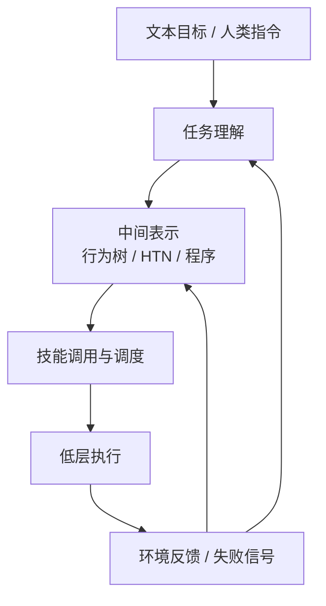

在当前版本中，`图 12-1 规划到执行的接口图` 已承担“文本目标 -> 中间表示 -> 技能调用 -> 执行反馈”的主流程说明；`表 12-1 行为树 / HTN / 程序化中间表示比较表` 则把三类中间表示的表达能力、可验证性、回退机制与工程维护成本稳定为正式对照口径。

## 表 12-1 行为树 / HTN / 程序化中间表示比较表

见：[12-行为树HTN程序化中间表示比较表](D:/Projects/embodied-intelligence-report/docs/report/current/tables/12-行为树HTN程序化中间表示比较表.md)

从后续维护方法上看，新增规划类工作时，建议先查 [规划与具身推理论文清单](D:/Projects/embodied-intelligence-report/research/papers/规划与具身推理-论文清单-v0.0.md)，再进入对应单篇论文卡或正文补写。

---

# 第十三部分 数据工程与训练闭环

如果说第六部分建立了“学习型机器人为何天然走向训练闭环”的理论前提，那么本部分讨论的就是这条闭环在现实中如何真正组织起来。到了这一层，问题已经不再是“模型架构选哪个”，而是数据如何采、如何切、如何对齐、如何混合、如何回流，以及如何让部署中的失败重新进入训练系统。对具身智能而言，数据工程不是模型训练前的准备工作，而是系统能力边界本身。

近两年机器人的一个关键变化，是数据问题开始被显式基础设施化。Open X-Embodiment 试图把跨机构、跨平台数据汇聚成统一格式；BridgeData V2 更强调多环境、多任务、可扩展操纵数据；LeRobot 则进一步把数据采集、训练、推理和部署工具链开放化。[Open X-Embodiment](https://arxiv.org/abs/2310.08864)、[BridgeData V2](https://arxiv.org/abs/2308.12952)、[LeRobot](https://arxiv.org/abs/2602.22818) 这些工作共同表明：机器人领域正在从“每篇论文自造一套小数据”转向“围绕长期可复用数据闭环搭建基础设施”。

## 62. 数据来源全景

### 62.1 真机操作数据

真机操作数据之所以始终是最有价值、也最昂贵的数据类型，是因为它直接包含了真实身体、真实传感器、真实延迟、真实扰动和真实失败模式共同作用下的交互痕迹。与仿真或公开视频不同，它记录的不是“看起来像操作”，而是“在这个具体系统上真实发生过的操作结果”。

也正因为如此，真机数据的价值并不只在量，而在闭环密度。谁能持续采到覆盖成功、失败、恢复和环境变化的高质量真机数据，谁就更可能建立长期可更新的具身能力资产。

真机数据之所以珍贵，是因为它天然携带真实动力学、真实接触、真实噪声与真实失败模式。但其缺点同样明显：采集贵、速度慢、设备磨损大、安全风险高。因此，真机数据在机器人领域通常扮演“高价值但稀缺”的角色。

真机数据之所以珍贵，不只是因为“更真实”，而是因为它包含了仿真和互联网视频很难完整给出的接触细节、执行器滞后、控制噪声、传感器漂移和失败后果。这些信号在论文表格中往往不可见，却恰恰定义了部署上限。也因此，真机数据常常不是拿来单独追求规模，而是拿来校正训练闭环最关键的现实偏差。
换言之，真机数据在整个数据体系中更像“高价值锚点”：它可以验证哪些仿真先验是有效的，哪些语言标注与动作标签是真正对齐的，哪些失败模式必须进入下一轮训练。谁如果只把真机数据当作“更贵的数据源”，就会低估它在闭环中的结构性作用。

### 62.2 遥操作与示教数据

遥操作和示教之所以重要，不只是因为它们能产出专家轨迹，更因为它们是把人类意图、技能结构和纠偏策略注入系统的主要方式。Mobile ALOHA 的意义正体现于此：其 low-cost whole-body teleoperation 方案本质上是在降低高质量具身数据闭环的采集门槛。[Mobile ALOHA](https://arxiv.org/abs/2401.02117)

遥操作与示教的重要性，也不只在于产出“专家轨迹”。它们的真正作用，是把人类的任务意图、局部纠偏习惯、接触时机和恢复策略注入系统。很多机器人任务若只从成功结果倒推，很难复原中间那些关键但细碎的决策；示教数据恰恰能把这些隐性技能结构显式化。
但示教数据也有典型问题：人类操作分布与机器人可执行分布未必一致，操作者之间风格差异大，遥操作链路本身也会引入时延与抖动。因此，示教不是“拿来即用”的标准答案，而是需要被重标定、重切片和重新组织成模型可消费的训练对象。

### 62.3 穿戴式采集与动作捕捉

穿戴式采集与动作捕捉路线的重要性，在于它们试图降低高质量示教数据的采集门槛，把人类动作、姿态、手部操作与视角信息更直接地映射到机器人学习流程中。相比传统遥操作，这类方案有机会记录更自然、更连续、也更贴近人类操作直觉的行为轨迹。

但它们也有显著局限：人类身体与机器人本体往往并不同构，动作捕捉得到的是“人是怎么做的”，而不是“这个机器人怎样最稳地做到”。因此，这类数据往往更适合提供先验、偏好和阶段结构，而不是被简单等同为最终动作真值。

穿戴式与 mocap 路线试图把人类动作更自然地映射到机器人本体或技能空间中。其潜力在于可以更高效捕捉复杂全身动作和双臂协调；其问题则在于本体差异、示教质量波动以及人类动作到机器人动作的结构失配。

穿戴式采集与 mocap 的魅力，在于它们更接近自然动作生成，可以高效率获取双臂协同、全身协调和连续动作调整等难以用键鼠或传统示教设备表达的行为。但它们的难点也非常典型：人类身体与机器人本体存在显著结构差异，关节范围、接触方式与力学约束都不相同，因此“捕捉到的人类动作”与“可执行的机器人动作”之间必须经历复杂映射。
因此，这类数据更适合作为技能先验、风格先验或高层动作组织参考，而不一定能直接成为低层控制监督。谁若忽视本体映射问题，就会高估动作捕捉数据的直接可用性。

### 62.4 仿真生成数据
仿真生成数据可以理解为“用可控环境批量制造训练样本”，其优势在于便宜、可重复、可注入扰动、可自动带标注；其局限则在于所有数据质量都受仿真假设约束。对机器人而言，这类数据往往更适合承担预训练、困难场景扩充、失败模式覆盖和感知标注增强等角色，而不应被直接等同于真实操作经验。

一个最小生成流程通常是：

```python
for scene in simulator.sample_scenes():
    for task in task_generator(scene):
        episode = rollout_policy_or_script(scene, task)
        dataset.write(episode)
```

仿真数据的价值在于规模、可控性和多样性，但其弱点是与现实分布错位。仿真并不只是便宜数据源，更是系统如何定义任务和环境结构的实验场。
仿真生成数据真正强大的地方，在于它允许研究者系统性操纵那些在真机上代价过高的变量，例如接触扰动、物体参数分布、传感器噪声、极端初始状态和失败恢复场景。它因此不仅是“补数据”的手段，更是“系统性发现模型脆弱点”的手段。

### 62.5 互联网视频与跨域迁移数据

互联网视频与跨域迁移数据之所以持续被讨论，是因为真实机器人数据昂贵，而公开视频与通用多模态数据看起来提供了几乎无限的补充来源。它们可以帮助模型学会对象外观、场景关系、动作意图和任务语义，为后续具身学习提供较广泛的先验。

但这类数据真正的限制也非常明确：它们通常缺少真实动作执行信号、接触反馈和可验证的控制后果。也就是说，它们更适合补高层理解和先验，而不适合直接替代真实闭环交互数据。跨域迁移的价值，更多在“先懂一些世界”，而不是“已经学会如何在这个身体里做事”。

互联网视频之所以受到关注，是因为它提供了海量动作先验和对象交互先验。但它的问题也非常直接：没有真实机器人状态，没有控制信号，没有精确时间对齐，也未必对应机器人本体可执行的动作语义。因此，跨域迁移价值存在，但通常更适合作为高层语义或表征预训练，而不是直接作为动作监督。
这类数据最有价值的部分，往往不是提供“可以直接模仿的动作”，而是提供场景共现、对象可供性、任务流程和人类操作顺序等弱结构先验。也就是说，互联网视频更适合告诉模型“世界里通常会发生什么”，而不太适合直接告诉控制器“下一步关节该怎么动”。

## 63. 数据清洗、对齐与标注

### 63.1 时间同步

时间同步看似是数据工程里的底层细节，实则直接决定多模态样本是否还有学习价值。图像、关节状态、力觉、语言指令、动作命令和环境事件只要在时间上错开到一定程度，模型就会把本不对应的原因和结果学成关联，最终表现为感知滞后、动作错位或恢复时机错误。

对具身数据来说，最危险的并不是完全没有同步，而是“看起来差不多”的轻微不同步，因为这种错误更隐蔽、更难在早期被发现，却会在训练后长期污染模型行为。因此，时间同步从来不是清洗后补救的小步骤，而是采集协议设计的核心。

机器人数据比很多机器学习数据更难处理的根源之一，就是所有信号都必须在时间上对齐。图像、状态、动作、触觉、语言和控制回路一旦时间戳错位，下游模型学到的就不是任务结构，而是跨模态噪声。

时间同步之所以关键，是因为机器人数据不像纯图像数据可以近似视为独立样本。图像、关节状态、力觉、触觉、动作命令和语言事件往往必须在同一任务时钟上对齐，模型才能学到“这个动作导致了这个结果”。一旦时钟错位，模型看到的就不再是因果序列，而是跨模态噪声拼贴。
也就是说，时间同步不是底层 housekeeping，而是因果结构是否能被学习的前提。很多所谓“模型不稳定”问题，最终并不是架构失败，而是训练样本内部时间语义已经被破坏。

### 63.2 多模态切片

多模态切片的困难，在于机器人数据并不是天然按样本独立同分布组织的。图像、关节状态、力觉、语言、动作命令和任务事件之间具有强时序耦合关系，若切片窗口选得不合理，就可能把真正重要的因果链条截断，或者把无关上下文大量带入训练。

因此，切片策略本身就属于模型设计的一部分。窗口长度、重叠方式、对齐基准、是否保留失败前后片段、如何处理多阶段任务边界，都会直接影响模型学到的是局部反射式映射，还是能跨更长时间尺度维持目标一致性的策略。

序列数据如何切片，会直接影响模型看到的任务因果结构。是按固定窗口切、按技能边界切、按成功/失败阶段切，还是按事件边界切，并不是中立选择。

多模态切片同样会改变模型最终学到的任务结构。若按固定窗口切片，模型更容易学到局部共现模式；若按技能边界切片，模型更容易捕捉子任务结构；若按异常与恢复事件切片，模型则更容易形成失败感知与重试能力。换言之，切片策略本质上是在告诉模型“什么是一个完整决策单元”。
这也是为什么许多看似相似的数据，在不同切片方式下会训练出完全不同的策略风格。切片不是中立的数据预处理，而是隐式任务建模。

### 63.3 指令标注与动作标注
指令标注与动作标注的关键区别，在于前者描述“这段行为在语义上想完成什么”，后者描述“这段行为在控制层到底做了什么”。具身数据若只有动作日志而缺少语义指令，就很难支持多任务语言条件训练；若只有语言描述而动作时间轴、控制接口和末端状态不清晰，又很难真正训练可执行策略。

更细地看，这其实对应两种不同层级的 supervision。指令标注回答的是任务层问题，例如“把红色杯子放到左侧托盘里”；动作标注回答的是执行层问题，例如末端位姿、夹爪开合、阻抗参数、速度限制和终止条件。若二者之间没有稳定映射，模型就容易学会“说得通但做不稳”的策略，也就是语言上像理解了任务，但在接触、微调和恢复阶段频繁失效。

高质量具身数据集通常还需要第三层中间监督，即阶段化语义锚点，如 `approach -> align -> contact -> lift -> place`。这些标签不一定需要逐帧人工精标，但至少应在技能切换点、失败点和恢复点形成结构化记录。因为系统后续是否能学会“做到哪一步了”“现在应不应该重试”“何时该请求人类澄清”，很大程度上取决于这些中间语义是否被显式编码进数据。

因此，完整样本通常至少要包含：

1. 任务目标或语言描述。
2. 对齐后的观测与状态序列。
3. 动作序列及其控制语义。
4. 成功/失败与关键事件标签。

语言标注的粒度会影响系统到底学到“对象描述”“子任务描述”还是“高层目标描述”；动作标注则决定动作空间被如何离散化、归一化或 chunk 化。数据组织方式因此直接进入模型假设。
指令标注与动作标注之所以重要，是因为它们决定了系统最终学到的是哪一层抽象。若语言标注过粗，模型可能只学到任务名词而学不到中间约束；若语言标注过细，又可能把本应由策略内化的结构硬编码进文本。

### 63.4 失败样本与异常样本处理
失败样本处理不只是“把坏数据剔掉”，而是先判断这些失败到底是噪声、危险异常，还是对训练极有价值的恢复样本。对机器人而言，若训练集里只有成功演示，模型往往很难学会偏差修正、接触恢复和与人澄清等现实能力。

更实用的做法通常不是把失败样本统一归为负例，而是先给失败分型。例如可恢复失败、不可恢复危险失败、标注错误失败、设备故障失败、环境超边界失败，它们进入训练和评测的方式应当不同。否则系统很容易把“值得学习的恢复过程”和“根本不应模仿的危险轨迹”混在一起。

一个实用流程通常是：

```python
for episode in dataset:
    if is_corrupted(episode):
        discard(episode)
    elif is_recoverable_failure(episode):
        keep_for_recovery_training(episode)
    else:
        tag_as_hard_negative(episode)
```

失败样本的价值常常高于成功样本，因为它们更直接暴露系统边界与恢复需求。但现实中失败样本往往被过度清洗掉，导致模型在部署时严重缺乏异常恢复能力。
失败样本之所以珍贵，是因为它们为系统提供了“边界附近的数据”。成功样本往往集中于平稳执行区域，而真正决定部署韧性的，常常是抓取滑脱、路径阻塞、接触超调、目标丢失、语言歧义和传感器异常这类不稳定片段。

一个最简化的数据记录单元可以抽象为：

\[
\mathcal{D}_i = \{(o_t, x_t, a_t, r_t, \ell, m_t)\}_{t=1}^{T_i}
\]

其中 \(o_t\) 是观测，\(x_t\) 是机器人状态，\(a_t\) 是动作，\(r_t\) 可表示回报或事件标签，\(\ell\) 是语言任务，\(m_t\) 则可包含成功/失败、接触、异常等元数据。很多看似“模型效果不稳定”的问题，最终都可以追溯到 \(\mathcal{D}_i\) 内部的错位、缺失或标注语义不一致。

如果把切片问题形式化，可以把一个训练样本写成长度为 \(H\) 的条件窗口与长度为 \(K\) 的预测窗口：

\[
x_t = \{o_{t-H+1:t}, a_{t-H+1:t-1}, l_{t-H+1:t}\}, \quad
y_t = a_{t:t+K-1}
\]

其中 \(o\) 表示观测，\(a\) 表示动作，\(l\) 表示语言或任务标签。这里 \(H\) 决定模型看到多少历史，\(K\) 决定模型一次要承担多长的动作生成责任。所谓 action chunking、本体状态缓存和长程记忆，很多时候首先就是通过这两个窗口长度被编码进训练样本的，而不是先在模型结构里显式声明。

工程上至少有三种常见切片策略。其一是固定时间窗，优点是实现简单、吞吐高，缺点是容易切断技能边界；其二是事件边界切片，例如以抓取开始、接触建立、放置完成等事件作为边界，优点是更贴近技能结构，缺点是需要可靠事件标注；其三是失败中心切片，专门围绕碰撞、滑脱、遮挡和恢复过程构造样本，优点是能提高系统的异常处理能力，缺点是分布会偏离常规成功轨迹。不同策略对应的不是不同“数据清洗口味”，而是不同的能力目标。

更细一点看，失败样本至少应区分四类。第一类是“数据坏了”，如传感器掉帧、时间戳错乱、控制日志损坏；第二类是“任务失败但过程有价值”，例如抓空、滑脱、放歪后又恢复；第三类是“高风险失败”，例如撞人、过载、夹手、越界；第四类是“标注失败”，即真实执行正确但语义标签或动作对齐错误。只有分开这四类，后续训练、回放和审计才不会把完全不同性质的样本混为一谈。

对训练系统而言，真正有价值的通常不是把所有失败都加大权重，而是围绕“可恢复失败”构建局部课程。因为这类样本最能告诉模型：当主路径被打断时，什么样的观察变化意味着应该重抓、重定位、请求人类接管或直接终止。相反，高风险失败更适合作为安全边界数据、离线审计样本或规则层的反例，而不应未经处理就并入普通行为克隆数据中。

## 64. 数据混合与 curriculum

### 64.1 通用数据与专用数据混合

通用数据与专用数据混合的意义，在于把广覆盖先验与任务特化能力同时带入训练。通用数据通常有助于模型学习对象、场景、语言和基础行为模式的宽泛分布，而专用数据则提供某一平台、某一场景、某一任务边界下真正可执行的闭环知识。两者缺一，系统都容易偏。

真正困难的不是“要不要混合”，而是如何决定混合比例和训练顺序。通用数据过多，系统可能更会理解却不够会做；专用数据过多，系统可能做得很熟却缺泛化余量。混合策略实际上是在定义模型应把什么看作普遍规律，什么看作平台特定技能。

通用数据提升覆盖面，专用数据提升任务精度。问题在于二者如何混合：若通用数据过多，模型可能只学到泛泛语义；若专用数据过多，模型又可能丧失迁移能力。

通用数据与专用数据混合的困难，在于两者服务的目标不同。前者更利于形成广覆盖语义与对象先验，后者更利于特定任务精度与稳定性。如果不控制配比，系统要么学成“什么都见过但都做不精”，要么学成“某一场景很好用但迁移极差”。所以数据混合从来不是越多越好，而是要围绕目标能力边界设计。
从长期看，这一问题会越来越像模型架构设计的一部分：不同数据源的权重、采样节奏、课程顺序和损失配比，会共同决定模型偏向广义泛化还是窄域可交付。

### 64.2 多机器人平台联合训练
多机器人联合训练的目标，不只是“把更多数据拼起来”，而是让不同本体、不同控制频率和不同动作接口的数据进入某种可比较的共享表示。真正困难的地方在于：同一个“抓取”在不同机器人上可能对应完全不同的关节空间、视角布局和控制语义。

因此，多平台联合训练真正先要解决的是对齐协议，而不是模型容量。至少要明确哪些变量被抽象到共享空间，哪些变量必须保留为平台特有条件。若这一点没处理好，所谓联合训练就可能只是把不可比的数据放进同一 batch，而不是形成真正可迁移的跨平台先验。

因此，这类训练往往需要至少一种对齐机制：

1. 对齐到任务语义层。
2. 对齐到末端执行器或对象中心动作空间。
3. 对齐到共享技能 token 或程序化接口。

跨平台训练是具身基础模型的重要方向，因为单一机器人平台的数据规模永远有限。但本体差异、动作接口差异和传感器差异使这件事非常困难。Open X-Embodiment 的价值正在于，它把“跨平台联合训练”从概念讨论推进成了可操作的数据标准与实验对象。[Open X-Embodiment](https://arxiv.org/abs/2310.08864)
更难的问题在于，不同平台之间共享的并不是完整策略，而往往只是部分结构。某些平台共享对象语义，某些共享技能拓扑，某些共享高层任务分解，但低层可行动作完全不同。

### 64.3 从易到难的课程学习
课程学习在机器人里之所以有现实意义，是因为很多任务的探索空间本身就高度分层。系统若一开始就面对长时程、多阶段、强接触、开放环境任务，往往既学不到稳定技能，也难以分辨失败究竟来自感知、控制还是阶段切换。把任务按难度、时程、扰动强度或接触复杂度分层，能够显著提高训练信号密度。

一个常见思路是先在高成功率、短时程、强结构化子任务上收敛基础策略，再逐步扩大初始状态分布、增加扰动、延长 horizon、放松环境约束。这与人类训练机器人操作员的逻辑并不矛盾，本质上都是在控制学习曲线的斜率，而不是一次性把全部复杂性都暴露给系统。

但课程学习最容易出的问题是“课程泄漏”：模型在某一层课程上形成了对环境、节拍或初始化方式的依赖，导致一旦进入下一层就崩溃。因此课程设计不应只看难度递增，还要看阶段之间的接口是否连续、失败样本是否被保留、以及是否有机制防止系统只记住每一关的套路。好的课程学习不是把困难推迟，而是有组织地暴露困难。

课程学习在具身系统里尤其自然，因为真实任务本身就具有明显的难度梯度：从静态单物体、固定视角、少扰动任务，到多对象、动态遮挡、长时程、强接触和复杂恢复任务。若系统一开始就暴露在最复杂分布下，训练往往不仅效率低，还容易学不到稳定结构。

但课程设计并不是简单地把数据按“容易 - 困难”排序。更关键的是识别哪些难度维度应被逐步开放，例如对象多样性、动作自由度、扰动强度、接触复杂性和任务链长度。课程若设计得当，它会显著提高样本效率；若设计不当，也可能把模型锁死在过于狭窄的能力边界中。

课程学习在机器人里尤其自然，因为很多任务本就有明显分层：先抓取、再搬运、再装配；先单对象、再多对象、再动态环境。课程设计如果合理，能显著提高训练稳定性；若设计不当，也可能把模型锁死在过窄任务轨迹上。
课程学习真正有价值的地方，不是“按难度排序”这么简单，而是它帮助系统控制分布漂移速度。一个尚未形成稳定抓取能力的策略，若过早进入长时程装配和多体交互场景，训练噪声往往会淹没有效信号。

### 64.4 数据配比为什么是“模型设计的一部分”

数据配比之所以属于模型设计的一部分，是因为模型看到什么比例的成功样本、失败样本、遥操作示教、仿真数据、开放域先验和现场回流数据，实际上决定了它最终会把什么当作“正常世界”。很多看似属于结构设计的问题，最后往往是通过数据配比在训练中被隐式编码进去的。

可以把这一点写得更直接：数据配比其实是在决定模型的默认归纳偏置。若成功样本过多、失败恢复样本过少，模型会倾向于把世界想得过于干净；若仿真样本过多、真机样本过少，模型可能学会漂亮但脆弱的闭环；若开放域视频先验过强、可执行动作数据不足，则模型会更擅长“看懂任务”，却不一定更擅长“把任务做成”。

这也解释了为什么同一模型结构在不同团队手里会表现出完全不同的行为特征。若训练集中过度偏向干净成功样本，系统可能显得顺滑但脆弱；若失败恢复和异常样本比例更高，系统可能更保守，却更适合真实部署。配比从来不只是统计问题，而是行为边界设计问题。

在具身系统中，数据配比并不是训练前的 housekeeping，而经常决定模型最终学到的行为偏置。一个模型在语言覆盖上看似很强，可能只是因为语言标注更密；一个模型在失败恢复上很弱，可能只是因为失败样本权重极低。因此，数据混合策略应被视为隐式策略先验，而不只是数据工程细节。

把这一点说得更直接一些，很多“模型风格”其实是被数据配比塑造出来的。若训练集中过度偏向干净成功样本，策略往往更激进、更流畅，但也更脆弱；若困难样本、失败恢复样本和保守示教占比更高，系统则可能更慢、更谨慎，却也更适合高责任场景。配比因此不是纯统计问题，而是行为边界设计问题。

更正式地说，课程学习的目标不是让训练集看起来更整齐，而是控制模型所面对的状态分布演化速度。若记第 \(s\) 个阶段的数据分布为 \(p_s(x)\)，则一个理想课程并不追求相邻阶段完全不同，而更希望保持：

\[
D\bigl(p_s(x), p_{s+1}(x)\bigr) \text{ 有控制地增长}
\]

其中 \(D(\cdot,\cdot)\) 可理解为某种分布差异度量。这个写法的意义在于提醒我们：课程设计本质上是在管理训练时的分布跃迁，而不是机械地给任务排难度名次。

对具身系统更有用的课程维度通常包括：对象数量、对象多样性、遮挡强度、接触复杂度、动作自由度、恢复需求和任务链长度。也就是说，课程不是一条单轴，而更像一个多维开放阀门过程。很多系统之所以在论文里“看起来学会了”，到真实环境里却很快失稳，就是因为课程只控制了视觉难度，没有控制接触难度和恢复难度。

如果写成训练目标，可以把混合训练近似表达为：

\[
\mathcal{L} = \sum_{d \in \mathcal{D}} \lambda_d \, \mathbb{E}_{(x,a)\sim d}[\ell_\theta(x,a)]
\]

其中 \(\mathcal{D}\) 代表不同数据源集合，\(\lambda_d\) 代表每类数据的采样权重或损失权重。这个公式的重要性不在数学本身，而在它明确指出：所谓“用了哪些数据”并不足以描述训练设置，真正决定行为风格的是各类数据在优化目标里被赋予了多大话语权。

因此，数据配比表最好被当成模型卡的一部分而不是附录细节。对于研究型报告而言，一个更严谨的比较口径是同时问三件事：用了什么数据、切成什么样、按什么比例进入训练。只问第一件事，往往会把数据工程最关键的行为偏置隐藏起来。

## 65. 后训练与闭环更新

### 65.1 在线修正

在线修正的价值，在于它允许系统在不完全停机重训的情况下，把现场反馈快速引入执行闭环。对真实机器人来说，这一点非常关键，因为很多错误并不是离线训练时能预先穷尽的，而是在部署后才逐步暴露出来。

不过，在线修正也带来新的风险：系统可能把局部补丁误当成普适规律，或者在缺少足够审计与回放机制时引入不可控漂移。因此，在线修正真正可用的前提，不只是“能更新”，而是“更新后可回溯、可验证、可回滚”。

部署后的在线修正，是把模型从“会做静态任务”推进到“能在扰动中恢复”的关键。但在线修正的代价也高：需要稳定监控、回滚机制和安全边界。

在线修正的真正价值，在于把部署环境从“评测终点”变成“继续学习的信号源”。机器人若只能离线训练、上线执行，就会在现实扰动面前迅速失去适应性；而一旦允许有限、安全、受控的在线修正，系统就有机会逐步把长尾异常纳入能力边界。
但这件事的门槛很高，因为在线修正不仅是优化问题，更是安全问题。谁有权更新、何时回滚、哪些日志必须保留、哪些错误不能自动学习，都会决定这条闭环能否长期可用。

### 65.2 人类反馈
在人类反馈进入训练闭环后，数据工程就不再只是被动记录，而开始包含“如何高效地从人类那里获取最有价值修正信号”。反馈可以是重做示教、口头纠错、偏好比较、接管恢复，或对失败原因的标签说明。

一个最小反馈回流流程可以写成：

```python
episode = rollout(policy)
feedback = human_review(episode)
dataset.append(align_feedback(episode, feedback))
retrain(policy, dataset)
```

很多现实系统并不会完全自动更新，而是通过人类纠正、偏好反馈和失败回放筛选做受控修正。这使训练闭环天然包含“人在回路”。
人类反馈在机器人里比在纯语言模型里更复杂，因为反馈对象不仅是文本输出，还可能是轨迹片段、接触策略、恢复动作和安全边界。也正因为如此，机器人中的“偏好学习”常常不是抽象偏好打分，而是与示教补采、异常重标注和操作员纠偏共同构成一个混合信号体系。
从数据工程角度看，人类反馈最难的地方并不是“收集到意见”，而是把意见对齐到可训练字段。操作者说“刚才太冒进”“这一步不稳”“应该先扶住再转”，这些反馈若不被映射到具体轨迹片段、状态窗口和动作决策点，就很难进入后续训练。也因此，成熟系统通常会为反馈附带时间戳、事件锚点、技能名、失败类型和操作者置信度，而不是只保留一条模糊文本评论。
这也解释了为什么高质量反馈比大规模低质打分更有价值。对机器人而言，一个准确指出“在哪个状态窗口里应该切换到保守恢复动作”的操作员标注，常常比几十条笼统的“做得不好”更有训练价值。后续若进入企业与部署分析，应特别关注团队是否建立了低摩擦的反馈采集界面、是否能把接管和纠偏自动切成训练单元，以及是否区分了结果级反馈、轨迹级反馈和策略级反馈；这些能力往往比单次模型效果更能决定训练闭环能否持续运转。

### 65.3 失败恢复数据回流
失败恢复数据回流的价值，在于它专门为系统补上“从偏差状态回到可执行轨道”的样本，而不是只增加更多标准成功轨迹。很多现实部署中的能力边界，不体现在理想起始状态能否成功，而体现在轻微偏差、错位接触、目标半遮挡和执行中断后能否恢复。

因此，恢复数据通常值得被当作单独数据类型管理，而不是和普通成功样本简单混在一起。

真正强的系统通常不是“从不失败”，而是“失败后能留下有价值数据”。DAgger、示教补采和困难样本回流都体现了这个思想。[DAgger](https://proceedings.mlr.press/v15/ross11a.html)
从工程视角看，失败恢复回流是把部署现场重新接回训练系统的核心接口。没有这一接口，部署与训练会重新分裂成两个世界：前者不断暴露新问题，后者却持续在旧分布上优化。

这一类回流数据尤其适合单独建立元数据字段，例如失败类型、恢复方式、人工介入点、最终是否恢复成功、是否触发安全接管等。只有把失败结构显式记录下来，后续训练与评测才有机会区分“主路径能力”与“恢复能力”，否则失败样本很容易再次被粗糙地合并回普通轨迹里，失去其最有价值的信息。

### 65.4 持续学习与灾难性遗忘

持续学习的吸引力很强，但机器人比纯软件系统更难承受遗忘代价：旧任务一旦退化，现实部署成本立即上升。因此，持续更新与能力保留之间的平衡是一个实际工程问题。

也因此，机器人里的持续学习不应只被理解为“模型继续训练”，而更像受约束版本迭代。每一轮新数据回流后，都应伴随历史能力回归、关键安全任务复测、旧场景抽样验证和必要时的灰度发布。否则“会学”很容易变成“越学越不稳”。
灾难性遗忘在机器人领域尤其敏感，因为遗忘的不只是 benchmark 分数，而可能是已上线技能的稳定性、安全裕量和操作员信任。一个模型如果在新场景学习后削弱了旧场景中的基础抓取或门把手操作能力，其代价往往直接表现为现场停机与重调试。

下面给出一个极简的失败样本回流伪代码：

```python
for episode in deployed_episodes:
    if episode.success:
        replay_buffer.add(episode, weight=1.0)
    else:
        repaired = relabel_or_reteach(episode)
        replay_buffer.add(repaired, weight=3.0)

train(policy, replay_buffer)
```

这段代码当然忽略了很多安全与治理细节，但它抓住了训练闭环的关键思想：失败不应只被统计为 KPI，而应被转化为下一轮训练的高价值样本。

对机器人而言，人类反馈至少有三种粒度。第一种是结果级反馈，即“这次是否做成”；第二种是轨迹级反馈，即“哪一段动作多余、太激进或不安全”；第三种是策略级反馈，即“以后遇到类似状态应优先采用哪类恢复动作”。三种反馈的采集成本、可训练性和可泛化性都不同，如果系统只把它们统一压成一个标量奖励，往往会损失掉最有价值的结构信息。

更现实的闭环做法通常是把人类反馈嵌入一条分层修正链：能靠口头纠正解决的，不必重做示教；能靠重标注解决的，不必重训整模型；只有当反馈稳定指向某类系统性偏差时，才值得把它升级成新的训练批次。这样做的核心不是节省算力，而是避免把稀疏的人类监督浪费在错误层级上。

如果把失败恢复看成训练资产，就不应只回收“发生了失败”这一事实，还要回收失败前状态、触发条件、第一次错误动作、恢复动作、人工接管点以及最终结果。也就是说，一条高价值恢复样本不是一个标签，而是一段完整的小型因果链。它告诉系统：偏差是如何形成的、什么时候已经不可逆、什么样的修正仍然有效。

这也是为什么许多成熟系统会单独维护恢复缓冲区，而不是把恢复样本直接混回普通 replay buffer。前者服务于“提高异常情境下的决策质量”，后者服务于“维持主路径性能”。如果两者不分离，模型要么会被正常轨迹淹没而学不会恢复，要么会被异常样本拖得过于保守。

从持续学习角度看，更关键的问题不是“能不能继续学”，而是“继续学之后怎样证明旧能力没有被破坏”。因此，机器人系统里的持续学习通常需要伴随一套回归基准：旧任务回放集、关键安全动作集、典型失败恢复集和部署前强制复测集。没有这套回归框架，所谓持续学习就很容易退化成不可控漂移。

对本报告后文的企业分析和部署分析而言，这一点非常关键。很多团队宣传“机器人会越用越聪明”，但真正值得追问的是：它通过什么机制保存旧技能、隔离新数据风险、回滚坏版本、验证安全边界没有退化。持续学习在机器人里不是单纯的模型能力问题，而是版本治理、数据治理和安全治理的交叉问题。

## 66. 数据治理与合规

### 66.1 数据版权

数据版权问题在具身智能里之所以复杂，是因为机器人训练数据往往同时混合了视频、动作轨迹、语言标注、环境日志、传感器读数和现场流程信息，不同部分的权属边界并不完全相同。公开网页视频、客户现场录像、遥操作示教数据和合作伙伴设备日志，既可能分别适用不同许可条件，也可能在混合后形成新的再分发限制。

对工程团队而言，更现实的问题不是抽象地问“能不能用数据”，而是问“能不能把这批数据稳定纳入可持续训练资产”。若来源不清、授权不明、再训练权利不确定，即便短期实验可做，长期也难以沉淀为版本化数据资产。因此，本章建议后续在资料库中同步记录每类数据的来源、授权方式、可训练范围、可再分发边界和版本变更记录。
机器人数据版权问题之所以复杂，是因为样本往往同时包含视觉内容、环境布局、用户行为、厂区流程和设备操作知识。它不像纯文本那样只问“来源可不可以抓”，还要问采集场地、设备接口、示教者身份和客户业务流程是否允许再训练与再分发。

互联网视频、公开视频、企业示教视频和第三方数据集并不天然可以任意重用。尤其当训练开始涉及商业部署时，版权边界会快速变得敏感。

### 66.2 隐私与现场采集合规
现场数据采集一旦进入真实工厂、仓储、门店、医院或家庭环境，隐私与合规就不再是附属问题。视频里可能包含员工面部、工牌、生产流程、客户信息、商业机密与空间布局；遥操作日志和语音指令还可能包含操作员身份信息、行为习惯或敏感业务过程。若没有前置的数据分级与权限控制，研究闭环很容易在组织层面被直接阻断。

因此，更稳妥的做法不是“先采再说”，而是在采集前就定义字段边界：什么可以原样保留，什么必须脱敏，什么只能保留派生特征，什么需要严格访问审计。对长期项目来说，最关键的不是一次性通过某个审批，而是建立一套可重复执行的数据治理流程，使新场景接入时不必每次从零讨论。

从工程角度讲，合规要求还会反过来塑造数据架构。很多时候应优先保留任务相关事件流、状态量、局部裁剪或匿名化元数据，而不是无差别全量录像。数据工程若从一开始就不考虑合规，后续训练闭环往往会因为“不能合法复用数据”而被迫重建。

现场采集合规的难点在于，机器人数据并不只是“看到了什么”，而往往同时记录了“谁做了什么、在什么位置做、失败了几次、如何被纠正”。这意味着许多看似普通的操作日志，实际上可能包含可识别个体行为模式、客户流程细节、设备布局信息甚至商业机密。

因此，合规工作不应只理解为打码或匿名化，而应前移到采集流程设计：哪些模态必须采、哪些模态可以降采样、哪些日志只保留统计量、哪些原始视频必须限权保存、哪些数据在出现场前就要被脱敏。对具身系统来说，合规本身就是数据工程的一部分，而不是训练结束后才补的一道法务手续。
现场采集合规的关键，不只是遮掉人脸，而是系统性识别样本里哪些信息会泄露个人、企业或场地敏感结构。例如家庭环境中的生活痕迹、工厂中的工艺流程、医院中的患者数据、仓储中的 SKU 与路径布局，都可能通过机器人日志被间接暴露。

家庭、医疗、办公和工厂现场数据都可能涉及隐私、商业机密和安全边界。机器人采集因此不仅是技术问题，也是现场治理问题。

### 66.3 真实场景数据的伦理边界
真实场景数据的伦理边界，往往比法律边界更早到来。即便某些采集在形式上合规，也未必意味着它在组织信任、劳动关系、用户知情和风险分配上就是合理的。具身系统如果长期依赖高强度一线操作员示教、隐性监控式现场采样或把失败成本外包给弱势岗位，那么即使技术上取得进展，这条路线也可能在社会可接受性上留下长期问题。

因此，这一节最重要的不是给出抽象口号，而是建立几个具体追问。数据采集对象是否充分知情，是否拥有退出机制；失败样本是否会被不公平地归咎于操作员；遥操作与示教劳动是否被当作可替代隐形成本；家庭、医疗或弱势群体场景中的采集是否存在额外保护要求。只有这些问题被明确写进流程，伦理才不会停留在附录层。

对研究型报告而言，伦理边界不是“政治正确补丁”，而是判断路线可持续性的必要条件。很多短期有效的数据策略，如果在劳动、隐私或责任结构上不可持续，最终也很难成为长期行业主线。

伦理边界与法律合规并不完全相同。即使一段数据在合同上可用，也不代表它在研究上就应被无限扩展使用。最典型的问题包括：是否在弱知情条件下记录了一线员工行为、是否把高风险失败样本用于超出原场景的训练、是否在带有人身风险的场所默许系统以“边跑边学”的方式试错。

对研究报告而言，更稳妥的立场是承认：真实场景数据越接近高价值交付，就越不可能是一块无摩擦、无限制的通用燃料。数据闭环能力如果建立在模糊的伦理边界之上，短期也许能提高训练效率，但长期会直接侵蚀系统可持续部署的正当性基础。

机器人可以更深入地进入现实空间，这使其数据采集行为本身就可能成为伦理问题。也正因为此，数据工程在具身系统里天然和治理问题相连。

### 66.4 工具链基础设施的重要性
工具链基础设施之所以需要单列，是因为数据工程的竞争力往往并不只体现在“有没有更多数据”，而体现在“能否把数据稳定变成可迭代资产”。同样是采集一万段示教，缺乏 schema 管理、版本控制、质量审计、回放工具和训练对接接口的团队，往往无法把这些数据持续转化为模型改进。

从长期闭环看，真正决定迭代速度的常常是这些看似不“前沿”的基础设施：采集端时间同步，episode 回放，失败片段检索，标注任务分发，数据版本 diff，训练配置可追踪，以及部署日志回流。它们共同决定了团队能否做到“发现问题 -> 定位片段 -> 修正数据/训练 -> 回归验证”的短闭环。

因此，后续版本评估企业或开源生态时，不应只比较模型名字，也应比较工具链成熟度。谁拥有更清晰的数据-训练-部署基础设施，谁就更可能在同样研究方向上形成持续优势。很多路线之所以看起来迭代更快，本质上并不只是模型更强，而是工具链让学习速度更快。

随着数据规模扩张，数据工程已经无法只靠零散脚本维持。数据版本管理、可视化、流式读取、跨平台格式统一、在线日志回收与训练数据审计，正在变成和模型本身同样重要的基础设施问题。LeRobot 之类工具的意义，不是单独提供某个算法实现，而是降低“采集 - 标准化 - 训练 - 回放 - 复现”整条链条的门槛。[LeRobot](https://arxiv.org/abs/2602.22818)

本部分的结论可以概括为：具身系统的训练闭环，本质上是一条“采集 - 清洗 - 对齐 - 训练 - 部署 - 失败回流 - 再训练”的持续工程链。模型架构当然重要，但若没有这条链条，所谓“基础模型能力”很难真正落地。

## 图表与表格补充
本章最适合沉淀为长期复用资产的，是训练闭环总流程图与数据来源比较表。前者应用来稳定展示“采集 - 对齐 - 清洗 - 训练 - 部署 - 回流 - 再训练”的循环结构，后者则应明确比较真机示教、遥操作、仿真生成、互联网视频和跨平台混合数据在价值、成本与风险上的差异。

这两类补充之所以重要，是因为数据工程章节的难点并不在名词本身，而在于帮助读者形成一套“如何判断某种数据资产真正有用”的框架。

## 图 13-1 训练闭环总流程图

源文件：`assets/diagrams/13-训练闭环总流程图.mmd`

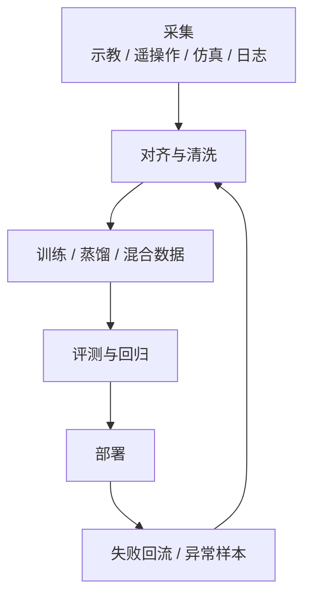

在当前版本中，`图 13-1 训练闭环总流程图` 已承担主流程图职责；`表 13-1 不同数据来源的价值 / 成本 / 风险比较表` 则把真机采集、遥操作、穿戴采集、仿真生成与互联网迁移数据的差异固定为正式比较框架。

## 表 13-1 不同数据来源的价值 / 成本 / 风险比较表

见：[13-数据来源价值成本风险比较表](D:/Projects/embodied-intelligence-report/docs/report/current/tables/13-数据来源价值成本风险比较表.md)

---

# 第十四部分 仿真、数字孪生与评测基础设施

具身系统之所以比很多纯软件 AI 更难做大规模实验，一个根本原因就在于真实试错代价极高。于是，仿真平台、数字孪生环境和 benchmark 基础设施几乎成为现代机器人研究不可或缺的一部分。问题在于，仿真并不是天然中性的：你用什么物理引擎、构造什么场景、定义什么任务脚本、用什么评测协议，都会直接影响你最后得到的“能力”。因此，本部分不仅比较工具，更要回答：为什么仿真如此重要，又为什么它经常被高估。

近年的趋势尤其值得强调。Isaac Sim 正在把物理仿真、传感器建模、合成数据与机器人 AI 工作流整合进统一平台；Habitat 系列把 embodied AI 中的导航与场景交互问题标准化；BEHAVIOR 等基准试图把长程家庭任务转化为更系统的评测环境。这说明仿真已不再只是“先练再上真机”的配角，而逐步成为数据生成、模型预训练、回归测试和评测标准化的基础设施。[Isaac Sim](https://developer.nvidia.com/isaac/sim)、[Habitat](https://aihabitat.org/)、[BEHAVIOR-1K](https://behavior.stanford.edu/behavior-1k)

## 67. 主流仿真平台

### 67.1 Isaac Sim
Isaac Sim 值得重点关注，不仅因为它是热门平台，更因为它把仿真、合成数据、数字孪生与部署栈尽量放进了同一生态叙事里。对具身智能而言，这种平台化价值在于降低“仿真工具只是离线演示器”的概率，而更有机会把它变成训练、评测、数据生成和系统联调的共用基础设施。

但也正因为它平台属性强，使用者必须警惕把生态完整性误读成方法正确性。Isaac Sim 的强项在于整合，不等于它对所有研究问题都是最优解。更合理的做法，是先判断自己在解决数据生成、系统联调、视觉合成还是真机前验证中的哪一环，再决定如何使用它。

Isaac Sim 的代表性在于它把高保真仿真、数字孪生、传感器模拟和机器人 AI 工作流紧密结合起来，并与更广泛的 GPU / foundation model / 仿真基础设施叙事相连。它尤其适合强调大规模场景合成、synthetic data 和与工业工作流整合的路线。[Isaac Sim](https://developer.nvidia.com/isaac/sim)

更进一步看，Isaac Sim 的重要性不只在“画面更真”，而在它试图把数据生成、策略训练、传感器仿真、场景脚本化、回放验证和部署前回归测试连接成一个更完整的基础设施层。这种平台化价值，也与其后续围绕 Isaac Lab、GR00T 和合成数据工作流的布局一致：目标不是单独提供一个仿真器，而是提供一套围绕机器人训练闭环的系统性研发环境。[Isaac Lab](https://isaac-sim.github.io/IsaacLab/)

### 67.2 Gazebo / ROS 生态
这条生态的长期价值还在于它把“系统问题”暴露得足够明显。节点之间如何通信、状态如何回放、坐标系如何维护、感知与控制如何同步，这些在论文里常被隐藏的工程问题，在 ROS/Gazebo 工作流中往往必须被显式回答。也正因为如此，它们即便未必总是最前沿的学习平台，却持续扮演着具身系统公共接口层的角色，帮助研究者把算法放回真实系统组织语境中理解。

Gazebo 和 ROS 生态长期重要，并不是因为它们“最先进”，而是因为它们构成了大量机器人研究与工程系统的通用接口层。其优势是开放、可扩展、生态丰富；劣势则在于高保真与统一工作流能力相较新一代平台未必最强。[Gazebo](https://gazebosim.org/home)、[ROS](https://www.ros.org/)

对学习者而言，这条生态的价值尤其在于它把“系统集成”显式暴露出来。消息接口、坐标系、控制话题、日志回放、仿真插件、节点调度和模型可替换性，都被清晰地组织在一个可检查框架里。即便很多新系统的视觉与策略模型已经完全不同，底层的工程组织经验仍然大量继承自这条路线。

### 67.3 MuJoCo / PyBullet / Habitat 等
这几类平台之所以常被并列讨论，并不是因为它们彼此可互换，而是因为它们分别代表了不同研究重点。MuJoCo 更偏向精细动力学、连续控制和接触研究；PyBullet 更偏向轻量、易部署、原型验证与教学；Habitat 则更偏向导航、场景级 embodied AI 与长时程交互任务。对学习者来说，最重要的不是记住名称，而是先问清“我要研究的能力落在哪一层”。

若用更工程化的方式粗分，可以把它们理解成：

1. `MuJoCo`：擅长控制、操控、接触、locomotion 等需要细粒度动力学的研究。
2. `PyBullet`：适合快速试验、教学原型和中等复杂度操作任务验证。
3. `Habitat`：适合视觉导航、场景记忆、长时程任务与 embodied AI benchmark。

MuJoCo 擅长精细动力学和控制研究，PyBullet 轻量易用，Habitat 更偏向导航与 embodied AI 环境。这些平台的重要性在于，它们各自把“什么才是重要问题”编码进了环境设计里。[MuJoCo](https://mujoco.org/)、[PyBullet Quickstart Guide](https://pybullet.org/wordpress/)、[Habitat](https://aihabitat.org/)

### 67.4 不同平台的能力边界

把仿真平台放在一起比较时，最常见的误区是只看“画面真不真”或“能不能跑起来”。更稳妥的比较维度至少应有四个：

1. 物理建模侧重点：更偏刚体动力学、接触、导航还是多主体场景。
2. 传感器与场景能力：是否支持相机、深度、激光雷达、触觉或语义场景标签。
3. 训练工作流接口：是否容易接 RL、模仿学习、回放测试和批量脚本任务。
4. 工程集成能力：是否便于和 ROS、部署栈、数据生成流水线或企业内部工具链打通。

也因此，没有所谓“最好的统一仿真器”，只有“对某类问题更合适的仿真器”。MuJoCo 适合很多接触和控制研究，Habitat 更适合导航与室内 embodied AI，Isaac Sim 更强调平台化、合成数据和工业工作流，Gazebo/ROS 生态更强调可接工程系统。把它们混成同一类工具，会直接破坏后续对实验结果的理解。

不同平台的差异，不能只用“画质更真实”或“物理更准确”来概括。更重要的问题是：它到底更适合解决哪一类研究与工程问题。Isaac Sim 更强在工业级资产、传感器仿真、与 NVIDIA 训练部署栈的耦合；Gazebo / ROS 生态更强在中间件一致性、系统集成和工程可迁移性；MuJoCo、PyBullet 与 Habitat 则更常用于控制、强化学习、导航和研究型 benchmark 的快速迭代。

因此，平台选择本身就隐含研究假设。若团队主要验证接触控制与动力学策略，一个轻量级、可快速批量跑实验的平台可能比重资产数字孪生平台更合适；若团队目标是还原真实工位、传感器布局和部署流程，那么系统一致性与数字资产管理能力就会变得比单步物理精度更重要。也就是说，没有“最好的仿真平台”，只有“与当前问题最匹配的平台边界”。

没有一个平台天然适合所有任务。操纵、移动导航、全身运动、长时程家庭任务和工业孪生任务所需的环境能力完全不同，因此“仿真结果强”必须始终与“在哪类平台、哪些假设下强”一起看。

## 68. 数字孪生与场景构建

### 68.1 场景复刻
场景复刻的真正价值，不是把现实空间“做得像”，而是把与任务相关的约束保留下来。这意味着并非所有细节都同样重要。对抓取任务而言，接触面、支撑面、可达空间与遮挡关系可能比装饰纹理更关键；对导航任务而言，通路拓扑、门与障碍布局可能比材质更关键。

因此，数字孪生的核心不是最大化还原，而是选择性高保真。谁能识别哪些场景变量对任务成败真正敏感，谁就更能把有限建模成本用在最关键的位置。
场景复刻可以理解为“把真实部署场地在几何、拓扑、对象布局和传感视角上重新搬进仿真环境”。它并不要求所有物理细节都百分之百一致，但至少要让任务执行时真正决定成败的结构被保留下来，例如货架间距、桌面高度、常见遮挡关系、相机外参、通道宽度和常驻障碍物位置。

一个最小复刻流程通常包含四步：

1. 采集环境几何与对象清单。
2. 重建静态场景与关键可动物体。
3. 标定传感器视角、坐标系和机器人初始位姿。
4. 用典型任务脚本验证仿真场景与现实流程是否同构。

数字孪生的直觉目标，是尽量让仿真环境在几何、对象布局、工作流和传感结构上贴近真实场景。其价值在于能把真实部署前的大量验证前移。

### 68.2 参数化环境生成
参数化环境生成的意义，在于它让仿真从“复刻一个世界”转向“生成一族世界”。这对泛化研究尤其重要，因为系统真正需要面对的不是单个环境，而是一系列带有结构性变化的任务分布。通过参数化障碍物、光照、对象布局、材质、摩擦或传感器外参，研究者可以更系统地暴露模型的脆弱边界。

但参数化生成的价值，不在于把随机变量越堆越多，而在于能否把变化维度组织成可解释、可复查的实验设计。若所有参数同时随机化，最终虽然看起来“更真实”，却很难回答系统究竟怕什么。更有效的做法通常是把场景生成拆成若干相对独立的维度，例如几何布局、视觉外观、物理接触、传感器误差和动态干扰，并分别设置扫描区间。这样，当成功率下降时，研究者才能追溯是摩擦估计出问题、遮挡导致感知崩溃，还是布局变化破坏了高层策略先验。

从工程实践看，参数化环境还承担一种“先行暴露成本”的作用。真实部署里最昂贵的往往不是算法本身，而是到现场后才发现某些变化维度从未进入训练或测试分布，例如托盘高度偏差、地面反光、工件公差波动或机械臂安装外参变化。若仿真阶段已经把这些变量显式纳入参数空间，就能更早知道系统的脆弱边界在哪里，也更容易为数据采集和安全策略制定优先级。

但参数化也有代价。若参数空间设计得过于方便生成而脱离真实部署分布，模型学到的可能只是对合成变化的适应，而不是对现实变化的适应。因此，参数化环境生成必须与真实场景统计特征持续对照，而不是闭门自洽。

但仅做静态复刻并不足够。为了覆盖扰动和变化，系统还需要参数化环境生成，使布局、对象、纹理、照明、噪声和任务条件可以系统变化。

参数化生成的真正价值，在于把“偶然见过几个场景”转成“系统性扫过一类变化空间”。如果把环境参数记成 \(\theta\)，则仿真训练不再只是反复跑同一场景，而是从某个分布 \(p(\theta)\) 中采样不同布局、材质、光照和干扰条件。这样得到的不是单一复刻，而是围绕真实场景展开的受控变化簇。

参数化环境生成的真正意义，在于把“变化”从偶然性变成设计对象。机器人训练最怕的是研究者只在少数手工搭建、过于干净的场景里取得高分，然后把这个高分误判为泛化能力。若把对象位置、形状、材质、摩擦系数、光照方向、遮挡模式、相机外参和干扰者行为显式参数化，就能系统评估策略到底对哪些变化敏感、对哪些变化相对稳健。
也正因如此，程序化场景生成、域随机化和任务脚本自动合成，并不只是为了“多造点数据”，而是在主动塑造策略面对不确定性的能力边界。

更进一步说，参数化环境生成还能帮助团队把“哪些变化最危险”显式化。例如，同样是场景变化，光照变化可能主要冲击感知，摩擦变化可能主要冲击接触控制，而障碍布局变化则会同时冲击规划与恢复。把这些变化维度分开参数化，能够让评测不再只是看总成功率，而是看系统究竟对哪一类扰动最脆弱。

### 68.3 任务脚本与自动评测

没有任务脚本和评测协议，数字孪生很容易沦为“看起来很真实的 3D 场景”。真正有研究价值的环境，还必须支持大规模、可重复、可自动化任务执行与结果统计。

对学习者来说，这里最重要的观念是：场景资产只是环境底座，任务脚本才让它变成实验系统。只有当 reset 条件、成功判定、扰动注入、超时规则和日志输出都被写成协议后，仿真环境才真正具备研究积累价值。

若把场景参数记为 \(\xi\)，机器人策略记为 \(\pi\)，则仿真评测本质上是在估计：

\[
J(\pi) = \mathbb{E}_{\xi \sim p(\xi)} \left[ R(\pi; \xi) \right]
\]

这个公式看似简单，但它直接揭示了数字孪生质量的关键：如果场景分布 \(p(\xi)\) 与现实部署分布严重偏离，那么得到的 \(J(\pi)\) 再高，也可能只是“对仿真分布的高分”。

## 69. sim2real 关键问题

### 69.1 观测偏差

观测偏差是 sim-to-real 中最常见、也最容易被低估的问题之一。仿真环境中的图像通常更干净、同步更精确、传感器外参更稳定，而真实系统则会持续面对曝光变化、模糊、遮挡、不同步、标定漂移和传感器健康波动。即便物理引擎本身足够好，只要观测层分布错位，策略也可能迅速失效。

因此，很多 sim-to-real 失败并不是因为控制规律完全错误，而是因为模型其实学会了依赖仿真中不存在噪声的“理想观测接口”。把观测偏差显式纳入建模、训练和评测，是让仿真结果真正具备现实意义的前提。
观测偏差可以理解为“策略在仿真里看到的世界，和真机传感器真正输出的世界，并不是同一个分布”。这种偏差既可能来自图像纹理、光照、噪声和遮挡，也可能来自深度相机失真、标定漂移、镜头污渍、滚动快门、曝光变化和多传感器时间不同步。

若用统计角度写，仿真与现实的差别本质上是输入分布偏移：

\[
p_{\text{sim}}(o) \neq p_{\text{real}}(o)
\]

仿真中的图像、深度、噪声和遮挡分布与现实总有差异，这直接影响视觉表征与策略输入。

### 69.2 动力学失配
动力学失配是 sim-to-real 中最经典也最顽固的问题之一。它不仅来自质量、摩擦、阻尼或接触参数估计不准，也来自执行器迟滞、装配公差、结构柔顺性和传感器延迟等难以完整建模的现实因素。越是接触密集、时延敏感、力学耦合强的任务，失配影响越大。

因此，真正有效的应对方式通常不是幻想把仿真参数一次性调到“完全真实”，而是结合参数随机化、在线校准、稳健控制与部署前小规模真机回归。仿真若不承认失配长期存在，就很容易把自己高估成现实替身。

动力学失配指的是仿真中的质量、惯量、阻尼、时延、刚度、摩擦与执行器响应特性，与真实系统之间存在系统性偏差。哪怕这些偏差单独看都不大，只要任务涉及快速运动、复杂接触或窄容错操作，它们就可能在闭环中被放大成明显失败。

这也是为什么很多在仿真里“看起来很稳”的策略，一上真机就变得犹豫、抖动甚至失控。对具身系统来说，动力学失配并不是边角问题，而是所有仿真结论能否迁移到真实执行的核心检验之一。

真实执行器摩擦、弹性、迟滞和接触行为往往比仿真复杂得多，因此动力学失配会直接破坏策略部署。

在 locomotion、动态平衡和接触装配中，这一点尤其突出。真实电机的温升、减速器回差、材料微小形变、地面材质变化和负载波动，都会让仿真里学到的动作序列在真实系统里出现连锁偏差。一个策略如果只在理想动力学中稳定，那么它在真实世界中常常会表现为“平均看起来差不多，但关键时刻不可靠”。
缓解这一问题的路径并不只有“让仿真更真”一条。系统辨识、在线残差补偿、动力学随机化、低层解析控制器兜底和真实系统上的小步安全校正，往往需要组合使用。也就是说，sim2real 的核心是共同管理模型误差、策略脆弱性和部署回退机制。

### 69.3 接触与摩擦建模误差
对操作任务来说，接触与摩擦误差之所以特别致命，是因为很多动作成败并不取决于“有没有碰到物体”，而取决于“碰到之后接触模式如何演化”。抓取时的滑移、插接时的卡滞、推动时的旋转偏移、柔性物体的局部形变，往往都对接触参数极其敏感。

这也是为什么许多仿真路线在导航或大范围运动上表现不错，一进入精细操作就迅速暴露短板。因为精细操作真正依赖的是接触后的局部物理，而这恰恰是最难靠统一参数近似稳定建模的部分。对这类任务，仿真更多提供的是候选策略预筛与失败模式覆盖，而不是对真实接触结果的完全替代。

若把最小接触判断写得足够简单，系统真正关心的通常是：

\[
f_t, \mu_t, c_t \rightarrow \text{stable contact or failure}
\]

高精度操作、装配和柔性对象处理尤其依赖接触建模。一旦接触模型失真，仿真里学到的策略很可能在现实里完全失效。

### 69.4 现实部署中的黑天鹅问题
黑天鹅问题之所以值得单列，是因为许多系统并不是在平均场景下失败，而是在极少见但后果严重的边缘条件下失败。比如异常反光、罕见遮挡、工位被临时改动、网络短时抖动或意外人类介入。这些因素在离线评测里可能出现频率极低，却足以决定系统是否可被允许长期部署。

因此，仿真与评测若只服务于平均性能优化，就会系统性低估真实部署风险。更成熟的基础设施应当有意识地制造和记录这类低频高后果情境，而不是把它们当成噪声剔除。

即使平均条件吻合，现实部署仍会出现仿真从未覆盖的组合条件：奇异反光、局部遮挡、传感器暂时失灵、地面材质变化、对象磨损、人的突然介入。这些黑天鹅条件正是仿真最难提前穷尽的部分。Domain randomization、system identification 与 offline-to-online adaptation 是三类典型缓解思路，但它们解决的是不同层面的问题。[Domain Randomization](https://arxiv.org/abs/1703.06907)

## 70. Benchmark 与评测体系

### 70.1 数据集 benchmark
对研究型读者而言，读取 benchmark 的正确顺序通常不是先看排行榜，而是先看协议卡：任务初始化怎么做、允许几次重试、成功判定阈值多大、是否有人为重摆物体、是否记录恢复和安全事件。只有这些条件被看清，分数才有解释力。否则，所谓“提升”很可能只是更匹配某一套隐藏协议，而不是更接近真实部署能力。
数据集 benchmark 可以理解为“固定数据、固定协议下比较模型拟合与泛化能力的离线试验台”。它的优势是便宜、可快速复现、便于大规模横向比较；它的局限则在于，模型不需要承担真实闭环交互成本，因此很多部署时才暴露的问题会被遮蔽。

一个最小离线评测流程通常是：

```python
dataset = load_benchmark_split()
for batch in dataset:
    pred = policy(batch["obs"])
    metrics.update(compare(pred, batch["action_or_label"]))
report(metrics)
```

离线数据集 benchmark 便于快速比较模型，但其局限也明显：它们更擅长评估拟合和泛化到相似分布的能力，而不一定能评估真实闭环执行。

### 70.2 真机 benchmark
真机 benchmark 的真正价值，正在于它让很多仿真和离线评测中被平均掉的问题重新浮出水面，例如执行延迟、夹具偏差、传感器漂移、人为重置成本和恢复时间。也正因此，真机评测更像是系统完整性测试，而不只是算法性能测试。它常常不能给出像仿真一样整洁的大样本结论，却更能揭示系统的真实交付边界。
真机 benchmark 的本质，是把策略放回真实传感、真实时延、真实接触和真实故障条件下接受检验。它的价值不只是“更真实”，更在于它能把仿真和离线评测中经常被忽略的系统误差重新带回来，例如夹爪重复定位误差、相机外参漂移、控制抖动、线缆干扰和现场人员介入。

一个极简真机评测循环通常是：

```python
for task in real_robot_suite:
    reset_hardware(task)
    outcome = run_policy_on_robot(policy, task)
    log_result(outcome)
```

真机 benchmark 更接近现实，但成本高、可复现性差、平台差异大。因此，它们往往更能揭示真实能力上限，却也更难形成行业统一标尺。

### 70.3 任务成功率、泛化率、恢复率、安全指标

这几个指标表面上都像“结果指标”，但它们实际奖励的是不同研究取向：

1. 成功率偏向主路径优化，容易鼓励把系统调到一组典型条件下尽量稳。
2. 泛化率偏向跨对象、跨场景和跨任务迁移，鼓励共享表示和数据覆盖。
3. 恢复率偏向异常处理和闭环重试，鼓励系统显式建模失败模式。
4. 安全指标偏向约束满足与保守控制，鼓励加入监视器、回退和人为接管接口。

对学习者而言，最值得建立的习惯是：看到任何“我们方法更强”的结论时，先问它到底在哪个指标上更强，以及那个指标到底在奖励什么。如果某个 benchmark 基本不记录恢复次数、安全违例和长时任务稳定性，那么它更适合比较算法主路径，而不适合直接外推为“更接近真实部署”。

机器人评测不应只看成功率。泛化率、失败恢复率、接触稳定性、执行时延、安全约束满足度和长时运行稳定性同样关键。很多系统正是在这些指标上暴露出与 demo 视频完全不同的真实能力。

若把评测设计成更接近部署判断，就应把指标至少分成四类：结果指标、过程指标、恢复指标和安全指标。结果指标回答“做成没有”，过程指标回答“怎么做成的”，恢复指标回答“偏了能不能回来”，安全指标回答“在此过程中是否越界”。只有四类一起看，benchmark 才不至于奖励那些只在理想条件下偶然命中的系统。

若进一步细分，至少可以把指标分成四层。第一层是结果层，例如成功率、完成时间、吞吐与路径长度；第二层是鲁棒层，例如对象变化、场景变化和扰动注入下的性能保持；第三层是恢复层，例如失败后重试次数、恢复成功率和人工接管频度；第四层是安全层，例如碰撞次数、约束违例和紧急停止触发率。只有这四层合并，评测才接近真实部署关心的问题。
这也解释了为什么离线 benchmark 与客户现场之间常有巨大落差。前者通常只覆盖第一层和部分第二层，而真正决定能否进入现场的，往往是第三层与第四层。

这部分现在也可与 [14-评测指标分层表](D:/Projects/embodied-intelligence-report/docs/report/current/tables/14-评测指标分层表.md) 联动阅读。正文负责解释为什么要分层，表格负责把这些层真正固定成后续复审口径。

如果把评测进一步抽象成部署相关的多目标优化问题，则可以写成：

\[
\max_{\pi} \ \alpha s(\pi) + \beta g(\pi) + \gamma r(\pi) - \delta v(\pi)
\]

其中 \(s\) 表示成功率，\(g\) 表示泛化能力，\(r\) 表示恢复能力，\(v\) 表示安全违例或约束越界代价。这里最重要的不是公式本身，而是它揭示了一个现实：不同 benchmark 实际上在用不同权重 \((\alpha,\beta,\gamma,\delta)\) 定义“好系统”。如果不先看清这些隐含权重，跨论文、跨平台、跨公司比较就很容易把“评价函数不同”误判成“能力高下已定”。

也因此，本章对后文最关键的贡献之一，是把“评测指标是价值编码”这一点固定下来。后续无论看 VLA、世界模型、开源项目还是企业 demo，只要结果只在单一成功率口径上显著占优，而没有同时说明恢复、长时稳定和安全代价，就都不应被直接上推为“更接近真实部署”的证据。

### 70.4 复现性与评测可比性问题
评测体系真正难的地方，并不是是否存在 benchmark，而是不同论文、不同公司和不同 demo 所宣称的“成功”是否可被放在同一口径下比较。一个系统可能在固定场景里有很高成功率，却没有统计恢复代价；另一个系统可能展示跨场景泛化，却没有披露失败样本筛选规则。于是，看似相同的指标名称背后，常常对应完全不同的评测边界。

这类不可比性至少可以拆成三层。第一层是平台不可比：不同本体、传感器、末端执行器和算力预算下的结果，本来就不应被简单横向比较。第二层是协议不可比：是否允许多次重试、是否有人类口头补充、是否筛除了极端失败、是否在任务前人工摆正物体，这些实验规则会深刻改变成功率含义。第三层是统计不可比：样本量是否足够、方差是否披露、失败类型是否细分、是否报告长尾行为和恢复代价。若这三层没有交代清楚，“SOTA”结论就常常缺乏坚实基础。

因此，报告在引用相关结果时，更合适的做法不是只摘录数字，而是同步记录测试边界与干预条件。对研究者而言，这种看似繁琐的注释工作其实很关键，因为它决定了后来者究竟是在复现能力、复现宣传，还是复现某种被精心裁剪过的演示环境。

因此，复现性问题至少包含三层。第一层是环境复现，即任务初始条件、对象摆放、传感器配置、随机种子和重试规则是否公开。第二层是系统复现，即训练数据范围、模型版本、提示词、技能库和回退机制是否足够可追溯。第三层是结论复现，即读者能否从作者披露的结果中重新得到相同判断，而不是只能接受“演示看起来不错”的印象。对本报告而言，这一节的作用是提醒后文所有企业案例和论文谱系梳理都不能脱离评测口径本身。

当前具身智能一个很严重的问题，是平台、数据、环境和任务协议差异巨大，导致论文结果横向比较困难。这意味着 benchmark 本身也是研究对象，而不是天然客观的裁判。

因此，后续阅读任何 benchmark 结果时，都应先记下四件事：本体是什么、起始条件如何采样、允许哪些恢复动作、成功判定阈值是什么。很多横向比较之所以失真，不是模型本身不可比，而是这些前提条件根本没有被放到同一张表上。

一个简短的评测脚本雏形可以写成：

```python
scores = []
for seed in eval_seeds:
    env.reset(seed=seed)
    done = False
    while not done:
        obs = env.observe()
        action = policy(obs)
        done, reward, info = env.step(action)
    scores.append({
        "success": info["success"],
        "recovery_count": info["recovery_count"],
        "safety_violations": info["safety_violations"],
    })
```

但真正困难的并不是写出这段脚本，而是确保 `eval_seeds`、`reset` 规则、允许重试次数、人工接管条件和成功阈值在不同团队之间足够一致。许多所谓“复现失败”，实际并不是模型完全无效，而是这些协议层细节发生了漂移。对具身系统来说，协议漂移本身就是实验误差的重要组成部分。

因此，更严格的复现性要求至少应包含一张“评测协议卡”：本体型号、场景来源、对象集合、起始状态采样规则、是否允许多次尝试、接管如何处理、超时如何记分、失败是否进入恢复流程。若这些条件不透明，那么很多 benchmark 分数最多只能说明“在作者自己的实验宇宙里表现更好”，而不能稳定支持跨团队、跨平台的长期判断。

从研究维护角度看，这一节还有一个非常实用的作用：它要求我们在后续版本中记录 benchmark 变化时，不只记“又出现了哪个新榜单”，而要同步记录“比较口径变了什么”。只要这一步做得扎实，后文对路线升降级的判断就更不容易被形式统一、实则协议异构的结果牵着走。

这类代码的意义在于提醒我们：benchmark 从来不只是“算成功率”，而是要把恢复次数、安全违规、耗时与泛化条件一起记录下来。

对研究型读者来说，更重要的结论是：benchmark 不是被动接受的裁判，而是主动塑造研究方向的装置。一个 benchmark 若主要奖励单次成功率，研究者就会更倾向优化主路径表现；若同时奖励恢复率、长时稳定性和安全违例控制，方法路线也会随之变化。因此，在阅读任何具身系统结果时，都应先问“这个 benchmark 在鼓励什么能力”，再看模型排名。

本部分的结论很明确：仿真、数字孪生与 benchmark 对现代具身系统至关重要，但它们更像能力放大镜，而不是能力替代物。谁若忽视它们，就很难规模化研究；谁若过度相信它们，就容易把仿真优势误判为现实可交付能力。

进一步说，仿真器选择本身就是一种“研究假设选择”。如果团队优先选择高保真刚体与接触仿真平台，它通常默认接触细节是首要瓶颈；如果团队优先选择大规模场景生成平台，它通常默认数据覆盖与任务多样性才是主要瓶颈。也就是说，仿真平台并不只是中立工具，而是在无形中规定“哪些误差先被看见、哪些问题先被优化、哪些能力先被量化”。因此，本章之后凡涉及“某路线在仿真里进展很快”的表述，都应追问其背后的仿真假设：它究竟放大了哪类能力，又弱化了哪类现实摩擦。

用一个抽象式子表示，很多仿真评测其实都在估计如下量：

\[
\mathbb{E}_{e \sim p_{\phi}(E),\, t \sim p_{\phi}(T)} [m(\pi, e, t)]
\]

其中 \(E\) 表示环境分布，\(T\) 表示任务分布，\(p_{\phi}\) 则是由设计者参数化出来的采样机制。问题在于，\(\phi\) 从来不是自然给定的，而是由研究者手工决定的。这意味着 benchmark 数值的可解释性，永远依赖于环境参数化是否接近真实部署关心的分布。很多“仿真里泛化很好、现实里泛化很差”的现象，本质上不是模型忽然失灵，而是 \(p_{\phi}\) 与真实任务分布之间早就存在系统错位。

从工程组织角度看，数字孪生还有一个容易被忽视的作用：它不仅服务训练，也服务责任定位。现实系统一旦失败，团队往往需要区分问题来自感知漂移、接触失配、执行器老化、任务脚本错误，还是运维配置变化。若没有一套可回放、可局部替换、可参数扫描的数字孪生环境，故障分析就会退化成经验争论。反过来，成熟的数字孪生基础设施能够把“失败”拆回受控变量空间，使得后续的数据回流、模型修补与流程修订有明确锚点。

## 图表与比较补充
与其继续增加零散 benchmark 名称，不如把这一章作为后文的“评测语法层”固定下来。后续凡是出现“泛化强”“恢复好”“部署成熟”之类判断，都应能回指到本章的失效模式与指标表，否则这些判断就容易重新退化成描述性印象。
本章后续最值得正式保留的，一是主流仿真平台能力边界比较表，二是 `sim2real` 失效模式流程图。前者用于明确 MuJoCo、Isaac、Gazebo、Habitat 等平台究竟各擅长什么问题；后者则用于把现实部署失败重新拆回到观测偏差、动力学失配、接触建模误差和任务分布偏移等可归因层级。

这样的补充并不是附属材料，而是本章“为什么仿真既必要又危险”这一核心判断的可视化表达。

在当前版本中，`图 14-1 sim2real 失效模式图` 已承担失效链条可视化职责，用于把观测偏差、动力学失配、接触模型误差、策略过拟合与部署恢复难题串成单一分析流程，而不是零散罗列风险点。

“主流仿真平台能力边界”则已整理为 `表 14-1 主流仿真平台能力边界比较表`，用来稳定承接本章关于 Isaac Sim/Lab、Gazebo/ROS、MuJoCo、PyBullet、Habitat 等平台分工与局限的比较口径。

从维护方法上看，后续新增相关工作时，建议先查 [仿真、评测与基础设施论文清单](D:/Projects/embodied-intelligence-report/research/papers/仿真、评测与基础设施-论文清单-v0.0.md)，再决定是补正文判断、补单篇论文卡，还是同步更新 `评测指标框架` 这类结构化资产。
## 图 14-1 sim2real 失效模式图
源文件：`assets/diagrams/14-sim2real失效模式图.mmd`

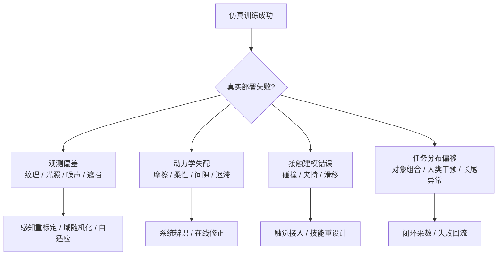

## 表 14-1 主流仿真平台能力边界比较表

见 [14-主流仿真平台能力边界表](D:/Projects/embodied-intelligence-report/docs/report/current/tables/14-主流仿真平台能力边界表.md)。

---

# 第十五部分 机器人硬件、系统集成与部署约束

具身智能最容易被低估的一件事，是模型能力与可部署系统之间还隔着一整层硬件和系统工程现实。许多公开演示看起来讨论的是“大脑是否足够聪明”，但真正决定系统是否能进入工厂、仓库、楼宇、医院或家庭的，往往是机械结构是否可制造、执行器是否可靠、传感器链路是否稳定、算力与散热是否可承受、软件中间件是否易于维护、现场运维是否可持续。因此，本部分讨论的不是“机器人硬件简介”，而是为什么硬件路线与系统集成方式会直接决定现代具身系统的上限。

一个有代表性的现实信号是：近年的具身系统越来越不是“单模型论文”，而是“本体 + 端侧算力 + 传感器栈 + 中间件 + 运维链路”的整体方案。NVIDIA Jetson/Isaac 体系明确把嵌入式算力、ROS 加速栈、仿真、训练和部署放在同一产品叙事中；Figure Helix 也明确公开了其双系统、双嵌入式 GPU 的机载部署结构。这些材料说明，到了具身系统落地层，模型能力从来不能脱离硬件预算和系统集成方式独立讨论。[Jetson Orin](https://www.nvidia.com/en-us/autonomous-machines/embedded-systems/jetson-orin/)、[Figure Helix](https://www.figure.ai/news/helix)

## 71. 机器人本体硬件路线

### 71.1 机械结构设计
机械结构设计不只是工业设计问题，而是算法路线的前提条件。连杆布局、自由度分配、刚度、重量分布和可达工作空间，会直接决定感知盲区、控制难度、动作库设计和可执行任务集合。很多所谓“通用智能”在换一个本体后失效，根源并不在模型，而在原先默认的机械条件消失了。

因此，本体结构不应被视作算法之外的外部变量，而应被视作具身系统共同定义问题空间的一部分。谁忽略这一点，谁就会系统性高估模型迁移能力。

同样的“任务成功率”在不同本体上往往并不具有可比性，因为本体结构本身决定了感知盲区、可达姿态集合、接触方式和稳定性边界。也正因此，算法评测若脱离本体约束，很容易夸大跨平台结论。对长期跟踪行业的人来说，阅读系统进展时必须先问“这个能力建立在哪种本体假设上”，再问“这个能力是否可迁移”。

机械结构不是“承载模型的壳”，而是决定可达空间、负载边界、刚柔特性、维护难度和制造成本的第一性对象。人形、双臂、四足、移动操作平台和固定机械臂之所以在系统能力与商业路径上差异巨大，根本上就是因为机械结构决定了问题空间本身。

这也意味着机械结构不是中性容器，而是问题定义器。自由度数目、连杆长度、底盘形式、重心布局和工作空间会直接改变感知、规划与控制的难度分布，因此“算法能力”永远是在具体本体上成立的局部结论，而不是漂浮在硬件之外的抽象属性。

### 71.2 执行器与关节设计
执行器与关节设计决定的，不只是最大速度和最大力矩，还决定控制带宽、柔顺性、热管理、噪声、寿命与维护周期。这些因素会反过来限制高层策略能否被稳定兑现。例如一个在仿真里看起来简单的快速纠偏动作，在真实执行器上可能因为延迟、背隙或热限制而不可行。

因此，执行器选择本质上也是智能设计。它决定了系统可以在哪种时间尺度上做闭环，能否承受高频微调，以及错误发生后有多大恢复余地。

执行器路线决定了功率密度、背驱性、控制带宽、热管理和能耗。一个“会规划”的系统，如果执行器热崩溃、减速器寿命不足或关节响应过慢，就不可能稳定部署。

对具身系统尤其要强调一点：算法往往默认动作空间可以被可靠执行，但真实执行器并不会无条件满足这种假设。带宽不够时，高层输出再合理也会在低层变成滞后动作；背驱性差时，接触操作与人机协作的安全性会显著下降；热管理差时，系统在短时演示中可以工作，却无法支撑长时运行。执行器并不是被动“把动作做出来”的末端元件，而是在反向定义算法究竟能假设怎样的控制世界。
从系统弹性角度看，执行器也决定了模型误差可被吸收多少。高带宽、低回差、热余量足够的执行器，能够容忍上层策略一定程度的粗糙性；反之，任何一点动作抖动或时延都会迅速转化为振荡、打滑或能耗异常。因此，执行器选型常常直接决定系统对大模型不确定性的容忍边界。

这也是为什么很多“算法换代”最终会回到执行器现实：如果硬件本身无法稳定兑现高层动作意图，那么更复杂的策略往往只是在把误差更快地下传。对具身系统而言，执行器能力不是背景常量，而是高层智能能否真正落地的增益上限。

### 71.3 末端执行器与灵巧手
末端执行器与灵巧手决定的，不只是“能不能抓”，而是“以什么方式抓、允许多大误差抓、抓错后能否恢复”。两指夹爪、吸盘、软夹爪、多指灵巧手和专用工装并不是同一问题上的不同参数，而是不同操作哲学。前者更强调低成本、强约束和高可靠，后者更强调姿态自由度、接触调节和潜在通用性，但也伴随更高控制与维护复杂度。

因此，末端选择不应只按“自由度越高越先进”来判断。很多高价值落地场景真正需要的不是最灵巧的手，而是最稳定、最便宜、最容易维护、最容易被客户接受的执行器组合。灵巧手更像是在扩大任务边界，而夹爪与工装更像是在压缩任务不确定性；谁更优，取决于公司是在争取短期交付还是长期通用能力上限。
末端执行器与灵巧手决定的，不只是“能不能抓”，而是“以什么方式抓、允许多大误差抓、抓错后能否恢复”。两指夹爪、吸盘、软夹爪、多指灵巧手和专用工装并不是同一问题上的不同参数，而是不同操作哲学。前者更强调低成本、强约束和高可靠，后者更强调姿态自由度、接触调节和潜在通用性，但也伴随更高控制与维护复杂度。

因此，末端执行器的选择本质上是在决定算法要面对什么难度等级。很多看起来“智能更强”的系统，只是因为它被允许使用更简单、更强结构化的末端工具；反过来，一旦换成通用灵巧手，感知、接触建模和控制难度都会同步上升。这也是为什么本报告始终把“本体工具链”与“算法路线”放在一起讨论。

末端执行器之所以关键，是因为它是语义计划第一次真正接触物理世界的地方。高层模型可以正确判断“应该拿起杯子”，但如果抓手开合范围、接触材料、指尖摩擦和力控精度不匹配，整个系统仍会在最后一厘米失败。很多所谓“模型问题”最终其实是末端执行器适配不足的问题，只是这个问题在论文叙事里常被高层模型光环掩盖。

很多具身系统最终卡住的地方，并不是“不会理解任务”，而是末端执行器不够适配、灵巧手不够稳、抓取策略无法覆盖长尾对象。也就是说，硬件接口和动作能力边界在末端最直接暴露出来。
灵巧手尤其体现这种张力。它一方面显著提升了操作上限，使旋拧、重抓、双指拨动、复杂接触调整等任务成为可能；另一方面也把控制、校准、磨损、故障诊断和数据采集复杂度大幅抬高。灵巧手因此常常是“能力上限”和“工程复杂度”之间最剧烈的摇摆点。

### 71.4 本体差异为什么会反过来改写算法路线
本体差异会改写算法路线，是因为智能从来不是悬浮在身体之上的。不同本体拥有不同的观测方式、接触模式、约束集合和失败后果，因此同一种学习与规划方法在不同本体上往往对应完全不同的有效性边界。轮式移动平台、人形、固定臂和双臂系统并不是在同一问题上做同一件事。

从系统角度看，本体其实决定了“最容易把什么做对、最容易把什么做错”。固定臂更容易把感知视角、工作空间和接触条件稳定下来，因此算法可以更依赖示教、重复和局部精调；人形或移动操作系统则要同时面对平衡、导航、遮挡、接触和长链条恢复，导致状态空间和失败模式一起爆炸。于是算法路线也不得不更强调分层决策、局部安全冗余和可恢复执行，而不是只追求单次动作最优。

这也解释了为什么某条在特定本体上表现亮眼的路线，并不应自动被翻译成“通用更先进”。很多时候，算法成绩的一部分其实来自本体给出的强先验，例如吸盘末端把抓取问题压缩成吸附判定，或固定相机布局把三维感知问题压缩成有限视角识别。比较模型时若忽略这些身体条件，就很容易把“本体优势”误读成“算法优势”。

这意味着算法比较若不注明本体条件，就很容易失真。很多路线看似“更强”，只是因为它依赖了更友好的身体假设。报告后续比较企业和论文时，应持续保留这种本体敏感性。

这也是为什么很多真正成熟的系统路线，最后都会回到“平台定制化通用性”而非抽象的一体化通用性。也就是说，模型可以共享上层语义与部分技能结构，但很少能完全无视本体差异地共享整条执行链。谁忽视这一点，谁就容易高估跨平台预训练或通用策略接口的直接可迁移性。

同一套算法在固定臂、移动操作平台和人形上往往表现完全不同，根源并不只是数据集差异，而是动作空间维度、视角耦合、稳定性边界和接触几何都被本体改写了。因此，“通用具身模型”如果不把本体差异纳入设计变量，就容易把平台间迁移难度说得过于轻松。
因此，不存在脱离本体的“最佳算法”。同样的数据组织方式、动作表示和接口抽象，在不同本体上可能需要完全不同的技能切分、安全边界和评估指标；真正成熟的系统路线通常不是忽略本体，而是显式承认本体会反过来重写算法问题本身。

## 72. 传感器与板载计算

### 72.1 相机、IMU、力觉、触觉
这些传感器之所以必须并列讨论，是因为它们分别对应不同时间尺度和不同类型的不确定性。相机更擅长提供远距离、全局、语义化信息，`IMU` 更适合快速姿态与加速度估计；力觉与触觉则在接触发生后提供视觉难以替代的局部状态反馈。系统是否真正具备闭环韧性，很大程度上就取决于它能否在这些信号之间完成有效分工。

也正因此，传感器设计不是“多多益善”的堆料问题，而是信息职责划分问题。若视觉已经足以完成远场定位，就未必需要再让它承担细粒度接触判断；若触觉只能在接触后工作，就不能把避碰责任完全压给触觉层。成熟系统往往先明确每类传感器在何时最可信、何时只是辅助信号，再围绕这种可信度结构来设计融合与回退逻辑。
这些传感器之所以必须并列讨论，是因为它们分别对应不同时间尺度和不同类型的不确定性。相机更擅长提供远距离、全局、语义化信息；IMU 更适合快速姿态与加速度估计；力觉与触觉则在接触发生后提供视觉难以替代的局部状态反馈。系统是否真正具备闭环韧性，很大程度上就取决于它能否在这些信号之间完成有效分工。

更进一步说，传感器选择并不是“越多越好”。每增加一种模态，就会增加标定、同步、带宽、噪声建模和维护成本。真正成熟的系统会围绕任务需要决定最关键的观测变量，而不是无差别堆叠传感器。对学习者而言，这一点很重要，因为它能避免把多模态误读为天然先进。

传感器栈设计不是越多越好，而是必须围绕任务链路决定：哪些状态必须高频可见，哪些观测必须低延迟，哪些冗余是为了安全，哪些信号只是为了离线调试。

在很多失败部署中，问题并不出在传感器“数量不足”，而出在职责不清。例如，相机同时承担高层识别、局部避障、接触前精定位和失败诊断，结果任何一个链路的时延或失焦都会拖垮整条系统。更合理的传感器分工通常是：视觉负责较丰富但相对慢的远距语义，IMU 与编码器负责高频本体状态，力觉和触觉在接触阶段接管关键反馈。
成熟传感栈的标志，不是堆更多模态，而是职责边界清楚。相机负责远距语义和几何，IMU 与编码器承担高频状态估计，力觉与触觉服务接触闭环，日志与回放系统负责事后诊断；只有在这种明确分工下，多模态融合才会从“信息更多”变成“系统更稳”。

### 72.2 算力、功耗与散热
算力、功耗与散热之所以要放在同一个小节，是因为它们在真实机器人上几乎从来不是彼此独立的变量。更大的模型往往意味着更高的推理吞吐需求，更高吞吐又意味着更高功耗，而更高功耗最终会转化为散热、续航、体积和结构设计压力。于是，“能不能部署某个模型”常常首先不是算法问题，而是热设计与能源预算问题。

若把这层约束写得足够朴素，可以近似理解为：

\[
\text{deployable model} \subseteq \{\text{latency}, \text{power}, \text{thermal budget}\}
\]

也就是说，一个模型即便精度更高，只要超过现场功耗或散热预算，就未必是更优系统选择。

大模型进入机器人之后，算力与能耗问题被显著放大。端侧算力不够，推理时延会上升；算力太强，散热和电源设计又成为瓶颈。于是，“模型能不能跑”在机器人里从来不是软件问题，而是功耗-体积-续航-散热共同约束的问题。Jetson Orin 官方页面给出的产品线信息就很能说明这种现实：同一代模块需要在 10W 到 60W 甚至更高的性能-功耗区间内做取舍，而不同部署平台能接受的热设计空间完全不同。[Jetson Orin](https://www.nvidia.com/en-us/autonomous-machines/embedded-systems/jetson-orin/)
算力、功耗与散热因此不是部署后的收尾工作，而是模型设计阶段就必须前置考虑的约束。一个在实验台上依靠高风量散热、外接供电和短时推理才能工作的模型，往往并不自动等价于可机载、可移动、可长时运行的系统能力；很多“模型选型”实际上都是热预算与续航预算上的系统取舍。

### 72.3 通信与同步
通信与同步看起来像中间件细节，实际上是很多具身系统成败的隐性分水岭。感知、状态估计、规划、控制和日志记录若不在同一时间轴上对齐，系统就会在高层看似合理、底层却持续失配。尤其在多相机、多关节、多计算节点和远程监控同时存在时，毫秒级偏差都可能被接触任务放大成失败。

因此，同步不是后台工程问题，而是控制正确性的一部分。一个模型若在离线回放里表现很好，真机却总在接触前后出错，根源有时不是策略不行，而是数据与控制链路时钟不一致。后续报告涉及系统案例时，应持续注意这一类“看不见但决定闭环”的因素。

从系统工程角度看，很多“模型偶发失灵”最后都会被追溯为通信拥塞、消息延迟抖动、同步漂移或队列堆积问题。机器人系统之所以难维护，正是因为这些问题在短演示中不一定出现，却会在长时运行中积累成结构性故障。也因此，时间同步和通信质量不应被视为基础设施细节，而应被视为闭环能力的一部分。

多传感器、多控制器和云边端协同时，通信链路与时间同步本身就是能力边界。一个感知模型再强，如果跨模块时间戳混乱，闭环控制仍然会出问题。
这类问题之所以危险，在于它们经常以“偶发不稳”“难以复现”“看似像模型退化”的形式出现。实际上一旦观测、状态和动作流的时间基准错位，任何高层智能都会被底层不一致性侵蚀。因此，同步与通信不是底层洁癖，而是系统可诊断性、可维护性和可验证性的基础。

从部署视角看，同步问题最糟糕的地方在于它往往不会立刻表现为彻底失效，而是表现为难以定位的概率性退化。也正因此，成熟系统通常会把时间戳一致性、消息延迟统计、队列积压监控和回放一致性检查纳入默认运维工具链，而不是等故障出现后再临时排查。

### 72.4 端侧算力预算如何约束模型
端侧算力预算并不只是“模型能不能跑起来”的问题，而是直接决定系统可以拥有什么样的时间结构。若推理延时太高，系统就必须减少决策频率、增大动作 chunk、或把更多职责下放给传统控制器；若功耗和散热压力太大，模型即便在短时演示中可跑，也可能在长时间现场运行中不可持续。于是算力预算会反过来改写动作表示、调度策略和安全回退设计。

这意味着端侧算力不是部署阶段才考虑的约束，而应在模型设计初期就进入问题定义。一个离线很强、在线很慢的模型，并不只是“部署还要优化”，而可能从一开始就没有回答真实机器人闭环最关键的时间问题。
端侧算力预算的约束方式非常直接：它会同时决定可接受的模型规模、上下文长度、感知刷新频率和安全冗余策略。若算力预算不足，系统往往必须在“更高精度的单次推理”和“更高刷新率、更低时延的连续闭环”之间做取舍。

一个最小预算判断可以写成：

```python
if model_latency > control_deadline:
    use_smaller_model_or_chunked_policy()
```

这说明端侧算力预算不是部署后才考虑的小问题，而是会反过来塑造动作表示、架构分层和推理频率设计。

因此，端侧模型选择本质上是系统级预算分配问题，而不是单独的算法偏好问题。更大的模型可能提升语义理解，却也可能挤压续航、散热和执行稳定性预算；很多时候，部署上的最优解并不是“最准的模型”，而是“在预算内整体效果最稳的模型”。

若把部署预算极简化地写成：

\[
P_{\text{total}} = P_{\text{compute}} + P_{\text{actuation}} + P_{\text{sensing}} + P_{\text{cooling}}
\]

那么很多“为什么不用更大的模型”的答案其实都藏在这个等式里。对机器人而言，\(P_{\text{actuation}}\) 与 \(P_{\text{sensing}}\) 经常已经占用很大份额，留给 \(P_{\text{compute}}\) 与 \(P_{\text{cooling}}\) 的空间远比数据中心推理小得多。

## 73. 软件栈与中间件

### 73.1 ROS/ROS 2
ROS/ROS 2 的意义，不只在于提供通信中间件，更在于它们长期充当了机器人系统模块化组织的事实标准。消息接口、节点划分、工具链生态和调试方式，都会通过这套框架影响团队如何设计系统边界。即使某些商业系统不会完整沿用 ROS，也常常在概念与工程习惯上受到它深刻影响。

因此，理解 ROS/ROS 2 的价值，不应只停留在“会不会用工具”，而要看到它们如何塑造了机器人系统的组织方式，以及为什么具身系统即便引入更强学习模块，也依旧需要稳定中间件层。

对报告读者而言，理解 ROS/ROS 2 的价值不应停留在“会不会用工具”，而应上升到“为什么机器人需要稳定的软件总线”。一旦感知、规划、控制、日志、监控和运维都要长期协作，中间件就不再只是开发便利性问题，而是系统可维护性问题。很多企业路线看似在“卷模型”，实则大量工程差异都积累在消息流、状态机和调试链路中。

ROS/ROS 2 的长期重要性，并不在于它们是“最新框架”，而在于它们提供了模块通信、消息抽象、调试和生态整合的事实标准接口。很多系统即使高层模型完全不同，底层工程仍然会在某种程度上依赖类似中间件结构。
更准确地说，ROS/ROS 2 的价值不仅在工具生态，而在于它们为“模块如何通信、状态如何暴露、日志如何回放、问题如何定位”提供了公共回答。对长期演进的具身系统而言，这种公共回答会直接影响团队协作效率、故障排查成本和后续模型替换的摩擦。

### 73.2 实时控制系统
实时控制系统的职责，并不是简单地“把命令发快一点”，而是为整个具身系统提供可预测的局部稳定基础。高层模型可以偶尔犯错并被回退，但底层控制若无法稳定守住频率、抖动和安全边界，那么所有上层能力都会被瞬间放大为物理风险。也正因此，很多看似不够“AI”的实时控制栈，反而构成了整套系统最不可替代的安全骨架。

从工程组织角度看，实时控制系统还承担版本隔离作用。它让上层模型、规划和任务接口可以更快试错，同时尽量避免每次模型更新都直接冲击最敏感的物理回路。没有这层隔离，研发速度和部署安全往往会彼此拖累。
实时控制系统的核心不是“运行得快”，而是“在确定的时间预算内稳定运行”。机器人控制最怕的并不是平均时延略高，而是抖动过大、最坏情况不可控。一次偶发的调度延迟、缓存阻塞或线程抢占，就可能让本来稳定的接触与平衡任务突然失效。

因此，实时控制系统应被理解为对时间一致性的工程承诺。它要求软件架构、操作系统、线程调度、总线通信和安全机制共同围绕最坏情况约束设计，而不只是围绕平均性能优化。这一点也是很多 AI 团队进入机器人后最容易低估的现实门槛。

机器人一旦进入毫秒级控制，就必须面对一般 AI 软件系统很少处理的实时性要求。调度抖动、线程优先级、控制器循环时间和硬件驱动稳定性，都会直接决定系统是否可用。

这里的困难在于，大模型与现代推理栈天然不是为硬实时设计的。它们喜欢批处理、容忍推理波动、追求平均吞吐；而机器人控制往往宁可牺牲一点平均性能，也要保障最坏时延上界。因此，真实系统通常不得不把高层推理、技能执行、控制环和安全监控拆到不同频率域和不同优先级上运行。
这也是 ROS 2、DDS QoS、实时 Linux 与本地 watchdog 机制在具身系统中长期重要的原因。它们并不是“老派工程细节”，而是把概率性 AI 输出装进确定性控制系统的必要胶水。[ROS 2 Documentation](https://docs.ros.org/en/rolling/index.html)

### 73.3 感知、规划、控制的模块协同
模块协同真正难的地方，不在于“模块之间能不能通信”，而在于它们是否共享一致的时间轴、状态定义和异常语义。感知认为目标已经对准、规划认为路径仍安全、控制却检测到接触异常，这类跨模块认知冲突若没有统一解释机制，就会在现场不断演化成难以复现的失败。

因此，协同设计的关键往往是中间合同而不是算法本身。每个模块必须明确自己输出的置信度、适用边界、终止条件和异常上报方式。只有这样，系统才不是单纯把多个强模块串起来，而是真正形成可诊断、可回放、可回退的整体。

感知、规划、控制的模块协同问题，表面上看像系统集成细节，实际上往往决定整机是否能稳定工作。感知输出若延迟或不稳定，规划层就会建立在过时状态之上；规划层若给出的目标不可执行，控制层就只能不断做保守补偿；控制层若无法把异常及时反馈回来，高层又会持续基于错误假设做后续决策。

因此，系统协同的关键不只是模块都“各自够强”，而是模块之间是否在时间尺度、接口语义和异常处理上形成闭环。很多部署失败并不是由单个算法模块能力不足造成，而是由模块之间的弱错配长期积累出来的。

模块协同难，不只是因为模块多，而是因为每个模块都在不同时间尺度上工作且互相依赖。感知误差会改变规划可行域，规划延迟会改变控制稳定区间，控制抖动又会反过来污染感知输入，这种闭环耦合是软件系统里少见而在机器人里极常见的复杂性来源。真正的系统集成能力，往往体现在能否把这些耦合控制在可诊断、可回退的边界内。

系统集成真正困难的地方，是这些模块不是串行调用关系，而是一个持续相互影响的闭环。很多实验室系统之所以难以转为产品，并不是因为单模块不够强，而是跨模块耦合、异常传播和调试成本过高。

### 73.4 “模型接 ROS”并不等于系统集成完成
把模型接进 ROS 或 ROS 2，只意味着它进入了消息总线，并不意味着它已经成为可用系统的一部分。真正的系统集成还需要解决消息频率匹配、时间同步、异常处理、节点重启、状态回传、权限边界和安全回退策略。也就是说，“能收到图像、能发出动作”只是集成的起点，而不是终点。

一个最小集成链路通常至少包含：

1. 感知消息订阅与时间戳对齐。
2. 模型推理服务或节点封装。
3. 动作输出与控制接口适配。
4. 失败监控、回退策略与日志记录。

这是具身系统里非常常见的误解。把一个视觉模型或策略模型挂到 ROS topic 上，只说明接口打通了；但真正的系统集成还包括时间同步、故障传播控制、日志回放、状态机回退、安全栅栏与现场维护工具。也正因为如此，工程团队常常把大量时间花在“模型之外”的中间件调试上。

如果把系统集成理解成“把 AI 模型挂到现有机器人软件上”，就会系统性低估大量非算法工作。真正让系统可交付的，往往是那些不显眼但决定稳定性的细节：例如图像与本体状态是否严格对齐、多个节点之间的 QoS 配置是否合理、推理超时是否触发安全停机、上游感知缺帧时下游控制是否继续输出旧命令、模型升级后回归测试是否覆盖历史失败案例。

因此，这一节最应该建立的观念是：模型只占系统中的一个节点，而产品级机器人需要的是一条“可观测、可诊断、可回退、可恢复”的执行链。很多 demo 能跑，是因为操作者在旁边手动兜底；很多产品跑不稳，则是因为系统把人的临场判断误当成了软件架构的一部分。

## 74. 部署约束

### 74.1 实时性
实时性在机器人语境里不是泛泛的“响应更快”，而是系统不同层在各自时间尺度上都必须满足可预测的更新周期。高层任务规划可以秒级刷新，局部动作策略可能需要几十毫秒，平衡与接触稳定则常常要求更高频率。若把这些层混在一起统一追求“更强模型”，就很容易牺牲掉真正关键的快回路。

一个有用的思考方式，是把闭环时延显式写成：

```text
T_total = T_sense + T_transport + T_infer + T_plan + T_act
```

若 `T_total` 超过该层闭环允许的时间窗口，那么再“聪明”的模型也只能在错误的时机做出正确判断。对抓取前姿态微调、双足平衡和接触稳定任务尤其如此，因为真正稀缺的能力往往不是语义推理，而是及时反应。

因此，成熟架构通常不会试图让同一个大模型承担所有频率层，而是清楚区分哪些决策值得耗时、哪些决策必须即时。慢但强的模型适合做语义解释、阶段切换和异常归因；快但窄的控制器则负责局部闭环。这种分工并不是妥协，而是物理系统对智能组织方式的基本要求。

所以，讨论实时性时最该追问的不是模型峰值能力，而是能力被放在了什么时间层里执行。谁能把快慢回路清楚分层，谁就更接近可部署系统；谁把一切都压进单一慢模型，谁就更容易在现实中失稳。

实时性之所以必须单列，是因为具身系统里很多失败并不是“决策错误”，而是“决策来晚了”。同样一个动作命令，早 50 毫秒和晚 50 毫秒抵达控制层，物理后果可能完全不同。因此，机器人里的性能优化不能只看平均吞吐与平均延时，更要看最坏时延上界与时延抖动。

闭环控制、障碍回避和接触调节都要求严格的时间预算。现实部署中，时延不只是性能下降源，更可能是安全风险源。
因此，实时性本质上也是资源伦理问题：哪些能力值得占用多少时间预算，哪些推理必须在超时后被硬切断，哪些判断必须让位给本地回退。一个模型的真正价值，不是离线精度有多高，而是在严格时间预算下还能保留多少有效能力。

### 74.2 可靠性
在机器人语境里，可靠性并不只是“平均成功率高”，而是“长时间运行时是否仍保持可预测行为”。这通常要求系统在传感器掉帧、网络抖动、对象轻微漂移、局部碰撞、模块重启和偶发异常下仍然不会迅速失控。

这里最需要防止的误判，是把 demo 成功率直接等价为系统可靠性。一次演示中的成功，往往只证明系统在某个狭窄条件下可以完成任务；而可靠性关心的是条件逐渐偏离、部件轻微老化、现场持续扰动后，系统会怎样退化。它是平滑降级、局部恢复，还是突然冻结、状态丢失、需要人工重启？这三种退化方式在产品意义上完全不同。

因此，更有信息量的可靠性指标通常包括 `MTBF`、接管频率、平均恢复时间、误停机率和版本升级后的回归故障率。只有把这些信号与成功率放到一起，才能判断一个系统是否真的具备长期运转能力，而不是只具备“拍出一段成功视频”的能力。

因此，可靠性更适合被看作多层属性：

1. 模块可靠性：单个组件是否稳定。
2. 闭环可靠性：模块耦合后是否稳定。
3. 运维可靠性：长时间现场运行是否可恢复、可监控。

机器人部署看的不是某次最好的成功率，而是长时间运行中的平均稳定性、故障间隔、可恢复性和维护可预测性。

在现场语境里，可靠性至少包含三层含义。第一层是动作可靠性，即单次操作是否稳定；第二层是系统可靠性，即连续运行数小时或数天后是否仍保持可接受表现；第三层是运维可靠性，即故障发生后是否能被快速诊断、回放、定位并恢复。很多研究系统在第一层表现不错，却在第二层和第三层几乎没有准备，因此无法真正跨过“研究演示”与“交付系统”之间的门槛。

### 74.3 成本与制造可行性
成本与制造可行性不是商业附录，而是技术路线的筛选器。一个系统若只能依赖高价执行器、复杂装配、高频人工校准和稀缺零部件，即使功能成立，也很难进入大规模复制阶段。很多研究路线的真正分水岭，不在实验室能否跑通，而在成本结构能否随着迭代收敛。

更准确地说，制造可行性讨论的不是“今天单台能不能做出来”，而是“明天一百台、一千台时会在哪里失控”。一旦规模上升，装配公差、标定一致性、返修率、备件通用性和供应链波动都会突然成为主问题。某些在实验室阶段看起来合理的技术选择，到了量产阶段可能因为良率太低、维护太重或关键零部件过于稀缺而失去意义。

这也是为什么成本结构本身会反过来约束算法与系统设计。若末端执行器太贵，系统就必须更强调抓取成功率与保护策略；若标定成本太高，模型与接口就必须更能吸收几何误差；若现场维护负担太重，架构就必须支持模块化更换、远程诊断和更强的本地回退。换言之，制造可行性不是部署后的附加考虑，而是从一开始就塑造技术上限的硬约束。

因此，本章更强调把 BOM、装配良率、标定工时、备件策略和维护周期一起纳入系统评价。谁能持续把这些变量压低，谁的技术路线才更可能成为产业路线，而不只是实验路线。

制造可行性会反过来塑造技术路线。若某类传感器、减速器或算力模组无法稳定供货，系统即使技术上可行，也难以形成持续交付能力，因此产业判断不能只看单台样机表现。很多路线之所以最终难以商业化，不是因为实验失败，而是因为无法跨过可制造性与供应链一致性这道门槛。

一个实验室系统即使能力强，如果 BOM 成本过高、制造良率不足、供应链不稳定，就很难形成大规模部署路径。
这里要看的也不只是 BOM。批量化要求一致性、工装夹具、校准流程、备件体系和维护培训一并可复制，否则样机成功并不能自然推导出规模化交付可行。因此，可制造性不是附加考量，而是从一开始就会重写系统设计的核心约束。

### 74.4 维护、升级与现场运维
很多具身系统在实验室里看起来接近完成，真正进入现场后却被运维问题重新打回原形。原因不在模型突然变差，而在现场世界要求系统面对备件更换、传感器漂移、版本回滚、网络中断、客户误操作和安全责任界面这些实验室里很少完整暴露的问题。维护能力因此不是售后附属项，而是产品能否持续存在的组成部分。

更成熟的运维体系通常会把问题分成三层：本地可自动恢复的问题、远程可诊断并修复的问题、以及必须人工现场介入的问题。谁能持续把更多故障从第三层压缩到前两层，谁就更接近可扩张交付。
维护、升级与现场运维经常被低估，因为它们在 demo 中几乎不可见，却在真实部署中持续吞噬成本。传感器清洁、关节磨损、线束老化、版本回滚、日志回收、备件更换和现场重新标定，都会随着部署规模扩大而迅速放大。一个短期能跑的系统，不等于一个长期可维护的系统。

因此，升级能力必须与回退能力同时设计，现场运维能力也必须被当作产品定义的一部分。谁只会“发布新版本”，却没有低风险升级和快速回滚机制，谁的部署规模越大，风险反而越高。

这意味着“可更新性”本身就是架构设计目标。日志能否回收、模型能否灰度升级、异常能否远程诊断、控制参数能否安全回滚，这些问题都会决定系统是不是只适合演示，而不是适合长期运行。对于具身系统而言，运维不是售后附属流程，而是能力闭环的一部分。

机器人不是一次性交付软件。传感器会老化、执行器会磨损、环境会变化、模型会过时，因此现场运维是能力的一部分，而不是售后附属品。
进入商业期后，运维往往会从“支持功能”变成主导变量。能否远程诊断、快速替换故障模块、灰度发布模型、回放历史异常、隔离问题版本，决定了系统究竟能不能活过大规模部署后的维护周期。

### 74.5 成本模型与系统取舍
成本模型的意义，不只是解释“为什么现在贵”，而是帮助判断哪些技术选择会在规模化时越做越贵，哪些选择会随着迭代逐步收敛。某些路线在单机阶段看起来并不离谱，但只要一进入批量装配、跨客户部署和长期维护，隐藏成本就会快速显性化；另一些路线虽然前期研发重，但一旦接口稳定，后续复制成本会明显下降。

因此，系统取舍不应只按当前性能最优来做，而应同时问：这个选择会不会把未来的制造、标定、维护和升级成本一起锁死。很多“技术上最强”的方案之所以最终没成为主线，不是因为它不工作，而是因为它工作得太贵。

如果把单机交付成本粗略写成：

\[
C = C_{\text{body}} + C_{\text{compute}} + C_{\text{sensors}} + C_{\text{integration}} + C_{\text{service}}
\]

那么最容易被低估的，往往不是本体材料费，而是 \(C_{\text{integration}}\) 与 \(C_{\text{service}}\)。后两项分别对应系统打通、现场调试、维护、升级、故障响应和模型回归测试，是 demo 系统与产品系统之间最常见的差距来源。

这一定义之所以重要，是因为许多路线判断只盯着 \(C_{\text{body}}\) 或 \(C_{\text{compute}}\)，却忽略了交付后长期运营的隐性成本。对很多行业客户而言，真正敏感的不是单次采购价，而是单位任务成功所需的总拥有成本，即是否需要高频人工值守、是否经常返场调试、是否一升级模型就要重新做大规模验证。

也因此，系统取舍不只是“更强模型”与“更便宜硬件”之间的权衡，而是要看哪种方案能持续压低 \(C_{\text{integration}}\) 与 \(C_{\text{service}}\)。若一个系统理论能力更强，但每次场景迁移都需要资深工程师长时间重新校准，那么它在商业上未必优于能力稍弱但部署流程高度标准化的方案。

## 75. 云边端协同架构

### 75.1 云端训练
云端训练之所以关键，是因为具身系统的模型训练、日志分析、数据回放和批量评测通常离不开集中式算力与存储。但这并不意味着系统智能天然属于云端。更准确的说法是：云端负责加速学习、比较与版本管理，端侧负责承担时延敏感、风险敏感的执行闭环。

因此，云端训练的价值主要体现在缩短迭代回路，而不是取代现场系统。一个成熟团队更应关注的是：云端如何更快吸收现场问题，并把改进安全地回写到端侧。

云端训练之所以重要，是因为具身模型越来越依赖大规模多模态数据和较长训练周期，本地单机很难承担全部实验负载。云端提供了弹性算力、集中式实验管理、分布式训练和版本化协作能力，使得数据、模型和日志更容易被组织为长期基础设施。

但云端训练并不等于问题解决。对机器人团队而言，真正困难的往往在于如何把云端训练成果稳定压缩回端侧部署约束中，以及如何保持云端数据资产、模拟实验和真实现场日志之间的一致性。也就是说，云端训练解决的是规模问题，不会自动消除部署鸿沟。

云端之所以重要，不仅因为算力集中，更因为它承担着版本管理、数据治理、评测回归和模型分发等基础设施职责。对长期维护的机器人系统而言，训练云端往往就是“能力演进后台”。没有这个后台，模型更新很容易退化为零散试验，而无法形成可追踪的能力版本体系。

大规模训练、模型更新、数据回流和跨平台联合优化通常更适合在云端进行。
从更高一层看，云端训练也是能力治理设施，而不只是算力汇聚点。它决定了数据如何入库、版本如何追踪、回归如何验证、模型如何批准发布，因此直接关系到后续每次报告更新时我们如何判断“能力提升”究竟来自哪里。

### 75.2 边缘推理
边缘推理的本质，是把模型能力放到距离传感器和执行器更近的位置，以换取更低时延、更高可控性和更少网络依赖。它通常不是简单“把云上模型搬到本地”，而是需要重做模型裁剪、运行时优化、内存与线程调度，甚至重新设计高低层分工。

一个极简边缘推理循环可以写成：

```python
obs = sensor_buffer.read_latest()
action = edge_model.infer(obs)
controller.send(action)
```

它看似简单，但背后真正决定可用性的，是推理时延是否稳定、峰值负载时是否退化可控，以及异常时能否快速切回本地保底策略。

为了降低时延和提升隐私控制，越来越多推理会下沉到边缘节点或本地控制计算单元。

但“边缘推理”并不是简单把云端模型搬到机身上。它意味着重新面对显存、功耗、散热、供电波动、振动环境和现场升级困难等一整套约束。也因此，边缘部署通常伴随模型蒸馏、量化、裁剪、动作接口收缩和多级回退策略设计。真正值得关注的不是某个模型“理论上能跑在边缘”，而是它能否在边缘稳定、持续、可维护地运行。
换句话说，难点不是“能塞进去”，而是“能长时间跑下去”。一旦考虑电源波动、热积累、机械振动、网络断连、版本不一致和现场维护受限，很多在实验室里勉强可跑的边缘方案都会暴露出真实脆弱性。

把边缘推理放在具身系统里看，其核心不只是“本地更快”，而是“本地是否更可控”。一旦模型部署到端侧，团队就必须重新面对显存预算、热设计、功耗峰值、线程竞争、实时调度和驱动兼容性等问题。很多在服务器上表现良好的模型，到了边缘设备上，真正的瓶颈并不是 FLOPs，而是内存搬运、算子支持和推理抖动。

因此，边缘推理设计通常会伴随一轮系统重构：把高频控制和安全监视尽量留在最靠近执行器的位置，把复杂语义理解或非实时规划放在更慢层，必要时再由云端或后台系统提供低频更新。真正成熟的部署，不是单纯把“大模型下放”，而是重新划分哪部分能力必须实时、哪部分能力可以延迟、哪部分能力根本不应在机器人本体上执行。

### 75.3 端侧安全约束与本地回退策略
端侧安全约束之所以要单列，是因为真正危险的情形往往来不及等待云端判断。网络抖动、远程推理延迟、模型短时异常或现场突发干扰出现时，本地系统必须立即决定限速、刹停、退出接触或回退到保守模式。这些策略若没有在端侧固化，系统就会把最坏时刻交给最不可靠的链路。

本地回退策略也不应只是“停机”。更成熟的做法是区分多级退化模式，例如降速继续、切换到保守技能、冻结高层命令、请求人工接管或安全停车。这样系统面对异常时才有机会保持可控，而不是只能全有或全无。

本地回退策略之所以关键，是因为网络延迟、模型抖动和传感异常都不允许依赖远端来做最后决策。真正可部署的系统，通常都会把急停、限幅、碰撞保护和最小可行控制保留在本地硬实时链路中。换言之，云边端协同的成熟标志，不是把一切都上云，而是明确哪些能力绝不能离开本地。

无论云端和边缘多强，涉及安全和快速回退的控制逻辑往往仍必须保留在端侧。这也是为什么具身系统的云边端分工，和纯软件 AI 的分工模式不会完全相同。
从可部署性角度看，本地回退成熟度几乎直接决定系统能否进入真实环境。任何涉及安全的最终责任都必须留在最靠近执行器的一层，因为只有那里拥有最低时延、最高确定性和最完整的故障隔离能力。

这也解释了为什么很多看似“云上更聪明”的能力最终只能以建议器身份存在，而不能直接拥有执行权限。对真实系统而言，最靠近执行器的一层必须掌握最终否决权，否则任何网络抖动、推理超时或高层误判都可能被放大成不可接受的物理风险。

### 75.4 极简部署伪代码

下面给出一个非常简化的部署层伪代码，用来说明“高层模型 - 边缘执行 - 端侧回退”三者的关系：

```python
observation = sensors.read()
command = edge_policy.infer(observation, task)

if watchdog.latency_ms(command) > latency_budget:
    command = local_fallback_controller.step(robot_state)

if safety_monitor.violated(robot_state, command):
    command = emergency_stop()

actuators.apply(command)
```

这段代码的重点不在复杂性，而在结构含义：真正可部署的系统一定会把“模型输出”放在更大的硬件与安全执行框架中理解。

若把它翻译成部署审查语言，这段伪代码实际上对应四个必须检查的系统问题：第一，谁负责定义时延预算；第二，回退控制器是否覆盖关键工况；第三，安全监视器基于哪些观测与阈值触发；第四，触发后系统是进入“停机”“保持姿态”还是“退回上一安全状态”。这些问题如果没有在设计时被明确回答，很多所谓部署方案其实还停留在实验系统阶段。

本部分的结论是：机器人系统真正部署时，硬件路线、系统集成方式与运维约束并不是“模型外部条件”，而是定义模型是否有现实价值的一部分。也正因为此，后文讨论企业与商业化时，不能只看模型发布，还必须看本体、硬件栈与交付能力。

如果把这一章压缩成一句话，那么最值得反复记住的是：本体不是算法的容器，而是算法假设的改写器。不同执行器带宽、减速器回差、关节刚度、传感器时延、线束与供电结构，会直接改变策略能够依赖的状态信息、动作粒度和恢复方式。也正因如此，很多在仿真中看似“只差一点点”的算法改进，落到不同本体上时会表现为完全不同的系统边界。对具身系统而言，“换硬件”通常不只是部署变化，而是问题定义变化。

为了更系统地理解部署约束，可以把整机资源预算粗略写成：

\[
B = (B_{\text{power}}, B_{\text{thermal}}, B_{\text{compute}}, B_{\text{network}}, B_{\text{maintenance}})
\]

任何新增模型能力，实质上都在消耗这五类预算中的至少一项。一个策略若需要更高频视觉输入，就会推高 \(B_{\text{compute}}\) 与 \(B_{\text{thermal}}\)；若依赖远程推理与频繁日志上传，就会推高 \(B_{\text{network}}\)；若推理不稳定导致人工接管增多，则会推高 \(B_{\text{maintenance}}\)。因此，所谓“端侧部署”不应被理解为简单模型压缩，而应理解为能力在多预算约束下的重新分配问题。成熟团队真正擅长的，往往不是把单点精度做高，而是在固定预算里做最有价值的能力排序。

从长期维护视角看，这也意味着运维体系本身就是模型能力的一部分。若一套系统只能在首发版本表现良好，却无法支持现场日志回放、回归测试、灰度升级、失效根因定位和参数回滚，那么它并没有真正形成“可持续学习的机器人产品”，而更像一次性的工程交付。后续版本维护时，应特别关注哪些公司只是发布了更强模型，哪些公司则同时降低了校准成本、替换成本和故障恢复时间；后者更接近真正的系统成熟信号。

## 图表与比较补充
本章最有价值的补充，不是再追加零散硬件术语，而是把 `模型层 - 中间件层 - 控制层 - 硬件层` 的部署栈固定成一张长期引用图。这样后文无论讨论端侧推理、企业产品还是商业化部署，都能回到同一张系统栈图里解释问题出现在哪一层。

另一项值得正式保留的，是“人形 / 固定臂 / 移动操作平台”的硬件约束比较表。它能帮助读者更系统地理解：不同本体形态不是外壳差异，而是在传感、控制、功耗、维护和任务接口上共同塑造了不同的技术与商业路线。

在当前版本中，`图 15-1 部署系统栈图` 已承担“模型层 - 中间件层 - 控制层 - 硬件层”的部署栈说明；`表 15-1 人形 / 固定臂 / 移动操作平台硬件约束比较表` 则把三类平台在传感、控制、功耗、维护和任务接口上的差异固定为正式比较口径。

因此，当新增更偏工程侧的论文、技术报告或平台材料时，更合理的处理顺序是先回看 [硬件、部署与系统工程论文清单](D:/Projects/embodied-intelligence-report/research/papers/硬件、部署与系统工程-论文清单-v0.0.md)，确认它改变的是哪一层约束，再决定如何回写正文判断。
## 图 15-1 部署系统栈图
源文件：`assets/diagrams/15-部署系统栈图.mmd`

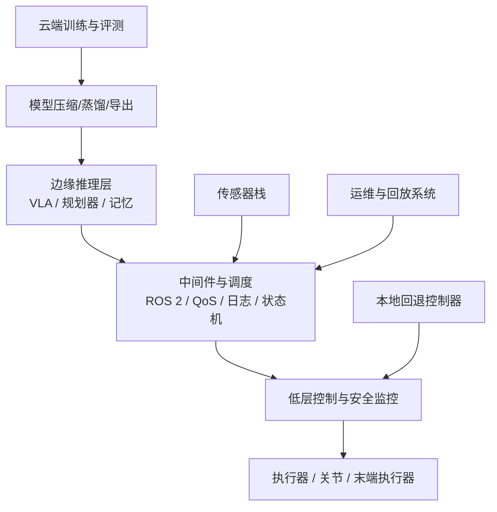
## 表 15-1 人形 / 固定臂 / 移动操作平台硬件约束比较表

见：[15-硬件约束比较表](D:/Projects/embodied-intelligence-report/docs/report/current/tables/15-硬件约束比较表.md)

这张表的意义在于提醒读者：平台形态差异不是外形差异，而是接口预算、控制复杂度、维护成本和可商业化路径的联合变化。

---

# 第十六部分 安全、对齐、验证与治理

具身系统与纯软件 AI 最本质的不同之一，就是错误不再只停留在信息层，而会转化为直接的物理后果。一次错误抓取可能损坏工件，一次错误导航可能撞到人，一次错误交互可能导致危险动作被执行。因此，安全、验证与治理在机器人系统里不是最后附加的一章，而是贯穿全链路的一级问题。

随着 foundation model 进入机器人控制栈，这一问题进一步复杂化。传统机器人安全更强调机械风险、功能安全与工作单元隔离；大模型时代则还必须处理误解指令、错误工具调用、远程运维链路、数据治理与模型责任边界。工业机器人安全标准与 AI 风险治理框架正在逐步汇合。[NIST AI RMF](https://www.nist.gov/itl/ai-risk-management-framework)、[ISO 10218](https://www.iso.org/standard/59820.html)、[ISO 13482](https://www.iso.org/standard/53820.html)

## 76. 具身安全为何是一级问题

### 76.1 物理世界中的损害与责任
如果把这一节再说得更具体一点，具身系统里的“损害”至少应分成四层：对人的直接伤害、对设备与工件的损害、对生产或服务流程的中断、以及事故后的责任追溯成本。这四层损害并不会等价出现，但任意一层过高，都足以改变系统是否允许上线、允许在什么速度下运行、允许由谁签字放行。因此，责任不是部署后的法律附件，而是系统设计阶段就会反向塑造动作权限和运行边界的内生变量。

也正因为如此，具身系统的很多“保守”设计并不是技术不够先进，而是责任结构的自然产物。限速、限力、工作空间裁剪、特定动作必须二次确认、异常时优先停机而非继续尝试，这些看起来降低了系统上限，却往往是把不可接受的责任暴露控制在可运营范围内的必要代价。对于学习者而言，这一点非常重要，因为它解释了为什么现实系统经常不会沿着“只要更聪明就行”的方向自然演化。
具身系统进入物理世界后，损害与责任不再只是“模型输出错了”，而是会具体落到人身伤害、设备损坏、现场停工、财产损失和责任归属争议。也正因如此，机器人安全讨论从一开始就带有更强的工程、法律和组织属性。对具身系统而言，责任不是部署后才讨论的外部问题，而是会反过来塑造权限边界、动作范围和接管策略的内部设计变量。

只要一个错误动作可能造成夹伤、跌落、流程中断或设备破坏，那么风险偏好、最大速度、接触阈值和人工接管机制就必须在架构阶段写进去。换句话说，责任不是后补文档，而是决定“哪些能力可以开放、哪些必须受限”的前置条件。
具身系统进入物理世界后，损害与责任不再只是“模型输出错了”，而是会具体落到人身伤害、设备损坏、现场停工、财产损失和责任归属争议。也正因如此，机器人安全讨论从一开始就带有更强的工程、法律和组织属性。
对具身系统而言，这种责任并不是抽象法务问题，而是直接塑造系统设计边界的工程事实。只要一个错误动作可能造成夹伤、跌落、财产破坏或流程中断，那么风险偏好、动作权限、最大速度、接触阈值和人工接管策略都必须在架构阶段被写进去。也就是说，责任不是部署后才讨论的外部问题，而是设计时就决定“哪些能力可以开放、哪些能力必须受限”的内部变量。

软件模型的错误通常造成错误信息、错误推荐或错误分类；具身系统的错误则可能造成物理伤害、财产损失和责任事故。这使得机器人安全天然比许多纯软件 AI 场景更高 stakes。

### 76.2 与纯软件 AI 风险的差异
纯软件 AI 风险与具身风险的根本差异，还体现在反馈时间尺度上。很多软件系统的错误可以通过人工复核、延迟执行、内容下架或版本回滚在事后缓解；而具身系统的错误常常在毫秒到秒级内完成并造成不可逆后果。也就是说，机器人安全更依赖前置限制、在线拦截和失效安全，而不是事后解释。

这会直接改变评价标准。一个在聊天系统里“整体准确率更高”的模型，迁移到具身闭环中时，未必比一个略保守但尾部风险更低的模型更安全。对机器人来说，灾难性偶发错误的代价常常远高于平均表现的微弱提升，因此后续所有性能讨论都应默认接受这一风险偏好差异。
与纯软件 AI 相比，机器人风险有两个额外维度。第一，错误会通过执行器直接作用于外部世界；第二，很多后果不可撤销。一个语言模型答错一句话，与一个移动平台在错误时机启动，不属于同一数量级风险。这意味着纯软件领域常用的平均性能口径，不能直接平移到具身系统。

因此，具身安全更强调尾部风险、最坏情况边界和可恢复性，而不仅仅是平均正确率。一个“整体准确率更高”但偶发灾难性错误的系统，未必比一个略保守但风险边界清楚的系统更可接受。
与纯软件 AI 相比，机器人风险有两个额外维度：第一，错误会通过执行器直接作用于外部世界；第二，很多损害不是可撤销的信息错误，而是不可逆的物理后果。这也是为什么具身系统的安全治理不能只停留在内容审核或输出过滤层面。
这类差异还意味着很多纯软件领域常见的评估口径不能直接平移过来。一个语言模型回答错一句话，和一个移动底盘在错误时间启动并不是同数量级风险；同样，传统 AI 中“平均性能更高”也未必能抵消具身系统中极低频灾难事件的不可接受性。因此，具身安全评估更强调尾部风险、最坏情况边界和可恢复性，而不仅是平均正确率。

纯软件 AI 更容易集中在信息真实性、偏见、隐私和误导风险上；具身系统则还要额外面对碰撞、跌倒、夹伤、误触发、失控移动和执行器失效等风险。

### 76.3 安全与商业化之间的关系
从商业角度看，安全还会直接影响客户接受方式。客户真正购买的并不只是“机器人会做事”，而是“机器人会在多大责任边界内稳定做事”。一旦系统无法清晰回答接管规则、停机条件、事故追溯、权限分层和版本回滚，很多高价值场景即使技术上可做，也很难进入正式采购流程。换言之，安全不是在商业化之后才被补上的成本项，而是商业化成立本身的组成条件。

这也解释了为什么一些看起来更慢的路线反而更容易进入真实场景。它们也许不追求最高自治率，但更早把安全约束组织成可运营条件，因而能更快跨过客户和监管的心理门槛。对研究型报告而言，这比抽象争论“安全是否阻碍创新”更有解释力。
安全与商业化并不是天然对立，而是共同决定系统是否能进入真实运营闭环。若一个系统只有在大幅压低速度、收紧工作空间和频繁人工接管下才安全，那么它的商业价值很可能也会被显著削弱；反过来，若为了追求节拍和成本而牺牲安全边界，系统又难以获得长期部署许可。两者实际上共享同一组现实约束。

因此，更成熟的商业路线并不是“先商业化、后补安全”，而是从一开始就把安全条件写进产品定义和服务模型。谁能把安全约束组织成可运营条件，谁的商业路径才更稳。

安全与商业化之间并不是简单对立关系。短期看，更严格的安全机制确实会增加开发和部署成本；但中长期看，谁能更早把安全、验证、责任追踪和异常恢复制度化，谁反而更有机会进入高价值、高责任、高复购的真实场景。也就是说，安全不只是约束，也可能是进入更高等级市场的门票。

对具身行业尤其如此。很多场景之所以迟迟难以规模化，不是因为市场没有需求，而是因为系统尚未在安全与责任层面达到可接受阈值。因此，把安全仅仅理解为“拖慢创新”的外部负担，会低估它作为商业化前提条件的地位。
安全与商业化不是彼此独立的两条线。很多机器人产品能否真正落地，决定性因素并不是 demo 里最强能力，而是系统是否能在可接受责任边界内稳定运行。换句话说，安全不是商业化之后再补的约束，而是决定哪些场景根本可以卖、可以部署、可以长期运维的前提。

也正因为如此，很多表面上看起来“进展慢”的安全要求，实际是在帮助行业区分“可展示能力”和“可签约交付能力”。对研究报告而言，把这层关系说清楚很重要，否则很容易高估炫目 demo 的产业成熟度。

对机器人而言，安全不是阻碍商业化的额外负担，而是商业化成立的前提。没有安全保证的系统，无法进入高价值真实场景。

## 77. 安全问题分类

### 77.1 物理安全
物理安全若要真正进入系统设计，不能只停留在“不要撞人”这一口号层面，而需要明确进入动作接口。更实用的做法，是把每一类动作都绑定到可验证的速度、力、距离、接触持续时间和工作空间边界上，再通过在线监测器持续检查是否越界。这样一来，模型给出的高层意图与底层可执行安全边界之间，才真正建立起工程接口。

这一点也意味着，物理安全并不只属于控制器或机械工程师。高层策略若经常把系统推向未验证姿态、狭窄空间或高不确定接触区，底层再稳也会不断被动兜底。因此，物理安全是典型的跨层问题，必须贯穿高层任务规划、中层技能调用与底层控制闭环。
物理安全关注的是“机器人动作本身会不会直接伤人、伤设备、伤环境”。它通常涉及速度、力、碰撞能量、可达区域、急停机制、隔离边界和人机接触条件。与纯软件系统不同，这里的错误不是输出错一句话，而可能是夹伤、撞击、跌落或设备损坏。

一个最小物理安全约束可以抽象为：

\[
a_t \in \mathcal{A}_{safe}(x_t, e_t)
\]

其中 \(\mathcal{A}_{safe}\) 表示在当前机器人状态 \(x_t\) 与环境状态 \(e_t\) 下允许执行的安全动作集合。
物理安全看似最传统，但在 foundation model 进入机器人后反而更需要重新审视。原因在于，高层策略的开放性增强后，机器人更可能进入过去没有显式编排过的姿态、路径和交互模式，从而触发底层原本不常见的碰撞或过载风险。因此，物理安全不只是底层控制器的事情，也取决于高层是否把系统推进了未经充分验证的状态区域。

涉及碰撞、力过载、稳定性失控、危险接触和环境破坏。

### 77.2 功能安全
功能安全的核心，不在于“平时性能高不高”，而在于“出现异常时系统是否还能退回到定义清楚的安全模式”。这一点对具身系统极其关键，因为很多危险并不是来自模型胡来，而是来自传感器掉线、节点卡死、时钟不同步、控制回路超时、执行器失配或软件版本不兼容。系统若没有明确的降级逻辑，就会在这些局部异常下以不可预测方式继续动作。

因此，一个成熟的功能安全设计通常需要显式定义状态机：正常运行、受限运行、等待确认、人工接管、安全停机、故障锁定等状态如何切换，触发条件是什么，谁有权恢复。只有这些内容被写成系统行为的一部分，功能安全才不是口头承诺。
功能安全更关心“系统在部件失效、输入异常或状态不一致时，是否仍能进入可控状态”。它不只讨论机器人平时做得对不对，而更关注传感器丢失、节点重启、通信中断、控制器卡死时，系统是否会失控或是否能够优雅降级。

一个极简功能安全思路可以写成：

```python
if sensor_fault or controller_timeout:
    enter_safe_mode()
    notify_operator()
```
功能安全更关心“系统在部件失效、输入异常或状态不一致时，是否仍能进入可控状态”。它不只讨论机器人平时做得对不对，而更关注传感器丢失、节点重启、通信中断、控制器卡死时，系统是否会失控或是否能够优雅降级。

对学习者来说，可以把它理解为：物理安全更像“不要撞”，功能安全更像“出了错也不要以不可控方式撞”。

涉及故障检测、异常停机、冗余设计、控制回退和 fail-safe 机制。很多风险不来自“模型胡来”，而来自系统在局部异常下没有及时进入安全模式。

### 77.3 网络与数据安全
网络与数据安全在具身系统里还有一个经常被低估的特点：攻击不一定要直接命中控制接口，也可能通过污染感知流、篡改任务配置、劫持更新链路、注入伪造日志或窃取环境布局数据间接造成严重后果。这意味着机器人系统的攻击面往往比看上去更宽，因为任何能影响观测、策略、更新或接管流程的入口，都可能变成行动风险入口。

所以更合理的安全设计，不是简单把机器人接上企业网络，而是按最小权限原则重新切分数据面、控制面和运维面。谁能看、谁能写、谁能下发任务、谁能更新版本、谁能远程接管，都应有明确分层。这种分层看似“IT 化”，实际是具身系统运行安全的组成部分。
网络与数据安全在机器人里尤其敏感，因为很多系统会同时暴露远程控制接口、现场视频流、内部地图、任务日志和设备身份信息。一旦这些链路被入侵，不只是数据泄露，还可能直接引发错误动作、远程操控或安全停机失效。对于联网机器人来说，这已经不是传统 IT 附属议题，而是运行安全的一部分。

更进一步看，远程更新、云端推理、遥操作接管和日志回传都在扩大攻击面。攻击者甚至未必需要直接控制执行器，只要能污染感知输入、篡改任务配置或劫持更新链路，就可能制造严重事故。因此，网络与数据安全必须进入具身系统的主架构讨论，而不能留在部署末端补救。
网络与数据安全在机器人里尤其敏感，因为很多系统会同时暴露远程控制接口、现场视频流、内部地图、任务日志和设备身份信息。一旦这些链路被入侵，不只是数据泄露，还可能直接引发错误动作、远程操纵或安全停机失效。
对于联网机器人，这一类风险的重要性正在快速上升。远程更新、云端推理、遥操作接管、日志回传和多设备协同都在扩展攻击面。攻击者未必需要直接控制执行器，只要能够污染感知输入、篡改任务配置、劫持更新链路或读取高价值环境数据，就可能造成安全事故或隐私事件。因此，网络与数据安全在具身系统中不应被视为 IT 附属议题，而是运行安全的一部分。

机器人越来越联网、越来越依赖远程更新和云端协同，这意味着攻击面也显著扩大。感知数据、控制接口和远程运维链路都可能成为安全漏洞。

### 77.4 模型行为安全
模型行为安全最棘手的地方，在于它往往发生在系统“看起来还在正常工作”的时候。模型可能没有明显崩溃，也没有输出完全荒谬的动作，但它可能错误理解了禁止条件、跳过了关键前置步骤、对异常状态过度自信，或在模糊指令下选择了不安全的默认动作。相比底层控制失稳，这类错误更难被第一时间察觉。

因此，模型行为安全的重点不是单纯让模型“更聪明”，而是把它的决策权限做结构化管理。哪些动作允许直接触发，哪些必须经过技能层确认，哪些必须有人类批准，哪些环境变量一旦异常就必须降级或停机，这些边界若不被显式写入系统，单纯依赖离线 benchmark 高分并不能换来可部署安全性。
模型行为安全关注的，不只是输出内容是否合规，而是模型在具身闭环里是否会生成越界动作、错误阶段切换、危险恢复策略或对异常情况的错误置信。与纯软件系统相比，这类行为的可接受阈值更低，因为错误会立即转化为物理后果。

因此，行为安全必须依赖多层机制，而不能只靠训练时对齐。动作裁剪、工作空间约束、接触阈值监测、技能白名单与任务级回退逻辑，往往需要与模型本体共同构成联合安全系统。
模型行为安全关注的是：即使硬件、电气和网络都正常，模型本身是否会因为分布外输入、错误指令理解、幻觉式推断或异常状态估计而给出危险动作。它是“AI 安全问题”与“机器人执行问题”的交叉层，因此不能只靠传统机器人安全手段完全覆盖。
模型行为安全的难点在于，它常常发生在“系统表面上还在正常工作”的情况下。模型可能没有明显失控，却在语义层面误解了禁止条件、遗漏了关键前置步骤、对异常情况过度自信，或者把含糊指令解释成了不安全动作。因此，这一类风险往往需要通过权限分层、动作白名单、可解释中间表示和在线监督器共同约束，而不能只依靠离线 benchmark 上的高分。

从系统设计角度看，模型行为安全更像“决策权限管理”问题，而不是单纯“让模型更聪明”问题。哪些动作允许模型直接触发，哪些动作必须先经过技能层确认，哪些动作只能在人类批准后执行，这些边界如果不清楚，模型再高分也可能在真实环境里越权。

随着 foundation model 进入机器人，高层行为边界也变得更难完全枚举。系统可能误解指令、错误调用技能、过度自信执行不该执行的动作。

更严格地说，模型行为安全问题的棘手之处在于：它往往不是“模型完全不会”，而是“模型在大多数时候看起来会，因此偶发越界更难被人类及时察觉”。对高责任场景而言，这种高置信度偶发错误通常比稳定但可预测的低性能更危险，因为前者更容易让团队和操作者形成错误信任。

## 78. 验证与测试框架

### 78.1 仿真验证
仿真验证最常见的误区，是把它理解成“只要仿真里跑通，就算安全被验证了”。更准确的理解应该是：仿真主要负责以更低成本扩大覆盖范围，帮助团队系统性穷举边界条件、稀有工况和危险组合，而不是代替真实世界认证。它擅长发现明显问题和构造大规模回归测试，却无法自动保证接触细节、传感器噪声和现场组织行为与现实完全一致。

因此，一个更成熟的仿真验证策略通常不是追求“仿真等于现实”，而是明确划分仿真负责发现什么、真机负责确认什么、事故回放负责追什么。只有这三者被协同组织起来，仿真验证才真正成为安全基础设施，而不是论文附图。
仿真验证的价值，不在于“证明系统已经安全”，而在于以低成本大规模枚举危险条件、边界状态和罕见扰动。它特别适合提前发现明显碰撞路径、恢复逻辑缺失、对传感器噪声的脆弱性和极端工况下的失稳模式。

一个最小验证流程通常是：

```python
for scenario in adversarial_or_random_scenarios:
    result = run_policy_in_sim(policy, scenario)
    log_safety_metrics(result)
```
仿真验证最有价值的地方，不只是“省成本”，而是它能系统性覆盖那些现实里不便频繁制造的危险条件，例如极端障碍布局、罕见接触失稳、执行器迟滞放大、传感器失配和异常人类介入。对安全工程来说，仿真更像一个风险放大镜，帮助团队在真实上线前主动寻找脆弱点，而不是只验证系统在理想流程中是否能通关。

仿真验证的重要性在于低成本覆盖大量条件，但它的局限也同样清晰：无法穷尽现实中的长尾和接触复杂性。

### 78.2 真机验证
真机验证的独特价值，在于它能揭示所有“只有放到真实硬件和真实现场才会出现”的耦合问题。包括轻微机械偏差、夹爪磨损、热漂移、地面摩擦差异、传感器脏污、通信抖动、操作员习惯和现场临时变化，这些问题往往不会完整出现在仿真中，却会在长期运行中不断积累成事故风险。

也因此，真机验证不应只追求“再做几次成功 demo”，而应刻意组织重复、疲劳、扰动和恢复测试。真正高价值的真机验证，不是证明系统可以成功一次，而是识别它在第十次、第一百次、不同班次和不同轻微偏差下是否还能保持受控。
真机验证之所以不可替代，是因为很多关键风险根本不会在纯离线评测中暴露出来。接触细节、时延链路、执行器温升、传感器漂移、现场遮挡和偶发异常，都会在真机中以复杂耦合形式出现。没有这一步，很多“看起来通过了”的系统其实并没有真正经过物理世界的审判。

但真机验证也不能只是随意试几次 demo。更严谨的做法是让它服务于明确的验证协议，包括边界条件、失败记录、恢复流程、回归测试和版本比较。这样真机验证才是系统工程，而不只是展示环节。
真机验证的目标，是确认那些在仿真与离线分析中看起来成立的安全机制，在真实传感器、真实时延和真实机械误差下是否仍然成立。它通常规模更小、成本更高，但证据强度也更高，因为很多关键风险只会在真实本体上暴露出来。

一个极简真机验证流程可以写成：

1. 选定受控场景和风险边界。
2. 逐项测试急停、限速、接管、异常恢复。
3. 记录碰撞、误停、迟滞和误报情况。
4. 审核是否满足继续扩大测试范围的条件。
真机验证的目标，是确认那些在仿真与离线分析中看起来成立的安全机制，在真实传感器、真实时延和真实机械误差下是否仍然成立。它通常规模更小、成本更高，但证据强度也更高，因为很多关键风险只会在真实本体上暴露出来。

真机验证更接近真实风险，因此对安全论证至关重要。但它昂贵、慢，且本身也可能带来测试风险。

### 78.3 红队测试与异常工况测试
红队测试最有价值的地方，不只是找 bug，而是建立一张“系统在何种组合条件下失去可控性”的风险地图。对具身系统来说，真正危险的场景往往不是单一异常，而是多种轻微异常叠加，例如模糊指令叠加遮挡、网络延迟叠加执行器失准、物体替换叠加接触滑移。正常测试流程很难系统覆盖这些组合，而红队测试恰恰应以构造这些组合为目标。

这意味着红队结果不应只留下一个失败清单，更应沉淀成可复测资产：危险场景模板、异常输入集、回放脚本、接管记录与版本回归集。只有这样，红队测试才会从一次性审查动作变成持续的安全生产力。
红队测试可以理解为主动站在系统对立面，设计最容易诱发失败、越界或误判的输入与工况。对具身系统来说，这包括误导性指令、遮挡、反光、突发接触、工具错位、网络延迟、人类突然介入和环境微小但关键的变化。它的意义不在于证明系统完美，而在于尽可能早地发现“最可能出事的方式”。

异常工况测试的价值还在于把低频问题显式纳入版本回归。若每次系统升级只看平均成功率，而不复测历史上最危险的异常案例，那么能力提升很可能伴随风险回归。真正成熟的验证体系应把这些异常样本当作核心资产。
红队测试可以理解为“主动站在系统对立面，设计最容易诱发失败或越界的输入和工况”。对具身系统而言，这可能包括误导性指令、遮挡、光照突变、异常接触、地面变化、人突然介入、网络延迟和工具位置错配。

其关键价值不只是“找更多 bug”，而是系统化暴露那些正常验证流程不容易覆盖的组合风险。例如语义歧义叠加视觉遮挡、模型超时叠加网络抖动、错误抓取对象叠加接触滑移。这些复合条件往往才是真实事故的来源，而不是单一模块在理想条件下的表现。

它的重要性在于，很多系统在平均工况下看似稳定，但一旦遇到组合异常条件，就会暴露出与 demo 完全不同的脆弱性。
这一类测试对具身系统尤其关键，因为真实事故往往并非发生在主流程，而是发生在边角条件和异常组合上。好的红队测试不只是“想办法让系统失败”，而是要系统化构造误导指令、遮挡、地图漂移、网络延迟、执行器轻微失准、对象替换和人类突然介入等复合扰动，并观察系统是如何退化、何时报警、是否请求接管、是否能回到安全状态。

真正成熟的系统不能只测试“正常工作时是否成功”，还必须主动测试误指令、遮挡、执行器漂移、异常接触、地图错误和人类意外介入等条件。

也因此，红队测试最有价值的产物不只是一个失败列表，而是一套“系统在哪些条件组合下失去可控性”的风险地图。这个地图既可以反向指导后续训练数据采集，也可以直接进入部署权限策略，例如哪些场景必须降级运行、哪些工况必须强制人工在环。

### 78.4 人在回路与人工接管机制
人在回路的成熟度，关键不在“有没有人工接管”，而在“接管是否设计成了一套稳定接口”。这包括接管条件是否明确、操作员能否快速理解当前上下文、接管后系统是否会进入一致状态、以及接管记录是否能回流到后续训练和验证链路。若这些内容没有设计清楚，人工接管就会变成临时补丁，而不是正式安全机制。

从产品形态看，shared autonomy 之所以经常是现实最优解，并不是因为企业放弃了自治，而是因为它把最稀缺的人类判断留在最关键节点。只要这种分工能稳定创造价值，它就应被视为正式系统设计，而非尴尬过渡态。
更重要的是，人工接管并不等于“人随时替机器人做完所有事”。一个成熟的接管设计往往会把人工角色拆成几个层次：澄清目标、确认风险、授权跨边界动作、处理异常恢复，以及在必要时直接接管执行。这样做的意义在于把人类能力用在最稀缺的判断节点上，而不是把人工当作无限成本、无限响应速度的隐形补丁。
人在回路的价值，并不只是给自动系统加一个保险员，而是为不可完全形式化的风险判断保留最后一道弹性边界。尤其在开放场景、长尾任务和高价值操作中，人工接管往往不是系统失败的标志，而是成熟部署策略的一部分。关键问题在于接管条件是否明确、交接界面是否顺畅、日志是否可追溯，以及系统是否能在接管前把足够上下文交给人类操作员。

很多现实机器人系统的安全边界，不是完全自动保证的，而是通过人类监控、远程接管和分级授权共同实现。这并不意味着系统落后，而常常意味着它对现实风险有更清醒的认识。

若把系统风险写成条件风险函数，则可以抽象记为：

\[
\mathcal{R} = \mathbb{E}_{x \sim p(x)}[\text{loss}(x)] + \lambda \, \mathbb{P}(\text{catastrophic event})
\]

这里第一项对应一般性能退化，第二项对应灾难性事件风险。对具身系统而言，后一项的权重 \(\lambda\) 往往远高于纯软件任务。

### 78.5 从“测试很多次”到“证据链足够”的跃迁
具身系统最容易出现的一种幻觉，是把“已经测了很多次”误当成“已经有足够证据可部署”。前者是样本数量概念，后者是证据结构概念。真正可用于放行的证据，至少要覆盖四类问题：系统在正常工况下是否稳定，系统在边界工况下如何退化，系统在异常工况下如何进入安全状态，以及版本更新后历史风险是否会重新出现。若这四类问题没有被分别回答，那么测试次数再多，也仍可能只是重复验证容易成功的主路径。

更工程化地看，安全证据链可以被抽象成一个矩阵：纵轴是工况类型，横轴是系统层级。工况类型至少包括正常、边界、异常和恢复后复测；系统层级至少包括硬件、控制、感知、模型、任务编排和运维接口。一个章节中反复强调“闭环”，本质上就是要求团队不要只在矩阵的某一行或某一列堆证据，而要覆盖那些最可能在跨层耦合处失真的区域。

若用一个粗略记号来表达证据覆盖度，可写成：

\[
\text{Coverage} = \sum_{c \in \mathcal{C}} \sum_{l \in \mathcal{L}} w_{c,l} \cdot \mathbf{1}[\text{tested}(c,l)]
\]

其中 \(\mathcal{C}\) 表示工况集合，\(\mathcal{L}\) 表示系统层级集合，\(w_{c,l}\) 表示不同组合的重要性权重。它当然不是可直接拿来审计的严格公式，但足以提醒我们：安全验证的关键不只是“做了多少测试”，而是“关键组合有没有被碰到”。对高责任场景而言，边界工况和异常恢复组合的权重通常应显著高于普通成功样本。

因此，一个更成熟的版本放行口径不应是“主流程成功率上升了”，而应是“关键风险组合的未解释空白在收缩”。这也是后续企业与产品分析里值得持续追问的地方：其安全论证到底是在堆展示性样本，还是在系统收缩证据盲区。

## 79. 标准、认证与治理

### 79.1 机器人安全标准
安全标准的真正作用，不只是给出一张合规检查表，而是提供一种跨组织可共享的安全语言。它帮助供应商、客户、集成商、认证方和监管方在同一套术语下讨论风险来源、测试范围、责任分工和验收条件。没有这种公共语言，再强的技术能力也很难转化成可规模化采购的产品能力。

因此，本节最值得读者把握的不是标准编号本身，而是标准如何反向要求系统留下证据链：哪些风险被识别了、哪些约束被实施了、哪些工况被测试了、哪些异常会触发停机、哪些版本更新需要重新认证。这些要求会直接改变系统工程方式。
安全标准的作用，不只是给行业一个合规清单，而是把“哪些风险必须被显式识别、测试和记录”制度化。对学习者而言，标准章节最重要的不是背编号，而是理解安全标准如何反过来塑造系统边界、验证流程和部署资格。它们定义了哪些假设可以被接受，哪些必须被证明。

因此，标准不是技术之外的文书负担，而是工程系统的上游约束。谁忽视这一点，谁就会在从实验室走向现实部署时突然发现整条验证链都需要重建。
安全标准的作用，不只是给行业一个合规清单，而是把“哪些风险必须被显式识别、测试和记录”制度化。对学习者而言，标准章节最重要的不是背编号，而是理解：安全不是后补文档，而是会反过来塑造系统边界、验证流程和部署资格的上游约束。

也就是说，标准真正提供的不是抽象正确性，而是一套最低可审计安全语言。
安全标准的作用，不只是给行业一个合规清单，而是把“哪些风险必须被显式识别、测试和记录”制度化。对学习者而言，标准章节最重要的不是背编号，而是理解：安全不是后补文档，而是会反过来塑造系统边界、验证流程和部署资格的上游约束。

工业机器人、协作机器人、移动机器人和医疗机器人各自有不同标准框架。标准的重要性并不在于提供万能答案，而在于为可验证边界和责任划分提供基础语言。[ISO 10218](https://www.iso.org/standard/59820.html)、[ISO 13482](https://www.iso.org/standard/53820.html)

### 79.2 AI 治理与责任边界
责任边界之所以在大模型进入具身系统后变得更复杂，是因为最终行为往往由多方共同塑造：底座模型提供先验，系统集成商定义接口，场景运营方决定流程和权限，客户又拥有最终使用环境。这样一来，很多事故不再能简单归因于某一段代码或某一台硬件，而是必须放回整条权责链上理解。

因此，治理问题的重点不只是追责，更是预先设计谁能审计什么、谁能修改什么、谁有暂停权限、谁负责事故复盘、谁触发重新验证。权责链若设计得模糊，技术系统越复杂，部署风险反而越高。
AI 治理与责任边界要回答的，不只是“模型是谁训练的”，还包括：谁定义允许部署的场景、谁批准风险接受水平、谁负责现场接管、谁维护日志与回放资产、谁决定模型更新后的重新认证流程。具身系统一旦商业化，这些问题都会从技术讨论变成合同与制度问题。

当 foundation model 进入具身系统后，这种边界会更加模糊。底座模型提供方、系统集成商、场景运营方和终端客户可能分别控制不同环节，却共同塑造最终行为。因此治理问题更像“权责结构设计”，而不只是事故后问责。
AI 治理与责任边界要回答的，不只是“模型是谁训练的”，还包括：谁定义了允许部署的场景、谁批准了风险接受水平、谁负责现场接管、谁对日志与回放资产负责、谁决定模型更新后重新认证的流程。具身系统一旦商业化，这些边界都会从技术问题变成合同与制度问题。
当 foundation model 进入具身系统后，责任边界会变得比传统机器人更模糊。底座模型提供方、系统集成商、场景运营方、遥操作服务方和终端客户可能分别控制不同环节，却共同塑造最终行为。因此，治理问题不只是“谁有错”，更是“谁能审计什么、谁有修改权限、谁承担何种验证义务”。如果这些边界在项目初期没有划清，后续事故调查和版本迭代都会非常被动。

随着高层 foundation model 进入具身系统，传统机器人安全与 AI 治理开始汇合：谁对高层推理错误负责、谁对数据偏差负责、谁对部署时行为越界负责，将成为持续的重要议题。[NIST AI RMF](https://www.nist.gov/itl/ai-risk-management-framework)

对行业跟踪来说，这一节还有一个特别重要的观察口径：谁在主动建设可审计链路，谁就在为大规模部署铺路。因为只要责任边界不清、日志不可回放、版本不可追踪，那么任何安全承诺最终都难以转化为合同能力与监管可接受性。

### 79.3 数据与场景合规
数据与场景合规在具身系统中比纯内容系统更复杂，因为机器人采到的不只是“数据内容”，而是常常连同空间布局、操作流程、人员活动、设备配置和组织节奏一起被记录和回放。这意味着很多数据即使不包含明显敏感文本，也可能仍然包含高价值、高敏感的现场知识。

所以，真正成熟的合规设计不能只靠数据脱敏声明，而要把采集许可、用途边界、访问权限、训练复用范围和现场准入规则一并制度化。只有这样，数据闭环才可能长期可持续。
数据与场景合规关注的，不只是采集了什么数据，还包括在哪些场景里采、采谁的数据、数据如何被复用，以及哪些空间和流程属于高敏感区域。对具身系统来说，合规对象往往不仅是视频内容，还包括空间布局、交互对象、操作流程和现场人员。

因此，合规问题不能被压缩成一条数据免责声明。它应被写进采集流程、数据分级、访问权限、场景准入和后续训练复用规则中。只有这样，数据闭环才真正具备长期可持续性。
数据与场景合规关注的是：机器人在哪些环境里采集、存储、训练和回放数据是被允许的，哪些属于高敏感区域或需要额外授权。对具身系统来说，合规对象往往不仅是数据内容，还包括场地结构、交互对象、操作流程和现场人员。

这意味着“数据合规”不应只理解为文件层权限，而应理解为部署全流程的场景许可管理。
数据与场景合规关注的是：机器人在哪些环境里采集、存储、训练和回放数据是被允许的，哪些属于高敏感区域或需要额外授权。对具身系统来说，合规对象往往不仅是数据内容，还包括场地结构、交互对象、操作流程和现场人员。

场景合规在具身系统里尤为复杂，因为机器人不仅处理数据，还会进入特定物理空间，与特定人员和流程发生真实互动。

### 79.4 安全基础设施的新趋势
一个越来越清楚的趋势是，安全正在从“单点算法能力”转向“平台化工程能力”。真正有长期价值的，不再只是某个碰撞检测器或某个风险分类器，而是围绕版本审计、影子测试、异常回放、权限分层、远程停机、灰度发布和事故复盘建立起来的一整套持续运行体系。谁能把这些机制做成默认基础设施，谁就更接近大规模部署门槛。

这也是本章与后文企业、商业化和政策章节的接口所在。后续评估一家公司或一条路线时，不应只问“有没有安全模块”，而应问“有没有安全基础设施”。前者只是组件，后者才是组织化能力。
近年的新趋势不只是在传统机器人安全标准之外额外叠加 AI 审查，而是在系统内部把日志、回放、红队样本库、模型版本追踪、策略灰度发布和事故复盘机制做成默认基础设施。换句话说，安全不再只是“部署前认证”，而正在转向“部署中持续验证”。这与纯软件 AI 的 MLOps 有相似性，但具身系统必须再加入传感器、控制器、执行器和现场工况层面的完整回放能力。

这一点也说明，对具身智能的治理不能只盯模型参数或提示词边界。很多真实风险并不是由单次推理内容直接触发，而是由数据回流错误、回归测试不足、异常恢复策略配置不当和灰度发布流程缺失积累出来的。因此，安全基础设施既是技术问题，也是组织问题。
从长期趋势看，安全能力正在从单点算法能力转向平台化基础设施能力。真正可持续的体系往往包括版本审计、策略回滚、异常回放、影子测试、权限管理、远程停机、分级上线和持续风险登记等配套设施。也就是说，安全不再只是某个控制器、某个检测器或某个标准文件，而是围绕整个生命周期运转的一套工程操作系统。

这也是为什么后续评估企业或研究路线时，不应只问“有没有安全模块”，而应问“有没有安全基础设施”。前者是一个组件，后者是一套持续运转的组织能力：能否在模型更新后自动回归、能否在事故后快速复盘、能否在多现场部署中保持统一权限与日志口径。

未来更值得关注的，不只是单个安全算法，而是覆盖仿真验证、真机日志、异常回放、远程接管、权限控制和版本审计的整套安全基础设施。

下面给出一个极简安全监控伪代码，用于说明部署阶段的分层拦截思路：

```python
action = policy(observation, goal)

if not safety_filter.within_limits(action, robot_state):
    action = safety_filter.project_to_safe_set(action)

if anomaly_detector.triggered(robot_state, observation):
    supervisor.request_handover()
    action = emergency_controller.stop()
```

### 79.5 一个更可执行的治理操作模型
如果把“治理”从抽象原则翻译成日常运转机制，一个更可执行的做法是明确四个固定角色：能力提供者、部署批准者、现场运营者与事故复盘者。能力提供者负责声明模型、技能和本体的已验证边界；部署批准者负责决定哪些边界在当前场景下被接受；现场运营者负责运行中监控、接管与日志留存；事故复盘者则负责在事后判断问题属于能力缺陷、流程缺陷还是边界设置失误。四者可以由同一家公司内部不同团队承担，也可能分散在模型方、集成商与客户之间，但无论如何都不应被默认合并成一个模糊主体。

这种分工之所以重要，是因为很多具身事故并不是“谁犯了单一错误”，而是“多个角色都以为某件事由别人负责”。例如模型方认为某种长尾情形应由系统层兜底，系统层认为该动作在现场根本不该开放，现场方又误以为既然演示过就意味着已被默认放行。只要权责没有被结构化写清，安全问题就会在组织边界上反复泄漏。

因此，本章对治理的最强主张并不是“增加更多文书”，而是把部署前、运行中、事故后这三类决策都绑定到明确责任人上。谁批准过边界，谁保存了什么证据，谁有权暂停，谁负责重新验证，这些内容一旦清楚，很多看似复杂的治理问题就会转化为可管理的工程接口问题。

### 79.6 版本更新后的再验证门槛
大模型进入机器人系统之后，一个极易被低估的风险是“轻微更新也可能改变整体行为边界”。纯控制系统中，很多修改可以通过局部分析判断影响范围；但在带有 foundation model、策略蒸馏、检索记忆或任务编排器的系统里，一次 seemingly modest 的模型更新、提示模板更新、工具调用顺序调整，甚至都可能让系统在旧场景里表现得像一个新系统。因此，再验证不应只在“大版本升级”时启动，而应围绕“行为边界是否可能改变”来触发。

一个实用的再验证判断顺序可以写成：

1. 这次更新是否改变了感知输入、动作接口、工具调用或权限分层。
2. 这次更新是否可能影响旧红队样本、旧异常恢复逻辑或旧接管条件。
3. 这次更新是否进入了新的部署场景、新的客户流程或新的运维链路。
4. 只要以上任一问题答案为“是”，就不应把它视为纯粹的低风险维护更新。

对研究与产业跟踪而言，这一节的含义非常直接：谁已经形成了“更新即回归、回归即审计”的机制，谁才更接近真正可运营的基础模型机器人体系。反过来，若一条路线对模型和策略做了高频修改，却没有同步建立历史异常样本回归、关键场景复测与放行记录，那么其部署速度越快，潜在治理债务往往越重。

本部分的结论是：具身系统的安全不应被理解为“控制器够稳就行”，而是一整套从高层行为边界到底层 fail-safe、从仿真测试到真机验证、从模型责任到部署治理的系统工程问题。

进一步说，本章最应服务全书的地方，不只是提醒“安全很重要”，而是把安全问题从抽象伦理词汇还原为可验证的系统工程链。对具身系统而言，安全从来不是单一模块属性，而是风险识别、约束设计、验证覆盖、上线监控、异常接管与事故复盘共同构成的闭环。后续任何章节只要提到“可部署”“可运营”或“可规模化”，都应默认回到这里追问：它是否真的给出了可审计的安全闭环，而不是只给出局部成功片段。

从版本维护的角度，本章也最适合充当全书的“否决层”。很多技术叙事在模型能力、数据规模和商业故事上都可能看起来越来越强，但只要其接管边界、日志可追溯性、异常回退、红队覆盖和版本回滚能力没有同步成熟，就不应轻易上修整体判断。也就是说，安全章节不仅是补充主题，更是压住过度乐观结论的结构性砝码。

## 图 16-1 安全、验证与治理闭环图

源文件：`assets/diagrams/16-安全验证治理闭环图.mmd`

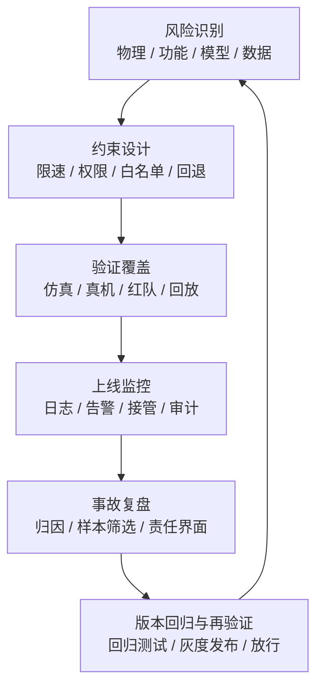

## 图表与验证补充
进一步说，本章最应该服务于后文的地方，是把“安全成熟度”从抽象口号改写成可检查的结构。以后无论评估企业、产品还是论文，只要能够沿着“风险识别、约束设计、验证覆盖、上线监控、事故恢复”五步链条去问问题，就能避免把安全理解成单一合规模块。
本章后续最应被固定为正式内容的，是“物理安全 / 功能安全 / 模型安全 / 数据安全”的分类图，以及“仿真验证 - 真机验证 - 红队测试 - 现场监控”的验证闭环图。前者用于防止安全讨论沦为泛泛而谈，后者则强调安全不是单次测试，而是贯穿模型生命周期的持续验证过程。

对全书而言，这两张图也承担公共框架作用，因为它们会在企业分析、商业化、政策与部署章节中被反复引用。

`图 16-1 安全、验证与治理闭环图` 的关键作用，是把“风险类型分层”与“验证运营流程分层”放到同一闭环里统一观察。这样读者就不会把安全只理解成事故清单，也不会把验证只理解成上线前测试，而能看到风险识别、验证执行、版本回归、现场监测与治理反馈之间的连续关系。对具身系统而言，这种闭环视角比单独罗列安全术语更接近真实部署逻辑。

---

# 第十七部分 学术前沿技术专题

前面的章节已经建立了主干结构，本部分则集中讨论当前最值得跟踪的一批前沿问题。这些问题未必都已形成稳定产业路径，但它们最能暴露现代具身系统的真实能力边界，也最有可能在未来几年牵引模型、数据和本体设计的进一步分化。

本章的写法刻意不追求“热点罗列”，而更强调这些前沿方向各自卡在哪些瓶颈、为什么难、以及它们会反向推动哪些基础技术继续演化。很多真正有价值的前沿，不是因为它们最会讲故事，而是因为它们迫使研究者同时面对感知、接触、推理、控制和评测的多重困难。

## 80. 通用操作与灵巧操作

### 80.1 通用抓取
通用抓取之所以依旧是前沿专题，是因为它看起来像“基础能力”，实际上却牵动感知、几何、接触、控制与恢复的多层协同。系统若只能在已知物体、已知摆放和已知夹具条件下抓取，它解决的仍然是局部模板问题；只有当它能在对象变化、姿态变化和局部遮挡下保持稳定，抓取能力才开始接近更通用的操作入口。

因此，通用抓取不是一个已经做完的老问题，而是后续很多 VLA、触觉与世界模型路线是否真正落地的最低压测场之一。
通用抓取之所以长期是前沿主题，不是因为“抓东西”本身新，而是因为它要求系统在对象类别、材质、摆放方式、遮挡关系和接近路径都变化时，仍能形成稳定抓取。它同时考验感知、几何推理、接触控制和失败恢复，因此常被当作具身系统最基础也最顽固的能力基准之一。

通用抓取看起来是最基础的问题，但它至今仍是具身系统的重要瓶颈，因为对象多样性、遮挡、摩擦变化和接触不确定性始终存在。即便在 foundation model 时代，“看懂物体”也不等于“找到可执行抓取方式”。

通用抓取之所以仍然是前沿问题，并不是因为学界还没学会“把东西拿起来”，而是因为一旦对象库扩大、遮挡增加、材料变化、接触条件变化或任务上下文不同，抓取就会迅速从几何问题变成感知、接触和恢复共同参与的问题。也就是说，抓取是最基础的任务单元之一，但恰恰因为基础，几乎所有系统性短板都会在这里暴露。
这也是为什么通用抓取长期具有指标意义：谁能稳定提升抓取在长尾物体、复杂遮挡和失败恢复下的表现，谁就更可能真正改善具身系统的通用性，而不是只在少数干净场景里演示漂亮结果。

### 80.2 精细装配
精细装配之所以特殊，是因为它把误差容忍度压得极低。相比抓取和搬运，装配往往更依赖局部几何对准、接触过程感知、高频闭环修正和阶段性失败恢复。很多系统在非接触任务中看似稳定，一进入装配就会暴露出观察误差、控制滞后与接触建模不足。

因此，精细装配在研究中始终具有标杆意义。它不是为了展示炫技，而是在迫使系统回答“当误差预算极小、接触过程主导成败时，智能究竟如何组织”。
精细装配比通用抓取更进一步，因为它要求机器人在极小几何公差、复杂接触序列和高失败代价下稳定完成任务。这里的问题不只是“把对象抓起来”，而是“在接触中逐步逼近正确插入或装配状态”，因此对力觉、接触建模、局部搜索和异常恢复的要求都显著更高。

对学习者而言，可以把精细装配理解成“状态估计最困难、动作修正最频繁”的典型任务。视觉通常只能提供粗定位，真正决定成败的是接触后的微调阶段：是否感知到卡滞、是否识别插入方向偏差、是否知道该退回多少、重新接近时是否会重复犯同一种错误。这也是为什么精细装配常常比抓取更能暴露系统是否真的具备闭环接触智能。

精细装配要求系统不仅看懂目标，还要在毫米级甚至更精细尺度上稳定接触、定位和纠偏。这使它成为检验真实操作能力的硬指标。与粗粒度搬运不同，装配任务通常要求视觉、力觉与接触反馈持续协同。

精细装配之所以比粗粒度搬运更能检验真实能力，是因为它要求系统同时具备高精度位姿估计、接触时纠偏、力控稳定性与局部状态机恢复能力。插接、拧紧、卡扣和窄间隙对位这些任务，都会把“看起来懂任务”与“真的能执行任务”之间的差距迅速放大。
在研究上，装配任务因此非常珍贵，因为它把视觉、力觉、控制和动作表示这些在一般 benchmark 中容易分开的层面重新绑回同一条约束链上。一个系统若能在装配里稳定表现，它的含金量往往远高于在纯视觉 pick-and-place 场景中的高分。

### 80.3 双臂与多指协同
双臂与多指协同真正困难的，不是自由度简单增加，而是接触、约束和责任分工同时增加。一个末端执行器的误差可能立刻传递给另一只手，局部最优动作也更容易演化成全局冲突。因此，这类系统往往更依赖显式的阶段管理、接触状态估计和恢复逻辑，而不是单纯把单臂策略“复制两份”。谁能在这里维持跨执行器的一致状态与安全边界，谁才更接近可部署能力。
双臂与多指协同的难点，在于系统不再只是为单一末端执行器规划动作，而是要同时处理多个执行器之间的空间耦合、时序协调和力学相互影响。一个简单抓取动作，在双臂场景里可能涉及一只手固定、另一只手操作；在多指灵巧手中，则进一步涉及接触分布、指间力平衡和手内重抓（in-hand manipulation）。

一个最小协同控制抽象可以写成：

\[
a_t = \pi(o_t, x_t^{left}, x_t^{right}, c_t)
\]

其中 \(c_t\) 表示双臂或多指之间的协调约束。对学习者来说，这一节最重要的是看到：这里的问题不是“自由度更多”这么简单，而是任务结构和接触结构都同步升级了。

双臂和多指协同把操作问题从单一抓取推进到协调时序、接触分配与力位协同，其难度远高于公开视频里看起来的“两个手一起动”。

更关键的是，这类任务会迫使系统显式处理“谁固定、谁操作、何时换手、何时局部重抓”这类中间策略问题。也就是说，双臂与多指协同不仅提高了控制难度，也提高了任务结构表达难度，因此经常成为检验高层规划与低层接触接口是否真正打通的压力测试。

### 80.4 为什么灵巧操作仍是“真能力试金石”
对学习者来说，灵巧操作最值得关注的并不是“炫技感”，而是它把许多平时被分开讨论的模块重新拧到了一起。一个灵巧操作系统通常必须同时回答：对象局部几何如何被感知、手指或夹爪如何建模接触、动作如何以足够高频率闭环修正、失败时如何局部重抓而不是整段重来。谁能在这个问题上给出自洽答案，谁的系统就更接近真实通用操作能力。
灵巧操作之所以仍是试金石，是因为它会同时放大感知误差、接触误差、控制误差和规划误差。很多系统在非接触、低精度、单步动作任务里看起来能力很强，但一进入多接触、细粒度、可恢复要求高的灵巧操作场景，真实上限就会迅速显现。

在很多公开系统里，最容易泛化的往往是接近 pick-and-place 的结构化任务；而最能暴露能力上限的，通常是需要连续接触调节、局部纠偏和长期稳定性的灵巧任务。ACT、Diffusion Policy、Dexterous hand policy 等路线之所以重要，就在于它们不断逼近这一难题，但还远未彻底解决。[ACT](https://arxiv.org/abs/2304.13705)、[Diffusion Policy](https://arxiv.org/abs/2303.04137)

如果把灵巧操作进一步抽象，它其实是在逼迫系统同时优化三个目标：

\[
\min_{\pi} \; \mathcal{L}_{\text{task}}
+ \lambda_1 \mathcal{L}_{\text{contact instability}}
+ \lambda_2 \mathcal{L}_{\text{regrasp cost}}
+ \lambda_3 \mathcal{L}_{\text{failure recovery delay}}
\]

这里真正难的不是写出损失函数，而是这几个项在现实中往往没有稳定标签。接触不稳定常常只能通过力觉、滑移趋势或阶段性失败间接观察；重抓代价和恢复延迟则更多属于系统级指标，而不是单步动作标签。因此，灵巧操作之所以长期是“真能力试金石”，恰恰因为它让高层语义、局部接触、低层控制和系统恢复第一次被迫共同接受考核。

## 81. 可变形物体与复杂接触操作

### 81.1 布料、绳索、软物体
布料、绳索和软物体任务值得持续关注，因为它们会迅速击穿很多刚体场景中仍可勉强成立的近似。对象状态高度部分可观、形变历史相关、接触结果难预测，这些特征都会迫使系统重新重视状态记忆、触觉反馈和更强的世界表征。

因此，这类任务并不只是更难的 manipulation benchmark，而是在系统性地逼问机器人：当对象的关键状态不再稳定显现在单帧视觉里时，你还能靠什么做决策。
这类对象之所以特殊，是因为它们没有稳定、低维、刚体式的状态描述。布料会折叠、绳索会缠绕、软物体会变形，导致“同一个任务目标”可能对应大量视觉上和接触上完全不同的中间状态。因此，这一方向天然更依赖触觉、世界建模和恢复策略。

这类对象会使状态表示、接触预测和任务规划极大复杂化，因此仍然是具身系统的难题高地。因为对可变形物体而言，“状态”本身就远比刚体复杂，很多时候既难感知，也难参数化。

布料、绳索、软物体这类对象之所以长期困难，是因为它们的“状态”本身就极难参数化。对刚体，系统还可以依赖位姿、几何和接触点近似；对可变形对象，这种近似会迅速失效，感知、预测与控制都需要面对高维形变空间。这意味着系统不仅难以决定该怎么做，甚至难以稳定描述当前世界到底处于什么状态。
因此，这类任务往往会反向推动表示学习、世界模型和触觉研究。因为只有当内部状态表示真正吸收了接触与形变结构，系统才可能在这类任务上形成可复用能力。

### 81.2 复杂接触建模

复杂接触建模之所以始终是前沿难题，是因为许多真实操作任务的关键信息恰恰藏在最难建模的局部瞬间里。插接、装配、拧动、摩擦配合、材料形变和局部卡滞，都要求系统不仅知道“接触发生了”，还要理解接触如何演化、哪些力方向是安全的、哪些状态预示着即将失败。

如果把这类问题写成更抽象的形式，就是系统要在部分可观、强非线性和高噪声条件下估计隐藏接触状态 \(c_t\)，并据此调整动作：

\[
\hat{c}_t = f(o_t, f_t, h_t), \qquad a_t = \pi(o_t, \hat{c}_t, g)
\]

这里 \(o_t\) 可以是视觉与本体观测，\(f_t\) 可以是力/触觉信号，\(h_t\) 是近期历史。真正困难的不是写出这个式子，而是隐藏接触状态往往没有直接标签，且不同材料、不同装配公差、不同执行器柔顺性都会改变其观测分布。

对具身智能而言，这意味着复杂接触建模既不是纯物理问题，也不是纯感知问题，而是感知、控制、预测与本体顺应性共同交织的问题。很多路线最终都会被这类任务重新拉回到对身体与世界相互作用的细致建模上。
复杂接触建模的真正困难，不在于是否检测到“发生了接触”，而在于接触模式会连续切换：粘附、滑移、滚动、卡滞、局部变形、接触点迁移都可能在同一任务中出现。对布料、绳索和软物体来说，系统甚至很难定义一个稳定、低维、足够完备的状态。

复杂接触之所以长期难解，是因为它既不是纯感知问题，也不是纯控制问题。很多关键状态无法仅凭视觉稳定观测，而必须通过接触过程逐步显现；与此同时，接触结果又高度依赖瞬时力位关系和局部材料属性。

接触一旦从刚体碰撞扩展到滑移、卡滞、形变与摩擦不确定，系统就会迅速暴露感知和控制接口的脆弱性。机器人在布料整理、线缆操作、袋装物体处理和柔性装配中经常遇到这种情况。

### 81.3 评测难点

这类任务的评测之所以困难，是因为单一成功率往往不足以描述真实能力。系统可能最终完成了任务，但过程中过于依赖重试、局部碰撞、异常人工干预或极高节拍波动；也可能在标准件上成功，却在轻微尺寸变化或材料差异下立即失效。若评测口径过粗，就会高估系统真实可部署性。

因此，复杂接触与灵巧操作的评测更需要分层指标，例如成功率、恢复率、对扰动敏感性、节拍稳定性、对尺寸偏差的容忍度以及对感知/力觉缺失的退化表现。这些指标虽然更麻烦，却更接近真实能力边界。
这类任务的评测难点，首先在于成功标准本身就难定义。例如布料折叠是看边角对齐、皱褶程度还是最终可用性？绳索整理是看末端位置、结是否解开还是后续可操作性？这使得很多 benchmark 很难像刚体抓取那样用单一成功率概括。

评测难点还在于任务结果往往存在连续质量差异，而非简单二元成功失败。布料是否“足够平整”、线缆是否“可接受地整理”、装配是否“留有安全裕量”，都需要比单个成功率更细的度量体系。

复杂接触任务很难像标准分类 benchmark 那样有统一清晰指标，因此研究进展也更难横向比较。成功率之外，通常还需要记录纠偏次数、接触稳定性、操作时长和失败模式类型。

从研究方法上看，这一节最重要的启发是：只要评测仍然停留在粗糙成功率上，社区就会持续低估真实接触难度。越是接近复杂装配、柔性体操作和长期自主整理，越需要把恢复、节拍波动、局部错误传播和安全裕量显式写进评测指标。

### 81.4 为什么这类任务会推动世界模型与触觉路线继续前进
这也是为什么可变形物体任务对研究方向具有放大效应。它会把那些在刚体场景中还能被容忍的近似全部暴露出来，例如只靠视觉进行迟滞估计、只用末端位姿代表接触状态、只用成功率而不记录恢复代价等。某种意义上，这类任务就是在逼迫系统承认“环境的内部状态并不完全显现在图像里”，从而重新提升触觉、力觉和状态记忆的重要性。

这类高接触、高不确定性的任务之所以会持续推动世界模型与触觉路线前进，是因为单靠视觉和语言很难完整描述其中最关键的状态变量。对象内部受力、局部卡滞、柔性形变、滑移趋势和微小接触变化，常常只有在执行中才真正暴露出来。

因此，越是接近精细操作、装配、工具使用和柔性物体处理，系统就越需要某种能预测接触后果的内部模型，以及能感知细微接触差异的触觉通道。很多前沿路线看似分散，实则都在被这些真实任务约束重新拉回相似的问题核心。
原因很直接：仅靠远距离视觉往往不足以稳定恢复软物体的真实交互状态，而纯规则接触模型又难以覆盖其复杂变形。于是，研究自然会推动两条路线继续强化，一条是更能表达隐状态和未来演化的世界模型路线，另一条是更能直接观测接触状态的触觉路线。

可变形物体和复杂接触任务往往不能只依赖视觉前端，因为关键状态常常隐藏在接触内部。这使得世界模型若想真正服务于机器人，就必须吸收触觉、力觉和局部接触动力学；也迫使触觉路线从“附加模态”上升为部分任务中的核心模态。

一个更直观的理解方法，是把这类任务中的隐藏状态看作视觉无法完全恢复的潜变量 \(z_t\)：

\[
z_t = \phi(o_t, \tau_t, f_t, h_t)
\]

其中 \(o_t\) 是视觉观测，\(\tau_t\) 是触觉/力觉读数，\(f_t\) 可以理解为局部接触特征，\(h_t\) 是历史信息。若模型只消费 \(o_t\)，它就会系统性低估那些真正决定任务成败、却不显现在图像里的接触信息。也因此，这类任务天然推动“多模态世界建模”从可选增强变成必要结构。

## 82. 人机协作与人类意图注入

### 82.1 语言意图
人机协作中的语言意图理解，不只是把自然语言命令转成目标标签，而是要判断用户真正关心的目标、约束、容错和优先级。尤其在开放协作环境里，人类表达往往不完整、不精确，甚至会在执行过程中不断修正。因此系统需要的不只是语义解析能力，还需要交互式澄清和上下文记忆能力。

对具身系统而言，语言意图理解的价值在于降低人类编程门槛，但它只有在能稳定连接到任务结构和执行约束时才成立。
在人机协作场景里，语言意图的价值不只是让用户“更方便下命令”，而是让系统能够处理任务目标中的抽象约束、偏好表达和动态澄清。例如“先把危险的东西收起来”“顺手帮我把桌面也整理一下”这类要求，本身就带有模糊性与上下文依赖。

语言输入为机器人提供更自然的任务接口，但也把模糊性和歧义直接引入系统。

语言意图之所以构成前沿问题，不是因为“让机器人听懂一句话”本身有多新，而是因为自然语言天然带来语义压缩、模糊边界与上下文依赖。人类一句“把桌面整理一下”背后包含对象分组、优先级、可接受结果范围和环境约束，而这些通常并不显式给出。机器人若想真正利用语言，就必须把模糊任务要求映射为可执行子任务结构。
因此，语言意图研究真正难的地方并不是 ASR 或文本理解，而是语义到动作结构的落差填补。这也是语言在具身系统中长期不会只是一个“更方便的输入法”，而会持续牵引记忆、规划和技能接口设计。

### 82.2 示教与偏好

示教与偏好之所以值得单独讨论，是因为很多具身任务并不存在唯一标准动作序列。人类操作者之间往往只是在效率、安全、稳健性、保守程度或风格上存在偏好差异，而不是严格意义上的对错差异。若系统只能学习单一路径，它很可能在面对不同场景需求时显得僵硬。

把偏好信息引入训练，实质上是在让系统学习“什么样的成功更被接受”。这对具身系统尤其重要，因为现实部署中的可接受行为往往不只取决于任务是否完成，还取决于过程是否稳、是否易被人类理解、是否符合现场流程。
在人机协作专题里，示教与偏好之所以重要，是因为很多高质量协作行为无法只靠任务成功率定义。人类更关心的是机器人是否顺手、是否打断自己、是否动作可预期、是否需要频繁纠正。于是，人类示教提供“怎么做”，偏好反馈提供“哪种做法更符合协作习惯”。

这条路线的重要性，在于很多“做得更好”的标准并不容易由显式奖励函数刻画。例如人类可能偏好更稳的抓取路径、更少碰撞的搬运方式、更自然的整理顺序或更保守的接触策略。

示教、偏好反馈和纠偏记录是将人类隐性技能结构注入系统的主要路径。

### 82.3 共融控制与共享自治

共融控制与共享自治的重要性，在于它们把“人和系统如何共同完成任务”从过渡方案变成了研究对象本身。许多高价值场景并不要求系统一开始就全自主，而是要求它在关键片段自主、在高风险时可接管、在不确定时可请求人类输入。

这类研究路线的价值，恰恰在于它们更贴近现实组织方式。共享自治若能被设计成稳定接口，而不是临时兜底手段，那么很多原本被视为“还不够自主”的系统，反而可能更早形成商业价值。
共融控制与共享自治关注的是：人和机器人不是简单轮流接管，而是共同参与同一控制闭环。系统需要决定哪些变量由人主导，哪些变量由机器人主导，以及何时在两者之间动态切换。它不是纯自动，也不是纯遥操作，而是中间大量现实可落地场景的重要组织形式。

从研究角度看，共享自治不是“自动化不够强时的临时方案”，而是一种长期系统设计范式。它要求系统明确划分哪些决策适合自动执行、哪些节点应保留给人类确认、以及在异常时如何平滑接管与退出。

shared autonomy 的重要性越来越明显，因为很多高价值任务并不适合也不需要完全自动化。

### 82.4 人类为什么不会很快退出回路
所以更现实的目标，不是幻想“彻底去人化”，而是持续优化人类在回路中的位置。好的系统会让人类逐渐从低价值的机械接管中退出，转向高价值的目标设定、风险确认和异常仲裁；差的系统则会把人一直钉在高强度、低透明度的补锅位置上。这种区别会直接决定一个系统是否真的具备组织层面的可扩展性。

人类不会很快退出回路，并不是因为系统永远达不到更高自主性，而是因为在许多高价值场景里，人类本身承担的并不只是动作执行，还包括责任承担、异常裁决、流程协调、偏好表达和跨任务切换判断。这些职责很难在短期内被单一模型完整替代。

因此，很多现实系统真正演化的方向，并不是“迅速去人”，而是把人的角色从高频直接操作转移到监督、纠错、授权和边界条件处理上。谁能更好地设计这层协作接口，谁往往更接近真实落地。
人类短期内不会退出回路，根本原因不只是模型还不够强，而是现实场景中存在大量责任、偏好、异常判断和价值权衡，不适合完全交给自主系统一次性决定。越是开放、非结构化、责任高的场景，这一点越明显。

从系统设计角度看，这意味着“人在回路”不应被理解为临时补丁，而应被视为长期存在的架构假设之一。很多真正可落地的人机协作系统，反而正是因为认真设计了人类何时介入、如何介入、介入后如何回到自动流程，才具备现实价值。

从工业、医疗到危险环境，很多真实任务更现实的目标并不是“完全替代人”，而是“让人类把注意力集中在高价值决策点”。这意味着人机协作研究并不是通用自主的过渡形态，而很可能是长期稳定存在的主线。

从系统组织角度看，人类长期留在回路中的原因还可以写成一个职责再分配问题。随着模型能力提升，人类不会简单消失，而更可能从“连续操作者”转成“目标设定者、异常仲裁者和责任承担者”。若系统只能把人从高频操作位移到高频补锅位，那么它并没有真正降低组织负担；只有当系统把人稳定推向低频高价值决策位时，shared autonomy 才真正成立。这也是后续分析所有人机协作路线时最该追问的判据。

若把这一点写成更可操作的判断标准，可以直接追问三件事：人类是否仍被迫高频盯屏，系统是否能在交接前提供足够上下文，人类介入后是否能稳定回到自动流程。只有这三件事同时成立，“人在回路”才意味着组织效率提升；若其中任意一项长期失灵，那么人在回路就仍然更接近隐藏式人工补锅，而不是真正成熟的 shared autonomy。

## 83. 端侧与小模型路线

### 83.1 on-device VLA
On-device VLA 之所以成为前沿议题，是因为它直接检验大模型路线能否脱离高算力实验条件，进入低时延、低功耗、弱联网的真实部署环境。若 VLA 只能依赖远程推理和大规模云算力，它的适用场景会被大幅收窄；一旦它能在端侧运行，很多移动平台、消费级和边缘场景的可能性才会真正打开。

因此，on-device 不是“缩小版大模型”这么简单，而是重新平衡语义能力、模型结构、压缩策略、异步推理与本地控制职责的系统工程问题。

端侧路线的重要性在于，它更接近真实部署的时延、隐私和功耗约束。Google DeepMind 的 Gemini Robotics-ER / Robotics 方向、Figure Helix 的机载双系统结构，以及 SmolVLA 这类轻量化路线，都共同说明“能部署”正在成为独立研究目标，而不是最终再考虑的工程细节。[Gemini Robotics](https://deepmind.google/blog/gemini-robotics-brings-ai-into-the-physical-world/)、[Figure Helix](https://www.figure.ai/news/helix)、[SmolVLA](https://arxiv.org/abs/2506.01844)

on-device VLA 的研究意义，在于它强迫学界把“是否能部署”提前成研究问题，而不是最后的工程善后。端侧算力、显存、功耗和散热会反过来约束模型结构、推理频率与动作接口，因此端侧路线不是大模型路线的低配复制，而是另一套目标函数下的重新设计。
也正因为如此，端侧研究常常会倒逼高低频分层、模型蒸馏、局部记忆外置和技能层重建等思路发展。谁如果忽视这一点，就会把端侧研究误看成单纯压缩问题。

### 83.2 小模型蒸馏与压缩
小模型蒸馏与压缩的核心目标，不只是把参数量变小，而是尽量保留大模型在任务理解或动作生成上的关键结构，同时把推理成本压到端侧可接受范围。常见路线包括知识蒸馏、量化、剪枝、低秩适配和动作头轻量化。

一个极简蒸馏流程可以写成：

```python
teacher_actions = teacher(context)
student_loss = distill(student(context), teacher_actions)
update(student, student_loss)
```

小模型路线真正困难的地方，不在于把大模型“做小”，而在于决定哪些能力必须保留、哪些能力可以外包给检索、技能层或外部记忆。若只是机械压缩，往往最先损失的恰恰是长尾恢复与跨任务迁移能力。

若基础模型永远只能在超大算力上运行，其应用边界会被极大限制，因此蒸馏、量化和模块化裁剪会长期重要。这里的目标不只是压缩参数量，而是寻找在任务结构上真正必要的模型部分。
进一步说，蒸馏对象本身就需要分层。对具身系统而言，至少可以蒸馏三类东西：语义决策分布、动作生成分布，以及异常恢复偏好。前两者决定学生模型能否在常规轨道上复现教师模型，第三类则决定学生模型在长尾情境下会不会迅速坍塌。很多“压缩后平均分还行”的模型，一旦进入真实部署就显得明显脆弱，原因往往不是常规动作不会做，而是恢复动作、保守策略和停止条件没有被一并蒸馏下来。
因此，更合理的蒸馏评估不应只看主任务成功率，还应看延迟、功耗、异常恢复率和安全退化方式。一个更小的模型如果显著降低了推理时延，却也显著放大了错误自信或误触发频率，那么它未必真的比大模型更适合端侧。对后续产业判断而言，这一点尤其重要，因为不少“端侧能力突破”真正有价值的地方，不在于参数压缩本身，而在于团队是否找到了保留关键行为结构、同时接受部分语义损失的系统折中点。

### 83.3 低成本机器人平台上的部署尝试

低成本平台部署尝试的重要性，在于它们迫使研究路线面对更现实的资源约束。算力不足、传感器受限、执行器精度不高、结构余量有限，这些条件会暴露哪些方法只是依赖高配置堆出来的结果，哪些方法在更朴素平台上仍然保留核心价值。

从长期看，这类尝试不只是“便宜版验证”，而是对可扩散性的压力测试。很多路线若只能在高昂平台上成立，其产业外溢速度和规模化潜力就会受到显著限制。
低成本平台部署尝试的价值，在于它逼迫研究者正视“少算力、差传感、低精度执行器、简化夹爪和脆弱通信”这些通常被高端平台掩盖的问题。很多方法只有在这种平台上跑过，才真正知道哪些能力是算法本体带来的，哪些其实依赖昂贵硬件兜底。

这类尝试的意义，还在于它迫使研究者面对真实资源约束下的接口重构问题。廉价平台常常意味着更低控制频率、更差传感器、更少算力和更松机械精度，因此任何仍能保持可用性的系统，通常都在结构上做出了更强的工程折中。

低成本平台是检验具身路线是否具备扩散潜力的重要试验场。因为只有在廉价平台上仍能维持足够能力，某条技术路线才更可能被社区广泛复现和继续迭代。

### 83.4 异步推理与高低频分层的新价值
异步推理与高低频分层之所以重新重要，是因为端侧部署常常无法让最强模型以控制频率持续前向。于是系统会重新采用“低频高语义模型 + 高频低层控制器”的架构，让大模型负责阶段决策，小模型或解析控制器负责局部闭环。

这一思路的真正价值，不只是“算力不够时的妥协”，而是帮助系统显式地区分哪些决策必须高语义、哪些决策必须高带宽。环境理解、任务改写、策略切换和异常归因通常不需要毫秒级更新，却需要更强的抽象能力；接触稳定、轨迹跟踪、阻抗调节和快速避障则恰恰相反。把两者硬塞进同一频率、同一模型，不但成本高，还容易让系统在关键环节上两头不到岸。

异步架构还要求一个容易被忽略的设计点：何时允许慢通路打断快通路。若高层模型的输出更新没有清晰触发条件，系统就可能在执行过程中频繁被新语义建议打断，表现为动作抖动、策略摇摆或安全边界失稳。更成熟的做法，是把高层推理的介入条件显式化，例如只在阶段完成、观测分布显著偏移、任务失败或人类指令变化时触发重解释。这样高低频分层才不是简单的“两个模型叠在一起”，而是真正经过接口治理的系统结构。

这一趋势说明，很多前沿工作真正回到的是“如何组织不同频率智能”而不是“如何让一个模型包打一切”。在资源受限平台上，异步推理不是妥协，而可能是更合理的系统最优：把昂贵推理只用在高价值阶段，把高频稳定性交给更轻、更确定的模块。

这条路线的新价值在于，它不是对大模型能力的否定，而是把模型能力重新放回受物理时钟和算力预算约束的真实系统里。对前沿研究而言，这恰恰可能是从“演示成功”走向“持续可运行”的关键一步。

轻量部署并不一定意味着“模型越小越好”。很多时候，更有效的办法是把高频控制和低频语义推理拆开：高层慢思考、低层快反应、异步通信。这使得大小脑分层不只是理论选择，也成为现实的端侧部署优化策略。

因此，端侧研究的真正价值并不只是压缩参数，而是重新设计能力分工：哪些能力必须留在端侧高频运行，哪些能力可以低频异步调用，哪些能力适合外包给检索、技能库或人类监督。谁能把这组分工做清楚，谁就更可能把“能跑”推进成“能长期稳定运行”。

如果把这类系统写成最小运行框架，它通常更像这样：

```python
while robot_alive:
    low_level_state = controller.read()
    controller.stabilize(low_level_state)

    if planner_clock.tick():
        high_level_ctx = memory.pack_context()
        subgoal = vlm_planner.infer(high_level_ctx)
        controller.update_subgoal(subgoal)
```

这段伪代码的价值在于把一个经常被宏大叙事掩盖的现实说清楚了：很多端侧路线真正优化的，不是“让一个模型包打一切”，而是“如何让不同频率、不同责任层的智能模块在同一系统里稳定共存”。这也是为什么端侧与轻量路线并不只是压缩问题，而是架构重组问题。

## 84. 持续自主与自我改进

### 84.1 长时程任务执行
长时程任务的根本难点在于系统必须维持“任务进行到了哪里”这一中间事实的连续可靠性。只要阶段状态、对象历史或资源占用信息在长链路中逐渐失真，后面每一步看似合理的局部动作都可能建立在错误前提上。因此，长时程能力的核心不只是更长上下文，而是更稳的任务状态机、更强的中途重规划和更清晰的失败分层恢复机制。
长时程任务执行的难点，不在于单步动作是否正确，而在于系统能否在较长时间里维护任务状态、子目标顺序、对象历史、失败恢复和资源占用信息。它要求的不只是更长上下文窗口，而是更强的任务记忆、状态管理和中途重规划能力。

长时程自主真正难的不是“序列更长”，而是状态漂移、环境变化、失败恢复和记忆管理同时变难。

长时程任务执行的真正困难，并不只是“序列更长”，而是系统必须在更长的时间轴上管理状态漂移、记忆衰减、异常恢复和环境变化。很多模型在短程任务上看似稳定，但一旦执行时间被拉长，局部小误差就会积累成结构性失效。
因此，长时程自主更像是对整套系统架构的考验，而不只是对某个策略模型的考验。记忆、重规划、恢复、监控和人类接管接口都会在这一层重新变得关键。

### 84.2 自主探索
自主探索在机器人里始终重要，因为很多关键能力无法仅靠离线示教覆盖完全。系统必须在可控风险下主动接触新状态、新对象和新场景，才能持续扩展能力边界。但机器人探索与纯软件探索不同，它的每一步都伴随物理成本、设备磨损和安全风险。

因此，真正值得关注的不是“是否自主探索”，而是探索如何被约束、如何被记录、以及如何与后续数据闭环衔接。谁能把探索组织成低风险高信息增益的过程，谁就更有机会在长期迭代中占优。

自主探索在具身系统里远比纯仿真强化学习更复杂，因为系统的每一次试探动作都带着真实成本：时间、能耗、磨损、风险以及对周边环境的潜在影响。这意味着现实中的探索不能只追求信息增益最大化，还必须同时考虑安全和可恢复性。

因此，真实机器人里的探索更像“受约束试探”而不是“自由试错”。一个更合理的目标往往不是最大化新颖性，而是在风险预算内优先探索那些最有可能缩小任务不确定性的动作片段。也正因为如此，持续自主若想真正成立，探索策略必须与回退策略、异常记录和数据回流基础设施一起设计，而不能被当作独立算法外挂。

因此，真正有价值的自主探索研究，往往不是鼓励机器人“多试几次”，而是研究如何在安全约束下高效选择最值得试的动作，如何把少量高价值探索与人类示教、世界模型和先验知识结合起来。
持续自主系统中的自主探索，并不是让机器人无约束“自己试一切”，而是在安全边界内主动寻找最能提升模型能力的新样本或新情境。对具身系统而言，真正有价值的探索通常是受约束的：去补当前最不确定、最常失败、最影响部署价值的区域，而不是平均地乱试。

对机器人而言，自主探索最大的障碍不是“不会探索”，而是探索成本太高且出错代价太大。每一次真实碰撞、跌倒、夹持失败或环境扰动都可能带来硬件损耗与安全风险，因此探索策略必须天然带着约束、审计和可回滚机制。

自主探索对具身系统很有吸引力，但在现实中始终受样本效率和安全边界限制。

### 84.3 自动数据回流与自我修正
这一方向之所以值得高度关注，是因为它把“部署后还能否继续变强”从模型问题提升为组织问题。什么片段值得回流、谁来标注、如何避免噪声放大、更新后如何回归验证，决定了系统会形成正反馈还是负反馈。很多团队并不缺模型更新能力，真正缺的是把失败日志稳定转写为高价值训练样本的流水线能力。这也是持续自主最终会回到数据治理、审计和版本回归基础设施的原因。
自动数据回流与自我修正的目标，是让系统在部署中遇到新失败模式后，不必完全依赖人工手工整理样本，而能自动记录关键片段、打上事件标签、进入再训练或再评测流程。它对应的不是单个算法，而是一整条“运行中发现问题 -> 形成样本 -> 进入训练闭环”的基础设施能力。

自动回流之所以是前沿问题，是因为它要求系统具备判断“什么值得回流、如何重标注、何时允许更新”的元能力。若所有日志都无差别回灌，训练会被噪声与重复样本淹没；若筛选过严，系统又会错过最有价值的长尾异常片段。

真正可持续的学习系统，需要把部署中遇到的新条件转回训练闭环，这也是未来系统是否会逐渐“越用越强”的关键。

### 84.4 持续自主的真正门槛
从这一角度看，持续自主的门槛本质上并不只在算法，而在系统是否拥有稳定的自我修正基础设施。没有结构化失败记录，就无法知道该回流什么数据；没有版本化回归测试，就无法判断新模型是在变强还是在引入新风险；没有局部恢复机制，系统就会在长时程任务里频繁因为小错中断。真正的“长期自主”因此更像一套长期运营能力，而不是一个单点模型突破。

如果把持续自主简单理解成“模型能连续运行更久”，就会低估问题难度。真正困难的地方在于，系统需要在长时间运行中持续吸收噪声、局部错误、硬件漂移和任务变化，而不是只在理想条件下延长单次成功轨迹。也正因此，持续自主的门槛往往体现在日志系统、回放工具、异常分级、在线监测、灰度发布和数据回流策略这些看似不够“学术前沿”的基础设施上。

从研究到产品的跨越，也常在这里发生断裂。许多论文可以证明某一策略在有限 episode 中有效，却很少回答版本迭代后如何防止旧能力回退、系统现场退化后如何快速定位问题、以及不同子模块更新后如何维持整体协同。这些问题若没有被工程化处理，持续自主就仍然停留在演示层，而不是部署层。
持续自主的真正门槛，往往不是某一个模型分数，而是系统是否形成了稳定闭环：能否安全探索、能否筛出有价值的新数据、能否把失败重新编入训练、能否在更新后重新验证。换句话说，持续自主更像基础设施问题，而不是单一算法问题。

持续自主不只取决于模型会不会更新，还取决于系统是否有可靠的日志、回放、审计、回滚和安全监控机制。换言之，自我改进在机器人里首先是基础设施问题，其次才是优化算法问题。

若把持续自主写成一个最小闭环，它至少要包含以下几步：

```text
运行日志记录 -> 异常片段筛选 -> 价值样本标注 -> 训练或蒸馏更新 ->
回归测试 -> 安全审计 -> 灰度部署 -> 再次观察
```

对研究判断而言，这个闭环最重要的意义在于，它把“越用越强”从一句口号拆回了若干可检查条件。没有异常分级，就不知道哪些失败值得进入训练；没有版本回归，就不知道更新后到底是整体变强还是只是换了一种失败方式；没有灰度部署和审计边界，就无法安全地让系统在真实世界中持续吸收新经验。也就是说，持续自主的难点本质上不是“模型会不会学”，而是“组织是否允许它被安全地持续学习”。

这里每一步都可能成为真正门槛。很多系统并不是不会“学习”，而是没有把异常样本稳定筛出来；很多团队并不是不会“更新”，而是没有版本化回归测试和安全灰度部署能力。因此，持续自主最值得关注的，不是某个自我改进算法名词，而是这条基础设施链条是否开始真正闭合。

本部分的总体结论是：前沿专题之所以重要，不是因为它们最热，而是因为它们最集中地暴露了现代具身系统在哪些地方仍然缺少可靠答案。对长期跟踪者而言，真正值得追的不是“哪个 demo 最惊艳”，而是“哪些难题开始出现可复用、可扩展、可部署的解法雏形”。

如果把本章作为“前沿专题集合”长期维护，最需要避免的错误就是把它写成热词展览馆。真正合理的组织方法，应当是让每个专题都明确对应某个系统瓶颈：通用抓取对应感知与接触稳定性，精细装配对应力控与局部搜索，端侧 VLA 对应算力与分层架构，持续自主对应数据回流与验证基础设施。只有把专题重新钉回瓶颈坐标，本章才会持续为全书服务，而不是随着前沿话题轮换不断漂移。

这也意味着，本章后续增量维护不应只问“这个方向最近热不热”，而应优先问“它减少了哪一段人工结构、缩短了哪一段闭环、或者暴露了哪一类新失败模式”。若一个专题只提供更炫的演示，但没有改善接口稳定性、恢复能力、部署假设或数据闭环效率，那么它更适合被记录为观察项，而不应轻易上升为主线判断。对研究型读者而言，这种筛法比追逐所有新名词更能保住判断质量。

## 图 17-1 前沿专题与系统瓶颈图

源文件：`assets/diagrams/17-前沿专题与系统瓶颈图.mmd`

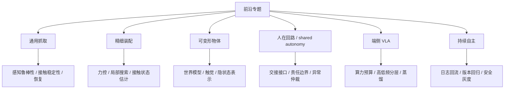

## 专题映射补充
本章最适合正式补成一张“前沿专题与对应系统瓶颈”映射表。它应明确指出：通用抓取主要考验感知与接触稳定性，精细装配主要考验力控与局部搜索，软体操作主要考验世界建模与触觉，端侧 VLA 主要考验算力与分层架构，持续自主则主要考验数据回流与验证基础设施。

这样做的好处是，前沿专题就不再只是热门方向清单，而会真正成为全书技术主干上的“难点坐标图”。

## 表 17-1 前沿专题与对应系统瓶颈映射表

见 [17-前沿专题与系统瓶颈映射表](D:/Projects/embodied-intelligence-report/docs/report/current/tables/17-前沿专题与系统瓶颈映射表.md)。

---

# 第十八部分 代表性论文与模型谱系梳理

长篇报告如果只在各章局部引用论文，很容易缺少全局脉络。因此，本部分的作用不是重复前文，而是建立一张可长期维护的谱系图：哪些路线从经典模仿学习和 RL 演化而来，哪些路线推动了 Transformer policy 与 VLA，哪些路线把世界模型与抽象预测推上前台，哪些是 2025-2026 年值得持续跟踪的新分支。

本章的一个核心目的，是把“论文列表”变成“研究地图”。也就是说，重要的不只是记住某篇论文做了什么，而是理解它在一条主线上的位置：它解决了哪个旧瓶颈，引入了什么新接口，又把问题重新推向了哪里。只有这样，这份报告后续每次增量更新时，新增论文才有机会被放回结构之中，而不是不断堆叠零散新名词。

## 85. 经典起点与过渡阶段

### 85.1 传统模仿学习与 RL 代表工作
如果从今天回看，这一节最重要的价值并不只是列出若干“早期经典”，而是把具身学习最顽固的底层约束重新摆到台面上。模仿学习与 RL 时代已经把几个问题暴露得非常清楚：示教分布与闭环执行分布天然错位，真实世界试错昂贵，奖励设计脆弱，恢复能力难学，失败样本往往比成功样本更能决定系统上限。后来的 VLA、通用策略和机器人基础模型并没有让这些问题消失，而只是用更大规模的数据工程、模型参数和训练基础设施重新包装了它们。

也因此，本节不应被当成“背景材料”读过就算。更准确的理解是：这一批工作定义了后续所有路线都绕不开的共用问题空间。若不先理解这些老问题，读者就很容易把今天某些模型的阶段性成功误判成结构性突破，而忽略它们仍然在和同一组约束持续搏斗。
把这组工作放在谱系起点，最重要的不是怀旧，而是提醒后文所有“新路线”都没有脱离这些早期问题设定：示教如何进入策略、回报如何驱动优化、真实世界试错为何昂贵、恢复能力为何难学。这一谱系奠定的是问题语言，而不只是若干旧算法名称。

这一段的关键意义，在于为后来的 foundation model 路线保留“学习型机器人原点”：视觉运动策略、QT-Opt、DAgger 等工作说明，具身学习的真正难点从一开始就包含闭环控制、数据稀缺和分布偏移。[DAgger](https://proceedings.mlr.press/v15/ross11a.html)、[End-to-End Training of Deep Visuomotor Policies](https://arxiv.org/abs/1504.00702)、[QT-Opt](https://arxiv.org/abs/1806.10293)

传统模仿学习与 RL 代表工作的意义，在今天并不只是“历史背景”。它们实际上定义了很多后续路线始终没有绕开的基本矛盾：示教分布依赖、闭环偏移、真实样本昂贵、恢复能力缺失与训练不稳定。后来的 foundation model 路线若不重新面对这些老问题，就很容易只是在更大参数规模上重演旧瓶颈。
因此，在谱系里保留这一段非常重要。它提醒我们：具身智能并不是从大模型时代凭空诞生的新学科，而是经典机器人学习问题在新表示和新数据条件下的重组。

### 85.2 Transformer policy 的早期路线
这一谱系的重要意义，不只是“Transformer 也能做机器人”，而是它把机器人策略学习重新组织成统一序列接口问题。状态、图像、动作、回报乃至任务条件，都开始可以被放入同一时序建模框架中比较。这样一来，模仿学习、离线 RL 和多任务策略建模之间原本较分散的接口开始被重新统一。

Transformer 进入机器人后，重点不是简单替代 RNN，而是把状态、动作和历史上下文放进更一般的序列接口中。Decision Transformer、Gato、RT-1 等工作虽然设定各异，但共同推动了“机器人控制可以被重新组织为序列建模问题”这一观念。[Decision Transformer](https://arxiv.org/abs/2106.01345)、[Gato](https://arxiv.org/abs/2205.06175)、[RT-1](https://arxiv.org/abs/2212.06817)

Transformer policy 的早期路线之所以关键，在于它首次把“机器人控制可以被组织成通用序列建模问题”明确推到台前。Decision Transformer、Gato、RT-1 这些工作虽然目标不同，但都把状态、动作和历史上下文放进了更统一的 token 或序列接口里。这一变化不只带来模型结构更新，更改写了研究者看待机器人策略的方式：控制不再只是控制理论对象，也成为了大规模序列学习对象。
这条线的真正后果，是为 VLA 与 generalist policy 奠定了接口基础。没有这一步，后来的多模态机器人基础模型很难自然接上语言、视觉和动作的统一建模叙事。

### 85.3 世界模型与生成控制早期路线
这一条谱系真正值得强调的，不只是它在历史上更早提出了 latent dynamics、imagined rollout 或 model-based 学习，而是它系统性地反驳了一个偷懒想法：机器人不可能永远只靠 observation-to-action 的直接映射去解决所有问题。只要任务存在多步后果、昂贵试错、接触不确定性或长时程依赖，系统就会不断被迫引入某种“内部对未来的表示”。早期世界模型路线的重要性，正在于它把这种内部表示重新变成正当研究对象。

不过，早期世界模型工作的启发不应被误读为“后来的视频世界模型已经被早早证明可行”。更准确的说法是：它们证明了学习内部环境模型有潜在高回报，但也同时暴露了模型偏差、rollout 漂移和真实接触任务中误差快速累积的问题。后来的所有世界模型热潮，都是在继承同一个愿望，也在继承同一个老难题。
这一路线的早期工作之所以值得单列，是因为它较早回答了一个今天仍然关键的问题：机器人是否可以先学一个内部环境模型，再借此做策略优化或规划，而不必每次都在真实世界中昂贵试错。后来的视频世界模型、抽象预测与可控生成路线，很多都可以回溯到这里的思想源头。

从 latent dynamics 到 imagination rollout，这条线说明“内部预测结构”并不是后来的附属支线，而是持续存在的主线之一。World Models 与 Dreamer 可被视作这条线的两个关键节点。[World Models](https://arxiv.org/abs/1803.10122)、[Dreamer](https://arxiv.org/abs/1912.01603)
这条早期路线的意义，在于提醒我们具身主线从来不只是一条“更好的 policy”路线。后来围绕视频预测、抽象表征、rollout 和可控生成的许多讨论，其实都能回接到这里；如果不把这条线保留在谱系图中，就很容易把后来的世界模型热潮误判成完全断裂的新叙事。

更重要的是，这条谱系还提供了一个持续有效的反例：只要真实试错仍然昂贵、接触结果仍然难预测，机器人就会不断被迫引入某种内部未来表示。也就是说，世界模型路线之所以反复归来，并不只是因为研究热点轮转，而是因为问题本身一直存在。

## 86. VLA 谱系

### 86.1 RT-1 / RT-2 / RT-X
这一组工作最好不要只当作三篇论文，而应被视为同一条研究主线的连续推进：从单体多任务机器人 Transformer，到更强语言与视觉知识注入，再到跨平台、更大规模的数据组织与接口扩展。它们共同回答的是：机器人动作建模能否像大模型那样，走向更统一的多任务规模化训练接口。

RT 系列的重要性在于连续推动机器人策略从任务专用模型走向多任务视觉-语言-动作统一接口。RT-1 重点在于多任务 Transformer policy，RT-2 重点在于把互联网语义知识更明确地迁移到机器人动作接口，RT-X / Open X-Embodiment 则更强调跨机构数据汇聚与 generalist policy 训练基础设施。[RT-1](https://arxiv.org/abs/2212.06817)、[RT-2](https://arxiv.org/abs/2307.15818)、[Open X-Embodiment](https://arxiv.org/abs/2310.08864)

RT 系列的重要性，不只在于性能数字，而在于它形成了一条连续可观察的接口演化链：从多任务视觉策略，到把互联网语义知识迁移进机器人动作接口，再到更大规模的跨平台数据组织。它们共同推动了“机器人基础模型”从概念逐步变成可比较对象。
因此，在长期维护这条谱系时，RT 系列不应只被当成若干篇单独论文，而应被看成一条持续推动输入输出接口重构的主线。

### 86.2 PaLM-E
PaLM-E 的标志性价值，在于它更明确地展示了“把通用多模态语言模型接入具身感知与任务执行接口”的路线。它不是最纯粹的机器人 policy 模型，而更像一个把语言、视觉和机器人状态共同塞进大模型上下文中的桥梁型系统，因此在谱系中承担的是“接口扩张者”的角色。

PaLM-E 把 embodied multimodal language model 明确为一个问题设定，是 foundation model 进入具身系统的重要节点。它的重要性不只是性能，而在于它重新定义了“机器人状态也可以被接入大模型上下文”这一接口。[PaLM-E](https://arxiv.org/abs/2303.03378)

PaLM-E 的谱系地位，在于它明确提出“机器人状态也可以成为大模型上下文的一部分”。这不是简单把一个 VLM 接到机器人上，而是重新定义了具身多模态模型的边界：文本、图像、状态和任务条件都可以进入同一上下文窗口，被统一地消费和组织。它在理论叙事上的影响，甚至不弱于单篇性能提升。
也因此，PaLM-E 的关键不只是“把更多模态塞进模型”，而是把“机器人状态进入大模型上下文”写成了一个明确的问题设定。这种写法改变了后续很多研究者对具身多模态模型边界的想象，使得状态、任务和感知不再被默认拆成彼此孤立的系统部件。

### 86.3 OpenVLA
在谱系里，OpenVLA 的价值主要体现在“把 VLA 从概念与演示，推进到更可审视的开放接口”。它让研究者更容易看清：训练样本长什么样、动作表示怎么定义、推理流程如何组织、评测口径如何设置。换句话说，它的重要性既在模型，也在方法学透明度。

OpenVLA 为研究社区提供了更开放的 VLA 对照对象，使开源路线得以形成自己的比较坐标。[OpenVLA](https://arxiv.org/abs/2406.09246)

OpenVLA 的意义，则更偏向研究共同体层面。它让 VLA 路线不再只由少数闭源系统定义，而开始拥有更可复现、可拆解、可二次开发的开源对照对象。对报告维护者而言，它的价值不仅在于模型本身，还在于它建立了后续比较的公共参考面。
从谱系维护角度看，OpenVLA 的价值还在于它把闭源系统里很多只能被间接猜测的设计问题重新拉回公共比较空间。开源实现、数据接口与训练组织方式的公开，使它更适合被当作研究路线拆解和复审的公共参照物。

这也是为什么在长期维护谱系时，OpenVLA 这一节点的重要性并不只来自模型本身，而来自它提供了一个对社区可见、可修改、可复审的坐标点。很多后续工作未必直接继承其全部设计，但会借它重新定义“一个 VLA 系统至少应公开哪些接口”。

### 86.4 SmolVLA 与轻量路线

SmolVLA 与轻量路线值得单列，不只是因为参数更小，而是因为它把一个常被后置的问题提前到了研究主线里：若具身系统最终必须跑在功耗、时延和维护预算都受限的端侧环境，那么“缩小模型并尽量保住关键能力”就不是部署优化，而是模型路线本身的一部分。

这类路线通常同时压缩三个维度。第一是参数规模与推理路径长度，避免每次动作生成都依赖高昂前向计算；第二是输入输出接口复杂度，例如更紧凑地表达动作 chunk 或减少不必要的高分辨率模态；第三是训练与蒸馏方式，让小模型继承大模型学到的语义先验，而不是要求它从头吸收全部能力。轻量化若只做第一层而忽略后两层，往往会得到一个“更小但仍然不适合部署”的模型。

把轻量路线纳入谱系十分必要，因为它代表了与“更大模型”并行发展的另一条主线。若未来机器人系统必须面对边缘算力、热设计功耗和成本约束，那么轻量模型并不是次优妥协，而会是大量真实系统的默认选择。

轻量路线的重要性在于：它们更贴近未来可部署系统对时延、功耗和成本的真实要求。SmolVLA 的研究价值不只在于“小”，而在于它把轻量部署、社区数据和异步推理栈一起纳入设计目标。[SmolVLA](https://arxiv.org/abs/2506.01844)
因此，轻量路线不是“大模型路线的附属优化”，而是与“更大模型”并行存在的一条主线。只要真实部署持续受到端侧算力、热设计功耗和维护成本约束，轻量 VLA 就不会只是妥协方案，而会长期是大规模可部署系统的核心候选。

## 87. 世界模型与 JEPA 谱系

### 87.1 视频世界模型
视频世界模型路线之所以在近两年如此醒目，一个核心原因是它把“预测未来”重新做成了高度可视化、跨学科都能直观看懂的研究对象。对机器人而言，这种表达有明显吸引力：如果模型能够根据当前观察、动作历史和任务条件生成未来视频，那么它似乎就有机会同时承担前瞻感知、风险评估、候选轨迹筛选和失败预警等多个角色。

但恰恰因为它可视化很强，也更容易掩盖真正的控制需求。机器人并不需要“看起来像真的未来”，而更需要“对行动成败有用的未来”。一个模型如果能生成连贯的视觉画面，却不能稳定区分抓取是否真正建立接触、障碍物是否会形成碰撞、或者某次移动是否会让后续操作空间消失，那么它在具身闭环中的价值依然有限。因此，本节讨论视频世界模型时，重点不应放在生成质量本身，而应放在它是否进入了真实决策接口。
视频世界模型路线之所以醒目，是因为它把“预测未来”重新做成了可视化极强、语义上很直观的研究对象。它的吸引力在于人很容易从预测视频中形成直觉，但它的陷阱也在于：视觉上逼真并不自动等于对控制有用。

这一路线强调高维未来生成能力，价值在于未来结构表达丰富，问题在于可执行性难保证。

视频世界模型之所以值得单列，并不是因为“视频生成很火”，而是因为它代表了一种强表达力路线：希望通过高维未来生成，保留环境演化的丰富可能性。问题也同样鲜明，这类模型离真正可执行规划接口之间往往还有巨大鸿沟。因此，它们在谱系中的位置更像“开放世界表达能力的推进器”，而不是已完成闭环落地的控制替代物。
它们的谱系价值，在于把“开放世界未来表达能力”重新推到了机器人讨论前台。即使今天还未必足够可部署，这类路线也已经改变了很多人对“世界模型应该输出什么”这一问题的表述边界。

### 87.2 抽象预测路线
抽象预测路线的重要性，在于它改变了“什么才值得预测”的答案。与逐像素重建不同，这一路线更强调预测对任务真正有用的结构，例如对象关系、接触阶段、拓扑变化、潜在状态迁移或高层语义约束。对机器人而言，这种转向尤其关键，因为机器人最终消费的不是好看的画面，而是足以支撑规划、约束检查和技能调用的可执行结构。

从工程视角看，抽象预测的优势也更明显。它更容易与任务规划器、技能库、约束求解器、安全监测器和状态机对接，因为这些模块本来就偏好结构化变量而不是原始像素。但其挑战同样不小：什么样的抽象才足够通用，如何保证抽象变量对真实接触后果敏感，以及如何避免学到“看似稳定却对控制无用”的潜空间，都是仍未解决的问题。
抽象预测路线的核心，不是预测更漂亮的视频，而是尝试预测对决策更有意义的中间状态或语义结构。它在谱系中的价值，在于代表了世界模型并不必须走像素重建道路，也可以走“更抽象、可能更适合控制”的表征方向。

JEPA 及相关路线强调不必重建全部像素，只需预测足够有用的抽象结构。[JEPA](https://arxiv.org/abs/2301.08243)

抽象预测路线的重要性，在于它明确反对“必须重建所有像素细节才能学到世界结构”的默认假设。JEPA 及相关工作把注意力转向更任务相关、更结构化的内部表示，这条线对机器人尤为关键，因为机器人最终要消费的是可执行结构，而不是视觉逼真度。
从谱系立场看，这条路线系统性地反驳了像素重建中心主义。它强调对具身系统真正重要的，未必是把未来画得更真，而是把对任务、控制和预测有用的结构保留下来；这使其与世界模型、规划接口和状态抽象问题形成了比表面上更深的联系。

### 87.3 可控生成与规划结合路线
这一节最值得补充的一点是：可控生成真正改变的，不是生成模型“会不会画未来”，而是它开始尝试承担行动候选提议器的角色。系统不再只做一次前向传播直接给出动作，而更像是先生成若干可选轨迹、子目标或技能序列，再由约束检查、价值评估、碰撞检测或外部规则进行筛选。这种组织方式比纯端到端策略更接近许多真实机器人系统的工作逻辑。

当然，生成与筛选的组合并不会自动带来可靠性。候选过多会导致搜索成本上升，候选过少又失去规划收益；而一旦筛选器本身带有偏差，系统还可能稳定偏好“看似分高、现实会失败”的解。也因此，这条谱系的长期潜力不只取决于生成模型本身，还取决于生成接口与评估接口能否同步成熟。
这一路线的核心问题是：生成模型能否不只负责“画出可能未来”，而是进入行动选择环节，对候选计划进行筛选、重排序或引导搜索。它因此位于生成模型与决策系统的交界处，也是世界模型是否真能进入控制闭环的关键检验点之一。

从谱系判断看，这条路线的关键分歧点是生成模型是否愿意向“可决策接口”靠拢。若生成系统只优化感知真实感，它更接近内容生成路线；若它开始输出可搜索、可约束、可回滚的中间结构，它才真正与机器人规划谱系发生合流。

这一路线真正有前景的地方，不在“生成好看视频”，而在是否能和控制、规划与技能层形成闭环。
也因此，这条谱系更像是生成模型开始向决策接口靠拢的信号。一旦生成系统能够输出可搜索、可约束、可回滚的中间结构，它就可能成为视频生成、世界模型与技能规划之间的桥梁节点，而不再只是内容生成技术的外溢。

### 87.4 谱系分歧的根本问题
这些谱系持续分歧，根本不只是因为研究者偏好不同模型结构，而是因为它们默认的“主问题”并不相同。有的路线把核心难点定义为语义对齐，认为只要互联网级视觉语言知识能成功接到机器人动作接口上，能力上限就会迅速上升；有的路线把关键问题定义为接触与恢复，认为真正限制部署的是物理交互中的长尾异常；还有的路线把焦点放在系统组织，认为数据采集、仿真、评测与运维闭环才是决定谁能长期迭代的关键。

换言之，谱系分歧本质上对应不同目标函数。粗略地写，可以把它表示成：

\[
\min_\theta \mathcal{L}=
\lambda_1 \mathcal{L}_{\text{semantic}}
+ \lambda_2 \mathcal{L}_{\text{control}}
+ \lambda_3 \mathcal{L}_{\text{recovery}}
+ \lambda_4 \mathcal{L}_{\text{deployment}}
\]

不同路线之间并不是只在求解器或 backbone 上不同，而是连 \(\lambda_i\) 的权重都不同。这也是为什么很多路线很难在单一 benchmark 上得出“谁统一胜出”的结论。

对整本报告的维护来说，这一节很关键，因为它提醒我们后续版本更新时不应把所有新工作机械塞进同一条时间轴里。更好的做法，是先判断新工作究竟强化了哪一类目标函数，再把它放回对应谱系。这样行业叙事变化时，报告的核心判断框架才不会频繁被推翻。

因此，本章维护谱系时不应只记录论文名称和年份，更应记录其目标接口。只有把“它是为表达、为预测、为规划还是为控制服务”写清楚，后续版本更新时才能避免把本不属于同一问题设定的工作堆在一起比较。

世界模型谱系内部的根本分歧，并不是“是否生成”，而是“为谁生成”：是为视觉逼真度服务，还是为规划可用性服务；是为开放世界语义压缩服务，还是为接触级局部动力学服务。后续跟踪世界模型论文时，应优先用这个问题定位其在谱系中的位置。
所以，真正要比较的不是哪篇工作“更火”，而是它们优化的目标接口是否一致。只要表达目标、可执行性目标、开放世界语义泛化目标和部署成本目标并不在同一层上，把它们混在一起比较就会持续制造谱系错位。

## 88. 2025-2026 关键增量工作

### 88.1 GR00T N1
在谱系梳理里，GR00T N1 更适合被放在“平台化机器人基础模型”坐标中理解，而不是只看作某个单点模型。它背后通常捆绑了仿真、合成数据、机器人本体接口与后续部署叙事，因此其研究意义不仅来自模型能力，也来自它试图重新组织整条开发链路。

因此，评价 GR00T N1 时，至少要同时问三个问题。第一，它的输入输出接口是否真的适合跨本体复用，而不是仍隐含大量特定机器人先验。第二，它是否建立了足够可迁移的数据与评测语言，使更多团队可以围绕同一栈协作。第三，它在端侧部署、恢复和监控上究竟回答了多少问题，而不是只在训练与演示层面给出愿景。对这三个问题的回答，决定了它究竟是“一个模型”，还是“一个试图成为默认工作流节点的平台部件”。

其重要性在于把 humanoid/generalist autonomy、数据基础设施和仿真平台放进同一叙事。[GR00T N1](https://arxiv.org/abs/2503.14734)

GR00T N1 值得被放进 2025-2026 增量主线，不只是因为它来自 NVIDIA，而是因为它把 humanoid、本体平台、仿真基础设施、数据管线和 foundation model 明确组织成统一产品叙事。这说明平台型公司开始更主动地定义“机器人基础设施层”的边界，而不只是发布单点模型。[GR00T N1](https://arxiv.org/abs/2503.14734)

### 88.2 Gemini Robotics / On-Device
把 Gemini Robotics / On-Device 单列出来很重要，因为它代表的不只是“更强模型”，还代表另一条趋势：高能力模型是否能够进一步压缩、拆层或重组，进入更贴近端侧与现场的运行模式。这条路线与纯云端大模型叙事并不完全相同。

其值得关注之处在于更强通用多模态能力如何与机器人接口结合，以及端侧约束如何迫使模型重新组织。Google DeepMind 2025 年公开 Gemini Robotics / Robotics-ER，也说明闭源通用多模态大模型阵营正在更直接地进入机器人问题设定。[Gemini Robotics](https://deepmind.google/blog/gemini-robotics-brings-ai-into-the-physical-world/)

Gemini Robotics / On-Device 路线的谱系意义，在于它把通用多模态模型阵营与机器人问题设定更直接连接起来，同时把端侧约束显式提到前台。这意味着“通用模型进入物理世界”不再只是概念叙事，而开始变成具体接口与部署问题。[Gemini Robotics](https://deepmind.google/blog/gemini-robotics-brings-ai-into-the-physical-world/)

### 88.3 Figure Helix
Figure Helix 在谱系中的意义，更适合理解为“企业级系统整合路线的公开化片段”。它提供的往往不是完整开源方法，而是一个观察窗口，让我们看到企业如何把语言、规划、技能执行和本体系统耦合到一起。

在谱系上，Helix 的价值不只来自企业身份，而来自它把高低频分层这件事公开讲清楚了。这让它成为连接“通用多模态模型叙事”与“真实机器人控制栈约束”的重要样本。

其意义在于展示企业路线如何尝试将基础模型、任务泛化和本体耦合放在同一产品叙事中。Helix 尤其值得注意的，是其公开给出了 7-9 Hz 的高层 VLM 与 200 Hz 低层控制之间的双系统结构，这使其不只是“公司新闻”，而是一个很明确的系统架构样本。[Figure Helix](https://www.figure.ai/news/helix)
从谱系位置上看，Helix 的关键价值在于公开了高频低层控制与低频高层语义双系统结构。这使它成为观察“高低频分层是否会成为产业主流组织方式”的重要样本，而不只是又一个企业演示案例。

### 88.4 Physical Intelligence π0 路线
Physical Intelligence π0 路线值得单列，是因为它代表了另一类更强调机器人基础模型化、数据组织和系统路线整合的方向。其价值不只在单篇结果，而在于它试图重新回答“通用机器人能力应如何被组织成可扩展训练对象”。

这类路线在谱系中的意义，是它们可能重新组织问题陈述方式。即使技术内核仍与既有路线有连续性，新的命名和系统切分方法也会影响产业叙事、研究注意力与资本配置。

其价值在于把“物理世界 intelligence”作为独立对象来定义，而不只是传统机器人或纯大模型的附属延伸。对报告维护者而言，π0 这类路线值得持续跟踪，因为它们经常会重新命名旧问题，也可能引入真正新的系统组合方式。[π0](https://www.pi.website/blog/pi0)
这类路线的谱系作用，还在于它们会重新命名问题并重组注意力。命名方式一旦变化，研究资源配置、企业叙事和资本理解问题的框架也会随之变化，因此它们即使技术内核延续既有路线，也仍值得单独跟踪。

从报告维护角度看，这类“重新命名问题”的工作尤其值得额外标注，因为它们往往会影响后续行业讨论框架。哪怕技术内核与既有路线连续，命名、系统切分与叙事重点的变化，也可能改变外界如何理解同一类能力边界。

### 88.5 2026 年细分场景 VLA 论文
把 2026 年大量细分场景 VLA 工作单独列出很有必要，因为它们共同说明了一点：行业并没有简单收敛到“一个通用 VLA 吞掉一切”，而是在仓储、装配、移动操作、端侧部署、低成本平台等子场景上继续分化出很多更务实的路线。谱系梳理若不把这些分支写出来，就会高估统一范式的收敛程度。

从谱系维护角度看，细分场景论文的作用类似“压力测试节点”。它们会迫使通用叙事接受具体场景约束，也会暴露不同路线在时延、恢复、数据规模和本体适配上的真实差异。

真正需要持续关注的，很可能不是又一个“全能大模型”，而是越来越多在移动操作、长时程任务、特定本体和现场部署中更细分、更可交付的 VLA 路线。它们往往更少宣传“通用性神话”，却更能提供可复用的系统经验。
从谱系维护角度看，这些细分场景论文就像压力测试节点。它们不断把“通用叙事”拉回具体本体、任务、时延和部署限制，使我们能够更早看清不同路线在真实系统条件下的边界究竟在哪里。

这些细分场景工作在谱系里还有一个重要功能：它们帮助我们识别“哪些能力是真正可组合的，哪些能力仍然强依赖场景特化”。若一篇工作只在某个固定末端执行器、固定控制频率和固定对象族上成立，它更像局部优化节点；若它在约束显式变化后仍保留主要结构优势，就更接近主线节点。后续新增论文时，正是这种区分能防止谱系图无节制膨胀成“所有工作都像主线”的错觉。

## 89. 谱系比较框架

### 89.1 输入输出范式
做跨论文比较时，输入输出范式应该首先被拉出来，因为它决定了“这些模型到底是不是在解决同一类问题”。有的模型输入图像加语言、输出单步动作；有的输入长上下文视频和状态，输出 action chunk；有的输入潜状态与目标，输出规划候选。若不先统一这个维度，后续比较训练规模和成功率往往没有意义。

看它处理的是图像到动作、语言到动作，还是多模态历史到动作。

输入输出范式是维护谱系时最该优先记录的字段之一，因为它往往比论文名字更能解释路线亲缘关系。一个系统到底是 image-to-action、language-conditioned action，还是 multimodal history-to-action，决定了它与哪条主线更接近，也决定了它可能继承哪些优点与哪些瓶颈。

因此，做文献比较时，最好不要只写“输入是图像和语言，输出是动作”这种笼统描述，而要进一步拆成至少四个层次：输入是否包含历史窗口、输入中是否有本体状态、输出是单步还是 chunk、输出是低层控制量还是中层技能表示。只有把这些接口细节记清楚，后续才有可能判断两篇论文究竟是在同一问题上竞争，还是仅仅表面形式相似。

本章后续维护时，建议直接配合 [18-论文谱系字段表](D:/Projects/embodied-intelligence-report/docs/report/current/tables/18-论文谱系字段表.md) 使用。先填字段，再写评价，比先写印象式评论更能保持跨版本口径稳定。

### 89.2 数据来源
数据来源必须单独比较，因为它直接决定结论能说明什么。示教数据、遥操作数据、互联网视频、仿真数据、跨平台混合数据和企业闭源现场数据，背后对应的是完全不同的接口假设与泛化边界。若不把这些差异写出来，很多横向对比都会失真。

数据来源之所以必须单列，是因为它几乎决定了该工作的能力边界与偏差来源。主要依赖示教的数据更容易在短期内获得可执行策略，依赖互联网语义的数据更容易获得任务表达泛化，依赖仿真数据的工作更容易扩展覆盖范围。

看它依赖示教、真机交互、互联网语义、仿真合成，还是多者混合。
很多论文之间最大的差异，其实未必在模型结构，而在数据来源的组织方式。若不把数据源单独记清楚，就很难解释为什么某些路线长于语义泛化，另一些路线长于接触执行，还有一些路线长于仿真扩展却弱于真实部署。

因此，数据来源这一列不应只是背景信息，而应被视为解释变量。很多“模型 A 比模型 B 强”的结论，若不放回数据来源与采数组织方式里看，往往会被高估甚至误读。

一个更实用的做法，是把数据来源拆成“来源类型”和“组织方式”两层。来源类型回答数据来自真机、遥操作、仿真还是互联网；组织方式则回答这些数据是单平台专用、跨平台对齐、带失败样本回流，还是经过强人工清洗。很多论文表面上都写“多源数据训练”，但决定能力边界的，常常正是第二层。

### 89.3 泛化目标
泛化目标同样必须单列，因为不同论文口中的“泛化”常常不是同一件事。有的指新物体，有的指新语言描述，有的指新布局，有的指新任务组合，有的甚至指新机器人本体。报告若不把这些目标拆开，就很容易把不同强度的结论混为一谈。

不同泛化目标之间不能简单横向替代。一个强调语言任务迁移的模型，未必在新材质物体上稳定；一个擅长环境变化的系统，也未必能处理长时程异常恢复。

看它追求语义泛化、对象泛化、环境泛化还是长时程恢复能力。
因此，在谱系表中最好把任务、对象、环境、长时程恢复乃至跨本体迁移拆开记录。只有这样，才不会把所有 generalization 混成一个模糊词，进而高估某条路线的真实外推能力。

这一点对阅读机器人论文尤其关键，因为“泛化”在该领域常常被过度口号化。对读者而言，更有价值的做法不是记住某篇论文声称 achieved generalization，而是追问它究竟在哪个变量上外推：是换了未见物体但仍在相同桌面与相同夹爪上，还是换了相机布局、换了任务组合、甚至换了机器人本体。前者说明的是局部鲁棒性，后者才更接近平台级迁移。

为了让这类比较在后续版本中不失真，一个更实用的办法是把泛化目标固定拆成五列：语义泛化、对象泛化、环境泛化、时序/恢复泛化、跨本体泛化。这样即便不同论文都使用了同一个 `generalization` 术语，我们也仍能看清它们到底是在同一维度上竞争，还是只是在共享一个容易被高估的口号。

### 89.4 开源程度
开源程度在机器人领域之所以应被单独列为比较维度，不只是因为“能不能复现”重要，更因为它直接决定一条路线能否形成公共接口。论文级公开只能帮助外界理解主张，权重级公开只能帮助感知能力边界，而训练代码、数据协议、评测脚本、部署接口和社区维护机制的开放，才真正有机会把单篇工作变成后续研究和工程的共同底座。

更严格地说，开源程度至少可以拆成五层。第一层是论文与项目页公开，解决“外界能否知道你做了什么”；第二层是模型权重公开，解决“外界能否直接试用能力边界”；第三层是训练与推理代码公开，解决“外界能否重建方法”；第四层是数据协议、评测脚本和环境配置公开，解决“外界能否公平比较”；第五层是维护机制和 issue 响应，解决“这条路线是否真的在形成公共生态”。很多工作在前两层非常开放，却在后三层保持强封闭，这意味着它更接近展示性开放，而不是平台性开放。

从长期维护角度看，建议把开源程度至少分成四层记录：论文公开、推理公开、训练公开、生态公开。只有后两层较完整时，读者才应把某条路线视为“真正可进入社区循环”的研究对象，而不是一次性的结果展示。
开源程度不是“开源/闭源”二元判断，而更适合理解为一个分层变量：是否开代码、是否开权重、是否开数据接口、是否开评测脚本、是否开复现文档。对学习与研究来说，这些层级的重要性并不相同。

在机器人领域，开源程度还会进一步影响数据格式、评测协议与工具链接口是否能形成事实标准。某些工作即使单点性能并非最强，只要其开源充分、可复现性高，也可能对后续社区演进产生更大结构性影响。

开源程度直接影响研究扩散、复现可比性和社区路线竞争。
它影响的不只是“别人能不能跑起来”，还影响路线扩散速度、社区塑形能力以及事实标准的形成方式。半公开强系统和充分开源系统都可能有重大影响，但两者影响社区的方法并不相同，因此应在谱系比较中单独标注。

### 89.5 工程可部署性
工程可部署性之所以要单列，是因为很多论文方法在研究口径下成立，但并没有回答时延、恢复、监控、接管、安全冗余和运维这些部署问题。谱系梳理若不把这一维度显式写出来，就很容易把“研究亮点”误读成“可交付能力”。

一个实用比较框架可以至少看四点：

1. 推理时延与部署形态。
2. 是否显式讨论恢复与安全。
3. 是否依赖高度理想化本体或场景。
4. 是否公开足够接口供外界检验。

工程可部署性之所以是谱系比较的最后一列，是因为它把所有研究判断重新映射到现实约束下。推理时延、控制闭环、硬件兼容性、安全过滤、日志审计和异常恢复接口，都决定一篇工作究竟更接近学术演示，还是更接近真正可落地的系统部件。

最终仍要回到一个现实问题：这个谱系中的工作更接近演示模型，还是更接近可部署系统。
把这一列保留在谱系框架里，能防止整张图退化成论文时间线。它提醒我们持续把研究地图重新接回系统地图，避免在更新报告时只记录“谁提出了什么”，却忽略“谁更接近真实部署条件”。

这里尤其需要警惕一种常见误读：论文只要“碰了真机”，就被自动上修为更接近部署。事实上，真机演示只是进入问题空间的开始，而不是可部署性的充分证据。真正更接近系统部件的工作，通常会开始显式回答时延预算、恢复逻辑、安全冗余、日志接口和部署边界；若这些问题仍被放在系统外部，那么它即使有精彩真机视频，也仍更适合被理解为研究部件而不是部署部件。

也因此，本章最重要的不是给出一次性胜负判断，而是沉淀一套以后仍能复用的“论文入图规则”。只要新增工作都被迫回答输入输出接口、数据来源、泛化目标、开源程度与部署假设这几项问题，谱系章节就不会随着版本增长而失控。

如果要把这一维写得更可操作，一个很简单的判断顺序是：

1. 该方法推理是在环还是离线。
2. 是否显式讨论失败恢复或异常回退。
3. 是否默认高成本本体、固定场景或强人工预处理。
4. 是否给出足够接口让外界判断其真实时延与运行栈位置。

这四个问题不需要所有论文都答得完美，但只要长期坚持问，就能显著降低“把研究型亮点误判成交付型路线”的概率。

### 89.6 一个建议的长期维护方法

对论文谱系的长期维护，最忌讳的不是漏掉几篇新论文，而是随着时间推移失去统一比较口径。若每次更新只补一串新名字，最终读者只会得到越来越长的清单，而无法判断哪些变化真正改写了路线格局，哪些只是对既有范式的局部增强。

更稳妥的维护方法，是强制每篇新增代表工作都回到同一组问题上被记录：输入输出接口是否变化、数据来源是否变化、训练范式是否变化、目标泛化口径是否变化、部署可行性是否变化、以及它究竟加强了哪条主线。这样后续版本更新时，论文谱系章节才不会退化为新闻时间线，而会保持分析框架的连续性。

后续每次更新这一章时，建议新增工作至少记录五个字段：`所属主线`、`关键接口创新`、`数据来源`、`部署假设`、`仍未解决的问题`。只有这样，谱系图才不会逐渐退化为新闻时间线。

本部分的目标不是给出最终胜负判断，而是建立一张持续更新的研究地图。后续任何新增论文、模型或企业路线，都应优先被放回这张谱系图中，而不是孤立解读。

如果把这一维护方法进一步制度化，可以把每篇新增代表工作的记录模板固定成六问：它改写了什么输入输出接口；它依赖了什么新数据来源；它相较前代减少了哪类人工结构；它把哪些困难留在系统外部；它的评测口径与前人是否可比；它到底让哪条主线更强、而不是只是更大。这样做的好处，是后续版本即使新增几十篇工作，章节结构也不会失控扩张，而仍能保持分析主轴清晰。

如果把这章的长期价值再往前推进一步，那么最需要固定下来的其实不是“又补进了哪些论文”，而是“新论文进入谱系图时必须回答哪些同构问题”。我更建议把每篇代表性工作都强制压回六个字段：它改写了什么输入输出接口、依赖了什么数据来源、追求的泛化目标是什么、部署假设是什么、仍然把哪些困难留在系统外部、以及它更像在加强哪条主线而不是单点提分。只要坚持这套进入规则，论文章节就能持续扩容而不失控。

进一步看，论文谱系梳理的真正难点也不在“有没有看得足够多”，而在“能否防止不同目标函数的工作被错看成同一条线性升级路线”。例如，某些工作在语义对齐和指令泛化上前进很大，另一些工作则主要推进接触执行、恢复机制或端侧部署；若不把这些差异显式写进谱系，就会让读者误以为所有工作都在一条单轴排行榜上竞争。也因此，本章本质上应是一张研究问题地图，而不是热门论文年表。

从报告工作流角度看，这一章还承担一个“章节间路由器”的职责。后续新论文一旦进入谱系，就不应停留在 18 章本身，而应继续判断它是否需要回写到 07、10、11、12、13、14、15 或 17 章。也就是说，谱系章节不是终点，而是一个把新工作重新分发到技术主干各章的中转层。只要这个角色被固定下来，整本书后续更新时就更不容易出现“论文已经补了，但主干判断没有同步”的结构脱节。

## 图 18-1 论文谱系时间线图

源文件：`assets/diagrams/18-论文谱系时间线图.mmd`

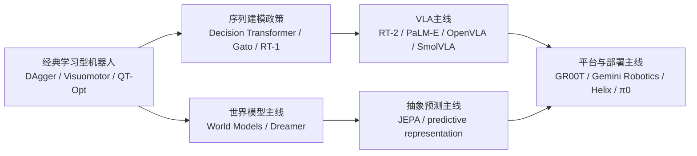

## 谱系维护补充
本章后续最值得固定成正式资产的，是完整论文谱系时间线与 `VLA / 世界模型 / 轻量部署` 三条谱系对照表。前者帮助读者追踪主线演化，后者帮助读者避免把不同目标函数、不同部署假设、不同研究对象误读成同一条线性升级路径。

这类补充之所以重要，是因为论文谱系章节的价值不在“列全”，而在“持续提供稳定比较框架”。

在当前版本中，`图 18-1 论文谱系时间线图` 已承担主时间线职责；`表 18-1 论文谱系字段表` 与 [18-论文谱系时间线表](D:/Projects/embodied-intelligence-report/docs/report/current/tables/18-论文谱系时间线表.md) 则共同承担结构化记录与时间轴维护职责。

`VLA / 世界模型 / 轻量部署` 三条主线之所以值得并行梳理，是因为它们分别对应“统一接口能力”“未来后果建模能力”与“真实部署约束吸收能力”三种不同的系统目标。把这些论文放回同一谱系里比较，可以减少“模型名字不同就像是不同代际”的错觉，也能帮助读者识别哪些工作只是改进单点性能，哪些工作真正推动了系统结构变化。

如果后续要做更严格的增量维护，本章建议优先同时配合两张结构化表来读：一张是字段表 [18-论文谱系字段表](D:/Projects/embodied-intelligence-report/docs/report/current/tables/18-论文谱系字段表.md)，用于固定“怎么记录一篇论文”；另一张是 [18-论文谱系时间线表](D:/Projects/embodied-intelligence-report/docs/report/current/tables/18-论文谱系时间线表.md)，用于固定“怎么把论文放回年份与主线里”。前者解决记录口径，后者解决时间结构；两者合在一起，才能真正支撑后续季度增量更新。

为了维持这一章的长期可更新性，新增高价值论文更适合先沉淀为 `research/papers/` 下的论文卡，再回写正文判断。这样做的意义，不只是资料整理方便，更在于先把方法、实验边界、贡献与局限拆解清楚，再决定它应被放回哪条技术主线中。目前可直接复用的首批卡片包括：

1. [RT-1 论文卡](D:/Projects/embodied-intelligence-report/research/papers/RT-1-论文卡-v0.0.md)
2. [RT-2 论文卡](D:/Projects/embodied-intelligence-report/research/papers/RT-2-论文卡-v0.0.md)
3. [PaLM-E 论文卡](D:/Projects/embodied-intelligence-report/research/papers/PaLM-E-论文卡-v0.0.md)
4. [OpenVLA 论文卡](D:/Projects/embodied-intelligence-report/research/papers/OpenVLA-论文卡-v0.0.md)
5. [SayCan 论文卡](D:/Projects/embodied-intelligence-report/research/papers/SayCan-论文卡-v0.0.md)
6. [Code as Policies 论文卡](D:/Projects/embodied-intelligence-report/research/papers/Code-as-Policies-论文卡-v0.0.md)
7. [DreamerV3 论文卡](D:/Projects/embodied-intelligence-report/research/papers/DreamerV3-论文卡-v0.0.md)
8. [Diffusion Policy 论文卡](D:/Projects/embodied-intelligence-report/research/papers/Diffusion-Policy-论文卡-v0.0.md)
9. [V-JEPA 论文卡](D:/Projects/embodied-intelligence-report/research/papers/V-JEPA-论文卡-v0.0.md)
10. [GR00T N1 论文卡](D:/Projects/embodied-intelligence-report/research/papers/GR00T-N1-论文卡-v0.0.md)

如果后续更新已经不再是“补一两篇论文”，而是需要批量判断整条路线的变化，则建议先读路线清单，再回到单篇卡：

1. [VLA 论文清单](D:/Projects/embodied-intelligence-report/research/papers/VLA-论文清单-v0.0.md)
2. [世界模型论文清单](D:/Projects/embodied-intelligence-report/research/papers/世界模型-论文清单-v0.0.md)
3. [规划与具身推理论文清单](D:/Projects/embodied-intelligence-report/research/papers/规划与具身推理-论文清单-v0.0.md)
4. [生成式动作与策略论文清单](D:/Projects/embodied-intelligence-report/research/papers/生成式动作与策略-论文清单-v0.0.md)
5. [硬件、部署与系统工程论文清单](D:/Projects/embodied-intelligence-report/research/papers/硬件、部署与系统工程-论文清单-v0.0.md)
6. [仿真、评测与基础设施论文清单](D:/Projects/embodied-intelligence-report/research/papers/仿真、评测与基础设施-论文清单-v0.0.md)
7. [开源生态与工具链论文清单](D:/Projects/embodied-intelligence-report/research/papers/开源生态与工具链-论文清单-v0.0.md)
## 表 18-1 论文谱系字段表

见：[18-论文谱系字段表](D:/Projects/embodied-intelligence-report/docs/report/current/tables/18-论文谱系字段表.md)

## 表 18-2 论文谱系时间线表

见：[18-论文谱系时间线表](D:/Projects/embodied-intelligence-report/docs/report/current/tables/18-论文谱系时间线表.md)

这两张表分别解决“怎么记一篇论文”和“怎么把它放回主线时间结构”两个问题，是本章后续版本维护时比单纯补段落更重要的稳定资产。

---

# 第十九部分 开源生态、代码库与工具链

具身智能领域的开源生态与纯软件 AI 有一个明显不同：它不仅包含模型代码，还包含数据格式、机器人接口、仿真环境、评测协议和部署工具。也正因为如此，开源生态在机器人领域既是研究扩散器，也是能力过滤器。一个方向若没有开源支撑，研究社区很难充分比较；但即使开源存在，也不代表该路线足够接近真实部署。

更准确地说，具身开源生态不是一个平面的“代码仓库集合”，而是一套层层嵌套的基础设施：上游有视觉 backbone、自监督表征与通用训练框架；中游有机器人策略模型、数据格式、仿真与 benchmark；下游还有数据采集、日志回放、边缘推理、部署监控和 ROS/中间件接口。理解这个生态时，最重要的不是“哪个仓库最火”，而是它在这条链路上处于哪个位置，以及它暴露了多少真实系统假设。

## 90. 开源模型

### 90.1 机器人基础模型
因此，阅读这类项目时最值得优先检查的通常是四件事：数据接口是否公开、动作表示是否明确、评测脚本是否可复现、部署约束是否被说明。只有这四项同时透明，基础模型才真正具备被社区继承和审查的价值。否则，它更像一个展示研究方向的样板，而不是一套可积累的公共资产。
把“机器人基础模型”作为开源生态中的一类对象单列出来，是因为它们往往不只是一个 checkpoint，而是一整套关于数据接口、动作表示、多任务条件化和评测方法的默认设定。对学习者而言，看这类项目时最重要的不是先问“参数有多大”，而是先问“它假设机器人问题该被怎样组织”。
但评价这类开源基础模型时，不能只看“是否开源了权重或代码”，还要看它是否把训练接口、动作表示、数据协议和评测脚本同时开放出来。对机器人来说，单独公开一个 checkpoint 的价值有限，因为真正决定复现与迁移成本的，往往是数据切片逻辑、动作 token 化方式、传感输入规范和与执行栈的绑定关系。也正因如此，能够把这些接口一并暴露出来的项目，往往比单点模型开源更有长期研究价值。

从学习路径上看，这类项目最适合承担“读懂问题设定”的功能，而不一定最适合直接变成你的第一套可部署系统。也就是说，它们往往更像研究接口样板，而不是现成产品模板。

OpenVLA 等项目的重要性，在于它们首次让研究者更系统地观察 VLA 路线的训练与部署接口，而不是只能依赖闭源演示理解其能力边界。[OpenVLA](https://arxiv.org/abs/2406.09246)

### 90.2 policy 学习模型
policy 学习模型这一类开源项目的真正价值，在于它们把机器人动作生成问题变成可直接替换、比较和复用的研究接口。不同仓库虽然名字各异，但常常围绕同几类分歧展开：动作是回归、扩散还是 token；输入窗口多长；是否支持多任务；是否显式建模恢复或闭环重规划。
这一类开源 policy 项目的真正意义，是把机器人动作学习从“彼此难以比较的私有实验”逐步推进成“至少在接口层可互译的研究对象”。它们提供的不只是算法实现，更是一套默认问题设定：观测窗口如何构造、动作是逐步输出还是 chunk 输出、损失函数如何兼顾平滑性与目标完成、评测时是否允许重规划。换句话说，policy 开源生态实际上在不断塑造研究共同体默认承认什么叫“可比较的动作学习结果”。

对报告维护者而言，这意味着后续每看到一个新 policy 仓库，都应先判断它是在重写哪一层默认设定，而不是只记录“又多了一个新模型名”。只要把这一习惯固定下来，第 19 章就不会沦为仓库名单。

Diffusion Policy、Decision Transformer、ACT 等工作提供了更通用的策略学习基线，使动作生成、轨迹建模和策略条件化问题得以进入更统一的比较框架。[Diffusion Policy](https://arxiv.org/abs/2303.04137)、[Decision Transformer](https://arxiv.org/abs/2106.01345)、[ACT](https://arxiv.org/abs/2304.13705)

### 90.3 多模态与世界模型相关开源项目
这一类项目的真正价值，在于它们虽然不一定直接输出机器人动作，却经常决定机器人系统能带着什么样的表征先验进入训练。视觉 backbone、自监督表示学习库、视频预测框架和多模态训练基座，往往在机器人专用仓库之前就已经改写了输入表示、时间建模方式和跨模态对齐接口。若只盯着最下游 policy 仓库，读者很容易错过这些更高杠杆的变化。

因此，更稳妥的阅读方法不是把它们视为“外围材料”，而是把它们放进同一条具身软件栈里理解：上游项目决定先验与表示，中游项目决定动作建模接口，下游项目决定评测与部署可行性。只有建立这种分层视角，开源生态才会从零散仓库收藏夹，变成可复用的研究地图。
这类项目的重要性，在于它们虽然不一定直接输出机器人动作，却决定了机器人上游表征、视频预测、抽象状态建模和多模态对齐能力的边界。很多机器人基础模型表面属于“机器人代码库”，底层却大量复用这些更通用的多模态资产。
这类项目常常不是直接面向机器人部署，却对后续具身路线产生上游决定性影响。很多机器人基础模型表面上是“机器人论文”，底层却大量借用了视觉 backbone、视频预测模型、自监督表征学习库和通用多模态训练框架。因而研究者若只跟踪机器人专属仓库，很容易错过真正改变接口能力的上游变化。理解开源生态时，必须把“机器人项目”与“机器人所依赖的通用表征资产”放在同一张图里。

世界模型、感知 backbone、自监督表示学习和视频预测的开源实现，则为后续机器人基础模型提供了大量上游组件。很多“机器人模型”真正依赖的，其实是这些更一般的开源表示学习资产。

这提醒我们在阅读机器人开源项目时，不应只盯着最下游 policy 仓库。很多决定系统上限的变化，其实先发生在上游视觉、自监督、多模态和视频建模资产中，而机器人仓库只是把这些能力重新绑到动作接口上。

### 90.4 轻量化与端侧路线的开源意义
轻量化开源路线还有一个经常被忽视的价值：它更早暴露真实部署约束。大模型演示往往默认充足算力、干净网络和高成本硬件，而轻量化项目会迫使社区正视模型尺寸、推理时延、内存占用、热设计功耗和设备成本这些不浪漫却决定落地成败的问题。因此，这类路线虽然在“能力想象空间”上不如巨型模型耀眼，但在“什么东西真正能在机器人上跑起来”这件事上，往往更接近现实。

SmolVLA、LeRobot 等路线之所以值得跟踪，不只是因为它们“能跑在更小机器上”，而是因为它们把低成本复现、社区参与和端侧约束一起变成研究目标。这与只发布一个大模型 checkpoint 的意义完全不同。[SmolVLA](https://arxiv.org/abs/2506.01844)、[LeRobot](https://arxiv.org/abs/2602.22818)

这类路线还有一个研究方法上的额外价值：它们迫使社区把“真实机器人算力预算”重新写回实验设计。过去很多研究默认离线训练与在线推理的资源约束完全不同，因此模型结构可以任意膨胀；而轻量化路线会逼迫研究者重新回答几个不那么浪漫但极其关键的问题：

1. 模型能否在板载设备稳定运行。
2. 量化、蒸馏与裁剪是否会破坏动作稳定性。
3. 端侧延迟抖动会不会直接影响闭环控制。
4. 小模型是否仍然保留足够的恢复与重试能力。

也因此，轻量化开源项目的价值常常不在于“指标最强”，而在于它们更早暴露出哪些能力是真正可以被部署继承的，哪些能力只是靠高算力实验环境暂时堆出来的。

## 91. 开源数据集与 benchmark

### 91.1 操作数据集
操作数据集最容易被误读的地方，是外界常常只盯着轨迹条数或任务数量，却忽略了协议层质量。对具身模型而言，更关键的问题往往是：动作空间是否一致，传感器与控制时间轴是否对齐，失败样本是否被完整保留，episode 边界如何定义，任务标签是否稳定，元数据能否支持跨任务重采样。这些看起来“工程化”的细节，往往比样本总量更决定可学性。

也因此，一个真正高价值的操作数据集，通常不只是数据文件本身，还包括清洗脚本、对齐规则、重采样工具、成功判定协议和版本化维护方法。若这些内容缺失，再大的数据池也可能很难转化成稳定的监督资源。
操作数据集之所以要单列，是因为它们定义了机器人“如何被看作一个训练样本生成器”。一个好的操作数据集不仅要有成功轨迹，还要有清晰动作接口、时间同步、失败样本、任务标签和足够可解释的元数据。
对操作数据集的判断也不能停留在“规模大不大”。真正关键的是它是否清楚定义了动作接口、对齐了传感与控制时间轴、覆盖了多少失败样本，以及任务成功究竟是以什么标准标注。一个看起来规模不小的数据集，如果动作协议混乱、示教质量不均或失败片段被大量过滤掉，最后很可能更适合做演示型模仿，而不适合做稳健闭环学习。

Open X-Embodiment 的重要性在于它尝试把跨平台机器人数据组织成可比较接口，这是机器人数据工程走向基础模型的关键一步。[Open X-Embodiment](https://arxiv.org/abs/2310.08864)

### 91.2 导航与移动数据集
导航与移动数据集的价值，在于它们更早把长期任务、地图记忆、重定位和场景级评测问题组织成了较成熟的 benchmark 传统。对具身学习者来说，这类传统很有借鉴意义，因为它说明：很多看似“新”的长时程问题，其实早已在移动机器人与 embodied AI 里被系统化处理过。
导航数据集和 benchmark 的长期价值，在于它们更早积累了“场景级结构化评测”传统。这类传统对具身智能很重要，因为它提醒我们：真正困难的问题往往不在单步感知，而在长时程任务中如何处理记忆、重定位、地图误差和恢复。也正因如此，导航生态里那些关于 episode 定义、重置条件、成功半径和探索预算的设计经验，后来都对更广义 embodied AI 问题产生了迁移价值。

导航和 embodied AI 社区长期积累了大量场景级数据集与 benchmark，为长时程任务、场景记忆和环境交互研究提供了可复用基础。Habitat 等环境也让“导航 benchmark 不是单个数据集，而是一套可反复实例化的实验接口”这一点更清楚。[Habitat](https://aihabitat.org/)

### 91.3 多机器人 / 多模态数据集
多机器人 / 多模态数据集的真正价值，不只是“样本量更大”，而是它们尝试统一观测、动作、时间戳、元数据与任务描述接口，使不同本体、不同传感器组合、不同采集流程之间第一次出现最基本的互操作可能。Open X-Embodiment 的启发也在这里：如果行业长期停留在各家自定义 schema、各家自定义 episode 格式，就很难形成可持续的跨平台学习生态。[Open X-Embodiment](https://arxiv.org/abs/2310.08864)

但把多源数据拼在一起，并不自动等于“可以直接联合训练”。不同本体的自由度、夹具、控制频率、接触边界和示教质量差异极大；不同模态之间还存在同步误差、缺失机制与噪声模型差异。因此真正有价值的数据集，往往还伴随对齐层、字段标准化、重采样策略与质量标签，否则规模优势很容易被分布错位抵消。

对具身智能而言，这类数据集最值得关注的，不只是它们是否提升了单次训练结果，而是它们是否在事实上推动了跨本体接口标准的形成。谁能把 episode schema、动作语义、传感器同步与评测协议稳定下来，谁就更可能影响后续生态，而不仅仅是贡献一个更大的数据池。
这类数据集最值得追问的问题，不是“规模大不大”，而是“不同平台之间到底对齐了什么”。如果只是把日志放进同一存储格式，但动作含义、传感器节奏和任务结构并未真正对齐，那么所谓统一数据集对基础模型训练的帮助也会受到很大限制。
这类数据集往往最容易在论文摘要中显得“通用”，却也最容易在细节上失去可比性。不同机器人平台的动作空间、控制频率、相机布局、示教方式和任务拆分方式一旦差异过大，所谓“统一数据集”就可能只是在存储层被拼接到了一起，而没有在语义层和控制层真正对齐。因此，评估这类开源资源时，最需要追问的往往不是规模，而是它到底统一了什么、又刻意保留了哪些不可统一差异。

这类数据集对通用性很重要，但也更容易隐藏平台差异和对齐困难，因此解读时必须警惕“看起来规模很大，但动作接口并不一致”的问题。

### 91.4 benchmark 为何也是“方法偏置”
从研究方法论上看，benchmark 本身就是一种隐形论文作者。它通过奖励什么、忽略什么来持续筛选研究路线。若 benchmark 主要奖励单次成功率，研究者就会倾向于优化静态命中；若它强调重试、恢复、鲁棒性和分布外扰动，路线就会更靠近真实部署。因而阅读开源 benchmark 时，不能把它当作中立舞台，而应把它视为一组被编码进评测协议里的价值判断。

benchmark 不是中性裁判。一个 benchmark 强调单步成功率，和一个 benchmark 强调长时程恢复能力，最终会把研究路线推向完全不同方向。因此，评估开源数据与 benchmark 时，必须同时问：它定义了什么问题，又把什么问题排除在外。

对学习者来说，一个很实用的习惯是：每看到一个 benchmark，就先写下它主要奖励什么、弱化什么、默认了哪些本体与场景假设。这样后续再看模型排名时，就不容易把“在这个 benchmark 下最强”误读成“在现实系统里最强”。

这一点与 [14-评测指标分层表](D:/Projects/embodied-intelligence-report/docs/report/current/tables/14-评测指标分层表.md) 可以互相配合。前者帮助判断 benchmark 奖励什么，后者帮助判断这些奖励是否足以支撑真实部署判断。

如果把这层理解再向前推进一步，那么 benchmark 实际上还承担着“分配研究注意力”的经济功能。社区时间、算力和复现资源都是有限的，哪些任务更容易被 benchmark 化，哪些指标更容易被排行榜化，就更容易持续吸收研究投入。因此，benchmark 的设计不是中性的学术细节，而是决定哪些方向会越来越热、哪些困难会被长期低估的结构力量。

这也解释了为什么本章要把 benchmark 和工具链放在一起讨论。一个 benchmark 若没有稳定脚本、公开环境、统一日志格式和易复用评测接口，它即使概念很好，也很难形成真正社区牵引力；反过来，一个工具链若天然支持某类评测，就会反向推动这类评测逐渐变成事实标准。理解这层互动后，开源生态才不再只是“仓库的集合”，而会变成“研究范式如何自我放大的机制图”。

## 92. 代码生态与工程工具链

### 92.1 训练框架
训练框架不只是“把模型跑起来的代码壳”，而是把数据切片、批处理、分布式训练、日志追踪、检查点管理和评测调用串成稳定工作流的中间基础设施。对具身系统而言，这一点尤其重要，因为训练对象往往不是单一张量，而是图像、状态、动作、语言、时间戳和任务上下文共同组成的多模态序列。

一个最小训练框架通常至少要回答四个问题：怎么读数据、怎么切序列、怎么组织损失、怎么在训练后调用评测。其极简骨架可以写成：

```python
dataset = load_robot_dataset(config)
batch = sample_multimodal_batch(dataset)
loss = model.compute_loss(batch)
loss.backward()
optimizer.step()
evaluator.maybe_run(model)
```
训练框架的成熟度还决定了社区能否把单次论文结果沉淀成持续可迭代工作流。一个真正有价值的训练框架，通常不只是“能跑通作者方法”，而是能支持数据版本化、分布式训练、日志追踪、失败复现实验和多模型接口替换。也就是说，训练框架决定的不只是实验效率，更是一个方向能否从论文代码成长为长期研究基础设施。

从通用深度学习训练框架到专门的机器人策略训练库，当前生态正在逐渐把多模态训练、动作 token 化、数据切片与分布式训练组织成更标准的工作流。

### 92.2 仿真与评测工具
这类工具的公共价值常常高于单个模型仓库，因为它们决定了不同路线能否被放到同一坐标系里比较。一个社区如果只有模型、没有共同环境脚本与评测协议，结果往往是“每篇论文都自带一套世界”。从长期知识积累角度看，仿真与评测工具链越公开、越标准化，整个领域越容易形成真正可继承的结论，而不是短期演示繁荣。
仿真与评测工具之所以应该单独看待，是因为它们承担的不是同一职责。仿真工具负责生成可交互环境、可控扰动和可重复试验；评测工具则负责把任务、度量、日志与结果统计固定成协议。前者回答“能不能在某个世界里试”，后者回答“试完以后怎么比较”。

从工具链分工看，这一层至少包括：

1. 环境实例化与 reset。
2. 传感器模拟与状态读取。
3. 任务脚本与扰动注入。
4. 指标统计、回放与可视化分析。

Isaac、Habitat、MuJoCo、ROS/Gazebo 等平台构成了机器人研究最重要的工具链底座。问题不在“哪个最好”，而在不同工具链分别服务于什么能力边界。[Isaac Sim](https://developer.nvidia.com/isaac/sim)、[Habitat](https://aihabitat.org/)、[MuJoCo](https://mujoco.org/)、[Gazebo](https://gazebosim.org/home)

### 92.3 数据采集与标注工具
对具身智能来说，数据工具链的重要性甚至接近模型本身，因为许多性能差异最终都来自数据采集协议、时间同步质量、失败片段保留率和元数据完整性差异。一个看似普通的录制与回放工具，只要能稳定记录语言、视频、机器人状态、动作和异常标签之间的时序关系，就足以显著改变后续训练闭环质量。这也是为什么很多真正有长期壁垒的团队，都会把数据工具链视为核心资产而不是附属脚本。
数据采集与标注工具的核心，不只是“把数据录下来”，而是把具身交互过程变成可回流训练的结构化资产。一个完整链路通常包括：遥操作或自动脚本采集、多模态时间同步、失败片段筛选、元数据记录、回放验证和标准格式导出。

其最小工作流可以写成：

```python
episode = recorder.start()
while task_active:
    recorder.log(obs, action, state, language, timestamp)
episode = recorder.stop()
dataset_writer.export(episode, schema="robot_standard")
```
对机器人社区来说，这类工具链的战略地位常常被低估。因为很多团队真正缺的不是再多一个 policy 网络，而是如何稳定录制遥操作轨迹、保证多模态时间同步、把失败片段筛出来、把现场日志组织成可回流训练样本。谁能把这条链路工具化，谁就更容易把零散实验积累成持续闭环。因此，数据工具链往往比单个模型仓库更接近真实护城河的雏形。

遥操作记录、时间同步、日志回放和失败样本筛选工具，是学习型机器人闭环能否形成的关键中间层。

### 92.4 部署与推理工具

部署与推理工具在具身智能里的特殊性在于，它们不是单纯把模型“导出一下”就结束，而是要回答四个系统问题：模型怎样被压缩或蒸馏；推理怎样与中间件和控制器对时；日志怎样回放和归因；失败时怎样切换到本地回退控制或人工接管。因此，这一层工具链的价值，往往比论文中的单次推理速度数字更大。

对学习者而言，部署工具最有用的不是“能不能一键跑”，而是它是否让你看见真实系统中那些论文常省略的接口：消息频率、缓存策略、状态同步、监控报警、回退控制、模型版本切换和现场日志。谁能把这些接口暴露出来，谁就更接近真实工程。
部署与推理工具关注的，不再是“模型训练得好不好”，而是“模型能否在真实机器人运行栈中稳定存在”。这一层通常包括模型压缩、运行时封装、设备侧调度、异常监控、回放与告警。它的输入是训练好的模型，输出则是一个能在具体硬件、通信链路和时延预算下工作的服务。

一个极简部署链路可以抽象为：

```python
runtime = load_runtime(target_device="edge_gpu")
model = runtime.optimize_and_load(checkpoint)
while robot_is_running:
    obs = middleware.read()
    action = model.infer(obs)
    middleware.write(action)
```
这一层工具之所以重要，是因为它决定了“论文能力”能否跨过最后一公里。模型压缩、端侧 runtime、实时调度、健康监测、回放与告警机制，看起来不像核心算法，却直接决定一个系统能否在现场长时间稳定运行。很多开源生态之所以长期停留在研究演示层，并不是缺少更强模型，而是缺少把模型嵌入真实机器人运行栈的部署级公共资产。

边缘推理、模型压缩、实时调度和日志监控工具，会越来越成为开源生态价值的重要组成，而不只是“论文附带代码”。

真正成熟的具身开源生态，最终不会只由训练脚本和 checkpoint 组成，而会越来越多地包含运行时、监控、回放、压缩和部署接口。这也是判断一个项目是否开始接近“公共基础设施”而不只是“研究仓库”的一个重要信号。

这一层之所以值得被单独强调，还因为它是许多研究路线最终失真最严重的地方。论文里经常默认“模型可推理”就接近“系统可运行”，但现实部署要额外处理 runtime 兼容、消息同步、监控指标、模型回滚、异常注入、边缘设备健康状态和任务中断恢复。谁把这些接口公开出来，谁就更接近真正可继承的工程资产；谁始终停留在离线推理脚本层，谁的开源价值就更偏向研究启发，而非部署基础设施。

对长期学习者而言，这里还有一个很实用的判断：若某个项目只公开训练代码而几乎没有回放、监控、部署和回退相关资产，那么阅读它时就应主动把它定位成“算法样本”；若它连运行时、日志、监控和版本切换接口都开始显式出现，就值得把它上调为“系统样本”甚至“基础设施样本”。这类分层判断，有助于避免把所有热门仓库都误看成同一种资产。

### 92.5 一个更实用的工具链分层法

如果把开源工具链按“学习者真正会怎么用”来分层，一个更实用的四层划分是：

1. 读接口层：看数据格式、输入输出张量、动作表示和任务脚本。
2. 复现实验层：能否在公开环境里复现实验、回放结果和评测流程。
3. 改任务层：能否替换对象、场景或本体，而不是只能按 demo 原样复刻。
4. 接系统层：能否与 ROS、仿真器、边缘推理和日志系统连起来。

这套分层法的好处是，它能帮助你快速判断一个仓库适合拿来做什么。很多热门项目在第一层和第二层很强，却完全不适合直接进入第四层；反过来，一些工程仓库论文感不强，却对第四层价值很大。这样理解后，就不容易把“研究可见性”误判为“工程可交付性”。

对学习者而言，更有用的不是按“论文方向”记工具，而是按以下四层记：

1. 数据层：采集、清洗、回放、格式标准化。
2. 模型层：感知 backbone、policy、VLA、world model。
3. 环境层：仿真、benchmark、评测脚本。
4. 部署层：ROS/中间件、端侧推理、日志与监控。

只有把工具放回这四层，才能真正理解一个项目缺的到底是“模型”还是“整条链路中的某一段”。

下面给出一个极简训练工具链伪代码，说明开源生态在现实中如何串起来：

```python
dataset = load_robot_dataset("openx_or_local_logs")
batch = slice_multimodal_sequences(dataset)
features = vision_encoder(batch["images"])
actions = policy.train_step(features, batch["states"], batch["actions"], batch["language"])
evaluator.run(policy, benchmark="sim_or_real")
```

真正重要的，不是这几行代码本身，而是它暴露出具身开源生态的真实耦合方式：数据格式、切片逻辑、编码器、策略、评测脚本必须能够接在一起，生态才会产生复用价值。

把工具链按这四层来记，还有一个额外好处：它能帮助研究者迅速识别“当前卡点究竟在哪一层”。很多时候问题并不是模型不够强，而是数据层没有时间同步、环境层没有可比评测、部署层没有稳定 runtime。只要这一判断被做清楚，后续补工作就不会总是条件反射地继续换模型。

如果进一步把这四层写成最小研究工作流，那么一个成熟的开源学习路径通常是：

```text
1. 先读数据层：确认 schema、时间同步、动作接口和成功判定。
2. 再读模型层：确认输入输出、训练目标和动作表示。
3. 再读环境层：确认 benchmark 奖励什么、忽略什么。
4. 最后读部署层：确认哪些能力真正能进入运行栈。
```

这一路径的价值在于，它迫使学习者先搞清系统接口，再看模型亮点，而不是一上来就被网络结构和演示视频牵着走。对本报告后续维护来说，这也是最适合作为新增开源项目时的标准阅读顺序。

## 93. 开源与产业闭源路线的关系

### 93.1 开源如何推动研究扩散
从机制上看，开源推动研究扩散，至少依赖三条链路：接口公开、实验可复现、社区可接力。接口公开让别人知道一个方法到底依赖了什么输入输出；实验可复现让后续研究不必从零搭私有栈；社区可接力则让数据格式、评测脚本和工具插件围绕同一接口逐步积累。

若把这一过程写得更抽象一些，可以理解为：

\[
\text{Open Source} \rightarrow \text{Shared Interface} \rightarrow \text{Reproduction} \rightarrow \text{Iteration}
\]
更具体地说，开源推动扩散的机制主要有三种：第一，降低复现实验的进入门槛，让更多团队可以在同一接口上比较方法；第二，暴露隐含假设，使社区能够识别某条路线到底依赖了哪些数据协议、硬件先验和训练技巧；第三，为后续工作提供可继承起点，而不是每篇论文都从零搭建私有栈。对具身领域这种链路极长的方向而言，这三点尤其重要。

这也是为什么在具身领域里，“接口是否公开”有时比“指标是否领先一点”更重要。前者决定别人能否接着做、能否在同一协议下复审结论；后者若缺乏可复现接口，往往只会形成一轮新的演示消费，而不会转化为公共研究资产。

开源让模型接口、数据协议和 benchmark 比较更透明，也让研究者更容易发现某条路线真正依赖的假设。

更进一步说，开源最稀缺的贡献往往不是把代码“放出来”本身，而是把一条路线压缩成别人可以继承的公共结构。一个真正高价值的开源项目，至少会让后来者少踩三类坑：输入输出接口如何定义、训练与评测协议如何组织、系统失败后如何定位问题。只要这三层结构被公开，后来团队即使不完全沿用原实现，也更容易在同一问题空间内继续推进。

这也是为什么有些项目虽然参数规模不大、分数也未必第一，却能长期影响社区主线。它们留下的不是某个时点的最好结果，而是一个可被复用的问题框架。对研究型报告而言，这种框架价值往往比一次性的性能领先更值得高权重记录。

### 93.2 闭源如何形成护城河
闭源路线形成护城河，通常也不是因为“把模型文件藏起来”这么简单，而是因为它把多个难复制环节耦合在一起：真实数据采集网络、本体与软件协同设计、现场运维、故障回放资产、客户场景适配和供应链经验。也就是说，闭源优势往往是系统级复合优势，而不是单点算法秘密。

若把这种壁垒拆开，可以粗分为：

1. 数据壁垒：长期现场日志、失败样本和高质量示教。
2. 系统壁垒：硬件、控制、感知、调度与安全机制的耦合优化。
3. 交付壁垒：部署流程、运维网络、客户定制与迭代闭环。
但闭源形成护城河的方式，也远比“把模型藏起来”复杂。真正难复制的，通常不是论文里那段核心网络，而是长时间积累的现场数据、故障回放资产、标注与回流流程、供应链 know-how、客户场景适配经验和运维网络。也正因为如此，很多企业即使在论文发表和公开视频上显得并不神秘，外部团队也很难短期追平其真实交付能力。

因此，理解闭源壁垒时最容易犯的错，是把它缩减成“他们肯定藏了更强的模型”。很多时候，真正难复制的是成百上千次现场失败如何被记录、谁来处理接管、哪些版本能安全回滚、以及不同客户场景是如何被逐步模板化的。这些资产哪怕论文里一句没写，也可能比单个模型结构更决定企业位置。

闭源企业真正的护城河往往不在论文文本，而在真实数据规模、本体耦合、系统集成经验和部署基础设施。

如果把闭源壁垒再抽象一步，可以把它理解为：

\[
\text{Moat}_{closed} \approx \text{data} + \text{deployment} + \text{ops} + \text{integration}
\]

这当然不是严格经济模型，但它提醒我们：闭源护城河通常是多种难复制资产的和，而不是单一模型权重文件。尤其在具身行业里，部署网络和异常恢复组织能力往往比“再多一个点的 benchmark 提升”更决定长期壁垒。

也因此，后续在企业专题里遇到“闭源很神秘”的说法时，更稳妥的做法不是猜它藏了什么，而是去追问它具体控制了哪一类复合资产：现场数据回流、硬件调参经验、版本回归体系、供应链协同，还是客户工作流嵌入能力。只要把资产类型拆开，闭源路线的真实位置通常会比宣传口径清楚得多。

### 93.3 对学习者与研究者的启发
对学习者而言，更实用的策略通常不是在开源与闭源之间选边站，而是把二者当作不同类型的证据源。开源更适合理解结构、接口和可复现实验边界；闭源更适合理解哪些能力已经值得真实场景高成本投入。把这两类信号并读，往往比只追某一边更接近行业真实。

对研究者而言，一个同样重要的启发是：不要只问“有没有更强模型”，还要问“这条路线是否在开源生态中留下了可继承的接口资产”。后者往往比一次性的分数提升更能决定一个方向会不会变成长期主线。
因此，对个人研究者最稳健的策略不是在“开源信仰”和“闭源崇拜”之间选边，而是把两者当作不同性质的证据源。开源更适合理解结构、接口与可复现实验边界；闭源更适合理解什么能力在真实商业环境里被证明值得高成本投入。把这两类信号并读，往往比单独追任何一边更接近行业真实。

对个人研究者而言，最有效的策略通常不是执着区分“只看开源”或“只看闭源”，而是利用开源理解方法结构，再通过闭源路线检验哪些部分已经接近真实产业能力。

换句话说，开源更像显微镜，闭源更像压力测试。前者帮助我们看清方法细节、接口假设和复现路径，后者帮助我们判断哪些能力已经值得被高成本真实场景反复验证。把两者配合使用，才更接近具身行业的真实信息结构。

对学习者更实用的一条方法论是，把开源项目当成“接口教科书”，把闭源路线当成“价值筛子”。前者帮助理解系统通常如何组织，哪些环节容易暴露问题，哪些数据格式和评测协议已经成为事实标准；后者则帮助判断，行业究竟愿意为哪些能力支付真实金钱、真实运维成本和真实责任成本。两者合起来，才能避免陷入“只会复现开源 demo”或“只会追逐闭源神话”的两种偏差。

因此，本章对后续研究工作的直接建议不是简单多收藏仓库，而是建立一套更强的筛选习惯：一个开源项目是否留下了接口资产，一个闭源路线是否留下了部署证据。只要沿这条线持续积累，开源生态章节就不只是资源清单，而会成为整本报告的研究入口和现实校准器。

### 93.4 一个重要的现实判断

对具身智能学习者来说，一个非常重要的现实判断是：开源生态最适合用来建立问题结构感，而不适合直接替代现实交付经验。更具体地说，开源通常最擅长回答：

1. 这个问题在社区里通常怎样定义。
2. 输入输出接口常见写法是什么。
3. 哪些数据格式、仿真环境和评测脚本已经成为事实标准。

但它不一定能回答：

1. 客户现场最常见的异常是什么。
2. 本体维护、现场运维和回退机制如何组织。
3. 哪些系统约束会在连续运行几百小时后暴露。

因此，最有效的学习路径通常不是“只看开源”或“只看企业 demo”，而是把两者拼起来：用开源读结构，用企业与部署案例读边界。后文企业与商业化章节的很多判断，实际上都建立在这套双重阅读法上。

这里最重要的现实判断，不是简单地区分“开源更好”还是“闭源更强”，而是承认两者提供的是不同性质的证据。开源更适合帮助研究者理解接口、复现实验、识别隐含假设和沉淀公共工具链；闭源更容易暴露真实部署、客户约束、系统维护和交付组织能力。

若把两者混为一谈，就会产生两类常见误判：一是把“可复现”误认为“可部署”，二是把“可演示”误认为“可比较”。对学习者而言，更稳妥的做法是同时利用两类信息源：用开源理解结构，用闭源验证现实边界。

进一步说，这一章最希望沉淀的不是抽象立场，而是一种阅读习惯：遇到开源项目先问其接口与可复现边界，遇到闭源路线先问其真实交付与系统约束。只有把这两套问题并行保留，研究者才不会在“看得见的东西”和“真正重要的东西”之间反复失焦。

在具身智能里，“有开源”通常意味着更容易进入学习与复现；但“没有开源”并不自动意味着路线没价值。真正更需要警惕的，是两类误判：

1. 把开源可复现性误判为真实部署成熟度。
2. 把闭源演示效果误判为系统可比较性。

本部分的结论是：开源生态是理解具身智能最快的入口之一，但不是理解现实落地能力的终点。后文企业章节中的大量判断，都应回到这里的“开源可见性 vs 闭源可交付性”张力中理解。

再往前走一步，本章真正想固定的不是“有哪些值得收藏的仓库”，而是“开源生态如何被重新组织成一套可学习、可复现、可拼接的研究工作流”。因此，后续新增项目时最重要的不是扩长名单，而是先判断它到底补在数据层、模型层、环境层还是部署层，以及它与现有接口是兼容、替代还是只做局部增强。只要这一判断被稳定写下，开源生态章节就会持续像一张基础设施地图，而不是一个随热度波动的仓库清单。

同样需要强调的是，开源项目的价值并不只由“论文对应关系”决定。很多仓库本身可能并不代表前沿算法，却在数据清洗、日志回放、评测脚本、端侧 runtime、ROS 集成和可复现训练方面具有极高的工程杠杆。对长期学习者而言，这类项目往往比单次高分模型更能帮助建立真实研究能力。因此，本章后续维护时应持续保留一条原则：优先记录“它让哪一段工程链路第一次变得可复用”，而不只是“它在社区里是否出名”。

进一步说，本章最终希望固定的一种阅读纪律是：开源项目先看接口，再看声量；先看其让哪一层链路变得可复用，再看其是否拥有最强分数；先看它暴露了多少真实系统假设，再看它讲了多少宏大愿景。只要坚持这三步，开源生态章节就能持续保持研究型价值，而不会退化为每隔几个月更新一批“值得收藏的 GitHub 仓库”。

## 图 19-1 开源生态四层结构图

源文件：`assets/diagrams/19-开源生态四层结构图.mmd`

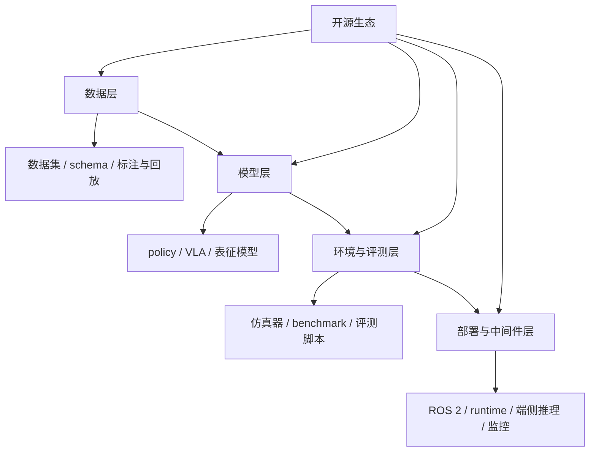

## 图表与案例补充

本章的图表与案例，不应被视为附属装饰，而应被理解为“如何把零散开源项目重新组织成学习与研究工作流”的结构化工具。对学习者来说，真正困难的往往不是知道仓库名称，而是判断一个项目位于数据、模型、环境还是部署层，并进一步识别它与自己研究目标之间缺失的工程链路。

因此，这里的补充材料应优先服务于接口关系、依赖方向、最小复现路径和失败模式分析，而不只是继续罗列项目名单。只有把这些关系显式画出来，开源生态才会从“很多仓库”转化为“可组合基础设施”。

在当前版本中，`图 19-1 开源生态四层结构图` 已承担分层结构说明；[19-代表性开源项目对照表](D:/Projects/embodied-intelligence-report/docs/report/current/tables/19-代表性开源项目对照表.md) 与 `表 19-1 开源生态四层对照表` 则分别负责“项目级横向对照”与“生态层级定位”。

“从开源代码到最小复现实验”的路径，最好被理解成一类独立的研究资产，而不只是正文中的说明句。因为这类内容天然需要同时记录环境依赖、数据准备、训练命令、评测脚本和常见失败点，若只停留在报告叙述层，会很快丢失可复用性。因此，本章与 `research/`、`code/` 的连接并不是附属关系，而是开源章节真正能够服务后续实验工作的关键接口。

目前这章已经可以配合 [19-开源生态四层对照表](D:/Projects/embodied-intelligence-report/docs/report/current/tables/19-开源生态四层对照表.md) 和 [19-代表性开源项目对照表](D:/Projects/embodied-intelligence-report/docs/report/current/tables/19-代表性开源项目对照表.md) 一起读。前者负责回答“开源生态分几层”，后者负责回答“具体项目在这几层中的什么位置、适合拿来做什么”。这样后续补项目时，就不容易重新退化成仓库名单。

## 表 19-1 开源生态四层对照表

见 [19-开源生态四层对照表](D:/Projects/embodied-intelligence-report/docs/report/current/tables/19-开源生态四层对照表.md)。

## 表 19-2 代表性开源项目对照表

见 [19-代表性开源项目对照表](D:/Projects/embodied-intelligence-report/docs/report/current/tables/19-代表性开源项目对照表.md)。

从维护方法上看，后续新增开源项目时，建议先查 [开源生态与工具链论文清单](D:/Projects/embodied-intelligence-report/research/papers/开源生态与工具链-论文清单-v0.0.md)，再判断是否需要进入 [19-代表性开源项目对照表](D:/Projects/embodied-intelligence-report/docs/report/current/tables/19-代表性开源项目对照表.md) 或 `data/processed/开源生态分层-v0.0.csv`。

---

# 第二十部分 企业分析框架

在具身智能领域，企业信息极易沦为新闻流和 demo 流。如果没有统一分析模板，就很容易被融资额、宣传片和单次演示带偏，而忽略真正决定长期价值的技术与交付变量。因此，本部分的职责，是先建立一个稳定的企业分析框架，再在后文具体公司章节中重复使用。

这一框架的必要性在 2024-2026 年尤为突出。Figure、Physical Intelligence、Apptronik、Agility、1X、Sanctuary AI、特斯拉 Optimus、优必选、宇树、智元等公司分别站在“通用本体”“VLA/基础模型”“工业交付”“物流场景”“人形平台”“远程接管”和“中国制造链协同”等不同位置上。若没有统一模板，很容易把风格完全不同的公司放在同一维度上比较，最后只剩下谁更会讲故事、谁视频更好看，而看不见底层变量。[Figure](https://www.figure.ai/)、[Physical Intelligence](https://www.physicalintelligence.company/)、[Agility Robotics](https://agilityrobotics.com/)、[UBTECH](https://www.ubtrobot.com/)

更进一步说，企业分析框架的真正意义不是“做成一张表”，而是把企业研究从新闻消费转成结构化判断。报告后续任何一版更新，只要能坚持使用同一套问题集，就能够积累跨时间、跨公司、跨路线的比较能力，而不是每次都重新被新的品牌叙事带走。

## 94. 为什么企业需要统一分析模板

### 94.1 防止沦为新闻罗列

企业分析最常见的失效方式，就是把连续发生的融资、发布会、合作新闻和 demo 视频顺次堆进报告，最后得到一份“信息很多但判断很弱”的时间流。之所以需要专门强调这一点，是因为具身行业本身就处在高波动、高叙事密度阶段，如果没有稳定框架，研究者很容易在更新过程中被最新事件牵着走，而丢失对企业长期能力结构的判断。

更稳健的做法，是把任何新增新闻都强制回写到既定分析维度中，例如它究竟改变了数据获取、系统集成、制造交付、客户进入还是资本耐心。只有当事件真正改变其中某一条能力链条时，它才值得进入正文判断；否则，它更适合作为跟踪日志而不是结构性结论。这个规则看似保守，但正是防止企业章节退化成“资讯摘要”的关键。
企业分析框架首先要解决的，就是避免把研究写成“按时间顺序堆新闻”。新闻罗列最大的问题不只是冗长，而是它会把高频曝光误当作高价值进展，把单次演示误当作能力跃迁。一个稳定框架的意义，在于无论企业发了多少视频、融资稿和发布会材料，我们都始终用同一组问题去过滤信息。

更具体地说，每条企业信息至少都应被追问三件事：它说明的是能力、接口、落地还是资本信号；它是一次性展示还是可重复趋势；它对应的证据强度来自论文、开源、客户部署还是市场宣传。只有把这三层拆开，企业研究才不会被节奏带着走。
企业分析之所以极易滑向新闻罗列，是因为外部公开信息天然偏向“融资、合作、发布、演示”这些传播友好事件，而真正决定公司位置的底层变量反而更难直接被看见，例如数据闭环是否真实建立、现场部署是否持续、失败恢复是否被系统性吸收、供应链是否开始收敛。统一模板的价值，就在于强迫分析从传播事件退回到系统变量，而不是被舆论节奏牵着走。

没有统一框架，企业章节往往会退化为时间线式材料堆叠，难以横向比较。

因此，这一章最重要的产出并不是“这次列了哪些公司”，而是留下了一套之后每个季度都能继续用的问题集。后续企业更新若偏离这套问题集，章节质量就会迅速回落到新闻摘要层。

### 94.2 便于横向比较
横向比较的关键，不是给所有企业排一个简单名次，而是让不同企业在相同维度下可被并列阅读。例如同样做人形机器人，有的公司强在本体与控制，有的强在数据与模型，有的强在场景集成与交付，有的强在融资与生态绑定。如果没有统一维度，报告很容易退化成“每家公司都看起来很厉害，但彼此很难比较”。

因此，框架至少应固定住若干横向维度：团队背景、技术路线、数据与模型、本体与系统能力、目标场景、商业路径、资本与合作、风险与局限。之后每个公司都沿这几条轴展开，才能真正形成可比较材料。
横向比较真正困难的地方，在于不同公司往往根本不在同一问题设定里竞争。有的公司卖的是平台叙事，有的卖的是场景交付，有的卖的是模型接口能力，有的卖的是本体制造与供应链组织。如果不先拆成共同维度，比较就会沦为“谁讲得更大、谁看起来更通用”。统一模板的作用，不是消除差异，而是把差异压回可以被解释的位置。

同一分析模板可以迫使报告不断问相同问题：本体是什么、数据从哪里来、模型如何训练、部署在哪些场景、交付能力如何。

目前这套模板已经落成表格版本，见 [20-企业统一分析模板](D:/Projects/embodied-intelligence-report/docs/report/current/tables/20-企业统一分析模板.md)。后续版本若要做季度更新，可直接配合 [20-企业季度跟踪表模板](D:/Projects/embodied-intelligence-report/docs/report/current/tables/20-企业季度跟踪表模板.md) 使用。

### 94.3 便于后续版本更新
企业分析框架若不能服务后续版本更新，它就只是一份一次性阅读提纲，而不是长期研究工具。一个合格的模板，必须让我们在数月后面对新增论文、融资、客户、事故、合作与产品发布时，能够把新信息直接插回既有维度，而不是整章重写。换句话说，模板的价值不仅在于当下读起来整齐，更在于未来是否支持增量维护。

这要求框架把“长期稳定维度”和“短期变动信号”明确分开。前者包括技术路线、本体形态、主要场景、组织出身和商业模式；后者包括新版本模型、客户试点、季度融资、关键人变动与新演示。只有把两类信息分层存放，后续版本才可能回答三个更重要的问题：哪些事实变了，哪些判断没变，哪些判断需要修正。

因此，本章模板本质上也是版本控制模板。它让企业研究从“每次重写一篇简介”转成“沿同一问题集持续积累判断”。这对本项目尤其关键，因为后续企业章节数量会持续增长，若没有稳定模板，整书很快会被新资讯冲散结构。
企业章节还必须服务于后续版本维护。一个好的结构不是只对当前阅读顺手，而是能在几个月后行业变化时，快速把新增论文、产品、客户、融资和事故插回原有框架中，而不必整章重写。

也就是说，企业框架不仅是阅读工具，还是版本化维护工具。它要求我们把“长期稳定维度”和“短期变化信号”分开放置：前者例如技术路线、本体形态、主要场景；后者例如最新产品发布、合作进展、融资事件和关键人才变动。
从版本维护角度看，这一点尤其关键。只要模板稳定，后续更新就可以把“哪些事实变了、哪些判断没变、哪些判断需要修正”分开记录，而不是每次新开一轮研究都把企业重新写成一篇简介。这使报告能够逐渐积累一种跨时间的判断连续性，而不是不断被新一轮宣传材料刷新记忆。

有模板，后续版本就能按相同结构增量更新，而不是每次重写企业画像。从版本维护角度看，企业分析框架也是报告长期可更新性的关键支点。它允许后续版本只替换“事实层”和“判断层”中的局部内容，而保留相同问题集，从而实现跨版本对照。

## 95. 企业统一分析维度

### 95.1 团队背景

团队背景之所以应被列为第一层，不是因为创始人履历天然决定成败，而是因为它往往提前暴露了公司最可能形成优势和最可能忽视的问题。来自自动驾驶、控制和机器人学背景的团队，通常更重系统安全、闭环与工程纪律；来自大模型或互联网 AI 背景的团队，往往更擅长统一接口、数据组织和平台叙事；来自制造或工业自动化背景的团队，则更可能在交付、成本和现场适配上走得更稳。

因此，阅读团队背景时最不该做的，是停留在“名校、名企、明星履历”的表层印象。真正值得追问的是：这支团队过去成功解决过哪一类复杂问题；它的知识结构是否覆盖了本体、数据、模型、部署与交付之间的关键断点；以及它是否存在明显的结构性盲区。例如强模型团队是否低估硬件与现场维护，强本体团队是否低估数据工程与持续学习。这些问题比头衔本身更接近企业未来路径。
团队背景不应只写创始人履历，而应回答“这家公司最初是从什么能力起家的”。控制、自动驾驶、计算机视觉、硬件制造、工业自动化、云平台或消费电子出身，会直接影响其早期技术路径、数据获取方式和商业切入点。

一个实用的读法是：团队背景往往不是花边信息，而是企业早期能力边界的线索。例如自动驾驶背景更容易延伸到感知栈和数据闭环，工业自动化背景更容易延伸到场景集成与客户交付，消费电子背景则更可能在成本工程和量产链条上占优。
团队背景之所以重要，不是为了满足公司介绍的完整性，而是因为它往往预示了路线的初始偏置。来自自动驾驶、工业自动化、消费电子、通用大模型、学术实验室或互联网平台的团队，会天然带着不同的问题拆解方式、风险偏好和工程优先级。理解这个出发点，往往能更早解释公司为何强调某类能力、忽略某类约束，以及其后续能否顺利跨越原有能力圈。

看创始人与核心团队是来自学术、工业自动化、自动驾驶、大模型公司还是消费电子，这往往会直接影响其技术与产品路径。

这一维度的重要性还在于，它通常能解释企业为何会优先解决某些问题、忽略另一些问题。团队背景不是花边信息，而往往是路线偏置最早也最稳定的来源之一。

### 95.2 技术路线

技术路线这一项的核心，不是给公司贴上“做 VLA”“做人形”“做世界模型”之类标签，而是判断它把哪一层能力当作主抓手。有人把通用模型与接口视为第一性问题，有人把本体与执行器视为瓶颈，有人把数据闭环与部署回流视为真正壁垒。表面上都在做具身智能，实质上是在押注完全不同的主矛盾。

因此，技术路线分析应该至少回答三个问题。第一，公司把系统上限主要押在哪一层。第二，这条路线最依赖哪些外部条件，例如大算力、海量示教、特定本体或特定场景。第三，一旦这些条件不成立，路线会以什么方式失效。只有把路线与依赖条件、失效方式一起写出来，技术分析才不会退化成口号归类。

技术路线这一栏最容易被企业材料中的高频词误导。很多公司都会说自己在做人形、VLA、世界模型、端到端或基础模型，但这些标签本身并不足以说明系统究竟如何组织输入、动作接口、数据闭环和部署逻辑。若不继续追问技术结构，路线描述就会停留在宣传层。

因此，这一维度真正该记录的，不是公司用了哪些热词，而是它到底把智能放在系统的哪一层：高层任务接口、中层技能拼接、低层动作生成，还是横跨多层的统一模型。只有把这些位置写清，路线比较才真正有意义。
技术路线章节应至少回答四个问题：该公司是否强调端到端还是模块化；是否把大模型放在高层还是直接放在动作层；是否强调仿真、遥操作、世界模型或 VLA；其系统更像研究原型、平台型基础设施，还是面向固定场景的产品栈。

如果把企业路线抽象成接口图，常见差异主要出现在三处：输入是什么，动作接口是什么，低层是否保留强技能或控制器。把这几点写清楚，往往比泛泛说“公司采用大模型路线”更有信息量。

看其更偏人形、本体平台、VLA、系统集成、仿真基础设施还是场景专用解决方案。

### 95.3 数据与模型能力
企业的数据与模型能力，不能只停留在“有没有 foundation model”“有没有数据闭环”这类口号式描述，而要继续追问两者之间是否形成了可放大的耦合关系。公司究竟依赖公开多模态先验、遥操作示教、真实部署回流、仿真合成，还是多源混合；模型究竟服务于高层任务接口、技能调度、低层动作生成，还是更多停留在演示层。

更细一点，可以把所谓“数据与模型能力”拆成四个层次来判断。第一层是数据获取能力，即企业是否能够以可持续成本采集到高价值样本，而不是只靠一次性 demo 数据。第二层是数据组织能力，即是否具备标注规范、失败回放、质量筛选和跨任务复用机制。第三层是模型吸收能力，即这些数据究竟能否转化为更强的泛化、恢复或效率表现，而不是仅提升同分布指标。第四层是部署回流能力，即模型上线后产生的新数据是否还能重新进入训练与验证闭环。

只有当这四层形成正反馈时，数据与模型才真正构成企业壁垒。否则就会出现两种常见错觉：一种是“有很多机器人在跑，所以一定有数据优势”，但这些数据并未被结构化整理；另一种是“发布了大模型，所以模型能力一定领先”，但模型并未深度嵌入执行链路。报告在评估企业时，应当特别警惕这两类叙事捷径。

真正值得识别的是：企业是否具备把数据持续转化为模型改进、再把模型改进稳定反馈回部署表现的能力。若没有这条闭环，所谓“模型能力强”很可能只是阶段性亮点，而不是持续优势。反过来，即使模型名词不够响亮，只要数据回流、失败吸收和任务重训机制足够扎实，也可能形成更耐久的竞争力。

因此，这一维度在后续企业分析里建议至少记录五项：数据来源结构、数据回流频率、训练对象层级、是否覆盖失败样本、模型更新是否进入真实执行链路。只有这几项被写清楚，“数据与模型能力”才不是抽象标签，而是可比较变量。

企业的数据与模型能力，不应只看“有没有大模型”或“有没有数据闭环”这类口号式表述，而应继续追问这两者之间是否形成了真正可放大的耦合关系。公司究竟是依赖公开视频先验、遥操作示教、真实部署回流、仿真合成，还是多源混合？模型究竟服务于高层任务接口、技能调用、低层动作生成，还是更多停留在展示层？

也就是说，这一维度真正想识别的是：企业是否具备把数据持续转化为模型改进、再把模型改进持续反馈回部署表现的能力。若没有这条闭环，所谓“模型能力强”很可能只是一时亮点，而不是持续优势。
这一维度要看的，不只是“有没有模型”，而是数据闭环是否真实存在。具体可以追问：公司靠什么采数据，是真机日志、遥操作示教、仿真合成还是外部多模态数据；训练对象是技能策略、VLA、世界模型还是混合系统；模型更新是否看得出和部署反馈形成闭环。
这一维度不应只看“有没有大模型”或“有没有数据”，而要看两者是否形成闭环。公司是依赖公开数据、遥操作示教、现场日志回流，还是仿真合成与人工标注混合？模型是作为宣传层能力展示，还是已经进入真实执行链条？很多企业在这一维度最容易出现错觉：看起来模型很强，但没有足够真实闭环数据支撑；或者有不少现场数据，却缺乏统一表示层把数据资产真正放大。

看其是否掌握大规模真机数据、遥操作体系、仿真数据生成能力、foundation model 能力或特定任务闭环。

### 95.4 硬件与系统能力
硬件与系统能力必须单列，是因为具身企业最终交付的不是一个孤立模型，而是带本体、执行器、传感器、控制栈、中间件与运维边界的完整系统。若企业只在高层智能上发力，却无法控制本体一致性、执行器表现、现场标定和版本回滚，它的能力上限就很难在真实场景里兑现。

更有意义的追问不是“它有没有自己的机器人”，而是“它掌握了身体与智能之间哪些关键耦合位置”。哪些部件自研，哪些接口可控，哪些系统性风险由自己承担，哪些仍依赖外部平台，这些才决定企业究竟是展示型团队、集成型团队，还是具备系统主导权的产品团队。

这也是区分“模型公司借机器人做展示”和“真正具身公司”的关键维度之一。只要企业开始认真承担本体一致性、维护便利性、控制可靠性和现场部署摩擦，它面对的问题就从单点算法问题跃迁为系统工程问题。虽然这会拖慢节奏、增加成本，但也更接近真实交付能力。

硬件与系统能力之所以必须单列，是因为具身企业最终不只是交付一个模型，而是在交付一个带身体、带传感器、带控制栈、带运维边界的完整系统。若公司只在高层智能上用力，却无法控制本体一致性、执行器表现、中间件稳定性和现场部署摩擦，它的能力上限就很难真正兑现。

因此，看硬件与系统能力时，更有意义的不是问“它有没有自己造机器人”，而是问它是否真正掌握了身体与智能之间的关键耦合位置：哪些部件自己定义，哪些接口自己控制，哪些系统风险自己承担。只有这样，这一维度才不会退化成“有无本体”的表面判断。
硬件与系统能力这一栏的重点，是判断企业到底是在“借用通用平台堆模型”，还是确实掌握了本体设计、执行器、传感、控制和系统集成能力。很多企业看起来都能做演示，但真正决定持续交付能力的，往往是本体一致性、维护便利性、控制可靠性和现场适配能力。
这也是区分“模型公司借机器人做展示”和“真正具身公司”的关键维度之一。只要企业开始控制本体、执行器、传感配置、系统中间件、运行时监控与现场调度，它面对的问题就从单点算法跃迁为系统工程问题。虽然这会显著拖慢节奏、增加成本，却也更接近真实交付能力。很多公司真正的分水岭，不在 demo 有多亮眼，而在是否愿意承担这部分复杂性。

看其是否只是发布模型或 demo，还是已经控制本体、执行器、感知栈、中间件与运维链路。

### 95.5 产品与落地
本节在企业分析里尤其重要，因为很多公司表面上“技术相似”，实际却在卖完全不同的东西。有的卖本体，有的卖整站解决方案，有的卖持续运维服务，有的卖数据与训练基础设施，还有的卖高层接口与生态位置。若不先把产品边界写清楚，后面的技术判断和商业判断很容易混线。

因此，记录产品与落地时，不应只写公司“做什么”，而应写客户“到底买到了什么”。客户买到的是设备、任务完成能力、持续升级承诺，还是一个可接入现有流程的中间平台？不同答案对应不同的销售周期、责任边界、实施难度与毛利结构，这些差异往往比模型名词本身更能解释企业走向。

产品与落地这一维度真正想回答的，不是企业“有没有产品名”，而是它到底卖的是什么交付单元。是本体平台、整套解决方案、按场景收费的服务，还是仍主要停留在技术验证和试点合作阶段。只有把交付单元定义清楚，后续关于客户、收入、部署规模和扩张性的判断才有意义。

这也是为什么企业分析中最容易被忽视的，并不是技术细节，而是产品边界。很多看起来都在“做机器人”的公司，实际上卖的是完全不同的东西；若不先把这一层拆开，横向比较就容易失真。
产品与落地不能只看“有没有发布产品名”，而要看它究竟对应什么交付单元。是卖硬件本体、卖整套解决方案、卖服务合同，还是先以试点项目形式进入客户现场？研究报告里，这一节最重要的是判断落地是否进入了重复部署阶段，而不只是单次合作展示阶段。
产品与落地维度的核心问题，是公司究竟卖什么。如果卖的是平台，本体、SDK、开发接口与生态协同就重要；如果卖的是场景方案，任务边界、部署稳定性和维护效率更重要；如果还停留在技术验证阶段，那么再漂亮的能力展示也不能直接外推为可规模化产品。把“卖什么”问清楚，很多表面相似的企业会立刻分流到完全不同的比较赛道上。

看其究竟在卖平台、整机、场景方案还是尚处于技术验证阶段。

### 95.6 资本与合作
资本与合作信息之所以值得单列，不是因为它们能直接证明技术先进，而是因为它们会放大或暴露企业最核心的组织约束。一个合作若只是联合发布和品牌站台，信息含量并不高；若它开始改变数据来源、量产节拍、客户触达、零部件获取或场景试点能力，它才真正进入了企业能力层。

因此，资本与合作更适合作为“能力放大器”来读，而不是“结果证明”。后续版本维护时，建议持续区分融资结构、合作深度和对核心约束的穿透程度，否则企业研究很容易被金额和名单牵着走。

资本与合作更适合作为辅助证据，而不是主证据，因为它们更多反映的是市场预期、产业站位和资源流向，而非系统已经兑现的能力。一个合作公告可能表明公司打开了渠道，一个大额融资可能表明市场愿意为远期叙事付费，但它们并不自动等价于数据闭环成熟、本体稳定或部署网络已经成形。

更稳妥的读法是追问这些资本与合作究竟增强了哪一层能力。若它们帮助企业获得真实场景、供应链掌控力、运维网络或数据回流入口，那么信号含金量会更高；若主要停留在品牌放大或概念对齐层，其长期意义就应更保守解读。
资本与合作要看的也不只是金额大小，而是资本背后站着哪些产业资源、客户资源和供应链资源。不同投资人与合作方，往往隐含了公司未来最可能先进入的场景和最可能形成的护城河。
资本与合作更适合作为辅助证据，而不是主证据。它们能揭示市场预期、产业站位和资源协同方向，但不能自动证明技术已成熟或交付已成型。真正有用的问法是：这些资本与合作究竟增强了哪一层能力，是让公司更有机会扩大采数闭环、切入客户现场、优化供应链，还是主要停留在叙事放大层。

资本和合作伙伴能反映产业预期，但不能替代技术与交付能力本身。

### 95.7 风险与局限
这一项其实是企业分析里最不能省的一项。因为具身领域最常见的误判，就是只看公司最亮的一面，却不追问它最脆的一面。每家公司都至少有一个核心瓶颈会在未来 1-3 年持续限制其上限，例如本体成本、采数效率、部署稳定性、运维网络、客户场景泛化或商业闭环。只有把这个瓶颈明确写出来，企业分析才真正具备判断力。

更进一步说，风险与局限不应只写成泛泛的“行业仍早期、商业化仍有挑战”。真正有用的写法应当尽量具体到哪一类约束最可能先成为拐点，例如示教成本是否会先压垮扩张速度，端侧算力是否会先限制模型升级，现场运维是否会先吞噬毛利，还是责任边界不清会先阻断客户放量。风险写得越具体，后续版本更新时就越容易验证它是否正在变成现实。

每家公司都应被追问其最脆弱的一点：是本体成本、数据规模、通用性不足、部署困难，还是商业模式尚未闭环。

为了让这一框架更可操作，可以把企业评分抽象为一个多维向量：

\[
\mathbf{s} = [s_{\text{body}}, s_{\text{data}}, s_{\text{model}}, s_{\text{deployment}}, s_{\text{manufacturing}}, s_{\text{business}}]
\]

这里的目的不是制造伪精确分数，而是提醒读者不要只看单一维度。一个公司可能在模型叙事上极强，但在制造与部署上明显偏弱；也可能在场景交付上扎实，但缺乏通用模型能力。只有把这些维度拆开，横向比较才有意义。

风险与局限这一栏还应尽量写成“主导瓶颈”，而不是泛泛列一串缺点。真正有用的写法不是“公司也有挑战”，而是明确指出：如果未来 12-24 个月里它仍然无法解决哪一个问题，其整体路线最可能在什么地方失速。这样企业分析才不是礼貌式平衡，而会真正形成判断力。

### 95.8 五个最容易被忽视的维度

这五个维度之所以容易被忽视，恰恰因为它们往往不在企业最愿意主动展示的层面。真实部署频率、失败恢复链路、本体迭代节奏、客户约束强度以及供应链与维护能力，看上去都没有新模型、新视频或新融资那样“好讲故事”，但它们更接近企业的真实生命线。

从长期版本维护看，这些维度还有一个额外价值：它们比热点新闻更稳定，更适合作为跨版本对照指标。谁在这些地方持续改善，谁的进步往往更接近系统性进步；谁只在声量上增加，却在这些维度上长期空白，其真实位置就应更谨慎判断。
这五个维度之所以高价值，是因为它们更接近企业真实生命线，而不是外部最容易看到的表演层。真实部署频率反映系统是否在现场反复被使用，失败恢复链路反映系统是否有闭环韧性，本体迭代节奏反映硬件路线是否在收敛，客户约束强度反映场景是不是高价值真需求，供应链与维护能力则反映公司能否从 prototype 过渡到 product。很多企业的真实位置，恰恰隐藏在这些不那么“好讲故事”的信号里。

在实际比较中，还建议额外长期跟踪五类常被忽视的信息：

1. 真实部署频率，而非单次展示频率。
2. 失败恢复链路，而非平均成功率。
3. 本体迭代节奏，而非只看模型迭代节奏。
4. 客户场景约束强度，而非泛泛“行业合作”口径。
5. 供应链与维护能力，而非单纯融资速度。

这五项经常比“新模型名字”更能解释一家企业的中期位置。

若进一步制度化，这五个维度其实可以直接变成企业季度跟踪卡中的固定字段。这样后续每次更新时，不必重新凭印象判断“这家公司最近有没有进步”，而可以直接看部署频率、恢复链路、本体节奏、客户约束和维护能力是否出现连续改善。对长期项目而言，这种字段化比任何一次性的企业长评都更有复用价值。

## 96. 如何识别“炫技 demo”与“可交付能力”

### 96.1 视频展示常见误导
视频最大的风险不在于一定造假，而在于它天然会省略对判断最重要的背景信息。常见被省略的内容包括：总尝试次数、失败率、人工摆放与复位、远程接管、灯光与障碍物条件、异常恢复过程以及单位时间产出。也就是说，视频最容易展示的是“能力上界片段”，而不是“能力分布样本”。

因此，阅读 demo 的更好习惯不是先赞叹动作是否流畅，而是先写下几个反向问题：这里被筛掉了哪些失败，这里的人类劳动被转移到哪里去了，这里的环境条件有多受控，这里的成功一次究竟花了多少时间。只有把这些问题固定下来，视频材料才会从宣传内容变成研究证据。

视频展示最强的地方，是它能快速传递能力上限；最弱的地方，是它几乎总会隐藏能力分布。观众往往能看到一个系统“最好时刻能做到什么”，却看不到它失败了多少次、重试了多少轮、是否存在人工介入、环境是否经过专门准备，以及这一能力是否能在其他场景稳定复现。

因此，视频不是没价值，而是必须被放在更严格的证据层级下使用。它可以作为线索，但不应直接当作结论。真正高质量的企业判断，必须继续追问视频背后看不见的那些变量。
企业视频常见误导至少包括四类：只展示最优片段、不展示失败率；通过剪辑弱化等待、重试与人工介入；隐藏环境约束与任务预处理；用自然语言叙述夸大系统自主程度。报告在解读视频时，必须先把这些可能性放到前台，而不是先接受视频叙事。
公开视频最大的误导，不在于它一定造假，而在于它天然选择性呈现。视频几乎从不展示失败率、重复试验次数、场景准备成本、人工介入比例、远程接管强度和异常恢复过程。也就是说，视频更像能力上界片段，而不是能力分布样本。若不主动补问这些缺失信息，就很容易把“最优一次”误读为“平均水平”。

公开视频通常天然筛掉失败案例、场景准备成本和重复试验次数，因此绝不能直接等同于真实平均能力。

### 96.2 真正值得看的技术与商业指标

真正值得看的指标，往往都比宣传口径更“无聊”，却也更接近系统现实。例如任务成功率之外的恢复率、部署后持续运行时间、异常接管频率、单位场景复制成本、客户续约情况、维护工时和本体迭代节奏，这些指标往往比一句“模型更强了”更能揭示成熟度。

这些指标之所以重要，是因为它们更难通过剪辑或措辞掩盖。谁能在这些维度上持续改善，谁就更可能在中期竞争中建立真正优势；反过来，若这些指标长期空缺，再亮眼的 demo 也应被更谨慎地解读。
真正值得看的指标通常比宣传文案更朴素：成功率之外的恢复率、时延、任务节拍、异常接管频率、单场景复制成本、客户续约、部署数量、维护负担、单位产能提升幅度。越接近这些指标，越接近企业真实成熟度。
我更建议优先看那些会穿透宣传层的指标：单个任务是否能连续运行、失误后是如何恢复的、同一系统能否在相近客户间复制、是否已经形成明确维护接口、是否存在长期客户反馈回流。这些指标之所以重要，是因为它们更接近“系统是不是活在现实里”，而不是“系统是不是会做一次惊艳表演”。

更值得关注的，是任务覆盖面、失败恢复方式、远程接管机制、单位时间产出、长时程稳定性和现场部署条件。

一个更实用的做法，是把这些指标再区分为“演示友好指标”和“交付友好指标”。前者更容易在公开视频里被感知，例如动作是否顺滑、任务是否完成；后者则更接近真实企业质量，例如连续运行时间、接管率、维护工时、单位场景复制成本。企业研究若长期只盯前者，判断就会系统性偏乐观。

### 96.3 从工程稳定性判断成熟度

从工程稳定性判断成熟度的核心逻辑，是把“最亮眼的一次表现”降权，把“在更长时间、更大样本、更复杂条件下持续成立的能力”升权。系统是否能连续运行、是否能在干扰下恢复、是否能在不同客户现场重复部署，这些都比一次视频中的高光时刻更接近成熟度。

进一步说，工程稳定性最值得看的不是单个指标，而是一组彼此关联的运维信号：异常是否可分类、接管边界是否明确、部署脚本是否标准化、硬件替换后是否需要大规模重新标定、回归测试是否能覆盖典型任务、版本升级是否会引入新型现场故障。一个系统即便在研究演示中很强，如果这些基础信号长期缺位，其成熟度判断也应显著保守。

这也是为什么一些公司看起来“技术味”没那么浓，却可能更接近商业成熟。因为它们在故障处置、现场服务、备件体系、软件发布节奏和客户成功机制上建立了稳定流程。具身智能作为系统产品，最终竞争的不只是算法峰值，而是谁更能把复杂能力压缩成可复制交付的工程组织能力。

这并不是否认单次技术突破的意义，而是强调具身行业里真正昂贵的往往不是能力峰值，而是能力分布。一个成熟系统未必最惊艳，但通常更克制、更稳定、也更可预测。
工程稳定性往往比“单次能力峰值”更能代表企业成熟度。一个系统若只能在高度筛选的场景里偶尔表现惊艳，而无法在连续运行、边缘案例和维护约束下稳定工作，其商业价值通常仍然有限。

因此，成熟度判断应更多追问连续运行时长、失败恢复链路、现场运维机制、版本更新频率和场景复制成本，而不是只问“它能不能做出这个动作”。
成熟系统的一个典型特征，是它在视频里往往显得克制。动作更保守，节奏更均匀，异常处理更明确，系统行为更像围绕可持续运行优化，而不是围绕一次展示最优效果优化。很多时候，正是这种“不炫”才说明系统已经开始认真面对现场约束，而不再只是追求视觉冲击。

一个真正成熟的机器人系统，往往在视频里看起来不一定最“惊艳”，但在结构、动作、节奏和异常处理上会表现出更强的工程克制感。

从分析训练角度看，这一点非常值得刻意练习。对同一段企业视频，最好强迫自己额外写下几条“看不见的信息需求”：是否经过多次重试、是否有人远程介入、是否限定了对象与环境、是否有任务失败后恢复、是否有长时运行证据。只要长期保持这种逆向提问，企业章节的判断质量会比单纯追新闻显著更稳。

### 96.4 一个更实用的判断顺序

与其先问“这家公司是不是在做 AGI for robotics”，不如先按以下顺序判断：

1. 它解决的是哪一类任务单元。
2. 这些任务单元是否有稳定价值密度。
3. 它是否建立了真实数据与失败回流。
4. 它是否能把能力交付到客户现场。
5. 它的长期平台潜力是否有证据支持。

这个顺序的好处在于，它能先压住想象空间，再讨论上限空间。

可以用一个非常朴素的伪代码表达这一章想要沉淀的分析动作：

```python
def evaluate_company(company):
    return {
        "body": assess_body_route(company),
        "data": assess_data_loop(company),
        "model": assess_model_depth(company),
        "deployment": assess_real_world_delivery(company),
        "manufacturing": assess_supply_chain(company),
        "business": assess_business_model(company),
        "risk": identify_primary_bottleneck(company),
    }
```

本部分的结论是：企业章节最重要的不是“介绍公司”，而是用统一问题迫使每家公司暴露其真实路径和真实边界。后文企业专题将按这一模板展开。

若把这一顺序真正落实成操作流程，企业研究最稳妥的工作方式通常是：

```text
1. 先看任务入口与目标场景。
2. 再看本体与系统控制权。
3. 再看数据与模型闭环是否真实。
4. 再看交付、维护与复制能力。
5. 最后才看平台想象与长期上限。
```

这套顺序的价值，在于它先压住想象空间，再讨论上限空间。许多企业之所以容易被高估，并不是因为其故事一定错误，而是因为分析顺序倒了过来：先被宏大平台叙事吸引，再回头补看任务入口和部署现实。只要顺序固定，企业章节的判断稳定性就会显著提高。

这套企业分析框架若要长期稳定使用，还需要再加一条纪律：先按固定问题拆公司，再决定是否值得写长评，而不是反过来先被热点公司吸引再补框架。换言之，本章不是为了帮助我们“更会写公司简介”，而是为了让后续任何公司专题都先暴露其任务入口、数据闭环、交付能力、制造条件与主要风险，再决定叙事重心。只要这条纪律成立，企业章的更新节奏就会从“跟热点跑”转成“按同一把尺子复测”。

另一个很关键的点是，企业分析模板本身也应被视作一种“研究接口”。后续如果某类企业反复无法被当前模板解释，例如平台公司、基础设施公司、shared-autonomy 服务型公司频繁落在模板缝隙里，就说明需要回调的不是单家公司判断，而是模板本身。也因此，本章与大纲维护之间天然连通，它不是静态附录，而是后续企业章节能否长期保持可比性的前置条件。

## 图 20-1 企业分析流程图

源文件：`assets/diagrams/20-企业分析流程图.mmd`

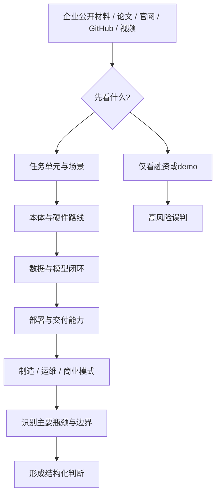

## 表 20-1 企业统一分析模板

见 [20-企业统一分析模板](D:/Projects/embodied-intelligence-report/docs/report/current/tables/20-企业统一分析模板.md)。

## 图表与表格补充

这一章末尾之所以需要专门收束为模板、流程图和版本对照样例，是因为它的目标并不是“介绍企业”，而是建立一把可重复使用的分析尺子。没有统一模板时，不同企业极容易被各自的材料口径牵着走；只有先把问题集固定下来，后续企业章节才有可能在相同维度下比较本体、数据、部署、交付和风险。

从版本维护角度看，这组补充材料同样是后续更新工作的关键支点。以后更新企业章节时，最重要的不是重写公司简介，而是沿着同一模板替换事实层、修正判断层，并保留跨版本可对照性。

在当前版本中，`图 20-1 企业分析流程图` 已承担“从外部信号进入可交付判断”的流程锚点职责；`表 20-1 企业统一分析模板` 则把“本体 / 模型 / 数据 / 部署 / 制造 / 商业模式 / 主要风险”等横向比较维度固定下来。

“同一企业多轮版本更新如何回写判断层”这一问题，本质上要求报告具备跨时间的结构化记忆能力。单靠正文叙述很难稳定维护，因此更适合通过 [20-企业季度跟踪表模板](D:/Projects/embodied-intelligence-report/docs/report/current/tables/20-企业季度跟踪表模板.md) 与企业长期跟踪卡来承载。正文负责输出阶段性判断，结构化资产负责记录新增信号、口径变化和判断回调依据，两者结合后，企业研究才不会退化成一次性的公司简介。

为了让这一章真正变成后续维护的工作台，而不是只作为阅读框架存在，建议后续企业更新统一依赖两张表：一张是 [20-企业统一分析模板](D:/Projects/embodied-intelligence-report/docs/report/current/tables/20-企业统一分析模板.md)，负责稳定横向比较维度；另一张是 [20-企业季度跟踪表模板](D:/Projects/embodied-intelligence-report/docs/report/current/tables/20-企业季度跟踪表模板.md)，负责记录季度新增信号与是否需要回调专题。这样做后，企业章节的更新路径就会从“重写公司简介”转变成“先补信号，再修判断”。

如果需要进一步降低后续维护成本，也可以直接优先使用脚本导出版：[20-企业统一分析模板-脚本生成版](D:/Projects/embodied-intelligence-report/docs/report/current/tables/20-企业统一分析模板-脚本生成版.md) 与 [20-企业季度跟踪表模板-脚本生成版](D:/Projects/embodied-intelligence-report/docs/report/current/tables/20-企业季度跟踪表模板-脚本生成版.md)。其底层字段源位于 `data/processed/`，便于后续先改结构化字段，再统一导出到正文表格。

作为首批可复用研究资产，后续企业章节还应优先复用以下长期跟踪卡，而不是每次重新从新闻和视频开始：

1. [Google DeepMind 长期跟踪卡](D:/Projects/embodied-intelligence-report/research/companies/Google-DeepMind-长期跟踪卡-v0.0.md)
2. [NVIDIA 长期跟踪卡](D:/Projects/embodied-intelligence-report/research/companies/NVIDIA-长期跟踪卡-v0.0.md)
3. [Figure 长期跟踪卡](D:/Projects/embodied-intelligence-report/research/companies/Figure-长期跟踪卡-v0.0.md)
4. [优必选 长期跟踪卡](D:/Projects/embodied-intelligence-report/research/companies/优必选-长期跟踪卡-v0.0.md)

对于高频变化信号，后续不应直接在长期卡或正文里堆新闻，而应优先记入季度更新日志。当前已建立的样板包括：

1. [企业季度更新日志模板](D:/Projects/embodied-intelligence-report/research/companies/企业季度更新日志-模板-v0.0.md)
2. [Google DeepMind 季度更新日志](D:/Projects/embodied-intelligence-report/research/companies/Google-DeepMind-季度更新日志-v0.0.md)
3. [NVIDIA 季度更新日志](D:/Projects/embodied-intelligence-report/research/companies/NVIDIA-季度更新日志-v0.0.md)
4. [Figure 季度更新日志](D:/Projects/embodied-intelligence-report/research/companies/Figure-季度更新日志-v0.0.md)
5. [优必选 季度更新日志](D:/Projects/embodied-intelligence-report/research/companies/优必选-季度更新日志-v0.0.md)
6. [Agility 季度更新日志](D:/Projects/embodied-intelligence-report/research/companies/Agility-季度更新日志-v0.0.md)
7. [Apptronik 季度更新日志](D:/Projects/embodied-intelligence-report/research/companies/Apptronik-季度更新日志-v0.0.md)
8. [智元 季度更新日志](D:/Projects/embodied-intelligence-report/research/companies/智元-季度更新日志-v0.0.md)
9. [宇树 季度更新日志](D:/Projects/embodied-intelligence-report/research/companies/宇树-季度更新日志-v0.0.md)

如果后续要把季度信号沉淀到统一结构化表中，则应同步更新 [20-企业季度跟踪表模板-脚本生成版](D:/Projects/embodied-intelligence-report/docs/report/current/tables/20-企业季度跟踪表模板-脚本生成版.md) 对应的底层 csv，而不是只在正文里补一句“本季度有变化”。

---

# 第二十一部分 海外重点企业专题

本部分不试图穷尽所有海外公司，而是选择那些最能代表不同路线分化的主体。分析重点不是企业“热度”，而是它们分别站在产业链的哪个位置：是平台型公司、数据与仿真基础设施公司、本体驱动公司，还是通用机器人操作与部署公司。为避免企业章节退化为新闻摘要，这里采用第二十部分给出的统一模板，只保留那些真正影响长期判断的变量：技术路线上究竟押注了什么、本体与模型如何耦合、数据与仿真基础设施是否形成闭环、产品形态是否开始接近真实交付。

海外企业最值得注意的不是“谁最像未来”，而是它们在五条关键链路上的不同取舍：本体、模型、数据、部署、平台。也正因为如此，海外专题与其说是在比较“谁更先进”，不如说是在比较不同押注组合各自如何试图闭环。

## 97. Google DeepMind

Google DeepMind 的核心价值，在于它长期推动了 RT 系列、PaLM-E 和通用 embodied multimodal 路线，使机器人 foundation model 获得了最强的学术叙事之一。[RT-1](https://arxiv.org/abs/2212.06817)、[RT-2](https://arxiv.org/abs/2307.15818)、[PaLM-E](https://arxiv.org/abs/2303.03378)

其 2025 年进一步公开 Gemini Robotics，也说明其研究方向正在从“为机器人提供更强通用多模态接口”进一步走向“把机器人直接作为模型能力边界的测试场”。这一变化值得持续跟踪，因为它意味着大模型公司对机器人问题的投入不再只是论文原型级别。[Gemini Robotics](https://deepmind.google/blog/gemini-robotics-brings-ai-into-the-physical-world/)

其优势在于模型、算法和研究深度；局限则在于距离大规模现实机器人交付仍有明显距离。它更像“定义问题与上限”的力量，而不是最先证明产品闭环的力量。若从第二十部分的企业框架看，DeepMind 最强的维度是模型路线定义权与研究影响力，最弱的维度则是本体制造与长期现场交付控制力。

### 97.1 DeepMind 路线的真正价值
若进一步拆解，DeepMind 路线的价值至少体现在三个层面。第一是问题设定层，它经常率先把原本分散的方向重新组织成统一问题，例如 generalist policy、跨本体数据组织与语言动作接口统一。第二是中间资产层，它推动的不只是单篇论文，还包括评测协议、数据接口和上游表征资产。第三是行业扩散层，许多后续团队即使不复现其系统，也仍然沿着其设定的接口语言继续推进。对长期跟踪者来说，这种“议程塑形能力”往往比一次分数领先更重要。
DeepMind 路线真正值得高看的地方，不只是它发布了若干有话题性的模型，而是它持续把“通用模型接口”与“物理系统接口”放在同一研究框架里处理。很多团队会做很强的机器人 demo，很多平台公司会做很强的多模态模型，但能长期把语言、视觉、动作、仿真、世界建模和评测协议一并组织起来的团队并不多。DeepMind 的价值，恰恰在于它反复尝试把这些层统一成可延展的问题设定。

这条路线的影响还不止于单篇论文。更重要的是，它持续塑造了行业讨论语言，例如 generalist policy、跨平台数据组织、多模态输入统一接口、视频/世界模型与机器人决策的关系等。也就是说，DeepMind 往往不只是“做了一个系统”，而是在帮助行业决定“应该如何定义系统”。

当然，这并不意味着它天然最接近大规模商业交付。相反，它更像上游接口与研究议程的塑形者。因此在本报告里，对 DeepMind 的判断重点不应落在短期客户案例数量，而应落在其是否继续定义未来几年最重要的公共问题与公共接口。
DeepMind 路线最值得高看的地方，并不只是论文数量或模型名声，而是它持续扮演了“上游接口定义者”的角色。无论是 RT 系列、PaLM-E、Gemini Robotics，还是更广义的多模态基础模型向物理世界延伸，其核心影响都在于提前定义了行业如何讨论“语言-视觉-动作接口”这一问题。很多后来者即便不直接沿用其模型，也仍在沿用它提出的接口语法与问题设定。

更进一步说，DeepMind 的真正价值在于它把机器人问题嵌回了大模型与多模态学习主线，使具身智能不再只是机器人子社区的封闭命题，而成为通用 AI 路线的一部分。这会显著改变人才流向、算力配置、评估口径和资本关注方向。对于整本报告而言，DeepMind 不是普通企业案例，而更像“行业叙事方向盘”。

更具体地说，DeepMind 路线的高价值体现在三个层面。第一，它持续把语言、多模态理解、规划与机器人动作接口放进同一研究叙事里，从而改变了社区提出问题的方式。第二，它反复证明“机器人问题不必只在低层控制层表述”，而可以借助高层语义接口重新组织技能学习、任务泛化与跨任务迁移。第三，它的论文与演示往往会迅速影响后续开源复现、企业宣传口径以及学术界对“下一代基础模型”边界的想象。

但也正因为如此，DeepMind 路线最容易被误读。它的强项是把研究前沿推到更高抽象层，而不是证明某条路线已经跨过了真实交付门槛。对于本报告的读者而言，更稳妥的看法是：把 DeepMind 当成“上限定义器”和“接口方向指示器”，而不要把它直接等同于现实产业成熟度的领先者。

DeepMind 的价值不在于它一定会直接成为最大的机器人交付者，而在于它经常率先定义下一代研究接口。也就是说，它更像问题设定者和路线放大器，而不是最先把某类机器人规模化铺开的公司。
这也意味着，对 DeepMind 的跟踪方法不应与对本体公司或系统集成公司的跟踪方法混为一谈。真正值得持续记录的，不是它是否马上拿出更完整的商业机器人产品，而是它有没有再次把任务接口、动作表示、跨模态推理或训练组织方式向前推一步。只要它持续扮演“问题设定者”和“接口方向指示器”的角色，它对行业的影响就可能长期大于其直接交付规模本身。

换句话说，DeepMind 这类主体更适合作为“研究主线观察窗”来跟踪，而不是作为“季度交付榜单”来跟踪。它告诉我们的首要信息，通常不是哪类客户已经买单，而是哪类接口正在被证明值得继续投入。对这份报告后续版本而言，这种公司更像上游风向标，而不是下游成熟度标尺。

### 97.2 跟踪 DeepMind 最该盯的不是“又发了模型”，而是接口是否继续下探

之所以要这样看，是因为 DeepMind 这类研究驱动公司真正影响行业的方式，往往不是“又多了一篇强论文”，而是它是否把原本只在研究层成立的能力继续压到更接近可执行接口的位置。若新工作只是增加更强的多模态理解或更漂亮的视频展示，它对机器人系统的实际改写可能有限；但若它开始回答动作表示、恢复机制、跨本体复用或端侧部署边界，那么其影响力就会显著提升。

因此，跟踪 DeepMind 的更好问题不是“这次模型分数有没有更高”，而是“接口有没有继续下探到执行层”。一旦下探发生，DeepMind 的角色就不再只是上游研究信号源，而更像是开始参与定义行业通用接口语言。这种变化对整条路线的意义，往往远大于单次模型发布。
对 DeepMind 这类主体，最容易犯的错误就是把每次新模型发布都当成同一类进展。实际上，更有信息量的问题是：这次变化到底停留在语义理解层，还是已经开始改写机器人的动作接口、数据组织方式与系统分层方式。若一个新模型只是让高层多模态理解更强，那它对机器人行业的含义与通用模型升级相近；若它改变了策略表示、动作 token 化方式、跨 embodiment 迁移方法或训练闭环结构，那它对具身主线的意义就要高得多。

因此，对 DeepMind 的长期跟踪不应只记录“模型名字”，而应固定记录几类字段：是否引入新的动作表示，是否改变了语言到动作的中间接口，是否公开了更可复用的数据/评测协议，是否显示出更强的跨任务或跨本体迁移证据，以及是否让机器人任务与更广义世界模型或 agent 框架发生了新耦合。只有把这些字段长期稳定下来，企业章节才不会被上游大模型新闻节奏牵着走。

这也说明，DeepMind 在本章中的价值并不只是“一个明星案例”。它更像是整个海外企业专题中的上游路由器: 一旦其接口语言发生实质变化，后续对 NVIDIA、Figure、Physical Intelligence 甚至部分开源项目的判断口径都可能需要联动调整。

## 98. NVIDIA

NVIDIA 在具身智能中的特殊地位，不仅来自 GR00T，也来自 Isaac、仿真、加速计算和整条平台基础设施。[GR00T N1](https://arxiv.org/abs/2503.14734)、[NVIDIA Isaac](https://developer.nvidia.com/isaac)

其最重要的产业角色并不是“做一个机器人公司”，而是试图成为机器人基础模型、仿真与部署生态的底座提供者。与其说 NVIDIA 在争“谁家机器人最强”，不如说它在争“未来多数机器人项目是否都会在它的算力、仿真和模型基础设施上生长”。这是一种平台型护城河逻辑，而不是单体产品逻辑。

### 98.1 为什么平台型公司要单独看
平台型公司还承担一个特殊角色：它们往往是行业默认入口最早发生变化的地方。新的仿真框架、训练接口、端侧 runtime、数据 schema 或芯片栈支持，一旦在平台层成熟，就会迅速外溢到多家下游团队。因此，跟踪平台公司时最值得记录的，未必是短期客户数，而是它到底重写了多少下游工作流的默认起点。
平台型公司之所以必须单独成类，是因为它们创造价值的方式与“卖一个机器人产品”的公司根本不同。它们往往并不直接占有终端场景，却通过仿真平台、训练基础设施、芯片栈、部署工具链、数据协议和生态接口，影响大量下游公司的研发节奏和技术选择。换句话说，平台型公司的真正产品，常常不是一个具体机器人，而是别人构建机器人的默认工作台。

这类公司的判断口径也因此必须改变。若仍用“单一场景成功率”或“本体销量”去评估平台公司，就会系统性低估其行业位置。更合适的问题是：它是否定义了事实标准接口，是否降低了开发者进入门槛，是否锁定了关键运行时栈，是否把训练、仿真和部署连成了统一链路。

也正因为如此，平台型公司的影响往往比表面收入结构更长尾。它们可能短期不拥有最炫目的终端演示，却能通过开发者生态和基础设施嵌入，在中长期反过来决定哪一类机器人路线更容易被放大。
平台型公司需要单独看，是因为它们未必直接拥有最多终端机器人，却可能通过芯片、云、仿真、训练框架、数据协议与部署栈，决定整个行业的技术接口和资源分配方式。NVIDIA、Google、微软、亚马逊这类公司影响行业的方式，往往不是“自己把某个单一场景先跑通”，而是降低大量参与者进入某条技术路线的门槛，同时抬高其他路线的切换成本。

因此，对平台型公司最重要的分析对象不是单一 demo，而是其接口控制力：它掌握了哪些开发者入口，定义了哪些数据/模型/部署标准，绑定了哪些硬件与仿真环境，以及是否把自己的生态优势转化成了事实标准。平台一旦成势，其影响往往比单个机器人整机公司的阶段性领先更持久。

这种差异意味着，平台公司最重要的指标往往不是某一代机器人是否最好，而是它是否控制了开发接口、仿真入口、训练栈、部署运行时和生态兼容层。若一个平台能够让越来越多团队在数据格式、训练流程、仿真环境、模型部署和算力采购上默认依赖它，那么它即使不是终端产品公司，也可能在价值链中占据更稳定的位置。

对研究者来说，单独看平台型公司还有一个原因：它们更容易通过工具链改变整个社区的研究方向。某个本体公司的 demo 可能只影响外界对单一路线的看法，而一个平台公司的 SDK、仿真器、数据协议或端侧推理栈一旦成为事实标准，就会反过来塑造哪些研究更容易被做、被复现、被部署。

平台型公司的胜负标准与本体公司不同。它们不必自己交付最多机器人，只要能成为大多数项目的默认基础设施，就可能建立更强长期护城河。因此，NVIDIA 这样的公司需要按“生态渗透率”而不是“单机产品能力”来评价。
换句话说，平台公司的关键不在于展示一台“最强机器人”，而在于让越来越多团队在仿真、训练、部署、数据组织和端侧推理上形成对其生态的路径依赖。只要默认接口、默认工具链和默认算力采购路径逐渐收敛到同一平台上，这种公司即使不拥有最强终端产品，也依然可能控制具身行业最稳定的一段价值链。

因此，后续跟踪 NVIDIA 这类公司时，更有信息量的信号通常不是单一模型分数，而是：新的 SDK 是否改变默认工作流、仿真平台是否更深进入企业训练闭环、端侧算力与 runtime 是否降低部署门槛、以及生态伙伴是否越来越难绕开其基础设施。只要这些信号持续增强，它的平台地位就可能比单个机器人产品成败更关键。

进一步说，平台型公司还会反向塑造“什么样的研究更容易被做出来”。若某个仿真器、数据接口或部署 runtime 被大规模采用，那么围绕它开展的任务定义、评测方式和系统结构就更容易变成事实主流。这意味着平台公司不只是服务既有路线，还会影响未来几年哪些路线更容易获得开发者注意力、融资支持和复现资源。对研究型报告而言，这种“议程放大能力”本身就应被计入平台护城河。

### 98.2 NVIDIA 的真正赌注是把训练、仿真与部署做成同一条价值链
若把 NVIDIA 仅看成“GPU 提供者”，就会低估其在具身智能中的战略位置。它真正尝试争夺的，不只是训练算力，而是把训练、仿真、合成数据、模型发布、端侧推理与开发者生态缝成同一条价值链。只要越来越多团队默认在 Isaac 系列环境中做仿真、在其加速栈上训练或部署、在其定义的数据与 runtime 约束下组织系统，那么 NVIDIA 就不仅在卖芯片，而是在卖整个具身行业的默认工作流。

这种默认工作流一旦成形，其护城河将主要体现为迁移成本而不是单点性能优势。团队在同一生态中完成资产格式、仿真管线、训练脚本、部署 runtime 和性能调优后，后续每增加一个机器人项目，都更可能沿原链路扩展，而不是彻底更换基础设施。对 NVIDIA 而言，这意味着具身智能的价值捕获方式未必只是“单次卖卡”，更可能是通过持续绑定开发范式来提高整个行业的路径依赖。

因此，评价 NVIDIA 在具身智能中的位置，不能只看其是否发布了最惊艳的机器人 demo，而应看它是否成功把更多研究团队、创业公司和工业客户嵌入其统一栈。若答案是肯定的，那么它在行业中扮演的更像“底层秩序提供者”；若答案是否定的，那么其影响力就仍主要停留在算力基础设施层。

这条赌注的高明之处在于，它能跨越单个机器人路线的成败。无论未来胜出的更多是人形、移动操作、仓储机器人还是工业具身系统，只要训练与部署基础设施仍建立在相似的开发范式和算力路径上，平台方就能持续收租。对研究型报告而言，这比比较某一代 GR00T 模型本身更重要。

但这条路线也并非无风险。平台一旦过度绑定特定仿真假设、特定数据接口或特定模型分层方式，就可能在行业范式变化时暴露路径依赖。也因此，跟踪 NVIDIA 的关键不是看它“有没有再发一套 SDK”，而是看这些 SDK 是否真的在重写行业默认流程，以及下游团队是否越来越难在不依赖其生态的情况下高效构建系统。

## 99. Figure、Physical Intelligence、Tesla、Boston Dynamics

Figure 代表的是“人形 + foundation model + 商业叙事”高度耦合的路径；Physical Intelligence 更强调“物理世界 intelligence”作为独立研究和产品对象；Tesla Optimus 的独特性在于其尝试复用自动驾驶、制造和大规模工程体系；Boston Dynamics 则更多代表高动态本体和长期工程系统积累。[Figure](https://www.figure.ai/)、[Physical Intelligence](https://www.physicalintelligence.company/)、[Boston Dynamics](https://bostondynamics.com/)、[Tesla AI](https://www.tesla.com/AI)

Figure Helix 特别值得单独关注，因为它比多数公司更明确地公开了“高层 VLM + 低层快速控制 + 本体机载推理”的系统结构，这使其不仅是企业新闻，也是一份具身系统分层实现样本。[Figure Helix](https://www.figure.ai/news/helix)

这四类主体最大的区别，并不在“谁更像通用智能”，而在于它们分别优先押注本体、模型、数据、工程还是平台。Figure 更强调把通用叙事尽快压到具体产品化路径上；Physical Intelligence 更像在争夺通用 physical foundation layer 的定义权；Tesla 的独特性在于它若成功，则可能把制造、供应链和自动驾驶数据工程能力外溢到机器人；Boston Dynamics 则提醒我们，长期稳定的动态本体工程本身就是稀缺壁垒，不应被大模型叙事轻易淹没。

### 99.1 这四类公司最该分别盯什么
这套分类的另一个价值，是能减少一种常见误判：把最会讲平台故事的公司误判成最接近交付的公司，或把最会做交付的公司误判成最有机会定义行业接口的公司。四类公司都可能重要，但重要的机制不同。只要这一前提保持清楚，后续企业更新就更容易保留分析精度，而不是被热度重新拉平。
如果把海外重点企业按研究平台、模型公司、本体公司和场景交付公司粗分，那么后续跟踪时最重要的是避免用同一把尺子乱量。研究平台型团队最该盯的是接口定义与公共工具链；模型公司最该盯的是数据闭环、训练范式和高层能力是否真正进入动作接口；本体公司最该盯的是制造、执行器、可靠性与系统协同；场景交付公司最该盯的是客户复制、运维能力与单位经济性。

一旦这四类公司的观察指标混在一起，结论就会迅速失真。例如，一个平台公司可能没有很多真实客户部署，但仍然极其重要；一个本体公司可能没有最强的模型叙事，但凭借可制造性和供应链控制依然拥有核心位置。把它们分开跟，恰恰是为了保留判断的物理意义。

因此，本节的真正作用不是简单分类，而是为后续持续跟踪建立“各看各的关键变量”的纪律。只有这样，后续企业专题才不会退化成热门名字的并排罗列。
这四类公司不能用同一把尺子看。基础模型/研究型公司最该盯的是接口定义权和语义能力是否真的下探到动作闭环；平台型公司最该盯的是生态绑定力与事实标准形成速度；整机/本体公司最该盯的是本体一致性、制造与维护能力；场景集成型公司最该盯的则是客户复制效率、运维负担与单位经济性。若不分组观察，很多横向比较都会天然失真。

对后续版本更新尤其重要的是，把“最该盯什么”转成稳定字段。也就是说，更新企业信息时，不是简单补新闻，而是优先补最能解释其长期位置的那几个变量。这样即便公司宣传口径变化很大，报告仍能保持判断连续性。

若进一步细化，这四类主体分别对应四种完全不同的风险结构。Figure 的关键风险在于是否会长期停留在高叙事强度的人形通用故事，而难以把模型能力压缩进稳定交付链路；Physical Intelligence 的关键风险在于“physical foundation layer”是否能被做成真正可复用的中间层，而不只是概念上很美的研究方向；Tesla 的关键风险则在于既有制造与自动驾驶优势是否真的能迁移到完全不同的接触任务、执行器体系和现场运维结构；Boston Dynamics 的风险则更多在于其深厚本体能力如何与新一代 foundation model 接口耦合，否则它可能继续强于身体、弱于通用高层语义。

因此，本节真正想强调的不是“谁更强”，而是看不同公司时必须盯住不同证据。若观察对象不同，所需要的验证材料也应不同：有的更该看模型接口，有的更该看交付现场，有的更该看制造链条，有的更该看本体与高层智能之间的重新耦合速度。

1. Figure：看其高层模型与真实交付是否持续靠近。
2. Physical Intelligence：看其是否能把“物理智能”从概念变成系统接口。
3. Tesla：看其制造和自动驾驶体系能否真的外溢到机器人闭环。
4. Boston Dynamics：看其高动态本体如何与更强的高层智能接口重新结合。

如果把这四类公司放在同一张研究图里，它们其实分别回答了不同问题：Figure 回答“人形叙事能否尽快压成系统产品”，Physical Intelligence 回答“physical foundation layer 能否成为独立中间层”，Tesla 回答“超大制造与数据组织能力能否迁移到机器人”，Boston Dynamics 回答“强身体是否能重新接上新一代高层智能”。理解这一点后，比较它们时就不该再用单一评分逻辑硬压平。

若继续往下拆，这四类公司最值得被长期记录的证据也完全不同。Figure 更应重点看：其分层系统是否继续明确、端侧约束是否被压缩、以及客户现场证据是否逐步替代公开视频。Physical Intelligence 更应重点看：其“通用物理智能层”到底是以模型、数据协议、训练框架还是系统接口的形式落地。Tesla 更应重点看：自动驾驶积累究竟迁移了哪些能力，是采数组织、端侧推理、制造节拍，还是仅停留在叙事层。Boston Dynamics 则应重点看：其强本体是否真的与 foundation model 式高层接口重构发生深层耦合，而不是继续维持“身体强、语义接口弱”的老结构。

把这组证据拆开有一个很重要的好处：它可以避免我们在后续版本里被同一套宣传口径误导。因为这些公司的真实竞争位置并不在同一个层级上，强行用“谁更像通用智能公司”去量它们，只会把企业专题重新拉回叙事比较，而不是结构比较。

### 99.2 海外明星公司最常见的误判是什么
这一组企业最常见的误判，是把“能代表未来想象力”直接等同于“最接近近期闭环”。Figure 和 Tesla 往往最容易承接这种误判，因为人形平台、制造叙事和大模型叙事一旦合流，外界会天然倾向于把其长期潜力提前写成中短期成熟度。相反，Boston Dynamics 这种更偏本体与工程积累的公司，又很容易因为没有那么强的 foundation model 传播声量而被低估其实际难度壁垒。Physical Intelligence 则恰好位于另一端: 它的风险在于“中间层定义权”很诱人，但真正把中间层做成系统接口比概念提出本身难得多。

更一般地说，海外明星公司的误判通常来自三种叙事混写。第一种是把“资本最爱讲的故事”误当成“工程最先能闭环的故事”；第二种是把“平台潜力”误当成“短期产品成熟度”；第三种是把“公开视频中的能力密度”误当成“现场连续运行的能力密度”。一旦把这三层拆开，很多原本看似非常清晰的公司排序都会重新变得复杂，而这种复杂性恰恰更接近真实行业状态。

因此，对这组公司的正确读法不是问“谁最强”，而是问“谁最可能在自己押注的那一段价值链上构成难替代位置”。有的公司在身体层构筑壁垒，有的在中间层接口构筑壁垒，有的在制造/供应链或大规模数据组织上构筑壁垒。只要把壁垒位置看清，很多表面上的热度差异就不再容易误导判断。

## 100. Agility、Apptronik、1X、Sanctuary 等

这些公司通常更能体现第二梯队路线分化：

1. Agility 更接近场景落地与物流操作叙事。
2. Apptronik 更强调人形平台工程成熟度。
3. 1X 更强调人机协作与服务场景探索。
4. Sanctuary 更强调通用操作与遥操作/共享自治结合。

它们分别可以对应到不同风险偏好：

1. Agility Robotics 更像“先找现实场景、再逐步扩展能力”的路线。[Agility Robotics](https://agilityrobotics.com/)
2. Apptronik 更强调通用本体平台与工程成熟度之间的平衡。[Apptronik](https://apptronik.com/)
3. 1X 更值得从人机共处、远程接入和家庭/服务路径角度观察。[1X](https://www.1x.tech/)
4. Sanctuary AI 则长期提醒行业：shared autonomy 与 teleoperation 不只是过渡工具，也可能是长期商业组织方式的重要组成部分。[Sanctuary AI](https://www.sanctuary.ai/)

### 100.1 第二梯队公司为什么很重要
第二梯队还有一个非常重要的研究价值：它们更像行业广义可行性的测试集。头部公司往往拥有额外算力、资本、品牌和工程兜底，很多能力可以被资源暂时覆盖；而第二梯队若仍能跑出成绩，往往说明这条路线在更一般条件下也具备可持续性。也因此，第二梯队常常比头部样本更适合用来观察行业真实分布。
第二梯队公司的重要性常常被低估，因为舆论更偏爱头部明星公司。但对研究型跟踪而言，第二梯队往往更能暴露行业真实分布。头部公司拥有更多资源、媒体聚光和工程兜底，而第二梯队更容易把约束直接暴露出来：它们在本体、算力、数据、场景、资本和运维上的取舍，更接近未来大量普通公司的现实。

同时，第二梯队公司也经常是路线分化最清楚的地方。头部公司容易讲“大而全”的平台故事，而第二梯队往往被迫更早明确自己押注什么，是轻量端侧、垂类场景、远程接管、低成本本体，还是某种差异化的数据采集方式。正因为资源没有那么充裕，它们反而更早显露出真正的优化函数。

所以，在本报告的长期维护里，第二梯队并不是“头部公司之外的补充材料”，而是观察产业真实约束和路线分岔的重要样本池。
第二梯队公司重要，不是因为它们一定会最终胜出，而是因为它们更容易暴露行业中真正可复制的中等强度路径。头部公司常常同时拥有资本、人才、算力与叙事优势，容易把“资源优势”与“方法优势”混在一起；第二梯队公司则更像压力测试样本，它们是否能在较弱资源条件下做出稳定交付，更能说明某条路线到底是不是普适。

此外，很多后来成为关键节点的企业，早期都处在所谓第二梯队。它们可能暂时没有最强声量，却在供应链、场景、成本控制或组织执行上积累了更务实的能力。对学习者和研究者而言，盯住这些公司，往往比只盯头部叙事更能看清行业真实演化。

第二梯队公司的价值，在于它们通常没有那么强的“概念光环”可以遮蔽问题，因此路线中的真实摩擦会更快显露出来。比如，某家公司是否真的能把人形平台推进到稳定场景、是否能把 shared autonomy 组织成可运营业务、是否能在客户现场建立维护网络，这些信息常常会先在第二梯队身上出现，而不是先在头部愿景公司那里清晰出现。
也正因为如此，第二梯队公司更像现实世界的“温度计”。它们往往更早暴露真实成本、部署阻力、客户接受边界和运维难度，因此对研究者而言信息含量反而更高。很多最终被行业证明可行或不可行的路径，最先并不是在最耀眼的头部叙事中被看清，而是在这些更贴近交付压力的公司身上被慢慢看清。

也正因为如此，第二梯队公司不应被看作“头部公司的低配版”。相反，它们更像现实约束的压力测试器。很多后来被证明有效的商业模式、交付路径和组织方式，往往正是在这些公司身上先以不那么耀眼、但更接近真实世界的方式出现。

从研究跟踪角度，它们常常比头部叙事公司更有信息量。因为它们更早暴露出真实约束：物流现场能不能接住、平台成本能不能压住、遥操作是否真的能持续作为业务组织方式存在。这些问题往往比头部公司的宏大叙事更接近产业真相。

也因此，这一组公司在后续版本中应被当作“现实信号放大器”长期保留。头部公司更容易定义愿景边界，第二梯队公司更容易定义现实边界；前者帮助我们看上限，后者帮助我们看摩擦。只有两者并读，海外企业章节才不会长期漂向单边乐观或单边悲观。

更进一步说，第二梯队公司的意义还在于它们更容易揭示“行业到底能否被中等资源条件复制”。如果某条路线只有在极高算力、极强资本和极大媒体势能下才看起来成立，那么它未必代表行业普遍可行；而如果第二梯队也开始在类似接口、类似部署模式或类似组织方式上取得进展，就说明该路线可能正在从明星样本走向可复制样本。对于研究型报告来说，这类信号往往比头部公司再多一个概念视频更有判断价值。

因此，海外章节在后续维护时，不应只把第二梯队公司当作补充名单，而应把它们视为检验行业真实扩散度的对照组。头部公司告诉我们“上限长什么样”，第二梯队公司告诉我们“上限是否开始向行业中位数外溢”；这两种信息缺一不可。

### 100.2 第二梯队最值得提供的是“可复制性证据”
第二梯队公司的最大价值，并不在于替头部公司“补名单”，而在于它们更容易给出可复制性证据。头部公司可能同时拥有算力、资本、媒体与顶尖人才带来的超额条件，因此其成功未必代表路线已普适；而第二梯队若在较少资源条件下仍能跑出稳定部署、形成共享自治组织方式、或把本体与场景压到更低成本结构中，就说明这条路线开始具备向行业更广泛扩散的潜力。

也正因如此，后续跟踪第二梯队时最有价值的问题不是“它是否也讲了同一个大故事”，而是“它是否在更普通的资源条件下证明了某段闭环可以被复现”。对研究型报告来说，这类信号的权重应当很高，因为它直接帮助我们判断一条路线是在停留于明星样本，还是开始外溢成行业样本。

本部分的结论是：海外公司并不存在单一主线。更现实的理解方式，是把它们看作围绕“本体、模型、数据、仿真、部署”五个支点作出的不同押注。对后续持续跟踪最重要的问题不是“谁现在更热”，而是：哪一类押注正在逐步形成闭环，哪一类押注仍主要停留在高估值叙事阶段。

为了避免企业比较退化成“故事强弱比较”，后续跟踪时更适合先把海外公司分成四类角色：问题定义者、平台底座构建者、本体工程推进者、交付组织探索者。DeepMind、Physical Intelligence 更接近前两类中的研究接口塑造者；NVIDIA 更接近平台底座构建者；Figure、Tesla、Boston Dynamics、Apptronik 更偏本体与系统工程推进者；Agility、1X、Sanctuary 等则更像在真实交付组织方式上做压力测试。不同角色的证据类型根本不同，若用同一把尺子比较，只会把平台渗透率误写成产品能力，或把热视频热度误写成交付成熟度。

因此，本章最关键的阅读纪律并不是“给每家公司一个总分”，而是先问其主要护城河候选究竟是什么。若公司核心价值在于定义接口与基础设施，那么最重要的证据是生态采用、开发者依赖和默认工作流渗透；若核心价值在于本体工程，那么最重要的证据是稳定运行小时数、接触任务边界、维护频率与成本下降速度；若核心价值在于交付，则应重点看客户场景、回退组织方式和复制节奏。只有把证据与角色绑定，企业专题才不会沦为“把不同物种装进同一个排行榜”的误导性比较。

## 图 21-1 海外企业五支点比较图

源文件：`assets/diagrams/21-海外企业五支点图.mmd`

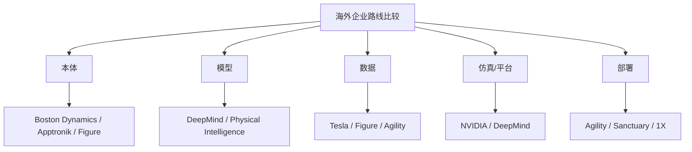

## 表 21-1 海外重点企业路线对照表

见 [21-海外重点企业路线对照表](D:/Projects/embodied-intelligence-report/docs/report/current/tables/21-海外重点企业路线对照表.md)。

## 图表与案例补充
如果把这一章作为后续季度更新的模板来使用，那么最重要的并不是不断增加公司名单，而是保证每次更新都沿着同一组字段记录变化：是否新增了自有本体、是否公开了更清晰的模型接口、是否展示了数据回流机制、是否披露了更接近真实客户现场的部署证据、是否暴露出新的工程短板。只有在这种统一框架下，企业专题才不会退化成新闻流摘要。

海外企业专题中的图表与案例，最重要的作用不是补材料丰富度，而是把平台公司、研究公司、本体公司和交付公司重新放回同一比较坐标中。否则，读者很容易把公司声量、论文影响力或视频热度误读为全链条能力领先。

因此，这里的表格、比较图和案例对照，都应服务于一个目标：让读者看清不同企业究竟在本体、模型、数据、仿真和部署五个支点上各自押注了什么，以及这些押注如何共同决定其中期上限与现实边界。

在当前版本中，`图 21-1 海外企业五支点比较图` 已承担统一比较坐标职责，`表 21-1 海外重点企业路线对照表` 则把 DeepMind、NVIDIA、Figure、Physical Intelligence、Tesla、Boston Dynamics、Agility、Apptronik、1X、Sanctuary 等公司的路线差异落成了可维护的横向对照表。

`Figure Helix` 与 `Agility Digit` 这类案例的价值，在于它们把两条不同企业路线并列摆到了同一坐标里：一条更强调通用人形与通用智能叙事的强耦合，另一条更强调先在清晰场景中建立部署能力，再逐步外扩任务边界。把这类差异直接写入企业长期跟踪卡与专题小节，比保留抽象占位更有价值，因为它能持续暴露路线分歧如何随着产品、客户和部署节奏变化而被重新验证。

为避免这一章未来继续退化成新闻流摘要，后续更新时建议先阅读并维护以下研究卡，再回写正文判断：

1. [Google DeepMind 长期跟踪卡](D:/Projects/embodied-intelligence-report/research/companies/Google-DeepMind-长期跟踪卡-v0.0.md)
2. [NVIDIA 长期跟踪卡](D:/Projects/embodied-intelligence-report/research/companies/NVIDIA-长期跟踪卡-v0.0.md)
3. [Figure 长期跟踪卡](D:/Projects/embodied-intelligence-report/research/companies/Figure-长期跟踪卡-v0.0.md)
4. [Agility 长期跟踪卡](D:/Projects/embodied-intelligence-report/research/companies/Agility-长期跟踪卡-v0.0.md)
5. [Apptronik 长期跟踪卡](D:/Projects/embodied-intelligence-report/research/companies/Apptronik-长期跟踪卡-v0.0.md)

---

# 第二十二部分 国内重点企业专题

国内具身智能企业生态与海外并不完全同构。其独特性主要来自三点：制造业与供应链基础更强，自动驾驶与工业机器人能力更容易外溢，地方产业政策和场景资源在企业成长中扮演更直接的角色。因此，分析国内公司时，不能只用海外基础模型叙事做镜像套用，还必须持续观察“工程交付能力是否真的转化为机器人能力”。

相比海外“模型公司 + 创业资本 + 平台叙事”更强的路径，国内公司往往更早被拉回本体工程、供应链、制造、成本和场景交付现实中。这不是说国内企业更保守，而是说它们更容易在更早阶段就面对“能不能造、能不能交、能不能维护”的问题。因此，评价国内企业时，一个常见误区是只看是否追上海外 narrative；更重要的问题其实是，它们是否把国内特有的制造与场景优势真正转化成具身系统能力。

## 101. 优必选、智元、宇树

优必选的重要性在于其长期人形与教育/工业机器人积累；智元代表新一代国内具身创业潮中较典型的人形与通用操作路线；宇树则展示了国内在高性价比四足和人形平台工程上的快速推进能力。[UBTECH](https://www.ubtrobot.com/)、[AgiBot](https://www.agibot.com/)、[Unitree](https://www.unitree.com/)

这三者最值得比较的，不是“谁更火”，而是它们在本体工程、量产路径、成本结构和场景切入上的差异。优必选更适合从“长期本体路线与产业合作深度”去看；智元更适合从“新创业公司如何搭建人形 + 通用操作叙事”去看；宇树则提醒我们，不应低估高性价比本体平台对行业扩散速度的影响。

进一步看，三者在平台定位上也并不相同：优必选更容易被放在“长期产业化机器人公司”语境中理解；智元更接近“新一代通用人形叙事”的代表；宇树则常常先以平台可得性和工程效率影响社区，再逐步外溢到更完整的具身系统叙事。

### 101.1 这三家最不该被用同一把尺子比较
优必选、智元、宇树之所以应该被放在同一节，不是因为它们本质相同，而是因为它们恰好展示了国内人形与平台路线的三种不同重心。优必选更接近“长期本体积累 + 产业合作沉淀”的样本；智元更像“创业期通用人形系统叙事如何快速搭架构”的样本；宇树则更像“高性价比本体平台如何先成为行业基础供给，再向更高层智能外溢”的样本。若不先承认这三种重心不同，比较结果就会天然失真。

因此，这一组公司更适合采用“角色比较”而不是“统一排名”。优必选要重点看其长期交付与产业协同是否真的沉淀成持续优势；智元要重点看其通用人形叙事能否逐步落到稳定系统能力；宇树则要重点看平台可得性是否真的转化为生态控制力。三家公司各自回答的是不同问题，若强行按同一条指标排序，结论往往只是在比较叙事密度，而不是比较能力结构。

因此，跟踪它们时最该盯的证据也不同。优必选更该看持续交付、产业合作深度与本体工程稳定性；智元更该看其是否把人形叙事不断压回数据、系统接口与真实场景证据；宇树更该看平台可得性是否继续扩大、成本工程是否继续领先，以及其平台是否开始承接更多高层智能路线。只有把证据类型与公司角色绑定，国内企业章节才不会退化成“谁最近更热”的比较。

### 101.2 宇树式平台可得性为什么值得高权重跟踪
国内语境里，一个容易被低估的变量是“本体平台可得性”本身。若某家公司能以较高性价比、更短交付周期和更广可获取性把平台本体扩散到研究机构、开发者、企业实验室和二次开发团队手中，那么它对行业的影响不只体现在自身产品销量上，还体现在它是否改变了整个生态做实验、做复现、做应用验证的门槛结构。宇树这类公司之所以值得高权重跟踪，正是因为它们可能以平台扩散而非单一场景闭环的方式改变行业底座。

平台可得性的真正价值，在于它会重塑谁有资格参与创新。若更多团队能更低成本拿到稳定本体并开展二次开发，那么算法验证、数据采集、工具链建设和应用试验的样本池都会被放大。长期看，这种“先扩大实验人口、再外溢能力路线”的影响，可能比少数头部公司独占高端样机更深远。也正因此，宇树式平台路线不应只按本体毛利或单次 demo 来判断，而应纳入“是否在改写行业创新门槛”的视角。

这类平台可得性会产生一个重要的二阶效应：更多团队拥有可用本体之后，数据、技能库、部署经验和二次开发工具也更容易围绕该平台堆积。久而久之，平台本身就不只是硬件，而会逐渐变成一个轻量生态入口。对长期版本维护来说，这一类信号的意义常常大于单次演示成功，因为它更接近行业扩散速度的变化。

## 102. 星动纪元、非夕、达闼、追觅及相关链条

这一组公司说明，国内具身生态不应只被理解成人形赛道：

1. 星动纪元更偏学术驱动的新型机器人路线。
2. 非夕长期代表柔顺控制与高端操作工程。
3. 达闼更强调云端机器人与网络化系统概念。
4. 追觅及家用链条则代表消费级服务机器人与家居设备能力外溢。

这一组之所以重要，是因为它们分别把不同产业能力外溢到具身系统：学术与实验平台、工业柔顺控制、云端系统工程和家用服务设备链条。也就是说，国内具身生态并不是“统一冲向人形”，而是多条既有能力链向机器人主体重新汇合。

### 102.1 工业路线为何值得高看一眼
工业路线还值得高看的一点，是它最容易留下可审计证据。客户工位、节拍要求、质量指标、维护频率和异常恢复方式，都比泛化愿景更容易被验证。这使它成为判断“公司是否真正拥有交付能力”的最佳观测窗口之一，也让相关企业更适合作为研究型报告中的硬样本。
工业路线之所以值得高看，不是因为它“保守”，而是因为它更早接受了系统交付的现实约束。与追逐通用叙事相比，工业路线往往更快把问题压回节拍、良率、维护、责任边界和客户 ROI 这些硬约束上。谁更早在这些约束下工作，谁就更早积累真实部署资产。

这条路线的另一个优势，是它更容易把具身能力嵌入既有自动化体系。工位、夹具、传送、质检和 MES/调度接口本身就是现成的工程外骨骼，能帮助机器人系统在技术尚不完美时仍然创造价值。也正因如此，工业路线经常不是最“像 AGI”的，但却可能是最早沉淀出交付能力的。

对国内公司而言，这一点尤其关键，因为制造场景密度高、成本工程压力大、客户更关心稳定运行而不是概念展示。工业路线能否持续跑通，很大程度上决定了国内具身公司是否能把技术势能转化成产业势能。
工业路线值得高看，不是因为它“更传统”，而是因为它更早面对真实交付约束。凡是能在工厂、仓储、巡检或固定工位场景持续运行的系统，通常都必须回答节拍、可靠性、维护、异常恢复和 ROI 这些硬问题。相比之下，很多更炫目的开放场景叙事反而可以较长时间停留在展示层。

因此，国内企业若能在工业路线中建立稳定案例，其意义常常超过一次更吸引眼球的通用演示。它说明公司不仅能做能力展示，还能把能力压缩进客户愿意长期付费的运营结构里。这一逻辑与中国制造环境的高密度场景条件也是一致的。
从研究视角看，这也意味着工业路线常常更能提前暴露“哪些能力是真正难交付的”，因为它比消费级愿景更早面对客户 KPI、连续运行与成本回收周期。
工业路线值得高看一眼，不是因为它最“性感”，而是因为它往往更早满足了真实交付的三个条件：任务定义相对清晰、客户付费意愿明确、部署后价值可度量。也正因为如此，很多真正有积累的能力，例如现场集成、维护闭环、工艺适配和节拍优化，都会先在工业体系里沉淀下来。
从长期研究判断看，工业路线的意义还不只是“先赚到钱”，而是它更容易把交付知识固化成可复用工程资产。哪些感知链路容易失效、哪些执行器寿命会压缩维护周期、哪些数据真正值得回流训练，这些信息往往都是在工业现场里首先沉淀清楚的。也就是说，工业路线首先提供的不是更漂亮的叙事，而是更早成形的交付方法论。

从长期看，非夕等强调柔顺控制、工业操作和系统集成的路线，可能比某些更热闹的人形 demo 更接近稳定商业价值。因为很多工业场景对“局部高可靠操作”的需求，早于对“通用 humanoid narrative”的需求。

这类路线对整本报告还有一个更深的提醒作用：不是所有高价值路线都会先以“通用具身”名义出现。很多真正可沉淀的能力，恰恰先以柔顺控制、局部自动化、工业操作可靠性和场景集成经验的形式出现。若只按最热的人形叙事来筛选信息，就很容易错过这些更接近现金流和交付方法论的长期资产。

如果把工业路线进一步拆解，它的高价值通常不在“是否最像通用智能”，而在于它更容易把能力压到五个可审计变量上：

1. 节拍是否达标。
2. 良率是否稳定。
3. 异常是否可恢复。
4. 维护是否可组织。
5. ROI 是否可计算。

这五个变量一旦被持续记录，工业路线就会天然比许多开放场景叙事更接近真实商业证据。也正因为如此，后续在比较国内企业时，谁能在工业体系中留下更清晰的连续运行与客户使用证据，谁就应被优先上修，而不应被“故事没有那么宏大”所低估。

### 102.2 消费电子与家用链条为何也值得跟踪
这条链路还有一个重要作用，是它会强迫行业直面用户体验问题，而不只是技术可行性问题。噪声、发热、维护、外观、升级方式、售后响应与交互负担，在消费级和家用场景里都无法长期依赖工程师兜底。谁能在这些维度上形成成熟方法，谁就可能对整个行业的产品化标准产生更强外溢影响。
消费电子与家用链条值得跟踪，并不是因为它们已经最适合具身系统大规模落地，而是因为它们对成本、体积、能耗、可靠性和量产节拍的要求，会反向塑造整个行业的系统工程标准。很多今天在研究里显得“可以接受”的复杂方案，一旦放入消费级或家用链条，就会立刻暴露出无法承受的 BOM、维护和安全问题。

因此，这条链路的价值往往更像压力测试。它迫使行业正视轻量化、低功耗、端侧推理、安静运行、交互安全与长期维护这些问题。即使家用场景短期仍难全面跑通，其对本体、小模型和产品工程的牵引力也会持续外溢到其他领域。

对国内企业尤其如此。因为消费电子制造、供应链协同和大规模产品化经验，本来就是中国企业的强项之一。一旦有公司真正把家用链条与具身系统打通，其影响就未必只体现在单一场景营收上，更可能体现在成本工程、轻量部署、售后体系和产品化节奏这几项长期决定行业扩张上限的能力上。
消费电子与家用链条值得跟踪，不是因为它们短期最容易落地，而是因为它们往往代表成本工程、供应链整合、产品化体验和量产节奏能力的另一条上限。很多机器人路线最终若想进入更大规模市场，就必须面对类似消费电子行业的问题：BOM 成本、可靠性、一致性、售后、外观、交互与快速迭代。

因此，即使家用或消费级机器人短期未必最先形成大规模闭环，相关链条上的公司仍值得持续观察。它们可能不会最先定义“最强具身模型”，却可能更早积累“如何把复杂系统做成大规模产品”的关键能力。

消费电子与家用链条值得跟踪，并不是因为它们会立刻产出成熟的家用具身系统，而是因为它们带来了另一类产业能力：低成本硬件设计、量产工程、用户体验迭代、售后网络、端侧算力组织和外观工业设计。这些能力未必直接等于机器人智能，但一旦行业进入更大规模消费化阶段，它们会迅速从“外围能力”变成“决定胜负的核心能力”。

从研究视角看，这也意味着不应只把家用链条理解为“离工业落地更远的想象空间”。相反，它提供了另一套完全不同的约束体系：成本更敏感、可靠性门槛更高、交互体验要求更细、售后容错空间更小。谁能更早理解这套约束，谁未来就更可能在服务机器人或消费级具身设备上建立真正差异化。
消费电子与家用链条值得跟踪，则是因为它们更容易把低成本硬件、量产工程、供应链控制和人机交互体验带回机器人系统设计。即使短期内家用具身机器人未必先大规模落地，这条链路积累的成本工程、交付标准和规模制造经验，仍可能强烈影响后续行业格局。

家用设备与消费硬件链条带来的，不只是低成本制造能力，还包括传感器集成、外观工程、售后体系和端侧算力组织经验。这些能力未必直接等于具身智能，但在未来走向消费级服务机器人时很可能重新变得关键。
因此，这条链路可以被理解为一种“延迟释放的产业能力”。在行业仍主要停留于工业和半工业场景时，这些能力看起来不像决定性变量；但一旦具身设备开始要求更高出货量、更低 BOM、更稳定用户体验和更成熟售后体系，消费电子式组织能力就会突然变得极其关键。对后续版本维护而言，这类企业不应只按当前机器人能力打分，还应按其未来规模化潜力单独观察。

换句话说，消费电子链条当前最值得关注的，并不是它是否马上拿出最强机器人，而是它是否开始积累那些将来最难补课的能力：低成本传感器堆叠、端侧算力压缩、用户体验调优、售后闭环和大批量品控。这些能力在今天看似“外围”，但在未来消费级具身阶段很可能变成真正的主战场。

从研究方法上看，这条链路还提供了一种与工业路线截然不同的压力测试。工业路线更强调“系统是否能稳定接住场景价值”，消费电子路线则更强调“系统是否能被压缩到用户愿意长期持有的产品形态”。前者优先暴露的是交付与维护难题，后者优先暴露的是成本、功耗、外观、噪声、可靠性和售后难题。两者共同存在，恰好帮助我们避免把具身行业误看成只有一种优化目标。

## 103. 国内企业分析的特别维度

### 103.1 政策与地方产业支持
因此，后续版本维护里更值得记录的不是“某地支持力度大”，而是支持是否已经转化成真实场景、真实订单、真实交付和真实数据回流。只有当这些转换发生，政策信息才真正进入企业竞争力层，而不只是停留在外部资源层。
国内企业分析里，政策与地方产业支持不能只写成背景。很多公司早期试点场景、示范订单、园区落地、人才引进和供应链配套，本来就与地方产业组织能力深度耦合。忽略这一层，就很难解释为什么某些企业明明技术相近，却在试点推进速度和资源协调能力上差别巨大。

但同样需要警惕把政策支持误写成竞争力本身。更准确的理解是：政策和地方支持决定的是起步加速度与协同成本，而不是最终产品质量。长期看，真正能留下来的公司仍然要把这些外部助力转化为自身的交付能力、制造能力和数据资产。
政策与地方产业支持在国内语境里不能只被理解为“利好消息”。真正有分析价值的是：政策到底增强了什么能力，是开放了场景、降低了试点摩擦、补贴了本体制造、引入了产业基金，还是推动了标准与认证。只有把政策拆成具体作用机制，才能判断它究竟在帮助行业修补哪一段短板。

对企业判断而言，地方支持若能转化为真实场景入口、产线资源、供应链协同或测试认证便利，含金量就较高；若主要停留在口号、园区挂牌或泛化投资叙事层，则应更谨慎解读。政策信号必须回到能力链条上阅读。

政策与地方产业支持之所以在国内企业分析中必须单列，是因为它们常常直接决定企业最早能够进入什么场景、获得什么测试资源、拿到怎样的试点订单以及形成多大规模的早期反馈闭环。很多路线看似是技术选择，实际上在很大程度上也是“哪里更容易先验证、先交付、先被看见”的结果。

因此，分析地方支持时不能只看补贴金额或口号密度，更应看它是否真的改变了场景开放程度、园区协同效率、试点准入机制和客户接入路径。对具身企业而言，地方政策若能把真实部署门槛显著降低，就会比单纯资金支持更具有长期意义。
对国内企业专题而言，这一项还常常决定企业最早在哪个城市、哪个园区、哪类示范场景中形成起步优势。

这会进一步影响企业后续拿到的客户类型、试点数据、媒体曝光和供应链协同资源，因此不应被视为纯外生背景。
国内企业分析中，政策与地方产业支持不能被视为背景噪声。园区、试点、补贴、示范项目、政府采购与地方产业基金，往往直接影响企业能否获得测试场地、客户入口、人才政策和早期订单。因此，这一维度不只是“政策环境”，而是现实增长条件的一部分。

地方政策、园区资源和示范项目在国内企业成长中的作用，通常比在海外更直接。

但也正因为这条维度权重更高，更需要避免把“资源可得性”误写成“能力已形成”。对国内企业更稳妥的做法，是把政策与地方支持拆成两步看：第一步看它是否降低了企业进入真实场景、测试资源和客户网络的摩擦；第二步看这些外部条件是否已经被企业转化为自己的交付、数据和版本迭代资产。只有第二步开始发生，地方支持才真正进入企业长期竞争力，而不只是阶段性加速器。

### 103.2 制造与交付能力
如果把具身系统理解成一种“重系统、重维护、重场景”的产品，那么制造与交付能力就不是外围支持，而是产品本身的一部分。能不能快速装配、稳定校准、现场升级、低成本换件、跨客户复制，这些都直接决定了模型能力能否真正转化为业务能力。

尤其在国内语境下，制造与交付能力往往决定企业究竟是在做“研究样机”还是在做“可复制产品”。前者可以容忍较高人工介入和个案调试，后者则必须尽量把装配公差、标定流程、版本发布、售后维护和客户培训标准化。很多外界看来像“非技术”的事情，实际上会反过来塑造技术路线本身：若现场维护极贵，系统就必须更强调远程诊断和模块化更换；若跨区域复制频繁，模型与控制策略就必须更重视参数稳健性和环境适配能力。
在国内专题里，制造与交付能力应当拥有比海外分析更高的权重。原因很直接：很多公司真正的分水岭，不在高层叙事，而在是否有能力把本体、零部件、现场部署、运维支持和客户定制组织成稳定流程。谁能更快从样机走向可重复交付，谁就更可能获得持续场景验证与数据回流。

这也是为什么国内企业常常不能只看模型或视频。很多看似不那么“前沿”的公司，反而可能因为制造节拍、售后响应、工程交付和成本控制做得更扎实，而更接近真实产业位置。对报告读者而言，这类信号往往比论文数量更能决定后续判断。
制造与交付能力是国内企业最容易形成差异化的位置之一。具身系统真正走向可规模化之前，必须把本体一致性、装配工艺、测试流程、备件与售后体系做出来。很多研究强、演示亮的团队，最终会在这一层遇到比模型更硬的约束。

因此，后续观察国内企业时，不能只看模型发布，还要持续看交付节奏、合作工厂、产线验证、售后机制与客户复制能力。谁能把这些能力先搭出来，谁就更可能在行业进入“比拼持续交付”阶段后占优。

制造与交付能力之所以在国内语境里格外关键，是因为很多公司真正的差异最终并不体现在“能不能训练出一个模型”，而体现在“能不能把一套系统做成可反复交付的产品”。原型机、展会 demo 与现场交付之间，差着良率控制、装配一致性、运维组织、备件体系、客户培训和版本管理等一整条难以快速跨越的链路。

因此，看国内企业时，交付能力不应被视为商业部门的后端问题，而应被视为系统工程成熟度的直接外显。谁能更早把交付流程标准化，谁就更有可能把技术路线转化为现实壁垒。
换句话说，这一项往往比“单次技术亮点”更接近长期商业竞争力。

很多国内公司之间真正的差异，最终也会体现在这条链上是否能持续缩短交付周期、压低维护成本并提高复制效率。
制造与交付能力在国内语境里尤其重要，因为很多企业的真实差异并不体现在是否能训练出一个模型，而体现在是否能把本体、零部件、供应链、现场实施和售后维护组织成可复制交付流程。

国内企业若能把原型推进到制造与交付，会比只停留在模型叙事更具现实价值。

这一点也意味着，国内公司更适合被持续追踪“交付组织是否在收敛”，而不是只追踪“是否又讲出更大的故事”。谁能把部署模板、现场维护接口、客户培训流程、备件和远程诊断体系逐步固定下来，谁就更可能真正把制造优势转成具身优势。

从长期项目视角看，这一条还有一个特别关键的判断意义：它能帮助我们区分“能做出原型”与“能做出组织能力”。很多团队都能在某个时间点做出漂亮样机，但真正难的是把样机背后的装配、校准、测试、运维和回退机制重复复制到更多客户现场。也正因如此，国内企业专题中“制造与交付能力”应被视作与模型路线同等级的重要维度，而不是商业附属说明。

### 103.3 自动驾驶 / 工业机器人能力外溢
因此，国内专题应持续追踪团队谱系，而不只是融资和产品名字。能力外溢常常比公开叙事更早决定路线边界：自动驾驶背景团队更可能优先搭建数据闭环和远程运维，工业机器人背景团队更可能优先做工艺、可靠性与客户交付。只要这一层被看清，很多公司后续动作就会更容易被解释。
自动驾驶和工业机器人能力向具身系统外溢，是国内路线里非常重要的一条线索。前者带来感知、数据闭环、仿真、远程接管和大规模工程协作经验，后者带来控制、执行器、系统集成和工厂场景理解。这两类能力都不是“通用机器人”口号本身，但都可能成为真正让具身系统跑起来的隐性资产。

也因此，观察国内公司时应格外注意它们到底继承了哪类外溢能力。来自自动驾驶的团队未必天然擅长本体，但可能更会组织数据与部署；来自工业机器人的团队未必最会讲模型故事，但可能更会做节拍、可靠性与客户交付。不同来源决定不同短板，也决定不同潜在优势。
自动驾驶与工业机器人能力外溢，是国内路线一个非常值得单列的变量。前者通常带来感知栈、数据闭环、仿真、软硬件系统工程和规模化采集经验；后者通常带来控制、执行器、工业场景理解与客户交付经验。两类外溢能力与具身智能结合后，往往会塑造出与纯学术出身团队不同的组织能力结构。

因此，判断国内企业时，应特别注意它究竟吸收了哪类外溢能力，以及这种能力是否真的被迁移到新系统中。很多企业路线差异，并不完全来自“是否用了某个模型”，而来自它站在什么工业遗产之上继续演化。

自动驾驶与工业机器人能力外溢的重要性，在于它们分别带来了两类对具身极其关键、但又不完全相同的积累。前者更擅长大规模数据工程、传感融合、仿真验证、软件栈组织和闭环迭代；后者更擅长执行器控制、工艺适配、客户现场部署和长期可靠运行。

国内很多公司的真实起点优势，恰恰不在“直接从零做具身”，而在于能否把这两类近邻产业的成熟方法迁移过来。也因此，分析企业路线时，比起追问它是否复刻了某篇海外论文，更值得追问的是：它到底把哪一类既有工程资产带进了机器人闭环。
因此，分析国内公司时，追溯其“前身能力栈”往往比单看当前宣传定位更有解释力。

它往往还能帮助解释为什么一些公司在数据、仿真、控制或交付某一侧会显得明显更强。
自动驾驶与工业机器人能力外溢是国内企业值得重点跟踪的一条线索。前者更容易外溢出数据闭环、感知融合、仿真和系统软件能力，后者更容易外溢出控制、场景工程、执行器与客户交付经验。很多国内公司真正的起点优势，恰恰来自这些相邻产业的迁移。

自动驾驶中的感知、规划、数据闭环能力，以及工业机器人中的控制、执行器和集成能力，都是国内具身创业的重要来源。

这条能力外溢线索在后续版本中也应被高权重保留，因为它常常比单次论文或单次 demo 更能解释一家公司为什么在某个维度突然进展很快。很多看似“机器人能力突变”的现象，背后其实是相邻产业积累开始显性释放。

这也意味着，分析国内企业时，团队谱系本身就是一类重要证据。若创始团队和核心工程团队主要来自自动驾驶，其优先级往往会自然落在数据闭环、仿真、端侧软件栈和远程运维；若主要来自工业机器人，则更可能优先把精力放在执行器、节拍、工艺适配和客户现场可靠性上。把这种“能力来源”显式写出，可以显著提高企业比较的解释力，而不是只看公司当下最新宣传口径。

### 103.4 供应链与成本工程
对国内路线来说，这一点尤其具有战略意义。因为一旦供应链控制与成本工程成熟，它不只会改善单台机器的经济性，还会反过来改变哪类本体更值得继续做、哪类任务更值得优先落地、哪类模型必须接受端侧与维护约束。也就是说，成本工程会塑造技术路线，而不是只被技术路线动接受限。
供应链与成本工程在国内专题里必须单独强调，因为中国企业很可能会在这里形成最具差异化的长期优势。具身系统最终要落到减速器、驱动器、传感器、结构件、灵巧手、算力模组、线束和装配工艺上，谁能更快把这些环节组织成熟，谁就更容易把“能做”推进到“做得起、交得出、修得动”。

从长期看，成本工程不是简单压价，而是系统简化、模块标准化、替代料管理和维护流程重构的综合结果。这种能力一旦形成，会反过来塑造模型接口、本体设计和场景选择，因此绝不是正文里可有可无的附属因素。
供应链与成本工程之所以重要，是因为在国内竞争语境下，“能做出来”和“能把成本压到客户可接受”常常不是同一件事。具身系统若无法处理减速器、执行器、传感器、控制器、结构件与测试工艺之间的成本-性能平衡，即使技术路线正确，也可能被高 BOM 和高维护成本卡住。

因此，本节需要持续把供应链能力视为技术能力的一部分，而不是商业附属物。谁更早建立可替代零部件体系、稳定交付节拍和成本下降曲线，谁的路线就更可能被验证为可扩展，而不只是概念上成立。

供应链与成本工程不是“后期放量后再考虑”的问题，而是许多路线从一开始就必须面对的生死约束。即使算法与本体原理上成立，只要关键零部件不可稳定获得、BOM 无法压缩、装配工时过高、维护件频繁更换，系统就很难进入大规模复制。

从长期竞争看，成本工程的价值不只在便宜，而在可持续迭代。谁能更早把零部件可得性、装配一致性、可维护性和替代料方案纳入设计闭环，谁就更有机会在价格竞争和部署扩张阶段保持韧性。
在国内专题中，这一维度还与区域制造基础、代工能力和上下游协同效率紧密相关。
供应链与成本工程之所以必须单列，是因为它往往决定了“看起来可行的机器人方案”能否跨过规模化门槛。谁能更早拿到稳定零部件、控制 BOM、减少维护件、提升装配一致性，谁就更有可能在后续价格竞争与场景复制中占优。

这也是国内企业最值得持续观察的优势变量之一。同样一条技术路线，如果能在供应链协同、本体替代件、执行器成本和现场维护成本上更快优化，就可能比单纯模型更早建立实际护城河。
换句话说，国内优势未必首先体现在论文能见度或叙事声量上，而更可能先体现在成本压缩速度、复制速度和交付组织效率上。对于很多具身公司来说，真正的差异化不是“有没有某个最先进模型”，而是能否把模型、本体、供应链与售后网络一起压进可复制交付流程里。这一点在后续企业比较中应被持续置于高权重位置。

因此，国内专题最值得形成的长期阅读习惯，是先看哪些企业正在更快地把“试点成功”转成“模板化交付”。这类变化往往不如新模型发布显眼，却更接近行业真正的结构拐点。

进一步说，供应链与成本工程之所以在国内专题里必须高权重保留，是因为它会反向塑造技术路线本身。某些模型之所以需要被压缩，不只是因为端侧算力有限，也因为散热、功耗和整机 BOM 无法承受；某些本体之所以会被重新设计，也不是因为概念变了，而是因为装配复杂度、维护频率和替代件可得性暴露了不可持续性。也就是说，成本工程不是技术路线的后处理，而是技术路线真实边界的组成部分。

### 103.5 需要警惕的误判
国内专题尤其需要警惕“把高密度试点误判成已完成规模化”的倾向。试点很多、园区很多、展示很多，并不自动等于形成了可复制的商业与工程闭环。只有当试点反复转化为标准化交付单元，外部热度才开始真正沉淀为产业能力。
国内具身公司最常见的误判之一，是把政策热度、融资热度或公开演示热度直接等同于交付成熟度。另一个常见误判，则是把“制造能力强”自动等同于“通用智能能力会自然补齐”。前者容易高估短期进展，后者容易低估高层模型、数据闭环和系统软件的重要性。

更稳妥的做法，是始终把国内公司放回同一问题集里看：本体做到什么程度、数据从哪里来、模型是否真正进入闭环、交付是否可复制、成本是否在下降、政策支持是否转化成了真实能力。只要这几项同时追问，误判概率就会显著下降。
国内企业研究最容易出现的误判之一，是把“试点多、合作多、政策热”直接等同于“长期护城河深”。试点可能是场景验证，也可能只是低门槛尝试；政策支持可能是能力增强，也可能只是短期热度；合作公告可能意味着真实交付，也可能只是品牌共振。若不把这些信号拆开，判断很容易系统性偏乐观。

另一个常见误判，是用海外平台型叙事的尺子去直接衡量国内公司，或反过来只用交付尺度否定所有上游模型探索。更稳妥的做法，是承认不同公司可能站在不同位置上竞争，再用各自最关键的变量去评估，而不是强行用同一叙事模板压平差异。

分析国内企业时，最需要警惕的误判之一，是把“叙事上更像海外公司”当成更先进的证据。国内路线的价值未必体现在叙事一致，而更可能体现在制造、场景、供应链、交付和成本工程上的不同组合方式。若只按海外话语体系打分，很容易看漏真正具有本土优势的路线。

另一类常见误判，则是把“会做本体”与“已经形成系统壁垒”混为一谈。能造出本体当然重要，但真正决定中长期竞争力的，往往是本体是否与数据闭环、交付组织、运维网络和场景复制能力一起形成系统性优势。只有把这些维度一起看，国内企业专题的判断才不会失焦。

分析国内公司时，最需要避免的有两种误判：

1. 只看是否“讲出了海外同款故事”，忽视其真实场景和制造路径。
2. 只看是否“能造本体”，忽视其高层数据闭环和系统智能化能力。

真正值得高看的公司，通常是能同时打通本体、场景、数据与交付链条，而不是在某一个维度上特别会宣传的公司。

再补充一个国内语境下尤其需要警惕的误判：把高密度试点、园区合作和大量“战略签约”直接等同于规模化前夜。对具身行业而言，试点很多时候只是进入问题空间，而不是已经完成商业闭环。真正值得上修的信号，通常应当是试点之后出现了重复采购、模板化部署、运维组织收敛和成本曲线改善。若这些没有出现，那么外部热度更适合作为资源条件增强来记录，而不应直接改写产业成熟度判断。

### 103.6 国内企业更值得建立“从资源到能力”的二段式判断
国内企业专题尤其适合采用一种二段式判断结构。第一段看资源层：地方政策、园区资源、试点资格、供应链协同、相邻产业能力外溢是否到位。第二段看能力层：这些资源是否已经被转化为可复制交付模板、数据回流机制、制造一致性与版本迭代速度。前一段决定企业能否更快起跑，后一段才决定企业能否长期领跑。

之所以需要这套二段式判断，是因为国内市场常常会同时出现“资源极强但产品未成形”和“资源一般但执行效率很高”的两类公司。若只看融资规模、政策支持和媒体声量，很容易高估前者；若只看单点交付案例，又可能低估后者的长期扩张能力。把资源层与能力层拆开，能够迫使分析者分别回答两个问题：企业是否具备放大机会的条件；企业是否已经把这些条件转化为真正的组织能力。

对阅读者而言，这也是一种防止叙事混淆的方法。因为很多公司对外传播时会自然把“拿到资源”表述为“已经形成能力”，而报告需要做的恰恰是把这两者重新拆开，判断中间是否存在真实的转化链路与时间滞后。

这种结构很重要，因为国内环境里“资源很强但能力尚未固化”的情况相对常见。若不把两段分开，报告就容易在资源高峰时过度乐观，在资源退潮时又过度悲观。更稳定的做法是始终追问：公司当前拿到的资源，到底在变成订单、变成数据、变成制造节拍，还是仍停留在展示与试点层。只要把这个问题问清楚，很多国内企业的真实位置就会更容易看见。

也因此，国内企业章节后续更新时最值得固定维护的一类字段，不是“又获得了哪些支持”，而是“这些支持到底沉淀成了什么内部能力”。这类写法会让企业专题更像研究型档案，而不是外部生态新闻汇总。

本部分的结论是：国内企业最值得关注的，不只是是否追上某条海外叙事，而是能否把供应链、制造、自动驾驶和工业机器人积累真正转化为具身系统的可交付能力。对未来跟踪而言，最该盯的不是“又发布了什么视频”，而是“哪些公司正在把场景部署、交付和维护网络建立起来”。

如果要用一句话概括国内路线的独特性，我更倾向于写成：它不是海外路线的低配镜像，而是更早被制造、交付、成本与场景现实强制校正的另一套优化问题。很多国内公司即使同样谈 foundation model、VLA、人形平台，其真正生存约束也往往来自零部件可得性、试点进入路径、客户付款逻辑、地方场景资源与售后组织能力。因此，对国内企业最重要的判断问题常常不是“有没有讲出全球最先进的故事”，而是“有没有把中国制造体系与场景体系中的优势转成可复用系统能力”。

进一步说，国内企业专题尤其适合长期观察“能力外溢链”。自动驾驶、工业自动化、消费电子、云端系统工程这几条上游能力链，未必会以同样速度流入具身系统，但它们一旦开始外溢，通常会直接改写某些公司的迭代速度。例如，有的公司会在数据闭环与仿真验证上突然变快，有的公司会在末端执行器、整机成本与批量交付上突然显露优势。后续维护时，应把这类“上游能力迁移是否显性化”作为和模型进展同权重的观测变量，否则容易把真正的结构优势误读成短期执行波动。

## 图表与案例补充
国内企业专题的图表和案例补充，不应只是“多列几家公司”，而应把地方政策、制造资源、供应链整合、场景入口和模型路线统一纳入同一张分析表。与海外公司相比，国内公司的差异经常不只体现在模型或本体设计上，更体现在它们能否借助已有产业带、工厂体系、服务网络和上下游客户关系快速形成试点闭环。

因此，这一章后续最值得持续维护的结构化补充，应包括两类内容。第一类是企业路线对照表，按“本体、场景、模型来源、制造资源、交付方式、主要风险”这些字段稳定记录。第二类是案例对照，重点比较“展示型样机”“试点型部署”“规模化交付”三种不同成熟度阶段，防止把同名的‘落地’混为一谈。这样处理后，国内企业专题才能真正服务于产业判断，而不是停留在公司罗列层。

国内企业专题的补充材料，重点不在于把公司名单继续拉长，而在于解释国内路线与海外路线的真实差异来自哪里。对这一章而言，最重要的问题不是“谁最像海外同类公司”，而是哪些能力来自自动驾驶、工业自动化、消费电子和制造体系的外溢，哪些能力已经开始沉淀为本土交付优势。

也因此，本章图表不应只服务于企业介绍，而应服务于“能力来源 - 路线选择 - 交付边界”的分析链条。只有把这些关系画清楚，后续版本在更新企业时才不会再次退化成新闻式公司快照。

## 图 22-1 国内能力外溢来源图

源文件：`assets/diagrams/22-国内能力外溢来源图.mmd`

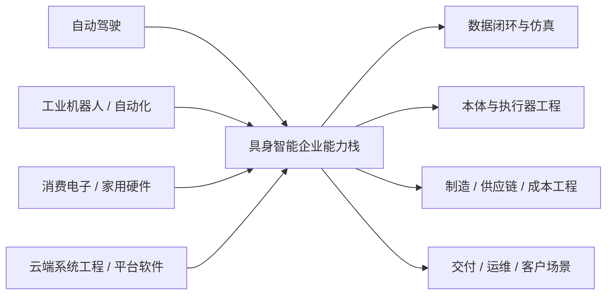

在当前版本中，`图 22-1 国内能力外溢来源图` 已承担“能力来源 - 路线选择 - 交付边界”的结构说明；`表 22-1 国内重点企业路线对照表` 则把优必选、智元、宇树、非夕、达闼、追觅等公司放入统一比较口径下，便于后续季度更新直接复用。

“从 demo 到交付”的阶段差异，不应停留在抽象判断层，而应落实到代表企业的长期跟踪中。因为只有把同一家公司在不同时点的产品发布、客户结构、部署节奏、制造一致性与回款模式放在一起观察，才能真正看清它是在向交付型公司演化，还是仍停留在叙事驱动的样机阶段。

目前这一章已经可以先配合 [22-国内重点企业路线对照表](D:/Projects/embodied-intelligence-report/docs/report/current/tables/22-国内重点企业路线对照表.md) 一起使用。正文负责解释为什么国内企业不能只按海外叙事镜像比较，表格则负责把“本体、场景、模型来源、制造、交付、风险”这些维度稳定下来，供后续季度更新直接复用。

## 表 22-1 国内重点企业路线对照表

见 [22-国内重点企业路线对照表](D:/Projects/embodied-intelligence-report/docs/report/current/tables/22-国内重点企业路线对照表.md)。

同样地，后续更新这部分时，建议优先从企业长期跟踪卡回看，而不是直接从外部新闻流起笔。当前可直接复用的国内资产包括 [优必选 长期跟踪卡](D:/Projects/embodied-intelligence-report/research/companies/优必选-长期跟踪卡-v0.0.md)、[智元 长期跟踪卡](D:/Projects/embodied-intelligence-report/research/companies/智元-长期跟踪卡-v0.0.md) 和 [宇树 长期跟踪卡](D:/Projects/embodied-intelligence-report/research/companies/宇树-长期跟踪卡-v0.0.md)。后续应继续按同一模板扩到非夕、达闼等公司。

---

# 第二十三部分 应用落地与商业化

技术路线能否成立，最终要回到场景。很多具身系统在实验室中都能展示能力，但只有少数能在特定场景中把能力、成本、稳定性和维护约束同时平衡出来。因此，本部分的重点不是重复场景分类，而是解释为什么某些场景更容易先跑通，以及商业化究竟被什么约束。这里最关键的判断标准不是“场景是否听起来足够宏大”，而是“场景是否允许局部结构化、是否能容忍有限失误、是否有足够高的价值密度去覆盖机器人系统成本”。

如果把应用落地问题抽象化，可以把单场景可行性理解为以下多因素函数：

\[
\text{Viability} \approx f(\text{task structure}, \text{error tolerance}, \text{labor value}, \text{integration cost}, \text{maintenance burden})
\]

这个表达式虽然不是严格商业模型，但足以说明一个现实：很多“技术上更炫”的场景，反而因为价值密度不足、误差容忍度太低或维护成本过高，而并不适合作为第一波商业化入口。

## 104. 制造业与仓储物流

这仍然是当前最现实的落地方向之一。原因不是技术最简单，而是流程更容易局部结构化、ROI 更可量化、任务价值密度更高、现场维护体系更容易建立。也正因为如此，许多看起来“不够通用”的系统，反而更可能率先在这里形成真实价值。真正先跑出来的，通常不是“会做所有事”的机器人，而是能稳定接管某一类高频、高价值、可重复但又尚未被完全自动化的任务单元。仓储、分拣、搬运与工位协作也是 Agility、Amazon 等案例反复出现的主线。[Agility Robotics](https://agilityrobotics.com/)、[Amazon Robotics](https://www.aboutamazon.com/news/operations/amazon-tests-digit-humanoid-robot)

### 104.1 为什么这类场景总是反复领先
这些场景反复领先，根本原因并不是技术在这里最简单，而是它们最早满足了“局部结构化 + 价值密度高 + 失败可管控 + ROI 可计算”这组商业化条件。制造、仓储、分拣与搬运任务虽然看似不够“终极”，但其输入边界、节拍要求、验收标准与人工替代成本往往都比家庭或开放服务场景更清晰，因此更适合把技术能力转化成稳定交付。

如果把场景落地能力抽象成一个粗略筛选式：

\[
\text{Deployability} \propto
\frac{\text{task repetition} \times \text{value density} \times \text{verifiability}}
{\text{integration burden} \times \text{failure cost}}
\]

那么制造与仓储往往不是分子绝对最大，而是分母更可控。它们允许企业通过工位改造、夹具设计、动线约束和人工兜底，把复杂开放问题压缩成可运营问题。这一点在现实里常常比单次模型精度提升更决定落地先后。

因此，本节最重要的不是把这些场景神化成“天然优质赛道”，而是把它们理解为最适合沉淀交付能力的训练场。很多企业真正建立的，不只是一个仓储或制造案例，而是一套“如何把具身系统变成客户可持续使用资产”的组织能力。
这些场景之所以反复领先，通常不是因为技术在这里最先进，而是因为它们同时满足几个现实条件：任务重复度高、收益指标清晰、环境可部分结构化、错误成本可管理、客户有明确 ROI 口径。也就是说，领先场景首先是“适合被交付”的场景，而不是“最能展示未来愿景”的场景。
这些场景之所以反复领先，并不是因为技术问题已经被解决，而是因为它们更容易把任务切成高频、局部结构化、价值可计量的单元。只要一个系统能稳定接管其中一个单元，就可能在局部流程中创造足够价值，而不必一开始就完成通用智能愿景。这使制造与仓储更像具身商业化的“局部突破市场”，而不是终局形态，却恰好最适合早期系统沉淀部署经验。

其根本原因并不是“机器人更容易做”，而是这里的任务边界、收益计算、部署环境与维护流程相对更可工程化。也就是说，这些场景先跑通，更像是约束条件更友好，而不是技术问题已经被根治。

### 104.2 典型任务单元的判断标准

任务单元判断之所以必须细到单元级，而不能停留在“行业/场景”级，是因为真正决定可商业化的往往不是整个行业是否需要机器人，而是某个具体工作片段是否足够结构化、是否容易度量收益、是否允许局部自动化先切入。仓储、制造、巡检、农业这些大类内部，往往同时包含适合早落地和暂不适合落地的子任务。

因此，评估时更应问的是：该任务的输入是否稳定、动作后果是否可验证、错误是否可控、接管是否容易、收益是否可量化。只有拆到这一层，商业化分析才真正具备工程可操作性，而不会停留在“看起来这个行业很大”的宏观判断。
判断一个任务单元是否适合先落地，核心要看五件事：输入是否相对可感知、动作后果是否相对可验证、失败代价是否可控、人工当前成本是否足够高、以及部署后是否能形成稳定重复。只要其中几项明显不成立，再强的技术演示也很难转化为商业闭环。反过来，哪怕系统并不通用，只要在这些条件上占优，就可能构成优先落地入口。

对制造与仓储场景，更有意义的不是泛泛说“机器人进工厂/仓库”，而是拆到任务单元层：搬运、上下料、分拣、包装、质检、巡检、工位协作分别需要什么感知、接触、时延与恢复能力。只有这样，商业化分析才不会停留在口号层。

如果把任务单元进一步抽象，一个具身任务要成为早期商业入口，通常至少满足：输入边界相对清晰、输出成功条件可被验证、失败不会立刻造成不可接受损失、以及人工当前确实昂贵或危险。这个判断法之所以重要，是因为它能帮助我们避免把“行业很大”误写成“任务适合先自动化”。

把这套判断再压缩成一个更工程化的筛选式，可以写成：

\[
\text{TaskScore} =
w_1 \cdot \text{observability}
+ w_2 \cdot \text{repeatability}
+ w_3 \cdot \text{value density}
- w_4 \cdot \text{failure cost}
- w_5 \cdot \text{integration burden}
\]

这当然不是为了制造一个可以机械打分的商业公式，而是提醒我们：一个任务单元之所以适合作为具身切入口，几乎从来都不是因为“模型已经足够强”这一条，而是因为观测、恢复、验收、付费和集成五个维度形成了相对有利的组合。很多演示看起来能做的任务，最后死在高失败代价和高集成摩擦；很多看起来不够性感的任务，则因为重复度高、收益明确而率先变成现实业务。

从部署角度，还应把任务单元继续拆成最小闭环问题：

1. 任务输入是否可感知。
2. 目标状态是否可验证。
3. 失败后是否存在低成本恢复路径。
4. 接入现有流程是否需要大规模改造。
5. 客户是否已经为该环节持续付钱。

只有拆到这一层，本章才会真正成为商业判断工具，而不是对几个大行业的宏观赞美。

## 105. 家庭、消费级服务与医疗康复

家庭和消费场景最接近“通用具身终局”，但短期最难规模化；医疗和康复则价值明确，但监管、责任和验证门槛极高。这两类场景都值得长期关注，但不应轻易被视为短期爆发主线。家庭场景最难的不是单个任务，而是开放度极高、语义模糊、对象多样、且任何失误都直接面向终端用户；医疗场景则最难在于即便技术能力不错，也必须先通过责任、流程和合规边界。

### 105.1 这两类场景为什么常被高估

家庭与医疗康复场景常被高估，一个根本原因在于它们天然承载了太多“终局想象”。家庭直接连接大众日常生活，医疗康复则直接连接高价值、高需求和社会善意，因此外界很容易把它们想象成具身系统最值得优先攻克的方向。

但从落地顺序看，这恰恰是最容易被叙事强度误导的地方。家庭场景的开放性、对象多样性和交互不确定性极高；医疗康复则在责任、伦理、监管和可验证性上门槛极高。它们当然重要，但重要不等于短期最适合率先形成大规模可复制交付。
被高估的根源，在于这两类场景太适合承载“终极想象”。家庭场景直接连接大众生活，医疗康复直接连接高价值需求，因此它们天然具有极强叙事吸引力。但从部署视角看，它们恰恰在开放性、责任界面、异常代价和个体差异上最棘手。也就是说，它们离“最值得做”很近，却离“最先做成”往往很远。

因为它们最容易承载“未来生活方式改变”的叙事想象，但最难满足部署所需的可验证性和责任可分配性。换言之，叙事强度与短期可落地性在这里往往反向相关。

这并不意味着这两类场景不重要，而是意味着阅读相关新闻时必须刻意切换口径。对家庭场景，应优先问系统是否在开放环境、儿童或宠物干扰、物体多样性和长期维护上给出证据；对医疗康复场景，则应优先问责任、流程嵌入、验证协议和人工接管边界。只要这些证据还薄弱，就不应把其直接写成短期主线。

更细一点说，家庭与医疗康复反复被高估，通常都伴随着三种叙事放大器：

1. 对普通人可见，因此 demo 的传播效率极高。
2. 与“通用智能终局”想象高度重叠，因此容易承载过高预期。
3. 用户价值直觉强，因此外界容易忽略异常代价、责任链和维护负担。

但恰恰因为这三点，分析时更需要反向冷处理。家庭场景最难的不是让机器人完成某个单次家务动作，而是让它在开放环境、复杂家庭成员互动、物体长尾分布和长期售后条件下稳定存在。医疗康复最难的也不是辅助动作能否做出，而是临床流程、认证责任、设备维护和人工接管边界能否共同接住系统风险。

因此，本章对这两类场景采用“长期高价值、短期慢兑现”的判断口径。未来若出现声称在家庭或医疗康复场景取得突破的新系统，最值得优先核查的也不是演示视频质量，而是其责任边界是否清楚、恢复机制是否完备、以及是否已经出现足够长周期的真实使用证据。

## 106. 农业、建筑、巡检与危险环境

这些场景的共同点，是环境复杂、人工成本高或危险性强，因此即使系统能力不完美，只要显著降低风险或节省成本，就可能具备商业价值。它们也经常更能容纳 shared autonomy 与远程接管路线。也就是说，这些场景对“完全自律”的执念反而更弱，对“显著降低风险”的要求更强。

### 106.1 为什么“半自主”在这些场景里更现实
“半自主”更现实，并不是因为企业不想做全自主，而是因为很多高价值场景都同时要求安全、责任可控、客户可接受和逐步上线。人在回路、远程接管、任务阶段确认和异常时人工决策，往往能显著降低部署门槛，使系统更早产生商业价值。

从商业化角度看，半自主不是退而求其次，而经常是从 0 到 1 的最优组织方式。
半自主更现实，不是因为它是退而求其次，而是因为它更符合价值生成结构。在高风险、低频、复杂环境里，系统不一定要 100% 自主才能创造价值；只要它能稳定接管最危险、最耗时、最重复或最脏累的那部分工作，就已经可能显著改善效率与安全。因此，把 shared autonomy 看成产品形态而不是过渡形态，往往更接近这些行业的真实采用逻辑。

因为这些场景很多时候不要求机器人在所有条件下独立完成全部流程，只要求它在高风险、高重复或高耗时片段上稳定创造价值。于是，shared autonomy、远程接管和人机协同就不再是“过渡方案”，而可能是商业最优方案。

对商业化判断而言，这一点很关键，因为它会直接改变我们看待“自主率”的方式。若一个系统把最贵、最危险或最耗时的 30% 工作稳定接管下来，它可能已经比一个理论上能做更多、但始终不稳的全自主系统更有商业价值。也就是说，商业最优解未必等于自主度最高解。

从系统组织方式看，半自主路线通常可以拆成三层责任分配：

1. 机器负责高频、重复、危险或高体力负担片段。
2. 人类负责模糊决策、异常确认和责任兜底。
3. 运维系统负责监控、任务切换、远程接入和故障恢复。

它的价值不在于“先将就着做一半”，而在于重新分配最稀缺的人类注意力。只要系统能稳定接管最危险、最脏累或最耗时的局部工作，客户就已经可能愿意为之付费。

这类系统的最小调度逻辑甚至可以非常朴素：

```python
while mission_active:
    state = robot.observe()
    if policy.confident(state):
        robot.execute(policy.act(state))
    else:
        handoff = remote_operator.resolve(state)
        robot.execute(handoff.action)
    logger.record(state, outcome)
```

真正决定商业成立与否的，不是这段逻辑是否优雅，而是 `policy.confident` 的阈值如何设定、远程接管时延是否可控、单个操作员能覆盖多少台设备、异常恢复成本能否持续下降。也正因如此，shared autonomy 在许多高风险场景里应被视为正式产品形态，而不是必须尽快淘汰的权宜之计。

## 107. 商业模式

### 107.1 硬件销售
硬件销售模式最容易被误读的一点，在于它表面上卖的是一台机器，实质上卖的是一整套可持续使用能力。只要系统仍然需要频繁校准、复杂维护、远程支持和异常兜底，那么“卖出去一台设备”背后就已经隐含了持续的服务责任。这意味着很多公司以为自己在走轻资产硬件路线，实际上却已经被运维和版本管理重新拖回系统公司逻辑。

因此，判断硬件销售是否成立，不能只看客户是否愿意为本体付费，更要看设备交付后的真实组织负担。若客户必须长期依赖原厂工程师驻场、每次升级都显著影响稳定性、或关键零部件替换成本过高，那么所谓硬件销售很可能只是把后续服务成本隐藏到了合同之外。真正成熟的硬件销售，往往意味着设备、维护和升级边界已经足够清晰，以至于客户可以把它视为一类“可管理资产”，而不是“持续求助的实验系统”。
硬件销售看起来路径最直接，但对具身系统来说，客户实际购买的从来不只是本体，而是围绕本体的一整套可持续使用能力。只要系统还需要频繁校准、复杂维护、版本兼容处理、远程支持和异常兜底，那么“卖一台机器”背后就已经隐含了大量后续服务责任。因此，硬件销售模式真正难的往往不是第一次卖出去，而是卖出去之后能否稳定支撑客户持续使用。

这也是为什么很多具身公司即使起点是卖本体，后续也往往不得不补上软件更新、运维合同、场景适配或数据回流能力。因为在这个行业里，硬件本身通常很难单独构成完整价值闭环。

硬件销售模式最容易被理解，也最容易被高估。它看起来像一条清晰的收入路径，但前提是企业不仅能造出本体，还能持续保障可靠性、维护便利性、备件供应、软件升级和客户培训。若这些后端能力不足，单纯卖硬件往往只会把复杂性推迟，而不会真正消失。

因此，对具身企业而言，硬件销售更像是一种“组织能力充分成熟后才更稳”的模式。若企业尚未建立稳定交付和运维闭环，过早把商业模式压在一次性售卖上，反而可能放大售后压力与客户失望。
硬件销售模式最直接，但也最容易被高估。它看起来简单清晰，实际上却要求企业在本体稳定性、成本结构、交付能力和售后服务上都足够成熟。若没有持续软件更新、维护网络与场景适配能力支撑，单纯卖硬件往往很难形成长期壁垒。
单纯硬件销售的优势，在于路径清晰、客户采购习惯成熟、收入确认直接；弱点则在于毛利和后续持续收益往往受限，而且容易把公司锁定在一次性交付逻辑里。对于具身公司来说，如果没有持续软件升级、维护服务或平台接口能力配套，硬件销售很难单独承载长期高估值逻辑。

适合本体平台型公司，但往往毛利和持续收入结构受限。

更进一步说，硬件销售模式真正考验的，不只是“能否把第一批货卖出去”，而是企业是否已经把售后复杂度前置消化。若每卖出一台机器，背后都隐含大量手工校准、远程支持、现场回访和兼容性修复，那么表面上的一次性收入很可能只是把问题推迟到财务确认之后。因此，研究型报告在看硬件销售时，不应只盯 ASP 或出货量，更应看安装周期、备件消耗、维护频次与版本兼容成本。

这也解释了为什么很多具身公司最终很难停留在“纯卖硬件”。只要系统智能还在快速演化，客户购买的就不可能只是一个静态物件，而更像是一套不断被维护、升级和约束的能力包。也就是说，硬件销售模式在具身行业里天然带有“服务尾巴”，区别只在于这条尾巴是被公司主动设计出来，还是被现实被动拖出来。

### 107.2 解决方案集成
解决方案集成模式之所以在具身领域反复出现，是因为它最适合吸收早期技术的不稳定性。与其要求机器人直接成为标准化产品，不如先把本体、工位改造、感知布局、夹具设计、软件接口和人工兜底一起打包成可交付方案。这样做虽然牺牲了部分标准化程度，却更容易在高价值客户现场率先形成闭环。

但解决方案集成的风险也很明显：它容易把企业推入项目制泥潭。若每拿下一个客户都要重做大量定制开发、重新调夹具、重写接口和重建异常处理流程，那么收入虽然可以增长，能力却不一定真正沉淀。判断这一模式是否健康，关键要看公司是否在每轮项目交付中不断提炼出可复用模块、可复制流程和更稳定的任务模板，而不是只靠项目堆人。
解决方案集成模式的核心优势，在于它允许企业通过工位改造、夹具设计、流程重构、异常回退和人工协同，把“不够通用”的技术能力转化为“足够可交付”的场景能力。也正因为如此，很多没有最强模型叙事的公司，反而更早跑出真实收入，因为它们先学会了如何把局部能力嵌入客户流程。

但这一路线能否走远，取决于项目经验是否持续沉淀为公共模块。若每一个客户项目都要重新定义接口、重新改造现场、重新制定恢复机制，企业就会被困在工程外包形态里，很难形成规模杠杆。

解决方案集成之所以在具身行业里格外常见，是因为它允许企业绕开“先做出通用平台”这一高门槛，直接围绕具体客户、具体流程和具体任务边界提供可交付能力。对很多早期团队来说，这比直接卖通用机器人或押注远期平台化更现实。

但这条路线的风险也很明确：若项目经验始终停留在一次性集成，无法抽象成复用模块和标准接口，公司就可能长期停留在工程项目制，而难以真正进入平台化或规模化产品阶段。因此，判断这条路线时，关键不只是看它能不能交付，而是看交付经验是否正在被沉淀成可复用资产。
解决方案集成模式的本质，是不单卖机器人，而是卖“让某类任务在客户现场跑起来”的完整能力包。它通常包括本体、软件、场景改造、流程接入、运维服务与性能承诺。对很多具身公司而言，这反而是比纯硬件销售更现实的早期商业路径。
解决方案集成往往是早期最现实的商业化路径，因为它允许企业围绕特定客户、特定工艺和特定任务边界做强约束交付。缺点则是扩张速度受限，项目化特征强，容易在不同客户之间重复消耗工程资源。能否把集成经验逐步沉淀为可复用模块，往往决定企业是停留在工程公司，还是有机会进化为平台型公司。

对早期企业更现实，因为它允许围绕特定场景做强约束交付。

解决方案集成路线还有一个经常被低估的价值：它是把隐性场景知识重新编码进系统接口的最快方式。客户现场的夹具位置、物料来向、人工协作节拍、异常重试规则、维护窗口和责任边界，本来都很难直接写进论文；但在解决方案集成过程中，这些知识会被强制翻译成脚本、配置、 SOP、回退逻辑与部署模板。谁更快完成这种翻译，谁就更快拥有把能力压缩成可交付产品的方法论。

因此，评价解决方案公司时，不能只看项目数量，还应看其是否把项目经验沉淀成以下几类公共资产：

1. 可复用工位模板。
2. 统一异常处理流程。
3. 可复用部署检查清单。
4. 跨客户可迁移的数据字段与日志 schema。

如果把解决方案集成路线压缩成一个更工程化的判定问题，可以写成：

\[
\text{Integration leverage} = \frac{\text{可复用模块数}}{\text{新增客户定制工作量}}
\]

这个写法当然是启发式的，但它抓住了集成路线最关键的现实分水岭：每新增一个客户，企业究竟是在重复从零做项目，还是在复用越来越多的既有资产。前者说明公司仍停留在工程公司形态，后者才意味着它开始把项目知识沉淀成平台能力。

因此，解决方案集成最值得跟踪的，不只是合同数量，而是项目之间的相似性是否在提高、部署 checklist 是否在收敛、异常处理 SOP 是否在模板化。只要这些迹象开始出现，这条路线的商业质量就会与“纯项目制外包”逐步拉开。
5. 可标准化报价与 SLA 结构。

若这些资产持续增加，那么项目制公司就可能逐步向平台化公司演化；若没有，则即使收入存在，也容易长期陷在高人力密度的工程外包结构中。

### 107.3 RaaS
RaaS 最值得被认真看待的地方，不是它听起来“更先进”，而是它把客户侧的不确定性转移到了提供方资产负债表里。客户按月或按任务付费，确实降低了前期 `CAPEX` 门槛；但相应地，设备利用率、停机率、备件周转、远程诊断和 `SLA` 违约风险就不再是运营细节，而是直接进入单位经济性。这意味着 `RaaS` 不是一句商业包装，而是一种对系统稳定性要求更高的组织承诺。

因此，评估 `RaaS` 时最该看的不是销售话术，而是服务文化是否成熟。公司是否已经能明确承诺在线率、恢复时间、升级窗口和责任边界？是否具备足够强的日志回放、远程维护和故障分级能力？若答案是否定的，那么 `RaaS` 往往只是把“卖设备很难”改写成“自己背运维压力”，而不一定真的创造了更优商业结构。
RaaS 的核心吸引力在于把客户购买逻辑从一次性采购转成持续服务付费，从而降低前期资本支出门槛，并让供应商保留升级、运维与数据回流接口。但这也意味着系统稳定性风险并没有消失，而是被重新分配给了提供方。谁承诺可用率，谁就必须承担更高的远程监控、维护响应、备件管理和版本回滚责任。

从单位经济性看，RaaS 是否成立，至少要同时满足：

\[
\text{Monthly revenue} >
\text{depreciation} + \text{maintenance} + \text{remote ops} + \text{failure recovery} + \text{customer success}
\]

很多公司会把 RaaS 说成更“轻”的商业模式，但它实际上要求企业更重地掌握现场运营。若没有足够高的设备在线率、足够低的故障恢复成本以及足够标准化的场景复制能力，RaaS 反而会把财务压力和服务压力前置到企业自己身上。

因此，判断 RaaS 时不能只看客户是否愿意订阅，更要看提供方是否已经具备服务化组织能力。真正成熟的 RaaS 公司，卖的不是一台机器人，而是“在约定 SLA 下持续交付某项任务能力”的能力包。这与单纯硬件销售在组织能力上几乎是两种公司。
RaaS（Robot-as-a-Service）之所以有吸引力，是因为它把客户的一次性资本支出转化为持续运营支出，也让机器人供应商有机会把维护、升级和数据回流留在自己手里。但它也意味着企业必须长期承担设备可用率、维护成本和服务能力压力，因此并不是简单把销售合同换成订阅合同。
RaaS 的吸引力在客户侧，但风险在提供方侧。客户更容易接受按服务付费、降低前期 CAPEX 的方案；而提供方则必须承担更高的运行稳定性压力、维护成本和服务水平承诺。换句话说，RaaS 不是“更轻”的模式，而是把系统不稳定性的代价更多内化到企业自身。只有当公司对运维、远程监控、异常回收和版本管理足够有把握时，RaaS 才可能真正成立。

机器人即服务的吸引力在于降低客户前期门槛，但前提是企业自己能承担运维和稳定性压力。RaaS 看起来是更轻的客户购买路径，实际上却把稳定性和维护复杂度压回到了提供方身上。

RaaS 路线最容易被忽视的一点，是它把“技术风险”直接转成了“资产负债表风险”。一旦客户按月付费，设备利用率、维修停机、现场回访与备件周转就不再只是运营细节，而会直接进入单位经济性。也正因为如此，RaaS 的难点常常不是客户愿不愿意听这个故事，而是公司是否已经足够了解自己系统的故障分布、维护节奏和远程诊断能力。

从研究型判断角度看，最值得问的并不是“RaaS 听起来是否先进”，而是这家公司是否已经拥有可度量的 SLA 文化。能否明确承诺在线率、恢复时间、升级窗口和责任边界，往往比商业包装本身更能说明 RaaS 是否真的成立。缺少这些条件时，RaaS 很容易只是把销售困难改写成服务压力，而不是创造更优商业结构。

### 107.4 数据服务与平台模式
平台模式的真正价值，不在于抽象地“做中间层”，而在于是否掌握了能力演进接口。谁能让别人更低成本采数据、做训练、做评测、做部署，谁就可能在价值链上获得比单一整机更持久的杠杆。这也是为什么具身行业里，采数平台、仿真平台、训练栈、评测工具和端侧 `runtime` 都可能成为独立商业节点。

不过，平台模式只有在接口逐步稳定时才成立。若不同本体、动作空间、控制频率和部署约束差异过大，所谓“通用平台”很容易停留在概念层。因此，更现实的路径通常不是一开始就覆盖所有机器人，而是先在少数高密度主线上成为事实标准，再向外扩展。换言之，平台不是靠抽象程度高建立壁垒，而是靠在关键环节里先变成别人离不开的默认工作流建立壁垒。
数据服务与平台模式的吸引力，在于它有机会成为整个行业的中间层基础设施。谁掌握示教采集、仿真合成、训练调度、评测审计、端侧部署和日志回放这些能力，谁就可能比单一硬件供应商拥有更强的长期杠杆。对不准备直接卖整机的团队而言，“让别人更快训练、验证和部署具身系统”本身就可能是一条足够厚的商业路径。

不过，这条路成立的前提是接口逐步稳定。当前行业仍高度碎片化，不同本体、动作空间和部署约束差异很大，因此所谓“通用平台”很容易沦为空泛口号。更现实的路线通常是先在若干高密度场景中成为事实标准，再向更大范围扩张。
数据服务与平台模式的核心，不在于“把数据卖出去”，而在于企业是否建立起某种可复用的数据与开发基础设施，例如示教采集平台、仿真生成平台、评测平台、技能商店或模型训练服务。若成立，它的壁垒往往比单一硬件 SKU 更耐久，因为它会持续吸收生态参与者的数据和工作流。
这一路径之所以值得关注，是因为具身产业并不一定只会由卖机器人整机的公司主导。谁掌握数据协议、仿真基础设施、训练平台、评测工具链和端侧部署栈，谁也可能成为行业价值链上的关键节点。平台型公司未必直接拥有最多机器人，但可能拥有最多“让机器人持续进化的基础设施”。

随着 foundation model 和仿真生态发展，数据、训练与部署基础设施本身也可能成为商业模式。Open X-Embodiment、Isaac 平台以及各类数据引擎路线都说明，未来不只有“卖机器人”一条路。[Open X-Embodiment](https://arxiv.org/abs/2310.08864)、[NVIDIA Isaac](https://developer.nvidia.com/isaac)

这一路线尤其值得长期跟踪，因为它可能把行业价值中心从“谁卖出更多机器人”部分转向“谁掌握更多能力演进接口”。在这种格局里，掌握数据协议、训练流水线、评测平台和端侧部署栈的公司，即便并不直接拥有最多终端设备，也可能占据更高杠杆的位置。

但平台模式并不等于抽象的云服务口号。对具身行业来说，真正有价值的平台通常至少会在以下一层形成不可轻易替代的黏性：

1. 采数平台：让示教、遥操作、失败回放与质量审计更低成本。
2. 训练平台：让多机器人、多任务、多模态训练更可复现。
3. 评测平台：让 benchmark、回放、红队测试和版本比对更标准化。
4. 部署平台：让边缘推理、监控、回滚和远程诊断更可运营。

若一个所谓“平台”不能显著降低这些环节的摩擦，它就很难在具身行业中形成真正护城河。反过来，只要它在其中任意一层形成事实标准，就可能比某一代具体整机产品拥有更长尾的战略位置。

平台模式真正值得高看的地方，在于它一旦成立，常常会比单一 SKU 更能跨越技术代际变化。今天是某类 VLA、明天可能是另一类动作生成模型，但如果数据协议、回放工具、评测流水线和部署 runtime 仍掌握在同一批平台型主体手里，那么行业价值中心就会自然向中间层聚集。也就是说，平台模式的本质不是“更抽象”，而是“更贴近能力演进接口”。

不过，这也意味着平台路线必须比看起来更克制。它不应试图一开始就覆盖所有机器人类型、所有动作空间和所有客户流程，而应先在高密度主线中变成事实标准。对具身行业来说，真正能跑出来的平台，通常不是“理论上最通用”的平台，而是“在一段价值链上最先被大家默认离不开”的平台。

### 107.5 一个更实用的商业化判断顺序
这套判断顺序的关键，不是先问“技术是否足够酷”，而是先问“价值闭环是否已经存在”。一条更稳健的分析顺序通常是：先识别任务单元，再看谁在付费、人工当前成本有多高、部署和维护会不会吃掉价值、最后才问这条路线有没有平台延展空间。这样做可以避免很多典型误判，例如先被宏大平台叙事说服，最后才发现局部任务根本没有稳定付费意愿。

从研究型报告角度看，这一顺序还有一个重要作用：它把技术可行性重新翻译成组织可运营性。哪怕系统已经能完成任务，只要异常恢复需要高强度人工值守、版本升级频繁破坏旧场景稳定性、或停机损失足以吞掉全部收益，它就很难成为可扩张商业模式。也正因此，本章更应把商业化理解为“能力、流程、责任和经济性四者共同闭环”，而不是单看功能演示是否成立。
更进一步说，这个顺序本质上是在把“技术可行性”重新翻译成“组织可运营性”。一个机器人方案即使在技术上能完成任务，只要异常恢复需要高强度人工值守、部署前校准成本过高、系统升级会频繁破坏旧场景稳定性，它就仍然很难形成可扩张商业模式。因此，商业化分析不能停在功能完成，而要继续追问单位经济性、交付摩擦和运维可复制性。
这个判断顺序的价值，在于它先压住了“平台幻想”，先问清是否存在真实价值闭环，再讨论能否外溢到更大平台空间。很多具身叙事最容易倒过来思考：先谈终极通用平台，再补想局部场景怎么赚钱。现实通常正好相反，先跑通高价值任务单元，才有机会谈平台延展。

对任何具身公司，更实用的判断顺序通常是：

1. 它解决了哪个明确任务单元。
2. 这个任务单元的人工替代价值是否足够高。
3. 部署与维护成本是否会吃掉大部分价值。
4. 是否存在可重复扩张到相邻场景的路径。
5. 最终是形成产品、解决方案，还是平台。

这个顺序的好处在于，它先判断“有没有价值闭环”，再讨论“有没有平台上限”。

本部分的结论是：具身智能的商业化不会沿单一路径爆发，而更可能是“若干高约束场景先落地、若干平台生态逐步成形、少数通用路线长期拉升上限”的并行演化。判断商业化最有效的问题也许不是“这家公司是不是在做通用智能”，而是“它究竟在哪个任务单元上已经建立起稳定价值”。

在商业化讨论里，还应刻意区分三种经常被混写在一起的“成功”：技术演示成功、客户试点成功、单位经济性成功。技术演示成功说明系统在受控条件下可完成任务；客户试点成功说明系统在特定现场可被流程接纳；单位经济性成功则要求系统在部署、维护、人工接管、折旧与升级成本全部计入后仍然成立。很多行业叙事止步于前两层，却被包装成第三层。后续阅读企业案例时，应始终追问它究竟处在哪一层，否则商业化判断会系统性偏乐观。

shared autonomy 也应在本章被明确视为正式产品形态，而不是只能短暂停留的“过渡方案”。在许多高风险、低频、异常代价高的场景里，客户真正购买的并不是“完全无人”，而是“把最脏、最累、最危险、最不稳定的一部分工作稳定转移给机器，同时保留人在关键节点上的否决权”。若这类组织方式已经能稳定产生价值，它就应被认真计入商业模式，而不应因为自主率不够高就被从商业化视野中剔除。

如果把这一顺序继续写成更可执行的审查表，后续无论看哪家公司或哪类场景，都可以先问：

```text
1. 任务单元是什么？
2. 谁在为该单元付钱？
3. 当前人工方案的真实成本是多少？
4. 机器人方案的部署、维护、接管和停机成本是多少？
5. 客户是否愿意把该环节长期纳入运营流程？
6. 这个单元能否复制到相邻客户或相邻流程？
```

只有当这六个问题都有相对清晰答案时，商业化叙事才值得上修。否则，即使技术演示已经很强，也更适合被归类为“高潜力路线”，而不应直接写成“即将大规模落地”的结论。

## 图 23-1 商业化筛选流程图

源文件：`assets/diagrams/23-商业化筛选流程图.mmd`

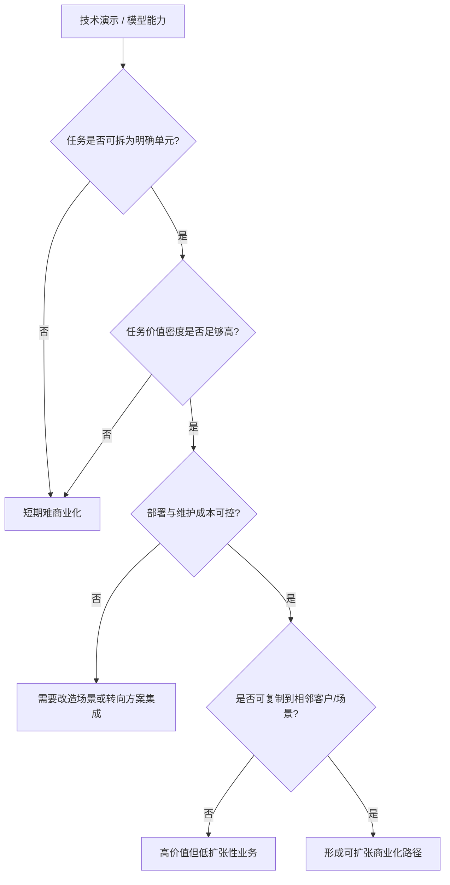

## 表 23-1 典型场景任务单元对照表

见 [23-典型场景任务单元对照表](D:/Projects/embodied-intelligence-report/docs/report/current/tables/23-典型场景任务单元对照表.md)。

## 图表与案例补充
本章的图表与案例补充，最重要的不是把场景列得更多，而是把“任务单元 - 约束条件 - 自动化边界 - 商业模式适配”之间的关系固定下来。这样后续新增场景时，就可以直接判断它究竟更接近制造、物流、家庭服务还是高风险环境，而不是每次重新发明一套分类语言。

在长期版本维护中，这一章尤其适合沉淀三类案例。第一类是“先在狭窄场景成功，再逐步扩边界”的正例；第二类是“演示很强但单位经济性始终不闭合”的反例；第三类是“通过人在回路或远程接管先形成业务，再逐步提高自主度”的过渡型案例。只有三类案例并列，商业化章节才不会被单边叙事带偏。

应用落地章节中的图表补充，核心目标是把“商业化判断”从泛泛叙事变成结构化筛选。对具身智能而言，真正决定一个场景能否先跑通的，往往不是展示是否震撼，而是任务结构化程度、误差后果、维护负担和价值密度是否同时满足部署条件。

因此，本章图表不应只是总结性的可视化，而应服务于一个更实用的问题：面对一个新场景时，研究者或分析者应怎样快速判断它更接近“值得进入的商业入口”，还是“更适合作为长期研发目标”。这也是后续版本继续增补行业案例时最值得复用的分析骨架。

在当前版本中，`图 23-1 商业化筛选流程图` 已承担“从能力演示到可复制部署”的主流程表达；`表 23-1 典型场景任务单元对照表` 则把制造、仓储、巡检、农业、家庭、医疗等场景的误差容忍度、维护难度、监管强度与 ROI 可见性放入统一比较口径。

“值不值得先做”的问题，最终需要被转译成半结构化的 ROI 判断，而不是只停留在定性描述上。[23-场景ROI粗估模板](D:/Projects/embodied-intelligence-report/docs/report/current/tables/23-场景ROI粗估模板.md) 的作用，正是在“人工成本替代、部署改造成本、维护负担、责任风险和复制难度”之间建立统一口径，使场景优先级讨论具备跨版本可更新性。

后续如果要把这一章真正用作季度判断工具，建议同时配合 [23-典型场景任务单元对照表](D:/Projects/embodied-intelligence-report/docs/report/current/tables/23-典型场景任务单元对照表.md) 和 [23-场景ROI粗估模板](D:/Projects/embodied-intelligence-report/docs/report/current/tables/23-场景ROI粗估模板.md) 使用。前者负责拆任务单元，后者负责把“值不值得先做”写成统一粗估口径。

若后续更偏向结构化维护，则可以优先使用 [23-场景ROI粗估模板-脚本生成版](D:/Projects/embodied-intelligence-report/docs/report/current/tables/23-场景ROI粗估模板-脚本生成版.md)。这样场景字段可以先在 `data/processed/场景ROI粗估模板-v0.0.csv` 中修改，再统一导出，避免正文表格和底层字段长期分叉。

---

# 第二十四部分 产业格局、资本与政策

具身智能已不再只是学术问题，它同时是资本叙事、制造业升级叙事、AI 基础设施竞争叙事和国家产业政策叙事的一部分。因此，要理解当前行业温度，就必须把技术判断放回更大的产业格局中看。

这一章的难点在于，产业层面的信号天然比单篇论文更噪声化。融资新闻、演示视频、政策口号、产业园规划与平台发布会往往同时出现，但它们的含义并不相同。相对稳健的做法，是优先关注三类较硬的信号：第一，产业统计与行业报告；第二，平台级基础设施投入；第三，标准、监管与可部署场景的制度变化。国际机器人联合会 IFR 持续发布工业机器人与服务机器人统计，NVIDIA、Google 等平台公司持续把基础模型叙事推向实体系统；中国也在“人工智能+”“智能制造”“机器人+”等政策语境下推动场景开放与产业投资。[IFR World Robotics](https://ifr.org/worldrobotics/)、[NVIDIA Isaac/GR00T](https://developer.nvidia.com/isaac/gr00t)、[工业和信息化部](https://www.miit.gov.cn/)

更进一步说，产业判断最怕两种极端：一种是把所有热度都看成泡沫，从而忽视基础设施正在真实堆积；另一种是把所有热度都看成趋势，从而忽视工程现实的长期滞后。报告后续的产业分析，应始终在这两种极端之间保持张力。

## 108. 全球竞争格局

### 108.1 北美
北美路线的真正优势，不只是拥有几家明星机器人公司，而是更容易把基础模型、芯片平台、云基础设施、顶级实验室与风险资本组织成同一叙事飞轮。这使得很多高不确定性方向可以更早获得大规模试错机会，也使“平台级接口”“通用机器人基础模型”“物理世界 foundation model”这类命题更容易被迅速资本化和生态化。[NVIDIA Isaac GR00T](https://developer.nvidia.com/isaac/gr00t)

但北美优势并不天然等于最快形成大规模交付。它的强项更集中在上游接口定义、基础模型叙事、开发者生态和高端研究资源聚集，而不是所有下游场景都同步领先。换句话说，北美更擅长先决定“行业讨论什么问题、用什么接口描述问题”，至于大规模低成本部署是否能同步跟上，仍受制造、场景与运维现实约束。

因此在本报告里，更好的理解方式是把北美视作“定义接口与聚合资源的高地”。它对全球路线的影响，往往首先体现在模型 API、数据协议、开发框架与资本注意力上，而不是立刻体现在每一个具体行业都已跑出最成熟商业闭环。
北美的特点通常在于上游模型、云基础设施、资本网络和高端研发生态较强，因此更容易率先形成“通用模型 + 机器人平台 + 资本叙事”联动。它的优势并不自动等于最快规模交付，但会显著影响行业叙事、人才流向和上游技术接口标准。
北美优势的核心并不只是“有很多明星公司”，而是它更容易把模型、算力、资本和研究共同体放进同一增长飞轮。基础模型公司、芯片平台、云厂商、顶尖实验室和高风险资本之间的耦合，使很多高不确定性方向在较早阶段就获得大规模试错机会。这种生态更适合孕育平台型叙事和前沿接口实验，但其弱点也在于容易把远期统一想象提前资本化，从而阶段性高估短期可交付能力。

北美优势主要在基础模型、顶级研究机构、平台公司和高风险资本。其竞争力并不只来自单个机器人公司，而来自“模型公司 - 芯片平台 - 云基础设施 - 研究机构 - 创业资本”之间的耦合。这意味着北美路线更容易率先推动高层 foundation model 与实体部署接口的实验。

### 108.2 中国
中国路线的独特性，则更多体现在制造链密度、真实场景丰富度、成本工程压力、系统集成速度与地方产业组织能力上。这意味着很多技术路线会更早被拉回“能否交付、能否降本、能否形成 ROI”这几个硬约束上检验，而不是长期停留在高层叙事竞争。[工业和信息化部](https://www.miit.gov.cn/)

中国并不只是“把海外路线本地化复制”，更可能在系统工程与场景落地层形成自己的优化函数。大规模制造、自动驾驶外溢能力、工业自动化基础、较快的产品迭代节奏，以及对部署效率的持续压力，使很多公司天然更重视本体成本、供应链可得性、节拍、维护和客户现场改造。这些因素会反过来塑造模型接口、数据采集方式和任务选择策略。

因此，把中国优势理解为“真机验证和工程闭环的加速器”比单纯理解为“市场大”更准确。它未必在每一轮基础模型叙事上都最先发声，但很可能更早逼迫路线回答成本、可靠性、节拍和交付问题。这种结构性压力，本身就是技术演化的一部分。
中国的特点则更体现在制造链、场景多样性、成本工程、地方产业推动和大规模交付组织能力上。对具身行业而言，这意味着中国企业在把机器人系统推向更低成本、更快迭代和更多真实场景方面，可能拥有不同于北美的优势结构。
中国路线的独特之处，则在于它更容易把“能否交付”提前压回技术判断中心。大规模制造、密集工业场景、自动驾驶能力外溢、较强供应链组织能力和地方政策牵引，使很多问题会更早暴露在成本、可靠性、节拍和维护这几个硬约束下。因此，中国语境中的具身智能判断，往往天然更强调系统集成、部署节奏和 ROI，而不是单次模型发布所能带来的想象空间。

中国优势主要在制造、供应链、工业场景、自动驾驶能力外溢和政策牵引。与北美相比，中国在“真机场景密度、系统集成速度、成本工程与量产约束”上往往更具现实牵引力，尤其适合把具身智能放回工业自动化、物流、巡检与服务机器人链条中理解。

### 108.3 欧洲、日本、韩国
这些区域在本报告里最值得被看到的，不只是它们有没有最响亮的人形叙事，而是它们如何以精密制造、工业自动化、零部件工程和可靠性文化持续影响具身产业底盘。很多决定行业真实节奏的能力，并不来自最热闹的平台叙事，而来自高质量执行器、控制器、制造工艺、认证体系和工业客户协同。

因此，把这些地区仅仅理解成“在大模型叙事中声量较弱”是不够的。更准确的理解是：它们常常代表另一条产业逻辑，即当一个地区不一定主导最大的软件平台时，仍可能通过部件、制造、标准与系统工程在产业链中占据关键位置。
欧洲、日本、韩国在机器人产业中的位置，往往更适合从精密制造、零部件、工业自动化、标准体系和长期工程积累角度理解。它们未必总在具身智能叙事最热的位置，但在执行器、传感器、制造体系和高可靠工程文化上常具有深厚基础。
这些区域的价值，常常被“大模型叙事声量”所遮蔽。事实上，它们在精密制造、工业自动化、零部件工程、可靠性控制和本体设计上的深厚积累，决定了其仍然是具身产业不可忽视的能力极。即便它们不一定率先定义最热的 foundation model 叙事，也可能在执行器、减速器、工艺自动化、质量体系和特定垂类系统集成上持续提供决定性样板。

这些地区在工业自动化、精密制造和部分本体工程方面仍有深厚积累，但在 foundation model 主叙事上通常声量较弱。需要注意的是，“声量较弱”并不等于“能力较弱”，而可能意味着它们更倾向于以工业产品、系统集成和垂直场景能力呈现。

### 108.4 区域比较框架

区域比较框架最怕落入“谁新闻更多谁更强”的误区。对具身智能而言，更有效的比较方式应当沿模型、数据、场景、制造与交付五条链路展开，因为不同地区往往不是在同一条链路上同时领先，而是在不同位置形成互补或错位优势。

也就是说，区域比较不应被理解成单轴排名，而应被理解成异构价值链控制力的比较。有些地区可能在模型和算力生态上强势，有些地区则在工业场景、供应链密度或系统集成经验上更深。若忽略这种错位结构，就会错误地把“媒体最热的地区”当成“全链条最强的地区”，进而低估后来者通过特定环节切入并建立优势的可能性。

对本报告后续跟踪而言，更实用的办法是把区域分析做成一张动态矩阵：每个地区分别记录其在模型研发、数据获取、场景开放、制造配套、融资环境与政策执行上的相对强弱。这样后续更新版本时，关注点就不只是“谁又融资了”，而是某个地区是否在关键短板上发生了结构性改善。

这样的框架有两个好处。第一，它能防止把上游模型能力误写为下游交付优势，或把制造优势误写为通用智能优势。第二，它能帮助后续版本更新时更稳定地比较区域变化，因为新增信号可以被放回五链路中的明确位置，而不是被媒体叙事带着漂移。

真正应该比较的，不是“谁新闻更多”，而是模型、数据、场景、制造和交付五条链路是否能闭环。

也可以把区域竞争力粗略表示为：

\[
\text{Competitiveness} \approx f(\text{models}, \text{data}, \text{scenes}, \text{manufacturing}, \text{delivery})
\]

这不是严格经济学模型，而是提醒我们：单看模型强弱或单看制造能力，都不足以判断具身智能产业位置。

### 108.5 区域差异会如何影响技术路线
区域差异之所以重要，是因为它会反过来塑造企业最优技术路线。上游模型强的地区，更容易押注通用接口和平台化基础模型；制造和场景强的地区，更容易押注成本优化、系统集成和垂直场景落地；标准与零部件强的地区，则更可能在高可靠组件和中长期产业配套上形成影响力。

可以把这种关系粗略理解为一种“区域约束到路线选择”的映射：企业并不是在真空中选路线，而是在各自可获得的算力、场景、供应链、监管摩擦和资本偏好约束下，寻找当下最优解。一个在北美看起来自然的“先做通用平台和基础模型”路径，搬到制造与交付压力更高的环境未必仍然最优；反过来，一个更强调垂直场景和成本工程的路径，也不应被简单评价为“技术不够前沿”。

这意味着跨区域比较时必须特别警惕误读。很多表面上的技术差异，实质上是对不同产业土壤的理性响应；而很多看似先进的路线，则只是因为暂时还没有被量产、认证或客户交付的真实约束完全检验。
从更长周期看，区域差异甚至会持续塑造“什么问题值得被优先解决”。若一个地区更容易拿到大算力和研究资本，它就更可能押注统一大模型与平台接口；若一个地区更容易获得真实客户场景和制造配套，它就更可能押注成本工程、垂直场景和半自主闭环。这意味着技术路线并不只是科学问题，也深受产业土壤约束。后续比较企业时，必须把公司路线放回所属区域生态中理解。

这一点对后续企业章节尤其关键，因为很多“为什么海外更爱讲平台、国内更早被拉回交付”之类的差异，本质上不是谁更懂技术，而是所处产业土壤对最优解的塑形不同。

北美更容易首先推动高层 foundation model 与通用平台叙事，中国更容易更早把路线拉回成本工程和场景交付，欧洲、日本、韩国则更可能在精密制造、工业自动化与本体工程上持续提供强样本。也就是说，区域差异不会只影响产业格局，还会持续反向塑造技术研究重点。

## 109. 资本市场与融资逻辑

### 109.1 资本追逐哪些叙事
资本追逐的往往不是单个技术事实，而是一组可相互强化的增长故事。例如“人形 + 通用模型 + 劳动力替代”同时承诺大市场、平台性和媒体传播性；“数据工厂 + 世界模型 + 更少真机数据”则同时承诺技术壁垒与规模收益。它们之所以有效，不是因为每个环节都已被证明，而是因为这些环节能被压缩成一个看似连贯的长期故事。

因此，本节最重要的工作不是评价资本乐观或悲观，而是拆开看它究竟在押哪一段链路。不同押注方向对应完全不同的兑现周期与失败方式，这比单看融资热度更有分析价值。

资本之所以反复追逐某些叙事，并不只是因为它们“听起来先进”，而是因为这些叙事往往同时承载了超大市场空间、平台化想象、技术稀缺性和可传播性。人形、通用基础模型、物理世界智能、数据飞轮和劳动替代之所以经常被绑定出现，正是因为它们可以共同构成一套能支持高估值的连贯故事。

但对研究型报告而言，更重要的不是复述这套故事，而是拆解它到底押注了哪些尚未被验证的前提。只有把叙事拆回能力链条，资本信号才会从情绪信息转化为分析信息。
资本追逐的往往不是单一技术事实，而是可放大的叙事组合。例如“人形是通用执行器”“VLA 是机器人大模型入口”“世界模型会降低真机数据成本”“低成本平台将打开海量开发者生态”等。这些叙事有时抓住了真实方向，有时则把长期命题压缩成短期故事。
资本偏好某些叙事，并不只是因为它们“听起来大”，而是因为它们同时满足高 TAM、平台想象、技术稀缺性和故事可传播性这几个条件。人形机器人、通用基础模型、数据飞轮和劳动力替代之所以经常捆绑出现，正是因为它们构成了一组相互强化的资本语言。问题在于，这套语言对长期上限的表达能力很强，对短中期交付难度的表达能力却偏弱。

当前资本最容易被“通用机器人 + foundation model + 人形 + 大市场”叙事吸引。这种叙事的吸引力来自 TAM 想象空间和平台型回报预期，而不一定来自短期现金流成熟度。

因此，在报告里解读资本热度时，最重要的不是判断“热不热”，而是把热度拆回未验证前提。一个融资高涨的方向，究竟押注的是数据飞轮终会形成、制造成本终会下降、还是客户最终会接受更高部署复杂度？只有把这些前提摊开，资本章节才真正服务于技术与产业判断，而不是重复市场情绪。

### 109.2 什么是短期泡沫，什么是长期壁垒

短期泡沫与长期壁垒的差别，关键不在热度高低，而在热度背后是否有可沉淀的基础设施和可复用能力。若资源主要堆在估值、宣传和一次性展示上，那么热度再高也更接近泡沫；若热度同时推动了数据采集体系、部署网络、供应链控制、评测工具链和运维组织建设，那么即便阶段性过热，也可能在为长期壁垒买单。

因此，判断泡沫与壁垒时最需要看的不是“是不是火”，而是“火完之后留下些什么”。这个视角比单纯争论估值是否合理更适合长期行业跟踪。
短期泡沫和长期壁垒的区别，往往不在估值高低，而在支撑估值的资产是否具备累积性。一次爆款演示、单轮融资热度、短期媒体曝光通常更接近泡沫成分；而真实数据闭环、客户部署网络、供应链控制、工具链平台和长期运维能力，则更接近壁垒成分。
一个比较实用的区分方式是看资源是否沉淀为可复用能力。若热度主要体现在估值抬升、演示传播和概念外溢，而没有同步沉淀为数据闭环、硬件良率、供应链掌控、现场部署网络或平台级开发工具，那么它更接近泡沫；反之，若热度背后伴随着基础设施、交付组织和真实场景资产的持续堆积，那么即便阶段性估值过热，也可能仍在为长期壁垒买单。

短期泡沫通常集中在 demo 想象空间；长期壁垒则更可能来自真实数据闭环、本体工程、制造能力和部署基础设施。

这一节对后续版本维护尤其有用，因为它提供了一种“热度事件处理规则”：凡是只增加叙事声量、不增加可复用资产的事件，应谨慎记录；凡是虽然不够吸睛、却明显增强了采数网络、制造一致性、运维组织或标准接口的事件，反而应被高权重跟踪。

### 109.3 人形机器人融资热的结构性原因
人形机器人融资热并不只是媒体偏好，它有更深的结构性原因：人形形态天然承接通用劳动力叙事；视频展示更有传播性；资本更容易把其映射到超大市场空间；同时它还能与具身大模型、人机协作和未来通用平台愿景绑定。这些因素共同放大了融资热度。

另一个经常被忽视的结构性原因，是人形路线在资本组合里同时满足了“可讲长故事”和“可做短展示”两种需求。长故事来自对未来通用劳动平台的想象，短展示则来自步行、抓取、对话和任务演示天然更容易被拍成可传播资产。资本并不总是在为当前交付能力定价，它也在为“未来是否可能成为默认平台”购买期权，而人形恰好最适合作为这种期权载体。

因此，分析人形融资热时，真正有价值的问题不是“为什么大家都投”，而是“这轮资金在押注哪一种未来”。是在押注本体制造与供应链规模化，还是在押注通用模型接口，还是在押注某个场景先形成交付闭环？只有把这些赌注拆开，融资信号才不会被粗暴误读成同一种产业结论。
人形热并不只是“被科幻审美带动”，更深层原因在于它恰好承接了多个宏大叙事交叉点：通用平台、统一环境适配、可规模化数据采集、制造升级、劳动力替代以及 AI 物理化落地。也正因为它承载了如此多的象征意义，资本往往愿意容忍其在短中期商业化上明显慢于宣传节奏。对研究者而言，这意味着既不能简单把其视为虚火，也不能把融资热直接翻译成工程成熟度。

人形融资热并不只是情绪，它反映了资本对“同一平台覆盖人类环境”的想象。但想象空间不应被误写为短期商业成熟度。资本之所以愿意为其买单，往往是因为人形被视为兼具平台叙事、数据叙事、制造升级叙事和劳动力替代叙事的交叉点。

也正因为它同时承载这么多叙事，人形章节在全书里必须始终采用“双重读法”：一方面承认其资源聚集与平台实验价值，另一方面严格区分视频吸引力、资本吸引力与真实交付成熟度。否则，这条路线最容易把长期潜力误写成短期确定性。

这也是为什么后续每次出现人形融资或 demo 热点时，都应先回到本章，而不是直接修改企业结论。资本热度首先是产业信号，其次才可能是技术信号。

### 109.4 资本真正该如何被解读

资本最有价值的地方，不在于告诉我们谁已经赢了，而在于揭示市场此刻愿意为哪类远期可能性支付成本。融资规模、投资方结构和合作对象会暴露资本偏好、产业联盟方向和叙事焦点，但它们始终只是间接信号，不是技术真相本身。

因此，对资本的更稳妥解读方式，是把它当作“哪一类故事暂时获得了更多资源试错权”的指标，而不是“哪一类路线已经被现实证成”的指标。只有这样，资本分析才不会误伤整个报告的判断稳健性。
资本信号最有用的读法，不是“谁融得多谁就赢”，而是看资金和资源将企业推向什么位置：是推动它继续做研究展示，还是逼它更快交付；是帮助它建立上游模型能力，还是锁定下游客户渠道；是补强制造体系，还是支撑长期烧钱换数据。
更稳健的读法，是把资本当作“风险偏好揭示器”而不是“技术真相证明器”。融资越大，往往说明市场越愿意为某种远期叙事预付成本，但并不等于该路线已经赢得物理现实。真正值得跟踪的是融资之后资金被用在哪里：是堆 demo、买流量、扩研究团队，还是进入制造、运维、采数、仿真和安全基础设施。如果后者占比持续提升，资本信号的可信度才会更高。

融资额本身不是结论，而更像一个信号：它说明某种叙事暂时获得了更大市场共识，但并不证明对应技术路线已经最优。更稳健的读法是把资本信号和部署、数据闭环、本体迭代节奏一起看，而不是把融资规模直接等同于能力领先。

对这份报告的长期维护来说，一个更实用的做法是把资本事件固定归类为三种：增加试错资源、增加产业绑定、增加交付压力。前两种可能增强路线生命力，后一种则会反过来迫使公司更快面对现实约束。这样记录资本事件，比简单写“某公司又融了多少”更有分析价值。

### 109.5 资本事件的四步拆解法
为了避免资本章节沦为新闻摘要，一个更稳定的方法是把每条资本事件都强制拆成四步。第一步，判断资金究竟流向本体、模型、数据、制造、交付还是组织扩张；第二步，判断投资人是财务资本主导、产业资本主导，还是平台生态资本主导；第三步，判断这轮融资之后企业面临的是更宽松的试错空间，还是更高强度的交付倒逼；第四步，再决定这条信息影响的是哪一章的长期判断。只有完成这四步，资本信息才真正具有研究意义。

这个方法的价值，在于它能把“融资热”拆成若干不同性质的结构信号。同样是大额融资，若资金主要用于补强制造体系、部署网络和售后组织，它更接近交付能力强化；若资金主要用于扩大研究团队和维持长期高风险试验，它更接近前沿试错资源；若资金来自关键供应链或平台公司，则还意味着产业联盟边界在变化。它们不应在报告里被写成同一种利好。

也可以把一条资本事件的分析口径压缩为一句问法：这笔钱到底让企业更接近“会展示”、更接近“会研发”，还是更接近“会交付”。这三者都重要，但对应的产业含义完全不同。后续季度更新时，资本章节最值得保留的，就是这种可重复使用的拆解纪律。

## 110. 供应链、制造与规模化

### 110.1 核心零部件
零部件之所以应被放在产业章节的核心位置，是因为它们从一开始就在定义系统可学性与可控性的边界。关节背隙、驱动带宽、热稳定性、触觉分辨率、相机同步精度和供电能力，都会直接决定上层模型能否稳定复用。很多时候，所谓“模型上限”并不是一个纯软件问题，而是被底层部件质量与一致性强烈夹住。

这也是为什么产业分析不能只看整机品牌。谁在关键模组和部件层拥有真实供给能力、成本爬坡能力与质量控制能力，谁就可能比表面上更接近产业主导权。

核心零部件之所以需要单列，是因为很多上层技术路线的现实上限最后都会落在这里。执行器、减速器、编码器、灵巧手、触觉传感器、电池、边缘算力模组和高可靠连接件，并不只是“硬件采购项”，而是直接决定控制性能、维护频率、BOM 结构和量产良率的基础变量。

也因此，零部件能力不应被视为与智能路线分离的背景条件。谁掌握了更好的关键器件与替代方案，谁往往也更容易在系统设计、成本路径和部署韧性上形成优势。
核心零部件之所以要单列，是因为很多“具身智能”上层叙事最终都要落回执行器、减速器、传感器、电池、算力模组、灵巧手与控制器这些具体成本和性能约束。零部件能力不只是供应链问题，也是上层技术路线是否可落地的边界条件。
对具身系统而言，零部件并不是“硬件部门自己的问题”，而是会反过来定义算法上限。执行器响应特性、减速器回差、传感器可靠性、灵巧手自由度与耐久性、边缘算力与散热边界，都会直接决定哪些控制策略、感知频率和技能接口在现实里可行。因此，真正理解产业格局，必须把零部件能力看作技术路线的一部分，而不是与智能算法相分离的供应链背景。

执行器、减速器、传感器、算力模块、灵巧手和电源系统都会决定成本与良率。

这也是为什么产业分析不能只沿“模型公司”视角展开。若某地区或某企业在核心器件、制造工艺和装配一致性上明显领先，它即便在模型叙事上不最抢眼，也依然可能在下一阶段竞争中占据更强位置。具身行业的真实格局，往往是算法、器件和交付共同塑造，而不是由任何单一环节独占。

### 110.2 成本下降路径

成本下降路径最容易被误读成“等关键零部件便宜了就行”，但真实情况要复杂得多。具身系统的总成本同时受本体设计、执行器方案、传感器配置、算力架构、装配流程、调试工时、维护频率和软件支持负担共同影响。某一项成本下降，并不自动意味着系统总成本同步下降。

因此，更重要的问题不是单点部件价格变化，而是整条系统是否在朝“更少件数、更高一致性、更低维护、更可替代料、更低部署摩擦”的方向演化。只有当这些变化同时发生，成本下降才会真正转化为规模化条件。
成本下降通常不会只来自单一元件降价，而是来自设计简化、规模采购、装配标准化、维护件减少、传感方案优化和部署流程成熟等一整套系统性变化。因此，真正可持续的成本下降，更像工程组织能力的结果，而不是短期市场波动。
成本下降也往往不是单线条发生的。模型推理成本可能下降得很快，但若灵巧手、执行器、标定工时、现场集成与售后维护成本降不下来，整体系统仍难规模化。反过来，即便本体制造逐渐成熟，若端侧算力和软件维护成本持续高企，也会抬高部署门槛。因此，观察成本路径时，最怕只盯住其中一个看得见的子项，而忽略系统总成本的重心是否真的被压低。

模型成本下降一条线，本体制造与零部件成熟度又是一条线，二者并不总是同步。

因此，后续观察成本拐点时，最应警惕“只看算力成本下降”的单边乐观。若模型推理更便宜，但维护、标定、装配和现场服务并未同步改善，系统总拥有成本仍可能没有本质变化。真正的规模化窗口，通常出现在多条成本曲线同时向下的时候。

### 110.3 量产与交付风险
量产风险的本质，是系统从“被工程师照顾的原型”转变为“必须在更多现场独立工作”的过程。这个过程中，良率、标定一致性、备件体系、售后响应、软件版本控制、客户培训和安全责任界面都会同时抬头。很多公司原型期看起来进展很快，一进入批量交付就显著放缓，本质上并非突然失去技术能力，而是开始面对系统公司与产品公司的真正门槛。

资本市场往往更容易为原型期叙事定价，因为这一阶段的故事集中在功能可行性和技术想象空间上；而量产期真正决定公司命运的，却是流程纪律、供应链韧性和组织执行力。这也是为什么有些公司技术演示极具吸引力，却在进入交付阶段后暴露出成本结构失控、现场维护过重或版本演化过慢等问题。对投资和产业判断而言，量产风险因此不是附属议题，而是最应该提前穿透的问题之一。

更严格一点说，交付风险也是检验企业是否真正理解场景的试金石。若一家公司对客户流程、运维边界和安全责任分配缺乏清晰认识，那么即便模型表现出色，也可能在合同执行、售后服务和现场责任上迅速遇阻。对具身智能这类强场景系统来说，量产不是技术路线的收尾，而是对前面所有技术判断的一次集中复核。

真正的挑战往往出现在从几十台原型到数百、数千台交付之间。

如果把单机交付成本写成：

\[
C = C_{\text{body}} + C_{\text{compute}} + C_{\text{sensors}} + C_{\text{integration}} + C_{\text{service}}
\]

那么资本市场最容易低估的，通常不是 \(C_{\text{compute}}\)，而是 \(C_{\text{integration}}\) 与 \(C_{\text{service}}\)。后两者直接对应现场部署、维护、回访、模型更新和故障恢复，是“demo 公司”和“交付公司”之间最常见的分水岭。

### 110.4 规模化的真正门槛

规模化的真正门槛，从来不只是“多生产几台机器”。更难的部分在于，企业是否能把部署流程、维护接口、远程诊断、版本升级、备件体系和客户现场适配一并复制出去。只要这些能力没有标准化，产量增加往往只会同步放大组织摩擦与质量风险。

这也是为什么很多系统在原型和小批量阶段进展很快，一到规模化交付就明显放缓。真正卡住它们的，常常不是核心算法不够强，而是整条系统在组织层面还没有学会被复制。
因此，规模化更准确地说是一种组织能力问题，而不仅是技术复制问题。它要求企业不仅能生产设备，还能复制部署流程、维护流程、数据回流流程和客户成功流程。具身智能公司若没有形成这套组织闭环，就很容易停留在“每个项目都像定制工程”的状态，难以跨过真正意义上的产业化门槛。

在具身系统里，规模化从来不只是“能多生产几台”，而是“能否在更多现场、更多运维条件、更多客户流程中保持可复制交付”。这一点解释了为什么很多路线 demo 很快，真正规模化却慢得多。

这一定义和第 20 章的企业判断、以及第 23 章的商业化判断应被联动阅读。只要交付复制性还没有被证明，再强的模型与本体叙事都应保留折扣。

### 110.5 哪些产业链控制点最值得长期跟踪
若要把供应链分析从“零部件清单”提升到“产业控制点分析”，一个很重要的转变是追问哪些环节不仅影响成本，还影响路线自主性。对具身系统而言，关键控制点通常包括高性能执行器与减速器、灵巧手与触觉器件、边缘算力与电源热管理、标定与测试工装、系统集成软件栈，以及现场运维与备件网络。前几类决定技术上限与 BOM 结构，后几类决定交付韧性与规模化效率。两者缺一不可。

更进一步说，产业控制点并不总是最显眼的那一层。有时一家公司看起来并不控制基础模型，也不控制整机品牌，但若它控制了某类关键模组、一套难以替代的标定工艺，或一个高密度现场运维网络，那么它仍可能在行业中拥有高于表面估值的话语权。研究报告后续在跟踪企业时，若只看发布会上的平台叙事，而忽略这些控制点，会系统性高估“概念主导者”而低估“底盘主导者”。

因此，本章最值得长期沉淀的判断框架之一，是把企业与区域优势分别映射到控制点上：谁控制了器件，谁控制了制造，谁控制了场景入口，谁控制了部署与维护，谁控制了模型与软件接口。只有把这些控制点拆开，产业格局才不会被单一媒体叙事压扁。

## 111. 政策、标准与监管趋势

### 111.1 机器人产业政策
从长期视角看，最值得跟踪的政策变化通常不是口号，而是部署摩擦是否真的下降。是否开放更多试点场景、是否有更清晰的采购与验收方式、是否推动了标准和责任边界明确化、是否对零部件、数据与验证基础设施形成公共支持，这些变化比宏大愿景词更能决定行业速度。

因此，后续版本维护时，本节应优先记录“政策改变了什么现实约束”，而不是只记录“政策文本说了什么”。这样产业章节才会真正服务于长期判断，而不是变成政策新闻摘录。

机器人产业政策最值得关注的，不是政策文本里有没有出现“人形”“智能”“具身”等关键词，而是它是否真正改变了场景准入、试点资源、采购机制、园区协同和示范项目组织方式。对企业而言，最有价值的政策往往不是最响亮的政策，而是最能降低真实部署摩擦的政策。

因此，在后续版本跟踪中，政策分析不应只停留在文件摘要，而应继续追问其执行效果：有没有带来更多测试场地、更多可持续订单、更多园区协同和更清晰的责任边界。只有这些变化出现，政策信号才真正进入产业能力层。
机器人产业政策的作用，不只是提供补贴或口号，而是决定测试示范场景、地方产业集聚、标准推进、试点采购和人才政策如何协同。对企业而言，这些政策会直接影响其最初在哪些地方落地、拿什么订单、如何形成早期规模。
产业政策的真正影响，通常不在口号本身，而在于它是否改变了试点准入、场景开放、资金配置和采购机制。只要政策开始把机器人或具身系统纳入重点示范场景、制造升级计划或地方试点工程，就会直接改变企业验证路线和客户接受节奏。因而阅读政策时，最重要的是识别它究竟改变了“能不能进场”还是只是改变了“叙事热度”。

产业政策会影响场景开放、试点速度和资本配置。

### 111.2 AI 治理政策
AI 治理进入具身系统后，一个直接后果是：更容易落地的系统，未必只是性能最高的系统，而往往是那些更容易审计、回滚、留痕、接管和分权的系统。因为一旦进入高价值场景，模型能力只是准入条件之一，可治理性会逐步变成与性能并列的产品属性。

也因此，治理不只是限制企业能做什么，更会反向塑造企业选择什么样的架构、保留什么样的接口、放弃什么样的高风险表达方式。对后续章节来说，这是一条必须持续回看的长期约束线。

AI 治理政策进入具身系统后，复杂性会明显上升，因为它不再只是处理文本、图像和信息内容风险，而要开始处理模型如何影响真实动作、现场责任、远程更新和日志追责。也就是说，AI 治理一旦进入实体系统，就会和机器人安全、行业监管及运维合规发生叠加。

这意味着后续版本跟踪时，不能把 AI 治理仅当作上游通用大模型的外部背景。随着 foundation model 更深地进入机器人接口，它会逐渐变成决定哪些功能能上线、哪些日志必须保留、哪些行为必须可审计的现实约束。
AI 治理政策对具身系统的重要性在于，它会逐渐把模型能力、数据采集、责任分配和部署审查纳入更明确的制度框架。具身系统并不是纯 AI，也不是纯机器人，因此它往往会同时受到两类政策体系的叠加影响。
随着高层 foundation model 进入物理系统，AI 治理政策的边界也会从纯信息风险逐步延展到执行风险。模型透明度、数据治理、远程更新、日志留存、责任追踪与安全审计，都会逐步与机器人监管逻辑交叉。谁能更早适应这种交叉，谁在后续高价值场景落地时就更可能占据先机，因为合规摩擦本身也会成为竞争壁垒的一部分。

高层 foundation model 进入实体系统之后，AI 治理政策与机器人政策会逐渐交叉。

### 111.3 未来标准化与认证方向

标准化与认证之所以重要，是因为它们会逐步把原本模糊的系统风险、责任边界和采购门槛显式化。短期看，这似乎会增加企业负担；长期看，它却可能反而帮助行业扩大市场，因为一旦能力边界可被标准语言描述，客户、监管者和供应链之间的协作成本就会下降。

对具身行业而言，未来最关键的并不是某一条标准是否马上统一全球，而是哪些能力开始被纳入明确认证框架：远程运维、安全停机、人机协作、日志可追溯、端侧更新和模型行为审计等。一旦这些维度被制度化，行业竞争会明显从“讲故事”转向“拼可验证能力”。
从产业角度看，标准与认证的意义并不只是增加门槛，它们也在创造市场。只要某类能力边界被标准化，客户采购和责任划分就更容易进行，供应链也更容易形成分工。因此，具身行业里那些看似“保守”的认证和标准基础设施，长期反而可能是放大市场的必要条件，而不是单纯抑制创新的阻力。

长期看，标准与认证基础设施很可能成为行业走向规模化的关键门槛之一。

从政策与治理角度看，未来最值得持续跟踪的不是单一法规，而是三类变化：场景准入规则是否放松，安全认证体系是否细化，以及数据与远程运维合规边界是否清晰。这三类变化往往比短期融资新闻更能决定某条路线能否持续扩张。

也就是说，政策章节真正应该成为“部署摩擦雷达”，而不是新闻摘要区。凡是能降低试点准入、明确责任边界、提高可审计性或推动认证可复制化的政策变化，都比单次发布会上的口号更值得高权重记录。

### 111.4 对后续版本最实用的产业跟踪法

对后续版本最实用的产业跟踪法，不是把所有新事件都平铺记录，而是先判断它属于哪类信号，再决定它是否足以改变原有判断。融资消息、平台发布、标准进展、真实交付案例和事故事件，本质上对应不同层级的问题，若不先分层，就很容易把情绪层波动误写成结构性变化。

因此，后续维护时最应坚持的原则是：先分类，再解释，最后才决定是否回调章节判断。这样做虽然看上去更慢，但能显著提高跨版本分析的一致性，避免报告随着热点切换而不断失焦。

建议后续更新时，把所有产业新信号优先分成三类记录：

1. 估值与融资信号。
2. 基础设施与平台信号。
3. 监管、标准与场景开放信号。

第一类解释市场情绪，第二类解释能力底座，第三类解释扩张边界。三者必须分开看，混在一起就容易误判。

本部分的结论是：具身智能行业短期内会继续同时包含高热融资叙事与缓慢工程现实，两者并不矛盾。真正重要的是识别哪些热度在堆估值，哪些热度正在堆基础设施。

把这一章放在全书后半段的真正意义，并不是为了补几段宏观评论，而是为了建立一套“产业信号过滤器”。资本、政策、平台、真实部署、标准推进这几类信号彼此并不等价，甚至常常朝相反方向移动。融资可以很热而部署很慢，标准可以趋严而客户反而更愿意下单，平台生态可以走强而单体产品公司承压。若不把它们强制分层阅读，产业判断就会长期被最响亮的声音牵着走。

因此，本章对后续版本维护最有用的地方，是要求每条产业新信息都先回答两个问题：它改变的是情绪层、能力底座层、交付层还是制度边界层；它是局部事件，还是已经足以改变若干章节共享的长期判断。只有先做这层过滤，后续资本与政策动态才不会侵蚀正文的研究型结构，而会反过来帮助我们更快识别哪些变化真的值得触发跨章节回写。

### 111.5 一个更稳健的政策更新判断顺序
政策与监管最容易带来的误判，是把“文本重要性”直接等同于“产业影响强度”。更稳健的判断顺序，应先看它是否改变了准入，再看是否改变了责任边界，再看是否改变了成本结构，最后才看它是否改变了市场情绪。因为对具身行业而言，真正稀缺的往往不是再多一个口号，而是更明确的测试资格、更清晰的验收规则、更低的合规摩擦和更稳定的采购接口。

把这一顺序展开，其实对应四个层次的问题。第一层是“能不能做”，即是否影响测试资格、试点范围、采购条件和认证准入。第二层是“出了问题谁负责”，即责任划分、审计义务、数据留存和人工接管边界是否更清楚。第三层是“做这件事贵不贵”，即是否改变了合规流程、认证周期、基础设施建设和现场运维成本。第四层才是“市场会不会更兴奋”，也就是融资和估值层面的情绪变化。

若一项政策主要只改变第四层，而前三层几乎没有实质变化，那么它对行业节奏的影响往往会被高估；反过来，一些新闻热度不高的细则更新，只要显著降低测试摩擦或明确责任边界，就可能比宏大纲领性文件更值得长期跟踪。这套顺序也适合作为后续版本更新时的政策信号筛选框架。

具体来说，后续遇到一条新政策时，可以按以下顺序处理：

1. 它是否新增或放宽了某类场景试点、示范或采购资格。
2. 它是否细化了安全、日志、接管、责任追溯等可执行要求。
3. 它是否会影响零部件、平台、算力、数据或本地化部署成本。
4. 它是否只是提升了市场关注度，而尚未形成真实操作变化。

这种顺序的好处在于，能把“政策热闹程度”重新压回“部署摩擦变化程度”。对版本维护来说，只有在前两项或前三项出现明确变化时，才值得较大幅度回写正文判断；若只是情绪层放大，则更适合记入产业日志而非修改核心结论。这样一来，本章就不只是产业评论，而是全书后续更新时的重要过滤阀门。

## 图 24-1 产业信号过滤图

源文件：`assets/diagrams/24-产业信号过滤图.mmd`

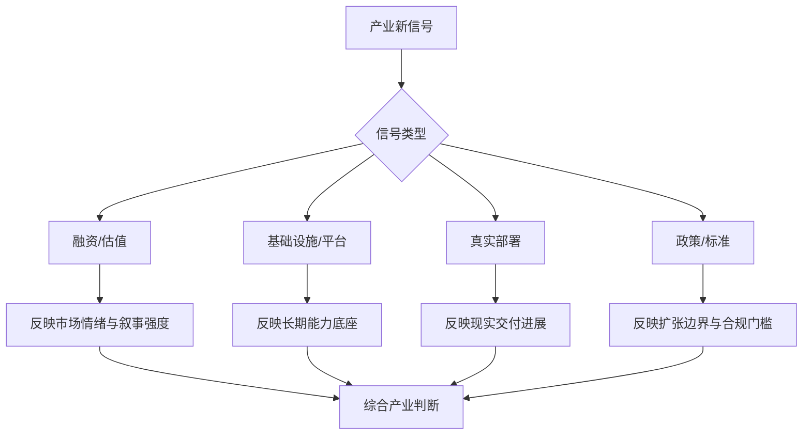

## 表 24-1 产业信号分类表

见 [24-产业信号分类表](D:/Projects/embodied-intelligence-report/docs/report/current/tables/24-产业信号分类表.md)。

## 图表与表格补充

产业格局章节需要图表，不是因为这一章更适合“做宏观图”，而是因为资本、政策、平台、真实部署这几类信号如果不被强制分层，极易在阅读时彼此污染。融资热度、基础设施进展、场景开放和监管变化，反映的是完全不同性质的问题；把它们混在一起，会直接削弱跨版本研判的稳定性。

因此，本章图表与表格最重要的职责，是建立一套面向长期跟踪的信号过滤框架。后续更新版本时，真正应新增的不是更多新闻摘录，而是把新信号放入同一分类体系下，再判断它影响的是情绪层、能力底座层、交付层还是制度边界层。

在当前版本中，`图 24-1 产业信号过滤图` 已承担“从资本热度到产业判断”的主过滤流程职责；`表 24-1 产业信号分类表` 则把融资/估值、基础设施、监管/标准、真实部署等信号类别稳定为统一记录语言。

区域竞争若要被真正讲清，最终必须回到“模型、数据、场景、制造、交付”五条链路的差异化比较上。当前正文已经先把信号过滤框架与更新日志机制固定下来，后续所有区域判断都应沿这五条链路回写，这样产业讨论才不会重新退化成融资热度、媒体声量或单点政策新闻的堆叠。

为了让这章真正服务后续更新，而不只是提供分析口径，建议后续产业跟踪统一同时维护 [24-产业信号分类表](D:/Projects/embodied-intelligence-report/docs/report/current/tables/24-产业信号分类表.md) 和 [24-产业信号日志模板](D:/Projects/embodied-intelligence-report/docs/report/current/tables/24-产业信号日志模板.md)。前者负责分类语言，后者负责把新增事件按“时间 - 类型 - 影响层 - 影响章节 - 判断动作”记录下来，供季度回调直接使用。

---

# 第二十五部分 关键争议与作者判断框架

到这一部分，报告不再只是罗列材料，而必须显式收束为一套判断体系。因为具身智能的很多分歧，不是简单的对错，而是不同约束条件下优先级不同。本部分的目标，是把这些争议明确写出来，并给出一套之后可持续更新的个人判断框架。

这套判断框架的价值，不在于它能一次性给出标准答案，而在于它能在未来不断遭遇新论文、新公司、新产品发布时，帮助读者把热度重新压回同一组硬问题上。若没有这样一套框架，报告后续版本很容易退化为“不断加材料、不断追热点”，却越来越难形成稳定判断。

## 112. 技术路线争议

### 112.1 端到端还是模块化
如果把这场争议压缩到最小，它讨论的其实不是“哪种方法更先进”，而是“哪些接口可以安全地交给学习系统吸收，哪些接口仍必须显式保留”。端到端路线的吸引力在于减少人为设计接口的负担，并有机会在跨任务迁移上获得更统一的能力；模块化路线的价值则在于保留验证、调试、约束注入和故障隔离的抓手。两者之间真正的张力，不在抽象美感，而在责任如何分配。

因此，我更倾向于把问题写成“接口最小化，而不是接口消灭”。随着模型能力增强，某些原本必须显式写出的中间表示确实可能被吸收到统一模型中；但只要系统还要满足时延预算、安全回退、版本追踪和现场运维，某些可检查边界就不会真正消失。即使出现新的“全端到端”主张，本章最该追问的也不是它少了几个模块，而是它究竟稳定接管了哪些系统职责。
因此，本报告更倾向于把这组争议理解成“接口应该在哪一层显式保留”的问题，而不是单纯的立场站队。真正值得跟踪的是：随着模型、验证和部署能力变化，哪些接口开始可以安全收缩，哪些接口仍然必须保留。这样理解，比抽象争论哪一派更先进更有工程意义。
这组争议之所以长期存在，不是因为一方更先进、一方更保守，而是因为它们优化的目标不同。端到端路线希望减少人为接口设计，让模型自己吸收更多中间变量；模块化路线则希望保留可解释性、可调试性、可约束性和工程可维护性。两者并不只是技术选择，更是系统责任分配方式的不同。

在具身系统里，这个争议尤其不能用纯软件思维处理。因为机器人一旦部署，错误不再只是输出一句坏答案，而可能变成碰撞、误抓、节拍损失或安全事件。也正因如此，很多现实系统最终都落在某种混合区间：高层更加端到端，低层更加模块化，中间通过技能、约束和回退机制相连。
“端到端还是模块化”并不是一个会被一次性终结的争论，因为它本质上对应两种不同的风险分配方式。端到端路线把更多表示与决策能力压入统一模型，潜在上限更高、接口更整洁，但调试、验证、回滚与责任定位更困难；模块化路线保留更多边界、先验与可替换性，系统更易控，却可能牺牲部分跨任务共享与统一泛化能力。

因此，本报告并不打算把这组争论写成二元胜负，而更倾向于把它视作“约束条件变化下的最优组织方式问题”。当数据规模、任务复杂度与部署约束变化时，合理解也会变化。真正值得追踪的，不是口号站队，而是哪一层接口正在被统一、哪一层仍应保留模块边界。

端到端路线更统一、更可能提升迁移；模块化路线更可控、更易验证。现实系统很可能长期位于两者之间的混合带。RT-2、OpenVLA、Figure Helix 这类路线说明统一接口越来越重要，但 08、12、15、16 部分所讨论的系统分层、安全回退和端侧约束又说明纯端到端在部署上仍有很高门槛。[RT-2](https://arxiv.org/abs/2307.15818)、[OpenVLA](https://arxiv.org/abs/2406.09246)、[Figure Helix](https://www.figure.ai/news/helix)

更精确地说，真正有争议的并不是“模块该不该存在”，而是“哪些接口应显式保留，哪些接口可以交给学习系统隐式吸收”。在研究环境中，端到端意味着更少的人为先验、更统一的目标函数和更强的迁移想象；在部署环境中，显式模块承担的却是验证、回放、约束注入、故障隔离和安全回退职责。二者不是抽象哲学之争，而是训练统一性与交付可控性的张力。
因此，我更倾向于把这个问题表述为“接口最小化，而不是接口消灭”。接口完全可以随着模型能力增强而缩窄、抽象化，但只要系统仍需满足实时性、安全性与现场维护，某些形式的可检查边界就很难被彻底抹去。
这也意味着，后续版本在讨论“端到端是否继续占优”时，不应只看某篇模型论文是否又少了一层人工模块，而应继续追问哪些接口职责真的被模型稳定吸收了，哪些只是被短暂隐藏了。一旦这些判断条件被固定下来，后续版本就能在结构重构时保持口径稳定，而不是在每一轮新叙事出现时重新从零站队。

对这份报告来说，这个争议最有价值的地方，不是逼迫我们现在就选边，而是沉淀一套后续复审问题：接口是否真的减少了人工维护负担，还是只是把复杂性转移到了不可见位置；模型是否真的承担了更多稳定职责，还是只在演示条件下吸收了中间层。只要这套追问还在，报告就不会被“端到端”三个字轻易带偏。

### 112.2 通用基础模型还是垂类模型
这组争议若只停留在“通用更有未来、垂类更能赚钱”的口号层，几乎没有分析价值。更关键的问题是：某家公司或某条路线到底在哪一层通用、在哪一层垂直。高层语义接口可以高度通用，技能执行层却可能仍然深度依赖场景约束；数据协议可以跨平台共享，而部署流程和运维责任却仍必须垂直定制。只有把“通用/垂类”拆到层级上，争议才不至于流于空泛。

我的倾向是“长期统一、短中期分化”。通用基础模型更适合承接共享表征、任务语言和跨场景先验，垂类模型或技能层则更适合承接稳定交付、强约束执行和快速客户闭环。真正有竞争力的公司，未必会在二者之间二选一，而更可能掌握它们之间的关键转换接口。
更现实的长期图景，可能不是赢家通吃，而是层次分工。通用模型占据高层语义、迁移先验和统一表示，垂类模型或技能层继续占据执行稳定性、验证可控性和场景收益。谁在这个分工中掌握关键接口，谁就拥有更实际的竞争位置。
这一争议的核心不在“通用是否更高级”，而在不同场景到底需要什么样的能力组织方式。通用基础模型的优势在于共享表示、共享数据和跨任务迁移潜力；垂类模型的优势在于接口收敛、验证更容易、部署更可控、成本更可压。二者的比较若脱离具体任务单元，往往会流于口号。

对具身系统来说，真正可能出现的不是赢家通吃，而是层次分工。通用模型更可能占据高层语义、任务描述和跨场景先验，垂类模型或场景技能则继续占据接触执行、异常恢复和强约束闭环。也就是说，这并不像大语言模型行业那样容易形成单一尺度的竞赛。
通用基础模型与垂类模型之间的争议，也不能简单理解为“长期主义对短期主义”。通用路线的价值在于共享语义、表示与数据资产，适合抬高长期能力上限；垂类路线的价值在于更快贴合固定场景分布、部署约束与客户需求，适合更早形成可交付能力。二者并不互斥，很多现实系统会长期处于“通用底座 + 垂类适配层”的混合区。

因此，判断时最关键的不是听企业自称“通用”还是“垂类”，而是看它究竟在哪一层通用、在哪一层垂直。很多号称通用的路线，其实只是高层语义接口较通用；很多看似垂类的系统，则可能在数据 schema、仿真栈或技能接口上拥有高度可复用价值。
这组争议的核心，不是二选一，而是能力复用与交付效率之间如何权衡。通用基础模型的优势在于共享表示、统一接口和更强的长期迁移潜力；垂类模型的优势在于数据闭环更短、评测更聚焦、部署约束更容易被纳入设计。对机器人来说，真正问题通常不是“通用有没有未来”，而是当前场景与数据条件是否支持通用路线先比垂类路线更快形成可用能力。
我更倾向于把这个问题理解为“统一接口的价值”与“垂直闭环的现金流现实”之间的张力。通用基础模型更有希望跨平台复用知识、降低重复造轮子成本，并为后续大规模数据聚合提供共同语义空间；垂类模型则更容易在有限场景内快速打磨到稳定可交付。短中期看，垂类更容易兑现价值；中长期看，若没有更通用的接口层，垂类成果又容易彼此割裂，难以形成真正的平台外溢。

通用模型有规模收益和复用价值；垂类模型更容易在高价值场景里快速落地。Open X-Embodiment 和 generalist policy 路线代表前者的吸引力，而大量工业、仓储、巡检落地案例则不断提醒人们：短中期价值往往首先在垂类场景中兑现。[Open X-Embodiment](https://arxiv.org/abs/2310.08864)、[IFR World Robotics](https://ifr.org/worldrobotics/)

就这份报告当前阶段而言，我更倾向于把它写成“长期统一、短期分化”的格局判断。这样既保留了基础模型路线的上限空间，也不至于忽视垂类闭环在现实里更早兑现价值的事实。

### 112.3 世界模型是否会成为主线
判断世界模型是否会进入主线，不能靠概念热度，而要看它是否稳定替代了昂贵环节。它若只能生成更逼真的未来视频，却不能改善候选动作筛选、风险评估、异常恢复或样本效率，就更像重要旁支；它若开始在规划、数据增强、反事实评估和长期任务记忆上持续提供“没有它明显更差”的增益，才更接近主线。

因此，这一问题更好的写法不是“会/不会”，而是“会在什么条件下进入哪一层主线”。我当前更倾向于认为，世界模型会越来越重要，但更可能先作为规划、评估和训练基础设施稳定嵌入系统，而不是在短期内以单一大脑形式吞下整套机器人决策栈。
这组争议也非常适合作为后续章节回调触发器。只要未来新工作开始稳定改变真机样本效率、异常恢复、风险预估或规划筛选中的任何一项，就值得上修其主线地位；否则，应保持谨慎，不把生成热度直接翻译成系统拐点。
世界模型是否会成为主线，取决于它能否稳定承担“减少真实试错成本并提升闭环决策质量”的角色。若世界模型只能提供看起来更真实的未来表达，却无法改善候选筛选、风险预估、样本效率或恢复策略，它就更像外围增强；若它能成为规划器、策略器和评测器之间的高杠杆中介层，它才可能逐步进入主线。

因此，对这条争议更好的判断方式不是问“世界模型火不火”，而是问它正在替代哪一段昂贵环节。只要这个问题答不清，很多热度都更接近研究想象而非系统拐点。
世界模型是否会成为主线，不能只靠学术热度判断，而要看它能否显著改善规划、恢复、数据效率或仿真质量。若世界模型主要停留在生成逼真视频，却不能稳定服务动作选择，那么它更像重要旁支；若它能在反事实评估、异常预判、数据合成或层级规划中持续发挥作用，它就可能逐步进入主线。

因此，这个问题的更稳妥答案不是“会”或“不会”，而是“会在什么条件下进入哪一层主线”。我倾向于认为，短中期内世界模型更可能先作为规划、评估与数据基础设施的重要组成，而不是单独吞掉整个机器人决策主线。

世界模型是否会成为主线，争议的根源并不在于它是否“听起来先进”，而在于它到底能否稳定承担具身系统里最稀缺的职责。如果世界模型只能生成漂亮未来，却难以支撑决策、恢复和跨平台迁移，它就更像配角；若它能在规划、数据效率、风险预估和长期任务组织上持续提供不可替代的增益，它就更可能进入主线。

因此，对这一问题的判断不应建立在概念热度上，而应建立在它是否真正改变了系统接口与工程分工上。只有当世界模型开始稳定承担“没有它就明显更差”的系统职责时，才能说它从研究热点走向主线。
我的判断是：世界模型会越来越重要，但未必会以“独立吞并整栈”的方式成为唯一主线。它更可能先在局部候选评估、训练增强、风险预测和任务记忆这些位置稳定嵌入系统，而不是突然变成全知全能的大脑。换句话说，它很可能是关键基础设施方向，但不一定会在短期内以最夸张的叙事方式兑现。
后续真正值得观察的，不是“谁又宣称自己做了世界模型”，而是哪些系统职责开始被世界模型稳定接管。例如，它是否真的降低了现实试错成本，是否真的提升了异常预判和恢复决策能力，是否真的在跨场景迁移时减少了重新采数和重新调参的需求。只有当这些职责发生稳定迁移，世界模型才算从概念热词走向系统主线。

这类判断方式同样适用于后面所有新路线。与其反复争论某个名词是不是下一个主线，不如观察它是否持续接管了以前必须靠人工结构、保守规则或高成本试错才能完成的职责。只要职责迁移没有发生，很多主线叙事都仍应被当作“候选方向”而不是“既成事实”。

世界模型很重要，但其是否会成为真正主线，仍取决于它能否在真实控制与部署链路中提供持续收益。Dreamer、JEPA 与视频世界模型路线都很有启发，但离“稳定吃下现实机器人长时程闭环”仍有明显距离。[Dreamer](https://arxiv.org/abs/1912.01603)、[JEPA](https://arxiv.org/abs/2301.08243)

## 113. 工程路线争议

### 113.1 大脑和小脑应否解耦
大脑和小脑是否解耦，本质上是在争论高层语义推理与低层连续控制应否由同一模型统一承担。支持解耦的一方通常强调时延、稳定性、可验证性和模块可替换性；倾向统一的一方则更强调表示共享、接口简洁和长程语义到动作的一体化学习潜力。

这一争议短期内很难被单一实验终结，因为它高度依赖本体、任务时钟、算力预算和安全要求。
我之所以偏向“解耦为主、统一为辅”，不是因为我低估统一学习的潜力，而是因为具身系统必须面对时延、安全、验证和现场维护这些高层统一模型难以彻底消除的现实约束。高层语义能力当然可以越来越多地下沉到中低层接口里，但只要系统还要在毫秒级控制、异常回退和局部稳定性上承担责任，某种形式的功能分层就会持续存在。争论的重点不在是否解耦，而在解耦边界如何随着模型能力演进而被重写。

从系统稳定性角度看，解耦几乎不可避免；从统一学习角度看，耦合又更诱人。当前我更倾向于把它理解为“解耦为主、统一为辅”：高层语义和低层闭环之间需要清晰接口，但接口形式会随着模型能力增强而持续重写。

这一定义也意味着，后续版本最该观察的不是“有没有人宣称统一了”，而是统一之后是否减少了系统总复杂性，而不是只是把复杂性换了个位置藏起来。

把“大脑-小脑”问题写得更技术一点，其实是在讨论不同时间尺度上的控制责任如何分配。高层大脑通常处理秒级到分钟级的目标解释、任务分解、语义检索和策略切换；小脑则更多处理百毫秒到毫秒级的轨迹修正、接触稳定、反射式恢复和局部控制约束。若把它们强行压进同一时钟域，系统就会同时承受高层推理延迟和低层闭环稳定性压力。

因此，更合理的比较单位不是“是否解耦”，而是：

1. 语义决策更新频率。
2. 技能层重规划频率。
3. 局部反馈控制频率。
4. 异常回退触发与仲裁逻辑。

只有把这些频率层显式写出来，所谓“大脑和小脑是否分开”才不再只是比喻，而会变成可审查的系统设计问题。对长期版本维护来说，这也提供了一个统一口径：凡是号称统一了整栈的新路线，都应优先回答它如何处理多时间尺度责任，而不是只展示语义到动作的表面一体化。

### 113.2 端侧与云侧如何分工
端侧与云侧分工的真正问题，从来不只是“算力够不够”，而是哪些环节必须把控制权留在本地。凡是和实时控制、安全回退、网络抖动容忍和现场责任直接相关的能力，原则上都更适合端侧优先；凡是长时程记忆、重训练、跨站点分析、离线规划与大规模模型更新，则更容易放在云侧。

在具身系统里，这种分工甚至会反向定义模型形态。若关键能力必须留在端侧，模型就要接受更严格的延迟、能耗和可解释性约束；若某些高层能力可以上云，系统就能容纳更大模型，但也必须付出网络依赖和治理复杂度代价。
端侧与云侧分工的核心不是算力部署位置，而是哪些能力必须低时延、强可靠、可离线运行，哪些能力可以容忍更高延迟、更强算力依赖与更频繁更新。对具身系统而言，安全相关控制、局部恢复、关键状态估计通常必须尽量靠端侧；大规模知识检索、离线训练、全局策略更新和跨机器人经验汇总则更适合云侧。

因此，真正合理的分工方式往往不是“全端”或“全云”，而是按时间尺度、失败代价与网络依赖分层。谁能把这条分界线划得清楚，谁的系统就更有机会同时兼顾智能上限与部署可靠性。
端侧与云侧分工的争议，本质上是在讨论“哪些能力必须贴近传感器和执行器，哪些能力可以容忍网络与远程时延”。一般来说，低时延控制、安全兜底和局部感知更适合端侧；大规模训练、重型推理、全局知识和跨设备协同更适合云侧。但在现实系统里，真正难的是如何在这两者之间动态切换而不破坏一致性。
我更倾向于把这个问题看成“高频闭环必须本地化，低频训练与记忆可以云化”的分工问题，而不是二选一。任何涉及即时安全、接触稳定、局部控制和基本感知闭环的能力，都很难长期依赖云端；而大规模训练、长期经验归档、跨设备知识迁移和复杂任务回放分析，则天然更适合在云侧完成。真正有竞争力的系统，往往不是完全端或完全云，而是清楚知道哪些责任绝不能离开本地。

部署约束决定端侧必须承担更多责任，但训练和记忆系统又很难完全离开云侧。Figure Helix、Jetson/Isaac 等样本都说明，未来更可能出现的是“高低频分层 + 云边端协同”，而不是所有能力都一股脑推到端上或云上。[Figure Helix](https://www.figure.ai/news/helix)、[Jetson Orin](https://www.nvidia.com/en-us/autonomous-machines/embedded-systems/jetson-orin/)

对后续章节复审时，这一争议也能作为统一口径：凡是涉及部署可行性的问题，都应先问该能力究竟属于必须本地化的责任，还是可以安全云化的责任。

这个问题还可以进一步写成一个部署责任矩阵。一般来说：

1. 必须端侧优先：安全停机、接触闭环、关键状态估计、局部避障、基础技能执行。
2. 可云边协同：任务编排、经验检索、模型热更新、远程诊断、批量策略评估。
3. 更适合云侧：离线训练、跨站点数据汇总、重仿真、长期知识归档。

若后续某家公司的系统宣称“大部分能力都可云化”，那么最值得追问的不是它云模型有多强，而是网络抖动、断连、权限隔离和现场责任链如何被处理。反过来，若某系统强调全端部署，也应追问其端上模型在算力、散热、功耗、升级与调试上的代价是否已经被真实解决。只有把责任分配、而不是口号偏好，作为比较中心，这组争议才有研究价值。

### 113.3 数据优先还是模型优先
若硬要给出一个更实用的判断顺序，那么在具身领域通常应先看数据协议是否可用，再看模型是否能有效吸收这些数据，最后看部署与验证是否允许模型收益真正落地。只要第三步长期缺失，前两步的争论就容易停留在研究表面。
这组争议经常被说成二选一，但在具身领域更准确的说法通常是“不同阶段谁是主矛盾”。在很多早期场景里，数据接口混乱、失败样本稀缺、episode 定义不稳定时，再强的模型也难发挥；而在数据协议初步稳定之后，模型架构、训练配方和推理组织方式又会重新成为增长瓶颈。

因此，本报告更倾向于把它看成动态判断，而不是原则站队。真正高质量的团队，通常既知道何时继续扩数据闭环，何时把精力转回模型、评测和部署接口，而不是长期沉迷于单边叙事。
“数据优先还是模型优先”在具身场景里更像阶段性瓶颈判断，而不是理念之争。语义能力不足时，模型扩张常常更快见效；接触长尾、异常恢复和跨本体迁移不足时，数据与闭环又会重新成为主矛盾。因此更好的问题不是站队，而是识别当前系统被哪一层短板卡住。

我更倾向的判断框架是：若系统主要卡在不会理解、不会分解、不会组合，优先看模型；若主要卡在会想不会做、会做但不稳、能稳但不可复制，优先看数据与工程闭环。这样比抽象争论更接近研究与产业现实。

“数据优先还是模型优先”这个争论之所以长期存在，是因为两者在不同阶段确实可能分别成为最稀缺瓶颈。早期系统往往缺高质量闭环数据，因此数据优先更接近现实；而当数据量开始扩大后，模型结构、动作接口和训练组织方式又会重新决定数据能被放大到什么程度。

因此，更合理的看法不是二选一，而是判断当前具体路线正卡在哪一层：是缺真实分布数据、缺跨平台统一接口、缺高效模型结构，还是缺部署后的回流机制。只有把争论放回具体瓶颈，讨论才有意义。
我的总体判断仍然是：近几年机器人更容易被数据闭环卡住下限，也更容易被模型接口卡住上限。没有高质量、持续回流、覆盖失败与恢复的真实数据，模型很难获得可部署能力；没有足够统一的模型和表示层，分散采来的数据又很难有效复用。因此，这不是一个值得二元站队的问题，而更像一个“双瓶颈系统”判断题：谁能同时改善数据回流与模型统一接口，谁就更可能真正拉开差距。

在机器人里，数据质量和闭环常常比盲目放大模型更关键；但没有足够统一的模型，数据也难充分复用。我的判断是：机器人在未来几年更像“数据闭环先卡住上限、模型统一接口决定上限能否被释放”的双瓶颈系统，而不是单一变量决定胜负。

这也是为什么我在全书里一直避免只站“数据派”或“模型派”。具身系统真正的难点，是让高质量现实数据与可复用模型接口同时出现，而不是神化任何单一变量。

更具体地说，可以把路线所处阶段粗分为三类：

1. 数据荒阶段：问题主要是没有高质量、多失败、可回放、可对齐的真实数据。
2. 接口荒阶段：数据已开始积累，但动作表示、训练范式和评测协议高度割裂。
3. 部署荒阶段：模型和数据都在增长，但现场运行、恢复、回流与成本控制跟不上。

这三类阶段对应的主矛盾并不相同。第一类更应优先做采数与闭环，第二类更应优先做统一表示与训练框架，第三类则应优先做部署与恢复组织。若不先判断自己处在哪一类，就很容易把别人的成功条件误抄成自己的优先事项。

## 114. 产业路线争议

更进一步地说，数据与模型在具身系统中不是替代关系，而是耦合关系。小而分裂的模型会让跨平台数据难以复用，缺乏高质量闭环数据又会让大模型停留在“漂亮初始化”而非可部署能力。真正需要警惕的，是把任何一个维度单独神化：只讲数据而忽视统一表示，会把系统锁死在碎片化技能库中；只讲模型而忽视失败回流与真实采数，会把系统锁死在演示型能力中。

### 114.1 人形是不是最佳商业形态
这也是为什么本报告不会把“人形重要”直接翻译成“人形短期商业最优”。更准确的写法应当是：人形可能是强平台形态候选，但它必须同时回答制造、可靠性、维护、能耗、安全与任务收益问题。只要这些问题没有同步被解决，人形的战略重要性与短期商业优先级就应当被分开记录。
人形之所以争议最大，是因为它同时承载了“通用本体”“社会想象”“劳动力替代”和“平台入口”四种叙事。但这些叙事并不自动等价于短中期商业最优。人形的优势在于可能复用人类环境、具备更强市场传播性和更大的平台想象；劣势则在于结构复杂、成本高、维护重、可靠性和安全要求都更苛刻。

因此，判断人形是否最佳商业形态时，必须明确时间尺度。长期看，它可能是强平台候选；短中期看，它未必优于轮式、固定机械臂或其他更贴场景的本体。若不分时间尺度讨论，这个问题几乎一定会沦为情绪辩论。
人形是否是最佳商业形态，不能脱离任务环境单独回答。人形的最大优势在于与既有人类环境的兼容性，包括门、梯、工位、工具与通道；最大代价则在于本体复杂、成本高、控制难、维护重。若场景高度依赖这种兼容性，人形可能有长期优势；若任务更适合轮式、固定臂或专用机构，人形未必是最优解。

因此，本报告更倾向把人形视作一类具有强叙事吸引力、但必须被场景价值密度严格约束的本体选择，而不是默认终局答案。真正重要的，不是“像不像人”，而是“为了什么任务、付出了什么复杂度、换回了什么场景覆盖”。

“人形是否最佳商业形态”这个问题最容易被叙事绑架，因为人形天然连接了通用劳动、平台统一和与人类环境兼容的想象空间。但商业上最优的形态不一定是叙事上最完整的形态。很多场景真正需要的，可能只是局部移动操作、特定工位协作或专用执行结构，而不是完整人形。

因此，更好的问法不是“人形是不是终局”，而是“在什么场景、什么成本结构、什么交付阶段下，人形相对于专用形态的收益是否足以覆盖其复杂性”。只有把问题放回任务与交付边界中，争论才不会空转。
人形是不是最佳商业形态，不能只从“通用性”角度判断，还要看成本、可靠性、维护、节拍和场景适配性。人形的优势在于兼容大量为人类设计的环境与工具，但它的代价也在于机构复杂、成本高、维护难、控制挑战大。很多场景里，专用移动操作平台可能更早具备商业优势。
我的判断是：人形更像最强平台叙事，而不是最稳短期商业形态。它在适配人类环境、统一数据接口和资本叙事上确实具备天然优势，但在成本、稳定性、维护难度和批量交付上依然面临显著挑战。因而对人形的判断不应写成“必成”或“必败”，而应写成“长期上限很高、短期兑现极难”的高波动路线。
因此，对人形路线最稳健的态度不是在“万能平台”和“资本泡沫”之间来回摇摆，而是把它视为一条需要长期条件跟踪的高上限路线。哪些条件一旦被满足，人形就会显著上修预期；哪些条件长期无法改善，人形就应被下修判断，这些触发器都应在后续版本中被明确记录，而不是每次只跟随融资和演示热度波动。

人形可能是最强通用平台想象，但未必是最近的商业最优形态。它更像“长期平台叙事 + 中短期高风险工程赌注”的结合体，而不是显然的短期最优解。

更精确地说，人形路线的吸引力来自三种统一性：

1. 环境统一性：人类空间已经按人类尺度设计。
2. 数据统一性：许多演示、视频和语言任务天然以人类形态为参照。
3. 资本叙事统一性：人形最容易承载“通用劳动平台”的想象。

但它的代价也同样来自三种高成本：

1. 机械复杂度高，可靠性与维护负担重。
2. 平衡、接触、跌倒恢复与安全问题显著更难。
3. 若没有极高任务密度，额外自由度很难立即转化为收益。

因此，在本报告里，人形不应被简单写成“最先进本体”，而应被视作“潜在统一平台”和“高风险工程结构”的并存体。只有当其成本、稳定性、维护和场景价值密度之间关系被持续改善时，人形的总体判断才值得被系统上修。

### 114.2 哪些场景会最先规模化
场景会不会先规模化，关键从来不是“市场想象空间够不够大”，而是任务单元是否足够结构化、价值密度是否足够高、失败成本是否可控、以及部署与维护摩擦是否能被压到客户可接受范围内。也正因此，最先规模化的场景通常不是最性感的场景，而是那些能把复杂问题压缩成可运营单元的场景。

这也意味着本章后续复审任何新热点时，都不应让“场景看起来很大”直接替代“场景适合先规模化”的判断。若一个场景同时要求极高开放性、极低错误容忍、极强责任边界和极重售后负担，那么它更可能是长期研发方向，而不是短期规模化入口。
哪些场景会最先规模化，通常不取决于“看起来最未来”，而取决于五件事是否同时成立：任务是否重复、收益是否可计量、错误是否可控、部署是否可复制、客户是否愿意为稳定性付费。也正因此，规模化场景往往会先出现在那些边界清晰但需求真实的工业与服务子任务中。
我仍然更看好那些结构化程度高、任务边界清晰、ROI 可量化、失败代价可控且运维组织可建立的场景优先规模化。制造、物流、巡检以及若干高约束服务子场景之所以反复领先，并不是因为它们最有想象力，而是因为它们更容易形成“能力边界清楚、价值链条闭合、维护流程可复制”的部署条件。这一点可能不够浪漫，但通常更接近产业真实节奏。

这一判断也意味着，后续遇到任何新的“爆款场景”时，最该先问的不是市场规模有多大，而是它是否满足这几条规模化先决条件。只要任务边界模糊、责任难划、运维难组织，再大的 TAM 也未必能先变成真实出货。

当前更现实的仍是制造、物流、巡检与高约束服务子场景。这一判断来自多章交叉证据，而不是单一新闻：这些场景通常更结构化、ROI 更清晰、误差容忍度边界更明确。[IFR World Robotics](https://ifr.org/worldrobotics/)、[Agility Robotics](https://agilityrobotics.com/)

遇到新的场景热点时，本章仍应坚持按同一套条件回审，而不能让“场景看起来很大”直接替代“场景适合先规模化”的判断。

### 114.3 哪些公司最可能建立护城河
具身行业里的护城河很少来自单一亮点，更常来自多层能力耦合。真正稳的护城河往往出现在以下几类组合里：本体与制造能力叠加持续数据回流；场景进入能力叠加部署与运维网络；平台接口控制力叠加训练和评测基础设施；或者强客户关系叠加持续版本迭代速度。只在其中一层强，往往更容易被追平；能把几层连成闭环，才更接近长期壁垒。

因此，我更倾向于把护城河理解成“难以被复制的演进能力”，而不是“眼下最强的单点能力”。一个公司今天最亮眼的模型，也许明天就会被追近；但若它掌握了更便宜的采数机制、更稳的交付体系或别人离不开的接口标准，那么它的优势会更难被单篇论文或单次融资抹平。
因此，在后续企业专题里，更值得警惕的是“把单层领先误判成系统护城河”。真正长期稳的公司，往往不是某一项能力最极端，而是多层约束之间耦合得最好。这个判断口径应在后续版本里持续保持稳定。
具身公司的护城河很少只来自单一模型。更常见的复合护城河由五部分组成：真实数据闭环、软硬件协同、本体制造与供应链、部署与运维网络，以及场景知识与客户流程嵌入。谁能把这几部分组织成飞轮，谁才更可能在行业里建立持久位置。

这也解释了为什么有些公司论文声量很高却未必稳，有些公司媒体存在感一般却可能持续增强。前者可能只在单一层级领先，后者则可能在多层约束上同时积累。这种多层耦合能力，才是具身行业更典型的护城河形态。
最可能建立护城河的公司，未必是最先做出惊艳 demo 的公司，而往往是能把模型、数据、本体、交付与组织能力耦合成闭环的公司。单一维度领先很容易被追平，真正难复制的是多层耦合后形成的学习速度、交付速度与成本曲线优势。

因此，判断护城河时应避免只看单次融资、单次论文或单次产品发布，而要看企业是否在持续积累“别人很难同时补齐”的组合能力。这也是我在企业章节中反复强调统一分析模板的原因。

真正可能建立护城河的公司，往往不是在单一维度上最亮眼的公司，而是能够把数据闭环、本体工程、部署网络、供应链与客户流程持续耦合起来的公司。单次 demo、单篇论文或单轮融资当然重要，但这些信号如果不能沉淀成可复用系统能力，就很难转化为长期壁垒。

因此，本报告更倾向于把护城河理解为“跨时间累积、跨场景复用、跨版本稳定保留”的能力组合，而不是短期热度的总和。谁能持续把这些能力固化进数据资产、接口标准、运维组织和系统工程流程里，谁更可能在中长期竞争中占据主动。
我更倾向于警惕“单点炫技型优势”的误导。真正可能建立长期护城河的公司，往往不是在某一时刻拥有最亮眼模型或最酷本体，而是同时控制了真实任务入口、数据回流、软硬件协同、运维体系和版本迭代节奏。具身领域的护城河更像复合系统能力的持续积累，而不是一次模型发布所带来的瞬时领先。

最可能建立长期护城河的，往往不是单次模型发布最亮眼的公司，而是同时掌握数据、本体、基础设施和部署反馈闭环的公司。换言之，具身系统的护城河更可能是“系统耦合护城河”，而不是单一算法护城河。

因此，这一章最终想压住的，是一种很常见的分析冲动：看到某一维特别强，就急于宣布胜负。具身行业更像多维耦合竞赛，单点领先可以带来注意力优势，却未必带来持久优势。真正需要长期记账的，是哪些公司在多维之间形成了越来越难被拆开的复合积累。

## 115. 作者判断框架

这也是为什么企业判断不能只看“有没有最强模型”或“有没有最酷本体”。在具身系统里，模型、本体、仿真、现场部署和运维网络会彼此强化。一家公司一旦同时控制了真实任务数据、仿真基础设施、端侧算力栈、客户现场反馈和迭代节奏，就会形成远强于单点算法优势的复合壁垒。这类壁垒建立更慢，但一旦形成通常也更难复制。

### 115.1 观察指标
更实用的做法，是把这些指标按层记录并长期纵向对比，而不是只横向比较某一时点。具身行业的很多变化不体现在单次绝对值，而体现在一家公司、一条路线或一个场景是否开始持续改善某些变量。纵向变化往往比横向热度更能说明问题。
如果把本章当成一个长期判断仪表盘，那么最值得持续记录的指标不应只是模型 benchmark 或融资金额，而应覆盖多层：任务成功与恢复、真机部署频率、客户复制速度、单位场景 ROI、数据回流效率、本体迭代节奏、供应链稳定性、以及政策与合规摩擦变化。这些指标组合起来，才更像具身系统的真实生命体征。

单一指标往往会误导。例如只看成功率容易忽略恢复能力，只看融资容易忽略交付，只看参数规模容易忽略端侧约束。也因此，本章强调的是观察指标的组合，而不是某一个“决定性数字”。
观察指标之所以要单列，是因为没有稳定指标，整本报告就会在版本更新中反复被热点牵着走。指标的价值不在于制造精确幻觉，而在于迫使我们长期用同一组问题去审视不同阶段的新信息，从而形成可对照的判断序列。

对本报告而言，更重要的指标通常不是单点分数，而是结构性信号，例如部署频率、失败恢复、数据回流、成本曲线、接口标准化程度、工具链成熟度与场景复制效率。谁在这些指标上持续改善，谁的进步更接近系统性进步。

作者判断框架中的观察指标，最重要的价值不在于制造一套“看起来科学的打分表”，而在于强迫分析者持续在相同维度上积累证据。若每次观察都只围绕当下最热话题展开，报告很快就会失去可比较性；而固定指标则能在热点变化中保留判断坐标。

这些指标也不应追求绝对精确，而应追求长期稳定、跨章节一致和跨版本可复用。对本报告来说，好的指标不是能让所有对象立即被打出一个完美分数，而是能持续帮助识别哪些变化真正影响能力边界。
如果只能保留少数高价值指标，我会优先看五类：真实部署数量与连续运行质量、失败恢复与人工接管表现、数据回流和版本迭代节奏、本体成本与维护成本变化、以及端侧推理与现场系统稳定性。这五类指标分别对应“是不是在真实世界中工作”“出了问题怎么办”“能力会不会持续增长”“商业上能不能撑住”“系统能不能跑得住”。它们比单次发布会上的能力宣称更接近长期判断。

建议持续跟踪：

1. 真实部署案例而非单次 demo。
2. 失败恢复能力而非只看成功片段。
3. 数据闭环与更新节奏。
4. 本体成本与制造进展。
5. 端侧部署与时延控制。

如果要把这一节变成真正可复用的观察表，那么每类指标还应尽量记录“变化方向”和“证据来源”两列。例如：

1. 部署数量增加了多少，来自官网、客户案例还是媒体转述。
2. 连续运行质量是否提升，证据是论文、演示、运维报告还是访谈。
3. 失败恢复是否从人工脚本转向模型闭环，变化发生在哪一层。
4. 成本下降是 BOM 压缩、装配改善还是维护频率下降。
5. 端侧部署改善来自模型变小、runtime 变强还是任务被重新切分。

这样做的好处是，指标不会停在抽象口号，而会在后续季度更新中直接变成可追踪变量。对研究型长期项目而言，这比任何一次性的“综合印象分”都更有用。

### 115.2 应定期跟踪的论文、企业、产品、政策信号
持续跟踪不应只是列一串名单，而应形成信号分层。上游论文用于看接口、训练闭环与能力边界是否被重写；中游企业动态用于看工程路线与交付能力是否发生结构变化；下游产品与客户案例用于看真实落地速度；政策与标准信号则用于看准入、责任和采购摩擦是否移动。把这些信号混在一起，很容易被单一热点带偏；分层看，才能形成稳定判断。

更重要的是，跟踪对象不该追求“越多越好”，而应追求是否覆盖真正会改变能力边界的来源。论文改变的是技术可能性，企业改变的是组织实现路径，产品改变的是客户接受方式，政策改变的是场景开放边界。只有这四类信号并读，判断框架才不容易长期偏向某一个叙事源。
持续跟踪不应只是列一个名单，而应形成信号分类：上游论文用于看技术接口变化，中游企业动态用于看工程路线分化，下游产品与客户案例用于看真实落地速度，政策与标准则用于看长期约束边界。把这些信号混在一起看，容易被单一热点误导；分层看，才能形成稳定判断。
这里最重要的不是“跟踪得越多越好”，而是跟踪对象是否能覆盖能力边界真正变化的来源。论文信号告诉我们接口和训练闭环是否被重写，企业信号告诉我们交付能力是否在增长，产品信号告诉我们功能是否开始固化为可售卖单元，政策信号则告诉我们场景开放和合规边界是否在移动。只有把这几类信号并读，判断框架才不容易偏向单一视角。

论文看接口变化，企业看交付变化，政策看场景开放与监管边界变化。

为了避免跟踪工作退化为信息堆积，可以把信号分成四级。一级信号是改变系统接口或训练闭环的论文与产品，例如新的 action representation、关键数据集或端侧部署突破；二级信号是改变交付成本结构的企业动作，例如量产、客户扩张、迭代周期缩短；三级信号是改变供给条件的基础设施变化，例如新仿真平台、新采数工具链和算力平台；四级信号才是更偏叙事层的融资、合作与宣传。这种分层跟踪有助于把注意力稳定压在真正改变能力边界的因素上。

这套分层跟踪法现在也已经可以落到结构化模板上：论文可配合 [18-论文谱系字段表](D:/Projects/embodied-intelligence-report/docs/report/current/tables/18-论文谱系字段表.md)，企业可配合 [20-企业季度跟踪表模板](D:/Projects/embodied-intelligence-report/docs/report/current/tables/20-企业季度跟踪表模板.md)，任务失败与恢复可配合 [17-任务恢复模式表](D:/Projects/embodied-intelligence-report/docs/report/current/tables/17-任务恢复模式表.md)。

### 115.3 如何避免被短期热点带偏
这套方法的重要性还在于，具身行业天然跨论文、产品、资本、政策和媒体多个节奏源。若没有稳定的分层过滤器，报告很容易随着最快的节奏源不断偏移，而失去研究型文档最重要的判断稳定性。
避免被短期热点带偏，一个非常实用的方法是强制区分四层信息：情绪层、能力层、交付层和制度层。融资、热搜、爆款视频通常更多属于情绪层；新论文和模型发布多属于能力层；真实客户部署与运维属于交付层；标准、治理与采购变化则更偏制度层。只有把不同层的信息拆开，判断才不容易被同一天的热度牵着走。

对长期研究者来说，这种分层还有一个好处：它会迫使你不断问“这条新消息到底改变了哪一层”，从而减少把传播事件误写成结构事件的概率。
避免被短期热点带偏，核心不是拒绝看新闻，而是坚持把新闻降格为待解释信号。每遇到新论文、新融资、新 demo 或新政策时，都应先追问：它改变的是事实层、判断层，还是只是叙事层。只有这三层被分开，报告更新才不会被单轮热潮冲散。

另一个关键做法，是把“未变化的判断”显式写出来。很多时候，真正重要的不是某个事件发生了，而是某些原有瓶颈依旧没有被穿透。持续写出哪些判断仍未改变，本身就是抵抗热点偏移的重要方法。

避免被短期热点带偏，最有效的方法不是拒绝关注热点，而是为热点建立固定的过滤框架。任何新论文、新融资、新 demo、新公司故事，都应被迫回答几个相同问题：它改变的是事实层、判断层还是只是情绪层？它影响的是哪一章的哪一个核心判断？它有没有带来可复用的基础设施或更可信的交付证据？

只有把所有热点都拉回同一套问题集，报告才不会被每一波新名词重置坐标。换句话说，稳健判断靠的不是信息更少，而是过滤更强。
避免被短期热点带偏，最有效的方法不是拒绝看热点，而是给热点建立固定解读顺序：先问它证明了什么能力，再问证据强度，再问是否可复制，再问是否改变了原有长期判断。若没有经过这几个问题，很多“重磅进展”其实只是在放大旧趋势而不是改写趋势。
我的建议不是回避热点，而是建立“热点再编码”习惯。任何热点都先强制回答几件事：它究竟改变了物理、数据、部署、经济性中的哪一层；它是解决了核心瓶颈，还是只是把瓶颈往下游挪了；它依赖的是长期基础设施积累，还是短期演示包装。只要坚持做这层再编码，热点就更容易变成研究线索，而不是注意力陷阱。

最有效的方法不是拒绝热点，而是把所有热点重新压回同一套分析坐标：它改变了哪一层？解决了什么硬问题？绕开了哪些问题？又留下了哪些未解之处？

### 115.4 一个建议的评分框架
如果一定要落成粗评分框架，我更建议采用多维向量而不是单一总分。因为单一总分最容易掩盖真正的短板，而具身系统恰恰经常败在最短那一块板上。更有用的做法，是把对象投影到物理真实性、数据闭环、部署可行性、经济性和长期上限几条坐标上，再明确记录“当前最限制上修判断的关键短板是什么”。

换言之，评分在本报告里的作用不应是制造一个漂亮排名，而应是成为版本更新时的“变化提醒器”。只要某一维显著变化，就应回头检查它背后的证据是否足够扎实、是否会同步影响其他章节的共享判断。这样评分框架服务的是长期研究一致性，而不是表面上的客观感。
因此，评分框架在本项目里的最好用法，不是生成一个漂亮排名，而是作为版本更新时的“变化提醒器”。只要某一层评分明显变化，就应回看背后的证据是否足够扎实，以及是否需要同步调整其他章节的共享判断。
如果一定要形成一个粗评分框架，更合适的也不是单一总分，而是按层打分：本体与系统工程、数据与模型、部署与运维、商业与客户、供应链与制造、政策与合规。这样的分层评分虽然麻烦，却比一个笼统的“综合星级”更能支持后续版本回看，因为读者可以看清究竟是哪一层在变化。

同时，评分框架的意义不应被夸大。它更适合作为迫使分析者逐项过问的工具，而不是替代正文判断本身。换句话说，分数只是压缩结果，真正重要的仍然是每一项背后的理由与证据。
评分框架的目的不是把复杂行业假装压缩成一个客观分数，而是帮助我们在多维信息之间建立稳定比较顺序。更合理的做法是把评分视为结构化摘要，而不是最终结论。也就是说，分数只能服务于“快速回顾”，不能替代正文里的因果分析与证据讨论。

若后续真的使用评分框架，我建议始终保留至少两层输出：第一层是按本体、数据、模型、部署、制造、商业六维给出粗评分；第二层是明确写出“拉低总判断的关键短板是什么”。这样评分才不会把最重要的瓶颈隐藏起来。
这个评分框架的价值不在于制造精确分数，而在于迫使判断保持多维。具身方向最常见的误判，就是被某个特别亮眼的单维度吸走全部注意力，例如模型能力、资本热度或本体炫酷程度。五维框架的作用，就是让每一次新信号都必须同时接受物理真实性、数据闭环、部署可行性、经济性和长期上限这几道关卡。它不是机械打分器，而是帮助作者在未来更新版本时维持判断口径一致的支架。
更重要的是，这个框架的工作方式不是“算出一个答案”，而是强迫所有新证据都先回答同一组问题。只要后续更新仍然坚持让论文、企业、产品、政策四类信号都通过同样的五维筛子，那么报告就更不容易退化为追热度的资料堆叠，而能够持续保留跨章节、跨版本的一致判断结构。

为了在后续版本中保持判断一致性，可以把任何一条新路线先粗略投影到如下五维：

\[
\mathbf{j} = [j_{\text{physics}}, j_{\text{data}}, j_{\text{deployment}}, j_{\text{economics}}, j_{\text{upside}}]
\]

其中：

1. \(j_{\text{physics}}\) 评估其是否真正解决了物理与接触层硬问题。
2. \(j_{\text{data}}\) 评估其是否建立了可持续数据闭环。
3. \(j_{\text{deployment}}\) 评估其是否接近真实部署。
4. \(j_{\text{economics}}\) 评估其商业与成本可行性。
5. \(j_{\text{upside}}\) 评估其长期上限与平台潜力。

这不是为了制造伪精确，而是为了避免每次都只被某一个最显眼维度带走。

若后续真的要在项目里落地为结构化卡片，一个很实用的做法是对每个维度同时记录三项内容：

1. 当前粗评级。
2. 上修触发器。
3. 下修触发器。

例如，`j_deployment` 的上修触发器可以是“跨客户部署证据增多、恢复机制更明确、连续运行时长提升”；下修触发器则可以是“仍高度依赖人工接管、只在单场景演示、异常处理不可复现”。这样评分框架就不再是静态分数，而会成为一个随证据更新的判断系统。

换句话说，本章真正想沉淀的不是“给所有公司打分”，而是固定一套让未来自己不容易被热度拖走的复审顺序。只要复审顺序稳定，哪怕章节不断扩写、案例不断增加，整本书的判断口径也更容易保持一致。

本部分的最终结论是：具身智能最需要的不是情绪化站队，而是持续的结构化怀疑。好的判断框架，应该既允许对技术前景保持开放，又不断把每条新叙事压回物理、数据、部署和商业化现实中检验。
但这个判断框架如果只停留在“观察维度”，仍然不够可执行。更有用的做法，是为每个维度定义上修与下修触发器。例如，若某一路线连续出现跨平台复现、真实部署时长提升、恢复机制明确、单位任务成本下降，就应上修其 \(j_{\text{deployment}}\) 与 \(j_{\text{economics}}\)；反之，若新成果主要来自更窄评测口径、更多人工兜底或更重场景改造，则即使模型指标上升，也不应同步上修总体判断。换言之，本章的目的不是固定结论，而是固定“什么证据有资格改变结论”的规则。

我也更倾向于把“端到端还是模块化”的争议写成“接口最小化，而不是接口消失”。真正成熟的具身系统当然可能不断压缩显式中间表示和手工规则数量，但只要系统还要承担时延预算、安全回退、版本追踪和现场运维责任，某种形式的功能边界就不会消失。后续版本维护时，凡是出现“完全统一”“彻底替代”“纯端到端落地”之类表述，都应优先审查其是否真的消除了系统复杂度，还是只把复杂度藏到了数据筛选、运行时守护或人工接管流程里。

因此，本章也应被当作全书的“反炒作过滤器”。任何新论文、新公司或新平台若要显著改变本书判断，至少应穿过四道筛子：是不是改变了物理任务边界；是不是改变了数据闭环效率；是不是改变了部署责任分配；是不是改变了单位经济性。若四者都没有显著改变，那么即使舆论热度再高，也更适合被写入更新日志，而不是直接重写核心结论。

## 图 25-1 判断框架五维图
源文件：`assets/diagrams/25-判断框架五维图.mmd`

```mermaid
flowchart LR
    A["新论文/新公司/新产品"] --> B["物理层问题是否被真正解决"]
    B --> C["数据闭环是否建立"]
    C --> D["部署约束是否被跨越"]
    D --> E["商业可行性是否改善"]
    E --> F["长期上限是否被抬高"]
    F --> G["形成阶段性判断"]
```

---

# 第二十六部分 结论与后续跟踪清单

## 116. 当前阶段的核心结论

### 116.1 对技术的五个判断
这五条判断不是“本版摘要”这么简单，而是后续版本的校准尺。只要新证据没有真正动摇它们中的核心前提，报告就应保持判断连续性；一旦其中某条被系统性动摇，则意味着需要触发跨章节回调，而不是局部补一句新消息。
如果把全书前半部分压缩成最核心的技术结论，那么第一，具身系统的真正瓶颈仍然是闭环，而不是单次感知或单次推理。第二，大模型带来的最大变化是高层接口重组，而不是自动消灭物理世界约束。第三，数据工程、评测协议和恢复机制在机器人里常常与模型本身同等重要。第四，世界模型和抽象预测很可能长期重要，但其价值取决于是否真正进入决策链。第五，端侧约束、系统安全与部署摩擦会持续反向塑造模型形态。

这五个判断之所以值得保留，是因为它们不是追逐短期热词得出的，而是几乎在所有章节里都反复出现。后续版本若出现新模型或新企业，首先应检查它们是否真的改写了这五条中的某一条，而不是只因为声量大就重写全书判断。
这一节最重要的，不是把技术趋势写成确定性预言，而是把当前阶段最稳健的中期判断明确下来。对我而言，最核心的技术判断包括：语言-视觉-动作接口会继续成为主轴；接触、恢复与异常处理仍是比语义更硬的瓶颈；世界模型短期更像辅助基础设施而非独立终局；数据工程与工具链的重要性会继续上升；以及统一大模型与技能层将在较长时间内共存，而不是迅速二选一收敛。

这些判断的共同特点，是它们都不依赖某一篇单独论文是否成功，而是来自对多个章节共同约束的归纳。正因为如此，它们更适合作为后续版本更新时的“基线判断”，用来对照哪些事实在强化它们，哪些事实开始动摇它们。

1. 具身智能不是一个新名词即可覆盖的对象，而是机器人学、学习型机器人和 foundation model 的重新会合。
2. 大模型最先改变的是高层任务接口与共享表示，而不是自动解决低层控制和接触问题。
3. VLA 是当前最重要的统一路线之一，但其真实价值仍取决于动作接口、数据闭环和部署链路。[OpenVLA](https://arxiv.org/abs/2406.09246)、[RT-2](https://arxiv.org/abs/2307.15818)
4. 世界模型、技能层和大小脑分层并不是旁支，而是解决统一模型现实落地难题的关键补充。[Dreamer](https://arxiv.org/abs/1912.01603)、[JEPA](https://arxiv.org/abs/2301.08243)
5. 真实能力边界更多由数据、状态估计、硬件和系统工程定义，而不只是由模型大小定义。[Open X-Embodiment](https://arxiv.org/abs/2310.08864)、[Figure Helix](https://www.figure.ai/news/helix)

### 116.2 对产业的五个判断
这也是结论章应当比新闻更慢、比单章更稳的原因。它不是为了追求“永远最新”，而是为了提供一个足够稳定的框架，让读者能分辨哪些变化只是噪声，哪些变化已经值得重写产业判断。
产业层面同样可以压缩为五点。第一，最先跑通的通常是高约束、高价值密度、局部可结构化场景。第二，很多公司真正卖的是“能力组织方式”，而不只是机器人本体。第三，供应链、制造与运维能力会长期决定商业上限。第四，资本热度与真实交付速度会长期错位共存。第五，政策、标准与治理不会只是外围背景，而会逐步进入竞争力核心。

这五点的用途，在于为后续产业动态提供稳定参照系。无论未来出现新的融资浪潮、政策转向还是平台发布，先把事件放回这五条框架里，往往比直接跟着热点改写结论更稳妥。
产业层面的五个判断，同样应尽量建立在跨章节共识上。更稳妥的表述包括：制造与仓储等高结构化场景仍会率先跑通；平台型公司会长期影响接口与资源分配；中国与北美会在不同链路位置形成错位优势；RaaS 与方案集成会继续并存；以及企业真正的分水岭会越来越从“会不会做 demo”转向“能不能稳定交付并持续迭代”。

这些判断之所以重要，是因为它们直接决定后续阅读企业新闻和政策信号时应采用什么口径。如果没有这一层总结，整本报告虽然章节很多，但仍可能缺少一条贯穿始终的解释主线。
这里的“五个判断”不应被理解为定论，而应被理解为当前版本下最稳健的中期观察框架。它们的价值在于为后续版本更新提供对照基线：未来如果行业进展真的改变了这些判断，报告就应明确指出是哪些证据改变了哪一条判断，而不是只做局部修补。

1. 制造、物流、巡检等高约束场景仍然最可能率先形成真实价值。[IFR World Robotics](https://ifr.org/worldrobotics/)
2. 人形是最强叙事平台之一，但并不自动等于最近商业最优形态。
3. 平台型公司与基础设施型公司可能比单一本体公司更早建立长期护城河。
4. 具身系统的长期壁垒更可能来自数据闭环、本体工程和部署网络，而不是论文热点本身。
5. 行业短期仍会同时存在高热融资和缓慢落地，两者会并行而非相互排斥。

### 116.3 对未来三年的保守判断与激进判断
把保守判断与激进判断并列写出，还有一个实际好处：它能防止版本维护在“过度兴奋”和“过度怀疑”之间来回摆动。只要双轨基线稳定存在，新增事件就更容易被放进合理位置，而不是直接迫使整本报告整体情绪翻转。
保守判断下，未来三年最可能发生的是：更多场景化、半自主、强约束部署继续落地，机器人基础模型继续改进高层接口与泛化表达，但真正意义上的开放世界通用执行仍然很难大规模成熟。激进判断下，若数据基础设施、轻量端侧模型、世界建模和本体成本同时出现多点突破，则若干高价值场景可能出现明显加速，平台型生态也可能更快收敛。

把这两种判断并列写出很重要，因为它能帮助后续更新时识别变化究竟是在“正常演进带内”，还是已经接近改写基线假设。没有这种双轨基线，版本迭代时就很容易被短期事件牵动。
把未来判断分成保守与激进两档很有必要，因为具身行业同时存在“进展很快”和“落地很慢”这两种看似矛盾但并存的事实。保守判断更适合围绕可交付系统、场景渗透和工程成熟度展开；激进判断则可以围绕统一接口、跨本体基础模型和世界模型辅助规划能力的跃迁展开。

这样写的意义，不是为了制造模糊空间，而是为了显式承认不确定性分布。行业判断若只有一条线，往往会要么过度乐观，要么过度保守；保守/激进双轨表达更能反映当前真实状态。
把保守判断与激进判断并列写出很重要，因为具身行业的不确定性本身就很高。保守判断帮助我们避免被短期热潮带偏，激进判断则提醒我们哪些变量一旦被突破，行业轨迹会明显改写。二者并列，不是为了模糊立场，而是为了显式表达条件依赖。

保守判断是：高价值场景中的半自主、强约束部署会继续领先。激进判断是：若多平台数据与端侧 foundation model 同时推进，部分通用移动操作系统可能在未来几年出现明显拐点。

这两个判断并不矛盾。前者强调现实世界里的价值兑现路径，后者强调技术曲线可能在少数节点突然抬升系统上限。对研究者而言，关键不是二选一，而是持续判断当前行业更接近哪一种叙事正在兑现：是“场景优先、交付优先”的渐进路线继续主导，还是“统一模型接口 + 更强端侧能力 + 更多跨平台数据”开始真正改变通用性边界。
也正因为如此，后续版本维护不应把新证据简单归入“利好”或“利空”，而应进一步标记它究竟是在加强保守判断，还是在为更激进判断提供实质支撑。只有这样，版本演化才不是情绪摆动，而是条件更新下的判断校准。

为了让这组双轨判断更可执行，后续新增证据时可以先按如下方式归类：

1. 若它主要强化高约束场景、半自主交付、运维成熟度和单位经济性，则归入“保守轨证据增强”。
2. 若它主要强化跨本体迁移、端侧通用模型、统一动作接口和低人工恢复率，则归入“激进轨证据增强”。
3. 若它两者都不显著强化，只是新增单点演示或宣传口径，则仅进入事实层缓存，不直接回写结论。

这样做的好处是，后续版本不会因为每一次引人注目的 demo 就被迫重写整段结论，而是能明确知道：究竟是哪一条未来叙事正在获得更扎实的证据支撑。

## 117. 长期跟踪清单

### 117.1 论文方向跟踪
对维护者来说，更关键的纪律是“先归类、后评论”。先判断新论文是在加强既有路线、改写接口、引入新评测，还是只提供局部性能提升；只有分类之后，正文里的评价才不容易失焦。
论文跟踪不应再停留在“看到新论文就加进正文”的方式，而应优先按主线维护：VLA、世界模型、规划与具身推理、轻量端侧、仿真评测、安全治理、数据工程与多机器人协议。只有按路线维护，新增论文才会进入结构，而不是把报告不断堆成时间线。

这也是 research 目录中论文卡与路线清单存在的意义。后续版本更新时，先补论文卡，再判断是否需要改写正文，会显著降低全书失控扩张的风险。
论文方向跟踪不应只是按时间收集新 arXiv 链接，而应围绕本报告已经建立的主轴持续分栏：VLA、世界模型、规划与推理、数据工程、仿真与评测、安全治理、系统集成等。只有这样，新增论文才会被放回问题空间，而不是变成松散的更新列表。

更进一步，论文跟踪最好始终附带一句“它改变了哪一层判断”。若一篇新工作只是把某条既有路线做强，应记为证据增强；若它改变了接口设定或工程约束，则应标记为可能触发章节重构。这个动作对版本维护很关键。

论文方向跟踪不应只记录“最近又有哪些论文出来了”，而应持续判断这些新工作究竟改变了什么问题结构。某些论文只是把既有路线做得更强一些，某些论文则可能改变输入输出接口、训练组织方式或评测口径。若不区分这两类变化，跟踪工作很快就会退化成信息堆积。

因此，后续版本维护时更应记录的是论文对分析框架的冲击方式：它是增强了 VLA 主线、推动了世界模型抽象化、改善了数据闭环、还是打开了新的端侧部署路径。只有这样，论文跟踪才会直接服务于章节回调，而不是独立悬浮。

1. VLA 与 action representation。
2. 世界模型与抽象预测。
3. shared autonomy 与人机共融控制。
4. 长时程任务与外部记忆。
5. 端侧机器人 foundation model。

为了让跟踪真正服务于版本维护，建议每个方向都额外记录三件事：第一，新的代表工作是否改变了动作接口或训练范式；第二，它解决的是“看起来更强”还是“真实闭环更稳”；第三，它更接近基础设施突破、模型突破，还是数据闭环突破。这样后续版本更新就不会停留在论文名单，而会直接反馈到判断框架。

### 117.2 企业与产品跟踪
这意味着企业跟踪应尽量以卡片、季度日志和统一模板为主，而不是不断重写正文段落。正文更适合沉淀较稳定判断，日志与卡片则负责承接高频事实流。这种分工会显著降低后续版本维护成本。
企业跟踪应继续坚持“先模板后评论”的原则。先沿统一问题集更新事实，再决定哪些企业章节需要回写判断。这样既能保留跨版本可比性，也能减少被新融资和新 demo 牵着走的风险。

更具体地说，后续最值得高频更新的不是公司简介，而是产品边界、真实部署、客户复制、数据闭环、制造节拍和合作深度这些会直接改变企业位置的变量。
企业与产品跟踪同样不应等于新闻追踪。更有价值的做法，是继续沿用第 20 章统一分析模板，按团队背景、路线、数据闭环、本体与系统、产品与落地、资本与合作、风险与局限几个维度增量更新。这样企业信息才会成为可累计资产，而不是时间线噪声。

特别值得持续跟踪的，不只是发布会和融资，更是部署数量、客户复购、失败恢复、版本更新节奏、供应链变化与运维能力。这些信号往往比宣传材料更能解释公司真实位置。

企业与产品跟踪的关键，不是把每次发布会都收进报告，而是判断哪些动作真正改变了企业的能力边界。新产品名称、宣传视频和合作公告本身信息量有限，真正高价值的变化往往是动作接口是否改变、部署规模是否扩大、客户类型是否升级、以及交付证据是否变得更可信。

也就是说，企业跟踪应优先围绕“能力结构是否变化”而非“新闻热度是否提高”。这样才能保证后续版本更新时，企业章节不会随热点起伏而失去比较口径。
企业与产品跟踪应形成固定观察清单，而不是每次凭印象翻新闻。建议至少持续记录：新产品发布、部署数量、客户类型、合作伙伴变化、模型/技能接口变化、现场事故或回收案例、以及是否出现从 demo 走向标准化交付的迹象。

1. 平台型公司：Google DeepMind、NVIDIA。
2. 人形与本体公司：Figure、Agility、Apptronik、宇树、智元、优必选。
3. 系统集成与特定场景公司：Boston Dynamics、非夕及更多工业落地路线。

为了让跟踪真正服务于正文，而不是沦为独立新闻池，企业与产品跟踪还应固定三个输出动作：

1. 更新长期跟踪卡：记录新事实、证据等级与是否改变长期判断。
2. 更新季度日志：记录高频变化与是否影响 20-24 章口径。
3. 必要时回写正文：只有当新证据改变了企业在本体、模型、部署、成本或护城河结构中的位置时，才回写主体章节。

这三步分开很重要。否则企业跟踪很容易直接把正文拖成高频动态日志，反而削弱研究型报告最需要保留的判断稳定性。

### 117.3 benchmark 与数据集跟踪
这也是为什么 benchmark 更新不应被放在附录边缘处理。很多路线分化并不是先发生在模型层，而是先发生在“大家开始如何测、如何收数据、如何定义成功”这一层。只要这一层变了，技术主干章节就可能需要回写。
benchmark 与数据集变化应被视为路线变化信号，而不只是附录更新。新的操作数据集、跨本体 schema、仿真评测协议或恢复能力指标，一旦进入社区共识，就可能比一篇单独的新模型论文更能改写后续研究方向。

因此，后续版本维护时，凡是出现新的数据协议和评测接口，都应优先判断它们是否改变了“什么才算可比、可学、可部署”的标准。
benchmark 与数据集跟踪的价值，在于它们会反过来塑造社区偏好。谁定义了常用数据 schema、评测协议和成功指标，谁就在一定程度上定义了什么被算作“进步”。因此它们不应被当作附录资源，而应被当作方法论信号源。

后续维护时，建议对每个重要 benchmark 或数据集都记录三件事：它鼓励什么能力，忽略什么能力，是否正在成为事实标准。这样可以防止报告把 benchmark 热度直接误读为方法正确性。

benchmark 与数据集跟踪值得被放在单独一栏，是因为它们往往比单篇论文更直接地改变整个社区的比较口径。新的 benchmark 决定大家开始测什么、新的数据集决定大家开始学什么，这两者一旦变化，很多旧判断就可能失去原先的参照基础。

因此，后续版本维护时不应只记录这些名字，而应明确写出：它改变了什么任务定义、引入了哪些新评测维度、是否推动了接口统一、以及是否让某些旧路线突然获得或失去优势。这样它们才会真正服务于全书判断更新。
benchmark 与数据集跟踪的意义，在于它们往往比单篇论文更早暴露研究口径的变化。新的 benchmark 会重新定义什么被视为“成功”，新的数据集则会改变模型能学到什么、如何比较泛化。因此，这一栏不应只记名称，更应记录它们改变了什么评测或训练前提。

对后续版本维护来说，这一栏还可以直接作为“哪些章节需要回调重写”的触发器，因为一旦 benchmark 口径变了，许多旧判断的比较基础也会跟着变化。
因此，后续在维护跟踪表时，不应只记录 benchmark 名称和发布日期，还应明确绑定它影响的是哪些章节、哪些结论和哪些比较口径。只有把“被影响对象”一并写清楚，这一栏才真正具有回调正文和回调大纲的能力，而不是停留在资料清单层。

1. Open X-Embodiment。
2. 新的移动操作 benchmark。
3. 世界模型与长时程任务评测。

### 117.4 政策与标准跟踪
更实用的做法，是把每条政策或标准变化标注为影响场景准入、责任边界、验证成本、数据治理或采购机制中的哪一项。这样后续季度复审时，就能更快判断它是否足以改变正文判断。
政策与标准跟踪的重点，不在于收集更多文件，而在于识别哪些变化真的改变了场景准入、责任边界和验证成本。只要这一条抓住，政策章节就能长期保持研究价值，而不沦为公文摘录。

这也意味着，政策更新应尽量按“影响哪一层约束”来记录，而不是只按发布机关或日期罗列。
政策与标准跟踪的重要性在于，具身智能进入真实部署后，很多瓶颈不再只由算法和硬件决定，而会越来越受认证、责任划分、安全规范、数据治理和行业准入机制影响。谁忽略这一层，谁就容易高估实验室成果向现实迁移的速度。

因此，政策跟踪最好不要只看大口号，而要看具体会影响哪些链路：场景开放、试点便利、认证要求、数据合规、行业补贴、进出口限制或关键零部件供应。只有这样，政策信息才会真正进入分析框架。

政策与标准跟踪最重要的，不是政策文本本身，而是它们是否真正改变了企业和研究团队的行为边界。若一项新规影响了测试准入、数据采集、远程运维、责任划分或安全认证，那么它就应被视为结构性信号；若只是原则性表态，则不应被过度放大。

对版本维护来说，这一栏尤其重要，因为许多技术判断只有放在制度边界中才成立。某条路线之所以看上去推进很快，可能只是因为暂时处在低监管环境中；而另一条路线之所以推进缓慢，也可能是因为它先进入了更高责任场景。把这些差异记清楚，后续判断才不会失真。
政策与标准跟踪的重点，不只是记哪天发布了什么文件，而是看这些变化会不会改变企业的测试权限、部署责任、数据采集边界、认证流程和商业门槛。真正重要的，是政策如何进入技术与产业现实。

因此，在版本维护实践中，这一栏应特别记录“哪些条款真正改变了企业和研究团队的行为边界”，而不只是做政策新闻摘录。

1. 机器人安全标准演进。
2. AI 治理与实体系统交汇趋势。
3. 地方产业政策与试点场景开放。

## 118. 后续版本更新建议

### 118.1 月度更新栏目
因此，月度更新应追求覆盖面与结构化，而不是篇幅和定论。只要素材池整理得好，后面的季度判断反而会更稳。
月度更新更适合记录高频但未必足以改写长期判断的信号，例如代表性论文、企业 demo、平台发布、试点新闻和轻量级政策动态。其目标不是得出新结论，而是为季度复审准备素材池。
月度更新栏目更适合记录高频但未必会立即改变总判断的信号，例如新论文、产品演示、合作公告、数据集发布与小范围试点。它的目标不是做深分析，而是保持感知灵敏度，并为季度复审提供素材池。

因此，月度栏目应更强调结构化收集而非长篇叙述。每条更新最好都附带归类字段，说明它属于技术、企业、政策还是数据基础设施，并注明它可能影响哪一章。

月度更新最适合承担“事实缓存层”的职责。它的目标不是给出最终结论，而是把那些短时间内可能影响后续判断的高频信号先规范化记录下来，避免到季度或半年复盘时再回头零散搜集材料。

为了避免月更退化成新闻摘录，最好的做法是只保留与既有章节和既有判断框架直接相关的新增事实，并明确标注它可能影响哪一章、哪一类结论。这样月更才会为后续深度更新服务，而不是独立膨胀成另一份报告。
月度更新更适合记录高频变化信号，例如新论文、新产品发布、关键合作、重大开源项目更新和重要 benchmark 变化。它的目标不是写长，而是快速沉淀“最近发生了什么值得进入后续版本候选池”。

适合补新论文、新产品发布和新 demo，但应避免月更变成碎片新闻堆积。

更具体地说，月度更新最好只做事实层补充，不轻易重写大判断。可以采用固定模板：本月新增论文、产品、企业动作、政策动作，各自只记录与原判断框架直接相关的两到三条信息，并注明它们影响的是哪一章、哪一个判断维度。这样月更才会成为“事实缓存”，而不是重新写一本新报告。
这些月度材料也最好先沉淀在 `research/` 或专门的更新日志中，再决定是否回写到正文。这样可以把“先收事实、后改正文”的节奏固定下来，避免 current 目录因为高频微调而失去结构稳定性。

若后续希望把月更真正工具化，建议每月固定做四件事：

1. 新增论文卡或路线清单增量。
2. 更新重点企业季度日志中的月度片段。
3. 记录新的 benchmark / 数据集 / 平台接口变化。
4. 标注哪些变化暂不影响正文判断。

其中第 4 步尤其重要。因为研究型版本维护不只是“记录变化”，还包括明确写下“哪些核心判断本月没有被动摇”。这会显著降低后续季度复审时的噪声负担。

从执行层面看，月度更新还应尽量形成一种“少改正文、多沉淀结构化资产”的纪律。更合适的顺序通常是：先更新论文卡、企业日志、路线清单和结构化表，再决定其中哪些变化足以触发正文回写。这样做的好处是，正文只吸收已经过初步筛选和归类的变化，而不会直接承受高频事件流的冲击。

若把月度更新压成最小动作模板，可以理解为四个问题：本月新增了哪些事实，它们属于哪条主线，影响哪一章，是否足以改变现有判断。只要这四个问题被固定下来，月更就会更像判断系统的输入层，而不是一份新的短篇报告。

### 118.2 季度更新栏目
季度更新最值得增加的一项动作，是显式标注“本季度哪些章节无需改动”。这可以防止版本维护被更新冲动驱动，也能让长期判断的稳定性变得可见。
季度更新则更适合做结构判断复核：哪些章节判断被证实，哪些只是噪声，哪些变量开始稳定转向。也就是说，季度更新应成为“从素材回到判断”的节奏点，而不是月度新闻的简单汇总。
季度更新栏目则应承担“重新判断”的职责。与月度更新不同，季度更新不只是收集信息，而是要回头检查哪些中期判断被强化、哪些开始松动、哪些章节需要增修或重构。也就是说，季度栏目是版本演进的真正控制点。

从维护角度看，季度更新最值得做的不是写更多，而是做更明确的取舍：哪些信息进入正文，哪些只留在研究资料层，哪些需要新建企业卡或论文卡。这样可以控制整书持续膨胀带来的结构失衡。

季度更新的价值，在于它提供了一个足够长、又不至于过长的时间窗口，用来判断哪些趋势已经不再只是偶发新闻。与月度更新相比，季度更适合做横向对照、证据加权和判断修正，因为此时许多路线、公司和场景已经积累出一定连续信号。

也因此，季度更新不应只是把三个月新闻合并，而应明确回答几个更难的问题：哪些章节的核心判断被加强了，哪些判断开始松动，哪些原先不重要的路线正在上升，以及哪些叙事虽然更热了但证据仍然不足。只有做到这一层，季度更新才真正承担起“修判断层”的职责。
季度更新则更适合做结构性复盘，例如哪条技术路线明显升温、哪些企业开始显示真实交付迹象、哪些判断需要修正、哪些章节需要重构。与月度更新相比，季度更新更强调趋势判断而非事件摘录。

适合回看哪些路线的判断需要升级、降级或修正。

季度更新则应承担“修判断”的职责。过去三个月中，哪些技术路线的证据密度提升了，哪些公司从 demo 走向了更真实交付，哪些曾经被高估的方向应下调预期，都应该在这一层处理。季度更新不一定大改结构，但应显式更新结论层和争议层。
如果季度复盘发现多个章节的前提条件都发生了联动变化，例如 benchmark 口径变化、关键平台接口变化和企业交付证据变化同时出现，那么季度更新就不应停留在修段落层，而应升级为局部结构复审，必要时同步回调大纲。

季度更新比月更多承担一步责任：把零散事实压回统一判断框架。一个更实用的季度复审顺序可以是：

```text
1. 哪些事实在本季度重复出现？
2. 它们改变了哪一章的核心比较口径？
3. 哪些章节需要补引用、补案例、补图表？
4. 哪些章节已出现结构性失衡，需要回调大纲？
```

只要按这个顺序做，季度更新就不容易再次沦为“把三个月新闻拼成一篇摘要”，而会真正承担起整本报告的判断校准功能。

季度更新还有一个重要职责，是主动清理“曾经值得关注、现在却证明权重下降”的路线和对象。研究型维护不应只会追加内容，也必须敢于下调某些章节中的表述强度、代表性案例位置和争议权重。只有保留这种减法能力，报告才不会随着时间推移越来越肿，却越来越失去判断锋利度。

因此，一个成熟的季度复审输出不应只有“新增了什么”，还应明确写出三类结论：哪些判断被强化，哪些判断维持，哪些判断应被降级。这种三分法会让版本维护从事实累积真正进入判断治理。

### 118.3 重大事件触发更新栏目
这样做的意义，在于把“事件重要”与“值得重写正文”区分开。很多事件在传播层面非常大，但并不足以动摇研究型报告的结构判断；只有少数事件真正配得上触发跨章节回调。
重大事件触发更新应保留更高门槛。只有当某件事足以改变多个章节共享的基线判断，例如重要平台发布、重大安全事故、关键标准出台、明显产业拐点或路线级论文突破，才值得触发跨章节回写。
重大事件触发更新栏目的意义，在于承认有些变化不应等到月度或季度周期再处理。例如重大安全事故、关键监管落地、头部平台发布改变接口格局的新产品、企业并购重组或显著改变路线的论文，都可能需要立即触发相关章节复审。

这类触发式更新可以防止报告在关键拐点上“反应过慢”。同时它也要求我们事先定义什么算重大事件，否则触发机制会退化成另一种高频新闻跟踪。

重大事件触发更新的意义，在于为那些不适合等待固定节律的结构性变化预留快速响应机制。若一项新标准、一个高可信部署案例、一条关键技术路线的显著突破，或者一次代表性事故已经足以改变章节判断，那么继续等到季度或年度更新往往会让报告滞后。

但这类触发必须保持高门槛。只有当事件真正改变了比较口径、交付边界、政策环境或技术结构时，才值得触发跨章节更新。否则，过于频繁的“紧急更新”反而会把版本维护重新拖回热点驱动模式。
重大事件触发更新用于处理那些可能直接改写长期判断的信号，例如关键标准出台、头部公司重大事故、某条技术路线出现高可信突破、或某种商业模式被大规模验证。它的作用，是让报告在非固定周期下也能及时响应真正改变行业结构的事件。

当出现重大论文、关键产品发布、重要政策或代表性部署案例时，应触发专题式更新，而不是只做简单新闻摘录。

所谓重大事件，建议只保留少量高门槛触发条件，例如：一条新路线明确改变了系统接口；一家关键公司公开了更高可信度的交付证据；一个重要 benchmark 或数据集改变了行业比较口径；一项政策显著改变了部署边界。只有达到这些条件，才值得触发跨章节专题更新。
维持这样高门槛的好处，是保证结构性更新真正只由结构性变化触发。否则只要任何热点新闻都进入“重大事件”，整套版本维护机制就会重新退化为事件驱动，而失去研究型报告应有的节律稳定性。

在实际维护里，还可以把重大事件再粗分为四类：

1. 技术接口事件：例如新的统一动作接口、关键世界模型职责落地、端侧能力明显跨越。
2. 产业结构事件：例如头部企业路线重组、重要并购、平台生态明显转向。
3. 制度边界事件：例如关键标准落地、测试准入或责任界面明显变化。
4. 负面校准事件：例如代表性事故、回收、部署失败或大规模能力回退。

把“负面事件”也单列很重要，因为长期判断不能只被正向突破驱动。很多时候，真正改变结论的并不是谁又提出了更强模型，而是某类路线在现实中连续暴露出不可忽视的失败模式。

这也意味着，重大事件触发更新不应默认是“加内容”，而有时应是“改口径”。例如一次高可信事故、一次大规模召回、一次关键 benchmark 失真暴露，可能并不会让正文变长多少，却应该显著改变我们对某条路线安全性、可部署性或可比性的判断强度。对研究型报告而言，能否及时做这种口径修正，往往比第一时间补齐事件细节更重要。

### 118.4 一个建议的更新节律
从项目工程角度看，这也是降低维护成本的关键。只要更新节律稳定，研究资产、正文、表格和日志就能各司其职；一旦节律混乱，正文就会重新承担高频信息堆积，整本报告也会迅速失去结构感。
综合来看，一个较稳妥的更新节律是：月度收素材，季度复判断，重大事件做跨章节回调。这样既能保证报告跟得上变化，又不会因为追逐每一个热点而把研究型结构打散。

这套节律与本项目的目录结构、论文卡、企业卡和表格化资产是相互配套的。后续只要继续沿这套节律维护，V0.0 就有机会逐步演化成真正可长期升级的研究底稿。
建议的更新节律，本质上是在平衡“足够敏感”和“不过度被噪声驱动”之间的张力。月度更新负责保持扫描，季度更新负责做结构复审，重大事件更新负责处理拐点。三者配合，才能让这份报告既不僵化，也不被日常信息流打散。

从长期项目管理看，这种节律还有一个好处：它把研究劳动拆成了可重复执行的维护单元。未来即使换一个新窗口、甚至换一个新的大模型，只要沿着这套节律和字段继续推进，就能在既有框架上稳定更新版本，而不是每次重头再来。

把这三层节律分开，最大的好处是避免每次更新都在“重写整本书”和“只记新闻摘录”之间摇摆。月更负责做高频缓存，季度更新负责做判断校准，半年或年度更新才负责处理结构性重构，这样可以显著降低版本维护成本，也能让每次更新都有清晰职责边界。

从项目管理角度看，这也意味着后续工作应同步维护三类材料：事实清单、判断修订记录和结构调整记录。只有三者分开保存，后续任何一次版本升级时，才有可能准确回答“哪些东西变了、为什么变、变动影响到哪些章节”，而不是重新凭印象组织一次大规模写作。

为了让报告长期可维护，建议后续版本至少遵循三层节律：

1. 月度：补事实层。
2. 季度：修判断层。
3. 半年或年度：重构章节结构与权重。

也就是说，月更主要回答“发生了什么”，季更主要回答“哪些判断需要调整”，而半年/年更则回答“这份报告的分析框架本身是否也要升级”。

为了把这套节律真正转成长期可执行动作，建议后续更新时直接配合 [26-版本更新节律与动作模板](D:/Projects/embodied-intelligence-report/docs/report/current/tables/26-版本更新节律与动作模板.md) 使用。正文负责解释为什么要区分月更、季更、半年/年更与重大事件更新，表格负责把每种节律的目标、记录对象、是否回写正文和典型触发条件固定下来。只有把这些动作模板写实，版本维护才不会重新退化成凭感觉更新。

进一步说，后续版本维护最需要避免的，不是“更新不够快”，而是“所有变化都直接写进正文”。正文应只吸收那些已经足以改变章节级判断的证据；尚不足以改写结论、但值得保留的动态，更适合先沉淀进 `research/`、长期跟踪卡、季度更新表或结构化表格。只有区分“资料沉淀”与“正文改写”，这份报告才能在持续增长时保持判断层稳定，而不是逐步变成新闻归档仓库。

我建议把后续更新动作再明确分成三类。第一类是“日志型更新”，只补充事实，不改正文判断；第二类是“判断型更新”，在章节内修正结论、对比口径或争议权重；第三类是“结构型更新”，当多个章节的边界同时失真时，再回到 `docs/planning/` 调整大纲与章节职责。这样做的好处是，每次新增材料都先判断它属于哪一类，再决定放进哪里。对长期维护来说，这比单纯追求高频改正文更重要。

从执行上看，也可以把章节回写门槛写得更明确一些。若新增材料只改变个别案例、补强少量引用或提供辅助图表，通常不应触发章节重写；若它改变了章节的核心比较框架、关键判断口径或代表性路线划分，才应进入正文主体；若它同时影响多章共享的基础坐标，例如评测口径、企业分类法、系统分层接口，则应视为结构型事件，触发大纲回调与跨章节复审。这样，后续版本就能做到“增量资料很多，但结构改动克制且有据可依”。

从长期维护方法上看，最重要的其实不是“更快更新”，而是让每一类更新都有清晰职责边界。月更负责缓存事实，季更负责校准判断，重大事件负责处理拐点，半年或年度更新负责处理结构。只要职责边界稳定，哪怕未来换人、换模型、换工作窗口，这套报告也仍然可以沿同一条研究工作流继续长出来，而不会重新退化成一次性资料堆积。

## 结语

这份 v0.0 的真正意义，不在于它已经穷尽了具身智能的全部问题，而在于它已经建立起一套可持续更新的分析骨架。后续版本最重要的任务，不是不断堆叠更多名词和公司，而是持续提高判断的稳定性、证据密度和跨章节一致性。

从学习与研究用途看，这份报告真正应该帮助读者形成三种能力：

1. 看见不同路线在同一系统中的真实位置。
2. 识别哪些进展只是叙事增强，哪些进展真正触碰了物理、数据和部署难题。
3. 在高热行业周期中，仍然保持一套跨章节一致、可反复使用的判断坐标。

如果后续版本能够持续做到这三点，那么这份报告就不只是“资料汇编”，而会逐渐变成一套对行业变化有解释力的长期研究工具。

从项目工作流角度看，这一章还承担一个隐藏职责：它把整本书从“完成一次写作”转成“进入可持续维护状态”。也就是说，V0.0 的完成并不意味着结构冻结，而意味着我们已经有了一套能持续吸收新证据、回调判断、必要时重构章节职责的研究骨架。只要这套骨架不丢，后续版本就不需要反复从零搭建问题空间。

因此，这份报告最终最重要的成果，也许并不是某一章写得有多长，而是它已经把机器人学基础、具身系统架构、模型路线、工程约束、产业分析和版本维护机制连接成了一个统一研究工作台。后续无论是继续深挖技术主干章，还是增补企业案例、图表资产和结构化卡片，都可以继续沿这套工作台增量推进，而不必再次退回碎片化调研状态。
## 图 26-1 版本更新节律图
源文件：`assets/diagrams/26-版本更新节律图.mmd`

```mermaid
flowchart LR
    A["月度更新<br/>补事实"] --> B["季度更新<br/>修判断"]
    B --> C["半年/年度更新<br/>调结构"]
    C --> D["冻结版本发布"]
    D --> E["回到 current 继续增量维护"]
```

---

# 附录 A 配套表格

以下附录由当前报告目录下的 `tables/` Markdown 文件按文件名顺序合并而成。

## 05-经典机器人学基础映射表

| 经典基础主题 | 本章核心问题 | 在后续章节中的主要映射 | 典型关注变量 |
| --- | --- | --- | --- |
| 几何表示与坐标变换 | 如何把观测、连杆、末端与环境放入统一状态空间 | 08 系统分层接口、09 感知与表征、11 VLA 输入输出接口 | 位姿、坐标系、一致性、标定误差 |
| 运动学与可达性 | 某个目标在当前本体与约束下是否可执行 | 12 规划与中间表示、15 部署约束、23 场景任务分解 | 工作空间、奇异位形、逆解稳定性 |
| 动力学与接触 | 执行动作时力、惯量、摩擦与冲击如何影响结果 | 10 世界模型、14 sim2real、15 硬件约束 | 质量矩阵、接触模式、摩擦、时延 |
| 轨迹规划 | 如何在约束下生成可执行、可恢复的动作序列 | 12 规划推理、13 数据闭环、17 前沿专题 | 约束、平滑性、重规划代价、失败恢复 |
| 闭环控制 | 如何让计划变成稳定执行，而不是离线脚本 | 11 动作表示、15 边缘部署、16 安全回退 | 带宽、稳定裕度、跟踪误差、饱和 |
| 状态估计 | 如何在噪声、延迟与部分可观测下得到可信状态 | 09 多模态感知、10 内部状态、16 验证与监控 | 可观测性、协方差、漂移、同步误差 |
| 建图与环境记忆 | 如何把环境结构转化为可检索、可更新的内部表示 | 07 记忆增强、10 世界模型、12 长程规划 | 拓扑、语义、时效性、可更新性 |
| 约束与安全边界 | 如何给高层策略设置不可越界的物理边界 | 15 系统集成、16 安全治理、23 商业化部署 | 限幅、保护区、故障模式、接管条件 |

本表的作用不是把“经典机器人学”与“现代具身智能”切成两段，而是强调：后文几乎每条新路线，最终都要重新落回这些接口变量上。

## 07-VLM到VLA接口差异表

| 维度 | VLM / 多模态理解模型 | VLA / 视觉-语言-动作模型 | 对具身系统的实际含义 |
| --- | --- | --- | --- |
| 主要目标 | 理解、描述、问答、检索 | 生成或调度可执行动作 | 从“会解释”过渡到“能闭环执行” |
| 输入组成 | 图像、视频、文本，偶尔含结构化元数据 | 图像/视频、本体状态、历史轨迹、语言目标 | 机器人必须显式纳入关节、姿态、接触与历史上下文 |
| 输出对象 | 文本、标签、区域描述、工具建议 | 连续动作、action chunk、技能 token、中间程序 | 输出一旦错误，代价从“答错”变成“执行失败或危险动作” |
| 时间尺度 | 秒级到离线推理 | 需要满足亚秒级甚至更高频接口协同 | 推理延迟直接影响控制与恢复能力 |
| 与控制链关系 | 通常位于感知/语义层 | 必须与控制器、技能库、安全过滤器对接 | 不能只看高层 benchmark，必须看接口是否可落地 |
| 失败代价 | 错误描述、误检索、误解释 | 抓取失败、碰撞、超限、节拍失稳 | 需要额外的验证、限幅和回退机制 |
| 数据来源 | 大规模互联网图文、多模态语料 | 真实机器人轨迹、遥操作、仿真、混合数据 | 数据稀缺性和分布偏移明显更强 |
| 评测方式 | VQA、caption、grounding、检索等 | 任务成功率、恢复率、跨场景迁移、部署稳定性 | 离线分数与真实可用性更容易脱钩 |
| 典型系统位置 | 语义接口、任务解释层 | 任务到动作的中间执行层 | 是“会看会说”与“会做”之间的关键分界 |

可以把 VLA 看作把 VLM 的多模态理解能力压缩并重新绑定到动作接口上的系统工程问题，而不是简单“多一个 action head”。

## 09-机器人感知成功标准对照表

| 维度 | 通用视觉 Benchmark 常见成功标准 | 机器人感知中的更关键成功标准 | 对系统设计的含义 |
| --- | --- | --- | --- |
| 检测/分割精度 | `mAP`、`IoU`、像素级精度 | 是否稳定支持抓取、避障、接触前对位 | 需要把识别正确转化为可执行状态接口 |
| 时序一致性 | 常被弱化，更多看单帧表现 | 多帧身份连续、目标不漂移、遮挡后可恢复 | 必须显式建模跟踪、记忆和重定位 |
| 几何可用性 | 边界或类别预测正确即可 | 位姿、法向、可抓区域、接触风险是否可用 | 感知输出要服务于后续规划和控制 |
| 鲁棒性 | 对测试集分布扰动有一定稳健性 | 对光照、反光、局部遮挡、相机抖动、传感器老化稳健 | 需要把部署扰动视为一等约束 |
| 实时性 | 通常只要求推理速度可报告 | 是否满足闭环频率预算，能否在动作过程中持续工作 | 推理延迟直接影响系统稳定性 |
| 失败代价 | 预测错误主要体现在分数下降 | 错误可能导致抓空、碰撞、误抓、错误技能调用 | 必须输出置信度、异常标记和回退线索 |
| 跨视角泛化 | 不同相机和姿态上保持较好指标 | 第一视角、手眼视角、运动中视角变化下仍稳定 | 需要面向主动感知而非静态识别 |
| 可审计性 | 关注模型总体表现 | 需要能追溯失败来源是感知、标定还是时序对齐问题 | 工程上要保留日志、时间戳和健康监测字段 |

使用建议：

1. 后续阅读任何“机器人视觉显著提升”的工作时，都不应只记其视觉基准分数，还应补问它是否改善了表中的后四列。
2. 若某项方法只提升离线识别精度，但没有改善时序一致性、几何可用性或闭环延迟，则不应轻易上升为“已改善机器人感知能力”。

## 11-VLA路线对照表

| 路线 | 核心定位 | 代表性输入 | 代表性输出 | 数据与平台特征 | 更接近的工程意义 |
| --- | --- | --- | --- | --- | --- |
| RT-1 | 机器人多任务行为建模 | 图像、语言、机器人状态 | 离散化动作 token | 真实机器人多任务数据 | 证明序列建模可统一多任务操控接口 |
| RT-2 | 视觉语言知识向动作接口迁移 | 图像、语言、来自 VLM 的语义知识 | 动作 token / 机器人动作 | 机器人数据与 VLM 语义能力结合 | 强调“网络知识与机器人动作接口桥接” |
| OpenVLA | 开源 VLA 基线与社区接口 | 图像、语言、机器人状态 | 动作 chunk 或连续控制接口 | 开源模型、可复现训练与推理链 | 降低研究与工程试验门槛 |
| GR00T | 平台化机器人基础模型路线 | 多模态传感、本体状态、仿真与合成资产 | 动作/技能接口 | 更强调生态、仿真、数据与平台协同 | 把模型、数据、仿真和部署打包成平台叙事 |

| 比较维度 | RT-1 | RT-2 | OpenVLA | GR00T |
| --- | --- | --- | --- | --- |
| 语义吸收能力 | 中 | 高 | 中到高 | 高 |
| 开放生态程度 | 低 | 低 | 高 | 中 |
| 工程可研究性 | 中 | 中 | 高 | 中 |
| 平台协同叙事 | 低 | 中 | 中 | 高 |
| 对后续企业路线分析的参考价值 | 高 | 高 | 高 | 高 |

本表更适合被当作“章节内比较底座”，而不是最终结论。后续新增 VLA 工作时，应优先判断其更像是在强化哪一列，而不是急于宣称“又出现了新一代通用模型”。

## 12-行为树HTN程序化中间表示比较表

| 维度 | 行为树（Behavior Tree） | HTN（Hierarchical Task Network） | 程序化中间表示（Code/Program-like IR） |
| --- | --- | --- | --- |
| 核心思想 | 用节点组合执行、回退与条件判断 | 先给任务分层，再逐步细化子任务 | 用代码式结构表达任务、条件、调用与异常 |
| 优势 | 执行流清晰、回退机制直观、工业可维护性强 | 任务结构表达能力强，适合长程分解 | 表达灵活，可与工具调用、API、内存检索结合 |
| 弱点 | 高层语义表达有限，复杂任务易膨胀 | 维护复杂，依赖任务分解先验 | 易引入自由度过高、验证困难和隐藏异常分支 |
| 可验证性 | 高 | 中到高 | 依赖约束方式，差异大 |
| 回退与恢复 | 强，天然支持 fallback / retry | 可设计，但通常更依赖规划器逻辑 | 取决于运行时与异常处理设计 |
| 与大模型结合方式 | 大模型生成或修订树结构 | 大模型负责高层分解或补齐缺失步骤 | 大模型直接生成程序、函数调用图或 DSL |
| 对执行器接口要求 | 中 | 中 | 高，常需更严格运行时沙箱与检查器 |
| 适用场景 | 重复性流程、工业任务、稳定工艺链 | 多阶段任务、任务层级清晰的复杂流程 | 需要开放工具、知识调用、临时组合能力的任务 |
| 主要风险 | 树规模膨胀、节点维护成本高 | 分解错误会层层传递 | 生成自由度高，易出现不可控分支 |

一个更实用的判断口径是：如果任务更强调可验证执行与稳定维护，行为树通常更占优；如果更强调任务结构分解，HTN 更自然；如果更强调开放语义接口与工具编排，程序化中间表示更有吸引力，但也更需要治理。

## 13-数据来源价值成本风险比较表

| 数据来源 | 主要价值 | 主要成本 | 主要风险 | 更适合承担的角色 |
| --- | --- | --- | --- | --- |
| 真机示教 | 接触细节真实、动作语义最贴近部署 | 采集慢、人工成本高、设备占用高 | 覆盖有限、长尾不足 | 关键技能冷启动、末端接触基准 |
| 遥操作数据 | 可快速收集多样失败与恢复轨迹 | 操作员培训与系统搭建成本高 | 人类策略偏差、延迟污染 | 恢复策略、复杂任务采样、长程流程 |
| 仿真生成数据 | 可并行、可控、适合大规模扰动试验 | 需要高质量建模与校准 | sim2real 失配、虚假规律 | 预训练、筛选结构、长尾扰动 |
| 互联网视频/图文 | 语义覆盖广、开放任务知识丰富 | 对齐成本高、动作标签稀缺 | 动作不可执行、版权与合规问题 | 语义表征、任务知识、对象先验 |
| 跨平台混合数据 | 有利于共享结构与迁移 | 清洗、对齐、schema 设计复杂 | 平台差异导致错误共性化 | 多任务统一接口、预训练底座 |
| 部署回流数据 | 最贴近真实失败模式与维护需求 | 日志系统与审计链要求高 | 合规、数据污染、异常样本稀疏 | 持续学习、异常恢复、回归验证 |

建议把“数据更多”与“数据更有价值”区分开看。对具身系统而言，决定上限的常常不是总时长，而是失败样本、恢复轨迹、跨平台对齐质量与可审计性。

## 14-主流仿真平台能力边界表

| 平台 | 更擅长的问题类型 | 主要优势 | 主要局限 | 更适合在报告中如何定位 |
| --- | --- | --- | --- | --- |
| Isaac Sim / Isaac Lab | 大规模场景资产、合成数据、平台化训练与部署联动 | 与 NVIDIA 算力、资产、工作流结合紧密，适合系统化基础设施建设 | 平台依赖较强，不能自动替代真实场景验证 | 平台型基础设施与产业工作流样本 |
| Gazebo / ROS 生态 | 工程集成、中间件联调、系统级节点组织 | 开放、模块化、可与真实机器人软件栈紧密耦合 | 高保真视觉和大规模数据生成能力未必最强 | 系统集成与工程复现实验底座 |
| MuJoCo | 动力学、接触、连续控制、强化学习 | 接触和控制研究效率高，学术生态成熟 | 大规模真实资产和产业工作流耦合较弱 | 控制与局部操作研究主力平台 |
| PyBullet | 快速原型、教学、轻量实验 | 上手快、实验迭代成本低 | 高保真和大规模复杂场景能力有限 | 轻量研究与早期验证平台 |
| Habitat | 导航、场景级 embodied AI、长时程室内任务 | 场景导航与视觉交互基准体系成熟 | 不以高精细操作和复杂接触建模为主要优势 | 场景交互与导航研究平台 |

阅读提示：

1. 不存在脱离任务目标的“最佳仿真器”，只有更适配某类研究或交付约束的平台。
2. 在后续章节引用某平台结果时，应同步说明该平台更偏控制、导航、平台化基础设施，还是系统联调。

## 14-评测指标分层表

| 指标层 | 典型指标 | 回答的问题 | 常见误用 |
| --- | --- | --- | --- |
| 结果指标 | 成功率、任务完成率 | 最终有没有做成 | 把单次成功直接当成系统成熟度 |
| 过程指标 | 执行时延、接触稳定性、节拍波动 | 做成的过程是否稳定可控 | 忽略系统为成功付出的重试与保守代价 |
| 恢复指标 | 恢复率、重规划频率、异常回到安全态的时间 | 偏离后能否回来 | 只在理想起点统计成功率 |
| 安全指标 | 约束违例率、接管频率、危险动作触发次数 | 做的过程中是否越界 | 把“能完成”误当成“可上线” |
| 运营指标 | 连续运行时长、维护工时、单位场景复制成本 | 是否接近真实交付 | 在论文评测中完全缺失 |

这张表建议与第 14 章和第 20/23 章联动使用：前者用于技术评测，后两者用于企业与商业化判断。

## 15-硬件约束比较表

| 平台形态 | 主要优势 | 主要约束 | 对模型接口的影响 | 更典型的应用方向 |
| --- | --- | --- | --- | --- |
| 人形 | 环境兼容性强，适配人类基础设施叙事自然 | 机构复杂、能耗高、平衡与维护难度大 | 需要更强的全身协调、状态估计和安全回退 | 通用场景探索、复杂人类环境任务 |
| 固定臂 | 结构稳定、控制成熟、节拍和精度可控 | 工作空间固定、环境改造依赖高 | 更适合高频稳定闭环和结构化动作接口 | 工业装配、分拣、实验室自动化 |
| 移动操作平台 | 兼具导航与操作，场景灵活性更高 | 导航与操作耦合，系统栈更复杂 | 需要同时处理定位、移动安全与操作接口 | 仓储、巡检、服务机器人 |

| 关键约束维度 | 人形 | 固定臂 | 移动操作平台 |
| --- | --- | --- | --- |
| 功耗预算 | 高压力 | 中 | 中到高 |
| 控制复杂度 | 高 | 中 | 高 |
| 维护成本 | 高 | 低到中 | 中 |
| 场景改造需求 | 低到中 | 高 | 中 |
| 对安全监控要求 | 极高 | 高 | 高 |

平台差异不是“换个身体”这么简单，而是会重新改写传感、控制、时延预算、维护流程与商业化路径。

## 17-任务恢复模式表

| 失败类型 | 典型检测信号 | 回退层级 | 是否需要人工接管 | 含义 |
| --- | --- | --- | --- | --- |
| 目标轻微错位 | 视觉重定位偏差、抓取前位姿不一致 | 技能层 | 否 | 适合自动重试或局部重规划 |
| 接触滑移 | 力觉或触觉异常、物体姿态突变 | 控制层 | 否 | 需要快速局部闭环修正 |
| 严重碰撞风险 | 安全监视器触发、速度力约束违例 | 安全层 | 是 | 应立即停机或人工确认 |
| 传感器失步 | 时间戳异常、模态不同步 | 系统层 | 是 | 需要暂停任务并重新同步 |
| 环境超边界变化 | 关键对象缺失、人进入危险区域 | 任务层 | 是 | 需要回退任务或请求人工接管 |

这张表的作用，是把“失败恢复”从抽象口号变成可记录、可比较的系统对象。后续第 16、17、23、25 章都可以复用这一结构。

## 17-前沿专题与系统瓶颈映射表

| 前沿专题 | 主要瞄准的系统瓶颈 | 为什么它重要 | 当前典型难点 |
| --- | --- | --- | --- |
| 通用抓取 | 感知-接触-恢复之间的闭环稳定性 | 是多数复杂操作能力的最小入口 | 遮挡、材质变化、抓取后滑移与重抓 |
| 精细装配 | 局部搜索、力控、接触状态估计 | 能最直接暴露“会做任务”与“能稳定做成任务”的差距 | 公差小、力位协同难、失败代价高 |
| 可变形物体操作 | 高维状态表示与接触预测 | 迫使系统超越刚体近似 | 状态难定义、视觉不足、接触后果复杂 |
| 双臂与多指协同 | 多执行器协调与任务分工 | 接近真实复杂作业的必要前提 | 时序协调、空间互扰、接触分配 |
| 端侧 VLA | 算力预算与高低频分层组织 | 决定高层模型是否能进入真实部署链路 | 延迟、热设计、模型压缩与异步调度 |
| 持续自主 | 数据回流、版本回归与安全更新 | 决定系统是否能越用越强而非越改越乱 | 样本筛选、自动标注、灰度发布与回滚 |
| 人在回路 / shared autonomy | 高风险场景下的责任与价值闭环 | 是许多现实行业先落地的组织形态 | 接管边界、界面设计、责任划分与 SLA |

使用建议：

1. 本表不是热点清单，而是“专题为何值得单列”的瓶颈索引。
2. 若后续出现新的前沿路线，应优先判断它主要缓解的是哪一类系统瓶颈，再决定是否升格进入正文主线。

## 18-论文谱系字段表

| 字段 | 含义 | 为什么必须记录 |
| --- | --- | --- |
| 所属主线 | 该工作属于 VLA、world model、模仿学习、规划接口等哪条主线 | 防止新增论文变成新闻时间线 |
| 输入输出接口 | 输入历史多长、是否含本体状态、输出单步动作还是 chunk、是否为技能接口 | 决定工作之间是否真的可比较 |
| 数据来源 | 示教、遥操作、仿真、互联网视频、跨平台混合等 | 决定结论的适用边界 |
| 训练范式 | 行为克隆、diffusion、flow matching、RL、混合式等 | 帮助识别能力来源 |
| 泛化目标 | 新对象、新环境、新任务组合、跨本体等 | 防止把不同强度的泛化混为一谈 |
| 部署假设 | 是否默认理想化本体、离线评测或真实闭环 | 判断离交付有多远 |
| 开源程度 | 代码、权重、数据接口、评测脚本是否开放 | 评估其对社区扩散的影响 |
| 未解决问题 | 当前仍留下的核心瓶颈 | 为后续版本跟踪留下接口 |

这张表建议与第 18 章配套使用，后续每新增一篇代表工作，优先先填字段，再决定正文里如何评价。

## 18-论文谱系时间线表-脚本生成版

本表由 `code/export_csv_to_markdown_table.py` 从 `data/processed/论文谱系时间线-v0.0.csv` 自动生成。

| year | paper | route | layer | role | chapter | source_note |
| --- | --- | --- | --- | --- | --- | --- |
| 2022 | SayCan | language_planning | planning | 把语言规划与技能可供性结合 | 12 | 章节中已引用 |
| 2022 | Code as Policies | programmatic_planning | planning | 把语言输出约束到可执行程序接口 | 12 | 章节中已引用 |
| 2022 | RT-1 | vla_foundation | model | 早期机器人 transformer 路线代表 | 11 | 章节中已引用 |
| 2023 | DreamerV3 | world_model | model | 世界模型与潜空间规划路线的重要代表 | 10 | 后续应继续补章节交叉引用 |
| 2023 | PaLM-E | embodied_multimodal | model | 把多模态基础模型叙事推进到具身接口 | 21 | 章节中已引用 |
| 2023 | Diffusion Policy | generative_policy | model | 把生成式动作建模推成机器人策略主线之一 | 11 | 后续应继续补章节交叉引用 |
| 2023 | RT-2 | vla_foundation | model | 把视觉语言知识继续压向机器人动作接口 | 11 | 章节中已引用 |
| 2023 | Voyager | agent_memory | planning | 强调技能积累与外部记忆 | 12 | 章节中已引用 |
| 2024 | V-JEPA | predictive_representation | model | 把抽象预测和 JEPA 路线推向主流视野 | 10 | 后续应继续补章节交叉引用 |
| 2024 | OpenVLA | open_vla | model | 开源 VLA 路线代表 | 11 | 章节中已引用 |
| 2025 | GR00T N1 | foundation_platform | platform | 平台型基础模型路线代表 | 21 | 章节中已引用 |

## 18-论文谱系时间线表

| 年份 | 代表工作 | 主线 | 所在层 | 在谱系中的角色 | 对应章节 |
| --- | --- | --- | --- | --- | --- |
| 2022 | SayCan | 语言规划 | 规划层 | 把语言规划与技能可供性结合 | 12 |
| 2022 | Code as Policies | 程序化规划 | 规划层 | 把语言输出约束到可执行程序接口 | 12 |
| 2022 | RT-1 | VLA / 通用策略 | 模型层 | 早期机器人 Transformer 路线代表 | 11 |
| 2023 | PaLM-E | embodied multimodal | 模型层 | 把多模态基础模型叙事推进到具身接口 | 11 / 21 |
| 2023 | RT-2 | VLA / 通用策略 | 模型层 | 把互联网语义知识继续压向机器人动作接口 | 11 |
| 2023 | Voyager | 记忆与长程代理 | 规划层 | 强调技能积累与外部记忆 | 12 |
| 2024 | OpenVLA | 开源 VLA | 模型层 | 提供开源可复审的 VLA 对照点 | 11 |
| 2025 | GR00T N1 | 平台型基础模型 | 平台层 | 将 humanoid、本体、仿真与基础模型组织到同一叙事 | 21 |

对应结构化输入：

- [论文谱系时间线-v0.0.csv](D:/Projects/embodied-intelligence-report/data/processed/论文谱系时间线-v0.0.csv)

## 19-代表性开源项目对照表

| 项目 | 所在层 | 主要定位 | 输入输出接口关注点 | 更适合的使用阶段 | 主要局限 |
| --- | --- | --- | --- | --- | --- |
| OpenVLA | 模型层 | 开源 VLA 对照点 | 图像 / 语言 / 状态到动作接口 | 研究对照、接口理解、复现实验 | 离真实部署仍有明显系统差距 |
| LeRobot | 模型层 / 工具层 | 低门槛机器人学习与社区工作流 | 数据格式、训练调用、基础 policy 接口 | 学习、快速实验、社区复现 | 不能直接代表高复杂度生产级系统 |
| Open X-Embodiment | 数据层 | 跨平台机器人数据组织 | 跨机器人数据协议与样本组织 | 数据理解、基础模型训练前置 | 平台间动作和语义对齐仍然困难 |
| Diffusion Policy | 模型层 | 生成式动作学习基线 | 观测窗口到 action sequence / chunk | 动作建模研究、基线比较 | 部署时延与闭环恢复问题仍需额外系统补足 |
| ACT | 模型层 | 动作 chunking 路线代表 | 感知 + 状态到 chunked action | 操作策略基线、动作表示比较 | 需要结合系统约束解释其实用边界 |
| Habitat | 环境层 | embodied AI / 导航环境 | 环境实例化、任务 episode、评测协议 | 导航、场景交互、benchmark 研究 | 与真机接触和执行约束仍有距离 |
| Isaac Sim | 环境层 / 平台层 | 高保真仿真与平台生态 | 仿真、数据生成、训练-部署衔接 | sim2real、平台型开发工作流 | 平台依赖较强，不能自动等于真机闭环 |
| ROS 2 | 部署层 | 机器人中间件与系统总线 | 模块通信、QoS、日志、状态流 | 系统集成、部署、调试 | 不直接提供高层智能能力，需要与模型栈耦合 |

## 19-开源生态四层对照表

| 层级 | 主要对象 | 关键问题 | 代表性项目/资产 | 主要局限 |
| --- | --- | --- | --- | --- |
| 数据层 | 采集、清洗、格式标准化、回放 | 数据是否对齐、可回流、可复现 | LeRobot、Open X-Embodiment、本地日志工具链 | 数据协议不统一、失败样本常不足 |
| 模型层 | 感知 backbone、policy、VLA、world model | 输入输出接口是什么、动作表示是什么 | OpenVLA、Diffusion Policy、ACT | 模型可复现不等于可部署 |
| 环境层 | 仿真器、benchmark、任务脚本、评测协议 | 奖励什么能力、忽略什么能力 | Isaac Sim、Habitat、MuJoCo、Gazebo | 平台差异导致结果难横比 |
| 部署层 | ROS/中间件、端侧推理、监控告警、回放 | 能否稳定运行、可否诊断和回退 | ROS 2、edge runtime、monitoring stack | 开源资产常最薄、最难维护 |

这个表的用途不是继续罗列工具，而是帮助后续研究时先判断一个项目位于链路哪一层，以及我们当前真正缺的是模型、数据、环境还是部署资产。

## 20-企业季度跟踪表模板-脚本生成版

本表由 `code/export_csv_to_markdown_table.py` 从 `data/processed/企业季度跟踪表-v0.0.csv` 自动生成。

| company | quarter | signal_type | event_summary | changed_dimension | judgment_impact | next_action |
| --- | --- | --- | --- | --- | --- | --- |
| 填写说明 | 例如2026Q2 | 融资/客户/产品/论文/事故/标准/供应链 | 用一句话写清发生了什么以及为什么重要 | 数据/模型/部署/制造/商业/组织 | 上修/下修/维持 | 是/否 |
| Google DeepMind | 2026Q3 | 模板初始化 | 建立季度日志样板并等待后续真实事件回填 | 模型/部署 | 维持 | 是 |
| NVIDIA | 2026Q3 | 模板初始化 | 建立季度日志样板并等待后续真实事件回填 | 平台/模型 | 维持 | 是 |
| Figure | 2026Q3 | 模板初始化 | 建立季度日志样板并等待后续真实事件回填 | 部署/本体 | 维持 | 是 |
| 优必选 | 2026Q3 | 模板初始化 | 建立季度日志样板并等待后续真实事件回填 | 制造/部署 | 维持 | 是 |
| Agility | 2026Q3 | 模板初始化 | 建立季度日志样板并等待后续真实事件回填 | 部署/场景 | 维持 | 是 |
| Apptronik | 2026Q3 | 模板初始化 | 建立季度日志样板并等待后续真实事件回填 | 平台/交付 | 维持 | 是 |
| 智元 | 2026Q3 | 模板初始化 | 建立季度日志样板并等待后续真实事件回填 | 本体/交付 | 维持 | 是 |
| 宇树 | 2026Q3 | 模板初始化 | 建立季度日志样板并等待后续真实事件回填 | 平台/系统智能 | 维持 | 是 |

## 20-企业季度跟踪表模板

| 公司 | 季度 | 信号类型 | 事件摘要 | 改变了哪一维 | 对判断的影响 | 是否需要回调正文 |
| --- | --- | --- | --- | --- | --- | --- |
| 填写说明 | 例如 2026Q2 | 融资 / 客户 / 产品 / 论文 / 事故 / 标准 / 供应链 | 用一句话写清“发生了什么，为什么重要” | 数据 / 模型 / 部署 / 制造 / 商业 / 组织 | 上修 / 下修 / 维持 | 是 / 否 |

使用建议：

1. 先分类，再记录，不要直接把新闻抄进正文。
2. 只有当事件改变了原有判断维度时，才需要回调企业专题。
3. 同一季度若仅增加声量、不增加可复用资产，应低权重处理。

## 20-企业统一分析模板-脚本生成版

本表由 `code/export_csv_to_markdown_table.py` 从 `data/processed/企业跟踪框架-v0.0.csv` 自动生成。

| company_name | region | body_focus | model_focus | data_focus | platform_or_sim_focus | deployment_focus | current_main_risk | updated_at | notes |
| --- | --- | --- | --- | --- | --- | --- | --- | --- | --- |
| Google DeepMind | overseas | strong | strong | medium | medium | strong | 研究强但交付弱 | 2026-06-30 | 基于正文与当前表格整理的初版结构化底稿 |
| NVIDIA | overseas | strong | medium | medium | strong | medium | 平台强但不直接定义单体机器人能力 | 2026-06-30 | 后续可继续细化为 Isaac/GR00T/部署栈多字段 |
| Figure | overseas | strong | strong | medium | medium | medium | 交付闭环仍待验证 | 2026-06-30 | 后续应补客户与部署证据 |
| Physical Intelligence | overseas | strong | strong | medium | strong | strong | 概念与系统落地之间仍有距离 | 2026-06-30 | 后续应补论文与产品化进展 |
| Tesla Optimus | overseas | strong | medium | strong | medium | medium | 机器人闭环能否真正承接自动驾驶与制造能力 | 2026-06-30 | 后续应补工厂内部部署证据 |
| Boston Dynamics | overseas | strong | medium | medium | medium | strong | 高动态本体如何与新模型路线耦合 | 2026-06-30 | 后续应补高层智能接口变化 |
| Agility | overseas | medium | medium | medium | strong | strong | 场景扩张速度 | 2026-06-30 | 后续应补物流落地扩张证据 |
| Apptronik | overseas | strong | medium | medium | strong | medium | 平台成熟度能否快速转成交付 | 2026-06-30 | 后续应补量产与客户进展 |
| 1X | overseas | medium | medium | medium | strong | medium | 服务场景商业闭环 | 2026-06-30 | 后续应补人机协作和服务路线证据 |
| Sanctuary AI | overseas | medium | medium | medium | strong | medium | shared autonomy 的长期组织成本 | 2026-06-30 | 后续应补远程接管与交付案例 |
| 智元 | domestic | strong | medium | medium | medium | medium | 新创业路线能否快速形成真实交付闭环 | 2026-07-01 | 后续应补客户场景与数据闭环证据 |
| 宇树 | domestic | strong | medium | medium | medium | medium | 高性价比平台能否稳定转化为复杂具身系统能力 | 2026-07-01 | 后续应补人形与四足场景扩张证据 |

## 20-企业统一分析模板

| 维度 | 核心问题 | 典型证据 | 常见误判 |
| --- | --- | --- | --- |
| 本体 | 公司控制哪类本体？本体是否是核心护城河？ | 本体规格、负载、续航、自由度、末端执行器 | 只看外形，不看可制造性 |
| 模型 | 是做 VLA、技能层、世界模型还是系统集成？ | 论文、博客、技术主页、模型接口 | 把高层语义能力当成完整系统能力 |
| 数据 | 是否掌握高质量真机/遥操作/失败回流数据？ | 数据闭环描述、采集系统、数据集合作 | 只看“数据多”，不看数据类型和闭环 |
| 部署 | 是否有真实场景、维护体系和恢复机制？ | 客户案例、试点、运维流程 | 把 demo 当部署 |
| 制造 | 是否有供应链、量产、成本工程能力？ | 交付节奏、供应链合作、良率信息 | 把原型能力当量产能力 |
| 商业模式 | 卖平台、整机、方案还是 RaaS？ | 收费模式、客户类型、合作方式 | 只看融资不看收入结构 |
| 主要风险 | 当前最脆弱瓶颈在哪？ | 任务覆盖、成本、可靠性、法规 | 用宏大叙事遮蔽单点瓶颈 |

## 21-海外重点企业路线对照表

| 企业/机构 | 本体支点 | 模型支点 | 数据支点 | 平台/仿真支点 | 部署支点 | 当前主要风险 |
| --- | --- | --- | --- | --- | --- | --- |
| Google DeepMind | 弱 | 强 | 中 | 中 | 弱 | 研究强、交付弱 |
| NVIDIA | 弱 | 中 | 中 | 强 | 中 | 平台强但不直接定义单体机器人能力 |
| Figure | 强 | 强 | 中 | 中 | 中 | 交付闭环仍待验证 |
| Physical Intelligence | 弱 | 强 | 中 | 弱 | 弱 | 概念与系统落地之间仍有距离 |
| Tesla Optimus | 强 | 中 | 强 | 中 | 中 | 机器人闭环能否真正承接自动驾驶与制造能力 |
| Boston Dynamics | 强 | 弱/中 | 中 | 中 | 强 | 高动态本体如何与新模型路线耦合 |
| Agility | 中 | 弱/中 | 中 | 弱 | 强 | 场景扩张速度 |
| Apptronik | 强 | 弱/中 | 弱/中 | 弱 | 中 | 平台成熟度能否快速转成交付 |
| 1X | 中 | 中 | 中 | 弱 | 中 | 服务场景商业闭环 |
| Sanctuary | 中 | 中 | 中 | 弱 | 中 | shared autonomy 的长期组织成本 |

## 22-国内重点企业路线对照表

| 企业 | 本体 / 平台 | 主要场景 | 模型来源 / 智能路线 | 制造与供应链特点 | 交付方式 | 主要风险 |
| --- | --- | --- | --- | --- | --- | --- |
| 优必选 | 人形与多类机器人本体 | 教育、展陈、工业协作与示范场景 | 以本体、控制与系统集成为主，逐步接入更强高层智能 | 长期本体积累与产业合作资源较强 | 项目制与产业合作并行 | 通用高层智能与大规模稳定交付之间仍有差距 |
| 智元 | 新一代人形平台 | 通用操作、人形场景验证 | 更接近新创业公司的人形 + 通用操作叙事 | 仍在形成制造与交付收敛路径 | 试点、合作验证、平台推进 | 叙事强于长期现场闭环的风险 |
| 宇树 | 四足与人形平台 | 平台销售、开发者生态、部分行业试点 | 更强调平台可得性与工程效率，再向完整具身系统扩展 | 高性价比本体与快速迭代工程能力突出 | 平台销售与生态扩散 | 高层模型与复杂场景闭环仍需加强 |
| 非夕 | 柔顺控制与高端操作系统 | 工业操作、装配与高约束场景 | 更强调控制、操作与工业系统集成 | 工业能力和柔顺控制积累较强 | 面向工业客户的解决方案交付 | 通用叙事声量较弱，但未必是能力短板 |
| 达闼 | 云端机器人与网络化系统 | 云控、服务型机器人相关场景 | 更强调云端系统组织与网络化协同 | 对系统组织方式有独特假设 | 平台 / 系统方案导向 | 云端依赖与真实现场复杂度之间的张力 |
| 追觅及家用链条 | 家用设备与服务机器人相关平台 | 家庭、消费电子与清洁等近邻场景 | 更可能先从端侧智能、设备协同与家用能力外溢切入 | 消费电子量产、成本工程与售后体系潜力较强 | 产品化与消费链路更强 | 通用具身能力未必短期直接显现 |

## 23-典型场景任务单元对照表

| 场景 | 典型任务单元 | 结构化程度 | 误差容忍度 | 维护难度 | 监管强度 | ROI 可见性 |
| --- | --- | --- | --- | --- | --- | --- |
| 制造 | 上下料、工位协作、质检 | 高 | 中 | 中 | 中 | 高 |
| 仓储物流 | 分拣、搬运、补货、拣选 | 高 | 中 | 中 | 中 | 高 |
| 巡检 | 楼宇/电力/园区巡检 | 中高 | 中 | 中 | 中 | 中高 |
| 农业 | 采摘、喷洒、巡田 | 中 | 中 | 高 | 中 | 中 |
| 家庭服务 | 收纳、清洁、照护辅助 | 低 | 低 | 高 | 中高 | 低到中 |
| 医疗康复 | 辅助操作、康复训练、转运 | 中 | 低 | 高 | 高 | 中 |

## 23-场景ROI粗估模板-脚本生成版

本表由 `code/export_csv_to_markdown_table.py` 从 `data/processed/场景ROI粗估模板-v0.0.csv` 自动生成。

| scene | task_unit | labor_cost_pattern | error_cost | deployment_and_maintenance_cost | value_density | initial_conclusion |
| --- | --- | --- | --- | --- | --- | --- |
| 制造 | 例如上下料/分拣/工位协作 | 高频重复可量化 | 中 | 中 | 高 | 适合优先验证 |
| 仓储物流 | 例如搬运/分拣/补货 | 高频节拍明确 | 中 | 中 | 高 | 适合优先验证 |
| 巡检 | 例如例行巡检/危险环境检查 | 人工替代价值较高 | 中 | 中 | 中高 | 适合半自主先切入 |
| 农业 | 例如采摘/喷洒/巡田 | 季节性且环境变化大 | 中 | 中高 | 中 | 需任务单元化后判断 |
| 家庭服务 | 例如收纳/清洁/搬运 | 单次价值密度偏低 | 高 | 高 | 低到中 | 更适合作为长期研发目标 |
| 医疗康复 | 例如辅助搬运/康复训练/医疗支持 | 单次价值高但责任重 | 很高 | 很高 | 中 | 需高合规与强验证支撑 |

## 23-场景ROI粗估模板

| 场景 | 任务单元 | 当前人工成本特征 | 误差代价 | 部署与维护成本 | 价值密度判断 | 初步结论 |
| --- | --- | --- | --- | --- | --- | --- |
| 制造 | 例如上下料 / 分拣 / 工位协作 | 高频、重复、可量化 | 中 | 中 | 高 | 适合优先验证 |
| 仓储物流 | 例如搬运 / 分拣 / 补货 | 高频、节拍明确 | 中 | 中 | 高 | 适合优先验证 |
| 巡检 | 例如例行巡检 / 危险环境检查 | 人工替代价值较高 | 中 | 中 | 中高 | 适合半自主先切入 |
| 农业 | 例如采摘 / 喷洒 / 巡田 | 季节性、环境变化大 | 中 | 中高 | 中 | 需任务单元化后判断 |
| 家庭服务 | 例如收纳 / 清洁 / 搬运 | 单次价值密度偏低 | 高 | 高 | 低到中 | 更适合作为长期研发目标 |
| 医疗康复 | 例如辅助搬运 / 康复训练 / 医疗支持 | 单次价值高但责任重 | 很高 | 很高 | 中 | 需高合规与强验证支撑 |

## 24-产业信号分类表

| 信号类别 | 典型来源 | 可回答的问题 | 不能直接回答的问题 |
| --- | --- | --- | --- |
| 融资/估值 | 融资新闻、基金披露、媒体报道 | 当前市场更偏好哪种叙事 | 技术路线是否已成熟 |
| 基础设施/平台 | 平台发布、仿真/算力生态更新 | 长期能力底座是否在堆积 | 具体公司是否会胜出 |
| 真实部署 | 客户案例、现场试点、量产交付 | 哪些路线更接近真实价值 | 是否已具备通用性 |
| 政策/标准 | 部委文件、标准组织、监管公告 | 场景开放与扩张边界如何变化 | 单一公司是否因此立刻受益 |

## 24-产业信号日志模板-脚本生成版

本表由 `code/export_csv_to_markdown_table.py` 从 `data/processed/产业信号日志模板-v0.0.csv` 自动生成。

| time | signal_type | event | impact_layer | impact_chapter | judgment_action | notes |
| --- | --- | --- | --- | --- | --- | --- |
| 例如2026Q3 | 融资/估值 | 某公司完成新融资 | 情绪层/资源层 | 21|22|24 | 记录即可/待观察 | 暂不直接上修技术判断 |
| 例如2026Q3 | 基础设施/平台 | 某平台发布新训练或部署接口 | 能力底座层 | 11|14|19|24 | 可局部回调判断 | 看是否改变公共接口 |
| 例如2026Q3 | 真实部署 | 出现高可信客户现场案例 | 交付层 | 20|21|22|23|24 | 可上修对应企业或场景判断 | 需记录证据强度 |
| 例如2026Q3 | 标准/政策 | 新规改变场景准入或安全责任 | 制度边界层 | 16|23|24|26 | 触发章节复审 | 优先记录行为边界变化 |

## 24-产业信号日志模板

| 时间 | 信号类型 | 事件 | 影响层 | 影响章节 | 判断动作 | 备注 |
| --- | --- | --- | --- | --- | --- | --- |
| 例如 2026Q3 | 融资 / 估值 | 某公司完成新融资 | 情绪层 / 资源层 | 21 / 22 / 24 | 记录即可 / 待观察 | 暂不直接上修技术判断 |
| 例如 2026Q3 | 基础设施 / 平台 | 某平台发布新训练或部署接口 | 能力底座层 | 11 / 14 / 19 / 24 | 可局部回调判断 | 看是否改变公共接口 |
| 例如 2026Q3 | 真实部署 | 出现高可信客户现场案例 | 交付层 | 20 / 21 / 22 / 23 / 24 | 可上修对应企业或场景判断 | 需记录证据强度 |
| 例如 2026Q3 | 标准 / 政策 | 新规改变场景准入或安全责任 | 制度边界层 | 16 / 23 / 24 / 26 | 触发章节复审 | 优先记录行为边界变化 |

## 26-版本更新节律与动作模板

| 节律 | 目标 | 主要记录对象 | 是否默认回写正文 | 典型触发条件 |
| --- | --- | --- | --- | --- |
| 月度更新 | 补事实层 | 新论文、新产品、新 demo、新合作、新 benchmark | 否，先沉淀到 `research/` 或更新日志 | 高频新增信号需要先入池 |
| 季度更新 | 修判断层 | 技术路线升降温、企业交付变化、政策影响扩散 | 是，按章节局部回写 | 连续信号已足以影响原判断 |
| 半年 / 年度更新 | 调结构 | 章节权重、比较框架、版本边界 | 是，允许回调大纲与章节结构 | 多章节前提条件联动变化 |
| 重大事件触发更新 | 快速响应结构性变化 | 高可信部署案例、重大事故、关键标准、路线性突破 | 是，但需高门槛 | 单一事件已足以改变章节判断 |
